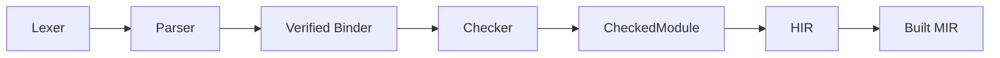

---
paths:
  - "products/zomlang/compiler/**"
---

# Compiler Pipeline Rules

> Applies to `lexer/`, `parser/`, `ast/`, `binder/`, `checker/`, `type/`,
> `identity/`, `hir/`, `mir/`, `ir/`, `diagnostics/`, and `driver/`. See
> `.agents/skills/spec-alignment/SKILL.md` for
> the five-way consistency check between spec and implementation.

---

## Pipeline Contract

**Each phase's output is the single source of truth for the next phase.**
Phase N must not reach back into phase N-1's state after transition. Cross-phase
coordination happens via well-defined types.

---

## Lexer (`lexer/`)

### Rules

1. **Canonical lexer spec lives in `docs/spec/ZomLexer.g4`** — the C++ lexer in
   `lexer.cc` is a hand-rolled implementation of *that* grammar, not the other
   way around. Any token added to `lexer.cc` must first be added to `ZomLexer.g4`
   and the lexical-structure chapter.
2. Multi-character operators are dispatched from the first character's branch.
   Symmetric rule: for each two-character operator, the handler lives inside the
     `case <first-char>` branch and consumes **exactly** the right number of bytes.
3. All keywords live in `ast/kinds.h` between `FirstKeyword` and `LastKeyword`.
   Never hard-code string comparisons in `lexer.cc` — use the centralized lookup.
4. Lexer never produces a partial token or falls back to `Identifier` for a
   malformed but recognizable operator. Emit a `ZOMxxxx` diagnostic instead.

### Audit Checklist (Spec ↔ Lexer)

- [ ] Every `ERROR_*` / `KEYWORD_*` / `OP_*` in `ZomLexer.g4` has a matching
      case in `lexer.cc` and a matching entry in `ast/kinds.h` and `token.cc`.
- [ ] Every reserved keyword listed in `02-lexical-structure.md` § Keywords is
      accepted by a current grammar path. A keyword with no grammar rule must be
      **deleted** from the reservation list per Rule #4 of design principles.

---

## Parser (`parser/`)

### Rules

1. **Canonical grammar lives in `docs/spec/chapters/17-grammar-reference.md`**.
   The parser in `parser.cc` is a hand-written recursive descent implementation
   of *that* EBNF. Parser changes require spec changes in the same commit.
2. Operator precedence table lives in `docs/spec/chapters/04-expressions.md`.
   The `binaryPrecedence()` switch in `parser-helpers.cc` must match it row by
   row. Any discrepancy is a P0 bug.
3. Postfix suffixes (EBNF `PostfixSuffix ::= '?!' | '!!' | '++' | '--'`) are
   handled in `parsePostfixExpressionAt`'s postfix loop. Every new postfix operator
   is added there, not sprinkled into outer levels.
4. `isVisibilityModifier()` and `isBehaviorModifier()` + the
   `VisibilityModifier` and `BehaviorModifier` EBNF productions + the lexical
   keyword table are a **three-way set**. `mut` is a declaration head and must
   never enter a modifier list.
5. Parser errors emit a `ZOMxxxx` diagnostic code, never a generic string.
   Diagnostic codes live in a centralized list; never invent ad-hoc string
   messages.

### Audit Checklist (Spec ↔ Parser)

- [ ] Every `Xxx ::=` EBNF production in chapter 17 has a matching
      `parseXxx(...)` entry point in the parser whose structure matches it.
- [ ] The precedence array in `parser.cc` and the precedence table in
      chapter 04 produce identical orderings for every operator.
- [ ] Postfix operators defined in `PostfixSuffix` are all consumed in the
      `parsePostfixExpressionAt` loop. No postfix operator is handled at a
      different (higher/lower) precedence level.
- [ ] Every `XFAIL` test under `tests/conformance/expectations/ast/**` has a ticket or tracking
      note. An `XFAIL` test whose root cause has been fixed must be upgraded
      (expectation corrected, `XFAIL` marker removed) immediately.

---

## AST (`ast/`)

### Rules

1. All syntax kinds live in `kinds.h` between `FirstToken` / `LastToken` and
   `FirstNode` / `LastNode` contiguous ranges. New kinds are inserted at the
   range boundary to keep the enum dense.
2. `ast-nodes.def` / `ast-builders.h` / visitor interfaces are generated or
   maintained 1:1 with `kinds.h`. Adding a kind to `kinds.h` requires updating
   every table that maps `SyntaxKind` to a handler.
3. AST nodes that have no parser entry point (dead nodes reserved for "future
   codegen") — either wire the parser path to construct them in this release,
   or **delete the node** per design principle #4. Dead AST kinds mislead
   auditors and spec writers.
4. AST dump / pretty-print utilities must round-trip cleanly for every construct.
   If a lit test FileCheck uses `CHECK-DAG` only because the order is
   non-deterministic, fix the order before merging.

---

## Binder (`binder/`) + Semantic Identity (`identity/`)

### Rules

1. **Scope trees are module-local.** Cross-module identity and visibility flow
   only through `VerifiedModuleGraph`, verified imports, immutable module
   interfaces, and branded canonical handles owned by `CompilerSession`.
2. Binder output is `VerifiedBoundModule` plus frozen inventories and typed
   metadata. Checker/HIR/MIR must not recover meaning from raw AST `NodeId`
   maps or construct a second lookup rail.
3. Name lookup order is documented in the modules chapter. Any deviation between
   the documented order and the implementation is a P0 bug.
4. Module export and member visibility facts must match Chapters 13 and 23
   exactly and be published through verified interfaces.

---

## Type Checker (`checker/`)

The checker consumes only verified binder input and the session-owned
`SemanticTypeStore`. It publishes immutable, revisioned facts and never exposes
mutable inference state to downstream phases.

### Non-Negotiable Architectural Constraints

1. **`CompilerSession`-scoped, never global.** No `static TypeStore` anywhere.
2. **Semantic identity is canonical.** Types, definitions, substitutions,
   witnesses, dispatch targets, and interfaces use branded IDs and canonical
   revisions rather than names, pointers, or table slots.
3. **Raises clauses flow through checker, not parser.** The parser accepts the
   annotation; the checker validates the actual error union, widening, and
   compatibility with `?` / `?!` propagation.
4. **Every fact family has a verifier and canonical codec.** Missing,
   additional, malformed, foreign-context, stale, or non-canonical facts fail
   closed before publication.
5. **Type errors use diagnostic codes.** A single "type mismatch" message is not
   enough. Each mismatch kind gets its own ZOM code + an auto-suggestion when
   feasible.

---

## Driver (`driver/`)

### Rules

1. Phase order in the driver matches the pipeline contract exactly. No back-edges
   (`parse` → `bind` → `parse again`), no skipping phases based on heuristics
   like "the source file has no generic so we can skip checker".
2. `CompilerSession` is the single owner of `SourceManager`, `DiagnosticEngine`,
   semantic identity registries, `SemanticTypeStore`, checked/borrow evidence
   repositories, verified module graph, and staged phase outputs. No phase
   constructs a competing authority.
3. Every phase is independently testable with a ztest:
   parser, binder, checker, HIR, and MIR tests all run against a minimal
   `CompilerSession` fixture without invoking the driver binary.
4. The driver must report how many `ZOMxxxx` errors were emitted for each
   category (lex / parse / bind / type) and exit with a distinct non-zero code
   per phase failure, so that lit / ztest can distinguish "parse error" from
   "semantic error" without grepping human-readable output.
