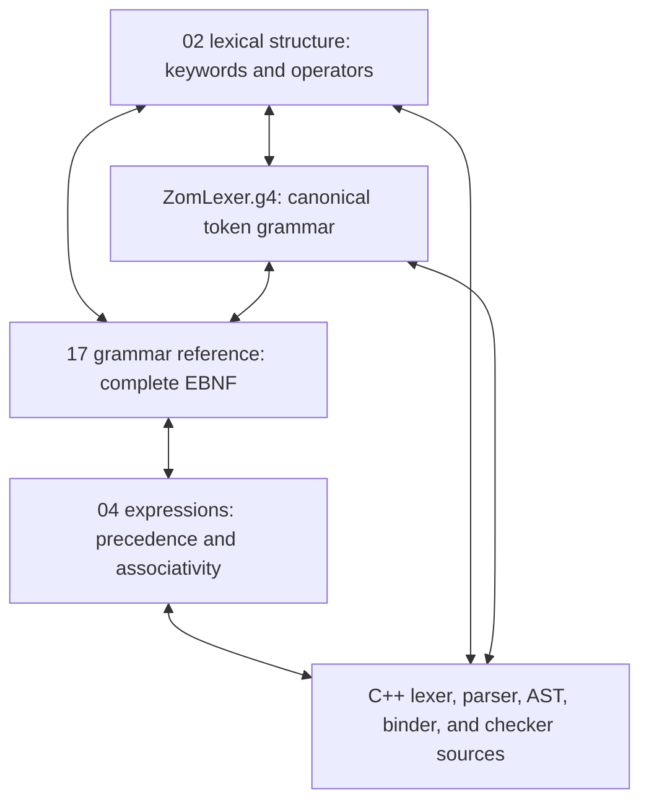

# Spec ↔ Implementation Alignment Skill

The automated enforcer of `.agents/rules/spec-alignment.md`. Invoke it
*before* merging any change that touches `docs/spec/**` or
`products/zomlang/compiler/{lexer,parser,ast,binder,checker}/**`.

---

## The Five Artifacts Under Lockstep

For every construct the five artifacts must **agree**. If any two disagree,
the skill reports it. This is not advisory — drift is a P0 bug.

---

## Step 1 — Inventory

Build two lists:

1. **Tokens & keywords present:**
   - From `ZomLexer.g4`: every `TOKEN_NAME` rule.
   - From `02-lexical-structure.md` § Keywords and § Operators & Punctuation.
   - From `ast/kinds.h`: every `SyntaxKind` between `FirstToken..LastToken`
     and `FirstKeyword..LastKeyword`.
   - From `lexer.cc` / `token.cc`: every case branch in the switch.
   - From the reserved-keyword list in `02-lexical-structure.md`.

2. **Grammar productions present:**
   - Every `Xxx ::= ...` EBNF in `17-grammar-reference.md`.
   - Every `parseXxx(...)` method in `parser.cc`.
   - Every `SyntaxKind` node between `FirstNode..LastNode` in `kinds.h`.
   - Every visibility and behavior modifier accepted by
     `isVisibilityModifier()` and `isBehaviorModifier()`, the
     `VisibilityModifier` and `BehaviorModifier` grammar productions, and the
     declaration tables in chapters 06 and 17.

---

## Step 2 — Diff

Compute these set differences. Every non-empty set → one finding.

| Check Set | Meaning | Severity if non-empty |
|---|---|---|
| `ZomLexer.g4 tokens \ ast/kinds.h` | Token in grammar but no SyntaxKind | 🟠 High |
| `ast/kinds.h tokens \ ZomLexer.g4` | Dead SyntaxKind / undocumented token | 🟡 Medium |
| `ZomLexer.g4 tokens \ lexer.cc cases` | Token not lexed (like ERR-001: `?!`) | 🔴 Critical when semantic depends on it; 🟠 High otherwise |
| `lexer.cc string compares ∉ kinds.h` | Keyword hard-coded in lexer, not in centralized enum | 🟠 High |
| `02 keywords \ parser acceptance paths` | Reserved keyword with no grammar rule and no "reserved for v2" note | 🟡 Medium → **delete** per Rule #4 |
| `EBNF productions \ parser entry points` | Grammar production with no recursive-descent path | 🟠 High |
| `parseXxx methods \ EBNF productions` | Parser parses something the spec doesn't describe | 🟠 High |
| `precedence table (04) Δ binaryPrecedence()` | Row-level mismatch for any operator | 🔴 Critical |
| `PostfixSuffix EBNF \ parsePostfixExpressionAt suffix loop` | Postfix op (e.g. `?!`) parsed at wrong precedence | 🔴 Critical |
| `visibility and behavior modifier sets Δ grammar Δ declaration tables` | Three-way set mismatch | 🟠 High per leg |

---

## Step 3 — Operator Precedence Deep Check

For every binary operator in `04-expressions.md` § Operator Precedence and
Associativity:

1. Confirm the operator exists in `ZomLexer.g4` and `kinds.h`.
2. Confirm `binaryPrecedence()` returns the exact numeric value
   implied by the table.
3. Confirm associativity (left vs right) is coded correctly in
   `parseBinaryExpressionAt` by checking the recursive minimum precedence for
   the operator's declared associativity.
4. Confirm a lit test exists that asserts the expected parse tree for an
   ambiguous expression that *would* nest differently under the wrong
   precedence (e.g. `a + b * c` vs `(a + b) * c`).

A mismatch on #2 or #3 alone → 🔴 Critical.

---

## Step 4 — Postfix Suffix Deep Check

The single most common drift in ZOM is postfix operators not being consumed
in the postfix loop, because "it compiles and seems to work."

For each symbol in `PostfixSuffix ::=` in the EBNF:

1. Is the token defined in `ZomLexer.g4` + `kinds.h`? (if no → error)
2. Is the token **actually produced** by the lexer for the right characters?
   (feed the operator into the lexer in a ztest and assert the token kind)
3. Is the case present in `parsePostfixExpressionAt`'s suffix loop
   body that loops over postfix suffixes? (if no → precedence error)
4. Does a lit test exist that verifies the correct precedence nesting
   against a hypothetical binary-operator-of-similar-priority?

Drift in this deep check → 🔴 Critical.

---

## Step 5 — Diagnostic Code Inventory

1. Build the set of all `ZOMxxxx` codes *defined* in the diagnostic registry.
2. Build the set of all `ZOMxxxx` codes *emitted* anywhere in the compiler.
3. Build the set of all `ZOMxxxx` codes *asserted* in tests (FileCheck
   `CHECK: ZOMxxxx` or ztest `EXPECT_DIAG(... Kind::ZOMxxxx)`).

For every code in each pairwise difference:

| Set | Meaning | Action |
|---|---|---|
| `defined \ emitted` | Dead code → delete per Rule #4. | Delete in same PR, or add a comment with a ticket linking to the *planned* parser/binder path that will emit it. |
| `emitted \ defined` | Undefined ad-hoc error string → blocker. | Add the code to the registry, write a one-line headline, re-use it consistently. |
| `emitted \ asserted` | Code exists but no test ever verifies it. | Add a minimal ztest / lit test. |

---

## Exit Criteria

All sets in Steps 2, 3, 4, 5 are empty **or** every non-empty element has
a filed tracked issue with a target milestone and is referenced in the
relevant `// TODO(ticket-123): ...` comment directly at the drift site.
"TODO: fix later" without ticket ID → block on review.

After running alignment, always re-run `/skill build-ci` end-to-end because
the fixes typically touch lexer/parser and can ripple through lit tests.
