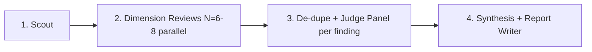

# Ultracode Audit Skill

Invokes the **multi-phase adversarial audit pipeline** against a given area
of ZOM. Each run produces a standalone Markdown report in
`docs/reports/zom-<area>-audit-YYYY-MM-DD.md` with standardized frontmatter.

**Use this skill when:**

- A critical subsystem (`lexer`, `parser`, `binder`, `checker`, `symbol`,
  `error system`, `concurrency`, `runtime`) has just been refactored or
  landed for the first time.
- The user asks "audit X", "check for bugs in Y", "are there gaps in Z?".
- Before tagging a release, or before merging a change that crosses a
  phase boundary (e.g. adding the first checker phase).

**Do not run it on tiny changes** (single test fix, comment, docs-only) —
the audit is expensive (dozens of agents, ~hundreds of thousands of
tokens). Reserve it for meaningful subsystem milestones.

---

## Audit Scope Templates

Pick **one** area per run. Never mix unrelated areas into one audit —
each area has its own specialized finders.

| Audit Name | Area | Typical Prompt Scopes |
|---|---|---|
| `lexer` | Tokenizer, keyword/operator tables, `ZomLexer.g4` alignment | Lexer correctness, reserved-keyword drift, multi-char operator dispatch, literal parsing |
| `parser` | Grammar, precedence, postfix operators, `17-grammar-reference.md` EBNF alignment | Acceptance of valid input, rejection of invalid input, precedence drift, visitor exhaustiveness |
| `binder-checker` | `binder/`, `symbol/`, future `checker/` | Scope leaks, `Export` flag writes, name-lookup ordering, trait-system correctness |
| `error-system` | `?!`/`!!` lexing, raising clauses, `diagnostic/`, ZOMxxxx code inventory | ERR-001 style drift, code reuse, diagnostic wording contract, parser ↔ checker raising handoff |
| `module-system` | Imports, paths, re-exports, visibility, cross-session registry | MOD-001 … MOD-008 style findings, CompilerSession cross-module identity |
| `concurrency` | Runtime task graph, Sendable, actors, futures, cancellation | 20-classic-pitfall radar, memory model, drop semantics in async context |
| `runtime-memory` | `zc/` memory, ownership, Pimpl, raw-pointer hygiene, FFI boundary leaks | UAF, double-free, dangling slices, global state |
| `spec-alignment` | Five-way diff between spec chapters, `.g4`, EBNF, C++ sources, tests | All drift-style findings aggregated into one report |

**Custom areas** are allowed — but still, one area per run. Pass a precise
scope description as the `scope` argument to the workflow (see below).

---

## Pipeline Phases

Each audit runs in four sequential phases. The script orchestrating this
lives under `.claude/workflows/` (or is inlined into a Workflow tool call
at invocation time).



**Phase 1 — Scout (1 agent).** Reads the relevant directories, builds an
inventory of files, enumerates entry points, spots the obvious quick wins.
Produces a structured list of initial hypotheses.

**Phase 2 — Dimension Reviews (6–8 parallel agents).** Each agent is given
a different expert lens and told to **find real bugs, not style nits**.
Lenses include: correctness, spec drift, security/safety, performance,
test coverage gaps, API ergonomics, P0 blocker severity, and a "contrarian"
lens that tries to *disprove* the scout findings. Each produces a list of
findings with severity and evidence.

**Phase 3 — De-dupe + adversarial per-finding verification.** We dedupe all
findings from Phase 2 by `(file, line, conceptual-bug)` key, then for
**every surviving finding**, we spawn N=3 independent "refuter" agents
that are told "this finding is false — try to disprove it."

- ≥ 2/3 confirm the finding → survives.
- ≥ 2/3 reject the finding → dropped.
- Split → we keep the finding but downgrade it and tag "needs human review."

**Phase 4 — Synthesis (1 agent + human final pass).** Aggregates all
survived findings into `docs/reports/zom-<area>-audit-YYYY-MM-DD.md`,
ordered by severity, with:

- a standardized frontmatter (`audit`, `date`, `scope`, `method`,
  `runtime`, `workflowId`, `knownRuntimeIssues`, `relatedReports`);
- an executive summary with severity counts and a completion radar;
- per-finding: ID, severity, title, files touched, description, evidence,
  reproducer steps when applicable, judge-panel remarks;
- a P0 / P1 / P2 action-items table sorted by estimated effort vs. impact;
- cross-references to prior related audits.

---

## Invocation Snippet

```
ultracode: on  →  Workflow tool with a script that encodes the four phases
                  above and takes { area, scope, focus_findings?, baseline_report? }
                  as input args.
```

When running, log the workflow ID (`wf_*`) so a later invocation can
reference it via `resumeFromRunId` to continue from a cached Phase 2 if
Phase 3/4 need re-tuning.

---

## Severity Scale

| Severity | Meaning | Default Action |
|---|---|---|
| 🔴 **Critical** | Blocks the next release; data corruption / exploitable UB / silent wrong code | Fix in the same release cycle. Do not ship. |
| 🟠 **High** | Wrong behavior in a common path with no workaround | P0; assign to an owner before closing the audit PR. |
| 🟡 **Medium** | Wrong behavior with a workaround, or undocumented edge case | P1; fix within two milestones. |
| 🟢 **Low** | Ergonomic issue, dead code, misleading diagnostic wording | P2; batch with other cleanup. |
| 🔵 **Info** | Observation with no direct fix required, or a recommendation | Track only; no blocking action. |

---

## Report Hygiene

- **Never edit a published audit report** except to append a
  `### Post-publication updates` section linking to fix commits or
  findings that were later re-classified.
- Do **not** carry old findings forward into a newer report by copy/paste.
  Re-run the audit; if a finding survives two audits consecutively it's a
  real, open bug — its existence in the fresh report is the signal.
- Frontmatter `relatedReports` must reference the *previous* audit of the
  same area (if any) to form a chain readers can follow.
- The final human pass (before committing) confirms: no P0/🔴 finding is
  missing a concrete file + line reference, and the reproducer command
  (when given) actually runs against HEAD.
