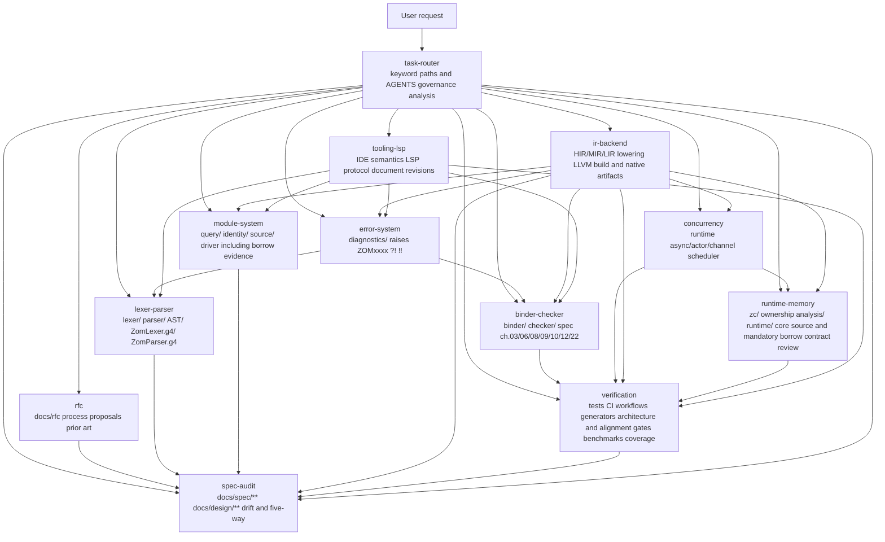

# ZOM Subagents

This directory contains 12 specialized subagents used by ZOM's AI prompt system.
They are registered in `manifest.yaml` and routed to by the `task-router`
subagent based on keywords and path ownership.

---

## Routing Diagram



---

## Trigger Matrix

Use this table when routing manually, or when checking whether `task-router`
made the right choice. A `✅` means the subagent *explicitly owns* this
surface; `↗` means it escalates to another subagent after doing its part.

| Topic \ Subagent | task-router | rfc | lexer-parser | binder-checker | module-system | error-system | concurrency | ir-backend | spec-audit | runtime-memory | verification | tooling-lsp |
|---|---|---|---|---|---|---|---|---|---|---|---|---|
| RFC or proposal | ✅ route → | ✅ | ↗ if syntax/AST | ↗ if semantics | ↗ if modules | ↗ if errors | ↗ if async | ↗ if IR/backend | ↗ if spec | ↗ if runtime | ↗ test plan | ↗ if tooling |
| Grammar change | ✅ route → | ↗ if design needed | ✅ | | | ↗ touches diagnostics | | | ✅ audit drift | | ↗ regen tests | ↗ if recovery syntax |
| Token not lexed | ✅ route → | | ✅ | | | ↗ ZOMxxxx codes | | | ✅ | | | |
| Type mismatch message | ✅ route → | ↗ if language rule changes | | ✅ | | ↗ owns codes | | | ✅ | | ↗ add test | ↗ hover and IDE diagnostics |
| `import` resolution bug | ✅ route → | ↗ if module contract changes | | ↗ binder | ✅ | | | ↗ imported identity | ✅ | | ↗ add test | ↗ navigation |
| Standard prelude distribution and marker authority | ✅ route → | ✅ status and tracker | | ↗ shape and policy | ✅ manifest, admission, session, and driver file ownership | ↗ diagnostic registry | | ✅ CMake, install, and zomc layout | ✅ spec alignment | ✅ source declarations and mandatory borrow contract review | ✅ native tests and fixed core-library gate | |
| Semantic identity or source provenance | ✅ route → | ↗ if contract changes | ✅ parsed origin and AST producer inventory | ↗ identity consumer | ✅ identity/source owner | ↗ invariant codes | | ↗ IR handles and build wiring | ✅ | ↗ lifetime boundary | ✅ architecture gate and permutation tests | ↗ editor source mapping |
| Incremental query runtime, red-green reuse, or projection shielding | ✅ route → | ↗ if contract changes | ↗ parse provider | ↗ semantic provider | ✅ query database and identity owner | ↗ diagnostic facts | ↗ cancellation interaction | ↗ CMake direction | ✅ architecture drift | ↗ lifetime boundary | ✅ gates, descriptor generator, adversaries, and benchmarks | ↗ request snapshots |
| `?!` operator missing | ✅ route → | ↗ if semantics change | ✅ lex+parse | | | ✅ error semantics | | ✅ lowering | ✅ | ↗ panic ABI | ↗ lit test | |
| Forced cast `as!` | ✅ route → | ↗ if contract changes | ✅ syntax + AST mode | ✅ `ForcedChecked` fact | | ✅ panic mapping | ↗ task/suspend boundary | ✅ check-once + failure edge | ✅ five-way | ✅ panic ABI | ✅ mode + lowering matrix | ↗ hover and diagnostics |
| New trait (`Sendable`) | ✅ route → | ✅ design intake | | ✅ core owner | | | ↗ concurrency layer | ↗ erase/lower | ✅ | | ↗ add test | ↗ completion and hover |
| Async task graph | ✅ route → | ✅ design intake | | | | ↗ task errors | ✅ | ✅ state lowering | ✅ | ↗ memory layer | ↗ tests | ↗ IDE semantics |
| Ownership, drop, or Chapter 14 | ✅ route → | ↗ if contract changes | | ↗ type legality | | ↗ panic/error boundary | ↗ task interaction | ↗ MIR/LIR lowering | ✅ | ✅ primary owner | ↗ tests | ↗ diagnostics and hover |
| Ownership-event overlay or ownership analysis | ✅ route → | ↗ if contract changes | | ↗ supplies checked facts | ↗ supplies bound-module lease | ↗ invariant diagnostics | ↗ concurrency boundary | ↗ supplies Built MIR | ✅ audit drift | ✅ primary file and lifecycle owner | ✅ lineage, coverage, and sanitizer gates | |
| Borrow-evidence imported-interface boundary | ✅ route → | ↗ if contract changes | | ↗ semantic facts | ✅ primary file owner | ↗ invariant diagnostics | | ↗ HIR/MIR consumer | ✅ audit drift | ✅ mandatory ownership and lifetime review | ✅ adversarial tests and gates | |
| HIR/MIR/LIR change | ✅ route → | ↗ if contract changes | | ↗ semantic facts | ↗ module identity | ↗ error ops | ↗ async ops | ✅ | ↗ spec claims | ↗ ABI/runtime | ↗ verifier/tests | |
| LLVM/object emission | ✅ route → | ↗ if contract changes | | | ↗ module artifacts | | | ✅ | | ↗ ABI/runtime | ↗ artifact tests | |
| LLVM build and CI contract | ✅ route → | ↗ if contract changes | | | | | | ✅ CMake and link inventory | | | ✅ workflows and negative configure gates | |
| Developer build documentation | ✅ `AGENTS.md` governance | ↗ if contract changes | | | | | | ↗ supplies LLVM contract | | | ✅ `README.md` and executable commands | |
| Compiler architecture documentation | ✅ route → | ↗ if contract changes | | | | | | ↗ IR/backend architecture | ✅ `docs/design/**` except tooling | | ↗ validates evidence | ✅ `docs/design/tooling/**` |
| Raw pointer in zc | ✅ route → | ↗ if policy changes | | | | | | ↗ lowered pointer | | ✅ | | |
| Spec drift found | ✅ route → | | | | | | | | ✅ | | | |
| Lit test XFAIL expired | ✅ route → | | | | | | | | | | ✅ | |
| Coverage regression | ✅ route → | | | | | | | | | | ✅ | |
| RFC 0016 coverage CMake plumbing, runner, checker, inputs, and reports | ✅ route → | ↗ if contract changes | | | | | | ↗ supplies compiler path census | | | ✅ primary owner | |
| RFC 0017 incremental-query gate, corpus, runner, and baseline | ✅ route → | ↗ if contract changes | | ↗ supplies Binder facts | ↗ supplies query contracts | ↗ supplies diagnostic facts | ↗ stress interaction | ↗ supplies CMake DAG | ↗ design audit | | ✅ primary owner | ↗ snapshot consumers |
| LSP or IDE feature | ✅ route → | ↗ if contract changes | ↗ recovery syntax | ↗ semantic facts | ↗ query snapshots | ↗ diagnostics | ↗ cancellation semantics | | ↗ tooling design | | ↗ protocol and fixture gates | ✅ |

Path ownership and contract review are distinct where the table names a
mandatory reviewer. `module-system` owns files under `compiler/driver`,
including `borrow-evidence.{h,cc}`; `runtime-memory` reviews their ownership and
lifetime contracts without taking file ownership.
`runtime-memory` is the primary owner of
`products/zomlang/compiler/ownership/**`. Specialized semantic and
grammar owners retain their listed specification paths, while `spec-audit`
remains the cross-cutting drift owner for all of `docs/spec/**`.
`tooling-lsp` is the primary owner of `docs/design/tooling/**`; `spec-audit`
reviews that subtree only for cross-cutting drift.
`verification` is the primary owner of
`scripts/generate-query-descriptor-schema.py` and
`scripts/check-query-descriptor-architecture.py`.

---

## Subagent Template

Every `<id>.md` file in this directory follows the same sections.
If you add a new subagent, copy this template:

```markdown
# `<id>` — <Short Human Name>

## Mission

One sentence: what is this subagent responsible for, and what makes it
different from every other subagent.

## Use When

Route here when **any** of these are true:

- bullet list of concrete trigger conditions
- ...

Do **not** route here when:

- conditions that look similar but belong to another subagent

## Owns

```
glob1
glob2
```

## Review Checklist (applies to every PR this subagent touches)

- [ ] checklist item
- [ ] ...

## Required Evidence Before Closing

- [ ] `cmake --build --preset sanitizer` passes
- [ ] `ctest --preset default` passes
- [ ] Format: `python scripts/check-format.py` clean
- [ ] Additional area-specific evidence items ...

## Block Conditions (auto-escalate to `escalation-to` when hit)

- Condition → escalate to `<id>`
- ...
```
