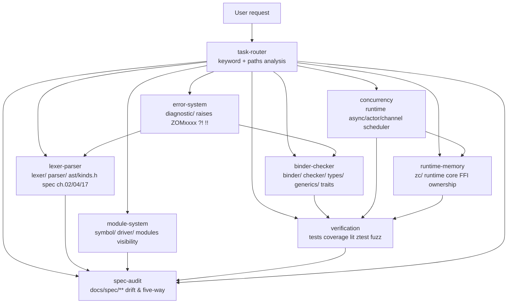

# ZOM Subagents

This directory contains 9 specialized subagents used by ZOM's AI prompt system.
They are registered in `manifest.yaml` and routed to by the `task-router`
subagent based on keywords and path ownership.

---

## Routing Diagram



---

## Trigger Matrix

Use this table when routing manually, or when checking whether `task-router`
made the right choice. A `✅` means the subagent *explicitly owns* this
surface; `↗` means it escalates to another subagent after doing its part.

| Topic \ Subagent | task-router | lexer-parser | binder-checker | module-system | error-system | concurrency | spec-audit | runtime-memory | verification |
|---|---|---|---|---|---|---|---|---|---|
| Grammar change | ✅ route → | ✅ | | | ↗ touches diagnostics | | ✅ audit drift | | ↗ regen tests |
| Token not lexed | ✅ route → | ✅ | | | ↗ ZOMxxxx codes | | ✅ | | |
| Type mismatch message | ✅ route → | | ✅ | | ↗ owns codes | | ✅ | | ↗ add test |
| `import` resolution bug | ✅ route → | | ↗ binder | ✅ | | | ✅ | | ↗ add test |
| `?!` operator missing | ✅ route → | ✅ lex+parse | | | ✅ error semantics | | ✅ | | ↗ lit test |
| New trait (`Sendable`) | ✅ route → | | ✅ core owner | | | ↗ concurrency layer | ✅ | | ↗ add test |
| Async task graph | ✅ route → | | | | ↗ task errors | ✅ | ✅ | ↗ memory layer | ↗ tests |
| Raw pointer in zc | ✅ route → | | | | | | | ✅ | |
| Spec drift found | ✅ route → | | | | | | ✅ | | |
| Lit test XFAIL expired | ✅ route → | | | | | | | | ✅ |
| Coverage regression | ✅ route → | | | | | | | | ✅ |

---

## Subagent Template

Every `<id>.md` file in this directory follows the same sections.
If you add a new subagent, copy this template:

```markdown
# `<id>` — <Short Human Name>

## Mission

One sentence: what is this subagent responsible for, and what makes it
different from every other subagent.

## Use When

Route here when **any** of these are true:

- bullet list of concrete trigger conditions
- ...

Do **not** route here when:

- conditions that look similar but belong to another subagent

## Owns

```
glob1
glob2
```

## Review Checklist (applies to every PR this subagent touches)

- [ ] checklist item
- [ ] ...

## Required Evidence Before Closing

- [ ] `cmake --build --preset sanitizer` passes
- [ ] `ctest --preset default` passes
- [ ] Format: `python scripts/check-format.py` clean
- [ ] Additional area-specific evidence items ...

## Block Conditions (auto-escalate to `escalation-to` when hit)

- Condition → escalate to `<id>`
- ...
```
