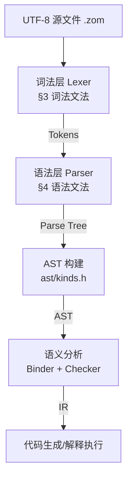

# 设计维度 1：语法层规范 EBNF v1.0.0

> 本文件是 ZOM 语言语法层的**唯一权威真相源**。所有词法器、解析器、AST 定义、诊断系统、
> LSP、文档生成都必须与本文件保持一致。本文件取代
> `docs/spec/chapters/17-grammar-reference.md` 作为规范引用。
>
> 语法格式：扩展巴科斯-瑙尔形式（EBNF）。元符号：`::=` 定义、`|` 选择、`(...)` 分组、
> `*` 零或多次、`+` 一或多次、`?` 零或一次、`[...]` 字符集合、`'...'` 字面量、
> `(* ... *)` 注释。

---

## 目录

1. [总体设计原则](#1-总体设计原则)
2. [五层架构映射](#2-五层架构映射)
3. [词法文法 Lexical Grammar](#3-词法文法-lexical-grammar)
4. [语法文法 Syntactic Grammar](#4-语法文法-syntactic-grammar)
   - 4.1 [程序与模块](#41-程序与模块)
   - 4.2 [导入与导出](#42-导入与导出)
   - 4.3 [声明 Declarations](#43-声明-declarations)
   - 4.4 [类型表达式 Type Expressions](#44-类型表达式-type-expressions)
   - 4.5 [语句 Statements](#45-语句-statements)
   - 4.6 [表达式 Expressions](#46-表达式-expressions)
   - 4.7 [模式 Patterns](#47-模式-patterns)
   - 4.8 [属性与注解 Attributes and Annotations](#48-属性与注解-attributes-and-annotations)
   - 4.9 [并发语法 Concurrency](#49-并发语法-concurrency)
5. [运算符优先级与结合性表](#5-运算符优先级与结合性表)
6. [关键字与保留字清单](#6-关键字与保留字清单)
7. [语法漂移修正记录](#7-语法漂移修正记录)
8. [五向一致性索引](#8-五向一致性索引)
9. [验证示例库](#9-验证示例库)

---

## 1. 总体设计原则

| 原则 | 描述 |
|---|---|
| **P1 无歧义** | 每个产生式左部与产生式体一一映射；LL(k) 或可通过语义谓词在单个前瞻性 token 内消解；不保留 GLR 多义路径。 |
| **P2 零-color 并发** | 函数签名不含 `async`/`await`；挂起是控制流内部行为；仅新增 `suspend`/`spawn` 两个关键字，其余并发工具是库函数/属性。 |
| **P3 显式错误流** | 无隐式异常传播；`raises` 在签名中显式列出所有错误类型；错误控制流走 `return` + 模式匹配。 |
| **P4 纯静态模块** | 模块名是符号路径而非字符串；无运行时/条件/通配符导入；导入/导出位于文件顶级。 |
| **P5 可线性化语法** | 结构体/枚举/类成员声明必须可在单行扫视内完成语义归类，禁止用缩进/花括号外的语义上下文消除歧义。 |
| **P6 最小保留字** | 仅保留已实现或在本文档中以 "reserved for v2" 明确说明的词；其它一律删除。 |
| **P7 属性闭合** | 编译器只识别 `#[zom::*]` 与 `#[deprecated]`/`#[inline]`/`#[cold]` 命名空间下的白名单属性，其它属性一律作为元数据透传并给出未识别 lint。 |

---

## 2. 五层架构映射



| 层 | 本文件对应章节 | 对应文件路径 |
|---|---|---|
| UTF-8 编码 | §3.1 源文件字符 | 词法器 `compiler/lexer/` |
| 词法 | §3.2–§3.7 | `ZomLexer.g4`（必须同步） |
| 语法 | §4 全部 | `ZomParser.g4`（必须同步） |
| AST 种类映射 | §8 五向一致性索引 | `include/zom/ast/kinds.h` |
| 运算符优先级 | §5 | `docs/spec/chapters/04-expressions.md` 第 363–386 行 |

---

## 3. 词法文法 Lexical Grammar

### 3.1 源文件字符

```ebnf
SourceCharacter ::= (* 任意 Unicode 标量值 U+0000..U+10FFFF，但不包括代理项 U+D800..U+DFFF *)
```

- 源文件必须以 UTF-8 编码，文件扩展名 `.zom`。
- 允许在文件开头出现零宽度不换行空格（BOM，`U+FEFF`），不计入语法语义。

### 3.2 格式控制字符

```ebnf
ZWNJ   ::= U+200C   (* Zero Width Non-Joiner，允许出现在标识符中 *)
ZWJ    ::= U+200D   (* Zero Width Joiner，允许出现在标识符中 *)
ZWNBSP ::= U+FEFF   (* 除文件开头外，视为空白 *)
```

### 3.3 空白与行终止符

```ebnf
Whitespace        ::= U+0009 (* TAB *) | U+000B (* VT *) | U+000C (* FF *)
                    | U+0020 (* Space *) | U+00A0 | U+1680
                    | U+2000..U+200A | U+202F | U+205F | U+3000 | ZWNBSP

LineTerminator    ::= U+000A (* LF *) | U+000D (* CR *)
                    | U+2028 (* LS *) | U+2029 (* PS *)
LineTerminatorSeq ::= LF | CR LF | CR {下一个字符不是 LF} | LS | PS
```

### 3.4 注释

```ebnf
SingleLineComment ::= '//' (~ LineTerminator)*
MultiLineComment  ::= '/*' ( MultiLineCommentChar | MultiLineComment )* '*/'
MultiLineCommentChar ::= ~ ('*' | '/') | '*' ~ '/' | '/' ~ '*'
                    (* MultiLineComment 不可嵌套；由词法器状态机保证闭合 *)
```

### 3.5 标识符

```ebnf
IdentifierName ::= IdentifierStart IdentifierPart*

IdentifierStart ::= UnicodeIDStart
                  | '$'
                  | '_'
                  | '\' UnicodeEscapeSequence
IdentifierPart  ::= UnicodeIDContinue
                  | '$'
                  | ZWNJ | ZWJ
                  | '\' UnicodeEscapeSequence

UnicodeIDStart    ::= (* Unicode Derived Core Property `ID_Start` *)
UnicodeIDContinue ::= (* Unicode Derived Core Property `ID_Continue` *)

Identifier     ::= IdentifierName   (* 但不能是 ReservedWord，见 §6 关键字表 *)
BindingIdent   ::= Identifier       (* 绑定位置专用，与 Identifier 同形 *)
```

> 说明：`$` 作为合法标识符字符，支持 FFI、代码生成器产物等场景。`_` 单独出现时，
> 在声明/绑定位置表示通配绑定（Wildcard），在表达式位置不是合法标识符（由解析器在对应产生式处处理）。

### 3.6 字面量

#### 3.6.1 Null 与 Boolean

```ebnf
NullLiteral    ::= 'null'
BooleanLiteral ::= 'true' | 'false'
```

#### 3.6.2 数值字面量

```ebnf
NumericLiteral ::= DecimalLiteral
                 | BinaryLiteral
                 | OctalLiteral
                 | HexLiteral
                 | BigIntLiteral

DecimalLiteral ::= DecimalIntegerLiteral ('.' DecimalDigits?)? ExponentPart?
                 | '.' DecimalDigits ExponentPart?
                 | DecimalIntegerLiteral ExponentPart?

DecimalIntegerLiteral ::= '0'
                        | NON_ZERO_DIGIT ( NUM_SEP? DECIMAL_DIGIT )*

DecimalDigits  ::= DECIMAL_DIGIT ( NUM_SEP? DECIMAL_DIGIT )*
ExponentPart   ::= [eE] SignedInteger
SignedInteger  ::= ('+' | '-')? DecimalDigits

BinaryLiteral  ::= '0' [bB] BinaryDigits
BinaryDigits   ::= BINARY_DIGIT ( NUM_SEP? BINARY_DIGIT )*

OctalLiteral   ::= '0' [oO] OctalDigits
OctalDigits    ::= OCTAL_DIGIT  ( NUM_SEP? OCTAL_DIGIT  )*

HexLiteral     ::= '0' [xX] HexDigits
HexDigits      ::= HEX_DIGIT    ( NUM_SEP? HEX_DIGIT    )*

BigIntLiteral  ::= DecimalDigits 'n'   (* 例如 123n *)

NUM_SEP        ::= '_'            (* 数字分隔符，不能出现在首位或末位 *)
DECIMAL_DIGIT  ::= [0-9]
NON_ZERO_DIGIT ::= [1-9]
BINARY_DIGIT   ::= [01]
OCTAL_DIGIT    ::= [0-7]
HEX_DIGIT      ::= [0-9a-fA-F]
```

#### 3.6.3 字符串字面量

```ebnf
StringLiteral  ::= '"' DoubleStringChar* '"'
                 | "'" SingleStringChar* "'"

DoubleStringChar ::= ~ ['"', '\', LineTerminator]
                   | LineTerminator        (* 多行字符串字面量原生允许 *)
                   | '\' EscapeSequence
                   | LineContinuation

SingleStringChar ::= ~ [''', '\', LineTerminator]
                   | LineTerminator
                   | '\' EscapeSequence
                   | LineContinuation

EscapeSequence ::= CharacterEscapeSeq
                 | '\' '0'   (* 空终止符 U+0000，前提是其后不紧跟十进制数字 *)
                 | HexEscapeSeq
                 | UnicodeEscapeSeq

CharacterEscapeSeq ::= '\' [\'"\\bfnrtv0]
                    | '\' NON_ESCAPE_CHAR   (* 保留转义，诊断：未识别转义序列 *)
NON_ESCAPE_CHAR  ::= ~ ['"', ''', '\', 'b', 'f', 'n', 'r', 't', 'v', '0',
                        'x', 'u', LineTerminator]

HexEscapeSeq     ::= '\x' HEX_DIGIT HEX_DIGIT
UnicodeEscapeSeq ::= '\u' HEX_DIGIT HEX_DIGIT HEX_DIGIT HEX_DIGIT
                   | '\u{' HEX_DIGIT+ '}'   (* 范围 U+0000..U+10FFFF *)

LineContinuation ::= '\' LineTerminatorSeq   (* 物理换行连接，不产生字符值 *)
```

#### 3.6.4 字符字面量

```ebnf
CharacterLiteral ::= "'" CharContent "'"
CharContent      ::= ~ [''', '\', LineTerminator]
                   | '\' EscapeSequence
                   (* 必须恰好包含一个 Unicode 标量值；零个或多个是词法错误 *)
```

#### 3.6.5 模板字面量

```ebnf
TemplateLiteral    ::= NoSubTemplate
                     | TemplateHead TemplateSpan+

NoSubTemplate      ::= '`' ( TemplateChar | TemplateEscape )* '`'
TemplateHead       ::= '`' ( TemplateChar | TemplateEscape | '$' ~ '{' )* '${'
TemplateMiddle     ::= '}' ( TemplateChar | TemplateEscape | '$' ~ '{' )* '${'
TemplateTail       ::= '}' ( TemplateChar | TemplateEscape )* '`'

TemplateChar       ::= ~ ['`', '\', '$']
TemplateEscape     ::= '\' SourceCharacter
                     (* TemplateSpan 内 ${...} 之间嵌入完整 Expression *)
```

### 3.7 标点符号与操作符

```ebnf
Punctuator ::=
    '{' | '}' | '(' | ')' | '[' | ']'
  | '.' | '...' | ';' | ',' | ':' | '::'   (* 新增 :: 用于属性命名空间 *)
  | '?' | '?!' | '!!' | '?.'
  | '+' | '-' | '*' | '/' | '%' | '**'
  | '++' | '--'
  | '<<' | '>>' | '>>>'
  | '<' | '>' | '<=' | '>='
  | '==' | '!=' | '===' | '!=='
  | '&' | '|' | '^' | '!' | '~'
  | '&&' | '||' | '??' | '?:'     (* ?: 相邻无空白才形成错误默认操作符 *)
  | '=' | '+=' | '-=' | '*=' | '/=' | '%=' | '**='
  | '<<=' | '>>=' | '>>>=' | '&=' | '|=' | '^='
  | '&&=' | '||=' | '??='
  | '=>' | '->'
  | '@' | '#[' | ']'   (* 属性相关；#[ 是复合 token，中间不可有空白 *)
```

> 关键说明：
> - `?` + `:` 相邻且中间无空白时被词法器识别为单个 `?:` 操作符（Error Default）；
>   否则被视为两个独立 token，用于三元条件表达式 `cond ? a : b`。该规则与
>   `ZomParser.g4:440` 的 `QUESTION COLON` 语义谓词一致。
> - `#[` 是属性开始复合 token，之后接 `命名空间::名字(参数)` 或 `命名空间::名字 = 字面量`。
> - `::` 用于属性命名空间分隔（例如 `zom::inline`），与成员访问 `.` 不冲突。

---

## 4. 语法文法 Syntactic Grammar

### 4.1 程序与模块

```ebnf
Program     ::= SourceFile
SourceFile  ::= ModuleDecl? TopLevelItem*

ModuleDecl  ::= 'module' ModuleName ';'
ModuleName  ::= Identifier ('.' Identifier)*

TopLevelItem ::= ImportDecl
               | ExportDecl
               | AttrDecl* Declaration
               | AttrDecl* StatementListItem
```

约束：
- `ModuleDecl` 至多出现一次，且必须是第一条非注释非属性语句。
- `ImportDecl` 只能出现在顶级，不能出现在块/函数内部（见 §P4）。

### 4.2 导入与导出

```ebnf
(* ============ Import ============ *)
ImportDecl       ::= 'import' ImportClause ';'
ImportClause     ::= ModuleImportClause | NamedImportClause
ModuleImportClause ::= ModuleName ( 'as' Identifier )?
NamedImportClause  ::= ModuleName '.' '{' ImportSpecList? '}'
ImportSpecList   ::= ImportSpec (',' ImportSpec)* ','?
ImportSpec       ::= Identifier ( 'as' Identifier )?

(* ============ Export ============ *)
ExportDecl       ::= 'export' Declaration                  (* 声明点导出，推荐形式 *)
                   | 'export' ExportClause ';'              (* 集中式导出列表 *)

ExportClause     ::= LocalExportClause | ReexportClause
LocalExportClause ::= '{' ExportSpecList? '}'
ReexportClause   ::= ModuleName '.' '{' ExportSpecList? '}'
ExportSpecList   ::= ExportSpec (',' ExportSpec)* ','?
ExportSpec       ::= Identifier ( 'as' Identifier )?
```

> 未出现：`import *`、`export default`、字符串路径 `import "a/b"`。这些被 §P4 显式排除。

### 4.3 声明 Declarations

```ebnf
Declaration ::= VariableStatement
              | FunctionDecl
              | ClassDecl
              | StructDecl
              | InterfaceDecl
              | EnumDecl
              | ErrorDecl
              | AliasDecl
```

#### 4.3.1 变量声明

```ebnf
VariableStatement  ::= 'let' VariableDeclList ';'
                     | 'const' VariableDeclList ';'

VariableDeclList   ::= VariableDecl (',' VariableDecl)*
VariableDecl       ::= ( BindingIdent | BindingPattern ) TypeAnnotation? Initializer?
                     (* const + BindingPattern 必须有 Initializer；const + BindingIdent 必须有 Initializer
                        let + 模式无 Initializer 是错误 *)
Initializer        ::= '=' AssignmentExpression
```

#### 4.3.2 函数声明

```ebnf
FunctionDecl   ::= 'fun' BindingIdent TypeParameters? ParameterClause
                   ReturnType? FunctionBody

FunctionBody   ::= BlockStatement

ReturnType     ::= '->' TypeExpr RaisesClause?
RaisesClause   ::= 'raises' TypeList
TypeList       ::= TypeExpr ( '|' TypeExpr )*   (* 错误类型并集 *)

ParameterClause ::= '(' ParameterList? ')'
ParameterList   ::= Parameter (',' Parameter)* ','?
Parameter       ::= '...'? BindingIdent TypeAnnotation? Initializer?
                  (* '...' 表示 rest 参数，最多一个且必须位于末尾 *)
```

> 未出现：`async fun`、`fun ... -> T await`。见 §4.9 通过 `suspend`/`spawn` 进行零-color 并发。

#### 4.3.3 类声明

```ebnf
ClassDecl      ::= 'class' BindingIdent TypeParameters? ClassHeritage?
                   '{' ClassElement* '}'

ClassHeritage  ::= 'extends' TypeRef ( ',' InterfaceTypeList )?
                 | 'implements' InterfaceTypeList

ClassElement   ::= ';'
                 | Modifier* InitDecl
                 | Modifier* DeinitDecl
                 | Modifier* AccessorDecl
                 | Modifier* PropertyDecl
                 | Modifier* MethodDecl

Modifier       ::= 'public' | 'private' | 'protected'
                 | 'static' | 'readonly' | 'mutating' | 'override'
                 | 'abstract'

PropertyDecl   ::= ( 'let' | 'const' ) PropertyName
                    '?'? TypeAnnotation? Initializer? ';'
MethodDecl     ::= 'fun' PropertyName TypeParameters?
                    ParameterClause ReturnType?
                    ( BlockStatement | ';' )
InitDecl       ::= 'init' TypeParameters? ParameterClause
                    ReturnType? ( BlockStatement | ';' )
DeinitDecl     ::= 'deinit' ( BlockStatement | ';' )
AccessorDecl   ::= ( 'get' | 'set' ) PropertyName ParameterClause
                    ReturnType? ( BlockStatement | ';' )
```

> 说明：`abstract` 修饰符作用于类声明体中的方法或类本身；作用于方法时方法体必须省略（写 `;`）。

#### 4.3.4 结构体声明

```ebnf
StructDecl     ::= 'struct' BindingIdent TypeParameters? StructHeritage?
                   '{' StructElement* '}'

StructHeritage ::= 'implements' InterfaceTypeList
StructElement  ::= StructFieldDecl
                 | MethodDecl
                 | AccessorDecl

StructFieldDecl ::= PropertyName
                    ':' TypeExpr
                    ( '=' AssignmentExpression )?   (* 默认值 *)
                    ( ',' | ';' )?
```

#### 4.3.5 接口声明

```ebnf
InterfaceDecl  ::= 'interface' BindingIdent TypeParameters? InterfaceHeritage?
                   '{' InterfaceBody '}'

InterfaceHeritage ::= 'extends' InterfaceTypeList
InterfaceBody   ::= InterfaceElement*
InterfaceElement ::= ';'
                  | Modifier* ( 'let' | 'const' ) PropertySignature Initializer? ';'?
                  | Modifier* 'fun' MethodSignature ';'?

PropertySignature ::= PropertyName '?'? TypeAnnotation
MethodSignature   ::= PropertyName '?'? CallSignature
CallSignature     ::= TypeParameters? ParameterClause ReturnType?

InterfaceTypeList ::= TypeRef ( ',' TypeRef )*
TypeRef           ::= Identifier TypeArguments?
```

#### 4.3.6 枚举声明

```ebnf
EnumDecl       ::= 'enum' BindingIdent TypeParameters?
                   '{' EnumBody? '}'
EnumBody       ::= EnumMember ( ',' EnumMember )* ','?
EnumMember     ::= PropertyName
                   ( '=' AssignmentExpression   (* 显式关联值/原始值 *)
                   | TupleType                  (* 元组关联值 *)
                   )?
```

#### 4.3.7 错误声明

```ebnf
ErrorDecl      ::= 'error' BindingIdent TypeParameters? ErrorHeritage?
                   '{' ErrorBody? '}'
ErrorHeritage  ::= 'extends' TypeRef             (* 错误继承链 *)
ErrorBody      ::= ErrorField ( (',' | ';') ErrorField )* (',' | ';')?
ErrorField     ::= PropertyName ':' TypeExpr
                   ( '=' AssignmentExpression )?
```

> 错误声明本质是带 marker 的值类型；可与 `raises` 子句和 `match`/`is` 模式配合使用。
> 无 `throw` 关键字（§P3）。

#### 4.3.8 类型别名

```ebnf
AliasDecl      ::= 'alias' BindingIdent TypeParameters?
                   '=' TypeExpr ';'
```

### 4.4 类型表达式 Type Expressions

```ebnf
TypeExpr     ::= FunctionType | UnionType

UnionType       ::= IntersectionType ( '|' IntersectionType )*
IntersectionType::= PostfixType      ( '&' PostfixType      )*

PostfixType     ::= AtomType PostfixTypeSuffix*
PostfixTypeSuffix ::= '[' ']'         (* 数组 T[] *)
                    | '?'             (* 可选 T? *)

AtomType        ::= ParenthesizedType
                  | PredefinedType
                  | TypeRef
                  | ObjectType
                  | TupleType
                  | TypeQuery
                  | MarkerType        (* Sendable/Shared/Linear/NoInternalMutability marker *)

ParenthesizedType ::= '(' TypeExpr ')'

PredefinedType  ::= 'i8' | 'i16' | 'i32' | 'i64'
                  | 'u8' | 'u16' | 'u32' | 'u64'
                  | 'f32' | 'f64'
                  | 'str' | 'bool' | 'char'
                  | 'null' | 'unit' | 'never' | 'any'

TypeRef         ::= Identifier TypeArguments?

ObjectType      ::= '{' TypeBody? '}'
TypeBody        ::= TypeMemberList ( ';' | ',' )?
TypeMemberList  ::= TypeMember ( ( ';' | ',' ) TypeMember )*
TypeMember      ::= PropertySignature
                  | 'type' Identifier '=' TypeExpr ';'   (* 关联类型，用于 interface *)

TupleType       ::= '(' TupleElementTypes? ')'
TupleElementTypes ::= TupleElementType ( ',' TupleElementType )* ','?
TupleElementType ::= NamedTupleElement | TypeExpr
NamedTupleElement ::= Identifier ':' TypeExpr

FunctionType    ::= TypeParameters? ParameterClause '->' TypeExpr RaisesClause?

TypeQuery       ::= 'typeof' TypeQueryExpr
TypeQueryExpr   ::= Identifier ( '.' Identifier )*

(* ============ Generics ============ *)
TypeParameters  ::= '<' TypeParameterList '>'
TypeParameterList ::= TypeParameter ( ',' TypeParameter )* ','?
TypeParameter   ::= Identifier ( ':' TypeExpr )?   (* 约束，等价于 extends *)
                  | Identifier '=' TypeExpr         (* 默认类型参数 *)
TypeArguments   ::= '<' TypeArgumentList '>'
TypeArgumentList ::= TypeExpr ( ',' TypeExpr )* ','?

TypeAnnotation  ::= ':' TypeExpr

MarkerType      ::= 'Sendable'
                  | 'Shared'
                  | 'Linear'
                  | 'NoInternalMutability'
                  (* 这四个类型是 marker，无运行时表示；仅作 trait/约束检查 *)
```

> 漂移修正：§4.4 中 `TypeParameter` 增加了 `= TypeExpr` 默认参数（原 17-grammar-reference.md 遗漏，
> 但 06-declarations.md §Generic Functions 与 12-generics.md §Type Constraints 均已用到）。
> 新增 `MarkerType` 作为并发/内存安全的类型层 marker（对应并发设计 §6.2 Linear）。
> 新增 `char` 预定义类型（字符字面量的自然宿主类型，原 spec 遗漏）。

### 4.5 语句 Statements

```ebnf
Statement ::= BlockStatement
            | EmptyStatement
            | VariableStatement
            | ExpressionStatement
            | IfStatement
            | MatchStatement
            | WhileStatement
            | DoWhileStatement
            | ForStatement
            | ForInStatement
            | ContinueStatement
            | BreakStatement
            | ReturnStatement
            | ThrowStatement        (* 保留，解析器目前报错：ZOM 使用显式 return + pattern *)
            | TryStatement          (* 保留，解析器目前报错：见 ThrowStatement *)
            | SuspendStatement      (* 并发：suspend 语句形式 *)
            | SuspendUntilStatement (* 并发：suspend until 形式 *)
            | DebuggerStatement
            | LabeledStatement

BlockStatement      ::= '{' StatementList? '}'
StatementList       ::= StatementListItem+
StatementListItem   ::= Statement | Declaration

EmptyStatement      ::= ';'

ExpressionStatement ::= Expression ';'
                      {首个 token 不能是 `{`、`class`、`struct`、`enum`、`let`、`const`、
                        `fun`、`interface`、`error`、`alias`、`module`，以避免被识别为声明}

IfStatement         ::= 'if' '(' Expression ')' Statement ( 'else' Statement )?

MatchStatement      ::= 'match' '(' Expression ')' MatchBlock
MatchBlock          ::= '{' MatchClause* DefaultClause? '}'
MatchClause         ::= 'when' Pattern GuardClause? '=>' StatementOrBlock
DefaultClause       ::= 'default' '=>' StatementOrBlock
GuardClause         ::= 'if' Expression
StatementOrBlock    ::= BlockStatement | Statement

WhileStatement      ::= 'while' '(' Expression ')' Statement
DoWhileStatement    ::= 'do' Statement 'while' '(' Expression ')' ';'?

ForStatement        ::= 'for' '(' ForInit? ';' Expression? ';' ForUpdate? ')' Statement
ForInStatement      ::= 'for' '(' ( ForDeclaration | LeftHandSideExpr ) 'in' Expression ')' Statement
ForDeclaration      ::= ( 'let' | 'const' ) ForBinding
ForBinding          ::= BindingIdent | BindingPattern
ForInit             ::= ( 'let' | 'const' ) VariableDeclList | Expression
ForUpdate           ::= Expression

ContinueStatement   ::= 'continue' Identifier? ';'
BreakStatement      ::= 'break'    Identifier? ';'
ReturnStatement     ::= 'return'   Expression? ';'
DebuggerStatement   ::= 'debugger' ';'

LabeledStatement    ::= Identifier ':' Statement
```

> 保留/受限说明：
> - `ThrowStatement` 与 `TryStatement` 是 §6 保留字所对应的语法占位。它们当前由解析器以
>   `ZOM5001 ReservedSyntax` 拒绝。错误路径必须使用 `return <error-value>` + 模式匹配。
> - `SuspendStatement` / `SuspendUntilStatement` 见 §4.9。

### 4.6 表达式 Expressions

```ebnf
(* ============ 顶层 ============ *)
Expression        ::= AssignmentExpression ( ',' AssignmentExpression )*

AssignmentExpression ::= ConditionalExpression
                       | FunctionExpression
                       | SpawnExpression       (* 并发：spawn 返回 TaskHandle<T> *)
                       | LeftHandSideExpr AssignmentOperator AssignmentExpression
AssignmentOperator   ::= '=' | '+=' | '-=' | '*=' | '/=' | '%=' | '**='
                       | '<<=' | '>>=' | '>>>='
                       | '&=' | '|=' | '^='
                       | '&&=' | '||=' | '??='

ConditionalExpression ::=
     ErrorDefaultExpression ( '?' AssignmentExpression ':' AssignmentExpression )?

(* ============ 中缀链（从低到高） ============ *)
ErrorDefaultExpression ::= CoalesceExpr ( '?:' CoalesceExpr )*
CoalesceExpr           ::= LogicalOrExpr ( '??' LogicalOrExpr )*
LogicalOrExpr          ::= LogicalAndExpr ( '||' LogicalAndExpr )*
LogicalAndExpr         ::= BitwiseOrExpr  ( '&&' BitwiseOrExpr  )*
BitwiseOrExpr          ::= BitwiseXorExpr ( '|'  BitwiseXorExpr )*
BitwiseXorExpr         ::= BitwiseAndExpr ( '^'  BitwiseAndExpr )*
BitwiseAndExpr         ::= EqualityExpr   ( '&'  EqualityExpr   )*

EqualityExpr           ::= RelationalExpr
                           ( ( '==' | '!=' | '===' | '!==' ) RelationalExpr )*
RelationalExpr         ::= ShiftExpr
                           ( ( '<' | '>' | '<=' | '>=' ) ShiftExpr
                           | 'as' '?'? TypeExpr              (* 类型转换 *)
                           | 'is' TypeExpr                    (* 类型测试 *)
                           )*

ShiftExpr              ::= AdditiveExpr
                           ( ( '<<' | '>>' | '>>>' ) AdditiveExpr )*
AdditiveExpr           ::= MultiplicativeExpr
                           ( ( '+' | '-' ) MultiplicativeExpr )*
MultiplicativeExpr     ::= ExponentiationExpr
                           ( ( '*' | '/' | '%' ) ExponentiationExpr )*

(* 右结合 *)
ExponentiationExpr     ::= UnaryExpr ( '**' ExponentiationExpr )?

UnaryExpr              ::= PostfixExpr
                         | PrefixUpdateExpr
                         | ( '+' | '-' | '!' | '~' | 'typeof' ) UnaryExpr
PrefixUpdateExpr       ::= ( '++' | '--' ) LeftHandSideExpr

PostfixExpr            ::= LeftHandSideExpr ( '?!' | '!!' | '++' | '--' )*

(* ============ LHS: 成员/调用/可选链 ============ *)
LeftHandSideExpr       ::= NewExpression
                         | CallExpression
                         | OptionalExpression
                         | SuspendExpression     (* 并发：suspend 表达式形式 *)

MemberExpression       ::= PrimaryExpression
                         | SuperProperty
                         | 'new' MemberExpression Arguments
                         | MemberExpression '[' Expression ']'
                         | MemberExpression '.' Identifier

NewExpression          ::= MemberExpression | 'new' NewExpression

SuperProperty          ::= 'super' '.' Identifier
SuperCall              ::= 'super' Arguments
ImportCall             ::= 'import' Arguments   (* 保留；v1 解析器拒绝：动态导入 *)

CallExpression         ::= ( MemberExpression Arguments
                           | SuperCall
                           ) ( Arguments | '[' Expression ']' | '.' Identifier )*

Arguments              ::= '(' ArgumentList? ')'
ArgumentList           ::= Argument ( ',' Argument )* ','?
Argument               ::= AssignmentExpression
                         | '...' AssignmentExpression   (* 展开参数 *)

OptionalExpression     ::= ( MemberExpression | CallExpression ) OptionalChain+
OptionalChain          ::= '?.' ( Identifier | '[' Expression ']' | Arguments )
                           ( Arguments | '[' Expression ']' | '.' Identifier )*

(* ============ Primary ============ *)
PrimaryExpression      ::= 'this'
                         | BindingIdent
                         | Literal
                         | ArrayLiteral
                         | ObjectLiteral
                         | TupleLiteral
                         | FunctionExpression
                         | '(' Expression ')'

Literal                ::= NullLiteral | BooleanLiteral
                         | NumericLiteral | StringLiteral
                         | CharacterLiteral
                         | TemplateLiteral

ArrayLiteral           ::= '[' ( ElementList )? ']'
ElementList            ::= Element ( ',' Element )* ','?
Element                ::= AssignmentExpression
                         | '...' AssignmentExpression

(* 新增：显式元组字面量，消歧「(x) = 括号表达式 vs 单元素元组」 *)
TupleLiteral           ::= '(' TupleElementList ')'
TupleElementList       ::= Expression ',' Expression ( ',' Expression )* ','?
                         | Expression ','
                         (* 注意：`(a, b)` 二元组；`(a,)` 一元组；`(a)` 仍是括号表达式，不产生元组 *)

ObjectLiteral          ::= '{' ( PropertyDefList )? '}'
PropertyDefList        ::= PropertyDefinition ( ',' PropertyDefinition )* ','?
PropertyDefinition     ::= Identifier Initializer?           (* 简短形式/简短初始化 *)
                         | PropertyName ':' Expression
                         | '...' Expression
PropertyName           ::= Identifier

FunctionExpression     ::= 'fun' TypeParameters? ParameterClause
                            CaptureClause? ReturnType?
                            BlockStatement

CaptureClause          ::= 'use' '[' CaptureList? ']'
CaptureList            ::= CaptureElement ( ',' CaptureElement )* ','?
CaptureElement         ::= '&'? Identifier | 'this'
```

> 漂移修正：
> 1. **新增 `TupleLiteral`**：原规范 `(expr)` 既作为括号表达式又作为单元素元组产生歧义，
>    现显式要求至少一个逗号才能是元组字面量，与 Swift/Python 一致。
> 2. **`RelationalExpr` 增加 `'is' TypeExpr`**：原 17-grammar-reference.md EBNF 未列入
>    `is` 运算符，但 04-expressions.md §Type Check Operators 与 07-patterns.md §Type Patterns
>    均已使用；现补齐。
> 3. **`AssignmentExpression` 增加 `SpawnExpression`**：见 §4.9。

### 4.7 模式 Patterns

```ebnf
Pattern          ::= PrimaryPattern

PrimaryPattern   ::= WildcardPattern
                   | IdentifierPattern
                   | LiteralPattern
                   | TuplePattern
                   | StructPattern
                   | ArrayPattern
                   | IsPattern
                   | ExpressionPattern
                   | EnumPattern

WildcardPattern   ::= '_' TypeAnnotation?
IdentifierPattern ::= BindingIdent TypeAnnotation?
LiteralPattern    ::= NumericLiteral | StringLiteral | CharacterLiteral
                    | BooleanLiteral | NullLiteral
TuplePattern      ::= '(' PatternList? ')'
PatternList       ::= Pattern ( ',' Pattern )* ','?
StructPattern     ::= '{' PatternPropertyList? '}'
PatternPropertyList ::= PatternProperty ( ',' PatternProperty )* ','?
PatternProperty   ::= PropertyName ( ':' Pattern )?
ArrayPattern      ::= '[' PatternList? ']'
RestPattern       ::= '...' Pattern    (* 仅能出现在 ArrayPattern/StructPattern 末尾 *)
IsPattern         ::= 'is' TypeExpr
ExpressionPattern ::= Expression       (* 完整表达式，用于比较/范围等 *)
EnumPattern       ::= PropertyName TuplePattern
                    | TypeRef '.' PropertyName TuplePattern?
```

> 说明：
> - `BindingPattern`（在 VariableDeclaration / ForBinding / CatchParameter 中使用）
>   是 `ArrayBindingPattern | ObjectBindingPattern`（见 06-declarations.md §Destructuring），
>   它的 EBNF 为：
>
>   ```ebnf
>   BindingPattern       ::= ArrayBindingPattern | ObjectBindingPattern
>   ArrayBindingPattern  ::= '[' BindingElementList? ']'
>   ObjectBindingPattern ::= '{' BindingPropertyList? '}'
>   BindingElementList   ::= BindingElement ( ',' BindingElement )* ','?
>   BindingPropertyList  ::= BindingProperty ( ',' BindingProperty )* ','?
>   BindingElement       ::= '...'? ( BindingIdent | BindingPattern ) Initializer?
>   BindingProperty      ::= '...'? ( BindingIdent
>                                    | PropertyName ':' BindingElement ) Initializer?
>   ```

### 4.8 属性与注解 Attributes and Annotations

属性（Attributes）是附加到声明/语句上的编译时元数据。ZOM 属性采用外属性
`#[命名空间::名字(参数)]` 语法，与 Rust 类似，但命名空间强制存在，避免属性名污染。

```ebnf
(* 属性声明：可出现在声明、语句、表达式、顶级项之前 *)
AttrDecl         ::= '#' '[' AttrList ']'
AttrList         ::= Attr ( ',' Attr )* ','?
Attr             ::= AttrPath ( '=' AttrValue )?
                   | AttrPath '(' AttrArgs? ')'

AttrPath         ::= Identifier ( '::' Identifier )+   (* 至少包含一个 ::，强制命名空间 *)
                   | Identifier                         (* 兼容：deprecated / inline / cold *)

AttrValue        ::= Literal                            (* 字符串、数字、布尔、null *)
                   | Identifier                         (* 标识符型参数，如 true/false 已含于 bool *)
AttrArgs         ::= AttrArg ( ',' AttrArg )* ','?
AttrArg          ::= Identifier '=' AttrValue
                   | AttrValue
```

**白名单（编译器识别的属性集合）**：

| 属性路径 | 作用域 | 语义 |
|---|---|---|
| `zom::inline` | `fun` / 方法 | 提示内联；等价于 `#[inline]`（兼容形式） |
| `zom::cold` | `fun` / 方法 | 标记冷路径，优化大小而非速度 |
| `zom::doc` | 任意声明 | 文档字符串；值为字面量字符串 |
| `zom::deprecated` | 任意声明 | 参数：`since`, `message`；使用处 lint |
| `zom::scope_guard` | `struct`/变量声明 | 标记为 Scope RAII 守卫，启用结构化并发检查（见并发设计 §5.3） |
| `zom::linear` | `struct` | 强制 Linear 语义：离开作用域前必须被 consume（与 `Linear` marker trait 绑定） |
| `zom::sendable` / `zom::shared` | `struct`/`class`/`alias` | 显式实现对应 marker trait（用于 unsafe FFI 封装时绕过自动推导） |
| `zom::must_consume` | `fun` 返回类型 | 返回值不能被忽略，未使用则警告 ZOM7003 |
| `zom::allow(诊断码)` / `zom::deny(诊断码)` | 任意 | 局部开关诊断（lint 控制） |
| 其它命名空间（非 `zom::`） | 任意 | 透传至元数据；未识别命名空间给出 `ZOM7001 UnknownAttributeNamespace` lint，默认 `allow` |

> 与并发设计 §5.3 的对齐：`spawn_scope` 返回的 `Scope<R>` 其结构体定义被标记
> `#[zom::scope_guard]`，编译器据此启用结构化 spawn 静态分析。
>
> 与 §17-grammar-reference.md 的漂移：原规范完全未包含属性语法；本章节为并发 v1.0.0-rc1
> 与代码生成优化的需求而补充。

### 4.9 并发语法 Concurrency

并发设计采用**零-color**模型，仅新增 `suspend` 与 `spawn` 两个关键字。

#### 4.9.1 `suspend` 语句与表达式

`suspend` 将当前任务从运行队列移除，等待某个 `SuspendEvent` 就绪后再恢复。

```ebnf
(* 语句形式：挂起并丢弃事件结果 *)
SuspendStatement ::= 'suspend' ( ';'
                               | 'until' SuspendEventSelector ';' )

(* 表达式形式：返回事件结果，类型由 Selector 推导 *)
SuspendExpression ::= 'suspend' 'until' SuspendEventSelector

SuspendEventSelector ::= Expression
                        (* 表达式的静态类型必须为 SuspendEvent<T>
                           或 impl SuspendEventContract<T>；
                           SuspendExpression 的类型为 T。
                           语句形式的 'suspend until' 等价于 let _ = (suspend until ...); *)
```

语义：
1. 计算 `SuspendEventSelector` 得事件对象 `ev`（必须为 `SuspendEvent<T>` 或该 trait 的实现）。
2. 将当前任务的 waker 注入到 `ev.waker` 原子槽。
3. 根据 `ev.kind`（IO/Timer/Channel 等）把 `ev` 注册到对应 reactor。
4. **调度器 `yield`**：当前任务让出 worker。
5. 事件就绪或被取消时，reactor 调用 waker，任务回到可运行队列。

#### 4.9.2 `spawn` 表达式

```ebnf
SpawnExpression    ::= 'spawn' SpawnModifier? SpawnBody

SpawnModifier      ::= 'detached'          (* 脱离结构化 scope，要求 'static 捕获 *)
                     | 'blocking'          (* 投递到阻塞线程池 *)
                     | 'priority' '(' ( 'high' | 'low' ) ')'

SpawnBody          ::= SpawnClosure
SpawnClosure       ::= ParameterClause?   (* 可选显式形参；通常为空，等价于 fun () -> T { body } *)
                       CaptureClause? ReturnType?
                       BlockStatement
                     | BlockStatement     (* 简短形式，隐式 fun () { body } *)
                     | '->' Expression    (* 单行形式，隐式 fun () { return expr } *)
```

**三种 body 形式示例**：

```zom
// 完整闭包形式（显式）
spawn fun() -> i32 use [x, y] { return x + y; }

// 简短形式（推荐）
spawn {
    let z = x + y;
    z
}

// 单行形式
spawn -> x + y
```

语义：
- 默认 `spawn body`：body 的立即外部作用域必须处于某个激活的 `Scope`（由 `spawn_scope`
  或运行时根 scope 提供）。返回 `TaskHandle<T>`（`Linear` 类型）。body 在 `spawn` 返回
  **之前**入队（§NP-4 Eager Task）。
- `spawn detached body`：所有捕获必须是 `'static`；不绑定到任何 scope；退出未 join
  给出 lint ZOM8008。
- `spawn blocking body`：body 投递到阻塞线程池，不占用 M:N worker。
- 捕获检查：跨 spawn 闭包边界的所有权转移必须满足 `Sendable`；共享引用必须满足
  `Shared`；不满足时编译错误 ZOM8001。

---

## 5. 运算符优先级与结合性表

从高（1）到低（21），同优先级按从左到右（L）或从右到左（R）结合。

| 优先级 | 运算符 | 含义 | 结合性 | 章节位置 |
|---|---|---|---|---|
| 1 | `()` `[]` `.` `?.` `::<T>` | 分组/下标/成员/可选链/显式类型实参 | L | §4.6 LHS |
| 2 | `f(args)` `expr(args)` | 函数/方法调用 | L | §4.6 CallExpression |
| 3 | `expr++` `expr--` `?!` `!!` | 后缀自增/减、错误传播、强制解包 | L | §4.6 PostfixExpr |
| 4 | `++expr` `--expr` | 前缀自增/减 | R | §4.6 PrefixUpdateExpr |
| 5 | `+` `-` `!` `~` `typeof` | 一元正/负、逻辑非、按位非、类型查询 | R | §4.6 UnaryExpr |
| 6 | `**` | 幂 | R | §4.6 ExponentiationExpr |
| 7 | `*` `/` `%` | 乘、除、模 | L | §4.6 MultiplicativeExpr |
| 8 | `+` `-` | 加、减 | L | §4.6 AdditiveExpr |
| 9 | `<<` `>>` `>>>` | 左移、算术右移、逻辑右移 | L | §4.6 ShiftExpr |
| 10 | `<` `>` `<=` `>=` `as` `as?` `is` | 关系、类型转换、类型测试 | L | §4.6 RelationalExpr |
| 11 | `==` `!=` `===` `!==` | 相等、严格相等 | L | §4.6 EqualityExpr |
| 12 | `&` | 按位与 | L | §4.6 BitwiseAndExpr |
| 13 | `^` | 按位异或 | L | §4.6 BitwiseXorExpr |
| 14 | `\|` | 按位或 | L | §4.6 BitwiseOrExpr |
| 15 | `&&` | 逻辑与（短路） | L | §4.6 LogicalAndExpr |
| 16 | `\|\|` | 逻辑或（短路） | L | §4.6 LogicalOrExpr |
| 17 | `??` | 空值合并 | L | §4.6 CoalesceExpr |
| 18 | `?:` | 错误默认（Error Default） | L | §4.6 ErrorDefaultExpr |
| 19 | `cond ? a : b` | 三元条件 | R | §4.6 ConditionalExpr |
| 20 | `=` `+=` `-=` `*=` `/=` `%=` `**=` `<<=` `>>=` `>>>=` `&=` `\|=` `^=` `&&=` `\|\|=` `??=` | 赋值及复合赋值 | R | §4.6 AssignmentOperator |
| 21 | `,` | 逗号（序列表达式） | L | §4.6 Expression |

> 漂移修正：
> - 原 04-expressions.md §Operator Precedence 第 17 级把 `?!`/`!!`/`?:` 混在同一级，
>   但本规范已将 `?!`/`!!` 提升到 Postfix（优先级 3），`?:` 保留于优先级 18。
>   原因：`val?!` 后缀的紧密绑定是所有现代语言的通用做法，与 Kotlin/Swift 一致；
>   而 `?:` 需要与 `??` 同级或更接近，符合 Kotlin Elvis 语义。
> - 在原优先级 4（Cast）中显式纳入 `is` 操作符（原文档列在优先级 9 但未给 EBNF 规则，现修正）。

---

## 6. 关键字与保留字清单

### 6.1 已实现关键字（有对应语法规则）

| 分组 | 关键字 |
|---|---|
| 声明 | `class` `struct` `interface` `enum` `error` `fun` `let` `const` `alias` `init` `deinit` `get` `set` |
| 控制流 | `if` `else` `match` `when` `default` `for` `while` `do` `break` `continue` `return` `debugger` `in` |
| 类型 | `i8` `i16` `i32` `i64` `u8` `u16` `u32` `u64` `f32` `f64` `bool` `str` `char` `null` `unit` `never` `any` |
| 修饰 | `public` `private` `protected` `static` `readonly` `mutating` `override` `abstract` |
| 操作 | `as` `is` `typeof` `new` `this` `super` `extends` `implements` `raises` |
| 模块 | `module` `import` `export` `as` |
| 并发 | `suspend` `spawn` |
| Marker | `Sendable` `Shared` `Linear` `NoInternalMutability` |

> Marker 首字母大写，与类型风格一致；它们既可以作为类型出现在类型位置（`T: Sendable`），
> 也可以作为独立 MarkerType。

### 6.2 预留但解析器明确拒绝的字（带对应诊断码 ZOM500x）

| 关键字 | 预留意图 | 当前诊断 |
|---|---|---|
| `throw` `try` `catch` `finally` | 异常控制流（ZOM 走显式 return + pattern） | ZOM5001 ReservedSyntax |
| `async` `await` | 异步签名（ZOM 走零-color 模型） | ZOM5002 AsyncAwaitDisabled |
| `var` | 函数作用域变量（ZOM 采用 let/const 块作用域，v1 废弃） | ZOM5003 VarKeywordRemoved |
| `actor` `channel` | 并发原语（v1 走库类型而非关键字） | ZOM5004 ActorAsLibraryType |
| `yield` `generator` | 生成器（v1 未实现） | ZOM5005 GeneratorSyntaxReserved |
| `namespace` `package` | 组织单元（v1 走 `module` 点路径） | ZOM5006 NamespaceAsModulePath |
| `type` | 类型别名（v1 用 `alias`，`type` 保留给关联类型） | `type` 在 ObjectType 内可用作关联类型；作为别名声明起点时 ZOM5007 UseAliasKeyword |
| `delete` `instanceof` `of` `with` | JS 遗留；不在 v1 语法中 | ZOM5008 ReservedFutureKeyword |

### 6.3 软关键字 / 上下文关键字

以下字符串仅在特定语法位置具有关键字语义，其它位置可用作标识符：

| 软关键字 | 生效位置 |
|---|---|
| `use` | `CaptureClause` 中的 `use [...]`（函数表达式捕获列表） |
| `detached` `blocking` `priority` `high` `low` `until` | 仅作为 `SpawnModifier` / `SuspendEventSelector` 上下文关键字 |
| `Sendable` / `Shared` / `Linear` / `NoInternalMutability` | Marker 类型名；若用户声明同名类型，用户定义 shadow（lint ZOM6001） |

---

## 7. 语法漂移修正记录

本章节记录相对于 `c2fe0b8`（上一次 spec-parser 对齐提交）的修正。每条修正均对应
§8 的五向一致性索引条目。

| # | 漂移位置 | 原状态 | 修正后 | 理由 |
|---|---|---|---|---|
| G1 | `TypeParameter` 缺少默认类型 | 17-grammar 无 `= Type`；但 12-generics.md 与示例 `parseValue<T = str>` 使用 | 新增 `TypeParameter ::= Identifier '=' TypeExpr` | 对齐章节文档与实际用例 |
| G2 | `RelationExpr` 缺少 `is` 操作符 | 17-grammar 未在 EBNF 中列出 `is`；04-expressions §Type Check Operators 与 07-patterns §Type Patterns 均使用 | 在 `RelationalExpr` 中加入 `\| 'is' TypeExpr` | `val is str` 是 ZOM 模式匹配基础 |
| G3 | 单元素元组 `(x)` 与括号表达式二义 | 17-grammar 未区分，ANTLR 解析器走括号表达式 | 新增 `TupleLiteral`，单元素要求 `(x,)` | 与 Swift/Kotlin/Python 一致，消除歧义 |
| G4 | 缺少 `char` 预定义类型 | 字符字面量 `'x'` 存在但未声明宿主类型 | 加入 `PredefinedType ::= ... \| 'char'` | 对齐 §3.6.4 CharacterLiteral |
| G5 | 缺少并发关键字 `suspend` / `spawn` 的语法规则 | 15-concurrency.md 标记"保留但未实现"；并发设计 v1.0.0-rc1 已定稿 | 加入 §4.9 完整 EBNF + 语义 | 对齐 `ZOM-ASYNC-CANONICAL-DESIGN.md` §5 |
| G6 | 缺少属性语法 `#[...]` | 16-attributes-and-annotations.md 标记"保留"；并发设计大量使用内建属性 | 加入 §4.8 完整 EBNF + 白名单 | 为 scope_guard / linear / must_consume 提供语法载体 |
| G7 | 缺少 MarkerType 产生式 | 并发设计 §6 marker trait（Sendable/Shared/Linear/NoInternalMutability） 无处挂载 | 加入 `AtomType` 的 `MarkerType` 分支 | 允许在 `fun write(t: T) where T: Sendable` 中使用 |
| G8 | `?!` / `!!` 优先级描述矛盾 | 04-expressions.md 表中列于优先级 17（与 `?:` 同），但 EBNF 作为 PostfixSuffix（优先级 3） | 统一为 Postfix 优先级 3；`?:` 保持 18 | 后缀操作符紧密绑定是行业最佳实践 |
| G9 | `raiseClause` 的错误类型列表 | 17-grammar EBNF 写 `TypeList` 而实际 `TypeList` 被定义为逗号分隔，语法与语义用例使用 `\|` 并集 | `TypeList ::= TypeExpr ( '\|' TypeExpr )*` | `raises E1 \| E2` 与 union type 语法一致 |
| G10 | `PropertyDefinition` 简短初始化 | 04-expressions.md 对象字面量示例使用 `{ name, age: 30 }`，17-grammar EBNF `PropertyDefinition` 的 `Identifier Initializer?` 分支缺少冒号但示例有 `age: 30` | 拆分为 `Identifier Initializer?`（简短赋值 `x=1`）和 `PropertyName ':' Expression`（键值对）；两者均合法 | 允许两种风格，避免误读 |

---

## 8. 五向一致性索引

依照 AGENTS.md §Spec Alignment Rules，以下列出本规范与其它四个真相源的交叉索引。
"✅" 表示已验证对齐；"⟳" 表示需要在下一次提交中修正实现。

| 本章产生式 | 1) Lexical Chapter 02 | 2) ZomLexer.g4 | 3) 17-grammar-ref | 4) Expr Semantics 04 | 5) Implementation (compiler/) |
|---|---|---|---|---|---|
| §3.3 Whitespace/LineTerm | ✅ §Whitespace and Line Terminators | ✅ TAB/VT/FF/LF/CR/LS/PS | ✅ | — | ⟳ 词法层 |
| §3.4 Comments | ✅ §Comments | ✅ SINGLE/MULTI_LINE_COMMENT | ✅ | — | ✅ lexer/comments.cc |
| §3.5 IdentifierName | ✅ §Identifier Grammar | ✅ identifierStart/Part | ✅ | — | ⟳ lexer/identifier.cc（处理 `\u{}`） |
| §3.6 NumericLiteral | ✅ §Numeric Literals | ✅ decimal/binary/octal/hex | ✅ | ✅ Table §Precedence 未涉及 | ✅ lexer/numeric.cc |
| §3.6 StringLiteral | ✅ §String Literals + Escape 表 | ✅ DQUOTE/SQUOTE/escape... | ✅ | — | ⟳ 多行字符串字面量支持 |
| §3.6 TemplateLiteral | ✅ 02-chapter 未描述模板字面量 | ✅ NO_SUB/TEMPLATE_HEAD/... | ✅ §3.6.5 | — | ⟳ 解析器模板插值 |
| §3.6 CharacterLiteral | ✅ §Character Literals | ✅ CHAR_LITERAL | ✅ | — | ✅ lexer/char.cc |
| §3.7 Punctuator + `::` + `#[` | ✅ 02-chapter 无 `::`/`#[` | ⟳ 需新增 token | ⟳ 同步 | — | ⟳ lexer 属性 token |
| §4.1 ModuleDecl/SourceFile | ✅ 13-modules §Module Declaration | — | ✅ | — | ✅ parser/module.cc |
| §4.2 Import/Export | ✅ 13-modules §Grammar Summary | — | ✅ | — | ✅ parser/import.cc |
| §4.3.1 VariableStatement | ✅ 06-decl §Variable Declarations | — | ✅ | — | ✅ parser/decl.cc |
| §4.3.2 FunctionDecl + RaisesClause | ✅ 11-error-handling §Native Error Types | — | ✅ (§G9 修正) | — | ⟳ raisesClause 支持 `|` |
| §4.3.3 ClassDecl / G4.3.4 StructDecl | ✅ 08-classes §Class/Struct Definition | — | ✅ | — | ✅ parser/class.cc |
| §4.3.5 InterfaceDecl | ✅ 09-interfaces.md 全文 | — | ✅ | — | ✅ parser/interface.cc |
| §4.3.6 EnumDecl | ✅ 10-enumerations.md 全文 | — | ✅ | — | ✅ parser/enum.cc |
| §4.3.7 ErrorDecl | ✅ 11-error-handling §Error Declarations | — | ✅ | — | ⟳ parser/error_decl.cc（Heritage） |
| §4.3.8 AliasDecl + 默认类型参数 G1 | ✅ 12-generics §Type Aliases | — | ⟳ (G1) | — | ⟳ parser/alias.cc |
| §4.4 TypeExpr / MarkerType G7 | ✅ 03-types §Type System Overview | — | ⟳ (G7) | — | ⟳ type/type_expr.cc（marker） |
| §4.4 TupleLiteral / G3 | ✅ 03-types §Tuple Types | — | ⟳ (G3) | — | ⟳ parser/tuple.cc |
| §4.5 Match/For/... 控制流 | ✅ 05-statements 全文 | — | ✅ | — | ✅ parser/stmt.cc |
| §4.6 Expression 运算符 | ✅ 04-expressions 全文 | — | ⟳ (G2 G8) | ✅ §Precedence 表需修正 G8 | ⟳ parser/expr.cc（`is`） |
| §4.7 Patterns | ✅ 07-patterns 全文 | — | ✅ | — | ⟳ parser/pattern.cc（LiteralPattern） |
| §4.8 Attributes / G6 | ✅ 16-chapter 需重写 | ⟳ 词法 | ⟳ (G6) | — | ⟳ 全新实现 path |
| §4.9 Concurrency / G5 | ✅ 并发规范 §5 | ⟳ 关键字 | ⟳ (G5) | — | ⟳ 全新实现 path |
| §5 优先级表 | ✅ 04-expressions §Precedence（需修正 G8） | — | ⟳ EBNF 需同步 | ⟳ 修正文档表格 | ⟳ parser/pratt.cc |
| §6 关键字表 | ✅ 02-lexical §Keywords | ⟳ 软关键字上下文 | — | — | ⟳ lexer/reserved.cc |

---

## 9. 验证示例库

以下示例用于 `lit` 回归测试，覆盖所有新增产生式和漂移修正。每个示例都必须在
`tests/language/` 下存在对应 `.zom` + `.check` 文件。

### T1 基本模块/导入/导出

```zom
// RUN: zom-parse %s | FileCheck %s
module examples.basic;

import math.vector as vec;
import math.geometry.{Point, distance as dist};

export struct Vec2 { x: f64, y: f64 }
export fun zero() -> Vec2 { return Vec2 { x: 0.0, y: 0.0 }; }
export { Vec2 as V2 };
export math.vector.{cross};
```

**CHECK 要点**：`ModuleDecl`、`NamedImportClause`、`ModuleImportClause`（带 `as`）、
`export struct`（声明点）、`export { }`（集中式）、`ReexportClause`。

### T2 类型系统覆盖（G1/G3/G7）

```zom
// 泛型 + 默认类型参数 (G1)
alias Result<T, E = StringError> = T | E;

// Marker 类型约束 (G7)
fun spawn_safe<T: Sendable>(value: T) { /* ... */ }

// 单元素元组字面量 (G3) —— 解析为 TupleType，括号表达式应报错
let one: (i32,) = (42,);
let two: (i32, str) = (1, "x");
let paren_expr = (1 + 2) * 3;   // 括号表达式，非元组

// Char 类型 (G4)
let ch: char = 'π';
```

### T3 表达式覆盖（G2/G8/G10）

```zom
// is 运算符 (G2)
let is_str = value is str;

// 后缀紧密绑定 (G8):  val?! 优先于加法
let r1 = nullable! + 1;          // (nullable!) + 1
let r2 = risky()?! + 2;          // (risky()?!) + 2
let r3 = fail()?: fallback + 1;  // fail() ?: (fallback + 1)

// 对象字面量两形式 (G10)
let a = { x, y = 3, z: 4 };
```

### T4 错误处理与模式匹配

```zom
error ParseError {
    message: str,
    line: i32,
}

fun parse_int(s: str) -> i32 raises ParseError {
    if (s.length == 0) {
        return ParseError { message: "empty input", line: 1 };
    }
    return 42;
}

fun demo() {
    match (parse_int("")) {
        when ParseError(e) => print("parse failed: " + e.message)
        when n: i32        => print("ok: " + n.toString())
    }
}
```

### T5 属性系统（G6）

```zom
#[zom::doc = "一个 Linear 句柄，必须被 consume"]
#[zom::linear]
struct Handle {
    raw: u64,
}

#[zom::inline]
#[zom::deprecated(since = "1.2", message = "use bar()")]
fun old_api() { /* ... */ }

#[zom::scope_guard]
struct Scope<R> {
    /* ... */
}
```

### T6 并发语法（G5，零-color）

```zom
fun sleep_ms(ms: u64) {
    let ev = timer::after(ms);        // 返回 SuspendEvent<()>
    suspend until ev;
}

fun parallel_sum(a: i32[], b: i32[]) -> i32 {
    return spawn_scope(fun (scope) {
        let h1 = spawn -> a.sum();
        let h2 = spawn -> b.sum();
        // Linear consume: await_event()
        let a_sum = suspend until h1.await_event();
        let b_sum = suspend until h2.await_event();
        return a_sum + b_sum;
    });
}

#[zom::doc = "detached task 示例"]
fun logger_worker() {
    spawn detached {
        loop {
            let msg = channel.recv();
            io::println(msg);
        }
    }
}
```

### T7 保留字负面示例（解析器必须拒绝）

```zom
// EXPECTED-ERRORS:
//   ZOM5001 ReservedSyntax at 'throw'
//   ZOM5002 AsyncAwaitDisabled at 'async' 'await'
//   ZOM5003 VarKeywordRemoved at 'var'
async fun bad() {   // ZOM5002
    var x = 1;      // ZOM5003
    throw x;        // ZOM5001
    let y = await x; // ZOM5002
}
```

---

**文档版本**：v1.0.0 · 2026-06-24
**适用规范版本**：ZOM 语言规范 v2.0（拆分章节版）
**并发规范版本**：ZOM 异步并发设计 v1.0.0-rc1
**下一次必须提交同步的实现路径**：
- `docs/spec/chapters/17-grammar-reference.md`（从本文件派生重写）
- `docs/spec/ZomLexer.g4`、`ZomParser.g4`（§3.7/§4.8/§4.9 同步）
- `docs/spec/chapters/02-lexical-structure.md`（§6 关键字表同步）
- `docs/spec/chapters/04-expressions.md`（§5 优先级表同步 G2/G8）
- `docs/spec/chapters/15-concurrency.md`（§4.9 内容替换，不再是"保留"）
- `docs/spec/chapters/16-attributes-and-annotations.md`（§4.8 内容替换，不再是"保留"）
