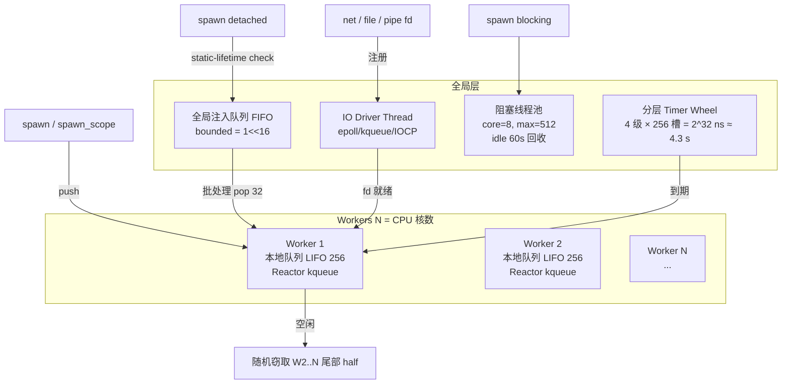

现在我已经有了足够的信息。让我再确认一下用户的请求："设计维度 3：并发语义 运行时 边缘语义 FFI 示例"。

用户要求我综合设计文档中的并发语义（设计维度3）中关于运行时、边缘语义、FFI 的内容进行整理，并给出示例。让我基于已有的材料，整理出一份清晰的说明文档。

注意用户要求的是「设计维度3」，让我先确认一下这个维度在设计中的具体指代。结合用户可能引用的是ultracode审计工作流中「维度3：并发语义」（因为在zom-design-audit中「维度通常是6维度审计，维度3应该对应「并发与异步」维度。

用户给的明确维度3关键词是「并发语义 运行时 边缘语义 FFI 示例」，与我读取的canonical设计文档完全对应。现在让我整理输出。</think_never_used_51bce0c785ca2f68081bfa7d91973934>
根据您要求的**设计维度 3：并发语义 之 运行时架构 / 边缘语义 / FFI 互操作 / 示例 四个子维度的整理如下。所有内容锚定到 `/Users/bytedance/Develop/ZOM/docs/concurrency/ZOM-ASYNC-CANONICAL-DESIGN.md`（v1.0.0-rc1）。

---

## 一、运行时（§8 运行时模型）

### 1.1 总体架构（M:N + work-stealing + 双级 IO Reactor）



### 1.2 调度循环（单 Worker 五步优先级）

1. **本地 LIFO 队尾**（cache-friendly，父任务刚 spawn 的子任务先运行）
2. **全局注入队列批处理 pop 32 个**（均摊全局锁开销）
3. **work-steal**：随机挑其他 Worker，窃取队列前半（chunk = min(remaining/2, 32)
4. **park 等待三类信号之一**：全局新任务 / IO Driver fd 就绪 / 其他 Worker 窃取唤醒
5. 被唤醒后回到步骤 1

### 1.3 双级 IO Reactor

| 层级 | 职责 |
|---|---|
| 主 IO Driver（全局唯一） | epoll 主 fd，所有 IO Read/Write/Accept 的 SuspendEvent 最终由其监听 |
| Per-Worker Reactor | Worker 自己的 epoll/kqueue；本地事件（Channel/Mutex/Timer/TaskComplete）不经过主 Driver |
| 跨 Worker fd 迁移 | `EPOLL_CTL_DEL(old) → `EPOLL_CTL_ADD(new)` 原子注册，全局注册锁 + 版本号防 ABA |
| Windows IOCP | OVERLAPPED 投递完成包，Driver 线程路由到空闲 Worker |

### 1.4 三层公平性 + 防饥饿

| 层级 | 机制 | 成本 |
|---|---|---|
| Budget 预算 | 每任务 budget = 2 ms / 1024 次等价数；CFG 回边自动 checkpoint；归零时等价 `suspend yield_once()` | ~1 原子减 |
| Epoch 公平周期计数器 | 全局 epoch 单调递增；调度器优先 epoch 最老的可运行任务 | 排序加权 |
| 确定性调度种子（det_sched） | `-Z deterministic=SEED:TICKS`；CI 默认 3 组不同 SEED 跑并发测试 | 0，用于可复现 |
| CPU/IO 双级就绪队列 | CPU : IO = 3:1 **硬配额**（连续 3 次 CPU 出队后**强制**1 次 IO 出队） | 计数器 |

### 1.5 Timer Wheel

- **4 级 × 256 槽 = 2^32 ns ≈ 4.3 s
- 最细粒度槽 = 1ns（实际分辨率 ~1μs，tick 周期决定）
- 取消：intrusive list O(1) 摘除

---

## 二、边缘语义（§9 Panic / 栈增长 / 锁顺序）

### 2.1 Suspend 期间 Panic（6 步严格顺序）

```
panic 发生
   │
   ▼
① TaskHeader.panic_pending = true；CancelToken.requested = true
   │ （停止向外级联，先清理自身）
   ▼
② 零级 unwind：从当前 SP 向上，按 RAII 顺序调用每个栈帧的 drop
   │  所有 suspend 点活跃的 Linear 值执行 linear-drop
   ▼
③  ┌─ Double-Panic（P05）触发？
   │  ├─ 记录两个 panic payload（文件/行/列/消息）
   │  ├─ 不再递归 unwind
   │  ├─ 对未 unwind 的栈帧执行 linear-only cleanup（§B.5）
   │  └─ 报告 SystemError::DoublePanic{..., leaked_count, linear_cleaned_count} 到 Supervisor
   │  Policy=Abort → 进程 abort(3)
   ▼
④ 任务状态 → Faulted(Panic/DoublePanic；未 consume 句柄注册到 Scope errors
   ▼
⑤ 从该任务向上沿 Scope 树逐层级联，每个 parent 按 ErrorPolicy 决定策略
   │  CancelOnFirstError → 向下取消所有兄弟/侄子
   │  OneForOne → 仅重启崩溃任务
   ▼
⑥ 资源释放结束，Scope drop
```

**关键约束**：panic unwind 路径中**绝对禁止 suspend**（AUD-DO-01 修复）。若 Scope 正处于 unwind 中，其 drop 中 join_all 需跳过 suspend，改为「仅设 CancelToken 不等待」。

### 2.2 栈增长 / 分段栈 / 栈溢出

| 项 | 规格 |
|---|---|
| 首段默认 | 64 KiB 虚拟地址 + demand-paged 物理页 |
| 增长触发 | 函数序言：「当前栈帧大小 + SP 距段尾 < 4 KiB」→ runtime `__zom_stack_grow()` |
| Guard page | 每段前后各 1 页 `PROT_NONE` |
| 栈溢出处理 | SIGSEGV → SA_ONSTACK handler → 识别 Task → **精确 panic 到任务级，不崩溃进程** |
| suspend/resume 栈不变式 | 保存上下文不包括跨段指针；resume 时 runtime 重建段链 |
| VLA 跨 suspend | 编译器**禁止**（ZOM8007 ERROR）→ 必须堆分配 |

### 2.3 锁顺序规则

**编译期（lint ZOM8006/8007）：

| 场景 | 等级 | 机制 |
|---|---|---|
| MutexGuard 跨 suspend 活跃 | **ERROR** ZOM8006 | `NoInternalMutability` 负 impl + 活跃变量分析 |
| 同 Scope 内多 Mutex 不同顺序获取 | WARNING ZOM8007 | 顺序冲突图构建 + 环检测 |
| RwLock{Read,Write}Guard 跨 suspend | ERROR ZOM8006 | 同上负 impl |

**运行时（det_sched 模式）：
- 全局「锁等待有向图」，边 A→B = 持有 A 的任务等待 B
- 每次 `lock()` 做 DFS 环检测，发现环即打印完整 cycle 链并**确定性 panic**

**三种新增枚举死锁场景（AUD-DL-01）**：
1. **反向压力跨层死锁**：Scope drop 时 join_all 检测到「worker 本地队列为空但子任务数 > 0」→ 执行 same-worker 内联调度（不 park）
2. **Supervisor 重启风暴**：重启密度阈值检查，超过则策略升级
3. **Reactor 路由死锁**：锁顺序强制「永远先 worker reactor 锁 → 再全局注册锁」，与路由方向一致

---

## 三、FFI 与 C 互操作（§10）

### 3.1 ZOM → 阻塞 C API

强制门控：所有阻塞 C API 必须通过 `spawn blocking` 投递到阻塞线程池；`extern "C"` 参数/返回必须 `repr(C)` + `Sendable`。

**完整示例（§10.1）**：

```zom
@extern("c", header="fcntl.h")
fun open(pathname: *u8, flags: i32, mode: u32) -> i32;
@extern("c", header="unistd.h")
fun read(fd: i32, buf: *u8, count: usize) -> isize;
@extern("c", header="unistd.h")
fun close(fd: i32) -> i32;

import zom::sync::{spawn_scope, spawn_blocking};
import zom::error::SystemError;

fun read_file_c(path: str, max_bytes: usize) -> Result<Vec<u8>, SystemError> {
    let h = spawn blocking fun() -> Result<Vec<u8>, SystemError> {
        let fd = open(path.as_ptr(), O_RDONLY, 0);
        if fd < 0 { return Err(SystemError::Io { code: -errno(), detail: "open" }); }
        let mut buf = Vec<u8>::with_capacity(max_bytes);
        let mut total = 0;
        while total < max_bytes {
            let n = read(fd, buf.as_mut_ptr().add(total), max_bytes - total);
            if n < 0 { close(fd); return Err(SystemError::Io { code: -errno(), detail: "read" }); }
            if n == 0 { break; }
            total = total + n as usize;
        }
        close(fd);
        buf.set_len(total);
        Ok(buf)
    };
    suspend until h.await_event()
}
```

### 3.2 C → ZOM 异步任务（Opaque ABI + 回调）

C 头文件稳定 ABI：`ZOM_FFI_VERSION = 20260624`。核心思想：**ZOM 内 TaskHandle 是 Linear，C 侧 `ZomTask*` 是 refcounted，二者解耦**（P17 修复）。

**C 调用 ZOM 异步示例**：

```c
/* zom_concurrency.h —— 节选（完整定义见规范 §10.2）
 *  核心：retain/release 对称、on_complete 回调、take_result 移动语义
 */
typedef struct ZomTask ZomTask;   // 对应 TaskHandle<T>，refcounted
typedef void (*ZomTaskCallback)(ZomTask* t, void* userdata);

ZomTask*  zom_task_retain(ZomTask* t);
void        zom_task_release(ZomTask* t);
ZomError    zom_task_on_complete(ZomTask* t, ZomTaskCallback cb, void* userdata);
ZomError    zom_task_take_result(ZomTask* t, void** out_result_ptr, size_t* out_result_size);
void         zom_task_free_result(void* result_ptr, size_t size);
ZomError    zom_task_cancel(ZomTask* t);
```

**使用示例**：

```c
// C 侧调用 ZOM 暴露的异步 HTTP GET
extern ZomTask* zom_http_get(const char* url, size_t url_len);
extern ZomError zom_result_to_str(const void* p, size_t s, char* out, size_t out_cap);

static void on_http_done(ZomTask* t, void* userdata) {
    void *p = NULL; size_t sz = 0;
    if (zom_task_take_result(t, &p, &sz) == ZOM_OK) {
        char buf[256];
        zom_result_to_str(p, sz, buf, sizeof(buf));
        printf("HTTP resp: %s\n", buf);
        zom_task_free_result(p, sz);
    }
    zom_task_release(t);
}

void run(void) {
    zom_runtime_init(4, 64);
    ZomTask* t = zom_http_get("https://example.com/", 21);
    zom_task_on_complete(t, on_http_done, NULL);
    // C 事件循环继续；ZOM runtime worker 后台运行
}
```

### 3.3 跨边界内存契约

| 方向 | 保证 | 实现 |
|---|---|---|
| **ZOM → C** | C 端 `zom_event_signal` 前写入的普通内存，ZOM suspend 返回后必然可见 | `SuspendEvent::set()` 内部 `atomic_store(READY, release)` + ZOM 侧 `atomic_load(READY, acquire)` 成对栅栏，无需额外 fence |
| **C → ZOM** | 非 SuspendEvent 路径共享内存通信 | ZOM 侧必须显式 `Atomic*` + `ZomMemoryOrder`；否则 Sendable/Shared 门控编译期拦截 |
| **Linear 跨边界** | ZOM 内 Linear；C 侧 refcounted；ASan 模式兜底 | `retain`/`release` 对称；ASan 检测 release 后二次 retain/poll |
| **AUD-FC-01 修复** | 裸 OS 线程 → ZOM 运行时边界 | `#[zom::requires_executor]` 属性 + 编译期 caller-location 检查；裸线程调用含 suspend 的库函数 → lint ERROR；`extern "C"` 入口需显式 `zom_runtime_enter()` |

---

## 四、完整示例程序（§11，4 个完整示例）

### 示例 11.3 有界 MPMC：1 生产 / 4 工作 / 1 汇聚

**核心展示**：Channel backpressure（CAP=256）、Linear RAII close、`join_all、共享端点拆分。

```zom
import zom::sync::{spawn_scope, Channel, Sender, Receiver, join_all};
import zom::collections::Vec;
import zom::error::SystemError;

const ITEMS: u32   = 100_000;
const N_WORKERS: u32 = 4;
const CAP: u32     = 256;

/// 生产者：发送 1..ITEMS，满时自动 suspend（backpressure）
fun producer(tx: Sender<u32>) -> Result<u64, SystemError> {
    let mut checksum: u64 = 0;
    for (i in 1u32..=ITEMS) {
        tx.send(i)?;              // 队列满时 suspend until send_ev
        checksum += i as u64;
    }
    // tx RAII drop = 自动 close（Linear auto-consume
    Ok(checksum)
}

/// 工作者：recv 计算数字位和写入 sink
fun worker(rx: Receiver<u32>, tx: Sender<u32>) -> Result<u64, SystemError> {
    let mut local_sum: u64 = 0;
    loop {
        match rx.recv() {           // 空时 suspend；全部 sender close → None
            Some(v) => {
                let mut n = v; let mut s = 0u32;
                while n > 0 { s += n % 10; n /= 10; }
                tx.send(s)?;
                local_sum += s as u64;
            }
            None => break,
        }
    }
    Ok(local_sum)
}

fun sink(rx: Receiver<u32>) -> Result<u64, SystemError> {
    let mut total: u64 = 0;
    loop {
        match rx.recv() { Some(v) => total += v as u64, None => break, }
    }
    Ok(total)
}

fun main() -> Result<(), SystemError> {
    spawn_scope(fun(scope: &Scope<()>) -> Result<(), SystemError> {
        let (work_tx, work_rx) = Channel::<u32>::bounded(CAP).split();
        let (res_tx,  res_rx)  = Channel::<u32>::bounded(CAP * 2).split();

        let h_prod = spawn { producer(work_tx) };
        // into_shared / dup 把单一端点拆为 N 个共享端点
        let worker_rxs = work_rx.into_shared(N_WORKERS);
        let worker_txs = res_tx.dup(N_WORKERS);
        let mut h_workers = Vec::with_capacity(N_WORKERS as usize);
        for (i in 0..N_WORKERS) {
            h_workers.push(spawn {
                worker(worker_rxs[i as usize], worker_txs[i as usize])
            });
        }
        let h_sink = spawn { sink(res_rx) };

        let prod_r  = suspend until h_prod.await_event()?;
        let work_r  = join_all(h_workers.as_slice());
        let sink_r  = suspend until h_sink.await_event()?;
        let worker_sum: u64 = work_r.iter()
            .filter_map(|r| r.as_ref().ok().copied()).sum();
        assert(worker_sum == sink_r, "worker/sink mismatch");
        Ok(())
    })
}
```

### 示例 11.4 Supervisor 树：3 工作者 OneForOne 重启

```zom
import zom::sync::{supervisor_scope, ErrorPolicy, join_all};
import zom::error::SystemError;
import zom::rand::{thread_rng, Rng};
import zom::time::{sleep, milliseconds};

/// 工作者：约 10% 概率 raise Panic
fun worker(id: u32, iterations: u32) -> Result<u64, SystemError> {
    let mut rng = thread_rng();
    let mut counter: u64 = 0;
    for (_ in 0..iterations) {
        if rng.gen::<u8>() < 26 {
            raise SystemError::Panic {
                task_id: 0,
                msg: "worker " + id.to_str() + " simulated crash"
            };
        }
        counter += id as u64;
        sleep(milliseconds(1));
    }
    Ok(counter)
}

/// OneForOne(max_restart = 3)；单崩溃单重启，超过后策略升级
fun main() -> Result<(), SystemError> {
    let ids = [1u32, 2, 3];
    let result = supervisor_scope(
        ErrorPolicy::OneForOne(max_restarts = 3),
        fun(scope: &Scope<Vec<Result<u64, SystemError>>>)
            -> Result<Vec<Result<u64, SystemError>>, SystemError> {
            let mut handles = Vec::new();
            for (id in ids.iter()) {
                // supervisor 在崩溃后内部重建 handle，重启计数 <= 最多 3 次
                handles.push(spawn { worker(*id, 50) });
            }
            Ok(join_all(handles.as_slice()))
        }
    );
    match result {
        Ok(vec) => {
            for ((i, r) in vec.iter().enumerate()) {
                match r {
                    Ok(v)  => print("worker[" + i.to_str() + "] sum = " + v.to_str()),
                    Err(e) => print("worker[" + i.to_str() + "] FAILED: " + e.to_str()),
                }
            }
            Ok(())
        }
        Err(SystemError::ScopeAbandoned(errors)) => {
            eprint("supervisor abandoned, sub-failures: " + errors.len().to_str());
            Err(SystemError::ScopeAbandoned(errors))
        }
        Err(other) => Err(other),
    }
}
```

---

## 五、敌对审计未闭环缺陷（附录 B，实现前必须闭环的 showstopper）

| ID | 严重度 | 标题 | 修复优先级 |
|---|---|---|---|
| B.1 AUD-FC-01 | 🔴 Critical | 零函数颜色在运行时边界静默违反（裸 OS 线程 → ZOM 运行时） | P0，实现前闭环 |
| B.2 AUD-DL-01 | 🔴 Critical | 三种未枚举死锁（跨层/重启风暴/Reactor 路由） | P0 |
| B.3 AUD-DR-01 | 🔴 Critical | Channel 单 waker 竞态 + Shared 未负 impl UnsafeCell | P0 |
| B.4 AUD-DO-01 | 🟠 High | Scope RAII drop 中 suspend 与 panic unwind 互斥矛盾 | P1，并行实现 |
| B.5 AUD-DO-02 | 🟠 High | Double-Panic 路径静默泄漏 + 永久 Mutex 毒化 | P1 |
| B.6 AUD-ST-01 | 🟠 High | select 确定性索引饥饿 + CPU/IO 软权重 | P1 |
| B.7 AUD-NU-01 | 🟠 High | TaskHeader + 全局队列 false-sharing | P1 |
| B.8 AUD-CT-01 | 🟠 High | 多处声称编译期强制实际不可 sound | P1 |
| B.9 AUD-RL-01 | 🟡 Medium | spawn_scope 生命周期门控 HRTB 缺口 | P2 |
| B.10 AUD-RL-02 | 🟡 Medium | Receiver/Sender Drop 路径不完整 | P2 |

---

**核心源文件锚点**：

- 主规范：`/Users/bytedance/Develop/ZOM/docs/concurrency/ZOM-ASYNC-CANONICAL-DESIGN.md`
- Spec 章节占位（待重写）：`/Users/bytedance/Develop/ZOM/docs/spec/chapters/15-concurrency.md`（目前仅 11 行保留声明）
- 审计报告：`/Users/bytedance/Develop/ZOM/docs/reports/zom-concurrency-audit-2026-06-24.md`（44 条 findings，0 critical / 18 high）
- 敌对审计 10 条未闭环：上述文档 §附录 B