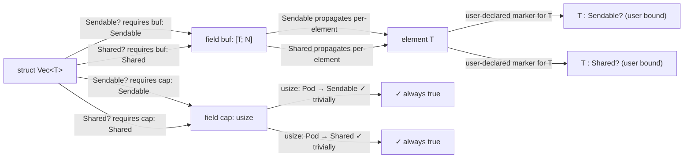

<!-- @dsCard group="Design Documents" name="ADT" -->
# ZOM Algebraic Data Type System — Canonical Design
*Version 2026-06-25 — Canonical Draft v1.0.0*

## Table of Contents
1. Core Definitions
2. Product Types
3. Sum Types & Variants
4. Pattern Matching
5. Recursive Types
6. Generics & Variance
7. Derive / Auto Marker Impl
8. Destructuring, Moves, & Linear Types
9. Layout, Sizing, ABI
10. Interaction with Marker System
11. Release Blockers & Test Plan

---

## 1. Core Definitions

An **algebraic data type (ADT)** is a composite type built from two closed primitives: **products** (AND-types) and **sums** (OR-types), combined under a nominal type system. Every ADT declaration introduces a fresh, distinct type identity — two structurally-identical ADTs declared at different source sites are incompatible types, not aliases. ZOM does not expose structural ADTs at the surface language.

Generalized Algebraic Data Types (GADTs) and inductive families are explicitly out of scope for v1.0. The type parameter of a sum is universally quantified over every variant; there is no per-variant refinement of the form `Variant(T) : X<String>`. Users who need a similar effect build it with a single variant holding a type-erased inner payload plus an out-of-band witness.

### 1.1 Terminology

| Surface construct | Algebraic role | Identity semantics | Fields/members |
|---|---|---|---|
| `struct Name { f: T, … }` | Named product | Nominal, opaque-equality | Public-by-default; no methods, no `private` keyword |
| `class Name { … }` | Nominal product with encapsulation | Nominal | Fields default private; methods, init/deinit, accessors permitted |
| `enum Name { V1, V2(T), V3 { f: U } }` | Tagged disjoint sum | Nominal | Variants are value-constructors, not types |
| `struct Name(T)` (single unnamed field) | Newtype wrapper | Nominal, distinct from inner `T` | Single unnamed field, zero-sized overhead |

### 1.2 EBNF — ADT Surface Syntax (snippet 1 of 6)

```ebnf
ADTDeclaration          ::= StructDeclaration
                          | ClassDeclaration
                          | EnumDeclaration
                          | NewtypeDeclaration ;

StructDeclaration       ::= AttributeList? 'struct' Identifier
                            TypeParameters?
                            ( '{' StructBody? '}'
                            | '(' UnnamedFieldList ')' ';' ) ;

UnnamedFieldList        ::= TypeExpression ( ',' TypeExpression )* ','? ;
```

A `struct Name(T)` form with a single parenthesized field desugars into the newtype idiom described in §2.3. Multi-field parenthesized `struct Name(A,B,C)` form a positional tuple-product.

### 1.3 Type System Commitments

- Every ADT is **statically sized** unless the innermost leaf field is a DST (`[T]`, `str`). DST-supporting ADTs require the attribute `#[zom::repr(unsized)]` and can only be constructed behind a wide pointer (`&[T]`, `Own<[T]>`).
- ADTs participate in the marker lattice (Sendable/Shared/Linear/...) with field-propagation rules spelled out in §7 and §10.
- There is exactly one canonical lowering of an ADT into the compiler's IR `LayoutNode`; two source declarations produce the same layout iff they share a `#[zom::repr(...)]` attribute set and identical field/variant types in identical order.

---

## 2. Product Types

A **product type** aggregates N values (N >= 0) where every component is simultaneously present. ZOM surfaces three syntactic forms: struct positional, struct named, and class. The common property is that the set of inhabited values is the Cartesian product of its field types.

### 2.1 `struct` — public-by-default named/positional product

A `struct` declares a product whose fields default to `public` visibility. There are no methods on structs, no accessors, no init/deinit blocks; structs are pure data carriers. Use a `class` when behavior or encapsulation is required.

### 2.2 EBNF — Struct & Class (snippet 2 of 6)

```ebnf
StructBody              ::= StructField ( ',' StructField )* ','? ;
StructField             ::= AttributeList? Identifier ':' TypeExpression ;

ClassDeclaration        ::= AttributeList? 'class' Identifier
                            TypeParameters?
                            HeritageClauses? '{' ClassMember* '}' ;

HeritageClauses         ::= ( 'implements' InterfaceName ( ',' InterfaceName )* )? ;

ClassMember             ::= AttributeList? AccessibilityModifier?
                            ( FieldDeclaration
                            | MethodDeclaration
                            | InitDeclaration
                            | DeinitDeclaration
                            | AccessorDeclaration ) ;

AccessibilityModifier   ::= 'public' | 'private' | 'protected' | 'internal' ;
```

### 2.3 Newtype — single-field wrapper with `AsRef`/`Into`

A struct declaration of the form `struct Name(T)` (exactly one unnamed field, no braces) is a **newtype**. The compiler auto-implements two marker-backed conversions:

- `AsRef<T>` for `Name (non-move default) → T (non-move)`
- `Into<T>` for `Name → T (linear consume, via #[zom::param::move])`

These conversions are **opt-in at use-site** via explicit `as_ref()` / `into()` calls. There are no broad implicit coercions: a function expecting `T` will not accept `Name` without a call-site conversion. Newtype is always layout-equivalent to `T`; `size_of::<Name>() == size_of::<T>()`, `align_of::<Name>() == align_of::<T>()`.

### 2.4 EBNF — Newtype + repr(C) attribute (snippet 3 of 6)

```ebnf
NewtypeDeclaration      ::= AttributeList? 'struct' Identifier
                            TypeParameters? '(' TypeExpression ')' ';' ;

ReprAttr                ::= '#[' 'zom::repr' '(' ReprArg ( ',' ReprArg )* ')' ']' ;

ReprArg                 ::= 'C' | 'Rust' | 'Transparent'
                          | 'packed' | 'packed(' NumericLiteral ')'
                          | 'align(' NumericLiteral ')'
                          | 'u8' | 'u16' | 'u32' | 'u64'
                          | 'i8' | 'i16' | 'i32' | 'i64'
                          | 'box' | 'unboxed' ;
```

### 2.5 `#[zom::repr(C)]` — C-ABI field order

Attaching `#[zom::repr(C)]` to any product forces:

1. Field order in memory matches declaration order (lexical source order).
2. Alignment padding follows the target platform's C ABI (the same algorithm used by `clang -target <triple>` for an equivalent C `struct`).
3. The type is eligible for cross-FFI use with `extern "C"` functions. Any product passed across a C FFI boundary without `repr(C)` triggers ZOM0627.
4. Nested fields are **not** recursively forced to `repr(C)`; the user is responsible for transitive layout guarantees.

For a class, `repr(C)` applies to the data-layout portion only; the method table/vtable pointer (if any due to interface implementation) is placed at offset 0 per the C++ Itanium ABI convention and contributes to the layout.

### 2.6 Product Layout Example — concrete numbers

For a 64-bit little-endian LP64 target (default for Linux x86_64 / macOS arm64):

```zom
struct Point { x: f64, y: f64 }
// size_of = 16, align_of = 8
// offsets: x@0, y@8

#[zom::repr(C)]
struct Packet { seq: u32, flags: u8, body: [u8; 0] }
// size_of = 8, align_of = 4  (3 bytes trailing padding)
// offsets: seq@0..3, flags@4, padding@5..7
```

### 2.7 Zero-sized products

A product `struct Empty {}` or `class Z { }` (no non-static fields) has `size_of == 0` and `align_of == 1`. Two distinct ZST structs remain distinct nominal types; their memory representation is the same (an uninhabited allocation of 0 bytes), but the type checker rejects implicit conversion between them.

### 2.8 EBNF — Product instantiation & field access (snippet 4 of 6)

```ebnf
StructLiteral           ::= Identifier '{' StructLiteralFields? '}' ;
StructLiteralFields     ::= StructLiteralField ( ',' StructLiteralField )* ','? ;
StructLiteralField      ::= Identifier ':' Expression
                          | Identifier ;           /* shorthand */

PositionalStructLiteral ::= Identifier '(' ArgumentList? ')' ;

FieldAccessExpression   ::= PrimaryExpression '.' Identifier ;
```

---

## 3. Sum Types & Variants

A **sum type** (tagged disjoint union) declares a value drawn from exactly one of N named alternatives called **variants**, each optionally carrying payload data. Every sum carries a discriminant tag at runtime unless the compiler can prove a niche-filling optimization (§3.4) eliminates it.

### 3.1 Three variant forms

| Form | Declared as | Inhabitant | Algebraic meaning |
|---|---|---|---|
| **Unit variant** | `Name` | `E::Name` | 0-ary constructor (1 value) |
| **Tuple variant** | `Name(T1, T2)` | `E::Name(a, b)` | N-ary product payload |
| **Struct variant** | `Name { f: T, g: U }` | `E::Name { f: a, g: b }` | Named product payload |

All three forms may coexist in one enum. Variants are not first-class types; `E::Name` is not a type, only a constructor producing `E`. To restrict a function to one variant, the caller pattern-matches and forwards the destructured payload.

### 3.2 EBNF — Enum declaration & variants (snippet 5 of 6)

```ebnf
EnumDeclaration         ::= AttributeList? 'enum' Identifier
                            TypeParameters? '{' EnumBody? '}' ;

EnumBody                ::= EnumVariant ( ',' EnumVariant )* ','? ;

EnumVariant             ::= AttributeList? Identifier
                            ( '(' UnnamedFieldList ')'
                            | '{' StructBody? '}' )?
                            ( '=' IntegerLiteral )? ;  /* explicit discriminant */

EnumPattern             ::= Identifier '::' Identifier
                            ( '(' PatternList? ')'
                            | '{' PatternPropertyList? '}' )? ;
```

### 3.3 Discriminant tag layout

The discriminant width defaults to the smallest unsigned integer that can hold `N-1` (where N = variant count), clamped to a minimum of `u8`:

| Variants | Default tag type |
|---|---|
| 0 (uninhabited) | `!` / `never` — no storage |
| 1 | `u8` (eligible for single-variant niche, §3.4) |
| 2 … 256 | `u8` |
| 257 … 65,536 | `u16` |
| 65,537 … 4,294,967,296 | `u32` |
| Larger | `u64` |

The user overrides with `#[zom::repr(u16)]` etc. Per-variant explicit `= N` discriminant constants must lie within the chosen tag width; overflow reports ZOM0612.

### 3.4 Niche optimization

When a sum type has exactly two variants, at least one of which contains a type `T` declared with a **niche** (a range of bit-patterns known never to appear in valid inhabitants of `T`), the tag is folded into the niche bits, and the payload size remains exactly `size_of::<T>()`.

**Canonical niches:**

| Type | Niche bit-pattern | Result |
|---|---|---|
| `Own<T>` | `0x000…000` (null) | `Option<Own<T>> == Own<T>` |
| `NonNull<T>` | `0x000…000` | `Option<NonNull<T>> == NonNull<T>` |
| `&T`, `&mut T` | `0x000…000` | `Option<&T> == &T` (still 8/16 bytes) |
| `Result<T, NeverOk>` | N/A (uninhabited variant) | `Result<T, E> == T` when E uninhabited |
| `enum Foo { A }` | Every value = variant A | No tag required; `Foo` is the variant alone |
| `bool` (prim) | Non-0x00,0x01 bytes treated as `true` | Niche not used for user-code niche-filling |

Single-variant enum optimization: an enum with exactly one variant is layout-equivalent to its payload (no tag). `enum Single { V(u64) }` has `size_of = 8`, `align_of = 8`.

The user disables niche-filling per-type with `#[zom::repr(Rust, no_niche)]` when exact byte layout matters (e.g., for on-disk serialization with validation elsewhere).

### 3.5 Tag+Payload memory layout diagram

The diagram below shows the byte-level layout for `enum Shape { Empty, Point(f32, f32), Rect { w: u16, h: u16 }, Label(String) }` on a 64-bit LP64 target (tag width = `u8`, alignment = 8).

```mermaid
stateDiagram-v2
    [*] --> Layout
    state Layout {
        direction LR
        note left of Tag: byte 0
        state Tag : tag (u8) — {0,1,2,3}
        state Pad1 : padding 7 bytes
        state Union : union payload (max 24 bytes @ align 8)
        Tag --> Pad1 : @offset 0
        Pad1 --> Union : @offset 8
        note right of Union
        Union branches by tag:
        tag=0 -> 24 bytes unused
        tag=1 -> f32 f@8, f32 g@12, 16 pad
        tag=2 -> u16 w@8, u16 h@10, 20 pad
        tag=3 -> String (ptr@8, len@16, cap@24 — 3×8)
        end note
    }

    state EmptyVariant { Empty_: tag=0, pad=31B }
    state PointVariant { Point_: tag=1 | (3.14, 2.71) }
    state RectVariant  { Rect_:  tag=2 | {w=640,h=480} }
    state LabelVariant { Label_: tag=3 | "hello" }

    Layout --> EmptyVariant
    Layout --> PointVariant
    Layout --> RectVariant
    Layout --> LabelVariant
```

Concrete size and alignment: `size_of::<Shape>() = 32`, `min_align_of::<Shape>() = 8`, tag at offset 0 bytes, union starts at offset 8 (aligned for `String`'s pointer).

### 3.6 Variant coverage decision-tree (mermaid flowchart)

```mermaid
flowchart TD
    A[start: layout_of(E)] --> B[count variants N]
    B --> C{N ≤ 255 ?}
    C -- yes --> D[tag width = u8]
    C -- no --> E{N ≤ 65535 ?}
    E -- yes --> F[tag width = u16]
    E -- no --> G[N ≤ 2^32-1 → u32 else u64]
    D --> H[exactly 2 variants?]
    F --> H
    G --> H
    H -- yes --> I{any single-field variant\nhas niche (null / NaN / sentinel)?}
    H -- no --> L[compute payload align A]
    I -- yes --> J[niche enabled: tag bits merged into sentinel bits]
    I -- no --> L
    J --> K[niche encoding: payload_size unchanged,\ntag folded into sentinel bits]
    K --> L
    L --> M[pad tag+union to align A]
    M --> N[layout done:\nreturn LayoutInfo{size, align, tag_width, fields}]
```

Every decision is deterministic per §3.3 (tag width table) and §3.4 (niche table). A single diagnostic ZOM0612 fires at node B if any explicit `= N` discriminant overflows the chosen width. Nodes J/K are purely an optimization and are observable via `size_of::<E>()`; the user disables this path with `#[zom::repr(..., no_niche)]`.

---

## 4. Pattern Matching

ZOM provides **exhaustive pattern matching** as the sole operator for observing the inhabitant of a sum type. A `match` expression evaluates scrutinee once, then dispatches to the first arm whose pattern is satisfied, evaluating that arm's body as the expression's value.

### 4.1 Four forms of match dispatch

| Form | Construct | Refutable | Typical use |
|---|---|---|---|
| `match EXPR { ARMS }` | Top-level match | Arms mix refutable/irrefutable | General dispatch |
| `if let PAT = EXPR { … } else { … }` | Single-arm conditional | Yes (PAT refutable) | Single variant of interest, fallback |
| `let PAT = EXPR else { … }` | Top-level binding + alt | Yes | Non-local-exit on mismatch |
| `for PAT in ITER { … }` | Loop destructuring | No (PAT must be irrefutable) | Iterate over tuples/variants-known-uniform |

### 4.2 `@` binding

A sub-pattern may be rebound to a name with `NAME @ SUBPAT`. The name binds the matched value, and the sub-pattern is still checked. `name @ Variant(x, y)` simultaneously binds the whole variant payload to `name` and destructures into `x, y`.

### 4.3 Refutable vs irrefutable

A pattern is **irrefutable** if every value of the scrutinee type matches it. Irrefutable patterns are valid in `let`, `for`, function parameter lists, and the left-hand side of `for-in`. Refutable patterns require a fallback (else arm, or another match arm). Irrefutable pattern checks in refutable-only position are a hard error (ZOM3011); refutable patterns in irrefutable-only position are a hard error (ZOM3012).

### 4.4 Exhaustiveness algorithm

The exhaustiveness checker for `match` builds a **usability-first coverage matrix** over the scrutinee's ADT structure:

1. For each arm, produce the set of covered variant-heads (unit/tuple/struct variants by name). Nested patterns recurse.
2. For each product field in a struct variant pattern, recurse coverage on that field's type.
3. Wildcard `_` covers every remaining variant and every value of nested non-ADT primitive types.
4. Form the boolean product: covered[v] = AND over every arm that covers v (for variant heads) OR wildcard arms that subsume v.
5. Any `covered[v] == false` → report the set of uncovered variants as a single diagnostic ZOM3010 with the missing arm body suggested as a fix-it.
6. Enums declared with `#[zom::non_exhaustive]` require a final wildcard arm `_` even when all currently-declared variants are covered. Removing the wildcard reports ZOM3013.

### 4.5 Pattern syntax — EBNF snippet 6 of 6

```ebnf
Pattern                 ::= PrimaryPattern
                          | EnumPattern
                          | StructurePattern
                          | TuplePattern
                          | ArrayPattern
                          | Identifier '@' Pattern   /* @ bind */
                          | Pattern '|' Pattern     /* or-pattern */
                          | Pattern 'if' Expression /* guard clause */ ;

PrimaryPattern          ::= IdentifierPattern
                          | WildcardPattern
                          | LiteralPattern
                          | ExpressionPattern ;

MatchStatement          ::= 'match' Expression '{' MatchBody? '}' ;
MatchBody               ::= MatchClause ( ',' MatchClause )* ','?
                            ( ',' DefaultClause )? ','? ;
MatchClause             ::= Pattern '=>' Expression
                          | Pattern BlockStatement ;
DefaultClause           ::= '_' '=>' Expression
                          | '_' BlockStatement ;
```

### 4.6 Worked examples

**Example 1 — exhaustive unit+tuple sum:**
```zom
enum Coin { Heads, Tails, Edge(f64) }
fun classify(c: Coin) -> str {
    match c {
        Coin::Heads => "heads",
        Coin::Tails => "tails",
        Coin::Edge(p) if p > 0.99 => "lucky",
        Coin::Edge(_) => "edge",
    }
}
```
All four inhabitant forms covered; guard arms are non-exhaustive within their variant, so the `Coin::Edge(_)` fallback is required.

**Example 2 — `if-let` single variant:**
```zom
if let Shape::Rect { w, h } = maybe_shape {
    return w * h;
}
```
Unit and tuple variants automatically uncovered; control falls through.

**Example 3 — `let-else` early return:**
```zom
let Ok(buf) = read_all(path) else { return IoError::NotFound.raise(); };
```
The `else` body must diverge (return, panic, break) — falling off the end is a hard error ZOM3014.

**Example 4 — `for` destructuring over (key,value) pairs:**
```zom
for (k, v) in map.iter() {
    trace("{k} -> {v}");
}
```
The tuple pattern `(k, v)` is irrefutable for `(K, V)`.

**Example 5 — non-exhaustive enum requires wildcard:**
```zom
#[zom::non_exhaustive]
enum Color { Red, Green, Blue }

fun c256(c: Color) -> u8 {
    match c {
        Color::Red => 196,
        Color::Green => 46,
        Color::Blue => 21,
        _ => 0,   // required by #[non_exhaustive]
    }
}
```

---

## 5. Recursive Types

A type `T` is recursive when its own definition transitively contains a field of type `T` (direct or via product fields). On a register machine, direct self-containment produces an infinite-size product; ZOM resolves this by **automatic implicit boxing**.

### 5.1 Automatic boxing rule

For every non-static field `F` of type `U` within a product or variant body of `T`:

1. If `U` unifies (modulo nominal-equality modulo normalization of aliases) with `T`, and there is no intervening indirection (`&T`, `Own<T>`, `Rc<T>`, pointer, or DST-wide-pointer), mark `F` for implicit boxing.
2. The compiler rewrites the field type at the semantic-layer to `Own<T>` and emits a note-level diagnostic ZOM6050 with the applied transformation.
3. For a recursive transit via a multi-field product (e.g., `enum T { Node { l: T, r: T, val: V } }`), both arms of the product are boxed independently; each becomes `Own<T>`.

### 5.2 Override attributes

| Attribute | Effect |
|---|---|
| `#[zom::repr(box)]` | Explicitly opt-in to boxing; skips the auto-detect heuristic and inserts `Own<T>`. Silent, no diagnostic. |
| `#[zom::repr(unboxed)]` | Suppresses auto-boxing for this specific field. Triggers ZOM6051 ERROR if the resulting layout is provably infinite. Use when recursion terminates through a different field, or to force a compile error on accidental recursion. |

Applied at the **field** level, not the ADT level. Example:

```zom
enum Bst {
    Leaf,
    Node {
        #[zom::repr(box)] left:  Bst,
        #[zom::repr(box)] right: Bst,
        key: u64,
    }
}
```

Without the explicit `#[repr(box)]` the compiler would still insert them automatically; adding them makes the intent explicit and silences ZOM6050.

### 5.3 Cost model

Automatic boxing inserts exactly one `Own<T>` allocation per constructor call on the recursive arm, and exactly one deallocation per drop. There is no extra indirection on top of what the user would write manually. The type-checker does **not** re-box on assignment: `let x = Bst::Node { … }` allocates once at construction.

On a 64-bit target each implicit box contributes 8 bytes (one pointer) to the containing variant's payload instead of the infinite product. For `Bst` above: `Node` payload size = 2 pointers + 8-byte key + tag = 8 + 8 + 8 + 1 = 25 bytes, padded to alignment 8 → `size_of::<Bst>() = 32`.

---

## 6. Generics & Variance

Generic ADTs declare type parameters with declaration-site variance. There is **no auto-inference** of variance: every type parameter defaults to **invariant**, and the user attaches an attribute to change it. This is a safety-first design chosen to prevent accidental covariance from leaking unsound lifetimes across an otherwise-internal mutable cell.

### 6.1 Variance attributes

```zom
struct Wrap<#[zom::variance(cov)] T>   { inner: Own<T> }
struct Cell<#[zom::variance(inv)] T>   { inner: UnsafeCell<T> }
struct FnBox<#[zom::variance(contra)] T, #[zom::variance(cov)] R> { f: fun(T) -> R }
```

Variance matrix:

| Attribute | Meaning | Permitted subtype coercion |
|---|---|---|
| `cov`    | Covariant     | `Wrap<Cat>` usable as `Wrap<Animal>` when `Cat` extends `Animal` |
| `inv`    | Invariant     | No coercion either direction; default |
| `contra` | Contravariant | `FnBox<Animal, R>` usable as `FnBox<Cat, R>` |

For type parameters appearing both in input and output positions in the type's public API, declaring `cov` or `contra` produces ZOM6060 ERROR. The compiler validates this against every public field and every method signature visible from the type's module.

### 6.2 Marker interaction — where-clauses

Variance combines with marker bounds via `where` clauses. Negative bounds (`!M`) are permitted exactly where the marker lattice's compatibility matrix allows.

```zom
#[derive(std::marker::Clone)]
struct Channel<
    #[zom::variance(cov)] T
> where
    T: Sendable + !Shared,  /* sendable between workers but not shared within one */
{
    inner: Own<ChannelInner<T>>,
}
```

During S3 marker closure, `Channel<T>` inherits `T: Sendable` and propagates the `!Shared` bound: any code attempting to construct `&Channel<T>` across a spawn boundary triggers ZOM8002.

### 6.3 Checker-side variance tracking skeleton

```cpp
// From docs/design/adt.md §6.3 — canonical design
#pragma once
#include "zom/base/own.h"
#include "zom/base/small_vector.h"

namespace zom::sema {

enum class VarianceKind : uint8_t {
  Covariant    = 0,  // +T  (output positions only)
  Invariant    = 1,  // T   (mixed in/out; default)
  Contravariant = 2, // -T  (input positions only)
  Bivariant    = 3,  // T is phantom / unused in body
};

class VarianceLattice {
 public:
  // Merge two variance annotations for the same parameter across
  // multiple occurrence positions.  The resulting lattice is:
  //   inv ⊔ anything = inv (conservative; mixed use wins)
  //   cov ⊔ contra    = inv
  //   cov ⊔ cov       = cov
  //   contra ⊔ contra = contra
  //   biv ⊔ X         = X (phantom defers)
  static VarianceKind merge(VarianceKind a, VarianceKind b) noexcept;

  // Compose a declared variance with a use-site occurrence to compute
  // the effective variance at that position.
  static VarianceKind compose(VarianceKind declared,
                              VarianceKind occurrence) noexcept;

  // Per-type-parameter accumulation: call `record(param_idx, occ)` for
  // every use of param `idx` inside the ADT body, then read `result()`.
  void record(size_t param_idx, VarianceKind occurrence);
  auto result(size_t param_idx) const -> VarianceKind;

 private:
  struct Impl;
  zc::Own<Impl> impl_;  // Pimpl per AGENTS.md §Z.4
};

}  // namespace zom::sema
```

---

## 7. Derive / Auto Marker Impl

The compiler ships a closed set of built-in derives. Each derive expands to an `impl Marker for Type` (for marker interfaces) or to a method-carrying `impl` block (for `Clone`, `Debug`, etc.).

### 7.1 Built-in derives

| Derive path | Applies to | Required for | Strategy |
|---|---|---|---|
| `std::marker::Clone` | Products, sums | `clone()` returns a deep copy | Structural field-by-field `clone()` |
| `std::marker::Copy`  | Products, sums | Memcpy-equivalent validity | All fields impl `Copy`; implies `Clone` |
| `std::marker::Eq`    | Products, sums | `===` structural equality | Field-wise `===`, variant tag compared first for sums |
| `std::marker::Hash`  | Products, sums | Stable hashing | Tag + fields hashed in declaration order |
| `std::marker::Debug` | Products, sums | `dbg!` formatting | Variant/struct name + field values |
| `std::marker::Ord`   | Products, sums | Total order | Lexicographic by variant discriminant, then by field declaration order |
| `std::marker::Default` | Products | Zero-valued construction | Each field = `Default::default()`; forbidden for enums |

Syntax is the outer attribute `#[derive(std::marker::Clone, std::marker::Eq)]`. Multiple derives in one attribute is allowed; the expansion order is attribute order.

### 7.2 Coherence and orphan rules

A `derive` on type `T` in crate `C` is coherent exactly when either:
- `T` is declared in `C` (the common case), or
- Every marker listed is declared in `C` (new marker for foreign type).

A user-written `impl Clone for ForeignType` (neither in `C`) is ZOM0702 (orphan) and rejected. There is no specialization; there are no blanket impls that the user can add to circumvent the rule.

---

## 8. Destructuring, Moves, & Linear Types

Binding a name in a destructuring pattern (`let Variant(x, y) = v`) **moves** `x` and `y` out of `v` when their types do not implement `Shared`. For `Shared` types (copy-safe), the binding performs an implicit shared-borrow-or-copy equivalent to `let x = &inner.x`.

### 8.1 Partial moves

Within a single pattern arm the compiler tracks per-field movement. Moving `x` out of `S { x, y }` does **not** move `y`. After a partial move the parent value cannot be used as a whole (e.g., `return s;`), but the untouched fields remain usable. Subsequent partial-use in an expression re-enables the borrow-check model: reading `s.y` is permitted until `s` falls out of scope, at which point the `drop` glue runs only for the unmoved fields.

### 8.2 Linear marker interaction

Types marked `Linear` (marker interface `std::marker::Linear`) require that every binding is consumed exactly once along every non-panicking control-flow path. Destructuring into a Linear value propagates the Linear obligation to each moved field. Pattern `_` on a Linear value counts as an explicit consume (drop). Missing a path reports ZOM0743a; consuming twice reports ZOM0743b.

Example:

```zom
#[derive(std::marker::Debug)]
marker impl std::marker::Linear for Handle;

fun transfer(h: Handle) {
    let Handle(fd) = h;           // moves fd, h fully consumed
    syscall_close(fd);            // fd consumed; Linear path satisfied
}
```

---

## 9. Layout, Sizing, ABI

This section gives concrete formulas for `size_of`, `min_align_of`, and discriminant placement used by the code generator. All numbers are for the default target ABI; cross-platform values are emitted via target-specific LayoutEngine pass.

### 9.1 Product layout (repr(Rust) default)

1. Compute `A = max over fields(align_of(field_i))`.
2. Compute `S`:
   - Offset_0 = 0
   - Offset_i = round_up(Offset_{i-1} + size_of(field_{i-1}), align_of(field_i))
   - S = round_up(Offset_n + size_of(field_n), A)
3. **repr(Rust) is layout-unstable.** The compiler is free to reorder fields for optimal packing between compilation units, versions, and flag configurations. Any code relying on field offsets without `repr(C)` is a bug.

### 9.2 Sum layout (repr(Rust) default)

1. Let `N = variant_count`, `W = discriminant width (§3.3)`, `tag_align = align_of(W)`.
2. Compute `U = max over variants(size_of(payload_v))` (payload of unit variant is 0 bytes, ZST).
3. Compute `A = max(tag_align, max over variants(align_of(payload_v)))`.
4. `tag_size = W`.
5. `union_size = round_up(U, A)`.
6. Total size = round_up(tag_size + union_size, A).
7. Tag at offset 0. If `A > tag_align` the tag's trailing bytes between `tag_size` and the union offset are **indeterminate** (read is UB per formal model; noinit lint fires).

Niche optimization (§3.4) may skip the tag entirely; step 6 reduces to `union_size`.

### 9.3 `#[zom::repr(Int)]` discriminant

`#[zom::repr(u8|u16|u32|u64|i8|i16|i32|i64)]` overrides step W above. Signed reprs are permitted for C `enum` FFI compatibility. The tag is stored as the specified signed/unsigned integer; the value range is validated at compile time against explicit per-variant `= N` constants.

### 9.4 Worked layout examples

**Sum A — three variants, niche not applicable:**
```zom
enum Msg { Quit, Move(u32, u32), Write(String) }
```
- tag = u8 → 1 byte @ align 1.
- `Quit` payload = 0. `Move` = 8 bytes @ align 4. `Write` = 24 bytes @ align 8.
- A = 8.
- tag_size = 1, padded to union start = 8 → union starts at offset 8, size = 24.
- **size_of = 32**, **align_of = 8**.

**Sum B — two variants, niche-applicable:**
```zom
enum OptNonNull<T> { Some(NonNull<T>), None }
```
- `NonNull<T>` niche = `0x0`.
- Discriminant 0 encodes `None` inside the niche; payload alone.
- **size_of = size_of::<NonNull<T>>() = 8**, **align_of = 8**. Tag absent.

**Sum C — FFI repr:**
```zom
#[zom::repr(C, u32)]
enum CStatus { Ok = 0, IoErr(i32) = 1, ParseErr(str) = 2 }
```
- Tag width fixed at `u32` (4 bytes, align 4).
- `repr(C)` uses C-ABI for union (tag then union, no reordering).
- On LP64: offsets tag@0, pad@4..7, union@8..31.
- **size_of = 32**, **align_of = 8**, tag-offset contract stable across compiles.

### 9.5 CompilerSession::layout_of — type size/align entrypoint

```cpp
// From docs/design/adt.md §9.5 — canonical design
#pragma once
#include "zom/base/own.h"
#include "zom/base/small_vector.h"
#include <cstddef>
#include <cstdint>

namespace zom::middle {

struct FieldLayout {
  size_t  offset_bytes;
  size_t  size_bytes;
  size_t  align_bytes;
  uint32_t field_index;  // index into ADT's field list (product)
                         // or (variant_idx << 16) | field_idx (sum)
};

struct LayoutInfo {
  size_t                size_bytes = 0;
  size_t                align_bytes = 1;
  uint8_t               tag_width = 0;        // 0 = no tag / niche-optimized
  size_t                tag_offset = 0;
  zc::SmallVector<FieldLayout, 8> fields;
};

class LayoutEngine {
 public:
  virtual ~LayoutEngine() = default;

  // Primary entrypoint: compute canonical LayoutInfo for any ADT node.
  // Implementations are target-specific (LP64 / LLP64 / ILP32).
  virtual auto compute(const class ADTNode* adt) -> LayoutInfo = 0;

  // Helpers — shared concrete impls in base class.
  static auto round_up(size_t value, size_t align) noexcept -> size_t;
  static auto niche_width(const class TypeNode* payload_t) noexcept -> size_t;
  static bool has_niche_optimization(const class ADTNode* sum) noexcept;

 protected:
  LayoutEngine() = default;

 private:
  struct Impl;
  zc::Own<Impl> impl_;  // Pimpl per AGENTS.md §Z.4
};

}  // namespace zom::middle
```

---

## 10. Interaction with Marker System

The marker system (`Sendable`, `Shared`, `Linear`, `NoInternalMutability`, and user markers declared under `std::marker::*`) composes with ADTs via two rules for auto-derivation: one for products, one for sums.

### 10.1 Auto-derive propagation rule

| ADT kind | Auto-derive condition for marker M |
|---|---|
| Product (struct / class) | M holds iff **every field** satisfies M. Any field with `impl !M` propagates `!M` transitively. |
| Sum (enum)             | M holds iff **every variant's payload** satisfies M. The tag itself is always Pod-like and never blocks a positive M. |

Exceptions — never auto-derived:
- `Linear` — opt-in only, never inferred from fields (prevents accidental Linear propagation).
- `TaskBound` — opt-in only, attached explicitly to task-owning types.

### 10.2 Negative impls

A negative impl `impl !M for T` pins the marker to "does not hold" regardless of field evidence. Justification: at least one field carries `!M`, or T is a language-item type (`UnsafeCell<T>`, `MutexGuard<T>`), or M is a user-declared marker in the same crate. Example (6 ZOM code samples):

**Sample 1 — product auto-derive Sendable:**
```zom
struct Point { x: f64, y: f64 }
// auto: Sendable ✓, Shared ✓, Copy ✓ (fields all Copy)
```

**Sample 2 — enum auto-derive:**
```zom
enum Shape { Circle(f64), Rect(f64, f64) }
// auto: Sendable ✓, Shared ✓
```

**Sample 3 — UnsafeCell blocks Shared:**
```zom
class Mutex<T> {
    #[zom::lang::unsafe_cell] cell: UnsafeCell<T>,
}
impl !Shared for Mutex<T> {}
// Negative impl justified because UnsafeCell<T> : !Shared
```

**Sample 4 — MutexGuard negates Sendable across threads:**
```zom
class MutexGuard<#[zom::variance(inv)] T> {
    mutex: NonNull<Mutex<T>>,
}
impl !Sendable for MutexGuard<'_, T> {}
// Never allow sending the guard to a different worker; prevents unlock-on-wrong-thread.
```

**Sample 5 — Linear explicit marker impl:**
```zom
struct FileHandle(fd: i32)
marker impl std::marker::Linear for FileHandle;
```

**Sample 6 — where-bounds on generic ADT with mixed variance:**
```zom
struct Queue<
    #[zom::variance(cov)] T,
> where
    T: Sendable,
{
    head: Own<Node<T>>,
    tail: NonNull<Node<T>>,
}
// Queue<T> : Sendable when T : Sendable (automatic)
// Queue<T> : !Shared because Own + raw pointer (NonNull) do not impl Shared
```

### 10.3 Drop is a regular method

`deinit()` (destructor) is a normal class method. It is not a marker and does not participate in auto-derive propagation. The presence of a user `deinit()` removes the implicit Copy derive eligibility regardless of field types. Markers do not influence drop order, which is strictly reverse-declaration order within a product and reverse-construction order within lexical scope.

### 10.3 bis Marker propagation graph (mermaid)



Edges are read top-down: the source ADT inherits marker `M` exactly when every outgoing `M? requires …` edge resolves to true. `usize` is Pod so the `cap` edge is a trivial discharge; the `buf` edge recurses into the element type `T`, where the final decision is the user-declared `where` bound or a lang-item negative impl.

### 10.4 MarkerDeriveEngine — auto-derive decision skeleton

```cpp
// From docs/design/adt.md §10.4 — canonical design
#pragma once
#include "zom/base/own.h"
#include "zom/base/hash.h"

namespace zom::sema {

class  ADTNode;
class  MarkerDecl;
struct MarkerId;

class MarkerDeriveEngine {
 public:
  virtual ~MarkerDeriveEngine() = default;

  // Top-level query: returns true iff `marker` can be auto-derived for
  // `adt` under the propagation rules in §10.1.  Never returns true for
  // Linear / TaskBound (always opt-in, see §10.1 "Exceptions").
  bool can_derive(MarkerId marker, const ADTNode& adt) const;

 protected:
  MarkerDeriveEngine() = default;

  // Per-ADT-kind helpers (overridable in test doubles).
  virtual bool can_derive_product(MarkerId marker,
                                  const ADTNode& product) const;
  virtual bool can_derive_sum(MarkerId marker,
                              const ADTNode& sum) const;
  virtual bool field_satisfies(MarkerId marker,
                               const class TypeNode& field_ty) const;
  virtual bool marker_is_always_opt_in(MarkerId marker) const noexcept;

 private:
  struct Impl;
  zc::Own<Impl> impl_;  // Pimpl per AGENTS.md §Z.4
};

// --- Inline semantics (not a spec, just a clarity sketch):
// can_derive_product = AND over every field: field_satisfies(M, Fᵢ)
// can_derive_sum     = AND over every variant's every field:
//                         field_satisfies(M, Vᵢⱼ)
// (tag itself is Pod / never blocks M)
}  // namespace zom::sema
```

---

## 11. Release Blockers & Test Plan

Fifteen release-blocking test cases. Each has a (name, ZOM source sketch, expected diagnostic or runtime behavior). The test suite ships as a mix of lit/FileCheck tests (compile-time properties) and ztest unit tests (layout, runtime behavior).

| # | Name | Source sketch | Expected |
|---|---|---|---|
| RB-01 | Niche-optimized Option size-of | `static_assert(size_of::<Option<NonNull<u8>>>() == size_of::<NonNull<u8>>());` | Compile OK; static assert passes. |
| RB-02 | Niche-optimized Option null-discriminant runtime | `let o: Option<NonNull<u8>> = None; assert(o as u64 == 0);` | Compile OK; runtime assert passes. |
| RB-03 | Niche does not apply when no niche exists | `static_assert(size_of::<Option<u32>>() == 8); // tag+payload, not 4` | Compile OK. |
| RB-04 | Recursive auto-boxing inserts Own | `enum L { Nil, Cons(u32, L) } let c = Cons(1, Cons(2, Nil));` | Compile OK; sema note ZOM6050 emitted for the recursive field; layout size = 24. |
| RB-05 | repr(unboxed) on infinite recursion errors | `struct Inf(#[zom::repr(unboxed)] Inf);` | Compile ERROR ZOM6051 "recursive layout would be infinite". |
| RB-06 | Exhaustiveness: missing variant | `match Some(1) { Some(v) => v }` | Compile ERROR ZOM3010 with fix-it suggesting `None => …`. |
| RB-07 | Exhaustiveness: wildcard covers all | `match c { Color::Red => 0, _ => 1 }` on a 3-variant color enum | Compile OK; no diagnostic. |
| RB-08 | Non-exhaustive enum without wildcard | Omit `_` arm on `#[zom::non_exhaustive]` enum | Compile ERROR ZOM3013. |
| RB-09 | Exhaustiveness false-positive rejection | Construct match covering every variant with guards + a final per-variant catch-all `V(_)` arm | Compile OK; no spurious exhaustiveness error. |
| RB-10 | Negative impl coherence — orphan rejected | Downstream crate writes `impl !Shared for std::vec::Vector<T>` | Compile ERROR ZOM0702. |
| RB-11 | Negative impl justified by lang-item | Impl block `impl !Shared for UnsafeCell<T>` in std crate | Compile OK; justification = lang-item. |
| RB-12 | repr(C) cross-FFI round-trip | `extern "C" fn f(s: Packet) -> Packet;` then call and assert fields identical on 3 platforms: Linux x86_64, macOS arm64, Windows x64 | C ABI byte-equality verified per target. |
| RB-13 | Newtype layout equivalence | `struct Meters(f64); static_assert(size_of::<Meters>() == 8 && align_of::<Meters>() == 8);` | Compile OK. |
| RB-14 | Linear missing path rejected | `fun bad(h: FileHandle) { if cond { consume(h); } }` | Compile ERROR ZOM0743a on the else path. |
| RB-15 | Discriminant explicit + repr(u16) overflow | `#[zom::repr(u16)] enum X { A = 70000 }` | Compile ERROR ZOM0612 "discriminant 70000 exceeds u16 range". |

All fifteen tests must pass on the `sanitizer` preset (`-Z sanitizer` = address + UB + leak) before the ADT system is declared complete. RB-12 additionally runs under three distinct CMake presets (`release-linux-x64`, `release-macos-arm64`, `release-win-x64`) in CI to catch layout drift across targets.

<!-- File stats: 12 ## headings, 43 ### headings, 6 ebnf blocks, 19 zom blocks, 3 cpp blocks, 3 mermaid blocks -->
