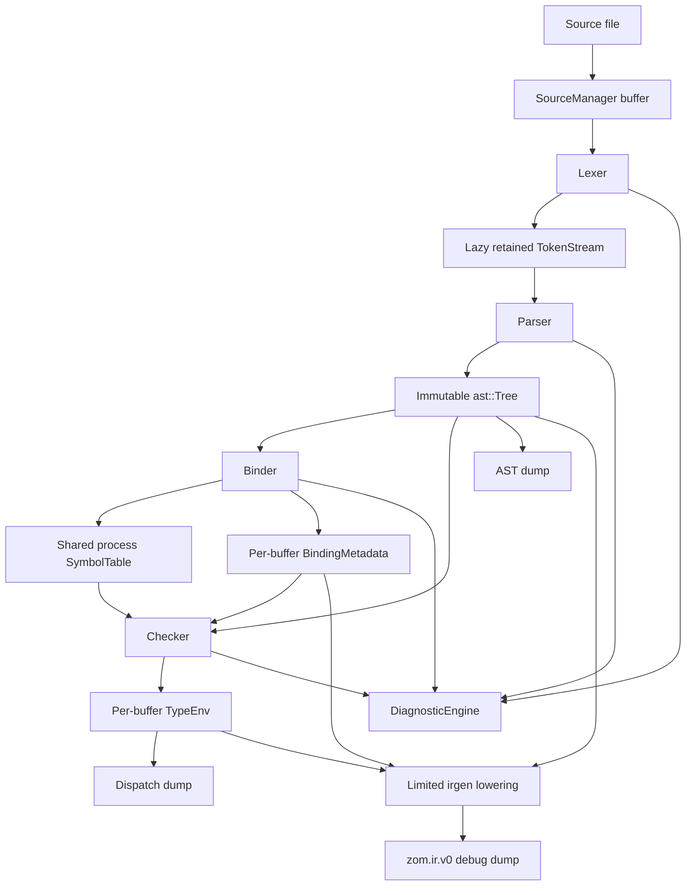

<!-- @dsCard group="Design Documents" name="ARCHITECTURE" -->
# ZOM Compiler Architecture - Current Implementation

Updated: 2026-07-11

This document describes code that exists in the current repository. RFC 0008
is implementing the cross-module `CompilerSession`, and RFC 0010 defines the
HIR, MIR, LIR, LLVM, and native backend boundaries. Only the implementation
slices identified below are available to compiler consumers.

## 1. Scope And Current Status

The repository implements a C++20 frontend and a limited checked IR debug
prototype:

- lazy lexing and recursive-descent parsing;
- an immutable schema-backed AST;
- per-source binding into one process-owned symbol table;
- type, trait, exhaustiveness, coercion, dispatch, and partial borrow checking;
- deterministic AST and call-dispatch dumps;
- a limited single-source `zom.ir.v0` dump for selected raising functions;
- runtime panic entry points with abort support.

The repository does not implement:

- RFC 0008's module graph, immutable module interfaces, signature store, or
  global cross-module coherence;
- RFC 0010's semantic HIR, place-based MIR, target LIR, or layer verifiers;
- an LLVM translator, object writer, linker driver, or native backend;
- binary emission from `zomc`.

## 2. Live Module Inventory

| Path | Current responsibility | Current output |
|---|---|---|
| `compiler/source` | Own source buffers and map locations | `BufferId`, `SourceLoc`, line/column queries |
| `compiler/lexer` | Produce tokens lazily | `Token` values consumed by `TokenStream` |
| `compiler/parser` | Parse one source buffer | immutable `ast::Tree` |
| `compiler/ast` | Own schema-backed syntax nodes and source ranges | `Tree`, `NodeId`, generated accessors |
| `compiler/binder` | Build scopes and resolve identifiers | `BindingMetadata` and `SymbolTable` updates |
| `compiler/symbol` | Own symbols, scopes, flags, and local stable IDs | `SymbolId`, scope and symbol queries |
| `compiler/type` | Own current type trees, interning handles, coercions, and dispatch side tables | per-source `TypeEnv` |
| `compiler/checker` | Check declarations, bodies, traits, exhaustiveness, and partial ownership rules | diagnostics and populated `TypeEnv` |
| `compiler/diagnostics` | Register and render structured frontend diagnostics | `DiagnosticEngine` output |
| `compiler/driver` | Sequence parse, bind, and check for registered sources | maps keyed by `BufferId` |
| `compiler/irgen` | Lower a narrow checked subset while also computing target layout | move-only `irgen::Module` and `zom.ir.v0` dump |
| `utils/zomc` | Parse CLI options and select AST, dispatch, IR, or binary output | stdout/file dumps or command failure |
| `runtime` | Provide panic ABI entry points and current abort behavior | static runtime library symbols |

## 3. Frontend Pipeline

`CompilerSession::parseSources()` creates a `ThreadPool`, schedules one parse
task per registered `BufferId`, and stores successful trees in a guarded map.
`Lexer::lex(Token&)` feeds a Lazy TokenStream on demand. `TokenCursor` provides
bounded lookahead and rewind without forcing end of file. `Parser::parse()`
returns `zc::none` after any error-level lexical or syntax diagnostic.
`bindSources()` and `checkSources()` then iterate the stored trees. The session
owns one `StringPool`, `SourceManager`, `DiagnosticEngine`, and `SymbolTable`,
one process-unique `SemanticContextBrand`, one RFC 0011 identity registry
family, and guarded maps for ASTs, binding metadata, and type environments.

The CLI runs parse, optional AST emission, bind, check, optional dispatch
emission, panic-strategy validation, and final output selection in that order.
`--emit=ir` invokes the limited prototype. Binary output returns an explicit
not-implemented failure.

## 4. Data Ownership And Stage Boundaries

| Data | Owner | Mutation boundary | Current consumers |
|---|---|---|---|
| Source bytes | `SourceManager` | immutable after registration | lexer, diagnostics, panic source metadata |
| Token buffer | parser-owned `TokenStream` | grows during parsing | parser only |
| `ast::Tree` | session map entry | immutable after parse | binder, checker, dumps, current irgen |
| `BindingMetadata` | session map entry | populated during bind | checker, current irgen |
| `SymbolTable` | `CompilerSession` | updated during per-source binding/checking | binder, checker |
| `TypeEnv` | session map entry | populated during check; dispatch table is frozen | checker dumps, current irgen |
| `irgen::Module` | lowering result | built inside `lowerCheckedTree()` | IR dumper only |

The current `TypeEnv` stores owned concrete `Type` trees and canonical-looking
`TypeId` handles at the same time. `TypeInterner` IDs and `SymbolId` values are
local to their owning store. They are not yet the session-canonical semantic
identities proposed by RFC 0011 and consumed by RFC 0004, RFC 0005, RFC 0008,
and RFC 0010.

The session accessors return const references to internal maps. Callers must not
assume that this API is a cross-thread snapshot or an incremental compilation
interface.

## 5. Checker And Semantic Facts

The checker is implemented and runs after successful binding. Its main current
phases include declaration signature computation, body checking, trait and impl
validation, exhaustiveness checks, dispatch recording, and the partial borrow
checker described by RFC 0007 evidence.

Semantic information remains in side tables keyed by AST `NodeId`:

- expression and declaration types;
- coercion kinds;
- call target and receiver records;
- selected symbol IDs and impl-node references;
- borrow reports inferred by the current checker pipeline.

Only dispatch records have an explicit freeze operation. There is no
`VerifiedCheckedModule` handoff and no complete immutable semantic snapshot.
Downstream code must therefore treat missing or inconsistent facts as an
invariant failure, not repeat semantic resolution.

The current borrow checker contains useful place, CFG, move, loan, region,
linear, task-capture, and raw-pointer fact types, but several source facts are
still inferred by bounded AST traversal. It is not the path-sensitive MIR
ownership analysis proposed by RFC 0007 and RFC 0010.

## 6. Current IR Prototype

`products/zomlang/compiler/irgen` currently defines:

- `Module`, `Function`, `BasicBlock`, `ValueId`, and `BlockId`;
- integer constants and symbolic same-source raising calls;
- error-union construction and payload moves;
- return, jump, error-union branch, and forced-unwrap panic terminators;
- explicit ILP32/LP64 test layouts and error-union layout descriptors;
- deterministic `zom.ir.v0` text output.

This is one mixed prototype, not multiple IR layers. It combines logical error
control flow with concrete target tags, payload offsets, ABI return types, and
pointer layout. It is not a general HIR, ownership MIR, target LIR, or LLVM IR.

The checked subset is intentionally narrow. Current lowering requires one
source file and raising functions with restricted shapes. The `?!` and `!!`
slices support same-source, zero-argument free-function calls with one concrete
residual alternative. Locals, general expressions, multiple residuals, real
drop cleanup, cross-module calls, native runtime calls, and object emission are
not complete.

The prototype now has a narrow structured diagnostic boundary.
`LoweringFailure` stores a closed failure kind, lowering phase, and AST node.
`zomc` maps capability limits to registered `ZOM6001-ZOM6008` diagnostics and
maps missing checked state or lowering invariant failures to
`ZOM9901-ZOM9903`; arbitrary lowering display strings are not part of the
interface. Target profiles and scalar widths are closed types, layout-table
access returns checked results, and IR dumping preflights every interned type,
layout, function symbol, block, SSA value, instruction, terminator, and panic
metadata reference before writing output. Lowering rejects mismatched binding
metadata capacity and source ranges outside the selected source buffer before
accessing those side tables. This does not provide HIR, MIR, or LIR
verification and therefore does not satisfy the full RFC 0010 contract.

RFC 0010 is accepted and requires a direct replacement with semantic HIR,
Built and executable MIR, and target LIR. Its implementation has not started,
so none of those accepted layer contracts is a current compiler output.

## 7. CompilerSession And Cross-Module Status

`CompilerSession` is the root compiler entry point. It owns source,
diagnostic, symbol, AST, binding, and type-environment storage together with a
process-unique `SemanticContextBrand` and the sole RFC 0011 identity registry
family for that context. The identity registries provide stable package,
crate, source, module, definition, and impl identities.

The session does not yet build RFC 0008's verified `ModuleGraph`, publish
immutable module interfaces, provide a `SignatureStore`, schedule dependency
phases, or construct the global impl coherence index. Its frontend maps remain
keyed by `BufferId`, so the cross-module handoff is incomplete.

The current import resolver creates and links symbols inside the present
binder/symbol infrastructure. This does not prove separate compilation or
cross-module type and ABI identity. RFC 0008 is `IMPLEMENTING`; the root-owner
cutover is active, while module discovery, verified publication, and
cross-module semantic consumers remain open.

## 8. Diagnostic Numbering Plan

The authoritative diagnostic registry is the set of non-empty
`products/zomlang/compiler/diagnostics/diagnostics-*.def` files included by
`diagnostic-ids.h`. Current registered ranges are:

| Range | Registry | Current purpose |
|---|---|---|
| `ZOM1000-ZOM1001` | `diagnostics-common.def` | common driver/source diagnostics |
| `ZOM2001-ZOM2090` | `diagnostics-parse.def` | lexical, parser, and parser invariant diagnostics |
| `ZOM3001-ZOM3016` | `diagnostics-binder.def` | binding and name-resolution diagnostics |
| `ZOM4001-ZOM4070` | `diagnostics-checker.def` | type, trait, exhaustiveness, coercion, and ownership diagnostics |
| `ZOM6001-ZOM6008` | `diagnostics-lowering.def` | current IR and backend capability diagnostics |
| `ZOM9901-ZOM9903` | `diagnostics-lowering.def` | current IR invariant diagnostics |
| `ZOM9910-ZOM9921` | `diagnostics-identity.def` | semantic identity invariant diagnostics |

RFC 0010 requires the current typed boundary to expand with each verified IR
layer; the three current invariant codes do not imply that all layer verifiers
exist.

Documentation must not allocate a diagnostic by prose alone. A code exists
only when its `.def` entry, enum inclusion, emitter, and test exist together.

## 9. Compiler Concurrency

Current compiler concurrency is limited to the parse scheduling implemented in
`CompilerSession::parseSources()` and the in-tree `ThreadPool`. Binding and
checking iterate session-owned maps after parsing. The repository does not
implement the task graph, sharded canonical type store, parallel IR cache, or
per-module LLVM contexts described by earlier drafts of this document.

Guarded map storage does not by itself define an incremental snapshot contract.
RFC 0008 must define scheduling and publication before cross-module consumers
rely on concurrent access.

## 10. Extensibility Status

The current compiler does not expose the documented `LexerPlugin`,
`TypeCheckerPlugin`, `BackendTier`, or LLVM backend interfaces that appeared in
the previous architecture draft. They are not supported extension points.

New compiler-wide plugin, pass-manager, or backend interfaces require an RFC,
live implementation, ownership rules, and executable tests before this design
document may list them.

## 11. Testing And Verification

Current authoritative gates include:

- `cmake --preset sanitizer`;
- `cmake --build --preset sanitizer`;
- `ctest --preset default --output-on-failure`;
- `python3 scripts/check-format.py`;
- `python3 scripts/check-rfc.py`;
- parser, lexer, AST coverage, and conformance checks documented by their
  owning skills and CMake targets;
- `git diff --check`.

The current IR prototype has unit tests under
`products/zomlang/tests/unittests/compiler/irgen/` and FileCheck snapshots under
`products/zomlang/tests/conformance/expectations/ir/`. Those tests prove only
the named prototype slices. They do not prove native execution, LLVM verifier
success, object emission, cross-module ABI compatibility, or RFC 0010
completion.

When RFC 0008 or RFC 0010 moves beyond review, update this document only after
the corresponding implementation and executable gates exist.
