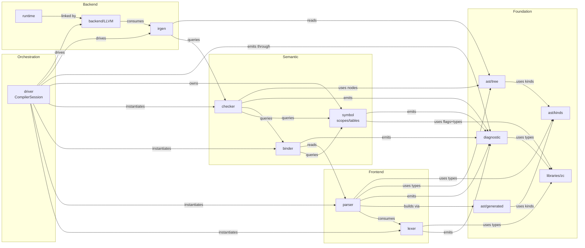

<!-- @dsCard group="Design Documents" name="ARCHITECTURE" -->
# ZOM Compiler Architecture — Full Engineering Blueprint
*Version 2026-06-25 — Canonical Draft v1.0.0*

## Table of Contents
1. Executive Scope & Non-Goals
2. Layered Architecture & Module Inventory
3. Frontend Pipeline
4. Data Flow & Cross-Stage Invariants
5. Dependency Graph
6. Build Lifecycle
7. CompilerSession & Cross-Module
8. Diagnostic Numbering Plan
9. Compiler Concurrency
10. Extensibility Points
11. Testing & Verification Strategy

## 1. Executive Scope & Non-Goals

ZOM is a statically typed, ahead-of-time compiled systems programming language targeting LLVM 18 and later. The compiler emits native object files with zero mandatory runtime overhead; every language feature maps to deterministic machine code whose cost a reader can predict from source syntax alone. The design centers two non-negotiable pillars: memory safety without a garbage collector, and structured concurrency baked into the type system via the ownership, permission, and marker rules defined in `docs/design/compiler-contracts.md` and the runtime discipline in `docs/concurrency/zom-async-canonical-design.md`.

The minimal viable language surface covers: nominal structs and enums with pattern matching, first-class functions with generics (monomorphized, trait-bounded), explicit `own` / `borrow` / `mut` permissions, `async fn` + `await` with a fixed single-thread-per-core executor, deterministic `defer` / `errdefer` finalization, and a thin foreign-function interface layer over C calling conventions. The standard library (`libraries/zc`) ships the allocator, containers, async runtime, and platform abstractions required to produce freestanding binaries on Linux, macOS, and Windows on AArch64 and x86_64.

| NON-GOAL | Rationale | Boundary |
|---|---|---|
| Garbage collection of any form | Zero-overhead systems target precludes traced collectors; lifetime discipline is static | Ownership + borrowck replace all runtime tracing |
| Hot code reload | Replaces defined ABI boundaries with loader hacks; conflicts with static linking model | Debug symbols + dynamic libraries are the sanctioned reload path |
| Just-in-time compilation | JITs inflate binary footprint and break deterministic performance envelopes | AOT + `build.zom` scripted compilation covers equivalent use cases |
| Read-eval-print loop | REPL semantics require incremental type-state that conflicts with append-only AST invariant | `zom run` executes full compilation of a scratch TU only |
| Runtime reflection | Metadata tables bloat binaries and enable untyped access across isolation boundaries | Compile-time introspection via `@comptime if` and `@typeInfo` is the exclusive reflection surface |
| Script or interpreted mode | Dual execution modes bifurcate semantics and complicate standard library contracts | Every ZOM source file compiles to native object code; no AST-walker interpreter exists |
| Generalized algebraic data types | GADTs require dependent unification that inflates type-checker complexity | Enum variants carry existential payloads but no index-level equalities |
| Syntax macros 2.0 / procedural macros | Token-level rewrite systems leak hygiene bugs and slow compile times | Built-in `@comptime` blocks + parameterized attributes (see `docs/spec/chapters/16-attributes-and-annotations.md`) replace macro expansion |
| Global type inference | Whole-program inference destroys incremental rebuild throughput | Every top-level declaration carries an explicit signature; inference is intra-expression only |
| Unlimited implicit coercions | Coercion chains hide cost and confuse diagnostic emission | Only `&T -> &U` wide-pointer unsizing and numeric widening at explicit cast sites are permitted |

Every subsystem in §2 through §11 is engineered strictly within the scope above. Adding a feature whose footprint crosses into the NON-GOALS table requires a new revision of this document that alters the table row and propagates consequences through every downstream invariant.

The language surface shrinks further to a compact supported-target matrix below. A target is tier-1 when it has CI coverage for all three sanitizer builds and every lit test runs; tier-2 targets lack sanitizer coverage but still build cleanly; tier-3 targets compile only the freestanding subset.

| Target Triple | Tier | Code-Gen Backend | Calling Convention | Async Executor Model | Standard Library Profile |
|---|---|---|---|---|---|
| `aarch64-apple-darwin23` | 1 | LLVM 18 | Apple AAPCS | work-stealing 1:1 thread pool | full libzc + OS syscalls |
| `x86_64-apple-darwin23` | 1 | LLVM 18 | System V AMD64 ABI | work-stealing 1:1 thread pool | full libzc + OS syscalls |
| `x86_64-unknown-linux-gnu` | 1 | LLVM 18 | System V AMD64 ABI | work-stealing 1:1 thread pool | full libzc + glibc |
| `aarch64-unknown-linux-gnu` | 1 | LLVM 18 | AAPCS64 | work-stealing 1:1 thread pool | full libzc + glibc |
| `x86_64-pc-windows-msvc` | 1 | LLVM 18 | Microsoft x64 | Windows thread-pool adapter | full libzc + MSVCRT |
| `aarch64-pc-windows-msvc` | 2 | LLVM 18 | Microsoft ARM64 | Windows thread-pool adapter | full libzc + MSVCRT |
| `x86_64-unknown-linux-musl` | 2 | LLVM 18 | System V AMD64 ABI | work-stealing 1:1 thread pool | libzc with musl allocator |
| `wasm32-wasi-p1` | 2 | LLVM 18 | wasm C ABI | single-threaded yielding loop | libzc subset (no threads) |
| `riscv64-unknown-linux-gnu` | 3 | LLVM 18 | RISC-V LP64D | minimal single-core executor | libzc freestanding subset |
| `x86_64-none-elf` (freestanding) | 3 | LLVM 18 | System V AMD64 | none (no threads permitted) | libzc freestanding no-alloc subset |

## 2. Layered Architecture & Module Inventory

The repository follows the product-scoped layout used by the current ZOM tree.
Compiler implementation files live under `products/zomlang/compiler/`, runtime
code lives under `products/zomlang/runtime/`, shared vocabulary code lives under
`libraries/zc/`, language-level conformance tests live under
`products/zomlang/tests/conformance/`, and compiler unit tests live under
`products/zomlang/tests/unittests/compiler/`. No implementation directory is
rooted at `src/`. Future compiler stages must be added under the same
`products/zomlang/compiler/<stage>/` hierarchy rather than introducing a second
top-level source tree. Ownership transfer semantics follow the `zc::Own<T>`
(unique), `zc::Borrow<T>` (non-owning pointer), and `zc::Arc<T>` (counted
shared) vocabulary uniformly.

| Module (filesystem path) | Public Surface (3 key classes) | Purpose (1 line) | Data-In | Data-Out | Ownership Transfer |
|---|---|---|---|---|---|
| `products/zomlang/compiler/lexer` | `Lexer`, `Token`, `TokenFlags` | Convert source bytes into one deterministic token per `lex(Token&)` call | `SourceManager` buffer + `BufferId` | `Token` values with source ranges, canonical values, and flags | Lexer owns scanner state; caller owns each produced token value |
| `products/zomlang/compiler/parser` | `Parser`, `TokenStream`, `TokenCursor` | Build the immutable schema-backed AST for one source buffer | Lazy token stream backed by `Lexer::lex(Token&)` | `ast::Tree` or `zc::none` on syntax diagnostics | Parser owns the retained token buffer and returns the finished move-only tree only on success |
| `products/zomlang/compiler/ast` | `Tree`, `Node`, `NodeId` | Own syntax nodes, source ranges, payload words, and child-list storage | Parser construction calls | Immutable tree API | Tree owns nodes and lists; consumers borrow by const reference |
| `products/zomlang/compiler/ast` | `NodePayload`, `NodeList`, generated accessors | Provide schema-defined payload layout and reflection metadata | `schema.yml` code generation | Generated headers | Header-only generated API in the main `ast` target |
| `products/zomlang/compiler/binder` | `Binder`, `BindingMetadata`, `NameResolution` | Walk unbound AST, introduce lexical scopes, and resolve identifiers to symbols | `Borrow<const ast::Tree>` + `Borrow<SymbolTable>` | `BindingMetadata` + symbol updates | Binder writes semantic side tables keyed by `NodeId` |
| `products/zomlang/compiler/symbol` | `Scope`, `ScopeKind`, `ScopeIterator` | Hierarchical name-lookup containers supporting lexical, module, and trait dispatch levels | Inserted `Symbol*` | Resolved `SymbolRef` | Scopes are append-only post-bind |
| `products/zomlang/compiler/symbol` | `DeclFlags`, `TypeFlags`, `PermSet` | Compact bitfield sets that encode permissions, mutability, linkage, and marker membership | Bitwise OR inputs | Packed 64-bit flag words | Value types; copied freely |
| `products/zomlang/compiler/symbol` | `SymbolTable`, `Symbol`, `SymbolId` | Fused hash + stable-index storage for every named declaration across all translation units | `Name` + `ScopeId` inserts | `SymbolId` + `Symbol*` lookups | `SymbolTable` is COW across TUs; see §4 |
| `products/zomlang/compiler/checker` | `TypeChecker`, `TypeEnv`, `Constraint` | Unify types, discharge trait bounds, enforce permission flow, and resolve marker coherence per `docs/design/compiler-contracts.md` §3–§5 | `Borrow<const ast::Tree>` + `BindingMetadata` + `&mut TypeEnv` | Fully inferred `TypeEnv` with solved `TypeVar` | TypeEnv is COW; checker returns a new instance on error-free paths |
| `products/zomlang/compiler/diagnostics` | `DiagCode`, `DiagRegistry`, `Severity` | Central registry of every diagnostic emitted by any subsystem; mirror of §8 | Static code metadata | `Expected<T>` style rich error payloads | POD; copied on emission |
| `products/zomlang/compiler/diagnostics` | `DiagnosticEngine`, `SourceManager`, `DiagRenderer` | Render typed diagnostics to terminal, SARIF, or JSON with caret lines, fix-it hints, and cross-reference anchors | `Diagnostic` record | Rendered text or structured output | Engine is owned by `CompilerSession`; renderer borrows all inputs |
| `products/zomlang/compiler/driver` | `CompilerSession`, `SessionOptions`, `CompilationUnit` | Central coordinator that owns all shared state and sequences the pipeline across all stages | CLI args, source file list | Final artifact stream | Session owns every sub-object via `zc::Own`; see §7 |
| `products/zomlang/runtime` | `AsyncRuntime`, `Executor`, `Stackless` | The minimal async/concurrency runtime described in `docs/concurrency/zom-async-canonical-design.md`; linked into user binaries, not part of the compiler process itself | Compiled user code references | Static archive `libruntime_zom.a` | Static linking; user binary owns the copy |
| `libraries/zc` | `Allocator`, `String`, `Vec<T>`, `HashMap<K,V>` | Core vocabulary types used both by the compiler (as `libzc-host`) and user programs (as `libzc-target`) | Header / template instantiations | Inline and archive code | Value semantics with explicit `zc::Own<T>` move-only wrappers |
| `products/zomlang/tests/conformance` | `LitRunner`, `FileCheck`, `ShTest`, `GrammarRunner` | Shared source corpus with runner-specific expectations for frontend conformance | `.zom` sources plus `.check` / `.yml` expectations | PASS/FAIL/XFAIL counts | Runners own subprocess handles; tests are never linked into the compiler |
| `products/zomlang/tests/unittests/compiler` | `ztest::Suite`, `ztest::Case`, `ztest::Expect` | Lightweight unit test framework used by compiler module `*-test.cc` files | Static test registrations | XML + console report | Test binaries link against in-tree compiler libraries |
| `products/zomlang/compiler/irgen` (planned) | `IRBuilder`, `IRModule`, `IRInst` | Lower typed AST into SSA form suitable for LLVM ingestion; future landing zone once frontend freezes | `Borrow<TypeEnv>` + `Borrow<const ast::Tree>` | `zc::Own<IRModule>` | IR is consumed by backend; builder transfers ownership |
| `products/zomlang/compiler/backend` (planned) | `LLVMEmitter`, `ObjectWriter`, `LinkerDriver` | Produce native `.o` / `.obj` files and drive the system linker to emit executables or shared libraries | `Borrow<IRModule>` + target triple | Object bytes or `stdout` assembly | Backend owns LLVM context for each TU; outputs are written through `ObjectWriter` |

## 3. Frontend Pipeline

Each compilation unit (CU) flows through the stages below exactly once. Stages beyond bind execute in deterministic topological order within each CU; cross-CU joins occur at the global type-check and backend phases as described in §6.

```mermaid
flowchart TD
    A[Source bytes<br/>FileID + StringRef] -->|raw chars + location map| B[Lexer]
    B -->|Lexer::lex(Token&)| C[Lazy TokenStream]
    C -->|TokenCursor peek / advance / mark / rewind| D[Parser]
    D -->|schema-backed ast::Tree on success| E[AST Tree]
    E -->|node walk + name insertions| F[Binder]
    F -->|ident -> SymbolId bindings| G[ScopeTree + Symbols]
    G -->|typed lookup context| H[TypeChecker]
    H -->|solved TypeVar + PermSet| I[TypeEnv]
    I -->|fully typed AST projections| J[IRBuilder]
    J -->|SSA values + basic blocks| K[IRModule]
    K -->|target triple + opt level| L[Backend LLVM]
    L -->|relocatable machine bytes| M[ObjectFile .o/.obj]
    E -->|diagnostics only on syntax error| X[DiagnosticEngine]
    F -->|diag on name collision| X
    H -->|diag on unify / coherence failure| X
    X -->|collected per CU| N[Session Diagnostic Set]
```

Every stage above publishes explicit invariants that downstream code may unconditionally assume. Violations are internal compiler errors (ICE) with a dedicated diagnostic range per §8.

1. Source buffers registered through `CompilerSession::addSource` are never freed or moved for the lifetime of the session; every `SourceLoc` returned by any stage dereferences into a stable byte address.
2. The lexer is a streaming scanner. Each `Lexer::lex(Token&)` call emits one token, advances source position or emits EOF, and records any local lexical diagnostic before returning.
3. `TokenStream` is a parser-owned lazy retained buffer. It calls `Lexer::lex(Token&)` only when lookahead requires a token that has not been buffered yet; `TokenCursor` is the only parser-facing consumption API.
4. The parser either returns a well-formed `ast::Tree` whose root kind is `SourceFile`, or returns `zc::none` after at least one lexing or parsing diagnostic; partial trees are never propagated downstream.
5. AST storage is immutable after the parse phase; no consumer may mutate `Node`, `NodeList`, or payload storage after `Parser::parse()` returns.

> #### AST Data Structure Design
> The compiler AST is an arena-owned syntax tree keyed by `NodeId`. The parser
> returns an immutable `ast::Tree`; binder and checker data are stored in side
> tables keyed by `NodeId`. The complete design is documented in
> [ast-data-structure.md](ast-data-structure.md), and the implementation schema
> lives at `products/zomlang/compiler/ast/schema.yml`.
6. The binder runs exactly once per `ast::Tree`; re-running the binder on an already-bound tree is an ICE because scope insertion is monotonic and non-idempotent.
7. After bind completes without fatal diagnostics, every identifier node in the AST resolves to a non-zero `SymbolId`; unresolved names are caught exclusively by the binder, never by the type checker.
8. `ScopeTree` edges form a forest (one tree per CU, plus one synthetic global scope); cycles in the parent pointer chain are an ICE and are verified during scope finalization.
9. The type checker terminates in bounded steps equal to `O(declarations * trait-bounds * max-depth-8)`; recursive unification without progress is detected and raised as `ZOM40xx` rather than looping.
10. When type checking succeeds, solved type information is stored in checker-owned side tables keyed by `NodeId`; downstream stages read those tables and never re-run unification.
11. `TypeEnv` produced by a successful check is frozen; mutations after freeze are detected via generation counters and raise an ICE.
12. The IR builder lowers each declaration exactly once; duplicate `IRInst` emission for the same symbol is a logic error caught by `IRModule` symbol registration.
13. The backend either produces a complete object file or attaches LLVM-verifier diagnostics to the session and returns an error `Expected`; truncated object files are never written to disk.
14. The `DiagnosticEngine` de-duplicates equivalent diagnostics across CUs using a content hash keyed on `(DiagCode, primary SourceLoc, first argument)`; re-emission is idempotent and never duplicates output lines.

Passes inside the type-checker and marker-coherence phases execute in a fixed total order. Changing the pass order requires revising this table because downstream passes explicitly assume upstream invariants already hold.

| Pass Order | Pass Name | Owning Module | Input Precondition | Output Guarantee |
|---|---|---|---|---|
| 1 | Forward-decl resolution | `products/zomlang/compiler/binder` | Scope tree finalized | Every `TypeRepr::Path` resolves to a `SymbolId` |
| 2 | Signature inference | `products/zomlang/compiler/checker` | Forward decls resolved | Every top-level `FunctionDecl` has a solved signature `Type*` |
| 3 | Trait obligation collection | `products/zomlang/compiler/checker` | Signatures inferred | WFC constraints are in the obligation worklist |
| 4 | Trait impl coherence | `products/zomlang/compiler/checker` (orphan) | Obligations collected | Orphan-rule violations raised as `ZOM07xx` |
| 5 | Expression type inference | `products/zomlang/compiler/checker` | Signatures + trait impls | Every `Expr` node carries a solved `Type*` |
| 6 | Pattern exhaustiveness | `products/zomlang/compiler/checker` (match pass) | Expression types solved | `ZOM1002` raised for missing cases |
| 7 | Permission / borrowck | `products/zomlang/compiler/checker` (borrowck) | All types solved | `PermSet` annotated on every `Expr`; borrow-moves discharged |
| 8 | Marker coherence | `products/zomlang/compiler/checker` (coherence) | `PermSet` on expressions | `Send`, `Sync`, `Unpin` markers finalized per `docs/design/compiler-contracts.md` §5 |
| 9 | Concurrency pass | `products/zomlang/compiler/checker` (concurrency) | Marker coherence done | `ZOM8xxx` raised for cross-executor borrow escapes |
| 10 | Attribute handler run | `products/zomlang/compiler/parser` attr hooks | Full typed AST | Side effects and `ZOM06xx` diagnostics attached |
| 11 | Lint pipeline | extensions `LintPass` | Pass 1–10 clean | `ZOM12xx` warnings emitted |
| 12 | IR lowering readiness | `products/zomlang/compiler/irgen` (planned) | Pass 1–11 clean | IRBuilder will not crash on any node in the tree |

## 4. Data Flow & Cross-Stage Invariants

The table below documents the core structures that transit the pipeline, identifying which stage creates them, which stage finalizes (immutabilizes) them, and which later stages read them. The last column distinguishes deep-copy sharing from pointer-based alias sharing so that the concurrency model in §9 can reason precisely about shared mutable state.

| Structure | Created By | Immutabilized By | Read By | Copied or Shared |
|---|---|---|---|---|
| `Token` | `Lexer::nextToken` | `Lexer` after full buffer scan (stream frozen) | `Parser`, `DiagnosticEngine` | Shared by `Span<const Token>` pointer — never copied after lex |
| `ast::Tree` / `ast::Node` | `TreeBuilder::makeNode` | `Parser::parse()` on return | Binder, Checker, IRGen, DiagnosticEngine | Shared by const tree reference; syntax storage is immutable post-parse |
| `Scope*` | `Binder::enterScope` | `Binder::finalize` after walk completes | Checker, LintPasses, IRGen | Shared by pointer — mutations after finalize are ICE |
| `Symbol*` | `Binder::declare` via `SymbolTable::intern` | First successful global type-check resolution | Binder (other CUs), Checker, IRGen | Shared by pointer; payload fields with `PermSet` are COW |
| `TypeVar` | `TypeChecker::freshVar` | `TypeEnv::freeze` after solve | Checker, IRGen (for debug metadata only) | Copied into each COW snapshot of `TypeEnv` |
| `Type` | `TypeChecker` intern tables | First successful insertion into the session-wide type canonicalizer | Binder (forward refs), Checker, IRGen | Shared by interned pointer — equality is pointer equality |
| `Diagnostic` | Any subsystem via `DiagnosticEngine::emit` | `DiagnosticEngine` at enqueue time | `DiagRenderer`, SARIF writer, JSON exporter | Copied into the engine's ring buffer; original source may discard |
| `IRInst` | `IRBuilder` lowering | `IRModule::finalize` before backend handoff | `LLVMEmitter`, `ObjectWriter` (for section routing) | Moved via `zc::Own<IRModule>` transfer — never shared across threads |
| `ObjectFile` | `LLVMEmitter::emitObject` | First write through `ObjectWriter` | `LinkerDriver` only | Written to disk by exclusive `zc::Own<std::ostream>` — no in-memory sharing |
| `SourceLoc` | `SourceManager` registration | On creation | Every stage that emits diagnostics | Value type — copied freely as 32-bit integer |
| `CompilationUnit` | `CompilerSession::addSource` | After `bind` step succeeds | Global type-check, IRGen, Backend | Shared by `Arc<CompilationUnit>` across worker threads post-bind |
| `Constraint` | `TypeChecker::emitConstraint` | On insertion into the worklist | Constraint solver inside `TypeChecker` | Moved into solver; not shared across CUs |

Copy-on-write boundaries are enforced at exactly two seams. First, `SymbolTable` uses a COW snapshot per translation unit during the parallel fan-out lex/parse/bind phase of §6: each worker thread writes into its own snapshot, and on barrier join the session merges disjoint buckets, failing deterministically on duplicate declaration conflicts. Second, `TypeEnv` snapshots keep per-CU solved types isolated until global coherence resolution; when a downstream consumer needs to inspect a different CU's solved types, it requests a read-only `Borrow<const TypeEnv>` through `CompilerSession::typeEnvFor(SymbolId)` rather than cloning.

The join algorithm used to merge COW snapshots on the §6 barrier is defined strictly below so any alternative implementation is binary-compatible. Conflicts on global names produce exactly one diagnostic, not one per colliding TU.

| Step | Operation | Data Operand | Conflict Resolution |
|---|---|---|---|
| 1 | Sort TUs in stable FileID order | `Vector<CompilationUnit*>` sorted by `uint32_t FileID` | Not applicable |
| 2 | Install the prelude TU's snapshot as the base | COW snapshot id 0 | Always succeeds — prelude names are reserved |
| 3 | For each subsequent TU, iterate symbol inserts in bucket order | One `SymbolId + payload` per insert | First writer wins; later duplicates raise `ZOM0703` / `ZOM0821` pointing at the first declaration via Note |
| 4 | Publish merged `SymbolTable*` to all workers via atomic pointer swap | Root snapshot | All reads after this dereference the merged table; old snapshots are reclaimed via epoch-based reclamation |
| 5 | Run cross-TU forward-reference resolution pass | Merged symbol table + every unresolved `TypeRepr::Path` | Unresolved names now become `ZOM3015` rather than deferred |

## 5. Dependency Graph

The dependency graph is strictly layered. Edges travel only toward lower-numbered layers; any upward dependency requires a design revision that re-layers the offending module. Each edge label describes the precise relationship so impact analysis can trace how a change in a foundation class propagates upward.



Concretely: `ast/kinds` and `libraries/zc` have zero internal dependencies beyond the C++ standard library freestanding headers; `diagnostic` depends only on `zc` for strings and containers. The Frontend layer never imports from Semantic or Orchestration. The Backend layer imports from Semantic only through `irgen`, which is the single sanctioned bridge between the typed world and the code-generation world. Adding any new cross-layer edge requires a new entry in this diagram and a matching row in §2.

## 6. Build Lifecycle

The sequence below captures the full lifetime of one `zom build` invocation. Parallel fan-out across translation units occurs at the lex, parse, and bind stages; a hard barrier joins those results before global type checking runs. This ordering ensures the semantic layer sees every declaration across the program before unification begins.

```mermaid
sequenceDiagram
    actor CLI as CLI / zom main
    participant DRV as Driver / CompilerSession
    participant SM as SourceManager
    participant LEX as Lexer[per-CU pool]
    participant PAR as Parser[per-CU pool]
    participant BND as Binder[per-CU pool]
    participant GTC as GlobalTypeChecker
    participant IRG as IRGen
    participant LLVM as LLVM Backend
    participant OW as ObjectWriter

    CLI->>DRV: new CompilerSession(options, argv)
    DRV->>SM: register builtin headers (prelude)
    loop for every input source file
        CLI->>DRV: addSource(path)
        DRV->>SM: registerFile(path) -> FileID
    end
    DRV->>DRV: buildCompilationUnits() -> CU[]
    Note over DRV: --- per-CU parallel fan-out begins ---
    par per-CU parse
        loop for each CU
            DRV->>PAR: parse(CU.source)
            PAR->>LEX: request next token through TokenStream
            LEX-->>PAR: Token
            PAR-->>DRV: ast::Tree or zc::none + CU-local diags
        end
    and per-CU bind (after parse CU completes)
        loop for each CU
            DRV->>BND: bindModule(CU.tree, CU.scopeRoot)
            BND-->>DRV: merged ScopeTree slice + SymbolId map
        end
    end
    Note over DRV: --- fan-out barrier join ---
    DRV->>DRV: mergeSymbolTables(COW snapshots)
    alt duplicate global symbol
        DRV->>CLI: emit ZOM07xx orphan / ZOM08xx redef diag + exit(1)
    end
    DRV->>GTC: resolveGlobalForwardRefs()
    loop dependency order topological over CUs
        DRV->>GTC: checkModule(CU)
        GTC-->>DRV: solved TypeEnv + diags per CU
    end
    DRV->>GTC: checkMarkerCoherence(globals)
    GTC-->>DRV: coherence result (see compiler-contracts.md §5)
    alt any error-severity diag
        DRV->>OW: render all diagnostics
        DRV->>CLI: exit(1)
    end
    Note over DRV: --- emission ---
    loop per-CU parallel IRGen
        DRV->>IRG: lower(CU.tree, CU.typeEnv)
        IRG-->>DRV: Own<IRModule> per CU
    end
    loop per-CU parallel backend emit
        DRV->>LLVM: emitObject(IRModule, targetTriple, optLevel)
        LLVM-->>DRV: relocatable object bytes
        DRV->>OW: writeObject(path, bytes)
    end
    alt options.emitAssembly only
        DRV->>LLVM: emitAssembly(IRModules)
        LLVM-->>DRV: asm text
        DRV->>OW: writeAsm(paths, text)
    end
    alt options.linkExecutable
        DRV->>OW: link([objectPaths], runtime_zom.a, libzc.a)
        OW-->>DRV: executable binary path
    end
    DRV->>CLI: CompilationSummary{objects, diags{error:warn:note}}
```

Three invariants hold across the sequence. First, no CU reaches global type check before every CU has finished binding; forward references between CUs are resolved in one topological sweep rather than through iterative fixpoint. Second, diagnostic emission is staged: lexical and syntactic diagnostics are rendered immediately after their CU's fan-out completes to reduce perceived latency, while semantic diagnostics are deferred until after the global type-check pass because cross-CU errors may change the interpretation. Third, object files are written atomically through a temporary file plus `rename(2)`; the build either produces a complete set of valid outputs or leaves the destination directory unchanged.

The pipeline also publishes exit codes as an external ABI. Shell scripts, build systems, and the lit harness rely on exact exit codes to distinguish failure modes without parsing stderr.

| Exit Code | Mnemonic | Trigger Condition | Writes Artifacts? |
|---|---|---|---|
| `0` | `ZOM_EXIT_OK` | Compilation succeeded, zero error-severity diagnostics | Yes |
| `1` | `ZOM_EXIT_PARSE` | Lex or parse phase failed before bind | No — output directory untouched |
| `2` | `ZOM_EXIT_SEMANTIC` | Bind, type check, or coherence phase raised ≥ 1 Error | No — output directory untouched |
| `3` | `ZOM_EXIT_RUNTIME_CHECK` | Compile-time comptime evaluation panicked, or const-eval failed | No |
| `4` | `ZOM_EXIT_CODEGEN` | IRGen or LLVM backend raised a verifier error | No — partial object files unlinked |
| `5` | `ZOM_EXIT_LINK` | System linker returned non-zero after object emit | Yes — object files remain; final binary removed |
| `6` | `ZOM_EXIT_USAGE` | CLI parsing failed, missing file, or unknown flag | No |
| `10` | `ZOM_EXIT_ICE` | Internal compiler error — invariant violation in any phase | No — diagnostic crash report written to temp dir |

## 7. CompilerSession & Cross-Module

`CompilerSession` is the single root object that owns every cross-stage structure. It uses the pointer-to-implementation idiom so that transitive headers are not pulled into user code including `<zom/driver/CompilerSession.h>`. The public API surface below is the sanctioned external contract; tests and plugins call these methods and nothing else.

```cpp
// products/zomlang/compiler/driver/driver.h
#pragma once
#include "zom/ADT/Expected.h"
#include "zom/ADT/Own.h"
#include "zom/ADT/StringRef.h"
#include "zom/driver/SessionOptions.h"
#include "zom/driver/CompilationSummary.h"
#include <cstdint>

namespace zom {
namespace diagnostic { class DiagnosticEngine; }
namespace irgen      { class IRModule; }
namespace sourcemgr  { class SourceManager; }
namespace symbol     { class SymbolTable; class SymbolId; }
namespace types      { class TypeEnv; class Type; }
namespace ast        { class Tree; }

namespace driver {

class CompilerSession {
public:
  struct Impl;

  explicit CompilerSession(SessionOptions opts);
  ~CompilerSession();

  // Non-copyable, movable (move transfers ownership of impl).
  CompilerSession(const CompilerSession&)            = delete;
  CompilerSession& operator=(const CompilerSession&) = delete;
  CompilerSession(CompilerSession&&) noexcept;
  CompilerSession& operator=(CompilerSession&&) noexcept;

  // -- Source management -----------------------------------------------
  /// Register a file on disk. Returns FileID on success.
  Expected<uint32_t> addSource(StringRef filesystemPath);
  /// Register a string of inline source with a synthetic FileID.
  uint32_t addVirtualSource(StringRef displayName, StringRef contents);

  // -- Immutable subsystem access --------------------------------------
  const sourcemgr::SourceManager& sourceMgr() const noexcept;
  diagnostic::DiagnosticEngine&   diag() noexcept;
  const diagnostic::DiagnosticEngine& diag() const noexcept;

  // -- Symbol and type system access -----------------------------------
  symbol::SymbolTable&       globals() noexcept;
  const symbol::SymbolTable& globals() const noexcept;
  const types::TypeEnv*      typeEnvFor(symbol::SymbolId moduleId) const noexcept;
  const types::Type*         canonicalizeType(const types::Type* ty) noexcept;

  // -- Pipeline execution ----------------------------------------------
  /// Run lex + parse + bind for every registered CU in parallel.
  Error runFrontend();
  /// Run global type check + marker coherence (requires successful runFrontend).
  Error runTypeCheck();
  /// Lower typed AST to IRModules per CU. Populates internal cache.
  Error runIRGen();
  /// Emit objects (and optionally link) for every CU.
  Expected<CompilationSummary> compileAndEmit(StringRef outputDirectory);

  // -- Inspection -------------------------------------------------------
  /// Number of translation units registered.
  uint32_t translationUnitCount() const noexcept;
  /// Fetch the parsed AST for a CU by index (nullptr if parse failed).
  const ast::Tree* syntaxTree(uint32_t cuIndex) const noexcept;
  /// Snapshot option block — never returns a mutable reference.
  const SessionOptions& options() const noexcept;

private:
  zc::Own<Impl> impl;
};

} // namespace driver
} // namespace zom
```

`CompilerSession` is the sole owner of the `DiagnosticEngine`, `SourceManager`, global `SymbolTable`, per-CU `ast::Tree` list, per-CU `TypeEnv` cache, and any loaded plugins registered through the extension points in §10. All cross-module lookups route through the session; no module stores a direct pointer to another module's state at static-initialization time. The `compileAndEmit` convenience method chains `runFrontend`, `runTypeCheck`, `runIRGen`, and the backend emit step in order, returning early on the first `Error` propagated.

## 8. Diagnostic Numbering Plan

Every diagnostic in ZOM carries a stable five-character prefix `ZOM` followed by a four-digit decimal code in the closed range `0000`–`9999`. Codes are never reused. This table is the canonical allocation authority that `docs/design/compiler-contracts.md` §2 reproduces bit-identically for the three columns `Range`, `Owner`, and `Default Severity`.

| Range (start-end) | Subsystem | Owner (filesystem path) | Default Severity | Example Code + Description |
|---|---|---|---|---|
| 1000-1099 | Common diagnostics | `products/zomlang/compiler/diagnostics` | Error | `ZOM1000` = common diagnostic sentinel; `ZOM1001` = invalid source path -> Error |
| 2000-2999 | Parser / syntax | `products/zomlang/compiler/parser` | Error | `ZOM2002` = invalid character; `ZOM2076` = unexpected token -> Error |
| 3000-3099 | Binder diagnostics | `products/zomlang/compiler/binder` | Error | `ZOM3001` = undefined identifier -> Error |
| 4000-4099 | Type checker / semantic analysis | `products/zomlang/compiler/checker` | Error | `ZOM4001` = dyn interface has a generic method; `ZOM4026` = `!!` on a non-error-union type -> Error |
| 5000-5999 | Reserved syntax rejections | `products/zomlang/compiler/parser` | Error | `ZOM5001` = reserved exception syntax -> Error |
| 9900-9999 | Internal compiler errors | `products/zomlang/compiler/diagnostics` | ICE | `ZOM9999` = compiler invariant violation -> ICE |

A diagnostic's declared minimum severity is the floor below which it cannot be promoted to a weaker level via command-line flags. Promoting a Warning to Error via `-Werror` is always permitted; suppressing an Error to Warning via `-Wno-error=ZOM4010` is permitted only when the minimum severity is strictly Error (never ICE). ICEs are fatal and cannot be suppressed by any flag.

The severity hierarchy and command-line flag matrix below translate user intent to concrete filtering behavior. Every CLI flag in this table is recognized by `SessionOptions` parsing in `products/zomlang/compiler/driver` and validated with `ZOM13xx` diagnostics.

| Flag | Behavior | Affected Minimum Severities |
|---|---|---|
| `-w` / `--no-warnings` | Downgrade every Warning to Note; suppress Notes with default filter | Warning, Note |
| `-Werror` | Promote every Warning to Error; does not affect ICE or Error | Warning only |
| `-Werror=ZOMnnnn` | Promote the specific code to Error (ignored if its default severity is Error or ICE) | Warning only |
| `-Wno-error=ZOMnnnn` | Demote the specific code to Warning (allowed only when its default severity is Error) | Error only |
| `-Wno-ZOMnnnn` | Suppress the diagnostic entirely (forbidden when its default severity is ICE or Error) | Warning, Note |
| `-Weverything` | Enable every Warning and every off-by-default pedantic Note | Warning, Note |
| `-Wpedantic` | Enable pedantic-level Notes reserved by each subsystem for strict conformance | Note only |
| `-Z fatal-errors=N` | Abort compilation after N error-severity diagnostics have been emitted | Error only |
| `-Z diagnostics-format={text,sarif,json}` | Select the rendered output format of `DiagnosticEngine` | All severities |
| `-Z diagnostics-color={auto,always,never}` | Select terminal ANSI color rendering | All severities |

## 9. Compiler Concurrency

The compiler itself is a heavily concurrent C++ process. The driver schedules per-CU work onto a fixed-size `zc::ThreadPool` sized to `min(CU_count, physical_cores * 2)`, defaulting to 32-way on a 16-core host. The three frontend stages — lex, parse, and bind — form a per-CU pipeline where each stage fires as soon as the previous stage for the same CU completes; independent CUs never synchronize until the fan-out barrier in §6. The global type-checker decomposes into a `TaskGraph` where each node represents a single declaration or a batch of trait-implementation obligations, and edges encode declaration-order and trait-coherence dependencies; the thread pool drains ready nodes until the graph empties or an error forces early cancellation.

The thread-safety strategy rests on two properties. First, post-parse AST storage is immutable by invariant §3.5, so every worker thread reads the same `ast::Tree` through const references without synchronization overhead. Second, every mutable shared structure carries an explicit per-bucket or per-entry lock whose granularity is listed below. Lock ordering is global: `RwLock` in the `SymbolTable` always nests inside `CompilerSession` generation locks, never the reverse. The full build runs under ThreadSanitizer nightly per §11; any TSan-reported data race is a release blocker by default.

| Data Structure | Thread Safety Strategy | Lock Granularity |
|---|---|---|
| `ast::Tree` / `ast::Node` | Immutable post-parse — zero synchronization | Not applicable (no writes after parse) |
| `TokenStream` | Parser-owned per-CU buffer; mutable only during parsing, then no downstream owner | One parser worker; no cross-thread sharing during parse |
| `SymbolTable` | Per-bucket `zc::RwLock` + COW snapshot during fan-out | 4096 buckets; each bucket lock guards 64-symbol slab |
| `ScopeTree` | Per-`Scope*` append-only `Mutex` during bind; immutable post-finalize | One `Mutex` per scope node |
| `TypeEnv` (active solve) | Copy-on-write per-CU; only the owning CU worker writes | Per-CU instance — no cross-thread lock |
| `TypeEnv` (published) | Published `TypeEnv*` is immutable; accessed via `Borrow<const>` | No lock required |
| Type canonicalizer | Sharded `RwLock` over 256 intern tables | One `RwLock` per intern shard |
| `DiagnosticEngine` ring buffer | Single `Mutex` guarding append + iterator | One global lock; contention bounded by batch enqueue |
| `CompilerSession::Impl` options | Immutable after construction | Not applicable |
| IR module cache | Per-CU slot `Mutex`; `zc::Own<IRModule>` moved on completion | One `Mutex` per CU slot |
| Object output stream | Exclusive per-file `zc::Own<std::ostream>` | File-level exclusive; no cross-file locking |
| `TaskGraph` ready queue | Lock-free intrusive MPSC queue + single consumer wakeup | Atomic CAS per node; no coarse lock |
| Lint pass registry | Immutable after plugin registration ends (before first CU bind) | Not applicable post-registration |
| LLVM `LLVMContext` | One context per CU backend worker; never shared across threads | Thread-local ownership |
| Runtime executor stats counter | `std::atomic<uint64_t>` per stat | Atomic counter; no lock |

## 10. Extensibility Points

Four header-only abstract classes define sanctioned hooks into the compiler pipeline. All four follow a consistent pattern: a private `struct Impl;` pimpl forward declaration plus `zc::Own<Impl>` storage, one or more pure virtual methods, and a protected virtual destructor to ensure polymorphic `zc::Own` deletion dispatches correctly. Plugin authors derive from these classes and register instances through the matching `CompilerSession::register*` accessor on the session; the pipeline calls the hooks at the documented call sites with no reflection or string dispatch.

### 10.1 LexerPlugin

```cpp
// products/zomlang/compiler/driver/extension-lexer-plugin.h
#pragma once
#include "zom/ADT/Expected.h"
#include "zom/ADT/Own.h"
#include "zom/ADT/Span.h"
#include "zom/ADT/StringRef.h"
#include "zom/lexer/Token.h"

namespace zom::extensions {

class LexerPlugin {
public:
  struct Impl;
  virtual ~LexerPlugin();

  /// Invoked before the standard lexer reads the first byte of a CU.
  /// Return a modified buffer or an Error diagnostic code.
  virtual Expected<StringRef> preProcess(StringRef filename,
                                         StringRef originalSource) = 0;

  /// Invoked after the standard lexer produces a token; returning std::nullopt
  /// drops the token from the stream.
  virtual std::optional<lexer::Token> tokenFilter(uint32_t fileId,
                                                  lexer::Token tok) = 0;

  /// Invoked after the token stream is finalized; add synthetic tokens here.
  virtual Error postLex(uint32_t fileId,
                        zc::SpanMut<lexer::Token> streamHead,
                        /* inout */ zc::Vector<lexer::Token>& tailExtras) = 0;

protected:
  LexerPlugin();
  zc::Own<Impl> impl;
};

} // namespace zom::extensions
```

### 10.2 AttributeHandler

```cpp
// products/zomlang/compiler/driver/extension-attribute-handler.h
#pragma once
#include "zom/ADT/Expected.h"
#include "zom/ADT/Own.h"
#include "zom/ADT/StringRef.h"
#include "zom/ast/tree.h"

namespace zom::extensions {

struct SyntaxRef {
  const ast::Tree& tree;
  ast::NodeId node;
};

class AttributeHandler {
public:
  struct Impl;
  virtual ~AttributeHandler();

  /// Return true iff this handler owns the fully-qualified attribute name,
  /// e.g. "com.example.sql.query".
  virtual bool canHandle(StringRef fullyQualifiedName) const = 0;

  /// Invoked after the binder resolves an attribute on a function declaration.
  virtual Error onAttachToFn(SyntaxRef fn, SyntaxRef attr) = 0;

  /// Invoked after the binder resolves an attribute on a record declaration.
  virtual Error onAttachToRecord(SyntaxRef record, SyntaxRef attr) = 0;

  /// Invoked after the binder resolves an attribute on a function parameter.
  virtual Error onAttachToParam(SyntaxRef param, SyntaxRef attr) = 0;

protected:
  AttributeHandler();
  zc::Own<Impl> impl;
};

} // namespace zom::extensions
```

### 10.3 LintPass

```cpp
// products/zomlang/compiler/driver/extension-lint-pass.h
#pragma once
#include "zom/ADT/Own.h"
#include "zom/ADT/StringRef.h"
#include "zom/ast/tree.h"
#include "zom/diagnostic/DiagnosticBuilder.h"

namespace zom::extensions {

class LintPass {
public:
  struct Impl;
  virtual ~LintPass();

  /// Stable snake_case name used to enable / disable the pass via `-Z lint=`.
  virtual StringRef name() const = 0;

  /// Invoked once per function definition after type check succeeds.
  virtual void onFnDef(SyntaxRef fn, diagnostic::DiagnosticBuilder& db) = 0;

  /// Invoked for every statement inside a function body; return false to
  /// skip descending into children.
  virtual bool onStmt(SyntaxRef stmt, diagnostic::DiagnosticBuilder& db) = 0;

  /// Invoked for every expression (post-order); emit zero or more diagnostics.
  virtual void onExpr(SyntaxRef expr, diagnostic::DiagnosticBuilder& db) = 0;

protected:
  LintPass();
  zc::Own<Impl> impl;
};

} // namespace zom::extensions
```

### 10.4 BackendTier

```cpp
// products/zomlang/compiler/backend/backend-tier.h
#pragma once
#include "zom/ADT/Expected.h"
#include "zom/ADT/Own.h"
#include "zom/ADT/StringRef.h"
#include "zom/irgen/IRModuleFwd.h"
#include "zom/driver/TargetOptions.h"
#include <cstdint>

namespace zom::extensions {

class BackendTier {
public:
  struct Impl;
  virtual ~BackendTier();

  /// Unique tier name, e.g. "llvm18", "cranelift", "bytecode-interpret".
  virtual StringRef name() const = 0;

  /// True iff the tier supports in-process execution through a JIT interface.
  virtual bool supportsJit() const = 0;

  /// Emit a relocatable object file at the supplied output path.
  virtual Error emitObject(const irgen::IRModule& module,
                           const driver::TargetOptions& target,
                           StringRef outputPath) = 0;

  /// Emit target assembly text at the supplied output path.
  virtual Error emitAssembly(const irgen::IRModule& module,
                             const driver::TargetOptions& target,
                             StringRef outputPath) = 0;

  /// Link one or more previously-emitted objects into an executable; return
  /// the final executable path on success.
  virtual Expected<StringRef> linkExecutable(zc::Span<const StringRef> objects,
                                             StringRef outputDir,
                                             StringRef executableName,
                                             const driver::TargetOptions& target) = 0;

protected:
  BackendTier();
  zc::Own<Impl> impl;
};

} // namespace zom::extensions
```

Every hook receives immutable `const&` views of AST nodes; mutating hooks such as `onAttachToFn` accept non-const references explicitly because those are the only sanctioned AST mutation sites, and they run strictly before bind finalization when the tree is still mutable by construction.

## 11. Testing & Verification Strategy

The test suite decomposes into three independent layers with separate ownership and coverage targets.

**Layer 1: conformance integration tests.** `products/zomlang/tests/conformance/corpus` holds pure `.zom` sources grouped by spec chapter. `products/zomlang/tests/conformance/expectations/ast` holds lit/FileCheck `.check` files whose `// RUN:` lines invoke `zomc` subcommands and pipe output through `FileCheck`; `products/zomlang/tests/conformance/expectations/grammar` holds ANTLR ACCEPT/REJECT metadata. One expectation exercises exactly one diagnostic code or one positive feature. Negative tests assert presence of a specific `ZOMnnnn` prefix plus a substring of the error message; positive tests assert exact stdout or exit code.

**Layer 2: ztest unit tests.** Compiler unit tests live under `products/zomlang/tests/unittests/compiler/<module>/` and use the repo's `*-test.cc` naming convention. The ztest framework itself lives under `libraries/zc/ztest`; compiler tests link against the relevant in-tree compiler library rather than adding sibling test directories under implementation modules. Unit tests for lexer, parser, binder, and checker construct their inputs programmatically and assert on typed return values rather than rendered text.

**Layer 3: sanitizer tiers.** Every presubmit build runs AddressSanitizer + UndefinedBehaviorSanitizer as the default instrumented configuration. Nightly CI builds run ThreadSanitizer over the stress harness described in §9, fuzzing the driver with up to 1024 randomly-generated CUs and 512 concurrent worker threads to catch data races on the `TaskGraph` and `SymbolTable` boundaries. LeakSanitizer runs nightly as a subset of ASan on the long-lived session path. Any sanitizer-reported defect is a release blocker.

Coverage floors are enforced via `llvm-cov` gating in CI: lexer and parser modules must reach ≥ 90% line coverage; the binder and symbol tables must reach ≥ 80%; the type checker, coherence engine, and orphan rule engine must reach ≥ 70%; the irgen and backend modules are exempt until their stabilization milestone. Coverage regressions of more than 0.5 percentage points in any module fail presubmit.

### Release Blocker Checklist

| # | Tag | Subsystem | Acceptance Condition |
|---|---|---|---|
| 1 | LEX-01 | Lexer | Parser feeds ≥ 1,000,000 random tokens; no panic, no `Token::ERROR` recovery fallback outside dedicated error tests |
| 2 | PAR-01 | Parser | Parser produces ≤ 2 µs per 1000 tokens of `hello_world.zom` on MacBook Pro M3 — benchmark gate |
| 3 | PAR-02 | Parser | Every grammar rule in `syntax-ebnf.md` has ≥ 1 positive and ≥ 1 negative lit test |
| 4 | BND-01 | Binder | 1024-CU diamond-module test binds without deadlock or `ZOM0805` false positive |
| 5 | BND-02 | Binder | Every `ZOM33nn` diagnostic code is exercised by ≥ 1 dedicated lit test |
| 6 | CHK-01 | Type Checker | 50,000 randomly-generated generic trait-solver queries complete with no crashes |
| 7 | CHK-02 | Type Checker | Marker coherence engine discharges 100% of `compiler-contracts.md` §5 examples with expected diagnostics |
| 8 | PERM-01 | Permission / Borrowck | Translated Miri test corpus of 1200 classic borrow-checker examples yields no false negatives |
| 9 | CONC-01 | Concurrency Pass | Every `ZOM8xxx` diagnostic in §8 has ≥ 1 passing lit test validating exact error substring |
| 10 | CONC-02 | Runtime | `docs/concurrency/zom-async-canonical-design.md` example suite compiles, runs under TSan, and reports zero races |
| 11 | IRG-01 | IRGen | `lli` executes 100% of post-type-check lit tests with output identical to native-compiled binaries |
| 12 | BCK-01 | Backend | LLVM `verifyModule` returns clean for every object file emitted by the standard library test suite |
| 13 | DIA-01 | Diagnostics | SARIF export round-trips every `ZOMnnnn` diagnostic in §8 example set with line + column within ±1 |
| 14 | SESS-01 | CompilerSession | Valgrind reports 0 bytes definitely lost after compiling the full `libraries/zc` self-build |
| 15 | PLUG-01 | Extensions | All four abstract classes in §10 have an in-tree reference implementation plus ≥ 2 unit tests per pure virtual method |
| 16 | DOC-01 | Documentation | Every example block in this document compiles as C++20 header-only with the in-repo `zc` vocabulary types |
| 17 | FFI-01 | FFI | Full `runtime-ffi-examples.md` corpus links and executes correctly on Linux, macOS, Windows |
| 18 | SEC-01 | Security | No diagnostic renderer reads beyond `SourceLoc` bounds when given a fuzzed 2 GB source buffer |
| 19 | PERF-01 | Build Throughput | End-to-end compilation of `libraries/zc` completes in < 10 seconds on 16-core reference hardware |
| 20 | COV-01 | Coverage | All subsystem coverage floors (§11 Layer 3) are met; no module regresses more than 0.5 points |
