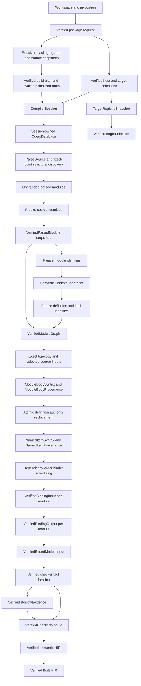
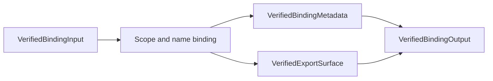

<!-- @dsCard group="Design Documents" name="ARCHITECTURE" -->
# ZOM Compiler Architecture - Current Implementation

Updated: 2026-07-20

This document describes executable code in the repository. RFC status and
future contracts are tracked under `docs/rfc`; a contract is listed here only
when a production path constructs and verifies it.

## 1. Production Status

The compiler currently provides:

- verified package, target-selection, source-snapshot, crate-graph, and
  build-script-plan admission, plus a session API for build-script execution;
- lazy lexing, recursive-descent parsing, immutable ASTs, and retained parser
  token snapshots;
- fixed-point structural module discovery;
- one session-owned semantic context, frozen identity registries, and one
  canonical semantic type store;
- one session-owned incremental query database and scheduler with exact source,
  package, topology, selected-source, definition-authority, and readiness
  inputs;
- a complete verified module graph before binding starts;
- verified module-body, named-item, and stable owner-body semantic syntax
  separated from revision-local source provenance;
- dependency-ordered module binding with immutable binding metadata and export
  surfaces;
- canonical signature, coherence, module-interface, checked, dispatch, and
  borrow-evidence publication for the supported source subset;
- checked-module assembly, semantic HIR, and evidence-bound Built MIR,
  committed atomically by `CompilerSession`; and
- deterministic structured diagnostics and architecture gates.

The production path does not yet provide:

- production ownership analysis and ownership-proof publication;
- owner-body binding, materialization, aggregate verification, and complete
  replacement of definition-only body processing required by RFC 0019;
- complete language-wide body checking and exhaustiveness beyond the admitted
  checker fact inventory; or
- executable MIR, target LIR, LLVM IR, object files, linking, or binaries.

`CompilerSession::checkSources()` stages every checker, evidence, CheckedModule,
HIR, and Built MIR publication before mutating session state. A missing required
fact or any source, identity, codec, or IR invariant rejects the entire stage.

## 2. Live Module Inventory

| Path | Responsibility | Published result |
|---|---|---|
| `compiler/source` | Own source buffers and source locations | `BufferId`, `SourceLoc`, source text views |
| `compiler/lexer` | Produce tokens on demand | parser-consumed tokens |
| `compiler/parser` | Parse one retained source snapshot | `ast::Tree` and `ParsedTokenSnapshot` |
| `compiler/query` | Own tracked inputs, immutable snapshots, dependency validation, red-green memo reuse, and deterministic demand telemetry | `QueryDatabase`, `QuerySnapshot`, typed query values, dependency groups, and memo metadata |
| `compiler/ast` | Own immutable schema-backed syntax | `Tree`, `NodeId`, schema verification, deterministic dumps |
| `compiler/identity` | Define and freeze canonical semantic identities | context-branded package, crate, source, module, definition, impl, and type handles |
| `compiler/driver/package` | Resolve packages, targets, source snapshots, and build scripts | verified package-session inputs and finalized compilation roots |
| `compiler/driver` | Own the session, discover source candidates, and sequence graph, parse, bind, check, evidence, HIR, and MIR boundaries | `VerifiedCrateGraph`, `VerifiedModuleGraph`, interfaces, evidence repositories, and atomic stage publications |
| `compiler/binder` | Admit parsed modules, derive and resolve canonical dependencies, verify graph and binder input, construct scopes, resolve names, and publish export surfaces | `VerifiedParsedModule`, `VerifiedModuleGraph`, `VerifiedBindingOutput` |
| `compiler/type` | Canonicalize and intern closed semantic type payloads | `SemanticTypeId` and immutable lookup views |
| `compiler/checker` | Produce and verify signatures, coherence, inference, body facts, dispatch, borrow surfaces, and checked facts | revision-bound verified fact families and repository leases |
| `compiler/hir` | Assemble checked modules and lower semantic declarations and scalar facts | `VerifiedCheckedModule`, `VerifiedHirModule` |
| `compiler/mir` | Lower and independently verify evidence-bound Built MIR | `VerifiedBuiltMir` |
| `compiler/ir` | Own target selections, canonical IR identity, and the shared closed IR failure algebra | `VerifiedTargetSelection`, typed IR failures and diagnostics |
| `compiler/diagnostics` | Register, sort, and render source and invariant diagnostics | `DiagnosticEngine` output |
| `utils/zomc` | Admit a workspace and invoke the production session | AST output, syntax-only binding success, or explicit stage failure |
| `runtime` | Provide runtime support symbols | runtime libraries; no compiler backend consumer yet |

Stable Binder query identities are canonical package, crate, source, module,
definition, implementation, and owner keys. Active semantic publications use
context-branded `DefId`, `ImplId`, `ModuleId`, and module-local `ScopeId`;
semantic types enter through `SemanticTypeStore`.

## 3. Session Pipeline

### Parse and discovery

`parseSources()` starts from finalized crate roots. It repeatedly stages exact
source snapshots and compilation options, demands `ParseSource` for the
canonically ordered set of unparsed source identities, verifies the query
result against the immutable source snapshot, derives structural module
dependency requests, and admits any newly discovered source. The loop ends
only when no source remains.

The session then freezes source identities, promotes every parser result to a
context-branded `VerifiedParsedModule`, freezes module identities, computes the
semantic context fingerprint, freezes definition and impl identities, verifies
one frozen definition inventory per module, resolves structural module paths,
and publishes the complete `VerifiedModuleGraph`.

`Lexer::lex(Token&)` feeds a Lazy TokenStream on demand. `TokenCursor` provides
bounded lookahead and rewind while retaining parser-visible tokens for the
verified snapshot. `Parser::parse()` returns `zc::none` after an error-level
lexical or syntax diagnostic, so no failed parser result can be promoted.

### Binding

`bindSources()` selects only modules whose graph dependencies already have a
verified binding publication. For each module it constructs a requester-owned
graph view, imports only verified dependency export surfaces, verifies the
complete `BindingInputCandidate`, and calls `runBinding()`.

Before binding starts, the session stages exact active-crate, active-module,
dependency, selected-source, and source-snapshot inputs and verifies the
query-derived module order against the frozen module graph. It then refreshes
the complete active-definition authority map in one transaction and restores
readiness only with the complete set fingerprint. A new ready snapshot demands
`NamedItemSyntax` and `NamedItemProvenance` for every active definition. No
named-item provider scans modules or reads session registries. The registered
owner projection catalog derives canonical `ModuleBodyOwners`, projects one
module-or-definition `OwnerBodySyntax`, and retains exact revision-local
`OwnerBodyProvenance` through alternative-specific dependencies. These owner
queries are not yet production Binder roots.

Successful binding publishes one atomic `VerifiedBindingOutput`:

Source rejection publishes diagnostics but no output. An identity or binder
invariant publishes a closed invariant group and no partial metadata or export
surface.

### Checking and emission

`checkSources()` consumes sealed `VerifiedBoundModuleInput` values and stages
canonical signature facts, coherence, module interfaces, checked facts,
dispatch facts, and borrow evidence. It then assembles `VerifiedCheckedModule`,
lowers `VerifiedHirModule`, builds and independently verifies Built MIR, and
commits all staged repositories and vectors together. Unsupported or incomplete
source facts fail closed with typed source or invariant diagnostics and publish
nothing from the stage.

AST emission is available after verified parsing. `--syntax-only` completes
after verified binding. Dispatch emission consumes only verified dispatch facts
after a successful check. Binary selection reaches the registered `ZOM6007`
terminal because target LIR and native emission are not implemented.

`CompilerSession::executeBuildScripts()` can verify and install build results,
but `zomc` does not call it. A package that requires build-script results cannot
reach finalized roots through the CLI and fails closed during package-session
preparation. Packages with directly available roots do not require that API.

## 4. Ownership And Freeze Boundaries

| Data | Owner | Publication rule |
|---|---|---|
| Package resolution memory, request, graph, snapshots, build plan, and results | `CompilerSession` | installed atomically before parsing; snapshots explicitly finalized |
| Source bytes | `SourceManager` | immutable source snapshots bind bytes, length, and digest before parser promotion |
| Parser tokens and AST | `VerifiedParsedModule` | receipt-verified and immutable after source-registry freeze |
| Query inputs and memos | `CompilerSession` and `QueryDatabase` | base mutations remove definition-authority readiness; complete authority replacement restores readiness atomically before named-item demand; owner projection memos retain canonical owner syntax separately from revision-local provenance |
| Semantic context and identity registries | `CompilerSession` | one brand and one registry family; handles are context and slot checked |
| Semantic types | `SemanticTypeStore` | one append-only store; only store-bound `canonicalizeClosed()` may create an internable payload |
| Module dependencies | `VerifiedModuleGraph` | one complete immutable graph and requester-filtered views |
| Binding facts | `VerifiedBindingOutput` | metadata and export surface publish together after independent verification |
| Checker facts and interfaces | checked-fact repository and `CompilerSession` | independently verified canonical revisions staged for all modules, then committed together |
| Borrow evidence | borrow-evidence repository | verified complete local/imported inventory and branded lease; committed with checked results |
| CheckedModule, HIR, and Built MIR | `CompilerSession` | exact lineage to binder/checker/evidence revisions; no partial publication on failure |
| Target facts | `TargetRegistrySnapshot` and verified package input | target selection is verified before session installation |

Semantic type admission requires the package, crate, source-file, module,
definition, and impl registries to be frozen. It validates every child
`SemanticTypeId` and `DefId` against the store context, slot, and definition
kind before computing canonical bytes. `SemanticTypeStore::intern()` accepts
only a `CanonicalTypeData` capability created for that store and registry
family.

## 5. Determinism And Concurrency

The production session is deterministic and phase-ordered:

- parse/discovery worklists sort complete canonical source keys;
- identity registries freeze canonical keys before public handles are used;
- module graph records and edges use canonical encodings and revisions;
- tracked input transactions publish exact root sets, and query snapshots
  validate presence-aware dependencies without tombstones;
- active-definition authority replacement is complete and atomic, and
  named-item and owner projection query keys and canonical values are
  independent of worker execution order;
- binding runs in dependency order and consumes immutable dependency surfaces;
- binder source failures are constructed deterministically, and identity and
  binder invariant facts are ordered and grouped before rendering; and
- canonical type storage and evidence repositories are append-only; and
- checked facts, interfaces, HIR, and Built MIR use canonical revisions and
  atomically ordered module vectors.

The current `CompilerSession` sequences parse/discovery and binding publication
deterministically and owns a four-worker scheduler for query dependency groups.
No public API promises parallel module publication, reusable incremental
compilation across separate sessions, or concurrent mutation of session
publications.

## 6. IR And Backend Boundary

`compiler/ir` owns the immutable target registry plus common IR identity,
failure, and diagnostic contracts:

- canonical target features;
- canonical target specifications and target-spec digests;
- registered target profiles and registry revisions; and
- verified host and target selections used by package-session admission;
- closed source, identity, capability, and invariant failure branches; and
- deterministic registered-diagnostic projection.

`zomc` currently constructs one host/abort profile. A
`VerifiedTargetSelection` is bound to the registry revision and semantic
projection but not yet to the session `SemanticContextFingerprint`.

Semantic HIR and Built MIR are production, session-published internal
representations with independent verifiers and exact codec oracles. Built MIR
is not executable and has no stable user-facing text format. No target LIR,
LLVM lowering, or native backend is built.

## 7. Diagnostics

The `.def` registries are authoritative. The registered families are:

| Family | Codes | Purpose |
|---|---|---|
| Parse | sparse `ZOM2001-ZOM2105` | lexer, parser, grammar, modifier, and module-scope syntax |
| Binder and module | `ZOM3001-ZOM3026` | names, scopes, imports, exports, visibility, and module paths |
| Checker | sparse `ZOM4001-ZOM4092` | semantic, constant, borrow-surface, and marker-interface diagnostics |
| IR and backend capability | `ZOM6006`, `ZOM6007`, `ZOM6009` | panic, binary, and target capability failures |
| Package | `ZOM7001-ZOM7017`, `ZOM7091-ZOM7093` | manifests, resolution, materialization, build scripts, and notes |
| Compiler invariants | sparse `ZOM9905-ZOM9956` | package, identity, binder, checker, dispatch, IR, interface, and module-graph invariants |

The executable diagnostic coverage gate currently proves 249 definitions, 212
production emissions with test assertions, and 37 non-emitted definitions
bound to active RFC trackers. It rejects undefined emissions, untracked dead
definitions, stale reservations, and unasserted production emissions.

## 8. Verification

The merge-ready verification set is:

- `cmake --preset sanitizer`;
- `cmake --build --preset sanitizer`;
- `ctest --preset default --output-on-failure`;
- `python3 scripts/check-format.py`;
- `python3 scripts/check-rfc.py`;
- `python3 scripts/check-binder-architecture.py --check`;
- `python3 scripts/check-checker-architecture.py --check`;
- `python3 scripts/check-compiler-session-architecture.py --check`;
- `python3 scripts/check-incremental-query-architecture.py --check`;
- `python3 scripts/check-identity-architecture.py --check`;
- `python3 scripts/check-ir-architecture.py --check`;
- `python3 scripts/check-diagnostic-coverage.py --check` and `--self-test`;
- `python3 scripts/check-package-architecture.py --check`;
- relevant architecture self-tests and negative fixtures; and
- `git diff --check`.

Passing this set proves the implemented boundaries named above. It does not
prove ownership analysis, executable MIR, target LIR, LLVM, object emission,
linking, or native execution until those publications and their executable
gates exist.
