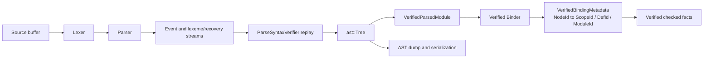
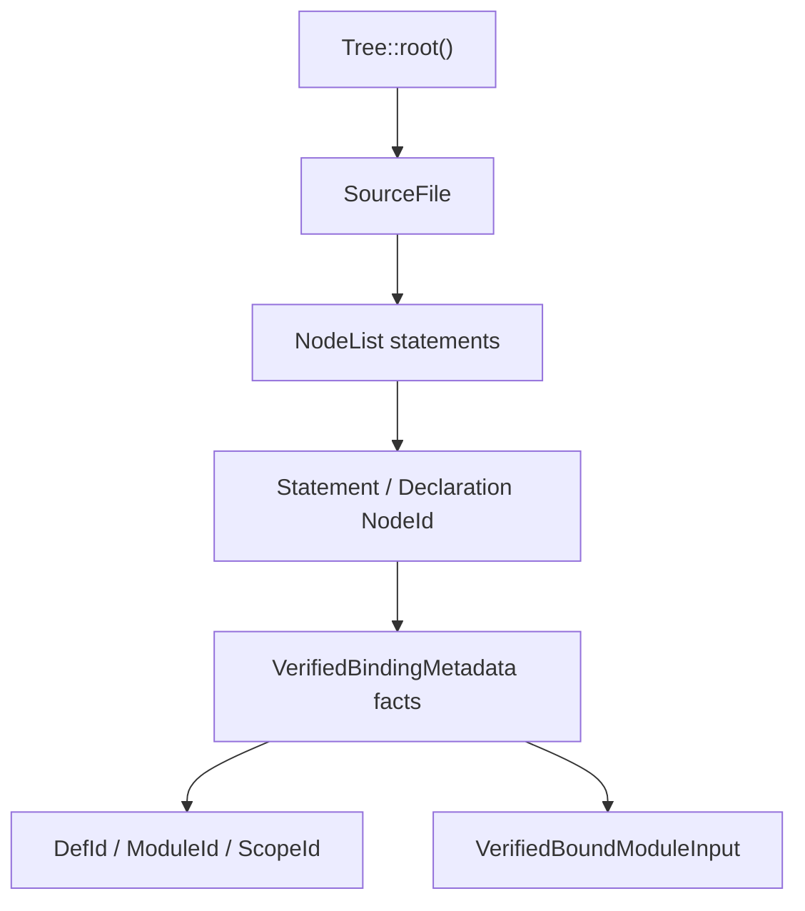

# ZOM AST Data Structure Design

This is a non-normative implementation guide for the current AST
representation. The governing decision record is
[RFC 0002](../rfc/0002-parser-architecture.md) (LANDED). The implementation
lives in `compiler/ast/`, is exposed by the CMake target named `ast`, and
uses the namespace `zomlang::compiler::ast`.

## Pipeline Contract

The parser emits a construction-event stream plus byte-covering lexeme and
recovery streams; it never appends to an `ast::TreeBuilder` directly. An
independent `ParseSyntaxVerifier` replays the events into a fresh
`TreeBuilder`, schema-verifies the result, and promotes it to an immutable
`ast::Tree`, which the parser-result verifier binds to an immutable source
snapshot before the binder consumes it. Syntax storage is separated from
semantic identity and checked facts.



## Core Types

`NodeId` is the stable local reference to a syntax node inside one owning
`Tree`.

```cpp
struct NodeId final {
  uint32_t value = 0;

  constexpr explicit operator bool() const noexcept { return value != 0; }
};
```

`NodeId{0}` is the empty value. Valid node ids are non-zero and are checked with
`Tree::contains(NodeId)`.

`Node` is a fixed payload record. It contains only syntax data.

```cpp
struct Node final {
  SyntaxKind kind = SyntaxKind::Unknown;
  source::SourceRange range;
  NodePayload payload;
};
```

`NodePayload` is a compact fixed-width payload area:

```cpp
struct NodePayload final {
  uint32_t words[kNodePayloadWordCount] = {};
};
```

`schema.yml` owns `storage.payload_words`; `gen_ast.py` emits
`generated/node-layout.h`, and `tree.h` statically verifies the resulting byte
capacity. Generated constants and accessors assign semantic meaning to payload
words for each schema node. Hand-written code uses generated names instead of
numeric word indexes.

`NodeList` is an independent list handle over contiguous `NodeId` storage:

```cpp
struct NodeList final {
  uint32_t first = 0;
  uint32_t size = 0;
};
```

List elements are not encoded as synthetic syntax nodes. `Tree::list(NodeList)`
resolves a list handle to `zc::ArrayPtr<const NodeId>`.

## Tree Ownership

`Tree` owns all syntax nodes and list storage for one parsed source file.

```cpp
class Tree final {
public:
  NodeId root() const;
  size_t nodeCount() const;
  bool contains(NodeId id) const;
  const Node& node(NodeId id) const;
  zc::ArrayPtr<const Node> nodes() const;
  zc::ArrayPtr<const NodeId> list(NodeList list) const;
};
```

`TreeBuilder` is the only mutable construction API.

```cpp
class TreeBuilder final {
public:
  NodeId makeNode(SyntaxKind kind, source::SourceRange range,
                  NodePayload payload = {});
  NodeList makeList(zc::ArrayPtr<const NodeId> nodes);
  void setRoot(NodeId id);
  Tree finish();
};
```

Finished trees are move-only and immutable.

## Source File Shape

`SourceFile` is the root node. `ModuleDeclaration` is a schema node referenced
from the `SourceFile` payload when a file declares a module.

```yaml
- id: 0x170
  name: SourceFile
  fields:
    - {name: file_name, type: StringId}
    - {name: module, type: NodeId, cast: ModuleDeclaration, optional: true}
    - {name: statements, type: NodeList, cast: StatementListItem}

- id: 0x0EC
  name: ModuleDeclaration
  fields:
    - {name: form, type: ModuleDeclarationForm}
    - {name: declared_name, type: IdentId}
    - {name: alias_target, type: NodeId, cast: ModulePath, optional: true}
    - {name: inline_items, type: NodeList, cast: StatementListItem, optional: true}
    - {name: exported_alias, type: bool}
```

The generated payload constants define the root layout:

```cpp
payload.words[kSourceFileFileNameWord]
payload.words[kSourceFileModuleWord]
payload.words[kSourceFileStatementsFirstWord]
payload.words[kSourceFileStatementsSizeWord]
```

## Semantic Metadata

Syntax nodes never store definitions, scopes, semantic types, dispatch targets,
or checker state. During binding, module-local syntax references are projected
into independently verified fact sequences defined by
[`compiler/binder/binding-fact-schema.def`](../compiler/binder/binding-fact-schema.def):
scope, definition, import binding, module alias, label, shadow-target,
control-transfer, deferred member, owner-local binding, callable parameter,
generic parameter, closure free-variable, explicit closure capture, local
export, and impl binding facts. Semantic definitions use context-branded
`DefId`; modules use `ModuleId`; scopes use context-checked module-local
`ScopeId`.

`NodeId` remains valid only with its owning tree and may appear in verified
frontend facts that explicitly retain that tree. Cross-module and downstream
semantic identity never uses a raw `BufferId + NodeId`, pointer, name, or table
slot.

## Schema And Generation

`compiler/ast/schema.yml` is the implementation-side source of
truth for syntax node payloads. `scripts/codegen/gen_ast.py` emits generated
headers into `compiler/ast/generated/`.

| File | Purpose |
|---|---|
| `generated/node-kind.inc` | `SyntaxKind` node rows included by `ast/kinds.h` |
| `generated/node-layout.h` | Schema-owned payload capacity used by `NodePayload` |
| `generated/node-payload.h` | Payload word counts and named payload indexes |
| `generated/node-accessors.h` | Node kind names and schema helper functions |
| `generated/node-traverse.h` | Generic tree traversal entry points |
| `generated/node-schema.h` | Reflection metadata for dumpers and tests |

Generated files are compiled through the main `ast` target and stay in the
`zomlang::compiler::ast` namespace.

## AST Dump Contract

`docs/rfc/0001-ast-dump-format.md` defines the schema-driven AST dump contract.
The CLI surface is:

```bash
zomc compile --dump-ast path/to/file.zom
zomc compile --dump-ast --ast-format=tree path/to/file.zom
zomc compile --dump-ast --ast-format=json path/to/file.zom
zomc compile --dump-ast --ast-format=raw path/to/file.zom
```

`tree` is the default review and lit snapshot format. It prints schema node
names, `NodeId` handles, one-based source spans, decoded scalar fields, and
expanded child lists.

`json` is the tool-facing named format. It includes the schema fingerprint,
source spans, node names, and schema field names. It does not expose payload
words.

`raw` is compiler-debug-only output for compact storage layout inspection. It is
not a conformance snapshot format.

`tests/tools/regen-lit.py` regenerates AST expectations from
the default `tree` output. Run it after parser, binder, AST schema, AST dump, or
diagnostic changes that affect conformance snapshots.

## Parser Contract

`Parser::parse()` produces a single-use recoverable result carrying a
construction event stream and a byte-covering lexeme/recovery record. It does
not mutate an `ast::Tree`. `ParseSyntaxVerifier` independently replays the
event stream into a new `TreeBuilder`, appends nodes and lists with source
ranges, and sets `Tree::root()` to a `SourceFile` node; schema verification
runs before the finished tree is promoted.

The replayed tree contains `ModuleDeclaration`, `ImportDeclaration`, and
`ExportDeclaration` nodes through the schema. Top-level source statements are
represented by the `SourceFile.statements` `NodeList`.

## Binder Contract

The binder accepts only `VerifiedBindingInput`. It walks the retained tree by
`NodeId`, reads payloads through generated schema accessors, constructs
module-local scopes and canonical definition/module resolutions, then publishes
`VerifiedBindingMetadata` and `VerifiedExportSurface` atomically as one
`VerifiedBindingOutput`. `VerifiedBoundModuleInput` is the sealed handoff to the
checker.



## Verification Gates

Changes to the AST representation require:

```bash
cmake --preset sanitizer
cmake --build --preset sanitizer -j
ctest --preset default --output-on-failure
python3 scripts/check-format.py
```

Schema changes also require regenerating generated AST headers:

```bash
python3 scripts/codegen/gen_ast.py --write
```
