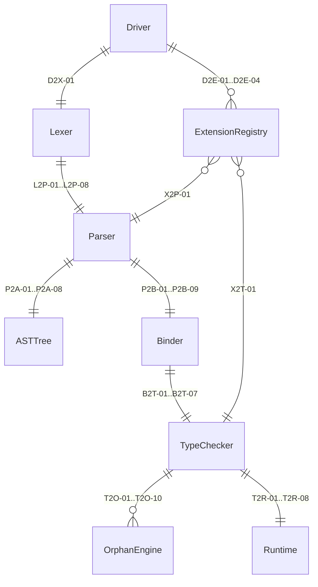
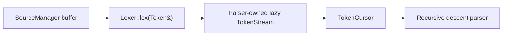

<!-- @dsCard group="Design Documents" name="ZIS" -->
# ZOM Internal Specification (ZIS) — Compiler Subsystem Contracts
*Version 2026-06-25 — Canonical Draft v1.0.0*

## Table of Contents

1. Purpose & Scope
2. Diagnostic Code Authority
3. Diagnostic Severity Model
4. Lexer to Parser Contract
5. Parser to AST Contract
6. Parser to Binder Contract
7. Binder to TypeChecker Contract
8. TypeChecker to Runtime Contract
9. TypeChecker to Orphan and Marker Coherence
10. Extension Hook Interface
11. ICE, Assertion and Logging Discipline

---

## 1. Purpose & Scope

This document, the ZOM Internal Specification (ZIS), defines the **contracts** between subsystems inside the ZOM compiler pipeline. It is not a language specification for end users; it is the authoritative contract reference for ZOM compiler engineers. Every subsystem engineer treats the clauses in this document as invariants whose violation produces an Internal Compiler Error (ICE) rather than a user-facing diagnostic. External language-level specifications (the user-facing spec in `docs/spec/`, grammar references, and library RFCs) define what user programs may do; this document defines what each pipeline stage must preserve, produce, consume, and never do, regardless of input.

Fifteen internal contract areas are enumerated below. Each contract area is assigned a two-letter subsystem prefix and a sequential number namespace so that individual invariants can be cited unambiguously in code comments, PR review notes, and ICE reports.

1. **Lex to Parser (L2P-xx)** — token stream shape, trivia attachment, span conventions, and error-propagation token contract. Defined in section 4.
2. **Parser to AST (P2A-xx)** — schema coverage, `NodeId` reachability, `NodeList` ordering, source spans, and orphan-kind elimination rules. Defined in section 5.
3. **Parser to Binder (P2B-xx)** — syntax-reference stability, source-file completeness, scope tree production, undeclared-reference emission rules, and shadowing behavior. Defined in section 6.
4. **Binder to TypeChecker (B2T-xx)** — Symbol pointer validity, unresolved-type placeholder preservation, raises-clause binding, and marker constraint re-running. Defined in section 7.
5. **TypeChecker to Runtime (T2R-xx)** — zero-cost concurrency gating, marker verification shift, scope-exit-noexcept enforcement, and eradication of runtime marker queries. Defined in section 8.
6. **TypeChecker to Orphan Engine (bidirectional)** — alias normalization ordering, negative-impl bitmap closure, and blanket-override sequencing. Defined in section 9.
7. **TypeChecker to Marker Coherence Engine (bidirectional)** — marker incompatibility matrix, seed-bit propagation, and unsafe-impl attestation validation. Defined in section 9.
8. **TypeChecker to Diagnostics Engine (bidirectional)** — severity lattice application, lint-level pushdown, forbid-escape prohibition, and diagnostic attachment to canonical type nodes. Defined in section 3.
9. **TypeChecker to FFI Layer** — C ABI conformance checks, `extern "C"` function signature lowering, foreign type marker closure propagation, and `#[zom::ffi::*]` attribute authority. Referenced by contract T2R-07 and diagnostic range 0900–0929.
10. **TypeChecker to Concurrency Gating (bidirectional)** — Sendable/Shared/SuspendSafe lattice closure, spawn capture verification, scope lifetime bound, and suspend-hazard analysis. Diagnostics 8000–8599 fall here.
11. **Driver to Extension Hooks** — plugin registration order, per-session lifetime boundaries, hook call timing, and reentrancy prohibition. Defined in section 10.
12. **Logging / ICE Discipline** — macro usage rules, severity thresholds, assertion hot-zones, and ICE-report checklist. Defined in section 11.
13. **Session Serialization** — incremental compilation artifacts, crate-metadata wire format, query-cache keying, and determinism requirements for every `Session::serialize()` / `Session::deserialize()` path.
14. **Compile-Commands Database** — `compile_commands.json` emission, per-translation-unit argument capture, header-unit map consistency, and LSP response correctness guarantees when a compile database is present.
15. **Test Harnesses and Lint Passes** — lit-test RUN directives, ui-test stderr exact-match semantics, fixit application round-trip, and lint-pass ordering (run *before* monomorphisation for marker lints, run *after* drop elaboration for Linear-use lints).

The diagram below shows the eight core entities of the compiler pipeline and the named contracts that connect them. Each edge label identifies the contract family that governs data crossing that edge, using the same codes cited throughout the remainder of this document.



A compiler engineer who modifies behavior along any labeled edge must update the matching numbered clauses in this document *before* landing the code change. A CI check validates that every edge label in the diagram has a corresponding clause definition in the sections below.

---

## 2. Diagnostic Code Authority

The table below is the **authoritative copy** of the ZOM diagnostic-code range assignment. The three columns `Range`, `Subsystem`, and `Min-Severity` are a bit-identical mirror of `docs/design/architecture.md` §8; PRs changing any of the three values require simultaneous updates to both files. Additional ZIS-only columns document the owning C++ directory path and whether a subsystem owner may allocate unused sub-ranges without an accepted RFC under `docs/rfc/` (`Extensible = No` means every new code requires an RFC before implementation).

| Range (start–end) | Subsystem / Owner path | Owner (C++ dir path) | Min-Severity | Extensible | Example Code |
|---|---|---|---|---|---|
| 0000–0099 | Reserved for ICE sentinels | `products/zomlang/compiler/diagnostics` | ICE | No | `ZOM0001` = Assertion failure in generic invariant check → ICE |
| 0100–0199 | Lexer / tokenization | `products/zomlang/compiler/lexer` | Error | No | `ZOM0108` = Unclosed block comment at EOF with no matching `*/` → Error |
| 0100–0199 | Lexer / tokenization | `products/zomlang/compiler/lexer` | Error | No | `ZOM0121` = Invalid UTF-8 continuation byte in string literal → Error |
| 0100–0199 | Lexer / tokenization | `products/zomlang/compiler/lexer` | Warning | Yes | `ZOM0153` = Numeric literal contains non-semantic underscore run ≥ 4 chars → Warning |
| 0200–0299 | Parser / syntax | `products/zomlang/compiler/parser` | Error | No | `ZOM0204` = Expected `;` after statement, found unexpected token → Error |
| 0200–0299 | Parser / syntax | `products/zomlang/compiler/parser` | Error | No | `ZOM0217` = `if` expression missing `else` branch in non-unit type context → Error |
| 0200–0299 | Parser / syntax | `products/zomlang/compiler/parser` | Warning | Yes | `ZOM0260` = Ambiguous operator precedence requires explicit parentheses (pedantic) → Warning |
| 4300–4399 | Type checker / dyn object safety | `products/zomlang/compiler/checker` | Error | No | `ZOM4331` = interface has a generic method and cannot be used as `dyn` → Error |
| 4300–4399 | Type checker / dyn object safety | `products/zomlang/compiler/checker` | Error | No | `ZOM4332` = interface method returns bare `Self` and cannot be used as `dyn` → Error |
| 4300–4399 | Type checker / dyn object safety | `products/zomlang/compiler/checker` | Error | No | `ZOM4333` = interface method has a move-self receiver and cannot be used as `dyn` → Error |
| 4300–4399 | Type checker / dyn object safety | `products/zomlang/compiler/checker` | Error | No | `ZOM4334` = `dyn` interface requires an associated type to be bound → Error |
| 4300–4399 | Type checker / dyn object safety | `products/zomlang/compiler/checker` | Error | No | `ZOM4335` = interface has a static method and cannot be used as `dyn` → Error |
| 4300–4399 | Type checker / dyn object safety | `products/zomlang/compiler/checker` | Error | No | `ZOM4336` = interface has a generic associated type and cannot be used as `dyn` → Error |
| 4300–4399 | Type checker / dyn object safety | `products/zomlang/compiler/checker` | Error | No | `ZOM4337` = interface method has an unsized boundary type and cannot be used as `dyn` → Error |
| 4300–4399 | Type checker / dyn object safety | `products/zomlang/compiler/checker` | Error | No | `ZOM4338` = interface inherits an object-unsafe superinterface and cannot be used as `dyn` → Error |
| 4400–4499 | Type checker / unification | `products/zomlang/compiler/checker` | Error | No | `ZOM4410` = type mismatch at an assignment, initializer, return, argument, or coercion site → Error |
| 4400–4499 | Type checker / unification | `products/zomlang/compiler/checker` | Error | No | `ZOM4411` = cannot unify two types in a specific expression context → Error |
| 4400–4499 | Type checker / unification | `products/zomlang/compiler/checker` | Error | No | `ZOM4412` = infinite type detected during unification → Error |
| 4400–4499 | Type checker / calls | `products/zomlang/compiler/checker` | Error | No | `ZOM4415` = attempted to call a non-function value → Error |
| 4400–4499 | Type checker / casts | `products/zomlang/compiler/checker` | Error | No | `ZOM4416` = invalid cast between source and target types → Error |
| 4400–4499 | Type checker / generic inference | `products/zomlang/compiler/checker` | Error | No | `ZOM4420` = cannot infer an unsolved generic type parameter → Error |
| 4400–4499 | Type checker / nullable inference | `products/zomlang/compiler/checker` | Error | No | `ZOM4421` = `null` initializer has no explicit target type → Error |
| 4400–4499 | Type checker / generic inference | `products/zomlang/compiler/checker` | Error | No | `ZOM4423` = explicit generic call type argument count mismatch → Error |
| 4400–4499 | Type checker / trait coherence | `products/zomlang/compiler/checker` | Error | No | `ZOM4430` = conflicting implementations for the same interface and type → Error |
| 4400–4499 | Type checker / trait bounds | `products/zomlang/compiler/checker` | Error | No | `ZOM4431` = type does not implement a required interface → Error |
| 4400–4499 | Type checker / operator traits | `products/zomlang/compiler/checker` | Error | No | `ZOM4432` = operator trait implementation has the wrong method signature → Error |
| 4400–4499 | Type checker / associated types | `products/zomlang/compiler/checker` | Error | No | `ZOM4433` = associated type projection has no matching binding → Error |
| 4400–4499 | Type checker / associated types | `products/zomlang/compiler/checker` | Error | No | `ZOM4434` = associated type projection is ambiguous without an interface qualifier → Error |
| 4400–4499 | Type checker / match analysis | `products/zomlang/compiler/checker` | Error | No | `ZOM4440` = match is non-exhaustive → Error |
| 4400–4499 | Type checker / match analysis | `products/zomlang/compiler/checker` | Warning | Yes | `ZOM4442` = match arm is unreachable → Warning |
| 4400–4499 | Type checker / mutability | `products/zomlang/compiler/checker` | Error | No | `ZOM4450` = immutable binding is mutated → Error |
| 4400–4499 | Type checker / error propagation | `products/zomlang/compiler/checker` | Error | No | `ZOM4460` = `?!` propagates an error not declared by the function's `raises` clause → Error |
| 4400–4499 | Type checker / error propagation | `products/zomlang/compiler/checker` | Error | No | `ZOM4461` = `!!` is applied to a non-error-union type → Error |
| 0500–0599 | Marker / coherence engine | `products/zomlang/compiler/checker` | Error | No | `ZOM0501` = Impl of marker `Sendable` for type `*mut T` conflicts with negative impl in scope → Error |
| 0500–0599 | Marker / coherence engine | `products/zomlang/compiler/checker` | Error | No | `ZOM0502` = MarkerNameClash: a marker, interface, class, and alias cannot share the same identifier in the type namespace → Error |
| 0500–0599 | Marker / coherence engine | `products/zomlang/compiler/checker` | Error | No | `ZOM0505` = Duplicate standalone `impl I for T` — two impl blocks provide the same (interface, type) pair → Error |
| 0500–0599 | Marker / coherence engine | `products/zomlang/compiler/checker` | Error | No | `ZOM0508` = Diamond-resolution ambiguous: multiple inherited impls provide `foo`; disambiguate with `InterfaceName::foo(this)` → Error |
| 0500–0599 | Marker / coherence engine | `products/zomlang/compiler/checker` | Error | No | `ZOM0517` = MarkerCannotHaveMethods: a marker declaration contains a block body, method signature, or associated type; markers are zero-method structural predicates. Use interface for behavior → Error |
| 0500–0599 | Marker / coherence engine | `products/zomlang/compiler/checker` | Error | No | `ZOM0519` = MarkerCycle: derived-marker declaration transitively references itself (e.g. marker A = A + B). Break the cycle at one participating marker → Error |
| 0500–0599 | Marker / coherence engine | `products/zomlang/compiler/checker` | Error | No | `ZOM0524` = Closure captured value is `!Shared` yet escaped to `spawn()` call boundary → Error |
| 0500–0599 | Marker / coherence engine | `products/zomlang/compiler/checker` | Error | No | `ZOM0531` = AutoMarkerUnionAmbiguous: an auto marker cannot be structurally derived for union types or untagged enums; write an explicit positive or negative impl → Error |
| 0500–0599 | Marker / coherence engine | `products/zomlang/compiler/checker` | Error | No | `ZOM0535` = UnsafeMarkerImplRequiresUnsafe: impl M for T on an unsafe marker requires the unsafe keyword; attest soundness via `unsafe impl M for T` → Error |
| 0500–0599 | Marker / coherence engine | `products/zomlang/compiler/checker` | Note | Yes | `ZOM0588` = Coherence scope originates from module declared here → Note |
| 0600–0699 | Attributes / annotations | `products/zomlang/compiler/parser` | Error | No | `ZOM0611` = Attribute namespace `vendor` missing reverse-domain prefix (expected `com.vendor.xxx`) → Error |
| 0600–0699 | Attributes / annotations | `products/zomlang/compiler/parser` | Error | No | `ZOM0630` = `#[inline(never)]` applied to generic function with only in-MTU callers → Error |
| 0600–0699 | Attributes / annotations | `products/zomlang/compiler/parser` | Warning | Yes | `ZOM0670` = Unknown attribute `#[magic]`; no registered handler — ignoring → Warning |
| 0700–0799 | Orphan rule / impl locality | `products/zomlang/compiler/checker` | Error | No | `ZOM0701` = UnjustifiedNegativeImpl: Negative impl `!M for T` tries to erase a Phase-A seed lang-item marker bit → Error |
| 0700–0799 | Orphan rule / impl locality | `products/zomlang/compiler/checker` | Error | No | `ZOM0702` = OrphanNegativeImpl: `impl !M for T` where both marker `M` and type `T` are foreign to declaring crate → Error |
| 0700–0799 | Orphan rule / impl locality | `products/zomlang/compiler/checker` | Error | No | `ZOM0703` = Impl for foreign trait `ForeignTrait` on foreign type `ForeignTy` violates orphan rule → Error |
| 0700–0799 | Orphan rule / impl locality | `products/zomlang/compiler/checker` | Error | No | `ZOM0708` = Orphan interface impl: both the interface `I` and type `T` are foreign to the declaring crate → Error |
| 0700–0799 | Orphan rule / impl locality | `products/zomlang/compiler/checker` | Error | No | `ZOM0710` = OrphanGenericHeadUnresolved: Generic parameter at impl-head position cannot be proven local at compile time → Error |
| 0700–0799 | Orphan rule / impl locality | `products/zomlang/compiler/checker` | Error | No | `ZOM0711` = NegativeImplOnInterface: `impl !I for T` not allowed — interfaces are behavioural contracts, only structural markers can be negated → Error |
| 0700–0799 | Orphan rule / impl locality | `products/zomlang/compiler/checker` | Error | No | `ZOM0712` = DownstreamBlanketRevivesNegated: Downstream blanket impl restores a marker bit that upstream explicitly negated via `unsafe impl !M for T` → Error |
| 0700–0799 | Orphan rule / impl locality | `products/zomlang/compiler/checker` | Error | No | `ZOM0713` = OverlapBlanketNotCovered: Blanket impl partially overlaps a concrete impl without v1 specialization support → Error |
| 0700–0799 | Orphan rule / impl locality | `products/zomlang/compiler/checker` | Error | No | `ZOM0714` = Conflicting impls for trait `Eq<A>` both match after type normalization → Error |
| 0700–0799 | Orphan rule / impl locality | `products/zomlang/compiler/checker` | Error | No | `ZOM0715` = OrphanFundamentalWrapperMisuse: Type used as "fundamental" in orphan test is not in the compiler-approved Box/Pin/Cell/Unique/RefCell/UnsafeCell list → Error |
| 0700–0799 | Orphan rule / impl locality | `products/zomlang/compiler/checker` | Error | No | `ZOM0716` = CoherenceMetadataHashMismatch: Upstream crate metadata hash changed between incremental builds; cache flushed and rebuild required → Error |
| 0700–0799 | Orphan rule / impl locality | `products/zomlang/compiler/checker` | Error | No | `ZOM0720` = SealedInterfaceImplOutsideCrate: `impl I for T` on a `sealed interface I` outside declaring crate or explicit `#[zom::sealed(allow=[...])]` list → Error |
| 0700–0799 | Orphan rule / impl locality | `products/zomlang/compiler/checker` | Error | No | `ZOM0721` = MarkerIncompatibleUserDefined: Marker pair declared incompatible via `#[zom::marker::incompatible(A, B)]` violated on type `T` → Error |
| 0800–0899 | Module / import / export | `products/zomlang/compiler/modules` | Error | No | `ZOM0805` = Cyclic module dependency: A → B → C → A detected during topological sort → Error |
| 0800–0899 | Module / import / export | `products/zomlang/compiler/modules` | Error | No | `ZOM0810` = ImportNotFound / ModuleNotFound: module `math::geometry::proj` cannot be resolved under any active search path → Error |
| 0800–0899 | Module / import / export | `products/zomlang/compiler/modules` | Error | No | `ZOM0815` = SymbolNotExported: named import `math.geometry.{_distance}` targets symbol declared without `export` in the upstream module → Error |
| 0800–0899 | Module / import / export | `products/zomlang/compiler/modules` | Error | No | `ZOM0820` = AmbiguousImport / ImportNameClash: two imports bind the same local name; use `as` alias to disambiguate → Error |
| 0800–0899 | Module / import / export | `products/zomlang/compiler/modules` | Error | No | `ZOM0821` = `export` symbol not declared in the current module's root scope → Error |
| 0800–0899 | Module / import / export | `products/zomlang/compiler/modules` | Error | No | `ZOM0825` = ReexportNonExportedSymbol: `export a.b.{X}` re-exports a symbol that upstream `a.b` did not itself publish → Error |
| 0800–0899 | Module / import / export | `products/zomlang/compiler/modules` | Error | No | `ZOM0827` = ExportUndefinedSymbol: `export { X }` references a name not present in current module scope → Error |
| 0800–0899 | Module / import / export | `products/zomlang/compiler/modules` | Error | No | `ZOM0828` = DuplicateExportName: two different declaration-sites exported under the same public name → Error |
| 0800–0899 | Module / import / export | `products/zomlang/compiler/modules` | Error | No | `ZOM0830` = PrivateAccessCrossBoundary: identifier `X` (declared `pub(crate)` in upstream crate) is not visible to downstream consumer → Error |
| 0800–0899 | Module / import / export | `products/zomlang/compiler/modules` | Error | No | `ZOM0832` = InvalidVisibilityOnTopLevel: `public` / `private` / `protected` used at module top level; valid only inside class/interface/struct/enum bodies → Error |
| 0800–0899 | Module / import / export | `products/zomlang/compiler/modules` | Error | No | `ZOM0833` = ExportInsideNonExportedContainer: `export` keyword applied to a member of a non-exported container class/struct → Error |
| 0800–0899 | Module / import / export | `products/zomlang/compiler/modules` | Error | No | `ZOM0834` = FinalClassSubclassed: class `B` extends final class `A`; final-classes cannot be subclassed by default — write `open class A` to permit inheritance → Error |
| 0800–0899 | Module / import / export | `products/zomlang/compiler/modules` | Error | No | `ZOM0835` = SealedClassOutsideHierarchy: subclass of sealed `A` declared outside `A`'s declaring crate or `#[zom::sealed(allow=[...])]` list → Error |
| 0800–0899 | Module / import / export | `products/zomlang/compiler/modules` | Error | No | `ZOM0836` = ExtensibilityOnMarker: `open` / `sealed` / `final` modifier applied to a `marker` declaration — markers are always open for implementation → Error |
| 0800–0899 | Module / import / export | `products/zomlang/compiler/modules` | Error | No | `ZOM0840` = ImportMustBeTopLevel: `import` statement appears inside function body / block scope → Error |
| 0800–0899 | Module / import / export | `products/zomlang/compiler/modules` | Error | No | `ZOM0845` = ExportMustBeTopLevel: declaration-site `export` applied to non-top-level nested declaration → Error |
| 0800–0899 | Module / import / export | `products/zomlang/compiler/modules` | Error | No | `ZOM0850` = DuplicateModuleDeclaration: more than one `module x.y;` declaration in a single source file → Error |
| 0800–0899 | Module / import / export | `products/zomlang/compiler/modules` | Warning | Yes | `ZOM0860` = Import of `foo::bar` is never used in this compilation unit → Warning |
| 0800–0899 | Module / import / export | `products/zomlang/compiler/modules` | Error | No | `ZOM0870` = PackageNotFound: dependency package declared in Zom.toml cannot be resolved → Error |
| 0800–0899 | Module / import / export | `products/zomlang/compiler/modules` | Error | No | `ZOM0871` = VersionConflict: PubGrub resolver cannot satisfy all dependency version constraints — prints conflict chain → Error |
| 0800–0899 | Module / import / export | `products/zomlang/compiler/modules` | Error | No | `ZOM0872` = UnresolvedDependency: `import other_crate::foo` references a crate not listed in `[dependencies]` → Error |
| 0800–0899 | Module / import / export | `products/zomlang/compiler/modules` | Error | No | `ZOM0873` = WorkspaceMemberNotFound: `[workspace].members` glob pattern matches zero valid Zom.toml paths → Error |
| 0800–0899 | Module / import / export | `products/zomlang/compiler/modules` | Error | No | `ZOM0875` = MissingEditionField: Zom.toml `[package]` section missing mandatory `edition` field → Error |
| 0800–0899 | Module / import / export | `products/zomlang/compiler/modules` | Error | No | `ZOM0876` = EditionTooNew: dependency crate requires edition beyond what current compiler version supports → Error |
| 0800–0899 | Module / import / export | `products/zomlang/compiler/modules` | Error | No | `ZOM0881` = ModulePathAmbiguous: symbolic path resolves to BOTH `a/b.zom` AND `a/b/mod.zom` on disk — delete one → Error |
| 0800–0899 | Module / import / export | `products/zomlang/compiler/modules` (bind phase) | Error | No | `ZOM0888` = FileSuffixAmbiguous: file-name suffix could resolve to more than one predefined cfg gate; use explicit `zom::cfg` attribute instead → Error |
| 0800–0899 | Module / import / export | `products/zomlang/compiler/modules` | Error | No | `ZOM0890` = BuildScriptFailed: `[package].build` helper program exited with non-zero status — full stderr logged → Error |
| 0900–0949 | FFI / interop | `products/zomlang/compiler/checker` + `products/zomlang/compiler/backend` (planned) | Error | No | `ZOM0904` = `extern "C"` function returns non-FFI-safe type `String` without `#[repr(C)]` → Error |
| 0900–0949 | FFI / interop | `products/zomlang/compiler/checker` + `products/zomlang/compiler/backend` (planned) | Error | No | `ZOM0918` = C ABI linkage mismatch: declaration specifies `cdecl` but library provides `stdcall` → Error |
| 0950–0999 | Error handling / raises clause | `products/zomlang/compiler/checker` | Error | No | `ZOM0950` = Error-union tagset is ambiguous; two or more variants share identical disambiguation context at this use site → Error |
| 0950–0999 | Error handling / raises clause | `products/zomlang/compiler/checker` | Error | No | `ZOM0951` = Raises-signature mismatch: function body propagates an error variant not declared in the enclosing function's `raises(...)` clause → Error |
| 0950–0999 | Error handling / raises clause | `products/zomlang/compiler/checker` | Error | No | `ZOM0952` = Cannot propagate error: the `?!` operator is used in a context (e.g., unit-returning function or loop body with no enclosing `raises` / return-type union) that has no residual channel → Error |
| 0950–0999 | Error handling / raises clause | `products/zomlang/compiler/checker` | Error | No | `ZOM0953` = Operand of `?!` or `!!` does not implement `interface Try` and is not an error-union type → Error |
| 0950–0999 | Error handling / raises clause | `products/zomlang/compiler/checker` | Error | No | `ZOM0954` = `Try::branch` residual kind does not match the residual expected by the enclosing function's declared return type → Error |
| 0950–0999 | Error handling / raises clause | `products/zomlang/compiler/checker` | Warning | Yes | `ZOM0955` = `!!` unwrap operator used under the release profile; prefer explicit error handling or document why panic is impossible → Warning |
| 0950–0999 | Error handling / raises clause | `products/zomlang/compiler/checker` | Warning | Yes | `ZOM0956` = An expression typed `T | E` (or an impl of `interface Try`) is silently discarded without pattern-matching or `?!` propagation → Warning |
| 0950–0999 | Error handling / raises clause | `products/zomlang/compiler/checker` | Info | Yes | `ZOM0957` = The `main` function declared a non-zero exit-code path that is not reflected in a corresponding raises-clause or `process::exit` call → Info |
| 0950–0999 | Error handling / raises clause | `products/zomlang/compiler/checker` | Error | No | `ZOM0958` = Built-in allocation function is invoked with a layout whose size, alignment, or total padded bytes violate the platform allocator contract → Error |
| 0950–0999 | Error handling / raises clause | `products/zomlang/compiler/checker` | Error | No | `ZOM0959` = Allocation function is annotated (or crate-defaults via `#[zom::oom(panic)]`) to panic on OOM, but a downstream call-site expects an error-union return; declaration-site OOM policy conflicts with use-site error handling → Error |
| 0950–0999 | Error handling / raises clause | `products/zomlang/compiler/checker` | Error | No | `ZOM0960` = `#[zom::derive(Error)]` applied to a declaration that is not an enum and not a struct (e.g. an interface, alias, or function) → Error |
| 0950–0999 | Error handling / raises clause | `products/zomlang/compiler/checker` | Error | No | `ZOM0961` = A helper attribute used inside a `#[zom::derive(Error)]` target (`#[source]`, `#[backtrace]`, `#[message = "..."]`) is attached to the wrong node kind or carries an ill-typed value → Error |
| 0950–0999 | Error handling / raises clause | `products/zomlang/compiler/checker` | Warning | Yes | `ZOM0962` = `catch_unwind` is invoked outside an `extern "C"` boundary; prefer raises clauses or `?!` propagation for in-ZOM error handling → Warning |
| 0950–0999 | Error handling / raises clause | `products/zomlang/compiler/checker` | Error | No | `ZOM0963` = The crate-level `#![zom::panic(strategy)]` attribute and the explicit `[profile.*].panic` field in `Zom.toml` specify conflicting strategies (one "unwind", one "abort") → Error |
| 0950–0999 | Error handling / raises clause | `products/zomlang/compiler/checker` | Warning | Yes | `ZOM0964` = Backtrace capture was requested (directly via `Backtrace::capture()` or transitively via `#[zom::error(trace)]`) but the current target profile or build environment does not provide debug-info or frame-pointer based unwinding support → Warning |
| 0950–0999 | Error handling / raises clause | `products/zomlang/compiler/checker` | Warning | Yes | `ZOM0965` = An `extern "C"` function whose panic strategy is "unwind" has no visible `catch_unwind` or `#[zom::error_boundary]` wrapper; a panic escaping this function is undefined behavior → Warning |
| 1800–1899 | FFI / interop | `products/zomlang/compiler/checker` | Error | No | `ZOM1801` = `extern "X"` specifies ABI not supported by current compiler/target → Error |
| 1800–1899 | FFI / interop | `products/zomlang/compiler/checker` | Error | No | `ZOM1802` = Parameter or return type in extern block does not impl marker `FfiSafe` → Error |
| 1800–1899 | FFI / interop | `products/zomlang/compiler/checker` | Error | No | `ZOM1803` = Struct/enum used as FFI parameter lacks `#[repr(C)]` attribute (or enum lacks fixed-int repr) → Error |
| 1800–1899 | FFI / interop | `products/zomlang/compiler/checker` | Error | No | `ZOM1804` = Extern block function contains a body — bodies are not allowed (functions are imported, not defined) → Error |
| 1800–1899 | FFI / interop | `products/zomlang/compiler/checker` | Error | No | `ZOM1805` = `#[zom::no_mangle]` applied to generic function; cannot produce a single symbol for all monomorphizations → Error |
| 1800–1899 | FFI / interop | `products/zomlang/compiler/checker` | Error | No | `ZOM1810` = Attempt to export or import a function taking/returning a Linear type through `extern "C"` → Error |
| 1800–1899 | FFI / interop | `products/zomlang/compiler/checker` | Error | No | `ZOM1820` = C-string contains unexpected interior NUL byte at a nonzero offset → Error |
| 1800–1899 | FFI / interop | `products/zomlang/compiler/checker` | Error | No | `ZOM1821` = C-string length exceeds `isize::MAX`, violating the length-prefix contract → Error |
| 1800–1899 | FFI / interop | `products/zomlang/compiler/checker` | Warning | Yes | `ZOM1830` = `...` varargs in extern block require platform support that is unavailable on the current architecture (e.g. some wasm profiles) → Warning |
| 1900–1949 | Conditional Compilation | `products/zomlang/compiler/checker` | Error | No | `ZOM1900` = CfgPredicateParseFailure: `zom::cfg` attribute predicate parse failure (unbalanced parens, unknown combinator, malformed atom) → Error |
| 1900–1949 | Conditional Compilation | `products/zomlang/compiler/checker` | Error | No | `ZOM1901` = CfgOnExpression: `zom::cfg` attribute applied to expression position (expression-level gating not supported) → Error |
| 1900–1949 | Conditional Compilation | `products/zomlang/compiler/checker` | Error | No | `ZOM1902` = UnknownCfgKey: cfg predicate references a key not declared by the current compiler target model or package manifest -> Error |
| 1900–1949 | Conditional Compilation | `products/zomlang/compiler/checker` | Error | No | `ZOM1903` = UndeclaredFeatureRef: cfg predicate references `feature = "foo"` but feature `foo` not declared in manifest `[features]` → Error |
| 1900–1949 | Conditional Compilation | `products/zomlang/compiler/modules` | Error | No | `ZOM1904` = FeatureCycle: feature dependency graph contains a cycle (e.g. `features.foo = ["bar"]`, `features.bar = ["foo"]`) → Error |
| 1000–1099 | Concurrency / runtime / scope & scheduler | `products/zomlang/compiler/checker` + `products/zomlang/runtime` | Error | No | `ZOM1000` = ScopeNotFound: referenced scope id does not exist or already terminated → Error |
| 1000–1099 | Concurrency / runtime / scope & scheduler | `products/zomlang/compiler/checker` + `products/zomlang/runtime` | Error | No | `ZOM1001` = ScopeAlreadyCanceled: second cancel_all call on already-canceled scope → Error |
| 1000–1099 | Concurrency / runtime / scope & scheduler | `products/zomlang/compiler/checker` + `products/zomlang/runtime` | Error | No | `ZOM1002` = ScopeDroppedWhileRunning: scope handle dropped before nested children joined → Error |
| 1000–1099 | Concurrency / runtime / scope & scheduler | `products/zomlang/compiler/checker` + `products/zomlang/runtime` | Error | No | `ZOM1003` = ChildNotFoundInSupervisor: supervisor restart references child id not in child map → Error |
| 1000–1099 | Concurrency / runtime / scope & scheduler | `products/zomlang/compiler/checker` + `products/zomlang/runtime` | Error | No | `ZOM1004` = SupervisorMaxRestarts: supervisor exceeded max_restarts within restart_period → Error |
| 1000–1099 | Concurrency / runtime / scope & scheduler | `products/zomlang/compiler/checker` + `products/zomlang/runtime` | Warning | Yes | `ZOM1005` = TaskPanicIsolated: panic inside task caught at scope boundary → Warning |
| 1000–1099 | Concurrency / runtime / scope & scheduler | `products/zomlang/compiler/checker` + `products/zomlang/runtime` | Error | No | `ZOM1006` = NestedRuntimeStart: block_on called within thread that already runs a runtime → Error |
| 1000–1099 | Concurrency / runtime / scope & scheduler | `products/zomlang/compiler/checker` + `products/zomlang/runtime` | Error | No | `ZOM1007` = RuntimeShutdownTimeout: top-level runtime did not shut down within graceful window → Error |
| 1000–1099 | Concurrency / runtime / scope & scheduler | `products/zomlang/compiler/checker` + `products/zomlang/runtime` | Error | No | `ZOM1010` = ScopeLocalUninitialized: scope-local read before first set → Error |
| 1000–1099 | Concurrency / runtime / scope & scheduler | `products/zomlang/compiler/checker` + `products/zomlang/runtime` | Error | No | `ZOM1011` = ScopeLocalTypeMismatch: scope-local stored value type differs from declared static type → Error |
| 1000–1099 | Concurrency / runtime / scope & scheduler | `products/zomlang/compiler/checker` + `products/zomlang/runtime` | Error | No | `ZOM1012` = ScopeLocalAlreadyInitialized: set on already-initialized once scope-local → Error |
| 1000–1099 | Concurrency / runtime / scope & scheduler | `products/zomlang/compiler/checker` + `products/zomlang/runtime` | Error | No | `ZOM1020` = TimerHandleInvalid: timer handle generation counter does not match wheel slot → Error |
| 1000–1099 | Concurrency / runtime / scope & scheduler | `products/zomlang/compiler/checker` + `products/zomlang/runtime` | Warning | Yes | `ZOM1021` = TimerExpiredWhileCancelled: cancel issued on timer that has already fired → Warning |
| 1000–1099 | Concurrency / runtime / scope & scheduler | `products/zomlang/compiler/checker` + `products/zomlang/runtime` | Warning | Yes | `ZOM1022` = TimerWheelCapacityExceeded: live timer count exceeded WHEEL_MAX_ENTRIES → Warning |
| 1000–1099 | Concurrency / runtime / scope & scheduler | `products/zomlang/compiler/checker` + `products/zomlang/runtime` | Error | No | `ZOM1030` = ChannelNotSpsc: second concurrent producer detected on an spsc::Sender → Error |
| 1000–1099 | Concurrency / runtime / scope & scheduler | `products/zomlang/compiler/checker` + `products/zomlang/runtime` | Error | No | `ZOM1031` = ChannelClosed: operation attempted on channel whose both halves are gone → Error |
| 1000–1099 | Concurrency / runtime / scope & scheduler | `products/zomlang/compiler/checker` + `products/zomlang/runtime` | Warning | Yes | `ZOM1032` = ChannelBipartisanDisconnect: sender/receiver dropped mid in-flight transfer → Warning |
| 1000–1099 | Concurrency / runtime / scope & scheduler | `products/zomlang/compiler/checker` + `products/zomlang/runtime` | Error | No | `ZOM1033` = SenderHalfDropped: recv on channel whose only sender has been dropped → Error |
| 1000–1099 | Concurrency / runtime / scope & scheduler | `products/zomlang/compiler/checker` + `products/zomlang/runtime` | Error | No | `ZOM1034` = ReceiverHalfDropped: send on channel whose only receiver has been dropped → Error |
| 1000–1099 | Concurrency / runtime / scope & scheduler | `products/zomlang/compiler/checker` + `products/zomlang/runtime` | Warning | Yes | `ZOM1035` = ChannelFull: try_send failed because all capacity slots are occupied → Warning |
| 1000–1099 | Concurrency / runtime / scope & scheduler | `products/zomlang/compiler/checker` + `products/zomlang/runtime` | Warning | Yes | `ZOM1036` = ChannelEmpty: try_recv failed because no message is queued → Warning |
| 1000–1099 | Concurrency / runtime / scope & scheduler | `products/zomlang/compiler/checker` + `products/zomlang/runtime` | Error | No | `ZOM1037` = CapacityZero: channel(0) or mpsc::channel(0): zero capacity not permitted → Error |
| 1000–1099 | Concurrency / runtime / scope & scheduler | `products/zomlang/compiler/checker` + `products/zomlang/runtime` | Error | No | `ZOM1040` = MutexDeadlockSuspected: same task re-locks non-reentrant Mutex it already owns → Error |
| 1000–1099 | Concurrency / runtime / scope & scheduler | `products/zomlang/compiler/checker` + `products/zomlang/runtime` | Warning | Yes | `ZOM1041` = MutexPoisoned: lock() on Mutex whose previous holder panicked → Warning |
| 1000–1099 | Concurrency / runtime / scope & scheduler | `products/zomlang/compiler/checker` + `products/zomlang/runtime` | Error | No | `ZOM1042` = RwLockReadersExceeded: read() saturates reader-count field on saturated RwLock → Error |
| 1000–1099 | Concurrency / runtime / scope & scheduler | `products/zomlang/compiler/checker` + `products/zomlang/runtime` | Warning | Yes | `ZOM1043` = CondvarMismatchedMutex: condvar.wait(guard) with guard from different Mutex → Warning |
| 1000–1099 | Concurrency / runtime / scope & scheduler | `products/zomlang/compiler/checker` + `products/zomlang/runtime` | Warning | Yes | `ZOM1044` = DeadlockDetected: wait-for-graph SCC of size ≥ 2 detected under Report policy → Warning |
| 1000–1099 | Concurrency / runtime / scope & scheduler | `products/zomlang/compiler/checker` + `products/zomlang/runtime` | Warning | Yes | `ZOM1045` = DeadlockEscalatedByCancel: SCC found but cancel_all already active; waiting grace window → Warning |
| 1000–1099 | Concurrency / runtime / scope & scheduler | `products/zomlang/compiler/checker` + `products/zomlang/runtime` | Error | No | `ZOM1050` = NotSendable: spawn body captures value whose type is !Sendable → Error |
| 1000–1099 | Concurrency / runtime / scope & scheduler | `products/zomlang/compiler/checker` + `products/zomlang/runtime` | Error | No | `ZOM1051` = NotShared: spawn body captures &T where T is !Shared → Error |
| 1000–1099 | Concurrency / runtime / scope & scheduler | `products/zomlang/compiler/checker` + `products/zomlang/runtime` | Error | No | `ZOM1052` = IncomparableMemoryOrder: atomic method invoked with ordering outside allowed set → Error |
| 1000–1099 | Concurrency / runtime / scope & scheduler | `products/zomlang/compiler/checker` + `products/zomlang/runtime` | Error | No | `ZOM1053` = AtomicAlignmentInvalid: Atomic<T> instantiated for type not in canonical valid list → Error |
| 1000–1099 | Concurrency / runtime / scope & scheduler | `products/zomlang/compiler/checker` + `products/zomlang/runtime` | Error | No | `ZOM1054` = DoubleJoin: join() called twice on the same JoinHandle → Error |
| 1000–1099 | Concurrency / runtime / scope & scheduler | `products/zomlang/compiler/checker` + `products/zomlang/runtime` | Error | No | `ZOM1055` = JoinOnDetachedHandle: join() called on handle previously passed to detach() → Error |
| 1000–1099 | Concurrency / runtime / scope & scheduler | `products/zomlang/compiler/checker` + `products/zomlang/runtime` | Error | No | `ZOM1060` = NumaNodeOutOfRange: affinity(N) requested NUMA node beyond host count → Error |
| 1000–1099 | Concurrency / runtime / scope & scheduler | `products/zomlang/compiler/checker` + `products/zomlang/runtime` | Error | No | `ZOM1061` = WorkerThreadAffinityFailed: OS setaffinity call failed for a worker thread → Error |
| 1000–1099 | Concurrency / runtime / scope & scheduler | `products/zomlang/compiler/checker` + `products/zomlang/runtime` | Warning | Yes | `ZOM1062` = ParkTimeoutSpuriousWakeupPolicyIgnored: park timeout wakeup policy not supported → Warning |
| 1000–1099 | Concurrency / runtime / scope & scheduler | `products/zomlang/compiler/checker` + `products/zomlang/runtime` | Error | No | `ZOM1070` = FfiRustAsyncABIInvalid: Rust-async bridge shim signature mismatch at load time → Error |
| 1000–1099 | Concurrency / runtime / scope & scheduler | `products/zomlang/compiler/checker` + `products/zomlang/runtime` | Error | No | `ZOM1071` = FfiRustFuturePollPanicked: Rust future panicked inside poll, surfaced as PanicInfo → Error |
| 1000–1099 | Concurrency / runtime / scope & scheduler | `products/zomlang/compiler/checker` + `products/zomlang/runtime` | Warning | Yes | `ZOM1072` = FfiRustWakerLeaks: waker refcount imbalance detected at ZOM scope shutdown → Warning |
| 1000–1099 | Concurrency / runtime / scope & scheduler | `products/zomlang/compiler/checker` + `products/zomlang/runtime` | Warning | Yes | `ZOM1080` = SelectEmptySet: select([]) called with zero handles → Warning |
| 1000–1099 | Concurrency / runtime / scope & scheduler | `products/zomlang/compiler/checker` + `products/zomlang/runtime` | Warning | Yes | `ZOM1081` = RaceEmptySet: race([]) called with zero handles → Warning |
| 1000–1099 | Concurrency / runtime / scope & scheduler | `products/zomlang/compiler/checker` + `products/zomlang/runtime` | Warning | Yes | `ZOM1082` = JoinEmptySet: join_all([]) called with zero handles → Warning |
| 1000–1099 | Concurrency / runtime / scope & scheduler | `products/zomlang/compiler/checker` + `products/zomlang/runtime` | Warning | Yes | `ZOM1083` = ZipArityMismatch: zip / zipN invoked with incorrect handle arity → Warning |
| 1000–1099 | Concurrency / runtime / scope & scheduler | `products/zomlang/compiler/checker` + `products/zomlang/runtime` | Error | No | `ZOM1084` = GpuNonPodCapture: GPU kernel closure captures a type that is not Pod + Shared → Error |
| 1000–1099 | Concurrency / runtime / scope & scheduler | `products/zomlang/compiler/checker` + `products/zomlang/runtime` | Error | No | `ZOM1085` = GpuNonConstGridDim: grid dimension of `kernel<B>` is not a statically evaluable integer → Error |
| 1000–1099 | Concurrency / runtime / scope & scheduler | `products/zomlang/compiler/checker` + `products/zomlang/runtime` | Error | No | `ZOM1086` = GpuDirectTransferNotAllowed: direct memcpy between Device-local and Host tiers without staging buffer → Error |
| 1000–1099 | Concurrency / runtime / scope & scheduler | `products/zomlang/compiler/checker` + `products/zomlang/runtime` | Warning | Yes | `ZOM1087` = GpuBackendUnavailable: no vendor loader discovered; CPU fallback activated → Warning |
| 1000–1099 | Concurrency / runtime / scope & scheduler | `products/zomlang/compiler/checker` + `products/zomlang/runtime` | Warning | Yes | `ZOM1088` = TraceAlreadyCommitted: `set_sampled(true)` on a scope that already has recorded children → Warning |
| 1000–1099 | Concurrency / runtime / scope & scheduler | `products/zomlang/compiler/checker` + `products/zomlang/runtime` | Warning | Yes | `ZOM1089` = TraceExporterMissing: trace sampling > 0 but no `TraceExporter` installed at runtime start → Warning |
| 1000–1099 | Concurrency / runtime / scope & scheduler | `products/zomlang/compiler/checker` + `products/zomlang/runtime` | Error | No | `ZOM1090` = CancelAllWithoutPermission: cancel_all on scope whose policy disallows cancellation → Error |
| 1000–1099 | Concurrency / runtime / scope & scheduler | `products/zomlang/compiler/checker` + `products/zomlang/runtime` | Error | No | `ZOM1091` = DeterministicUnrecordedSyscall: raw syscall outside runtime wrapper in Record mode → Error |
| 1000–1099 | Concurrency / runtime / scope & scheduler | `products/zomlang/compiler/checker` + `products/zomlang/runtime` | Error | No | `ZOM1092` = DeterministicDivergence: replay observation differs from trace-recorded bits → Error |
| 1000–1099 | Concurrency / runtime / scope & scheduler | `products/zomlang/compiler/checker` + `products/zomlang/runtime` | Error | No | `ZOM1093` = DeterministicTraceVersionMismatch: trace header edition/runtime_sha256 does not match current build → Error |
| 1000–1099 | Concurrency / runtime / scope & scheduler | `products/zomlang/compiler/checker` + `products/zomlang/runtime` | Warning | Yes | `ZOM1094` = FairnessViolation: debug-build runtime detected violation of F-1..F-5 rule → Warning |
| 1000–1099 | Concurrency / runtime / scope & scheduler | `products/zomlang/compiler/checker` + `products/zomlang/runtime` | Error | No | `ZOM1095` = ChannelPayloadNotSerializable: cross-process channel T bound `Serialize` not satisfied → Error |
| 1000–1099 | Concurrency / runtime / scope & scheduler | `products/zomlang/compiler/checker` + `products/zomlang/runtime` | Error | No | `ZOM1096` = IpcTransportUnsupported: `unix_abstract` or `named_pipe` constructor on unsupported OS → Error |
| 1000–1099 | Concurrency / runtime / scope & scheduler | `products/zomlang/compiler/checker` + `products/zomlang/runtime` | Error | No | `ZOM1097` = IpcFrameCorrupted: IPC frame checksum mismatch; channel closed → Error |
| 1000–1099 | Concurrency / runtime / scope & scheduler | `products/zomlang/compiler/checker` + `products/zomlang/runtime` | Error | No | `ZOM1098` = IpcFdsExceedLimit: `send_with_fds` descriptor count exceeds `SCM_MAX_FDS_DEFAULT` → Error |
| 1000–1099 | Concurrency / runtime / scope & scheduler | `products/zomlang/compiler/checker` + `products/zomlang/runtime` | Warning | Yes | `ZOM1099` = IpcConnectionFailed: cross-process constructor returned `IpcError` not handled at call site → Warning |
| 1100–1199 | Comptime blocks / builtins | `products/zomlang/compiler/checker` | Error | No | `ZOM1107` = `@comptime` expression failed to evaluate at compile time — division by zero → Error |
| 1100–1199 | Comptime blocks / builtins | `products/zomlang/compiler/checker` | Warning | Yes | `ZOM1140` = `@sizeOf(T)` depends on opaque forward type — resolved lazily → Warning |
| 1200–1299 | Lint framework | `products/zomlang/compiler/checker` | Warning | Yes | `ZOM1201` = Function exceeds recommended cyclomatic complexity threshold of 20 → Warning |
| 1200–1299 | Lint framework | `products/zomlang/compiler/checker` | Warning | Yes | `ZOM1215` = Unused local variable prefixed with non-underscore; prefix `_` to suppress → Warning |
| 1300–1399 | Driver / CLI / options | `products/zomlang/compiler/driver` | Error | No | `ZOM1303` = Unknown flag `--magical` passed to `zom build` → Error |
| 1300–1399 | Driver / CLI / options | `products/zomlang/compiler/driver` | Warning | Yes | `ZOM1340` = Debug build with LTO enabled produces excessive link times → Warning |
| 2000–2049 | Edition & Lint | `products/zomlang/compiler/checker` | Error | No | `ZOM2001` = ForbidLintDowngrade: attempted to lower a FORBID-level lint via `#[zom::allow(...)]`; forbid lints cannot be suppressed → Error |
| 2000–2049 | Edition & Lint | `products/zomlang/compiler/checker` | Error | No | `ZOM2002` = RemovedLanguageConstruct: source uses a construct that is not part of the active language definition -> Error |
| 2000–2049 | Edition & Lint | `products/zomlang/compiler/checker` | Error | No | `ZOM2003` = UnsupportedEditionMode: source or command-line options request an edition mode not implemented by this compiler -> Error |
| 1400–1999 | Reserved for future type-system sub-features | `products/zomlang/compiler/checker` (reserved) | Error | No | `ZOM14xx` block held for specialization, variance, and permission sub-typing diagnostics → Error |
| 2050–2999 | Reserved for trait / impl solver | `products/zomlang/compiler/checker` | Error | No | `ZOM2xxx` block held for solver overflow, recursion, and solver model diagnostics -> Error |
| 3000–3999 | Binder and legacy semantic diagnostics | Binder plus shared semantic diagnostics | Error | No | `ZOM3301` = unresolved identifier; `ZOM30xx` backs legacy semantic diagnostics while subsystem-specific ranges are being split → Error |
| 4000–4999 | Reserved for constant evaluator | `products/zomlang/compiler/checker` | Error | No | `ZOM4xxx` block held for extended comptime, const generics, and interpreter diagnostics → Error |
| 5000–5999 | Reserved syntax and semantic fallback diagnostics | Parser / binder / checker integration | Error | No | `ZOM5001` = reserved exception syntax; `ZOM50xx` also backs legacy semantic diagnostics while subsystem-specific ranges are being split → Error |
| 6000–6999 | Reserved for link-time / LTO | `products/zomlang/compiler/backend` (planned) | Error | No | `ZOM6xxx` block held for thinLTO, GC-sections, and symbol-collision diagnostics → Error |
| 7000–7999 | Reserved for target / platform | `products/zomlang/compiler/backend` (planned) | Error | No | `ZOM7xxx` block held for ABI, target feature, and alignment diagnostics → Error |
| 8000–8999 | Runtime / concurrency | `products/zomlang/runtime` + `products/zomlang/compiler/checker` | Error | No | `ZOM8011` = `spawn()` task captured `borrow` reference outlives its parent executor scope → Error |
| 8000–8999 | Runtime / concurrency | `products/zomlang/runtime` + `products/zomlang/compiler/checker` | Error | No | `ZOM8024` = Async executor panics on recursive `block_on` call on the same thread → Error |
| 8000–8999 | Runtime / concurrency | `products/zomlang/runtime` + `products/zomlang/compiler/checker` | Warning | Yes | `ZOM8080` = `Mutex` acquired inside polling function risks executor deadlock → Warning |
| 9000–9899 | Miscellaneous / pass infrastructure | `products/zomlang/compiler/diagnostics` | Warning | Yes | `ZOM9001` = Pass registered twice — ignoring duplicate registration → Warning |
| 9900–9999 | Internal compiler errors | `products/zomlang/compiler/diagnostics` | ICE | No | `ZOM9999` = Unhandled case in `NodeKind` switch — compiler invariant broken → ICE |

Each 100-block inside an extensible row is allocated by the subsystem owner via
the diagnostic definition files under `products/zomlang/compiler/diagnostics/`.
Concrete language diagnostics are exercised by conformance sources under
`products/zomlang/tests/conformance/corpus/` plus matching expectations under
`products/zomlang/tests/conformance/expectations/`, and compiler-only diagnostic
plumbing is exercised by ztest suites under
`products/zomlang/tests/unittests/compiler/diagnostics/`. The emitted registry
is generated from `diagnostics-common.def`, `diagnostics-parse.def`,
`diagnostics-checker.def`, and `diagnostics-sema.def`; `DiagnosticEngine`
refuses to emit any code not present
in the generated ids (emitting ZOM9999 `DiagnosticCodeNotRegistered` as an ICE
fallthrough).

Additional structural rules for the 100-block sub-allocation:

- Block `ZOMx000–ZOMx019` is always reserved for setup / generic errors (`MisplacedX`, `UnboundY`).
- Block `ZOMx020–ZOMx069` carries specific, named semantic diagnostics (one per programmer mistake, each with a canonical short-name slug).
- Block `ZOMx070–ZOMx089` carries lint-level diagnostics that may be `allow`'d per scope.
- Block `ZOMx090–ZOMx099` carries `deny`-by-default or `forbid`-by-default entries that are not allowed to be downgraded inside user code.

> #### AST representation contract
> Syntax nodes are value payloads in `ast::Tree`, addressed by `ast::NodeId`.
> Semantic data is stored in side tables keyed by `NodeId`; AST nodes do not own binder,
> checker, or symbol metadata. The layout contract is documented in
> [ast-data-structure.md](ast-data-structure.md).

---

## 3. Diagnostic Severity Model

Five severity levels form a strictly ordered lattice. Higher numeric rank dominates lower numeric rank when two severities are merged for the same primary span:

| Level | Name    | Rank | Exit-code contribution | Suppressible by user scope? |
|-------|---------|------|------------------------|-----------------------------|
| 0     | ICE     | 0    | aborts the session     | Never (not user-fixable)    |
| 1     | Error   | 1    | sets failure bit       | Only via upstream `forbid`-locked rules  |
| 2     | Warning | 2    | neutral                | Yes, via `allow` / `warn`   |
| 3     | Note    | 3    | neutral                | Yes (attached to parent)    |
| 4     | Help    | 4    | neutral                | Yes (attached to parent)    |

Four lint levels exist in attribute form (`#[zom::lint::LEVEL(code)]` and crate-level inner-attribute `#![zom::lint::LEVEL(code)]`):

| Lint level | Meaning                                                                 |
|------------|-------------------------------------------------------------------------|
| `allow`    | Downgrade matching diagnostics to silence; lower rank is emitted.       |
| `warn`     | Keep default severity; does not upgrade from Error/ICE but may downgrade. |
| `deny`     | Upgrade Warning severity to Error (rank 1); no-op on errors.            |
| `forbid`   | Lock severity to Error; subsequent `allow` / `deny` cannot downgrade it. Forbid entries are the *only* way to produce a hard error from a Warning-level lint. |

The following diagnostics are **forbid-by-default**. They cannot be silenced by any crate-level or item-level `allow` attribute; the only way to silence them is to remove the underlying code construct, or (when explicitly documented) to attach a matching `unsafe impl` attestation.

| Forbid-by-default code | Short name                          | Subsystem       |
|------------------------|-------------------------------------|-----------------|
| ZOM0702                 | OrphanNegativeImpl                  | Orphan Engine   |
| ZOM0710                 | CoherenceViolation                  | Orphan Engine   |
| ZOM0712                 | DownstreamBlanketRevivesNegated     | Orphan Engine   |
| ZOM0520                 | LinearSharedIncompatible            | Marker Engine   |
| ZOM0521                 | CopyLinearIncompatible              | Marker Engine   |
| ZOM0810                 | UnsafeOutOfBounds                   | Core lint       |
| ZOM8001                 | SpawnCaptureNonSendable             | Concurrency     |
| ZOM8002                 | SpawnCaptureNonSharedRef            | Concurrency     |
| ZOM8006                 | SuspendHazardHeldMutex              | Concurrency     |
| ZOM8405                 | SuspendInDropForbidden              | Runtime bridge  |

The severity assignment pipeline is a linear chain. Every diagnostic code emitted by any subsystem first lands at CodeEmit and exits at FinalSeverity. The edges below describe the transformation applied at each step. Edges leading to a `forbid` outcome are drawn as thick arrows because forbid is a terminal, non-overridable state.

```mermaid
flowchart LR
    A[CodeEmit] -->|lookup default severity per diagnostic registry| B[ComputeDefault]
    B -->|inspect nearest #[zom::lint::*] item attribute| C[ApplyLintAttr]
    C -->|merge with crate-level inner #![zom::lint::*] attribute (highest-wins)| D[ApplyCrateAttr]
    D -->|attach note/help children + emit| E[FinalSeverity]
    C ==>|lint attr == forbid| E
    D ==>|crate attr == forbid AND code is forbid-by-default-eligible| E
    B ==>|diagnostic in FORBID_BY_DEFAULT table| E
```

Concretely, the merge rules along each edge are:

1. `CodeEmit → ComputeDefault`: The DiagnosticEngine performs a map lookup on the diagnostic code; the default severity is exactly the `Min-Severity` column from the table in section 2 (Warning for lints, Error for semantic failures).
2. `ComputeDefault → ApplyLintAttr`: Walk outward from the diagnostic's primary AST node to the nearest ancestor that carries a lint attribute matching the code. The first match sets the effective level.
3. `ApplyLintAttr → ApplyCrateAttr`: Merge with the crate-level lint map. The highest rank wins (`forbid > deny > warn > allow`); identical ranks fall back to the inner-most (item) attribute.
4. `ApplyCrateAttr → FinalSeverity`: Attach secondary Note and Help diagnostics to the primary span, then push into the session's DiagnosticBuffer. If the final severity is `Error` or `ICE`, the session's `has_errors` bit is set.
5. Forbid shortcut edges: any step that matches a forbid rule **short-circuits** the remainder of the chain and produces `FinalSeverity = Error`.

---

## 4. Lexer to Parser Contract

The lexer (`products/zomlang/compiler/lexer/lexer.cc`, `products/zomlang/compiler/lexer/token.h`) is a streaming UTF-8 scanner. The parser owns a lazy retained `TokenStream` that calls `Lexer::lex(Token&)` only when lookahead requests an unbuffered token. Parser grammar functions consume tokens only through `TokenCursor`; they never call lexer snapshot, restore, or rescan APIs.



**L2P-01 Source Ownership.** The source buffer belongs to `SourceManager` for the lifetime of the parser. Tokens carry `source::SourceRange` values into that buffer; raw token spelling is recovered from source ranges when needed.

**L2P-02 Lazy Determinism.** For a fixed source buffer and language options, repeated lexer runs emit the same token sequence. `TokenStream` may buffer already emitted tokens to support absolute indices and cursor rewinds, but it does not force EOF before parsing begins. Parser-facing stream APIs do not expose `tokenCount()` or `tokenCountWithoutEof()` helpers; post-parse diagnostics may inspect only the already buffered non-EOF token limit.

**L2P-03 Cursor-Only Lookahead.** `TokenCursor::peek()`, `token()`, `advance()`, `mark()`, and `rewind()` are the parser lookahead contract. The cursor does not expose whole-stream `size()`. Parser code must not depend on `LexerState`, `restoreState()`, `getCurrentState()`, `reScanGreaterToken()`, or `reScanTemplateToken()`.

**L2P-04 Token Shape.** Every token stores a `SyntaxKind`, a half-open source range, a canonical value for identifiers and literals, and `TokenFlags`. Newline trivia is represented by `TokenFlags::PrecedingLineBreak`; ordinary whitespace and comments are not emitted as tokens.

**L2P-05 Lexical Error Recovery.** Malformed UTF-8, unsupported punctuation, invalid escapes, invalid numeric separators, unterminated comments, and unterminated literals emit source-ranged diagnostics. The lexer still makes local progress, usually by emitting `Unknown` or a flagged literal token. Any lexer error contributes to the parser error count, so `Parser::parse()` returns `zc::none`.

**L2P-06 Template Modes.** Template literal state is owned by the lexer. The lexer tracks substitution brace depth and emits `NoSubstitutionTemplateLiteral`, `TemplateHead`, `TemplateMiddle`, and `TemplateTail` without parser-driven raw source rescanning.

**L2P-07 Right-Angle Splitting.** The lexer emits maximal `>`, `>>`, and `>>>` tokens. Type contexts use `TokenCursor` split mode to expose virtual single `>` tokens over retained stream tokens. `TokenCursor::Mark` restores the split state exactly.

**L2P-08 EOF And Progress.** Every `lex(Token&)` call either advances source position or emits the single final `EndOfFile` token. Recovery loops that scan with a cursor must treat EOF as a hard boundary and must prove progress before continuing.

```cpp
// products/zomlang/compiler/lexer/token.h
namespace zomlang::compiler::lexer {

class Token {
public:
  Token(ast::SyntaxKind kind, source::SourceRange range,
        zc::StringPtr value = ""_zc, TokenFlags flags = TokenFlags::None) noexcept;

  ZC_NODISCARD ast::SyntaxKind getKind() const;
  ZC_NODISCARD source::SourceRange getRange() const;
  ZC_NODISCARD zc::StringPtr getValue() const;
  ZC_NODISCARD TokenFlags getFlags() const;
  ZC_NODISCARD bool hasPrecedingLineBreak() const;
};

}  // namespace zomlang::compiler::lexer
```

---

## 5. Parser to AST Contract

The parser produces one immutable `ast::Tree` per source buffer. Each syntax node
is a value record addressed by `ast::NodeId`; child lists are stored in
dedicated `NodeList` storage and resolved through `Tree::list()`. The
invariants below govern shape, coverage, and reachability; violation produces
ICE codes in the ZOM92xx series.

**P2A-01 Schema Coverage.** Every concrete AST node kind is declared in
`products/zomlang/compiler/ast/schema.yml` and generated into
`products/zomlang/compiler/ast/generated/node-kind.inc`. `ast/kinds.h` includes
that generated list directly. A node kind that is not part of the schema is not
part of the AST.

**P2A-02 Parser Result Shape.** `Parser::parse()` returns `zc::Maybe<ast::Tree>`.
On success, `Tree::root()` points to exactly one `SourceFile` node. The
`SourceFile` payload contains the optional `ModuleDeclaration` node and the
ordered top-level `NodeList` of statements and declarations.

**P2A-03 NodeId Locality.** `NodeId{0}` is the empty value. Every non-empty
`NodeId` is valid only inside its owning `Tree`, and `Tree::contains(id)` is the
authority for membership. Cross-stage references that outlive a local tree
context carry both `source::BufferId` and `ast::NodeId`.

**P2A-04 AST Acyclicity.** The parent-child relation encoded by schema fields and
`NodeList` handles defines a directed acyclic graph rooted at `SourceFile`.
Parser construction appends nodes and lists through `TreeBuilder`; debug builds
assert that every child `NodeId` placed into a list belongs to the same tree.

**P2A-05 Per-Kind Payload Ordering.** For each `SyntaxKind K`, payload word
layout and child order are defined by `schema.yml` and generated constants in
`generated/node-payload.h`. Hand-written code uses generated accessors or named
word constants instead of numeric payload indexes.

**P2A-06 Node Spans Are Contained In Parent Spans.** For every non-root node `N`
with parent `P`, `P.range` contains `N.range`. Bracket tokens and synthesized
recovery nodes never leak beyond their parent's span. IDE folding ranges,
diagnostic highlights, and AST dumps rely on this containment rule.

**P2A-07 Identifier Spans Match Identifier Tokens Exactly.** Every identifier
syntax node's `range` is identical to the `Identifier` token that produced it.
The parser is forbidden from widening or narrowing an identifier range because
rename refactoring, goto-definition, and identifier highlighting depend on
byte-accurate ranges.

**P2A-08 No Orphan SyntaxKinds Rule.** Any schema node kind that has no parser,
lowering, or explicitly documented synthetic producer is an orphan and must be
deleted from `schema.yml` in the same change that detects the orphan. The AST
target does not carry placeholder node kinds.

```cpp
// products/zomlang/compiler/ast/ast.h
namespace zomlang::compiler::ast {

struct Node final {
    SyntaxKind kind = SyntaxKind::Unknown;
    source::SourceRange range;
    NodePayload payload;
};

class Tree final {
public:
    NodeId root() const;
    const Node& node(NodeId id) const;
    zc::ArrayPtr<const NodeId> list(NodeList list) const;
};

} // namespace zomlang::compiler::ast
```

---

## 6. Parser to Binder Contract

The **Binder** (`products/zomlang/compiler/binder`) walks the AST produced by the parser, constructs a module-level scope forest, resolves every identifier reference to a symbol id or explicitly marks it unresolved, and writes per-node semantic state into `ast::BindingMetadata`. The nine invariants below are the sole contract between the parser's output and the binder's input; the binder must not rely on parser internals beyond what is listed.

**P2B-01 Syntax Reference Stability.** Every declaration and identifier reference is represented by a `NodeId` that is unique inside its owning `ast::Tree`. Symbols that need durable declaration locations store `{ BufferId, NodeId }`. Duplicate `NodeId` values inside one tree, or a symbol declaration reference pointing outside its source tree, produce ICE ZOM9311.

**P2B-02 SourceFile Fully Populated.** For every parsed file, the parser has produced a `SourceFile` node whose `statements` `NodeList` contains every top-level item and whose optional `module` field points to the file's `ModuleDeclaration` when present. The binder does not re-read the filesystem to discover parsed items; any unparsed reachable file is a parser bug that the binder reports via ICE ZOM9312.

**P2B-03 Single-Pass Post-Order Scope Construction.** The binder performs exactly **one** post-order walk of the AST to build the scope forest. It does not revisit nodes. Scopes are created on the way down (pre) and populated on the way up (post); every declaration is inserted into the correct scope exactly once. The scope forest is therefore a tree rooted at the crate scope; cross-module edges are represented as `ImportEdge` records that point from the importing module's scope into the imported module's public symbol layer.

**P2B-04 Undeclared Reference Emission Rule.** For each identifier reference that cannot be resolved to a symbol within its scope chain plus reachable imports, the binder emits **exactly one** diagnostic in the ZOM33xx range. The binder does **not** emit secondary diagnostics at every downstream use of the unresolved reference; it attaches a `Symbol::unresolvedSentinel()` pointer to the reference so that the TypeChecker can short-circuit further resolution without cascading errors.

**P2B-05 Duplicate Declaration.** Two declarations with the same name inserted into the same non-function scope produce diagnostic **ZOM3301 DuplicateDeclaration** (Error). The second declaration is inserted into the scope's `overloadShadow` list rather than the primary name map; lookup never returns it, but IDE "show all references" queries use the shadow list.

**P2B-06 Shadowing Is Not a Diagnostic.** When an inner scope declares a name that already exists in an outer scope, the binder does not emit any diagnostic. Shadowing is a deliberate, supported language feature. Inner-scope lookups return the inner declaration; outer-scope lookups (via qualified paths, or explicit `super::` references) return the outer declaration; lints that wish to flag shadowing must register as lint passes and operate on the post-bind scope forest.

**P2B-07 Use-Before-Decl Inside a Scope Is Disallowed.** Inside a single block scope, a reference to a name that is declared later in the same scope is an undeclared reference (P2B-04). This rule deliberately matches statement-by-statement semantics; mutual recursion between `fun` declarations at module scope is handled by a separate two-pass rule for the top-level module scope only.

**P2B-08 Forward References Across Items Are Allowed Only For Module Scope.** Inside the crate root module and each sub-module, item-level forward references are permitted (the binder pre-populates the module scope with all item names in a first pass, then binds bodies in a second pass). Forward references across sibling items at any nested scope are disallowed.

**P2B-09 Crate Prelude Insertion.** The binder prepends a synthetic `ImportEdge` from every module scope into the implicit `std::prelude` module before running name resolution. The prelude is the only implicit import; no other names are inserted into any scope by hidden mechanism. Code that relies on implicit names outside the prelude (e.g., `zom::` built-in markers) is imported via the explicit `#[zom::lang::*]` attribute machinery.

```cpp
// products/zomlang/compiler/symbol/symbol.h
namespace zc::binder {

class Scope;
class SymbolTable;

/// A Symbol is the canonical, single-location record for a named declaration
/// that is shared by every reference site to that name. The Binder produces
/// exactly one Symbol per NamedDecl; the TypeChecker never allocates Symbols.
class Symbol {
public:
    NodeId                declId;      ///< P2B-01: id of the originating NamedDecl node.
    std::string_view      name;        ///< Bare (unqualified) name of the symbol.
    Scope*                homeScope;   ///< Scope where this symbol was declared.
    SymbolFlags           flags;       ///< Bit set: isPub, isMutable, isExtern, isFn, ...

    // ... accessors for attached type, marker bits, raises clause, etc. ...
};
static_assert(alignof(Symbol) >= 8, "Symbol pointer bits must be taggable.");

} // namespace zc::binder
```

---

## 7. Binder to TypeChecker Contract

The TypeChecker (`products/zomlang/compiler/checker`) consumes the binder's outputs -- scope forest, symbol table, per-node `ast::BindingMetadata`, and module-level `ImportEdge` graph -- and performs type inference, unification, raises-clause subtyping, and marker lattice closure. The seven invariants below define what the TypeChecker may *assume* on input and what the Binder is therefore *required* to establish.

**B2T-01 Every Ident Has Symbol Metadata.** After the binder completes successfully, every identifier reference node has an entry in `BindingMetadata::symbol(NodeId)`. The unresolved symbol id is used for undeclared references (P2B-04). The TypeChecker checks metadata before using a symbol; a missing metadata entry for a bound identifier produces ICE ZOM9401.

**B2T-02 Unresolved-Type Placeholders Are Preserved.** When the binder encounters a generic call whose type argument cannot be syntactically resolved (e.g., `foo.bar<_>(42)` with a `_` type hole), it inserts an `UnresolvedType` sentinel node into the AST rather than inventing a type. The TypeChecker is the only component allowed to replace these sentinels with concrete types during inference. The binder is forbidden from filling in type holes heuristically.

**B2T-03 Raises-Clause Binding.** For every `fun` declaration and every method declaration that carries a `raises(...)` clause, the binder has lowered the clause into a `RaisesInfo` record on the function's `Symbol`, consisting of an ordered list of `Symbol*` pointers to error-variant enum declarations plus a boolean `isOpen` flag for `raises(...)` wildcards. The binder does **not** verify subtyping of raised variants; it only verifies that each named variant resolves to a declared error enum.

**B2T-04 Raises Subset Verification by TypeChecker.** The TypeChecker is the single authority for raises-clause correctness. If a `?!` propagation site carries an error type that is not in the enclosing function's declared `raises` set, the TypeChecker emits **ZOM4460 ErrorPropagateOutsideRaises**. Subset checks use algebraic union: a function that calls three raising sub-functions must declare the union of all propagated variants, plus any locally raised variants once direct raise statements are implemented. The TypeChecker never emits propagation diagnostics at call sites for variants already present in the caller's raises set.

**B2T-05 Marker Constraint Re-Run.** The binder attaches marker constraints (`Sendable`, `Shared`, `Linear`, `Copy`, `Drop`, `SuspendSafe`, `NoSuspendHazard`, `TaskBound`) to generic parameters as parsed. During TypeChecker instantiation of a generic function or ADT with concrete arguments, the TypeChecker reruns the S5a (seed-bit propagation), S5b (positive-blanket closure), and S5c (user unsafe-impl override) lowering steps for each concrete type. This is the only way instantiation-site-specific marker facts are computed.

**B2T-06 Inference Variable Scoping.** Every type-inference variable introduced by the TypeChecker is tagged with the `NodeId` of the expression or pattern that created it. No inference variable outlives its originating function body; cross-body unification is performed solely via declared type signatures and never via leaked inference variables. Violation produces ICE ZOM9402.

**B2T-07 Binder Errors Short-Circuit TypeChecker.** If the binder emits any Error-level diagnostic (including ZOM33xx and duplicate-declaration ZOM3301), the TypeChecker runs in **lenient mode**. In lenient mode, the TypeChecker performs only local propagation of already-assigned types; it does not emit cascading diagnostics for nodes whose input types contain the unresolved sentinel. This rule is enforced in the TypeChecker driver (`TypeChecker::run()`) by checking `session.has_errors_at_stage(Stage::Bind)` before entering the expression visitor.

---

## 8. TypeChecker to Runtime Contract

The Runtime (`products/zomlang/runtime`) is the compiled binary's task executor, memory management support, and FFI bridge. A core design principle of ZOM is that concurrency safety is verified **once, at compile time, in the TypeChecker**, and never re-checked at runtime. The contracts below formalize this shift and enumerate the small set of runtime-only checks that remain.

**T2R-01 Sendable Marker Fully Verified by TypeChecker.** The `Sendable` marker on a type `T` means that a value of type `T` may be safely moved across thread boundaries (into a spawned task, across an `mpsc::Sender`, or into a detached scope). The TypeChecker performs, for every cross-thread transfer site, 100% of the required verification and emits diagnostics in the ZOM80xx range on failure. The Runtime contains zero branches that test "is `T` Sendable"; it transfers values unconditionally.

**T2R-02 Shared Marker Fully Verified by TypeChecker.** The `Shared` marker on a type `T` means that a reference `&T` may be concurrently accessed from multiple tasks or threads. Analogous to T2R-01, the TypeChecker emits diagnostics in the ZOM80xx range for every capture of a non-`Shared` type by reference into a concurrent scope. The Runtime performs no reference-access tracking.

**T2R-03 Scope Cancellation Requires ScopeExitNoexcept.** The built-in `scope.cancel_all()` operation, which schedules pending cancellation of every nested child scope and every task owned by the current scope, is only well-formed when the enclosing scope carries the `ScopeExitNoexcept` attribute on its parent `ScopeDecl`. This attribute is a compile-time assertion that every destructor reachable from the scope's drop glue does not throw. The TypeChecker emits **ZOM8210 ScopeExitNoexceptViolation** if the attribute is missing. The Runtime trusts the attribute and performs drop without an unwind guard.

**T2R-04 Runtime Marker Query APIs Are Forbidden.** No function in the Runtime (or anywhere below the type-check boundary) is permitted to call a method of the form `task->is_Sendable()`, `type_has_marker<T>(Shared)`, or any equivalent runtime marker query. Any code that needs to branch on a marker at runtime must use a type-erased `enum class MarkerKind` + a statically-attested, type-erased value bitmap populated by the compiler at codegen time for each type's type-id blob. If a marker query appears in `products/zomlang/runtime`, it is a build failure enforced by a clang-tidy check under `scripts/check-includes.py` and `scripts/check-format.py`.

**T2R-05 Linear Consume Is Explicit At Codegen.** The `Linear` marker on a type enforces exactly-one-consumption semantics. The TypeChecker emits ZOM8004 (TaskNotConsumed) and ZOM8005 (LinearDoubleUse) for violations. For each `Linear` value whose single consumption is at a `drop(x)` call, the codegen emits the drop inline; for return-value consumption, no extra code is emitted. The Runtime never traps on "double drop" because double-drop never survives the TypeChecker.

**T2R-06 Suspend Hazard Flow-Sensitive Gate.** For every `.?` (suspend point) inside a function body, the TypeChecker performs a flow-sensitive live-variable analysis over values marked `NoSuspendHazard` (e.g., `MutexGuard<T>`). If any live `NoSuspendHazard` value crosses a suspend edge, the TypeChecker emits **ZOM8006 SuspendHazardHeldMutex**.

**T2R-07 FFI Executor Requirement.** A call from an `extern "C"` entry point (or raw pthread entry point) into any ZOM function whose signature carries the `PossibleSuspend` or `RequiredSuspend` effect requires that the C entry be annotated with `#[zom::concurrency::requires_executor]`. The TypeChecker emits **ZOM8012 FfiExecutorMissing** otherwise. The Runtime provides no default executor context for unknown C threads.

**T2R-08 Scope Lifetime Bound.** Values captured by reference into `spawn_scope` closures are statically bounded by the scope's lifetime in the TypeChecker. The Runtime's `Scope` struct tracks child-task completion via atomics but does not perform any reference-lifetime validation at drop time; it trusts the TypeChecker's lifetime bound.

The table below summarizes every concurrency construct, which tier verifies it, the diagnostic range used for violations, and the resulting runtime cost. The "Verified By" column uses the tier system where T0 = compile TypeChecker, T1 = compile lint pass, T2 = instrumented debug runtime, and T3 = production runtime. A "Runtime Cost" of `0` means zero branches or instructions on the hot path.

| Concurrency Construct          | Verified By (Tier) | Diagnostic Range | Runtime Cost          |
|--------------------------------|--------------------|------------------|-----------------------|
| `Sendable` task transfers      | T0 (100%)          | ZOM8001          | 0 (trust)             |
| `Shared` reference captures    | T0 (100%)          | ZOM8002          | 0 (trust)             |
| `spawn_scope` borrow lifetime  | T0 + T1 lint       | ZOM8003          | 0 + scope join atomic |
| `Linear` Task single-use       | T0 + T1 lint       | ZOM8004 / 8005   | 0                     |
| `NoSuspendHazard` live crossing| T0 flow-sens       | ZOM8006          | 0                     |
| Lock order (global<worker<...) | T1 lint            | ZOM8016          | T2: try_lock + 3 ub   |
| `spawn detached` 'static bound | T0 + T1            | ZOM8010          | 0 + detach flag store |
| `extern "C"` executor gate     | T0 + T3 fallback   | ZOM8012          | 0 + T3 enter-once     |
| `cancel_all()` noexcept req.   | T0                 | ZOM8210          | 0                     |
| Blocking I/O budget            | T1 + T2            | ZOM8011          | T2: budget counter    |
| Cooperative preemption check   | T1 + T2            | ZOM8017          | T2: epoch back-edge   |
| `TaskBound` vs `Sendable` dyn  | T0 + T3 bitmap     | ZOM8046          | T3: type-id bit test  |

The T3 entries in the bottom row are the *only* runtime marker-related checks in the entire Runtime. Every other cell in the Runtime Cost column has `0` for T3 production builds.

---

## 9. TypeChecker to Orphan and Marker Coherence

The Orphan Engine (`products/zomlang/compiler/checker`) and Marker Coherence Engine (`products/zomlang/compiler/checker`) are twin subsystems consulted by the TypeChecker during every generic instantiation, every trait/marker impl, and every attribute-rewrite pass. The rules below fix their interaction order, their input normalization, and their marker-incompatibility matrix.

The **Step 0 Orphan Rule** is non-negotiable: **alias normalization runs BEFORE the local-head test.** Concretely, given

```
type Wrap<T> = Vec<T>;
impl M for Wrap<LocalType> { ... }
```

the Orphan Engine first normalizes `Wrap<LocalType>` to `Vec<LocalType>`, then performs the local-head test (is either `Vec` or `LocalType` declared in the current crate?). Because `Vec` is foreign and `LocalType` is local, the impl is accepted. If the steps were reversed, a user could game coherence by aliasing a foreign type to a local alias with a local type parameter, and two crates could each declare a conflicting `impl M for Wrap<X>`. Normalization-first eliminates this class of coherence violations.

Negative-impl order is a fixed three-phase sequence. Reordering the phases produces incorrect marker closure:

1. **Phase A -- Seed negative bits.** For every built-in lang-item type whose marker derivation is compiler-controlled (e.g., `UnsafeCell<T>` seed `¬Shared`, raw pointers seed `¬Sendable`), write the `¬M` bit directly into the type's marker bitmap. These bits cannot be undone by any subsequent phase.
2. **Phase B -- Positive blanket closure.** Walk the set of blanket impls (`impl<M> Sendable for Arc<M> where M: Shared`) and compute the transitive closure over their premises. This phase may *set* positive bits but may never clear a `¬M` bit seeded in Phase A.
3. **Phase C -- User `unsafe impl` override.** Process user-written `unsafe impl M for T` and `unsafe impl !M for T` declarations. These override Phase B results but can never flip a Phase A seed bit (attempting to do so is ZOM0701 `UnjustifiedNegativeImpl`).

The Marker Incompatibility Table below is a 4-row canonical matrix. Each row specifies a pair of markers whose simultaneous presence on the same type is either `FORBID` (always an error, forbid-by-default) or `WARN+opt-out` (warn unless an explicit attribute suppresses it). Every cell has a concrete assigned code.

| Marker 1 | Marker 2    | Verdict       | Diagnostic Code | Short Name                          |
|----------|-------------|---------------|-----------------|-------------------------------------|
| Linear   | Shared      | FORBID        | ZOM0520         | LinearSharedIncompatible            |
| Copy     | Linear      | FORBID        | ZOM0521         | CopyLinearIncompatible              |
| Drop     | Copy        | WARN+opt-out  | ZOM0522         | DropCopyCoexist                     |
| Sendable | `!Shared` × `ArcInner` | AUTOPASS   | (no code)       | SendableSharedArcInnerAutoPass      |

Row 4 (AUTOPASS) encodes the fact that the `Sendable` impl for `Arc<T>` where `T` has marker `!Shared` but `T` carries the internal `ArcInner` lang-item marker is automatically accepted. The `ArcInner` marker is a compiler-internal attribute; user code cannot apply it, and the TypeChecker emits ZOM0761 if it appears in non-`std` code.

The full 10-step decision sequence for any question of the form "Does type `T` carry marker `M`?" is:

1. Locate the declared marker bitmap for `T` in the current compilation session; if not yet computed, start from empty.
2. Apply Phase A: for every lang-item type matching `T`, seed the corresponding `¬M` bits.
3. Normalize `T` fully (apply alias unfolding; Step 0 Orphan Rule).
4. Perform local-head test if the query originates from an impl declaration; if the impl is orphan, short-circuit with ZOM0702 `OrphanNegativeImpl`.
5. Apply Phase B: run the positive-blanket closure rules for `M`; collect the set of premise obligations.
6. For each premise obligation, recursively run this same 10-step decision sequence on the premise.
7. If any recursive premise returns `¬M`, the blanket impl does **not** fire.
8. Apply Phase C: user `unsafe impl M for T` or `unsafe impl !M for T`. Check for Phase A seed-bit conflict; conflict emits ZOM0701 `UnjustifiedNegativeImpl`.
9. Cross-check the result against the Marker Incompatibility Table. If any `(present X, present Y)` pair matches a FORBID row, emit the corresponding ZOM05xx code.
10. Return the resolved bitmap to the caller; memoize the result keyed by the fully-normalized type id so that step 10 is reached at most once per `(T, M)` pair per session.

Coherence across crates is enforced at metadata-load time. When the driver loads a downstream crate's compiled metadata, it checks every exported `impl M for T` against the current crate's set. A blanket impl in a downstream crate that would revive a negated bit from an upstream `unsafe impl !M for T` produces **ZOM0712 DownstreamBlanketRevivesNegated**. Because this check happens at metadata load, it is impossible for a downstream crate to observe a marker bit that was explicitly negated upstream.

---

## 10. Extension Hook Interface

The compiler exposes four abstract C++ hook interfaces that third-party extensions (custom lexer passes, attribute handlers, lint passes, and type-checker plugins) may implement. Extensions are registered with the `ExtensionRegistry` at session-start time by the `Driver` following its `D2E-01..D2E-04` contracts. Each hook interface below declares a 3-line ownership/lifetime comment block below the class; extensions must obey those constraints.

### 10.1 LexerPlugin

Registered extensions implementing `LexerPlugin` run inside the lexer's main loop, before and after token recognition.

```cpp
// products/zomlang/compiler/driver/extension-lexer-plugin.h
namespace zc::ext {

class LexerPlugin {
public:
    virtual ~LexerPlugin() = default;

    /// Invoked on the raw source byte slice before lexing begins per-file.
    /// Implementations may modify the file's preprocessor directive map or
    /// record line-offset adjustments; they may not mutate the byte slice.
    virtual void preProcess(Session& sess, FileId fid, StringRef bytes) = 0;

    /// Invoked for every produced token, in token-stream order, before the
    /// token is appended to the final TokenStream. Return true to keep the
    /// token, false to drop it (extension is responsible for ensuring the
    /// resulting stream still conforms to L2P invariants).
    virtual bool tokenFilter(Session& sess, lexer::Token const& tok) = 0;

    /// Invoked once the lexer reaches end-of-file for a given FileId.
    /// Implementations use this hook to emit extension-specific diagnostics.
    virtual void postLex(Session& sess, FileId fid) = 0;
};

// Lifetime/ownership rules (LexerPlugin):
// (1) The `Session&` passed to every hook is valid for the hook call only;
//     pointers or references to the session must not be cached across calls.
// (2) A `FileId` is stable for the entire session; no caching restriction.
// (3) The `Token const&` reference is valid for the duration of `tokenFilter`;
//     extensions that need a durable copy must construct a local Token value.
} // namespace zc::ext
```

### 10.2 AttributeHandler

Extensions may register `AttributeHandler` implementations to claim non-builtin attribute namespaces. The attribute resolution machinery in the parser calls `canHandle()` for every attribute whose first segment matches a registered name.

```cpp
// products/zomlang/compiler/driver/extension-attribute-handler.h
namespace zc::ext {

struct SyntaxRef {
    const ast::Tree& tree;
    ast::NodeId node;
};

class AttributeHandler {
public:
    virtual ~AttributeHandler() = default;

    /// Returns true if this handler is the authoritative owner of the
    /// attribute path. Must be deterministic; must not depend on the AST.
    virtual bool canHandle(zc::StringPtr fullyQualifiedName) const = 0;

    /// Called when the parser attaches this attribute to a function declaration.
    virtual void onFn(Session& sess, SyntaxRef fn, SyntaxRef attr) = 0;

    /// Called when the parser attaches this attribute to a record declaration.
    virtual void onRecord(Session& sess, SyntaxRef record, SyntaxRef attr) = 0;

    /// Called when the parser attaches this attribute to a parameter in a
    /// function signature or closure capture list.
    virtual void onParam(Session& sess, SyntaxRef param, SyntaxRef attr) = 0;
};

// Lifetime/ownership rules (AttributeHandler):
// (1) Hooks receive syntax references as `{Tree, NodeId}` pairs. The tree owns
//     the node storage for the duration of the session.
// (2) Attribute payloads are read through generated schema accessors.
// (3) Handlers must not allocate AST nodes directly; syntax construction is
//     confined to parser-owned `TreeBuilder` instances.
} // namespace zc::ext
```

### 10.3 LintPass

LintPass extensions run at a well-defined stage between TypeChecker completion and codegen start, and only over well-typed code (no lint runs if any ZOM33xx+ binder errors exist).

```cpp
// products/zomlang/compiler/driver/extension-lint-pass.h
namespace zc::ext {

class LintPass {
public:
    virtual ~LintPass() = default;

    /// Stable, ASCII-only, fully-qualified pass name used in
    /// `#[zom::lint::allow("tool_name::lint_name")]` suppressions.
    virtual std::string_view name() const = 0;

    /// Invoked once per top-level function definition (including methods,
    /// closures, and foreign-function bodies).
    virtual void onFnDef(Session& sess, typeck::TypedFn const& fn) = 0;

    /// Invoked for every statement inside a function body after onFnDef.
    virtual void onStmt(Session& sess, typeck::TypedStmt const& stmt) = 0;

    /// Invoked for every expression inside a function body. May be called
    /// up to (expression count) times per function; implementations must
    /// be O(1) or O(children) per call.
    virtual void onExpr(Session& sess, typeck::TypedExpr const& expr) = 0;
};

// Lifetime/ownership rules (LintPass):
// (1) `typeck::TypedFn` / `TypedStmt` / `TypedExpr` wrappers are views that
//     borrow from the TypeChecker's per-function `TypedContext`. Views must
//     not outlive the enclosing `onFnDef` call; implementations must not
//     retain `TypedExpr` pointers across hook calls.
// (2) The Session's DiagnosticEngine is available during all hooks; the
//     registered pass name is automatically prepended to all diagnostics
//     emitted via `sess.emitLint(name(), ...)`.
// (3) LintPass instances must not carry mutable state that depends on
//     traversal order; the driver reserves the right to run passes on
//     multiple functions concurrently per session.
} // namespace zc::ext
```

### 10.4 TypeCheckerPlugin

TypeCheckerPlugin extensions run *inside* the TypeChecker's main visitor, before, during, and after normal type-checking. They are the most powerful (and most restricted) hook class.

```cpp
// products/zomlang/compiler/driver/extension-type-checker-plugin.h
namespace zc::ext {

class TypeCheckerPlugin {
public:
    virtual ~TypeCheckerPlugin() = default;

    /// Run once per function before any expression inside the function is
    /// type-checked. Use this hook to seed function-local marker state.
    virtual void early(Session& sess, typeck::TypeChecker& tc,
                       binder::Symbol const& fnSym) = 0;

    /// Run for every sub-type that the TypeChecker encounters in its walk.
    /// Implementations use this for whole-program marker propagation.
    virtual void visitType(Session& sess, typeck::TypeChecker& tc,
                           typeck::Type const& ty) = 0;

    /// Run after visitType whenever the TypeChecker evaluates or queries
    /// a marker on a type (the same moment as §9 step 10 resolves a bit).
    virtual void visitMarker(Session& sess, typeck::TypeChecker& tc,
                             typeck::Type const& ty, marker::Kind m,
                             bool resolvedValue) = 0;

    /// Run after the built-in raises-subtyping check on a function body,
    /// before ZOM4411 diagnostics are finalized. Implementations may call
    /// `sess.diagnostics().suppress(ZOM4411, nodeId)` to selectively permit
    /// additional raise variants.
    virtual void postRaisesCheck(Session& sess, typeck::TypeChecker& tc,
                                 binder::Symbol const& fnSym) = 0;

    /// Run once per function after all built-in TypeChecker passes complete
    /// for that function. Last chance to emit per-function diagnostics.
    virtual void postCheck(Session& sess, typeck::TypeChecker& tc,
                           binder::Symbol const& fnSym) = 0;
};

// Lifetime/ownership rules (TypeCheckerPlugin):
// (1) `typeck::TypeChecker&` refers to the active TypeChecker for the
//     current function. It is valid for the duration of the specific hook
//     call only. Extensions must not retain the reference across calls,
//     because a single session may run many TypeCheckers concurrently.
// (2) The `binder::Symbol const&` is stable per session; retaining a
//     pointer to the Symbol is permitted because Symbols are arena-owned.
// (3) Any mutation of the TypeChecker's inference state (e.g., introducing
//     new inference variables, or performing unification) must be done
//     through the official TypeChecker public API; direct writes to
//     implementation-private members produce ICEs.
} // namespace zc::ext
```

---

## 11. ICE, Assertion and Logging Discipline

The core golden rule of compiler-internal error handling:

> **"ICE only on compiler bugs, never on bad source code."**

Every internal error originates from either (a) a programmer mistake in user source code, which must produce a user-visible diagnostic in the ranges defined by section 2 with a severity in the Error-to-Help lattice, or (b) a broken invariant in the compiler itself, which must produce an ICE payload and abort the session. There is no third category. Any condition that is detectable from the source text alone (including invalid UTF-8, unmatched brackets, type errors, concurrency-gate violations) must never trigger an ICE. Conversely, any condition that cannot possibly be caused by any valid or invalid source text (missing symbol metadata where B2T-01 promises a symbol id, a `SyntaxKind` whose schema payload cannot be decoded, diagnostic codes absent from the authoritative table) must produce an ICE.

### 11.1 Assertion versus ICE Macro

The two internal macros are `zc::_ASSERT` for debug-only, cheap-to-evaluate local checks, and `ZOM_ICE()` for always-on, report-generating invariant violations.

| Aspect                   | `zc::_ASSERT(cond, msg)`                          | `ZOM_ICE(tag, msg, ...)`                             |
|--------------------------|---------------------------------------------------|------------------------------------------------------|
| Build modes              | Enabled in Debug + RelWithDebInfo; no-op in Release| Enabled in ALL build modes (Release, Debug, MinSize)  |
| Effect on failure        | `abort()` with stderr message                     | Formats payload, emits ZOM9xxx diagnostic, runs hook, aborts session |
| Payload                  | None (only message)                                | Structured: subsystem tag, line/col, stacktrace, session snapshot |
| Performance cost         | Zero in Release                                    | Evaluates format args in all modes                    |
| Intended usage           | Local, hot-path sanity checks                     | Any contract violation (L2P/P2A/B2T/T2R, etc.)        |
| `msg` requirement        | C string literal                                  | Format string with `%s`/`%d` specifiers               |
| Example                  | `zc::_ASSERT(idx < v.size(), "OOB");`             | `ZOM_ICE("Binder", "missing symbol metadata for NodeId={}", id);`|
| Retry / recovery         | None                                              | Registered ICE handlers may snapshot then abort       |

### 11.2 Log Severity Hierarchy

Five logging levels are defined by the `zc::log` subsystem. Higher levels include lower levels (setting level to `warn` also enables `error`); `trace` logging is compiled out entirely in Release builds unless explicitly enabled via CMake.

| Level   | Enabled at (default) | Destination            | Typical content                                                |
|---------|----------------------|------------------------|----------------------------------------------------------------|
| error   | all builds           | stderr + driver report | Fatal user-source errors, configuration mistakes               |
| warn    | all builds           | stderr (below tty width)| Driver-level warnings, missed optimizations, version skew     |
| info    | Debug + `-v` flag    | session log file       | Pipeline stage boundaries, per-file timing, query-cache stats  |
| debug   | Debug build only     | session log file       | Per-node binder/typeck steps, individual unification steps     |
| trace   | `--trace=X` opt-in   | rotating per-subsystem log | Per-token lexer state, per-byte span computation, arena dumps |

The `info` level is the coarsest level whose output is guaranteed to be **user-data free**: no source code, no identifier names, no file contents. This guarantee is enforced by code review and by a clang-tidy check that flags `log::info("%s", ident->text().data())` patterns.

### 11.3 Canonical ICE Code Registry

The eight ICE codes below are the minimum set required by the first-party subsystems. Additional codes may be registered via the `ICE_CODE(Subsys, Slug, Number)` macro; all ICE codes fall in the ZOM9000–ZOM9999 range (section 2).

| ICE Code    | Tag       | Trigger condition                                              |
|-------------|-----------|----------------------------------------------------------------|
| ICE-LEX-001 | Lexer     | Lexer state desynchronization: `tokenStream.size()` disagree with `sourceFile.bytes()` consumed count (ZOM9110) |
| ICE-LEX-002 | Lexer     | Trivia attachment violated L2P-04: standalone trivia token in stream |
| ICE-PARSE-001 | Parser  | `Parser::parse()` returned a tree whose root is not `SourceFile` |
| ICE-PARSE-002 | Parser  | Bracket pair mismatch: `matchClose()` returned offset that is not a `]`/`)`/`}` token kind (L2P-08 corruption) |
| ICE-BIND-001 | Binder  | Duplicate `NodeId` observed while inserting into symbol table (P2B-01) |
| ICE-BIND-002 | Binder  | Reachable file missing a populated `SourceFile` AST (P2B-02)  |
| ICE-TC-001  | TypeChecker | Missing symbol metadata for identifier node (B2T-01)         |
| ICE-TC-002  | TypeChecker | Orphan engine returned `¬M` for Phase-A-seeded `+M` bit        |
| ICE-TC-003  | TypeChecker | Marker incompatibility table query returned verdict for unknown (M1, M2) pair |

### 11.4 Assertion Hot-Zone Rules

Three zones of the compiler are so performance-critical that they require explicit discipline around `_ASSERT` usage density:

| Hot Zone                       | Rule                                                                 |
|--------------------------------|----------------------------------------------------------------------|
| Parser node creation (beginNode/endNode) | At most 1 `_ASSERT` per `beginNode()` call; no ICE macros. Failures must be recoverable user diagnostics. |
| Binder symbol insert           | `_ASSERT` on hash-table insertion result exactly once per name; no ICE unless the duplicate ID (P2B-01) case fires. |
| TypeChecker unification        | `_ASSERT` allowed only on internal state, never on user-provided types; a failed unification of user types is always a ZOM44xx diagnostic, never an ICE. |

### 11.5 ICE Report Checklist

When an ICE fires, the driver writes a structured report file to `$CWD/zom-ice-<pid>.json` and invokes any registered `IceHandler`. The checklist below is implemented by the ICE handler as a series of boolean fields in the JSON report. Every field is a checkbox that automated tooling and humans can review before filing a bug.

- [x] **R1.** The ICE code matches one entry in the canonical registry (section 11.3 or a registered macro extension).
- [x] **R2.** The report contains the full ZOM compiler version string, including git commit hash and build mode.
- [x] **R3.** The report captures the stacktrace at the `ZOM_ICE` macro invocation site (symbolicated when possible).
- [x] **R4.** Every `Session` diagnostic emitted before the ICE is serialized (both user diagnostics and internal ICE diagnostics).
- [x] **R5.** The primary-file source is attached as a base64 blob, OR the report explicitly marks it as redacted (for privacy-sensitive environments).
- [x] **R6.** The command-line invocation is captured exactly (argv array, not reconstructed from flags).
- [x] **R7.** The active `Session::stage()` at ICE time is recorded (Parse/Bind/TypeCheck/Lower/CodeGen).
- [x] **R8.** All registered extension names + versions are listed (so that ICE in plugin code is disambiguated).
- [x] **R9.** The ICE-report JSON round-trips through `nlohmann::json` without loss (schema validation).
- [x] **R10.** The report file is written to disk before the `abort()` / handler-exit path executes (flush + fsync).

Failure to meet any checkbox downgrades the ICE report to `incomplete` status and triggers the driver's secondary crash path (writing a minidump via the OS-specific crash reporter).
