<!-- @dsCard group="Design Documents" name="COMPILER_CONTRACTS" -->
# ZOM Compiler Subsystem Contracts

Updated: 2026-07-20

## 1. Authority And Scope

This document records cross-subsystem contracts enforced by the current
compiler. Language behavior is normative only in `docs/spec`. Canonical design
and artifact formats are governed by accepted RFCs. A contract in this file is
production-ready only when the named capability is constructed, independently
verified, consumed through the production path, and covered by an executable
gate.

The current verified pipeline publishes Built MIR for the supported source
subset:

```mermaid
flowchart LR
    S["Verified source snapshot"] --> P["VerifiedParsedModule"]
    P --> G["VerifiedModuleGraph"]
    G --> I["VerifiedBindingInput"]
    I --> B["VerifiedBindingOutput"]
    B --> V["VerifiedBoundModuleInput"]
    V --> C["Verified checker facts and interfaces"]
    C --> E["Verified BorrowEvidence"]
    C --> M["VerifiedCheckedModule"]
    E --> M
    M --> H["VerifiedHirModule"]
    H --> R["VerifiedBuiltMir"]
```

Every checker, interface, evidence, CheckedModule, HIR, and Built MIR result is
staged and independently verified before session publication. Production
ownership proof, executable MIR, target LIR, LLVM, object, and binary
publication do not exist.

## 2. Capability Rules

The following rules apply to every stage boundary:

1. A public verified value has a private constructor and is created only by its
   named verifier.
2. Verification checks context, receipts, revisions, identity handles,
   structural completeness, canonical order, and duplicate rejection before
   publication.
3. Source rejection and invariant rejection publish no partial capability.
4. A consumer accepts the narrowest verified capability required by its stage;
   it does not reconstruct upstream facts from AST text or presentation names.
5. Context-branded handles are validated for context, registry, slot, and
   definition kind before dereference.
6. Canonical maps and sequences sort by the exact encoded key named by their
   owning RFC. Hash iteration, pointer address, worker completion, and
   diagnostic emission time are not ordering inputs.

### Query runtime reads

#### Q-01 Required input reads

`QueryContext::get<InputSpec>(key)` remains the required-input operation. A
missing input produces `MissingInput`, marks the current provider failed, and
cannot be converted into semantic absence by a caller.

#### Q-02 Optional input probes

`QueryContext::probeInput<InputSpec>(key)` is defined only for registered input
kinds. It returns a completed value or explicit absence without poisoning the
provider context, after applying the input kind's canonical key decoder.
Probing a derived kind, malformed key, fingerprint collision, cancellation, or
runtime invariant returns the corresponding runtime failure.
`QuerySnapshot::probeInput` exposes the same operation for root inspection.

Input probes are sequential dependencies. They are forbidden inside parallel
dependency groups, and no parallel probe API exists.

#### Q-03 Presence-aware validation

Every probe dependency records exactly one `Present` or `Absent` observation.
Validation compares the current observation with the recorded alternative, so
both `Absent -> Present` and `Present -> Absent` transitions invalidate the
dependent memo. Stable absence remains reusable without storing a tombstone.
Stable presence remains reusable only while the present input's `changedAt`
does not exceed the dependent memo's verified revision.

#### Q-04 Definition authority readiness

`ActiveDefinitionAuthorityInput(DefinitionKey)` is the sole tracked
module-recovery authority for named-item queries. It contains the complete
active identity record but does not replace exact membership in
`NamedDefinitionInventory(ModuleKey)`. Base-input mutation removes
`ActiveDefinitionAuthorityReadyInput` in the same transaction. The session
restores readiness only while atomically replacing the complete authority map;
named-item roots are demanded only from a new ready snapshot.

#### Q-05 Stable owner projection

`ModuleBodyOwners(ModuleKey)` reads exactly one named-definition inventory and
one canonical parallel group of all corresponding `NamedItemSyntax` values. It
publishes one module owner plus only definitions in the closed executable-root
set, sorted by complete owner bytes. `OwnerBodySyntax` then reads only the
matching module-body or named-item syntax alternative.

`OwnerBodyProvenance` is revision-local. It reads `OwnerBodySyntax` and exactly
the matching module-body or named-item provenance alternative, and it rejects
missing, extra, duplicate, foreign-source, or boundary-crossing paths. Owner
projection providers and verifiers use independent executable-root and path
coverage algorithms and may not read parser, session, registry, or module-graph
state directly.

## 3. Lexer To Parser Contract

`Lexer::lex(Token&)` feeds a lazy retained `TokenStream` owned by the parser.
`TokenCursor` is the parser's only lookahead and rewind interface.

### L2P-01 Source ownership

`SourceManager` owns source bytes for the parser lifetime. Tokens carry
`source::SourceRange`; token spelling is recovered only through the source
manager.

### L2P-02 Lazy determinism

For fixed bytes and language options, the lexer produces one deterministic
token sequence. Lookahead buffers only the required prefix and does not force
end of file.

### L2P-03 Cursor-only consumption

Parser code uses `peek()`, `token()`, `advance()`, `mark()`, and `rewind()` on
`TokenCursor`. Parser code does not snapshot lexer state or rescan raw source.

### L2P-04 Token shape

A token contains `SyntaxKind`, a half-open source range, canonical identifier or
literal value when required, and `TokenFlags`. Newline trivia is represented by
`PrecedingLineBreak`; ordinary whitespace and comments are not syntax tokens.

### L2P-05 Error progress

Lexical errors emit source-ranged diagnostics and still make local progress.
After any error-level lexical or syntax diagnostic, `Parser::parse()` returns `zc::none`.

### L2P-06 Template state

The lexer owns template-literal mode and substitution depth. It emits the
closed template token family without parser-directed rescanning.

### L2P-07 Right-angle splitting

The lexer emits maximal right-angle tokens. Type parsing uses cursor split
state to expose virtual single `>` tokens. A cursor mark restores that state.

### L2P-08 End of file

Each lex call advances or emits the single final end-of-file token. Recovery
loops treat end of file as a hard boundary and prove progress on every other
iteration.

## 4. Parser Publication Contract

### P2A-01 Schema ownership

Every AST node kind and payload field is declared in
`products/zomlang/compiler/ast/schema.yml`. Generated accessors and schema
verification define the payload layout.

### P2A-02 Tree locality

`NodeId{0}` is empty. Every other `NodeId` is meaningful only in its owning
`ast::Tree`; `Tree::contains()` is the membership authority. A durable source
reference carries the source identity and node identity together.

### P2A-03 Immutable parser result

The parser produces one tree and one retained token snapshot. It does not add
binder, symbol, type, dispatch, or lowering state to AST nodes.

### P2B-01 Snapshot admission

`ParsedModuleVerifier::admit()` verifies source identity, content digest, byte
length, tree structure, source ranges, retained-token provenance, and parser
receipt against `ImmutableSourceSnapshot`. Success produces
`UnbrandedParsedModule`.

### P2B-02 Promotion

After the source registry freezes,
`ParsedModuleVerifier::promote()` verifies the source handle and registry
context and produces `VerifiedParsedModule`. No binder input accepts an
unbranded parser result.

### P2B-03 Structural discovery

Only admitted parser results may derive structural module dependency requests.
The driver processes source candidates in canonical source-key order until the
worklist reaches a fixed point. File discovery never occurs inside name
binding.

## 5. Semantic Identity And Type Contract

### ID-01 One context owner

`CompilerSession` owns one `SemanticContextBrand`, one
`SemanticIdentityRegistrySet`, and one `SemanticTypeStore`. Duplicate singleton
stores or foreign handles are invariant failures.

### ID-02 Freeze order

The session freezes package and crate identities before parse/discovery, source
identities before parser promotion, module identities before computing the
`SemanticContextFingerprint`, and definition and impl identities before module
graph publication and semantic type admission.

### ID-03 Complete keys

Package, crate, source, module, definition, and impl equality uses complete RFC
0011 keys. Source spelling, local AST ordinals, object address, and rendered
names are not semantic identity.

### TY-01 Sole admission boundary

`SemanticTypeStore::canonicalizeClosed(TypeData&&)` is the only public path to
an internable `CanonicalTypeData`. The capability is bound to the store context
and registry family.

### TY-02 Frozen dependencies

Semantic type admission requires frozen package, crate, source-file, module,
definition, and impl registries. Every child `SemanticTypeId` and `DefId` is
validated for context, slot, and allowed definition kind.

### TY-03 Append-only publication

`SemanticTypeStore::intern()` deduplicates complete canonical keys and returns
a context-branded `SemanticTypeId`. Lookup returns immutable data and key views.
The store supports synchronized concurrent lookup and append but exposes no
mutation of published payloads.

## 6. Module Graph Contract

### MG-01 Complete graph before binding

`ModuleGraphVerifier::verify()` receives the semantic context fingerprint,
frozen registries, package and crate dependency edges, structural resolver,
complete module set, verified parsed modules, configured preludes, and path
resolutions. Success publishes one immutable `VerifiedModuleGraph`.

### MG-02 Exact requester views

`VerifiedModuleGraph::view(requester)` returns a requester-bound view carrying
the graph revision, complete module keys, and verified dependency edges. A
binder input cannot select a graph view for another requester.

### MG-03 Closed rejection

Unresolved, ambiguous, or cyclic source dependencies produce a sorted source
rejection. Receipt, endpoint, revision, or edge inconsistency produces
`ModuleGraphInvariantFact`. Neither result publishes a graph or requester view.

### MG-04 Prelude status

The live session passes an empty configured-prelude request sequence into the
module graph. A prelude becomes a binder input only when the verified graph
contains one explicit `Prelude` edge.

## 7. Binder Contract

### B-01 Verified input only

`BindingInputVerifier` combines one module identity, its verified parser
result, frozen definition inventory, requester graph view, package and crate
handles, verified dependency export surfaces, and optional verified prelude
surface. Name binding accepts only `VerifiedBindingInput`.

### B-02 Identity model

Definitions use `DefId`, implementations use `ImplId`, modules use `ModuleId`,
and scopes use context-checked module-local `ScopeId`. A `BindingTarget` is a
closed definition-or-module value. Raw symbol pointers and process-local symbol
table IDs are not binder output.

### B-03 Namespace and scope model

The binder has closed namespaces for values, types, modules, labels, and
attributes, and closed scope kinds for modules, functions, closures, type and
impl bodies, blocks, loops, matches, match arms, and unsafe blocks.

### B-04 Declaration activation

Module declarations are available through the verified skeleton. Parameters,
generic parameters, expression introductions, post-initializer bindings,
patterns, and loop bindings use their explicit `DefinitionActivation` point.
The verifier rejects any resolution that precedes activation.

### B-05 Dependency surfaces

A module sees only requester-authorized `VerifiedExportSurfaceView` values.
Imports and re-exports retain binding identity, canonical target, visibility,
source spans, and re-export provenance. Binder code does not inspect a foreign
module's private scope arena.

### B-06 Atomic publication

`runBinding()` constructs and independently verifies metadata and export
surface together. Success publishes one `VerifiedBindingOutput`. Source errors
publish deterministic `SourceRejected`; identity or structural inconsistencies
publish `InvariantRejected`. Neither rejection exposes partial binding facts.

### B-07 Dependency-order scheduling

`CompilerSession::bindSources()` runs a module only after every graph dependency
has a verified binding output. The current scheduler is sequential and fails
closed if no remaining module is ready.

## 8. Checker Boundary Contract

### C-01 Sealed input and canonical fact families

The checker consumes `VerifiedBoundModuleInput`, frozen semantic identities, the
semantic context fingerprint, imported verified interfaces, and the sole
`SemanticTypeStore`. Signature, coherence, inference/body, dispatch, marker,
borrow-surface, and checked facts use branded IDs, canonical revisions, and
independent verifiers.

### C-02 Checked and cross-module publication

`checkSources()` constructs verified signature facts, coherence views,
`VerifiedModuleInterface`, `VerifiedCheckedFacts`, `VerifiedDispatchFacts`, and
`VerifiedBorrowInterfaceSurface` for each admitted module. Checked facts enter
the session-owned append-only repository through a branded lease; imported
views are projected only from verified interfaces.

### C-03 Atomic successor handoff

The session verifies complete `BorrowEvidence`, assembles
`VerifiedCheckedModule`, lowers `VerifiedHirModule`, builds and independently
verifies `VerifiedBuiltMir`, then commits every staged repository and module
vector together. Missing, additional, malformed, stale, foreign-context, or
non-canonical facts fail closed without partial successor publication. No
second symbol, type, AST-metadata, or borrow representation rail exists.

## 9. Target And IR Contract

### IR-01 Target registry

`TargetRegistrySnapshot` owns canonical target profiles, target specifications,
feature states, panic strategy, object format, and registry revision.
`verify()` checks the registered selection and semantic projection and produces
`VerifiedTargetSelection` or a closed verification issue.

### IR-02 Session admission

`VerifiedPackageSessionInput::from()` requires host and target selections from
the same registry revision and exact equality with the package request. The
session retains both selections.

### IR-03 Current boundary

`zomc` constructs one host profile with abort panic. Target selections are not
yet bound to `SemanticContextFingerprint`. Semantic HIR and evidence-bound
Built MIR are internal verified session publications with exact codec
oracles. Built MIR is not executable; no target LIR, LLVM, object, or native
artifact is a compiler output.

## 10. Package And Build-Script Contract

### PKG-01 Atomic installation

The session installs one `VerifiedPackageSessionInput` before parsing. It
contains the verified request, host and target selections, resolved package
graph, verified build plan, and verified source snapshots. Installation cannot
occur after source registration or stage publication.

### PKG-02 Build-script execution

`CompilerSession::executeBuildScripts()` derives and executes the authoritative
plan once and freezes the result set. `zomc` does not call this API. A CLI
package requiring build results therefore cannot produce finalized roots and
fails closed before parsing.

### PKG-03 Snapshot finalization

Resolved package snapshots remain session-owned through source admission.
`finishResolvedPackageSnapshots()` explicitly removes private materialization
before process quick exit and reports a structured issue on failure.

## 11. Diagnostics Contract

Diagnostic allocation authority is the set of `.def` files included by
`diagnostic-ids.h`.

| Family | Registered codes |
|---|---|
| Parse | sparse `ZOM2001-ZOM2105` |
| Binder and module | sparse `ZOM3001-ZOM3026` |
| Checker | sparse `ZOM4001-ZOM4092` |
| IR and backend capability | `ZOM6006`, `ZOM6007`, `ZOM6009` |
| Package | `ZOM7001-ZOM7017`, `ZOM7091-ZOM7093` |
| Invariants | sparse `ZOM9905-ZOM9956` |

Registration establishes code, severity, format string, and argument count. A
source diagnostic requires a verified source anchor and typed adapter. An
invariant diagnostic consumes a closed invariant fact or deterministic group
and never formats unverified source text as an internal payload. The diagnostic
coverage gate additionally enforces that every definition is emitted or bound
to an active RFC tracker, every production emission is defined, and every
emitted diagnostic is asserted by a test.

## 12. CLI Reachability Contract

The CLI stage order is package preparation, parse/discovery, early AST output,
binding, optional syntax-only completion, checking, dispatch selection, and
final emission.

AST output is reachable after verified parsing. Syntax-only completion is
reachable after verified binding. Dispatch output requires successful checked
fact publication. Binary selection is terminally unavailable because target
LIR and native emission are absent. Empty, unsupported, or invalid package
state does not authorize a downstream emission.

## 13. Verification Contract

Changes to these boundaries run the sanitizer configure/build, the relevant
unit and lit suites, format, RFC, diff-hygiene, and architecture gates. The
direct architecture gates are:

- `check-parser-coverage.py`;
- `check-lexer-architecture.py`;
- `check-impl-source-architecture.py` and its self-test;
- `check-binder-architecture.py` and its self-test;
- `check-checker-architecture.py` and its self-test;
- `check-compiler-session-architecture.py` and its self-test;
- `check-identity-architecture.py` and its self-test;
- `check-ir-architecture.py` and its self-test; and
- `check-diagnostic-coverage.py` and its self-test; and
- `check-package-architecture.py` and its negative fixtures.

A passing gate proves only its named live boundary. Production readiness for
ownership analysis, executable MIR, LIR, or a backend requires its verified
capability, direct consumer, negative fixtures, determinism tests, conformance
tests, and full-preset evidence in the same change.
