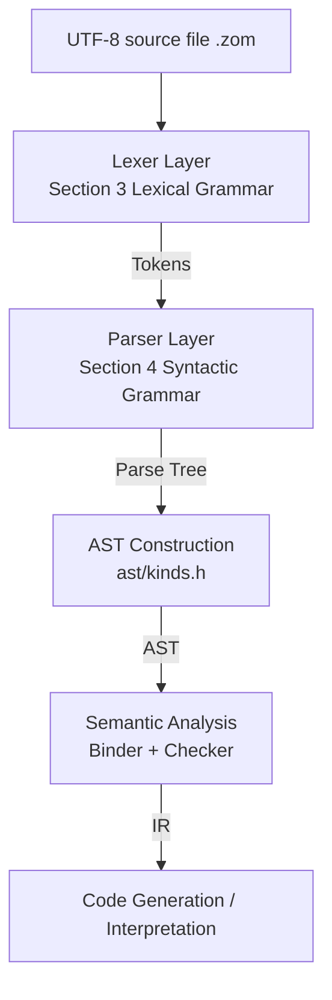

# Design Dimension 1: Syntax-Level Specification EBNF v1.0.0

> This document is the **single authoritative source of truth** for the ZOM language syntax layer. All lexers, parsers, AST definitions, diagnostic systems, LSP implementations, and documentation generators MUST remain consistent with this document. This document supersedes
> `docs/spec/chapters/17-grammar-reference.md` as the normative reference.
>
> Syntax format: Extended Backus-Naur Form (EBNF). Meta-symbols: `::=` definition, `|` choice, `(...)` grouping,
> `*` zero or more, `+` one or more, `?` zero or one, `[...]` character set, `'...'` literal,
> `(* ... *)` comment.

---

## Table of Contents

1. [Overall Design Principles](#1-overall-design-principles)
2. [Five-Layer Architecture Mapping](#2-five-layer-architecture-mapping)
3. [Lexical Grammar](#3-lexical-grammar)
4. [Syntactic Grammar](#4-syntactic-grammar)
   - 4.1 [Programs and Modules](#41-programs-and-modules)
   - 4.2 [Imports and Exports](#42-imports-and-exports)
   - 4.3 [Declarations](#43-declarations)
   - 4.4 [Type Expressions](#44-type-expressions)
   - 4.5 [Statements](#45-statements)
   - 4.6 [Expressions](#46-expressions)
   - 4.7 [Patterns](#47-patterns)
   - 4.8 [Attributes and Annotations](#48-attributes-and-annotations)
   - 4.9 [Concurrency](#49-concurrency)
5. [Operator Precedence and Associativity Table](#5-operator-precedence-and-associativity-table)
6. [Keywords and Reserved Words Inventory](#6-keywords-and-reserved-words-inventory)
7. [Grammar Drift Correction Log](#7-grammar-drift-correction-log)
8. [Five-Way Consistency Index](#8-five-way-consistency-index)
9. [Validation Example Library](#9-validation-example-library)

---

## 1. Overall Design Principles

| Principle | Description |
|---|---|
| **P1 Unambiguous** | Each left-hand side of a production maps one-to-one to its production body; grammar is LL(k) or disambiguable by a semantic predicate within a single lookahead token; no GLR ambiguous paths are retained. |
| **P2 Zero-Color Concurrency** | Function signatures do not include `async`/`await`; suspension is internal control-flow behavior; only two new keywords `suspend`/`spawn` are added; all other concurrency utilities are library functions / attributes. |
| **P3 Explicit Error Flow** | No implicit exception propagation; `raises` lists all error types explicitly in the signature; error control flow uses `return` + pattern matching. |
| **P4 Pure Static Modules** | Module names are symbolic paths, not strings; no runtime / conditional / wildcard imports; imports/exports occur at the top level of a file. |
| **P5 Linearizable Syntax** | Struct / enum / class member declarations MUST be semantically classifiable in a single-line scan; indentation or semantic context outside braces MUST NOT be used to disambiguate. |
| **P6 Minimal Reserved Words** | Only words that are implemented or explicitly documented as "reserved for v2" in this document are reserved; all others are removed. |
| **P7 Closed Attributes** | The compiler only recognizes whitelisted attributes under the `#[zom::*]` namespace and the `#[deprecated]` / `#[inline]` / `#[cold]` namespaces; all other attributes are passed through verbatim as metadata and trigger an unrecognized-attribute lint. |

---

## 2. Five-Layer Architecture Mapping



| Layer | Corresponding section in this document | Corresponding file path |
|---|---|---|
| UTF-8 encoding | Section 3.1 Source file characters | Lexer `compiler/lexer/` |
| Lexical | Sections 3.2-3.7 | `ZomLexer.g4` (MUST be synchronized) |
| Syntactic | All of Section 4 | `ZomParser.g4` (MUST be synchronized) |
| AST kind mapping | Section 8 Five-way consistency index | `include/zom/ast/kinds.h` |
| Operator precedence | Section 5 | Lines 363-386 of `docs/spec/chapters/04-expressions.md` |

---

## 3. Lexical Grammar

### 3.1 Source File Characters

```ebnf
SourceCharacter ::= (* Any Unicode scalar value U+0000..U+10FFFF, excluding surrogates U+D800..U+DFFF *)
```

- Source files MUST be UTF-8 encoded, with file extension `.zom`.
- A zero-width no-break space (BOM, `U+FEFF`) is permitted at the start of the file and is ignored for syntax and semantics.

### 3.2 Format-Control Characters

```ebnf
ZWNJ   ::= U+200C   (* Zero Width Non-Joiner, permitted inside identifiers *)
ZWJ    ::= U+200D   (* Zero Width Joiner, permitted inside identifiers *)
ZWNBSP ::= U+FEFF   (* Treated as whitespace everywhere except the start of the file *)
```

### 3.3 Whitespace and Line Terminators

```ebnf
Whitespace        ::= U+0009 (* TAB *) | U+000B (* VT *) | U+000C (* FF *)
                    | U+0020 (* Space *) | U+00A0 | U+1680
                    | U+2000..U+200A | U+202F | U+205F | U+3000 | ZWNBSP

LineTerminator    ::= U+000A (* LF *) | U+000D (* CR *)
                    | U+2028 (* LS *) | U+2029 (* PS *)
LineTerminatorSeq ::= LF | CR LF | CR {next character is not LF} | LS | PS
```

### 3.4 Comments

```ebnf
SingleLineComment ::= '//' (~ LineTerminator)*
MultiLineComment  ::= '/*' ( MultiLineCommentChar | MultiLineComment )* '*/'
MultiLineCommentChar ::= ~ ('*' | '/') | '*' ~ '/' | '/' ~ '*'
                    (* MultiLineComment is NOT nestable; the lexer state machine guarantees closure *)
```

### 3.5 Identifiers

```ebnf
IdentifierName ::= IdentifierStart IdentifierPart*

IdentifierStart ::= UnicodeIDStart
                  | '$'
                  | '_'
                  | '\' UnicodeEscapeSequence
IdentifierPart  ::= UnicodeIDContinue
                  | '$'
                  | ZWNJ | ZWJ
                  | '\' UnicodeEscapeSequence

UnicodeIDStart    ::= (* Unicode Derived Core Property `ID_Start` *)
UnicodeIDContinue ::= (* Unicode Derived Core Property `ID_Continue` *)

Identifier     ::= IdentifierName   (* but MUST NOT be a ReservedWord; see Section 6 keyword table *)
BindingIdent   ::= Identifier       (* dedicated to binding positions; same shape as Identifier *)
```

> Notes: `$` is a valid identifier character, supporting FFI, code-generator artifacts, and similar scenarios. When `_` appears alone, it denotes a wildcard binding (Wildcard) in declaration/binding positions; it is NOT a valid identifier in expression positions (handled by the parser in the corresponding productions).

### 3.6 Literals

#### 3.6.1 Null and Boolean

```ebnf
NullLiteral    ::= 'null'
BooleanLiteral ::= 'true' | 'false'
```

#### 3.6.2 Numeric Literals

```ebnf
NumericLiteral ::= DecimalLiteral
                 | BinaryLiteral
                 | OctalLiteral
                 | HexLiteral
                 | BigIntLiteral

DecimalLiteral ::= DecimalIntegerLiteral ('.' DecimalDigits?)? ExponentPart?
                 | '.' DecimalDigits ExponentPart?
                 | DecimalIntegerLiteral ExponentPart?

DecimalIntegerLiteral ::= '0'
                        | NON_ZERO_DIGIT ( NUM_SEP? DECIMAL_DIGIT )*

DecimalDigits  ::= DECIMAL_DIGIT ( NUM_SEP? DECIMAL_DIGIT )*
ExponentPart   ::= [eE] SignedInteger
SignedInteger  ::= ('+' | '-')? DecimalDigits

BinaryLiteral  ::= '0' [bB] BinaryDigits
BinaryDigits   ::= BINARY_DIGIT ( NUM_SEP? BINARY_DIGIT )*

OctalLiteral   ::= '0' [oO] OctalDigits
OctalDigits    ::= OCTAL_DIGIT  ( NUM_SEP? OCTAL_DIGIT  )*

HexLiteral     ::= '0' [xX] HexDigits
HexDigits      ::= HEX_DIGIT    ( NUM_SEP? HEX_DIGIT    )*

BigIntLiteral  ::= DecimalDigits 'n'   (* e.g. 123n *)

NUM_SEP        ::= '_'            (* numeric separator; MUST NOT appear first or last *)
DECIMAL_DIGIT  ::= [0-9]
NON_ZERO_DIGIT ::= [1-9]
BINARY_DIGIT   ::= [01]
OCTAL_DIGIT    ::= [0-7]
HEX_DIGIT      ::= [0-9a-fA-F]
```

#### 3.6.3 String Literals

```ebnf
StringLiteral  ::= '"' DoubleStringChar* '"'
                 | "'" SingleStringChar* "'"

DoubleStringChar ::= ~ ['"', '\', LineTerminator]
                   | LineTerminator        (* multi-line string literals supported natively *)
                   | '\' EscapeSequence
                   | LineContinuation

SingleStringChar ::= ~ [''', '\', LineTerminator]
                   | LineTerminator
                   | '\' EscapeSequence
                   | LineContinuation

EscapeSequence ::= CharacterEscapeSeq
                 | '\' '0'   (* null terminator U+0000; only when not immediately followed by a decimal digit *)
                 | HexEscapeSeq
                 | UnicodeEscapeSeq

CharacterEscapeSeq ::= '\' [\'"\\bfnrtv0]
                    | '\' NON_ESCAPE_CHAR   (* reserved escape; diagnostic: unrecognized escape sequence *)
NON_ESCAPE_CHAR  ::= ~ ['"', ''', '\', 'b', 'f', 'n', 'r', 't', 'v', '0',
                        'x', 'u', LineTerminator]

HexEscapeSeq     ::= '\x' HEX_DIGIT HEX_DIGIT
UnicodeEscapeSeq ::= '\u' HEX_DIGIT HEX_DIGIT HEX_DIGIT HEX_DIGIT
                   | '\u{' HEX_DIGIT+ '}'   (* range U+0000..U+10FFFF *)

LineContinuation ::= '\' LineTerminatorSeq   (* physical-line join; produces no character value *)
```

#### 3.6.4 Character Literals

```ebnf
CharacterLiteral ::= "'" CharContent "'"
CharContent      ::= ~ [''', '\', LineTerminator]
                   | '\' EscapeSequence
                   (* MUST contain exactly one Unicode scalar value; zero or more than one is a lexical error *)
```

#### 3.6.5 Template Literals

```ebnf
TemplateLiteral    ::= NoSubTemplate
                     | TemplateHead TemplateSpan+

NoSubTemplate      ::= '`' ( TemplateChar | TemplateEscape )* '`'
TemplateHead       ::= '`' ( TemplateChar | TemplateEscape | '$' ~ '{' )* '${'
TemplateMiddle     ::= '}' ( TemplateChar | TemplateEscape | '$' ~ '{' )* '${'
TemplateTail       ::= '}' ( TemplateChar | TemplateEscape )* '`'

TemplateChar       ::= ~ ['`', '\', '$']
TemplateEscape     ::= '\' SourceCharacter
                     (* a full Expression is embedded between ${...} inside a TemplateSpan *)
```

### 3.7 Punctuators and Operators

```ebnf
Punctuator ::=
    '{' | '}' | '(' | ')' | '[' | ']'
  | '.' | '...' | ';' | ',' | ':' | '::'   (* added :: for attribute namespaces *)
  | '?' | '?!' | '!!' | '?.'
  | '+' | '-' | '*' | '/' | '%' | '**'
  | '++' | '--'
  | '<<' | '>>' | '>>>'
  | '<' | '>' | '<=' | '>='
  | '==' | '!=' | '===' | '!=='
  | '&' | '|' | '^' | '!' | '~'
  | '&&' | '||' | '??' | '?:'     (* ?: forms the error-default operator only when adjacent with no whitespace *)
  | '=' | '+=' | '-=' | '*=' | '/=' | '%=' | '**='
  | '<<=' | '>>=' | '>>>=' | '&=' | '|=' | '^='
  | '&&=' | '||=' | '??='
  | '=>' | '->'
  | '@' | '#[' | ']'   (* attribute-related; #[ is a compound token with no intervening whitespace *)
```

> Key notes:
> - When `?` and `:` are adjacent with no intervening whitespace, the lexer recognizes them as a single `?:` operator (Error Default);
>   otherwise they are treated as two independent tokens for the ternary conditional expression `cond ? a : b`. This rule is consistent with the
>   `QUESTION COLON` semantic predicate at `ZomParser.g4:440`.
> - `#[` is the compound token that starts an attribute, followed by `namespace::name(args)` or `namespace::name = literal`.
> - `::` separates attribute namespaces (e.g. `zom::inline`); it does not conflict with member-access `.`.

---

## 4. Syntactic Grammar

### 4.1 Programs and Modules

```ebnf
Program     ::= SourceFile
SourceFile  ::= ModuleDecl? TopLevelItem*

ModuleDecl  ::= 'module' ModuleName ';'
ModuleName  ::= Identifier ('.' Identifier)*

TopLevelItem ::= ImportDecl
               | ExportDecl
               | AttrDecl* Declaration
               | AttrDecl* StatementListItem
```

Constraints:
- `ModuleDecl` MAY appear at most once and MUST be the first non-comment, non-attribute statement.
- `ImportDecl` MAY only appear at the top level; it MUST NOT appear inside blocks or functions (see Principle P4).

### 4.2 Imports and Exports

```ebnf
(* ============ Import ============ *)
ImportDecl       ::= 'import' ImportClause ';'
ImportClause     ::= ModuleImportClause | NamedImportClause
ModuleImportClause ::= ModuleName ( 'as' Identifier )?
NamedImportClause  ::= ModuleName '.' '{' ImportSpecList? '}'
ImportSpecList   ::= ImportSpec (',' ImportSpec)* ','?
ImportSpec       ::= Identifier ( 'as' Identifier )?

(* ============ Export ============ *)
ExportDecl       ::= 'export' Declaration                  (* declaration-site export, recommended form *)
                   | 'export' ExportClause ';'              (* centralized export list *)

ExportClause     ::= LocalExportClause | ReexportClause
LocalExportClause ::= '{' ExportSpecList? '}'
ReexportClause   ::= ModuleName '.' '{' ExportSpecList? '}'
ExportSpecList   ::= ExportSpec (',' ExportSpec)* ','?
ExportSpec       ::= Identifier ( 'as' Identifier )?
```

> Absent intentionally: `import *`, `export default`, and string-path imports like `import "a/b"`. These are explicitly excluded by Principle P4.

### 4.3 Declarations

```ebnf
Declaration ::= VariableStatement
              | FunctionDecl
              | ClassDecl
              | StructDecl
              | InterfaceDecl
              | EnumDecl
              | ErrorDecl
              | AliasDecl
```

#### 4.3.1 Variable Declarations

```ebnf
VariableStatement  ::= 'let' VariableDeclList ';'
                     | 'const' VariableDeclList ';'

VariableDeclList   ::= VariableDecl (',' VariableDecl)*
VariableDecl       ::= ( BindingIdent | BindingPattern ) TypeAnnotation? Initializer?
                     (* const + BindingPattern REQUIRES Initializer; const + BindingIdent REQUIRES Initializer
                        let + pattern without Initializer is an error *)
Initializer        ::= '=' AssignmentExpression
```

#### 4.3.2 Function Declarations

```ebnf
FunctionDecl   ::= 'fun' BindingIdent TypeParameters? ParameterClause
                   ReturnType? FunctionBody

FunctionBody   ::= BlockStatement

ReturnType     ::= '->' TypeExpr RaisesClause?
RaisesClause   ::= 'raises' TypeList
TypeList       ::= TypeExpr ( '|' TypeExpr )*   (* error-type union *)

ParameterClause ::= '(' ParameterList? ')'
ParameterList   ::= Parameter (',' Parameter)* ','?
Parameter       ::= '...'? BindingIdent TypeAnnotation? Initializer?
                  (* '...' denotes a rest parameter; at most one, and it MUST be last *)
```

> Absent intentionally: `async fun`, `fun ... -> T await`. See Section 4.9 for zero-color concurrency via `suspend`/`spawn`.

#### 4.3.3 Class Declarations

```ebnf
ClassDecl      ::= 'class' BindingIdent TypeParameters? ClassHeritage?
                   '{' ClassElement* '}'

ClassHeritage  ::= 'extends' TypeRef

ClassElement   ::= ';'
                 | Modifier* InitDecl
                 | Modifier* DeinitDecl
                 | Modifier* AccessorDecl
                 | Modifier* PropertyDecl
                 | Modifier* MethodDecl

Modifier       ::= 'public' | 'private' | 'protected'
                 | 'static' | 'readonly' | 'mutating' | 'override'
                 | 'abstract'

PropertyDecl   ::= ( 'let' | 'const' ) PropertyName
                    '?'? TypeAnnotation? Initializer? ';'
MethodDecl     ::= 'fun' PropertyName TypeParameters?
                    ParameterClause ReturnType?
                    ( BlockStatement | ';' )
InitDecl       ::= 'init' TypeParameters? ParameterClause
                    ReturnType? ( BlockStatement | ';' )
DeinitDecl     ::= 'deinit' ( BlockStatement | ';' )
AccessorDecl   ::= ( 'get' | 'set' ) PropertyName ParameterClause
                    ReturnType? ( BlockStatement | ';' )
```

> Notes: The `abstract` modifier applies to a method in a class body or to the class itself; when applied to a method, the method body MUST be omitted (written as `;`).

#### 4.3.4 Struct Declarations

```ebnf
StructDecl     ::= 'struct' BindingIdent TypeParameters?
                   '{' StructElement* '}'

StructElement  ::= StructFieldDecl
                 | MethodDecl
                 | AccessorDecl

StructFieldDecl ::= PropertyName
                    ':' TypeExpr
                    ( '=' AssignmentExpression )?   (* default value *)
                    ( ',' | ';' )?
```

#### 4.3.5 Interface Declarations

```ebnf
InterfaceDecl  ::= 'interface' BindingIdent TypeParameters? InterfaceHeritage?
                   '{' InterfaceBody '}'

InterfaceHeritage ::= 'extends' InterfaceTypeList
InterfaceBody   ::= InterfaceElement*
InterfaceElement ::= ';'
                  | Modifier* ( 'let' | 'const' ) PropertySignature Initializer? ';'?
                  | Modifier* 'fun' MethodSignature ';'?

PropertySignature ::= PropertyName '?'? TypeAnnotation
MethodSignature   ::= PropertyName '?'? CallSignature
CallSignature     ::= TypeParameters? ParameterClause ReturnType?

InterfaceTypeList ::= TypeRef ( ',' TypeRef )*
TypeRef           ::= Identifier TypeArguments?
```

#### 4.3.6 Enum Declarations

```ebnf
EnumDecl       ::= 'enum' BindingIdent TypeParameters?
                   '{' EnumBody? '}'
EnumBody       ::= EnumMember ( ',' EnumMember )* ','?
EnumMember     ::= PropertyName
                   ( '=' AssignmentExpression   (* explicit associated / raw value *)
                   | TupleType                  (* tuple associated value *)
                   )?
```

#### 4.3.7 Error Declarations

```ebnf
ErrorDecl      ::= 'error' BindingIdent TypeParameters? ErrorHeritage?
                   '{' ErrorBody? '}'
ErrorHeritage  ::= 'extends' TypeRef             (* error inheritance chain *)
ErrorBody      ::= ErrorField ( (',' | ';') ErrorField )* (',' | ';')?
ErrorField     ::= PropertyName ':' TypeExpr
                   ( '=' AssignmentExpression )?
```

> Error declarations are inherently marker-equipped value types; they work with the `raises` clause and `match`/`is` patterns.
> There is no `throw` keyword (Principle P3).

#### 4.3.8 Type Aliases

```ebnf
AliasDecl      ::= 'alias' BindingIdent TypeParameters?
                   '=' TypeExpr ';'
```

### 4.4 Type Expressions

```ebnf
TypeExpr     ::= FunctionType | UnionType

UnionType       ::= IntersectionType ( '|' IntersectionType )*
IntersectionType::= PostfixType      ( '&' PostfixType      )*

PostfixType     ::= AtomType PostfixTypeSuffix*
PostfixTypeSuffix ::= '[' ']'         (* array T[] *)
                    | '?'             (* optional T? *)

AtomType        ::= ParenthesizedType
                  | PredefinedType
                  | TypeRef
                  | ObjectType
                  | TupleType
                  | TypeQuery
                  | MarkerType        (* Sendable/Shared/Linear/NoInternalMutability markers *)

ParenthesizedType ::= '(' TypeExpr ')'

PredefinedType  ::= 'i8' | 'i16' | 'i32' | 'i64'
                  | 'u8' | 'u16' | 'u32' | 'u64'
                  | 'f32' | 'f64'
                  | 'str' | 'bool' | 'char'
                  | 'null' | 'unit' | 'never' | 'any'

TypeRef         ::= Identifier TypeArguments?

ObjectType      ::= '{' TypeBody? '}'
TypeBody        ::= TypeMemberList ( ';' | ',' )?
TypeMemberList  ::= TypeMember ( ( ';' | ',' ) TypeMember )*
TypeMember      ::= PropertySignature
                  | 'type' Identifier '=' TypeExpr ';'   (* associated type, used inside interface *)

TupleType       ::= '(' TupleElementTypes? ')'
TupleElementTypes ::= TupleElementType ( ',' TupleElementType )* ','?
TupleElementType ::= NamedTupleElement | TypeExpr
NamedTupleElement ::= Identifier ':' TypeExpr

FunctionType    ::= TypeParameters? ParameterClause '->' TypeExpr RaisesClause?

TypeQuery       ::= 'typeof' TypeQueryExpr
TypeQueryExpr   ::= Identifier ( '.' Identifier )*

(* ============ Generics ============ *)
TypeParameters  ::= '<' TypeParameterList '>'
TypeParameterList ::= TypeParameter ( ',' TypeParameter )* ','?
TypeParameter   ::= Identifier ( ':' TypeExpr )?   (* constraint; equivalent to extends *)
                  | Identifier '=' TypeExpr         (* default type parameter *)
TypeArguments   ::= '<' TypeArgumentList '>'
TypeArgumentList ::= TypeExpr ( ',' TypeExpr )* ','?

TypeAnnotation  ::= ':' TypeExpr

MarkerType      ::= 'Sendable'
                  | 'Shared'
                  | 'Linear'
                  | 'NoInternalMutability'
                  (* These four types are markers with no runtime representation; used only for trait/constraint checking *)
```

> Drift corrections: In Section 4.4, `TypeParameter` now includes the `= TypeExpr` default parameter (the original 17-grammar-reference.md omitted it,
> but it is already used in section 06-declarations.md Section Generic Functions and section 12-generics.md Section Type Constraints).
> `MarkerType` is added as a type-layer marker for concurrency / memory safety (corresponding to concurrency design Section 6.2 Linear).
> The predefined type `char` is added (the natural host type for character literals; omitted in the original spec).

### 4.5 Statements

```ebnf
Statement ::= BlockStatement
            | EmptyStatement
            | VariableStatement
            | ExpressionStatement
            | IfStatement
            | MatchStatement
            | WhileStatement
            | DoWhileStatement
            | ForStatement
            | ForInStatement
            | ContinueStatement
            | BreakStatement
            | ReturnStatement
            | ThrowStatement        (* reserved; the parser currently rejects: ZOM uses explicit return + pattern *)
            | TryStatement          (* reserved; the parser currently rejects: see ThrowStatement *)
            | SuspendStatement      (* concurrency: suspend statement form *)
            | SuspendUntilStatement (* concurrency: suspend until form *)
            | DebuggerStatement
            | LabeledStatement

BlockStatement      ::= '{' StatementList? '}'
StatementList       ::= StatementListItem+
StatementListItem   ::= Statement | Declaration

EmptyStatement      ::= ';'

ExpressionStatement ::= Expression ';'
                      {the first token MUST NOT be `{`, `class`, `struct`, `enum`, `let`, `const`,
                        `fun`, `interface`, `error`, `alias`, `module`, to avoid being parsed as a declaration}

IfStatement         ::= 'if' '(' Expression ')' Statement ( 'else' Statement )?

MatchStatement      ::= 'match' '(' Expression ')' MatchBlock
MatchBlock          ::= '{' MatchClause* DefaultClause? '}'
MatchClause         ::= 'when' Pattern GuardClause? '=>' StatementOrBlock
DefaultClause       ::= 'default' '=>' StatementOrBlock
GuardClause         ::= 'if' Expression
StatementOrBlock    ::= BlockStatement | Statement

WhileStatement      ::= 'while' '(' Expression ')' Statement
DoWhileStatement    ::= 'do' Statement 'while' '(' Expression ')' ';'?

ForStatement        ::= 'for' '(' ForInit? ';' Expression? ';' ForUpdate? ')' Statement
ForInStatement      ::= 'for' '(' ( ForDeclaration | LeftHandSideExpr ) 'in' Expression ')' Statement
ForDeclaration      ::= ( 'let' | 'const' ) ForBinding
ForBinding          ::= BindingIdent | BindingPattern
ForInit             ::= ( 'let' | 'const' ) VariableDeclList | Expression
ForUpdate           ::= Expression

ContinueStatement   ::= 'continue' Identifier? ';'
BreakStatement      ::= 'break'    Identifier? ';'
ReturnStatement     ::= 'return'   Expression? ';'
DebuggerStatement   ::= 'debugger' ';'

LabeledStatement    ::= Identifier ':' Statement
```

> Reserved / restricted notes:
> - `ThrowStatement` and `TryStatement` are syntactic placeholders corresponding to the reserved words in Section 6. They are currently rejected by the parser with
>   `ZOM5001 ReservedSyntax`. Error paths MUST use `return <error-value>` + pattern matching.
> - `SuspendStatement` / `SuspendUntilStatement` are covered in Section 4.9.

### 4.6 Expressions

```ebnf
(* ============ top-level ============ *)
Expression        ::= AssignmentExpression ( ',' AssignmentExpression )*

AssignmentExpression ::= ConditionalExpression
                       | FunctionExpression
                       | SpawnExpression       (* concurrency: spawn returns TaskHandle<T> *)
                       | LeftHandSideExpr AssignmentOperator AssignmentExpression
AssignmentOperator   ::= '=' | '+=' | '-=' | '*=' | '/=' | '%=' | '**='
                       | '<<=' | '>>=' | '>>>='
                       | '&=' | '|=' | '^='
                       | '&&=' | '||=' | '??='

ConditionalExpression ::=
     ErrorDefaultExpression ( '?' AssignmentExpression ':' AssignmentExpression )?

(* ============ infix chains (lowest to highest) ============ *)
ErrorDefaultExpression ::= CoalesceExpr ( '?:' CoalesceExpr )*
CoalesceExpr           ::= LogicalOrExpr ( '??' LogicalOrExpr )*
LogicalOrExpr          ::= LogicalAndExpr ( '||' LogicalAndExpr )*
LogicalAndExpr         ::= BitwiseOrExpr  ( '&&' BitwiseOrExpr  )*
BitwiseOrExpr          ::= BitwiseXorExpr ( '|'  BitwiseXorExpr )*
BitwiseXorExpr         ::= BitwiseAndExpr ( '^'  BitwiseAndExpr )*
BitwiseAndExpr         ::= EqualityExpr   ( '&'  EqualityExpr   )*

EqualityExpr           ::= RelationalExpr
                           ( ( '==' | '!=' | '===' | '!==' ) RelationalExpr )*
RelationalExpr         ::= ShiftExpr
                           ( ( '<' | '>' | '<=' | '>=' ) ShiftExpr
                           | 'as' '?'? TypeExpr              (* type cast *)
                           | 'is' TypeExpr                    (* type test *)
                           )*

ShiftExpr              ::= AdditiveExpr
                           ( ( '<<' | '>>' | '>>>' ) AdditiveExpr )*
AdditiveExpr           ::= MultiplicativeExpr
                           ( ( '+' | '-' ) MultiplicativeExpr )*
MultiplicativeExpr     ::= ExponentiationExpr
                           ( ( '*' | '/' | '%' ) ExponentiationExpr )*

(* right-associative *)
ExponentiationExpr     ::= UnaryExpr ( '**' ExponentiationExpr )?

UnaryExpr              ::= PostfixExpr
                         | PrefixUpdateExpr
                         | ( '+' | '-' | '!' | '~' | 'typeof' ) UnaryExpr
PrefixUpdateExpr       ::= ( '++' | '--' ) LeftHandSideExpr

PostfixExpr            ::= LeftHandSideExpr ( '?!' | '!!' | '++' | '--' )*

(* ============ LHS: member / call / optional chaining ============ *)
LeftHandSideExpr       ::= NewExpression
                         | CallExpression
                         | OptionalExpression
                         | SuspendExpression     (* concurrency: suspend expression form *)

MemberExpression       ::= PrimaryExpression
                         | SuperProperty
                         | 'new' MemberExpression Arguments
                         | MemberExpression '[' Expression ']'
                         | MemberExpression '.' Identifier

NewExpression          ::= MemberExpression | 'new' NewExpression

SuperProperty          ::= 'super' '.' Identifier
SuperCall              ::= 'super' Arguments
ImportCall             ::= 'import' Arguments   (* reserved; v1 parser rejects: dynamic import *)

CallExpression         ::= ( MemberExpression Arguments
                           | SuperCall
                           ) ( Arguments | '[' Expression ']' | '.' Identifier )*

Arguments              ::= '(' ArgumentList? ')'
ArgumentList           ::= Argument ( ',' Argument )* ','?
Argument               ::= AssignmentExpression
                         | '...' AssignmentExpression   (* spread argument *)

OptionalExpression     ::= ( MemberExpression | CallExpression ) OptionalChain+
OptionalChain          ::= '?.' ( Identifier | '[' Expression ']' | Arguments )
                           ( Arguments | '[' Expression ']' | '.' Identifier )*

(* ============ Primary ============ *)
PrimaryExpression      ::= 'this'
                         | BindingIdent
                         | Literal
                         | ArrayLiteral
                         | ObjectLiteral
                         | TupleLiteral
                         | FunctionExpression
                         | '(' Expression ')'

Literal                ::= NullLiteral | BooleanLiteral
                         | NumericLiteral | StringLiteral
                         | CharacterLiteral
                         | TemplateLiteral

ArrayLiteral           ::= '[' ( ElementList )? ']'
ElementList            ::= Element ( ',' Element )* ','?
Element                ::= AssignmentExpression
                         | '...' AssignmentExpression

(* Added: explicit tuple literal disambiguates "(x) = parenthesized expression vs single-element tuple" *)
TupleLiteral           ::= '(' TupleElementList ')'
TupleElementList       ::= Expression ',' Expression ( ',' Expression )* ','?
                         | Expression ','
                         (* Note: `(a, b)` is a 2-tuple; `(a,)` is a 1-tuple; `(a)` is still a parenthesized expression, not a tuple *)

ObjectLiteral          ::= '{' ( PropertyDefList )? '}'
PropertyDefList        ::= PropertyDefinition ( ',' PropertyDefinition )* ','?
PropertyDefinition     ::= Identifier Initializer?           (* shorthand / shorthand init *)
                         | PropertyName ':' Expression
                         | '...' Expression
PropertyName           ::= Identifier

FunctionExpression     ::= 'fun' TypeParameters? ParameterClause
                            CaptureClause? ReturnType?
                            BlockStatement

CaptureClause          ::= 'use' '[' CaptureList? ']'
CaptureList            ::= CaptureElement ( ',' CaptureElement )* ','?
CaptureElement         ::= '&'? Identifier | 'this'
```

> Drift corrections:
> 1. **`TupleLiteral` added**: The previous spec ambiguously used `(expr)` as both a parenthesized expression and a single-element tuple.
>    Explicitly requiring at least one comma to form a tuple literal aligns with Swift / Python.
> 2. **`RelationalExpr` adds `'is' TypeExpr`**: The original 17-grammar-reference.md EBNF did not include the `is` operator,
>    but 04-expressions.md Section Type Check Operators and 07-patterns.md Section Type Patterns both used it; the gap is now closed.
> 3. **`AssignmentExpression` adds `SpawnExpression`**: See Section 4.9.

### 4.7 Patterns

```ebnf
Pattern          ::= PrimaryPattern

PrimaryPattern   ::= WildcardPattern
                   | IdentifierPattern
                   | LiteralPattern
                   | TuplePattern
                   | StructPattern
                   | ArrayPattern
                   | IsPattern
                   | ExpressionPattern
                   | EnumPattern

WildcardPattern   ::= '_' TypeAnnotation?
IdentifierPattern ::= BindingIdent TypeAnnotation?
LiteralPattern    ::= NumericLiteral | StringLiteral | CharacterLiteral
                    | BooleanLiteral | NullLiteral
TuplePattern      ::= '(' PatternList? ')'
PatternList       ::= Pattern ( ',' Pattern )* ','?
StructPattern     ::= '{' PatternPropertyList? '}'
PatternPropertyList ::= PatternProperty ( ',' PatternProperty )* ','?
PatternProperty   ::= PropertyName ( ':' Pattern )?
ArrayPattern      ::= '[' PatternList? ']'
RestPattern       ::= '...' Pattern    (* may only appear at the end of ArrayPattern/StructPattern *)
IsPattern         ::= 'is' TypeExpr
ExpressionPattern ::= Expression       (* full expression; used for comparisons, ranges, etc. *)
EnumPattern       ::= PropertyName TuplePattern
                    | TypeRef '.' PropertyName TuplePattern?
```

> Notes:
> - `BindingPattern` (used in VariableDeclaration / ForBinding / CatchParameter)
>   is `ArrayBindingPattern | ObjectBindingPattern` (see 06-declarations.md Section Destructuring).
>   Its EBNF is:
>
>   ```ebnf
>   BindingPattern       ::= ArrayBindingPattern | ObjectBindingPattern
>   ArrayBindingPattern  ::= '[' BindingElementList? ']'
>   ObjectBindingPattern ::= '{' BindingPropertyList? '}'
>   BindingElementList   ::= BindingElement ( ',' BindingElement )* ','?
>   BindingPropertyList  ::= BindingProperty ( ',' BindingProperty )* ','?
>   BindingElement       ::= '...'? ( BindingIdent | BindingPattern ) Initializer?
>   BindingProperty      ::= '...'? ( BindingIdent
>                                    | PropertyName ':' BindingElement ) Initializer?
>   ```

### 4.8 Attributes and Annotations

Attributes are compile-time metadata attached to declarations / statements. ZOM attributes use the outer attribute
`#[namespace::name(args)]` syntax, similar to Rust, but a namespace is mandatory to avoid attribute-name pollution.

```ebnf
(* Attribute declarations: may precede declarations, statements, expressions, or top-level items *)
AttrDecl         ::= '#' '[' AttrList ']'
AttrList         ::= Attr ( ',' Attr )* ','?
Attr             ::= AttrPath ( '=' AttrValue )?
                   | AttrPath '(' AttrArgs? ')'

AttrPath         ::= Identifier ( '::' Identifier )+   (* MUST contain at least one ::; namespace-enforced *)
                   | Identifier                         (* compatibility: deprecated / inline / cold *)

AttrValue        ::= Literal                            (* strings, numbers, booleans, null *)
                   | Identifier                         (* identifier-style parameters; true/false already covered by bool *)
AttrArgs         ::= AttrArg ( ',' AttrArg )* ','?
AttrArg          ::= Identifier '=' AttrValue
                   | AttrValue
```

**Whitelist (the set of attributes recognized by the compiler)**:

| Attribute Path | Scope | Semantics |
|---|---|---|
| `zom::inline` | `fun` / methods | Hint for inlining; equivalent to `#[inline]` (compatibility form) |
| `zom::cold` | `fun` / methods | Marks a cold path; optimized for size over speed |
| `zom::doc` | Any declaration | Documentation string; value is a literal string |
| `zom::deprecated` | Any declaration | Parameters: `since`, `message`; lint at use sites |
| `zom::scope_guard` | `struct` / variable declarations | Marks a Scope RAII guard; enables structured-concurrency checks (see concurrency design Section 5.3) |
| `zom::linear` | `struct` | Enforces Linear semantics: MUST be consumed before leaving scope (bound to the `Linear` marker trait) |
| `zom::sendable` / `zom::shared` | `struct`/`class`/`alias` | Explicitly implements the corresponding marker trait (used to bypass auto-derivation when wrapping unsafe FFI) |
| `zom::must_consume` | `fun` return type | Return value MUST NOT be ignored; unused values warn with ZOM7003 |
| `zom::allow(diagnostic_code)` / `zom::deny(diagnostic_code)` | Any | Locally toggles diagnostics (lint control) |
| Other namespaces (non-`zom::`) | Any | Passed through to metadata; unknown namespace triggers the `ZOM7001 UnknownAttributeNamespace` lint, defaulting to `allow` |

> Alignment with concurrency design Section 5.3: the struct definition of `Scope<R>` returned by `spawn_scope` is marked with
> `#[zom::scope_guard]`; the compiler enables structured-spawn static analysis based on this marker.
>
> Drift from 17-grammar-reference.md: the original spec included no attribute syntax at all; this section is added to meet the needs of concurrency v1.0.0-rc1
> and code-generation optimizations.

### 4.9 Concurrency

The concurrency design adopts a **zero-color** model, adding only two new keywords: `suspend` and `spawn`.

#### 4.9.1 `suspend` Statement and Expression

`suspend` removes the current task from the run queue and waits for a given `SuspendEvent` to become ready before resuming.

```ebnf
(* Statement form: suspends and discards the event result *)
SuspendStatement ::= 'suspend' ( ';'
                               | 'until' SuspendEventSelector ';' )

(* Expression form: returns the event result; type is inferred from Selector *)
SuspendExpression ::= 'suspend' 'until' SuspendEventSelector

SuspendEventSelector ::= Expression
                        (* The static type of the expression MUST be SuspendEvent<T>
                           or impl SuspendEventContract<T>;
                           SuspendExpression has type T.
                           The statement-form 'suspend until' is equivalent to let _ = (suspend until ...); *)
```

Semantics:
1. Evaluate `SuspendEventSelector` to yield an event object `ev` (MUST be a `SuspendEvent<T>` or an implementation of that trait).
2. Inject the current task's waker into the `ev.waker` atomic slot.
3. Register `ev` with the appropriate reactor according to `ev.kind` (IO, Timer, Channel, etc.).
4. **Scheduler `yield`**: the current task yields the worker.
5. When the event becomes ready or is canceled, the reactor invokes the waker and the task re-enters the runnable queue.

#### 4.9.2 `spawn` Expression

```ebnf
SpawnExpression    ::= 'spawn' SpawnModifier? SpawnBody

SpawnModifier      ::= 'detached'          (* escapes structured scope; requires 'static capture *)
                     | 'blocking'          (* dispatches to the blocking thread pool *)
                     | 'priority' '(' ( 'high' | 'low' ) ')'

SpawnBody          ::= SpawnClosure
SpawnClosure       ::= ParameterClause?   (* optional explicit parameters; usually empty, equivalent to fun () -> T { body } *)
                       CaptureClause? ReturnType?
                       BlockStatement
                     | BlockStatement     (* short form; implicit fun () { body } *)
                     | '->' Expression    (* single-line form; implicit fun () { return expr } *)
```

**Examples of the three body forms**:

```zom
// Full closure form (explicit)
spawn fun() -> i32 use [x, y] { return x + y; }

// Short form (recommended)
spawn {
    let z = x + y;
    z
}

// Single-line form
spawn -> x + y
```

Semantics:
- Default `spawn body`: the immediate enclosing scope of the body MUST be inside an active `Scope` (provided by
  `spawn_scope` or the runtime root scope). Returns `TaskHandle<T>` (a `Linear` type). The body is enqueued
  **before** `spawn` returns (Principle NP-4 Eager Task).
- `spawn detached body`: all captures MUST be `'static`; not bound to any scope; exit without join
  triggers lint ZOM8008.
- `spawn blocking body`: the body is dispatched to the blocking thread pool and does not consume an M:N worker.
- Capture checking: ownership transfers across a spawn-closure boundary MUST satisfy `Sendable`; shared references MUST satisfy
  `Shared`; violation produces compile error ZOM8001.

---

## 5. Operator Precedence and Associativity Table

From highest (1) to lowest (21); within the same precedence, operators associate left-to-right (L) or right-to-left (R).

| Precedence | Operator | Meaning | Associativity | Section |
|---|---|---|---|---|
| 1 | `()` `[]` `.` `?.` `::<T>` | Grouping / subscript / member / optional chain / explicit type arguments | L | Section 4.6 LHS |
| 2 | `f(args)` `expr(args)` | Function / method call | L | Section 4.6 CallExpression |
| 3 | `expr++` `expr--` `?!` `!!` | Postfix inc/dec, error propagation, force-unwrap | L | Section 4.6 PostfixExpr |
| 4 | `++expr` `--expr` | Prefix inc/dec | R | Section 4.6 PrefixUpdateExpr |
| 5 | `+` `-` `!` `~` `typeof` | Unary plus/minus, logical not, bitwise not, type query | R | Section 4.6 UnaryExpr |
| 6 | `**` | Power | R | Section 4.6 ExponentiationExpr |
| 7 | `*` `/` `%` | Multiply, divide, modulo | L | Section 4.6 MultiplicativeExpr |
| 8 | `+` `-` | Add, subtract | L | Section 4.6 AdditiveExpr |
| 9 | `<<` `>>` `>>>` | Shift left, arithmetic shift right, logical shift right | L | Section 4.6 ShiftExpr |
| 10 | `<` `>` `<=` `>=` `as` `as?` `is` | Relational, type cast, type test | L | Section 4.6 RelationalExpr |
| 11 | `==` `!=` `===` `!==` | Equality, strict equality | L | Section 4.6 EqualityExpr |
| 12 | `&` | Bitwise AND | L | Section 4.6 BitwiseAndExpr |
| 13 | `^` | Bitwise XOR | L | Section 4.6 BitwiseXorExpr |
| 14 | `\|` | Bitwise OR | L | Section 4.6 BitwiseOrExpr |
| 15 | `&&` | Logical AND (short-circuit) | L | Section 4.6 LogicalAndExpr |
| 16 | `\|\|` | Logical OR (short-circuit) | L | Section 4.6 LogicalOrExpr |
| 17 | `??` | Nullish coalescing | L | Section 4.6 CoalesceExpr |
| 18 | `?:` | Error Default | L | Section 4.6 ErrorDefaultExpr |
| 19 | `cond ? a : b` | Ternary conditional | R | Section 4.6 ConditionalExpr |
| 20 | `=` `+=` `-=` `*=` `/=` `%=` `**=` `<<=` `>>=` `>>>=` `&=` `\|=` `^=` `&&=` `\|\|=` `??=` | Assignment and compound assignment | R | Section 4.6 AssignmentOperator |
| 21 | `,` | Comma (sequence expression) | L | Section 4.6 Expression |

> Drift corrections:
> - In the original 04-expressions.md Section Operator Precedence, level 17 mixed `?!`/`!!`/`?:` together.
>   This specification has raised `?!`/`!!` into the Postfix tier (precedence 3) while keeping `?:` at precedence 18.
>   Rationale: tight postfix binding for `val?!` is the universal practice across modern languages, consistent with Kotlin/Swift;
>   while `?:` needs to be at the same level as, or closer to, `??`, consistent with Kotlin's Elvis semantics.
> - The `is` operator is explicitly included at the original precedence level 4 (Cast) (the original documentation placed it at precedence 9 but provided no EBNF rule; this is corrected now).

---

## 6. Keywords and Reserved Words Inventory

### 6.1 Implemented Keywords (With Corresponding Grammar Rules)

| Group | Keywords |
|---|---|
| Declaration | `class` `struct` `interface` `enum` `error` `fun` `let` `const` `alias` `init` `deinit` `get` `set` |
| Control flow | `if` `else` `match` `when` `default` `for` `while` `do` `break` `continue` `return` `debugger` `in` |
| Type | `i8` `i16` `i32` `i64` `u8` `u16` `u32` `u64` `f32` `f64` `bool` `str` `char` `null` `unit` `never` `any` |
| Modifier | `public` `private` `protected` `static` `readonly` `mutating` `override` `abstract` |
| Operator / operation | `as` `is` `typeof` `new` `this` `super` `extends` `raises` |
| Module | `module` `import` `export` `as` |
| Concurrency | `suspend` `spawn` |
| Marker | `Sendable` `Shared` `Linear` `NoInternalMutability` |

> Marker names are capitalized, consistent with type-style naming; they may appear both as types in type positions (e.g. `T: Sendable`)
> and as standalone `MarkerType`s.

### 6.2 Reserved Words Explicitly Rejected by the Parser (With Corresponding Diagnostic Code ZOM500x)

| Keyword | Intended reservation purpose | Current diagnostic |
|---|---|---|
| `throw` `try` `catch` `finally` | Exceptional control flow (ZOM uses explicit return + pattern) | ZOM5001 ReservedSyntax |
| `async` `await` | Async signatures (ZOM uses the zero-color model) | ZOM5002 AsyncAwaitDisabled |
| `var` | Function-scoped variable (ZOM uses let/const block scope; removed in v1) | ZOM5003 VarKeywordRemoved |
| `actor` `channel` | Concurrency primitives (v1 uses library types rather than keywords) | ZOM5004 ActorAsLibraryType |
| `yield` `generator` | Generators (not implemented in v1) | ZOM5005 GeneratorSyntaxReserved |
| `namespace` `package` | Organizational units (v1 uses `module` dotted paths) | ZOM5006 NamespaceAsModulePath |
| `type` | Type alias (v1 uses `alias`; `type` is reserved for associated types) | `type` may be used inside ObjectType as an associated type; when used as the start of an alias declaration it triggers ZOM5007 UseAliasKeyword |
| `delete` `instanceof` `of` `with` | JS legacy; not part of v1 syntax | ZOM5008 ReservedFutureKeyword |

### 6.3 Soft Keywords / Contextual Keywords

The following strings have keyword semantics only in specific syntactic positions and may be used as identifiers elsewhere.

| Soft Keyword | Effective position |
|---|---|
| `use` | `use [...]` inside `CaptureClause` (function-expression capture list) |
| `detached` `blocking` `priority` `high` `low` `until` | Only as contextual keywords in `SpawnModifier` / `SuspendEventSelector` |
| `Sendable` / `Shared` / `Linear` / `NoInternalMutability` | Marker type names; if the user declares a type with the same name, the user definition shadows it (lint ZOM6001) |

---

## 7. Grammar Drift Correction Log

This section records corrections relative to commit `c2fe0b8` (the last spec-parser alignment commit). Each correction corresponds to
a Five-Way Consistency Index entry in Section 8.

| # | Drift location | Original state | Corrected | Rationale |
|---|---|---|---|---|
| G1 | `TypeParameter` lacks default type | 17-grammar has no `= Type`; but 12-generics.md and the example `parseValue<T = str>` use it | Add `TypeParameter ::= Identifier '=' TypeExpr` | Align section docs with real-world usage |
| G2 | `RelationExpr` lacks the `is` operator | 17-grammar does not list `is` in its EBNF; 04-expressions Section Type Check Operators and 07-patterns Section Type Patterns both use it | Add `\| 'is' TypeExpr` to `RelationalExpr` | `val is str` is the foundation of ZOM pattern matching |
| G3 | Single-element tuple `(x)` ambiguous vs parenthesized expression | 17-grammar does not distinguish them; the ANTLR parser takes the parenthesized-expression path | Introduce `TupleLiteral`; single-element tuples require `(x,)` | Consistent with Swift/Kotlin/Python; eliminates ambiguity |
| G4 | Missing predefined type `char` | Character literal `'x'` exists but no host type is declared | Add `PredefinedType ::= ... \| 'char'` | Aligns with Section 3.6.4 CharacterLiteral |
| G5 | Missing grammar rules for concurrency keywords `suspend` / `spawn` | 15-concurrency.md marked them "reserved but unimplemented"; concurrency design v1.0.0-rc1 has been finalized | Add complete EBNF + semantics in Section 4.9 | Aligns with `zom-async-canonical-design.md` Section 5 |
| G6 | Missing attribute syntax `#[...]` | 16-attributes-and-annotations.md marked them "reserved"; the concurrency design heavily uses built-in attributes | Add complete EBNF + whitelist in Section 4.8 | Provides a syntactic carrier for scope_guard / linear / must_consume |
| G7 | Missing MarkerType production | Concurrency design Section 6 marker traits (Sendable/Shared/Linear/NoInternalMutability) had no attachment point | Add `MarkerType` branch to `AtomType` | Enables usage in `fun write(t: T) where T: Sendable` and similar signatures |
| G8 | Conflicting precedence description for `?!` / `!!` | 04-expressions.md table listed them at precedence 17 (same as `?:`), but EBNF treated them as PostfixSuffix (precedence 3) | Unify as Postfix precedence 3; keep `?:` at 18 | Tight postfix-operator binding is industry best practice |
| G9 | Error-type list in `raiseClause` | 17-grammar EBNF wrote `TypeList` but `TypeList` was defined as comma-separated; syntax and semantic usage both employ `\|` for unions | `TypeList ::= TypeExpr ( '\|' TypeExpr )*` | `raises E1 \| E2` is consistent with union-type syntax |
| G10 | Shorthand initialization in `PropertyDefinition` | 04-expressions.md object-literal examples use `{ name, age: 30 }`; the 17-grammar EBNF `Identifier Initializer?` branch of `PropertyDefinition` lacked a colon but the examples had `age: 30` | Split into `Identifier Initializer?` (shorthand assignment `x=1`) and `PropertyName ':' Expression` (key-value pair); both are legal | Allow both styles without misinterpretation |

---

## 8. Five-Way Consistency Index

Per AGENTS.md Section Spec Alignment Rules, the following is the cross-reference index between this specification and the other four sources of truth.
"Checkmark" denotes verified alignment; "circular arrow" denotes an implementation correction required in the next commit.

| Production in this document | 1) Lexical Chapter 02 | 2) ZomLexer.g4 | 3) 17-grammar-ref | 4) Expr Semantics 04 | 5) Implementation (compiler/) |
|---|---|---|---|---|---|
| Section 3.3 Whitespace/LineTerm | Checkmark Section Whitespace and Line Terminators | Checkmark TAB/VT/FF/LF/CR/LS/PS | Checkmark | -- | Circular arrow lexical layer |
| Section 3.4 Comments | Checkmark Section Comments | Checkmark SINGLE/MULTI_LINE_COMMENT | Checkmark | -- | Checkmark lexer/comments.cc |
| Section 3.5 IdentifierName | Checkmark Section Identifier Grammar | Checkmark identifierStart/Part | Checkmark | -- | Circular arrow lexer/identifier.cc (handle `\u{}`) |
| Section 3.6 NumericLiteral | Checkmark Section Numeric Literals | Checkmark decimal/binary/octal/hex | Checkmark | Checkmark Table Section Precedence not affected | Checkmark lexer/numeric.cc |
| Section 3.6 StringLiteral | Checkmark Section String Literals + Escape table | Checkmark DQUOTE/SQUOTE/escape... | Checkmark | -- | Circular arrow multi-line string literal support |
| Section 3.6 TemplateLiteral | Checkmark chapter 02 does not describe template literals | Checkmark NO_SUB/TEMPLATE_HEAD/... | Checkmark Section 3.6.5 | -- | Circular arrow parser template interpolation |
| Section 3.6 CharacterLiteral | Checkmark Section Character Literals | Checkmark CHAR_LITERAL | Checkmark | -- | Checkmark lexer/char.cc |
| Section 3.7 Punctuator + `::` + `#[` | Checkmark chapter 02 has no `::`/`#[` | Circular arrow new tokens required | Circular arrow sync | -- | Circular arrow lexer attribute tokens |
| Section 4.1 ModuleDecl/SourceFile | Checkmark 13-modules Section Module Declaration | -- | Checkmark | -- | Checkmark parser/module.cc |
| Section 4.2 Import/Export | Checkmark 13-modules Section Grammar Summary | -- | Checkmark | -- | Checkmark parser/import.cc |
| Section 4.3.1 VariableStatement | Checkmark 06-decl Section Variable Declarations | -- | Checkmark | -- | Checkmark parser/decl.cc |
| Section 4.3.2 FunctionDecl + RaisesClause | Checkmark 11-error-handling Section Native Error Types | -- | Checkmark (corrected via G9) | -- | Circular arrow raisesClause supports `\|` |
| Section 4.3.3 ClassDecl / Section 4.3.4 StructDecl | Checkmark 08-classes Section Class/Struct Definition | -- | Checkmark | -- | Checkmark parser/class.cc |
| Section 4.3.5 InterfaceDecl | Checkmark entire 09-interfaces.md | -- | Checkmark | -- | Checkmark parser/interface.cc |
| Section 4.3.6 EnumDecl | Checkmark entire 10-enumerations.md | -- | Checkmark | -- | Checkmark parser/enum.cc |
| Section 4.3.7 ErrorDecl | Checkmark 11-error-handling Section Error Declarations | -- | Checkmark | -- | Circular arrow parser/error_decl.cc (Heritage) |
| Section 4.3.8 AliasDecl + default type parameter G1 | Checkmark 12-generics Section Type Aliases | -- | Circular arrow (G1) | -- | Circular arrow parser/alias.cc |
| Section 4.4 TypeExpr / MarkerType G7 | Checkmark 03-types Section Type System Overview | -- | Circular arrow (G7) | -- | Circular arrow type/type_expr.cc (marker) |
| Section 4.4 TupleLiteral / G3 | Checkmark 03-types Section Tuple Types | -- | Circular arrow (G3) | -- | Circular arrow parser/tuple.cc |
| Section 4.5 Match/For/... control flow | Checkmark entire 05-statements | -- | Checkmark | -- | Checkmark parser/stmt.cc |
| Section 4.6 Expression operators | Checkmark entire 04-expressions | -- | Circular arrow (G2 G8) | Checkmark Section Precedence table requires G8 correction | Circular arrow parser/expr.cc (`is`) |
| Section 4.7 Patterns | Checkmark entire 07-patterns | -- | Checkmark | -- | Circular arrow parser/pattern.cc (LiteralPattern) |
| Section 4.8 Attributes / G6 | Checkmark chapter 16 requires a rewrite | Circular arrow lexical | Circular arrow (G6) | -- | Circular arrow brand-new implementation path |
| Section 4.9 Concurrency / G5 | Checkmark concurrency spec Section 5 | Circular arrow keywords | Circular arrow (G5) | -- | Circular arrow brand-new implementation path |
| Section 5 Precedence table | Checkmark 04-expressions Section Precedence (requires G8 correction) | -- | Circular arrow EBNF sync required | Circular arrow correct the documentation table | Circular arrow parser/pratt.cc |
| Section 6 Keyword table | Checkmark 02-lexical Section Keywords | Circular arrow soft-keyword context | -- | -- | Circular arrow lexer/reserved.cc |

---

## 9. Validation Example Library

The following examples are intended for `lit` regression testing and cover all newly-added productions and drift corrections. Each example MUST have a corresponding `.zom` + `.check` file under `tests/language/`.

### T1 Basic Module / Import / Export

```zom
// RUN: zom-parse %s | FileCheck %s
module examples.basic;

import math.vector as vec;
import math.geometry.{Point, distance as dist};

export struct Vec2 { x: f64, y: f64 }
export fun zero() -> Vec2 { return Vec2 { x: 0.0, y: 0.0 }; }
export { Vec2 as V2 };
export math.vector.{cross};
```

**CHECK highlights**: `ModuleDecl`, `NamedImportClause`, `ModuleImportClause` (with `as`),
`export struct` (declaration-site), `export { }` (centralized), `ReexportClause`.

### T2 Type System Coverage (G1/G3/G7)

```zom
// Generics + default type parameters (G1)
alias Result<T, E = StringError> = T | E;

// Marker type constraints (G7)
fun spawn_safe<T: Sendable>(value: T) { /* ... */ }

// Single-element tuple literal (G3) -- parsed as TupleType; parenthesized expression should error
let one: (i32,) = (42,);
let two: (i32, str) = (1, "x");
let paren_expr = (1 + 2) * 3;   // parenthesized expression, not a tuple

// Char type (G4)
let ch: char = 'π';
```

### T3 Expression Coverage (G2/G8/G10)

```zom
// is operator (G2)
let is_str = value is str;

// Postfix tight binding (G8): val?! takes precedence over addition
let r1 = nullable! + 1;          // (nullable!) + 1
let r2 = risky()?! + 2;          // (risky()?!) + 2
let r3 = fail()?: fallback + 1;  // fail() ?: (fallback + 1)

// Two object-literal forms (G10)
let a = { x, y = 3, z: 4 };
```

### T4 Error Handling and Pattern Matching

```zom
error ParseError {
    message: str,
    line: i32,
}

fun parse_int(s: str) -> i32 raises ParseError {
    if (s.length == 0) {
        return ParseError { message: "empty input", line: 1 };
    }
    return 42;
}

fun demo() {
    match (parse_int("")) {
        when ParseError(e) => print("parse failed: " + e.message)
        when n: i32        => print("ok: " + n.toString())
    }
}
```

### T5 Attribute System (G6)

```zom
#[zom::doc = "A Linear handle that must be consumed"]
#[zom::linear]
struct Handle {
    raw: u64,
}

#[zom::inline]
#[zom::deprecated(since = "1.2", message = "use bar()")]
fun old_api() { /* ... */ }

#[zom::scope_guard]
struct Scope<R> {
    /* ... */
}
```

### T6 Concurrency Syntax (G5, zero-color)

```zom
fun sleep_ms(ms: u64) {
    let ev = timer::after(ms);        // returns SuspendEvent<()>
    suspend until ev;
}

fun parallel_sum(a: i32[], b: i32[]) -> i32 {
    return spawn_scope(fun (scope) {
        let h1 = spawn -> a.sum();
        let h2 = spawn -> b.sum();
        // Linear consume: await_event()
        let a_sum = suspend until h1.await_event();
        let b_sum = suspend until h2.await_event();
        return a_sum + b_sum;
    });
}

#[zom::doc = "detached task example"]
fun logger_worker() {
    spawn detached {
        loop {
            let msg = channel.recv();
            io::println(msg);
        }
    }
}
```

### T7 Reserved-Words Negative Examples (the parser MUST reject them)

```zom
// EXPECTED-ERRORS:
//   ZOM5001 ReservedSyntax at 'throw'
//   ZOM5002 AsyncAwaitDisabled at 'async' 'await'
//   ZOM5003 VarKeywordRemoved at 'var'
async fun bad() {   // ZOM5002
    var x = 1;      // ZOM5003
    throw x;        // ZOM5001
    let y = await x; // ZOM5002
}
```

---

**Document version**: v1.0.0, 2026-06-24
**Applicable specification version**: ZOM language spec v2.0 (split-chapter edition)
**Concurrency specification version**: ZOM async / concurrency canonical design v1.0.0-rc1
**Implementation paths that MUST be synchronized in the next commit**:
- `docs/spec/chapters/17-grammar-reference.md` (rewrite derived from this document)
- `docs/spec/ZomLexer.g4`, `ZomParser.g4` (synchronize Sections 3.7 / 4.8 / 4.9)
- `docs/spec/chapters/02-lexical-structure.md` (synchronize Section 6 keyword table)
- `docs/spec/chapters/04-expressions.md` (synchronize Section 5 precedence table G2/G8)
- `docs/spec/chapters/15-concurrency.md` (replace Section 4.9 contents; no longer "reserved")
- `docs/spec/chapters/16-attributes-and-annotations.md` (replace Section 4.8 contents; no longer "reserved")
