# ZOM Compiler IR Design Notes

Updated: 2026-09-19

This directory explains the intermediate representations and lowering
boundaries that exist in the production compiler. It is a contributor guide,
not a language specification, RFC, stable interchange format, or implementation
tracker.

## Authority

Use the following order when sources disagree:

1. `docs/spec/chapters/` defines user-observable language behavior.
2. Accepted RFCs define approved compiler contracts and their trackers record
   implementation status.
3. Production builders, independent verifiers, session consumers, and
   project-native tests establish what is implemented.
4. These notes explain that current implementation and expose gaps.

An RFC, namespace, public type, enum alternative, codec tag, diagnostic, or
failure phase is not evidence that an IR artifact exists in production. A
current artifact needs a production builder, an independent capability
verifier, an explicit session publication or access path, and native
verification. A successor stage is not current until a real production consumer
constructs and uses its verified capability.

## Current Pipeline

```mermaid
flowchart LR
    B["VerifiedBoundModuleInput"] --> C["Verified checker facts"]
    C --> E["Verified BorrowEvidence"]
    C --> M["VerifiedCheckedModule"]
    E --> M
    M --> HC["HIR candidate"]
    HC --> HV["HIR verifier"]
    HV --> H["VerifiedHirModule"]
    H --> MC["Built MIR candidate"]
    MC --> MV["Built MIR verifier"]
    MV --> R["VerifiedBuiltMir"]
    R --> O["Ownership facts and event overlay"]
    O --> X["VerifiedExecutableMir"]
    X -. "admitted shapes only" .-> L["Target LIR"]
    L --> LV["Structural verifier + translation validator"]
    LV -. "admitted shapes only" .-> N["LLVM and native artifacts"]
```

The session publishes `VerifiedHirModule` and `VerifiedBuiltMir` for the
currently admitted constructor set, and additionally stages and commits the
ownership event overlay, validated ownership proofs, ownership-checked MIR,
and `VerifiedExecutableMir` inside the same atomic transaction. The ownership
rail is partial (reducible CFGs and a bounded borrow surface). Target LIR,
LLVM translation, object emission, linking, and native execution exist only as
the admitted Linux x86-64 backend slice described in their own notes.

## Status Matrix

| Layer or boundary | Production status | Current live profile |
|---|---|---|
| Checked-module handoff | Implemented | Exact checker, dispatch, interface, and borrow-evidence lineage |
| Semantic HIR | Implemented, partial | Recursive destination-driven builder for the admitted constructor families (literal/reference, binary, aggregate projection, local write); other shapes stay on the legacy materialization path |
| Built MIR | Implemented, partial | Single- and multi-block bodies: scalar initializers and returns, calls, four-block conditional diamonds, reducible loops, projections, borrow scopes |
| Ownership and executable MIR | Implemented, partial | Bounded fact derivation, proof validation, drop/coroutine elaboration, and `VerifiedExecutableMir` over admitted reducible CFGs; see [Ownership And Executable MIR](ownership-and-executable-mir.md) |
| Target LIR | Implemented, partial, verified on emission, no session capability | Integer slot-machine slice with shape-specific lowering; an independent structural verifier and a MIR-to-LIR translation validator fail closed on the binary-emission path, but no session-published LIR capability exists; see [LIR](lir.md) |
| LLVM and native backend | Implemented, partial | Mandatory `verifyModule`, object emission, linking, publication, and Linux x86-64 execution for admitted shapes; see [LLVM Backend And Object Emission](llvm-backend-and-object-emission.md) |

## Cross-Layer Invariants

The live IR pipeline enforces these rules:

1. **No semantic re-resolution.** Lowering consumes verified semantic facts and
   canonical identities; it does not repeat binding, inference, dispatch, or
   borrow-surface selection.
2. **Target independence of HIR and Built MIR.** HIR and Built MIR proper do
   not consume target layout, ABI, object-format, or LLVM state. Successor
   stages (LIR, layout, target selection, LLVM translation) own those
   concerns.
3. **Verifier-owned capability creation.** Builders create candidates. Only the
   corresponding verifier may create a public verified capability;
   `CompilerSession` separately owns atomic session adoption.
4. **Exact lineage.** Published modules retain the semantic context and the
   checked, dispatch, interface, and borrow-evidence revisions on which they
   depend.
5. **Deterministic identity and order.** Layer-local identities are one-based;
   declarations and functions use canonical deterministic order; Built MIR
   records and revisions are recomputable.
6. **Atomic adoption.** `CompilerSession::checkSources()` commits checker
   repositories, evidence, HIR, Built MIR, the ownership overlay and validated
   proofs, ownership-checked MIR, and verified executable MIR together only
   after every module succeeds.
7. **Representation is not reachability.** A representable place projection,
   statement, terminator, phase, or failure site is not production behavior
   unless the live builder emits it and the verifier proves it.
8. **Debug formats are internal.** A dump or canonical record is not a stable
   public serialization contract.

## Document Map

| Document | Purpose |
|---|---|
| [Semantic HIR](hir.md) | Current HIR model, admitted subset, lineage, builder, verifier, and dump |
| [Built MIR](built-mir.md) | Representation capacity, live producer profile, revision, and verified guarantees |
| [Ownership And Executable MIR](ownership-and-executable-mir.md) | Ownership fact builders, event overlay, proof validation, drop/coroutine elaboration, and the executable-MIR capability |
| [LIR](lir.md) | The admitted MIR to LIR lowering slice and the missing independent verification boundary |
| [LLVM Backend And Object Emission](llvm-backend-and-object-emission.md) | LLVM translation, object emission, link/publication, and Linux x86-64 execution |
| [Target Registry And Toolchain Discovery](target-registry-and-toolchain-discovery.md) | Verified target selection, target specs, and hermetic toolchain closure |
| [Error-Union Layout Codec](error-union-layout-codec.md) | RFC 0006 groundwork codec without a production consumer |
| [Lowering And Verification](lowering-and-verification.md) | Candidate-to-capability pattern, failure algebra, and atomic session publication |
| [Lowerable Constructs](lowerable-constructs.md) | The construct-by-construct admission inventory from source to native execution |
| [Link Publication Transaction](link-publication-transaction.md) | Recoverable publication and executable inspection |
| [Debugging And Dumps](debugging-and-dumps.md) | Available inspection surfaces, native checks, and missing dump support |

The addition criteria for a new IR note are that the repository contains a
production builder, an independent capability verifier, a session publication
or access path, a downstream consumer, and project-native tests. A note may
describe a partial stage that is missing one leg (for example LIR lacks an
independent verifier and session capability) only by naming the missing leg
and the RFC that owns it; it must not present the stage as fully current.

## Required Shape For New Notes

Every IR note must include:

1. **Authority And Status** with the evidence date and coverage boundary.
2. **Role In The Pipeline** naming producer inputs and real consumers.
3. **Representation** describing what the data model can encode.
4. **Production Profile** listing exactly what live lowering emits.
5. **Verified Guarantees** listing what the independent verifier proves.
6. **Identity, Lineage, And Determinism** where applicable.
7. **Inspection And Native Verification** naming dumps, tests, and gates.
8. **Known Gaps** without designing the replacement inline.

Build the evidence map from live code and tests before writing explanatory
prose. Keep proposed operations, alternatives, rollout order, and unresolved
contracts in RFCs. Update a note in the same change whenever its builder,
verifier, publication boundary, emitted operation inventory, revision codec, or
debug surface changes.

## Documentation Model

This structure follows the separation used by mature compiler projects:

- the [Rust Compiler Development Guide MIR chapter](https://rustc-dev-guide.rust-lang.org/mir/index.html)
  explains a live IR through its CFG, places, operands, and transformations;
- [Swift SIL](https://github.com/swiftlang/swift/blob/main/docs/SIL.rst)
  documents a compiler IR separately from the source-language reference;
- the [LLVM Language Reference](https://llvm.org/docs/LangRef.html) distinguishes
  representable syntax from well-formed IR checked by the verifier;
- the [Go compiler SSA guide](https://github.com/golang/go/blob/master/src/cmd/compile/internal/ssa/README.md)
  combines the value/block model with practical inspection workflows; and
- [MLIR Language Reference](https://mlir.llvm.org/docs/LangRef/) keeps reference
  material separate from [design rationale](https://mlir.llvm.org/docs/Rationale/Rationale/).

ZOM applies the same separation while treating live production evidence as the
boundary for every implementation claim.
