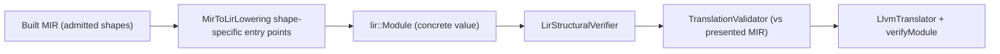

# LIR

Updated: 2026-09-19

## Authority And Status

| Field | Value |
|---|---|
| Authority | Non-normative compiler implementation guide |
| Coverage | Partial target-aware lowering slice with independent structural and translation verification on the emission path; **no session-published LIR capability type exists** |
| Governing decisions | [RFC 0021](../../rfc/0021-target-aware-lir-and-llvm-translation.md) (IMPLEMENTING), [RFC 0010](../../rfc/0010-intermediate-representation-pipeline.md), [RFC 0053](../../rfc/0053-lir-structural-verification-and-translation-validation.md) (DRAFT, implemented) |
| Production implementation | [`compiler/lir/`](../../../compiler/lir/) |
| Independent verifiers | [`compiler/lir/verify/`](../../../compiler/lir/verify/) (`LirStructuralVerifier`, `TranslationValidator`) |
| Sole production consumer | [`utils/zomc/zomc.cc`](../../../utils/zomc/zomc.cc) backend path |
| Native verification | [`tests/unittests/compiler/lir/`](../../../tests/unittests/compiler/lir/), object-emission and native-run integration tests |

The RFC 0021 contract is a typed block-parameter SSA CFG with a closed
operation inventory, monomorphization, FnAbi and calling-convention lowering,
and a fourteen-point independent verifier whose success creates
`VerifiedLirModule`, the only form RFC 0010/0021 permit LLVM translation to
consume. The on-disk implementation remains an integer slot machine with
shape-specific lowering functions and no session-stored `VerifiedLirModule`
capability type, but the emission path no longer trusts the concrete value:
RFC 0053 adds two independent, fail-closed stages (a per-construct structural
verifier and a MIR-to-LIR translation validator) that run between lowering and
LLVM translation. This note describes exactly what exists and names the
missing legs rather than presenting the full RFC 0021 design as current.

## Role In The Pipeline

`MirToLirLowering` exposes static per-shape entry points (scalar initializer,
aggregate field initializer, aggregate return, equality-conditional, loop,
comparison-driven conditional, and direct-call module variants). The
production consumer is the CLI native path, which selects the entry point from
the module's function and block counts, then runs both verification stages on
the exact MIR function set it handed to lowering before calling the LLVM
translator. A structural or translation finding aborts emission through the
`LirVerification` failure phase; it is an internal compiler failure, never a
source diagnostic. The LIR layer is not constructed by the session, is not
stored in session state, and has no accessor on `CompilerSession`.

## Representation

- `lir-module.h` defines `Module`, `Function` (carrying the MIR
  `identity::DefId` of the function it was lowered from, plus the rendering
  symbol), one-based local slot ordinals, blocks, an `Assign`/`Compare`
  statement set, and six terminators (`ReturnInteger`, `Goto`, `CondBranch`,
  `ReturnLocal`, `Call`, `ReturnAggregate`).
- Hard bounds are explicit: `kMaxCallArguments = 2` and
  `kMaxAggregateReturnSlots = 64`.
- `lir-store.h`/`lir-stores.h` define `ValueType`, scalar `StorageLayout`,
  and carrier-only `FnAbi` foundations; the populated carrier table and
  interned value-type store are not wired into module lowering.
- `lir-identity.h` provides store-local branded identities.
- `lir-algebra-codec.{h,cc}` defines the LIR algebra registry codec and an
  `AlgebraRevision` over `zom.lir-algebra`, with a checked-in empty-registry
  oracle.

## Production Profile

The lowerer emits integer and admitted aggregate-field bodies, conditional
and reducible-loop bodies as slot stores plus branch terminators, and
same-module direct calls of at most two arguments with a continuation block.
Parameters and locals are stack slots; the LLVM translator realizes them as
entry-block allocas, relying on LLVM's own optimization to promote. There is
no monomorphization, no float/pointer/general aggregate legalization, no PHI
or block-parameter emission, no globals, no unwind, and no general ABI
classification. The admitted construct inventory is
[lowerable-constructs.md](lowerable-constructs.md), and the backend wiring
limits are [llvm-backend-and-object-emission.md](llvm-backend-and-object-emission.md).

## Verified Guarantees

Two independent stages verify the emission path (RFC 0053); neither is a
private-constructor capability type, and neither is session-published.

`LirStructuralVerifier` validates the closed `lir::Module` algebra
per-construct, independent of the producer: non-empty unique function symbols;
dense unique blocks with an entry; every terminator target declared
in-function; intra-function reachability; dense split parameter/local slot
ranges; every referenced slot declared; carrier consistency for assigns,
compares, returns, aggregate bundles, and calls; one-bit branch conditions;
and module-level callee-index, arity, and per-argument carrier integrity.

`TranslationValidator` proves the module preserves the verified MIR it was
lowered from. It matches MIR to LIR functions one-to-one by definition owner
(never array position), then walks MIR constructs in block order: a dense
block bijection, per-effect lockstep correspondence (constant and place-use
assigns, comparisons, call destination and continuation edges), zero-extended
constant bit patterns independently derived from the type store, switch
polarity, and call callee-index resolution to the owner the MIR call names.
It accepts both lowering modes the producer emits: the materialized mode
(MIR locals map one-to-one to slots) and the folded mode (a constant local,
direct constant return, projected aggregate field, or whole-struct element
bundle resolves at the return with the source slot undeclared). It shares no
helper code with `mir-to-lir.cc`.

Still absent at the LIR layer:

- a `VerifiedLirModule` private-constructor capability type and atomic
  session adoption (verification runs in the CLI transaction, not in a
  session-owned stage);
- an independent stage that re-encodes LIR canonically or pins an LIR dump in
  the corpus parity channels;
- the downstream LLVM `verifyModule` remains a separate LLVM-IR boundary and
  cannot substitute for either LIR stage;
- the algebra codec has an oracle test but `AlgebraRevision` has no production
  consumer, and the RFC 0021 `LirRevisionId` over `zom.lir-revision` is not
  implemented.

The session capability, canonical re-encoding, and revision questions are
owned by RFC 0021 and the open
[RFC 0050](../../rfc/0050-cross-stage-ir-revision-identity-scope.md), cited
here as proposals, not decisions.

## Identity, Lineage, And Determinism

LIR values are plain in-process values with dense local ordinals; they carry
no upstream MIR revision lease and no session identity. Lowering is
deterministic per input function (fixed slot assignment and statement order),
covered indirectly by the object-emission integration expectations, but
unlike HIR and Built MIR there is no canonical LIR dump in the corpus parity
channels.

## Inspection And Native Verification

- `tests/unittests/compiler/lir/lir-module-test.cc` checks the lowered
  statements/terminators for admitted shapes;
- `lir-store-test.cc` covers value types and scalar layouts;
- `lir-algebra-codec-oracle-test.cc` pins the empty-registry framing;
- `lir-verifier-test.cc` accepts every admitted producer shape and rejects one
  minimal mutation per structural fault tag;
- `lir-translation-validator-test.cc` covers the folded and materialized
  single-function correspondences plus multi-function call owner integrity,
  one mutation per translation fault tag;
- every successful lowering site in the backend translation test asserts both
  verification stages;
- object-emission and native-execution integration tests cross both gates end
  to end behind `ZOM_ENABLE_LLVM_BACKEND`.

## Known Gaps

- A private-constructor `VerifiedLirModule` capability and atomic session
  publication are required by RFC 0021 and absent; the current verifiers gate
  emission but do not publish a session capability or parity dump channel.
- Block-parameter SSA, PHI-free merge handling, general operations, calls
  beyond two arguments, monomorphization, FnAbi, and target-aware legalization
  are unbuilt; slot-to-alloca lowering with implicit mem2reg is the current
  model.
- The lowering choice is made by CLI shape heuristics instead of a uniform
  recursive builder; RFC 0048 generalizes MIR and structural LIR admission in
  later phases, and each new lowering construct must extend the translation
  relation with a mutation test in the same change.
- SMT-based refinement of arithmetic and comparison lowering (Alive2 style)
  and a MIR reference-interpreter differential-execution harness are
  deliberately deferred (RFC 0053 non-goals).
- The populated algebra table has no consumer; `LirRevisionId` is unbuilt.
- Target selection, ABI, and capability revisions do not reach LIR lowering
  yet (see [target-registry-and-toolchain-discovery.md](target-registry-and-toolchain-discovery.md)).
