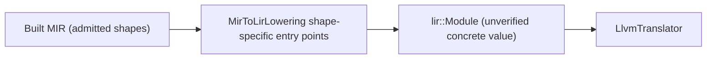

# LIR

Updated: 2026-09-14

## Authority And Status

| Field | Value |
|---|---|
| Authority | Non-normative compiler implementation guide |
| Coverage | Partial target-aware lowering slice; **no independent LIR verifier and no session-published LIR capability exist** |
| Governing decisions | [RFC 0021](../../rfc/0021-target-aware-lir-and-llvm-translation.md) (IMPLEMENTING), [RFC 0010](../../rfc/0010-intermediate-representation-pipeline.md) |
| Production implementation | [`compiler/lir/`](../../../compiler/lir/) |
| Sole production consumer | [`utils/zomc/zomc.cc`](../../../utils/zomc/zomc.cc) backend path |
| Native verification | [`tests/unittests/compiler/lir/`](../../../tests/unittests/compiler/lir/) |

The RFC 0021 contract is a typed block-parameter SSA CFG with a closed
operation inventory, monomorphization, FnAbi and calling-convention lowering,
and a fourteen-point independent verifier whose success creates
`VerifiedLirModule`, the only form RFC 0010/0021 permit LLVM translation to
consume. The on-disk implementation is deliberately smaller: an integer
slot machine with shape-specific lowering functions, no SSA verifier, and no
verified capability type. This note describes exactly what exists and names
the missing legs rather than presenting the RFC design as current.

## Role In The Pipeline

`MirToLirLowering` exposes static per-shape entry points (scalar initializer,
aggregate field initializer, aggregate return, equality-conditional, loop,
and direct-call module variants). The production consumer is exclusively the
CLI native path, which selects the entry point from the module's function and
block counts and then hands the concrete `lir::Module` straight to the LLVM
translator. The LIR layer is not constructed by the session, is not stored in
session state, and has no accessor on `CompilerSession`.

## Representation

- `lir-module.h` defines `Module`, `Function`, one-based local slot
  ordinals, blocks, an `Assign`/`Compare` statement set, and six terminators
  (`ReturnInteger`, `Goto`, `CondBranch`, `ReturnLocal`, `Call`,
  `ReturnAggregate`).
- Hard bounds are explicit: `kMaxCallArguments = 2` and
  `kMaxAggregateReturnSlots = 64`.
- `lir-store.h`/`lir-stores.h` define `ValueType`, scalar `StorageLayout`,
  and carrier-only `FnAbi` foundations; the populated carrier table and
  interned value-type store are not wired into module lowering.
- `lir-identity.h` provides store-local branded identities.
- `lir-algebra-codec.{h,cc}` defines the LIR algebra registry codec and an
  `AlgebraRevision` over `zom.lir-algebra`, with a checked-in empty-registry
  oracle.

## Production Profile

The lowerer emits integer and admitted aggregate-field bodies, conditional
and reducible-loop bodies as slot stores plus branch terminators, and
same-module direct calls of at most two arguments with a continuation block.
Parameters and locals are stack slots; the LLVM translator realizes them as
entry-block allocas, relying on LLVM's own optimization to promote. There is
no monomorphization, no float/pointer/general aggregate legalization, no PHI
or block-parameter emission, no globals, no unwind, and no general ABI
classification. The admitted construct inventory is
[lowerable-constructs.md](lowerable-constructs.md), and the backend wiring
limits are [llvm-backend-and-object-emission.md](llvm-backend-and-object-emission.md).

## Verified Guarantees

None at the LIR layer. Concretely:

- there is no `VerifiedLirModule` type and no `LirVerifier`;
- no independent stage re-encodes or structural-checks the produced module;
- the only downstream well-formedness check is LLVM's mandatory
  `verifyModule`, which validates LLVM IR after translation and therefore
  cannot reject an ill-formed LIR value that happens to translate;
- the algebra codec has an oracle test but `AlgebraRevision` has no production
  consumer;
- the RFC 0021 `LirRevisionId` over `zom.lir-revision` is not implemented.

The independent LIR verification boundary and the question of which revisions
that boundary needs are owned by RFC 0021 and the open DRAFT
[RFC 0050](../../rfc/0050-cross-stage-ir-revision-identity-scope.md), cited
here as a proposal, not a decision.

## Identity, Lineage, And Determinism

LIR values are plain in-process values with dense local ordinals; they carry
no upstream MIR revision lease and no session identity. Lowering is
deterministic per input function (fixed slot assignment and statement order),
covered indirectly by the object-emission integration expectations, but
unlike HIR and Built MIR there is no canonical LIR dump in the corpus parity
channels.

## Inspection And Native Verification

- `tests/unittests/compiler/lir/lir-module-test.cc` checks the lowered
  statements/terminators for admitted shapes;
- `lir-store-test.cc` covers value types and scalar layouts;
- `lir-algebra-codec-oracle-test.cc` pins the empty-registry framing;
- object-emission and native-execution integration tests exercise selected
  lowered modules end to end behind `ZOM_ENABLE_LLVM_BACKEND`.

## Known Gaps

- Independent structural LIR verifier, private-constructor capability, and
  session publication are required by RFC 0021 and absent; closing them is the
  gate before LIR can claim verified status or a parity dump channel.
- Block-parameter SSA, PHI-free merge handling, general operations, calls
  beyond two arguments, monomorphization, FnAbi, and target-aware legalization
  are unbuilt; slot-to-alloca lowering with implicit mem2reg is the current
  model.
- The lowering choice is made by CLI shape heuristics instead of a uniform
  recursive builder; RFC 0048 generalizes MIR and structural LIR admission in
  later phases.
- The populated algebra table has no consumer; `LirRevisionId` is unbuilt.
- Target selection, ABI, and capability revisions do not reach LIR lowering
  yet (see [target-registry-and-toolchain-discovery.md](target-registry-and-toolchain-discovery.md)).
