# LLVM Backend And Object Emission

Updated: 2026-09-14

## Authority And Status

| Field | Value |
|---|---|
| Authority | Non-normative compiler implementation guide |
| Coverage | Minimal verified native slice; production execution is Linux x86-64 only |
| Governing decisions | [RFC 0016](../../rfc/0016-context-bound-target-registry-verification.md), [RFC 0021](../../rfc/0021-target-aware-lir-and-llvm-translation.md), [RFC 0043](../../rfc/0043-platform-link-and-executable-publication.md) (all IMPLEMENTING) |
| Production implementation | [`compiler/backend/llvm/`](../../../compiler/backend/llvm/), [`compiler/ir/{link,publication,target}/`](../../../compiler/ir/) |
| Driver | [`utils/zomc/zomc.cc`](../../../utils/zomc/zomc.cc) |
| Native verification | `native-execution-cli` and `native-run-cli` in [`tests/CMakeLists.txt`](../../../tests/CMakeLists.txt), object-emission corpus |

The LLVM 22.1.8 backend, object path, hermetic linking, publication, and native
execution exist and are tested on Linux x86-64. They are an admitted slice of
IMPLEMENTING RFCs, not the RFCs' complete target pipeline. This note states
the live path and the four known deviations from the normative contracts as
implementation debt; the RFC text is not weakened to match the code.

## Role In The Pipeline

```mermaid
flowchart LR
    M["Ownership-checked Built MIR"] --> L["MIR to LIR (shape selected in CLI)"]
    L --> T["LlvmTranslator::translate"]
    T --> V["llvm::verifyModule mandatory before object emission"]
    V --> O["Relocatable ELF object"]
    O --> LP["VerifiedLinkPlan / ToolchainClosure"]
    LP --> EX["Executable inspection (D5)"]
    EX --> PB["Recoverable publication (D1)"]
    PB --> RN["Subprocess run on Linux x86-64"]
```

## Representation

- `LlvmTranslator` is the only translation unit permitted to include LLVM
  headers (Pimpl isolation, built under `ZOM_ENABLE_LLVM_BACKEND`).
- `LlvmTranslationResult::success` retains the verified textual LLVM IR and
  the emitted object bytes; failure carries diagnostic text and publishes
  nothing.
- Translation uses opaque pointers and emits every parameter/local as an
  entry-block alloca with loads and stores; no block parameters or PHI nodes
  are emitted (LLVM promotion is relied upon), signed comparison predicates
  are used for the admitted integer operations, and all produced functions
  currently get external linkage.
- The runtime entry [`runtime/entry-linux-x86_64.S`](../../../runtime/entry-linux-x86_64.S)
  provides `_start`, calls `zom.module_init`, and exits with the returned
  integer through the direct syscall path; the produced programs are
  freestanding (direct linker invocation with the runtime entry, no CRT or
  libc startup).

## Production Profile

- translation succeeds only for one-to-three integer-returning functions in
  the admitted single-block, call, conditional-diamond, or reducible-loop
  shapes; unsupported shapes fail closed;
- object emission uses the LLVM legacy pass manager file-emission path after
  mandatory verification;
- `zomc compile --emit=binary` reaches the object path; `zomc run` links
  through `ir::linkAndPublish`, runs the D5 executable inspector, publishes
  with the D1 manifest-last transaction, and launches the artifact as a
  subprocess on Linux x86-64 (the end-to-end test asserts the returned exit
  code);
- the link is hermetic per RFC 0043: empty linker environment, no shell, the
  verified toolchain closure and transaction root, no-follow and link-count
  invariants on the output, and bounded ELF/Mach-O inspection.

Mach-O emission inspection exists in tests; Mach-O execution, AArch64 entry
objects, cross-target run rejection policy, and general entry-point selection
remain later slices. Execution availability on the host is additionally
toolchain-dependent (the pinned LLVM 22.1.8 must be built against a compatible
host glibc).

## Verified Guarantees

- `llvm::verifyModule` runs on every translation and object emission is
  blocked on failure.
- Link plan, toolchain closure, executable inspection, and publication each
  have independent verification described in
  [link-publication-transaction.md](link-publication-transaction.md).
- Native CLI tests execute the linked Linux x86-64 artifact and assert the
  expected process result; object-emission integration tests pin accepted and
  rejected shapes.

LLVM verification does not substitute for the absent LIR verifier (see
[lir.md](lir.md)); it checks translated LLVM IR, not the input LIR or the
MIR-to-LIR decision.

## Identity, Lineage, And Determinism

The slice does not yet consume `VerifiedExecutableMir`, LIR/executable-MIR set
revisions, or verified target identity:

1. the CLI chooses the MIR-to-LIR lowerer by function and block counts;
2. it reads `getOwnershipCheckedMirModules()` and lowers the owned Built MIR
   directly even though `getVerifiedExecutableMirModules()` already exists;
3. the translator uses the LLVM host default target triple and data layout
   instead of the RFC 0016 verified target selection;
4. there is no `VerifiedLirModule` and no `--emit=lir`, `--emit=llvm-ir`, or
   `--emit=obj` selection (objects are emitted internally on the binary/run
   paths).

These are the four named deviations from RFCs 0010/0021 for this slice. They
are tracked implementation gaps to close as the LIR verifier, uniform
recursive lowering (RFC 0048), and target-bound codegen land; they are not
reasons to amend the RFC contracts.

## Inspection And Native Verification

- `native-execution-cli`: fail-closed behavior without the backend enabled and
  scalar execution with it enabled;
- `native-run-cli`: end-to-end compile, link, inspect, publish, run;
- translator unit tests and the object-emission fixture suite cover accepted
  and fail-closed shapes;
- `scripts/check-llvm-lock.py` and the provisioning gate pin the LLVM source
  and discovery; `check-ir-architecture.py` keeps the LLVM include isolation
  wall.

## Known Gaps

- Close the four deviations above: verified LIR capability, executable-MIR
  consumption, verified target triple/data layout, and emit selections.
- General ABI lowering, aggregate/argument coverage beyond the admitted
  shapes, float/pointer codegen, attributes and `inbounds` discipline, and
  non-external linkage policy.
- AArch64 entry/execution, Mach-O execution (entry-symbol handling open),
  cross-target execution rejection through the CLI, and general entry-point
  semantics.
- DWARF debug info is absent (RFC 0045 is accepted but unimplemented).
- Conditional and loop objects are relocatable in fixtures; only the admitted
  scalar initializer is the production module shape selected for run.
