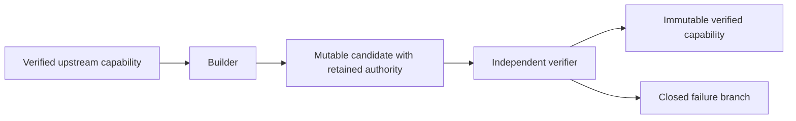
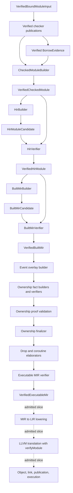

# IR Lowering And Verification

Updated: 2026-09-21

## Authority And Status

| Field | Value |
|---|---|
| Authority | Non-normative compiler implementation guide |
| Coverage | Current checked-module, HIR, Built MIR, ownership/executable-MIR, and the admitted LIR/backend publication path |
| Governing decisions | [RFC 0010](../../rfc/0010-intermediate-representation-pipeline.md), [RFC 0013](../../rfc/0013-ownership-analysis-integration-boundary.md) |
| Production integration | [`compiler-session.cc`](../../../compiler/driver/session/compiler-session.cc) |
| Shared IR contracts | [`compiler/ir`](../../../compiler/ir/) |
| Architecture gate | [`check-ir-architecture.py`](../../../scripts/check-ir-architecture.py) |

This document describes the live candidate, verifier, capability, and atomic
session-publication pattern. It does not define successor stages that are not
implemented.

## Stage Pattern



The builder may organize and lower data, but its output is untrusted. The
candidate retains or references the exact authoritative upstream capability.
The verifier rederives the invariants through that retained authority and owns
the private constructor of the verified result.

Here, publication has two distinct meanings. A verifier publishes a typed,
immutable capability from an untrusted candidate. `CompilerSession` is the
owner that later adopts complete verified module vectors into observable
session state.

The live sequence is:



The ownership chain and the LIR/backend slice are partial; their exact
boundaries are [ownership-and-executable-mir.md](ownership-and-executable-mir.md),
[lir.md](lir.md), and
[llvm-backend-and-object-emission.md](llvm-backend-and-object-emission.md).

## Checked-Module Handoff

`CheckedModuleBuilder` is the sole assembler of the semantic handoff. It binds
the verified bound module to:

- one session semantic context and type store;
- checked and dispatch publications;
- verified borrow evidence;
- own and imported module interfaces; and
- exact source and parsed receipts.

HIR receives this capability instead of reading independent mutable checker
tables or reconstructing semantic decisions from AST spelling.

## HIR Boundary

`HirBuilder` validates that the upstream evidence is live and that every fact
family outside the current scalar profile is empty. It assigns deterministic
HIR-local identities and creates a candidate.

`HirVerifier` independently rechecks lineage, fact inventories, AST shapes,
semantic types, source ranges, definition coverage, record cardinality, and
cross-record references. Only it publishes `VerifiedHirModule`.

## Built MIR Boundary

`BuiltMirBuilder` consumes the verified HIR capability and emits the exact
current scalar initializer and scalar-return profiles. It sorts functions,
encodes canonical records, and computes a candidate revision.

`BuiltMirVerifier` independently maps MIR owners back to HIR, validates the
exact emitted shapes, re-encodes every function record, recomputes the module
revision, and confirms the evidence lease. Only it publishes
`VerifiedBuiltMir`.

## Failure Algebra

The shared IR failure algebra defines owner, site, phase, kind, and canonical
failure sequences. Every live IR operation returns exactly one of four
branches:

| Branch | Meaning |
|---|---|
| `Verified` | The verifier published the requested capability |
| `CapabilityRejected` | A required verified upstream capability or lease was unavailable |
| `IdentityInvariantRejected` | Context-bound identity or lineage was invalid |
| `IrInvariantRejected` | Candidate structure, order, codec, or revision violated the stage contract |

Failure sequences are non-empty, canonical, and sorted. User-actionable
source-backed capability failures project to canonical diagnostic facts. IR
identity, lineage, verifier, structure, order, codec, and revision failures
project to bounded compiler incidents. Output creation, external-process, and
other source-less resource failures remain typed operational failures.

The failure algebra also contains coordinates for successor phases and LIR.
Those coordinates define the closed vocabulary used by the partial successor
stages now on disk; they are not, by themselves, evidence that any phase is
complete. In particular LIR has no session-published capability, but the
binary-emission path does run two independent stages that project findings at
the `LirVerification` phase (`0x0d`) as compiler incidents: the structural
`LirStructuralVerifier` and the MIR-to-LIR `TranslationValidator` (see
[lir.md](lir.md) and RFC 0053).

## Atomic Session Adoption

`CompilerSession::checkSources()` uses a stage-then-commit transaction:

1. create staged checker and borrow-evidence repositories;
2. build the checked-module handoff for each module;
3. build and verify HIR;
4. build and verify Built MIR;
5. build the ownership event overlay and independently verified fact sets,
   validate ownership proofs, finalize ownership-checked MIR, and run the drop
   and coroutine elaborators and the executable-MIR verifier;
6. stop immediately on any source, capability, identity, or IR failure; and
7. only after all modules succeed, move every staged repository and module
   vector (including the ownership and executable-MIR artifacts) into session
   state.

No checked facts, evidence, HIR, MIR, ownership facts, or executable MIR from
that invocation become visible when any module fails. This is an all-module
publication boundary, not a per-module best-effort cache. The LIR, object,
link, and execution path runs outside this transaction through the CLI backend
slice; its publication transaction is a separate, independently verified
contract (see [link-publication-transaction.md](link-publication-transaction.md)).

## Determinism

Determinism is structural:

- identities are context-bound and validated before dereference;
- HIR declarations and functions sort by source position and canonical
  definition key;
- HIR node allocation follows fixed live shapes;
- MIR functions sort by complete canonical owner key;
- canonical function records are re-encoded by the verifier;
- MIR revision inputs bind exact upstream revisions and ordered records; and
- session vectors adopt only the complete staged order.

Pointer addresses, hash-table iteration, worker completion order, and
diagnostic timing are not ordering inputs.

## Enforcement And Native Verification

The direct architecture gate is:

```bash
python3 scripts/check-ir-architecture.py --check
python3 scripts/check-ir-architecture.py --self-test
```

It checks required identity and failure markers, Built MIR wiring, session
publication, target independence, and selected forbidden duplicate rails. Its
negative fixtures prove the gate rejects specific architectural mutations; the
gate does not replace semantic unit and integration tests.

The native test boundary includes HIR unit tests, Built MIR codec-oracle tests,
and compiler-session package tests for construction, corruption rejection, and
atomic publication. Repository-wide completion still requires the standard
sanitizer build, unit suite, RFC validation, format check, and diff hygiene
named by `AGENTS.md`.

## Known Gaps

- Ownership proof validation and executable-MIR publication run only for the
  admitted shape set; general region, capture, typestate, drop, and coroutine
  completeness is open.
- LIR exists as a shape-specific integer slice without an independent
  verifier or session capability, and the backend path is wired in the CLI
  rather than the session and consumes Built MIR rather than executable MIR.
- LLVM translation, object emission, linking, and native execution exist only
  for the Linux x86-64 admitted slice with host-target selection.
- The architecture gate proves selected structural boundaries, not full IR
  semantic correctness.
- General structural HIR/MIR candidate-corruption coverage is part of the
  still-ongoing RFC 0048 work.
