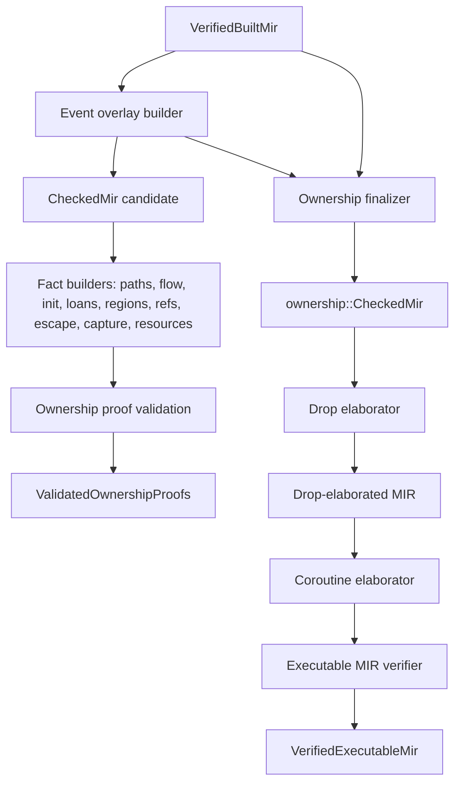

# Ownership Facts And Executable MIR

Updated: 2026-09-14

## Authority And Status

| Field | Value |
|---|---|
| Authority | Non-normative compiler implementation guide |
| Coverage | Partial production ownership rail over the admitted Built MIR subset |
| Governing decisions | [RFC 0007](../../rfc/0007-borrow-lifetime-ownership-checker.md), [RFC 0013](../../rfc/0013-ownership-analysis-integration-boundary.md), [RFC 0010](../../rfc/0010-intermediate-representation-pipeline.md) |
| Production implementation | [`compiler/ownership/`](../../../compiler/ownership/) |
| Session integration | [`compiler-session.cc`](../../../compiler/driver/session/compiler-session.cc) |
| Native verification | [`tests/unittests/compiler/ownership/`](../../../tests/unittests/compiler/ownership/) |

RFCs 0007 and 0013 are IMPLEMENTING. The ownership rail runs on the
production `checkSources()` path over every admitted module, but its analysis
is bounded to the admitted shapes: reducible CFGs, scalar and admitted
aggregate bodies, and a narrow borrow/reborrow surface. General region
liveness, escape/capture-boundary completeness, loans/references/regions
completeness, marker/linear/unsafe boundaries, and general drop/coroutine
elaboration are open gaps. No incomplete slice publishes a successor artifact
beyond what this note lists.

## Role In The Pipeline

The rail operates only over Built MIR, never over AST or HIR; a second CFG
and AST-node identities are architecturally excluded. The session stages the
overlay, facts, validation, finalization, drop elaboration, coroutine
elaboration, and executable-MIR verification inside the same stage-then-commit
transaction as checker, HIR, and Built MIR publication; failure anywhere
commits nothing.

Production session accessors expose `getOwnershipCheckedMirModules()`,
`getValidatedOwnershipProofs()`, and `getVerifiedExecutableMirModules()` in
dependency order. The current native backend slice additionally reads the
owned Built MIR through `CheckedMir`; that shortcut and the still-open
executable-MIR consumer contract are recorded in
[llvm-backend-and-object-emission.md](llvm-backend-and-object-emission.md).

## Representation

Fact construction follows the candidate/builder/independent-verifier split
with separate producer and verifier translation units:

- move paths and the prefix-closure conflict relation (`facts/paths.*`);
- flow derivation and the reducible-CFG subset admission (`facts/flow.*`,
  `facts/flow-subset.*`);
- three-state initialization facts (`facts/init.*`);
- loans with shared/mutable and active/reserved phases, including two-phase
  activation derived from dispatch receiver adjustments (`facts/loans.*`);
- regions, region outlives closure, and region membership (`facts/regions.*`,
  `facts/region-outlives.*`, `facts/region-membership.*`);
- reference definitions and reborrow state (`facts/refs.*`, `facts/states.*`);
- escape and capture boundaries (`facts/escape.*`, `facts/capture.*`);
- resource and linear-source facts (`facts/resources.*`,
  `facts/linear-source.h`, `facts/ownership-budget.*`);
- raw provenance and analysis inputs (`facts/raw-provenance.h`,
  `facts/inputs.*`);
- the ownership facts codec and its revision
  (`facts/ownership-facts-codec.*`, `facts/ownership-facts-revision.*`).

Overlay artifacts live in `compiler/ownership/overlay/`: the event overlay
records Built MIR events keyed to source facts; `CheckedMir` owns Built MIR,
the overlay, and verified facts; drop-elaborated and
coroutine-elaborated wrappers retain their predecessor; `VerifiedExecutableMir`
is the terminal move-only capability with a private verifier constructor.

Surface admission (`compiler/ownership/admission/surface-admission.*`)
performs the fail-closed source-construct scan that keeps unsupported
concurrency and borrow shapes out of the rail.

## Production Profile

For the admitted surface the production path derives move paths, scalar
diamond and reducible-loop flow, initialization state, and bounded
loan/reference/reborrow inventories; it rejects conflicting loans,
move-out-of-borrow, returned-local-borrow escape, and use-after-move on the
source diagnostic rail, and validates ownership proofs once per module. Drop
elaboration emits drops only for resources that are live on every exit of the
admitted bodies; a resource moved out before every exit correctly emits none.
Coroutine elaboration is wired but admits no coroutine bodies yet.

The construct-level inventory of which source shapes reach Built MIR is
[lowerable-constructs.md](lowerable-constructs.md); ownership analysis runs
over that inventory, not beyond it.

## Verified Guarantees

- Every fact builder has a separate verifier that independently recomputes
  the fact set; candidate and verifier share only immutable inputs.
- `OwnershipProofValidation::validate` publishes one
  `ValidatedOwnershipProofs` per module, retaining the triple lineage (Built
  MIR revision, event-overlay revision, borrow-evidence revision).
- The executable-MIR verifier is the sole creator of
  `VerifiedExecutableMir`; the session adopts it only on total success.
- Ownership facts are deterministic across worker counts and process
  repeats, enforced by the ownership determinism gate.

This is not a complete NLL/Polonius-equivalent solver: the flow subset admits
only reducible CFGs, there are no unwind edges, and the cross-checks for
store/closure escape, required-point-set containment, and proof-to-borrow
input matching remain deferred until their inputs are produced.

## Identity, Lineage, And Determinism

Each overlay and fact set retains the exact `zom.mir-revision` of its input
and rejects a stale or foreign revision as an identity invariant. Borrow
evidence crosses modules through the RFC 0013 root-only borrow signature
summary and the unforgeable repository capability/lease. Revisions are used
only for in-process lineage and lease mismatch rejection; they are not a
persistence format. The open re-review of that boundary is DRAFT
[RFC 0050](../../rfc/0050-cross-stage-ir-revision-identity-scope.md), an open
proposal, not an accepted change.

## Inspection And Native Verification

- fact suites under `tests/unittests/compiler/ownership/facts/` cover borrow
  sources, budgets, capture, escape, the oracle codec, flow subset, linear
  sources, loop flow, raw provenance, and region membership/outlives;
- overlay suites cover drop elaboration, the event overlay, lineage mutation
  rejection, private-constructors, and proof validation;
- `scripts/check-ownership-coverage.py`,
  `scripts/check-ownership-determinism.py`, and
  `scripts/check-ownership-architecture.py` (with self-test mutation
  fixtures) gate coverage, byte determinism, and layering;
- source diagnostics for the live rejections are pinned by lit/FileCheck
  conformance files.

## Known Gaps

- General region liveness, full loan/reference/region completeness, general
  escape/capture boundaries, marker/linear/unsafe typestate, and bounded
  exhaustive state exploration are not production-complete.
- Cross-checks deferred in proof validation pending admitted store/closure
  escapes and the validation signature extension.
- Drop and coroutine elaboration are bounded; no general cleanup, unwind, or
  panic-abort transition lowering exists yet.
- The native backend consumes Built MIR through `CheckedMir` rather than the
  terminal `VerifiedExecutableMir`; closing that gap is backend work tracked
  against RFC 0021, not a change to this rail's contracts.
- Analysis is restricted to reducible CFGs produced by the admitted
  constructor set; irreducible control flow is rejected.
