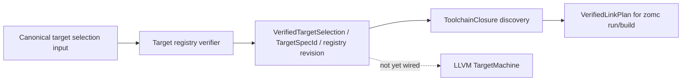

# Target Registry And Toolchain Discovery

Updated: 2026-09-14

## Authority And Status

| Field | Value |
|---|---|
| Authority | Non-normative compiler implementation guide |
| Coverage | Verified target specs/registry and hermetic toolchain discovery; not yet bound into LLVM code generation |
| Governing decisions | [RFC 0016](../../rfc/0016-context-bound-target-registry-verification.md) (IMPLEMENTING) |
| Production implementation | [`compiler/ir/target/`](../../../compiler/ir/target/) |
| Native verification | [`tests/unittests/compiler/ir/target/`](../../../tests/unittests/compiler/ir/target/) |

## Role In The Pipeline

Target registry verification provides the authoritative, content-revision-bound
description of target triples, data layouts, and code-generation capability
sets that future target-aware lowering must consume instead of probing the
host. Toolchain discovery resolves one hermetic `ToolchainClosure` (sysroot,
linker, CRT objects, default libraries, entry object) for linking. Host
execution profile logic decides whether a discovered artifact is runnable on
the current host.

## Representation

- `target-registry.{h,cc}`: canonical target spec framing over
  `zom.target-spec`, registry revision over `zom.target-registry`, and the
  feature-boundary registry; spec IDs and revisions are SHA-256 digests over
  canonically framed records and are recomputed by the independent registry
  verifier.
- `toolchain-discovery.{h,cc}`: hermetic closure resolution without ambient
  environment leakage; the discovered closure feeds the RFC 0043 link plan.
- `host-execution-profile.{h,cc}`: host-compatibility classification for
  linked executables, used to gate `zomc run` rather than attempting
  cross-architecture execution.

## Production Profile

The registry, discovery, and host-profile logic have live builders,
independent verifiers, and native tests, and package/module resolution
queries verified host and target selections through the session. The actual
LLVM translation slice does not yet consume the verified selection:
`LlvmTranslator` uses the host default triple and data layout, as recorded in
[llvm-backend-and-object-emission.md](llvm-backend-and-object-emission.md).
The live link path uses the discovered toolchain closure on Linux x86-64.

## Verified Guarantees

- Every registered target spec and the registry itself is bound by a
  recomputed canonical revision; mismatched or unknown triples fail closed.
- Discovery rejects ambient probes and binds the exact closure with its
  digest, so dev and CI cannot silently diverge; the pinned LLVM 22.1.8
  provisioning is lock-checked.
- Discovery fixtures and the registry oracle tests pin the canonical bytes
  (including the RFC 0010 target-spec and registry hex oracles).

## Identity, Lineage, And Determinism

Target identity is context-bound and content-addressed over canonical framed
records; it never derives from host paths or pointer values. The eventual
binding into a `VerifiedTargetMachine` (RFC 0021) must carry the spec ID,
registry revision, and capability revision; that binding is not implemented.

## Inspection And Native Verification

- `target-registry-test.cc` pins the fixed RFC 0010 oracle plus discovery and
  rejection fixtures;
- `toolchain-discovery-test.cc` covers closure resolution and fail-closed
  discovery;
- `host-execution-profile-test.cc` pins compatibility classification;
- `scripts/check-llvm-lock.py` verifies provisioning consistency.

## Known Gaps

- Wire `VerifiedTargetSelection` into the LLVM translator in place of the host
  triple.
- Complete D2/D3 sysroot/toolchain discovery surfaces beyond the Linux
  x86-64 link closure.
- AArch64 and Mach-O execution profiles and entry-object discovery.
- Capability-set driven legalization in LIR is absent (see [lir.md](lir.md)).
