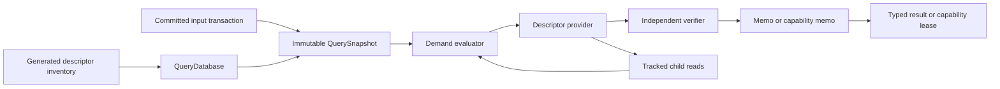
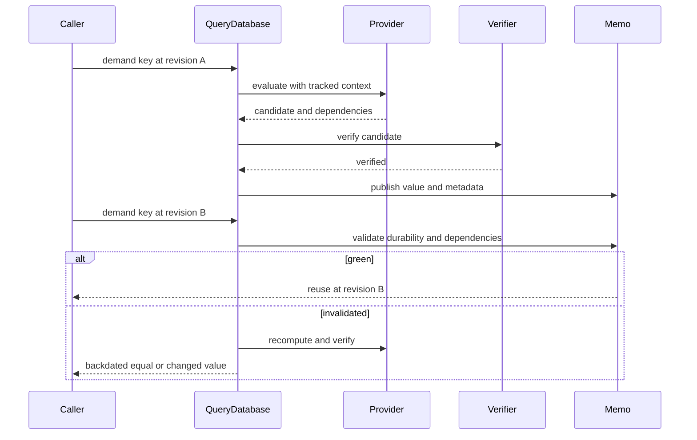

# Incremental Query Runtime

## Authority And Status

Owner: `module-system`

Required technical reviewers: `runtime-memory`, `verification`, and the owner
of every descriptor family changed by a patch.

Last verified: 2026-07-29 at
`cd94cf6bc220158114125d151658aa88c1db335c`.

This is a living reference for the in-process compiler query runtime. The
language specification is not an authority for this internal subsystem.
Accepted RFCs define approved contracts, while production code and
project-native tests establish the implementation claims below.

The generated descriptor inventory, explicit-input transactions, immutable
snapshots, semantic red-green evaluation, revision-local capability leases,
single-flight evaluation, cancellation, final-seal runtime, and deterministic
telemetry are implemented. `CompilerSession` uses the production inventory,
semantic queries, and any-snapshot capabilities. It does not yet publish or
admit a final-sealed production snapshot, so final-sealed Binder capability
descriptors are implemented and natively tested but are not production Binder
roots.

## Audience And Outcome

This page is for contributors adding or changing a compiler query. After
reading it, a contributor should be able to:

- choose the correct descriptor kind;
- add a descriptor without inventing runtime identity or registration order;
- perform only tracked reads from a provider;
- understand when a memo is reused, recomputed, or rejected;
- preserve capability lifetime and final-snapshot admission; and
- select the native tests and gates required for the change.

## Mental Model

The runtime is a revisioned dependency graph. A descriptor declares one
operation. Its canonical key identifies one graph node. A snapshot fixes the
input root and memo state observed by a demand. Providers can reach other
nodes only through their query context, so every dependency needed for reuse
is recorded.



The central invariant is that a provider cannot publish a reusable result
whose authority was read outside `QueryContext` or
`CapabilityQueryContext<Descriptor>`.

## Terminology

| Term | Meaning |
|---|---|
| Descriptor inventory | The generated, target-specific ordered set of legal input, semantic, and capability descriptors |
| Descriptor | A compile-time declaration of key shape, metadata, provider, verifier, and any capability failure alternatives |
| Database revision | The process-local ordinal of one committed explicit-input root |
| Snapshot | An immutable lease on one database revision and its memo state |
| Canonical query key | Inventory ordinal, SHA-256 fingerprint, and retained canonical key bytes |
| Semantic query | A canonical value, absence, or semantic-failure computation eligible for red-green reuse |
| Capability query | A revision-local verified object returned through a retained `QueryCapabilityLease` |
| Dependency group | One sequential dependency or one explicitly parallel, canonically recorded set |
| Final seal | A one-shot, revision-neutral proof that the complete input context is immutable |
| Final admission | Snapshot-local authority required before a final-sealed capability can execute |

## Current Model

### Descriptor inventory and registration

`query-descriptor-schema.def` is the production inventory source. It currently
contains forty contiguous rows. Each row fixes:

- the inventory ordinal;
- complete C++ descriptor type;
- literal name and domain;
- descriptor kind and role;
- reuse, retention, durability, and admission policies; and
- the owning path family.

`generate-query-descriptor-schema.py` validates the schema and generates the
target-bound inventory and `QueryDescriptorInventoryBinding<Descriptor>`
specializations. `QueryDatabase` receives that immutable inventory at
construction. `registerDescriptor<Descriptor>()` then proves that the
descriptor's literal metadata and callback shape match its generated row.
The first snapshot or input transaction closes registration.

Registration order never assigns identity. `QueryKindId` is the generated
inventory ordinal, and duplicate type, name, domain, row, or slot registration
is rejected.

### Inputs and revisions

Only one `InputTransaction` can be open. It starts from an expected database
revision, stages a complete next input root, and commits atomically. A changed
input advances the revision and updates the appropriate durability clocks.
An equal replacement retains the prior `changedAt` revision. Erasure removes
the input from the next root; the runtime stores no tombstone.

`get<InputSpec>()` is a required read. Missing input produces
`MissingInput`. `probeInput<InputSpec>()` records explicit `Present` or
`Absent` state without turning absence into a failure. Probe dependencies are
sequential and are not legal inside a parallel dependency group.

### Semantic evaluation and red-green reuse

A semantic descriptor supplies canonical key and value codecs, a provider, and
an independent verifier. The evaluator first checks cancellation, cycles, an
exact memo, and an existing single flight.

A prior semantic memo is green when either:

1. the durability fast path proves that no input at or above its minimum
   durability changed after `verifiedAt`; or
2. every recorded dependency validates, every required dependency has
   `changedAt <= verifiedAt`, and every probed input still has the same
   presence alternative.

If the memo is green, the runtime reuses its value and dependency groups at the
new snapshot revision. If validation fails, the provider and verifier run
again. A byte-equal result with a compatible minimum durability is backdated
to the prior `changedAt`; a changed result receives the current revision.



### Revision-local capabilities

A capability descriptor supplies:

- a capability type;
- a provider and independent verifier;
- a descriptor-owned candidate witness codec; and
- a closed `FailureAlternatives` list with one canonical contract for each
  reachable source or key rejection.

The evaluator publishes one retained capability memo only after provider and
verifier agreement. A `QueryCapabilityLease` retains the capability memo,
snapshot arena, semantic-context resources, stable witness, and transitive
capability dependencies. Capability memos are revision-local and are never
backdated into another revision.

Capability demands return exactly one of the descriptor's reachable published,
source-rejected, key-rejected, or runtime-rejected alternatives. Source and key
rejections are independently decoded and verified. Runtime failures are not
semantic values and are not reusable rejection payloads.

`CompilerSession` currently demands `ParseSourceQuery` and
`StableIdentityAdmissionQuery` through this path. Those descriptors admit any
snapshot and have real production consumers.

### Final sealing and admission

The runtime supports one complete-context input row selected by the generated
inventory. `sealInputs()`:

1. retains the exact current snapshot and descriptor row;
2. demands the complete-context input outside the database data lock;
3. calls the input's independent final-authority verifier; and
4. publishes one immutable final-seal admission only if database, revision,
   key, descriptor, and witness coordinates still match.

Sealing does not create a revision. It is irreversible. After publication,
input transactions are rejected. `admitFinalSnapshot()` checks the seal
against an unadmitted current snapshot and returns a move-only
`SealedQuerySnapshot`.

A descriptor marked `FinalSealedSnapshot` fails before provider execution
unless its demand inherits the exact admission. Nested capability demands
retain that admission. The runtime implementation and race ordering are
covered by native tests. Production `CompilerSession` final-seal publication
is a known gap.

### Concurrency, cancellation, and ordering

Equal key-and-revision demands join one flight. The requester that owns the
flight evaluates the provider; joiners wait for the same result. A cancelled
requester does not cancel a shared flight owned by another request.

Providers may create an explicit parallel dependency group. Results preserve
caller key order, while recorded dependencies use canonical query-key order.
Nested parallel groups fail closed to avoid bounded-pool starvation. Direct
cycles and cross-worker wait cycles publish no memo. Cancellation before
publication also publishes no value, capability, or dependencies.

## Invariants

1. Database identity is a retained, unforgeable, process-local token. It is not
   serialized or derived from a counter or address.
2. Descriptor identity comes only from the generated inventory.
3. A canonical key retains both its fingerprint and complete bytes; a digest
   collision is a runtime failure, not equality.
4. Providers read inputs and child queries only through their tracked context.
5. Semantic candidates publish only after independent verification.
6. Capability candidates and rejections use descriptor-owned contracts.
7. A capability lease retains every resource needed to interpret its object.
8. Final-sealed providers run only with matching database, revision, context
   key, and witness admission.
9. Cancellation, cycles, verifier disagreement, and runtime invariant failures
   publish no memo.
10. Database destruction and move assignment require every snapshot, context,
    transaction, and retained borrower to be gone.

## Implementation Map

| Responsibility | Production entry points |
|---|---|
| Core data model and result algebra | `products/zomlang/compiler/query/query-types.h`, `query-types.cc` |
| Evaluation, snapshots, transactions, sealing, and telemetry | `products/zomlang/compiler/query/query-database.h`, `query-database.cc` |
| Production inventory | `products/zomlang/compiler/query/query-descriptor-schema.def` |
| Inventory generation | `scripts/generate-query-descriptor-schema.py` |
| Production database construction and registration | `products/zomlang/compiler/driver/compiler-session.cc` |
| Production parse capability | `products/zomlang/compiler/parser/parse-source-query.h`, `parse-source-query.cc` |
| Binder identity and provenance descriptors | `products/zomlang/compiler/driver/named-identity-inventory-query.h`, `named-identity-inventory-query.cc`, `named-item-query.h`, `named-item-query.cc`, `owner-body-query.h`, `owner-body-query.cc` |
| Complete-context authority input | `products/zomlang/compiler/driver/module-graph-query-input.h`, `module-graph-query-input.cc` |

## Failure, Safety, And Resource Boundaries

Input mutation and final sealing use closed failure sets. Demand-time runtime
failures distinguish registration, key encoding, missing input, provider,
verifier, cycle, cancellation, fingerprint, invariant, final-admission, and
allocation failures.

Canonical descriptor codecs must reject malformed and trailing bytes. The
inventory generator rejects non-contiguous ordinals, duplicate identities,
invalid domains, illegal policy combinations, and any second complete-context
authority. Capability rejection envelopes are descriptor-domain bound and
publish no partial capability.

The query engine is in-process and memory-resident. It has no persisted cache,
network input, cross-process identity, or stable external wire format.
Descriptor-specific canonical formats own their byte and element limits.

## Inspection And Debugging

`QuerySnapshot` exposes project-internal inspection surfaces:

- `metadata<Descriptor>(key)` for `verifiedAt`, `changedAt`, and minimum
  durability;
- `dependencies<Descriptor>(key)` for sequential and parallel groups;
- `events()` for execution, reuse, recomputation, cancellation, cycles,
  verifier rejection, joined flights, and eviction;
- `keyFingerprint<Descriptor>(key)` for canonical identity checks; and
- `hasRetainedValue()` and `evictValue()` for allowed semantic memo tests.

The primary native commands are:

```bash
ctest --preset default -R '^query-(database|red-green|capability|concurrency|eviction|observability)-test$' --output-on-failure
python3 scripts/generate-query-descriptor-schema.py --check
python3 scripts/generate-query-descriptor-schema.py --self-test
python3 scripts/check-query-descriptor-architecture.py --check
python3 scripts/check-query-descriptor-architecture.py --self-test
python3 scripts/check-incremental-query-architecture.py --check
python3 scripts/check-incremental-query-architecture.py --self-test
```

Use the committed Release benchmark protocol for performance claims. A noisy
run or metadata mismatch is not comparison evidence.

## Extension Workflow

To add or change a query:

1. Add or replace its row in `query-descriptor-schema.def`. Keep ordinals
   contiguous and use one unversioned current name and domain.
2. Define the descriptor with literal metadata and exact key codecs.
3. For a semantic query, add canonical value codecs, a provider, and an
   independent verifier.
4. For a capability query, add the capability type, candidate witness codec,
   closed failure list, and independent failure contracts.
5. Register the descriptor from its owning subsystem before the database
   publishes a snapshot.
6. Demand it from a real production consumer when the feature is intended to
   be production-reachable.
7. Add native success, malformed key/value, provider-verifier disagreement,
   dependency, invalidation, cancellation, and applicable admission tests.
8. Run generation, descriptor architecture, incremental-query architecture,
   sanitizer, format, and full relevant native gates.

Do not edit a generated inventory, choose a runtime ordinal, read session state
from a provider, add an alternate registration path, or retain an earlier
descriptor beside its replacement.

## Evidence Map

| Claim | Native evidence |
|---|---|
| Inventory identity and registration closure | `query-database-test`, descriptor generator check and self-test, descriptor architecture check and self-test |
| Input transactions and presence tracking | `query-database-test` |
| Red-green reuse and backdating | `query-red-green-test` |
| Capability publication, leases, failures, and final admission | `query-capability-test` |
| Single flight, cancellation, cycles, and parallel groups | `query-concurrency-test` |
| Retention and eviction | `query-eviction-test` |
| Deterministic telemetry | `query-observability-test` |
| Binder final-sealed success and rejection matrix | `active-definition-authority-session-test` |
| Forbidden construction, observation, copying, and decoder access | `query-runtime-negative-compile-*` CTests |
| Release performance | `scripts/run-incremental-query-benchmarks.py` with the committed corpus and baseline |

## Known Gaps

- `CompilerSession` retains an authority-staging snapshot and an ordinary
  authority-ready snapshot but does not yet seal and admit the complete
  context.
- Binder capabilities marked `FinalSealedSnapshot` are registered and covered
  by native tests but are not yet demanded as production Binder roots.
- The source-backed core-library program has not yet installed its complete
  stable and capability query family.
- There is no persisted or cross-session query cache.
- Query telemetry is available through in-process snapshot inspection; there
  is no user-facing query graph dump.

## Maintenance Triggers

Update this page in the same logical change when:

- a descriptor kind, inventory row, policy, or registration rule changes;
- input transaction, revision, durability, or presence semantics change;
- memo validation, equality, backdating, eviction, or dependency grouping
  changes;
- capability ownership, witness, failure alternatives, or admission changes;
- final-seal construction or production session adoption changes;
- cancellation, cycle, flight, or parallel scheduling changes;
- an inspection surface, architecture gate, benchmark, or native test changes;
  or
- a known gap becomes production-reachable or is removed.
