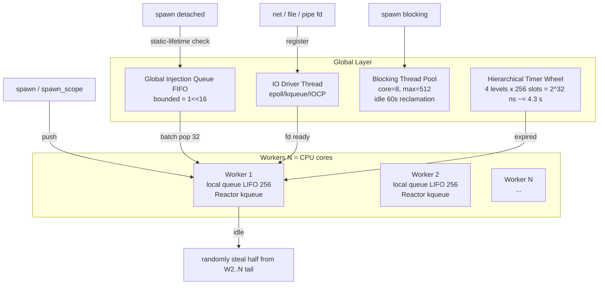

Design Dimension 3: Concurrency Semantics -- Runtime Architecture / Edge Semantics / FFI Interop / Examples.

The following organizes the four sub-dimensions of **Design Dimension 3: Concurrency Semantics** -- Runtime Architecture / Edge Semantics / FFI Interop / Examples. All content is anchored to `docs/concurrency/zom-async-canonical-design.md` (v1.0.0-rc1).

---

## 1. Runtime (Section 8 Runtime Model)

### 1.1 Overall Architecture (M:N + work-stealing + two-level IO Reactor)



### 1.2 Scheduler Loop (Single Worker Five-Step Priority)

1. **Local LIFO queue tail** (cache-friendly; child tasks just spawned by the parent run first)
2. **Global injection queue batch pop of 32 items** (amortize global lock cost)
3. **work-steal**: randomly select another Worker, steal the first half of its queue (chunk = min(remaining/2, 32))
4. **park awaiting one of three signals**: global new task / IO Driver fd ready / another Worker steals-and-wakes
5. After waking, return to step 1

### 1.3 Two-Level IO Reactor

| Level | Responsibility |
|---|---|
| Main IO Driver (global singleton) | epoll main fd; all IO Read/Write/Accept SuspendEvents are ultimately listened to by it |
| Per-Worker Reactor | Worker's own epoll/kqueue; local events (Channel/Mutex/Timer/TaskComplete) do not pass through the main Driver |
| Cross-Worker fd migration | `EPOLL_CTL_DEL(old) -> EPOLL_CTL_ADD(new)` atomic registration, global registration lock + version number to prevent ABA |
| Windows IOCP | OVERLAPPED posts completion packets; Driver thread routes to idle Worker |

### 1.4 Three-Tier Fairness + Starvation Prevention

| Tier | Mechanism | Cost |
|---|---|---|
| Budget | Per-task budget = 2 ms / 1024 equivalence ticks; CFG back-edges force automatic checkpoint; on exhaustion equivalent to `suspend yield_once()` | ~1 atomic decrement |
| Epoch fairness counter | Global epoch monotonically increasing; scheduler prefers runnable tasks with oldest epoch | weighted ordering |
| Deterministic scheduling seed (det_sched) | `-Z deterministic=SEED:TICKS`; CI runs concurrency tests with 3 distinct SEEDs by default | 0, for reproducibility |
| CPU/IO dual-level ready queue | CPU : IO = 3:1 **hard quota** (after 3 consecutive CPU dequeues **mandate** 1 IO dequeue) | counter |

### 1.5 Timer Wheel

- **4 levels x 256 slots = 2^32 ns ~= 4.3 s
- Finest-grained slot = 1ns (actual resolution ~1us, determined by tick period)
- Cancelation: intrusive list O(1) removal

---

## 2. Edge Semantics (Section 9 Panic / Stack Growth / Lock Order)

### 2.1 Panic During Suspend (6 strict steps)

```
panic occurs
   │
   ▼
1. TaskHeader.panic_pending = true; CancelToken.requested = true
   │  (stop outward cascade, clean up self first)
   ▼
2. Zero-level unwind: from current SP upward, call drop for each stack frame in RAII order
   │  perform linear-drop on all Linear values live at suspend points
   ▼
3.  ┌─ Double-Panic (P05) triggered?
   │  ├─ record both panic payloads (file/line/column/message)
   │  ├─ do not recurse unwind
   │  ├─ perform linear-only cleanup on un-wound stack frames (Section B.5)
   │  └─ report SystemError::DoublePanic{..., leaked_count, linear_cleaned_count} to Supervisor
   │  Policy=Abort -> process abort(3)
   ▼
4. Task state -> Faulted(Panic/DoublePanic; un-consumed handle registered in Scope errors
   ▼
5. Cascade upward along the Scope tree from this task; each parent decides strategy per ErrorPolicy
   │  CancelOnFirstError -> downward-cancel all siblings/nephews
   │  OneForOne -> only restart the crashed task
   ▼
6. Resource release finished; Scope drop
```

**Key constraint**: suspend is **strictly forbidden** inside the panic unwind path (AUD-DO-01 fix). If a Scope is currently unwinding, the join_all inside its drop must skip suspend and fall back to "set CancelToken only without waiting".

### 2.2 Stack Growth / Segmented Stacks / Stack Overflow

| Item | Specification |
|---|---|
| First segment default | 64 KiB virtual address + demand-paged physical pages |
| Growth trigger | Function prologue: "current stack frame size + SP distance to segment tail < 4 KiB" -> runtime `__zom_stack_grow()` |
| Guard page | 1 page `PROT_NONE` before and after each segment |
| Stack overflow handling | SIGSEGV -> SA_ONSTACK handler -> identify Task -> **precise task-level panic, process does not crash** |
| suspend/resume stack invariant | saved context excludes cross-segment pointers; runtime rebuilds segment chain on resume |
| VLA across suspend | Compiler **forbids** (ZOM8007 ERROR) -> must heap-allocate |

### 2.3 Lock Order Rules

**Compile-time (lint ZOM8006/8007):**

| Scenario | Level | Mechanism |
|---|---|---|
| MutexGuard held live across suspend | **ERROR** ZOM8006 | `NoInternalMutability` negative impl + live variable analysis |
| Multiple Mutexes acquired in different orders within the same Scope | WARNING ZOM8007 | order conflict graph construction + cycle detection |
| RwLock{Read,Write}Guard across suspend | ERROR ZOM8006 | same negative impl as above |

**Runtime (det_sched mode):**
- Global "lock-wait directed graph", edge A->B = task holding A is waiting for B
- Each `lock()` call performs a DFS cycle detection; on cycle discovery print the full cycle chain and **deterministically panic**

**Three newly-enumerated deadlock scenarios (AUD-DL-01):**
1. **Back-pressure cross-layer deadlock**: on Scope drop, join_all detects "worker local queue empty but child task count > 0" -> executes same-worker inline scheduling (no park)
2. **Supervisor restart storm**: restart density threshold check; strategy escalates when exceeded
3. **Reactor routing deadlock**: lock order mandates "always acquire worker reactor lock first -> then global registration lock", consistent with routing direction

---

## 3. FFI and C Interop (Section 10)

### 3.1 ZOM -> Blocking C API

Mandatory gating: all blocking C APIs must be dispatched through `spawn blocking` to the blocking thread pool; `extern "C"` parameters/returns must be `repr(C)` + `Sendable`.

**Complete example (Section 10.1)**:

```zom
@extern("c", header="fcntl.h")
fun open(pathname: *u8, flags: i32, mode: u32) -> i32;
@extern("c", header="unistd.h")
fun read(fd: i32, buf: *u8, count: usize) -> isize;
@extern("c", header="unistd.h")
fun close(fd: i32) -> i32;

import zom::sync::{spawn_scope, spawn_blocking};
import zom::error::SystemError;

fun read_file_c(path: str, max_bytes: usize) -> Result<Vec<u8>, SystemError> {
    let h = spawn blocking fun() -> Result<Vec<u8>, SystemError> {
        // open POSIX file descriptor via libc FFI
        let fd = open(path.as_ptr(), O_RDONLY, 0);
        if fd < 0 { return Err(SystemError::Io { code: -errno(), detail: "open" }); }
        mut buf = Vec<u8>::with_capacity(max_bytes);
        mut total = 0;
        while total < max_bytes {
            // read up to remaining bytes into buffer tail
            let n = read(fd, buf.as_mut_ptr().add(total), max_bytes - total);
            if n < 0 { close(fd); return Err(SystemError::Io { code: -errno(), detail: "read" }); }
            if n == 0 { break; }
            total = total + n as usize;
        }
        // always close fd before returning regardless of success
        close(fd);
        buf.set_len(total);
        Ok(buf)
    };
    suspend until h.await_event()
}
```

### 3.2 C -> ZOM Async Tasks (Opaque ABI + Callbacks)

Stable C header ABI: `ZOM_FFI_VERSION = 20260624`. Core principle: **TaskHandle inside ZOM is Linear; `ZomTask*` on the C side is refcounted; the two are decoupled** (P17 fix).

**Example of C calling a ZOM async function**:

```c
/* zom_concurrency.h -- excerpt (full definition in spec Section 10.2)
 *  Core: symmetric retain/release, on_complete callback, take_result move semantics
 */
typedef struct ZomTask ZomTask;   // corresponds to TaskHandle<T>, refcounted
typedef void (*ZomTaskCallback)(ZomTask* t, void* userdata);

ZomTask*  zom_task_retain(ZomTask* t);
void        zom_task_release(ZomTask* t);
ZomError    zom_task_on_complete(ZomTask* t, ZomTaskCallback cb, void* userdata);
ZomError    zom_task_take_result(ZomTask* t, void** out_result_ptr, size_t* out_result_size);
void         zom_task_free_result(void* result_ptr, size_t size);
ZomError    zom_task_cancel(ZomTask* t);
```

**Usage example**:

```c
// C side calling an async HTTP GET exposed by ZOM
extern ZomTask* zom_http_get(const char* url, size_t url_len);
extern ZomError zom_result_to_str(const void* p, size_t s, char* out, size_t out_cap);

static void on_http_done(ZomTask* t, void* userdata) {
    // extract the result payload; must be freed via zom_task_free_result
    void *p = NULL; size_t sz = 0;
    if (zom_task_take_result(t, &p, &sz) == ZOM_OK) {
        char buf[256];
        // convert opaque result bytes to NUL-terminated string for display
        zom_result_to_str(p, sz, buf, sizeof(buf));
        printf("HTTP resp: %s\n", buf);
        zom_task_free_result(p, sz);
    }
    // symmetrically release the task handle whether or not result was taken
    zom_task_release(t);
}

void run(void) {
    zom_runtime_init(4, 64);
    ZomTask* t = zom_http_get("https://example.com/", 21);
    zom_task_on_complete(t, on_http_done, NULL);
    // C event loop continues; ZOM runtime workers run in background
}
```

### 3.3 Cross-Boundary Memory Contract

| Direction | Guarantee | Implementation |
|---|---|---|
| **ZOM -> C** | Ordinary memory written by C side before `zom_event_signal` is necessarily visible after ZOM suspend returns | `SuspendEvent::set()` internal `atomic_store(READY, release)` paired with ZOM side `atomic_load(READY, acquire)` fence; no extra fence required |
| **C -> ZOM** | Shared-memory communication on non-SuspendEvent paths | ZOM side must explicitly use `Atomic*` + `ZomMemoryOrder`; otherwise Sendable/Shared gating intercepts at compile time |
| **Linear across boundary** | Linear inside ZOM; refcounted on C side; ASan mode fallback | Symmetric `retain`/`release`; ASan detects double retain/poll after release |
| **AUD-FC-01 fix** | Bare OS thread -> ZOM runtime boundary | `#[zom::requires_executor]` attribute + compile-time caller-location check; bare thread calling a library function containing suspend -> lint ERROR; `extern "C"` entry points require explicit `zom_runtime_enter()` |

---

## 4. Complete Example Programs (Section 11, 4 complete examples)

### Example 11.3 Bounded MPMC: 1 Producer / 4 Workers / 1 Sink

**Core demonstration**: Channel backpressure (CAP=256), Linear RAII close, `join_all`, shared endpoint splitting.

```zom
import zom::sync::{spawn_scope, Channel, Sender, Receiver, join_all};
import zom::collections::Vec;
import zom::error::SystemError;

const ITEMS: u32   = 100_000;
const N_WORKERS: u32 = 4;
const CAP: u32     = 256;

/// Producer: sends 1..ITEMS; automatically suspends when full (backpressure)
fun producer(tx: Sender<u32>) -> Result<u64, SystemError> {
    mut checksum: u64 = 0;
    for (i in 1u32..=ITEMS) {
        tx.send(i)?;              // suspend until send_ev when queue full
        checksum += i as u64;
    }
    // tx RAII drop = automatic close (Linear auto-consume)
    Ok(checksum)
}

/// Worker: recv computes digit sum and writes to sink
fun worker(rx: Receiver<u32>, tx: Sender<u32>) -> Result<u64, SystemError> {
    mut local_sum: u64 = 0;
    loop {
        match (rx.recv()) {           // suspend when empty; all senders closed -> None
            when Some(v) => {
                mut n = v; mut s = 0u32;
                while n > 0 { s += n % 10; n /= 10; }
                tx.send(s)?;
                local_sum += s as u64;
            }
            when None => { break; }
        }
    }
    Ok(local_sum)
}

fun sink(rx: Receiver<u32>) -> Result<u64, SystemError> {
    mut total: u64 = 0;
    loop {
        match (rx.recv()) {
            when Some(v) => { total += v as u64; }
            when None => { break; }
        }
    }
    Ok(total)
}

fun main() -> Result<(), SystemError> {
    spawn_scope(fun(scope: &Scope<()>) -> Result<(), SystemError> {
        let (work_tx, work_rx) = Channel.bounded<u32>(CAP).split();
        let (res_tx,  res_rx)  = Channel.bounded<u32>(CAP * 2).split();

        let h_prod = spawn { producer(work_tx) };
        // into_shared / dup splits a single endpoint into N shared endpoints
        let worker_rxs = work_rx.into_shared(N_WORKERS);
        let worker_txs = res_tx.dup(N_WORKERS);
        mut h_workers = Vec::with_capacity(N_WORKERS as usize);
        for (i in 0..N_WORKERS) {
            h_workers.push(spawn {
                worker(worker_rxs[i as usize], worker_txs[i as usize])
            });
        }
        let h_sink = spawn { sink(res_rx) };

        let prod_r  = suspend until h_prod.await_event()?;
        let work_r  = join_all(h_workers.as_slice());
        let sink_r  = suspend until h_sink.await_event()?;
        let worker_sum: u64 = work_r.iter()
            .filter_map(|r| r.as_ref().ok().copied()).sum();
        assert(worker_sum == sink_r, "worker/sink mismatch");
        Ok(())
    })
}
```

### Example 11.4 Supervisor Tree: 3 Workers OneForOne Restart

```zom
import zom::sync::{supervisor_scope, ErrorPolicy, join_all};
import zom::error::SystemError;
import zom::rand::{thread_rng, Rng};
import zom::time::{sleep, milliseconds};

/// Worker: raises Panic with roughly 10% probability
fun worker(id: u32, iterations: u32) -> Result<u64, SystemError> {
    mut rng = thread_rng();
    mut counter: u64 = 0;
    for (_ in 0..iterations) {
        if rng.gen<u8>() < 26 {
            raise SystemError::Panic {
                task_id: 0,
                msg: "worker " + id.to_str() + " simulated crash"
            };
        }
        counter += id as u64;
        sleep(milliseconds(1));
    }
    Ok(counter)
}

/// OneForOne(max_restart = 3); single-crash single-restart, strategy escalates after exceeding limit
fun main() -> Result<(), SystemError> {
    let ids = [1u32, 2, 3];
    let result = supervisor_scope(
        ErrorPolicy::OneForOne(max_restarts = 3),
        fun(scope: &Scope<Vec<Result<u64, SystemError>>>)
            -> Result<Vec<Result<u64, SystemError>>, SystemError> {
            mut handles = Vec::new();
            for (id in ids.iter()) {
                // supervisor internally rebuilds handle after crash; restart count <= maximum 3 times
                handles.push(spawn { worker(*id, 50) });
            }
            Ok(join_all(handles.as_slice()))
        }
    );
    match (result) {
        when Ok(vec) => {
            for ((i, r) in vec.iter().enumerate()) {
                match (r) {
                    when Ok(v)  => { print("worker[" + i.to_str() + "] sum = " + v.to_str()); }
                    when Err(e) => { print("worker[" + i.to_str() + "] FAILED: " + e.to_str()); }
                }
            }
            Ok(())
        }
        when Err(SystemError::ScopeAbandoned(errors)) => {
            eprint("supervisor abandoned, sub-failures: " + errors.len().to_str());
            return Err(SystemError::ScopeAbandoned(errors));
        }
        when Err(other) => { return Err(other); }
    }
}
```

---

## 5. Hostile Audit Unclosed Defects (Appendix B, showstoppers that must be closed before implementation)

| ID | Severity | Title | Fix Priority |
|---|---|---|---|
| B.1 AUD-FC-01 | Critical | Zero function color silently violated at runtime boundary (bare OS thread -> ZOM runtime) | P0, close before implementation |
| B.2 AUD-DL-01 | Critical | Three unenumerated deadlocks (cross-layer / restart storm / Reactor routing) | P0 |
| B.3 AUD-DR-01 | Critical | Channel single-waker race + Shared missing negative impl for UnsafeCell | P0 |
| B.4 AUD-DO-01 | High | Scope RAII drop suspend and panic unwind mutually exclusive contradiction | P1, parallel implementation |
| B.5 AUD-DO-02 | High | Double-Panic path silent leak + permanent Mutex poisoning | P1 |
| B.6 AUD-ST-01 | High | select deterministic index starvation + CPU/IO soft weight | P1 |
| B.7 AUD-NU-01 | High | TaskHeader + global queue false-sharing | P1 |
| B.8 AUD-CT-01 | High | Multiple claims of compile-time enforcement not actually sound | P1 |
| B.9 AUD-RL-01 | Medium | spawn_scope lifetime gating HRTB gap | P2 |
| B.10 AUD-RL-02 | Medium | Receiver/Sender Drop path incomplete | P2 |

---

**Core source file anchors**:

- Main specification: `docs/concurrency/zom-async-canonical-design.md`
- Spec chapter placeholder (pending rewrite): `docs/spec/chapters/15-concurrency.md` (currently holds only 11 lines of reserved declarations)
- Audit report: `docs/reports/zom-concurrency-audit-2026-06-24.md` (44 findings, 0 critical / 18 high)
- Hostile audit 10 unclosed items: Appendix B of the above document
