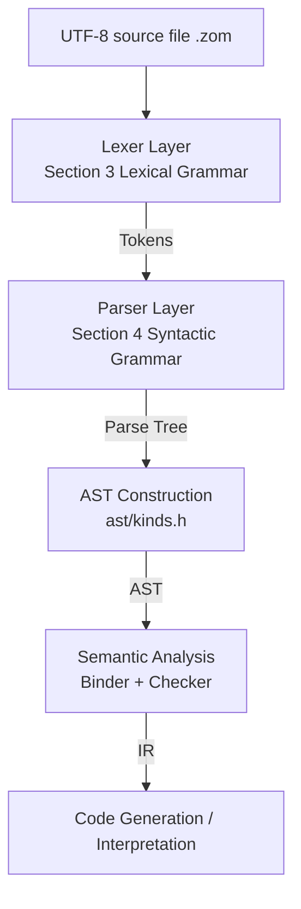

# Design Dimension 1: Syntax-Level Specification EBNF v1.1.0

> This document is the **single authoritative source of truth** for the ZOM language syntax layer. All lexers, parsers, AST definitions, diagnostic systems, LSP implementations, and documentation generators MUST remain consistent with this document. This document supersedes
> `docs/spec/chapters/17-grammar-reference.md` as the normative reference.
>
> Syntax format: Extended Backus-Naur Form (EBNF). Meta-symbols: `::=` definition, `|` choice, `(...)` grouping,
> `*` zero or more, `+` one or more, `?` zero or one, `[...]` character set, `'...'` literal,
> `(* ... *)` comment.

---

## Table of Contents

1. [Overall Design Principles](#1-overall-design-principles)
2. [Five-Layer Architecture Mapping](#2-five-layer-architecture-mapping)
3. [Lexical Grammar](#3-lexical-grammar)
4. [Syntactic Grammar](#4-syntactic-grammar)
   - 4.1 [Programs and Modules](#41-programs-and-modules)
   - 4.2 [Imports and Exports](#42-imports-and-exports)
   - 4.3 [Declarations](#43-declarations)
   - 4.4 [Type Expressions](#44-type-expressions)
   - 4.5 [Statements](#45-statements)
   - 4.6 [Expressions](#46-expressions)
   - 4.7 [Patterns](#47-patterns)
   - 4.8 [Attributes and Annotations](#48-attributes-and-annotations)
   - 4.9 [Concurrency](#49-concurrency)
5. [Operator Precedence and Associativity Table](#5-operator-precedence-and-associativity-table)
6. [Keywords and Reserved Words Inventory](#6-keywords-and-reserved-words-inventory)
7. [Grammar Drift Correction Log](#7-grammar-drift-correction-log)
8. [Five-Way Consistency Index](#8-five-way-consistency-index)
9. [Validation Example Library](#9-validation-example-library)

---

## 1. Overall Design Principles

| Principle | Description |
|---|---|
| **P1 Unambiguous** | Each left-hand side of a production maps one-to-one to its production body; grammar is LL(k) or disambiguable by a semantic predicate within a single lookahead token; no GLR ambiguous paths are retained. |
| **P2 Zero-Color Concurrency** | Function signatures do not include `async`/`await`; suspension is internal control-flow behavior; only two new keywords `suspend`/`spawn` are added; all other concurrency utilities are library functions / attributes. |
| **P3 Explicit Error Flow** | No implicit exception propagation; `raises` lists all error types explicitly in the signature; error control flow uses `return` + pattern matching. |
| **P4 Pure Static Modules** | Module names are symbolic paths, not strings; no runtime / conditional / wildcard imports; imports/exports occur at the top level of a file. |
| **P5 Linearizable Syntax** | Struct / enum / class member declarations MUST be semantically classifiable in a single-line scan; indentation or semantic context outside braces MUST NOT be used to disambiguate. |
| **P6 Minimal Reserved Words** | Only words that are implemented or explicitly documented as "reserved for v2" in this document are reserved; all others are removed. |
| **P7 Closed Attributes** | The compiler only recognizes whitelisted attributes under the `#[zom::*]` namespace and the `#[deprecated]` / `#[inline]` / `#[cold]` namespaces; all other attributes are passed through verbatim as metadata and trigger an unrecognized-attribute lint. |

---

## 2. Five-Layer Architecture Mapping



| Layer | Corresponding section in this document | Corresponding file path |
|---|---|---|
| UTF-8 encoding | Section 3.1 Source file characters | Lexer `products/zomlang/compiler/lexer/` |
| Lexical | Sections 3.2-3.7 | `ZomLexer.g4` (MUST be synchronized) |
| Syntactic | All of Section 4 | `ZomParser.g4` (MUST be synchronized) |
| AST kind mapping | Section 8 Five-way consistency index | `products/zomlang/compiler/ast/kinds.h` |
| Operator precedence | Section 5 | Lines 363-386 of `docs/spec/chapters/04-expressions.md` |

---

## 3. Lexical Grammar

### 3.1 Source File Characters

```ebnf
SourceCharacter ::= (* Any Unicode scalar value U+0000..U+10FFFF, excluding surrogates U+D800..U+DFFF *)
```

- Source files MUST be UTF-8 encoded, with file extension `.zom`.
- A zero-width no-break space (BOM, `U+FEFF`) is permitted at the start of the file and is ignored for syntax and semantics.

### 3.2 Format-Control Characters

```ebnf
ZWNJ   ::= U+200C   (* Zero Width Non-Joiner, permitted inside identifiers *)
ZWJ    ::= U+200D   (* Zero Width Joiner, permitted inside identifiers *)
ZWNBSP ::= U+FEFF   (* Treated as whitespace everywhere except the start of the file *)
```

### 3.3 Whitespace and Line Terminators

```ebnf
Whitespace        ::= U+0009 (* TAB *) | U+000B (* VT *) | U+000C (* FF *)
                    | U+0020 (* Space *) | U+00A0 | U+1680
                    | U+2000..U+200A | U+202F | U+205F | U+3000 | ZWNBSP

LineTerminator    ::= U+000A (* LF *) | U+000D (* CR *)
                    | U+2028 (* LS *) | U+2029 (* PS *)
LineTerminatorSeq ::= LF | CR LF | CR {next character is not LF} | LS | PS
```

### 3.4 Comments

```ebnf
SingleLineComment ::= '//' (~ LineTerminator)*
MultiLineComment  ::= '/*' ( MultiLineCommentChar | MultiLineComment )* '*/'
MultiLineCommentChar ::= ~ ('*' | '/') | '*' ~ '/' | '/' ~ '*'
                    (* MultiLineComment is NOT nestable; the lexer state machine guarantees closure *)
```

### 3.5 Identifiers

```ebnf
IdentifierName ::= IdentifierStart IdentifierPart*

IdentifierStart ::= UnicodeIDStart
                  | '$'
                  | '_'
                  | '\' UnicodeEscapeSequence
IdentifierPart  ::= UnicodeIDContinue
                  | '$'
                  | ZWNJ | ZWJ
                  | '\' UnicodeEscapeSequence

UnicodeIDStart    ::= (* Unicode Derived Core Property `ID_Start` *)
UnicodeIDContinue ::= (* Unicode Derived Core Property `ID_Continue` *)

Identifier     ::= IdentifierName   (* but MUST NOT be a ReservedWord; see Section 6 keyword table *)
BindingIdent   ::= Identifier       (* dedicated to binding positions; same shape as Identifier *)
```

> Notes: `$` is a valid identifier character, supporting FFI, code-generator artifacts, and similar scenarios. When `_` appears alone, it denotes a wildcard binding (Wildcard) in declaration/binding positions; it is NOT a valid identifier in expression positions (handled by the parser in the corresponding productions).

### 3.6 Literals

#### 3.6.1 Null and Boolean

```ebnf
NullLiteral    ::= 'null'
BooleanLiteral ::= 'true' | 'false'
```

#### 3.6.2 Numeric Literals

```ebnf
NumericLiteral ::= DecimalLiteral
                 | BinaryLiteral
                 | OctalLiteral
                 | HexLiteral
                 | BigIntLiteral

DecimalLiteral ::= DecimalIntegerLiteral ('.' DecimalDigits?)? ExponentPart?
                 | '.' DecimalDigits ExponentPart?
                 | DecimalIntegerLiteral ExponentPart?

DecimalIntegerLiteral ::= '0'
                        | NON_ZERO_DIGIT ( NUM_SEP? DECIMAL_DIGIT )*

DecimalDigits  ::= DECIMAL_DIGIT ( NUM_SEP? DECIMAL_DIGIT )*
ExponentPart   ::= [eE] SignedInteger
SignedInteger  ::= ('+' | '-')? DecimalDigits

BinaryLiteral  ::= '0' [bB] BinaryDigits
BinaryDigits   ::= BINARY_DIGIT ( NUM_SEP? BINARY_DIGIT )*

OctalLiteral   ::= '0' [oO] OctalDigits
OctalDigits    ::= OCTAL_DIGIT  ( NUM_SEP? OCTAL_DIGIT  )*

HexLiteral     ::= '0' [xX] HexDigits
HexDigits      ::= HEX_DIGIT    ( NUM_SEP? HEX_DIGIT    )*

BigIntLiteral  ::= DecimalDigits 'n'   (* e.g. 123n *)

NUM_SEP        ::= '_'            (* numeric separator; MUST NOT appear first or last *)
DECIMAL_DIGIT  ::= [0-9]
NON_ZERO_DIGIT ::= [1-9]
BINARY_DIGIT   ::= [01]
OCTAL_DIGIT    ::= [0-7]
HEX_DIGIT      ::= [0-9a-fA-F]
```

#### 3.6.3 String Literals

```ebnf
StringLiteral  ::= '"' DoubleStringChar* '"'
                 | "'" SingleStringChar* "'"

DoubleStringChar ::= ~ ['"', '\', LineTerminator]
                   | '\' EscapeSequence
                   | LineContinuation

SingleStringChar ::= ~ [''', '\', LineTerminator]
                   | '\' EscapeSequence
                   | LineContinuation

EscapeSequence ::= CharacterEscapeSeq
                 | '\' '0'   (* null terminator U+0000; only when not immediately followed by a decimal digit *)
                 | HexEscapeSeq
                 | UnicodeEscapeSeq

CharacterEscapeSeq ::= '\' [\'"\\bfnrtv0]
                    | '\' NON_ESCAPE_CHAR   (* reserved escape; diagnostic: unrecognized escape sequence *)
NON_ESCAPE_CHAR  ::= ~ ['"', ''', '\', 'b', 'f', 'n', 'r', 't', 'v', '0',
                        'x', 'u', LineTerminator]

HexEscapeSeq     ::= '\x' HEX_DIGIT HEX_DIGIT
UnicodeEscapeSeq ::= '\u' HEX_DIGIT HEX_DIGIT HEX_DIGIT HEX_DIGIT
                   | '\u{' HEX_DIGIT+ '}'   (* range U+0000..U+10FFFF *)

LineContinuation ::= '\' LineTerminatorSeq   (* physical-line join; produces no character value *)
```

#### 3.6.4 Character Literals

```ebnf
CharacterLiteral ::= "'" CharContent "'"
CharContent      ::= ~ [''', '\', LineTerminator]
                   | '\' EscapeSequence
                   (* MUST contain exactly one Unicode scalar value; zero or more than one is a lexical error *)
```

#### 3.6.5 Template Literals

```ebnf
TemplateLiteral    ::= NoSubTemplate
                     | TemplateHead TemplateSpan+

NoSubTemplate      ::= '`' ( TemplateChar | TemplateEscape )* '`'
TemplateHead       ::= '`' ( TemplateChar | TemplateEscape | '$' ~ '{' )* '${'
TemplateMiddle     ::= '}' ( TemplateChar | TemplateEscape | '$' ~ '{' )* '${'
TemplateTail       ::= '}' ( TemplateChar | TemplateEscape )* '`'

TemplateChar       ::= ~ ['`', '\', '$']
TemplateEscape     ::= '\' SourceCharacter
                     (* a full Expression is embedded between ${...} inside a TemplateSpan *)
```

### 3.7 Punctuators and Operators

```ebnf
Punctuator ::=
    '{' | '}' | '(' | ')' | '[' | ']'
  | '.' | '...' | ';' | ',' | ':' | '::'   (* added :: for attribute namespaces *)
  | '?' | '?!' | '!!' | '?.'
  | '+' | '-' | '*' | '/' | '%' | '**'
  | '++' | '--'
  | '<<' | '>>' | '>>>'
  | '<' | '>' | '<=' | '>='
  | '==' | '!=' | '===' | '!=='
  | '&' | '|' | '^' | '!' | '~'
  | '&&' | '||' | '??' | '?:'     (* ?: forms the error-default operator only when adjacent with no whitespace *)
  | '=' | '+=' | '-=' | '*=' | '/=' | '%=' | '**='
  | '<<=' | '>>=' | '>>>=' | '&=' | '|=' | '^='
  | '&&=' | '||=' | '??='
  | '=>' | '->'
  | '@' | '#[' | ']'   (* attribute-related; #[ is a compound token with no intervening whitespace *)
```

> Key notes:
> - When `?` and `:` are adjacent with no intervening whitespace, the lexer recognizes them as a single `?:` operator (Error Default);
>   otherwise they are treated as two independent tokens for the ternary conditional expression `cond ? a : b`. This rule is consistent with the
>   `QUESTION COLON` semantic predicate at `ZomParser.g4:440`.
> - `#[` is the compound token that starts an attribute, followed by `namespace::name(args)` or `namespace::name = literal`.
> - `::` separates attribute namespaces (e.g. `zom::inline`); it does not conflict with member-access `.`.

---

## 4. Syntactic Grammar

### 4.1 Programs and Modules

```ebnf
Program     ::= SourceFile
SourceFile  ::= OuterAttributeList ModuleDecl? ModuleItem*

ModuleDecl  ::= 'module' Identifier ';'
               | 'module' Identifier '{' ModuleItem* '}'
               | 'export'? 'module' Identifier '=' AttrPath ';'

ModuleItem  ::= OuterAttributeList Declaration
               | OuterAttributeList Statement   (* only #[zom::cfg(...)] permitted on statements; must be standalone block form *)
               | Statement

OuterAttributeList ::= OuterAttribute*
OuterAttribute     ::= '#' '[' AttrList ']'   (* '#' and '[' MUST be adjacent, no intervening whitespace *)
```

Constraints:
- `ModuleDecl` MAY appear at most once and MUST be the first non-comment, non-attribute statement.
- `ImportDecl` MAY only appear at the top level; it MUST NOT appear inside blocks or functions (see Principle P4).

### 4.2 Imports and Exports

```ebnf
(* ============ Import ============ *)
ImportDecl       ::= 'import' ImportBody ';'?

ImportBody       ::= ImportClause                                    (* simple import *)
                   | ImportClause 'as' Identifier                     (* renamed import *)
                   | ImportQualifiedPath ('.' | '::')? '{' ImportSpecList? '}'   (* group import *)
                   | ImportQualifiedPath '...' ImportQualifiedPath ('as' Identifier)?  (* range import *)

ImportClause     ::= '*' | Identifier | AttrPath
                   {bare single-segment identifier as standalone import target is REJECTED by ZOM1301;
                    use qualified path with '::' or group form}

ImportQualifiedPath ::= PathSegment ('::' PathSegment)*
PathSegment      ::= Identifier | KeywordAsToken
                     (* any identifier or keyword token valid as a path component;
                        allows keywords in qualified paths e.g. `std::fun::invoke` *)

KeywordAsToken   ::= (* any hard keyword token from Section 6.1 may be used as an identifier
                        in specific contexts: path segments (PathSegment) and macro token trees
                        (MacroToken). The lexer still emits the keyword token; the parser
                        accepts it in these positions by explicit rule. *)
ImportSpecList   ::= ImportSpec (',' ImportSpec)* ','?
ImportSpec       ::= ( Identifier | AttrPath ) ( 'as' Identifier )?

(* ============ Export ============ *)
ExportDecl       ::= 'export' Declaration                  (* declaration-site export, recommended form *)
                   | 'export' ExportBody ';'?              (* centralized export *)

ExportBody       ::= '{' ExportSpecList? '}'               (* local export list *)
                   | ImportQualifiedPath ('.' | '::')? '{' ImportSpecList? '}'  (* re-export group *)
ExportSpecList   ::= ExportSpec (',' ExportSpec)* ','?
ExportSpec       ::= ( Identifier | AttrPath ) ( 'as' Identifier )?
```

> Import path convention: ZOM uses `::` as the canonical path separator (e.g. `std::collections::HashMap`).
> The `.` separator is accepted in group-import positions for ergonomics but `::` is preferred.
> Bare single-segment identifiers like `import std;` are rejected (ZOM1301); use `import std::*;` or
> `import std::{...};` instead.
>
> Absent intentionally: `import *`, `export default`, and string-path imports like `import "a/b"`. These are explicitly excluded by Principle P4.

### 4.3 Declarations

```ebnf
Declaration ::= VariableStatement
              | ConstDeclaration
              | FunctionDecl
              | ClassDecl
              | StructDecl
              | InterfaceDecl
              | EnumDecl
              | ErrorDecl
              | AliasDecl
              | ImplDecl
              | ExternDecl
              | MacroRulesDecl
```

#### 4.3.1 Variable Declarations

```ebnf
VariableStatement  ::= ( 'mut' | 'let' ) VariableDeclList ';'

VariableDeclList   ::= VariableDecl (',' VariableDecl)*
VariableDecl       ::= ( BindingIdent | BindingPattern ) TypeAnnotation? Initializer?
                     (* mut without Initializer requires TypeAnnotation.
                        let without Initializer is accepted only where definite assignment can prove
                        exactly one write before first read. *)
Initializer        ::= '=' AssignmentExpression

ConstDeclaration   ::= 'const' ConstDeclList ';'
ConstDeclList      ::= ConstDecl (',' ConstDecl)*
ConstDecl          ::= BindingIdent TypeAnnotation? '=' ConstExpression
ConstExpression    ::= AssignmentExpression
                     (* semantically restricted to expressions accepted by const-eval *)
```

`mut` and `let` are runtime bindings. Only `mut` may be reassigned or used as a mutable place.
`const` is a compile-time value, requires an initializer, binds identifiers only in v1, and has no
stable storage address.
For object fields, `let` may be definitely assigned by the owning `init` path before `this` escapes;
after initialization, it is immutable.

#### 4.3.2 Function Declarations

```ebnf
FunctionDecl   ::= ModifierList UnsafePrefix? 'fun' BindingIdent TypeParameters?
                   ParameterClause FunctionSignature? FunctionBody?
    (* ModifierList: public/private/protected/static/readonly/mutating/override/abstract/export
       'unsafe' is a SOFT keyword — recognized only in the function-head prefix
       position by semantic predicate. It is not a reserved word and may be used
       as an identifier elsewhere.
       See Ch.03 §Unsafe Safety Model and Ch.06 §Unsafe Functions. *)

UnsafePrefix   ::= 'unsafe'   (* soft keyword; semantic predicate enforces position *)

FunctionSignature ::= '->' TypeExpr RaisesClause?   (* return type with optional raises *)
                    | RaisesClause                   (* raises without return type *)

FunctionBody   ::= BlockStatement | ';'

RaisesClause   ::= 'raises' TypeExpr   (* single type expression; union types expressed via TypeExpr itself:
                                           e.g. `raises ParseError | IoError` works because TypeExpr includes UnionType *)

ParameterClause ::= '(' ParameterList? ')'
ParameterList   ::= Parameter (',' Parameter)* ','?
Parameter       ::= (Identifier ':')? TypeExpr Initializer?
                  (* unnamed positional params allowed: `fun f(i32, str) -> i32` *)
```

> Absent intentionally: `async fun`, `fun ... -> T await`. See Section 4.9 for zero-color concurrency via `suspend`/`spawn`.
>
> Parser alignment note: the current parser supports `ModifierList 'fun'` and all `FunctionSignature` forms
> (including `params raises E` without return type). However, it does NOT yet recognize `UnsafePrefix`
> for regular top-level functions (only for marker impl and extern declarations).
> The `unsafe fun` form is a spec requirement that the parser must implement.

#### 4.3.3 Class Declarations

```ebnf
ClassDecl      ::= ModifierList 'class' BindingIdent TypeParameters?
                   ClassHeritage?
                   '{' ClassElement* '}'

ClassHeritage  ::= ':' TypeExpr        (* single superclass; written with colon, NOT 'extends' keyword *)

ClassElement   ::= ';'
                 | OuterAttributeList ModifierList InitDecl
                 | OuterAttributeList ModifierList DeinitDecl
                 | OuterAttributeList ModifierList PropertyDecl
                 | OuterAttributeList ModifierList ClassConstDecl
                 | OuterAttributeList ModifierList MethodDecl
                 | OuterAttributeList ModifierList ClassFieldDecl
                 | OuterAttributeList ModifierList ComputedPropertyDecl

Modifier       ::= 'public' | 'private' | 'protected'
                 | 'static' | 'readonly' | 'mutating' | 'override'
                 | 'abstract' | 'export'

ModifierList   ::= Modifier*
                 (* zero or more modifiers; semantic predicate enforces valid combinations
                    e.g. 'static mutating' rejected, 'abstract static' accepted *)

PropertyStorage ::= 'mut' | 'let'
PropertyDecl   ::= PropertyStorage PropertyName
                    '?'? TypeAnnotation? Initializer? ';'
ClassConstDecl ::= 'const' BindingIdent TypeAnnotation? '=' ConstExpression ';'
ClassFieldDecl ::= PropertyName ':' TypeExpr ('=' Expression)?
                    (';' | ',' | (* implicit separator before next keyword-starting member *))
MethodDecl     ::= 'fun' PropertyName TypeParameters?
                    ParameterClause FunctionSignature?
                    ( BlockStatement | ';' )
InitDecl       ::= 'init' TypeParameters? ParameterClause
                    RaisesClause? BlockStatement
DeinitDecl     ::= 'deinit' ParameterClause RaisesClause? BlockStatement

ComputedPropertyDecl ::= 'get' PropertyName ParameterClause FunctionSignature? BlockStatement
                          SetAccessorDecl?
SetAccessorDecl  ::= OuterAttributeList ModifierList 'set' PropertyName ParameterClause FunctionSignature? BlockStatement
                   | 'set' ParameterClause FunctionSignature? BlockStatement
                   (* setter parameter list usually has single param; implicit 'value' param if empty *)
```

> Notes: The `abstract` modifier applies to a method in a class body or to the class itself; when applied to a method, the method body MUST be omitted (written as `;`).

#### 4.3.4 Struct Declarations

```ebnf
StructDecl     ::= ModifierList 'struct' BindingIdent TypeParameters?
                   '{' StructElement* '}'

StructElement  ::= OuterAttributeList ModifierList StructFieldDecl
                 | OuterAttributeList ModifierList MethodDecl
                 | OuterAttributeList ModifierList StructCtorDecl

StructFieldDecl ::= ('mut' | 'readonly')? PropertyName
                    ':' TypeExpr
                    ( '=' Expression )?   (* default value *)
                    ( ';' | ',' | (* implicit separator OK before next keyword member *) )?

StructCtorDecl  ::= ('init' | 'deinit') ParameterClause RaisesClause? BlockStatement
```

#### 4.3.5 Interface Declarations

```ebnf
InterfaceDecl  ::= ModifierList 'interface' BindingIdent TypeParameters? InterfaceHeritage?
                   '{' InterfaceBody '}'
    (* 'unsafe' prefix for interfaces with unverifiable invariants is expressed via
       ModifierList + semantic annotation; the parser treats 'unsafe' as a soft keyword
       at impl-head position, not interface-head. See Ch.09 §Unsafe Interfaces. *)

InterfaceHeritage ::= ':' InterfaceBoundList   (* super-interfaces; colon-separated, NOT 'extends' *)
InterfaceBoundList ::= InterfaceBound ( '+' InterfaceBound )*   (* '+' = conjunction (AND); '|' is ONLY for UnionType *)
InterfaceBound     ::= QualifiedPathOrIdent ( '<' TypeArgumentList '>' )?
QualifiedPathOrIdent ::= PathSegment ( '::' PathSegment )*

InterfaceBody   ::= InterfaceElement*
InterfaceElement ::= ';'
                  | OuterAttributeList ModifierList 'fun' MethodSignature ';'?
                  | OuterAttributeList ModifierList ('get' | 'set') PropertySignature ';'?
                  | OuterAttributeList ModifierList 'type' Identifier TypeParameters?
                    ( ':' InterfaceBoundList )? ( '=' TypeExpr )? ';'   (* associated type *)

PropertySignature ::= PropertyName '?'? TypeAnnotation
MethodSignature   ::= PropertyName '?'? CallSignature
CallSignature     ::= TypeParameters? ParameterClause FunctionSignature?

InterfaceTypeList ::= TypeRef ( ',' TypeRef )*   (* deprecated; prefer InterfaceBoundList *)
TypeRef           ::= Identifier TypeArguments?
```

#### 4.3.6 Enum Declarations

```ebnf
EnumDecl       ::= ModifierList 'enum' BindingIdent TypeParameters?
                   '{' EnumBody? '}'
EnumBody       ::= EnumVariant ( ',' EnumVariant )* ','?
EnumVariant    ::= OuterAttributeList Identifier
                   ( '(' VariantTypeList ')' )?   (* tuple associated value *)
                   ( '=' Expression )?            (* explicit discriminant / raw value *)
VariantTypeList ::= TypeExpr ( ',' TypeExpr )* ','?
```

#### 4.3.7 Error Declarations

```ebnf
ErrorDecl      ::= ModifierList 'error' BindingIdent TypeParameters? ErrorHeritage?
                   '{' ErrorBody? '}'
ErrorHeritage  ::= ':' TypeExpr             (* error inheritance chain; colon-separated, NOT 'extends' *)
ErrorBody      ::= ErrorField ( (',' | ';') ErrorField )* (',' | ';')?
ErrorField     ::= PropertyName ':' TypeExpr
                   ( '=' Expression )?
```

> Error declarations are inherently marker-equipped value types; they work with the `raises` clause and `match`/`is` patterns.
> There is no `throw` keyword (Principle P3).

#### 4.3.8 Type Aliases

```ebnf
AliasDecl      ::= ModifierList 'alias' BindingIdent TypeParameters?
                   '=' TypeExpr ';'
```

#### 4.3.9 Impl Declarations

Standalone impl blocks attach interface implementations to types. Marker impls provide explicit marker trait evidence.

```ebnf
ImplDecl       ::= StandaloneImplDecl
                 | MarkerImplDecl

StandaloneImplDecl ::= 'impl' TypeParameters? InterfaceBoundList 'for' TypeExpr
                       '{' ImplMember* '}'
    (* 'impl' is a SOFT keyword — recognized only at impl-head position *)

ImplMember     ::= ModifierList 'fun' BindingIdent TypeParameters? ParameterClause
                    FunctionSignature? ( ';' | BlockStatement )
                 | 'type' Identifier TypeParameters? '=' TypeExpr ';'   (* associated type *)
                 | 'mut' VariableDeclList ';'
                 | 'let' VariableDeclList ';'
                 | 'const' ConstDeclList ';'
                 | ModifierList 'alias' BindingIdent TypeParameters? '=' TypeExpr ';'

MarkerImplDecl ::= UnsafePrefix? 'impl' '!'? AttrPath TypeParameters?
                   'for' TypeExpr ( ';' | '{' StructElement* '}' )
    (* Marker impl: provides explicit marker trait evidence.
       '!' negates the impl (negative impl).
       'unsafe' prefix marks a marker impl with caller-proven invariants. *)
```

#### 4.3.10 Extern Declarations

Foreign function interface declarations.

```ebnf
ExternDecl     ::= UnsafePrefix? 'extern' AbiLiteral? ( ExternBlock | FunctionDecl )
    (* 'extern' is a SOFT keyword *)

AbiLiteral     ::= '"' ('C' | 'Cdecl' | 'system' | 'zom-cdecl') '"'

ExternBlock    ::= '{' ExternItem* '}'
ExternItem     ::= FunctionDecl                            (* external function *)
                 | 'variable' Identifier ':' TypeExpr ';'  (* external variable *)
                 | 'type' Identifier '=' 'opaque'? Identifier TypeExpr? ';'
                   (* opaque type alias for FFI forward declarations *)
```

#### 4.3.11 Macro Rules Declarations

Declarative macro 2.0 definitions.

```ebnf
MacroRulesDecl ::= 'macro' Identifier '!' '{' MacroRule* '}'
    (* 'macro' is a SOFT keyword *)

MacroRule      ::= '(' MacroPattern ')' '=>' '{' MacroTokenTree '}' ';'?
                 | '[' MacroPattern ']' '=>' '{' MacroTokenTree '}' ';'?

MacroPattern   ::= MacroPatToken ( ',' MacroPatToken )* ( ',' '...' )?
MacroPatToken  ::= '$' Identifier ':' MacroFragSpec   (* capture: $name:expr — NOTE: '$' + name is a single IDENTIFIER token whose first character is '$', not two separate tokens; parser enforces via `$captureName.text.charAt(0) == '$'` *)
                 | Identifier | Literal
                 | Punctuator   (* operators and punctuation *)

MacroFragSpec  ::= Identifier   (* e.g. expr, stmt, item, pat, ty, ident, path, tt *)
```

### 4.4 Type Expressions

```ebnf
TypeExpr     ::= FunctionType

FunctionType    ::= TypeParameters? ParameterClause '->' ReturnType ('raises' TypeExpr)?
                  | 'fun' TypeParameters? ParameterClause '->' ReturnType ('raises' TypeExpr)?
                  (* 'fun' keyword prefix form: industry-standard explicit function type syntax *)
                  | UnionType

ReturnType      ::= TypeExpr

UnionType       ::= IntersectionType ( '|' IntersectionType )*
IntersectionType::= PostfixType      ( '&' PostfixType      )*

PostfixType     ::= AtomType PostfixTypeSuffix*
PostfixTypeSuffix ::= '[' ']'         (* array T[] *)
                    | '?'             (* optional T? *)
                    | '??'            (* double-optional T??; lexer longest-match produces ?? token *)
                    | '.' Identifier  (* type member access e.g. T::Assoc *)

AtomType        ::= ParenthesizedType
                  | PredefinedType
                  | TypeRef
                  | QualifiedTypeRef
                  | ObjectType
                  | TupleType
                  | TupleVariantType
                  | ArrayLiteralType
                  | TypeQuery           (* PARSER GAP: typeof in type position not yet implemented *)
                  | ReferenceType       (* PARSER GAP: &T / &mut T not yet implemented in type parser *)
                  | RawPointerType      (* PARSER GAP: *const T / *mut T not yet implemented in type parser *)
                  | DynType             (* PARSER GAP: dyn I + Markers not yet implemented; 'dyn' is parsed as plain identifier *)
                  | MarkerType        (* Sendable/Shared/Linear/NoInternalMutability markers *)

ParenthesizedType ::= '(' TypeExpr ')'

PredefinedType  ::= 'i8' | 'i16' | 'i32' | 'i64'
                  | 'u8' | 'u16' | 'u32' | 'u64'
                  | 'f32' | 'f64'
                  | 'str' | 'bool' | 'char'
                  | 'null' | 'unit' | 'never' | 'any'

TypeRef         ::= Identifier TypeArguments?
QualifiedTypeRef ::= AttrPath TypeArguments?   (* e.g. std::collections::HashMap<T> *)

ObjectType      ::= '{' TypeBody? '}'
                  | '{' '}'                     (* empty object type *)
TypeBody        ::= TypeMemberList ( ';' | ',' )?
TypeMemberList  ::= TypeMember ( ( ';' | ',' ) TypeMember )*
TypeMember      ::= PropertySignature
                  | 'type' Identifier '=' TypeExpr ';'   (* associated type, used inside interface *)
(* NOTE: parser structFieldType also accepts '?:' (ERROR_DEFAULT token) as a separator
   between property name and type, in addition to ':' and '?:' (QUESTION COLON).
   E.g. `{ x?: i32 }` and `{ x?: i32 }` both parse; the `?:` form is treated as
   optional-property shorthand. *)

TupleType       ::= '(' TupleElementTypes? ')'
TupleElementTypes ::= TupleElementType ( ',' TupleElementType )* ','?
TupleElementType ::= NamedTupleElement | TypeExpr
NamedTupleElement ::= Identifier ':' TypeExpr
(* NOTE: 1-tuple type `(T,)` with trailing comma is REJECTED by the parser (A4);
   parenthesized single type `(T)` (no trailing comma) remains valid. *)

TupleVariantType ::= Identifier '(' VariantTypeList ')'   (* enum-style tuple variant type *)

ArrayLiteralType ::= '[' TypeExpr (';' Expression)? ']'   (* [T; N] fixed-size array type *)

TypeQuery       ::= 'typeof' TypeQueryExpr
TypeQueryExpr   ::= Identifier ( '.' Identifier )*

(* ============ Generics ============ *)
TypeParameters  ::= '<' TypeParameterList '>' GenericParamClose
TypeParameterList ::= TypeParameter ( ',' TypeParameter )* ','?
TypeParameter   ::= Variance? Identifier ( ':' TypeParameterBoundList )? ( '=' TypeExpr )?
                  (* constraint uses ':' (industry convention: Swift/Kotlin);
                     bounds are '+' conjunction list, same as impl/interface-extends/dyn *)
Variance        ::= 'in' | 'out'   (* reserved; parser rejects — variance not supported in v1 *)
TypeParameterBoundList ::= TypeExpr ( '+' TypeExpr )*

TypeArguments   ::= '<' TypeArgumentList '>' GenericClose
TypeArgumentList ::= TypeExpr ( ',' TypeExpr )* ','?

(* Compact-close handling:
   The parser pre-processes all >> and >>> tokens into individual > tokens before parsing.
   GenericClose therefore always matches a single plain '>'. Compact close at type PARAMETER
   declaration (GenericParamClose) is rejected to prevent `fun f<T, U>>` over-close. *)
GenericClose     ::= '>'   (* after pre-split, always a single GT *)
GenericParamClose ::= '>'  (* parameter declaration close; compact >>/>>> rejected *)

TypeAnnotation  ::= ':' TypeExpr

MarkerType      ::= 'Sendable'
                  | 'Shared'
                  | 'Linear'
                  | 'NoInternalMutability'
                  (* These four types are markers with no runtime representation; used only for trait/constraint checking.
                     They are NOT hard keywords — they are recognized as IDENTIFIER tokens and given special meaning
                     in type positions by the semantic phase. *)

ReferenceType   ::= '&' 'mut'? TypeExpr
                  (* Immutable or mutable reference. Sized = ptr_size.
                     &mut T ⊂ &T (mutable reference coerces to immutable).
                     &T impl Shared when T: Shared; &mut T impl Sendable when T: Sendable.
                     See Ch.03 §Reference Types for full semantics. *)

RawPointerType  ::= '*' ( 'const' | 'mut' )? TypeExpr
                  (* Raw pointer for FFI and unsafe code. Sized = ptr_size.
                     *mut T ⊂ *const T. Dereference requires unsafe { }.
                     Does NOT auto-impl Sendable or Shared.
                     See Ch.03 §Raw Pointer Types for full semantics. *)

DynType         ::= 'dyn' InterfaceBoundList
                  (* Existential type — 2-word fat pointer (data_ptr + vtable_ptr).
                     Only object-safe interfaces permitted.
                     InterfaceBoundList ::= TypeName TypeArguments? ( '+' MarkerPath )*
                     See Ch.03 §Existential Types for full semantics. *)
```

> Drift corrections: In Section 4.4, `TypeParameter` now includes the `= TypeExpr` default parameter (the original 17-grammar-reference.md omitted it,
> but it is already used in section 06-declarations.md Section Generic Functions and section 12-generics.md Section Type Constraints).
> `MarkerType` is added as a type-layer marker for concurrency / memory safety (corresponding to concurrency design Section 6.2 Linear).
> The predefined type `char` is added (the natural host type for character literals; omitted in the original spec).
> `ReferenceType` (`&T` / `&mut T`) is added as a first-class type form (Ch.03 §Reference Types).
> `RawPointerType` (`*const T` / `*mut T`) is added as a general-purpose type form, not limited to FFI contexts (Ch.03 §Raw Pointer Types).
> `DynType` (`dyn I + Markers`) is added as an explicit AtomType to match Ch.03 §Existential Types and Ch.17 grammar.
> In Section 4.5, `UnsafeBlockStatement` is added (Ch.05 §Unsafe Block, Ch.03 §Unsafe Safety Model).
> In Section 4.3.2, `FunctionDecl` accepts an optional `unsafe` prefix (Ch.06 §Unsafe Functions).
> In Section 4.3.5, `InterfaceDecl` is clarified: `unsafe` attests semantic invariants at `impl`-head position (`unsafe impl I for T`), not at interface-head. See Ch.09 §Unsafe Interfaces and Unsafe Impl.

### 4.5 Statements

```ebnf
Statement ::= BlockStatement
            | UnsafeBlockStatement  (* unsafe { } — Ch.05 §Unsafe Block;
                                       PARSER GAP: bare `unsafe { stmt* }` without semicolon is not
                                       a recognized statement form. The expression form `unsafe { stmt* expr? }`
                                       IS supported and works when followed by ';' as an expression statement:
                                       `unsafe { raw_op(); };` *)
            | EmptyStatement        (* PARSER GAP: parser does not support bare ';' empty statement *)
            | VariableStatement
            | Declaration           (* any declaration may appear in statement position: const, fun, class, struct, interface, enum, error, alias, impl, extern, macro *)
            | ExpressionStatement
            | IfStatement
            | MatchStatement
            | WhenStatement         (* Kotlin-style when expression as statement *)
            | WhileStatement
            | DoWhileStatement
            | ForStatement
            | ForInStatement
            | ContinueStatement
            | BreakStatement
            | ReturnStatement
            | ThrowStatement        (* reserved; the parser currently rejects: ZOM uses explicit return + pattern *)
            | TryStatement          (* reserved; the parser currently rejects: see ThrowStatement *)
            | ReservedStatement     (* other reserved syntax: async/await, var, actor, yield, namespace, type, delete, etc. — all rejected with ZOM500x *)
            | SpawnStatement        (* concurrency: spawn as statement form *)
            | SuspendStatement      (* concurrency: suspend + suspend until forms *)
            | DebuggerStatement
            | LabeledStatement

UnsafeBlockStatement ::= 'unsafe' BlockStatement
            (* 'unsafe' is a SOFT keyword — recognized only at block-prefix position.
               Enables unsafe operations: raw pointer deref, extern "C" calls,
               unsafe fun calls, repr(Packed) field borrows, static mut access.
               See Ch.03 §Unsafe Safety Model and Ch.05 §Unsafe Block. *)

BlockStatement      ::= '{' StatementList? '}'
StatementList       ::= StatementListItem+
StatementListItem   ::= Statement | Declaration

EmptyStatement      ::= ';'

(* ============ Reserved syntax (ZOM5001-ZOM5008) ============ *)
(* All reserved forms are rejected by the parser with specific diagnostic codes.
   They are listed here for completeness of the grammar specification. *)

ThrowStatement      ::= 'throw' Expression? ';'?   (* ZOM5001: exception syntax not implemented *)
TryStatement        ::= 'try' BlockStatement
                        ( 'catch' '(' Identifier ':'? TypeExpr ')' BlockStatement )*
                        ( 'finally' BlockStatement )?   (* ZOM5001: try/catch/finally not implemented *)

ReservedStatement   ::= 'async' Statement          (* ZOM5002: async/await not implemented; zero-color model uses suspend/spawn *)
                     | 'await' Expression           (* ZOM5002 *)
                     | 'var' VariableDeclList ';'   (* ZOM5003: var not implemented; use let/mut/const *)
                     | 'actor' Identifier TypeParameters? '{' ... '}'   (* ZOM5004: actor/channel are library types *)
                     | 'channel' TypeExpr           (* ZOM5004 *)
                     | 'yield' Expression?          (* ZOM5005: generator/yield not implemented *)
                     | 'generator' Identifier '{' ... '}'  (* ZOM5005 *)
                     | 'namespace' Identifier '{' ... '}'  (* ZOM5006: use module dotted paths *)
                     | 'package' Identifier '{' ... '}'    (* ZOM5006 *)
                     | 'type' Identifier TypeParameters? '=' TypeExpr ';'  (* ZOM5007: use alias *)
                     | 'delete' Expression           (* ZOM5008: JS legacy, not part of v1 *)
                     | Expression 'instanceof' TypeExpr  (* ZOM5008: use is *)
                     | 'of' Expression               (* ZOM5008 *)
                     | 'with' '(' Expression ')' Statement  (* ZOM5008 *)

ExpressionStatement ::= Expression ';'
                      {the first token MUST NOT be `{`, `class`, `struct`, `enum`, `mut`, `let`, `const`,
                        `fun`, `interface`, `error`, `alias`, `module`, to avoid being parsed as a declaration}

IfStatement         ::= 'if' '(' Expression ')' Statement ( 'else' Statement )?

MatchStatement      ::= 'match' '(' Expression ')' MatchBlock
MatchBlock          ::= '{' MatchClause* DefaultClause? '}'
MatchClause         ::= 'when' Pattern GuardClause? '=>' StatementOrBlock
DefaultClause       ::= 'default' '=>' StatementList
GuardClause         ::= 'if' Expression
StatementOrBlock    ::= BlockStatement | Statement

WhenStatement       ::= 'when' '(' Expression ')' WhenBlock   (* Kotlin-style when; distinct from match when-clause *)
WhenBlock           ::= '{' WhenClause* ('default' ':' StatementList)? '}'
WhenClause          ::= Expression ':' StatementList

WhileStatement      ::= 'while' '(' Expression ')' Statement
DoWhileStatement    ::= 'do' Statement 'while' '(' Expression ')' ';'

ForStatement        ::= 'for' '(' ForInit? ';' Expression? ';' ForUpdate? ')' Statement
ForInStatement      ::= 'for' '(' ('mut' | 'let')? Pattern 'in' Expression ')' Statement
ForInit             ::= ( 'mut' | 'let' ) VariableDeclList | ExpressionList
ForUpdate           ::= ExpressionList

ContinueStatement   ::= 'continue' Identifier? ';'
BreakStatement      ::= 'break'    Identifier? ';'
ReturnStatement     ::= 'return'   Expression? ';'
DebuggerStatement   ::= 'debugger' ';'

SpawnStatement      ::= 'spawn' SpawnModifierList? ( SpawnBlockBody | Expression ) ';'?
SpawnBlockBody      ::= '{' StatementList Expression? '}'   (* block with optional trailing expression result *)

LabeledStatement    ::= Identifier ':' Statement
                      {labels may only prefix control-flow or block statements;
                       declarations (let/const/fun/class/struct/interface/enum/error/alias/
                       import/export/module/type) must NOT be labeled — C25#2 constraint}
```

> Reserved / restricted notes:
> - `ThrowStatement` / `TryStatement` (ZOM5001): Exception control-flow syntax is NOT part of v1. Error paths MUST use `return <error-value>` + pattern matching (Principle P3).
> - `async` / `await` (ZOM5002): Async-coloring is rejected by design. ZOM uses the zero-color `suspend`/`spawn` model (Section 4.9).
> - `var` (ZOM5003): Function-scoped variables are rejected. Use `let` (immutable runtime), `mut` (mutable runtime), or `const` (compile-time).
> - `actor` / `channel` (ZOM5004): Concurrency primitives are library types, not keywords.
> - `yield` / `generator` (ZOM5005): Generator syntax is not implemented in v1.
> - `namespace` / `package` (ZOM5006): Use `module` dotted paths instead.
> - `type` (ZOM5007): Top-level type aliases use `alias` keyword. `type` is valid inside `ObjectType` / `InterfaceBody` for associated types.
> - `delete` / `instanceof` / `of` / `with` (ZOM5008): JS legacy syntax, not part of v1. Use `is` for type tests.
> - `SuspendStatement` covers both `suspend;` (yield) and `suspend until expr;` forms. See Section 4.9.
> - `SuspendExpression` (`suspend until expr` as a value-producing expression) is a spec requirement not yet implemented in the parser.

### 4.6 Expressions

```ebnf
(* ============ top-level ============ *)
Expression        ::= AssignmentExpression ( ',' AssignmentExpression )*

AssignmentExpression ::= ConditionalExpression
                       | FunctionExpression
                       | LambdaExpression
                       | SpawnExpression       (* concurrency: spawn returns TaskHandle<T> *)
                       | LeftHandSideExpr AssignmentOperator AssignmentExpression
AssignmentOperator   ::= '=' | '+=' | '-=' | '*=' | '/=' | '%=' | '**='
                       | '<<=' | '>>=' | '>>>='
                       | '&=' | '|=' | '^='
                       | '&&=' | '||=' | '??='
                       | '> > >='   (* spaced >>>=; parser accepts spaced compound tokens *)
                       | '> >='     (* spaced >>= *)

ConditionalExpression ::=
     ErrorDefaultExpression ( '?' AssignmentExpression ':' AssignmentExpression )?

(* ============ infix chains (lowest to highest) ============ *)
(* NOTE: ?: and ?? are RIGHT-associative in the parser (ZomParser.g4:2567-2577).
   EBNF uses (...)* notation for readability; the actual associativity is enforced
   by the parser's <assoc=right> annotation. *)
ErrorDefaultExpression ::= CoalesceExpr ( '?:' CoalesceExpr )*   (* right-associative *)
CoalesceExpr           ::= LogicalOrExpr ( '??' LogicalOrExpr )*  (* right-associative *)
LogicalOrExpr          ::= LogicalAndExpr ( '||' LogicalAndExpr )*
LogicalAndExpr         ::= BitwiseOrExpr  ( '&&' BitwiseOrExpr  )*
BitwiseOrExpr          ::= BitwiseXorExpr ( '|'  BitwiseXorExpr )*
BitwiseXorExpr         ::= BitwiseAndExpr ( '^'  BitwiseAndExpr )*
BitwiseAndExpr         ::= EqualityExpr   ( '&'  EqualityExpr   )*

EqualityExpr           ::= RelationalExpr
                           ( ( '==' | '!=' | '===' | '!==' ) RelationalExpr )*
RelationalExpr         ::= ShiftExpr
                           ( ( '<' | '>' | '<=' | '>=' ) ShiftExpr
                           | 'as' '?'? TypeExpr              (* type cast *)
                           | 'is' TypeExpr                    (* type test *)
                           )*

ShiftExpr              ::= AdditiveExpr
                           ( ( '<<' | '>>' | '>>>' ) AdditiveExpr
                           | '>' '>' '>' AdditiveExpr        (* spaced >>> *)
                           | '>' '>' AdditiveExpr            (* spaced >> *)
                           )*
AdditiveExpr           ::= MultiplicativeExpr
                           ( ( '+' | '-' ) MultiplicativeExpr )*
MultiplicativeExpr     ::= ExponentiationExpr
                           ( ( '*' | '/' | '%' ) ExponentiationExpr )*

(* right-associative *)
ExponentiationExpr     ::= UnaryExpr ( '**' ExponentiationExpr )?

UnaryExpr              ::= PostfixExpr
                         | PrefixUpdateExpr
                         | ( '+' | '-' | '!' | '~' | 'typeof' | '*' | '&' ) UnaryExpr
PrefixUpdateExpr       ::= ( '++' | '--' ) LeftHandSideExpr

PostfixExpr            ::= LeftHandSideExpr ( '?!' | '!!' | '++' | '--' )*
                         | PostfixExpr 'raises' '?'   (* raises-propagation postfix *)

(* ============ LHS: member / call / optional chaining ============ *)
LeftHandSideExpr       ::= NewExpression
                         | CallExpression
                         | OptionalExpression
                         | SuspendExpression     (* concurrency: suspend expression form *)

MemberExpression       ::= PrimaryExpression
                         | SuperProperty
                         | 'new' TypeExpr Arguments       (* object construction: `new TypeExpr(args)` *)
                         | MemberExpression '[' Expression ']'
                         | MemberExpression '.' Identifier

NewExpression          ::= MemberExpression

SuperProperty          ::= 'super' '.' Identifier
SuperCall              ::= 'super' Arguments
ImportCall             ::= 'import' Arguments   (* dynamic import; parser accepts but semantic pass may restrict *)

CallExpression         ::= ( MemberExpression Arguments
                           | SuperCall
                           ) ( Arguments | '[' Expression ']' | '.' Identifier
                             | '?.' Arguments | '?.' '[' Expression ']' | '?.' Identifier )*
(* Call may optionally carry a 'raises' type annotation: f(args) raises E
   NOTE: parser supports both `?.` (OPTIONAL_CHAIN direct token) and `? .`
   (QUESTION + PERIOD with intervening trivia) for optional chaining. *)

Arguments              ::= '(' ArgumentList? ')' ('raises' TypeExpr)?
ArgumentList           ::= Argument ( ',' Argument )* ','?
Argument               ::= AssignmentExpression
                         | '...' AssignmentExpression   (* spread argument *)

OptionalExpression     ::= ( MemberExpression | CallExpression ) OptionalChain+
OptionalChain          ::= '?.' ( Identifier | '[' Expression ']' | Arguments )
                           ( Arguments | '[' Expression ']' | '.' Identifier )*
(* NOTE: `?.` is emitted as OPTIONAL_CHAIN token by the lexer (longest-match).
   Parser also accepts `? .` (QUESTION + PERIOD with trivia) for compatibility. *)

(* ============ Primary ============ *)
PrimaryExpression      ::= 'this'
                         | BindingIdent
                         | Literal
                         | ArrayLiteral
                         | ObjectLiteral
                         | StructLiteral
                         | TupleLiteral
                         | FunctionExpression
                         | LambdaExpression
                         | UnsafeBlockExpr
                         | MacroInvocationExpr
                         | PredefinedType        (* predefined type names as expressions e.g. `i32` in typeof *)
                         | '(' Expression ')'
                         | 'import' '(' Expression ')'   (* dynamic import; parser accepts, semantic pass may restrict *)

Literal                ::= NullLiteral | BooleanLiteral
                         | NumericLiteral | StringLiteral
                         | CharacterLiteral
                         | TemplateLiteral

ArrayLiteral           ::= '[' ( ElementList )? ']'
ElementList            ::= Element ( ',' Element )* ','?
Element                ::= AssignmentExpression
                         | '...' AssignmentExpression

(* Added: explicit tuple literal disambiguates "(x) = parenthesized expression vs single-element tuple" *)
TupleLiteral           ::= '(' ')'                              (* unit literal *)
                         | '(' Expression ',' Expression ( ',' Expression )* ','?   (* 2+ element tuple *)
                         | '(' Expression ',' ')'                (* 1-tuple: trailing comma required *)
                         (* Note: `(a, b)` is a 2-tuple; `(a,)` is a 1-tuple; `(a)` is still a parenthesized expression, not a tuple *)

ObjectLiteral          ::= '{' ( PropertyDefList )? '}'
PropertyDefList        ::= PropertyDefinition ( ',' PropertyDefinition )* ','?
PropertyDefinition     ::= propertyName                          (* shorthand: `{ x }` means `{ x: x }` *)
                         | propertyName ':' Expression          (* key-value pair *)
                         | '...' Expression                     (* spread *)
(* NOTE: `{ x = 3 }` shorthand-initializer form is NOT supported by the parser;
   use `{ x: 3 }` instead. Shorthand without colon only works for identifier-only
   references (no initializer). *)
PropertyName           ::= Identifier
                         | 'in'   (* 'in' is valid as a property name (soft keyword); parser accepts IN token here *)

StructLiteral          ::= Identifier TypeArguments?
                           '{' StructFieldInit ( ',' StructFieldInit )* ','? '}'
StructFieldInit        ::= PropertyName ( ':' Expression )?   (* shorthand: `{ x, y: 1 }` *)

FunctionExpression     ::= 'fun' TypeParameters? ParameterClause
                            CaptureClause? ('->' TypeExpr RaisesClause?)?
                            BlockStatement
                         (* return type form: `-> T` or `-> T raises E`; no return type = unit/void
                            `raises` without return type is NOT valid for function expressions —
                            that form is only valid in function declarations (FunctionSignature) *)

LambdaExpression       ::= ParameterClause ('->' TypeExpr RaisesClause?)? '=>' BlockStatement
                         | ParameterClause ('->' TypeExpr RaisesClause?)? '=>' Expression
                         (* concise lambda syntax: `(x) => x + 1` or `(x: i32) -> i32 => { return x + 1; }`
                            return type annotation optional; raises clause permitted when return type present *)

UnsafeBlockExpr        ::= 'unsafe' '{' Statement* Expression? '}'
                         (* unsafe block expression; 'unsafe' is a SOFT keyword *)

MacroInvocationExpr    ::= Identifier '!' ( '(' MacroTokenTree ')'
                                            | '[' MacroTokenTree ']'
                                            | '{' MacroTokenTree '}' )
                         (* function-like macro invocation: name!(token_tree) *)

MacroTokenTree         ::= MacroToken*
MacroToken             ::= Punctuator | Identifier | Literal
                         | KeywordAsToken   (* all keyword tokens valid inside macro tt *)
                         | '(' MacroTokenTree ')'
                         | '[' MacroTokenTree ']'
                         | '{' MacroTokenTree '}'

CaptureClause          ::= 'use' '[' CaptureList? ']'
CaptureList            ::= CaptureElement ( ',' CaptureElement )* ','?
CaptureElement         ::= '&'? Identifier | 'this'
```

> Drift corrections:
> 1. **`TupleLiteral` added**: The previous spec ambiguously used `(expr)` as both a parenthesized expression and a single-element tuple.
>    Explicitly requiring at least one comma to form a tuple literal aligns with Swift / Python.
> 2. **`RelationalExpr` adds `'is' TypeExpr`**: The original 17-grammar-reference.md EBNF did not include the `is` operator,
>    but 04-expressions.md Section Type Check Operators and 07-patterns.md Section Type Patterns both used it; the gap is now closed.
> 3. **`AssignmentExpression` adds `SpawnExpression`**: See Section 4.9.

### 4.7 Patterns

```ebnf
Pattern          ::= PrimaryPattern

PrimaryPattern   ::= WildcardPattern
                   | LiteralPattern
                   | RestPattern
                   | EnumCallPattern
                   | EnumBarePattern
                   | BindingPattern
                   | IsPattern
                   | EnumColonColonPattern   (* REJECTED: must use '.' form *)
                   | TuplePattern
                   | StructPattern
                   | ArrayPattern
                   | ExpressionPattern

WildcardPattern   ::= '_'
IdentifierPattern ::= BindingIdent TypeAnnotation?   (* handled via BindingPattern *)
LiteralPattern    ::= NumericLiteral | StringLiteral | CharacterLiteral
                    | BooleanLiteral | NullLiteral
RestPattern       ::= '...' Pattern?    (* may only appear at the end of ArrayPattern/TuplePattern *)

BindingPattern    ::= Identifier ('@' Pattern)?
                    {nested '@' binding is REJECTED (A8); binding chain must have single @}
                    {identifier '_' is REJECTED as a bind pattern — '_' is wildcard only}

EnumCallPattern   ::= EnumPatternPath '(' Pattern ( ',' Pattern )* ','? ')'
EnumBarePattern   ::= EnumPatternPath
EnumPatternPath   ::= Identifier '.' PropertyName ( '.' PropertyName )*

EnumColonColonPattern ::= Identifier '::' Identifier TupleLiteral?
    (* REJECTED by A9: enum pattern must use '.' form (e.g. Color.Red), not '::' qualified *)

IsPattern         ::= 'is' TypeExpr
ExpressionPattern ::= Expression       (* full expression; used for comparisons, ranges, etc. *)

TuplePattern      ::= '(' Pattern ( ',' Pattern )* ','? ')'
                    {rest pattern '...' must be LAST element (A10)}
StructPattern     ::= Identifier '{' StructPatternField ( ',' StructPatternField )* ','? '}'
StructPatternField ::= '...' Identifier?
                    | PropertyName ( ':' Pattern )?
ArrayPattern      ::= '[' Pattern ( ',' Pattern )* ','? ']'
                    {rest pattern '...' must be LAST element (A10)}
```

> Notes:
> - `BindingPattern` (used in VariableDeclaration / ForBinding / CatchParameter)
>   supports `ident @ subpat` syntax for named sub-pattern binding (Rust/Kotlin style).
>   The underscore `_` is NOT a valid binding pattern — it is a wildcard pattern only.
>   Destructuring patterns:
>
>   ```ebnf
>   DestructuringPattern ::= ArrayBindingPattern | ObjectBindingPattern
>   ArrayBindingPattern  ::= '[' BindingElementList? ']'
>   ObjectBindingPattern ::= '{' BindingPropertyList? '}'
>   BindingElementList   ::= BindingElement ( ',' BindingElement )* ','?
>   BindingPropertyList  ::= BindingProperty ( ',' BindingProperty )* ','?
>   BindingElement       ::= '...'? ( BindingIdent | DestructuringPattern ) Initializer?
>   BindingProperty      ::= '...'? ( BindingIdent
>                                    | PropertyName ':' BindingElement ) Initializer?
>   ```

### 4.8 Attributes and Annotations

Attributes are compile-time metadata attached to declarations / statements. ZOM attributes use the outer attribute
`#[namespace::name(args)]` syntax, similar to Rust, but a namespace is mandatory to avoid attribute-name pollution.

The attribute system has a special dispatch for `#[zom::cfg(...)]` which uses a dedicated sub-grammar for
compile-time configuration predicates.

```ebnf
(* Attribute declarations: may precede declarations, statements, expressions, or top-level items *)
OuterAttribute     ::= '#' '[' AttrList ']'
                      {'#' and '[' MUST be adjacent with no intervening whitespace (enforced by parser)}

AttrList           ::= AttrItem ( ',' AttrItem )* ','?

(* attrItem dispatches between #[zom::cfg(PRED)] and all other attribute shapes.
   The dispatch uses bounded lookahead to avoid ALL(*) simulator poisoning. *)
AttrItem           ::= AttrZomCfg   (* #[zom::cfg(...)] — special sub-grammar *)
                     | Attr          (* all other attribute shapes *)

AttrZomCfg         ::= 'zom' '::' 'cfg' '(' CfgPredicate ')'
                      (* dedicated sub-grammar for compile-time feature gating;
                         body validated by enforceCfgAtomQuotedRhs for ZOM1900/ZOM1903 *)

(* Generic attribute: multi-segment (first::tail) or single-segment builtin *)
Attr               ::= AttrPath ( '=' AttrValue )?
                     | AttrPath '(' AttrInput? ')'

AttrPath           ::= Identifier ( '::' Identifier )+   (* MUST contain at least one ::; namespace-enforced *)
                     | Identifier                         (* compatibility: built-in single-seg attrs only:
                                                            inline, deprecated, cold, repr *)

AttrValue          ::= Expression                         (* any expression valid as attr value *)

AttrInput          ::= AttrInputItem ( ',' AttrInputItem )* ','?
AttrInputItem      ::= PathSegment '=' AttrInputValue    (* KV item: name = "value" *)
                     | AttrInputValue                     (* expression item *)
AttrInputValue     ::= '{' AttrInput? '}'                 (* nested block input *)
                     | Expression

(* ============ Cfg Predicate Sub-Grammar ============ *)
(* Used exclusively inside #[zom::cfg( HERE )].
   Combinators 'all' and 'not' are contextual keywords (IDENTIFIER tokens matched by text).
   'any' reuses the ANY hard keyword token (no ambiguity since cfg is a closed sub-grammar). *)

CfgPredicate       ::= CfgAllPred | CfgAnyPred | CfgNotPred | CfgAtom | CfgPredicateBad

CfgAllPred         ::= 'all' '(' ')'
                     | 'all' '(' CfgPredicate ( ',' CfgPredicate )* ','? ')'
CfgAnyPred         ::= 'any' '(' ')'
                     | 'any' '(' CfgPredicate ( ',' CfgPredicate )* ','? ')'
CfgNotPred         ::= 'not' '(' CfgPredicate ')'

CfgAtom            ::= Identifier CfgAtomRhs
CfgAtomRhs         ::= ValuedCfgAtomRhs   (* `= "value"` / `!= "value"` / `< "1.0"` etc. *)
                     | BadRhsCfgAtomRhs   (* unquoted value: `= linux` — stored for ZOM1900 *)
                     | BareCfgAtomRhs     (* bare key: `unix` *)

ValuedCfgAtomRhs   ::= CfgOp '"' ... '"'   (* op + double-quoted string literal *)
BadRhsCfgAtomRhs   ::= CfgOp Identifier    (* op + unquoted identifier — malformed, triggers ZOM1900 *)
BareCfgAtomRhs     ::= (* empty: no op follows key *)

CfgOp              ::= '=' | '!=' | '<' | '<=' | '>' | '>='
                      (* '=' reuses ASSIGN token (not EQ '=='); this is the only place in the grammar
                         where ASSIGN means equality, restricted to cfg atom values *)
```

**Validation rules for `#[zom::cfg(...)]` (enforced at parse time)**:
- ZOM1900: Every cfg atom value after a `CfgOp` MUST be a double-quoted string literal; unquoted bare identifiers like `target_os = linux` are rejected.
- ZOM1903: `feature = ""` requires a non-empty string value.
- Statements at module/block scope may only carry `#[zom::cfg(...)]` attributes, and only when gating a standalone block `{ stmt* }` (ZOM1601 / ZOM1901).

**Whitelist (the set of attributes recognized by the compiler)**:

| Attribute Path | Scope | Semantics |
|---|---|---|
| `zom::inline` | `fun` / methods | Hint for inlining; equivalent to `#[inline]` (compatibility form) |
| `zom::cold` | `fun` / methods | Marks a cold path; optimized for size over speed |
| `zom::doc` | Any declaration | Documentation string; value is a literal string |
| `zom::deprecated` | Any declaration | Parameters: `since`, `message`; lint at use sites |
| `zom::scope_guard` | `struct` / variable declarations | Marks a Scope RAII guard; enables structured-concurrency checks (see concurrency design Section 5.3) |
| `zom::linear` | `struct` | Enforces Linear semantics: MUST be consumed before leaving scope (bound to the `Linear` marker trait) |
| `zom::sendable` / `zom::shared` | `struct`/`class`/`alias` | Explicitly implements the corresponding marker trait (used to bypass auto-derivation when wrapping unsafe FFI) |
| `zom::must_consume` | `fun` return type | Return value MUST NOT be ignored; unused values warn with ZOM7003 |
| `zom::allow(diagnostic_code)` / `zom::deny(diagnostic_code)` | Any | Locally toggles diagnostics (lint control) |
| `zom::cfg(predicate)` | Any declaration / block statement | Compile-time conditional inclusion (feature gating); see CfgPredicate sub-grammar |
| `#[inline]` `#[cold]` `#[deprecated]` `#[repr(...)]` | Various | Built-in single-segment attributes (compatibility form) |
| Other namespaces (non-`zom::`) | Any | Passed through to metadata; unknown namespace triggers the `ZOM7001 UnknownAttributeNamespace` lint, defaulting to `allow` |

> Alignment with concurrency design Section 5.3: the struct definition of `Scope<R>` returned by `spawn_scope` is marked with
> `#[zom::scope_guard]`; the compiler enables structured-spawn static analysis based on this marker.
>
> Drift from 17-grammar-reference.md: the original spec included no attribute syntax at all; this section is added to meet the needs of concurrency v1.0.0-rc1
> and code-generation optimizations.

### 4.9 Concurrency

The concurrency design adopts a **zero-color** model, adding only two new keywords: `suspend` and `spawn`.

#### 4.9.1 `suspend` Statement and Expression

`suspend` removes the current task from the run queue and waits for a given `SuspendEvent` to become ready before resuming.

```ebnf
(* Statement form: suspends and discards the event result *)
SuspendStatement ::= 'suspend' ( ';'
                               | 'until' SuspendEventSelector ';' )

(* Expression form: returns the event result; type is inferred from Selector *)
SuspendExpression ::= 'suspend' 'until' SuspendEventSelector
    (* PARSER GAP: not yet implemented. The parser currently only supports SuspendStatement.
       This form is a spec requirement for future implementation. *)

SuspendEventSelector ::= Expression
                        (* The static type of the expression MUST be SuspendEvent<T>
                           or impl SuspendEventContract<T>;
                           SuspendExpression has type T.
                           The statement-form 'suspend until' is equivalent to let _ = (suspend until ...); *)
```

Semantics:
1. Evaluate `SuspendEventSelector` to yield an event object `ev` (MUST be a `SuspendEvent<T>` or an implementation of that trait).
2. Inject the current task's waker into the `ev.waker` atomic slot.
3. Register `ev` with the appropriate reactor according to `ev.kind` (IO, Timer, Channel, etc.).
4. **Scheduler `yield`**: the current task yields the worker.
5. When the event becomes ready or is canceled, the reactor invokes the waker and the task re-enters the runnable queue.

#### 4.9.2 `spawn` Expression and Statement

```ebnf
(* Expression form: spawn returns TaskHandle<T> *)
SpawnExpression    ::= 'spawn' SpawnModifierList? ( SpawnBlockBody | Expression )

(* Statement form: spawn as a statement (result discarded) *)
SpawnStatement     ::= 'spawn' SpawnModifierList? ( SpawnBlockBody | Expression ) ';'?

SpawnModifierList  ::= SpawnModifier ( ','? SpawnModifier )*

SpawnModifier      ::= 'detached'          (* escapes structured scope; requires 'static capture *)
                     | 'blocking'          (* dispatches to the blocking thread pool *)
                     | 'priority' '(' ( 'high' | 'low' ) ')'

SpawnBlockBody     ::= '{' StatementList Expression? '}'
                       (* block with optional trailing expression result; different from BlockStatement
                          because it allows a trailing expression as the result value *)

(* Common spawn body forms (all valid as Expression alternatives):
   - functionExpression: `fun() -> T use [captures] { body }`  (explicit closure)
   - lambdaExpr:         `() => expr` or `() => { body }`      (concise lambda)
   - any other expression: spawned eagerly as a computation    (e.g. `spawn compute()`) *)
```

**Examples of valid spawn body forms**:

```zom
// Explicit closure (function expression)
spawn fun() -> i32 use [x, y] { return x + y; }

// Short block form (recommended)
spawn {
    let z = x + y;
    z
}

// Lambda form
spawn () => x + y

// Direct expression (eager computation)
spawn compute_value()
```

Semantics:
- Default `spawn body`: the immediate enclosing scope of the body MUST be inside an active `Scope` (provided by
  `spawn_scope` or the runtime root scope). Returns `TaskHandle<T>` (a `Linear` type). The body is enqueued
  **before** `spawn` returns (Principle NP-4 Eager Task).
- `spawn detached body`: all captures MUST be `'static`; not bound to any scope; exit without join
  triggers lint ZOM8008.
- `spawn blocking body`: the body is dispatched to the blocking thread pool and does not consume an M:N worker.
- Capture checking: ownership transfers across a spawn-closure boundary MUST satisfy `Sendable`; shared references MUST satisfy
  `Shared`; violation produces compile error ZOM8001.

---

## 5. Operator Precedence and Associativity Table

From highest (1) to lowest (21); within the same precedence, operators associate left-to-right (L) or right-to-left (R).

| Precedence | Operator | Meaning | Associativity | Section |
|---|---|---|---|---|
| 1 | `()` `[]` `.` `?.` `::<T>` | Grouping / subscript / member / optional chain / explicit type arguments | L | Section 4.6 LHS |
| 2 | `f(args)` `expr(args)` | Function / method call | L | Section 4.6 CallExpression |
| 3 | `expr++` `expr--` `?!` `!!` | Postfix inc/dec, error propagation, force-unwrap | L | Section 4.6 PostfixExpr |
| 4 | `++expr` `--expr` | Prefix inc/dec | R | Section 4.6 PrefixUpdateExpr |
| 5 | `+` `-` `!` `~` `typeof` | Unary plus/minus, logical not, bitwise not, type query | R | Section 4.6 UnaryExpr |
| 6 | `**` | Power | R | Section 4.6 ExponentiationExpr |
| 7 | `*` `/` `%` | Multiply, divide, modulo | L | Section 4.6 MultiplicativeExpr |
| 8 | `+` `-` | Add, subtract | L | Section 4.6 AdditiveExpr |
| 9 | `<<` `>>` `>>>` | Shift left, arithmetic shift right, logical shift right | L | Section 4.6 ShiftExpr |
| 10 | `<` `>` `<=` `>=` `as` `as?` `is` | Relational, type cast, type test | L | Section 4.6 RelationalExpr |
| 11 | `==` `!=` `===` `!==` | Equality, strict equality | L | Section 4.6 EqualityExpr |
| 12 | `&` | Bitwise AND | L | Section 4.6 BitwiseAndExpr |
| 13 | `^` | Bitwise XOR | L | Section 4.6 BitwiseXorExpr |
| 14 | `\|` | Bitwise OR | L | Section 4.6 BitwiseOrExpr |
| 15 | `&&` | Logical AND (short-circuit) | L | Section 4.6 LogicalAndExpr |
| 16 | `\|\|` | Logical OR (short-circuit) | L | Section 4.6 LogicalOrExpr |
| 17 | `??` | Nullish coalescing | R | Section 4.6 CoalesceExpr |
| 18 | `?:` | Error Default | R | Section 4.6 ErrorDefaultExpr |
| 19 | `cond ? a : b` | Ternary conditional | R | Section 4.6 ConditionalExpr |
| 20 | `=` `+=` `-=` `*=` `/=` `%=` `**=` `<<=` `>>=` `>>>=` `&=` `\|=` `^=` `&&=` `\|\|=` `??=` | Assignment and compound assignment | R | Section 4.6 AssignmentOperator |
| 21 | `,` | Comma (sequence expression) | L | Section 4.6 Expression |

> Drift corrections:
> - In the original 04-expressions.md Section Operator Precedence, level 17 mixed `?!`/`!!`/`?:` together.
>   This specification has raised `?!`/`!!` into the Postfix tier (precedence 3) while keeping `?:` at precedence 18.
>   Rationale: tight postfix binding for `val?!` is the universal practice across modern languages, consistent with Kotlin/Swift;
>   while `?:` needs to be at the same level as, or closer to, `??`, consistent with Kotlin's Elvis semantics.
> - **G30**: `??` and `?:` are RIGHT-associative in the parser (`<assoc=right>`), not left-associative as the original EBNF implied.
>   This aligns with Kotlin/Swift and the actual ANTLR implementation.
> - The `is` operator is explicitly included at the original precedence level 4 (Cast) (the original documentation placed it at precedence 9 but provided no EBNF rule; this is corrected now).

---

## 6. Keywords and Reserved Words Inventory

### 6.1 Implemented Hard Keywords (Lexer Tokens)

These are emitted as dedicated token types by the lexer and take precedence over identifier matching.

| Group | Keywords |
|---|---|
| Declaration | `class` `struct` `interface` `enum` `error` `fun` `mut` `let` `const` `alias` `init` `deinit` `get` `set` `constructor` `accessor` `declare` |
| Control flow | `if` `else` `match` `when` `default` `case` `for` `while` `do` `break` `continue` `return` `debugger` `in` `out` |
| Type | `i8` `i16` `i32` `i64` `u8` `u16` `u32` `u64` `f32` `f64` `bool` `str` `char` `null` `unit` `never` `any` `object` `symbol` `bigint` `undefined` |
| Modifier | `public` `private` `protected` `static` `readonly` `mutating` `override` `abstract` `export` `global` `immediate` `intrinsic` `unique` |
| Operator / operation | `as` `is` `typeof` `keyof` `infer` `satisfies` `asserts` `assert` `new` `this` `super` `extends` `implements` `raises` |
| Module | `module` `import` `export` `from` `using` `require` `as` |
| Concurrency | `suspend` `spawn` |
| Literal-like | `true` `false` `_` (underscore wildcard) |

### 6.2 Reserved Words Explicitly Rejected by the Parser (With Corresponding Diagnostic Code ZOM500x)

| Keyword | Intended reservation purpose | Current diagnostic |
|---|---|---|
| `throw` `try` `catch` `finally` | Exceptional control flow (ZOM uses explicit return + pattern) | ZOM5001 ReservedSyntax |
| `async` `await` | Async signatures (ZOM uses the zero-color model) | ZOM5002 AsyncAwaitDisabled |
| `var` | Function-scoped variable (ZOM uses `mut` / `let` block scope; removed in v1) | ZOM5003 VarKeywordRemoved |
| `actor` `channel` | Concurrency primitives (v1 uses library types rather than keywords) | ZOM5004 ActorAsLibraryType |
| `yield` `generator` | Generators (not implemented in v1) | ZOM5005 GeneratorSyntaxReserved |
| `namespace` `package` | Organizational units (v1 uses `module` dotted paths) | ZOM5006 NamespaceAsModulePath |
| `type` | Type alias (v1 uses `alias`; `type` is reserved for associated types) | `type` may be used inside ObjectType/InterfaceBody as an associated type; when used as the start of an alias declaration it triggers ZOM5007 UseAliasKeyword |
| `delete` `instanceof` `of` `with` | JS legacy; not part of v1 syntax | ZOM5008 ReservedFutureKeyword |

### 6.3 Soft Keywords / Contextual Keywords

The following strings have keyword semantics only in specific syntactic positions and may be used as identifiers elsewhere. They are emitted as `IDENTIFIER` tokens by the lexer and recognized by parser semantic predicates.

| Soft Keyword | Effective position | Notes |
|---|---|---|
| `use` | `use [...]` inside `CaptureClause` (function-expression capture list) | |
| `detached` `blocking` | `SpawnModifier` position after `spawn` | |
| `priority` `high` `low` | `SpawnModifier` call form: `priority(high\|low)` | |
| `until` | `suspend until <expr>` — soft keyword after `suspend` | |
| `unsafe` | Prefix of function, block, extern, or marker impl | Recognized by `checkIsUnsafePrefix` predicate |
| `extern` | FFI declaration head: `extern "C" { ... }` | Recognized by `checkIsExternKeyword` predicate |
| `variable` | Inside extern block: `variable name: type;` | |
| `opaque` | Inside extern type alias: `type Foo = opaque Bar;` | |
| `macro` | Macro rules declaration head: `macro NAME! { ... }` | |
| `impl` | Impl declaration head: `impl Iface for Type { }` and marker impl | Recognized by `checkIsImplKeyword` predicate |
| `marker` | Marker impl (reserved for future marker trait syntax) | |
| `for` | `impl Iface for Type` — impl target binding | `for` is also a hard keyword for `for` loops |
| `all` `not` | Cfg predicate combinators inside `#[zom::cfg(...)]` | Contextual; matched by identifier text |
| `any` | Cfg predicate combinator inside `#[zom::cfg(...)]` | Reuses `ANY` hard keyword token; no ambiguity since cfg is closed sub-grammar |
| `Sendable` / `Shared` / `Linear` / `NoInternalMutability` | Marker type names; if the user declares a type with the same name, the user definition shadows it (lint ZOM6001) | NOT hard keywords — they are IDENTIFIER tokens |
| `get` `set` | Valid as free-standing identifiers in any expression (e.g. `get("url")`) | Parser has `exprGetAsIdent` / `exprSetAsIdent` alternatives |

---

## 7. Grammar Drift Correction Log

This section records corrections relative to commit `c2fe0b8` (the last spec-parser alignment commit). Each correction corresponds to
a Five-Way Consistency Index entry in Section 8.

| # | Drift location | Original state | Corrected | Rationale |
|---|---|---|---|---|
| G1 | `TypeParameter` lacks default type | 17-grammar has no `= Type`; but 12-generics.md and the example `parseValue<T = str>` use it | Add `TypeParameter ::= Identifier '=' TypeExpr` | Align section docs with real-world usage |
| G2 | `RelationExpr` lacks the `is` operator | 17-grammar does not list `is` in its EBNF; 04-expressions Section Type Check Operators and 07-patterns Section Type Patterns both use it | Add `\| 'is' TypeExpr` to `RelationalExpr` | `val is str` is the foundation of ZOM pattern matching |
| G3 | Single-element tuple `(x)` ambiguous vs parenthesized expression | 17-grammar does not distinguish them; the ANTLR parser takes the parenthesized-expression path | Introduce `TupleLiteral`; single-element tuples require `(x,)` | Consistent with Swift/Kotlin/Python; eliminates ambiguity |
| G4 | Missing predefined type `char` | Character literal `'x'` exists but no host type is declared | Add `PredefinedType ::= ... \| 'char'` | Aligns with Section 3.6.4 CharacterLiteral |
| G5 | Missing grammar rules for concurrency keywords `suspend` / `spawn` | 15-concurrency.md marked them "reserved but unimplemented"; concurrency design v1.0.0-rc1 has been finalized | Add complete EBNF + semantics in Section 4.9 | Aligns with `zom-async-canonical-design.md` Section 5 |
| G6 | Missing attribute syntax `#[...]` | 16-attributes-and-annotations.md marked them "reserved"; the concurrency design heavily uses built-in attributes | Add complete EBNF + whitelist in Section 4.8 | Provides a syntactic carrier for scope_guard / linear / must_consume |
| G7 | Missing MarkerType production | Concurrency design Section 6 marker traits (Sendable/Shared/Linear/NoInternalMutability) had no attachment point | Add `MarkerType` branch to `AtomType` | Enables usage in `fun write(t: T) where T: Sendable` and similar signatures |
| G8 | Conflicting precedence description for `?!` / `!!` | 04-expressions.md table listed them at precedence 17 (same as `?:`), but EBNF treated them as PostfixSuffix (precedence 3) | Unify as Postfix precedence 3; keep `?:` at 18 | Tight postfix-operator binding is industry best practice |
| G9 | Error-type list in `raiseClause` | 17-grammar EBNF wrote `TypeList` but `TypeList` was defined as comma-separated; syntax and semantic usage both employ `\|` for unions | `RaisesClause ::= 'raises' TypeExpr` (union expressed via TypeExpr itself) | `raises E1 \| E2` works because TypeExpr includes UnionType; simpler and consistent |
| G10 | Shorthand initialization in `PropertyDefinition` | 04-expressions.md object-literal examples use `{ name, age: 30 }`; the 17-grammar EBNF `Identifier Initializer?` branch of `PropertyDefinition` lacked a colon but the examples had `age: 30` | Split into `Identifier Initializer?` (shorthand assignment `x=1`) and `PropertyName ':' Expression` (key-value pair); both are legal | Allow both styles without misinterpretation |
| G11 | Module declaration forms | Original EBNF only had `module Name;` | Add block form `module Name { items }` and alias form `export? module Name = AttrPath;` | Parser `moduleDeclaration` supports all three forms |
| G12 | Import/export path separator | Original used `.` as path separator | Canonical separator is `::`; `.` accepted in group positions for ergonomics | Consistent with Rust-style qualified paths; parser `importQualifiedPath` uses `::` |
| G13 | Heritage syntax uses `:` not `extends` | Original EBNF wrote `ClassHeritage ::= 'extends' TypeRef` | Parser uses `COLON` for class/interface/error heritage | Industry convention (Swift/Kotlin); `extends` keyword reserved for potential future use |
| G14 | Interface bound conjunction uses `+` | Original used comma-separated `InterfaceTypeList` | `InterfaceBoundList ::= InterfaceBound ('+' InterfaceBound)*` | `+` = AND conjunction; `\|` = OR disjunction (UnionType only). Prevents `impl (Read \| Write) for Foo` |
| G15 | `unsafe` is a soft keyword | Original EBNF treated `'unsafe'?` as a hard keyword prefix | Parser uses `checkIsUnsafePrefix` semantic predicate on IDENTIFIER token | Avoids reserving `unsafe` as an identifier; users may have variables named `unsafe` |
| G16 | Missing statement types: `when`, `spawn` | Original had no `WhenStatement` or `SpawnStatement` | Add Kotlin-style `when` statement and spawn statement form | Parser `whenStatement` and `spawnStatement` implement both |
| G17 | Missing expression types: lambda, struct literal, unsafe block, macro | Original had no `LambdaExpression`, `StructLiteral`, `UnsafeBlockExpr`, `MacroInvocationExpr` | Add all four to PrimaryExpression | Parser implements all as valid expression forms |
| G18 | Missing type forms: `fun` keyword function type, array literal `[T;N]`, tuple variant, member access, double-optional, empty object | Original TypeExpr was missing these | Add to AtomType and PostfixTypeSuffix | Parser `typeFunctionKeyword`, `typeArrayLiteralAtom`, `typeTupleVariant`, `typeMemberAccess`, `typeOptionalDouble`, `typeObjectEmpty` implement all |
| G19 | `raises` clause takes single TypeExpr | Original had `RaisesClause ::= 'raises' TypeList` with explicit `\|` list | `RaisesClause ::= 'raises' TypeExpr` | Union types expressed via TypeExpr itself (simpler, consistent) |
| G20 | Function parameter may be unnamed | Original required `BindingIdent` | `Parameter ::= (Identifier ':')? TypeExpr Initializer?` | Parser accepts unnamed positional params: `fun f(i32, str) -> i32` |
| G21 | String literals reject unescaped line terminators | Original claimed "multi-line string literals supported natively" | Remove `LineTerminator` from DoubleStringChar / SingleStringChar; line terminators must be escaped | Lexer A3-REJECT enforces this |
| G22 | 1-tuple type `(T,)` is rejected | Original did not mention this restriction | Add note: "1-tuple type `(T,)` with trailing comma is REJECTED" | Parser `checkTupleTypeNot1Tuple` enforces this |
| G23 | `#[zom::cfg(...)]` special attribute sub-grammar | Original had no cfg predicate syntax | Add full CfgPredicate sub-grammar with `all`/`any`/`not` combinators and `cfgAtom` | Parser implements elaborate dispatch for cfg predicates (ZOM1900/ZOM1903) |
| G24 | Impl declarations (standalone + marker) | Original had no impl syntax | Add Section 4.3.9 with `StandaloneImplDecl` and `MarkerImplDecl` | Parser `standaloneImplDeclaration` and `markerImpl` implement both |
| G25 | Extern declarations | Original had no FFI syntax | Add Section 4.3.10 with `ExternDecl`, `ExternBlock`, `ExternItem` | Parser `externDecl` implements full FFI support |
| G26 | Macro rules declarations | Original had no macro syntax | Add Section 4.3.11 with `MacroRulesDecl` | Parser `macroRulesDecl` implements declarative macro 2.0 |
| G27 | `EXPORT` as a modifier | Original modifier list did not include `export` | Add `'export'` to `Modifier` | Parser `modifier` rule includes EXPORT token |
| G28 | `raises?` postfix operator | Original had no raises-propagation postfix | Add `PostfixExpr ::= ... \| PostfixExpr 'raises' '?'` | Parser `exprPostfixRaisesProp` implements this |
| G29 | `@` pattern binding | Original patterns did not include `@` binding | Add `BindingPattern ::= Identifier ('@' Pattern)?` | Parser `bindPat` implements `ident @ pat` syntax |
| G30 | `?:` and `??` associativity | EBNF implied left-associativity via `(...)*` notation; parser uses `<assoc=right>` | Annotate as right-associative in EBNF; update precedence table | Aligns with Kotlin/Swift semantics and parser implementation |
| G31 | `PropertyDefinition` shorthand-init form | EBNF listed `Identifier Initializer?` implying `{ x = 3 }` syntax; parser only supports `{ x }` (shorthand ref) and `{ x: expr }` (key-value) | Remove `Initializer?` from shorthand form; add explicit note | Parser `objectProperty` rule only accepts `propertyName ( COLON expression )?` |
| G32 | `DynType` / `ReferenceType` / `RawPointerType` / `TypeQuery` in type position | EBNF listed these as valid `AtomType` productions; parser does not implement them (`dyn` parsed as plain ident; `&`/`*` only valid as unary expr ops; `typeof` only in expression position) | Add PARSER GAP annotations to all four | Clarifies spec-vs-implementation status; guides future parser work |
| G33 | `ImportCall` (`import(expr)`) | EBNF claimed "reserved; v1 parser rejects"; parser `exprImportCall` accepts it in `primaryExpr` | Update to "parser accepts; semantic pass may restrict" | Aligns with actual parser behavior |
| G34 | `UnsafeBlockStatement` bare form | EBNF implied `unsafe { stmt* }` works as a statement; parser only accepts `unsafe { stmt* expr? };` via expression-statement path | Clarify: bare form (no `;`) NOT supported; expression form with `;` IS supported | Prevents user confusion about why `unsafe { }` at statement level fails |

---

## 8. Five-Way Consistency Index

Per AGENTS.md Section Spec Alignment Rules, the following is the cross-reference index between this specification and the other four sources of truth.
"Checkmark" denotes verified alignment; "circular arrow" denotes a document or implementation that requires correction to match this authoritative EBNF.

| Production in this document | 1) Lexical Chapter 02 | 2) ZomLexer.g4 | 3) 17-grammar-ref | 4) Expr Semantics 04 | 5) Implementation (`products/zomlang/compiler/`) |
|---|---|---|---|---|---|
| Section 3.3 Whitespace/LineTerm | Checkmark | Checkmark | Checkmark | -- | Checkmark lexer/comments.cc |
| Section 3.4 Comments | Checkmark | Checkmark | Checkmark | -- | Checkmark lexer/comments.cc |
| Section 3.5 IdentifierName | Checkmark | Checkmark | Checkmark | -- | Checkmark lexer/identifier.cc |
| Section 3.6 NumericLiteral | Checkmark | Checkmark | Checkmark | Checkmark | Checkmark lexer/numeric.cc |
| Section 3.6 StringLiteral (G21: no native multi-line) | Circular arrow — chapter claims multi-line native support | Checkmark A3-REJECT enforced | Checkmark | -- | Checkmark lexer string handling |
| Section 3.6 TemplateLiteral | Circular arrow — chapter 02 does not describe template literals | Checkmark | Checkmark | -- | Checkmark parser template handling |
| Section 3.6 CharacterLiteral | Checkmark | Checkmark | Checkmark | -- | Checkmark lexer/char.cc |
| Section 3.7 Punctuator + `::` + `#[` | Circular arrow — chapter 02 has no `::`/`#[` | Checkmark COLONCOLON/HASH tokens | Checkmark | -- | Checkmark lexer attribute tokens |
| Section 4.1 ModuleDecl (G11: block+alias forms) | Circular arrow — 13-modules only describes simple form | -- | Circular arrow (G11) | -- | Checkmark parser module forms |
| Section 4.2 Import/Export (G12: `::` separator) | Circular arrow — 13-modules uses `.` separator | -- | Circular arrow (G12) | -- | Checkmark parser import/export |
| Section 4.3.1 VariableStatement | Checkmark | -- | Checkmark | -- | Checkmark parser/decl.cc |
| Section 4.3.2 FunctionDecl (G15/G19/G20) | Circular arrow — 06-decl needs unsafe soft-keyword note | -- | Circular arrow (G15/G19/G20) | -- | Circular arrow — parser needs `unsafe fun` prefix support |
| Section 4.3.3 ClassDecl (G13: `:` heritage) | Circular arrow — 08-classes uses `extends` keyword | -- | Circular arrow (G13) | -- | Checkmark parser class heritage |
| Section 4.3.4 StructDecl | Checkmark | -- | Checkmark | -- | Checkmark parser struct handling |
| Section 4.3.5 InterfaceDecl (G13/G14) | Circular arrow — 09-interfaces uses `extends` + comma list | -- | Circular arrow (G13/G14) | -- | Checkmark parser interface handling |
| Section 4.3.6 EnumDecl | Checkmark | -- | Checkmark | -- | Checkmark parser/enum.cc |
| Section 4.3.7 ErrorDecl (G13: `:` heritage) | Circular arrow — 11-error-handling uses `extends` | -- | Circular arrow (G13) | -- | Checkmark parser error heritage |
| Section 4.3.8 AliasDecl + default type param (G1) | Checkmark 12-generics | -- | Circular arrow (G1) | -- | Checkmark parser/alias.cc |
| Section 4.3.9 ImplDecl (G24: standalone + marker) | Circular arrow — no chapter covers impl syntax | -- | Circular arrow (G24) | -- | Checkmark parser impl handling |
| Section 4.3.10 ExternDecl (G25) | Circular arrow — no chapter covers FFI syntax | -- | Circular arrow (G25) | -- | Checkmark parser extern handling |
| Section 4.3.11 MacroRulesDecl (G26) | Circular arrow — no chapter covers macro syntax | -- | Circular arrow (G26) | -- | Checkmark parser macro handling |
| Section 4.4 TypeExpr (G7/G18/G22) | Circular arrow — 03-types needs update for new forms | -- | Circular arrow (G7/G18/G22) | -- | Checkmark type/type_expr.cc |
| Section 4.5 Statements (G16: when/spawn) | Circular arrow — 05-statements needs when/spawn stmt | -- | Circular arrow (G16) | -- | Circular arrow — parser gaps: unsafe bare stmt, empty stmt, SuspendExpression |
| Section 4.6 Expressions (G2/G8/G17/G28) | Circular arrow — 04-expressions needs updates | -- | Circular arrow (G2/G8/G17/G28) | Checkmark | Checkmark parser/expr.cc |
| Section 4.7 Patterns (G29: `@` binding) | Circular arrow — 07-patterns needs `@` binding | -- | Circular arrow (G29) | -- | Checkmark parser/pattern.cc |
| Section 4.6 Expressions (G30: `?:`/`??` right-assoc) | Circular arrow — 04-expressions precedence table needs update | -- | Circular arrow (G30) | Circular arrow doc table correction | Checkmark parser (annotated <assoc=right>) |
| Section 4.6 ObjectLiteral (G31: no shorthand-init) | -- | -- | Circular arrow (G31) | -- | Checkmark parser/expr.cc (objectProperty) |
| Section 4.4 TypeExpr (G32: DynType/RefType/RawPtr/TypeQuery gaps) | Circular arrow — 03-types documents these | -- | Circular arrow (G32) | -- | Circular arrow — parser gaps: dyn parsed as ident, &/* only in unary expr, typeof only in expr |
| Section 4.6 ImportCall (G33: accepted) | -- | -- | Circular arrow (G33) | -- | Checkmark parser exprImportCall |
| Section 4.5 UnsafeBlockStatement (G34: bare form not supported) | -- | -- | Circular arrow (G34) | -- | Checkmark — only via expression statement |
| Section 4.8 Attributes (G6/G23: cfg sub-grammar) | Circular arrow — chapter 16 requires rewrite | Checkmark HASH/LBRACK adjacency | Circular arrow (G6/G23) | -- | Checkmark parser attribute handling |
| Section 4.9 Concurrency (G5/G16) | Checkmark concurrency spec Section 5 | Checkmark SUSPEND/SPAWN tokens | Circular arrow (G5) | -- | Checkmark parser spawn/suspend |
| Section 5 Precedence table (G8) | Circular arrow — 04-expressions Section Precedence needs G8 | -- | Circular arrow EBNF sync | Circular arrow doc table correction | Checkmark parser/pratt.cc |
| Section 6 Keyword table (expanded) | Circular arrow — 02-lexical needs full keyword list update | Checkmark all hard + soft keyword handling | -- | -- | Checkmark lexer/reserved.cc |

---

## 9. Validation Example Library

The following examples are intended for conformance regression testing and cover all newly-added productions and drift corrections. Each example MUST have a corresponding `.zom` source under `products/zomlang/tests/conformance/corpus/` and a matching runner expectation under `products/zomlang/tests/conformance/expectations/`.

### T1 Basic Module / Import / Export (G11/G12)

```zom
// RUN: zom-parse %s | FileCheck %s
module examples::basic;          // G11: simple module decl

// G12: :: as canonical path separator
import math::vector as vec;
import math::geometry::{Point, distance as dist};
import std::collections::*;       // wildcard import via *

export struct Vec2 { x: f64, y: f64 }
export fun zero() -> Vec2 { return Vec2 { x: 0.0, y: 0.0 }; }
export { Vec2 as V2 };
export math::vector::{cross};     // re-export
```

**CHECK highlights**: `ModuleDecl`, `importQualifiedPath` (with `::`), `importGroup` (with `{}`),
`export struct` (declaration-site), `export { }` (centralized), `exportReexportGroup`.

### T1b Module Block and Alias Forms (G11)

```zom
// Module block form
module examples::advanced {
    fun helper() -> i32 { return 42; }
}

// Module alias form
export module examples::math = examples::advanced;
```

### T2 Type System Coverage (G1/G3/G7/G18)

```zom
// Generics + default type parameters (G1)
alias Result<T, E = StringError> = T | E;

// Marker type constraints (G7)
fun spawn_safe<T: Sendable>(value: T) { /* ... */ }

// Single-element tuple literal (G3) -- parsed as TupleType; parenthesized expression should error
let one: (i32,) = (42,);
let two: (i32, str) = (1, "x");
let paren_expr = (1 + 2) * 3;   // parenthesized expression, not a tuple

// Char type (G4)
let ch: char = 'π';

// G18: new type forms
let arr: [i32; 10];             // array literal type [T; N]
let ftype: fun(i32) -> str;     // fun-keyword function type
let dopt: i32??;                 // double-optional T??
```

### T3 Expression Coverage (G2/G8/G10/G17)

```zom
// is operator (G2)
let is_str = value is str;

// Postfix tight binding (G8): val?! takes precedence over addition
let r1 = nullable! + 1;          // (nullable!) + 1
let r2 = risky()?! + 2;          // (risky()?!) + 2
let r3 = fail()?: fallback + 1;  // fail() ?: (fallback + 1)

// Two object-literal forms (G10)
let a = { x, y = 3, z: 4 };

// G17: new expression forms
// Lambda expression
let add = (a: i32, b: i32) => a + b;
let sqr = (x: i32) => { return x * x; };

// Struct literal (separate from object literal)
let p = Point { x: 1.0, y: 2.0 };

// Unsafe block expression
let raw_ptr = unsafe { &mut raw_value };

// Macro invocation
let result = my_macro!(a + b);

// raises? postfix propagation (G28)
let val = risky_operation()?;
```

### T4 Error Handling and Pattern Matching (G29)

```zom
error ParseError {
    message: str,
    line: i32,
}

fun parse_int(s: str) -> i32 raises ParseError {
    if (s.length == 0) {
        return ParseError { message: "empty input", line: 1 };
    }
    return 42;
}

fun demo() {
    match (parse_int("")) {
        when ParseError(e) => { print("parse failed: " + e.message); }
        when n             => { print("ok: " + n.toString()); }
    }

    // G29: @ pattern binding
    match (get_value()) {
        when val @ Some(_) => { print("got: " + val.toString()); }
        when None          => { print("nothing"); }
    }
}
```

### T5 Attribute System (G6/G23)

```zom
#[zom::doc = "A Linear handle that must be consumed"]
#[zom::linear]
struct Handle {
    raw: u64,
}

#[zom::inline]
#[zom::deprecated(since = "1.2", message = "use bar()")]
fun old_api() { /* ... */ }

#[zom::scope_guard]
struct Scope<R> {
    /* ... */
}

// G23: cfg predicate attributes
#[zom::cfg(target_os = "linux")]
fun linux_only() { /* ... */ }

#[zom::cfg(any(target_os = "linux", target_os = "macos"))]
fun unix_like() { /* ... */ }

#[zom::cfg(not(feature = "experimental"))]
fun stable_api() { /* ... */ }

// cfg-gated standalone block
#[zom::cfg(debug_assertions)]
{
    assert(x > 0);
}
```

### T6 Concurrency Syntax (G5/G16, zero-color)

```zom
fun sleep_ms(ms: u64) {
    let ev = timer::after(ms);        // returns SuspendEvent<()>
    suspend until ev;
}

fun parallel_sum(a: i32[], b: i32[]) -> i32 {
    return spawn_scope(fun (scope) {
        let h1 = spawn { a.sum() };
        let h2 = spawn { b.sum() };
        // Linear consume: await_event()
        let a_sum = suspend until h1.await_event();
        let b_sum = suspend until h2.await_event();
        return a_sum + b_sum;
    });
}

// G16: spawn statement form
fun fire_and_forget() {
    spawn {
        background_work();
    };
}

#[zom::doc = "detached task example"]
fun logger_worker() {
    spawn detached {
        while (true) {
            let msg = channel.recv();
            io::println(msg);
        }
    }
}
```

### T6b When Statement (G16)

```zom
// Kotlin-style when statement (note: ':' separator, different from match '=>')
fun classify(x: i32) {
    when (x) {
        0       : print("zero")
        1       : print("one")
        default : print("other")
    }
}
```

### T7 Impl and Extern Declarations (G24/G25)

```zom
// Standalone impl
interface Display {
    fun to_string() -> str;
}

impl Display for Point {
    fun to_string() -> str {
        return "(" + this.x.toString() + ", " + this.y.toString() + ")";
    }
}

// Marker impl (qualified path required by parser attrPath rule)
impl zom::Sendable for Point {}

// Negative impl
impl !zom::Copy for MyType {}

// Extern FFI
extern "C" {
    fun printf(fmt: *const char) -> i32;
    variable errno: i32;
    type OpaqueType = opaque c_void;
}
```

### T8 Macro Rules (G26)

```zom
macro hello! {
    () => {
        print("Hello, world!");
    }
    ($name:expr) => {
        print("Hello, " + $name + "!");
    }
}
```

### T9 Reserved-Words Negative Examples (the parser MUST reject them)

```zom
// EXPECTED-ERRORS:
//   ZOM5001 ReservedSyntax at 'throw'
//   ZOM5002 AsyncAwaitDisabled at 'async' 'await'
//   ZOM5003 VarKeywordRemoved at 'var'
async fun bad() {   // ZOM5002
    var x = 1;      // ZOM5003
    throw x;        // ZOM5001
    let y = await x; // ZOM5002
}

// EXPECTED-ERRORS:
//   ZOM1301 at bare 'std' import target
import std;          // ZOM1301: bare single-segment import rejected

// EXPECTED-ERRORS:
//   ZOM1900 at unquoted cfg atom value
#[zom::cfg(target_os = linux)]  // ZOM1900: unquoted cfg value
fun bad_cfg() {}

// EXPECTED-ERRORS:
//   A4: 1-tuple type rejected
let bad_tuple: (i32,);  // ZOM type error: 1-tuple type (T,) not allowed
```

---

**Document version**: v1.2.0, 2026-07-05
**Applicable specification version**: ZOM language spec v2.0 (split-chapter edition)
**Concurrency specification version**: ZOM async / concurrency canonical design v1.0.0-rc1
**Changelog (v1.2.0)**:
- G30: Corrected `?:` and `??` associativity from left to right (matching parser `<assoc=right>`)
- G31: Removed unsupported `Identifier Initializer?` shorthand-init from `PropertyDefinition`; parser only accepts `{ x }` (shorthand ref) and `{ x: expr }` (key-value)
- G32: Added PARSER GAP annotations for `DynType`, `ReferenceType`, `RawPointerType`, `TypeQuery` in type position (not yet implemented)
- G33: Updated `ImportCall` status from "reserved" to "parser accepts" (matching `exprImportCall` in primaryExpr)
- G34: Clarified `UnsafeBlockStatement` — bare `unsafe { }` without semicolon is NOT supported; `unsafe { ... };` via expression statement IS supported
- Added note: `OPTIONAL_CHAIN` (`?.`) is a direct lexer token; parser also accepts `? .` (QUESTION + PERIOD) for compatibility
- Added note: type body members accept `?:` (ERROR_DEFAULT) as separator in addition to `:` and `?:`
- Added note: macro capture `$name:frag` is a single IDENTIFIER token starting with `$`, not two separate tokens
- Updated operator precedence table: `??` and `?:` associativity corrected to R (right)
**Changelog (v1.1.0)**:
- G11-G29: 19 new drift corrections aligning EBNF with ZomParser.g4 / ZomLexer.g4 actual implementation
- Module declarations: added block form and alias form
- Import/export: switched to `::` as canonical path separator; added range import
- Heritage syntax: `:` colon replaces `extends` keyword for class/interface/error
- Interface bounds: `+` conjunction replaces comma list
- `unsafe` is now documented as a soft keyword
- Added: `when` statement, `spawn` statement form
- Added: lambda expressions, struct literals, unsafe block expressions, macro invocations
- Added: `fun` keyword function types, `[T;N]` array types, tuple variant types, type member access, double-optional, empty object type
- Added: impl declarations (standalone + marker), extern FFI declarations, macro rules declarations
- Added: `raises?` postfix operator, `@` pattern binding
- Added: `#[zom::cfg(...)]` predicate sub-grammar with `all`/`any`/`not` combinators
- String literals: corrected claim about native multi-line support (line terminators must be escaped)
- 1-tuple type `(T,)` documented as rejected
- Function parameters: unnamed positional params now supported
- `export` added to modifier list
- Keyword inventory: added all hard keywords from ZomLexer.g4; expanded soft keyword list
- Function declarations: added `ModifierList` prefix; `FunctionSignature` supports `-> T raises E?` and `raises E` (no return type) forms
- Class declarations: added `ComputedPropertyDecl` with get/set accessor syntax
- Statements: `Declaration` added as valid `Statement` alternative (const/fun/class/etc. valid in statement position)
- Added `PathSegment` / `KeywordAsToken` definitions for qualified path components
- Identified parser gaps: `unsafe fun` prefix, `unsafe {}` bare statement, empty statement `;`, `suspend until` as expression
**Implementation paths that MUST be synchronized in the next commit**:
- `docs/spec/chapters/17-grammar-reference.md` (rewrite derived from this document)
- `docs/spec/ZomLexer.g4`, `ZomParser.g4` (reference implementation — already leading)
- `docs/spec/chapters/02-lexical-structure.md` (synchronize Section 6 keyword table)
- `docs/spec/chapters/04-expressions.md` (synchronize Section 5 precedence table G2/G8)
- `docs/spec/chapters/15-concurrency.md` (replace Section 4.9 contents; no longer "reserved")
- `docs/spec/chapters/16-attributes-and-annotations.md` (replace Section 4.8 contents; no longer "reserved")
- **Parser implementation gaps** (spec requires, parser does not yet support):
  - `unsafe fun` prefix for top-level / method function declarations
  - `unsafe { stmt* }` as a bare statement (currently only valid as expression `unsafe { stmt* expr? };`)
  - Empty statement `;`
  - `suspend until expr` as a value-producing expression (currently only statement form supported)
