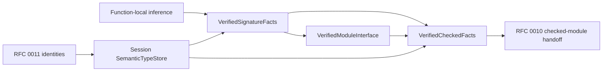

# ZOM Type Architecture Audit

## Executive Summary

The current type subsystem is a single-compilation-unit prototype. It cannot be
published as the semantic type foundation for `CompilerSession`, HIR, MIR, or
LIR. The audit retained ten findings after explicit refutation attempts: one
Critical, eight High, and one Medium.

Three directly reachable implementation defects were repaired during the
audit: dangling concrete type bindings, concrete generic impl cache collisions,
and silently ignored complex local annotations. The RFC 0005/RFC 0008
signature-publication contradiction was also repaired in the draft contracts.
The remaining identity and publication findings require the dependency-ordered
RFC replacement and cannot be solved by extending the current `TypeEnv`.

| Severity | Count | Open | Repaired In Worktree |
|---|---:|---:|---:|
| Critical | 1 | 0 | 1 |
| High | 8 | 5 | 3 |
| Medium | 1 | 1 | 0 |

## Findings

### TA-001 Critical: Type variable bindings could outlive their concrete types

Status: repaired in the current worktree.

`TypeEnv::unite()` stored addresses of caller-owned concrete types in
`idBindings`. Generic call checking can unify a persistent environment variable
with a parameter type owned by a local instantiated function, leaving a
dangling address after the call checker returns. The non-owning `bind()`
overload had the same lifetime contract.

Evidence: `zomlang/compiler/type/type-env.cc:404`,
`zomlang/compiler/checker/body/body-checker.cc:1940`, and
`zomlang/compiler/checker/body/body-checker.cc:1982` in the audited
revision. The repair clones borrowed concrete types into environment-owned
storage. Sanitizer regressions destroy the source value before resolving both a
direct binding and a unification binding.

Refutation considered: fresh inference variables are environment-owned. This
does not protect concrete parameter subtrees owned by the temporary function
instance.

### TA-002 High: Concrete generic impl lookup collapsed specializations

Status: repaired in the current worktree.

The resolver cached an impl under only `typeName::interfaceName`. Consequently,
`impl Eq for Box<Good>` could be returned for `Box<Plain>` after exact lookup
missed. Marker override keys had the same generic-argument collapse.

Evidence: `zomlang/compiler/checker/trait-resolver.cc:199`, the former
cache writes near `trait-resolver.cc:603`, and the former fallback near
`trait-resolver.cc:730`. The lossy cache was deleted, marker keys now include
the complete current type rendering, and a regression proves one concrete
specialization does not match another.

Refutation considered: `TypeEnv::lookupImpl()` uses a complete rendered type.
That exact table was correct; the later lossy resolver fallback reintroduced
the false match.

### TA-003 High: Complex local annotations could be silently ignored

Status: repaired in the current worktree.

`DeclSignatureComputer` understood tuple, array, function, intersection,
object, and bottom types, while the independent body resolver did not.
`checkLetStmt()` treated a missing resolved annotation as if no usable
annotation existed, so an invalid initializer could escape assignability
checking.

Evidence: `zomlang/compiler/checker/decl-signature.cc:969`,
`zomlang/compiler/checker/body/body-checker.cc:857`, and
`zomlang/compiler/checker/body/body-checker.cc:3258`. Body checking now
resolves the accepted complex type forms. Unit coverage proves that a boolean
initializer is rejected for a tuple annotation.

Refutation considered: the declaration signature phase resolves top-level
annotations. Body checking still re-resolved local annotations independently,
so declaration-only coverage could not protect this path.

### TA-004 High: TypeId has multiple unbranded issuers

Status: open; blocks RFC 0005, RFC 0008, and RFC 0010 implementation.

`TypeId` contains only a `uint32_t`. Each per-buffer `TypeEnv` owns a separate
insertion-ordered interner, and each current IR module owns another interner.
The same numeric ID therefore has no store or semantic-context provenance and
cannot cross a verified boundary.

Evidence: `zomlang/compiler/type/type-interner.h:28`,
`zomlang/compiler/type/type-env.cc:110`,
`zomlang/compiler/driver/session/compiler-session.cc:167`, and
`zomlang/compiler/irgen/ir.cc:53`.

Refutation considered: the current CLI limits IR emission to one source and
usually re-interns types into the IR module. That limits current exposure but
does not make foreign IDs distinguishable or support cross-module facts.

### TA-005 High: Nominal and impl identity is spelling-based

Status: open; blocks cross-module semantics.

Named and interface type equality, canonical keys, associated projections, and
impl/coherence keys depend on display names or rendered types. A resolved
`TypeSymbol` exists but is ignored by nominal equality and canonical interning.
Same-name definitions in distinct modules or packages can therefore collapse.

Evidence: `zomlang/compiler/type/named-type.cc:75`,
`zomlang/compiler/type/type-interner.cc:166`,
`zomlang/compiler/type/type-env.cc:1014`, and
`zomlang/compiler/checker/trait-resolver.cc:1501`.

Refutation considered: attaching a `TypeSymbol` to `NamedType` does not help
because the equality and key functions do not consume it.

### TA-006 High: TypeEnv mixes mutable inference with published facts

Status: open; requires direct replacement.

One object owns mutable type trees, local numeric IDs, union-find bindings,
coercions, dispatch, impl tables, and recovery types. `setType()` can overwrite
facts, and only dispatch has a freeze flag. Binding a stored type variable can
change the result of `find(getType(node))` without updating the separately
stored node `TypeId`.

Evidence: `zomlang/compiler/type/type-env.cc:110`,
`zomlang/compiler/type/type-env.cc:172`, and
`zomlang/compiler/type/type-env.cc:220`.

Refutation considered: `setType()` updates both tables at the instant of the
write. Later union-find refinement does not invoke `setType()`, so this is not
a stable invariant or an immutable checked snapshot.

### TA-007 High: Signature-first interface publication lacked a proof type

Status: repaired in RFC drafts; implementation remains absent.

RFC 0008 publishes module interfaces after declaration signatures and before
dependent bodies, while RFC 0005 previously allowed only body-complete
`VerifiedCheckedFacts` to feed module interfaces. The contracts now define
`VerifiedSignatureFacts` and `SignatureFactsVerifier`; module interfaces consume
that exact signature-stage proof, and body-complete facts record its revision.

Evidence: `docs/rfc/0005-type-system-architecture.md` Pipeline Boundary and
Signature Facts sections, and `docs/rfc/0008-compiler-session-cross-module.md`
Phase Scheduling.

Refutation considered: checking dependency bodies first would contradict RFC
0008's explicit signature-first wave and would not define a verifier input for
an exported interface.

### TA-008 High: Coherence is local to one AST

Status: open; blocks CompilerSession correctness.

The driver constructs one `TypeEnv` and checker per source tree.
`TraitResolver::checkCoherence()` clears local state and visits only that tree,
so overlapping impls split across source modules are not compared.

Evidence: `zomlang/compiler/driver/session/compiler-session.cc:167`,
`zomlang/compiler/checker/checker.cc:77`, and
`zomlang/compiler/checker/trait-resolver.cc:1474`.

Refutation considered: the driver shares a symbol table, but no symbol-table
surface aggregates canonical impl heads or performs overlap checking.

### TA-009 High: Scope identity is a truncated process address

Status: open; blocks stable checked metadata.

The binder stores the low 32 bits of a `Scope*` as scope identity, and body
checking reconstructs a `uint32_t -> Scope*` table. Two addresses can collide;
the value is process-dependent and carries no `ScopeManager` provenance.

Evidence: `zomlang/compiler/binder/decl-collector.cc:160` and
`zomlang/compiler/checker/body/body-checker.cc:92`.

Refutation considered: heap-owned scopes keep their addresses stable during one
run. Stability does not prevent low-bit collisions or make the identity
canonical, context-bound, or persistable.

### TA-010 Medium: The polymorphic type graph conflicts with zc ownership rules

Status: open; resolved only by the RFC 0005 representation replacement.

The repository rule forbids `zc::Vector<zc::Own<T>>`, while the virtual `Type`
hierarchy structurally requires this representation for heterogeneous child
types. The audited type and checker directories contain 58 such sites.

Evidence: `.codex/rules/cpp-zc.md:64`,
`zomlang/compiler/type/function-type.h:39`, and
`zomlang/compiler/type/type-env.cc:119`.

Refutation considered: mechanically storing `Type` values would slice the
virtual hierarchy. This disproves a local container substitution, not the
architecture finding. RFC 0005's immutable tagged `TypeData` plus IDs is the
required replacement.

## Action Items

| Priority | Action | Owner | Status |
|---|---|---|---|
| P0 | Own every concrete inference binding and retain sanitizer lifetime regressions | binder-checker | Repaired in worktree |
| P0 | Delete lossy generic impl fallback keys and test specialization isolation | binder-checker | Repaired in worktree |
| P0 | Resolve all accepted local annotation forms and reject mismatches | binder-checker | Repaired in worktree |
| P0 | Accept RFC 0011, then RFC 0004 and RFC 0005 with the signature-fact split | rfc, binder-checker, module-system | Open |
| P0 | Replace local unbranded TypeId and spelling identity with the session semantic store | binder-checker, module-system | Open |
| P0 | Build session-wide canonical coherence from verified interfaces | module-system, binder-checker | Open |
| P1 | Replace address-derived scope identity with context-bound `ScopeId` | binder-checker | Open |
| P1 | Delete the polymorphic type graph during the RFC 0005 atomic cutover | binder-checker | Open |

## Verification

Current worktree evidence:

- the sanitizer preset configures and builds without a compile failure;
- `body-checker-test`, `trait-resolver-test`, and `type-env-test` pass 3/3 under
  the sanitizer build, including the repaired lifetime, specialization, and
  annotation paths;
- parser coverage, lexer architecture, generated AST schema, and the focused
  type-surface conformance matrix pass;
- the complete serial ANTLR grammar matrix passes in 483.47 seconds;
- the remaining debug CTest inventory passes 1,177/1,177; the separately run
  socket HTTP test passes 6/6 independent repetitions;
- RFC checks, format checks, and `git diff --check` pass.

The audit requires the repaired focused sanitizer tests, complete build, RFC
check, format check, full grammar suite, and full sanitizer CTest before this
report can move from `active` to a closed status.
