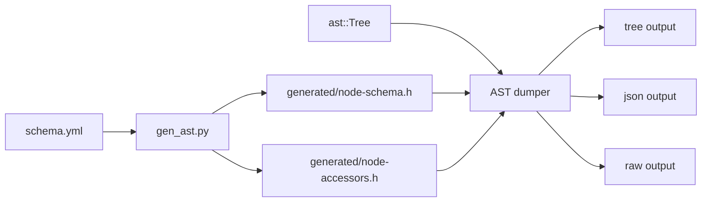

# RFC 0001: AST Dump Format

## Summary

Define ZOM's AST dump contract as three schema-driven formats: `tree` for human
review and lit snapshots, `json` for tool consumption, and `raw` for compiler
storage debugging.

The default `--dump-ast` output becomes the `tree` format.

## Motivation

ZOM's AST is a compact immutable `ast::Tree` whose `NodePayload` words are
decoded by generated schema accessors. That representation is appropriate for
compiler storage, but it is not an acceptable review format by itself.

AST dumps are used by parser work, binder work, conformance tests, lit
snapshots, and design review. These workflows need stable node names, field
names, source spans, child relationships, and decoded enum/string/identifier
values. They should not require a reviewer to reverse-engineer payload word
layout.

The dump contract must be deterministic enough for FileCheck and clear enough
for a reviewer to inspect parser behavior from a small source sample.

## Goals

- Make `--dump-ast` produce a readable tree by default.
- Decode nodes through `products/zomlang/compiler/ast/schema.yml` metadata.
- Print syntax kind names instead of numeric kind values.
- Print schema field names instead of payload word indexes.
- Expand `NodeList` fields as ordered child lists.
- Include source spans in a stable normalized form.
- Provide a JSON format for tools without exposing payload layout.
- Keep a raw format for compiler layout debugging.
- Use the same schema metadata for text and JSON output.
- Make AST conformance snapshots reviewable in `products/zomlang/tests`.

## Non-Goals

- This RFC does not change `ast::Tree`, `Node`, `NodeId`, `NodeList`, or
  `NodePayload` storage.
- This RFC does not add semantic binder or checker metadata to syntax dumps.
- This RFC does not define an interchange format for third-party stable APIs.
- This RFC does not require AST dumps to be valid source code.
- This RFC does not define pretty-printing or formatting for ZOM source.
- This RFC does not add comments or whitespace trivia to the AST.

## Prior Art

Clang uses a human-oriented `-ast-dump` tree for compiler and tooling
inspection. Its introductory AST documentation presents named declaration and
expression nodes as the primary way to understand parsed structure:
<https://clang.llvm.org/docs/IntroductionToTheClangAST.html>.

Rust separates readable and full-structure compiler views. The rustc developer
guide documents `-Z unpretty=hir` for a human-readable view and
`-Z unpretty=hir-tree` for a full structure dump:
<https://rustc-dev-guide.rust-lang.org/hir/debugging.html>.

Tree-sitter corpus tests use readable S-expression output and support field
names such as `name:`, `parameters:`, and `body:` in expected parse trees:
<https://github.com/tree-sitter/tree-sitter/blob/master/docs/src/creating-parsers/5-writing-tests.md>.

Go's `go/ast` package exposes `Fprint` and `Print` for inspecting syntax trees
with field names and optional position interpretation through a file set:
<https://pkg.go.dev/go/ast>.

Python's `ast.dump` defaults to annotated field names and makes attributes such
as line and column information opt-in:
<https://docs.python.org/3/library/ast.html>.

ESTree represents tool-facing JavaScript AST nodes as objects with string
`type` fields and source locations, with each subtype defining named fields:
<https://github.com/estree/estree/blob/master/es5.md>.

ZOM should copy the common successful pattern: readable named tree output for
humans and tests, structured named JSON for tools, and a separate full internal
debug view when storage details matter.

## Guide-Level Explanation

Running:

```bash
zomc compile --dump-ast path/to/file.zom
```

prints a nested tree. Each node line starts with the syntax node name. Field
names introduce child nodes and lists. Scalar fields appear on the node line
when they fit without hiding structure.

Example:

```text
SourceFile #17 @1:1..3:2
  file_name: "binary-operators.zom"
  module: null
  statements:
    LetStatement #8 @1:1..1:26
      pattern:
        IdentifierPattern #1 name="a" @1:5..1:6
      initializer:
        BinaryExpr #7 op=Add @1:9..1:24
          lhs:
            IntegerLiteral #2 value="1" @1:9..1:10
          rhs:
            BinaryExpr #6 op=Mul @1:13..1:24
              lhs:
                IntegerLiteral #3 value="2" @1:13..1:14
              rhs:
                IntegerLiteral #4 value="3" @1:17..1:18
```

For tool output:

```bash
zomc compile --dump-ast --ast-format=json path/to/file.zom
```

prints deterministic JSON using node names and schema field names:

```json
{
  "format": "zom.ast.json",
  "schema": "2.0",
  "fingerprint": "ab1d550bd82aa7653f886bf156e2057a2c15b1a67549935ecada558b32f36032",
  "root": 17,
  "nodes": [
    {
      "id": 17,
      "kind": "SourceFile",
      "span": {
        "start": {"line": 1, "column": 1},
        "end": {"line": 3, "column": 2}
      },
      "fields": {
        "file_name": "binary-operators.zom",
        "module": null,
        "statements": [8]
      }
    }
  ]
}
```

For compiler storage debugging:

```bash
zomc compile --dump-ast --ast-format=raw path/to/file.zom
```

prints internal layout fields:

```text
root: 17
node 17: kind=SourceFile payload=[1,0,8,1,0,0]
```

`raw` is not a conformance snapshot format.

## Reference-Level Design

### Format Selection

`--dump-ast` selects `tree` unless a format option overrides it.

The accepted format names are:

| Format | Purpose |
|---|---|
| `tree` | Default human-readable tree for review and lit snapshots. |
| `json` | Structured named output for tools. |
| `raw` | Internal payload-oriented compiler debug output. |

The AST dump command rejects unknown format names with a diagnostic and a
non-zero exit code.

### Schema Reflection

AST dumpers must decode nodes through generated reflection metadata derived
from `products/zomlang/compiler/ast/schema.yml`.

`generated/node-schema.h` must expose enough metadata for generic dumping:

- schema version
- schema fingerprint
- node kind
- node name
- field count
- field name
- field storage type
- payload word offsets
- optional marker
- cast target name when present
- enum domain and enum value names when present
- list element cast target when present

Dumpers should not contain a large handwritten switch over all node kinds. A
small number of scalar decoders is acceptable for primitive storage classes.



### Tree Format

Tree format is preorder from `Tree::root()`.

Each node line uses this shape:

```text
<NodeKind> #<NodeId> @<start-line>:<start-column>..<end-line>:<end-column> <scalar-fields>
```

Rules:

- `NodeKind` is the schema node name.
- `NodeId` is printed as `#N` to make shared references and diagnostics easy to
  correlate.
- Spans are one-based line and column positions.
- Fields appear in the order declared by `schema.yml`.
- Scalar fields may be printed on the node line.
- `NodeId` fields are printed as nested child nodes.
- Optional empty `NodeId` fields are printed as `field_name: null`.
- `NodeList` fields are printed as `field_name:` followed by indented elements.
- Empty lists are printed as `field_name: []`.
- Enum fields use enum value names.
- String and identifier fields print decoded text in JSON string escaping.
- Internal numeric ids may be appended only when decoded text is unavailable.

Example shape:

```text
FunctionDecl #42 name="main" visibility=Pub @1:1..5:2
  attributes: []
  parameters:
    FunctionParameterDecl #40 name="argc" @1:9..1:18
      ty:
        IdentType #39 name="Int" @1:15..1:18
  body:
    BlockExpr #41 @1:20..5:2
      statements: []
```

### JSON Format

JSON format is a single object with this top-level shape:

```json
{
  "format": "zom.ast.json",
  "schema": "2.0",
  "fingerprint": "...",
  "root": 1,
  "nodes": []
}
```

Rules:

- `nodes` is ordered by numeric `NodeId`.
- `kind` is a string node name.
- `span` is always present when source range data exists.
- `fields` contains schema field names in schema order.
- `NodeId` values are numeric ids or `null`.
- `NodeList` values are arrays of numeric ids.
- Enum values are strings.
- String and identifier values are decoded strings.
- Raw payload words are not present.
- Absolute paths are not present.

### Raw Format

Raw format exists to debug compact storage. It may print numeric kind values,
payload words, list handles, and other internal values.

Raw format is explicitly not a contract for conformance tests, tooling, or user
documentation.

### Determinism

All formats must be deterministic:

- Node order is stable.
- Field order follows `schema.yml`.
- Lists preserve parser construction order.
- Paths are normalized to the input spelling or buffer display name, never an
  absolute host path.
- No pointer addresses are printed.
- No hash-map iteration order can affect output.
- JSON object keys are emitted in the order specified by this RFC.

### Error Handling

If a node kind has no schema metadata, `tree` and `json` dumping fail with a
compiler-internal diagnostic and non-zero exit code.

If a child `NodeId` or `NodeList` handle is invalid, dumping fails with a
compiler-internal diagnostic and non-zero exit code.

`raw` may print invalid internal values to aid debugging, but it should still
return non-zero when the tree fails structural validation.

## Repository Impact

| Area | Paths | Owner |
|---|---|---|
| AST schema and generated metadata | `products/zomlang/compiler/ast/**`, `scripts/codegen/gen_ast.py` | `lexer-parser` |
| CLI dump command | `products/zomlang/utils/zomc/**`, `products/zomlang/compiler/basic/**` | `lexer-parser` |
| Conformance snapshots | `products/zomlang/tests/conformance/**` | `verification` |
| Lit regeneration | `products/zomlang/tests/tools/regen-lit.py` | `verification` |
| AST design docs | `docs/design/ast-data-structure.md` | `spec-audit` |
| RFC process | `docs/rfc/**` | `rfc` |

## Drawbacks And Risks

The main risk is snapshot churn. Making `tree` the default AST dump will require
regenerating affected conformance expectations and reviewing the resulting diff
carefully. The mitigation is to keep the implementation isolated, regenerate in
one focused change, and require lit review before moving this RFC to `LANDED`.

The second risk is incomplete schema reflection. If generated metadata omits a
field type or enum domain, the dumper may fall back to raw numbers and recreate
the current readability problem. The implementation must fail fast for missing
metadata in `tree` and `json` formats.

The third risk is command-line surface ambiguity. Existing serializer options
may already use `text`, `json`, or `xml`. The implementation must choose one
clear AST-specific option name and remove XML from the AST dump surface in the
same change.

## Alternatives Considered

### JSON As The Only Format

JSON is good for tools but poor for FileCheck review. Large one-line or deeply
nested JSON creates noisy diffs and makes parser structure harder to inspect.
ZOM keeps JSON as a tool format and uses `tree` for human snapshots.

### S-Expression As The Only Format

S-expressions are compact and work well for Tree-sitter corpus tests. ZOM's
schema has many named scalar fields, optional fields, and enum fields, so an
indented field-labeled tree is clearer for contributors who are reviewing
compiler behavior.

### Handwritten Node Printers

Handwritten printers can produce polished output for a few node kinds, but they
will drift from `schema.yml`. ZOM uses generated reflection metadata so schema
changes automatically reach the dumper.

### Exposing Payload Words In JSON

Payload words are storage, not syntax. Exposing them would make tools depend on
layout details and would hide the meaningful schema field names. ZOM reserves
payload words for `raw`.

## Compatibility And Rollout

ZOM is pre-1.0, so this RFC does not preserve the current numeric AST dump as a
compatibility surface. The rollout replaces the default dump in one change,
updates every affected conformance expectation, and deletes XML AST dumping
from the CLI surface.

`raw` exists only as a compiler debugging mode. It is not a migration bridge for
tests or tools.

The rollback cost is limited to the AST dumping module, the AST format option,
and regenerated conformance expectations. The underlying `ast::Tree` storage is
unchanged.

## Implementation Plan

1. Extend `scripts/codegen/gen_ast.py` to emit node and field reflection
   metadata into `generated/node-schema.h`.
2. Regenerate AST generated headers.
3. Add an AST dump module that reads `ast::Tree` through schema metadata and
   implements `tree`, `json`, and `raw`.
4. Wire `zomc compile --dump-ast` to default to `tree`.
5. Add an explicit AST format option for `tree`, `json`, and `raw`.
6. Remove XML AST dumping from the CLI surface.
7. Update `products/zomlang/tests/tools/regen-lit.py` to regenerate tree-format
   expectations.
8. Regenerate affected conformance AST expectations.
9. Update AST design documentation to reference this RFC.

## Test Plan

- Build: `cmake --build --preset sanitizer`
- Full tests: `ctest --preset default --output-on-failure`
- Lit tests: `ctest --preset default -R lit --output-on-failure`
- Format: `python3 scripts/check-format.py`
- Codegen: `python3 scripts/codegen/gen_ast.py --write`
- AST dump unit coverage:
  - kind names print for every schema variant
  - field metadata exists for every schema field
  - optional `NodeId` prints `null`
  - empty `NodeList` prints `[]`
  - enum fields print names
  - JSON output omits raw payload words
  - invalid child ids return non-zero
- Conformance coverage:
  - literals
  - binary precedence
  - patterns
  - declarations
  - module/import/export nodes
  - error-recovery nodes when present

## Open Questions

- Should source spans be enabled in `tree` output unconditionally, or should the
  CLI expose a compact tree mode without spans?
- Should JSON use a flat `nodes` array only, or also expose a nested `tree`
  convenience view later?

## Status History

| Date | Status | Notes |
|---|---|---|
| 2026-06-30 | REVIEW | Initial RFC opened for design review. |
