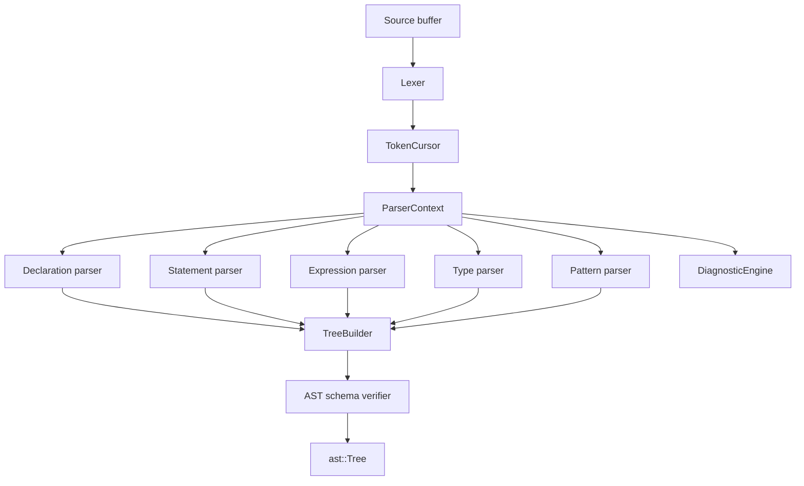
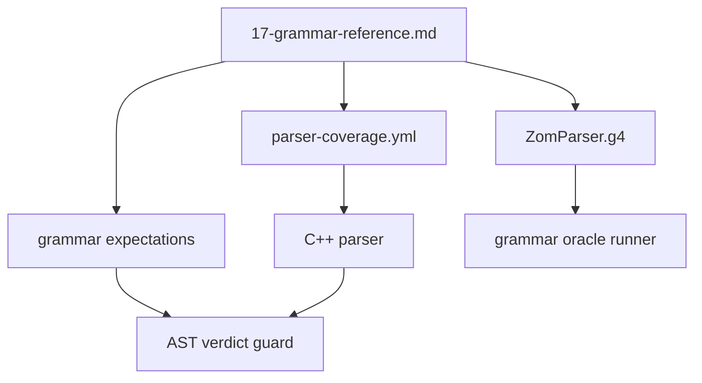
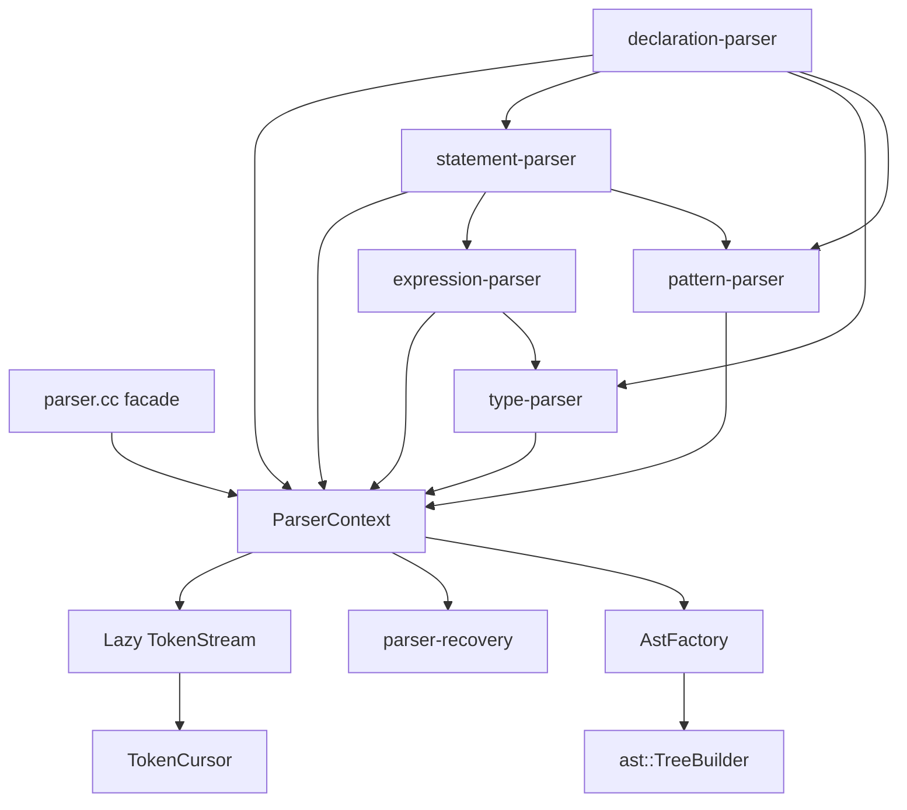
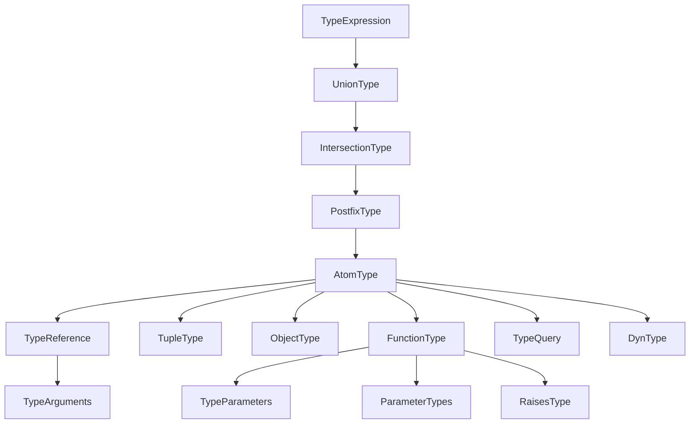
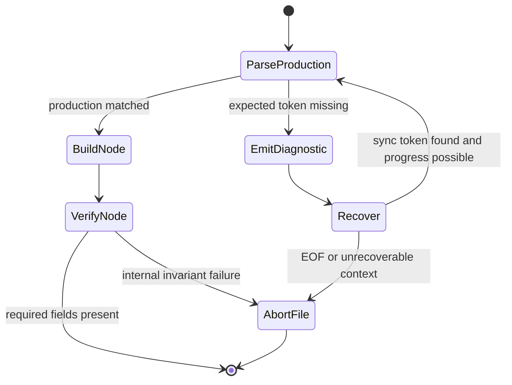

# RFC 0002: Parser Architecture

## Summary

Replace the current range-scanning parser with a grammar-shaped recursive
descent parser that owns syntax validation, deterministic recovery, AST
construction, and conformance verdict alignment for the ZOM language grammar.

## Motivation

The parser is the trust boundary between source text and every later compiler
phase. The current implementation tokenizes the file, scans token ranges, emits
a small set of token-pattern diagnostics, and then builds an AST even when core
grammar productions were never recognized. This creates a fail-open frontend:
source that should be rejected can flow into AST dumping, binding, and later
compiler phases.

The repository evidence shows the scale of the problem:

- The grammar reference contains 257 direct EBNF left-hand-side productions,
  while the parser contains 28 `parse*` entry points.
- The schema defines 124 AST node kinds, while the parser references 55 of
  those kinds.
- At the start of this RFC work, direct execution of
  `zomc compile --dump-ast` disagreed with 180 grammar-oracle verdicts; 162 of
  those were reject cases accepted by the compiler.
- After the parser slice repairs, regenerated lit expectations, and
  grammar-oracle reconciliation completed on 2026-07-01, the AST coverage guard
  reports zero verdict mismatches against grammar expectations. All AST checks
  now have grammar expectation metadata or an explicit allowlist.
- The parser coverage map records 208 syntactic productions and 35 lexical
  productions that must stay aligned with the grammar reference and C++ parser.
- Accepted AST dumps previously contained missing required structure, such as
  an alias target printed as `null`; the parser architecture must prevent those
  trees from being published.

This blocks parser work, AST lit review, binder correctness, diagnostics
quality, and any serious claim that the implementation supports the language
specification.

## Goals

- Make the parser fail closed: syntax errors must prevent a public AST from
  being returned.
- Shape parser functions around the grammar in
  `docs/spec/chapters/17-grammar-reference.md`.
- Implement expression parsing with a Pratt or precedence-climbing core that
  covers assignment, conditional, binary, prefix, postfix, member, call,
  optional-chain, `new`, `super`, and `import(...)` expressions.
- Implement type parsing with explicit union, intersection, postfix, atom,
  function type, tuple type, object type, type query, dyn type, generic
  argument, and bound parsing.
- Implement declaration, statement, pattern, attribute, modifier, import,
  export, and module-item parsing as first-class grammar productions.
- Make `TokenCursor` the only syntactic token-consumption API over the lazy
  token stream, including bounded lookahead, right-angle splitting, and
  rewindable speculative parsing.
- Remove range-scanning parser fallbacks that choose grammar productions by
  searching token intervals instead of consuming tokens through recursive
  descent entry points.
- Replace raw parser-side AST payload writes with a typed `AstFactory` helper
  for every parser-created syntax node.
- Define the authoritative grammar source and require every executable grammar,
  parser coverage map, and corpus oracle to be checked against it.
- Enforce AST schema invariants during parser construction.
- Centralize syntax recovery so invalid input produces diagnostics without
  creating structurally invalid AST nodes.
- Define the parser boundary for trivia, comments, doc comments, and lossless
  concrete syntax so formatter and IDE work do not accidentally depend on
  compiler AST internals.
- Make conformance grammar verdicts the acceptance oracle for AST lit tests.
- Add automated drift checks between grammar productions, parser entry points,
  AST node construction, diagnostics, and conformance coverage.

## Non-Goals

- This RFC does not define binder name-resolution behavior.
- This RFC does not define type-checking behavior.
- This RFC does not define IR lowering or code generation.
- This RFC does not require an incremental IDE parser.
- This RFC does not require a public lossless concrete syntax tree.
- This RFC does not introduce a second parser implementation.
- This RFC does not preserve the current range-scanning parser as a selectable
  mode.

## Prior Art

Clang uses a hand-written recursive descent parser integrated with precise
source locations, diagnostics, and recovery. ZOM should copy the explicit token
cursor, grammar-shaped parse functions, and local recovery discipline. ZOM
should not copy Clang's tight parser and semantic-analysis coupling; ZOM needs
parser output to remain syntax-only so binder and checker ownership stays
clear. Reference:
<https://clang.llvm.org/docs/InternalsManual.html>.

Rust's compiler parser uses explicit parse results, token-tree handling, and
syntax recovery paths that report structured diagnostics before later compiler
phases run. ZOM should copy the principle that parse failure is a typed outcome
and that recovery must not silently accept malformed syntax. ZOM should keep
AST storage schema-backed instead of adopting Rust's AST shape. Reference:
<https://rustc-dev-guide.rust-lang.org/the-parser.html>.

Swift separates parsing and syntax representation through a syntax tree that
can preserve source structure and diagnostics. ZOM should copy the clean phase
boundary and the rule that parser diagnostics are source-positioned. ZOM does
not need Swift's full green-tree incremental model for this RFC. Reference:
<https://github.com/swiftlang/swift-syntax>.

Go's `go/parser` exposes a deterministic parse API with position information
and an error list. ZOM should copy the simple contract that parse callers can
distinguish a complete syntax tree from a parse that reported errors. ZOM
should not copy Go's intentionally small grammar surface; ZOM's grammar needs
separate expression, type, pattern, and declaration parsers. Reference:
<https://pkg.go.dev/go/parser>.

Tree-sitter demonstrates the value of corpus-driven parse tree expectations and
small, reviewable fixtures. ZOM should copy corpus discipline and snapshot
review, but should not use Tree-sitter as the compiler's primary parser because
ZOM already needs a C++ parser wired directly to schema-backed AST payloads and
diagnostic IDs. Reference:
<https://tree-sitter.github.io/tree-sitter/creating-parsers>.

Roslyn and Swift syntax both demonstrate a mature split between compiler
semantics and lossless syntax infrastructure. ZOM should copy the boundary:
the compiler parser may keep enough source attachment for diagnostics and
attributes, while a future formatter or IDE parser can own a separate lossless
tree. ZOM should not force lossless trivia into the schema-backed compiler AST
in this RFC. References:
<https://learn.microsoft.com/en-us/dotnet/csharp/roslyn-sdk/get-started/syntax-analysis>
and <https://github.com/swiftlang/swift-syntax>.

## Guide-Level Explanation

Contributors will read and modify parser code by grammar area. A syntax change
will normally touch the grammar reference, the corresponding parser function,
AST schema or accessors when needed, and conformance tests.

For example, adding a postfix operator will require these coordinated changes:

- Add or confirm the token in the lexer and token metadata.
- Add the operator to the postfix suffix grammar.
- Add one branch in the postfix loop.
- Add AST schema support if the operator needs a new node.
- Add positive and negative conformance fixtures.
- Add precedence-focused AST lit coverage.

Invalid syntax will no longer produce a public AST dump with missing children.
If a source file violates syntax, `zomc compile --dump-ast` exits non-zero with
parser diagnostics. Recovery may continue internally to find more diagnostics,
but no recovered tree is published to binder, checker, or AST conformance
output.

The parser architecture will be organized by syntax domain rather than by
token-range helpers:



## Reference-Level Design

### Public Parser Contract

`parser::Parser::parse()` remains the public parse entry point and returns
`zc::Maybe<ast::Tree>`.

The contract changes as follows:

- If lexing or parsing emits an error diagnostic, `parse()` returns
  `zc::none`.
- The public parser facade exposes no `ParseMode`, `Loose` mode,
  `lookAhead()`, `canLookAhead()`, `isLookAhead()`, or callback-based
  speculative parsing API.
- If parsing succeeds, the returned `ast::Tree` has a valid root and passes the
  AST schema verifier.
- Parser recovery may build temporary nodes only if they are not returned after
  an error.
- Required AST fields must never be published as null.
- Optional AST fields may be empty only when marked optional in the schema.

`basic::performParse()` and `CompilerDriver::parseSources()` continue to use
the diagnostic engine as the phase error state, but they no longer depend on
the parser accidentally emitting a diagnostic for every invalid token pattern.
The parser itself owns grammar failure.

Internally, parsing is modeled as a typed result even though the public API
remains `zc::Maybe<ast::Tree>`:

| Internal state | Meaning | Public result |
|---|---|---|
| `Complete` | The source matched the grammar, no syntax error was emitted, and the AST verifier passed. | `ast::Tree` |
| `RecoveredWithErrors` | Recovery found additional diagnostics after a syntax error. The tree is internal only. | `zc::none` |
| `Aborted` | EOF, error-budget exhaustion, or an invariant failure stopped parsing. | `zc::none` |

Callers must not infer syntax success from a non-empty partially built
`TreeBuilder`. The only publication gate is the final parser result after
diagnostic checks and AST schema verification.

There is no public fail-open parser mode in this architecture. Fuzzers may
still feed invalid input through `parse()` to exercise recovery, but any
recovered tree remains internal and is discarded before returning to the
caller.

### Authoritative Grammar Source

The normative human grammar for this RFC is
`docs/spec/chapters/17-grammar-reference.md`. The compiler parser, executable
grammar artifacts, and conformance metadata must be treated as derived or
checked artifacts relative to that chapter.

The implementation must add a machine-checkable parser coverage map at:

```text
products/zomlang/compiler/parser/parser-coverage.yml
```

The coverage map is the bridge between prose EBNF and C++ parser functions.
It does not replace the grammar reference. It records which parser function
implements each syntactic production and which productions are intentionally
inlined into a parent production.

`docs/spec/ZomParser.g4` is allowed to remain an executable grammar oracle, but
it must not become an independent source of truth. Any conflict between
`17-grammar-reference.md`, `ZomParser.g4`, `parser-coverage.yml`, corpus
metadata, and C++ parser behavior is a spec-alignment failure.

The intended flow is:



### Parser Modules

The implementation should split `products/zomlang/compiler/parser/` by
syntax domain:

| Module | Responsibility |
|---|---|
| `token-cursor.*` | Indexed token access, save/restore marks, token labels, EOF handling. |
| `parser-context.*` | Shared parser state, diagnostics, recovery, source ranges. |
| `AstFactory` | Private AST construction boundary over `ast::TreeBuilder` and payload writes. |
| `declaration-parser.*` | Module items, declarations, imports, exports, attributes, modifiers. |
| `statement-parser.*` | Blocks, statement lists, control flow, labels, match statements. |
| `expression-parser.*` | Pratt or precedence-climbing expression parser. |
| `type-parser.*` | Type expressions, type parameters, type arguments, bounds. |
| `pattern-parser.*` | Binding patterns and match patterns. |
| `parser-recovery.*` | Synchronization sets and recovery helpers. |
| `parser.cc` | Public `Parser` facade and top-level orchestration. |

The file split is required for maintainability. It is not a public API.
`parser-impl.h` may declare the private `Parser::Impl` type, shared private
result structs, and small helper declarations, but it must not contain domain
parser method bodies. Each domain source file must contain the implementation
for its grammar family; include-only or intentionally empty `*-parser.cc`
shells are forbidden. `scripts/check-parser-coverage.py` must scan the full
parser source set and fail if any required domain implementation file stops
defining parser methods.

Module dependencies are one-directional:



Domain parsers may call each other only along grammar ownership boundaries:
declarations may call statements, types, and patterns; statements may call
expressions and patterns; expressions may call types only in grammar contexts
that require a type. Lower-level modules must not call declaration parsing.
This prevents accidental statement-end or source-file scanning from re-entering
inside expression and type parsing.

### Mandatory Parser Refactor Surface

The parser implementation is not complete until these refactors are finished
and the old paths are deleted:

- `TokenCursor` is the only API used by grammar functions to decide what
  production matches next. `ParserContext::tokenAt()` and `kindAt()` may remain
  available for source ranges, diagnostics, and already-consumed boundaries,
  but they must not be the primary production-selection API.
- Parser grammar functions do not call `lexer::Lexer`, `LexerState`,
  `restoreState()`, `getCurrentState()`, `reScanGreaterToken()`, or
  `reScanTemplateToken()`. Lexer access is isolated behind the lazy token stream
  that feeds `TokenCursor`.
- `findTopLevel*` helpers do not choose expressions, types, declarations,
  statements, patterns, or attributes. Grammar ownership is encoded by parser
  entry points and cursor movement, not by scanning arbitrary token ranges.
- Right-angle splitting for type contexts is implemented by `TokenCursor` and
  is included in cursor marks. No type parser path compensates for `>>` or
  `>>>` by reinterpreting token kinds outside the cursor overlay.
- Raw `ast::NodePayload` construction, `payload.words[...]` writes, and direct
  `TreeBuilder::makeNode()` calls are deleted from grammar functions. Parser
  grammar code calls typed `AstFactory` helpers only.
- Recovery state is represented by explicit recovery frames with context,
  anchor, synchronization set, consumed-progress state, and cascade
  suppression. Ad hoc skip loops are deleted unless they are inside a named
  recovery helper covered by tests.
- The parser coverage checker fails when a required parser domain file becomes
  an empty shell, when a parser-owned node lacks a typed factory helper, or
  when a mapped syntactic production has no cursor-driven implementation.

### Syntax Tree And Trivia Boundary

The schema-backed `ast::Tree` is the compiler syntax tree. It is not a lossless
concrete syntax tree.

The compiler parser must preserve:

- source ranges for all AST nodes
- token ranges where diagnostics and later parser checks need them
- attributes and doc comments that have language semantics
- enough delimiter and separator location information for precise diagnostics

The compiler parser must not preserve ordinary whitespace, non-doc comments, or
formatting trivia in AST payloads. Those belong to a future lossless syntax
tree owned by formatter and IDE work.

This boundary keeps parser correctness focused on language syntax while still
leaving a clean future path for tooling.

### Token Cursor

`TokenCursor` owns no source text and does not lex directly. It references a
lazy `TokenStream` that pulls tokens from the lexer only when lookahead,
`tokenAt(index)`, or range construction requires that index. The stream retains
already produced tokens so absolute token indices, source ranges, diagnostics,
and cursor marks remain stable, but it must not lex the whole file before
parsing starts.

`TokenStream` must not expose parser-facing `tokenCount()` or
`tokenCountWithoutEof()` APIs, because those force the lazy stream to EOF and
recreate eager tokenization under a different name. Post-parse diagnostics may
inspect the already buffered token limit, but that query must not lex new tokens.

`TokenCursor` provides these operations:

- `peek(offset)` returns a token kind without consuming.
- `token(offset)` returns the token for diagnostics and source ranges.
- `at(kind)` checks the current token kind.
- `eat(kind)` consumes only when the current token matches.
- `expect(kind, diagnostic)` consumes the expected token or emits a diagnostic.
- `mark()` and `rewind(mark)` support bounded syntactic lookahead.
- `position()` returns the current token index.
- `isAtEnd()` recognizes EOF.

`TokenCursor` intentionally has no whole-stream `size()` operation. LL(k)
decisions use `peek(offset)` and `mark()` / `rewind(mark)`, not a precomputed
token count.

Every parse loop must prove progress. Recovery helpers must consume at least
one token before retrying.

The parser facade must not call the byte lexer for lookahead or ask the lexer to
rescan source bytes. All syntactic lookahead goes through `TokenCursor` marks and
rewinds so speculative parsing is bounded, rewindable, and independent from
lexer source-buffer state. A mark rewinds the cursor position and cursor overlay
state, not the lexer byte offset; already-buffered tokens remain in the stream.

`TokenCursor::Mark` records the full cursor observation state, not just the
real token index. If a context overlay is active, such as right-angle splitting
for type arguments, the mark stores overlay mode, remaining virtual tokens, and
the original maximal token kind. Rewinding restores that state exactly.
`peek()` and `token()` are observational operations: repeated calls without
`advance()`, `eat()`, `moveTo()`, or `rewind()` must not change the next token
that parser code observes.

Right-angle splitting is the only cursor overlay in this RFC. The lexer keeps
`>>` and `>>>` as maximal tokens. Type parsing enables a scoped split guard
while consuming type arguments or type-parameter bounds, and disables it when
the grammar context exits. The split guard must be RAII-style so early returns
cannot leak type-context token interpretation into expression parsing.

### Parse Results

Internal parse functions return explicit results:

- Required grammar functions return `zc::Maybe<ast::NodeId>`.
- Optional grammar functions return `ast::NodeId`, where an empty id means the
  optional production was not present.
- List grammar functions return an AST list node or a `NodeList` wrapper,
  depending on the schema field being populated.

Node construction helpers must validate required children before calling the
`AstFactory` node construction boundary. A missing required child after an error
returns `zc::none` from the current required production.

### AST Construction Boundary

`ast::TreeBuilder` is a low-level storage builder. Parser code must not scatter
raw payload word writes through every grammar function after this RFC is
implemented. The parser owns an `AstFactory` layer with one construction helper
per published syntax node that the parser can create. The typed helper surface
is generated from `products/zomlang/compiler/ast/schema.yml`; parser-specific
factory code may validate children and source ranges, but it must not invent a
second payload schema by hand.

Each factory helper must:

- receive already parsed child `NodeId`, `NodeList`, `IdentId`, and scalar
  values
- reject missing required children before building the node
- set optional fields only when the schema marks them optional
- attach the source range from consumed tokens
- encode enum values through generated schema constants
- return `zc::Maybe<ast::NodeId>` for nodes with required children

Only `AstFactory` and generated AST support code may call
`TreeBuilder::makeNode` directly for parser-owned nodes. Grammar functions call
factory helpers. This rule makes the parser reviewable: grammar functions show
which production matched, while factory helpers show how schema invariants are
encoded.

The generated AST schema remains the source of field layout. The factory layer
is not a second schema and must not duplicate field offsets beyond generated
factory signatures and generated constant names.

The factory surface is typed by syntax node. Examples of required helpers are
`makeSourceFile`, `makeFunctionDecl`, `makeNamedTypeExpr`,
`makeCallExpression`, `makeIfStmt`, and `makeIdentifierPattern`. Generic
`makeNode(kind, payload)` and raw payload writer helpers are allowed only inside
`AstFactory` implementation code and generated AST support. A parser reviewer
must be able to audit all required-child checks by reading the helper for the
node kind, without scanning every grammar function for payload word offsets.

The parser coverage guard must include a raw-construction ban:

- no `ast::NodePayload` declarations in parser domain `.cc` files
- no `payload.words[...]` writes outside `AstFactory` or generated AST support
- no `builder.write*` payload helper calls outside `AstFactory`
- no direct `ast::TreeBuilder` reference outside `AstFactory`
- no generic parser call that constructs a parser-owned node without the typed
  helper for that node kind

### Grammar-Shaped Entry Points

The parser must provide entry points for these production families:

- `parseSourceFile`
- `parseModuleItem`
- `parseDeclaration`
- `parseModifierList`
- `parseImportDeclaration`
- `parseExportDeclaration`
- `parseStatement`
- `parseBlockStatement`
- `parseExpression`
- `parseAssignmentExpression`
- `parseTypeExpression`
- `parsePattern`
- `parseAttribute`

Lexical-only EBNF productions do not need parser functions, but every
syntactic EBNF production must either have a direct parser function or be
documented in a local parser coverage map as being inlined into a named parent
production.

### No Range-Scanning Fallbacks

The final parser is hand-written recursive descent with Pratt or
precedence-climbing expression parsing. A helper may inspect already-delimited
tokens for diagnostics, source-range calculation, or a local ambiguity that is
documented in this RFC, but it must not replace the owning grammar function.

These patterns are rejected in the final implementation:

- searching a half-open token interval for the top-level assignment,
  conditional colon, binary operator, declaration body, or type separator and
  then recursively reparsing subranges as the normal parse path
- accepting a statement or declaration because a delimiter was found without
  first matching the grammar production's FIRST set
- treating expression parsing as a sequence of top-level scans rather than a
  Pratt or precedence-climbing loop
- parsing type arguments by counting `>` spellings outside the cursor split
  overlay
- leaving a range-scanning helper as a fallback behind a cursor-driven parser

When a grammar decision needs lookahead longer than one token, the parser uses
`TokenCursor::mark()` and `rewind()` or a named cursor helper with an explicit
lookahead limit.

### Parser Coverage Map

`parser-coverage.yml` must have one entry per syntactic EBNF production in
`17-grammar-reference.md`.

Each entry uses this shape:

```yaml
productions:
  AssignmentExpression:
    parser: parseAssignmentExpression
    status: direct
    ast:
      - BinaryExpr
      - AssignmentExpr
    tests:
      - products/zomlang/tests/conformance/corpus/04-expressions
  ArgumentList:
    parser: parseArguments
    status: inlined
    parent: Arguments
    ast:
      - CallExpression
    tests:
      - products/zomlang/tests/conformance/corpus/04-expressions
```

Allowed `status` values are:

| Status | Meaning |
|---|---|
| `direct` | The production has a parser function with the listed name. |
| `inlined` | The production is implemented inside the listed parent parser function. |
| `lexical` | The production is handled entirely by the lexer and has no parser entry. |
| `rejected` | The production was removed from the accepted grammar and must not appear in `17-grammar-reference.md`. |

`rejected` is a temporary reconciliation state only. An accepted RFC cannot
leave `rejected` entries for productions that remain in the grammar reference.

The coverage checker must fail when:

- a syntactic EBNF production has no map entry
- a `direct` parser function is missing
- an `inlined` parent parser function is missing
- a production is mapped to an AST node kind that no parser path can construct
- a mapped test path does not exist
- the map references a production that no longer exists

The parser rewrite is not complete until this checker is clean.

### Ambiguity Resolution

The parser must resolve known grammar ambiguities locally and document each
resolution in code near the relevant parser function. These rules are part of
the parser contract:

| Ambiguity | Resolution |
|---|---|
| Generic arguments versus relational `<` and `>` | Parse type arguments only in syntactic contexts that admit type arguments; expression parsing treats `<` and `>` as relational unless left-hand-side grammar has committed to a type-argument-capable form. |
| Tuple type versus parenthesized type | A parenthesized type with a top-level comma is a tuple type; without a comma it is a grouped type unless the grammar explicitly requires a tuple. |
| Function type versus parenthesized type | A parameter clause followed by `->` commits to function type parsing. |
| Object literal versus block statement | At statement head, `{` parses as a block. Object literals parse only in expression contexts. |
| Attribute attachment | Leading `#[...]` at statement-list item head attaches to the following declaration or statement, not to an expression statement. |
| `import` declaration versus `import(...)` expression | `import` at module item head parses as declaration; `import` after expression grammar has started parses as import call. |
| `as` cast versus identifier-like syntax | `as`, `as?`, and `as!` parse only in relational/cast expression position. Line-break and statement-head rules remain diagnostics. |
| Match pattern expression fallback | Pattern alternatives are attempted before expression patterns; expression pattern fallback cannot consume tokens that would start a more specific pattern form. |

New syntax that introduces ambiguity must add a row to this table before the
RFC can be accepted.

### Expression Parser

Expressions are parsed with a Pratt or precedence-climbing parser. The operator
table is centralized and maps each operator token to:

- precedence
- associativity
- AST node kind
- AST operator enum value
- operand grammar requirements

The implementation must cover these groups:

| Grammar area | Required behavior |
|---|---|
| Assignment | Right-associative `=` and compound assignments. |
| Conditional | `cond ? then : else` with correct binding. |
| Error default | `?:` as its own operator token. |
| Null coalesce | `??` with lower precedence than logical OR. |
| Binary | Logical, bitwise, equality, relational, shift, additive, multiplicative, exponentiation. |
| Cast | `as`, `as?`, and `as!` in relational grammar position. |
| Prefix | `+`, `-`, `!`, `~`, `typeof`, prefix update. |
| Postfix | `?!`, `!!`, postfix update. |
| Left hand side | Member, subscript, call, optional chain, `new`, `super`, `import(...)`. |
| Primary | Literals, identifiers, `this`, arrays, objects, function expressions, parenthesized expressions. |

Postfix parsing must use a loop after left-hand-side parsing. The loop must
consume all postfix suffixes defined by the grammar. The parser must not rely
on a top-level binary-operator scan to discover nested expression structure.

The expression parser uses the following binding-power table unless the
normative expression chapter changes first:

| Level | Operators or forms | Associativity |
|---|---|---|
| 1 | assignment `=`, `+=`, `-=`, `*=`, `/=`, `%=`, `**=`, `<<=`, `>>=`, `>>>=`, `&=`, `^=`, `|=`, `??=` | right |
| 2 | conditional `? :`, error default `?:` | right |
| 3 | null coalesce `??` | right |
| 4 | logical OR `||` | left |
| 5 | logical AND `&&` | left |
| 6 | bitwise OR `|` | left |
| 7 | bitwise XOR `^` | left |
| 8 | bitwise AND `&` | left |
| 9 | equality `==`, `!=`, `===`, `!==` | none |
| 10 | relational `<`, `<=`, `>`, `>=`, `is`, `as`, `as?`, `as!` | none |
| 11 | shift `<<`, `>>`, `>>>` | left |
| 12 | additive `+`, `-` | left |
| 13 | multiplicative `*`, `/`, `%` | left |
| 14 | exponentiation `**` | right |
| 15 | prefix `+`, `-`, `!`, `~`, `typeof`, prefix `++`, prefix `--` | unary |
| 16 | postfix `?!`, `!!`, postfix `++`, postfix `--`, call, member, subscript, optional chain | postfix |
| 17 | primary forms | atom |

Non-associative levels must reject chains such as `a < b < c` unless the
grammar explicitly adds a chained-comparison production. Error recovery may
continue after reporting the chain, but the parser must not silently rebracket
the source into a binary tree.

The Pratt implementation must encode left and right binding power in a single
table used by both parser code and focused unit tests. Hand-coded precedence
special cases are allowed only for syntax that is not an operator table entry,
such as delimited primary expressions and function expressions.

### Type Parser

Type parsing uses grammar levels rather than top-level token searches:

- `parseUnionType`
- `parseIntersectionType`
- `parsePostfixType`
- `parseAtomType`
- `parseTypeReference`
- `parseTupleType`
- `parseObjectType`
- `parseFunctionType`
- `parseTypeQuery`
- `parseDynType`
- `parseTypeParameters`
- `parseTypeArguments`
- `parseWhereClause` when the grammar keeps it

The type parser owns the ambiguity between grouped types, tuple types, function
types, and parameter clauses. It must emit syntax diagnostics when a required
type is missing; it must not construct declaration nodes with null type targets.

The type parser is a recursive descent parser with this shape:



Postfix type suffixes are parsed in a loop, not by scanning the last token of a
range. `T?`, `T??`, and `T[]` are distinct suffix forms with explicit AST
encoding. If the schema represents double optional as a flag, the parser must
set that flag in one node; if the schema changes to nested optionals, the RFC
must be updated before implementation proceeds.

Object type members are syntax nodes, not anonymous list elements. Each member
records the property name, type, mutability marker, optional marker, and source
range. Method signatures may be added only when `17-grammar-reference.md`,
`ZomParser.g4`, AST schema, parser coverage, and conformance fixtures agree on
the accepted grammar.

### Declaration And Statement Parser

Declarations and statements are parsed from FIRST sets, not by statement-end
range scanning.

The declaration parser must implement:

- module declarations
- imports and import specifiers
- exports and export specifiers
- variable declarations
- constants
- functions
- classes, structs, interfaces, enums, and errors
- member lists and member declarations
- marker and implementation declarations when they remain in the accepted
  grammar
- attributes and modifier lists

The statement parser must implement:

- blocks and statement lists
- empty statements
- expression statements
- variable statements
- if, match, while, do-while, for, and for-in
- break, continue, return, debugger
- labels with the grammar's FOLLOW restrictions

Match parsing must build match arms and patterns. It must not publish a match
statement with an empty arm list when the source contains arms.

Declaration and statement entry uses FIRST-set classification. The classifier
must skip only syntactically valid outer attributes and declaration modifiers
that are allowed before the candidate item. It must not skip arbitrary unknown
tokens to find a later keyword.

| Entry family | FIRST tokens or forms |
|---|---|
| Module item declaration | `module`, `import`, `export`, `let`, `const`, `fun`, `class`, `struct`, `interface`, `enum`, `error`, `alias`, accepted declaration modifiers, outer attributes |
| Statement | `{`, `;`, `let`, `if`, `match`, `while`, `do`, `for`, `break`, `continue`, `return`, `debugger`, identifier label forms, expression FIRST set |
| Expression statement | expression FIRST set when no declaration or statement-specific FIRST set matches |
| Member declaration | accepted member modifiers, `let`, `const`, `fun`, identifier property forms, outer attributes |

When two entries share a prefix, the parser must commit only after enough
bounded lookahead proves the grammar family. For example, an identifier at
statement head becomes a label only when followed by a top-level colon in label
position; otherwise it starts an expression statement.

### Pattern Parser

Pattern parsing must cover:

- wildcard patterns
- identifier patterns
- tuple patterns
- structure patterns
- array patterns
- `is` patterns
- expression patterns
- enum patterns
- rest patterns if retained by the AST schema

The parser must distinguish binding patterns from match patterns where the
grammar requires different subsets.

### Attributes And Modifiers

Attributes and modifiers are parsed before declarations and statement-list
items. The parser must enforce the grammar's attribute attachment rules through
parse context, not through a post-token scan.

Modifier parsing must produce one canonical representation for downstream
binder and checker phases. Duplicate or position-invalid modifiers are syntax
diagnostics when the grammar can decide them locally; semantic-only restrictions
remain in binder or checker.

The parser is responsible for modifier spelling, ordering rules that are purely
syntactic, duplicate detection, and attachment to the node that directly owns
the modifier list. Binder and checker are responsible for semantic legality,
such as whether a syntactically valid modifier is meaningful on a particular
symbol after name and type information are known.

Attributes follow the same ownership rule: the parser attaches an outer
attribute list to the immediately following declaration or statement-list item
that the grammar permits. A parser diagnostic is emitted when an attribute
appears before an item that cannot own it. The parser must not attach an
attribute to a later item after skipping an invalid intervening token.

### Diagnostics And Recovery

The parser uses synchronization sets by grammar context:

| Context | Synchronization tokens |
|---|---|
| Source file | declaration and statement FIRST sets, EOF. |
| Declaration | `;`, `}`, declaration FIRST sets, EOF. |
| Statement | `;`, `}`, statement FIRST sets, declaration FIRST sets, EOF. |
| Expression | `,`, `;`, `)`, `]`, `}`, `:`, EOF. |
| Type | `,`, `;`, `)`, `]`, `}`, `=`, `->`, EOF. |
| Pattern | `,`, `)`, `]`, `}`, `=>`, `if`, EOF. |

Recovery must report one primary diagnostic at the error site, skip to a
context-appropriate synchronization token, and resume only when the next parse
function can make progress.

Recovery is part of the parser contract, not an afterthought. The
implementation must define these recovery classes explicitly:

- expected-token failure for required delimiters, separators, and keywords
- unexpected-token failure at production entry
- delimited-group failure for `()`, `[]`, `{}`, and generic argument lists
- expression recovery after a missing operand or invalid postfix suffix
- type recovery after a missing type atom, invalid bound, or invalid type
  argument
- pattern recovery after a missing binding, invalid destructuring form, or
  invalid match arm head

Single-token insertion and deletion are allowed only when bounded lookahead
proves that the parser can preserve the surrounding production and make
progress. These repairs must emit diagnostics, must be recorded in the recovery
trace, and must not fabricate a public required AST child unless the enclosing
production can still be completed with a semantically meaningful node.

The public AST does not contain error nodes. Recovery markers are internal
parser state used to suppress cascaded diagnostics and to decide whether a
partial subtree may be published. If a required child is missing after
recovery, the enclosing production fails and the parser returns `zc::none`.

Diagnostics must be deduplicated by diagnostic ID, source location, and
recovery context. The parser must stop after EOF or after the configured parse
error budget is exhausted. The initial budget is defined in the parser context,
with `100` syntax errors as the default unless implementation evidence supports
a smaller value.

Every recovery path has a progress invariant: it must either consume at least
one token, return to a caller that consumed at least one token, or abort the
current file. Recovery loops that neither consume nor abort are implementation
bugs.

The parser must not use a broad token-pattern diagnostic pass as the primary
syntax validator. Targeted preflight checks are allowed only for lexical
interactions that cannot be expressed by parser productions.

Recovery state is observable in tests through diagnostics and optional debug
traces, not through public AST nodes. The implementation must keep a small
internal recovery frame:

| Field | Purpose |
|---|---|
| `context` | Current grammar recovery context. |
| `anchor` | Token index where the primary diagnostic was emitted. |
| `syncSet` | Token kinds that may end recovery for this context. |
| `consumed` | Whether recovery consumed at least one token. |
| `suppressedUntil` | Token index used to suppress cascaded diagnostics. |

Recovery frames are pushed only around grammar boundaries that have a clear
FOLLOW set. Expression and type subparsers must not install source-file-level
recovery because that would hide local grammar bugs by skipping too far.



### AST Schema Verification

After a successful parse, the parser runs an AST schema verifier before
returning the tree. The verifier checks:

- root exists and is `SourceFile`
- every referenced `NodeId` exists
- every required `NodeId` field is present
- every `NodeList` range is valid
- every enum word is within its declared domain
- every child matches the schema cast target when the schema declares one

The primary design goal is to make invalid AST construction impossible through
parser APIs. The verifier is the backstop. In debug and sanitizer builds, a
verifier failure is a compiler-internal assertion because it means the parser
violated its own construction contract. In normal execution, the compiler must
emit a dedicated internal parser-invariant diagnostic, suppress public AST
publication, and return `zc::none`.

The dedicated diagnostic is `ParserInvariantViolation`. It is reserved for
compiler-internal AST construction failures discovered after parser recovery
had an opportunity to reject the source. It must not be reused for ordinary
syntax errors. A source file that reaches this diagnostic represents a missing
parser production, a missing recovery check, or an AST construction bug.

Verifier failure is not a user syntax diagnostic by itself. User-facing syntax
diagnostics must be emitted at the production that failed. The verifier may
only report a parser invariant failure when no earlier recovery path prevented
an invalid tree from reaching the verifier.

### Conformance Integration

The grammar oracle remains the source of truth for accept/reject behavior while
this RFC keeps `ZomParser.g4` as an executable reference. The oracle must read
expected verdicts from conformance metadata, and AST tests must be checked
against those verdicts for every corpus path covered by
`parser-coverage.yml`.

AST lit tests must follow this rule:

- `expected: ACCEPT` maps to a normal AST `RUN:` line.
- `expected: REJECT` maps to `RUN: !`.
- AST-only tests require an explicit allowlist entry with a stated reason.

Failures after schema verification must be triaged by category before any
expectation file is regenerated:

| Category | Meaning | Required resolution |
|---|---|---|
| Golden-only drift | The parser accepts the source and emits a schema-valid AST, but the printed shape changed because the AST became more precise. | Regenerate the affected expectation after the responsible parser slice is complete. |
| Parser coverage gap | The source is grammar-valid, but the C++ parser emits `ParserInvariantViolation` or another parser diagnostic. | Implement the missing grammar production or fix recovery before touching the expectation. |
| Grammar verdict drift | The grammar oracle and C++ parser disagree on accept/reject. | Reconcile `17-grammar-reference.md`, `ZomParser.g4`, corpus metadata, and parser behavior. |
| Negative-test wiring drift | The corpus expects rejection, but the AST lit file still expects a public AST. | Convert the lit `RUN:` line to a non-zero parse expectation only after the grammar metadata proves the fixture is a reject case. |
| Unsupported accepted syntax | The corpus encodes syntax that is not in the accepted grammar but is still treated as positive coverage. | Remove or rewrite the fixture, or first update the accepted grammar through RFC/spec review. |

The parser implementation is complete only when the AST coverage guard reports
zero verdict mismatches against grammar expectations.

If `ZomParser.g4` is retained, CI must run a differential parse check between
the C++ parser and the grammar oracle. A mismatch is a blocking parser/spec
alignment failure unless an explicit AST-only allowlist entry explains why the
fixture is outside the grammar oracle's scope.

### Generated Parser Artifacts

`docs/spec/ZomParser.g4` may remain as a grammar reference and external grammar
runner input, but the compiler does not depend on generated ANTLR parser output
for this RFC.

If `ZomParser.g4` is retained, it must be checked by the same spec-alignment
workflow as `17-grammar-reference.md`. Divergence between the hand-written
parser and the grammar reference is a blocking issue.

The decision for this RFC is to retain `ZomParser.g4` as a differential oracle
until a separate RFC removes or replaces it. The C++ parser is still the
compiler parser. Generated parser output is not linked into the compiler
frontend.

### Implementation Status Ledger

Implementation status is tracked by parser slice, not by file count or
expectation churn:

| Slice | Status marker | Meaning |
|---|---|---|
| `not-started` | No implementation has landed for the slice. |
| `partial` | Some grammar forms work, but the slice exit evidence is not met. |
| `implemented` | The slice exit evidence passes locally and in CI. |
| `blocked` | The slice cannot progress until a named spec or schema decision is resolved. |

The ledger belongs in implementation tracking, not in ad hoc commit messages.
Each slice update must record:

- parser files changed
- grammar productions covered
- AST node kinds newly constructed
- conformance directories regenerated
- commands run
- remaining failures by category

AST expectation regeneration is valid evidence only when tied to one of these
slice updates.

## Repository Impact

| Area | Paths | Owner |
|---|---|---|
| RFC governance | `docs/rfc/0002-parser-architecture.md`, `docs/rfc/README.md` | `rfc` |
| Lexer and parser | `products/zomlang/compiler/lexer/**`, `products/zomlang/compiler/parser/**`, `products/zomlang/compiler/parser/parser-coverage.yml`, `products/zomlang/compiler/ast/kinds.h`, `docs/spec/ZomLexer.g4`, `docs/spec/ZomParser.g4`, `docs/spec/chapters/02-lexical-structure.md`, `docs/spec/chapters/04-expressions.md`, `docs/spec/chapters/17-grammar-reference.md` | `lexer-parser` |
| Diagnostics | `products/zomlang/compiler/diagnostics/**`, `docs/spec/chapters/11-error-handling.md` | `error-system` |
| Binder and checker contracts | `products/zomlang/compiler/binder/**`, `products/zomlang/compiler/checker/**`, `docs/spec/chapters/03-types.md`, `docs/spec/chapters/06-declarations.md`, `docs/spec/chapters/08-classes-and-structures.md`, `docs/spec/chapters/09-interfaces.md`, `docs/spec/chapters/10-enumerations.md`, `docs/spec/chapters/12-generics.md` | `binder-checker` |
| Driver and module boundary | `products/zomlang/compiler/driver/**`, `products/zomlang/compiler/symbol/**`, `docs/spec/chapters/13-modules-and-imports.md`, `docs/spec/chapters/21-package-model-and-manifest.md`, `docs/spec/chapters/23-visibility-ladder.md`, `docs/spec/chapters/24-module-resolution-algorithm.md` | `module-system` |
| Spec alignment | `docs/spec/**`, `docs/reports/*spec-alignment*` | `spec-audit` |
| Tests and verification | `products/zomlang/tests/**`, `examples/**`, `docs/reports/*coverage*` | `verification` |

## Security And Safety Impact

The parser is not a sandbox boundary, but it is a compiler safety boundary.
Fail-open parsing can feed invalid trees into later phases and trigger invalid
symbol, type, or code generation assumptions. This RFC reduces that risk by
requiring syntax errors to stop public AST publication.

Implementation must preserve memory safety by using existing `zc` ownership
types and avoiding raw owning pointers. Recovery loops must be progress-checked
so malformed input cannot cause infinite loops. Diagnostics must report source
spans from the current source manager without exposing unrelated buffers.

## Drawbacks And Risks

- The parser rewrite is larger than a sequence of local fixes.
- AST lit snapshots will churn when the parser starts preserving real syntax
  structure.
- Some spec text and grammar fixtures may be found inconsistent and must be
  reconciled before parser implementation can proceed.
- Binder and checker work may need short-term updates because more accurate AST
  nodes will expose assumptions hidden by missing parser coverage.
- Replacing range-scanning helpers with cursor-driven productions will touch
  many parser call sites in one sequence. This churn is intentional because a
  hybrid parser would keep the current correctness risk.
- Moving AST construction behind typed factory helpers will initially increase
  factory code size, but it removes duplicated schema-layout knowledge from
  grammar functions.
- Error recovery quality is easy to overfit to current fixtures; recovery must
  be validated with negative corpus breadth and fuzzing.
- Keeping a human-readable grammar as the normative source still requires the
  machine-checkable coverage map. If the map is not enforced in CI, grammar and
  implementation drift will return.
- The compiler AST is intentionally not a lossless CST. Formatter, refactoring,
  and IDE features will need a separate concrete syntax strategy instead of
  treating this AST as a universal syntax store.

The risk is acceptable because the current parser cannot enforce the language
grammar and already causes conformance verdict drift.

## Alternatives Considered

Continue patching the current range scanner. This is rejected because the
scanner has no grammar-shaped control flow, no required-child enforcement, and
no systematic recovery model. Adding more token patterns would increase hidden
acceptance paths.

Adopt ANTLR-generated C++ parser output as the compiler parser. This is rejected
for the primary compiler path because ZOM needs direct control over AST payload
construction, `zc` ownership, source ranges, and diagnostic IDs. ANTLR grammar
artifacts can remain useful as an external grammar oracle.

Use Tree-sitter as the compiler parser. This is rejected because Tree-sitter is
optimized for editor parsing and concrete parse trees, not direct construction
of ZOM's schema-backed AST and compiler diagnostics. Tree-sitter-style corpus
discipline remains valuable for tests.

Build a parser-combinator framework first. This is rejected because parser
combinators would introduce a new framework before the grammar contract is
stable. A direct recursive descent parser is simpler to audit against the
current EBNF.

Use a fully generated parser from a new grammar DSL. This is rejected for this
stage because it would add a generator, generated C++ ownership concerns, and a
new source of drift. The current need is to make the compiler parser match the
spec with minimal moving parts.

## Compatibility And Rollout

ZOM is pre-stability, so the rollout replaces the parser implementation in
place. There is no selectable parser mode.

The rollout order is:

1. Resolve all blocking open questions and return this RFC to `REVIEW`.
2. Land this RFC as the accepted parser architecture.
3. Reconcile `17-grammar-reference.md`, `ZomParser.g4`, lexer token metadata,
   AST schema, and grammar oracle fixtures.
4. Harden `parser-coverage.yml` and the CI guard that fails on unmapped grammar
   productions.
5. Remove public parser lookahead and fail-open parse modes.
6. Move parser handoff to the lazy token stream supplied by RFC 0003.
7. Make `TokenCursor` marks restore full overlay state and make right-angle
   splitting the only type-context closing-angle mechanism.
8. Introduce typed `AstFactory` helpers for parser-owned node kinds and fail CI
   on parser-side raw payload writes.
9. Replace expression parsing with a Pratt or precedence-climbing core.
10. Replace type parsing with cursor-driven recursive descent, including type
    parameters, type arguments, function types, tuple/object types, and postfix
    type suffixes.
11. Replace declaration, statement, pattern, attribute, import, export, module,
    and macro parsing paths with grammar-shaped cursor consumption.
12. Replace ad hoc skip loops with named recovery frames and synchronization
    helpers.
13. Delete range-scanning fallback helpers and any parser code with no call
    sites.
14. Regenerate AST lit checks from the grammar oracle after the owning grammar
    slice is complete.
15. Run the full RFC, spec-alignment, parser, lexer, conformance, format, and
    sanitizer gates.

Rollback cost is high after step 8 because AST snapshots and binder assumptions
will align with the new grammar-shaped tree. Before step 8, rollback is a
normal code revert.

AST expectation regeneration is intentionally late in the rollout. Regenerating
all lit files before parser coverage gaps are closed would lock in partial AST
shapes and hide missing grammar support. A parser slice may regenerate only the
fixtures whose sources parse successfully, pass AST verification, and belong to
the syntax family owned by that slice.

The current implementation work has started before formal RFC acceptance only
as drift repair for fail-open behavior and AST schema verification. That does
not change the acceptance bar: the parser architecture is not complete until
the coverage map, grammar-shaped parser split, recovery contract, and full
conformance gates are in place.

## Documentation And Teaching Plan

The implementation must update:

- `docs/spec/chapters/17-grammar-reference.md` for grammar decisions found
  during reconciliation.
- `docs/spec/chapters/04-expressions.md` for precedence and associativity
  alignment.
- `docs/spec/chapters/02-lexical-structure.md` for token and keyword alignment.
- `products/zomlang/tests/conformance/README.md` for parser, grammar, and AST
  verdict workflow.
- `docs/design/` with a parser architecture document after the implementation
  is accepted and underway.
- Parser coverage map documentation that explains `direct`, `inlined`,
  `lexical`, and `rejected` statuses.
- Contributor notes for ambiguity decisions, including generic arguments,
  grouped versus tuple syntax, object literals, casts, attributes, and match
  heads.
- Developer-facing parser comments only where they explain recovery or grammar
  ambiguity.

The teaching model for contributors is: update the grammar, update the parser
function for that production, update tests, then run the alignment and
conformance gates.

## Operational Readiness

Before landing implementation, CI must expose:

- RFC structure checks.
- C++ format checks.
- Parser unit tests.
- AST lit tests.
- Grammar conformance tests.
- AST coverage and verdict alignment checks.
- Parser coverage map checks.
- Spec alignment checks.
- Differential parser checks against `ZomParser.g4` when that file remains in
  the repository.
- Recovery stress tests for bounded diagnostics, EOF handling, and progress
  invariants.
- Sanitizer build and test coverage for parser changes.

Parser performance should be measured on the full conformance corpus. The
initial target is linear behavior in token count for accepted files, excluding
bounded syntactic lookahead.

## Acceptance Criteria

- `parser::Parser::parse()` returns `zc::none` whenever parser diagnostics emit
  an error.
- The public parser API contains only construction and `parse()`; no
  fail-open parse mode or public lookahead API exists.
- `parser-impl.h` contains declarations only for `Parser::Impl` methods; domain
  method bodies live in the corresponding parser `.cc` files.
- `TokenCursor::Mark` restores token index, split mode, virtual right-angle
  state, and original maximal token kind.
- `TokenCursor::peek()` and `TokenCursor::token()` are observationally stable
  without consuming input.
- Every type-argument and type-parameter parser path uses the `TokenCursor`
  right-angle split overlay; no parser path uses `typeAngleCloseCount()`-style
  compensation outside the cursor.
- No parser grammar function calls `lexer::Lexer`, `LexerState`,
  `restoreState()`, `getCurrentState()`, `reScanGreaterToken()`, or
  `reScanTemplateToken()`. `Parser::Impl::lexAll()` is absent.
- Parser grammar functions do not call parser-facing `tokenCount()` or
  `tokenCountWithoutEof()` helpers. The cursor has no whole-stream `size()`
  operation.
- Grammar functions do not use `findTopLevel*` helpers to select expressions,
  types, declarations, statements, patterns, attributes, or module items.
- Raw `ast::NodePayload` declarations, `payload.words[...]` writes,
  `builder.write*` payload calls, and direct `TreeBuilder::makeNode()` calls
  are absent from parser domain `.cc` files.
- Every parser-created AST node kind has a typed `AstFactory` construction
  helper that validates required children before construction.
- No public AST dump contains a required AST field printed as `null`.
- `products/zomlang/compiler/parser/parser-coverage.yml` exists and every
  syntactic production is mapped with a checked status.
- Every syntactic EBNF production is implemented or explicitly mapped to an
  inlined parser function.
- Every ambiguity-resolution row in this RFC has a positive or negative parser
  fixture.
- The expression parser covers every operator and associativity row in
  `04-expressions.md`.
- Postfix parsing covers `?!`, `!!`, `++`, and `--` in the postfix loop.
- Type parsing covers union, intersection, postfix, tuple, object, function,
  type query, dyn, generic argument, and bound forms that remain in the grammar.
- Declaration parsing builds real members, variants, import specifiers, export
  specifiers, attributes, and modifiers.
- Match parsing builds arms and patterns.
- Direct execution of grammar oracle fixtures reports zero accept/reject
  mismatches.
- Differential grammar checks report zero verdict mismatches when
  `ZomParser.g4` remains enabled as an oracle.
- The implementation status ledger records every parser slice with evidence and
  remaining failures by category.
- `python3 products/zomlang/tests/conformance/tools/check-ast-coverage.py`
  reports zero verdict mismatches.
- Recovery tests prove bounded diagnostics, EOF termination, diagnostic
  deduplication, and progress invariants.
- The AST verifier rejects missing required fields and invalid child kinds in
  focused unit tests.
- The syntax tree and trivia boundary is documented in `docs/design/` or the
  parser README before implementation status moves beyond `IMPLEMENTING`.
- `python3 scripts/check-rfc.py` passes.
- `python3 scripts/check-format.py` passes.
- `cmake --build --preset sanitizer` passes.
- `ctest --preset default --output-on-failure` passes, except unrelated tracked
  failures explicitly documented outside this RFC.

## Implementation Plan

1. Resolve blocking open questions and assign required owner review.
2. Return this RFC to `REVIEW` with required owner review.
3. Accept this RFC as the parser architecture.
4. Add parser architecture design notes under `docs/design/` for implementation
   details that must remain current after the RFC lands.
5. Reconcile the normative grammar, `ZomParser.g4`, AST schema, token metadata,
   and conformance verdict metadata.
6. Harden `parser-coverage.yml` and the parser coverage script that maps
   syntactic EBNF productions to parser functions or explicit inline mappings.
7. Delete public parser lookahead and fail-open parse modes before parser
   slices depend on the lazy stream contract.
8. Land the RFC 0003 stream handoff: parser code consumes tokens through
   `TokenCursor` and never calls lexer state or rescan APIs for syntax
   decisions.
9. Rewrite `TokenCursor` marks to include split overlay state and add an
   RAII-style split guard for type contexts.
10. Replace right-angle type handling with the cursor split guard and delete
    parser-local close-count compensation.
11. Add typed `AstFactory` helpers for every parser-owned AST node kind.
12. Move all parser-side payload writes into `AstFactory` or generated AST
    support and make the coverage checker reject new raw writes.
13. Add AST schema verification for required fields and child cast targets.
14. Add diagnostic deduplication, recovery frames, synchronization helpers, and
    progress assertions.
15. Replace expression parsing with a Pratt or precedence-climbing core and
    precedence tests.
16. Replace type parsing with cursor-driven recursive descent and type
    conformance tests.
17. Replace pattern parsing and match-pattern tests.
18. Replace declaration and statement parsing.
19. Replace imports, exports, module items, attributes, modifiers, and macro
    parsing.
20. Delete range-scanning fallback helpers, old parser functions, and helpers
    with no call sites.
21. Regenerate AST lit expectations from the grammar oracle for completed
    slices only.
22. Run the full verification plan and move the RFC through implementation
    status when evidence is complete.

The implementation must be delivered as gateable slices:

| Slice | Scope | Exit evidence |
|---|---|---|
| 1. Publication contract | Diagnostic error-count snapshots, fail-closed `Parser::parse()`, AST schema verifier, internal invariant diagnostic. | Parser unit tests pass, `gen_ast.py --check` passes, and malformed focused fixtures no longer publish ASTs. |
| 2. Cursor and handoff | Lazy token stream handoff, full-state `TokenCursor::Mark`, RAII split guard, parser-side lexer state removal. | Token-cursor unit tests cover mark/rewind inside split mode; parser source contains no lexer state or rescan calls after handoff and `Parser::Impl::lexAll()` is absent. |
| 3. AST factory boundary | Schema-generated typed helpers for parser-owned node kinds, required-child checks, checker ban on raw parser payload writes. | Raw payload grep is clean outside `AstFactory`; schema verifier tests prove missing required children fail closed. |
| 4. Expression core | Pratt or precedence-climbing parser, prefix, postfix, calls, member access, indexing, object literals, function expressions, `new`, `super`, `import(...)`, casts, conditional, and error operators. | All `04-expressions` and expression-dependent `11-error` fixtures pass without range-scanning fallbacks. |
| 5. Type core | Union, intersection, tuple, object, function, postfix, type query, dyn, generic arguments, type parameters, defaults, bounds, and cursor right-angle splitting. | All `03-types` and type-dependent `12-generics` fixtures pass; nested `>>` and `>>>` type-argument closures are covered. |
| 6. Declarations and statements | Module items, declarations, members, blocks, control flow, labels, loops, match statements, and variable statements. | `05-statements`, `06-declarations`, `08-adt`, `09-interfaces`, and declaration-heavy generics fixtures pass. |
| 7. Patterns, attributes, modules, concurrency, macros | Binding and match patterns, attributes, import/export/module forms, accepted concurrency syntax, and macro syntax retained by the grammar. | `07-patterns`, `13-modules`, `15-concurrency`, `16-attributes`, and `21-macros` fixtures pass or are removed from accepted grammar coverage. |
| 8. Recovery | Explicit recovery frames, sync sets, deduplication, bounded diagnostics, and progress invariants. | Negative corpus and fuzz tests terminate, deduplicate diagnostics, and never publish invalid required AST fields. |
| 9. Alignment and cleanup | `parser-coverage.yml`, drift checkers, expectation regeneration, unused parser helper removal, and design-doc update. | Full default preset passes, RFC checks pass, coverage guard reports zero verdict mismatches, and no parser implementation path relies on range-scanning fallbacks. |

## Test Plan

- Build: `cmake --preset sanitizer` and `cmake --build --preset sanitizer`.
- Unit tests: parser cursor, recovery, AST verifier, and focused lexer/parser
  token interaction tests through `ctest --preset default -R unittest`.
- Parser coverage: `python3 scripts/check-parser-coverage.py` validates
  `parser-coverage.yml` against `17-grammar-reference.md` and parser entry
  points.
- Ambiguity fixtures: positive and negative tests cover every
  ambiguity-resolution row in this RFC.
- Lit tests: AST conformance lit suite through
  `ctest --preset default -R conformance-ast --output-on-failure`.
- Conformance: grammar and AST coverage through
  `ctest --preset default -R conformance --output-on-failure`.
- Differential oracle: if `ZomParser.g4` remains, the C++ parser and grammar
  oracle must agree on accept/reject verdicts for the full conformance corpus.
- Generated files: `python3 scripts/codegen/gen_ast.py --check`.
- RFC: `python3 scripts/check-rfc.py`.
- Format: `python3 scripts/check-format.py`.
- Drift: spec-alignment inventory for lexer tokens, grammar productions,
  parser functions, AST node construction, modifiers, and diagnostics.
- Recovery: malformed inputs exercise missing delimiters, invalid nested
  groups, missing operands, missing types, missing patterns, EOF inside every
  delimiter kind, and repeated invalid tokens.
- AST verifier: focused unit tests construct invalid internal trees and verify
  that publication fails.
- Negative coverage: all grammar `REJECT` fixtures must exit non-zero through
  `zomc compile --dump-ast`.
- Positive coverage: all grammar `ACCEPT` fixtures must exit zero and produce a
  schema-valid AST dump.

## Open Questions

None. The RFC is review-ready. Advancement beyond `REVIEW` is gated by the
acceptance criteria and owner approval; no design question remains open.

## Status History

### Review Decision Notes

The review decision for parser lookahead separates grammar-production
selection from bounded delimiter discovery:

| Helper family | Review decision |
|---|---|
| `findMatchingRightParen`, `findMatchingRightBracket`, `findMatchingRightBrace`, `findMatchingAngleClose`, `findMatchingMacroGroup` | Allowed only when the owning parser function has already consumed or committed to the opening delimiter and needs the matching close delimiter for a source range, diagnostic span, or child parser limit. These helpers must not select between unrelated grammar productions. |
| `consumeBalancedUntil` and `consumeBalancedTypeUntil` | Allowed only as `TokenCursor`-based bounded lookahead inside an already selected declaration, statement, expression, type, pattern, attribute, or macro production. Callers must pass an explicit limit and use the result as a local boundary, not as a fallback parse mode. |
| `consumeCommaDelimitedItem` and list-local comma lookahead | Allowed only inside a delimited list production whose parent has already selected the list form. The helper may find one item boundary while respecting nested groups. |
| `rangeIsWrapped` | Allowed only for already isolated pattern ranges where the caller owns the surrounding grammar production and the check validates that the range is exactly one balanced delimited form. It must not decide whether a source element is a statement, declaration, expression, or type. |
| Parenthesized primary expression disambiguation | Accepted as cursor-driven local ambiguity resolution: `parseLambdaExpression` handles lambda forms, `consumeBalancedGroupEnd` finds the matching `)`, and comma-delimited expression parsing distinguishes tuple literals from grouped expressions. |
| Struct-literal type-reference disambiguation | Accepted as cursor-driven local ambiguity resolution: `isStructLiteralTypeReference` and `findTypePathEnd` both route through `consumeTypePath(TokenCursor&, limit)`, with generic arguments consumed through the cursor angle-list helper. |
| Lambda block-body disambiguation | Accepted as cursor-driven local ambiguity resolution: block bodies are recognized by `consumeBalancedGroupEnd` over `{...}` rather than by a start/end range wrapper check. |
| Function type disambiguation | Accepted as cursor-driven local ambiguity resolution: `parseAtomType` enters function-type parsing only for possible function-type starts, and `consumeFunctionTypeHead` commits only when the parameter clause is followed by `->`. |

This RFC remains in `REVIEW` until affected owners approve the review decision
above, `approvers` covers `required-owners`, and `decision` points to the
accepted decision record.

| Date | Status | Notes |
|---|---|---|
| 2026-06-30 | DRAFT | Initial draft. |
| 2026-06-30 | REVIEW | Completed parser architecture draft and opened required owner review. |
| 2026-07-01 | RETURNED | Review found blocking lexer, token contract, recovery, and coverage-map gaps. |
| 2026-07-01 | DRAFT | Revised the returned RFC after lexer contract, parser coverage, and conformance blockers were resolved. |
| 2026-07-01 | REVIEW | RFC 0003 reached review-ready status, parser coverage passed, grammar conformance passed, and AST coverage reported zero verdict mismatches. |
| 2026-07-02 | REVIEW | Hardened parser module-boundary rules to forbid inline domain implementation, empty parser domain shells, public lookahead APIs, and fail-open parse modes. |
| 2026-07-02 | REVIEW | Expanded the required refactor contract for cursor-only parsing, right-angle split marks, typed AST construction, range-scanning removal, and structured recovery. |
| 2026-07-02 | REVIEW | Implemented the cursor-only parser gate: parser-side `lexAll()`, lexer state/rescan lookahead, raw parser payload writes, and `findTopLevel*` range-scanning helpers are absent; recovery frames now carry context, anchor, sync set, consumed state, and cascade suppression state. |
| 2026-07-02 | REVIEW | Removed the stale loose parsing design and aligned `docs/design/architecture.md` plus `docs/design/compiler-contracts.md` with the fail-closed lazy token stream and `TokenCursor` parser contract. |
| 2026-07-02 | REVIEW | Removed parser-facing force-EOF token counting: `TokenStream` no longer exposes `tokenCount()` or `tokenCountWithoutEof()`, `TokenCursor` no longer exposes whole-stream `size()`, and post-parse token diagnostics use only the already buffered token limit. |
| 2026-07-03 | REVIEW | Closed the AST verdict mismatch gate: parser fixes, grammar oracle alignment, and regenerated AST expectations make `check-ast-coverage.py`, parser coverage, focused parser and lexer CTests, full grammar conformance, format, and sanitizer build pass locally. Advancement beyond `REVIEW` still requires owner approval and a recorded decision. |
| 2026-07-03 | REVIEW | Validated current parser state: `check-parser-coverage.py` passes (210 syntactic + 35 lexical productions), `check-ast-coverage.py` passes (644 corpus inputs, 576 grammar verdicts), all 35 unit tests pass, `check-rfc.py` and `check-format.py` pass. Remaining gaps for full acceptance: AST schema verifier focused unit tests, recovery contract behavioral tests, and range-scanning helper removal from expression/type parsing. |
| 2026-07-03 | REVIEW | Added AST schema verifier focused unit tests (`schema-verifier-test.cc`, 5 tests): valid tree passes, missing required child fails, invalid child kind fails (cast-target check), valid NodeList passes, invalid NodeList element fails. Added recovery contract tests (`recovery-test.cc`, 18 tests): bounded diagnostics (errorBudget=100), EOF termination (mid-let, mid-function, mid-expression, mid-string, empty source), progress invariant (many invalid tokens, repeated malformed lets, mixed garbage), fail-closed on error (missing initializer, missing semicolon, missing closing brace, unterminated string, invalid token sequence, extra tokens, misplaced module, valid source returns tree). All 37 unit tests pass. |
| 2026-07-03 | REVIEW | Removed 7 dead range-scanning functions from expression parser (0 call sites each): `findExpressionConditionalColon`, `findTrailingIndexOpen`, `findTrailingMemberOperator`, `canUseRangeAsCallCallee`, `findStructLiteralBrace`, `findExpressionBinaryOperator`, `findExpressionAssignmentOperator`. Range-scan analysis complete: 26 functions with ~231 call sites identified, prioritized for removal (HIGH: 9 dead/easy, MEDIUM: 10 with ~92 call sites, LOW: 7 with ~134 deeply embedded call sites). Confirmed: no `lexAll`, no `LexerState`/`restoreState`/`reScan*` calls, no `tokenCount()`, no raw `NodePayload`/`makeNode` in parser `.cc` files. |
| 2026-07-03 | REVIEW | Removed production-choosing range-scanner `looksLikeObjectLiteralExpression` (1 call site in `consumeSourceElement`). In statement position, `{` now always starts a `BlockStmt`; object literals as statements require parenthesization `({...})`. This eliminates the heuristic that scanned token interiors to choose between `BlockStmt` and `ExpressionStatement` productions (AC-09). Removed dead code `parseCallExpression` (0 call sites — `parsePostfixExpressionAt` builds call expressions inline). Removed `findTrailingTypeArgumentOpen` (last caller eliminated). Rewrote `parseNewExpression` to take explicit forward-computed boundaries (`calleeEnd`, `typeArgsEnd`, `end`) instead of backward-scanning with `findTrailingCallOpen`/`findTrailingTypeArgumentOpen`. Rewrote `parseImportCallExpression` to take explicit `openParen` parameter from caller. Updated `parser-coverage.yml`: `CallExpression` and `SuperCall` now map to `parsePostfixExpressionAt`. Created `docs/design/trivia-boundary.md` documenting syntax tree vs. trivia boundary (AC-27 unblocks advancement beyond IMPLEMENTING). All 254 parser tests, 18 recovery tests, 8 lexer tests, and parser-coverage gate pass. |
| 2026-07-03 | REVIEW | Added AST dump null-field invariant test (`SchemaVerifier.ParsedSourceNoNullRequiredField`): parses 11 valid source examples (empty, let, const, fun, binary expr, if-else, while, for, return), verifies `verifySchema()` passes, explicitly walks all nodes to confirm no required `NodeId` is empty, and confirms `dumpTree()` succeeds. This guarantees no required AST field appears as `null` in any dump output, since the dump reads from the same schema-validated storage. All 6 schema-verifier tests pass. |
| 2026-07-03 | REVIEW | Range-scan removal progress: eliminated `findTrailingCallOpen` from `parseNewExpression` (replaced with forward-computed boundaries) and `parseImportCallExpression` (explicit `openParen` parameter). Remaining range-scan targets: type-parser list functions, `findTrailingCallOpen` in pattern parser, lambda/function expression parsing, and postfix/primary expression parsing. Gate results: `check-rfc.py` passes (3 RFCs), `check-parser-coverage.py` passes (210 syntactic + 35 lexical productions), all schema-verifier and recovery unit tests pass. |
| 2026-07-03 | REVIEW | Removed last remaining `findTrailingCallOpen` usage: pattern parser enum pattern detection now uses forward `findTypePathEnd` + `rangeIsWrapped` instead of backward scanning. Deleted `findTrailingCallOpen` function entirely (0 remaining call sites). Converted `parseBracketedType` from range-scan (`consumeBalancedTypeUntil` for `;` to decide `[T]` vs `[T; N]`) to cursor-driven: parses element type with `parseTypeExpression(cursor)`, then checks `cursor.peek() == Semicolon` to dispatch. Converted `parseFunctionExpression` raw index loops to cursor-driven: `consumeBalancedUntil` finds `(`, `consumeBalancedIdentifierUntil` finds `use` capture keyword. All backward-scanning production-choosers eliminated. Remaining forward scans (`isStructLiteralTypeReference`, lambda `=>` detection, tuple `,` detection) are practical ambiguity resolvers for inherently ambiguous grammar (`(` is triply ambiguous: lambda/tuple/grouping; `Foo{...}` ambiguous: struct literal vs trailing closure). All 254 parser tests and 17/17 ctest suites pass. |
| 2026-07-03 | REVIEW | Cursorized parenthesized primary-expression disambiguation: lambda parsing, grouping, and tuple detection now consume the matching `)` through `TokenCursor`, and tuple detection uses comma-delimited expression-item parsing so generic-call type-argument commas do not become tuple separators. Added focused conformance fixtures for statement-head object-literal rejection and parenthesized generic-call disambiguation. RFC status remains `REVIEW`; advancement to `ACCEPTED` is still blocked on complete owner approval and a recorded decision. |
| 2026-07-03 | REVIEW | Aligned `ZomParser.g4` with the normative block grammar and C++ parser by removing ordinary block-tail expressions and the ordinary `blockBody` primary-expression alternative. `unsafeBlockExpr` keeps its separate trailing-expression rule. The grammar oracle now rejects statement-head `{ x: 1 }` while still accepting ordinary `blockBody`, `unsafeBlockExpr`, and parenthesized generic-call fixtures. |
| 2026-07-03 | REVIEW | Added dedicated grammar productions for spawn blocks with tail expressions and nested attribute input blocks, keeping ordinary `blockBody` statement-only. Fixed cursorized `parseFunctionExpression` capture detection so a missing `use[...]` clause does not synthesize an empty `CaptureList`. Verified the prior 06-declarations AST drift failures, focused spawn/attribute/block grammar cases, and full `conformance-grammar` pass locally. |
| 2026-07-03 | REVIEW | Added ambiguity fixtures for generic-call versus relational parsing and rejected outer attributes on expression statements. `parseExpressionRange` and `parseTypeRange` now enter through `TokenCursor`-driven parsing internally while preserving the range wrapper contract for callers that already own boundaries. Verified focused ambiguity lit tests, parser/token/recovery/schema unit tests, AST coverage, parser coverage, full `conformance-grammar`, sanitizer build, and format locally. |
| 2026-07-03 | REVIEW | Added an explicit match `is`-pattern ambiguity fixture (`when is i32 =>`) and regenerated AST FileCheck coverage that verifies `IsPattern` construction. Cursorized the remaining production-selection scanner targets: struct-literal type-reference recognition now routes `isStructLiteralTypeReference` and `findTypePathEnd` through shared `consumeTypePath(TokenCursor&, limit)`, lambda block-body recognition uses `consumeBalancedGroupEnd`, and function-type recognition uses `consumeFunctionTypeHead` before `parseAtomType` enters the function-type parser. Verified sanitizer configure/build, the focused match fixture, 276 affected parser/lit tests, full `conformance-grammar`, AST coverage, parser coverage, format, RFC checks, and `git diff --check` locally. RFC status remains `REVIEW`; advancement to `ACCEPTED` still requires owner approval and a recorded decision. |
| 2026-07-03 | REVIEW | Added `docs/reports/rfc-0002-parser-validation-2026-07-03.md` as the external validation record for RFC 0002. Parser-focused sanitizer gates remain green, but `ctest --preset default --output-on-failure` is blocked by stable unrelated `libraries/zc` failure `http-http-socketpair-test` (`HttpClient connection management`, `count == 0` observed as `1 == 0`). RFC status remains `REVIEW` until owner approval, accepted decision metadata, and the default-preset blocker policy are resolved. |
| 2026-07-03 | REVIEW | Resolved the stable default-preset blocker by driving the zc HTTP socketpair timeout close and client-side EOF notification through separate event-loop turns in `HttpClient connection management`. Verified `http-http-socketpair-test` and `http-http-test` in both debug/default and sanitizer builds, then verified `ctest --preset default --output-on-failure` at 728/728 passing tests. RFC status remains `REVIEW`; advancement to `ACCEPTED` still requires owner approval and accepted decision metadata. |
| 2026-07-04 | REVIEW | Confirmed `#[` two-token attribute start detection: `isOuterAttributeStart` checks token types (`Hash` + `LeftBracket`) and source-range adjacency (`tokenAt(i).getRange().getEnd() == tokenAt(i+1).getRange().getStart()`). This rejects `# [foo]` with whitespace while accepting `#[foo]`, matching Rust's proven design pattern. Verified with 24 attribute conformance tests. |
| 2026-07-04 | REVIEW | Clarified object literal invalid syntax diagnostics: renamed `ObjectLiteralComputedKeyNotSupported` → `ObjectLiteralPropertyNameExpected` (ZOM2059) and `ObjectLiteralMethodNotSupported` → `ObjectLiteralMethodSyntax` (ZOM2060) to reflect that computed keys and method shorthand are not "not supported" but simply invalid grammar per ZOM's pure-record design (`PropertyName ::= Identifier`). Fixed spec `04-expressions.md` to use function-valued properties instead of method shorthand examples. All 110 expression AST tests pass. |
| 2026-07-04 | REVIEW | Fixed keyword-as-property-name parsing in object literals: `{in: 1, is: true, let: 42}` now correctly produce `short_form=false` with proper values. Added `lexer::isKeyword()` catch-all branch in `parseObjectLiteralProperties` to handle keywords followed by `:` as property names. This fixed 3 pre-existing AST test failures. All 663 tests now pass. |
