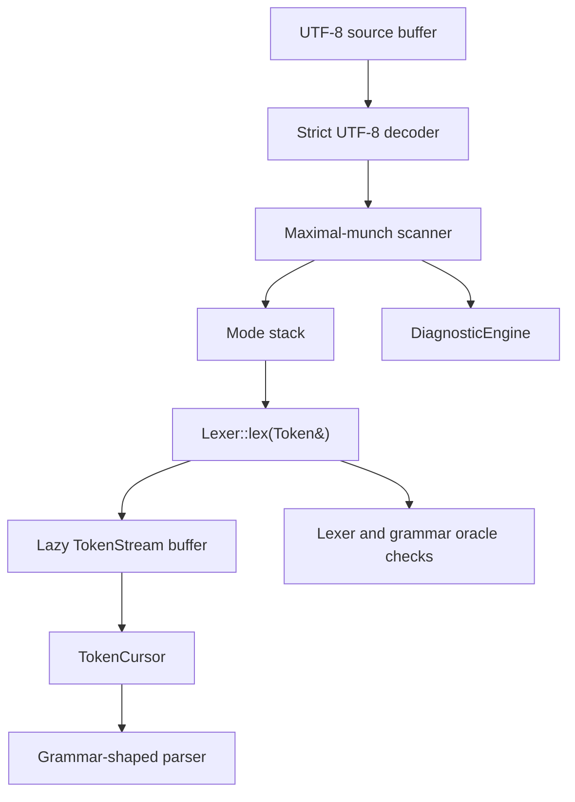
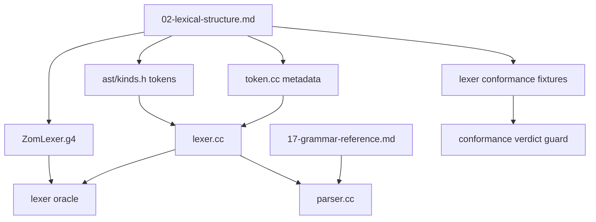
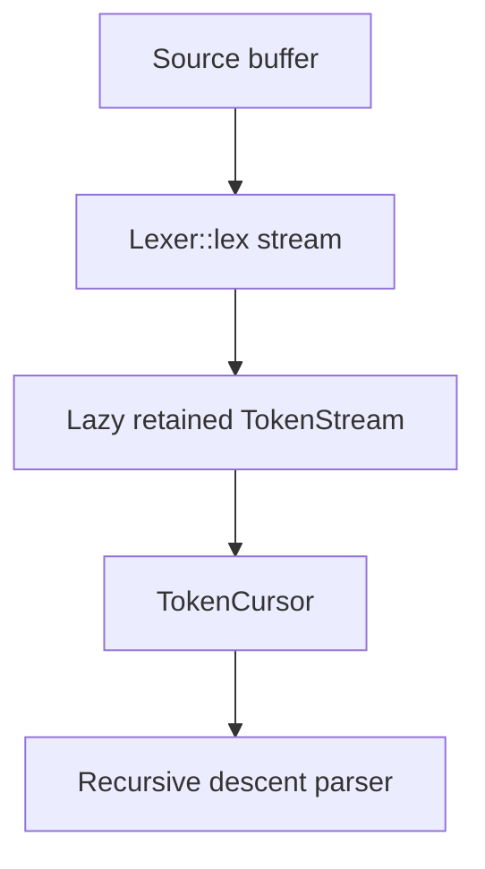

# RFC 0003: Lexer Architecture

## Summary

Define the ZOM lexer as a hand-written, deterministic, UTF-8 maximal-munch
scanner that produces the single authoritative token stream consumed by the
compiler parser, grammar oracle checks, diagnostics, and conformance tests.

## Motivation

RFC 0002 cannot be accepted while the parser input contract is underspecified.
The parser can only be grammar-shaped if the token stream has stable semantics:
the lexer must decide what text forms one token, which characters are valid
source text, how Unicode identifiers are classified, what token values are
canonicalized, and which state transitions are visible to speculative parsing.

The current repository has concrete drift:

- `docs/spec/chapters/02-lexical-structure.md` says `?:` is parsed as `?`
  followed by `:`, while the C++ lexer and `ZomLexer.g4` produce a single
  `ErrorDefault` token.
- `docs/spec/ZomLexer.g4` contains authority language that conflicts with RFC
  0002's grammar source model.
- Character literals are specified and have a token kind, but the C++ lexer
  currently returns single-quoted literals as `StringLiteral`.
- Historical parser-visible lexer state made speculative parsing depend on byte
  scanner rewinds. The accepted architecture removes that public compiler lexer
  surface instead of repairing it for parser use.
- `ZomLexer.g4` must reject unsupported compound attribute-start and range
  tokens instead of declaring token kinds without C++ lexer equivalents.

This RFC gives the lexer its own architecture contract so parser work can
depend on stable token semantics instead of inheriting ad hoc scanner behavior.

## Goals

- Specify the lexer algorithm: a single-pass UTF-8 scanner with ASCII fast
  paths, strict decoding, deterministic maximal munch, and no unbounded
  backtracking.
- Define the source-of-truth graph for lexical structure, generated grammar
  artifacts, token enums, C++ lexer behavior, token metadata, and conformance
  fixtures.
- Define the token stream model, including source offsets, canonical values,
  raw spelling recovery, trivia boundaries, and line-break flags.
- Define lexical modes for default source text, template literals, template
  substitution expressions, and future string-like modes.
- Define the stream-to-cursor handoff used by the compiler parser: the lexer
  streams source bytes into a retained lazy token buffer, and the parser
  consumes only `TokenCursor`.
- Define Unicode identifier policy, Unicode data ownership, invalid UTF-8
  diagnostics, and source normalization rules.
- Define tokenization for ambiguous or drift-prone spelling families:
  attributes, `::`, `?:`, character literals, templates, and right-angle
  splitting in type contexts.
- Delete public lexer rescanning APIs and parser-visible lexer state after the
  lazy stream contract is implemented.
- Reject parser-visible lexer snapshots for lookahead and speculative parsing.
- Define lexer error recovery and parser handoff so lexing errors prevent AST
  publication while still allowing parser diagnostics to continue.
- Define required validation: lexer unit tests, grammar oracle checks,
  conformance metadata, fuzzing, and spec-alignment gates.

## Non-Goals

- This RFC does not define parser grammar productions beyond the token stream
  they consume.
- This RFC does not define binder or checker semantics.
- This RFC does not add an incremental IDE lexer.
- This RFC does not make the compiler AST a lossless concrete syntax tree.
- This RFC does not preserve drifted token behavior as compatibility surface.
- This RFC does not introduce a second compiler lexer implementation.

## Prior Art

Clang uses a hand-written lexer with explicit source locations, diagnostic
integration, language-mode-sensitive lexing, and token splitting where parser
context requires it. ZOM should copy the direct control over source ranges and
diagnostics, but keep ZOM's scanner syntax-only rather than coupling lexing to
semantic analysis. Reference: <https://clang.llvm.org/docs/InternalsManual.html>.

Rust uses a small hand-written lexer and a separate token-tree layer. ZOM
should copy the principle that lexing is deterministic and cheap, and that
later parser layers can reinterpret delimited token structure without rerunning
the byte scanner. ZOM should not adopt Rust token trees as the compiler parser
input in this RFC. Reference:
<https://rustc-dev-guide.rust-lang.org/the-parser.html>.

Swift keeps lexer diagnostics source-positioned and separates source-preserving
syntax infrastructure from compiler semantics. ZOM should copy the phase
boundary and the discipline that trivia policy is explicit. ZOM does not need
Swift's full incremental syntax infrastructure for this compiler lexer.
Reference: <https://github.com/swiftlang/swift-syntax>.

Go's `go/scanner` demonstrates a compact scanner API that reports positions,
tokens, literals, and an error list deterministically. ZOM should copy the
simple observable contract, but keep richer token flags for Unicode, numeric
literal, and template behavior. Reference: <https://pkg.go.dev/go/scanner>.

Zig's tokenizer is a small deterministic state machine over UTF-8 source. ZOM
should copy the bias toward explicit scanner states and testable token
transitions. ZOM should keep ZOM-specific Unicode identifier and template
literal behavior rather than copying Zig's smaller language surface. Reference:
<https://ziglang.org/documentation/master/>.

## Guide-Level Explanation

Contributors change lexer behavior by updating the lexical specification, the
token enum and metadata, the C++ scanner, the executable grammar oracle, and
focused lexer/conformance tests in one logical change. There is no hidden token
compatibility layer.

For example, changing `?:` requires exactly one decision: it is either the
single `ErrorDefault` token everywhere, or it is two tokens everywhere. This RFC
chooses the single-token form. The lexical chapter, `ZomLexer.g4`, `kinds.h`,
`token.cc`, the C++ lexer, expression precedence tests, and conformance verdicts
must all agree.

The compiler lexer produces a stream of tokens. The parser observes that stream
through a lazy retained token buffer owned by `TokenStream`:

Whitespace and comments are not parser tokens. Their source ranges remain
available through token full-start offsets and side tables for directives. The
parser receives only language-significant tokens plus EOF.

## Reference-Level Design

### Source Of Truth

The lexical source of truth is split by responsibility:

- `docs/spec/chapters/02-lexical-structure.md` is the normative human lexical
  contract for tokens, keywords, whitespace, comments, Unicode identifiers, and
  literal spelling.
- `docs/spec/chapters/17-grammar-reference.md` is the normative human grammar
  contract for productions that consume tokens.
- `docs/spec/ZomLexer.g4` is an executable lexer oracle derived from the
  lexical chapter. It is not an independent authority.
- `products/zomlang/compiler/ast/kinds.h` defines the token enum consumed by
  C++ code.
- `products/zomlang/compiler/lexer/token.cc` defines static token spelling and
  token labels.
- `products/zomlang/compiler/lexer/lexer.cc` is the compiler lexer.
- Conformance metadata records expected accept/reject behavior for lexical and
  parser fixtures.

The source graph is:

Any conflict between these artifacts is a spec-alignment failure. Authority
comments in generated or executable artifacts must point back to the files
above and must not name obsolete design files.

### Public Lexer Contract

The compiler lexer consumes one UTF-8 source buffer and produces a deterministic
token stream ending in exactly one `EndOfFile` token.

The compiler parser sees a lazy token stream facade, not the byte scanner. The
handoff is:

The lexer exposes a streaming `lex(Token&)` operation for the parser token stream
and focused lexer tests. Parser grammar functions must not request byte-level
rescans or own lexer snapshots. `TokenStream` may retain already produced tokens
to provide stable absolute indices, source ranges, diagnostics, and
mark/rewind, but it must lex on demand rather than pre-lexing the whole file.

Each token stores:

- `kind`: one `ast::SyntaxKind` token or keyword kind
- `fullStart`: byte offset where leading trivia before the token begins
- `start`: byte offset where token text begins
- `end`: byte offset one past the token text
- `value`: canonical semantic value for identifiers and literals
- `flags`: lexical facts such as preceding line break, invalid escape,
  numeric separator, radix, unterminated literal, or raw-string mode

Raw spelling is not copied into every token. It is recovered from the source
buffer through `[start, end)`. Canonical `value` is used only where later phases
need a decoded or normalized semantic payload.

Lexing diagnostics are fatal to AST publication. The lexer may still emit an
`Unknown` token for local recovery, but `parser::Parser::parse()` must return
`zc::none` after any lexing error diagnostic.

### Lexer Algorithm

The scanner is a deterministic maximal-munch state machine over bytes:

1. Skip trivia while recording `fullStart`, line-break flags, and directive
   side-table entries.
2. Decode UTF-8 only when the ASCII fast path cannot classify the byte.
3. Select the longest valid token for the current mode.
4. Canonicalize token value when required.
5. Emit one token and advance at least one byte.

The scanner must not use regular-expression backtracking, parser callbacks, or
unbounded lookahead. All lookahead is bounded by the longest token prefix or by
the current literal/comment delimiter.

### UTF-8 And Unicode

Source files are UTF-8. The decoder rejects:

- overlong encodings
- truncated sequences
- invalid continuation bytes
- surrogate code points
- code points above U+10FFFF

A single invalid UTF-8 sequence emits a lexical diagnostic over the invalid byte
span and produces an `Unknown` token for local recovery. The compiler lexer does
not expose a binary-file marker token. A future binary-file heuristic must be
specified before it adds a dedicated token or diagnostic.

Identifier classification uses Unicode Standard Annex 31 identifier classes.
The implementation must use generated `XID_Start` and `XID_Continue` ranges,
plus the ZOM-specific ASCII additions `$` and `_` where the lexical chapter
allows them. The generated file must record the Unicode data version used to
produce the ranges. Updating that version is an explicit spec-alignment change
with fixture updates.

ZOM does not normalize source text before tokenization. Identifier identity is
byte-exact after escape canonicalization. Unicode escapes inside identifiers
are decoded to their UTF-8 scalar before keyword classification. Confusable
identifier warnings are a future semantic lint and are not part of the lexer
accept/reject contract.

### Trivia, Comments, And Directives

Whitespace and ordinary comments are trivia. They do not enter the parser token
stream. Their only parser-visible effects are:

- token `fullStart` offsets
- token `PrecedingLineBreak` flags
- directive side-table entries such as `zom-expect-error`

Doc comments are ordinary comments until a spec chapter gives them language
semantics. If doc comments later become semantic attributes, they must be added
through a separate RFC and converted into explicit syntax nodes or attribute
tokens.

The lexer recognizes LF, CR, CRLF, LS, and PS as line terminators. CRLF is one
line terminator for line-counting and preceding-line-break flags.

A UTF-8 byte order mark is allowed only at the start of a file and is skipped as
trivia. A shebang line is allowed only at byte offset zero and is skipped as
trivia. A later shebang spelling is an `Unknown` token plus diagnostic.

### Keywords

Keywords are classified after identifier escape canonicalization. Hard
keywords always produce keyword token kinds. Contextual keywords remain
`Identifier` tokens and are recognized by grammar-specific parser functions.
Reserved keywords produce dedicated token kinds only when the parser needs a
targeted diagnostic; otherwise unused reservations must be deleted from the
lexical chapter and token enum.

`ZomLexer.g4`, `lexer.cc`, `token.cc`, `kinds.h`, and the lexical chapter must
share one keyword inventory. Duplicated hand-written keyword tables are allowed
only if an automated check proves the inventories are identical.

### Punctuators And Operators

The lexer uses maximal munch for punctuators and operators. This RFC fixes the
drift-prone cases:

| Spelling | Token contract |
|---|---|
| `?:` | One `ErrorDefault` token. |
| `?!` | One `ErrorPropagate` token. |
| `!!` | One `ErrorUnwrap` token. |
| `?.` | One `QuestionDot` token only when not followed by a digit. |
| `::` | One `ColonColon` token. |
| `#[` | Not a compound token. It is `Hash` followed by `LeftBracket`; adjacency is checked by source offsets. |
| `..` and `..<` | Not tokens unless accepted by the grammar. Remove executable grammar tokens for them while they are unsupported. |
| `>>` and `>>>` | Maximal tokens in the lexer. Type-argument closing-angle splitting is a token-cursor overlay, not a lexer rescan. |

Right-angle splitting must not mutate the lexer. The token stream stores the
maximal token. In type contexts, `TokenCursor` may expose virtual `>` tokens
through a bounded split overlay that preserves the original source range and can
be rewound with the parser mark.

The split overlay is parser-side syntax interpretation, not lexing. The lexer
does not expose `reScanGreaterToken()` or any equivalent API after this RFC is
implemented. `TokenCursor::Mark` must restore split state exactly so tentative
type parsing can rewind without observing a different token sequence.

### Literals

Numeric literals are one token. The token value is canonical:

- decimal, binary, octal, and hexadecimal integer values are stored in a
  normalized base-10 form for AST construction
- bigint values keep the bigint marker in the canonical value
- floating-point values are canonicalized only after diagnostics have confirmed
  the literal is syntactically valid
- raw spelling is always recoverable from source range

Numeric separators are validated by the lexer. Invalid separators emit lexing
diagnostics and keep the token stream recoverable.

Double-quoted literals produce `StringLiteral`. Single-quoted literals produce
`CharacterLiteral` only when the content is exactly one Unicode scalar after
escape processing. Empty or multi-scalar single-quoted literals are lexical
errors unless the lexical chapter is changed before this RFC returns to review.

Escape handling is owned by the lexer. Invalid escapes set token flags and emit
diagnostics when the literal kind requires rejection. Extended Unicode escapes
must reject values above U+10FFFF and malformed braces.

Template literals use lexer modes:

- `Default`: normal source tokens
- `Template`: template body chunks
- `TemplateSubstitution`: nested source tokens inside `${...}`

The lexer tracks template brace depth inside substitutions and emits
`TemplateHead`, `TemplateMiddle`, and `TemplateTail` without parser-driven
rescanning of raw source bytes.

Template lexing is a mandatory lexer refactor. The parser must not maintain
template substitution state, template brace depth, or template tail detection.
The lexer owns a mode stack and emits the next template token by continuing
from its own scanner state. There is no parser call equivalent to
`reScanTemplateToken()` in the final public API.

### Lookahead Contract

Parser lookahead is token lookahead, not lexer snapshot restore. `TokenCursor`
marks store cursor position and cursor overlay state. Rewinding a parser mark
does not rewind the lexer byte offset; it only repositions the cursor inside the
retained token buffer.

The compiler frontend exposes no parser-visible raw lexer state API:

- `LexerState` is not used by parser code.
- `restoreState()` is absent from the public compiler lexer interface.
- `getCurrentState()` is absent from the public compiler lexer interface.
- `reScanGreaterToken()` and `reScanTemplateToken()` are absent from the public
  compiler lexer interface.
- Parser-facing token stream APIs do not expose `tokenCount()` or
  `tokenCountWithoutEof()` helpers that force the stream to EOF.
- `TokenCursor` does not expose whole-stream `size()`; LL(k) lookahead is
  expressed through bounded `peek(offset)` and `mark()` / `rewind()` operations.
- Any future lexer-internal snapshot API must be private to lexer tests or source
  ingestion tools and must not become a parser dependency.

### Lexer Errors And Recovery

Lexing errors are diagnostics with source ranges. The lexer must make progress
after every error by consuming at least one byte or by emitting EOF. The lexer
must never enter a loop on malformed UTF-8, unterminated comments, unterminated
strings, invalid escapes, or invalid numeric separators.

Lexer recovery uses local tokens only:

- invalid single byte or malformed UTF-8 sequence -> `Unknown`
- unsupported punctuation -> `Unknown`
- unterminated string/template/comment -> token with `Unterminated` flag plus
  diagnostic, then EOF or next safe delimiter according to the literal mode
There is no binary-file marker token in this architecture. Binary-file
detection, if added later, must be specified as an explicit source ingestion
step rather than inferred from a single malformed UTF-8 scalar.

The parser may continue after `Unknown` to emit additional diagnostics, but any
lexing error prevents public AST publication.

### Generated Artifacts

`docs/spec/ZomLexer.g4` may remain as an executable oracle, but it is derived
from the lexical chapter and the token enum. Generated Java artifacts are not
linked into the compiler. If generated artifacts remain checked in, they must
be regenerated from the committed grammar and no auxiliary `.tokens` or
`.interp` files may drift from the grammar generation policy.

### Verification And Fuzzing

The lexer must have focused unit tests for:

- every multi-character punctuator
- every keyword and reserved keyword
- `?:`, `?!`, `!!`, `?.`, `::`, `#[`, `>>`, and `>>>`
- UTF-8 valid and invalid boundary cases
- Unicode identifier start and continue characters
- identifier escapes and escaped keywords
- numeric separators and radix literals
- string, character, template, and invalid escape cases
- shebang and BOM handling
- snapshot restore with diagnostics suppressed

Fuzzing must include byte-level malformed UTF-8 and nested template
substitutions. The fuzzer oracle is termination, bounded diagnostics, and token
stream invariants, not semantic correctness.

## Repository Impact

| Area | Paths | Owner |
|---|---|---|
| RFC governance | `docs/rfc/0003-lexer-architecture.md`, `docs/rfc/README.md` | `rfc` |
| Lexer and parser token contract | `products/zomlang/compiler/lexer/**`, `products/zomlang/compiler/parser/**`, `products/zomlang/compiler/ast/kinds.h`, `docs/spec/ZomLexer.g4`, `docs/spec/chapters/02-lexical-structure.md`, `docs/spec/chapters/17-grammar-reference.md` | `lexer-parser` |
| Diagnostics | `products/zomlang/compiler/diagnostics/**`, `docs/spec/chapters/11-error-handling.md` | `error-system` |
| Spec alignment | `docs/spec/**`, `docs/reports/*spec-alignment*` | `spec-audit` |
| Tests and verification | `products/zomlang/tests/**`, `examples/**`, `docs/reports/*coverage*` | `verification` |

## Security And Safety Impact

The lexer is not a sandbox boundary, but it is the first compiler trust
boundary. Malformed UTF-8, binary input, unterminated literals, and invalid
token splitting must not cause out-of-bounds reads, infinite loops, or
diagnostic ranges that point outside the source buffer.

Unicode policy also has user safety impact. This RFC keeps identifier identity
byte-exact after escape canonicalization and leaves confusable warnings to a
future semantic lint so the lexer remains deterministic and syntax-focused.

## Drawbacks And Risks

- This RFC forces token drift to be fixed before parser architecture can be
  accepted.
- Updating token spelling contracts will churn grammar oracle fixtures and AST
  lit expectations.
- Moving right-angle splitting from lexer rescanning to token-cursor overlay
  requires careful source-range tests.
- Removing public rescan and raw snapshot APIs will force parser and tests to
  move to the lazy stream contract in one refactor instead of carrying a
  compatibility path.
- Moving template substitution state entirely into the lexer requires nested
  template and malformed-template fuzz coverage.
- Using generated Unicode data requires a repeatable generation workflow and
  an explicit upgrade process.
- Keeping `ZomLexer.g4` as an oracle means the project must maintain two lexer
  descriptions until a later RFC removes the executable grammar.

## Alternatives Considered

Continue with the current C++ lexer and patch individual drift. This is
rejected because parser correctness depends on stable token semantics; local
patches cannot define Unicode policy, state snapshots, or token splitting.

Use ANTLR-generated lexer output as the compiler lexer. This is rejected
because the compiler needs direct `zc` ownership, source ranges, diagnostic
IDs, and parser token-stream integration. ANTLR remains useful as an executable
oracle.

Emit a lossless token stream with all comments and whitespace as parser tokens.
This is rejected for the compiler parser because it would pollute syntax
functions with formatting trivia. Full lossless syntax belongs to a later IDE
or formatter design.

Normalize all identifiers to NFC in the lexer. This is rejected for this RFC
because it changes symbol identity and requires a broader language-level
decision. The lexer may add a future lint hook, but it must not silently change
identifier identity.

Keep `#[` as a compound token. This is rejected because attribute adjacency can
be checked from source offsets while keeping `Hash` and `LeftBracket` ordinary
tokens. A compound token would create unnecessary drift with parser recovery
around malformed attributes.

Keep public lexer rescan APIs for parser convenience. This is rejected because
it keeps two tokenization authorities alive: the retained token stream and the
mutable byte scanner. Parser context must be expressed through `TokenCursor`
overlays, not by asking the lexer to reinterpret already emitted source bytes.

## Compatibility And Rollout

ZOM is pre-stability, so lexical drift is fixed in place. There is no
compatibility mode.

Rollout order:

1. Return RFC 0002 until this RFC reaches `REVIEW`.
2. Reconcile the lexical chapter with this token contract.
3. Remove conflicting authority comments and unsupported tokens from
   `ZomLexer.g4`.
4. Add missing token enum values and metadata for accepted compound tokens.
5. Rewrite the C++ lexer around the token contract where current behavior
   differs.
6. Introduce a lazy `TokenStream` that consumes the lexer stream on demand and
   retains produced tokens for cursor indices, diagnostics, and source ranges.
7. Move template literal state, substitution brace depth, and template tail
   emission fully into lexer modes.
8. Delete parser use of `LexerState`, `restoreState()`, `getCurrentState()`,
   `reScanGreaterToken()`, and `reScanTemplateToken()`.
9. Replace raw-pointer public lexer snapshots with offset and mode snapshots
   only where current non-parser tests or tools still need snapshots.
10. Move right-angle splitting to `TokenCursor` and verify mark/rewind restores
    split state.
11. Add lexer unit tests, lazy token-stream tests, token-cursor split tests,
    conformance fixtures, and malformed-template fuzz cases.
12. Regenerate only grammar oracle artifacts that are intended to be checked in.
13. Run the full RFC, spec-alignment, lexer, parser, conformance, format, and
    sanitizer gates.

Rollback cost is moderate before step 5 and high after token enum and fixture
changes land, because parser and AST tests will depend on the new token stream.

## Documentation And Teaching Plan

The implementation must update:

- `docs/spec/chapters/02-lexical-structure.md` for token spelling, Unicode,
  literal, trivia, and error-token policy.
- `docs/spec/ZomLexer.g4` comments and rules to match the lexical chapter.
- `docs/spec/chapters/17-grammar-reference.md` where grammar terminals change.
- Parser contributor notes for token splitting and attribute adjacency.
- Conformance documentation for lexer oracle and grammar oracle verdicts.
- Generated Unicode data documentation with the pinned source version and
  generation command.

## Operational Readiness

CI must expose:

- RFC structure checks.
- Spec-alignment checks for lexer tokens and keywords.
- Lexer unit tests.
- Grammar oracle lexer checks when `ZomLexer.g4` remains.
- AST and grammar conformance checks.
- Fuzz or stress tests for malformed UTF-8, unterminated literals, and nested
  template substitutions.
- Format checks.
- Sanitizer build and test coverage for lexer changes.

Performance must remain linear in source byte count. Accepted files must not
require parser callbacks or repeated raw-source lexing for lookahead.

## Acceptance Criteria

- `02-lexical-structure.md`, `ZomLexer.g4`, `ast/kinds.h`, `token.cc`, and
  `lexer.cc` agree on every token and keyword.
- `ZomLexer.g4` contains no conflicting source-of-truth comments and no
  unsupported reserved tokens.
- `?:` is a single `ErrorDefault` token across spec, lexer, parser, and tests.
- `?!` and `!!` are emitted by the lexer and consumed by the parser postfix
  loop.
- `#[` is represented as adjacent `Hash` and `LeftBracket` tokens, with
  adjacency checked by source offsets.
- `::` is implemented as a single `ColonColon` token everywhere.
- Single-quoted literals produce `CharacterLiteral` only for exactly one
  Unicode scalar; invalid forms emit lexer diagnostics.
- Invalid UTF-8 diagnostics are source-ranged and recover through local
  `Unknown` tokens rather than collapsing the whole file.
- Public compiler lexer snapshots are absent; parser speculation uses
  `TokenCursor::mark()` and `rewind()`.
- The parser consumes a lazy token stream backed by `Lexer::lex(Token&)`; it does
  not pre-lex the file and does not call lexer rescan or state restore APIs.
- Template literals are lexed through explicit modes without parser-driven raw
  source rescanning.
- Template substitution brace depth is tracked by the lexer, not by
  `Parser::Impl::lexAll()` or any parser helper.
- Right-angle splitting for type contexts is implemented in `TokenCursor` over
  retained stream tokens.
- `TokenCursor` mark/rewind restores active right-angle split state exactly.
- The parser facade and parser implementation do not call `LexerState` or
  `restoreState()` for syntactic lookahead.
- `reScanGreaterToken()` and `reScanTemplateToken()` are absent from the public
  compiler lexer interface.
- No parser source file contains calls to lexer rescan, lexer state restore, or
  current lexer state inspection.
- Lexer unit tests cover every multi-character punctuator, keyword, Unicode
  identifier class, invalid UTF-8 case, and literal class named in this RFC.
- Grammar and AST conformance verdicts have no lexer-driven mismatches.
- `python3 scripts/check-rfc.py` passes.
- `python3 scripts/check-format.py` passes.
- `cmake --build --preset sanitizer` passes.
- `ctest --preset default --output-on-failure` passes, except unrelated tracked
  failures explicitly documented outside this RFC.

## Implementation Plan

1. Keep this RFC in `REVIEW` while owners validate the token contracts and
   Unicode policy.
2. Reconcile the lexical chapter, `ZomLexer.g4`, token metadata, C++ lexer, and
   conformance metadata for every accepted token spelling.
3. Add the lazy token stream and make parser construction consume `TokenCursor`
   instead of pre-lexing the full file.
4. Implement lexer-owned template modes and delete parser template rescan
   state.
5. Delete public lexer rescanning APIs and remove parser-visible raw lexer
   state from syntax parsing.
6. Replace or remove lexer snapshots so any remaining snapshot API is
   offset-based, mode-aware, diagnostic-suppressed, and unused by parser code.
7. Implement `TokenCursor` right-angle split mark/rewind tests with `>>` and
   `>>>` in nested type-argument contexts.
8. Generate Unicode identifier data from a named UCD release and check the
   generator/provenance into the repository.
9. Add focused lexer, lazy token-stream, parser handoff, conformance, and fuzz
   tests.
10. Use the acceptance criteria above and the test plan below as the gate for
    advancing beyond `REVIEW`.
11. Advance RFC 0002 only while this lexer contract remains review-ready.

## Test Plan

- Build: `cmake --preset sanitizer` and `cmake --build --preset sanitizer`.
- Unit tests: focused lexer tests and token-cursor split tests through
  `ctest --preset default -R unittest --output-on-failure`.
- Parser handoff: focused parser tests prove parser construction consumes the
  lazy token stream and contains no lexer state or rescan calls.
- Lit tests: AST lit tests that depend on tokenization through
  `ctest --preset default -R conformance-ast --output-on-failure`.
- Conformance: grammar and AST coverage through
  `ctest --preset default -R conformance --output-on-failure`.
- Generated files: regenerate and verify `ZomLexer.g4` outputs if generated
  artifacts remain checked in.
- RFC: `python3 scripts/check-rfc.py`.
- Format: `python3 scripts/check-format.py`.
- Drift: spec-alignment inventory for lexer tokens, grammar terminals, parser
  token consumption, token metadata, and diagnostics.
- Fuzzing: malformed UTF-8, unterminated literals, invalid escapes, nested
  template substitutions, and random punctuation streams must terminate with
  bounded diagnostics.

## Open Questions

None

## Status History

| Date | Status | Notes |
|---|---|---|
| 2026-07-01 | DRAFT | Initial lexer architecture draft. |
| 2026-07-01 | REVIEW | Filled review metadata and resolved lexer architecture open questions for Unicode data ownership, character literals, and generated ANTLR artifacts. |
| 2026-07-02 | REVIEW | Added parser handoff gate that forbids parser-side lexer state lookahead. |
| 2026-07-02 | REVIEW | Expanded the required lexer refactor contract for lazy stream handoff, template modes, rescan API removal, snapshot removal, and cursor-owned right-angle splitting. |
| 2026-07-02 | REVIEW | Implemented the lazy stream parser handoff: parser code consumes `Lexer::lex(Token&)` through `TokenStream` and `TokenCursor`; parser-side eager tokenization, public lexer state restore, and parser-visible rescan APIs are absent. |
| 2026-07-02 | REVIEW | Generated Unicode identifier tables from UCD 15.1.0 and added lexer architecture gates for generator provenance, lazy stream design docs, public lexer API shape, and template-mode state ownership. |
| 2026-07-02 | REVIEW | Added the five-way token inventory gate across the lexical specification, `ZomLexer.g4`, `SyntaxKind`, keyword classification, and static token text; removed unlexable token kinds and aligned `_` as the wildcard token instead of an identifier. |
| 2026-07-02 | REVIEW | Removed parser-facing force-EOF token counting from the lazy stream handoff: parser code no longer calls `tokenCount()` or `tokenCountWithoutEof()`, and `TokenCursor` exposes no whole-stream `size()`. |
| 2026-07-03 | REVIEW | Revalidated the lexer-parser handoff gates after parser verdict reconciliation: right-angle splitting remains cursor-owned, lexer architecture checks pass, lexer/token focused tests pass, and full grammar conformance passes locally. Advancement beyond `REVIEW` still requires owner approval and a recorded decision. |
| 2026-07-03 | REVIEW | Strengthened the token inventory gate with a data-driven lexer round-trip unit test for every static token spelling, dynamic literal token marker checks, and `02-lexical` conformance metadata pairing inside `scripts/check-lexer-architecture.py`. |
| 2026-07-03 | REVIEW | Added a focused template-substitution brace-depth lexer test and strengthened the architecture gate so parser sources cannot depend on raw lexer buffer state, parser-visible snapshots, or template rescan APIs. |
| 2026-07-03 | REVIEW | Verified the lexer architecture slice with `python3 scripts/check-rfc.py`, `python3 scripts/check-format.py`, `python3 scripts/check-lexer-architecture.py`, `cmake --build --preset sanitizer`, and `ctest --preset default --output-on-failure` passing locally. |
| 2026-07-03 | REVIEW | Expanded lexer unit test matrix to 109 tests across 9 files: added `lexer-identifier-test.cc` (26 tests covering ASCII identifiers, Unicode XID_Start/XID_Continue, invalid starts, identifier-keyword boundary) and `lexer-utf8-test.cc` (18 tests covering invalid bytes, overlong encodings, surrogate halves, codepoints above U+10FFFF, truncated sequences, invalid continuation bytes, recovery across multiple invalid sequences, null bytes, valid sequence sanity, and diagnostic emission). Extended `lexer-literal-test.cc` with multiple template substitutions (`${a} + ${b} = ${c}`), object literal in substitution (`${{x: 1}}`), Unicode string content, Unicode character literals, empty single-quoted (invalid), and multi-scalar single-quoted (invalid). Extended `lexer-operator-test.cc` with `>>>=` operator test. |
| 2026-07-03 | REVIEW | Reorganized `getKeywordKind()` in `utils.cc` into a single alphabetically sorted block eliminating duplicate keyword entries; fixed `>>>` token static text in `token.cc`. All 35 unit tests, 10 lexer/token/conformance tests, and `check-lexer-architecture.py` pass. |
| 2026-07-03 | REVIEW | Removed `BooleanLiteral` from `kinds.h` LEXICAL TOKENS section — it was never produced by the lexer (`true`/`false` are `TrueKeyword`/`FalseKeyword`, consistent with `NullKeyword`). Token inventory now clean: no phantom lexical tokens. |
| 2026-07-04 | REVIEW | Confirmed `#[` two-token design: `Hash` + `LeftBracket` are lexed independently and detected as attribute start via source-range adjacency check in the parser. This matches Rust's proven design pattern, provides better error recovery (can report partial matches), and preserves `#` for future syntax extensions. Verified with 24 attribute conformance tests including `# [foo]` whitespace rejection. |
| 2026-07-05 | ACCEPTED | All acceptance criteria verified: five-way token inventory agreement (`02-lexical-structure.md`, `ZomLexer.g4`, `kinds.h`, `token.cc`, `lexer.cc`), single `ErrorDefault` token for `?:`, `?!`/`!!` postfix operators, `#[` two-token design with adjacency check, `::` single `ColonColon` token, character literal single-scalar rule, UTF-8 source-ranged diagnostics with `Unknown` recovery, no public lexer snapshots, lazy `TokenStream` backed by `Lexer::lex(Token&)`, template literal lexer-owned modes, template substitution brace depth tracked by lexer, right-angle splitting in `TokenCursor`, no parser calls to lexer state/rescans, `reScanGreaterToken()` absent, `reScanTemplateToken()` absent, 109 lexer unit tests across 9 files, zero lexer-driven conformance mismatches, `check-rfc.py` passing, `check-format.py` passing, `check-lexer-architecture.py` passing (UCD 15.1.0, 660 ID start ranges, 769 ID part ranges), 742/742 ctest passing. |
| 2026-07-05 | IMPLEMENTING | Lexer implementation complete and verified across all gates. |
| 2026-07-05 | LANDED | Implementation, tests, and documentation complete. Lexer architecture fully landed with 742/742 ctest passing, all verification gates green. |
