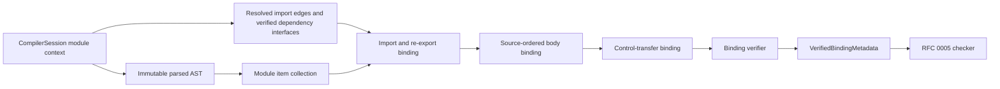
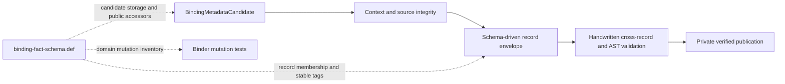

# RFC 0004: Binder Architecture

## Summary

This RFC defines binding as the deterministic compiler phase that consumes one
parsed module plus a session-shaped input, creates explicit lexical scopes,
consumes a frozen canonical definition inventory, and resolves every
name-bearing syntax node to a definition, import binding, label, or
checker-owned deferred member fact. A successful run publishes immutable
`VerifiedBindingMetadata`; the checker never consumes mutable or partial
binder state.

The session owns package, crate, module, source, and semantic-context identity,
module discovery, import graph validation, and scheduling. The binder owns
module declaration collection, source-ordered local binding, lexical name
resolution, import and re-export alias facts, label resolution, and initial
closure free-variable facts. Type-directed member selection, capture modes,
coercions, trait dispatch, and visibility rules that require types belong to
later phases.

## Motivation

Binding is the first phase where syntax becomes stable semantic identity. A
local table index, object address, rendered name, or hash-map iteration order
cannot safely identify a declaration across modules, parallel schedules,
checked facts, or IR layers.

The live implementation demonstrates the risks this contract must eliminate:

- scope identity is an insertion-ordered `uint32_t` allocated by the mutable
  `ScopeManager`;
- semantic bindings remain coupled to mutable `SymbolTable` entries and
  source-order allocation;
- source provenance can use a synthetic zero buffer;
- module loading and missing-module behavior are hidden inside binder helpers;
- import aliases may allocate unrelated symbols without a canonical-target
  link;
- module item hoisting and source-ordered local declaration activation are not
  represented as distinct operations;
- only part of the documented capture, label, shadow, and import metadata is
  behaviorally verified.

RFC 0010 requires a verified checked-module handoff with canonical binding
identities. RFC 0011 therefore provides the identity context first; this RFC
defines a session-shaped binding input and the complete output consumed by RFC
0005. RFC 0008 later supplies that input across a real module graph.

## Goals

- Use RFC 0011 `SemanticContextBrand`, `PackageId`, `CrateId`, and `ModuleId` for
  every binding operation.
- Produce deterministic `DefinitionKey` inventory and obtain RFC 0011 `DefId`
  values, while assigning `ScopeId` and `LabelId` without object addresses,
  spelling-based identity, or insertion-order dependence.
- Permit module-item forward references while rejecting local value use before
  declaration.
- Resolve current Chapter 13 import forms against session-provided module
  surfaces; do not load files inside the binder.
- Preserve canonical definition identity through imports and re-exports while
  retaining alias-site provenance for diagnostics.
- Publish complete immutable facts only through a verifier.
- Keep type-directed lookup, method dispatch, and capture modes outside the
  binder.
- Define executable acceptance and determinism gates.

## Non-Goals

- RFC 0008 owns file discovery, stable module-query staging, and deterministic
  module scheduling. RFC 0026 owns the stable `ModuleGraph` and
  `ModuleGraphScc` queries. This RFC owns only the final-snapshot bridge that
  materializes their verified stable topology into revision-local Binder
  handles.
- This RFC does not infer or check types; RFC 0005 owns semantic types and
  checked facts.
- This RFC does not select interface methods, operator implementations,
  witnesses, or vtable slots; RFC 0009 owns checked call targets.
- This RFC does not infer borrow regions or final closure capture modes; RFC
  0007 owns those facts.
- This RFC does not define new import, export, module, declaration, or label
  syntax.
- Binder consumers receive only canonical branded identities.

## Prior Art

### Rust Definitions And Resolutions

Rust assigns crate-relative definition identities and records name-resolution
results before type checking. ZOM should copy the separation between lexical
resolution and type-dependent method resolution, plus the rule that stable
definition identity is not a symbol-table pointer. Rust block items are visible
throughout their enclosing block, while a nested item does not implicitly
capture the dynamic environment. ZOM adopts that activation and capture
boundary for block-scoped named functions.

References:

- <https://rustc-dev-guide.rust-lang.org/name-resolution.html>
- <https://rustc-dev-guide.rust-lang.org/ty.html#the-key-types>
- <https://doc.rust-lang.org/reference/items.html>
- <https://doc.rust-lang.org/reference/names/scopes.html>
- <https://doc.rust-lang.org/reference/statements.html>

### Swift Declaration Contexts

Swift organizes declarations in explicit contexts and resolves names before
constraint solving. ZOM should copy the contextual ownership boundary and
avoid making a textual qualified name the declaration identity.

Reference: <https://www.swift.org/documentation/swift-compiler/>

### Clang Declaration Contexts

Clang separates declaration ownership, lookup tables, and source locations.
ZOM should copy the distinction between a declaration's canonical identity and
additional declarations or aliases that refer to it.

Reference: <https://clang.llvm.org/docs/InternalsManual.html>

### MLIR Declarative Records And Verification

MLIR Operation Definition Specification keeps repetitive record mechanics in a
declarative schema, generates local structural checks, and leaves cross-field
semantic invariants in handwritten verifiers. ZOM copies that division: one
Binder fact schema owns membership, stable tags, publication, domains, and
mutation obligations, while C++ record payloads and AST-sensitive validation
remain explicit. ZOM uses an in-tree C++ definition file instead of adding a
second compiler or a general-purpose schema language.

References:

- <https://mlir.llvm.org/docs/DefiningDialects/Operations/>
- <https://mlir.llvm.org/docs/DefiningDialects/>
- <https://llvm.org/docs/TableGen/>

### Go Scopes

Go binds package declarations independently from source-ordered block
declarations. ZOM should copy the explicit distinction between package/module
visibility and local lexical activation.

Reference: <https://go.dev/ref/spec#Declarations_and_scope>

### Retained Access Facts

Rust and Swift attach access control to declarations and apply permission rules
at use sites. ZOM copies that separation: the Binder retains one closed member-
visibility fact, while the checker owns later access-context enforcement. The
Binder never encodes access control as an open-ended flag set.

References:

- <https://doc.rust-lang.org/reference/visibility-and-privacy.html>
- <https://docs.swift.org/swift-book/documentation/the-swift-programming-language/accesscontrol/>

### Explicit Receiver Parameters

Rust methods, Go method declarations, Zig namespaced functions, and C++23
explicit object member functions all place an explicit receiver before ordinary
parameters. ZOM copies that leading-position rule: `this` is unique, must be the
first parameter, and cannot have a default value. The parser rejects later
receivers with `ZOM2093` and receiver initializers with `ZOM2094` before binding.

References:

- <https://doc.rust-lang.org/reference/items/associated-items.html#methods>
- <https://go.dev/ref/spec#Method_declarations>
- <https://ziglang.org/documentation/0.15.2/#struct>
- <https://www.open-std.org/jtc1/sc22/wg21/docs/papers/2021/p0847r7.html>

### Common Failure Modes

This design prevents three common failures:

1. Pointer or insertion-order identities change when scheduling changes. ZOM
   allocates identities from canonical module and source order.
2. Hoisting every declaration makes local use-before-declaration compile. ZOM
   hoists only module items and activates local values at their declaration
   point.
3. Import aliases become distinct semantic targets. ZOM records both the local
   alias definition and the canonical target definition.

## Guide-Level Explanation

Module declarations are visible throughout their module:

```zom
fun entry() -> i32 {
    return helper();
}

fun helper() -> i32 {
    return 42;
}
```

Local values become visible only after declaration:

```zom
fun example() -> i32 {
    let result = 42;
    return result;
}
```

Imports bind explicit module namespaces or selected exported definitions:

```zom
import math::geometry as geo;
import math::geometry::{Point as GeoPoint, distance};
```

A reference to `GeoPoint` records the local import-alias provenance and the
canonical `DefId` of `math::geometry::Point`. Re-export chains retain every
export site for diagnostics while semantic consumers use the original
canonical target.

The binder does not decide what `value.draw()` calls. It binds `value`, records
the member spelling and source span as a deferred member fact, and leaves the
type-directed target to RFC 0005 and RFC 0009.

## Reference-Level Design

### Pipeline Boundary



The binder entry point accepts one immutable input:

```text
BindingInputCandidate {
  semanticContext: SemanticContextBrand,
  package: PackageId,
  crate: CrateId,
  module: ModuleId,
  parsedModule: VerifiedParsedModule,
  definitions: FrozenDefinitionInventoryView,
  moduleGraph: VerifiedModuleGraphView,
  dependencySurfaces: SortedMap<ModuleId, VerifiedExportSurface>,
  preludeSurface: Maybe<VerifiedExportSurface>,
}
```

```text
VerifiedParsedModule {
  sourceFile: SourceFileId,
  contentDigest: Sha256Digest,
  byteLength: uint64,
  tree: const ast::Tree,
  retainedTokens: Sequence<RetainedTokenProvenance>,
  parserReceipt: ParsedModuleReceipt,
}

RetainedTokenProvenance {
  kind: SyntaxKind,
  rawSource: SourceSpan,
  canonicalText: String,
}
```

The parse driver first constructs a move-only `UnbrandedParsedModule` while
parsing the immutable source snapshot. It contains the structural RFC 0011
`SourceFileKey`, exact content digest and length, immutable tree, parser schema
digest, deterministic AST schema dump receipt, and parser-issued retained token
provenance, but no `SourceFileId`. A successful single-use parser may issue
exactly one `ParsedTokenSnapshot`. Admission requires that snapshot to name the
same `SourceManager` and buffer, contain one final EOF token at the exact source
length, and contain non-empty, ordered, non-overlapping non-EOF ranges. Each
record owns its lexer-canonical text, so escaped keywords and identifiers retain
their complete raw token span without borrowing the parser string pool. Raw
`TokenStream` copies carry no admission authority.

After the source registry freezes, `ParsedModulePromoter` matches that
structural key to its issued `SourceFileId`, revalidates the unchanged snapshot
and receipt, and constructs `VerifiedParsedModule` without reparsing, cloning,
or mutating the tree. Token records move through promotion unchanged. An ordinal
token query succeeds only when the requested AST node starts at a retained token,
the indexed token has the requested `SyntaxKind`, and its complete range is
contained by that node. `sourceLocFor` converts only a same-source, in-bounds
span start back to the admitted parser buffer.

`ParsedModuleReceipt` is SHA-256 over
`ASCII("zom.parsed-module")`, one zero byte, the expanded `SourceFileKey`,
exact source content digest, byte length, parser schema digest, and deterministic
AST schema dump bytes. Every fixed-width integer uses unsigned big-endian
encoding. Digests contribute their 32 raw bytes, the expanded `SourceFileKey`
contributes its already-canonical bytes, and the AST schema dump is one RFC 0011
byte string: `uint64be(length)` followed by the exact dump bytes. Promotion
verifies every node belongs to this tree and every valid half-open node range is
bounded by the same source snapshot. No caller can pair an arbitrary tree with
a source ID or promote a different tree under a retained receipt. Retained token
records are derived from the same immutable source by the successful parser
capability and are not an additional field in the canonical receipt preimage.

The independent receipt oracle uses expanded source-file bytes `a1`, content
digest as 32 bytes of `22`, byte length `3`, parser-schema digest as 32 bytes of
`33`, and AST schema dump bytes `xyz`. Its complete 105-byte preimage is
`7a6f6d2e7061727365642d6d6f64756c6500a1222222222222222222222222222222222222222222222222222222222222222200000000000000033333333333333333333333333333333333333333333333333333333333333333000000000000000378797a`
and its SHA-256 is
`7a4ab18a31387244311bd2a1b1472350536140c89532ce64240d7670d5a20b8e`.
Changing component framing, omitting the dump length, or hashing a local
`SourceFileId` slot must fail the oracle.

Only `BindingInputVerifier` converts this candidate to `VerifiedBindingInput`,
the binder's actual entry type. Every identity must belong to the same semantic
context; the graph view must expose one complete globally verified acyclic
module graph; every complete source surface must match one
graph target and revision; and every import/re-export alias must match its
frozen inventory `DefId`. The verifier constructs requester-filtered views only
after comparing each requested name against the complete source surface. A
failure publishes no binder input. The binder performs no filesystem access
and cannot create a module, definition, impl identity, or module-graph edge.

`PrebindingIdentityCollector` is the sole producer of frozen inventories. It
runs once per semantic context after RFC 0011 source and module freeze and before
any `VerifiedBindingInput` publication. It receives every selected
`VerifiedParsedModule`, sorts modules by expanded `ModuleKey`, walks the complete
AST schema of every module, collects all `DefinitionKey` and `ImplKey` values,
then performs exactly one context-global definition freeze and one impl freeze.
Only after both freezes does it resolve handles and split the immutable result
into per-module views:

```text
PatternBindingSite {
  introducer: NodeId,
  patternPath: Sequence<uint32>,
}

DefinitionSite =
  Declaration { node: NodeId }
  PatternBinding { site: PatternBindingSite }

FrozenDefinitionInventoryView {
  semanticContext: SemanticContextBrand,
  module: ModuleId,
  modules: SortedMap<NodeId, ModuleId>,
  definitions: SortedMap<DefinitionSite, DefId>,
  impls: SortedMap<NodeId, ImplOccurrenceId>,
  implOccurrences: SortedSequence<FrozenImplOccurrenceEntry>,
}
```

RFC 0018 defines the implementation occurrence bridge used here:

```text
FrozenImplOccurrenceEntry {
  occurrence: ImplOccurrenceId,
  key: ImplSourceOccurrenceKey,
  authority: ImplId,
  node: NodeId,
}
```

Implementation candidates group by their complete retained
`ImplIdentityRecord` before handle admission. Every group admits one shared
`ImplId` authority, and every source occurrence receives one context- and
module-branded `ImplOccurrenceId`. Occurrence handles are dense within one
frozen module in canonical `IdentitySyntaxSiteKey` source order. `impls` is a
bijection between implementation syntax nodes and occurrence handles;
`implOccurrences` is the dense, sorted, duplicate-free entry inventory. Every
entry repeats the shared authority and complete `ImplSourceOccurrenceKey` for
its source node. The occurrence handle is a revision-local materialization
handle, not a semantic identity, persistence key, provider root, or field of a
stable codec.

`Declaration` covers every RFC 0011 inventory row that assigns one `DefId` to
one syntax node, including import and re-export specifiers. `PatternBinding`
covers every name introduced below a `VariableDeclarator`, match arm, loop, or
other pattern introducer. `patternPath` is the sequence of schema field ordinals
and list-element indices from the introducer's pattern root to that binding leaf;
it is empty only when the pattern root itself is the leaf. Paths sort
lexicographically by unsigned component value. One introducer may therefore map
to multiple `DefId` values without inventing container identity.

Root and inline `ModuleDeclaration` nodes occur only in `modules` and receive no
`DefId`. Alias module declarations occur in `definitions`. Standalone impl and
marker impl nodes occur only in `impls` and `implOccurrences`.
`VariableDeclarator`, `ExternBlock`,
declaration-list containers, attributes, and every other RFC 0011 no-identity
row occur in none of the three maps. The collector's schema gate requires every
identity-producing syntax node or pattern leaf in exactly one applicable map and
rejects every unexpected entry before freeze. The binder only consumes this
view; it cannot insert a late identity. Reverse module registration and worker
permutations must produce the same global sorted keys, handles, per-module views,
and dumps. A second freeze or any key discovered after freeze is the exact RFC
0011 `PostFreezeMutation` invariant.

Import/export handoff records are exact:

```text
ModuleDependencyKind = Import | ForeignReexport | ModuleAlias | Prelude

ModuleSyntaxDependencySite {
  node: NodeId,
  span: SourceSpan,
  schemaPreorderOrdinal: uint32,
}

ModuleDependencyRequest =
    Source {
      requester: ModuleId,
      key: ModuleResolutionKey,
      syntaxSites: NonEmptySequence<ModuleSyntaxDependencySite>,
    }
  | Prelude {
      requester: ModuleId,
      key: ModuleResolutionKey,
      selectedTarget: ModuleKey,
    }

ModuleDependencyEdgeKey {
  requester: ModuleKey,
  dependency: ModuleKey,
}

ModuleSearchRoot =
  Workspace { crate: CrateKey,
              root: CanonicalWorkspaceRelativePath }
  Package { crate: CrateKey,
            package: PackageKey,
            root: CanonicalRelativePath }
  Generated { crate: CrateKey,
              producer: BuildScriptOutputKey,
              root: CanonicalRelativePath }
  ToolchainCore { crate: CrateKey,
                  distributionDigest: Sha256Digest }

ModuleDependencyAliasRootKey {
  requester: CrateKey,
  alias: DependencyAlias,
}

ModuleResolutionEnvironmentRecord {
  searchRoots: Sequence<ModuleSearchRoot>,
  sourceSnapshots: SortedMap<SourceFileKey, Sha256Digest>,
  generatedSourceRevisions: SortedMap<BuildScriptOutputKey, Sha256Digest>,
  dependencyAliasRoots: SortedMap<ModuleDependencyAliasRootKey, ModuleKey>,
  requesterAncestry: SortedMap<ModuleKey, NonEmptySequence<ModuleKey>>,
}

VerifiedModuleDependencyEdge {
  request: ModuleDependencyRequest,
  targetModule: ModuleId,
  encodedKey: ByteSequence,
}

ModuleGraphMaterializationInput {
  packageRequest: const VerifiedPackageCompilationRequest,
  coreInputs: const VerifiedCoreDistributionInputTransaction,
  semanticContext: SemanticContextBrand,
  fingerprint: const ContextFingerprint,
  stableGraph: const ModuleGraphRecord,
  stableScc: const ModuleGraphSccRecord,
  registries: const SemanticIdentityRegistrySet,
  toolchainInputs: Sequence<ToolchainSemanticContextInput>,
  packageEdges: Sequence<PackageDependencyEdgeKey>,
  crateEdges: Sequence<CrateDependencyEdgeKey>,
  parsedModules: Sequence<ParsedModuleGraphInput>,
  finalSnapshot: const QuerySnapshot,
}

BinderModuleGraphCandidate {
  expectedContextRoots: CompilationRootSetQueryKey,
  semanticContext: SemanticContextBrand,
  fingerprint: ContextFingerprint,
  stableGraph: ModuleGraphRecord,
  stableScc: ModuleGraphSccRecord,
  modules: SortedSequence<ModuleKey>,
  handles: Sequence<ModuleId>,
  sources: Sequence<SourceFileKey>,
  edges: SortedSequence<VerifiedModuleDependencyEdge>,
  revision: ModuleGraphRevision,
}

VerifiedModuleGraph {
  semanticContext: SemanticContextBrand,
  fingerprint: ContextFingerprint,
  revision: ModuleGraphRevision,
  modules: SortedSequence<ModuleKey>,
  handles: Sequence<ModuleId>,
  sources: Sequence<SourceFileKey>,
  edges: SortedSequence<VerifiedModuleDependencyEdge>,
}

VerifiedModuleGraphView {
  graph: const VerifiedModuleGraph,
}

ReexportProvenanceStep {
  module: ModuleId,
  alias: DefId,
  canonicalTarget: BindingTarget,
  exportSpan: SourceSpan,
}

VisibilityEnvelope = Module(ModuleId) | External

ExportSurfaceEntry {
  name: BindingNameKey,
  bindingIdentity: BindingTarget,
  canonicalTarget: BindingTarget,
  visibility: VisibilityEnvelope,
  exported: bool,
  bindingSpan: SourceSpan,
  canonicalDeclarationSpan: SourceSpan,
  aliasSpan: Maybe<SourceSpan>,
  exportSpan: Maybe<SourceSpan>,
  reexportChain: Sequence<ReexportProvenanceStep>,
}

VerifiedExportSurface {
  sourceModule: ModuleId,
  sourcePackage: PackageId,
  revision: ExportSurfaceRevision,
  visibleEntries: SortedMap<BindingNameKey, ExportSurfaceEntry>,
  exports: SortedMap<BindingNameKey, ExportSurfaceEntry>,
}

VerifiedExportSurfaceView {
  requester: ModuleId,
  sourceModule: ModuleId,
  sourceRevision: ExportSurfaceRevision,
  visibleEntries: SortedMap<BindingNameKey, ExportSurfaceEntry>,
}

ResolvedImportEdge {
  requester: ModuleId,
  syntax: NodeId,
  kind: Import | ForeignReexport,
  sourceModule: ModuleId,
  sourceRevision: ExportSurfaceRevision,
  requestedName: Maybe<BindingNameKey>,
  alias: DefId,
  canonicalTarget: BindingTarget,
  declarationSpan: SourceSpan,
  aliasSpan: Maybe<SourceSpan>,
}

ResolvedModuleAlias {
  requester: ModuleId,
  syntax: NodeId,
  alias: DefId,
  targetModule: ModuleId,
  targetRevision: ExportSurfaceRevision,
  declarationSpan: SourceSpan,
  targetSpan: SourceSpan,
}
```

Module dependency kind tags are `Import = 0x01`, `ForeignReexport = 0x02`,
`ModuleAlias = 0x03`, and `Prelude = 0x04`. A source request carries one stable
RFC 0018 `ModuleResolutionKey` and every revision-local syntax site that
deduplicated to that key. Each site retains the exact `NodeId`, `SourceSpan`,
and schema-preorder ordinal reconstructed from the selected source and its
final-snapshot parse capability. A Prelude request carries the stable request
key and the one configured target and has no syntax site.

`StructuralModuleResolver` freezes the complete ordered search roots,
digest-verified source snapshots, generated-source revisions, dependency-alias
roots, requester ancestry, structural catalog, and RFC 0018 resolution policy.
It is an immutable authority used only to prepare the complete
`VerifiedModuleGraphInputTransaction`. The transaction verifier independently
reconstructs every selected catalog, detached dependency-site set, ancestry,
present-or-absent catalog bucket, search-root value, dependency-alias value,
configured Prelude value, and ledger entry from frozen package, core,
registry, parsed-source, and resolver authorities before one atomic commit.

`ModuleSearchRoot` tags are `Workspace = 0x01`, `Package = 0x02`,
`Generated = 0x03`, and `ToolchainCore = 0x04`; fields encode in declaration
order. A `ToolchainCore` root contains the exact projected core `CrateKey`
followed by the accepted RFC 0025 distribution digest and grants no filesystem
capability. The resolver admits it only with the matching process-local
`AdmittedCoreSourceCatalog` and resolves only catalog-admitted direct-file or
`mod.zom` candidates. Workspace, package, current-directory, and physical-path
probing are forbidden for this branch. Search-root sequence order is semantic
and is preserved exactly. All maps sort by complete encoded
key bytes and reject duplicate encoded keys. Each requester-ancestry value
starts with the requester and then lists its strict parents through the crate
root; a missing requester, repeated module, foreign crate, or broken parent
step invalidates the environment.

The stable query chain is the sole topology authority. `ActiveModules(crate)`
derives membership from the selected-module catalog. `ModuleDependencySites`
and `ModuleDependencyRequests` derive detached sites and canonical stable
requests. `ModuleDependencies(module)` demands each request resolution and
publishes a sorted distinct dependency set or the canonical missing or
ambiguous dependency failure. `ModuleGraph(contextRoots)` joins every active
module and dependency set into a sorted stable graph, and
`ModuleGraphScc(contextRoots)` independently verifies its deterministic SCC
partition with Kosaraju against the provider's Tarjan result.

The session rejects every cyclic SCC before Binder materialization. A
prelude-free cycle is projected through a verified `ModuleCycleFailureRecord`
whose witness is selected from stable request keys. A cyclic component
containing a Prelude request, a missing internal witness, or a failed required
query after the structural transaction is a verified-state invariant and
publishes no handleful graph.

`VerifiedModuleGraphBuilder` receives one `ModuleGraphMaterializationInput`
after the final snapshot barrier. It reconstructs the complete root key from
the verified package request and every committed projected-core crate,
re-demands active membership, graph, and SCC, recomputes the complete semantic
context fingerprint, expands stable module and source keys through the frozen
registries, rejoins every detached site with the final parse capability, and
re-demands every resolution and configured Prelude. It sorts request-level
edges by their complete bytes and requires their distinct stable projection to
equal `ModuleGraphRecord.edges`.

`VerifiedModuleGraphVerifier` repeats those reads and reconstructions with
independent root insertion, parse-tree traversal, site grouping, edge
projection, and revision assembly. Only it publishes `VerifiedModuleGraph`.
The candidate cannot select roots, registries, parsed sources, resolver state,
or query results.

`ModuleGraphRevision` is SHA-256 over this exact stream:

```text
"zom.module-dependency-graph" || 0x00
|| ContextFingerprint.digest
|| uint64be(ModuleGraphRecord.valueEncoding.size)
|| ModuleGraphRecord.valueEncoding
|| uint64be(requestEdgeCount)
|| for each request edge:
     uint64be(requestEdgeBytes.size) || requestEdgeBytes
```

The graph value encoding binds the complete sorted stable modules and
deduplicated stable edge projection. Each request-edge encoding is the complete
expanded requester key, framed `ModuleResolutionKey`, and complete expanded
target key. `VerifiedModuleGraphVerifier` assembles the preimage field by field
before publication. Every
`VerifiedModuleGraphView` exposes the complete module and edge sequences, so
`BindingInputVerifier` can recheck the revision, derive the exact requester
subset, and reject a missing, additional, foreign-context, or stale edge.

Graph publication uses one closed result:

```text
ModuleGraphSourceFailure =
  ToolchainModuleRootReserved {
    module: ModuleKey,
    source: SourceFileKey,
    declaredNamePath: LocalSyntaxPath,
    schemaOrdinal: uint32,
    argument: RFC0025::ModuleRootArgument,
  }

ModuleGraphInvariantKind =
  InputMismatch | IncompleteResolution | InvalidEdge |
  InvalidPrelude | RevisionMismatch

ModuleGraphInvariantFact {
  kind: ModuleGraphInvariantKind,
  requester: Maybe<ModuleId>,
  structuralFieldPath: Sequence<uint32>,
  occurrence: uint32,
}

ModuleGraphMaterializationResult =
  VerifiedModuleGraph | ModuleGraphInvariantFact
```

Stable missing, ambiguous, and cycle failures are projected to source
diagnostics before the final Binder bridge. `ModuleGraphSourceFailure` is
reserved for the selected-source root reservation check and carries its exact
verified syntax anchor. Any identity or graph invariant suppresses publication
and produces fatal `ZOM9956
ModuleGraphInvariant`, headline `Internal module graph invariant violated ({0}
occurrence(s))`, with one unsigned count argument. No rejected materialization
publishes a graph, view, or partial binding input.

The RFC 0011 canonical tags are fixed here: `Namespace` uses `Value = 0x01`,
`Type = 0x02`, `Module = 0x03`, `Label = 0x04`, and `Attribute = 0x05`;
`BindingTarget` uses `Definition = 0x01` and `Module = 0x02`; and
`VisibilityEnvelope` uses `Module = 0x01` and `External = 0x02`. Record fields
encode in declaration order. A sorted map encodes as one RFC 0011 sequence of
key/value records sorted by the encoded key bytes; each record is exactly
`Encode(key)` followed by `Encode(value)`. Duplicate encoded keys are invalid.

Current source syntax constructs only two envelopes. A module-level definition
without `export` is `Module(current ModuleId)` and is visible only inside that
module. A declaration-site export, local export alias, or foreign
re-export is `External` and appears in `exports`. The verifier requires
`exported == false` exactly for `Module` and `exported == true` exactly for
`External`; `exportSpan == none` exactly for non-exported entries and contains
the current source export range exactly for exported entries. `bindingSpan`
anchors the current binding identity, while `canonicalDeclarationSpan` remains
the original canonical target's declaration across every alias. `aliasSpan` is
present exactly when syntax introduces a distinct alias token. Type-member
visibility never enters this module surface. A
requester view for the source module retains `visibleEntries`; every different
module receives only `exports`. The filtered view never contains an
inaccessible entry.
Resolution distinguishes absence from invisibility against the complete
`visibleEntries` map before constructing the filtered view. It reports only the
registered diagnostic code and never renders the inaccessible declaration's
spelling or source location.

`ExportSurfaceRevision` is a 32-byte SHA-256 digest over:

```text
ASCII("zom.binding-export-surface")
0x00
ContextFingerprint
Encode(expanded source ModuleKey)
Encode(expanded source PackageKey)
EncodeMap(visibleEntries)
EncodeMap(exports)
```

Every entry encodes fields in declaration order with the RFC 0011 canonical
encoder; IDs and spans expand to canonical keys. The verifier requires
`exports` to equal the `exported == true` subset of `visibleEntries`, verifies
all target ancestry and visibility envelopes, and recomputes the digest.
Context brands, numeric slots, AST IDs, object addresses, and presentation text
never enter the revision.

The independent framing oracle supplies already-canonical component bytes to
separate revision framing from RFC 0011 key encoding: context fingerprint is 32
zero bytes, expanded module bytes are `a1`, expanded package bytes are `b2`, and
both maps are empty (`uint64be(0)`). The complete 80-byte preimage is
`7a6f6d2e62696e64696e672d6578706f72742d73757266616365000000000000000000000000000000000000000000000000000000000000000000a1b200000000000000000000000000000000`
and its SHA-256 is
`54283a8bbfd0e89237271ac1162646118a16bbb59b776c011ce69c2bf30a5ed0`.
Implementation tests also compose the framing function with RFC 0011's full
composite `ModuleKey` and `PackageKey` fixtures; substituting local slots for
their canonical bytes must change the expected preimage and fail the test.

Only `BindingVerifier` constructs the current module's
`VerifiedExportSurface`; RFC 0008 stores that value in the module interface but
does not rebuild it. Only `BindingInputVerifier` constructs a
`VerifiedExportSurfaceView` by applying the source entry's closed visibility
envelope to one requester. It receives only a private-constructor
`VerifiedModuleGraphView` published by the session's global
`VerifiedModuleGraphVerifier`, plus the complete `VerifiedExportSurface` for every
successful target. It resolves selected names against the complete surface,
emits the exact missing-or-invisible result before filtering, and then constructs
`ResolvedImportEdge`, `ResolvedModuleAlias`, and each requester view. A resolved
module alias must use the syntax node's frozen
`DefId(ModuleAlias)`, name one canonical target `ModuleId`, and match the exact
target surface and `ExportSurfaceRevision` in `dependencySurfaces`.
`BindingInputVerifier` rejects a missing, additional, stale, or cross-context
surface or alias record, so the binder never re-resolves a module path.

The stable module-query graph resolves module paths and classifies SCCs before
any per-module binding input exists. The session verifies every semantic
failure and cycle witness, projects deterministic source diagnostics, and
opens the final Binder bridge only for a complete acyclic graph.
`VerifiedModuleGraphVerifier` then publishes the revision-local graph and
views. RFC 0008 invokes `BindingInputVerifier` in dependency order after each
dependency surface exists; tests construct Binder graphs and complete verified
surfaces only through these verification boundaries.

An ordinary declaration-site export has an empty `reexportChain`. Re-exporting
an entry copies the source chain and appends exactly one step for the current
module and its frozen `DefId(ReexportAlias)`. Sequence order is original source
toward the current exporting module and is never sorted or reversed. Every
step's `canonicalTarget` must equal the entry target; `(module, alias)` pairs
must be unique. A non-empty chain requires
`entry.bindingIdentity == Definition(last.alias)`, `last.module ==
surface.sourceModule`, and `entry.exportSpan == Some(last.exportSpan)`. Any repeated
pair, target discontinuity, or terminal mismatch prevents surface publication.
The records contain no type payload, body, mutable inference state, filesystem
path, or module-loading capability.

### Canonical Binding Identities

RFC 0011 owns the package, crate, module, definition, impl, and
semantic-context registries. This RFC owns prebinding key production plus scope
and label allocation inside one module:

```text
ScopeId { ModuleId, ScopeIndex }
LabelOwner = Module(ModuleId) | Callable(DefId)
LabelId { owner: LabelOwner, index: uint32 }
```

`ScopeIndex` and `LabelIndex` are unsigned 32-bit values. Allocation starts at
the fixed zero values described here and uses checked increment only. Attempting
to allocate after `UINT32_MAX` is an `InvalidBindingFact` and emits source-less
`ZOM9925`; no wrapped or truncated handle is constructed.

Only the RFC 0011 registries issue `DefId` and `ImplId`. The frozen per-module
inventory issues `ImplOccurrenceId` values only after implementation identity
grouping. Scope and label indices follow the closed allocation algorithm below.
Parallel scheduling, source registration, recovery span ties, and hash-map
iteration cannot affect them.

A handle contains or is checked against `SemanticContextBrand`. Handles from
different contexts are rejected by verifier and lookup APIs even when their
numeric fields match.

### Scope Model

Allocation starts with module scope `ScopeIndex = 0`. The generated AST schema
preorder visits fields in schema declaration order and `NodeList` values in
stored element order. Before visiting a node's children, the allocator assigns
the next index starting at one when the node is one of these exact producers:

| Scope kind | Producing syntax |
|---|---|
| `Function` | `FunctionDecl`, `ExternDecl`, `MethodDecl`, `ConstructorDecl`, `DestructorDecl` |
| `Closure` | `FunctionExpression`, `LambdaExpression` |
| `TypeBody` | `ClassDecl`, `StructDecl`, `InterfaceDecl`, `EnumDeclaration`, `ErrorDecl` |
| `ImplBody` | `StandaloneImplDecl`, `MarkerImpl` |
| `Block` | `BlockStmt` |
| `Loop` | `WhileStmt`, `ForStmt`, `ForInStatement`, `DoWhileStatement` |
| `Match` | `MatchStmt` |
| `MatchArm` | `MatchArmStmt` |
| `UnsafeBlock` | `UnsafeBlockExpr` |

A root or inline-root `ModuleDeclaration` denotes the current source module and
uses the one module scope at index zero. Inline items are traversed in that same
`VerifiedBindingInput`; no child module, child scope, or second binder input is
created. Module aliases and `LabeledStatement` nodes create no lexical scope.
The table has no implicit producer. Parser-recovery and missing-range nodes
still participate in schema preorder for diagnostic candidates, so equal or
invalid spans require no tie-breaker; no IDs from a source containing an error
can enter verified metadata.

Within the module owner and independently within each callable `DefId`, explicit
`LabeledStatement` nodes receive label indices starting at zero in the same
schema preorder. A label outside a callable uses `Module(currentModule)`;
otherwise it uses the innermost `Callable(callableDef)`. Implicit loop and match
targets use their produced `ScopeId` and receive no `LabelId`. Every declaration,
including a later duplicate, receives its owner-local index and publishes one
`LabelFact`. Published label facts sort by `LabelOwner` tag, expanded owner key,
and unsigned label index.

```text
LabelTarget = BlockScope(ScopeId) | LoopScope(ScopeId)
ControlTarget = ExplicitLabel(LabelId) | LoopScope(ScopeId) | MatchScope(ScopeId)
```

`ScopeKind` tags are `Module = 0x01`, `Function = 0x02`, `Closure = 0x03`,
`TypeBody = 0x04`, `ImplBody = 0x05`, `Block = 0x06`, `Loop = 0x07`,
`Match = 0x08`, `MatchArm = 0x09`, and `UnsafeBlock = 0x0a`.
`ScopeOwner` uses `Module = 0x01`, `Definition = 0x02`, and
`ImplOccurrence = 0x03`.
`LabelTarget` uses `BlockScope = 0x01` and `LoopScope = 0x02`.
`ControlTarget` uses `ExplicitLabel = 0x01`, `LoopScope = 0x02`, and
`MatchScope = 0x03`.
`LabelOwner` uses `Module = 0x01` and `Callable = 0x02`.

A `break` or `continue` fact records one `ControlTarget`. `continue` may target
only a loop scope or an explicit label whose `LabelFact.target` is a loop scope.
An unlabeled `break` selects the nearest enclosing loop or match scope; an
unlabeled `continue` ignores match scopes and selects the nearest loop scope. An
explicit label reference considers only active label declarations on its AST
ancestor chain. A declaration becomes active for exactly its immediate
statement subtree and is removed when that subtree ends. Lookup searches the
active stack from innermost to outermost after canonical identifier
normalization. Forward labels, siblings, completed labels, labels outside the
current statement subtree, and labels across a function or closure boundary are
not candidates. Explicit lookup never falls back to an implicit loop or match
target.

`LabelFact.statement` is the declaration's immediate statement child. For a
nested label, `LabelFact.target` is the flattened block or loop scope reached by
following those direct statement edges. `LabelFact.source` is the exact raw
declaration identifier returned by
`VerifiedParsedModule::retainedTokenSpan(node, 0, Identifier)`. Label names form
one flat namespace per `LabelOwner`; nested label shadowing inside the same
owner is forbidden. A later duplicate still retains its `LabelId` and
`LabelFact`, publishes `ZOM3010` at its exact declaration token, and attaches
`ZOM3017` at the first declaration. A missing or invalid label target rejects
the candidate as a binder invariant.

An unlabeled successful control-transfer statement publishes exactly one
`ControlTransferFact` and no `BindingResolution` for the statement node. The
fact source equals the complete statement range. For an unlabeled statement
with no valid target, the candidate publishes no control-transfer fact and
exactly one `Failed` resolution that references one `sourceFailures` record.
Its primary is the exact retained raw `break` or `continue` token returned by
`VerifiedParsedModule::retainedTokenSpan(node, 0, expectedKind)`. Control-transfer
facts sort by `NodeId`.

A successful explicit control transfer publishes exactly one `BoundLabel`
resolution and one `ControlTransferFact`. `BoundLabel` records the selected
`LabelId` and flattened `LabelTarget`; the control fact records
`ExplicitLabel(selectedLabelId)` and the complete statement range. A missing or
inactive label publishes no control fact and exactly one `Failed` resolution for
`ZOM3001`, anchored to the exact raw reference identifier returned by
`retainedTokenSpan(node, 1, Identifier)` with the `LabelAndClosure` emitter. An
explicit `continue` that selects a block label likewise publishes no control
fact and exactly one `Failed` resolution for `ZOM3022`, anchored to retained
ordinal one with the `BodyBinding` emitter. Neither failure path falls back to
an implicit target or emits a second diagnostic for the same reference.

The test oracle serializes every assigned `ScopeId` and `LabelId` for one
fixture containing every producer, nested same-span recovery nodes, explicit
labels, and implicit loop targets; reverse source registration and worker-count
permutations must reproduce byte-identical output.

The allocation dump encodes the domain
`ASCII("zom.binding-allocation-dump")`, one zero byte, one RFC 0011 sequence
of scope-record byte strings, then one sequence of label-record byte strings.
Scope records sort by expanded module key then unsigned index and encode
expanded module key, `uint32be(index)`, optional parent index, `ScopeOwner`,
expanded owner key, `ScopeKind`, and expanded source span. An
`ImplOccurrence` owner expands its handle to the complete
`ImplSourceOccurrenceKey`; the dense occurrence slot is never encoded. Label
records sort by
`LabelOwner` tag, expanded owner key, then unsigned index and encode
`LabelOwner`, expanded owner key,
`uint32be(index)`, `SemanticIdentifier`, `LabelTarget`, target scope index, and
expanded source span. The ByteString wrapper around each complete record makes
variable-length key and identifier encodings unambiguous.

The independent framing fixture supplies one-byte already-canonical component
bytes (`a1` module, `b1-b3` definitions, `c4` implementation occurrence,
`d0-da` spans, `e1-e2`
identifiers, and `f0-f1` label spans). Its ordered scope-record bytes are:

```text
a1000000000001a101d0
a100000001010000000002b102d1
a100000002010000000102b203d2
a100000003010000000002b304d3
a100000004010000000003c405d4
a100000005010000000001a106d5
a100000006010000000001a107d6
a100000007010000000102b108d7
a100000008010000000702b109d8
a100000009010000000102b10ad9
a10000000a010000000102b106da
```

They cover module, function, closure, type, impl, module-owned block/loop,
function-owned match/match-arm/unsafe/block, and every scope kind. Ordered label records are
`01a100000000e20200000006f1` and
`02b100000000e1010000000af0`, covering module/loop and callable/block owners and
targets without crossing an owner boundary. The complete framed stream is 327
bytes and has SHA-256
`0212bdaf38dc3f7d85f4afc2d7413e27777c3dfe139be4d7c18896a839d4b7f8`.
The schema-backed integration fixture replaces test doubles with complete RFC
0011 key/span encodings and checks the same ordered semantic tuples plus this
framing hash independently.

Each scope records:

```text
ScopeOwner = Module(ModuleId) | Definition(DefId) |
             ImplOccurrence(ImplOccurrenceId)

ScopeRecord {
  id: ScopeId,
  parent: Maybe<ScopeId>,
  owner: ScopeOwner,
  kind: ScopeKind,
  bindings: CanonicallyOrderedMap<BindingNameKey, NameBinding>,
  sourceSpan: SourceSpan,
}

BindingNameKey {
  namespace: Namespace,
  name: SemanticIdentifier,
}

BindingTarget = Definition(DefId) | Module(ModuleId)
```

`init` and `deinit` use RFC 0011 `DeclaredDefinitionName` identity but cannot
form a `BindingNameKey`: both spellings are reserved declaration tokens rather
than `SemanticIdentifier` source names. A constructor or destructor therefore
publishes one value-namespace `DefinitionFact` with `ModuleSkeleton`
activation, owns its function scope, and may publish parameter bindings inside
that scope. It produces no `ScopeBindingEntry`, module-surface seed, or export
surface entry. RFC 0009 selects these special callable members from verified
type or impl member facts rather than ordinary lexical lookup.

`FunctionExpression` and `LambdaExpression` use RFC 0011 anonymous closure
identity and likewise cannot form a `BindingNameKey`. Each publishes one
value-namespace `DefinitionFact` with `ExpressionIntroduction` activation,
owns its closure scope, and produces no `ScopeBindingEntry`, module-surface
seed, or export surface entry. Its generic and parameter facts activate inside
that closure scope through `GenericList` and `ParameterList`, respectively.

A `FunctionParameterDecl` whose parser-retained name token is `ThisKeyword`
publishes a special value-namespace `DefId(Parameter)`. The name token is the
first retained token after its optional leading `AttributeList`, or the first
token of an un-attributed parameter; its canonical text must equal the AST name.
It uses RFC 0011 `DeclaredDefinitionName("this")` for identity and diagnostics
and publishes its ordinary `DefinitionFact` with `ParameterList` activation,
but it has no lexical `bindingName` and produces no `BindingNameKey` or
`ScopeBindingEntry`. Source grammar admits at most one receiver and only in the
first parameter position; a receiver has no default value. Body binding stores
the receiver in a separate per-scope slot. The parser-generated `Self` type for
a bare `this` occupies the receiver token's exact source span and is a default
expansion rather than a lexical type-name use, so the binder publishes no name
resolution for that synthetic path. Explicit source type annotations remain
ordinary type syntax. A `ThisExpr` resolves to that same `DefId(Parameter)`
through enclosing closure scopes and stops at a named function or module
boundary.

Each `ForInStatement` and `MatchArmStmt` pattern leaf retains its
`PatternBindingSite` introducer and path. It publishes one value-namespace
`DefinitionFact` with `LoopPattern` or `MatchPattern` activation, respectively,
and creates its ordinary lexical binding only in the exact loop or match-arm
scope. Pattern facts do not enter a module or export surface. Block-scope
declarator activation remains governed by the separate source-order rule.

`ScopeKind` covers exactly module, function, type body, impl body, block, loop,
match, match arm, closure, and unsafe block. The module scope has no parent and
owner `Module(currentModule)`. Every other scope's parent is the nearest
enclosing produced scope in schema preorder, with the module scope as fallback.
Function, type-body, and closure scopes are owned by the producer's own `DefId`.
Every implementation source occurrence owns one independently allocated
`ImplBody` scope through its `ImplOccurrenceId`; a bodyless marker occurrence
owns an empty scope. Block, loop, match, match-arm, and unsafe-block scopes
inherit the nearest enclosing `Module`, `Definition`, or `ImplOccurrence`
owner. Every impl fact, direct owner, and inherited owner expands the occurrence
handle to the same complete `ImplSourceOccurrenceKey`. Scope ownership and
parentage use IDs, never raw pointers.
The module scope at index zero always uses the exact half-open range of the
`VerifiedParsedModule` `SourceFile` root as `sourceSpan`, whether or not the
source contains a root module declaration. Every other scope uses its producing
syntax node's exact range. A missing, invalid, cross-source, or non-containing
range prevents verified binding input or metadata publication.

`NameBinding` contains:

```text
NameBinding {
  bindingIdentity: BindingTarget,
  canonicalTarget: BindingTarget,
  namespace: Namespace,
  origin: LocalDeclaration | ImportAlias | ReexportAlias | Prelude,
  declarationSpan: SourceSpan,
  aliasSpan: Maybe<SourceSpan>,
}
```

For an ordinary definition or module declaration, `bindingIdentity ==
canonicalTarget`. An import or re-export alias uses its own alias `DefId` as
`bindingIdentity` and preserves either the original definition or module as
`canonicalTarget`. `BindingNameKey` keeps value, type, module, label, and
attribute namespaces distinct even when their normalized spelling is equal.

### Declaration Activation

Binding follows this exhaustive activation table:

Import and export declarations are module items only. They never participate
in a block statement list, local activation, capture, or control-flow-dependent
surface construction.

| Introduction | Identity | Activation point |
|---|---|---|
| Root or inline module declaration | `ModuleId` | Session-selected module entry; never a `DefId` |
| Alias module declaration | `DefId(ModuleAlias)` targeting `ModuleId` | Module skeleton freeze |
| Named module item, including function, type, field/member, module-scope `let`, `mut`, or `const` binding | RFC 0011 `DefId` kind | Module, owning type, or owning impl skeleton freeze before any body or initializer resolution |
| Named function declared directly in a block | `DefId(Function)` | The immediate block skeleton freezes before any statement or expression in that block is resolved; the function is visible throughout only that block and creates a non-capturing callable boundary |
| Standalone or marker impl occurrence | Shared `ImplId` authority plus one `ImplOccurrenceId` | Impl occurrence inventory freeze; it creates no name binding |
| Import alias | `DefId(ImportAlias)` targeting `DefId` or `ModuleId` | After the complete verified import surface is attached, before module body binding |
| Re-export alias | `DefId(ReexportAlias)` targeting `DefId` or `ModuleId` | After the complete verified export surface is attached, before module body binding |
| Callable, type, standalone-impl, or marker-impl generic parameter list | one `DefId(TypeParameter)` per parameter | The complete list activates before any bound, default, signature type, impl interface/self type, where constraint, member, or body in that owner is bound |
| Function, method, constructor, destructor, extern, or closure parameter list | one `DefId(Parameter)` per parameter | Parameter types bind with generic parameters active; each default sees only earlier parameters; the complete list is active for the callable body |
| `FunctionExpression` or `LambdaExpression` | one anonymous `DefId(Closure)` | Activate at expression introduction before allocating its closure scope or binding its parameters, signature, or body |
| Block-scope `let`, `mut`, or `const` declarator | one `DefId(Local)` per pattern leaf | Bind type and initializer first, then activate all leaves of that declarator simultaneously; earlier comma-list declarators are visible to later declarators |
| Match-arm pattern | one `DefId(PatternBinding)` per leaf | Bind the pattern first, then activate all leaves simultaneously for the guard and arm body |
| `for-in` pattern | one `DefId(PatternBinding)` per leaf | Bind the iterable first, then the pattern, then activate all leaves simultaneously for the loop body |
| C-style `for` initializer declaration | local definition rule above | Active for condition, update, and body, never outside the loop scope |

Module skeleton ordering follows RFC 0011 structural key order, not source
registration or worker completion. Source-order rules apply only where the table
explicitly says earlier declarations become visible to later ones. A local
reference before activation is unresolved; no recovery binding is published.

`DefinitionFact.activation` tags follow their declaration order:
`ModuleSkeleton = 0x01`, `ImportSurface = 0x02`, `ReexportSurface = 0x03`,
`GenericList = 0x04`, `ParameterList = 0x05`,
`ExpressionIntroduction = 0x06`, `AfterInitializer = 0x07`,
`MatchPattern = 0x08`, and `LoopPattern = 0x09`.
`ModuleSkeleton` denotes named-item skeleton activation at module, type, impl,
or block scope; it does not imply membership in a module export surface.

Duplicate declarations in one namespace and scope produce one primary
diagnostic at the later declaration. The primary is the applicable
`ZOM3003-ZOM3009` redeclaration code, or `ZOM3010 DuplicateIdentifier` when no
kind-specific code exists. It carries `ZOM3017 PreviousDeclarationHere` as a
`Note` at the first declaration's range. The first declaration is selected by
canonical source order, not hash insertion or worker completion. This rule also
applies when distinct original Unicode spellings normalize to the same RFC 0011
`SemanticIdentifier`; such input is never an identity invariant failure.
Shadowing an outer lexical binding is permitted and records the outer
`BindingTarget` in `shadowTarget` for tooling.

### Import And Re-Export Binding

The stable module-query graph resolves module paths and rejects semantic
cycles. The final-snapshot Binder bridge then publishes one complete
revision-local verified graph. In dependency order,
`BindingInputVerifier` combines its immutable graph view with complete verified dependency
surfaces and publishes resolved imports plus requester-filtered views. RFC 0008
owns that orchestration in a full session; the binder itself depends only on the
verified input contract above. The binder supports only the current Chapter 13
forms:

- explicit module namespace import, optionally aliased;
- explicit selected-symbol import, with per-symbol aliases;
- explicit re-export of a visible module or selected definition.

Wildcard imports are not a binder input. An ordinary import never gains export
visibility implicitly. A re-export publishes an alias entry with a canonical
target and both declaration-site and export-site provenance.

A foreign `export module::path::{name}` is a `ResolvedImportEdge` of kind
`ForeignReexport`. A local `export {name as alias}` is not an import edge: the
binder resolves `name` through the current module binding map, requires the
specifier's frozen `DefId(ReexportAlias)`, and produces `LocalExportFact`.
Failure to resolve that local name is exactly `ZOM3001` at the source-name span.
On success, the alias becomes an external current-surface entry whose
re-export chain copies any source import chain and appends the current alias
step. It never requires the current module's not-yet-published surface revision.

Module-path, ambiguity, and cycle diagnostics belong to the module-query
failure projection. Selected-member absence and visibility diagnostics belong
to `BindingInputVerifier`, which still has the complete source surface when it
makes that decision. Lexical duplicate and unresolved-value diagnostics use
the registered binder family. The same failure is never emitted in two
families.

### Reference Resolution

Identifier lookup searches:

1. the current lexical scope;
2. parent lexical scopes;
3. explicit import bindings in the module scope;
4. local module declarations;
5. the verified prelude surface.

Namespaces remain distinct for values, types, modules, labels, and attributes
where the language specification requires it. A lookup result records both
`bindingIdentity` and `canonicalTarget`. Failed lookup records one unresolved fact
and one primary diagnostic; later phases suppress dependent cascades.

Member expressions are split by ownership:

- module namespace members resolve in the binder through a verified module
  interface;
- fields, methods, associated items, and interface members produce a
  `DeferredMemberFact` containing the bound base, member spelling, namespace
  expectation, generic-argument syntax, and source span;
- RFC 0005 and RFC 0009 must replace every deferred member with a complete
  checked target before successful checked-module publication.

Each deferred member fact is reconstructed directly from one
`MemberExpression`. `node` is that expression, `base` is its exact object child,
and `member` is the canonical `DeclaredDefinitionName` derived from source. A
`MemberExpression` retains the closed access kind `Dot`, `Optional`, or
`Qualified`; consumers do not reconstruct that distinction from token text. A
value-domain `.` or `?.` access has exactly `[Value]` in
`expectedNamespaces`. When the member expression is the direct callee of a
`CallExpression`, `genericArguments` is exactly that call's type-argument list
in source order; it is empty otherwise. `source` covers the complete member
expression. Every node in a chained access publishes its own fact. Module and
associated-member syntax must remain unpublished until verified module or type
context selects its namespace; it cannot be projected as a value-domain fact.

### Labels And Closures

Labels use `LabelId` under either the module owner or an innermost callable
owner. `break` and `continue` facts record the exact label, loop, or match
target. Function and closure boundaries stop unlabeled loop and match lookup;
module-owned labels never enter a nested callable.

Every frozen closure identity belongs to exactly one capture-binding domain:

- a `FunctionExpression` with no capture clause and every `LambdaExpression`
  publish one dense `ClosureFreeVariableFact`, including an empty row when no
  external local value is referenced;
- a `FunctionExpression` with a `CaptureList` publishes one
  `ExplicitClosureCaptureFact`, including an empty row for `use []`;
- no closure may occur in both domains or in neither domain.

For an implicitly capturing closure, the binder records each referenced
`DefId` declared outside the closure plus the reference sites. It does not
choose by-value, shared-borrow, mutable-borrow, move, or lifetime behavior. An
explicitly capturing closure is omitted from this inference table. When an
original reference site passes through an explicit closure toward an enclosing
implicit closure, inference continues through the explicit closure without
creating an inferred row for it. RFC 0005 supplies type facts and RFC 0007
computes final capture places and modes for both domains.

An explicit capture list binds in source order against the function
expression's enclosing scope before the closure's parameters or body are
bound. Each successfully resolved `CaptureItem` publishes one value-domain
`BoundName` whose binding identity and canonical target are the same frozen
`DefId`, plus one `ExplicitCaptureBindingFact`. The only legal targets are
`DefId(Parameter)`, block-local `DefId(Local)`, and
`DefId(PatternBinding)`. The stored source is the exact retained identifier at
ordinal zero for a by-value item, the exact retained identifier at ordinal one
for a by-reference item, or the exact retained ordinal-zero `ThisKeyword` for
`this`. The capture-mode syntax remains in the AST; the binder does not assign
semantic capture places or modes.

`use [this]` resolves the enclosing active receiver through the separate
receiver slot and binds to its special `DefId(Parameter)`. An undefined,
wrong-namespace, non-capturable, inaccessible, or missing-receiver item
publishes the corresponding failed resolution at that exact token and prevents
verified metadata publication. Repeating the same target produces
`ZOM3010 DuplicateIdentifier` at the later item with a
`ZOM3017 PreviousDeclarationHere` note at the first item.

A capture item reports `ZOM3002 SymbolNamespaceMismatch` only when value lookup
finds no binding and type lookup finds one. A value binding that exists but is
not capturable, is hidden by an explicit capture boundary, or crosses a named
function reports `ZOM3001 UndefinedIdentifier`; a same-name type does not
replace that value-domain outcome.

Every successful body reference to capturable storage walks from its reference
scope toward the callable that owns the target. Each explicit closure crossed
by that walk must list the target in its `ExplicitClosureCaptureFact`; otherwise
the reference is `ZOM3001 UndefinedIdentifier`. This exhaustiveness rule also
applies when an explicit capture item itself reaches through another explicit
closure. Named-function boundaries never act as capture bridges.

### Mutable Builder Output

The binder builder may hold partial state for recovery, but that state is not a
published compiler contract. The fact domains are closed:

```text
BindingResolution =
  BoundName {
    bindingIdentity: BindingTarget,
    canonicalTarget: BindingTarget,
    namespace: Namespace,
    origin: LocalDeclaration | ImportAlias | ReexportAlias | Prelude,
  }
  BoundLabel {
    label: LabelId,
    target: LabelTarget,
  }
  DeferredMember { fact: DeferredMemberFact }
  Failed { failure: BindingFailureRef }

BindingFailureRef {
  diagnostic: BinderDiagnosticCode,
  primary: SourceSpan,
  emitterOrdinal: uint64,
  notes: Sequence<BindingDiagnosticNoteRef>,
}

BindingDiagnosticNoteRef {
  diagnostic: BinderDiagnosticCode,
  source: SourceSpan,
}

DefinitionFact {
  identity: DefId,
  site: DefinitionSite,
  kind: DefinitionKind,
  name: DefinitionNameKey,
  namespace: Namespace,
  declaringScope: ScopeId,
  source: SourceSpan,
  activation: ModuleSkeleton | ImportSurface | ReexportSurface |
              GenericList | ParameterList | ExpressionIntroduction |
              AfterInitializer |
              MatchPattern | LoopPattern,
  memberVisibility: Maybe<Public | Private | Protected>
}

ImplOccurrenceBindingFact {
  occurrence: ImplOccurrenceId,
  authority: ImplId,
  node: NodeId,
  scope: ScopeId,
  members: SortedSequence<DefId>,
  source: SourceSpan,
}

ImportBindingFact {
  node: NodeId,
  alias: DefId,
  canonicalTarget: BindingTarget,
  sourceModule: ModuleId,
  sourceRevision: ExportSurfaceRevision,
  kind: Import | ForeignReexport,
  declarationSpan: SourceSpan,
  aliasSpan: Maybe<SourceSpan>,
  reexportChain: Sequence<ReexportProvenanceStep>,
}

ModuleAliasBindingFact {
  node: NodeId,
  alias: DefId,
  canonicalTarget: ModuleId,
  targetRevision: ExportSurfaceRevision,
  declarationSpan: SourceSpan,
  targetSpan: SourceSpan,
}

LocalExportFact {
  node: NodeId,
  alias: DefId,
  sourceBinding: BindingTarget,
  canonicalTarget: BindingTarget,
  bindingSpan: SourceSpan,
  canonicalDeclarationSpan: SourceSpan,
  aliasSpan: Maybe<SourceSpan>,
  exportSpan: SourceSpan,
  reexportChain: Sequence<ReexportProvenanceStep>,
}

DeferredMemberFact {
  node: NodeId,
  base: NodeId,
  member: DeclaredDefinitionName,
  expectedNamespaces: SortedSet<Namespace>,
  genericArguments: Sequence<NodeId>,
  source: SourceSpan,
}

LabelFact {
  identity: LabelId,
  name: SemanticIdentifier,
  owner: LabelOwner,
  statement: NodeId,
  target: LabelTarget,
  source: SourceSpan,
}

ControlTransferFact {
  node: NodeId,
  kind: Break | Continue,
  target: ControlTarget,
  source: SourceSpan,
}

FreeVariableFact {
  target: DefId,
  referenceSites: SortedSequence<NodeId>,
}

ClosureFreeVariableFact {
  closure: DefId(Closure),
  variables: SortedSequence<FreeVariableFact>,
}

ExplicitCaptureBindingFact {
  item: NodeId(CaptureItem),
  target: DefId(Parameter | Local | PatternBinding),
  source: SourceSpan,
}

ExplicitClosureCaptureFact {
  closure: DefId(Closure),
  captureList: NodeId(CaptureList),
  source: SourceSpan,
  captures: Sequence<ExplicitCaptureBindingFact>,
}
```

`BinderDiagnosticCode` contains exactly the binder-produced registered IDs in
the diagnostic producer table below. `Failed` is candidate-only and prevents
verified publication. `DeferredMemberFact` contains syntax identity and
namespace expectation only; semantic types, receiver adjustments, candidate
methods, witnesses, capture modes, and ABI facts are structurally absent.

Only `DefId(Parameter)`, block-local `DefId(Local)`, and
`DefId(PatternBinding)` values whose declaring scope is inside an enclosing
callable have capturable runtime storage. Module-level constants/statics,
functions, types, module/import/re-export aliases, fields, associated items, and
prelude bindings are never closure free variables. The producer consumes only a
successful `BoundName` whose namespace is `Value`, whose origin is
`LocalDeclaration`, and whose `bindingIdentity` and `canonicalTarget` are both
`Definition(target)` for the same frozen definition. A local-value result that
claims any other identity or canonical-target shape is invalid. Failed,
deferred, label, module, import, re-export, non-value, and non-local resolutions
cannot create a free-variable fact.

For every bound reference to a capturable definition outside the current
closure, collection starts at the innermost closure and walks enclosing closures
until it reaches the callable owning the target's declaring scope. It adds the
original reference site to every crossed closure. Reaching any other named
function before that owner is a malformed scope graph; a named function cannot
act as an implicit capture bridge. Exact
`(closure, target, referenceSite)` triples deduplicate; targets sort by expanded
`DefinitionKey` and sites by source span then schema preorder. This propagation
lets an enclosing closure carry a value needed to construct a nested closure
without assigning a capture mode in the binder.

For example, if an inner closure references a local owned by the enclosing
named function, the original inner reference site appears in both the inner
closure row and every intervening outer closure row. If that same inner closure
references a parameter or local owned by an outer closure, the site appears in
the inner row only: propagation stops before the target-owning outer closure.

`closureFreeVariables` and `explicitClosureCaptures` are complementary dense
maps encoded as sequences. Each sequence is ordered by expanded
`DefinitionKey`; together they contain exactly one row for every frozen
`DefId(Closure)`. An inferred row contains an empty `variables` sequence when
the closure captures nothing. An explicit row contains an empty `captures`
sequence for `use []`, retains the exact full `CaptureList` span, and preserves
its successful capture items in AST source order. A missing row in both maps
means missing resolution; it never means an empty capture set.

The complete candidate output is:

```text
BindingMetadataCandidate {
  semanticContext: SemanticContextBrand,
  module: ModuleId,
  sourceFailures: SortedSequence<BindingFailureRef>,
  nodeScopes: NodeId -> ScopeId,
  nodeBindings: NodeId -> BindingResolution,
  definitions: DefId -> DefinitionFact,
  impls: ImplOccurrenceId -> ImplOccurrenceBindingFact,
  scopes: ScopeId -> ScopeRecord,
  moduleAliases: NodeId -> ModuleAliasBindingFact,
  imports: NodeId -> ImportBindingFact,
  localExports: NodeId -> LocalExportFact,
  deferredMembers: NodeId -> DeferredMemberFact,
  labels: LabelId -> LabelFact,
  controlTransfers: NodeId -> ControlTransferFact,
  shadowTargets: DefId -> BindingTarget,
  closureFreeVariables: SortedSequence<ClosureFreeVariableFact>,
  explicitClosureCaptures: SortedSequence<ExplicitClosureCaptureFact>,
  currentSurface: ExportSurfaceCandidate,
}
```

`ExportSurfaceCandidate` contains one `visibleEntries` candidate for every local
module-level declaration or module-alias binding. A non-exported local entry has
the current module envelope; a declaration-site export has the external
envelope. Local-export and foreign-re-export aliases add external entries with
their alias identity, canonical `BindingTarget`, namespace, declaration/export
provenance, and terminated re-export chain. Its `exports` candidate is exactly
the explicit exported subset. Ordinary import aliases are structurally unable
to enter either set unless a distinct local-export fact explicitly publishes a
new re-export alias. Only `BindingVerifier` may convert this complete candidate
to `VerifiedExportSurface`; only `BindingInputVerifier` may derive the
requester-filtered `VerifiedExportSurfaceView` consumed by another module.

`NodeId` is an AST-local key, not semantic identity. It may be consumed by the
checker and checked-module builder but never crosses into MIR or LIR.

### Binding Verifier

Only `BindingVerifier` can construct `VerifiedBindingMetadata`. `BindingBuilder`
is the single production owner of name-resolution semantics. The production
verifier validates that the candidate is a closed, locally well-formed
publication; it does not rerun binding, reconstruct lexical lookup, or compare
the candidate with a second compiler result.

The production verifier checks:

- `VerifiedParsedModule` receipt, source digest, byte length, tree identity, and
  every node range still match the immutable parser result;
- every handle belongs to the input semantic context and module;
- the module, definition-site, pattern-path, implementation occurrence map, and
  dense occurrence-entry inventory equal the frozen inventory exactly,
  including every no-identity exclusion;
- every definition has one matching `DefId`, kind, name key, namespace,
  declaring scope, source span, activation class, closed member-visibility fact
  where the declaration kind supports one, and definition fact;
  target-dependent import and re-export namespaces equal their resolved target
  namespace, and every scope-owning definition has exactly one `ScopeRecord`
  whose owner is that definition;
- every implementation source node has one matching `ImplOccurrenceId`,
  complete `ImplSourceOccurrenceKey`, shared `ImplId` authority,
  occurrence-owned scope, ordered member set, and source span;
- implementation nodes, occurrence entries, binding facts, and impl-body scopes
  form one bijection; the verifier independently recomputes every occurrence
  key and rejects missing, additional, reused, swapped, cross-node, cross-site,
  cross-module, or inconsistently expanded rows; equal retained identity
  records have exactly one active authority, and two occurrence facts cannot
  share a scope or exchange their node, source, owner, or authority;
- every module-alias declaration has one exact `ResolvedModuleAlias` input and
  `ModuleAliasBindingFact` output with its frozen `DefId(ModuleAlias)`, canonical
  target module, target surface revision, and source provenance;
- every required lexical node has exactly one structurally valid resolution and
  every `Failed` resolution references an in-range source-failure record;
- scope parents are acyclic and all bindings belong to their recorded scope;
- scope IDs are dense in schema-preorder, node-to-scope facts are complete, and
  every produced scope has the required kind, owner, source, and parent shape;
- definitions and implementation occurrences are complete against frozen
  identity inventories, canonically ordered, and reference existing declaring
  scopes;
- import and re-export canonical targets exist in verified interfaces and are
  visible at the use site;
- every locally produced scope, definition, binding, import, deferred-member,
  label, control-transfer, failure, and export span uses the parsed module's
  `SourceFileId`, is in bounds, and equals or is contained by its owning AST
  node range;
- every dependency surface declaration/export span belongs to that surface's
  source module and verified source snapshot; every re-export step's span and
  alias ancestry match its recorded step module;
- alias chains terminate and retain provenance;
- all published targets exist in the verified input context, ordered sequences
  are canonical, source ranges are valid, and foreign-context identities are
  absent;
- source failures have valid unique emitter ordinals, deterministic source
  order, registered note shapes, and valid failed-resolution indices;
- shadow facts reference existing distinct targets and are canonically ordered;
- the current surface contains every local module-private binding and
  every explicit export, its exports are exactly the external subset, ordinary
  imports are absent, and every target is visible and canonically terminated;
- no raw scope pointer, rendered qualified-name identity, placeholder type, or
  foreign-context handle occurs;
- no semantic type, inference variable, receiver adjustment, overload
  candidate, witness, capture mode, layout, or ABI payload occurs.

Production verification is a one-way, phase-owned pipeline:



- `binding-verifier.cc` only sequences rejection precedence and publication.
- `binding-candidate-codec.cc` owns canonical record codecs, sequence framing,
  and local record-envelope validation.
- `binding-candidate-validator.cc` owns handwritten context, source, cross-record,
  ordering, and AST-coverage invariants.
- `binding-publication.cc` alone constructs the immutable verified objects.
- `binding-fact-schema.def` is the authoritative inventory for all seventeen
  candidate fact sequences. It declares each record type, candidate member,
  published accessor, stable codec tag, fact domain, required mutation classes,
  and executable mutation test. Its expansions generate candidate storage,
  public accessors, publication accessors, canonical sequence dispatch, and the
  differential fact census.

Record payload types and cross-record validators remain handwritten. Generating
those semantic rules from producer traversal would couple both sides to one
algorithm and turn verification into a repeated assertion. The architecture and
fact-schema gates reject producer headers or producer symbols in every
production verification component.

`BindingDifferentialOracle` is a test-only regression harness. It invokes
`BindingBuilder::buildCandidate` to obtain a production baseline, runs
domain-specific semantic mutation checks, compares allocation and canonical
metadata encodings, and then invokes the production structural verifier. The
baseline comparison is not independent verification and is never accepted as
publication evidence by itself. The domain checks consume already-validated
candidate scope facts and reconstruct label, control-transfer, deferred-member,
contextual-`Self`, closure-free-variable, and explicit-capture semantics without
calling the corresponding producer algorithms. The architecture gate permits
producer access only in the differential harness and keeps every oracle source
out of the production Binder target.

Missing exact facts yield `MissingRequiredResolution`; additional, reordered,
or semantically altered facts yield `InvalidBindingFact`; malformed ancestry
yields `MalformedScopeGraph`; and foreign identities remain production context
failures.

Verification failure is a closed result:

```text
BindingVerificationFailure =
  Identity { fact: RFC0011::IdentityInvariant }
  Binder { fact: BinderInvariantFact }

BindingVerificationResult =
  Verified { metadata: VerifiedBindingMetadata,
             surface: VerifiedExportSurface }
  SourceRejected { failures: SortedNonEmptySequence<BindingFailureRef> }
  InvariantRejected {
    failures: SortedNonEmptySequence<BindingVerificationFailure>
  }
```

The verifier first validates closed structure before accepting any candidate
`BindingFailureRef`. `sourceFailures` contains exactly one record for
every binder-produced primary source diagnostic, including declaration and
label duplicates that do not require a failed reference node. Attached notes,
including `ZOM3017`, occur only in the owning primary's `notes` sequence and do
not consume an emitter ordinal. Every `BindingResolution::Failed` must equal one
record in `sourceFailures`, but a source failure need not have a failed
resolution. If an invariant failure exists, the verifier returns
`InvariantRejected`; candidate source failures cannot hide or replace it. If no
invariant fails but `sourceFailures` is non-empty, it verifies every record
    against one already-emitted registered source diagnostic and returns
`SourceRejected` in diagnostic order without emitting a new diagnostic. Exact
    diagnostic-to-AST semantic correspondence is covered by domain mutation and
    producer tests. Only a
candidate with no invariant and an empty `sourceFailures` can return `Verified`.

The rejection mapping is exhaustive:

| Rejected condition | Exact failure and diagnostic |
|---|---|
| Foreign semantic context or registry | RFC 0011 `ForeignContext` / `ZOM9911` or `ForeignRegistry` / `ZOM9912` |
| Invalid, additional, duplicate, non-canonical, or post-freeze identity inventory entry | The exact applicable RFC 0011 identity invariant in `ZOM9910-ZOM9921` |
| Expected schema producer has no frozen identity entry | `MissingRequiredResolution` / `ZOM9923` |
| Parser receipt, content digest, byte length, parser-schema digest, AST dump component, tree identity, or dependency revision is stale or substituted | `InvalidBindingFact` / `ZOM9925` |
| Required resolution or output fact is missing | `MissingRequiredResolution` / `ZOM9923` |
| Additional resolution/fact, wrong definition kind/name/namespace/activation, wrong semantic owner, wrong alias target, or forbidden type/inference/ABI payload | `InvalidBindingFact` / `ZOM9925` |
| Cross-source, out-of-bounds, reversed, or otherwise invalid source range | RFC 0011 `InvalidSourceRange` / `ZOM9915` |
| Same-source span is valid globally but does not equal or lie inside its owning AST node, or a dependency span has wrong module ancestry | `InvalidBindingFact` / `ZOM9925` |
| Missing parent, parent cycle, wrong nearest parent, wrong inherited owner, duplicate scope index, or scope-kind/source mismatch | `MalformedScopeGraph` / `ZOM9922` |
| Re-export pair repeats, canonical target changes, terminal alias/module/export span is wrong, or alias graph cycles | `AliasCycle` / `ZOM9924` |
| Scope/label allocation overflows or a label/control target violates its closed algebra | `InvalidBindingFact` / `ZOM9925` |
| Emitter site, schema ordinal, local ordinal, or packed ordinal is invalid or overflows | `InvalidEmitterOrdinal` / `ZOM9926` |

Each structural-verifier negative test mutates one closed publication invariant.
The fact schema maps every sequence to missing, additional, reordered, and
domain-specific mutation obligations. Each semantic mutation test passes one
mutation through the test-only differential harness. Both matrices assert the exact failure variant,
invariant kind, registered diagnostic ID and anchor, deterministic sorted
position, and absence of both verified outputs. Pairwise tests cover conditions whose
suppression or grouping can interact. No rejection branch may return a boolean,
free-form text, or an unclassified error.

Source-rejection tests start from otherwise-valid candidates containing each
registered `Failed` resolution family, assert `SourceRejected` with the exact
existing `BindingFailureRef` sequence and no `ZOM99xx`, and prove that mixing one
structural mutation selects `InvariantRejected` without publishing metadata or
surface. Separate cases cover duplicate definitions, NFC-equivalent duplicates,
and duplicate labels whose `sourceFailures` contain a primary plus attached
`ZOM3017` but require no `nodeBindings` failure.

If `sourceFailures` is non-empty, verification returns `SourceRejected`; a
`Failed` resolution with no equal source-failure record is instead
`InvariantRejected` as `InvalidBindingFact`. Neither path publishes a verified
value.
Partial facts remain available only to diagnostic recovery and IDE queries;
they cannot enter RFC 0005 successful checking or RFC 0010 HIR construction.
The checker API accepts `VerifiedBindingMetadata` and has no AST-name lookup,
scope mutation, import traversal, or binder-builder entry point; repository
architecture gates reject any duplicate binding implementation.

### Determinism

All externally observable ordering uses canonical identity or source order.
Maps may use hash storage internally, but publication sorts modules, scopes,
definitions, imports, and diagnostics before assigning stable indices or
dumping facts. Registering source files in a different order or changing worker
count must not change any canonical identity, binding result, or diagnostic
order.

### Diagnostics

Diagnostic ownership is exhaustive:

| Code | Unique producer | Condition | Primary anchor and suppression |
|---|---|---|---|
| `ZOM3001 UndefinedIdentifier` | Body or label binder | No usable binding exists in the expected lexical domain after the complete lookup order, including a local-export source name or explicit label; a capture item with a non-capturable or inaccessible value target uses this row | Identifier, capture-item, local-export source-name, or explicit-label token; records `Failed` and suppresses dependent binder lookup for that node |
| `ZOM3002 SymbolNamespaceMismatch` | Body binder | The normalized name has no binding in the expected namespace and has a binding in another lexical namespace | Identifier or capture-item token; suppresses `ZOM3001` for the same node; type-directed member namespace failures belong only to RFC 0005 |
| `ZOM3003-ZOM3010` | Module skeleton, body, or label binder | Duplicate binding selected by the complete kind table below; duplicate labels use `ZOM3010` | Later declaration, binding leaf, or label token, plus `ZOM3017` at the first; one pair suppresses every other duplicate diagnostic for that later binding |
| `ZOM3011 CircularImport` | Module-query failure projection | A prelude-free cyclic SCC or self-edge contains no foreign re-export edge; import/module-alias mixed cycles use this row | Canonically least encoded witness request; no verified graph is published |
| `ZOM3012 ImportModuleNotFound` | Module-query failure projection | Explicit import or module-alias path selects no module | Import or module-alias target span; suppresses member, visibility, and binder lookup failures for that syntax |
| `ZOM3013 ImportMemberNotFound` | `BindingInputVerifier` | Verified imported module surface contains no selected member | Import specifier span; suppresses binder lookup for that specifier |
| `ZOM3014 CircularReexport` | Module-query failure projection | A prelude-free cyclic SCC or self-edge contains at least one foreign re-export edge, including a mixed import/re-export cycle | Canonically least encoded foreign re-export witness request; no verified graph or export surface is published |
| `ZOM3015 ReexportModuleNotFound` | Module-query failure projection | Foreign re-export module path selects no module | Foreign re-export path span; suppresses member and visibility failures for that re-export |
| `ZOM3016 ReexportMemberNotFound` | `BindingInputVerifier` | Verified foreign source module surface contains no selected re-export member | Foreign re-export specifier span; suppresses export publication for that specifier |
| `ZOM3017 PreviousDeclarationHere` | Same redeclaration producer as its primary | First declaration for a `ZOM3003-ZOM3010` pair | First declaration or binding-leaf span; emitted as the primary's attached note |
| `ZOM3018 ImportTargetNotVisible` | `BindingInputVerifier` | Selected import or module-alias target exists but is not visible to the consumer | Import, alias-target, or specifier span; suppresses binder lookup and checker visibility cascades for that syntax |
| `ZOM3019 ReexportTargetNotVisible` | `BindingInputVerifier` | Selected foreign re-export target exists but cannot be re-exported | Foreign re-export path or specifier span; suppresses export publication and downstream cascades |
| `ZOM3020 BreakTargetNotFound` | Body binder | Unlabeled `break` has no enclosing loop or match | `break` token; records `Failed` and suppresses any target-dependent diagnostic for that statement |
| `ZOM3021 ContinueTargetNotFound` | Body binder | Unlabeled `continue` has no enclosing loop | `continue` token; records `Failed` and suppresses any target-dependent diagnostic for that statement |
| `ZOM3022 ContinueTargetNotLoop` | Body binder | An explicit `continue` label resolves to a block target | Explicit label token; records `Failed`; the successful label lookup suppresses `ZOM3001` for that token |
| `ZOM3023 ImportModuleAmbiguous` | Module-query failure projection | Explicit import or module-alias path selects multiple distinct modules | Import or module-alias target span; suppresses not-found, member, visibility, and binder lookup failures for that syntax |
| `ZOM3024 ReexportModuleAmbiguous` | Module-query failure projection | Foreign re-export path selects multiple distinct modules | Foreign re-export path span; suppresses not-found, member, visibility, and export publication failures for that syntax |

`ZOM3011-ZOM3016` move from `diagnostics-binder.def` to one
`diagnostics-module.def` included by the same central registry; their numeric
IDs and headlines remain the exact table contract. `ZOM3018-ZOM3019` and
`ZOM3023-ZOM3024` are registered in that module file. `ZOM3020-ZOM3022` belong
to `diagnostics-binder.def`: `ZOM3020-ZOM3021` are registered atomically with
the first unlabeled control-transfer producer, while `ZOM3022` is registered
only with the first explicit-label control-transfer producer. Their exact
definitions are:

| Code | Severity | Registered headline | Arity and safe arguments |
|---|---|---|---|
| `ZOM3018 ImportTargetNotVisible` | error | `Import target is not visible from this module` | zero; no arguments |
| `ZOM3019 ReexportTargetNotVisible` | error | `Re-export target is not visible from this module` | zero; no arguments |
| `ZOM3020 BreakTargetNotFound` | error | `break requires an enclosing loop, match, or label` | zero; no arguments |
| `ZOM3021 ContinueTargetNotFound` | error | `continue requires an enclosing loop or loop label` | zero; no arguments |
| `ZOM3022 ContinueTargetNotLoop` | error | `continue label must name a loop` | zero; no arguments |
| `ZOM3023 ImportModuleAmbiguous` | error | `Import path resolves to multiple modules` | zero; no arguments |
| `ZOM3024 ReexportModuleAmbiguous` | error | `Re-export path resolves to multiple modules` | zero; no arguments |

The visibility diagnostics render neither the inaccessible target name nor its
private source location. The two ambiguity diagnostics likewise render no
candidate path or host location. The binder cannot emit module-family
diagnostics, the module-query failure projection cannot emit member or binder
diagnostics, and `BindingInputVerifier` cannot emit `ZOM3001-ZOM3012`,
`ZOM3014-ZOM3015`, `ZOM3017`, or `ZOM3020-ZOM3024`.

Redeclaration primary selection covers every RFC 0011 definition kind:

| Identity kind | Primary code |
|---|---|
| `ModuleId` namespace binding, `ModuleAlias`, `Struct`, `Error`, `EnumVariant`, `TypeParameter`, `ImportAlias`, `ReexportAlias` | `ZOM3010 DuplicateIdentifier` |
| `Function`, `Method`, `Constructor`, `Destructor` | `ZOM3005 RedeclareFunction` |
| `Class` | `ZOM3006 RedeclareClass` |
| `Interface` | `ZOM3007 RedeclareInterface` |
| `Enum` | `ZOM3008 RedeclareEnum` |
| `TypeAlias`, `AssociatedType` | `ZOM3009 RedeclareTypeAlias` |
| `Parameter` | `ZOM3004 RedeclareParameter` |
| `Field`, `Constant`, `Static`, `Local`, `PatternBinding` | `ZOM3003 RedeclareVariable` |
| `Closure` | No redeclaration code; anonymous closure names cannot enter a name map |
| Implementation occurrence under a shared `ImplId` authority | No binder redeclaration code; RFC 0015 post-classification survivor grouping owns implementation conflicts |

For every duplicate, the later source-order binding receives the primary and
the first receives `ZOM3017 PreviousDeclarationHere` with severity `Note`,
headline `Previous declaration is here`, and arity zero. NFC-equivalent original
spellings use the same table and source spans; they never become identity
invariants.

Binder-specific invariant facts are closed:

```text
BinderInvariantKind =
  MalformedScopeGraph | MissingRequiredResolution | AliasCycle |
  InvalidBindingFact | InvalidEmitterOrdinal

BinderInvariantFact {
  kind: BinderInvariantKind,
  module: ModuleId,
  diagnosticRange: Maybe<UnbrandedSourceRange>,
  emitterSite: BinderEmitterSite,
  schemaPreorderOrdinal: uint32,
}
```

| Kind | Diagnostic | Severity | Registered headline | Anchor |
|---|---|---|---|---|
| `MalformedScopeGraph` | `ZOM9922 BinderMalformedScopeGraph` | fatal | `Internal binder scope graph is invalid ({0} occurrence(s))` | validated range or none |
| `MissingRequiredResolution` | `ZOM9923 BinderMissingRequiredResolution` | fatal | `Internal binder required resolution is missing ({0} occurrence(s))` | validated range or none |
| `AliasCycle` | `ZOM9924 BinderAliasCycle` | fatal | `Internal binder alias graph contains a cycle ({0} occurrence(s))` | validated range or none |
| `InvalidBindingFact` | `ZOM9925 BinderInvalidFact` | fatal | `Internal binder fact is invalid ({0} occurrence(s))` | validated range or none |
| `InvalidEmitterOrdinal` | `ZOM9926 BinderInvalidEmitterOrdinal` | fatal | `Internal binder diagnostic ordinal is invalid ({0} occurrence(s))` | validated range or none |

Each invariant entry has arity one and accepts only an unsigned occurrence
count. Identity registry and handle failures remain RFC 0011
`IdentityInvariant` facts and map unchanged to exact `ZOM9910-ZOM9921`; a
foreign context is `ZOM9911`, not a binder-specific code. The binder adapter
sorts facts by expanded module key, kind tag, validated optional range with
`none` first, emitter-site tag, and schema preorder, then groups only equal ID
and anchor. Invalid ranges become source-less and are never dereferenced.

`BinderEmitterSite` tags are `BindingInput = 0x01`, `ModuleSkeleton = 0x02`,
`ImportBinding = 0x03`, `BodyBinding = 0x04`, `LabelAndClosure = 0x05`, and
`BindingVerifier = 0x06`. For a diagnostic tied to syntax, `schemaOrdinal` is
the node's zero-based generated-schema preorder within its source. A source-less
graph or verifier fact uses its zero-based position after sorting the complete
canonical fact set. `localOrdinal` is the zero-based position in ascending
diagnostic-ID order among emissions at that site and syntax/fact position. The
RFC 0011 emitter ordinal is exactly:

```text
(uint64(siteTag) << 56) |
(uint64(schemaOrdinal) << 16) |
uint64(localOrdinal)
```

`schemaOrdinal` is `uint32`; `localOrdinal` is `uint16`; overflow is
`ZOM9926`. `ZOM3017` is attached to and immediately follows its primary and does
not consume a separate ordinal. No global, worker, traversal-completion, or
wall-clock counter participates.

The binder diagnostic adapter accepts only `VerifiedIdentifierArgument`,
`VerifiedModulePathArgument`, the closed `NamespaceDiagnosticArgument`, and
unsigned occurrence counts. `VerifiedIdentifierArgument` can be constructed
only from one lexer-validated identifier token, its immutable source snapshot,
and the matching `SemanticIdentifier`; it retains the original token span.
`VerifiedModulePathArgument` is a non-empty sequence of those values joined by
literal `::`. Namespace display tokens are exactly `value`, `type`, `module`,
`label`, and `attribute`. Rendering preserves valid identifier scalars and
escapes backslash, controls, bidi controls, and invalid bytes as uppercase
`\\u{...}` or `\\xNN`. There is no binder/module adapter overload for
`zc::String`, `zc::StringPtr`, arbitrary bytes, or a free-form expected-context
string. Primary and note ranges always retain original source provenance.

### Toolchain Core Prelude And Root Reservation

The prelude source is owned by the exact finalized
`CompilationUnitIdentity::Toolchain(Core)` unit. The resolver seeds `core` and
`core::prelude` from the admitted structural catalog, emits no implicit prelude
edge for a core module, and emits exactly one configured `Prelude` request for
each non-core module. Prelude lookup remains the final lookup tier, and the
verified graph rejects every prelude self-cycle.

A selected non-core source root whose declared leading module segment is
`core` is rejected before module-graph publication with
`ToolchainModuleRootReserved`. Its diagnostic is
`ZOM3027 ToolchainModuleRootReserved`, severity `Error`, headline
`Module root '{0}' is reserved by the compiler toolchain`, and exactly one
typed `ModulePath` argument. The complete declared-name span is the primary
anchor. User-target and dependency-alias producers are owned by RFC 0012.

Only `module-graph-diagnostic-adapter` projects this source failure. It accepts
the verified typed argument and has no raw-string overload; the module-interface
adapter and `CoreLibraryFailure` rail do not participate. Malformed source
syntax has precedence. For the same occurrence, `ZOM3027` suppresses
`ZOM3026` and every derived import or re-export diagnostic, while independent
duplicate-declaration diagnostics remain.

### RFC 0025 Acceptance Synchronization

On 2026-07-25, the accepted RFC 0025 proposal at SHA-256
`4f4085c176a9f391115e12170da93af899e350fa92440d5a51577692faf8bad0`
made the toolchain-core root, structural-catalog admission, finalized prelude
identity, `ZOM3027` source failure, precedence, suppression, codec, and native
test matrix above part of this accepted contract. The existing binder and
verified-graph contract remains authoritative. Product implementation remains
tracked by RFC 0025's `R25` tasks and is not completed by this synchronization.

## Repository Impact

| Area | Paths | Owner |
|---|---|---|
| RFC governance | `docs/rfc/0004-binder-architecture.md`, `docs/rfc/tracking/0004-review-and-implementation.md`, `docs/rfc/README.md` | `rfc` |
| Binder and binding metadata | `compiler/binder/**`, `compiler/ast/tree.*` | `binder-checker` |
| Checker and checked-module handoff | `compiler/checker/**`, `compiler/checked/**` | `binder-checker` |
| Scope and definition storage | `compiler/symbol/**` | `module-system` |
| Session assembly and module resolution boundary | `compiler/driver/**` | `module-system` |
| Module and visibility diagnostics | `compiler/diagnostics/**` | `error-system` |
| Verified binding consumers and downstream rebinding boundary | `compiler/hir/**`, `compiler/mir/**`, `compiler/lir/**`, `compiler/backend/**`, `compiler/irgen/**` | `ir-backend` |
| Module, declaration, and design alignment | `docs/spec/**`, `docs/design/**` | `spec-audit` |
| Unit and conformance evidence | `tests/**` | `verification` |
| Binder architecture and coverage gates | `scripts/check-binder-architecture.py`, `scripts/check-coverage-thresholds.py`, `docs/reports/coverage-baseline.json` | `verification` |

## Security And Safety Impact

Incorrect binding can redirect a call, visibility check, unsafe boundary, or
impl lookup to a different declaration. Context-checked canonical identities
prevent cross-module aliasing and stale-handle reuse. Verified import surfaces
prevent private definitions from entering downstream semantic analysis. The
binder performs no filesystem access and accepts only session-validated module
inputs.

Binding facts are not sufficient to authorize unsafe operations. The checker
and ownership phases remain responsible for type, effect, memory, and
concurrency safety.

## Drawbacks And Risks

- Explicit identities, scopes, provenance, and verification require more data
  than pointer-oriented lookup.
- Source-ordered local activation requires a distinct body-binding pass after
  module skeleton collection.
- Direct replacement of `SymbolId`, pointer-derived scope identity, and mutable
  metadata touches binder, symbol, checker, driver, tests, and the mixed IR
  prototype in one implementation series.
- Verified module surfaces make scheduling constraints explicit; incomplete
  session work cannot be hidden inside the binder.

## Alternatives Considered

- **One global mutable symbol table.** Rejected because local indices and map
  iteration cannot provide cross-module deterministic identity.
- **Qualified-name strings as identity.** Rejected because aliases, overloads,
  nested definitions, and same-name definitions require canonical declaration
  identity independent of spelling.
- **Bind imports by loading modules recursively.** Rejected because module
  discovery, cycles, search paths, and visibility are session-level concerns.
- **Publish partial metadata after diagnostics.** Rejected because downstream
  phases could mistake recovery facts for verified semantics.
- **Perform method lookup in the binder.** Rejected because receiver types,
  trait obligations, witnesses, and coercions are checker-owned.

## Compatibility And Rollout

The implementation is a direct internal replacement:

1. RFC 0011 must be accepted first and provide the semantic context and
   identity types.
2. Implement the new scope arena, definition-inventory producer, RFC 0011
   registry integration, binding builder, verifier, and immutable metadata on
   the implementation branch.
3. Migrate checker, dispatch facts, tests, and current IR identity consumers.
4. Cut the main branch to `VerifiedBindingMetadata` in one change.
5. Delete local `SymbolId`, pointer-derived scope IDs, placeholder binder types,
   binder-owned module loading, and every old caller. No alias or facade
   remains.

Rollback before landing is a source-control revert of the complete cutover.
There is no compatibility switch.

## Documentation And Teaching Plan

- Align Chapters 5, 6, 13, and 23 with the accepted phase ownership, label and
  control-target diagnostics, and module-private versus explicit-export rule.
  RFC 0008 owns
  module discovery and resolution algorithms; normative chapters do not
  duplicate that proposed architecture.
- Update `docs/design/architecture.md` and
  `docs/design/compiler-contracts.md` after implementation evidence exists.
- Document binding dumps, verifier failures, and the distinction between local
  alias provenance and canonical definition identity.
- Update agent routing when implementation paths or ownership change.

## Operational Readiness

CI must run deterministic binding tests under multiple source registration
orders and worker counts. Diagnostic output must remain sorted by RFC 0011
package, crate, module, source position, diagnostic ID, and deterministic
emitter ordinal. Binding dumps are debug artifacts, not stable public
serialization.

`python3 scripts/check-binder-architecture.py --check` is a required executable
gate. It reads `compile_commands.json` and the CMake target graph rather than
matching prose. Outside `compiler/binder/**` and
`tests/unittests/compiler/binder/**`, it rejects dependencies on
`binder/internal/**`, `BindingBuilder`, `ScopeArenaBuilder`, mutable scope-map
APIs, `BindingInputCandidate`, or verifier construction tokens.

The permitted downstream dependency matrix is exact:

| Consumer | Permitted semantic input | Binder dependency |
|---|---|---|
| RFC 0005 checker and checked-module builder | Immutable AST, `VerifiedBindingMetadata`, verified module interface, and checker-owned facts | Public verified binding metadata and canonical identity headers |
| RFC 0010 HIR builder | `VerifiedCheckedModule`, including its immutable AST/source shape and frozen binding/type/coercion/dispatch/effect facts | None; no binder header or target is visible |
| MIR builder and passes | Verified HIR only | None |
| LIR builder and passes | Verified executable MIR plus explicit target facts only | None |
| Native backend | Verified LIR only | None |
| Disposable `compiler/irgen/**` before RFC 0010 deletion | Immutable verified binding and checker facts required by the recorded prototype subset | Public verified metadata/identity headers only; no builder, lookup, scope, import, or resolver API |

The gate checks every row against target dependencies and Clang include/AST
edges. It rejects textual-name lookup, module-path resolution, import traversal,
insertion, or mutation authority outside the binder and session resolver. It
does not reject HIR's legal immutable AST traversal or access to frozen checked
facts through `VerifiedCheckedModule`. Only
`compiler/driver/**` may depend on the session module resolver. The gate also
rejects old `SymbolId`, `ScopeManager`, pointer-derived scope identity,
placeholder binder types, and compatibility aliases using an explicit symbol
manifest checked into the script. An allowlist entry contains an exact path,
fully qualified symbol, owner, and expiry RFC; directory or regex exemptions are
invalid.

The `binder-architecture-negative-test` CTest target compiles one forbidden-edge
fixture per matrix row: checker constructs a verified value; HIR includes binder
metadata directly; MIR includes checked-module or binder APIs; LIR includes HIR,
checker, or binder APIs; backend includes MIR/checker/binder APIs; and `irgen`
uses a builder, lookup, scope, import, or resolver API. Separate fixtures try to
mutate a published scope and to construct `VerifiedBindingInput`,
`VerifiedBindingMetadata`, and `VerifiedExportSurface`. Every fixture must fail
compilation for its intended access-control reason. Positive fixtures prove the
checker can index one already-bound target, HIR can traverse the immutable AST
and frozen checked facts only through `VerifiedCheckedModule`, each later layer
can consume exactly its verified predecessor, and `irgen` can read only its
temporary immutable verified inputs.

## Acceptance Criteria

1. RFC 0011 is accepted and supplies context-checked package, crate, and module
   identities.
2. The binder accepts only `VerifiedBindingInput` containing context-checked
   module identity, the context-global frozen definition/impl inventory view,
   one complete globally verified acyclic module-graph view, exact resolved module
   aliases and import edges, and requester-filtered verified dependency
   surfaces; it performs no filesystem access, path resolution, graph mutation,
   or identity issuance.
3. Module items support forward references; local `let` and `mut` bindings are
   rejected before declaration.
4. Every scope uses an explicit deterministic `ScopeId`; no scope identity is
   derived from an address or name.
5. Every declaration has one deterministic `DefId`, source span, namespace,
   scope, and definition fact.
6. Module aliases, imports, and re-exports record their frozen alias definition,
   canonical target, exact dependency-surface revision, and source provenance;
   ordinary imports do not become visible or exported surface entries.
7. Only Chapter 13 explicit module and selected-symbol import forms are bound.
8. Module-path, ambiguity, and cycle diagnostics are owned by the module-query
   failure projection; selected-member absence and visibility are owned by
   `BindingInputVerifier`; lexical binder diagnostics are not duplicated,
   local export lookup failure is exactly `ZOM3001`, and `ZOM3015-ZOM3016`
   plus `ZOM3024` apply only to foreign re-exports.
9. Identifier, module member, module-alias, label, shadow, import, local-export,
   deferred-member, control-transfer, and closure free-variable facts are
   complete for every applicable AST node.
   Closure free-variable facts contain one expanded-`DefinitionKey`-ordered row
   for every implicitly capturing frozen closure, including verified empty
   rows, and contain only canonical capturable local-value targets with
   source-ordered original sites. Explicit capture facts contain one
   expanded-`DefinitionKey`-ordered row for every function expression with a
   capture clause, including an empty row for `use []`, and preserve exact
   source-ordered `CaptureItem` nodes, retained token spans, and capturable
   targets. The inferred and explicit sequences partition all frozen closures
   exactly once. Every capturable body reference crossing an explicit closure
   names a target in that closure's row, and receiver declarations,
   `use [this]`, and `ThisExpr` bind to the same special `DefId(Parameter)`
   without creating a `BindingNameKey`.
10. Type-directed members remain deferred and contain enough syntax provenance
    for RFC 0005 and RFC 0009 to finish resolution without repeating binding.
11. `BindingVerifier` is the only constructor of
    `VerifiedBindingMetadata`; its production path performs structural
    validation only and never invokes `BindingBuilder`, constructs an expected
    candidate, or compares complete candidate byte streams.
12. `BindingDifferentialOracle` is confined to Binder tests and is classified as
    a producer-baseline regression harness, while its domain mutation components
    call no Binder producer algorithm before delegating publication to
    `BindingVerifier`.
13. Failed binding publishes no verified metadata.
14. Foreign-context identities, malformed scope graphs, incomplete facts, and
    alias cycles fail through structured invariant diagnostics.
15. Same-name definitions in distinct modules, crates, and packages never
    compare equal.
16. Source registration order and worker count do not affect identities,
    bindings, dumps, or diagnostic order.
17. Tests assert real import, re-export, label, capture, shadow, and deferred
    member targets; non-asserting placeholder tests are absent.
18. Repository search finds no old `SymbolId`, pointer-derived scope ID,
    placeholder binder type, binder-owned module loader, or compatibility alias.
19. `python3 scripts/check-rfc.py` and `python3 scripts/check-format.py` pass.
20. Sanitizer configure/build and focused binder, symbol, checker, and module
    tests pass.
21. `ctest --preset default --output-on-failure` passes before `LANDED`.
22. NFC-equivalent declaration spellings produce the ordinary kind-specific
   `ZOM30xx` redeclaration primary at the later declaration and `ZOM3017` at
   the first declaration in deterministic source order; no `ZOM99xx` identity
   invariant is emitted.
23. The prebinding collector walks every selected parsed module once in expanded
    `ModuleKey` order and performs exactly one context-global definition freeze
    and one impl freeze before publishing any per-module inventory view.
24. Scope and label allocation exactly reproduces the complete producer table
    and byte-identical schema-preorder oracle, including recovery ties and the
    source-root range for module scope zero.
25. Every definition and pattern leaf reproduces the exhaustive activation
    table; missing, additional, early, or late activation prevents publication.
26. The verified current surface contains every module-private local
    module-level binding and every explicit external export, with exports equal
    to the external subset and no ordinary import alias.
27. Source receipts and verifier checks reject a swapped tree, stale digest,
    out-of-bounds range, cross-source range, dependency-span ancestry mismatch,
    or re-export-chain discontinuity.
28. Every `ZOM3001-ZOM3024` producer, redeclaration-kind mapping,
    `ZOM9922-ZOM9926` and `ZOM9956` invariant, typed diagnostic argument, and deterministic
    emitter ordinal has executable positive and negative coverage.
29. Checker, checked-module, HIR, MIR, LIR, backend, and disposable `irgen` code
    obey the exact dependency matrix. No downstream layer gains binding or
    module-resolution authority. HIR may lower immutable AST/source structure
    and frozen checked facts only through `VerifiedCheckedModule`; each later
    layer consumes only its verified predecessor and its explicitly owned target
    inputs.
30. Binder, symbol, identity, and diagnostic line coverage does not regress from
    the checked-in baseline; every new source file is at least 70% line covered
    unless an exact unreachable/FFI exemption is recorded in that baseline.
31. Every implementation syntax node has one occurrence entry, binding fact,
    and impl-body scope under exactly one shared stable authority. Occurrence
    handles expand to the same complete `ImplSourceOccurrenceKey` in every
    Binder codec, and missing, reused, swapped, or cross-site joins fail
    verification.

## Implementation Plan

1. Accept RFC 0011 and freeze the shared semantic identity contract.
2. Implement `VerifiedParsedModule`, the context-global
   `PrebindingIdentityCollector`, exact per-module frozen inventory views, and
   the implementation occurrence bridge.
3. Implement the stable module-query graph, deterministic mixed-cycle and
   ambiguity classification, final-snapshot `VerifiedModuleGraphBuilder` and
   `VerifiedModuleGraphVerifier`, then `BindingInputVerifier`,
   requester-filtered surfaces, exact module alias/import/re-export facts,
   revisions, and source-provenance checks.
4. Add context-checked `ScopeId`, `LabelId`, `NameBinding`, and the deterministic
   scope arena with its schema-preorder allocation oracle.
5. Implement module skeleton collection and every activation-table row for
   source-ordered local binding.
6. Implement lexical, module-alias, import, local-export, label, control-transfer,
   shadow, inferred and explicit closure-capture, receiver, `ThisExpr`, and
   deferred-member facts.
7. Implement the complete current-surface candidate and `BindingVerifier` as the
   only constructor of `VerifiedBindingMetadata` and `VerifiedExportSurface`.
8. Register and migrate the exhaustive diagnostic producer table, typed-safe
   arguments, deterministic emitter ordinals, and binder invariants.
9. Migrate RFC 0005 checker inputs, RFC 0008 module interfaces, RFC 0009 dispatch
   facts, and RFC 0010 checked-module identity consumers.
10. Delete the old symbol/scope/binder surfaces and every caller in the same
    cutover.
11. Run sanitizer, focused, default, RFC, format, source-proof, and
    deterministic-order gates.

## Test Plan

- Build: `cmake --preset sanitizer` and
  `cmake --build --preset sanitizer`.
- Focused unit command:
  `ctest --preset default --no-tests=error --output-on-failure -R '^(binding-input-test|binding-diagnostic-adapter-test|definition-inventory-test|frozen-definition-inventory-test|parser-test|compiler-session-test|compiler-session-package-test)$'`.
  It covers every RFC 0011 identity-producing and no-identity schema row,
  multi-binding pattern paths, context-global freeze under reversed module
  order, every scope and label producer, source-root module scope, every
  activation-table row, target-dependent namespaces, block/loop/match label and
  control targets, shadows, capturable-only nested closure propagation, global
  and import non-captures, every fact-sum rejection, and foreign contexts.
- Production-verifier negative matrix: one local structural mutation for every
  publication invariant, including missing/additional/stale/wrong-owner/
  wrong-context records, each parser-receipt component, same-source-but-outside-
  owner spans, cross-source spans, wrong chain terminals, forbidden payloads,
  exact invariant ID/anchor/order, and proof that neither verified output exists.
- Differential-oracle matrix: one exact semantic mutation for each label,
  control-transfer, deferred-member, contextual-`Self`, closure-free-variable,
  explicit-capture, diagnostic, shadow, and canonical-codec field. The
  architecture gate proves this oracle is unreachable outside Binder tests.
  A separate matrix covers every `SourceRejected` diagnostic family, exact
  retained `BindingFailureRef` order, absence of `ZOM99xx`, and invariant
  precedence when a source failure and structural mutation coexist. It includes
  duplicate declaration, NFC-equivalent duplicate, and duplicate-label
  primaries with attached `ZOM3017` and no required failed reference node.
- Unlabeled control-transfer matrix: missing, additional, and reordered facts;
  wrong transfer kind, nearest target, target variant, and statement source;
  foreign target scopes; `continue` targeting a match; missing or malformed
  failed-resolution indices and diagnostics; fact/failure XOR violations;
  escaped-keyword primary spans; callable and closure boundaries; and exact
  source ordering against lexical failures.
- Explicit control-transfer matrix: block, every loop form, nested, module-owned,
  escaped, and NFC-equivalent labels; innermost active selection in the presence
  of duplicate-label diagnostics; forward, sibling, completed, out-of-subtree,
  and cross-closure rejection without implicit fallback; `continue` to a block;
  exact retained ordinal-one primaries and emitter sites; paired `BoundLabel`
  and explicit-target facts; foreign identities; malformed success and failure
  pairs; canonical codecs; and global ordering with duplicate-label and lexical
  body failures.
- Closure free-variable matrix: one dense row per frozen function expression or
  lambda without a capture clause; verified empty rows; parameter, local, and
  pattern targets; global, declaration, non-value, and non-local non-captures;
  nested propagation through explicit closures to an enclosing implicit
  closure; stopping before a target-owning outer closure; unrelated
  named-function rejection; exact target and source-site ordering and
  deduplication; missing, additional, reordered, wrong, duplicate, and
  foreign-context rows, targets, and sites; complete codec mutation coverage;
  and a test-only domain oracle that does not call the closure producer.
- Explicit closure-capture matrix: one expanded-`DefinitionKey`-ordered row per
  function expression with a capture clause; `use []`; source-ordered by-value,
  by-reference, and `this` items with exact retained token spans; only
  parameter, local, and pattern-binding targets; receiver and `ThisExpr`
  resolution through closure scopes; missing receiver failure; parser
  first-position and receiver-default failures;
  undefined, wrong-namespace, non-capturable, inaccessible, and duplicate
  capture items; `ZOM3010` plus `ZOM3017` source provenance; body-reference
  exhaustiveness across every explicit closure; inferred-versus-explicit
  partition and nested propagation; missing, additional, reordered, wrong,
  overlapping, and foreign-context rows, lists, items, targets, sources, and
  resolutions; every codec field; and a test-only differential oracle that does
  not call the capture producer.
- Focused lit command:
  `ctest --preset default --no-tests=error --output-on-failure -R '^(lit|diagnostics|binder)-(05-statements|06-declarations|13-modules|23-visibility)-'`.
  Fixtures cover current Chapter 13 import forms, aliases, re-exports, missing and
  private targets, duplicate declarations, unresolved names, label boundaries,
  and local use-before-declaration with exact codes and source spans. The fixed
  `06-declarations/unicode_normalized_redeclaration_neg_03.zom` case pairs NFC
  and decomposed spellings and checks the primary/note ranges and absence of
  identity-invariant diagnostics. Every negative fixture requires non-zero CLI
  exit, checks its `ZOMxxxx` code before text, asserts deterministic primary/note
  order, and has no `XFAIL` unless the same line names an active tracking issue
  and expiry date.
- Conformance: two modules with same-name definitions, two crate targets in one
  package, two packages, module aliases, module-private visibility, dependency
  exports, local versus foreign re-exports, missing and ambiguous module paths,
  import/alias/re-export/prelude edges, every pure and mixed SCC classification,
  including prelude self-cycles and prelude mixed with import, alias, or
  re-export edges selecting only `ZOM9956`,
  implicit prelude provenance without AST identity, chain cycles and discontinuities,
  reverse source registration, and worker-count permutations.
- Module graph oracle: recompute the 43-byte resolution-environment, 68-byte
  resolution-receipt, and 97-byte graph-revision fixtures independently;
  mutate every environment search root, root order, source snapshot,
  generated-source revision, dependency-alias root, requester-ancestry entry,
  path-policy field, field position, and domain byte;
  mutate every kind/provenance tag, requester/target key, source range,
  normalized path, environment revision, schema-preorder ordinal, prelude
  revision, module/edge count, and edge order. Only the graph verifier may
  promote an edge candidate. Missing and ambiguous candidate outcomes must
  publish no successful edge; parsed-module and configured-prelude inventories
  reject missing, additional, duplicate, wrong-site, and wrong-environment
  results, including a missing prelude with no fabricated AST identity;
  wrong-target, omitted-candidate, invented-candidate, swapped-issuer, and stale-
  environment receipts must fail before graph construction; missing requester
  or target modules and requester/target key-to-handle mismatches must fail as
  `InvalidEdge` before revision or SCC construction;
  stale, partial, additional, foreign-context, or revision-mismatched views must
  produce exact `ZOM9956` and no source diagnostic.
- Source proof: swapped tree/source, stale receipt, out-of-bounds and
  cross-source ranges, dependency-span ancestry, re-export-step ancestry, and
  synthetic source-zero rejection.
- Diagnostics: every `ZOM3001-ZOM3024` producer and suppression rule, every
  redeclaration-kind mapping and `ZOM3017` note, every `ZOM9922-ZOM9926`
  binder invariant, every `ZOM9956` graph invariant, and emitter-ordinal
  overflow/order. Typed-argument tests preserve
  every valid Unicode scalar, escape backslash, controls, bidi controls, and
  invalid bytes, reject an empty module path, prove literal `::` joining, render
  exactly `value/type/module/label/attribute`, and compile-fail attempts to pass
  raw `zc::String`, `zc::StringPtr`, arbitrary bytes, or free-form context text.
- Generated/orphan command:
  `ctest --preset default --output-on-failure -R '^(parser-coverage|lexer-architecture|ast-generated-schema|conformance-grammar|conformance-ast-coverage)$'`;
  binding allocation, surface, and interface dump goldens have bidirectional
  orphan checks in the same target set before landing.
- Architecture commands:
  `python3 scripts/check-binder-architecture.py --check`, plus
  `ctest --preset default --no-tests=error --output-on-failure -R '^binder-architecture-negative$'`.
- Coverage commands: `cmake --preset coverage`,
  `cmake --build --preset coverage`, `ctest --preset coverageTests`,
  `cmake --build --preset coverage --target coverage`, then
  `python3 scripts/check-coverage-thresholds.py --baseline docs/reports/coverage-baseline.json --report build-coverage/coverage/coverage.lcov --paths compiler/binder compiler/symbol compiler/identity compiler/diagnostics`.
- RFC: `python3 scripts/check-rfc.py`.
- Format: `python3 scripts/check-format.py` and `git diff --check`.
- Full suite: `ctest --preset default --output-on-failure`.

## Open Questions

None

## Status History

| Date | Status | Notes |
|---|---|---|
| 2026-07-05 | DRAFT | Created the binder architecture proposal around declaration collection, lexical scopes, imports, and binding metadata. |
| 2026-07-07 | REVIEW | Entered implementation-backed review with approval and decision metadata still open. |
| 2026-07-10 | RETURNED | Dependency review found unstable symbol and scope identities, no verified handoff, module/import and local-ordering drift, incomplete metadata, placeholder tests, and a dependency cycle with RFC 0008. |
| 2026-07-10 | DRAFT | Rewrote the proposal around RFC 0011 identities, session-shaped inputs, module-item versus local activation, alias provenance, a complete binding verifier, and direct replacement gates. |
| 2026-07-11 | DRAFT | Closed entry-review returns with post-freeze parsed-module promotion, context-global inventory freeze, exhaustive scope/label/activation and fact algebras, module-private export surfaces, byte-exact revision and allocation oracles, typed diagnostics, verifier rejection mapping, and executable architecture and coverage gates. |
| 2026-07-11 | REVIEW | Entered formal review after every required technical owner approved proposal hash `98f4a6b22ebfa1e3f05a67b092b8164bbac24621c0d4b8c58d111a6707bd4620` and the review manager authorized the atomic transition. Acceptance, decision, and implementation remain open. |
| 2026-07-11 | ACCEPTED | Every required owner approved proposal hash `26bcc9dd95f5abbf623dd39af0cf6bd3ae2de9ed6be89649465803609c8af5cd` after formal graph, resolution-environment, visibility, diagnostic, codec, and verifier review. Implementation has not started. |
| 2026-07-12 | IMPLEMENTING | Started the direct replacement series with the dependency-free module-graph and binding-input verifier spine tracked by the local implementation record. |
| 2026-07-13 | IMPLEMENTING | Corrected module-discovery versus semantic-SCC ownership, described the live insertion-ordered state accurately, and moved active module diagnostics into their owned registry family. Future diagnostics must land atomically with their first producer. |
| 2026-07-13 | IMPLEMENTING | Clarified that RFC 0011 special constructor and destructor declaration names publish definition and scope facts without an ordinary lexical binding, preserving `BindingNameKey` as a `SemanticIdentifier`-only key. |
| 2026-07-13 | IMPLEMENTING | Activated anonymous closure expression facts and closure-owned generic and parameter facts without creating a lexical or surface binding. |
| 2026-07-13 | IMPLEMENTING | Activated for-in and match-arm pattern leaves in their exact lexical scopes while keeping source-ordered block declarators separate. |
| 2026-07-13 | IMPLEMENTING | Added dependency-free lexical body binding with source-ordered local activation, sequential parameter-default visibility, role-routed type-query, marker, shorthand, and optional struct-pattern references, deterministic bound and failed name facts, lexical shadow targets, and verifier and codec coverage. |
| 2026-07-13 | IMPLEMENTING | Completed dependency-free unlabeled `break` and `continue` binding with nearest loop or match targets, exact retained keyword failures, test-only control-domain mutation coverage, canonical encoding, and typed `ZOM3020-ZOM3021`; explicit labels and `ZOM3022` remain pending. |
| 2026-07-13 | IMPLEMENTING | Completed canonical label declaration facts with module-or-callable owner-local identities, immediate statement edges, flattened block-or-loop targets, exact retained declaration tokens, deterministic duplicate facts and diagnostics, canonical allocation encoding, and test-only label-domain mutation coverage. |
| 2026-07-13 | IMPLEMENTING | Completed explicit labeled `break` and `continue` binding with active-ancestor lookup, function and closure boundaries, no implicit fallback, paired `BoundLabel` and explicit control facts, exact retained reference failures, typed `ZOM3022`, canonical codecs, domain mutation coverage, and adversarial boundary coverage. |
| 2026-07-13 | IMPLEMENTING | Completed dependency-free value member deferral for dot and optional access with a canonical `DeclaredDefinitionName`, direct-call type arguments, full syntax provenance, deterministic codecs, domain mutation coverage, and fail-closed qualified access. |
| 2026-07-14 | IMPLEMENTING | Added dependency-free inferred closure free-variable facts with dense inferred rows, capturable local-value filtering, original-site nested propagation, named-function boundaries, deterministic ordering, complete codecs, and domain mutation coverage while reserving explicit clauses for their own fact sequence. |
| 2026-07-14 | IMPLEMENTING | Added explicit closure-capture binding and receiver resolution in the active implementation checkout: exact capture-token facts, dense `use []` rows, exhaustive explicit boundaries, special receiver `DefId(Parameter)` handling, `ThisExpr`, complementary inferred/explicit closure rows, complete codecs, and domain mutation coverage. Landing commit and complete verification evidence remain pending in the implementation tracker. |
| 2026-07-15 | IMPLEMENTING | Required the explicit receiver to be unique and first, rejected receiver default values with parser diagnostics, and classified the parser-generated bare-receiver `Self` node as a non-lexical default expansion while preserving explicit source type binding. |
| 2026-07-16 | IMPLEMENTING | Established one production Binder execution path: `BindingVerifier` now performs candidate-only structural publication checks, while exact semantic reconstruction and canonical candidate comparison are confined to the test-only `BindingDifferentialOracle` and enforced by the Binder architecture gate. |
| 2026-07-18 | IMPLEMENTING | Decomposed the production verifier into orchestration, canonical codec, handwritten structural validation, and private publication components; added the authoritative seventeen-sequence fact schema and mutation inventory; isolated domain mutation oracles in the test target; prohibited producer reuse in production verification and semantic oracle components; and reclassified the producer-baseline differential path as regression evidence rather than independent verification. |
| 2026-07-18 | IMPLEMENTING | Synchronized the accepted RFC 0018 implementation occurrence bridge: one shared stable authority per identity group, one revision-local occurrence entry, binding fact, and impl-body scope per source node, and complete occurrence-key expansion in owner codecs. |
| 2026-07-25 | IMPLEMENTING | Synchronized RFC 0024 configured-Prelude authority with stable module-resolution requests and independent final-snapshot verification. |
| 2026-07-25 | IMPLEMENTING | Synchronized the accepted RFC 0025 toolchain-core search root, structural-catalog admission, finalized prelude identity, reserved-root diagnostic, precedence, suppression, and implementation-task boundary at proposal SHA-256 `4f4085c176a9f391115e12170da93af899e350fa92440d5a51577692faf8bad0`. |
| 2026-07-27 | IMPLEMENTING | Synchronized the sole stable module-query topology authority, final-snapshot Binder materialization input, independent builder and verifier, request provenance, stable edge projection, and graph revision with accepted RFC 0026. |
