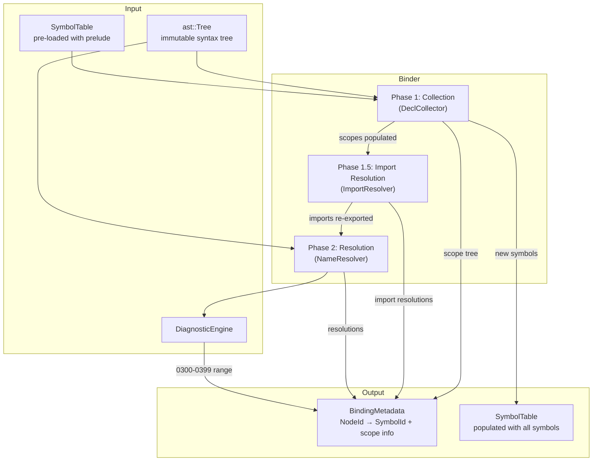

# RFC 0004: Binder Architecture

## Summary

This RFC defines the ZOM binder: the compiler stage that walks the immutable
AST produced by the parser, constructs a hierarchical scope tree, resolves every
identifier reference to its defining symbol, and records the results in
side-table metadata keyed by `NodeId`. The binder is the bridge between syntax
and semantics: it establishes *which* declaration each name refers to, without
yet determining *what type* that declaration has (that is the type checker's
job, RFC 0005).

The design follows a two-phase contract with an intermediate import
resolution step: **Phase 1 (Collection)** discovers every declaration and
inserts it into the appropriate scope, enabling forward references;
**Phase 1.5 (Import Resolution)** resolves all `use`/`import` paths and
re-exports symbols so that chained imports (`use a::B; use B::C;`) work
correctly; **Phase 2 (Resolution)** walks the AST again to resolve every
identifier use against the collected symbols. All phases are deterministic,
single-pass over the AST, and produce no observable side effects beyond
`BindingMetadata` and `SymbolTable` mutation.

## Motivation

The parser produces a well-formed AST tree where every identifier is just a
string with a source range. Before type checking can proceed, the compiler must
answer:

1. For `IdentifierExpr("x")`, which `let` / `fun` / `param` / `import` does
   `x` refer to?
2. For `MemberExpr(obj, "field")`, which struct field or class member does
   `field` name?
3. For `TypePath("Vec")`, which type declaration does `Vec` resolve to?
4. For `Import("a::b::c")`, which module or symbol does the path designate?

Without these answers, the type checker cannot assign types, the orphan engine
cannot check coherence, and the code generator cannot emit symbol references.

The current `Binder` implementation only establishes parent-child node
relationships in `BindingMetadata`. It does not create scopes, insert symbols,
or resolve identifiers. This RFC specifies the complete binding contract.

## Goals

- **G1.** Deterministic two-phase binding: collection then resolution.
- **G2.** Every identifier use in the AST resolves to exactly one `SymbolId`,
  or produces a diagnostic (fail-closed).
- **G3.** Scope tree mirrors the lexical nesting of declarations, functions,
  and blocks exactly.
- **G4.** Forward references work within a module scope (functions may call
  functions declared later in the same file).
- **G5.** Import resolution follows the module path algorithm defined in
  spec Chapter 24.
- **G6.** Shadowing is explicit: a local binding shadows a parent-scope
  binding of the same name, and the binder records the shadow relationship
  for diagnostics.
- **G7.** Generic type parameters and value parameters are bound in their
  correct scopes with proper visibility.
- **G8.** `BindingMetadata` provides O(1) lookup from `NodeId` to resolved
  `SymbolId` for every identifier node.
- **G9.** The binder emits diagnostics in the 0300–0399 range per
  `compiler-contracts.md` §2.

## Non-Goals

- **NG1.** Type inference or type checking. The binder resolves *names*, not
  *types*. Type assignment belongs to RFC 0005.
- **NG2.** Trait / interface method resolution. The binder resolves the
  interface *name*; dispatch to a specific method implementation is a type
  checker concern.
- **NG3.** Overload resolution. ZOM has no function overloading; this is
  trivially satisfied but stated explicitly.
- **NG4.** Cross-crate (cross-compilation-unit) symbol resolution in v1.
  The binder operates within a single `SymbolTable` instance. Cross-crate
  merging is a `CompilerSession` concern (architecture.md §7).
- **NG5.** Macro expansion. The binder sees only post-expansion AST nodes.
- **NG6.** Incremental or partial binding. The binder processes one complete
  `ast::Tree` at a time.

## Prior Art

### Rust — `rustc_resolve`

Rust's name resolution pass (`rustc_resolve::late`) uses a two-phase approach:
first, it collects all item declarations into the module scope; then it walks
the body to resolve paths. Import resolution (`use` statements) is handled in
a separate early pass. Key lessons:

- **Copy:** Two-phase collection/resolution for forward references.
- **Copy:** Explicit scope kinds (module, function, block, trait, impl).
- **Avoid:** The complexity of `macro_rules!` hygiene and `#[no_link]`
  item-name injection. ZOM v1 has no procedural macros.

**Relevance:** ZOM's module + function + block scope hierarchy maps directly
to Rust's model. The two-phase design is the proven standard.

### Swift — `NameResolution` / `Sema`

Swift's name resolution is integrated into the type checker (Sema) rather
than being a separate pass. It uses a "lookup" interface that searches
scopes, and performs name binding lazily during type checking.

- **Copy:** The concept of a `LookupResult` that can return zero, one, or
  multiple candidates (for protocol conformances).
- **Avoid:** Tight coupling between name resolution and type checking makes
  it hard to test binding in isolation. ZOM keeps them as separate stages
  so the binder can be unit-tested without a type environment.

**Relevance:** Confirms that separate binding is a valid architectural choice
that improves testability.

### Scala 3 — `dotc` Typer with `Symbol` table

Scala 3's compiler uses a `Symbol` table with denotations that evolve during
compilation phases. Name resolution happens in the `Namer` phase, which
creates symbols for all declarations before the `Typer` phase resolves
references.

- **Copy:** The `enterSymbol` / `dropSymbol` pattern for scope management.
- **Copy:** `Denotation` objects that carry name + symbol + scope.
- **Avoid:** The complexity of path-dependent types and implicit search
  during name lookup. ZOM's implicit resolution is a type-checker concern,
  not a binder concern.

**Relevance:** The `SymbolTable` API in ZOM already follows this pattern
(`enterSymbol`, `lookup`, `lookupRecursive`). This RFC aligns the binder
implementation with that existing API.

### Clang — `Sema::ActOn*` callbacks

Clang performs name resolution inline during parsing via `Sema` callbacks.
Each `ActOn*` method (e.g., `ActOnDeclarator`, `ActOnIdExpression`) both
creates symbols and resolves references.

- **Copy:** The idea that every identifier use must produce a resolution
  result (or error).
- **Avoid:** Parser-coupled resolution prevents the clean AST-as-IR model
  that ZOM uses. ZOM's parser is fail-closed and produces a complete tree;
  the binder is a separate consumer.

**Relevance:** Confirms that fail-closed name resolution (every use resolved
or error) is the right contract.

## Guide-Level Explanation

When you write:

```zom
fun fibonacci(n: i32) -> i32 {
  if n <= 1 { return n }
  return fibonacci(n - 1) + fibonacci(n - 2)
}

fun main() {
  let result = fibonacci(10)
  print(result)
}
```

The binder performs these steps:

**Phase 1 — Collection:**
1. Creates a **module scope** for the source file.
2. Sees `fun fibonacci` → inserts `fibonacci` as a `FunctionSymbol` into
   the module scope.
3. Sees `fun main` → inserts `main` as a `FunctionSymbol` into the
   module scope.
4. Enters `fibonacci`'s function scope: inserts parameter `n` as a
   `ParameterSymbol`.
5. Enters `main`'s function scope: sees `let result` → inserts `result`
   as a `VariableSymbol`.

**Phase 2 — Resolution:**
1. In `fibonacci`'s body: `IdentifierExpr("n")` → resolves to the
   parameter symbol.
2. `IdentifierExpr("fibonacci")` in the recursive call → walks up from
   function scope to module scope, finds `fibonacci`.
3. In `main`'s body: `IdentifierExpr("fibonacci")` → module scope lookup.
4. `IdentifierExpr("result")` → function scope lookup.
5. `IdentifierExpr("print")` → module scope → not found → emits
   `ZOM0301: unresolved identifier 'print'`.

The result: every `IdentifierExpr` node has its `NodeId` mapped to a
`SymbolId` in `BindingMetadata`. The type checker later reads this mapping
to assign types.

### Imports

```zom
use collections::vector::Vec
use algorithms::sort::{quicksort, mergesort}
```

The binder resolves each `use` path:
1. `collections` → find the `collections` package/module.
2. `vector` → find the `vector` submodule within `collections`.
3. `Vec` → find the `Vec` symbol in `vector`'s scope.
4. Insert a re-export of `Vec` into the current module scope.

If any segment of the path is not found, the binder emits `ZOM0315:
unresolved import path`.

### Shadowing

```zom
let x = 1
fun f() {
  let x = 2        // shadows module-scope x
  print(x)         // resolves to the local x (value 2)
}
```

The binder records that the inner `x` shadows the outer `x`. If the
`shadow` lint is enabled, a note diagnostic `ZOM0302` is emitted pointing
to both declarations.

## Reference-Level Design

### Architecture Overview



### Phase 1: Declaration Collection

The collector walks the AST in **pre-order** (visit node, then children) and
inserts every declaration into the current scope. The key invariant: **after
Phase 1, every scope contains all symbols declared directly in that scope,
regardless of source order.**

#### Scope Creation Rules

| AST Construct | Scope Kind | Parent Scope | Name |
|---|---|---|---|
| `SourceFile` | `Module` | Global (prelude) | File stem or `package.name` |
| `FunctionDecl` | `Function` | Enclosing | Function name |
| `ClassDecl` / `StructDecl` | `Class` | Enclosing | Type name |
| `InterfaceDecl` | `Interface` | Enclosing | Interface name |
| `EnumDecl` | `Enum` | Enclosing | Enum name |
| `BlockExpr` / `BlockStmt` | `Block` | Enclosing | Anonymous (`<block>`) |
| `ForStmt` | `For` | Enclosing | Anonymous (`<for>`) |
| `WhileStmt` | `While` | Enclosing | Anonymous (`<while>`) |
| `IfStmt` | `If` | Enclosing | Anonymous (`<if>`) |
| `MatchArm` | `Block` (pattern) | Enclosing | Anonymous (`<arm>`) |
| `IfLetExpr` | `IfLet` | Enclosing | Anonymous (`<iflet>`) |
| `WhileLetExpr` | `WhileLet` | Enclosing | Anonymous (`<whilelet>`) |
| `LambdaExpr` | `Lambda` | Enclosing | Anonymous (`<lambda>`) |
| `CatchClause` | `Catch` | Enclosing | Anonymous (`<catch>`) |
| `NamespaceDecl` | `Namespace` | Enclosing | Namespace name |

#### Symbol Insertion Rules

| Declaration | Symbol Kind | Inserted Into | Name |
|---|---|---|---|
| `let` / `const` | `Variable` | Current scope | Binding name |
| `fun` | `Function` | Current scope | Function name |
| `class` / `struct` | `Class` | Current scope | Type name |
| `interface` | `Interface` | Current scope | Interface name |
| `enum` | `Enum` | Current scope | Enum name |
| `enum case` | `EnumCase` | Enum scope | Case name |
| `typealias` | `Type` | Current scope | Alias name |
| Parameter (`fun f(x: T)`) | `Parameter` | Function scope | Parameter name |
| Generic param (`fun f<T>()`) | `Type` (generic) | Function/Type scope | Parameter name |
| `import` / `use` | Re-export | Current scope | Imported name |
| `self` (method) | `Variable` | Method scope | `"self"` |
| `this` (constructor) | `Variable` | Constructor scope | `"this"` |

**Nested function visibility rule:** `self` and `this` are only visible in the
direct method/constructor body. Nested functions
(`fun helper() { self.bar() }`) cannot access `self` — emit ZOM0320. Use
closures to capture outer variables.

#### Collection Algorithm (Pseudocode)

**Scope management convention:** `scope_stack` is an explicit stack used for
RAII-style scope management. The `scope` parameter is always `scope_stack.top()`
(the current innermost scope). `scope_stack.push(s)` makes `s` the current
scope; `scope_stack.pop()` restores the parent.

```
function collect(node: NodeId, scope: Scope):
  switch node.kind:
    case SourceFile:
      module_scope = create_scope(Module, file_name, global_scope)
      scope_stack.push(module_scope)
      for child in node.children:
        collect(child, module_scope)
      scope_stack.pop()

    case FunctionDecl:
      name = node.name_token.text
      sym = symbol_table.create_function(name, scope)
      sym.add_declaration_ref(DeclarationRef(buffer, node.id))
      scope.add_symbol(sym)

      fn_scope = create_scope(Function, name, scope)
      // Insert type parameters first
      for tp in node.generic_params:
        tpsym = symbol_table.create_type(tp.name, fn_scope)
        tpsym.set_generic_parameter(true)
        fn_scope.add_symbol(tpsym)
      // Insert value parameters
      for param in node.params:
        psym = symbol_table.create_parameter(param.name, fn_scope)
        fn_scope.add_symbol(psym)
      // Insert 'self' for methods
      if node.is_method:
        selfsym = symbol_table.create_variable("self", fn_scope)
        fn_scope.add_symbol(selfsym)

      scope_stack.push(fn_scope)
      collect(node.body, fn_scope)
      scope_stack.pop()

    case ClassDecl, StructDecl:
      // Similar: create type scope, insert fields, methods, constructors
      ...

    case LetDecl, ConstDecl:
      collect_pattern_bindings(node.pattern, scope)
      // If initializer references other names, those are resolved in Phase 2

    case BlockExpr, BlockStmt:
      block_scope = create_scope(Block, "<block>", scope)
      scope_stack.push(block_scope)
      for stmt in node.statements:
        collect(stmt, block_scope)
      scope_stack.pop()

    case ForStmt:
      for_scope = create_scope(For, "<for>", scope)
      scope_stack.push(for_scope)
      collect_pattern_bindings(node.pattern, for_scope)
      collect(node.body, for_scope)
      scope_stack.pop()

    case MatchStmt:
      for arm in node.arms:
        arm_scope = create_scope(Block, "<arm>", scope)
        scope_stack.push(arm_scope)
        collect_pattern_bindings(arm.pattern, arm_scope)
        collect(arm.body, arm_scope)
        scope_stack.pop()

    case IfLetExpr:
      iflet_scope = create_scope(IfLet, "<iflet>", scope)
      scope_stack.push(iflet_scope)
      collect_pattern_bindings(node.pattern, iflet_scope)
      collect(node.then_body, iflet_scope)
      scope_stack.pop()
      if node.else_body:
        collect(node.else_body, scope)

    case WhileLetExpr:
      whilelet_scope = create_scope(WhileLet, "<whilelet>", scope)
      scope_stack.push(whilelet_scope)
      collect_pattern_bindings(node.pattern, whilelet_scope)
      collect(node.body, whilelet_scope)
      scope_stack.pop()

    case ImportDecl:
      // Phase 1: record the import, resolve in Phase 1.5 after all
      // declarations are collected (imports may reference forward-declared
      // modules within the same crate).
      pending_imports.append(node)

    default:
      for child in node.children:
        collect(child, scope)

function collect_pattern_bindings(pattern: NodeId, scope: Scope):
  switch pattern.kind:
    case IdentifierPattern:
      name = pattern.token.text
      sym = symbol_table.create_variable(name, scope)
      scope.add_symbol(sym)
      metadata.set_symbol(pattern.id, sym.id)
    case WildcardPattern:
      pass  // no binding
    case EnumPattern:
      for sub_pat in pattern.sub_patterns:
        collect_pattern_bindings(sub_pat, scope)
    case StructPattern:
      for field_pat in pattern.field_patterns:
        collect_pattern_bindings(field_pat.pattern, scope)
    case TuplePattern:
      for elem_pat in pattern.element_patterns:
        collect_pattern_bindings(elem_pat, scope)
    case OrPattern:
      // Both sides must bind same names; bind in enclosing scope
      for branch in pattern.branches:
        collect_pattern_bindings(branch, scope)
    case RangePattern, LiteralPattern:
      pass  // no binding
```

**Key property:** Phase 1 never fails due to an unresolved reference. It only
creates scopes and inserts symbols. Errors from duplicate names *are* emitted
in Phase 1:

| Condition | Diagnostic |
|---|---|
| Two symbols with same name in same scope (non-method) | `ZOM0303: redeclaration of 'x'` |
| Method with same name as non-method in same scope | `ZOM0304: 'x' conflicts with prior declaration` |

### Phase 1.5: Import Resolution

After all declarations are collected (Phase 1 complete), resolve imports
**before** name resolution (Phase 2). This ensures that `use a::B; use B::C;`
works because `a::B` is resolved and re-exported before `B::C` is looked up.

```
function resolve_imports(scope: Scope):
  for import in pending_imports:
    resolved = resolve_import_path(import.path, scope)
    if resolved is NotFound:
      emit(ZOM0315, import.range, "unresolved import '{path}'")
      metadata.set_unresolved(import.id)
    else:
      metadata.set_symbol(import.id, resolved.symbol.id)
      // Re-export into current scope
      scope.add_reexport(import.alias_name || resolved.symbol.name, resolved.symbol)
      metadata.set_is_reexport(import.id, true)
```

### Phase 2: Name Resolution

Phase 2 walks the AST again, this time in **post-order** for expressions
(resolve children before parent) and **pre-order** for declarations (enter
scope before resolving body). For every identifier use, it searches the
scope chain from innermost to outermost.

#### Resolution Targets

| AST Node | Resolution Kind | Scope Search |
|---|---|---|
| `IdentifierExpr` | Value symbol | Current → ... → module → global (prelude) |
| `IdentifierType` | Type symbol | Current → ... → module → global (prelude) |
| `MemberExpr.base` | Value symbol (the object) | Same as `IdentifierExpr` |
| `MemberExpr.member` | Field/method symbol | *Not scope chain* — type-based lookup deferred to checker |
| `CallExpr.callee` | Value symbol (function) | Same as `IdentifierExpr` |
| `ImportDecl.path` | Module/symbol path | Module resolution algorithm (§below) |
| `Pattern::Identifier` | New binding (Phase 1) or existing ref (match) | Depends on context |
| `GenericArg` | Type symbol | Same as `IdentifierType` |

#### Binding Position vs. Expression Position

An identifier in a pattern is in **binding position** (creates new symbol)
when it appears in:

- `let PAT = EXPR` pattern
- `fun NAME(params)` parameter list
- `match (EXPR) { when PAT => ... }` arm pattern
- `for PAT in EXPR` loop pattern
- `catch PAT` clause
- `if let PAT = EXPR` pattern
- `while let PAT = EXPR` pattern

An identifier is in **expression position** (resolves existing symbol) when
it appears in:

- Expression bodies (right side of `let`, function bodies)
- `match` scrutinee expression
- Pattern guards (`if cond` after pattern)

#### Lookup Algorithm

```
function resolve_name(name: String, from: Scope, kind: LookupKind) -> LookupResult:
  current = from
  while current is not null:
    sym = current.lookup_locally(name)
    if sym exists:
      if kind == Value and sym.is_value():
        return Found(sym)
      if kind == Type and sym.is_type():
        return Found(sym)
      if kind == Any:
        return Found(sym)
    current = current.parent()

  // Not found in lexical chain — check prelude (global scope)
  // (already covered by walking to root)

  return NotFound
```

#### Value vs. Type Namespace

ZOM maintains separate namespaces for values and types, following the
ML-family tradition (also used by Rust). A `fun foo()` and `struct Foo`
may coexist in the same scope without conflict:

- `IdentifierExpr("foo")` searches the **value namespace**.
- `IdentifierType("Foo")` searches the **type namespace**.
- `MemberExpr` member names search the **member namespace** of the receiver
  type (deferred to type checker).

This is implemented by `Scope::lookup_locally(name)` returning the first
matching symbol, and the caller filtering by `is_value()` / `is_type()`.

#### Resolution Algorithm (Pseudocode)

```
function resolve(node: NodeId, scope: Scope):
  switch node.kind:
    case IdentifierExpr:
      name = node.token.text
      result = resolve_name(name, scope, Value)
      if result is NotFound:
        emit(ZOM0301, node.range, "unresolved identifier '{name}'")
        metadata.set_unresolved(node.id)
      else:
        metadata.set_symbol(node.id, result.symbol.id)
        if result.symbol.is_shadowed():
          emit_note(ZOM0302, node.range,
                    "'{name}' shadows prior declaration at {prev_range}")

    case IdentifierType:
      name = node.token.text
      result = resolve_name(name, scope, Type)
      if result is NotFound:
        emit(ZOM0310, node.range, "unknown type '{name}'")
        metadata.set_unresolved(node.id)
      else:
        metadata.set_symbol(node.id, result.symbol.id)

    case MemberExpr:
      // Resolve the base expression first
      resolve(node.base, scope)
      // Member name resolution is DEFERRED to type checker.
      // The binder records the member name token only.
      // The checker, knowing the base type, resolves the member.
      metadata.set_deferred_member(node.id, node.member_token)

    case CallExpr:
      resolve(node.callee, scope)
      for arg in node.arguments:
        resolve(arg, scope)

    case LetDecl:
      // Resolve the initializer expression
      if node.initializer:
        resolve(node.initializer, scope)
      // The pattern binding was already inserted in Phase 1

    case FunctionDecl:
      fn_scope = scope_for(node.id)
      // Resolve parameter types
      for param in node.params:
        if param.type_annotation:
          resolve(param.type_annotation, fn_scope)
      // Resolve return type
      if node.return_type:
        resolve(node.return_type, fn_scope)
      // Resolve body
      resolve(node.body, fn_scope)

    case MatchStmt:
      resolve(node.scrutinee, scope)
      for arm in node.arms:
        arm_scope = scope_for(arm.id)
        resolve(arm.pattern, arm_scope)
        resolve(arm.body, arm_scope)

    default:
      for child in node.children:
        resolve(child, scope)
```

### Import Path Resolution

Import paths follow the algorithm in spec Chapter 24:

```
function resolve_import_path(segments: [String], from: Scope) -> LookupResult:
  // First segment: look up in current scope (may be a locally imported
  // module or a crate name)
  current_sym = resolve_name(segments[0], from, Any)
  if current_sym is NotFound:
    return NotFound

  // Subsequent segments: walk into module/type member scopes
  for i in 1..segments.length:
    if current_sym is a Module or Package:
      child_scope = current_sym.get_child_scope()
      next_sym = child_scope.lookup_locally(segments[i])
    elif current_sym is a Class or Interface:
      // Looking up a nested type or static member
      member_scope = current_sym.get_member_scope()
      next_sym = member_scope.lookup_locally(segments[i])
    else:
      emit(ZOM0316, ..., "'{segments[i-1]}' is not importable as a path")
      return NotFound

    if next_sym is NotFound:
      return NotFound
    current_sym = next_sym

  return Found(current_sym)
```

#### Re-export Semantics

When `use a::b::c` is resolved, the symbol `c` is re-exported into the
current module scope:

1. If `c` is a simple name (`use foo::bar`), `bar` is inserted into the
   current scope with name `"bar"`.
2. If `c` is aliased (`use foo::bar as baz`), `bar` is inserted with
   name `"baz"`.
3. If `c` is a glob (`use foo::*`), every public symbol in `foo`'s scope
   is inserted into the current scope.

Re-exports do not create new symbols; they create name-to-symbol mappings
in the importing scope. The symbol's canonical identity is preserved.

**Glob import conflict rules:**

- If a glob import (`use foo::*`) would import a name that conflicts with a
  local declaration in the same scope, the local declaration wins and no
  diagnostic is emitted (local takes precedence, like Rust).
- If two glob imports both provide the same name, and no local declaration
  resolves it, emit ZOM0317 for ambiguity.

### BindingMetadata Contract

`BindingMetadata` is the binder's output, indexed by `NodeId`:

| Field | Type | Purpose |
|---|---|---|
| `parent(node)` | `NodeId` | Parent node in AST (already populated) |
| `symbol(node)` | `Maybe<SymbolId>` | Resolved symbol for identifier nodes |
| `scope(node)` | `Maybe<ScopeId>` | Scope that this node introduces (for decls that create scopes) |
| `is_unresolved(node)` | `bool` | True if resolution failed (for error recovery) |
| `deferred_member(node)` | `Maybe<TokenRef>` | Member name whose resolution is deferred to checker |
| `shadow_of(node)` | `Maybe<SymbolId>` | The outer symbol that this binding shadows |
| `is_reexport(node)` | `bool` | True for import nodes that re-export |
| `captures(node)` | `Maybe<CaptureSet>` | Set of outer symbols captured by lambda/closure |
| `label_target(node)` | `Maybe<NodeId>` | Label target node for `break 'label` / `continue 'label` |

All lookups are O(1): `BindingMetadata` stores parallel arrays indexed by
`NodeId` value.

#### Closure Capture Semantics

When a lambda (`LambdaExpr`) references a symbol from an outer scope, that
symbol is added to the lambda's capture set. The `captures()` metadata is
used by the type checker for Send/Sync derivation and by the borrow checker
(future).

- Default capture mode is by-reference (like Rust non-move closures).
- `captures(lambda_node)` returns the set of `SymbolId`s from enclosing
  scopes that are referenced inside the lambda body.
- The capture set is computed during Phase 2 resolution: whenever
  `resolve_name` finds a symbol in a parent scope (not the current
  lambda's scope or any scope nested within it), that symbol is recorded
  in the lambda's capture set.

#### Label Resolution

```zom
'outer: loop {
  'inner: loop {
    break 'outer;  // resolves to 'outer label
  }
}
```

Labels live in a **label namespace** separate from value/type namespaces.

- Each labeled loop (`'label: while/for/loop`) inserts a label into the
  enclosing scope during Phase 1 collection.
- `break 'label` and `continue 'label` resolve the label target during
  Phase 2.
- `label_target(node) -> Maybe<NodeId>` in `BindingMetadata` records the
  resolved label target node.
- If a label is not found in any enclosing scope, emit ZOM0301 adapted
  for labels: `unresolved label 'label_name'`.

### Diagnostic Catalog (0300–0399)

| Code | Severity | Message Template |
|---|---|---|
| ZOM0301 | Error | `unresolved identifier '{name}'` |
| ZOM0302 | Note | `'{name}' shadows prior declaration here` |
| ZOM0303 | Error | `redeclaration of '{name}'` |
| ZOM0304 | Error | `'{name}' conflicts with prior declaration of kind '{kind}'` |
| ZOM0305 | Error | `cannot shadow '{name}'; use explicit 'shadow' keyword` |
| ZOM0310 | Error | `unknown type '{name}'` |
| ZOM0311 | Error | `'{name}' is not a type` |
| ZOM0312 | Error | `generic parameter '{name}' already declared` |
| ZOM0315 | Error | `unresolved import '{path}'` |
| ZOM0316 | Error | `'{segment}' is not importable as a path` |
| ZOM0317 | Error | `import '{name}' conflicts with local declaration` |
| ZOM0320 | Error | `'self' is not available in this context` |
| ZOM0321 | Error | `'this' is not available in this context` |
| ZOM0330 | Error | `enum variant '{name}' not found in enum '{enum_name}'` |
| ZOM0380 | Note | `prior declaration of '{name}' here` (attached to ZOM0303) |

### Invariants

| ID | Invariant | Enforcement |
|---|---|---|
| BIND-01 | After Phase 1, every scope's symbol table is complete for that scope. | Collection walks all declaration nodes exactly once. |
| BIND-02 | After Phase 2, every `IdentifierExpr` / `IdentifierType` node has either a `SymbolId` or `is_unresolved=true`. | Resolution visits every identifier node. |
| BIND-03 | `SymbolId` references in `BindingMetadata` are valid indices into `SymbolTable`. | Binder only writes `SymbolId`s obtained from `SymbolTable::create_*`. |
| BIND-04 | Scope tree is a tree (no cycles, single parent). | Scopes are created with explicit parent; no re-parenting after creation. |
| BIND-05 | The binder never modifies the AST. | `ast::Tree` is `const` in all binder entry points. |
| BIND-06 | Import resolution is deterministic: same source → same result. | No hash-map iteration order dependency in path walking. |
| BIND-07 | Forward references within a module resolve correctly. | Phase 1 collects all declarations before Phase 2 resolves any. |
| BIND-08 | Member expression names are never resolved by the binder. | `MemberExpr.member` always gets `deferred_member` status. |
| BIND-09 | After Phase 1.5, every import node has either a resolved `SymbolId` or `is_unresolved=true`. | Import resolution walks all pending imports exactly once. |
| BIND-10 | Match arm pattern variables are in scope during Phase 2 resolution. | Match arm scopes are created and pattern bindings collected in Phase 1. |

### Fail-Closed Contract

The binder is **fail-closed**:

1. If an identifier cannot be resolved, it is marked `is_unresolved` and a
   diagnostic is emitted. The type checker treats unresolved identifiers as
   having the error type and cascades appropriately.
2. If an import path cannot be resolved, the import node is marked
   `is_unresolved` and a diagnostic is emitted. No re-export occurs.
3. The binder never silently returns a "default" or "any" symbol for an
   unresolvable name.
4. `Binder::bind()` returns `false` if any error-severity diagnostic was
   emitted, consistent with the existing pattern.

## Repository Impact

| Area | Paths | Owner |
|---|---|---|
| Binder implementation | `products/zomlang/compiler/binder/**` | `binder-checker` |
| Symbol table | `products/zomlang/compiler/symbol/**` | `module-system` |
| AST metadata | `products/zomlang/compiler/ast/tree.h` (`BindingMetadata`) | `binder-checker` |
| Diagnostics | `products/zomlang/compiler/diagnostics/diagnostics-binder.def` | `error-system` |
| Driver integration | `products/zomlang/compiler/driver/**` | `module-system` |
| Spec alignment | `docs/spec/chapters/06-declarations.md`, `13-modules-and-imports.md`, `24-module-resolution-algorithm.md` | `spec-audit` |
| Tests | `products/zomlang/tests/unittests/compiler/binder/*-test.cc` | `verification` |
| Design docs | `docs/design/compiler-contracts.md` §6 (P2B contract) | `rfc` |

## Security And Safety Impact

The binder itself does not directly affect runtime memory safety — it
operates entirely within the compiler process. However:

- **Unsafe code resolution:** The binder must correctly resolve `unsafe`
  block markers and `extern` declarations so the type checker can enforce
  the unsafe boundary. Incorrect resolution of an `unsafe` marker could
  allow unsafe code to bypass the checker's safety gates.
- **Import path traversal:** The import resolver must not allow path
  traversal outside the crate root (`../` in import paths). This is
  enforced by the module resolution algorithm, not the binder directly,
  but the binder is the consumer of that algorithm.
- **Symbol table isolation:** Symbols from one compilation unit must not
  leak into another's scope chain. The `SymbolTable` is per-TU; cross-TU
  merging happens at the `CompilerSession` level with explicit COW
  semantics.

## Drawbacks And Risks

| Risk | Mitigation |
|---|---|
| Two-phase design requires walking the AST twice. | The AST is already fully materialized in memory. A full walk of 100K-node trees takes < 1ms. The clarity benefit of separate phases outweighs the cost. |
| Deferred member resolution pushes work to the checker. | This is the correct division: member resolution requires type information. The binder provides the member name token; the checker does the lookup with full type knowledge. |
| Forward references could hide circular dependency bugs. | The checker detects circular type dependencies. Forward *value* references (function calling function declared later) are intentional and well-defined. |
| Separate value/type namespaces may confuse users. | This is the standard in ML, Rust, and Swift. The error messages explicitly say "not a type" (ZOM0311) or "unresolved identifier" (ZOM0301) to guide the user. |
| Import resolution without cross-crate support in v1. | Single-crate binding is sufficient for initial testing. Cross-crate support is a `CompilerSession` concern tracked separately. |

## Alternatives Considered

### Alternative A: Single-Pass Binding

Resolve names during the collection walk. When we encounter an identifier,
search the scopes created so far.

- **Rejected because:** Forward references would fail. A function calling
  another function declared later in the file would not resolve. This
  forces unnatural declaration ordering (C-style) which is unacceptable
  for a modern language.

### Alternative B: Lazy Resolution on Demand

Don't walk the AST at all. Instead, the type checker calls a `resolve()`
helper whenever it needs a symbol, and the helper searches scopes on
first use.

- **Rejected because:** Makes binding non-deterministic (depends on
  checker traversal order). Harder to test — you can't test binding in
  isolation. Harder to implement incremental compilation later because
  there's no single "binding complete" checkpoint. Swift uses this
  approach but pays for it in complexity.

### Alternative C: Parser-Coupled Binding (Clang-style)

Perform name resolution during parsing via `Sema` callbacks.

- **Rejected because:** Violates the clean AST-as-IR architecture. The
  parser's job is to produce a syntax tree; binding is a semantic
  transformation. Coupling them makes the parser harder to test and
  prevents tooling (formatters, syntax highlighters) from using the
  parser independently.

### Alternative D: Hash-Map Only (No Scope Tree)

Flat hash map from fully-qualified name to symbol, e.g., `"module::f::x"`.

- **Rejected because:** Loses lexical structure. Shadowing detection
  requires knowing which scope a name is in. Scope chain walking is
  O(depth) which is bounded by nesting depth (typically < 20). The
  hash-map approach makes error messages worse ("which `x`?").

## Compatibility And Rollout

This is a new implementation filling an existing empty stage. There is no
existing user-visible behavior to preserve. Rollout steps:

1. Implement `DeclCollector` (Phase 1) with unit tests.
2. Implement `ImportResolver` (Phase 1.5) with unit tests.
3. Implement `NameResolver` (Phase 2) with unit tests.
4. Wire into `CompilerSession` / driver after parsing.
5. Add conformance tests for name resolution.
6. Enable the binder in the default pipeline.

Rollback: remove the binder call from the driver; the tree still parses
correctly, but identifier resolution is unavailable (type checker would
need to be disabled too).

Generated files affected: none new. The `BindingMetadata` structure is
already defined in `ast/tree.h`.

## Documentation And Teaching Plan

| Document | Change |
|---|---|
| `docs/design/compiler-contracts.md` §6 | Expand P2B (Parser-to-Binder) contract with the invariants from this RFC. |
| `docs/design/architecture.md` §3 | Update pipeline diagram to show two-phase binder. |
| `docs/spec/chapters/06-declarations.md` | Add cross-reference to binding semantics for `let`, `fun`, `class`. |
| `docs/spec/chapters/13-modules-and-imports.md` | Clarify that import resolution is a binder responsibility. |
| Developer docs | Add "How to add a new name-binding construct" guide. |

## Operational Readiness

- **CI:** Binder unit tests run as part of `ctest --preset default`.
- **Fuzzing:** The binder is a natural fuzz target — feed arbitrary valid
  ASTs and assert BIND-01 through BIND-10. Add to the existing fuzz
  harness under `products/zomlang/tests/fuzzing/`.
- **Performance:** Binder time should be < 5% of total compile time for
  typical files. Add a `--timings` flag to the driver that reports per-stage
  wall time.
- **Ownership:** `binder-checker` subagent owns binder maintenance.

## Acceptance Criteria

1. **Phase 1 completeness:** Every declaration in a source file has a
   corresponding symbol in the correct scope after `collect()`. Verified by
   unit test: parse a file, call collect, enumerate all scopes and confirm
   expected symbol count.
2. **Phase 2 completeness:** Every `IdentifierExpr` and `IdentifierType`
   node has either a valid `SymbolId` or `is_unresolved=true`. Verified by
   walking the post-bind metadata tree.
3. **Forward references:** A function may call another function declared
   later in the same module. Conformance test: `fun a() { b() }; fun b() {}`
   resolves correctly.
4. **Shadowing:** A local binding shadows a parent binding of the same
   name. Unit test: verify `shadow_of` metadata is set correctly.
5. **Import resolution:** `use std::collections::Vec` resolves to the
   correct symbol. Conformance test with a mock two-module setup.
6. **Unresolved identifier:** Using an undefined name emits ZOM0301 and
   marks the node `is_unresolved`.
7. **Redeclaration:** Two `let x` in the same scope emit ZOM0303.
8. **Value/type namespace separation:** `fun foo()` and `struct Foo`
   coexist without conflict. Unit test.
9. **Generic parameters:** `fun f<T>(x: T) -> T { x }` correctly binds
   `T` in the function scope and resolves `T` in parameter and return
   types.
10. **Member deferral:** `obj.field` member name is recorded as
    `deferred_member`, not resolved by the binder. Unit test.
11. **Fail-closed:** `Binder::bind()` returns `false` when any error
    diagnostic is emitted.
12. **No AST mutation:** After binding, the AST tree is byte-identical
    to before binding. Unit test with tree hash.
13. **Diagnostic range:** ZOM0301 diagnostic points at the identifier
    token's source range, not the enclosing expression.
14. **`self` resolution:** Inside a method, `self` resolves to the
    method-scope self variable. Outside a method, `self` emits ZOM0320.
15. **Scope tree shape:** The scope tree mirrors AST lexical nesting
    exactly. Verified by dumping scope tree and comparing to expected
    structure.
16. **Match arm pattern scope:** Pattern variables in match arms are
    visible during Phase 2 resolution of the arm body. Conformance test:
    `match (x) { when Some(y) => { return y; } }` resolves `y` correctly.
17. **Chained import resolution:** `use a::B; use B::C;` works because
    Phase 1.5 resolves and re-exports `a::B` before `B::C` is looked up.
    Unit test with mock module setup.
18. **`if let` / `while let` scoping:** Pattern bindings in `if let` and
    `while let` are scoped correctly (visible in then-body, not in
    else-body). Unit test.
19. **Label resolution:** `break 'outer` from a nested loop resolves to
    the `'outer` labeled loop. Unresolved label emits diagnostic.
20. **Closure captures:** Lambda referencing outer variable has that
    symbol in `captures()` metadata. Unit test.
21. **Glob import precedence:** Local declaration takes precedence over
    glob-imported name of same name (no diagnostic). Two globs providing
    same name emit ZOM0317.
22. **Nested function `self` access:** `fun helper() { self.bar() }`
    inside a method emits ZOM0320.
23. **`check-rfc.py` passes.**
24. **`check-format.py` passes.**
25. **All existing 742+ tests still pass.**

## Implementation Plan

1. **Expand `BindingMetadata`** — Add `symbol()`, `is_unresolved()`,
   `deferred_member()`, `shadow_of()`, `is_reexport()`, `captures()`,
   `label_target()` accessors backed by parallel arrays in `ast/tree.h`.
2. **Implement `DeclCollector`** — A class that owns the scope stack and
   walks the AST in pre-order, creating scopes and inserting symbols.
   Includes `collect_pattern_bindings()` for pattern binding positions.
   File: `binder/decl-collector.cc` + `.h`.
3. **Implement `ImportResolver`** — Phase 1.5 path-walking logic for `use`
   statements, run after collection but before name resolution.
   File: `binder/import-resolver.cc` + `.h`.
4. **Implement `NameResolver`** — A class that walks the AST in mixed
   pre/post-order, resolving identifiers against the scope chain.
   Computes closure capture sets and label targets.
   File: `binder/name-resolver.cc` + `.h`.
5. **Add binder diagnostics** — Create `diagnostics-binder.def` with
   codes ZOM0301–ZOM0380.
6. **Wire into `Binder::bind()`** — Call collect, then resolve_imports,
   then resolve.
7. **Driver integration** — Call `binder.bind()` after successful parse.
8. **Update `compiler-contracts.md`** — Document P2B invariants.

## Test Plan

- **Build:** `cmake --build --preset debug` passes.
- **Unit tests:** New `binder-test.cc` (scope creation, symbol insertion,
  forward refs, shadowing), `name-resolver-test.cc` (identifier resolution,
  type/value namespace separation, member deferral),
  `import-resolver-test.cc` (path resolution, re-exports, glob imports).
  Target: ≥ 50 unit tests.
- **Lit tests:** Add `products/zomlang/tests/conformance/corpus/06-declarations/`
  tests for name resolution edge cases.
- **Conformance:** Existing 667 conformance tests must still pass.
  New tests for import resolution and shadowing diagnostics.
- **Generated files:** None.
- **Format:** `python3 scripts/check-format.py` passes.
- **RFC check:** `python3 scripts/check-rfc.py` passes.

## Open Questions

None.

## Status History

| Date | Status | Notes |
|---|---|---|
| 2026-07-05 | DRAFT | Initial draft of complete binder architecture. Covers two-phase collection/resolution, scope tree, import resolution, BindingMetadata contract, and 18 acceptance criteria. |
| 2026-07-05 | DRAFT | Applied fixes: moved match arm scope creation to Phase 1; added binding position vs. expression position rules; added `collect_pattern_bindings()` helper; added Phase 1.5 import resolution; added closure capture tracking; added `if let`/`while let` scope rules; added label resolution; clarified `self`/`this` nested function visibility; added glob import conflict rules; clarified `scope_stack`/`scope` parameter convention. |
| 2026-07-07 | REVIEW | Binder implementation is complete and verified; opened implementation-backed owner review before acceptance. Required decision and approvers remain the next governance gate. |
