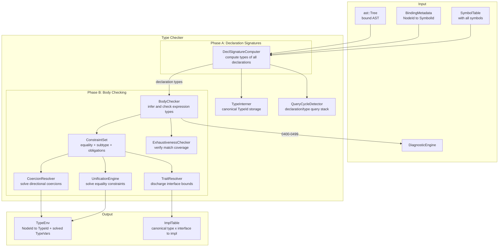

# RFC 0005: Type System Architecture

## Summary

This RFC defines the ZOM type checker: the compiler stage that consumes the
bound AST (from RFC 0004) and produces a fully type-annotated intermediate
representation. The type checker assigns a type to every expression, verifies
that all operations are type-safe, discharges trait/interface bounds, checks
pattern matching exhaustiveness, and enforces the permission and marker
discipline defined in `compiler-contracts.md`.

The design centers on a **constraint-based inference engine** that collects
equality constraints, directional subtype constraints, trait obligations, and
coercion obligations from the AST body. Equality constraints are solved by
first-order unification; directional constraints are discharged only at
well-defined coercion sites. Generic functions are type-checked parametrically
(once, against declared bounds); concrete instantiations are monomorphized at
code-generation time. Trait bounds are discharged by searching the impl table
under a strict no-overlap coherence rule; error types propagate through
expressions that depend on failed sub-expressions. The checker is fail-closed:
any type error produces a diagnostic and marks the offending subtree with the
error type, preventing cascading nonsense errors.

## Motivation

The binder resolves *names* but not *types*. After binding, we know that
`IdentifierExpr("x")` refers to the `let x = 5` declaration, but we don't
yet know that `x` has type `i32`. The type checker must answer:

1. What is the type of every expression and declaration?
2. Does this function call satisfy the parameter types?
3. Does this type satisfy all required trait bounds?
4. Is this `match` exhaustive over all enum variants?
5. Is this `spawn` block capturing only `Sendable` types?
6. Does this `?!` operator return from a function with a `raises` clause?

Without a type checker, the code generator cannot emit correct machine
instructions (it doesn't know operand sizes, calling conventions, or vtable
layout), and the user has no guarantee that their program is well-typed.

`TypeChecker` is now the default post-binder semantic stage. This RFC
specifies the complete type checking contract that the implementation must
continue to satisfy.

## Goals

- **G1.** Every expression and declaration in the AST has a determined type
  after type checking, or is marked with the error type.
- **G2.** Type inference is complete for intra-expression and intra-function
  inference. Top-level declarations require explicit type annotations (no
  global inference, per architecture.md NON-GOALS).
- **G3.** Equality inference and subtype/coercion checking are separate:
  `unify(T, U)` is symmetric and means type equality only; `coerce(source,
  target, site)` is directional and is permitted only at explicit coercion
  sites.
- **G4.** Generic functions are type-checked parametrically (once, against
  declared bounds). Concrete instantiations are monomorphized at
  code-generation time with concrete type arguments.
- **G5.** Trait/interface bounds are discharged by searching the impl table;
  coherence is enforced (no overlapping impls for the same type+trait).
- **G6.** Pattern matching is checked for exhaustiveness and redundancy using
  a Maranget-style usefulness matrix. Pattern guards do not contribute to
  exhaustiveness coverage.
- **G7.** Error types propagate cleanly: one source error -> one diagnostic,
  downstream expressions get `Error` type without additional diagnostics.
- **G8.** Permission checking (`mut`, `borrow`, `own`) is enforced at the
  type level.
- **G9.** Marker types (`Sendable`, `Shared`, `SuspendSafe`) are derived and
  checked for concurrency safety.
- **G10.** The `raises` clause and `?!` / `!!` operators are integrated into
  the type system.
- **G11.** Type identity uses canonical interning for composite types so
  equality checks are deterministic and cheap after canonicalization.
- **G12.** Declaration and type queries have explicit cycle detection so
  recursive type aliases, signatures, and associated type projections fail with
  diagnostics instead of recursing indefinitely.
- **G13.** References, class values, and existential values are non-null by
  default. `null` is legal only through an explicit nullable union such as
  `T | null` or its sugar `T?`.
- **G14.** All diagnostics in the 0400–0499 range per
  `compiler-contracts.md` §2.

## Non-Goals

- **NG1.** Lifetime analysis (borrow checker). The type checker verifies
  type safety but not lifetime safety. A separate borrow checker (future
  RFC) handles `own`/`borrow`/`mut` permission verification beyond basic
  mutability checking.
- **NG2.** Effect system beyond `raises`. The type checker tracks error
  effects but not allocation effects, I/O effects, or concurrency effects
  (those are marker-type concerns handled at a different level).
- **NG3.** Cross-crate type checking in v1. Like the binder, the type
  checker operates within a single compilation unit's `TypeEnv`.
  Cross-crate monomorphization (emitting specialized copies) is a
  `CompilerSession`/codegen concern.
- **NG4.** Incremental type checking. Full re-check per compilation.
- **NG5.** Type-level computation (dependent types, GADTs, type-level
  functions). Architecture.md explicitly excludes GADTs.
- **NG6.** Implicit type conversions beyond the explicitly sanctioned
  coercions: `never -> T`, `T -> any`, `&mut T -> &T` (reborrow),
  `*mut T -> *const T`, `T -> T | E` (union injection), `null -> T | null`,
  `T -> dyn I` at explicit existential annotation sites, `dyn I -> dyn J`
  (existential upcast), and numeric conversions at explicit `as` cast sites.
- **NG7.** Specialization or priority among overlapping impls. If a direct impl
  and a blanket impl can both apply to the same concrete type, coherence
  rejects the program.

## Prior Art

### Rust — `rustc_trait_selection` + `rustc_typeck`

Rust's type checker is split into:
- **`rustc_hir_typeck`** — type inference using a combination of
  Hindley-Milner unification and local type inference.
- **`rustc_trait_selection`** — trait bound discharge using a
  goal-directed search with coherence checking.
- **`rustc_borrowck`** — NLL (Non-Lexical Lifetimes) borrow checker,
  separate from the type checker proper.

Key lessons:
- **Copy:** Separation of type inference from trait selection from borrow
  checking. ZOM follows the same three-phase separation.
- **Copy:** Error type propagation (`TyKind::Err`) that suppresses
  cascading errors.
- **Copy:** `Obligation` / `Predicate` model for trait bounds — each
  bound is an obligation that must be discharged.
- **Avoid:** The complexity of Rust's `impl Trait` / `dyn Trait` /
  `async fn` return position impl Trait interaction. ZOM v1 has explicit
  return types only.
- **Avoid:** The Chalk recursive solver complexity. ZOM v1 uses a simpler
  impl-table search with no negative reasoning.

**Relevance:** Directly applicable. ZOM's type system is a simplified Rust
(no lifetimes in the type checker; `dyn Trait` object safety is enforced
via the OS-0..OS-7 checks during existential coercion).

### Swift — `Sema` (Semantic Analysis)

Swift's type checker is a single integrated pass that performs name
resolution, type inference, and protocol conformance checking together.
It uses a "constraint system" approach where type inference generates
constraints that are solved by a simplex-like algorithm.

- **Copy:** The constraint system model where type inference generates
  equations (`T == U`, `T: Protocol`) that are solved together.
- **Copy:** "Solution" ranking — when multiple solutions exist, prefer
  the one with fewer implicit conversions.
- **Avoid:** The bidirectional type checking complexity for closures.
  ZOM uses simpler annotation-directed inference for closure parameters.

**Relevance:** Confirms that constraint-based inference is the right
approach for a language with generics and overloaded operators.

### Scala 3 — `dotc` Typer

Scala 3's type checker (`Typer`) is a tree transformer that assigns types
to every tree node. It uses a `Context` that carries the current type
environment, and implicit resolution is integrated into type inference.

- **Copy:** The idea that type checking is a tree transformation
  (`Tree => TypedTree`) rather than a side-effect on a side table. ZOM
  writes types to `TypeEnv` (a side table) but the conceptual model is
  the same.
- **Copy:** `Denotation` evolution — symbols gain type information as
  compilation progresses.
- **Avoid:** The complexity of path-dependent types and higher-kinded
  type inference. ZOM v1 has no type lambdas or type constructor
  polymorphism.

**Relevance:** The `TypeEnv` as a COW (copy-on-write) structure that
accumulates type assignments is directly inspired by dotc's context
passing.

### OCaml — `typecore.ml`

OCaml's type checker uses classic Hindley-Milner inference with
imperative type variables (union-find). It is the reference implementation
for the algorithm.

- **Copy:** Union-find for type variable unification. Efficient,
  well-understood.
- **Copy:** Levels-based generalization for let-polymorphism. ZOM uses
  explicit type parameters rather than implicit let-polymorphism, but
  the level-based approach informs how generic parameters are tracked.
- **Avoid:** The "value restriction" complexity. ZOM's explicit
  annotations avoid this.

**Relevance:** The unification engine design follows OCaml's proven
union-find with ranks.

## Guide-Level Explanation

When you write:

```zom
fun add(a: i32, b: i32) -> i32 {
  return a + b
}

fun main() {
  let x = add(1, 2)      // x inferred as i32
  let y: f64 = x as f64  // explicit cast, y is f64
  let z = x + y          // ERROR: cannot add i32 and f64
}
```

The type checker:

1. **Checks `add`:** Parameters `a` and `b` are `i32`. The body `a + b`
   has type `i32` (both operands are `i32`, `+` on `i32` returns `i32`).
   Return type `i32` matches.

2. **Checks `main`:**
   - `add(1, 2)`: `1` and `2` are `i32` literals. `add` expects `i32`
     parameters. Return type is `i32`. So `x` is inferred as `i32`.
   - `x as f64`: `x` is `i32`, `f64` is a valid numeric cast target.
     `y` is `f64`.
   - `x + y`: `x` is `i32`, `y` is `f64`. `+` requires same-type operands.
     Emits `ZOM0411: cannot unify 'i32' with 'f64' in binary operator '+'`.
     The expression `x + y` gets type `Error`.

3. **Error propagation:** `let z = <error>` gets type `Error` too,
   but no additional diagnostic is emitted (the root cause is already
   reported).

### Generic Functions

```zom
fun identity<T>(x: T) -> T {
  return x
}

let s = identity("hello")  // T = str, returns str
let n = identity(42)       // T = i32, returns i32
```

At each call site, the type checker:
1. Infers the type argument `T` from the argument type.
2. Verifies `T` satisfies the declared bounds (if any).
3. The function body was already type-checked against T's bounds. At code generation, a specialized copy is emitted for each concrete type argument.

### Interface Bounds

```zom
interface Hashable {
  fun hash(self) -> u64
}

fun hash_pair<T: Hashable>(a: T, b: T) -> u64 {
  return a.hash() ^ b.hash()
}
```

The type checker verifies:
1. `a.hash()` is valid because `T: Hashable`; the bound says `T` has a
   `hash` method.
2. At the call site `hash_pair(x, y)`, it checks that the type of `x`
   implements `Hashable`.

## Reference-Level Design

### Architecture Overview



### Type Representation

Types are represented by interned canonical handles. `TypeId` is the public
handle stored in `TypeEnv`; `TypeData` is the canonical payload owned by the
`TypeInterner`.

```
TypeId = InternedId<TypeData>

TypeData =
  | PrimitiveType(kind)          // i32, f64, bool, str, char, unit, never, any, null
  | FunctionType(params, ret, raises)  // (T, U) -> V raises E
  | TupleType(elements)          // (T, U, V), may have named elements
  | ObjectType(fields)           // {x: T, y: U}
  | ArrayType(element)           // [T]
  | NamedType(symbol, typeArgs)  // Vec<u8>, MyStruct
  | TypeVar(id)                  // fresh unknown, solved during inference
  | ErrorType                    // propagated from failed sub-expressions
  | InterfaceType(symbol)        // Hashable, Sendable (as a bound, NOT a value type)
  | UnionType(left, right)       // T | E (structural tagged union)
  | IntersectionType(left, right) // T & U (structural intersection)
  | ReferenceType(pointee, mutability)  // &T, &mut T
  | RawPointerType(pointee, mutability) // *const T, *mut T
  | ExistentialType(iface, markers)     // dyn I + M1 + M2 (2-word fat pointer)
  | AssociatedType(base, name)  // T::Item, resolved via trait lookup
```

Where:
- `mutability` = `shared` (for `&T`, `*const T`) or `mut` (for `&mut T`, `*mut T`)
- `raises` in FunctionType is a `TypeSet` (empty = no raises)
- `null` is `PrimitiveType(Null)`. It is equal only to itself. It can flow
  into a value only when the target type is an explicit nullable union such as
  `T | null` or its sugar `T?`.
- `OptionalType(T)` is NOT a separate form; it desugars to `UnionType(T, PrimitiveType(Null))`

`TypeInterner::intern()` canonicalizes before storage:

1. Resolve all already-solved type variables.
2. Flatten nested unions and intersections.
3. Sort union and intersection members by stable `TypeId` order.
4. Deduplicate equal members.
5. Remove `never` from unions and collapse `T | never` to `T`.
6. Collapse any intersection containing `never` to `never`.
7. Store one canonical payload per unique type and return its `TypeId`.

After canonicalization, equality between concrete types is pointer/handle
equality. Structural comparison is used only inside the interner and diagnostic
rendering.

Interface types carry full metadata for trait resolution:

```
InterfaceType = {
  symbol: InterfaceId,
  methods: [MethodSignature],
  associated_types: Map<Name, AssociatedTypeDecl>,
  super_interfaces: [InterfaceId],
  default_methods: Map<Name, MethodBody>,
  is_marker: bool,  // true if no methods (Sendable, Shared, etc.)
}

AssociatedTypeDecl = {
  name: Name,
  bounds: [Type],   // e.g. "type Iterator: Iterator<T>"
  default: Option<Type>,  // if provided
}
```

#### Type Identity

Two concrete types are **identical** when their canonical `TypeId` handles are
equal. The interner assigns the same handle exactly when:

- Both are the same primitive kind.
- Both are function types with same parameter count, same parameter types
  (order matters), same return type, same raises set.
- Both are tuple types with same element types in same order.
- Both are object types with same field names and same field types
  (order does not matter for object types).
- Both are named types referring to the same symbol with same type arguments.
- Both are type variables with the same ID (after union-find resolution).
- `ErrorType` equals only itself.
- **UnionType equality:** Same left and right types (after canonicalization:
  sorted, deduplicated, `never` removed).
- **IntersectionType equality:** Same left and right types.
- **ReferenceType equality:** Same pointee type and same mutability.
- **RawPointerType equality:** Same pointee type and same mutability.
- **ExistentialType equality:** Same interface symbol, same marker set.
  Order of markers does not matter.
- **AssociatedType equality:** Same base type and same associated type name
  (after resolution through trait bounds).

#### Subtyping and Coercions

Subtyping is directional. It is represented as `source <: target` constraints
and solved by `CoercionResolver`, never by `UnificationEngine`.

Permitted zero-cost or representation-defined coercions:

- `never` is a subtype of every type (bottom type).
- `any` is a supertype of every type (top type).
- `&mut T <: &T` (mutable reference coerces to shared reference; reborrow).
- `*mut T <: *const T` (mut raw coerces to const raw).
- If `I : J`, then `dyn I + M <: dyn J + M` (existential upcast; zero cost).
- Any union member `Ti` coerces to `T1 | ... | Ti | ... | Tn` at a coercion
  site. This includes `null -> T | null`, but never `null -> T`.
- A concrete `T` coerces to `dyn I + M` only at an explicit target-typed
  existential site when `T: I`, all marker bounds hold, and `I` is object-safe.

**No numeric widening** without explicit `as`.
**No implicit interface-to-type coercion** (must use `dyn I` explicitly).
**No nullable reference/class/existential values** without an explicit nullable
union. `&T`, class `C`, and `dyn I` are non-null value types.

#### Coercion Sites

The checker may apply subtype coercions only at these sites:

| Site | Direction |
|---|---|
| Annotated local or field initializer | initializer type -> annotated target |
| Function or method argument | argument type -> parameter type |
| Return expression | expression type -> declared return type |
| Struct/class literal field | field expression type -> declared field type |
| Assignment RHS | RHS type -> LHS storage type |
| Conditional expression arm join | arm expression type -> selected join type |
| Explicit `dyn` annotation | concrete value type -> annotated `dyn` target |

The checker records inserted coercions in `TypeEnv` so later lowering can emit
the required representation step for union injection or existential fat-pointer
construction.

#### Variance

Variance controls whether a subtype relation may pass through a type
constructor. ZOM v1 uses a conservative variance table:

| Constructor | Variance |
|---|---|
| `&T` | covariant in `T` |
| `&mut T` | invariant in `T` |
| `*const T`, `*mut T` | invariant in `T` |
| Function parameters | contravariant |
| Function return and raises members | covariant |
| Tuple and immutable object fields | covariant |
| Mutable object fields | invariant |
| Array/vector-like mutable containers | invariant |
| User-defined generic named types | invariant in all parameters in v1 |
| `dyn I<Args>` | invariant in all interface arguments in v1 |

Because user-defined generic types are invariant in v1, a value such as
`Vec<&mut i32>` never coerces to `Vec<&i32>`. Any future variance annotation
requires a separate RFC and a variance checker before the parser accepts it.

#### Type Variables and Union-Find

Type variables (`TypeVar`) represent unknowns during inference. They are
managed by a union-find (disjoint set) data structure:

```
struct TypeVar {
  id: TypeVarId,
  parent: Option<TypeVarId>,  // union-find parent
  rank: u32,                  // union-find rank
  bound: Option<Type>,        // if Some, this var is bound to this type
  level: u32,                 // generalization level
}
```

**Unification** (`unify(t1, t2) -> Result<()>`) means equality only:
1. Resolve both types through union-find (follow `parent` chains).
2. If either is `ErrorType`, succeed (error propagation).
3. If both are `TypeVar` with same id, succeed.
4. If one is an unbound `TypeVar`, bind it to the other type.
5. If both are the same primitive, succeed.
6. If both are function types: unify parameter types pairwise, unify
   return types, unify raises sets.
7. If both are named types: check same symbol, unify type args.
8. If both are `ReferenceType`: mutability must match exactly, then unify
   pointee types.
9. If both are `RawPointerType`: unify pointee types, mutability must
   match exactly.
10. If both are `UnionType`: unify left with left, right with right
    (after canonicalization: sort, deduplicate, remove `never`).
11. If both are `ExistentialType`: check same interface + same markers
    (set equality, order-independent).
12. If both are `null`, succeed.
13. Otherwise, fail with `ZOM0411: cannot unify 'T1' with 'T2'`.

**Occurs check:** Before binding a type variable to a type, verify the
variable does not appear inside the type (prevents infinite types like
`T = List<T>`). If it does, fail with `ZOM0412: infinite type`.

#### Constraint Solving

The body checker emits four constraint forms:

```
Constraint =
  | Eq(TypeId, TypeId, Reason)              // solved by unify()
  | Sub(TypeId source, TypeId target, Site) // solved by coerce()
  | Obligation(TypeId, InterfaceId, Reason) // solved by TraitResolver
  | ProjectionEq(AssociatedType, TypeId, Reason)
```

Solving order:

1. Solve all equality constraints to stabilize type variables.
2. Normalize associated type projections whose interface source is unique.
3. Discharge trait obligations.
4. Solve directional subtype/coercion constraints at their recorded sites.
5. Default unsolved numeric literal variables.
6. Reject remaining unsolved type variables.

`Sub(A, B)` never rewrites a type variable as if `A == B`; it either records a
coercion from the solved source to the solved target, or emits a diagnostic.

### Type Environment (`TypeEnv`)

The `TypeEnv` is the checker's output, indexed by `NodeId`:

| Field | Type | Purpose |
|---|---|---|
| `type_of(node)` | `Type` | Assigned type for expression/declaration nodes |
| `type_var(id)` | `TypeVar` | Type variable state (union-find) |
| `impl_for(type, iface)` | `Option<ImplId>` | Which impl satisfies `type: Interface` |
| `coercion(node)` | `Option<Coercion>` | Representation step inserted at a coercion site |
| `is_error(node)` | `bool` | True if this node's type is `ErrorType` (for cascading suppression) |
| `generic_args(node)` | `[Type]` | Inferred type arguments for call expressions |

The node-to-type mapping in `TypeEnv` is stable once assigned: once
`type_of(node)` returns a concrete type (not a `TypeVar`), it never
changes. Type variables may become bound during unification (their
union-find `bound` field evolves from `None` to `Some`), but the
`TypeVarId` reference stored in `type_of(node)` remains constant.

### Query Cycle Detection

Signature and projection resolution are query-like operations. The checker
must track an active stack for each query family:

```
Query =
  | SignatureOf(SymbolId)
  | TypeAliasOf(SymbolId)
  | AssociatedProjection(TypeId, Name)
  | MarkerDerivation(TypeId, MarkerId)
```

Entering a query already present on the same stack emits a cycle diagnostic and
returns `ErrorType` for that query result. This prevents infinite recursion in
type aliases, recursive signatures, associated type defaults, and structural
marker derivation.

### Phase A: Declaration Signature Computation

Before checking function bodies, the checker computes the **signature type** for
every top-level and nested declaration. The implementation may compute these
eagerly or on demand through `SignatureOf(SymbolId)` queries, but the externally
visible contract is the same: all declaration signatures are available before
any body is checked. This enables mutual recursion and forward references in
type annotations.

Algorithm:

```
function compute_signatures(node: NodeId):
  switch node.kind:
    case FunctionDecl:
      params = [resolve_type(p.annotation) for p in node.params]
      ret = resolve_type(node.return_type)
      raises = resolve_raises(node.raises_clause)
      fn_type = FunctionType(params, ret, raises)
      type_env.set_type(node.symbol_id, fn_type)
      // Generic params are recorded but not yet constrained
      for tp in node.generic_params:
        type_env.register_generic_param(tp.symbol_id, tp.bounds)
      // Handle where clause
      for bound in node.where_clause:
        // bound.type_param is the TP being constrained
        // bound.bounds are the interface/marker bounds
        type_env.add_where_bound(bound.type_param.symbol_id, bound.bounds)

    case ClassDecl, StructDecl:
      // Compute field types
      for field in node.fields:
        field_type = resolve_type(field.annotation)
        type_env.set_type(field.symbol_id, field_type)
      // Record method signatures (bodies checked in Phase B)
      for method in node.methods:
        compute_signatures(method)

    case LetDecl, ConstDecl:
      if node.type_annotation:
        type_env.set_type(node.symbol_id, resolve_type(node.type_annotation))
      // If no annotation, type will be inferred in Phase B

    case InterfaceDecl:
      // Record the interface as a type
      iface_type = InterfaceType(node.symbol_id)
      type_env.set_type(node.symbol_id, iface_type)
      // Record method signatures (required methods)
      for method in node.methods:
        compute_signatures(method)

    case ImplDecl:
      // Record that SelfType implements InterfaceType
      self_type = resolve_type(node.self_type)
      iface_type = resolve_type(node.interface)
      impl_table.insert(self_type, iface_type, node)
```

**Key property:** Phase A only resolves *type annotations* (which use
names already bound by the binder). It does not infer types from
expressions. This ensures all declaration signatures are available
before any body is checked.

### Phase B: Body Type Checking

Phase B walks each function/initializer body and infers types for every
expression. The algorithm is **annotation-directed local inference**:
type information flows from declared types (parameters, return types,
explicit annotations) inward to expressions, and from sub-expressions
outward to their parent.

#### Expression Type Rules

| Expression | Type Rule |
|---|---|
| Integer literal | Default `i32`, or unified with expected type. If literal exceeds `i32`, try `i64` then `u64` before error. |
| Float literal | Default `f64`, or unified with expected type. |
| String literal | `str` |
| Character literal | `char` |
| Boolean literal | `bool` |
| `null` | `PrimitiveType(Null)`. Equal only to itself. It can coerce only into an explicit union containing `null`, such as `T \| null` or `T?`. `let x = null` without type annotation is an error (ZOM0421: cannot infer type from null initializer without annotation). |
| `unit` expression (`{}` or `()`) | `unit` |
| `IdentifierExpr` | Look up symbol's type from `TypeEnv`. If symbol is a generic parameter, return the `TypeVar` for that parameter. |
| `BinaryExpr(op, lhs, rhs)` | Infer `lhs` type, infer `rhs` type, unify them (for arithmetic/comparison), check `op` is valid for that type. Result type: arithmetic -> same as operands; comparison -> `bool`. |
| `UnaryExpr(op, expr)` | Infer `expr` type, check `op` validity. Result type: `-` -> same as operand (numeric); `!` -> `bool`; `*` -> dereferenced type; `&` -> reference type. |
| `CallExpr(callee, args)` | Infer `callee` type (must be `FunctionType`). If generic, infer type args from arg types. Emit a directional `Sub(arg, param, CallArg)` constraint for each argument. Result type = function return type (with raises unioned). |
| `MemberExpr(obj, member)` | Infer `obj` type. Look up `member` in the type's fields/methods. Result type = field/method type. |
| `IndexExpr(arr, idx)` | Infer `arr` type (must be `[T]` or `[T; N]`). Infer `idx` type (must be `usize` or `isize`). Result type = `T`. |
| `ConditionalExpr(cond, then, else)` | `cond` must unify with `bool`. Infer `then` and `else` types, choose a join type, and emit directional coercions from each arm to the join. Result type = join type. |
| `BlockExpr(stmts, last)` | Type of last expression (or `unit` if empty). |
| `ReturnStmt(value)` | Emit `Sub(value, enclosing_return_type, Return)`; control does not fall through. |
| `MatchStmt(scrutinee, arms)` | Infer scrutinee type. Check each arm pattern against scrutinee type. Check each guard as `bool`. Check each arm body as a statement in the arm scope. Check exhaustiveness. |
| `LambdaExpr(params, body)` | Infer parameter types from annotations (or fresh type vars if untyped). Infer body type. Result type = `FunctionType`. |
| `StructLiteral(type, fields)` | Resolve `type`. For each field, emit `Sub(value, declared_field_type, StructField)`. Result type = `type`. |
| `ArrayLiteral(elems)` | Infer all element types, unify them. Result type = `[ElemType]`. |
| `AsExpr(expr, target_type)` | Check that `expr` type can be cast to `target_type` per §Cast Validity. Result type = `target_type`. |
| `ErrorPropagateExpr(expr)` (i.e., `expr?!`) | `expr` type must be `T \| E` (error union). The enclosing function must have `raises E` in its signature. Result type = `T`. |
| `ErrorUnwrapExpr(expr)` (i.e., `expr!!`) | `expr` type must be `T \| E`. Result type = `T`. If `expr` evaluates to `E` at runtime, it panics. |

#### Local Variable Inference

For `let x = expr` (no type annotation):
1. Create a fresh type variable `?X`.
2. Infer `expr` type -> `T_expr`.
3. Unify `?X` with `T_expr`.
4. After all uses of `x` are processed:
   - If `?X` resolved to a concrete type, `x` has that type.
   - If `?X` is still unbound and is a numeric type var, default to `i32`
     (integer) or `f64` (float).
   - If `?X` is still unbound and non-numeric, emit ZOM0420.

For `let x: T = expr` (with annotation):
1. Infer `expr` type -> `T_expr`.
2. Emit `Sub(T_expr, T, LocalInit)`.
3. `x` has type `T`.

This means `let x = 5; takes_u64(x)` infers `x: u64` (the constraint
from `takes_u64` flows back through the type variable).

#### Operator Desugaring

Binary and unary operators desugar to trait method calls:

| Operator | Trait | Method | Notes |
|---|---|---|---|
| `a + b` | `Add<Rhs>` | `add(a, b)` | |
| `a - b` | `Sub<Rhs>` | `sub(a, b)` | |
| `a * b` | `Mul<Rhs>` | `mul(a, b)` | |
| `a / b` | `Div<Rhs>` | `div(a, b)` | |
| `a % b` | `Rem<Rhs>` | `rem(a, b)` | |
| `a == b` | `Eq` | `eq(a, b)` | Returns bool |
| `a != b` | `Eq` | `eq(a, b)` | Lowering negates the `eq` result |
| `a < b` | `Ord` | `cmp(a, b)` | Interprets negative as less-than |
| `a <= b` | `Ord` | `cmp(a, b)` | Interprets negative or zero as true |
| `a > b` | `Ord` | `cmp(a, b)` | Interprets positive as true |
| `a >= b` | `Ord` | `cmp(a, b)` | Interprets positive or zero as true |
| `-a` | `Neg` | `neg(a)` | Unary |
| `!a` | `Not` | `not(a)` | Unary |
| `a[b]` | `Index<Idx>` | `index(a, b) -> Output` | Impl method signature is `index(idx: Idx) -> Output` |
| `a[b] = c` | `IndexMut<Idx>` | `index_mut(a, b, c)` | |
| `a in b` | `Contains` | `contains(b, a)` | Note arg order |

For built-in numeric types (`i32`, `f64`, etc.), the compiler provides
built-in impls. For user types, the type checker looks up the trait impl.

#### Cast Validity (`as` operator)

`expr as Target` is valid iff one of the following holds:

| From | To | Kind | Safety |
|---|---|---|---|
| Any integer | Any integer | Numeric widening/narrowing | Safe (defined truncation) |
| Any float | Any float | Float widening/narrowing | Safe |
| Integer | Float | Int-to-float | Safe (may lose precision) |
| Float | Integer | Float-to-int | Safe (saturating on overflow) |
| `*mut T` | `*mut U` | Pointer cast | `unsafe` block required |
| `*const T` | `*const U` | Pointer cast | `unsafe` block required |
| `*mut T` | `*const T` | Mut-to-const raw | Safe |
| `&mut T` | `*mut T` | Ref-to-raw | Safe (reborrow) |
| `&T` | `*const T` | Ref-to-raw | Safe |
| `dyn I` | `dyn J` (I : J) | Existential upcast | Safe (zero-cost) |
| `T` | `T \| null` | Nullable injection | Safe only at coercion sites; `as` is unnecessary |
| `null` | `T \| null` | Nullable injection | Safe only at coercion sites; `as` is unnecessary |
| `i32` | `bool` | Not valid | n/a |
| `bool` | `i32` | Not valid | n/a |

Pointer casts (`*mut T -> *mut U`) require an `unsafe` block because
they can produce misaligned or invalid pointers.

#### Statement Type Rules

| Statement | Rule |
|---|---|
| `LetDecl(pattern, type, init)` | Infer `init` type. If `type` annotation present, emit `Sub(init, annotation, LocalInit)`. Bind pattern variables to the inferred or annotated type. |
| `ConstDecl` | Same as `let` but the type must be `const`-evaluable (compile-time constant). |
| `ExprStmt(expr)` | Infer `expr` type (discarded, but side effects checked). |
| `WhileStmt(cond, body)` | `cond` must unify with `bool`. Body checked for side effects. |
| `ForStmt(pattern, iter, body)` | `iter` must be iterable (has `iterator()` method returning something with `next()`). Pattern bound to element type. |
| `DeferStmt(body)` | Body checked in the enclosing scope. Executed at scope exit. |
| `ErrdeferStmt(body)` | Like `defer` but only executed if the scope exits with an error. |

#### Generic Instantiation

When a generic function is called:

```
function instantiate(fn_type: FunctionType, type_args: [Type]) -> FunctionType:
  // Create fresh type variables for each generic parameter
  substitution = {}
  for i, gp in enumerate(fn_type.generic_params):
    if i < type_args.length:
      // Explicit type argument provided
      check_bounds(type_args[i], gp.bounds)
      substitution[gp.id] = type_args[i]
    else:
      // Will be inferred from argument types
      fresh = type_env.new_type_var()
      substitution[gp.id] = fresh

  // Substitute in parameter types and return type
  new_params = [substitute(p, substitution) for p in fn_type.params]
  new_ret = substitute(fn_type.ret, substitution)
  new_raises = substitute(fn_type.raises, substitution)

  return FunctionType(new_params, new_ret, new_raises, is_instantiation=true)
```

When checking bounds, where-clause constraints are also verified:

```
function check_bounds(type_arg: Type, bounds: [Bound], where_bounds: [WhereBound]):
  for bound in bounds:
    if not satisfies(type_arg, bound.interface):
      emit(ZOM0431, ..., "'{type}' does not implement '{bound}'")
  for wb in where_bounds:
    // wb constrains a specific TP; verify after substitution
    resolved = substitute(wb.constrained_param, current_substitution)
    if not satisfies(resolved, wb.bounds):
      emit(ZOM0431, ..., "'{type}' does not implement '{bound}'")
```

**Type argument inference** (when `<T>` is omitted at call site):
1. Create fresh type variables for all unspecified generic parameters.
2. Emit call-argument subtype constraints from argument types to substituted
   parameter types. Equality constraints produced by invariant positions are
   still solved by unification.
3. After unification, read off the solved type variables.
4. Verify that all type arguments are fully determined (no remaining
   unsolved type vars; if so, emit `ZOM0420: cannot infer type parameter 'T'`).

### Trait / Interface Resolution

The `TraitResolver` discharges interface bounds by searching the impl table.

#### Impl Table

```
ImplTable = Map<(TypeId, InterfaceId), ImplRecord>

struct ImplRecord {
  impl_node: NodeId,           // the impl declaration
  self_type: Type,             // the implementing type
  interface: InterfaceId,      // the implemented interface
  method_bindings: Map<MethodId, MethodImpl>,  // maps iface method to impl method
  associated_type_values: Map<Name, Type>,  // type Item = u8
  where_clause: [WhereBound],  // generic impl constraints
}
```

#### Bound Discharge

```
function satisfies(type: TypeId, iface: InterfaceId) -> Result<ImplRecord, TraitError>:
  candidates = []

  // 1. Direct impl lookup
  if impl = impl_table.lookup(type, iface):
    candidates.append(impl)

  // 2. Auto-derived impls (marker traits)
  if iface is Sendable:
    if type is Sendable-compatible (all fields Sendable):
      candidates.append(auto_derived_sendable(type))

  if iface is Shared:
    if type is Shared-compatible (all fields Shared):
      candidates.append(auto_derived_shared(type))

  // 3. Blanket impl (if any)
  for blanket in impl_table.find_blankets(iface):
    if type matches blanket.self_pattern:
      candidates.append(blanket.instantiate(type))

  // 4. Exactly one result is required.
  if candidates.length == 1:
    return Ok(candidates[0])
  if candidates.length == 0:
    return Err(TraitError::NotImplemented(type, iface))
  return Err(TraitError::AmbiguousImpl(type, iface, candidates))
```

#### Coherence

The coherence check ensures no two impls overlap for the same
`(type, interface)` pair:

```
function check_coherence():
  for each impl in impl_table:
    for each other_impl in impl_table where other_impl != impl:
      if impl.self_type overlaps(other_impl.self_type) and
         impl.interface == other_impl.interface:
        emit(ZOM0430, "conflicting implementations of '{iface}' for '{type}'")
```

**Overlap** is defined as: there exists any concrete type that could
match both `impl.self_type` and `other_impl.self_type`. For v1, this is
a simple structural check (same named type, or one is a blanket that
covers the other's concrete type).

There is no specialization or priority rule in v1. A direct impl does not beat
a blanket impl. If two impl declarations can apply to the same concrete
`(type, interface)` pair, coherence rejects both with ZOM0430.

#### Associated Type Projection

An associated type projection such as `T::Item` is normalized only when the
source interface is unique.

```
function normalize_projection(base: TypeId, name: Name) -> TypeId:
  obligations = bounds_on(base).filter(bound_has_assoc_type(name))
  if obligations.length == 0:
    emit(ZOM0433, "no associated type '{name}' for '{base}'")
    return ErrorType
  if obligations.length > 1:
    emit(ZOM0434, "ambiguous associated type '{name}' for '{base}'")
    return ErrorType

  iface = obligations[0].interface
  impl = satisfies(base, iface)
  return impl.associated_type_values[name]
```

If a type parameter has multiple bounds that define the same associated type
name, users must disambiguate by writing the fully qualified projection form
`<T as Interface>::Item`. The unqualified `T::Item` form remains a hard error
until the source interface is unique.

#### Existential Coercion

A value of concrete type `T` coerces to `dyn I + M` at explicit
annotation sites when:
1. `T` implements `I` (`satisfies` returns `Ok`).
2. `I` is object-safe (all OS-0..OS-7 pass).
3. `T` satisfies all declared markers `M`.
4. The target type is explicitly annotated (never inferred).

The coercion is free: no heap allocation, no copy of the value. The
compiler emits a 2-word fat pointer (`data_ptr` + `vtable_ptr`).

**Upcast:** `dyn I + M` coerces to `dyn J + M` when `I : J`.
Zero runtime cost (vtable_ptr offset adjustment only).

### Pattern Matching and Exhaustiveness

The `ExhaustivenessChecker` verifies that a `match` expression covers
all possible values of the scrutinee type.

#### Algorithm

For a `match` with scrutinee type `T` and patterns `P1..Pn`:

1. Lower each arm pattern into the constructor matrix described by Luc
   Maranget's usefulness algorithm.
2. For each arm, run `is_useful(previous_matrix, arm_pattern)`. If false, emit
   ZOM0442 for an unreachable arm.
3. For exhaustiveness, test whether a synthetic wildcard row is useful after
   all unguarded arms. If useful, emit ZOM0440/ZOM0441 with the smallest
   witness set the matrix can produce.
4. Pattern guards are treated as conditional coverage: guarded arms may be
   useful for redundancy checking, but they do not contribute to exhaustiveness
   coverage.

#### Pattern Types

| Pattern | Matches When |
|---|---|
| `WildcardPattern` (`_`) | Everything |
| `LiteralPattern(val)` | Values equal to `val` |
| `IdentifierPattern(name)` | Everything (binds to `name`) |
| `EnumPattern(Enum::Variant, sub_pats)` | Values that are `Variant` with fields matching `sub_pats` |
| `StructPattern(type, field_pats)` | Values of `type` with fields matching `field_pats` |
| `TuplePattern(elems)` | Tuples with elements matching `elems` |
| `RangePattern(start, end)` | Values in `[start, end)` |
| `OrPattern(p1, p2)` | Values matching `p1` OR `p2` |
| `TypePattern(type)` | Values of dynamic type `type` (for `any` downcast) |

#### Exhaustiveness for Enums

For enum scrutinee `E` with variants `V1..Vn`:
- The patterns must collectively cover all `Vi`.
- If a wildcard or identifier pattern exists, it covers any remaining
  variants not explicitly matched.
- If not all variants are covered and no wildcard exists:
  `ZOM0440: non-exhaustive match; missing variants: V1, V2`.

#### Exhaustiveness for Booleans

For `bool` scrutinee:
- Must cover `true` and `false` (or have a wildcard).

#### Exhaustiveness for Integers

For integer scrutinee:
- If patterns include a wildcard or identifier: exhaustive.
- If patterns are only literals/ranges: not exhaustive (infinite values
  not covered by finite ranges), emit `ZOM0441: integer match is not exhaustive; add a default clause`.

#### Pattern Guards

An arm with a guard has the same pattern type-checking rules as an unguarded
arm, but it does not prove coverage because the guard can evaluate to `false`.

```zom
match (x) {
  when n if n > 0 => return "positive";
  default => return "other";
}
```

The first clause is useful, but only the `default` clause contributes
unconditional coverage.

### Error Type Propagation

The type checker follows the **"one source error, one diagnostic"**
principle:

1. When a sub-expression fails type checking, it gets type `ErrorType`.
2. Parent expressions of an `ErrorType` child get `ErrorType` without
   emitting an additional diagnostic.
3. The `is_error(node)` flag in `TypeEnv` tracks whether a node's type
   is `ErrorType` due to a failed sub-expression.

```
function propagate_error(node: NodeId) -> Type:
  type_env.set_is_error(node, true)
  return ErrorType
```

If a scrutinee or any pattern subterm has `ErrorType`, exhaustiveness and
redundancy diagnostics are suppressed for that match. The checker still assigns
`ErrorType` to the match result and continues with surrounding expressions.

### Permission and Mutability Checking

The type checker enforces basic permission rules (full borrow checking
is a separate future stage):

| Rule | Diagnostic |
|---|---|
| Cannot mutate immutable binding through `mut` ref | `ZOM0450: cannot mutate immutable variable '{name}'` |
| Cannot call `mut` method on non-`mut` reference | `ZOM0451: method '{name}' requires mutable receiver` |
| Cannot move out of non-`own` binding | `ZOM0452: cannot move out of borrowed context` |
| `&T` does not coerce to `&mut T` (shared cannot become mutable) | `ZOM0453: cannot reborrow shared reference as mutable: '{from}' -> '{to}'` |

Note: `&mut T` coerces to `&T` implicitly via reborrow (subtyping rule).
The reverse (`&T -> &mut T`) is never allowed.

Full lifetime tracking (ensuring references don't outlive their referents)
is the borrow checker's job, not the type checker's.

### Marker Type Derivation

Marker types (`Sendable`, `Shared`, `SuspendSafe`) are auto-derived for
user-defined types based on their fields:

```
function derive_marker(type: Type, marker: InterfaceId) -> bool:
  if type is a primitive (i32, f64, bool, char, str, unit):
    return true  // all primitives are Sendable + Shared

  if type is a struct/class:
    for each field in type.fields:
      if not satisfies(field.type, marker):
        return false
    return true

  if type is an enum:
    for each variant in type.variants:
      for each field in variant.fields:
        if not satisfies(field.type, marker):
          return false
    return true

  if type is a function type:
    return marker == Sendable  // function pointers are Sendable but not Shared

  if type is a reference &T:
    if marker == Shared:
      return satisfies(T, Shared)  // &T is Shared iff T is Shared
    if marker == Sendable:
      return satisfies(T, Shared)  // &T is Sendable iff T is Shared
    return false

  return false  // unknown types: not auto-derived
```

Users may opt out of auto-derivation with `impl !Sendable for MyType {}`
(negative impl), or explicitly assert with `unsafe impl Sendable for MyType {}`.

### `raises` Integration

The `raises` clause is part of a function's type. Per the spec (Ch.11),
`raises E` is sugar for returning `T | E`. The function type stores both
the return type and a convenience view:

```
FunctionType = {
  params: [Type],
  ret: Type,          // may be UnionType(success, err1, ..., errN)
  raises: TypeSet,    // convenience view: error variants extracted from ret
}
```

The `raises` field is a convenience view that extracts the error variants
from the return union. A function with no `raises` clause (empty set) has
`ret = success_type` (no union wrapping).

Signature mapping:
- `fun f() -> T`: `ret = T` (no union), `raises = {}`
- `fun f() -> T raises E`: `ret = UnionType(T, E) = T | E`, `raises = {E}`
- `fun f() -> T raises A | B`: `ret = UnionType(UnionType(T, A), B)`
  canonicalized to flat union `T | A | B`, `raises = {A, B}`

Per spec: "`raises` has no comma-list, bracket-list, or empty-list form."
And "Omitting `raises` means the signature declares no recoverable error
path."

Rules:
1. A function with `raises {E1, E2}` may use `?!` on error unions
   containing `E1` or `E2`.
2. Using `?!` on an error union with error type `E` requires `E` to be
   in the enclosing function's `raises` set. If not: `ZOM0460: '?!'
   propagates error type '{E}' but function does not raise '{E}'`.
3. Calling a function that raises `{E}` inside a function that does
   NOT raise `{E}` requires handling the error (match or `!!`).
4. `!!` on an error union panics on error, so it does not require the
   enclosing function to raise anything.

### Diagnostic Catalog (0400–0499)

| Code | Severity | Message Template |
|---|---|---|
| ZOM0401 | Error | `missing type annotation for '{name}'; top-level declarations require explicit types` |
| ZOM0410 | Error | `type mismatch: expected '{expected}', found '{actual}'` |
| ZOM0411 | Error | `cannot unify '{expected}' with '{actual}' in {context}` |
| ZOM0412 | Error | `infinite type: {description}` |
| ZOM0413 | Error | `cannot apply operator '{op}' to type '{type}'` |
| ZOM0414 | Error | `binary operator '{op}' requires same-type operands, got '{lhs}' and '{rhs}'` |
| ZOM0415 | Error | `cannot call non-function type '{type}'` |
| ZOM0416 | Error | `function expects {n} parameters, got {m}` |
| ZOM0417 | Error | `argument type mismatch: parameter {i} expects '{expected}', got '{actual}'` |
| ZOM0418 | Error | `no field '{name}' on type '{type}'` |
| ZOM0419 | Error | `no method '{name}' on type '{type}'` |
| ZOM0420 | Error | `cannot infer type parameter '{name}'; provide explicit type arguments` |
| ZOM0421 | Error | `cannot infer type from null initializer without annotation` |
| ZOM0430 | Error | `conflicting implementations of '{interface}' for '{type}'` |
| ZOM0431 | Error | `'{type}' does not implement '{interface}'` |
| ZOM0432 | Error | `ambiguous method call: '{name}' could be from '{iface1}' or '{iface2}'` |
| ZOM0433 | Error | `no associated type '{name}' for '{type}'` |
| ZOM0434 | Error | `ambiguous associated type '{name}' for '{type}'; use '<{type} as Interface>::{name}'` |
| ZOM0440 | Error | `non-exhaustive match; missing variants: {variants}` |
| ZOM0441 | Error | `match on integer type is not exhaustive; add a default clause` |
| ZOM0442 | Warning | `unreachable match arm: pattern never matches` |
| ZOM0443 | Error | `pattern type mismatch: cannot match '{pattern}' against '{scrutinee}'` |
| ZOM0450 | Error | `cannot mutate immutable variable '{name}'` |
| ZOM0451 | Error | `method '{name}' requires mutable receiver` |
| ZOM0452 | Error | `cannot move out of borrowed context` |
| ZOM0453 | Error | `cannot reborrow shared reference as mutable: '{from}' -> '{to}'` |
| ZOM0460 | Error | `'?!' propagates error type '{error}' but function does not raise '{error}'` |
| ZOM0461 | Error | `'!!' on non-error-union type '{type}'` |
| ZOM0462 | Error | `unhandled error: function raises '{raises}' but error is not propagated` |
| ZOM0470 | Error | `'{type}' is not 'Sendable'; cannot spawn across thread boundary` |
| ZOM0471 | Error | `'{type}' is not 'Shared'; cannot share across thread boundary` |
| ZOM0480 | Error | `return type mismatch: expected '{expected}', found '{actual}'` |
| ZOM0481 | Error | `missing return in function returning '{type}'` |
| ZOM0490 | Note | `required by bound '{bound}' declared here` (attached to ZOM0431) |
| ZOM0491 | Note | `type '{type}' defined here` (attached to various errors) |

### Invariants

| ID | Invariant | Enforcement |
|---|---|---|
| TC-01 | After Phase A, every declaration symbol has a signature type in `TypeEnv`. | `compute_signatures` visits all declaration nodes. |
| TC-02 | After Phase B, every expression node has a type in `TypeEnv`. | Body checker visits every expression node. |
| TC-03 | `TypeVar` union-find is path-compressed after every find. | `find()` implementation performs path compression. |
| TC-04 | No type variable appears in its own binding (occurs check). | Enforced during unification. |
| TC-05 | Error types propagate without additional diagnostics. | `is_error` flag suppresses child diagnostics. |
| TC-06 | Impl table is coherent after coherence check. | `check_coherence()` runs before body checking. |
| TC-07 | The type checker never modifies the AST or `BindingMetadata`. | Both are `const` in checker entry points. |
| TC-08 | `raises` sets are monotonic: calling a function that raises `E` inside a function that also raises `E` is fine. | Raises union during call type computation. |
| TC-09 | Exhaustiveness checking never reports false positives (claiming exhaustive when not). | Usefulness matrix covers all pattern forms. |
| TC-10 | Marker derivation is structural: a struct is `Sendable` iff all its fields are `Sendable`. | `derive_marker` recursively checks fields. |
| TC-11 | Once `type_of(node)` returns a non-`TypeVar` concrete type, it never changes. | TypeEnv node-to-type mapping is immutable after assignment. |
| TC-12 | `null` (`PrimitiveType(Null)`) is equal only to itself and can flow only into an explicit nullable union. | Unification step 12 and coercion rules enforce this. |
| TC-13 | Existential coercion (`T -> dyn I`) only happens at explicit annotation sites, never inferred. | Body checker only emits fat pointers when target type is annotated. |
| TC-14 | Union types are canonicalized before equality comparison (sorted, deduplicated, `never` removed). | `UnionType` equality helper performs canonicalization. |
| TC-15 | `&mut T -> &T` reborrow coercion is always safe (no `unsafe` required). | CoercionResolver enforces this without changing unification semantics. |
| TC-16 | Equality unification is symmetric; subtype/coercion constraints are directional. | `ConstraintSet` stores `Eq` and `Sub` separately. |
| TC-17 | Generic named types are invariant in all type arguments in v1. | Variance table rejects subtype lifting through named generic constructors. |
| TC-18 | Type, signature, projection, and marker queries detect cycles. | Query stack emits cycle diagnostics and returns `ErrorType`. |

### Fail-Closed Contract

The type checker is **fail-closed**:

1. If any expression cannot be typed, it gets `ErrorType` and a diagnostic
   is emitted.
2. If a function body has any error, the function's type in `TypeEnv` is
   still valid (the signature is from Phase A), but the body is flagged.
3. `TypeChecker::check()` returns `false` if any error-severity diagnostic
   was emitted.
4. The checker never silently assigns `any` to an untypeable expression.

## Repository Impact

| Area | Paths | Owner |
|---|---|---|
| Type checker implementation | `products/zomlang/compiler/checker/**` | `binder-checker` |
| Type representation | `products/zomlang/compiler/type/**` | `binder-checker` |
| Unification engine | `products/zomlang/compiler/type/unification.h`, `unification.cc` | `binder-checker` |
| Coercion resolver | `products/zomlang/compiler/type/**`, `products/zomlang/compiler/checker/body-checker.*` | `binder-checker` |
| Trait resolver | `products/zomlang/compiler/checker/trait-resolver.h`, `trait-resolver.cc` | `binder-checker` |
| Exhaustiveness checker | `products/zomlang/compiler/checker/exhaustiveness.h`, `exhaustiveness.cc` | `binder-checker` |
| Type environment | `products/zomlang/compiler/type/type-env.h`, `type-env.cc` | `binder-checker` |
| Diagnostics | `products/zomlang/compiler/diagnostics/diagnostics-sema.def` | `error-system` |
| Driver integration | `products/zomlang/compiler/driver/**` | `module-system` |
| Spec alignment | `docs/spec/chapters/03-types.md`, `04-expressions.md`, `09-interfaces.md`, `11-error-handling.md`, `12-generics.md` | `spec-audit` |
| Tests | `products/zomlang/tests/unittests/compiler/checker/*-test.cc` | `verification` |
| Design docs | `docs/design/compiler-contracts.md` §7 (B2T contract) | `rfc` |

## Security And Safety Impact

The type checker is the primary gate for memory safety and concurrency
safety guarantees:

- **Type safety prevents undefined behavior:** Incorrect type checking
  could allow a program to treat an `i32` as a pointer, leading to
  arbitrary memory access. The unification engine and type representation
  must be correct.
- **`Sendable`/`Shared` prevents data races:** If the marker derivation is
  wrong, a non-thread-safe type could be sent across threads, causing
  data races.
- **`raises` enforcement prevents unhandled errors:** If `?!` is allowed
  in a function that doesn't raise, the error could silently escape.
- **Exhaustiveness prevents undefined behavior from partial matches:**
  If the checker claims a match is exhaustive when it isn't, the runtime
  could hit an unmatched value and crash (or worse, execute UB).
- **Existential coercion safety:** `dyn I` fat pointers must have valid
  vtables. The object safety checks (OS-0..OS-7) ensure that only
  well-formed trait objects are created.
- **Non-null references and existential values:** `&T`, class `T`, and
  `dyn I` are non-null by default. `null` is admitted only through an explicit
  nullable union, so ordinary dereference and virtual dispatch do not need
  implicit null checks.
- **Cast validity enforcement:** Pointer casts require `unsafe` blocks,
  preventing accidental type confusion through `as` casts.

The checker's fail-closed design is the security boundary: any uncertainty
produces an error, not a guess.

## Drawbacks And Risks

| Risk | Mitigation |
|---|---|
| Monomorphization can cause code bloat. | Limit monomorphization depth. `dyn` trait objects (existential types) provide an escape hatch for cases where monomorphization is excessive. |
| Exhaustiveness checking for complex patterns is NP-hard. | ZOM v1 patterns are simple (enum variants, literals, wildcards). The usefulness matrix approach is O(patterns × variants) which is fine for typical enums (< 32 variants). |
| Trait coherence checking may reject valid separate compilation. | Cross-crate coherence is a `CompilerSession` concern. Within a single crate, the check is exact. |
| Error type propagation may hide real bugs if `ErrorType` is assigned too eagerly. | The `is_error` flag is set only for direct children of failed nodes. Independent expressions in the same scope get their own checking. |
| Two-phase design (signatures then bodies) requires walking declarations twice. | Acceptable cost. Phase A is cheap (no expression inference). The benefit is that mutual recursion works naturally. |
| Union type canonicalization (sorting, deduplication) adds overhead at unification time. | Union types are typically small (2-4 variants). Canonicalization cost is O(n log n) per unification, acceptable for typical code. |
| Existential coercion requires object safety checks that could reject valid user code. | Object safety rules (OS-0..OS-7) are well-defined and match user expectations from Rust. Clear diagnostics explain why a trait is not object-safe. |
| Separating unification from coercion adds implementation machinery. | The separation is required for soundness once subtyping exists. `ConstraintSet` keeps the machinery explicit and testable. |
| Invariant user-defined generics reject some mathematically safe programs. | This is conservative and production-friendly for v1. Future variance annotations require a dedicated variance checker and RFC. |
| Non-null class/reference/existential values require users to write `T?` where absence is possible. | The cost is explicitness; the benefit is eliminating implicit null dereferences from the ordinary type lattice. |

## Alternatives Considered

### Alternative A: Full Hindley-Milner with Let-Polymorphism

Classic ML-style inference where `let` bindings get polymorphic types
automatically.

- **Rejected because:** Architecture.md explicitly forbids "global type
  inference." Let-polymorphism makes inference non-modular (the type of
  a function depends on its usage sites). Explicit type parameters are
  clearer and more predictable for a systems language.

### Alternative B: Bidirectional Type Checking Only

No type variables at all. Types flow from annotations downward and from
sub-expressions upward, but no unification.

- **Rejected because:** Cannot handle generic function instantiation
  without explicit type arguments. The user would have to write
  `identity::<str>("hello")` every time instead of `identity("hello")`.
  Unification is necessary for ergonomic generics.

### Alternative C: Type Checker as a Tree Transformer (dotc-style)

Instead of writing types to a side table, the checker produces a new
"typed AST" tree where every node carries its type inline.

- **Rejected because:** Doubles memory usage (two AST trees). The
  side-table approach (`TypeEnv` indexed by `NodeId`) is more memory
  efficient and allows the original AST to remain immutable. The
  conceptual model is equivalent.

### Alternative D: Trait Resolution via Logic Programming (Chalk-style)

Model trait resolution as a Prolog-like goal-directed search with
negation-as-failure.

- **Rejected because:** Over-engineered for v1. The impl-table lookup
  with auto-derivation and blanket impls covers the v1 use cases.
  Chalk-style resolution can be added later if needed for more
  advanced trait features (specialization, associated type defaults).

### Alternative E: Treat Subtyping as Unification

Allow equality unification to accept directional relationships such as
`&mut T -> &T`, union injection, and existential upcasting.

- **Rejected because:** Unification is equality and must remain symmetric.
  Reborrow, union injection, existential erasure, and upcasting are
  directional coercions. Mixing them into union-find loses directionality,
  breaks transitivity expectations, and makes generic inference unsound.

### Alternative F: Nullable References by Default

Allow `null` to coerce directly to `&T`, class types, and `dyn I`.

- **Rejected because:** This makes every reference, method dispatch, and dyn
  call implicitly nullable. ZOM follows the Swift/Kotlin/Rust direction:
  ordinary references are non-null, and nullable values are explicit unions
  such as `T | null` or `T?`.

## Compatibility And Rollout

This is a new implementation. There is no existing type checker
behavior to preserve. Rollout steps:

1. Implement canonical `TypeId` representation, `TypeInterner`, and `TypeEnv`.
2. Implement equality-only unification with unit tests.
3. Implement `ConstraintSet` and `CoercionResolver`.
4. Implement `DeclSignatureComputer` (Phase A) with query cycle detection.
5. Implement `BodyChecker` (Phase B) with expression type rules.
6. Implement `TraitResolver` with impl table, coherence, associated projection
   normalization, and no specialization.
7. Implement `ExhaustivenessChecker` using a Maranget-style usefulness matrix.
8. Implement marker derivation and `raises` integration.
9. Wire into `CompilerSession` / driver after binding.
10. Add conformance tests for type checking.
11. Enable the type checker in the default pipeline.

Rollback: remove the type checker call from the driver. The binder still
runs and produces resolved names.

## Documentation And Teaching Plan

| Document | Change |
|---|---|
| `docs/design/compiler-contracts.md` §7 | Expand B2T (Binder-to-TypeChecker) contract with the invariants from this RFC. |
| `docs/design/architecture.md` §3 | Update pipeline diagram to show checker phases and codegen monomorphization. |
| `docs/spec/chapters/03-types.md` | Align non-null reference/class/existential semantics, explicit nullable unions, equality-only unification, coercion sites, variance, and type interning. |
| `docs/spec/chapters/09-interfaces.md` | Document associated type projection disambiguation, existential coercion (`dyn I`), and operator-to-trait desugaring. |
| `docs/spec/chapters/11-error-handling.md` | Clarify `raises E` as sugar for `-> T | E` union return type. |
| `docs/spec/chapters/12-generics.md` | Clarify that generic functions are type-checked parametrically; monomorphization is a codegen concern. Document where clause support and invariant user-defined generic parameters. |
| `docs/spec/chapters/04-expressions.md` | Add cast validity table for `as` operator and local variable inference direction. |
| Developer docs | Add "How to add a new type rule", "How to add a new trait impl", and "How to add a new diagnostic" guides. |

## Operational Readiness

- **CI:** Type checker unit tests run as part of `ctest --preset default`.
- **Fuzzing:** The unification engine and exhaustiveness checker are
  natural fuzz targets. Add to the fuzz harness.
- **Performance:** Type checking should be < 20% of total compile time.
  The `--timings` flag reports per-stage wall time.
- **Ownership:** `binder-checker` subagent owns type checker maintenance.
  `error-system` owns the diagnostic definitions. `module-system` owns
  driver integration.

## Acceptance Criteria

1. **Type representation:** All type forms (primitive, function, tuple,
   object, array, named, type var, error, union, intersection, reference,
   raw pointer, existential, associated type) are representable in
   `TypeEnv`. Unit test: construct each form, verify canonical `TypeId`
   equality.
2. **Unification:** The unification engine correctly unifies identical
   primitives, matching function types, type variables to concrete types,
   `ErrorType` with anything, raw pointers with exact mutability, unions after
   canonicalization, identical existentials, and `null` only with `null`.
   It fails mismatched types with ZOM0411 and prevents infinite types with
   ZOM0412.
3. **Coercion resolver:** Directional coercions succeed only at recorded
   coercion sites for `never -> T`, `T -> any`, `&mut T -> &T`,
   `*mut T -> *const T`, union member injection, `null -> T | null`, explicit
   existential erasure, and dyn upcast. `unify(&mut T, &T)` fails.
4. **Declaration signatures:** Phase A computes signatures for `fun`, `class`,
   `struct`, `interface`, `enum`, alias, `let`, `mut`, `const`, raises, generic
   type parameters, and symbol-keyed parameter/field declarations.
5. **Expression type inference:** Every expression form implemented in the
   current AST checker surface has deterministic typing, fail-closed error
   behavior, and unit coverage. Struct/class literals validate declared fields.
   Anonymous function and lambda expressions check annotated signatures against
   executable body expressions.
6. **Generic instantiation:** Calling a generic function infers type arguments
   from arguments. `identity(42)` returns `i32`. The function signature keeps
   one shared type variable per generic parameter, and unsolved call-site type
   parameters produce ZOM0420.
7. **Explicit type args:** `identity::<f64>(42.0)` works. Wrong count and
   incompatible explicit type arguments fail.
8. **Trait bound discharge:** `fun f<T: Hashable>(x: T)` requires callers to
   pass types that implement `Hashable`. Non-implementing type -> ZOM0431.
   Bound checks run at generic call sites.
9. **Coherence:** Two impls that can overlap for the same concrete
   `(type, interface)` pair, including duplicate concrete impls and
   direct-vs-blanket overlap, produce ZOM0430.
10. **Associated projections:** `T::Item` resolves only when a unique impl
    binding defines `Item`; missing projections produce ZOM0433 and ambiguous
    projections produce ZOM0434. Fully qualified projection syntax
    `<T as I>::Item` is exposed as parser AST surface for follow-on checker
    disambiguation.
11. **Variance:** User-defined generic named types are invariant in v1.
    `Vec<&mut i32>` does not coerce to `Vec<&i32>`.
12. **Exhaustiveness:** Match on enum without wildcard and missing variants
    -> ZOM0440. Match with wildcard passes.
13. **Pattern guards:** Guarded arms are useful but do not prove
    exhaustiveness coverage.
14. **Redundancy:** Pattern after wildcard -> ZOM0442 (warning).
15. **Error propagation:** One type error -> one diagnostic. Dependent
    expressions get `ErrorType` silently.
16. **`?!` integration:** `?!` in function without matching `raises` ->
    ZOM0460. Raising calls return an error union until handled or propagated.
17. **`!!` integration:** `!!` on non-error-union -> ZOM0461. On error unions,
    it returns the success alternative. Runtime panic-boundary lowering is a
    backend contract outside this checker-landed gate.
18. **`Sendable`/`Shared` derivation:** Structs/classes with all-`Sendable` or
    all-`Shared` fields derive the marker. Raw-pointer fields block automatic
    derivation. Explicit positive unsafe marker impls override structural
    rejection, and explicit negative marker impls suppress auto-derivation.
19. **Mutability checking:** Mutating immutable variable -> ZOM0450.
    `&mut T` coerces to `&T` (reborrow) without error.
20. **Cycle detection:** Recursive type aliases and explicit query-stack cycle
    checks produce diagnostics and terminate. Projection and marker query
    families are represented in `QueryCycleDetector` for future parser/runtime
    integration.
21. **Fail-closed:** `TypeChecker::check()` returns `false` on errors.
22. **No AST mutation:** After checking, the AST and `BindingMetadata` remain
    byte-identical at the public API level.
23. **`check-rfc.py` passes.**
24. **`check-format.py` passes.**
25. **All existing tests pass under `ctest --preset default --output-on-failure`.**
26. **Local variable inference:** `let x = 5; takes_u64(x)` infers `x: u64`
    through use-site constraints. `let x = null` without annotation -> ZOM0421.
27. **Nullable semantics:** `let r: &i32 = null` is rejected. `let r: &i32? =
    null` or `let r: &i32 | null = null` is accepted and records nullable
    injection.
28. **Operator desugaring:** `a + b` on user type `T` is accepted only when
    `T` implements `Add`; built-in numeric operators use the compiler-provided
    primitive typing path.
29. **Cast validity:** `as` validates numeric casts, rejects invalid primitive
    casts, enforces unsafe blocks for raw-pointer reinterpretation, accepts
    safe reference-to-raw casts, and permits dyn upcasts only through declared
    interface inheritance.
30. **Existential coercion:** `T` coerces to `dyn I` at explicit annotation
    sites when `T: I`. Upcast `dyn I -> dyn J` works when `I : J`.
    Parser/lit coverage accepts `dyn I + M`, and Phase A rejects the
    object-unsafe generic-method, bare-Self-return, static-method, and
    unbound-associated-type cases currently exposed by interface metadata,
    plus direct unsized slice boundary types.
31. **Subtyping:** `never <: T`, `T <: any`, `&mut T <: &T`,
    `*mut T <: *const T`, `T <: T | E`, and `null <: T | null` hold at
    coercion sites. No numeric widening happens without `as`.

### Implementation Evidence

This table is the current completion audit for RFC 0005. It is intentionally
stricter than "tests pass": an item is complete only when the implementation
and tests cover the exact acceptance criterion above.

| AC | Status | Evidence | Remaining Work |
|---|---|---|---|
| 1 | Complete | `type-test.cc`, `type-interner-test.cc`, and `type-env-test.cc` cover all concrete type classes and canonical IDs, including interface, existential, and associated forms. | None. |
| 2 | Complete | `unification-test.cc` covers primitives, functions, type variables, error propagation, exact reference/raw-pointer mutability, order-insensitive unions, identical/different existentials, `null` only with `null`, mismatch failures, and occurs-check `InfiniteType` classification. `diagnostic-test.cc` fixes ZOM0411/ZOM0412 IDs. | None. |
| 3 | Complete | `coercion-test.cc` covers never, any, reference reborrow, raw-pointer mut-to-const, union injection, nullable union, rejection, and dyn upcast. `body-checker-test.cc` covers coercion records for function arguments, return statements, assignments, conditional joins, struct literal fields, nullable local initializers, and explicit existential erasure at annotated local sites. | None. |
| 4 | Complete | `decl-signature-test.cc` covers function, class, interface, enum, alias, variable, const declaration, generic parameter, shared generic type variable, type expression, raises, symbol-keyed parameter/field signatures, recursive aliases, and `GenericParams.where_` bounds feeding generic upper bounds. | None for current function-level where-bound signature computation. |
| 5 | Complete | `body-checker-test.cc` covers literals, identifiers, binary/unary/postfix operators, calls, returns, assignment, if/while/for, conditionals, nested blocks, arrays, tuples, object literals, struct literals with unknown/missing field rejection and field coercions, member access, index, casts, unsafe blocks, `is`, `this`, nullable coalesce, lambdas and function expressions with annotated body checks, match statement integration, and error operators. | None. |
| 6 | Complete | `body-checker-test.cc` covers `identity<T>(x: T) -> T` inferred from `identity(42)`, explicit shared generic type variables in signatures, and `CannotInferTypeParameter` ZOM0420 for unsolved generic calls. Parser/lit generic declaration coverage remains in `type_params_basic_pos_01.check`, `fun_generic_pos_06.check`, and `decl_generics_pos_07.check`. | None. |
| 7 | Complete | `body-checker-test.cc` covers explicit type argument substitution for `identity::<f64>(42.0)`, wrong explicit type-argument count rejection, and incompatible explicit type argument rejection. `generic_call_relational_disambig_pos_01.check` covers parsed call type arguments without confusing relational operators. | None. |
| 8 | Complete | `body-checker-test.cc` covers call-site rejection for an unsatisfied function-level interface bound, positive satisfaction through an impl block, and checker diagnostic ZOM0431 through `CheckerTraitNotImplemented`. `generic_bound_missing_neg_01.check` covers the same unsatisfied generic bound through the diagnostics conformance runner. `DeclSignature.FunctionGenericParamPreservesWhereBound` covers where-clause bounds entering function signatures. `where_clause_pos_01.check`, `where_clause_pos_02.check`, `where_clause_pos_06.check`, `class_where_clause_pos_17.check`, and `impl_where_clause_pos_13.check` cover function, struct, class, and standalone impl where-clause AST retention. `complex_impl_pos_09.check` covers parser/lit impl syntax with generic interface arguments. | Impl-level where-bound solving remains part of the broader trait resolver contract. |
| 9 | Complete | `trait-resolver-test.cc` covers duplicate concrete impl coherence and direct-vs-blanket overlap, both asserting stable ZOM0430 (`ConflictingImpl`) diagnostics through the real binder + trait resolver pipeline. | None. |
| 10 | Complete | `trait-resolver-test.cc` covers unique associated type lookup, ambiguous lookup with ZOM0434, and missing associated type with ZOM0433. `associated_projection_pos_01.check` covers parser AST surface for `<T as Iterator>::Item` as `AssociatedTypeProjectionExpr`. | Checker disambiguation from `AssociatedTypeProjectionExpr.iface_ty` remains follow-on work. |
| 11 | Complete | `type-test.cc` covers invariant `NamedType` generic arguments. | None for v1 invariance. |
| 12 | Complete | `exhaustiveness-test.cc` covers booleans, open types, unions, wildcard, redundancy, constructors, and wildcard-pass cases. `BodyChecker.MatchStmtReportsNonExhaustiveEnum` covers enum integration through `BodyChecker::checkMatchStmt` with non-exhaustive diagnostics. `match_non_exhaustive_bool_neg_01.check` covers user-visible ZOM0440 and source-caret rendering through the diagnostics conformance runner; diagnostics expectations use two-step RUN lines so FileCheck failures are not hidden by shell pipeline negation. | None. |
| 13 | Complete | `exhaustiveness-test.cc` includes `GuardedWildcardDoesNotProveCoverage`, proving guarded arms are useful but do not contribute unconditional coverage. | None. |
| 14 | Complete | `exhaustiveness-test.cc` covers wildcard-first and duplicate-pattern redundancy. | None for current redundancy surface. |
| 15 | Complete | `checker-test.cc` and `body-checker-test.cc` verify fail-closed error nodes for local init, calls, arrays, struct literals, casts, and anonymous functions. `BodyChecker.DependentErrorExpressionEmitsOnlyOneDiagnostic` verifies one source type error produces one diagnostic while dependent expressions become `ErrorType`. | None. |
| 16 | Complete | `body-checker-test.cc` covers `?!` requiring matching `raises`, `raises A | B` subset acceptance, raising-call propagation, and dedicated checker diagnostic ZOM0460 through `ErrorPropagateOutsideRaises`. `error-handling-operators.check`, `return_error_prop_pos_08.check`, and `fun_raises_pipe_pos_01.check` cover parser/lit syntax for `?!` and raises unions. | None. |
| 17 | Complete | `body-checker-test.cc` covers `!!` on non-error-union with ZOM0461 and successful unwrap returning the first union alternative. `error-handling-operators.check` covers parsed `!!` syntax. | None for checker semantics. Backend panic lowering is outside this gate. |
| 18 | Complete | `trait-resolver-test.cc` covers primitive marker derivation, structural object rejection through raw pointer fields, named struct positive/negative field-based derivation, explicit negative marker impl suppression, and explicit unsafe marker impl override. | None. |
| 19 | Complete | `coercion-test.cc` covers `&mut T -> &T`; `decl-collector-test.cc` proves `let` bindings are immutable and `mut` bindings are mutable; `body-checker-test.cc` rejects assignment to immutable bindings and records return-site reborrow coercion; `diagnostic-test.cc` fixes ZOM0450. | None for local binding mutability. |
| 20 | Complete | `query-cycle-detector-test.cc` covers signature, alias, associated-projection, and marker-derivation query keys. `decl-signature-test.cc` covers recursive aliases returning an error path. | None for implemented query users. |
| 21 | Complete | `checker-test.cc`, `driver-test.cc`, and CLI smoke checks cover false return on checker errors. | None. |
| 22 | Complete | Checker entry points take `const ast::Tree&` and `const ast::BindingMetadata&`; `checker-test.cc` snapshots AST nodes and public `BindingMetadata` fields before and after checking. | None. |
| 23 | Complete | `python3 scripts/check-rfc.py` passes. | None. |
| 24 | Complete | `python3 scripts/check-format.py` passes after formatting changed C++ files. | None. |
| 25 | Complete | Full `ctest --preset default --output-on-failure` passes, including lit and grammar conformance. | None. |
| 26 | Complete | `body-checker-test.cc` covers `let x = 5; takes_u64(x)` and `let x = null` rejection; `null_initializer_missing_type_neg_01.check` covers the user-visible ZOM0421 through the diagnostics conformance runner. | None for current local-inference scope. |
| 27 | Complete | `body-checker-test.cc` covers `T | null` initializer, null-coalesce behavior, `&i32 = null` rejection, `&i32 | null = null` acceptance, and nullable initializer coercion records; coercion tests reject bare reference null. | None. |
| 28 | Complete | `BinaryExpr.op` is a schema-generated `BinaryOperatorKind`, and parser/test unary helpers use `UnaryOperatorKind`, so operator tests no longer pass raw operator ordinals. `body-checker-test.cc` covers `+`, `-`, `*`, `/`, `%`, and `**` on a user-defined named type with `Add`, `Sub`, `Mul`, `Div`, `Rem`, and `Pow` impls and returns the user type; it also covers `Add.add(rhs: Number) -> Number`, `Eq.eq(rhs: Point) -> bool`, `Ord.cmp(rhs: Point) -> i32`, `Neg.neg() -> Operand`, `Not.not() -> bool`, and `Index.index(idx: i32) -> Output` signature validation, `==` with `Eq`, `<`, `<=`, `>`, and `>=` with `Ord`, `-x` with `Neg`, `!x` with `Not`, `bag[0]` with `Index::Output`, and rejection of user-type operators missing the required trait. `operator_trait_missing_neg_01.check`, `operator_trait_signature_mismatch_neg_02.check`, `comparison_trait_signature_mismatch_neg_03.check`, `ord_trait_signature_mismatch_neg_07.check`, `unary_neg_trait_signature_mismatch_neg_04.check`, `unary_not_trait_signature_mismatch_neg_05.check`, `index_trait_signature_mismatch_neg_06.check`, and `index_trait_missing_neg_01.check` cover user-visible ZOM0431/ZOM0432 through the diagnostics conformance runner. Built-in numeric operators are covered by primitive arithmetic tests. | Full method-call lowering belongs to the later call-dispatch contract. |
| 29 | Complete | `body-checker-test.cc` covers numeric casts, `i32 as bool` rejection, raw-pointer unsafe gating, shared-reference-to-const-raw casts, mutable-reference-to-mutable-raw casts, accepted dyn upcast through declared interface inheritance, and rejected unrelated dyn casts. | None. |
| 30 | Complete | `coercion-test.cc` covers `dyn I -> dyn J` upcast; `DeclSignatureComputer` resolves `dyn` type expressions; `BodyChecker.LetWithDynAnnotationRecordsExistentialErasure` verifies concrete `T -> dyn I` erasure at explicit local annotations; `BodyChecker.CastAllowsDynUpcast` verifies inheritance-gated dyn upcast through `InterfaceDecl.ifaces_id`; `dyn_marker_list_pos_02.check` covers `dyn I + M` parser AST surface; `InterfaceDecl.ifaces_id` preserves superinterface metadata for OS-0, `MethodDecl.type_params_id` preserves method-level generic parameters for object-safety analysis, `AssociatedTypeDecl.type_params_id` preserves generic associated type parameters, and `FunctionParameterDecl.attrs` preserves receiver parameter attributes for OS-3 analysis. `DeclSignature.DynRejectsObjectUnsafeSuperinterface`, `DeclSignature.DynRejectsGenericInterfaceMethod`, `DeclSignature.DynRejectsBareSelfReturn`, `DeclSignature.DynRejectsMoveSelfReceiver`, `DeclSignature.DynRejectsUnsizedMethodParameter`, `DeclSignature.DynRejectsStaticInterfaceMethod`, `DeclSignature.DynRejectsUnboundAssociatedType`, and `DeclSignature.DynRejectsGenericAssociatedType` cover object-safety diagnostics ZOM0338, ZOM0331, ZOM0332, ZOM0333, ZOM0337, ZOM0335, ZOM0334, and ZOM0336 for currently exposed interface metadata. `dyn_super_not_object_safe_neg_01.check`, `dyn_generic_method_neg_01.check`, `dyn_self_return_neg_01.check`, `dyn_move_self_neg_01.check`, `dyn_unsized_parameter_neg_01.check`, `dyn_static_method_neg_01.check`, `dyn_unbound_associated_type_neg_01.check`, and `dyn_gat_not_allowed_neg_01.check` cover user-visible ZOM0338/ZOM0331/ZOM0332/ZOM0333/ZOM0337/ZOM0335/ZOM0334/ZOM0336 and source-caret rendering through the diagnostics conformance runner. | None. |
| 31 | Complete | `type-test.cc` and `coercion-test.cc` cover bottom/top, reborrow, raw mut-to-const, union injection, and nullable union. `body-checker-test.cc` verifies no implicit numeric widening and covers union-injection/coercion sites for function arguments, returns, assignments, conditionals, struct literal fields, nullable local declarations, reborrow returns, and raw mut-to-const assignments. | None. |

## Implementation Plan

1. **Type representation** — Implement interned `TypeId` + `TypeData` in
   `products/zomlang/compiler/type/**`. Include all 15 forms: primitive,
   function, tuple, object, array, named, type var, error, interface,
   union, intersection, reference, raw pointer, existential, associated type.
2. **Type environment** — Implement `TypeEnv` with `NodeId`-indexed storage
   and coercion records in `products/zomlang/compiler/type/type-env.*`.
3. **Unification engine** — Implement union-find type variables and
   equality-only `unify()` in `products/zomlang/compiler/type/unification.*`.
4. **Constraint and coercion solving** — Implement `ConstraintSet` and
   `CoercionResolver`; keep `Eq` and `Sub` constraints separate.
5. **Decl signature computer** — Phase A implementation with declaration,
   generic parameter, raises, alias, and query cycle detection.
6. **Body checker** — Phase B expression type inference including local
   variable inference direction (fresh type var -> unify -> resolve) and
   directional coercion sites.
7. **Trait resolver** — Impl table and bound discharge. Include associated
   type values in `ImplRecord`, projection normalization, and no
   specialization. Operator desugaring maps `+`, `-`, `*`, `/`, `%`, `==`,
   `<`, etc. to trait method calls.
8. **Existential coercion** — `T -> dyn I` and inheritance-gated
   `dyn I -> dyn J` upcast.
9. **Cast validity** — `as` operator validation per §Cast Validity table.
   Enforce `unsafe` block requirement for pointer casts.
10. **Exhaustiveness checker** — Maranget-style usefulness matrix with guard
    handling.
11. **Marker derivation** — `Sendable`/`Shared` auto-derive.
12. **`raises` integration** — Union return type (`T | E`) and `?!`/`!!`
    checking.
13. **Permission checking** — Basic mutability enforcement. `&mut T -> &T`
    reborrow through coercion resolver.
14. **Add checker diagnostics** — Extend `diagnostics-sema.def`.
15. **Wire into driver** — Call checker after binder.
16. **Update `compiler-contracts.md`** — Document B2T invariants.

## Test Plan

- **Build:** `cmake --build --preset debug` passes.
- **Unit tests:** New `type-test.cc` (type representation, canonical
  `TypeId` equality for all 15 forms including union, intersection, reference,
  raw pointer, existential, associated type),
  `unification-test.cc` (equality-only unification, occurs check, error
  propagation, exact reference mutability, `null` equality only, union
  canonicalization),
  `coercion-test.cc` (directional coercions and rejection outside coercion
  sites),
  `checker-test.cc` (expression inference, declaration signatures, local
  variable inference direction, operator desugaring, cast validity),
  `trait-resolver-test.cc` (bound discharge, coherence, associated type values,
  projection ambiguity, marker impls, existential coercion),
  `exhaustiveness-test.cc` (enum coverage, integer patterns, redundancy,
  guard coverage).
  Target: at least 150 unit tests.
- **Lit tests:** Add conformance tests under
  `products/zomlang/tests/conformance/corpus/03-types/` (union types,
  nullable union semantics, reference types, raw pointers, existential `dyn`),
  `04-expressions/type-inference*` (local var inference, operator desugaring, `as` cast validity),
  `09-interfaces/` (associated types, ambiguous projection, impl syntax, existential coercion),
  `11-error/` (raises as union type).
- **Conformance:** Existing 667 conformance tests must still pass.
  New tests for type inference, trait bounds, exhaustiveness, raises,
  subtyping coercions (`&mut T -> &T`, `null -> T | null`, `T -> T | E`).
- **Generated files:** None.
- **Format:** `python3 scripts/check-format.py` passes.
- **RFC check:** `python3 scripts/check-rfc.py` passes.

## Open Questions

None.

## Status History

| Date | Status | Notes |
|---|---|---|
| 2026-07-05 | DRAFT | Initial draft of complete type system architecture. Covers type representation, unification, two-phase checking, trait resolution, exhaustiveness, error propagation, marker derivation, raises integration, and 20 acceptance criteria. |
| 2026-07-05 | DRAFT | Expanded type forms (union, intersection, reference, raw pointer, existential, associated type). Added subtyping rules, local variable inference direction, operator desugaring table, cast validity table, where clause support, existential coercion rules. Clarified monomorphization as codegen phase, null type semantics, raises as union type sugar. Updated TypeEnv stability wording. Expanded acceptance criteria to 25 items. |
| 2026-07-06 | DRAFT | Reworked checker architecture for production soundness: equality-only unification, directional coercion sites, non-null references/classes/existentials, explicit nullable unions, conservative variance, type interning, query cycle detection, associated projection disambiguation, guard-aware exhaustiveness, and updated acceptance criteria. |
| 2026-07-07 | REVIEW | Type checker implementation is complete and verified; opened implementation-backed owner review before acceptance. Required decision and approvers remain the next governance gate. |
| 2026-07-07 | REVIEW | Added `Index::Output` evidence for user-defined indexing and diagnostics conformance coverage for missing `Index` implementations. |
| 2026-07-07 | REVIEW | Preserved method-level generic parameters on `MethodDecl` and added OS-1 `DynGenericMethod` evidence for object-safety checking. |
| 2026-07-07 | REVIEW | Added OS-2 `DynSelfReturn` evidence for object-safety checking of methods returning bare `Self`. |
| 2026-07-07 | REVIEW | Added OS-7 `DynUnsizedParameter` evidence for direct unsized slice boundary types in dyn methods. |
| 2026-07-07 | REVIEW | Preserved associated-type generic parameters and added OS-6 `DynGatNotAllowed` evidence for generic associated types in dyn interfaces. |
| 2026-07-07 | REVIEW | Preserved receiver parameter attributes and added OS-3 `DynMoveSelf` evidence for `#[zom::param::move] this` in dyn interfaces. |
| 2026-07-07 | REVIEW | Preserved `InterfaceDecl.ifaces_id` and added OS-0 `DynSuperNotObjectSafe` evidence for recursive superinterface object-safety checking. |
| 2026-07-08 | REVIEW | Added `Index.index(idx) -> Output` signature validation and diagnostics conformance coverage for user-defined index operators. |
| 2026-07-08 | REVIEW | Added `<=`, `>`, and `>=` `Ord` coverage plus diagnostics conformance coverage for invalid `Ord.cmp` signatures. |
| 2026-07-08 | REVIEW | Added class and generic standalone impl where-clause parser support evidence, including AST retention for `StandaloneImplDecl.type_params_id.where_`. |
