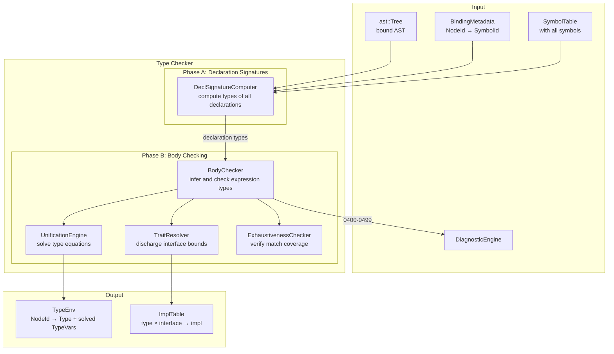

# RFC 0005: Type System Architecture

## Summary

This RFC defines the ZOM type checker: the compiler stage that consumes the
bound AST (from RFC 0004) and produces a fully type-annotated intermediate
representation. The type checker assigns a type to every expression, verifies
that all operations are type-safe, discharges trait/interface bounds, checks
pattern matching exhaustiveness, and enforces the permission and marker
discipline defined in `compiler-contracts.md`.

The design centers on a **constraint-based inference engine** that collects
type equations from the AST body and solves them via first-order unification.
Generic functions are monomorphized at call sites; trait bounds are discharged
by searching the impl table; error types propagate through expressions that
depend on failed sub-expressions. The checker is fail-closed: any type error
produces a diagnostic and marks the offending subtree with the error type,
preventing cascading nonsense errors.

## Motivation

The binder resolves *names* but not *types*. After binding, we know that
`IdentifierExpr("x")` refers to the `let x = 5` declaration, but we don't
yet know that `x` has type `i32`. The type checker must answer:

1. What is the type of every expression and declaration?
2. Does this function call satisfy the parameter types?
3. Does this type satisfy all required trait bounds?
4. Is this `match` exhaustive over all enum variants?
5. Is this `spawn` block capturing only `Send` types?
6. Does this `?!` operator return from a function with a `raises` clause?

Without a type checker, the code generator cannot emit correct machine
instructions (it doesn't know operand sizes, calling conventions, or vtable
layout), and the user has no guarantee that their program is well-typed.

The current `TypeChecker` in `checker/checker.h` is an empty stub. This RFC
specifies the complete type checking contract.

## Goals

- **G1.** Every expression and declaration in the AST has a determined type
  after type checking, or is marked with the error type.
- **G2.** Type inference is complete for intra-expression and intra-function
  inference. Top-level declarations require explicit type annotations (no
  global inference, per architecture.md NON-GOALS).
- **G3.** Generic functions are type-checked parametrically and instantiated
  (monomorphized) at call sites with concrete type arguments.
- **G4.** Trait/interface bounds are discharged by searching the impl table;
  coherence is enforced (no overlapping impls for the same type+trait).
- **G5.** Pattern matching is checked for exhaustiveness and redundancy.
- **G6.** Error types propagate cleanly: one source error → one diagnostic,
  downstream expressions get `Error` type without additional diagnostics.
- **G7.** Permission checking (`mut`, `borrow`, `own`) is enforced at the
  type level.
- **G8.** Marker types (`Send`, `Sync`, `SuspendSafe`) are derived and
  checked for concurrency safety.
- **G9.** The `raises` clause and `?!` / `!!` operators are integrated into
  the type system.
- **G10.** All diagnostics in the 0400–0499 range per
  `compiler-contracts.md` §2.

## Non-Goals

- **NG1.** Lifetime analysis (borrow checker). The type checker verifies
  type safety but not lifetime safety. A separate borrow checker (future
  RFC) handles `own`/`borrow`/`mut` permission verification beyond basic
  mutability checking.
- **NG2.** Effect system beyond `raises`. The type checker tracks error
  effects but not allocation effects, I/O effects, or concurrency effects
  (those are marker-type concerns handled at a different level).
- **NG3.** Cross-crate type checking in v1. Like the binder, the type
  checker operates within a single compilation unit's `TypeEnv`.
  Cross-crate monomorphization is a `CompilerSession` concern.
- **NG4.** Incremental type checking. Full re-check per compilation.
- **NG5.** Type-level computation (dependent types, GADTs, type-level
  functions). Architecture.md explicitly excludes GADTs.
- **NG6.** Implicit type conversions beyond the explicitly sanctioned
  `&T → &U` unsizing and numeric widening at explicit `as` cast sites.

## Prior Art

### Rust — `rustc_trait_selection` + `rustc_typeck`

Rust's type checker is split into:
- **`rustc_hir_typeck`** — type inference using a combination of
  Hindley-Milner unification and local type inference.
- **`rustc_trait_selection`** — trait bound discharge using a
  goal-directed search with coherence checking.
- **`rustc_borrowck`** — NLL (Non-Lexical Lifetimes) borrow checker,
  separate from the type checker proper.

Key lessons:
- **Copy:** Separation of type inference from trait selection from borrow
  checking. ZOM follows the same three-phase separation.
- **Copy:** Error type propagation (`TyKind::Err`) that suppresses
  cascading errors.
- **Copy:** `Obligation` / `Predicate` model for trait bounds — each
  bound is an obligation that must be discharged.
- **Avoid:** The complexity of Rust's `impl Trait` / `dyn Trait` /
  `async fn` return position impl Trait interaction. ZOM v1 has explicit
  return types only.
- **Avoid:** The Chalk recursive solver complexity. ZOM v1 uses a simpler
  impl-table search with no negative reasoning.

**Relevance:** Directly applicable. ZOM's type system is a simplified Rust
(no lifetimes in the type checker, no `dyn Trait` object safety concerns
in v1).

### Swift — `Sema` (Semantic Analysis)

Swift's type checker is a single integrated pass that performs name
resolution, type inference, and protocol conformance checking together.
It uses a "constraint system" approach where type inference generates
constraints that are solved by a simplex-like algorithm.

- **Copy:** The constraint system model where type inference generates
  equations (`T == U`, `T: Protocol`) that are solved together.
- **Copy:** "Solution" ranking — when multiple solutions exist, prefer
  the one with fewer implicit conversions.
- **Avoid:** The bidirectional type checking complexity for closures.
  ZOM uses simpler annotation-directed inference for closure parameters.

**Relevance:** Confirms that constraint-based inference is the right
approach for a language with generics and overloaded operators.

### Scala 3 — `dotc` Typer

Scala 3's type checker (`Typer`) is a tree transformer that assigns types
to every tree node. It uses a `Context` that carries the current type
environment, and implicit resolution is integrated into type inference.

- **Copy:** The idea that type checking is a tree transformation
  (`Tree => TypedTree`) rather than a side-effect on a side table. ZOM
  writes types to `TypeEnv` (a side table) but the conceptual model is
  the same.
- **Copy:** `Denotation` evolution — symbols gain type information as
  compilation progresses.
- **Avoid:** The complexity of path-dependent types and higher-kinded
  type inference. ZOM v1 has no type lambdas or type constructor
  polymorphism.

**Relevance:** The `TypeEnv` as a COW (copy-on-write) structure that
accumulates type assignments is directly inspired by dotc's context
passing.

### OCaml — `typecore.ml`

OCaml's type checker uses classic Hindley-Milner inference with
imperative type variables (union-find). It is the reference implementation
for the algorithm.

- **Copy:** Union-find for type variable unification. Efficient,
  well-understood.
- **Copy:** Levels-based generalization for let-polymorphism. ZOM uses
  explicit type parameters rather than implicit let-polymorphism, but
  the level-based approach informs how generic parameters are tracked.
- **Avoid:** The "value restriction" complexity. ZOM's explicit
  annotations avoid this.

**Relevance:** The unification engine design follows OCaml's proven
union-find with ranks.

## Guide-Level Explanation

When you write:

```zom
fun add(a: i32, b: i32) -> i32 {
  return a + b
}

fun main() {
  let x = add(1, 2)      // x inferred as i32
  let y: f64 = x as f64  // explicit cast, y is f64
  let z = x + y          // ERROR: cannot add i32 and f64
}
```

The type checker:

1. **Checks `add`:** Parameters `a` and `b` are `i32`. The body `a + b`
   has type `i32` (both operands are `i32`, `+` on `i32` returns `i32`).
   Return type `i32` matches. ✓

2. **Checks `main`:**
   - `add(1, 2)`: `1` and `2` are `i32` literals. `add` expects `i32`
     parameters. ✓ Return type is `i32`. So `x` is inferred as `i32`.
   - `x as f64`: `x` is `i32`, `f64` is a valid numeric cast target.
     ✓ `y` is `f64`.
   - `x + y`: `x` is `i32`, `y` is `f64`. `+` requires same-type operands.
     ✗ Emits `ZOM0411: cannot unify 'i32' with 'f64' in binary operator '+'`.
     The expression `x + y` gets type `Error`.

3. **Error propagation:** `let z = <error>` — `z` gets type `Error` too,
   but no additional diagnostic is emitted (the root cause is already
   reported).

### Generic Functions

```zom
fun identity<T>(x: T) -> T {
  return x
}

let s = identity("hello")  // T = str, returns str
let n = identity(42)       // T = i32, returns i32
```

At each call site, the type checker:
1. Infers the type argument `T` from the argument type.
2. Creates a fresh instantiation of the function body with `T` replaced.
3. Checks the instantiated body.

### Interface Bounds

```zom
interface Hashable {
  fun hash(self) -> u64
}

fun hash_pair<T: Hashable>(a: T, b: T) -> u64 {
  return a.hash() ^ b.hash()
}
```

The type checker verifies:
1. `a.hash()` is valid because `T: Hashable` — the bound says `T` has a
   `hash` method.
2. At the call site `hash_pair(x, y)`, it checks that the type of `x`
   implements `Hashable`.

## Reference-Level Design

### Architecture Overview



### Type Representation

Types are represented in the `TypeEnv` using a tagged union (`Type`):

```
Type =
  | PrimitiveType(kind)          // i32, f64, bool, str, char, unit, never, any
  | FunctionType(params, ret, raises)  // (T, U) -> V raises E
  | TupleType(elements)          // (T, U, V)
  | ObjectType(fields)           // {x: T, y: U}
  | ArrayType(element)           // [T]
  | NamedType(symbol, typeArgs)  // Vec<u8>, MyStruct
  | TypeVar(id)                  // fresh unknown, solved during inference
  | ErrorType                    // propagated from failed sub-expressions
  | InterfaceType(symbol)        // Hashable, Send (marker or full)
```

#### Type Identity

Two types are **structurally equal** when:
- Both are the same primitive kind.
- Both are function types with same parameter count, same parameter types
  (order matters), same return type, same raises set.
- Both are tuple types with same element types in same order.
- Both are object types with same field names and same field types
  (order does not matter for object types).
- Both are named types referring to the same symbol with same type arguments.
- Both are type variables with the same ID (after union-find resolution).
- `ErrorType` equals only itself.

**Subtyping** is intentionally limited in v1:
- `never` is a subtype of every type (empty type).
- `any` is a supertype of every type (top type).
- No other subtyping. No numeric widening without explicit `as`.
- No `dyn Trait` object types in v1.

#### Type Variables and Union-Find

Type variables (`TypeVar`) represent unknowns during inference. They are
managed by a union-find (disjoint set) data structure:

```
struct TypeVar {
  id: TypeVarId,
  parent: Option<TypeVarId>,  // union-find parent
  rank: u32,                  // union-find rank
  bound: Option<Type>,        // if Some, this var is bound to this type
  level: u32,                 // generalization level
}
```

**Unification** (`unify(t1, t2) -> Result<()>`):
1. Resolve both types through union-find (follow `parent` chains).
2. If either is `ErrorType`, succeed (error propagation).
3. If both are `TypeVar` with same id, succeed.
4. If one is an unbound `TypeVar`, bind it to the other type.
5. If both are the same primitive, succeed.
6. If both are function types: unify parameter types pairwise, unify
   return types, unify raises sets.
7. If both are named types: check same symbol, unify type args.
8. Otherwise, fail with `ZOM0411: cannot unify 'T1' with 'T2'`.

**Occurs check:** Before binding a type variable to a type, verify the
variable does not appear inside the type (prevents infinite types like
`T = List<T>`). If it does, fail with `ZOM0412: infinite type`.

### Type Environment (`TypeEnv`)

The `TypeEnv` is the checker's output, indexed by `NodeId`:

| Field | Type | Purpose |
|---|---|---|
| `type_of(node)` | `Type` | Assigned type for expression/declaration nodes |
| `type_var(id)` | `TypeVar` | Type variable state (union-find) |
| `impl_for(type, iface)` | `Option<ImplId>` | Which impl satisfies `type: Interface` |
| `is_error(node)` | `bool` | True if this node's type is `ErrorType` (for cascading suppression) |
| `generic_args(node)` | `[Type]` | Inferred type arguments for call expressions |

`TypeEnv` is append-only during a single check pass. Once a type is assigned
to a node, it does not change. (Type variables may become bound, but the
`type_of` entry for the node still points to the same `TypeVarId` whose
binding is resolved lazily.)

### Phase A: Declaration Signature Computation

Before checking function bodies, the checker computes the **signature type**
for every top-level and nested declaration. This enables mutual recursion
and forward references in type annotations.

Algorithm:

```
function compute_signatures(node: NodeId):
  switch node.kind:
    case FunctionDecl:
      params = [resolve_type(p.annotation) for p in node.params]
      ret = resolve_type(node.return_type)
      raises = resolve_raises(node.raises_clause)
      fn_type = FunctionType(params, ret, raises)
      type_env.set_type(node.symbol_id, fn_type)
      // Generic params are recorded but not yet constrained
      for tp in node.generic_params:
        type_env.register_generic_param(tp.symbol_id, tp.bounds)

    case ClassDecl, StructDecl:
      // Compute field types
      for field in node.fields:
        field_type = resolve_type(field.annotation)
        type_env.set_type(field.symbol_id, field_type)
      // Record method signatures (bodies checked in Phase B)
      for method in node.methods:
        compute_signatures(method)

    case LetDecl, ConstDecl:
      if node.type_annotation:
        type_env.set_type(node.symbol_id, resolve_type(node.type_annotation))
      // If no annotation, type will be inferred in Phase B

    case InterfaceDecl:
      // Record the interface as a type
      iface_type = InterfaceType(node.symbol_id)
      type_env.set_type(node.symbol_id, iface_type)
      // Record method signatures (required methods)
      for method in node.methods:
        compute_signatures(method)

    case ImplDecl:
      // Record that SelfType implements InterfaceType
      self_type = resolve_type(node.self_type)
      iface_type = resolve_type(node.interface)
      impl_table.insert(self_type, iface_type, node)
```

**Key property:** Phase A only resolves *type annotations* (which use
names already bound by the binder). It does not infer types from
expressions. This ensures all declaration signatures are available
before any body is checked.

### Phase B: Body Type Checking

Phase B walks each function/initializer body and infers types for every
expression. The algorithm is **annotation-directed local inference**:
type information flows from declared types (parameters, return types,
explicit annotations) inward to expressions, and from sub-expressions
outward to their parent.

#### Expression Type Rules

| Expression | Type Rule |
|---|---|
| Integer literal | Default `i32`, or unified with expected type. If literal exceeds `i32`, try `i64` → `u64` → error. |
| Float literal | Default `f64`, or unified with expected type. |
| String literal | `str` |
| Character literal | `char` |
| Boolean literal | `bool` |
| `null` | `null` type (unifies with any pointer/object type) |
| `unit` expression (`{}` or `()`) | `unit` |
| `IdentifierExpr` | Look up symbol's type from `TypeEnv`. If symbol is a generic parameter, return the `TypeVar` for that parameter. |
| `BinaryExpr(op, lhs, rhs)` | Infer `lhs` type, infer `rhs` type, unify them (for arithmetic/comparison), check `op` is valid for that type. Result type: arithmetic → same as operands; comparison → `bool`. |
| `UnaryExpr(op, expr)` | Infer `expr` type, check `op` validity. Result type: `-` → same as operand (numeric); `!` → `bool`; `*` → dereferenced type; `&` → reference type. |
| `CallExpr(callee, args)` | Infer `callee` type (must be `FunctionType`). If generic, infer type args from arg types. Unify each arg type with parameter type. Result type = function return type (with raises unioned). |
| `MemberExpr(obj, member)` | Infer `obj` type. Look up `member` in the type's fields/methods. Result type = field/method type. |
| `IndexExpr(arr, idx)` | Infer `arr` type (must be `[T]` or `[T; N]`). Infer `idx` type (must be `usize` or `isize`). Result type = `T`. |
| `IfExpr(cond, then, else)` | `cond` must unify with `bool`. Infer `then` and `else` types, unify them. Result type = unified type. |
| `BlockExpr(stmts, last)` | Type of last expression (or `unit` if empty). |
| `ReturnExpr(value)` | `value` type must unify with enclosing function's return type. Result type = `never` (return does not produce a value). |
| `MatchExpr(scrutinee, arms)` | Infer scrutinee type. Check each arm pattern against scrutinee type. Infer arm body types, unify all. Check exhaustiveness. Result type = unified arm body type. |
| `LambdaExpr(params, body)` | Infer parameter types from annotations (or fresh type vars if untyped). Infer body type. Result type = `FunctionType`. |
| `StructLiteral(type, fields)` | Resolve `type`. For each field, unify value type with declared field type. Result type = `type`. |
| `ArrayLiteral(elems)` | Infer all element types, unify them. Result type = `[ElemType]`. |
| `AsExpr(expr, target_type)` | Check that `expr` type can be cast to `target_type` (numeric cast, pointer cast, or interface upcast). Result type = `target_type`. |
| `ErrorPropagateExpr(expr)` (i.e., `expr?!`) | `expr` type must be `T \| E` (error union). The enclosing function must have `raises E` in its signature. Result type = `T`. |
| `ErrorUnwrapExpr(expr)` (i.e., `expr!!`) | `expr` type must be `T \| E`. Result type = `T`. If `expr` evaluates to `E` at runtime, it panics. |

#### Statement Type Rules

| Statement | Rule |
|---|---|
| `LetDecl(pattern, type, init)` | Infer `init` type. If `type` annotation present, unify. Bind pattern variables to the inferred type. |
| `ConstDecl` | Same as `let` but the type must be `const`-evaluable (compile-time constant). |
| `ExprStmt(expr)` | Infer `expr` type (discarded, but side effects checked). |
| `WhileStmt(cond, body)` | `cond` must unify with `bool`. Body checked for side effects. |
| `ForStmt(pattern, iter, body)` | `iter` must be iterable (has `iterator()` method returning something with `next()`). Pattern bound to element type. |
| `DeferStmt(body)` | Body checked in the enclosing scope. Executed at scope exit. |
| `ErrdeferStmt(body)` | Like `defer` but only executed if the scope exits with an error. |

#### Generic Instantiation

When a generic function is called:

```
function instantiate(fn_type: FunctionType, type_args: [Type]) -> FunctionType:
  // Create fresh type variables for each generic parameter
  substitution = {}
  for i, gp in enumerate(fn_type.generic_params):
    if i < type_args.length:
      // Explicit type argument provided
      check_bounds(type_args[i], gp.bounds)
      substitution[gp.id] = type_args[i]
    else:
      // Will be inferred from argument types
      fresh = type_env.new_type_var()
      substitution[gp.id] = fresh

  // Substitute in parameter types and return type
  new_params = [substitute(p, substitution) for p in fn_type.params]
  new_ret = substitute(fn_type.ret, substitution)
  new_raises = substitute(fn_type.raises, substitution)

  return FunctionType(new_params, new_ret, new_raises, is_instantiation=true)
```

**Type argument inference** (when `<T>` is omitted at call site):
1. Create fresh type variables for all unspecified generic parameters.
2. Unify argument types with (substituted) parameter types.
3. After unification, read off the solved type variables.
4. Verify that all type arguments are fully determined (no remaining
   unsolved type vars — if so, emit `ZOM0420: cannot infer type parameter 'T'`).

### Trait / Interface Resolution

The `TraitResolver` discharges interface bounds by searching the impl table.

#### Impl Table

```
ImplTable = Map<(TypeId, InterfaceId), ImplRecord>

struct ImplRecord {
  impl_node: NodeId,           // the impl declaration
  self_type: Type,             // the implementing type
  interface: InterfaceId,      // the implemented interface
  method_bindings: Map<MethodId, MethodImpl>,  // maps iface method → impl method
}
```

#### Bound Discharge

```
function satisfies(type: Type, iface: InterfaceId) -> Result<ImplRecord, TraitError>:
  // 1. Direct impl lookup
  if impl = impl_table.lookup(type, iface):
    return Ok(impl)

  // 2. Auto-derived impls (marker traits)
  if iface is Send:
    if type is Send-compatible (all fields Send):
      return Ok(auto_derived_send(type))

  if iface is Sync:
    if type is Sync-compatible (all fields Sync):
      return Ok(auto_derived_sync(type))

  // 3. Blanket impl (if any)
  if blanket = impl_table.find_blanket(iface):
    if type matches blanket.self_pattern:
      return Ok(blanket.instantiate(type))

  // 4. Not found
  return Err(TraitError::NotImplemented(type, iface))
```

#### Coherence

The coherence check ensures no two impls overlap for the same
`(type, interface)` pair:

```
function check_coherence():
  for each impl in impl_table:
    for each other_impl in impl_table where other_impl != impl:
      if impl.self_type overlaps(other_impl.self_type) and
         impl.interface == other_impl.interface:
        emit(ZOM0430, "conflicting implementations of '{iface}' for '{type}'")
```

**Overlap** is defined as: there exists any concrete type that could
match both `impl.self_type` and `other_impl.self_type`. For v1, this is
a simple structural check (same named type, or one is a blanket that
covers the other's concrete type).

### Pattern Matching and Exhaustiveness

The `ExhaustivenessChecker` verifies that a `match` expression covers
all possible values of the scrutinee type.

#### Algorithm

For a `match` with scrutinee type `T` and patterns `P1..Pn`:

1. **Compute usefulness matrix:** For each pattern `Pi`, determine which
   values of `T` it matches.
2. **Check coverage:** The union of all `Pi` must cover all values of `T`.
3. **Check redundancy:** No pattern `Pi` should be entirely subsumed by
   patterns `P1..Pi-1` (otherwise it can never match).

#### Pattern Types

| Pattern | Matches When |
|---|---|
| `WildcardPattern` (`_`) | Everything |
| `LiteralPattern(val)` | Values equal to `val` |
| `IdentifierPattern(name)` | Everything (binds to `name`) |
| `EnumPattern(Enum::Variant, sub_pats)` | Values that are `Variant` with fields matching `sub_pats` |
| `StructPattern(type, field_pats)` | Values of `type` with fields matching `field_pats` |
| `TuplePattern(elems)` | Tuples with elements matching `elems` |
| `RangePattern(start, end)` | Values in `[start, end)` |
| `OrPattern(p1, p2)` | Values matching `p1` OR `p2` |
| `TypePattern(type)` | Values of dynamic type `type` (for `any` downcast) |

#### Exhaustiveness for Enums

For enum scrutinee `E` with variants `V1..Vn`:
- The patterns must collectively cover all `Vi`.
- If a wildcard or identifier pattern exists, it covers any remaining
  variants not explicitly matched.
- If not all variants are covered and no wildcard exists:
  `ZOM0440: non-exhaustive match; missing variants: V1, V2`.

#### Exhaustiveness for Booleans

For `bool` scrutinee:
- Must cover `true` and `false` (or have a wildcard).

#### Exhaustiveness for Integers

For integer scrutinee:
- If patterns include a wildcard or identifier: exhaustive.
- If patterns are only literals/ranges: not exhaustive (infinite values
  not covered by finite ranges) → `ZOM0441: integer match is not exhaustive; add a wildcard arm`.

### Error Type Propagation

The type checker follows the **"one source error, one diagnostic"**
principle:

1. When a sub-expression fails type checking, it gets type `ErrorType`.
2. Parent expressions of an `ErrorType` child get `ErrorType` without
   emitting an additional diagnostic.
3. The `is_error(node)` flag in `TypeEnv` tracks whether a node's type
   is `ErrorType` due to a failed sub-expression.

```
function propagate_error(node: NodeId) -> Type:
  type_env.set_is_error(node, true)
  return ErrorType
```

**Exception:** Pattern exhaustiveness errors are always reported even if
the scrutinee has `ErrorType` — an inexhaustive match on an error type
is still a bug in the user's code structure.

### Permission and Mutability Checking

The type checker enforces basic permission rules (full borrow checking
is a separate future stage):

| Rule | Diagnostic |
|---|---|
| Cannot mutate immutable binding through `mut` ref | `ZOM0450: cannot mutate immutable variable '{name}'` |
| Cannot call `mut` method on non-`mut` reference | `ZOM0451: method '{name}' requires mutable receiver` |
| Cannot move out of non-`own` binding | `ZOM0452: cannot move out of borrowed context` |
| `&mut T` does not coerce to `&T` implicitly | `ZOM0453: requires explicit reborrow` |

Full lifetime tracking (ensuring references don't outlive their referents)
is the borrow checker's job, not the type checker's.

### Marker Type Derivation

Marker types (`Send`, `Sync`, `SuspendSafe`) are auto-derived for
user-defined types based on their fields:

```
function derive_marker(type: Type, marker: InterfaceId) -> bool:
  if type is a primitive (i32, f64, bool, char, str, unit):
    return true  // all primitives are Send + Sync

  if type is a struct/class:
    for each field in type.fields:
      if not satisfies(field.type, marker):
        return false
    return true

  if type is an enum:
    for each variant in type.variants:
      for each field in variant.fields:
        if not satisfies(field.type, marker):
          return false
    return true

  if type is a function type:
    return marker == Send  // function pointers are Send but not Sync

  if type is a reference &T:
    if marker == Sync:
      return satisfies(T, Sync)  // &T is Sync iff T is Sync
    if marker == Send:
      return satisfies(T, Sync)  // &T is Send iff T is Sync
    return false

  return false  // unknown types: not auto-derived
```

Users may opt out of auto-derivation with `impl !Send for MyType {}`
(negative impl), or explicitly assert with `unsafe impl Send for MyType {}`.

### `raises` Integration

The `raises` clause is part of a function's type:

```
FunctionType = {
  params: [Type],
  ret: Type,
  raises: TypeSet,    // empty set = no raises
}
```

Rules:
1. A function with `raises {E1, E2}` may use `?!` on error unions
   containing `E1` or `E2`.
2. Using `?!` on an error union with error type `E` requires `E` to be
   in the enclosing function's `raises` set. If not: `ZOM0460: '?!'
   propagates error type '{E}' but function does not raise '{E}'`.
3. Calling a function that raises `{E}` inside a function that does
   NOT raise `{E}` requires handling the error (match or `!!`).
4. `!!` on an error union panics on error, so it does not require the
   enclosing function to raise anything.

### Diagnostic Catalog (0400–0499)

| Code | Severity | Message Template |
|---|---|---|
| ZOM0401 | Error | `missing type annotation for '{name}'; top-level declarations require explicit types` |
| ZOM0410 | Error | `type mismatch: expected '{expected}', found '{actual}'` |
| ZOM0411 | Error | `cannot unify '{expected}' with '{actual}' in {context}` |
| ZOM0412 | Error | `infinite type: {description}` |
| ZOM0413 | Error | `cannot apply operator '{op}' to type '{type}'` |
| ZOM0414 | Error | `binary operator '{op}' requires same-type operands, got '{lhs}' and '{rhs}'` |
| ZOM0415 | Error | `cannot call non-function type '{type}'` |
| ZOM0416 | Error | `function expects {n} parameters, got {m}` |
| ZOM0417 | Error | `argument type mismatch: parameter {i} expects '{expected}', got '{actual}'` |
| ZOM0418 | Error | `no field '{name}' on type '{type}'` |
| ZOM0419 | Error | `no method '{name}' on type '{type}'` |
| ZOM0420 | Error | `cannot infer type parameter '{name}'; provide explicit type arguments` |
| ZOM0421 | Error | `type parameter '{name}' does not satisfy bound '{bound}'` |
| ZOM0430 | Error | `conflicting implementations of '{interface}' for '{type}'` |
| ZOM0431 | Error | `'{type}' does not implement '{interface}'` |
| ZOM0432 | Error | `ambiguous method call: '{name}' could be from '{iface1}' or '{iface2}'` |
| ZOM0440 | Error | `non-exhaustive match; missing variants: {variants}` |
| ZOM0441 | Error | `match on integer type is not exhaustive; add a wildcard arm` |
| ZOM0442 | Warning | `unreachable match arm: pattern never matches` |
| ZOM0443 | Error | `pattern type mismatch: cannot match '{pattern}' against '{scrutinee}'` |
| ZOM0450 | Error | `cannot mutate immutable variable '{name}'` |
| ZOM0451 | Error | `method '{name}' requires mutable receiver` |
| ZOM0452 | Error | `cannot move out of borrowed context` |
| ZOM0453 | Error | `requires explicit reborrow: '{from}' → '{to}'` |
| ZOM0460 | Error | `'?!' propagates error type '{error}' but function does not raise '{error}'` |
| ZOM0461 | Error | `'!!' on non-error-union type '{type}'` |
| ZOM0462 | Error | `unhandled error: function raises '{raises}' but error is not propagated` |
| ZOM0470 | Error | `'{type}' is not 'Send'; cannot spawn across thread boundary` |
| ZOM0471 | Error | `'{type}' is not 'Sync'; cannot share across thread boundary` |
| ZOM0480 | Error | `return type mismatch: expected '{expected}', found '{actual}'` |
| ZOM0481 | Error | `missing return in function returning '{type}'` |
| ZOM0490 | Note | `required by bound '{bound}' declared here` (attached to ZOM0421) |
| ZOM0491 | Note | `type '{type}' defined here` (attached to various errors) |

### Invariants

| ID | Invariant | Enforcement |
|---|---|---|
| TC-01 | After Phase A, every declaration symbol has a signature type in `TypeEnv`. | `compute_signatures` visits all declaration nodes. |
| TC-02 | After Phase B, every expression node has a type in `TypeEnv`. | Body checker visits every expression node. |
| TC-03 | `TypeVar` union-find is path-compressed after every find. | `find()` implementation performs path compression. |
| TC-04 | No type variable appears in its own binding (occurs check). | Enforced during unification. |
| TC-05 | Error types propagate without additional diagnostics. | `is_error` flag suppresses child diagnostics. |
| TC-06 | Impl table is coherent after coherence check. | `check_coherence()` runs before body checking. |
| TC-07 | The type checker never modifies the AST or `BindingMetadata`. | Both are `const` in checker entry points. |
| TC-08 | `raises` sets are monotonic: calling a function that raises `E` inside a function that also raises `E` is fine. | Raises union during call type computation. |
| TC-09 | Exhaustiveness checking never reports false positives (claiming exhaustive when not). | Usefulness matrix covers all pattern forms. |
| TC-10 | Marker derivation is structural: a struct is `Send` iff all its fields are `Send`. | `derive_marker` recursively checks fields. |

### Fail-Closed Contract

The type checker is **fail-closed**:

1. If any expression cannot be typed, it gets `ErrorType` and a diagnostic
   is emitted.
2. If a function body has any error, the function's type in `TypeEnv` is
   still valid (the signature is from Phase A), but the body is flagged.
3. `TypeChecker::check()` returns `false` if any error-severity diagnostic
   was emitted.
4. The checker never silently assigns `any` to an untypeable expression.

## Repository Impact

| Area | Paths | Owner |
|---|---|---|
| Type checker implementation | `products/zomlang/compiler/checker/**` | `binder-checker` |
| Type representation | `products/zomlang/compiler/checker/type.h`, `type.cc` | `binder-checker` |
| Unification engine | `products/zomlang/compiler/checker/unification.h`, `unification.cc` | `binder-checker` |
| Trait resolver | `products/zomlang/compiler/checker/trait-resolver.h`, `trait-resolver.cc` | `binder-checker` |
| Exhaustiveness checker | `products/zomlang/compiler/checker/exhaustiveness.h`, `exhaustiveness.cc` | `binder-checker` |
| Type environment | `products/zomlang/compiler/checker/type-env.h`, `type-env.cc` | `binder-checker` |
| Diagnostics | `products/zomlang/compiler/diagnostics/diagnostics-checker.def` | `error-system` |
| Driver integration | `products/zomlang/compiler/driver/**` | `module-system` |
| Spec alignment | `docs/spec/chapters/03-types.md`, `04-expressions.md`, `09-interfaces.md`, `11-error-handling.md`, `12-generics.md` | `spec-audit` |
| Tests | `products/zomlang/tests/unittests/compiler/checker/*-test.cc` | `verification` |
| Design docs | `docs/design/compiler-contracts.md` §7 (B2T contract) | `rfc` |

## Security And Safety Impact

The type checker is the primary gate for memory safety and concurrency
safety guarantees:

- **Type safety prevents undefined behavior:** Incorrect type checking
  could allow a program to treat an `i32` as a pointer, leading to
  arbitrary memory access. The unification engine and type representation
  must be correct.
- **`Send`/`Sync` prevents data races:** If the marker derivation is
  wrong, a non-thread-safe type could be sent across threads, causing
  data races.
- **`raises` enforcement prevents unhandled errors:** If `?!` is allowed
  in a function that doesn't raise, the error could silently escape.
- **Exhaustiveness prevents undefined behavior from partial matches:**
  If the checker claims a match is exhaustive when it isn't, the runtime
  could hit an unmatched value and crash (or worse, execute UB).

The checker's fail-closed design is the security boundary: any uncertainty
produces an error, not a guess.

## Drawbacks And Risks

| Risk | Mitigation |
|---|---|
| Monomorphization can cause code bloat. | Limit monomorphization depth. Provide `dyn` trait objects in a future RFC for cases where monomorphization is excessive. |
| Exhaustiveness checking for complex patterns is NP-hard. | ZOM v1 patterns are simple (enum variants, literals, wildcards). The usefulness matrix approach is O(patterns × variants) which is fine for typical enums (< 32 variants). |
| Trait coherence checking may reject valid separate compilation. | Cross-crate coherence is a `CompilerSession` concern. Within a single crate, the check is exact. |
| Error type propagation may hide real bugs if `ErrorType` is assigned too eagerly. | The `is_error` flag is set only for direct children of failed nodes. Independent expressions in the same scope get their own checking. |
| Two-phase design (signatures then bodies) requires walking declarations twice. | Acceptable cost. Phase A is cheap (no expression inference). The benefit is that mutual recursion works naturally. |

## Alternatives Considered

### Alternative A: Full Hindley-Milner with Let-Polymorphism

Classic ML-style inference where `let` bindings get polymorphic types
automatically.

- **Rejected because:** Architecture.md explicitly forbids "global type
  inference." Let-polymorphism makes inference non-modular (the type of
  a function depends on its usage sites). Explicit type parameters are
  clearer and more predictable for a systems language.

### Alternative B: Bidirectional Type Checking Only

No type variables at all. Types flow from annotations downward and from
sub-expressions upward, but no unification.

- **Rejected because:** Cannot handle generic function instantiation
  without explicit type arguments. The user would have to write
  `identity::<str>("hello")` every time instead of `identity("hello")`.
  Unification is necessary for ergonomic generics.

### Alternative C: Type Checker as a Tree Transformer (dotc-style)

Instead of writing types to a side table, the checker produces a new
"typed AST" tree where every node carries its type inline.

- **Rejected because:** Doubles memory usage (two AST trees). The
  side-table approach (`TypeEnv` indexed by `NodeId`) is more memory
  efficient and allows the original AST to remain immutable. The
  conceptual model is equivalent.

### Alternative D: Trait Resolution via Logic Programming (Chalk-style)

Model trait resolution as a Prolog-like goal-directed search with
negation-as-failure.

- **Rejected because:** Over-engineered for v1. The impl-table lookup
  with auto-derivation and blanket impls covers the v1 use cases.
  Chalk-style resolution can be added later if needed for more
  advanced trait features (specialization, associated type defaults).

## Compatibility And Rollout

This is a new implementation. There is no existing type checker
behavior to preserve. Rollout steps:

1. Implement `Type` representation and `TypeEnv`.
2. Implement unification engine with unit tests.
3. Implement `DeclSignatureComputer` (Phase A).
4. Implement `BodyChecker` (Phase B) with expression type rules.
5. Implement `TraitResolver` with impl table and coherence.
6. Implement `ExhaustivenessChecker`.
7. Implement marker derivation and `raises` integration.
8. Wire into `CompilerSession` / driver after binding.
9. Add conformance tests for type checking.
10. Enable the type checker in the default pipeline.

Rollback: remove the type checker call from the driver. The binder still
runs and produces resolved names.

## Documentation And Teaching Plan

| Document | Change |
|---|---|
| `docs/design/compiler-contracts.md` §7 | Expand B2T (Binder-to-TypeChecker) contract with the invariants from this RFC. |
| `docs/design/architecture.md` §3 | Update pipeline diagram to show checker phases. |
| `docs/spec/chapters/03-types.md` | Add cross-reference to type representation and equality rules. |
| `docs/spec/chapters/12-generics.md` | Clarify that generic instantiation is monomorphization. |
| Developer docs | Add "How to add a new type rule" and "How to add a new diagnostic" guides. |

## Operational Readiness

- **CI:** Type checker unit tests run as part of `ctest --preset default`.
- **Fuzzing:** The unification engine and exhaustiveness checker are
  natural fuzz targets. Add to the fuzz harness.
- **Performance:** Type checking should be < 20% of total compile time.
  The `--timings` flag reports per-stage wall time.
- **Ownership:** `binder-checker` subagent owns type checker maintenance.
  `error-system` owns the diagnostic definitions. `module-system` owns
  driver integration.

## Acceptance Criteria

1. **Type representation:** All type forms (primitive, function, tuple,
   object, array, named, type var, error) are representable in `TypeEnv`.
   Unit test: construct each form, verify structural equality.
2. **Unification:** The unification engine correctly unifies:
   - Identical primitives ✓
   - Function types with matching params/return ✓
   - Type variables to concrete types ✓
   - Error type with anything ✓
   - Fails on mismatched types with ZOM0411 ✓
   - Occurs check prevents infinite types ✓
3. **Declaration signatures:** Phase A correctly computes types for all
   `fun`, `class`, `struct`, `interface`, `let`, `const` declarations.
   Unit test with a multi-declaration file.
4. **Expression type inference:** Every expression form listed in §Expression
   Type Rules produces the correct type. Unit tests per expression kind.
5. **Generic instantiation:** Calling a generic function infers type
   arguments from arguments. Conformance test: `identity(42)` returns `i32`.
6. **Explicit type args:** `identity::<f64>(42.0)` works. Unit test.
7. **Trait bound discharge:** `fun f<T: Hashable>(x: T)` requires callers
   to pass types that implement `Hashable`. Non-implementing type → ZOM0431.
8. **Coherence:** Two impls of the same interface for the same type →
   ZOM0430.
9. **Exhaustiveness:** Match on enum without wildcard and missing variants
   → ZOM0440. Match with wildcard → passes.
10. **Redundancy:** Pattern after wildcard → ZOM0442 (warning).
11. **Error propagation:** One type error → one diagnostic. Dependent
    expressions get `ErrorType` silently.
12. **`?!` integration:** `?!` in function without matching `raises` →
    ZOM0460.
13. **`!!` integration:** `!!` on non-error-union → ZOM0461.
14. **`Send`/`Sync` derivation:** Struct with all-`Send` fields is `Send`.
    Struct with non-`Send` field is not. `unsafe impl Send` overrides.
15. **Mutability checking:** Mutating immutable variable → ZOM0450.
16. **Fail-closed:** `TypeChecker::check()` returns `false` on errors.
17. **No AST mutation:** After checking, the AST is byte-identical.
18. **`check-rfc.py` passes.**
19. **`check-format.py` passes.**
20. **All existing 742+ tests still pass.**

## Implementation Plan

1. **Type representation** — Implement `Type` tagged union in
   `checker/type.h` + `type.cc`.
2. **Type environment** — Implement `TypeEnv` with `NodeId`-indexed
   storage in `checker/type-env.h` + `type-env.cc`.
3. **Unification engine** — Implement union-find type variables and
   `unify()` in `checker/unification.h` + `unification.cc`.
4. **Decl signature computer** — Phase A implementation.
5. **Body checker** — Phase B expression type inference.
6. **Trait resolver** — Impl table and bound discharge.
7. **Exhaustiveness checker** — Pattern usefulness matrix.
8. **Marker derivation** — `Send`/`Sync` auto-derive.
9. **`raises` integration** — Error union type and `?!`/`!!` checking.
10. **Permission checking** — Basic mutability enforcement.
11. **Add checker diagnostics** — Create `diagnostics-checker.def`.
12. **Wire into driver** — Call checker after binder.
13. **Update `compiler-contracts.md`** — Document B2T invariants.

## Test Plan

- **Build:** `cmake --build --preset debug` passes.
- **Unit tests:** New `type-test.cc` (type representation, equality),
  `unification-test.cc` (unification, occurs check, error propagation),
  `checker-test.cc` (expression inference, declaration signatures),
  `trait-resolver-test.cc` (bound discharge, coherence),
  `exhaustiveness-test.cc` (enum coverage, integer patterns, redundancy).
  Target: ≥ 100 unit tests.
- **Lit tests:** Add conformance tests under
  `products/zomlang/tests/conformance/corpus/03-types/`,
  `04-expressions/type-inference*`, `09-interfaces/`, `11-error/`.
- **Conformance:** Existing 667 conformance tests must still pass.
  New tests for type inference, trait bounds, exhaustiveness, raises.
- **Generated files:** None.
- **Format:** `python3 scripts/check-format.py` passes.
- **RFC check:** `python3 scripts/check-rfc.py` passes.

## Open Questions

None.

## Status History

| Date | Status | Notes |
|---|---|---|
| 2026-07-05 | DRAFT | Initial draft of complete type system architecture. Covers type representation, unification, two-phase checking, trait resolution, exhaustiveness, error propagation, marker derivation, raises integration, and 20 acceptance criteria. |
