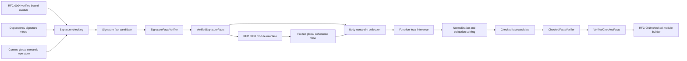

# RFC 0005: Type System Architecture

## Summary

This RFC defines type checking as two verified phases that consume one RFC 0004
bound-module capability: signature checking publishes immutable module
interfaces before global coherence freezes, then body checking solves local
inference and publishes complete immutable checked facts. It defines two
deliberately separate type domains:

- a mutable, function-local inference domain containing variables and recovery
  errors;
- a branded, session-owned `SemanticTypeStore` mapping `SemanticTypeId` to
  immutable canonical `TypeData`.

Successful facts contain only semantic type IDs, complete coercion
adjustments, normalized declarations and attributes, trait and marker results,
constant and pattern facts, raises, unsafe-operation requirements, captures,
and the typed call-site inputs consumed by RFC 0009. A failed check may retain
recovery data for diagnostics but cannot
publish verified checked facts or enter RFC 0010 HIR construction.

## Motivation

The type checker is the semantic boundary between source-shaped syntax and
compiler representations that assume meaning is complete. A type handle is
not canonical when it is only an insertion-ordered integer for a rendered
string. Nominal identity is not sound when two declarations with the same name
compare equal. Checked facts are not immutable when callers can overwrite node
types after solving.

The live implementation demonstrates the gaps this contract must close:

- the current interner cannot recover immutable `TypeData` from an ID;
- numeric IDs have no semantic-context brand;
- named types, impl tables, and coherence caches use spelling or rendered type
  strings;
- node types are stored both as owned polymorphic trees and as IDs;
- inference variables, recovery types, and purported semantic types share one
  mutable representation;
- only dispatch facts freeze, while other checked facts remain mutable;
- coercion and call facts omit adjustments required by RFC 0010;
- compound assignment syntax is not mapped to its operator trait semantics.

RFC 0011 provides context branding and definition/impl identity. RFC 0004
provides verified name binding. This RFC establishes the only semantic type and
checked-fact contract consumed by RFC 0008 module interfaces and RFC 0010.

## Goals

- Separate mutable inference types from immutable semantic types.
- Define a total, branded `SemanticTypeId -> TypeData` store with online
  canonical interning.
- Use `DefId` and `ImplId` for nominal, interface, projection, and impl
  identity.
- Define structural canonical keys independent of spelling, object address,
  and insertion order.
- Make all successful node, declaration, coercion, call, literal, constant,
  aggregate, capture, observed-operation, marker, and exhaustiveness facts
  complete and immutable.
- Define explicit equality, unification, subtyping, coercion, trait,
  associated-type, dyn, union, optional-normalization, cast, and operator rules.
- Verify complete signature facts and body facts through separate closed
  verifier results and deterministic revisions.
- Provide executable conformance and architecture gates.

## Non-Goals

- This RFC does not perform name resolution or allocate definitions; RFC 0004
  and RFC 0011 own those operations.
- This RFC does not discover modules or publish cross-module interfaces; RFC
  0008 owns session scheduling and interfaces.
- This RFC does not define borrow-region dataflow, drop elaboration, or linear
  consume paths; RFC 0007 and RFC 0010 own those operations.
- This RFC does not define target layout, ABI, monomorphization, or native code
  generation.
- This RFC does not keep the existing polymorphic `Type` hierarchy or local
  `TypeId` as a compatibility layer.
- This RFC does not introduce implicit let-polymorphism.

## Prior Art

### Rust Inference And Interned Types

Rust separates inference variables from interned semantic types and uses
definition identity for nominal types and trait implementations. ZOM should
copy that separation and the rule that successful type-check results contain
no unresolved inference variables.

References:

- <https://rustc-dev-guide.rust-lang.org/type-inference.html>
- <https://rustc-dev-guide.rust-lang.org/ty.html>

### Swift Constraint Solver

Swift collects constraints, solves overload and conversion choices, and writes
resolved expression information back as checked semantic structure. ZOM should
copy explicit constraints and recorded conversions while bounding inference to
declarations and bodies.

Reference: <https://www.swift.org/documentation/swift-compiler/>

### Go Types

Go distinguishes named type identity from underlying structural type and
performs assignment conversion only at defined sites. ZOM should copy explicit
nominal identity and deterministic, limited conversion sites.

Reference: <https://go.dev/ref/spec#Properties_of_types_and_values>

### MLIR And LLVM Context-Local Uniquing

MLIR and LLVM unique immutable type payloads inside one context. ZOM should
copy context-local online interning and keep numeric storage slots
non-observable.

References:

- <https://mlir.llvm.org/docs/DefiningDialects/TypesAndAttributes/>
- <https://llvm.org/doxygen/classllvm_1_1LLVMContext.html>

### Common Failure Modes

This design prevents three recurring failures:

1. Recovery types leak into code generation. ZOM publishes no verified facts
   after any unresolved variable or recovery error.
2. Name-based nominal identity merges unrelated declarations. ZOM nominal
   payloads contain `DefId`.
3. Implicit conversions are recomputed differently downstream. ZOM records one
   complete coercion adjustment at the checked site.

## Guide-Level Explanation

Type annotations and inference produce the same canonical semantic types:

```zom
let count: i32 = 42;
let inferred = 42;
```

The inference solver may use a local variable while checking `inferred`, but
successful checked facts record only the canonical `SemanticTypeId` for `i32`.

Nominal types use declaration identity:

```zom
module first;
export struct Item { value: i32 }
```

Another module may declare a type also named `Item`; the two types differ
because their `DefId` values differ.

Coercions are explicit semantic facts. Passing `&mut T` where `&T` is expected,
injecting `T` into `T | E`, or erasing `Concrete` into `dyn Interface` records
the exact source type, destination type, adjustment sequence, selected union
alternative or dyn witness, and source span.

Compound assignment is checked through the operator trait assigned by RFC
0009. `value += rhs` cannot bypass `Add` lookup or its signature rules.

## Reference-Level Design

RFC 0015 remains authoritative for the canonical impl-pattern, impl-head,
marker-evidence, signature, and coherence codecs. RFC 0018 is authoritative for
their source-publication bridge: every implementation source occurrence has an
independently verified occurrence key, Binder fact, and impl-body scope under
one shared stable `ImplId` authority per equal identity group. Source
occurrences are reconstructed and classified independently. Only a unique
ordinary survivor publishes an `ImplHead`, and only a unique marker survivor
publishes explicit marker evidence. A survivor-conflict group publishes neither
semantic fact. Occurrence handles and dense slots never enter semantic type,
signature, module-interface, coherence, substitution, or witness identity.

### Pipeline Boundary



The checker has two entry points. Signature checking cannot consume the global
coherence view because RFC 0008 builds that view from already-verified
signature impl heads:

```text
VerifiedBoundModuleInput {
  semanticContext: SemanticContextBrand,
  module: ModuleId,
  parsedModule: const VerifiedParsedModule,
  bindings: VerifiedBindingMetadata,
  bindingSurface: VerifiedExportSurface,
}

SignatureCheckingInput {
  boundModule: const VerifiedBoundModuleInput,
  semanticTypes: const SemanticTypeStore,
  importedSignatures: const ImportedSignatureView,
  semanticOptions: SemanticCompilerOptionsKey,
}

BodyCheckingInput {
  boundModule: const VerifiedBoundModuleInput,
  semanticTypes: const SemanticTypeStore,
  localSignatures: const VerifiedSignatureFacts,
  importedSignatures: const ImportedSignatureView,
  coherence: const FrozenCoherenceView,
  semanticOptions: SemanticCompilerOptionsKey,
}

CoherenceBuildingInput {
  semanticContext: SemanticContextBrand,
  contextFingerprint: SemanticContextFingerprint,
  modules: SortedNonEmptySequence<CoherenceModuleInput>,
}

CoherenceModuleInput {
  module: ModuleId,
  interfaceRevision: ModuleInterfaceRevision,
  implHeads: SortedMap<ImplId, ImplHead>,
  markerFacts: SortedMap<MarkerFactKey, MarkerFact>,
}
```

Signature and body checking are per-module entry points. Coherence building is
the session-scheduled RFC 0005 entry point between them. RFC 0008 supplies every
verifier-produced `CoherenceModuleInput` exactly once in expanded `ModuleKey`
order; callers cannot assemble it from unrelated records. The builder does not
discover modules or read mutable session tables.

`VerifiedBoundModuleInput` is an unforgeable non-owning capability constructed
only from one RFC 0004 `BindingVerificationResult::Verified`. Its parsed-module
receipt, source digest, byte length, parser-schema digest, AST component digest,
tree identity, `VerifiedBindingMetadata`, `VerifiedExportSurface`, module, and
semantic context must be the values verified in that one result. It cannot be
assembled from separately successful modules. Every `NodeId` accepted by the
checker must belong to that tree.

Every other handle and view must carry the same RFC 0011 context brand. The
checker performs no filesystem access, module discovery, scope walk, import
traversal, textual definition lookup, or call to a mutable binder API. An
already-bound definition is read only by its `DefId` from a verified signature
view.

`scripts/check-checker-architecture.py` is a required generated include and
symbol gate. It permits checker dependencies on RFC 0004 public verified input
and identity headers, but rejects mutable binder builders, scope managers,
symbol-table lookup APIs, `lookupRecursive`, import resolvers, filesystem APIs,
and any second implementation of name lookup under `checker/**` or `type/**`.
Its allowlist is path- and symbol-exact; a new dependency fails until this RFC
and the gate are amended together.

### Mutable Inference Domain

An inference context has one closed owner:

```text
InferenceOwner =
  SignatureGroup {
    module: ModuleId,
    members: SortedNonEmptySequence<DefId>
  }
  CallableBody { callable: DefId }
  Initializer { definition: DefId }

TypeVarId = StoreHandle<TypeVarTag>
TypeErrorId = StoreHandle<TypeErrorTag>

InferenceType =
  Known(SemanticTypeId)
  Variable(TypeVarId)
  Recovery(TypeErrorId)

TypeErrorRecord {
  id: TypeErrorId,
  owner: InferenceOwner,
  rootFailureOrdinal: CheckerEmitterOrdinal,
  rootNode: NodeId,
  rootSpan: SourceSpan,
  recoveryClass: TypeMismatch | InvalidOperation | InvalidTypeExpression
                 | FailedObligation | FailedProjection | FailedInference,
}

RecoveryRootKey {
  owner: InferenceOwner,
  rootFailureOrdinal: CheckerEmitterOrdinal,
  slot: uint32,
}

RecoveryJoinRecord {
  parentNode: NodeId,
  inputs: SortedNonEmptySequence<TypeErrorId>,
  selected: TypeErrorId,
}
```

A signature group is one strongly connected component of the current module's
declaration-signature dependency graph. Group members are sorted by expanded
RFC 0011 `DefinitionKey`. RFC 0008 rejects cross-module import cycles, so a
signature group never owns a foreign definition. Each callable body and each
constant, static, field-default, or parameter-default initializer owns a
separate context.

`InferenceContext` consumes one move-only `InferenceContextToken` issued by the
checker operation. `TypeVarId` and `TypeErrorId` are private-construction
`StoreHandle` values whose issuer is that context's `RegistryBrand`.
`InferenceOwner` tags are `SignatureGroup = 0x01`,
`CallableBody = 0x02`, and `Initializer = 0x03`. `InferenceType` tags are
`Known = 0x01`, `Variable = 0x02`, and `Recovery = 0x03`.
`TypeErrorRecord.recoveryClass` tags are `0x01` through `0x06` in declaration
order. Record fields encode in declaration order.

The context issues variables and recovery IDs in AST schema preorder, then
local creation order. A root source failure creates exactly one
`TypeErrorRecord`; every parent expression that suppresses a cascade reuses an
input `TypeErrorId`. Recovery IDs are never interned or deduplicated across root
failures. When a parent has one recovery input, it reuses that ID. When it has
two or more distinct recovery inputs, it records one `RecoveryJoinRecord` and
selects the input with the smallest complete `RecoveryRootKey` encoding. It
does not merge roots, discard their primary diagnostics, or allocate another
recovery ID. Join inputs belong to one issuer and owner and sort by root key.
Every ID lookup validates context, issuer, slot, owner, node, and source span
before reading the record.

`InferenceContext::finish()` is the sole closing operation. It verifies that
every issued variable is solved or has one registered source failure, every
issued error has one root failure with the same ordinal and anchor, every
recovery use belongs to the same owner, and no pending obligation or work item
remains. Destroying an unclosed context is a development assertion after the
operation has already recorded `CheckerInferenceLifecycle`; it is never the
user-visible diagnostic path.

Materialization is closed:

```text
MaterializationResult =
  Materialized { type: SemanticTypeId }
  SourceRejected { error: TypeErrorId }
  InvariantRejected { failure: CheckerVerificationFailure }

FrozenRecoveryLedger {
  semanticContext: SemanticContextBrand,
  issuer: RegistryBrand,
  owner: InferenceOwner,
  errors: Sequence<TypeErrorRecord>,
  joins: SortedSequence<RecoveryJoinRecord>,
}

InferenceFinishResult =
  Solved
  | Recovered { ledger: FrozenRecoveryLedger }
  | InvariantRejected { failure: CheckerVerificationFailure }
```

`TypeVarId`, `TypeErrorId`, union-find parents, worklist entries, and pointers
into inference storage cannot be stored in the semantic type store, successful
signature facts, verified checked facts, module interfaces, HIR, or rendered
diagnostic text. On a source failure, `finish()` freezes the recovery records
and joins and transfers their issuer into one read-only ledger owned first by
the rejected candidate and then by the `SourceRejected` result. Ledgers sort by
the complete canonical `InferenceOwner` key. A `CheckerFailureRef.recovery`
handle remains valid only while its owning `SourceRejected` result is alive;
the diagnostic adapter and IDE query API borrow that result and cannot retain
the handle. The result destroys ledgers only after those consumers return. A
successful or invariant-rejected result owns no recovery handle or ledger.

`errors` is slot order: it has no gap, `errors[i].id.slot == i`, and every
record carries the ledger issuer and owner. `joins` sorts by parent
`CheckedNodeKey`, then the complete ordered input `RecoveryRootKey` sequence,
then selected root key. There is at most one join per parent node. A duplicate
parent, duplicate input, selected ID absent from inputs, non-minimal selection,
gap, reordered error slot, or foreign issuer is an invariant failure. These
rules make ledger bytes and IDE traversal independent from creation timing.

### Semantic Type Store

The final RFC 0008 `CompilerSession` obtains exactly one move-only
`SemanticTypeStoreConstructionToken` from its RFC 0011 semantic-context builder.
Consuming the token constructs one pinned `SemanticTypeStore`. The token cannot
be copied and cannot be issued again. The store is non-copyable and non-movable,
and the session outlives every checker operation and semantic type reference. A
second construction attempt returns RFC 0011 `DuplicateSingletonStore` and maps
to fatal `ZOM9920`.

```text
SemanticTypeId = ContextHandle<SemanticTypeTag>

SemanticTypeInternResult =
  Interned { id: SemanticTypeId }
  InvariantRejected { failure: IdentityInvariant }

SemanticTypeLookupResult =
  Found { data: const TypeData, key: const SemanticTypeKey }
  InvariantRejected { failure: IdentityInvariant }

TypeCanonicalizationResult =
  Canonical { data: CanonicalTypeData }
  SourceRejected { failure: CheckerFailureRef }
  InvariantRejected { failure: CheckerVerificationFailure }

SemanticTypeStore {
  intern(CanonicalTypeData) -> SemanticTypeInternResult,
  get(SemanticTypeId) -> SemanticTypeLookupResult,
}
```

`CanonicalTypeData` has a private constructor. Only `TypeCanonicalizer`, which
expands and validates all referenced handles against the store and the current
verified signature views, may construct it. `TypeData`, parser nodes, decoded
bytes, tests, and callers cannot cast or wrap an unchecked payload into
`CanonicalTypeData`. The canonicalizer either returns the one normalized closed
payload, a registered source failure for an invalid source type, or an invariant
failure for malformed compiler-owned input.

Canonicalization completes before the store's publication lock. `intern()` is
linearizable at key-map insertion: concurrent requests for equal canonical keys
return one ID, while the first successful insertion appends one immutable
payload and key. Payload and key storage is append-only and address-stable, so a
`Found` reference remains valid while another thread interns or the index grows.
`get()` is linearizable at handle validation and slot lookup. The implementation
may shard the key index, but it cannot expose duplicate IDs, a partially
initialized payload, a relocated reference, or hash iteration order.

The numeric slot may vary with the interleaving of unequal insertions. Slots do
not enter equality across contexts, canonical keys, dumps, diagnostic ordering,
revisions, interface records, or tests. Store construction, lookup, and
interning return the exact applicable RFC 0011 invariant for invalid handles,
foreign contexts, slot overflow, invalid closed payloads, duplicate canonical
keys caused by corruption, or non-canonical encoder input.

### Semantic Type Algebra

The successful semantic algebra exactly covers the current type specification:

```text
PrimitiveKind =
  I8 | I16 | I32 | I64 | U8 | U16 | U32 | U64 | Isize | Usize
  | F32 | F64 | Bool | Char | Str | Unit | Never | Any | Null

Mutability = Const | Mutable
FieldPresence = Required | Optional

ObjectFieldData {
  name: SemanticIdentifier,
  type: SemanticTypeId,
  mutability: Mutability,
  presence: FieldPresence,
}

FunctionTypeData {
  parameters: Sequence<SemanticTypeId>,
  success: SemanticTypeId,
  raises: Maybe<SemanticTypeId>,
}

ExistentialInterfaceData {
  definition: DefId,
  arguments: Sequence<SemanticTypeId>,
}

AssociatedTypeBindingData {
  associated: DefId,
  type: SemanticTypeId,
}

ExistentialTypeData {
  principal: ExistentialInterfaceData,
  additionalInterfaces: SortedUniqueSequence<ExistentialInterfaceData>,
  markers: SortedUniqueSequence<DefId>,
  associatedBindings: SortedUniqueSequence<AssociatedTypeBindingData>,
}

TypeData =
  Primitive(PrimitiveKind)
  Tuple(Sequence<SemanticTypeId>)
  Object(SortedUniqueSequence<ObjectFieldData>)
  DynamicArray(element: SemanticTypeId)
  Slice(element: SemanticTypeId)
  FixedArray(element: SemanticTypeId, length: uint64)
  Function(FunctionTypeData)
  Nominal(definition: DefId, arguments: Sequence<SemanticTypeId>)
  TypeParameter(parameter: DefId)
  Union(SortedUniqueSequence<SemanticTypeId>)
  Intersection(SortedUniqueSequence<SemanticTypeId>)
  Reference(mutability: Mutability, referent: SemanticTypeId)
  RawPointer(mutability: Mutability, pointee: SemanticTypeId)
  Existential(ExistentialTypeData)
  InterfaceBound(InterfaceInstantiation)
```

`TypeData` variant tags are `Primitive = 0x01`, `Tuple = 0x02`,
`Object = 0x03`, `DynamicArray = 0x04`, `Slice = 0x05`,
`FixedArray = 0x06`, `Function = 0x07`, `Nominal = 0x08`,
`TypeParameter = 0x09`, `Union = 0x0a`, `Intersection = 0x0b`,
`Reference = 0x0c`, `RawPointer = 0x0d`, and `Existential = 0x0e`.
`InterfaceBound = 0x0f`.
`PrimitiveKind` tags are `0x01` through `0x13` in declaration order.
`Mutability` tags are `Const = 0x01`, `Mutable = 0x02`;
`FieldPresence` tags are `Required = 0x01`, `Optional = 0x02`. Every record
field encodes in declaration order.

`Tuple` has at least two elements; `()` is `Primitive(Unit)` and a parenthesized
single type is its inner type. `Object` fields sort by the RFC 0011 canonical
encoding of `name` and reject duplicate names. Field mutability and optional
presence participate in identity. Postfix `T[]` is `DynamicArray(T)`, bracketed
`[T]` is `Slice(T)`, and `[T; N]` or `T[N]` is `FixedArray(T, N)` after the
length expression evaluates to a canonical integer that is non-negative and
fits `uint64`.

`DynamicArray(T)` is the owned, resizable, invariant container used by array
literals and postfix `T[]`. `Slice(T)` is an unsized contiguous sequence view;
it may occur only behind a reference or raw pointer, in a bound, or in a type
query, and cannot be a by-value local, field, parameter, return, or dyn method
component. `FixedArray(T, N)` is a sized value with exactly `N` elements. These
three constructors are never aliases for one another.

`FunctionTypeData.raises = none` is distinct from a present raises type.
`success` is the value produced on normal completion and never includes the
raises effect merely because a call may fail. A present raises type is
normalized like any other type, and a union is in canonical union form.
Generic parameters, receiver modes,
parameter names, and defaults belong to `SemanticSignature`, not structural
function-type identity.

`Nominal.definition` must identify an RFC 0011 class, struct, enum, or error
definition. `InterfaceBound` identifies an interface instantiation and may
occur only in an intersection, a generic/associated-type bound, or an
intermediate alias that is itself used only in one of those bound positions.
It cannot type a runtime expression, storage location, parameter, result, or
field; first-class interface values require `Existential`. A type parameter
`DefId` is valid only inside the generic signature or body whose verified
ancestry owns it.

The existential principal, every additional interface, and every marker must
identify an interface. The principal is the first source dispatch head after
alias and intersection normalization. Additional non-marker interfaces sort by
complete instantiation bytes; marker interfaces sort separately and must have
verified marker-only classification. Associated bindings sort by expanded
associated-type `DefinitionKey`, reject duplicates, and must cover exactly the
associated types required across the complete interface closure for object
safety. Vtable slots, object layout, and witness addresses are not semantic type
identity.

`TypeData` contains no inference handle, recovery sentinel, source spelling,
AST node, mutable pointer, unresolved alias or projection, target layout, ABI
choice, vtable slot, or runtime symbol.

Type aliases are transparent and map alias `DefId` to a normalized
`SemanticTypeId`; they do not add a `TypeData` variant. Distinct nominal
identity requires a nominal declaration.

The identifier `Result` has no intrinsic type-system meaning. The
`Result<T, E>` declaration used by the specification examples is a nominal enum
with `Success(T)` and `Failure(E)` variants. It is represented by
`TypeData::Nominal` and does not publish `ErrorUnionShapeFact`. Pattern matching
on its variants is ordinary enum matching. No implicit conversion connects a
nominal `Result<T, E>` value to a raising signature or to a call expression's
checked error-union shape. A user declaration may reuse the identifier under
the normal scope and module rules without acquiring built-in error semantics.

Associated projections must normalize to a concrete semantic type before
successful publication. An unresolved projection remains an obligation and
cannot be interned as a successful semantic type.

### Canonical Constants And Literals

Literal parsing preserves value rather than host numeric width. The checker
canonicalizes values through this closed algebra:

```text
IntegerSign = NonNegative | Negative

CanonicalInteger {
  sign: IntegerSign,
  magnitude: ByteString,
}

CanonicalFloat = Binary32(bits: uint32) | Binary64(bits: uint64)

CanonicalConstValue =
  Integer(CanonicalInteger)
  | Float(CanonicalFloat)
  | Bool(bool)
  | Char(uint32)
  | String(ByteString)
  | Null
  | Unit
  | Tuple(Sequence<CanonicalConstValue>)
  | Array(Sequence<CanonicalConstValue>)
  | Object(SortedUniqueSequence<ConstObjectField>)
  | Enum { variant: DefId, payload: Sequence<CanonicalConstValue> }

ConstObjectField {
  name: SemanticIdentifier,
  value: CanonicalConstValue,
}
```

Magnitude is minimal unsigned big-endian. Zero is exactly
`NonNegative + empty`; a negative zero and a leading zero byte are rejected.
`Char` must be one Unicode scalar value. String bytes are decoded UTF-8 after
source escape processing. Float values preserve the selected IEEE-754 bit
pattern; NaN payloads and signed zero are not rewritten. Object fields sort by
canonical identifier bytes. Recursive values, a non-finite aggregate graph,
and an enum payload whose variant signature disagrees are rejected.

The tags for `IntegerSign` are `0x01` and `0x02`; `CanonicalFloat` tags are
`0x01` and `0x02`; `CanonicalConstValue` tags are `0x01` through `0x0b`; record
fields encode in declaration order. The constant evaluator accepts literals,
tuple, array, object, and enum construction, references to already-verified
constants, and the closed unary or binary primitive operations whose operands
and result are representable in the declared constant type. Calls, allocation,
mutation, raw-pointer operations, suspension, and cyclic constant references
are source failures. Integer arithmetic uses arbitrary precision until the
declared type, array-length, or discriminant boundary applies its exact range
check.

`CanonicalLiteral` is the scalar subset `Integer | Float | Bool | Char |
String | Null | Unit`; aggregate values cannot appear in a literal pattern.
Every accepted literal expression records both its canonical literal and final
semantic type. Every accepted constant expression records its complete value,
semantic type, dependency constants, and evaluation revision. Exported
constants carry that value in their semantic signature. Enum discriminants are
canonical integers, so negative and values wider than `uint64` are preserved
until the enum representation RFC selects and checks a storage type.

`ConstantEvaluationRevision` is SHA-256 over
`ASCII("zom.constant-evaluation.v0")`, NUL, the context fingerprint, expanded
constant `DefinitionKey`, expanded semantic type key, complete
`CanonicalConstValue`, and the sorted expanded dependency definition keys.
Source spelling, AST node number, host integer width, evaluator address, and
evaluation order are excluded. A constant reference contributes the referenced
constant's complete evaluation revision, so a stale dependency cannot retain a
valid parent revision.

### Canonical Structural Keys

`TypeKeyNode` is the recursive encoding of the `TypeData` algebra above. Each
child `SemanticTypeId` expands to its `TypeKeyNode`; each `DefId` expands to its
RFC 0011 `DefinitionKey`; text uses the RFC 0011 strong scalar encoding.
Sequences use RFC 0011 sequence framing. `SemanticTypeKey` is exactly:

```text
ASCII("zom.semantic-type-key.v0")
0x00
Encode(TypeKeyNode)
```

The domain prefix occurs once at the root, not before each child. The variant,
primitive, mutability, and presence tags above are normative. Record fields
encode in declaration order. Sorted records compare their complete unsigned
encoded bytes and reject duplicates. The key never contains a local type slot,
presentation name, object address, AST node, insertion ordinal, or target fact.

Canonicalization rules include:

- normalize transparent aliases before constructing any parent key;
- normalize `T?` and repeated optional syntax to `Union(T, Null)`; there is no
  nullable variant or nullable coercion step;
- flatten unions, remove `Never`, return `Any` if any member is `Any`, sort and
  deduplicate members, and reduce zero members to `Never` or one member to that
  member;
- flatten intersections, return `Never` if any member is `Never`, remove `Any`,
  sort and deduplicate members, and reduce zero members to `Any` or one member
  to that member;
- sort object fields by name bytes, additional existential interfaces by their
  complete bytes, existential markers by expanded definition bytes, and
  associated bindings by expanded associated-definition bytes;
- reject a duplicate object field, marker, associated binding, invalid nominal
  definition kind, invalid type-parameter ancestry, or recursive alias or
  structural payload without nominal indirection before interning.

The non-empty golden vector is `i32 | null`. Its complete 38-byte key is:

```text
7a6f6d2e73656d616e7469632d747970652d6b65792e7630000a000000000000000201030113
```

Its SHA-256 is
`671b2ce31dd6935951dd8b347968187f617fad70639d0e7a85592fe7919ecdbb`.
The bytes are the domain and NUL, `Union = 0x0a`, a two-element sequence,
`Primitive(I32) = 0x01 0x03`, and `Primitive(Null) = 0x01 0x13`.

Semantic equality is equality of canonical payloads in one context. Subtyping
and coercion are separate relations and never redefine identity.

### Constraints And Solving

The checker records explicit constraints:

```text
ConstraintReasonKind =
  Annotation | Initializer | Argument | Return | Assignment | ConditionalJoin
  | Operator | Projection | Bound | Raises | Pattern | Cast

ConstraintReason {
  kind: ConstraintReasonKind,
  owner: InferenceOwner,
  node: NodeId,
  span: SourceSpan,
  localOrdinal: uint32,
}

CoercionSite =
  AnnotatedInitializer | Argument | Return | AggregateField | AssignmentRhs
  | ConditionalThen | ConditionalElse | ExplicitDynAnnotation

Constraint =
  Equal(InferenceType, InferenceType, Reason)
  Subtype(InferenceType, InferenceType, CoercionSite, Reason)
  InterfaceObligation(InferenceType, InterfaceInstantiation, Reason)
  MarkerObligation(InferenceType, marker: DefId, polarity: Polarity, Reason)
  ProjectionEqual(ProjectionKey, InferenceType, Reason)
  RaisesSubset(InferenceType, InferenceType, Reason)
```

Tags for `ConstraintReasonKind` and `CoercionSite` are `0x01` upward in
declaration order. Constraint tags are `Equal = 0x01`,
`Subtype = 0x02`, `InterfaceObligation = 0x03`,
`MarkerObligation = 0x04`, `ProjectionEqual = 0x05`,
and `RaisesSubset = 0x06`. `Reason` in the shorthand is the complete
`ConstraintReason` record.

ZOM has no general callable-effect subtyping relation. A function type carries
its complete `raises` type. Receiver mutation is recovered from the callable
signature and receiver mode. Unsafe-operation and suspension facts describe
body operations and are consumed by RFC 0007, the concurrency checker, and RFC
0010; they do not participate in function-type identity or an `EffectSubset`
constraint. A call fact's `raises` value must equal the `FunctionTypeData.raises`
value after substitution.

Each context assigns a `uint32` constraint ordinal in verified AST schema
preorder, then local production order. The solver is deterministic:

1. Collect all initial constraints, sort them by constraint ordinal, and place
   them in one FIFO worklist.
2. Process equality constraints first at their FIFO position. Decomposition
   appends child constraints in type-field declaration order. Union-find always
   chooses the smaller same-issuer `TypeVarId.slot` as representative; rank and
   path compression cannot affect the representative.
3. Perform an occurs check before linking a variable to a compound inference
   type. A cycle records `InfiniteType` at the constraint reason and introduces
   one recovery ID.
4. Normalize aliases and projections with a tri-state memo entry
   `Unvisited | Visiting | Complete`. A transparent-alias cycle records
   `RecursiveTypeAliasCycle`. Re-entering an identical interface obligation
   without a strictly smaller unresolved projection set records the owning
   failed-obligation diagnostic; it is not accepted coinductively.
5. Query the frozen coherence view. Candidate impls are sorted by expanded
   `ImplKey`; zero candidates is a source failure, one candidate is selected,
   and more than one candidate is `CheckerSolverInvariant` because a verified
   coherence view cannot contain overlapping matches. No relative specificity
   or source order selects an impl.
6. Discharge subtype constraints only at the enumerated coercion sites and
   append the exact adjustment steps defined below. Equality unification never
   applies a subtype or cast conversion.
7. After the worklist reaches a fixed point, default an unconstrained integer
   literal to the first fitting type in `I32, I64, U64` order and an
   unconstrained float literal to `F64`. A contextual numeric type is used only
   when the literal value is representable. No other variable defaults.
8. Emit `CannotInferTypeParameter` for every remaining non-recovery variable in
   variable-issuance order, materialize every solved inference type, close the
   inference context, and then build the fact candidate.

The algorithm has no iteration-count escape hatch that changes language
semantics. Its finite work items are initial constraints, deterministic
decomposition children, and memoized canonical obligations. Allocation or
ordinal overflow is an invariant failure. Hash-map order, pointer order, worker
completion, and diagnostic emission time are never tie breakers.

### Nominal Types, Interfaces, And Impls

Nominal equality uses `DefId` plus canonical generic arguments. Interface
conformance requires an explicit coherent impl, inherited interface relation,
or language-defined builtin rule. Method-set similarity does not establish
subtyping.

The canonical interface and coherence algebra is:

```text
Polarity = Positive | Negative
ImplSafety = Safe | UnsafeAssertion

InterfaceInstantiation {
  interface: DefId,
  arguments: Sequence<SemanticTypeId>,
}

ProjectionKey {
  subject: SemanticTypeId,
  interface: InterfaceInstantiation,
  associated: DefId,
}

CanonicalConstraint =
  Implements { subject: SemanticTypeId, interface: InterfaceInstantiation }
  Marker { subject: SemanticTypeId, marker: DefId, polarity: Polarity }
  ProjectionEquals { projection: ProjectionKey, type: SemanticTypeId }

CanonicalTypeHead =
  Blanket
  | Primitive(PrimitiveKind)
  | Tuple(arity: uint32)
  | Object
  | DynamicArray
  | Slice
  | FixedArray
  | Function(arity: uint32, hasRaises: bool)
  | Nominal(definition: DefId)
  | Union(arity: uint32)
  | Intersection(arity: uint32)
  | Reference(Mutability)
  | RawPointer(Mutability)
  | Existential(interface: DefId)

ImplTypePattern =
  TypeKeyPattern
  | Parameter(index: uint32)

ImplHead {
  impl: ImplId,
  interface: InterfaceInstantiation,
  selfType: SemanticTypeId,
  selfPattern: ImplTypePattern,
  head: CanonicalTypeHead,
  genericParameters: Sequence<DefId>,
  whereConstraints: SortedUniqueSequence<CanonicalConstraint>,
  polarity: Polarity,
  safety: ImplSafety,
  associatedBindings: SortedUniqueSequence<AssociatedTypeBindingData>,
  declarationSpan: SourceSpan,
}

ImplResolution =
  None
  | Unique {
      impl: ImplId,
      substitutions: CanonicalSubstitutionId,
      witnesses: WitnessArgumentsId,
    }
  | Ambiguous { candidates: SortedNonEmptySequence<ImplId> }
}
```

`Polarity` tags are `Positive = 0x01`, `Negative = 0x02`; `ImplSafety` tags are
`Safe = 0x01` and `UnsafeAssertion = 0x02`.
`CanonicalConstraint` tags are `0x01` through `0x03` and
`CanonicalTypeHead` tags are `0x01` through `0x0e`, both in declaration order.
`ImplResolution` tags are `None = 0x01`, `Unique = 0x02`, and
`Ambiguous = 0x03`. Record fields encode in declaration order.

`TypeKeyPattern` mirrors every `TypeKeyNode` variant and field, recursively
replacing an occurrence of an impl generic type parameter with
`Parameter(index)`. Parameter indices equal declaration order and must be in
range. A bare parameter has head `Blanket`; every other pattern derives the
corresponding outer head above. Aliases normalize before pattern construction.

Two same-interface, same-polarity impl heads overlap when first-order
unification of their complete patterns succeeds after renaming each impl's
parameters into disjoint index spaces. Where constraints are checked for
well-formedness but do not prove patterns disjoint. Positive and negative impls
with unifiable patterns also conflict. ZOM has no impl specialization; any
overlap is rejected deterministically with the later canonical `ImplKey` as the
primary and the earlier as an attached note.

The orphan test runs after alias normalization and before overlap insertion.
An impl is legal exactly when its interface `DefId` is owned by the current
module or its complete `selfPattern` has outer head `Nominal(definition)` whose
definition is owned by the current module. A primitive, tuple, object, dynamic
array, slice, fixed array, function, union, intersection, reference, raw
pointer, existential, bare parameter, or blanket outer head is non-local even
when a nested component is local. Transparent aliases contribute no locality;
the normalized outer head controls. Generic arguments and where constraints do
not make a foreign outer nominal local. Positive, negative, marker, safe, and
unsafe impls use the same test. The primary orphan diagnostic is anchored at
the impl declaration and may attach only requester-visible interface or
nominal declaration notes.

`CanonicalTypeHead` only selects a candidate bucket. Selection and overlap use
the complete pattern, so a head collision cannot select an impl. Lookup,
coherence, marker closure, and caches cannot use interface names, `toString()`,
AST impl nodes, type object addresses, or hash iteration order.

Generic declarations are checked parametrically against declared bounds.
There is no implicit let-generalization. Generic instantiation substitutes
canonical semantic types and records the substitution and witness facts
consumed by RFC 0009 and RFC 0010.

### Coercion Adjustments

An unchanged type records no adjustment. Every successful type-changing
coercion site records:

```text
CoercionAdjustment {
  site: CoercionSite,
  source: SemanticTypeId,
  destination: SemanticTypeId,
  steps: NonEmptySequence<CoercionStep>,
  sourceSpan: SourceSpan,
}

CoercionStep =
  NeverTo
  ToAny
  ReborrowShared
  ReferenceToRawConst
  ReferenceToRawMutable
  RawMutToConst
  UnionInject(alternativeIndex: uint32, alternative: SemanticTypeId)
  DynErase(interface: InterfaceInstantiation, impl: ImplId,
           witnesses: WitnessArgumentsId)
  DynUpcast(path: NonEmptySequence<DefId>)

CastMode = Guaranteed | OptionalChecked | ForcedChecked

UnsafeRequirement = None | RawPointerBoundary

CastKind =
  IntegerWiden | IntegerNarrowChecked
  | FloatWiden | FloatNarrowChecked
  | ReferenceToRawConst | ReferenceToRawMutable | RawMutToConst
  | AnyDowncastChecked | ErrorUnionExtractChecked
  | DynErase | DynUpcast | UnionInject | RawPointerReinterpret

CheckedCastFact {
  node: NodeId,
  mode: CastMode,
  kind: CastKind,
  source: SemanticTypeId,
  target: SemanticTypeId,
  result: SemanticTypeId,
  impl: Maybe<ImplId>,
  witnesses: Maybe<WitnessArgumentsId>,
  dynPath: Sequence<DefId>,
  unsafeRequirement: UnsafeRequirement,
  sourceSpan: SourceSpan,
}
```

`CoercionStep` tags are `0x01` through `0x09`, `CastMode` tags are `0x01`
through `0x03`, `UnsafeRequirement` tags are `0x01` through `0x02`, and
`CastKind` tags are `0x01` through `0x0f`, all in declaration order. Record
fields encode in declaration order.

There is no implicit numeric conversion. Numeric widening occurs only in an
explicit guaranteed `as` cast. `T?` is a union, so injecting `null` or `T` uses
`UnionInject`; there is no nullable adjustment. `&mut T -> *const T` is the
ordered pair `ReferenceToRawMutable, RawMutToConst`. Dyn erasure is allowed only
at the specification's explicit dyn-annotation or explicit-cast sites and
records the selected impl and witnesses. Dyn upcast records the unique
interface-inheritance path selected by canonical parent order.

The accepted cast grammar is exactly `as T`, `as? T`, and `as! T`. For `as? T`,
`target` is `T` and `result` is canonical `T | null`. For `as! T`, `target` and
`result` are `T`, and a failed runtime check enters the RFC 0006 panic boundary.
`OptionalChecked` and `ForcedChecked` accept the same checked cast kinds; they
differ only in the failure continuation. The parser schema, generated AST,
expression specification, and checker expose all three modes.
Raw-pointer-to-reference and raw-pointer reinterpret casts set
`RawPointerBoundary`; RFC 0007 determines whether the operation is enclosed by
an acknowledged unsafe boundary. `RawPointerReinterpret` is a guaranteed
`as` cast with `result == target`; it never appears with `OptionalChecked` or
`ForcedChecked` because it has no runtime failure edge.

The raw-pointer cast matrix is exact:

| Source | Target | Cast fact |
|---|---|---|
| `*mut T` | `*const T` | `Guaranteed`, `RawMutToConst`, `UnsafeRequirement::None` |
| `*const T` | `*const U`, where `T != U` | `Guaranteed`, `RawPointerReinterpret`, `RawPointerBoundary` |
| `*mut T` | `*mut U`, where `T != U` | `Guaranteed`, `RawPointerReinterpret`, `RawPointerBoundary` |
| `*mut T` | `*const U`, where `T != U` | `Guaranteed`, `RawPointerReinterpret`, `RawPointerBoundary` |
| `*const T` | `*mut U`, for any `T` and `U` | Invalid cast, `ZOM4013`, no cast or unsafe fact |

Identity casts are normalized before this matrix. A guaranteed cast may use
only `IntegerWiden`, `FloatWiden`, the safe reference/raw forms,
`RawPointerReinterpret`, dyn erasure/upcast, or union injection. Downstream
phases execute the recorded coercion or cast without re-running subtyping,
projection, pointee comparison, mutability classification, or impl lookup.

| Raw-pointer operation | RFC 0005 result | RFC 0007 result | Primary diagnostic |
|---|---|---|---|
| Cast shape is not in `CastKind` | Reject cast | Not run for this node | `ZOM4013` only |
| Cast shape is valid and needs an unsafe boundary | Publish `CheckedCastFact` plus `UnsafeScopeFact` | Validate acknowledgement | `ZOM4069` only when unacknowledged |
| Raw-pointer dereference, extern call, transmute, or packed access | Publish typed operation plus `UnsafeScopeFact` | Validate acknowledgement and ownership safety | RFC 0007 diagnostic only |
| Safe reference-to-pointer or mutable-to-const conversion | Publish coercion/cast with `UnsafeRequirement::None` | No unsafe-boundary error | None |

The verifier rejects a node with both an RFC 0005 invalid-cast primary and an
RFC 0007 unsafe-boundary primary as `AdditionalFact`.

### Signature Facts And Revision

Signature checking publishes every declaration fact needed by the current
module, requester-visible dependants, and global coherence before checking a
body. The closed signature algebra is:

```text
MemberVisibility = Public | Protected | Private
ParameterMode = Value | Move | SharedReference | MutableReference
ReceiverMode = Static | Shared | Mutable | Move
SignatureModifier = Static | Readonly | Mutating | Override | Abstract
ExternAbi = Cdecl | Stdcall | ZomNative

SignatureScope =
  ModuleDefinition
  | Member { owner: DefId, visibility: MemberVisibility }
  | Enclosed { owner: DefId }

SignatureAuthorizationOrigin =
  Local
  | Imported { interfaceRevision: ModuleInterfaceRevision }

SignatureRootAuthorization {
  binding: DefId,
  canonicalDefinition: DefId,
  visibility: VisibilityEnvelope,
  sourceModule: ModuleId,
  bindingSurfaceRevision: ExportSurfaceRevision,
  origin: SignatureAuthorizationOrigin,
}

NormalizedAttribute = MoveReceiver

NormalizedAttributeFact {
  target: DefId,
  attribute: NormalizedAttribute,
  sourceSpan: SourceSpan,
}

GenericParameterSignature {
  parameter: DefId,
  index: uint32,
  bounds: SortedUniqueSequence<InterfaceInstantiation>,
  markerBounds: SortedUniqueSequence<DefId>,
  defaultType: Maybe<SemanticTypeId>,
}

ParameterSignature {
  parameter: DefId,
  type: SemanticTypeId,
  mode: ParameterMode,
  hasDefault: bool,
}

CallableSignature {
  genericParameters: Sequence<GenericParameterSignature>,
  receiver: Maybe<ReceiverMode>,
  parameters: Sequence<ParameterSignature>,
  success: SemanticTypeId,
  raises: Maybe<SemanticTypeId>,
  abi: Maybe<ExternAbi>,
}

NominalSignature {
  genericParameters: Sequence<GenericParameterSignature>,
  base: Maybe<SemanticTypeId>,
  interfaces: SortedUniqueSequence<InterfaceInstantiation>,
  fields: SortedUniqueSequence<DefId>,
  variants: SortedUniqueSequence<DefId>,
  members: SortedUniqueSequence<DefId>,
}

ObjectSafetyCause =
  UnsafeSuperinterface { interface: DefId }
  | GenericMethod { method: DefId }
  | ReturnsSelf { method: DefId }
  | MovesSelf { method: DefId }
  | StaticMethod { method: DefId }
  | GenericAssociatedType { associated: DefId }
  | UnsizedParameter { method: DefId, parameter: DefId,
                       type: SemanticTypeId }

InterfaceSignature {
  genericParameters: Sequence<GenericParameterSignature>,
  parents: SortedUniqueSequence<InterfaceInstantiation>,
  members: SortedUniqueSequence<DefId>,
  associatedTypes: SortedUniqueSequence<DefId>,
  markerOnly: bool,
  objectSafetyCauses: SortedUniqueSequence<ObjectSafetyCause>,
}

TypeAliasSignature {
  genericParameters: Sequence<GenericParameterSignature>,
  target: SemanticTypeId,
}

AssociatedTypeSignature {
  genericParameters: Sequence<GenericParameterSignature>,
  bounds: SortedUniqueSequence<InterfaceInstantiation>,
  markerBounds: SortedUniqueSequence<DefId>,
  defaultType: Maybe<SemanticTypeId>,
}

ValueSignature {
  type: SemanticTypeId,
  mutability: Mutability,
  hasInitializer: bool,
  constantValue: Maybe<CanonicalConstValue>,
  abi: Maybe<ExternAbi>,
}

EnumVariantSignature {
  payload: Sequence<SemanticTypeId>,
  discriminant: Maybe<CanonicalInteger>,
}

TypeParameterSignature {
  parameter: GenericParameterSignature,
}

SemanticSignaturePayload =
  Callable(CallableSignature)
  | Nominal(NominalSignature)
  | Interface(InterfaceSignature)
  | TypeAlias(TypeAliasSignature)
  | AssociatedType(AssociatedTypeSignature)
  | Value(ValueSignature)
  | EnumVariant(EnumVariantSignature)
  | TypeParameter(TypeParameterSignature)

SemanticSignature {
  definition: DefId,
  definitionKind: DefinitionKind,
  scope: SignatureScope,
  modifiers: SortedUniqueSequence<SignatureModifier>,
  attributes: SortedUniqueSequence<NormalizedAttributeFact>,
  payload: SemanticSignaturePayload,
  declarationSpan: SourceSpan,
}

MarkerComponentStep =
  TupleElement(index: uint32)
  | ObjectField(name: SemanticIdentifier)
  | ArrayElement
  | NominalField(field: DefId)

MarkerComponentEvidence {
  path: NonEmptySequence<MarkerComponentStep>,
  componentType: SemanticTypeId,
  supportingFact: MarkerFactKey,
}

MarkerFactKey {
  marker: DefId,
  subject: SemanticTypeId,
}

MarkerEvidence =
  Explicit { impl: ImplId }
  | Structural { components: SortedUniqueSequence<MarkerComponentEvidence> }
  | Builtin { primitive: PrimitiveKind }

MarkerFact {
  key: MarkerFactKey,
  polarity: Polarity,
  evidence: MarkerEvidence,
  declarationSpan: Maybe<SourceSpan>,
}
```

`SignatureScope` tags are `ModuleDefinition = 0x01`, `Member = 0x02`, and
`Enclosed = 0x03`. `SignatureAuthorizationOrigin` tags are
`Local = 0x01` and `Imported = 0x02`. Variant payloads and record fields encode
in declaration order. Scope and member visibility belong to the canonical
definition signature. Module-binding visibility and authorization origin belong
to the individual root authorization, so an import or re-export alias never
mutates the canonical signature.

The enum tags in this subsection are `0x01` upward in declaration order.
`SemanticSignaturePayload` tags are `0x01` through `0x08` and
`ObjectSafetyCause` tags are `0x01` through `0x07`, `MarkerComponentStep` tags
are `0x01` through `0x04`, and `MarkerEvidence` tags are `0x01` through
`0x03`. Record fields encode in declaration order. Generic parameter order is
source declaration order; every other `SortedUniqueSequence` sorts complete
canonical encodings and rejects duplicates.

`definitionKind` and payload must agree: functions, methods, constructors,
destructors, and extern callables use `Callable`; classes, structs, enums, and
errors use `Nominal`; interfaces use `Interface`; aliases and associated types
use their matching variants; fields, constants, statics, parameters, and
module-scope bindings use `Value`; enum variants use `EnumVariant`; generic type
parameters use `TypeParameter`. Locals, pattern bindings, and closures are body
facts and cannot enter module signature publication.

`ValueSignature.constantValue` is present exactly for a successfully evaluated
`const` declaration and absent for fields, parameters, mutable bindings, and
statics. `hasInitializer` still records source shape and cannot substitute for
the value. Every explicit enum discriminant stores the evaluated
`CanonicalInteger`; an implicit discriminant stores `none` and is assigned only
by the later enum-representation contract.

`SignatureScope::ModuleDefinition` marks a canonical module-level declaration
without encoding binding visibility. `Member` applies only to a directly
name-addressable nominal or interface member and records its owning definition
and member visibility. `Enclosed` applies to generic parameters, enum variants,
associated-type details, and other signature records whose authorization is
inherited from an owning signature and which are never independently imported
by name. Every non-module scope chain must terminate at one module definition
without a cycle.

Visibility is per binding, not part of a canonical signature. Each RFC 0004
definition surface entry produces one `SignatureRootAuthorization`: `binding`
is the local declaration, import alias, or re-export alias `DefId`, while
`canonicalDefinition` is the signature target. A local declaration normally
uses the same ID for both fields. A re-export alias keeps its distinct binding
ID and `External` authorization while the foreign canonical definition retains
one unchanged signature payload. `Local` requires `sourceModule` to be the
current module. `Imported` requires the exact source interface revision in the
requester's imported view. Two authorizations may therefore target the same
signature without merging their visibility or provenance.
Semantic modifiers are exactly `static`, `readonly`, `mutating`, `override`,
and `abstract`; impl `unsafe` is represented only by `ImplSafety`. Ordering or
duplicate source modifiers cannot enter a verified signature.

The only normalized semantic attribute in this RFC is
`zom::param::move` on a `this` parameter. It becomes `MoveReceiver` and must
agree with `ReceiverMode::Move`. Qualified inert attributes remain in the AST
and do not enter checked facts or HIR. `zom::cfg` is rejected by the parser
contract. Adding another semantic attribute requires its own closed fact,
owner, diagnostic, and conformance update.

Object safety is an inventory, not one summary enum. Every intrinsic violation
has the exact offending interface, method, associated type, parameter, and type
identity carried by its `ObjectSafetyCause`. The inventory is empty exactly
when the interface is intrinsically object safe. An unbound associated type is
a dyn use-site failure: `associatedTypes` defines the required closure and the
existential's associated bindings must cover it, but its absence is not an
intrinsic interface cause.

Marker identity is always an interface `DefId` whose `InterfaceSignature` has
`markerOnly = true`. Standard markers arrive through a real verified prelude
module. `Copy`, `Linear`, `Sendable`, and other marker results use the same
`MarkerFact`; RFC 0007 consumes verified facts and never infers marker identity
from spelling. `Linear` and other non-derivable markers cannot use structural
evidence. Structural evidence records every immediate component path, type,
and supporting marker fact. Supporting facts form a canonical acyclic graph:
they must precede the referencing fact by complete `MarkerFactKey` and
cannot refer to themselves. Paths distinguish repeated tuple elements, object
fields, array elements, and nominal fields, so anonymous or nested aggregates
never collapse to a set of declaration IDs.

`MarkerFactKey` is the sole marker-fact identity. Exactly one fact may exist for
one `(marker, subject)` key; polarity, evidence, and span are payload and cannot
create another fact. Positive and negative explicit impls that match one key
conflict during coherence. Builtin evidence is legal only for the closed
primitive-marker table and excludes an explicit impl for that key. Structural
evidence is legal only for a marker classified as derivable and is produced
only when no explicit positive or negative impl matches. Negative facts require
explicit evidence. A duplicate key, conflicting polarity, illegal evidence
class, dangling support edge, or support cycle rejects coherence. Marker maps
sort by complete key bytes and the stored fact must repeat that exact key.

The candidate and verified value are:

```text
SignatureFactsCandidate {
  semanticContext: SemanticContextBrand,
  contextFingerprint: SemanticContextFingerprint,
  module: ModuleId,
  sourceContentDigest: Sha256Digest,
  parsedModuleReceipt: ParsedModuleReceipt,
  bindingSurfaceRevision: ExportSurfaceRevision,
  signatures: SortedMap<DefId, SemanticSignature>,
  implHeads: SortedMap<ImplId, ImplHead>,
  markerFacts: SortedMap<MarkerFactKey, MarkerFact>,
  recoveryLedgers: Sequence<FrozenRecoveryLedger>,
  sourceFailures: SortedSequence<CheckerFailureRef>,
  advisories: SortedSequence<CheckerAdvisoryRef>,
}

VerifiedSignatureFacts {
  revision: SignatureFactsRevision,
  candidateFields: SignatureFactsCandidate without recoveryLedgers,
                   sourceFailures, or advisories,
  advisories: SortedSequence<CheckerAdvisoryRef>,
}
```

The signature map covers every signature-bearing definition in the module's
RFC 0011 inventory, including nested members and generic parameters. It never
copies a foreign canonical definition merely because a local import or
re-export alias targets it. A module target has no definition signature.
Imported and re-exported canonical signatures are provided by the exact
imported view revision; their local alias binding identities become separate
`SignatureRootAuthorization` records during RFC 0008 interface projection.

`SignatureFactsRevision` is SHA-256 over:

```text
ASCII("zom.signature-facts-revision.v0")
0x00
SemanticContextFingerprint
EncodeByteString(expanded owning ModuleKey)
sourceContentDigest
bindingSurfaceRevision
EncodeSortedRecordBytes(signatures)
EncodeSortedRecordBytes(implHeads)
EncodeSortedRecordBytes(markerFacts)
```

`EncodeSortedRecordBytes` sorts complete record encodings by unsigned bytewise
order, rejects duplicates, encodes the `uint64` count, then encodes each record
as an RFC 0011 byte string. Every semantic type expands to `TypeKeyNode`; every
identity and span expands to its RFC 0011 canonical key. Brands, slots, source
spelling, AST IDs, and presentation text are excluded.

The independent non-empty framing oracle uses a zero context fingerprint,
expanded module bytes `a1`, 32 source-digest bytes `22`, 32 surface-revision
bytes `33`, one already-canonical three-byte signature record `b20103`, and no
impl or marker records. The complete 172-byte preimage is:

```text
7a6f6d2e7369676e61747572652d66616374732d7265766973696f6e2e76300000000000000000000000000000000000000000000000000000000000000000000000000000000001a12222222222222222222222222222222222222222222222222222222222222222333333333333333333333333333333333333333333333333333333333333333300000000000000010000000000000003b2010300000000000000000000000000000000
```

Its SHA-256 is
`8864211924d35718f5d68a85135fd7c5263e215d49baf1cbe6509edee9d779ee`.
Integration oracles encode real non-empty callable, nominal, interface, alias,
impl, and marker records rather than substituting component bytes.

### Imported Signatures And Frozen Coherence

RFC 0008 constructs requester-filtered signature views only from verified
module interfaces:

```text
SignatureViewOrigin = ExplicitImport | NamespaceImport | Prelude

ImportedSignatureModule {
  origin: SignatureViewOrigin,
  sourceModule: ModuleId,
  interfaceRevision: ModuleInterfaceRevision,
  bindingSurfaceRevision: ExportSurfaceRevision,
  authorizedRoots: SortedUniqueSequence<SignatureRootAuthorization>,
  lookupDefinitions: SortedMap<DefId, SemanticSignature>,
  supportDefinitions: SortedMap<DefId, SemanticSignature>,
  moduleTargets: SortedMap<BindingNameKey,
                           (ModuleId, ExportSurfaceRevision)>,
}

ImportedSignatureView {
  semanticContext: SemanticContextBrand,
  contextFingerprint: SemanticContextFingerprint,
  requester: ModuleId,
  revision: ImportedSignatureViewRevision,
  modules: SortedSequence<ImportedSignatureModule>,
}

ModuleInterfaceRevisionEntry {
  module: ModuleId,
  revision: ModuleInterfaceRevision,
}

FrozenCoherenceView {
  semanticContext: SemanticContextBrand,
  contextFingerprint: SemanticContextFingerprint,
  revision: CoherenceViewRevision,
  moduleInterfaceRevisions:
      SortedNonEmptySequence<ModuleInterfaceRevisionEntry>,
  implHeads: SortedMap<ImplId, ImplHead>,
  markerFacts: SortedMap<MarkerFactKey, MarkerFact>,
}

CoherenceCandidate {
  semanticContext: SemanticContextBrand,
  contextFingerprint: SemanticContextFingerprint,
  moduleInterfaceRevisions:
      SortedNonEmptySequence<ModuleInterfaceRevisionEntry>,
  implHeads: SortedMap<ImplId, ImplHead>,
  markerFacts: SortedMap<MarkerFactKey, MarkerFact>,
  sourceFailures: SortedSequence<CheckerFailureRef>,
  advisories: SortedSequence<CheckerAdvisoryRef>,
}

CoherenceBuildResult =
  Frozen { view: FrozenCoherenceView,
           advisories: SortedSequence<CheckerAdvisoryRef> }
  | SourceRejected {
      failures: SortedNonEmptySequence<CheckerFailureRef>,
      advisories: SortedSequence<CheckerAdvisoryRef>,
    }
  | InvariantRejected {
      failures: SortedNonEmptySequence<CheckerVerificationFailure>,
    }
```

`SignatureViewOrigin` tags are `0x01` through `0x03`. A module appears once;
if multiple bindings reach it, the strongest deterministic origin order above
is retained while binding provenance remains in RFC 0004 facts. The view
contains exactly the definition and module targets reachable through the
requester's verified bindings. `authorizedRoots` is the exact per-binding
authorization set; several roots may target one canonical definition.
`lookupDefinitions` contains each root plus only members authorized by the
current language access contract. Chapter 23 does not yet enforce private or
protected member access and defines no subclass requester context, so every
directly name-addressable member of an authorized nominal or interface root is
included. `MemberVisibility` remains canonical retained metadata and never
filters this view. `supportDefinitions` is the transitive
signature closure needed to interpret those records: generic parameters,
referenced enum variants, associated definitions, callable parameter and success
definitions, and private layout fields may occur there, but they grant no name
lookup, member selection, source note, or diagnostic authorization. A support
record must be reachable from a root through declared signature edges; an
unreachable or duplicated record is a verifier failure. The requester module
itself is never an imported module. A different requester receives only
explicit exports; the verified prelude is an ordinary source module tagged
`Prelude` and has no source-less definitions.

`ImportedSignatureViewRevision` is SHA-256 over the domain
`zom.imported-signature-view.v0`, NUL, context fingerprint, expanded requester
`ModuleKey`, and canonically sorted complete module records.
`CoherenceViewRevision` is SHA-256 over the domain
`zom.coherence-view.v0`, NUL, context fingerprint, sorted module-interface
revision entries, sorted impl-head records, and sorted marker-fact records. Both use
the RFC 0011 encoder and byte-string record framing defined above. Changing any
tag or field order increments the domain suffix and retains no decoder.

The imported-view framing oracle uses a zero context fingerprint, expanded
requester bytes `a1`, and one already-canonical module record `b2`. Its complete
89-byte preimage is:

```text
7a6f6d2e696d706f727465642d7369676e61747572652d766965772e76300000000000000000000000000000000000000000000000000000000000000000000000000000000001a100000000000000010000000000000001b2
```

Its SHA-256 is
`e8632559fd0e8fcbc78435f7ad142d48a58ec306111deee20e8c2f722bd6e218`.
The coherence-view framing oracle uses a zero context fingerprint, one module
revision-entry record `c3`, one impl-head record `d4`, and one marker-fact
record `e5`. Its complete 105-byte preimage is:

```text
7a6f6d2e636f686572656e63652d766965772e763000000000000000000000000000000000000000000000000000000000000000000000000000000000010000000000000001c300000000000000010000000000000001d400000000000000010000000000000001e5
```

Its SHA-256 is
`7301fc731664ccbabbe7a6a3a85302f5775cba05f3c2f46fdb7bbf1443f0d670`.
Integration oracles replace every one-byte component with a complete real
record and prove module/revision association and authorization closure.

The coherence builder receives only frozen module interfaces containing unique
RFC 0015 survivor publications. Occurrence-specific exact-identity and marker
conflicts are resolved before interface publication, with one `ZOM4017` per
later surviving occurrence and one `ZOM4071` at the first survivor. The global
builder validates orphan legality, canonical impl and marker records, exact
module/revision association, and overlap before publishing a view. Global
overlap emits `ZOM4017` in the `Coherence` stage and selects `SourceRejected`;
no body checking starts.
Malformed identities, revisions, records, or candidate ordering select
`InvariantRejected`. A frozen view is the only successful result and contains
no failure or recovery handle.

The coherence view includes every coherence-relevant impl head from every
frozen module interface, including impls whose source declaration is not
exported. This does not make a private binding name visible. Imported definition
lookup requires membership in `ImportedSignatureView`; impl lookup requires
membership in `FrozenCoherenceView`. The body candidate records both exact
revisions. Missing, additional, stale, wrong-requester, wrong-context, or
wrong-module entries are verifier failures.

### Substitutions And Witnesses

Each body-checking operation owns one substitution store and one witness store.
Their private-construction IDs are RFC 0011 `StoreHandle` values and their
issuer brands move into the candidate before both stores freeze:

```text
CanonicalSubstitutionId = StoreHandle<CanonicalSubstitutionTag>
WitnessArgumentsId = StoreHandle<WitnessArgumentsTag>

SubstitutionData {
  parameters: Sequence<DefId>,
  arguments: Sequence<SemanticTypeId>,
}

WitnessEntry {
  subject: SemanticTypeId,
  interface: InterfaceInstantiation,
  impl: ImplId,
  associatedBindings: SortedSequence<AssociatedTypeBindingData>,
  nested: Sequence<WitnessArgumentsId>,
}

WitnessArgumentsData {
  entries: Sequence<WitnessEntry>,
}

FrozenSubstitutionStore {
  semanticContext: SemanticContextBrand,
  issuer: RegistryBrand,
  records: Sequence<SubstitutionData>,
}

FrozenWitnessStore {
  semanticContext: SemanticContextBrand,
  issuer: RegistryBrand,
  records: Sequence<WitnessArgumentsData>,
}
```

Parameter and argument counts must match and parameters follow declaration
order. Witness entries follow obligation-production order; associated bindings
sort by associated `DefinitionKey`. Stores unique complete canonical records,
freeze before candidate verification, and reject foreign issuers or references
to a later record. No witness contains an AST impl node, vtable slot, runtime
address, or unresolved obligation.

### Body Fact Algebra

RFC 0005 owns type-correct semantic selection. RFC 0009 consumes that immutable
selection and is the sole owner of the final dispatch-target algebra and
receiver-lowering plan. RFC 0005 does not import an RFC 0009 type:

```text
PrimitiveOperation =
  UnaryPlus | Neg | LogicalNot | BitNot | Dereference
  | BorrowShared | BorrowMutable | PreIncrement | PreDecrement
  | PostIncrement | PostDecrement
  | Add | Sub | Mul | Div | Rem | Pow | Shl | Shr | UShr
  | BitAnd | BitOr | BitXor | LogicalAnd | LogicalOr
  | Eq | Ne | StrictEq | StrictNe | Lt | Le | Gt | Ge
  | Index | IndexMut | Contains | NullCoalesce

CompoundAssignmentOperation =
  AddAssign | SubAssign | MulAssign | DivAssign | RemAssign | PowAssign
  | ShlAssign | ShrAssign | UShrAssign
  | BitAndAssign | BitOrAssign | BitXorAssign
  | LogicalAndAssign | LogicalOrAssign | NullCoalesceAssign

SelectedCallable =
  Direct { callee: DefId }
  | ConcreteMethod { method: DefId }
  | ImplMethod { impl: ImplId, method: DefId }
  | WitnessMethod { witnessParameter: DefId, interface: DefId,
                    method: DefId }
  | DynMethod { interface: DefId, method: DefId }
  | Primitive { operation: PrimitiveOperation }

CheckedArgumentFact {
  sourceNode: NodeId,
  sourceType: SemanticTypeId,
  parameterType: SemanticTypeId,
  adjustment: Maybe<CoercionAdjustment>,
}

ReceiverAdjustmentStep =
  DereferenceShared | DereferenceMutable
  | BorrowShared | ReborrowShared
  | BorrowMutable | ReborrowMutable
  | MoveValue | CopyValue

ReceiverAdjustment {
  source: SemanticTypeId,
  destination: SemanticTypeId,
  steps: NonEmptySequence<ReceiverAdjustmentStep>,
  sourceSpan: SourceSpan,
}

CheckedCallEnvelope {
  selected: SelectedCallable,
  calleeType: SemanticTypeId,
  receiver: Maybe<CheckedArgumentFact>,
  receiverMode: Maybe<ReceiverMode>,
  receiverAdjustment: Maybe<ReceiverAdjustment>,
  arguments: Sequence<CheckedArgumentFact>,
  successType: SemanticTypeId,
  resultType: SemanticTypeId,
  substitutions: Maybe<CanonicalSubstitutionId>,
  witnesses: Maybe<WitnessArgumentsId>,
  raises: Maybe<SemanticTypeId>,
}

TypedCallFact {
  node: NodeId,
  invocation: CheckedCallEnvelope,
  sourceSpan: SourceSpan,
}

CheckedLiteralFact {
  node: NodeId,
  literal: CanonicalLiteral,
  type: SemanticTypeId,
  sourceSpan: SourceSpan,
}

ConstantEvaluationFact {
  definition: DefId,
  expression: NodeId,
  value: CanonicalConstValue,
  type: SemanticTypeId,
  dependencies: SortedMap<DefId, Sha256Digest>,
  evaluationRevision: Sha256Digest,
}

AggregateKind = Tuple | Array | Object | Nominal(definition: DefId)

AggregateElementFact {
  sourceNode: NodeId,
  field: Maybe<DefId>,
  index: uint32,
  sourceType: SemanticTypeId,
  destinationType: SemanticTypeId,
  adjustment: Maybe<CoercionAdjustment>,
}

CheckedAggregateFact {
  node: NodeId,
  kind: AggregateKind,
  resultType: SemanticTypeId,
  elements: Sequence<AggregateElementFact>,
  sourceSpan: SourceSpan,
}

CompoundAssignmentFact {
  node: NodeId,
  placeNode: NodeId,
  operation: CompoundAssignmentOperation,
  invocation: CheckedCallEnvelope,
  writebackAdjustment: Maybe<CoercionAdjustment>,
  sourceSpan: SourceSpan,
}

PlaceRoot = Definition(DefId) | Dereference(NodeId) | Temporary(NodeId)
PlaceProjection = Field(DefId) | TupleIndex(uint32) | Index(NodeId)

CheckedPlaceFact {
  node: NodeId,
  root: PlaceRoot,
  projections: Sequence<PlaceProjection>,
  type: SemanticTypeId,
  mutable: bool,
  movable: bool,
}

CheckedMemberFact {
  node: NodeId,
  receiverType: SemanticTypeId,
  member: DefId,
  memberType: SemanticTypeId,
  adjustment: Maybe<CoercionAdjustment>,
}

IndexAccessMode = Read | MutablePlace

CheckedIndexFact {
  node: NodeId,
  collectionType: SemanticTypeId,
  indexType: SemanticTypeId,
  elementType: SemanticTypeId,
  accessMode: IndexAccessMode,
  accessResultType: SemanticTypeId,
}

PatternConstructor =
  Wildcard
  | Literal(value: CanonicalLiteral)
  | Tuple(arity: uint32)
  | Object(fields: SortedUniqueSequence<SemanticIdentifier>)
  | UnionAlternative(index: uint32, type: SemanticTypeId)
  | EnumVariant(variant: DefId)
  | Nominal(definition: DefId)

CheckedPatternFact {
  node: NodeId,
  scrutineeType: SemanticTypeId,
  constructor: PatternConstructor,
  bindings: SortedSequence<(DefId, SemanticTypeId)>,
  refinements: SortedSequence<(NodeId, SemanticTypeId)>,
  reachable: bool,
  guardMayRaise: Maybe<SemanticTypeId>,
}

ExhaustivenessDomain = Closed | OpenRequiresCatchAll

ExhaustivenessFact {
  node: NodeId,
  scrutineeType: SemanticTypeId,
  domain: ExhaustivenessDomain,
  coveredConstructors: SortedSequence<PatternConstructor>,
  missingConstructors: SortedSequence<PatternConstructor>,
  unreachableArms: SortedSequence<NodeId>,
}

ObservedOperation = Raise | MutateReceiver | UnsafeBoundary | Suspend

ObservedOperationFact {
  node: NodeId,
  operation: ObservedOperation,
  raisedType: Maybe<SemanticTypeId>,
  sourceSpan: SourceSpan,
}

UnsafeOperation = RawDereference | RawCast | ExternCall | Transmute
                  | PackedFieldAccess

UnsafeScopeFact {
  operationNode: NodeId,
  operation: UnsafeOperation,
  enclosingUnsafeNode: Maybe<NodeId>,
  acknowledged: bool,
}

CaptureMode = SharedReference | MutableReference | Move | Copy
CaptureOrigin = Explicit | Inferred

CheckedCaptureFact {
  closure: DefId,
  binding: DefId,
  place: CheckedPlaceFact,
  mode: CaptureMode,
  origin: CaptureOrigin,
  capturedType: SemanticTypeId,
  sourceSpan: SourceSpan,
}

ProjectionFact {
  node: NodeId,
  key: ProjectionKey,
  result: SemanticTypeId,
  impl: ImplId,
  witnesses: WitnessArgumentsId,
}

ObligationFact {
  node: NodeId,
  subject: SemanticTypeId,
  interface: InterfaceInstantiation,
  resolution: ImplResolution,
}

MarkerObligationFact {
  node: NodeId,
  subject: SemanticTypeId,
  marker: DefId,
  polarity: Polarity,
  evidence: MarkerEvidence,
}

ErrorOperatorKind = Propagate | ForcedUnwrap

ErrorUnionShapeOrigin = RaisingCall | BindingFlow | ControlFlowJoin | Coercion

ErrorUnionShapeFact {
  node: NodeId,
  valueType: SemanticTypeId,
  successType: SemanticTypeId,
  residualType: SemanticTypeId,
  origin: ErrorUnionShapeOrigin,
  sourceSpan: SourceSpan,
}

ErrorOperatorFact {
  node: NodeId,
  kind: ErrorOperatorKind,
  operandType: SemanticTypeId,
  successType: SemanticTypeId,
  residualType: SemanticTypeId,
  enclosingRaises: Maybe<SemanticTypeId>,
  sourceSpan: SourceSpan,
}
```

`CheckedCallEnvelope` is the sole checked representation of a successful
call-like invocation. For a compound assignment, `invocation.receiver` is
present and its source node is `placeNode`; `receiverMode` and
`receiverAdjustment` are present; `arguments` contains exactly the checked
right-hand operand; and `successType` is the operation result before the one
`writebackAdjustment`. For a non-raising invocation, `resultType` equals
`successType`. For a raising invocation, `raises` is present and `resultType`
is the canonical normalized union of `successType` and `raises`. The selected
callable, callee type, substitutions, witnesses, and raises belong to this same
envelope. A compound-assignment node does not also publish a `TypedCallFact`,
and no consumer joins two side-table records or reconstructs any envelope
field.

Every raising call publishes one same-node `ErrorUnionShapeFact` with
`origin = RaisingCall`, `valueType == invocation.resultType`,
`successType == invocation.successType`, and
`residualType == invocation.raises`. The canonical alternative sets of the
success and residual types must be non-empty and disjoint, and their normalized
union must equal `valueType`. A raising signature whose success and residual
sets overlap is rejected during signature checking because the value
representation could not preserve the branch role.

Parentheses preserve the operand node and therefore require no copied fact. A
binding read or assignment result may publish `BindingFlow` only when the
checker dataflow proves one unambiguous incoming shape. A control-flow join may
publish `ControlFlowJoin` only when all reachable inputs have identical
success and residual types after their recorded adjustments. A checked
coercion may publish `Coercion` only when it records independent successful
adjustments for both components and the resulting sets remain disjoint.
Ordinary union construction, a join with different roles, and a value loaded
from ambiguous mutable state publish no shape fact.

Each `ErrorOperatorFact` requires an exact operand `ErrorUnionShapeFact` and
copies its operand, success, and residual types. `?!` additionally proves the
residual is accepted by the enclosing raises effect. `!!` records the same
shape and a panic observed operation. Neither operator recovers success or
residual meaning from canonical union alternative order.

Every dispatch-producing ordinary call, member call, operator, and index site
publishes one `TypedCallFact`. `CheckedIndexFact` records only the indexing
shape, access mode, element type, and access result type; it does not duplicate
callable, substitution, witness, receiver, or raises fields. The verifier
requires its node's one `TypedCallFact`. `Read` requires `Index`, one index
argument, and `accessResultType == elementType`. `MutablePlace` requires
`IndexMut`, a mutable receiver, one index argument, and an
`accessResultType` that is the canonical mutable-reference type to
`elementType`. In both modes the call envelope receiver and argument source
types equal `collectionType` and `indexType`, and its result equals
`accessResultType`.

For `a[i] = value`, the index child publishes `MutablePlace` plus its same-node
`TypedCallFact`; the plain assignment node publishes no callable and writes
through the resulting mutable place. For `a[i] op= value`, the index child
publishes that same one-time mutable-place access while the parent
`CompoundAssignmentFact` embeds the separate operation invocation. Lowering
reads and writes through the acquired place exactly once; it performs no
second `Index` lookup and no second `IndexMut` call. Compound assignment is the
sole specialized fact that embeds its invocation and therefore publishes no
second `TypedCallFact` at the assignment node.

The evaluation order is exact. Place roots and projections evaluate
left-to-right; for an index projection this means collection, then index, then
one mutable-place acquisition. Plain assignment then evaluates the right-hand
side and stores once. Non-short-circuit compound assignment reads the acquired
place once, evaluates the right-hand side, invokes the selected operation,
applies writeback adjustment, and stores once. `&&=`, `||=`, and `??=` read the
place first and evaluate the right-hand side only on the required branch, then
store at most once. RFC 0007 validates the live mutable place across right-hand
evaluation; RFC 0010 preserves this order in HIR and MIR.

All enum and union tags are `0x01` upward in declaration order; record fields
encode in declaration order. Operators and every compound assignment have one
operation `SelectedCallable`; RFC 0009 converts it to one final dispatch target
without lookup. Plain assignment has no assignment-operation callable. Its
place projections may independently carry already-checked access calls such as
the index child's `IndexMut` envelope. A successful fact set contains no
name-based target, AST
impl node, early vtable slot, unresolved projection, or recomputable semantic
choice.

`PrimitiveOperation` tags are `0x01` through `0x25`;
`CompoundAssignmentOperation` tags are `0x01` through `0x0f`;
`SelectedCallable` tags are `0x01` through `0x06`;
`ReceiverAdjustmentStep` tags are `0x01` through `0x08`;
`IndexAccessMode` tags are `Read = 0x01` and `MutablePlace = 0x02`;
`ErrorUnionShapeOrigin` tags are `0x01` through `0x04`;
`AggregateKind` tags are `0x01` through `0x04`;
`PatternConstructor` tags are `0x01` through `0x07`; `ObservedOperation` and
`UnsafeOperation` tags are each `0x01` through `0x04` and `0x05`
respectively; `CaptureMode` tags are `0x01` through `0x04`; `CaptureOrigin`
tags are `0x01` and `0x02`; and `ErrorOperatorKind` tags are `0x01` and
`0x02`.

The AST assignment mapping is total: `AddAssign` through `BitXorAssign` map to
their same-stem primitive operation; `LogicalAndAssign` and `LogicalOrAssign`
map to short-circuit `LogicalAnd` and `LogicalOr`; and
`NullCoalesceAssign` maps to `NullCoalesce`. Plain `Assign` has no compound fact.
Short-circuit, strict equality, reference, dereference, update, and
null-coalescing operations use `SelectedCallable::Primitive`; they never trigger
interface lookup. The operator-interface table may select impl or witness
methods only for the source forms explicitly assigned an interface by RFC 0009.

Receiver normalization is a type-checker decision. `Static` requires no
receiver and both receiver fields are `none`. `Shared` records `ReborrowShared`
for an exact shared or mutable reference, or `BorrowShared` for a place.
`Mutable` records `ReborrowMutable` for an exact mutable reference or borrows a
mutable place. `Move` records `CopyValue` only when the verified `Copy` marker
applies and otherwise records `MoveValue`. Repeated reference layers record one
`DereferenceShared` or `DereferenceMutable` step per layer before the final
borrow/reborrow/move step. No user-defined dereference lookup or implicit
numeric conversion participates. The destination must equal the selected
callable's substituted receiver type, and RFC 0007 later validates place,
borrow, move, and lifetime legality without reconstructing the adjustment.

Pattern exhaustiveness uses closed constructors for tuples, unions, enums, and
known nominal variants. Structural objects and other open domains require a
catch-all. `?!` verifies that every residual alternative is accepted by the
enclosing raises type; `!!` requires a non-empty error union. Both record logical
types and source metadata only. ABI tags, cleanup blocks, and panic runtime calls
belong to RFC 0006 and RFC 0010.

Capture inference uses the verified binding and place facts. An explicit
capture records `Explicit`; otherwise the checker chooses `Copy`, `Move`,
`SharedReference`, or `MutableReference` from use and mutation facts and records
`Inferred`. RFC 0007 consumes the exact place, projection sequence, mode, type,
and span to validate escape, region, linearity, and task-boundary legality. It
does not reconstruct captures from AST identifier scans.

### Checked Fact Candidate

The body checker produces one write-once candidate:

```text
CheckedFactsCandidate {
  semanticContext: SemanticContextBrand,
  contextFingerprint: SemanticContextFingerprint,
  module: ModuleId,
  sourceContentDigest: Sha256Digest,
  parsedModuleReceipt: ParsedModuleReceipt,
  signatureFactsRevision: SignatureFactsRevision,
  importedSignatureViewRevision: ImportedSignatureViewRevision,
  coherenceViewRevision: CoherenceViewRevision,
  semanticOptions: SemanticCompilerOptionsKey,
  substitutionStore: FrozenSubstitutionStore,
  witnessStore: FrozenWitnessStore,
  nodeTypes: SortedMap<NodeId, SemanticTypeId>,
  definitionTypes: SortedMap<DefId, SemanticTypeId>,
  literals: SortedMap<NodeId, CheckedLiteralFact>,
  constants: SortedMap<DefId, ConstantEvaluationFact>,
  aggregates: SortedMap<NodeId, CheckedAggregateFact>,
  places: SortedMap<NodeId, CheckedPlaceFact>,
  coercions: SortedMap<NodeId, CoercionAdjustment>,
  casts: SortedMap<NodeId, CheckedCastFact>,
  calls: SortedMap<NodeId, TypedCallFact>,
  compoundAssignments: SortedMap<NodeId, CompoundAssignmentFact>,
  members: SortedMap<NodeId, CheckedMemberFact>,
  indexes: SortedMap<NodeId, CheckedIndexFact>,
  patterns: SortedMap<NodeId, CheckedPatternFact>,
  observedOperations: SortedMap<NodeId, ObservedOperationFact>,
  captures: SortedMap<(DefId, DefId), CheckedCaptureFact>,
  markerObligations: SortedMap<NodeId, MarkerObligationFact>,
  exhaustiveness: SortedMap<NodeId, ExhaustivenessFact>,
  unsafeOperations: SortedMap<NodeId, UnsafeScopeFact>,
  projections: SortedMap<NodeId, ProjectionFact>,
  obligations: SortedMap<NodeId, ObligationFact>,
  errorUnionShapes: SortedMap<NodeId, ErrorUnionShapeFact>,
  errorOperators: SortedMap<NodeId, ErrorOperatorFact>,
  recoveryLedgers: Sequence<FrozenRecoveryLedger>,
  sourceFailures: SortedSequence<CheckerFailureRef>,
  advisories: SortedSequence<CheckerAdvisoryRef>,
}

VerifiedCheckedFacts {
  revision: CheckedFactsRevision,
  candidateFields: CheckedFactsCandidate without recoveryLedgers,
                   sourceFailures, or advisories,
  advisories: SortedSequence<CheckerAdvisoryRef>,
}
```

Every map is immutable after candidate construction. A node may occur in
several maps only when the generated required-fact inventory requires those
orthogonal facts; each individual map has one value per key and no overwrite
API. Capture keys are exact `(closure DefId, binding DefId)` pairs and observed
operations remain node-keyed; no map uses an ambiguous `DefId | NodeId` key.

`CheckedNodeKey` is used for canonical ordering and revision encoding:

```text
CheckedNodeKey {
  syntaxKind: uint32,
  schemaPreorder: uint32,
  sourceSpan: SourceSpan,
}
```

It is derived from the verified parsed tree. A `NodeId` never enters canonical
bytes directly. Every fact record expands its node to `CheckedNodeKey`, semantic
types to `TypeKeyNode`, definitions and impls to RFC 0011 keys, substitutions
and witnesses to their complete canonical records, and selected callables to
the RFC 0005 codec above.

`CheckedFactsRevision` is SHA-256 over this exact RFC 0011 encoding:

```text
ASCII("zom.checked-facts-revision.v3")
0x00
SemanticContextFingerprint
EncodeByteString(expanded owning ModuleKey)
sourceContentDigest
parsedModuleReceipt
signatureFactsRevision
importedSignatureViewRevision
coherenceViewRevision
Encode(SemanticCompilerOptionsKey)
EncodeSortedRecordBytes(substitutionStore.records)
EncodeSortedRecordBytes(witnessStore.records)
EncodeSortedRecordBytes(nodeTypes)
EncodeSortedRecordBytes(definitionTypes)
EncodeSortedRecordBytes(literals)
EncodeSortedRecordBytes(constants)
EncodeSortedRecordBytes(aggregates)
EncodeSortedRecordBytes(places)
EncodeSortedRecordBytes(coercions)
EncodeSortedRecordBytes(casts)
EncodeSortedRecordBytes(calls)
EncodeSortedRecordBytes(compoundAssignments)
EncodeSortedRecordBytes(members)
EncodeSortedRecordBytes(indexes)
EncodeSortedRecordBytes(patterns)
EncodeSortedRecordBytes(observedOperations)
EncodeSortedRecordBytes(captures)
EncodeSortedRecordBytes(markerObligations)
EncodeSortedRecordBytes(exhaustiveness)
EncodeSortedRecordBytes(unsafeOperations)
EncodeSortedRecordBytes(projections)
EncodeSortedRecordBytes(obligations)
EncodeSortedRecordBytes(errorUnionShapes)
EncodeSortedRecordBytes(errorOperators)
```

Changing any constituent codec or group order increments the domain suffix and
retains no decoder. Diagnostics and advisories are excluded because they do not
exist in a successful candidate; source provenance already participates in fact
records and the parsed receipt.

The independent checked-facts framing oracle uses a zero context fingerprint,
expanded module bytes `a1`, source, parsed, signature, imported-view, and
coherence revisions filled respectively with bytes `22`, `33`, `44`, `55`, and
`66`, semantic options `{2026, true, false, true}`, and one one-byte canonical
record in every record group, in the exact order above, from `b0` through `c7`.
Its complete 646-byte preimage is:

```text
7a6f6d2e636865636b65642d66616374732d7265766973696f6e2e76330000000000000000000000000000000000000000000000000000000000000000000000000000000001a122222222222222222222222222222222222222222222222222222222222222223333333333333333333333333333333333333333333333333333333333333333444444444444444444444444444444444444444444444444444444444444444455555555555555555555555555555555555555555555555555555555555555556666666666666666666666666666666666666666666666666666666666666666000007ea01000100000000000000010000000000000001b000000000000000010000000000000001b100000000000000010000000000000001b200000000000000010000000000000001b300000000000000010000000000000001b400000000000000010000000000000001b500000000000000010000000000000001b600000000000000010000000000000001b700000000000000010000000000000001b800000000000000010000000000000001b900000000000000010000000000000001ba00000000000000010000000000000001bb00000000000000010000000000000001bc00000000000000010000000000000001bd00000000000000010000000000000001be00000000000000010000000000000001bf00000000000000010000000000000001c000000000000000010000000000000001c100000000000000010000000000000001c200000000000000010000000000000001c300000000000000010000000000000001c400000000000000010000000000000001c500000000000000010000000000000001c600000000000000010000000000000001c7
```

Its SHA-256 is
`d84b9e14321450d0ece19b11cce30d80337eb4c741e092e222317acb91292416`.
Per-group integration oracles replace each byte with one complete real record
and prove that swapping any two group encodings changes the revision.

### Checked Facts Verifier

The generated AST schema owns a checked-fact requirements table. Each expression,
declaration, pattern, operator, unsafe operation, and error operator row names
its required maps and allowed optional maps. The table generator compares every
concrete AST kind with checker producers and fails on an unclassified kind. A
successful verifier requires exact coverage: no required fact may be missing,
and no map may contain an additional, wrong-kind, wrong-tree, or wrong-owner
entry.

Only `SignatureFactsVerifier` and `CheckedFactsVerifier` construct verified
values. Their closed failures are:

```text
CheckerInvariantKind =
  InputReceiptMismatch
  | MissingRequiredFact
  | AdditionalFact
  | InvalidFact
  | StaleRevision
  | ViewMismatch
  | InferenceLifecycle
  | SolverStateInvalid
  | InvalidEmitterOrdinal
  | CanonicalCodecMismatch

CheckerInvariantFact {
  kind: CheckerInvariantKind,
  stage: Signature | Coherence | Body | Verification,
  module: ModuleId,
  owner: Maybe<DefId>,
  node: Maybe<NodeId>,
  sourceSpan: Maybe<SourceSpan>,
  structuralFieldPath: Sequence<uint32>,
  expectedRevision: Maybe<Sha256Digest>,
  actualRevision: Maybe<Sha256Digest>,
  traversalOrdinal: uint32,
}

CheckerVerificationFailure =
  Identity { fact: IdentityInvariant }
  | Checker { fact: CheckerInvariantFact }

SignatureVerificationResult =
  Verified { facts: VerifiedSignatureFacts }
  | SourceRejected {
      failures: SortedNonEmptySequence<CheckerFailureRef>,
      advisories: SortedSequence<CheckerAdvisoryRef>,
      recoveryLedgers: SortedSequence<FrozenRecoveryLedger>,
    }
  | InvariantRejected {
      failures: SortedNonEmptySequence<CheckerVerificationFailure>,
    }

CheckedVerificationResult =
  Verified { facts: VerifiedCheckedFacts }
  | SourceRejected {
      failures: SortedNonEmptySequence<CheckerFailureRef>,
      advisories: SortedSequence<CheckerAdvisoryRef>,
      recoveryLedgers: SortedSequence<FrozenRecoveryLedger>,
    }
  | InvariantRejected {
      failures: SortedNonEmptySequence<CheckerVerificationFailure>,
    }
```

`CheckerInvariantKind` tags are `0x01` through `0x0a`; stage tags are
`0x01` through `0x04`; verification-failure tags are `Identity = 0x01` and
`Checker = 0x02`. Record fields encode in declaration order.

Each verifier first validates receipts, identities, stores, revisions, views,
closed tags, exact fact coverage, source ownership, and internal consistency
without trusting candidate failures. Any invariant selects
`InvariantRejected`; source failures cannot hide it. If invariants are clean,
the verifier checks that every `CheckerFailureRef` equals one already-produced
registered primary diagnostic and that every recovery record references exactly
one such primary. A non-empty failure sequence selects `SourceRejected`. Only an
invariant-clean candidate with an empty failure sequence can return `Verified`.
Warnings remain advisories and do not prevent verification.

Signature verification additionally requires exact signature inventory,
binding-surface projection, impl-head and marker coverage, canonical revision,
and absence of body or inference facts. Checked verification requires the exact
local signature, imported-signature, and coherence revisions; same-tree and
same-source receipts; frozen substitution and witness stores; complete fact-map
coverage; legal coercion/cast sequences; unique selected callables; complete
literal, constant, aggregate, compound-assignment, pattern, observed-operation,
capture, unsafe, marker, projection, obligation, error-union-shape, and
error-operator facts; every error operator must copy one exact operand shape;
every raising call must publish one disjoint success/residual shape whose
normalized union equals its result type; and
absence of all inference, recovery, textual identity, target layout, or ABI
data.

An imported definition must occur in the requester-filtered signature view. An
impl or marker fact must occur in the frozen coherence view and need not be name
visible. Missing, additional, stale, wrong-context, wrong-requester,
wrong-module, or wrong-variant view data is `ViewMismatch` or `StaleRevision`,
never a source diagnostic.

Recovery candidates remain available only through a borrow of the complete
`SourceRejected` result by the diagnostics adapter and IDE queries. Neither
rejection path publishes signature facts, checked facts, a module interface, or
an RFC 0010 checked module.

The verifier rejection mapping is exhaustive:

| Rejected condition | Exact failure and diagnostic |
|---|---|
| Invalid, foreign, wrong-tag, or out-of-range identity/store handle | Exact RFC 0011 `IdentityInvariant` and `ZOM9910-ZOM9921` |
| Swapped tree, source, parsed receipt, binding metadata, surface, module, or semantic options | `InputReceiptMismatch` / `ZOM9927` |
| Required signature, type, map entry, substitution, witness, view record, or generated fact is absent | `MissingRequiredFact` / `ZOM9928` |
| Additional or duplicate record | `AdditionalFact` / `ZOM9936` |
| Wrong syntax-kind fact, wrong definition kind, invalid endpoint, invalid source ownership, or forbidden inference/AST/ABI payload | `InvalidFact` / `ZOM9929` |
| Signature, imported-view, coherence-view, binding-surface, interface, parsed, or checked revision differs from its recomputation | `StaleRevision` / `ZOM9930` |
| Imported view has the wrong requester/module set/visibility, or coherence omits or exposes an impl incorrectly | `ViewMismatch` / `ZOM9931` |
| Unclosed context, dangling recovery, unresolved variable, or a valid inference handle attached to the wrong ledger, owner, root, join, or lifetime | `InferenceLifecycle` / `ZOM9932` |
| Multiple impl matches in a verified view, pending obligation, invalid union-find representative, or non-deterministic work item | `SolverStateInvalid` / `ZOM9933` |
| Unknown producer, wrong owner preorder, local-ordinal overflow, or duplicate primary ordinal | `InvalidEmitterOrdinal` / `ZOM9934` |
| Unknown tag, wrong field order, unsorted/duplicate canonical sequence, byte-oracle mismatch, or non-canonical record input | `CanonicalCodecMismatch` / `ZOM9935` |

Every negative test starts from one complete valid candidate, mutates exactly
one row condition, and asserts the exact failure variant, diagnostic, anchor,
sort position, and absence of a verified value. Pairwise tests cover conditions
whose precedence can interact.

Invariant classification is single-valued and stops at the first applicable
row in this precedence order:

1. an invalid context, registry, tag, or slot is the exact RFC 0011 identity
   invariant;
2. a valid handle attached to the wrong parsed, binding, source, module, or
   semantic-options receipt is `InputReceiptMismatch`;
3. a recomputed revision mismatch is `StaleRevision`;
4. a revision-valid but requester, visibility, or membership-invalid view is
   `ViewMismatch`;
5. a valid inference handle whose ledger, owner, root, join, or lifetime is
   wrong is `InferenceLifecycle`;
6. a valid diagnostic fact with an invalid producer or ordinal is
   `InvalidEmitterOrdinal`;
7. a valid semantic record whose canonical bytes are malformed is
   `CanonicalCodecMismatch`;
8. an absent required record is `MissingRequiredFact`;
9. an extra or duplicate record is `AdditionalFact`;
10. a present record with an invalid kind, endpoint, source ownership, or
    payload is `InvalidFact`; and
11. an otherwise valid fact graph with impossible solver state is
    `SolverStateInvalid`.

One mutation cannot produce more than one primary invariant fact. Identity and
checker invariants merge under this closed key:

```text
VerificationFailureSortKey =
  Identity {
    phase: IdentityAllocationPhase,
    kind: IdentityInvariantKind,
    structuralInputKey: Maybe<CanonicalByteString>,
    diagnosticRange: Maybe<UnbrandedSourceRange>,
    apiSite: IdentityApiSite,
    traversalOrdinal: uint32,
  }
  | Checker {
    kind: CheckerInvariantKind,
    stage: Signature | Coherence | Body | Verification,
    module: ModuleKey,
    owner: Maybe<DefinitionKey>,
    node: Maybe<CheckedNodeKey>,
    sourceSpan: Maybe<SourceSpan>,
    structuralFieldPath: Sequence<uint32>,
    expectedRevision: Maybe<Sha256Digest>,
    actualRevision: Maybe<Sha256Digest>,
    traversalOrdinal: uint32,
  }
```

The union tag is compared first (`Identity = 0x01`, `Checker = 0x02`), then
fields in declaration order using RFC 0011 canonical encoding and none-first
optional order. The identity projection copies every RFC 0011 invariant field
exactly and never dereferences a bad handle. The checker projection expands
only already-validated identities; an invalid identity was classified by the
earlier precedence row. This order is independent of which verifier found the
condition first.

### Diagnostics

The checker returns diagnostic facts and never depends on `DiagnosticEngine`:

```text
CheckerDiagnosticStage = Signature | Coherence | Body | Exhaustiveness
                         | ConstantEvaluation | Advisory

CheckerDiagnosticProducer =
  DynUse | Inference | Call | Coherence | Obligation | Projection
  | Exhaustiveness | Mutation | ErrorOperator | Operator | Dereference
  | Index | Cast | Condition | Return | Aggregate | Alias | Orphan | Constant

CheckerRecoveryPolicy =
  None
  | CreateRoot { class: TypeMismatch | InvalidOperation
                        | InvalidTypeExpression | FailedObligation
                        | FailedProjection | FailedInference,
                 suppressIfChildRecovery: bool }
  | AdvisoryAfterSuccess

CheckerEmitterOrdinal {
  stageTag: uint8,
  ownerSchemaPreorder: uint32,
  siteSchemaPreorder: uint32,
  itemOrdinal: uint32,
}

CheckerDisplayArgument =
  Type(TypeDisplayArg)
  | Definition(DefinitionDisplayArg)
  | Identifier(IdentifierDisplayArg)
  | Count(uint64)
  | ConstraintContext(ConstraintReasonKind)
  | Operator(OperatorKind)
  | Literal(CanonicalLiteral)
  | Patterns(SortedSequence<PatternConstructor>)

CheckerNoteRef {
  diagnostic: CheckerNoteId,
  span: SourceSpan,
  arguments: Sequence<CheckerDisplayArgument>,
  causeDefinition: Maybe<DefId>,
}

CheckerFailureRef {
  diagnostic: CheckerErrorId,
  stage: CheckerDiagnosticStage,
  primaryNode: NodeId,
  primarySpan: SourceSpan,
  arguments: Sequence<CheckerDisplayArgument>,
  notes: Sequence<CheckerNoteRef>,
  producer: CheckerDiagnosticProducer,
  recoveryPolicy: CheckerRecoveryPolicy,
  emitterOrdinal: CheckerEmitterOrdinal,
  recovery: Maybe<TypeErrorId>,
}

CheckerAdvisoryRef {
  diagnostic: CheckerWarningId,
  stage: Advisory,
  primaryNode: NodeId,
  primarySpan: SourceSpan,
  arguments: Sequence<CheckerDisplayArgument>,
  notes: Sequence<CheckerNoteRef>,
  producer: CheckerDiagnosticProducer,
  emitterOrdinal: CheckerEmitterOrdinal,
}
```

`CheckerErrorId`, `CheckerWarningId`, and `CheckerNoteId` have private numeric
construction and are generated from the exact severity-partitioned rows below.
`CheckerErrorId` contains every error-severity row in the two exact tables
below, including `ZOM4077-ZOM4081`, except the explicitly unowned or deleted
codes; `CheckerWarningId` contains only `ZOM4023`; `CheckerNoteId` contains
exactly `ZOM4071` through `ZOM4076`.
A `.def` severity mismatch, duplicate numeric ID, missing enum variant, or
runtime integer cast is a generated-registry failure.

`TypeDisplayArg` contains a validated semantic type key plus an optional source
alias spelling used only as a rendering hint. `DefinitionDisplayArg` contains a
validated `DefId`; `IdentifierDisplayArg` contains an RFC 0011
`SemanticIdentifier`. The adapter resolves display names from verified identity
records, escapes control and bidi characters, quotes source identifiers, and
applies presentation truncation without altering the retained structured fact.
No diagnostic accepts `StringPtr`, `toString()`, an AST pointer, a format string,
or an opaque integer standing for a definition or type.

Stage tags are `Signature = 0x01`, `Coherence = 0x02`, `Body = 0x03`,
`Exhaustiveness = 0x04`, `ConstantEvaluation = 0x05`, and
`Advisory = 0x06`.
`CheckerDiagnosticProducer` tags are `0x01` through `0x13`,
`CheckerRecoveryPolicy` tags are `0x01` through `0x03`, and
`CheckerDisplayArgument` tags are `0x01` through `0x08`, all in declaration
order. Record fields encode in declaration order.
`ownerSchemaPreorder` is the verified declaration or expression owner's
`uint32` AST schema-preorder index; module-level ownerless facts use zero.
`siteSchemaPreorder` is the exact primary-anchor node preorder. `itemOrdinal`
is zero for a singleton at one site and otherwise the canonical index named by
the production-schema row below. Overflow, an unknown producer, a mismatched
owner/site, or a duplicate complete ordinal is `InvalidEmitterOrdinal`. Notes
are attached to their primary in declared note order and consume no ordinal.

When a row has `CreateRoot(..., true)`, any recovery input suppresses that row
and the parent reuses or joins the child IDs. `CreateRoot(..., false)` emits
independently and allocates its own root. `None` emits no recovery handle.
`AdvisoryAfterSuccess` emits only after the enclosing construct has no source
failure. At one dyn use, intrinsic causes are ranked `ZOM4008`, then
`ZOM4001-ZOM4003`, then `ZOM4005-ZOM4007`; missing use-site associated bindings
use `ZOM4004`. Only the first applicable primary is emitted.

Display rendering is deterministic. `ConstraintContext` maps each
`ConstraintReasonKind` to its lowercase declaration name with ASCII hyphens.
`Operator` renders exactly the source token from the closed operator table.
`Literal` renders the escaped canonical scalar value without source separators
or suffixes.
`Patterns` renders canonical constructor order: `_`; escaped scalar literal;
`(..arity=N)`; `{field1,field2}`; `union[index]: Type`; expanded enum variant;
or expanded nominal definition. Type and definition presentation never affects
sorting or identity. Unit golden tests cover every display variant, control and
bidi escaping, and truncation.

The RFC 0005 source diagnostic registry is exact. Headlines and placeholder
arity below replace the current `.def` rows during implementation; argument
types follow table order. The final column is a compact production-order label:
`RecoveryChild` means the exact `CreateRoot(..., true)` row in the production
schema; `FirstAtNode` and `FirstObjectSafetyRule` name the selection rule;
`Never` means recovery never suppresses the primary; and
`AdvisoryAfterSuccess` has the closed meaning above. The production schema is
authoritative for recovery class and item order.

| ID and name | Registered headline and typed arguments | Producer, primary anchor, notes | Suppression |
|---|---|---|---|
| `ZOM4001 DynGenericMethod` | `Interface {Definition} has generic method {Definition} and cannot be used as dyn` (2) | Dyn coercion, dyn type span; `ZOM4072` at method | `FirstObjectSafetyRule` |
| `ZOM4002 DynSelfReturn` | `Interface {Definition} has method {Definition} returning Self and cannot be used as dyn` (2) | Dyn coercion, dyn type span; `ZOM4072` at method | `FirstObjectSafetyRule` |
| `ZOM4003 DynMoveSelf` | `Interface {Definition} has method {Definition} with move self receiver and cannot be used as dyn` (2) | Dyn coercion, dyn type span; `ZOM4072` at method | `FirstObjectSafetyRule` |
| `ZOM4004 DynUnassociatedType` | `Dyn interface {Definition} requires associated type {Definition} to be bound` (2) | Dyn head, dyn type span; `ZOM4072` at associated declaration | `FirstObjectSafetyRule` |
| `ZOM4005 DynStaticMethod` | `Interface {Definition} has a static method and cannot be used as dyn` (1) | Dyn coercion, dyn type span; `ZOM4072` at method | `FirstObjectSafetyRule` |
| `ZOM4006 DynGatNotAllowed` | `Interface {Definition} has generic associated type {Definition} and cannot be used as dyn` (2) | Dyn coercion, dyn type span; `ZOM4072` at associated declaration | `FirstObjectSafetyRule` |
| `ZOM4007 DynUnsizedParameter` | `Interface {Definition} has method {Definition} with unsized type {Type} and cannot be used as dyn` (3) | Dyn coercion, dyn type span; `ZOM4072` at method | `FirstObjectSafetyRule` |
| `ZOM4008 DynSuperNotObjectSafe` | `Interface {Definition} inherits object-unsafe interface {Definition} and cannot be used as dyn` (2) | Dyn coercion, dyn type span; `ZOM4072` at superinterface declaration | `FirstObjectSafetyRule` |
| `ZOM4009 TypeCheckerTypeMismatch` | `Type mismatch: expected {Type}, got {Type}` (2) | Directional expected-type site | `RecoveryChild` |
| `ZOM4010 CannotUnifyTypes` | `Cannot unify {Type} with {Type} in {ConstraintContext}` (3) | Equality reason span | `RecoveryChild` |
| `ZOM4011 InfiniteType` | `Inference creates an infinite type involving {Type}` (1) | Occurs-check reason span | `FirstAtNode` |
| `ZOM4012 CannotCallNonFunction` | `Cannot call value of type {Type}` (1) | Callee expression | `RecoveryChild` |
| `ZOM4013 CheckerInvalidCast` | `Invalid cast from {Type} to {Type}` (2) | Cast expression | `RecoveryChild` |
| `ZOM4014 CannotInferTypeParameter` | `Cannot infer type parameter {Definition}; provide explicit type arguments` (1) | Type-parameter use or call | `FirstAtNode` |
| `ZOM4015 CannotInferNullInitializer` | `Cannot infer type from null initializer without annotation` (0) | Null initializer | `FirstAtNode` |
| `ZOM4016 ExplicitTypeArgumentCountMismatch` | `Expected {Count} explicit type arguments, got {Count}` (2) | Explicit type-argument list | `RecoveryChild` |
| `ZOM4017 ConflictingImpl` | `Conflicting implementations of {Definition} for type {Type}` (2) | Later canonical impl; `ZOM4071` at earlier impl | `Never` |
| `ZOM4018 CheckerTraitNotImplemented` | `Type {Type} does not implement {Definition}` (2) | Obligation reason span | `RecoveryChild` |
| `ZOM4019 OperatorTraitSignatureMismatch` | `Operator {Operator} implementation for {Type} has an incompatible signature` (2) | Operator expression; `ZOM4076` at method | `RecoveryChild` |
| `ZOM4020 NoAssociatedTypeProjection` | `No associated type {Definition} is available for {Type}` (2) | Projection expression | `RecoveryChild` |
| `ZOM4021 AmbiguousAssociatedTypeProjection` | `Associated type {Identifier} is ambiguous for {Type}; use a qualified projection` (2) | Projection expression; one `ZOM4073` per candidate | `RecoveryChild` |
| `ZOM4022 CheckerNonExhaustiveMatch` | `Non-exhaustive match; missing patterns: {Patterns}` (1) | Match expression or statement | `Never` |
| `ZOM4023 CheckerUnreachableMatchArm` | `Unreachable match arm: pattern never matches` (0) | Unreachable arm pattern | `AdvisoryAfterSuccess` |
| `ZOM4024 CannotMutateImmutableVariable` | `Cannot mutate immutable definition {Definition}` (1) | Mutation target | `RecoveryChild` |
| `ZOM4025 ErrorPropagateOutsideRaises` | `Error propagation produces {Type}, which is not accepted by raises {Type}` (2) | `?!` expression | `RecoveryChild` |
| `ZOM4026 ErrorUnwrapNonUnion` | `Forced unwrap requires an error union, got {Type}` (1) | `!!` expression | `RecoveryChild` |
| `ZOM4028 InvalidBinaryOperands` | `Operator {Operator} is not defined for {Type} and {Type}` (3) | Binary expression | `RecoveryChild` |
| `ZOM4029 InvalidComparisonOperands` | `Comparison {Operator} is not defined for {Type} and {Type}` (3) | Comparison expression | `RecoveryChild` |
| `ZOM4030 CannotDereferenceType` | `Cannot dereference value of type {Type}` (1) | Dereference expression | `RecoveryChild` |
| `ZOM4031 PostfixUpdateRequiresNumeric` | `Postfix update requires a numeric operand, got {Type}` (1) | Postfix update | `RecoveryChild` |
| `ZOM4032 ErrorPropagateNonUnion` | `Error propagation requires an error union, got {Type}` (1) | `?!` expression | `RecoveryChild` |
| `ZOM4033 ErrorUnionEmpty` | `Postfix error operator requires a non-empty union operand` (0) | Postfix error expression | `FirstAtNode` |
| `ZOM4035 ExplicitTypeArgumentsRequireGenericCallee` | `Explicit type arguments require a generic callee` (0) | Explicit type-argument list | `RecoveryChild` |
| `ZOM4036 CallArgumentCountMismatch` | `Expected {Count} arguments, got {Count}` (2) | Call argument list | `RecoveryChild` |
| `ZOM4037 MemberNotFound` | `No member named {Identifier} exists in type {Type}` (2) | Member name | `RecoveryChild` |
| `ZOM4038 IndexRequiresInteger` | `Array index must be an integer, got {Type}` (1) | Index expression index | `RecoveryChild` |
| `ZOM4039 TupleIndexRequiresIntegerLiteral` | `Tuple index must be an integer literal` (0) | Tuple index | `RecoveryChild` |
| `ZOM4040 TupleIndexOutOfBounds` | `Tuple index is out of bounds` (0) | Tuple index | `RecoveryChild` |
| `ZOM4041 CannotIndexType` | `Cannot index value of type {Type}` (1) | Indexed expression | `RecoveryChild` |
| `ZOM4044 InvalidDynUpcast` | `Invalid dyn upcast from {Type} to {Type}` (2) | Cast or coercion site | `RecoveryChild` |
| `ZOM4045 ConditionMustBeBool` | `Condition must have type bool, got {Type}` (1) | Condition expression | `RecoveryChild` |
| `ZOM4046 MissingReturnValue` | `Missing return value of type {Type}` (1) | Return statement or callable end | `RecoveryChild` |
| `ZOM4047 AggregateLiteralTargetRequired` | `Aggregate literal requires a struct, class, or structural object target, got {Type}` (1) | Literal type path | `RecoveryChild` |
| `ZOM4048 UnknownStructField` | `Unknown field {Identifier} in aggregate literal` (1) | Field name | `RecoveryChild` |
| `ZOM4049 MissingStructField` | `Missing required field {Definition} in aggregate literal` (1) | Aggregate literal | `RecoveryChild` |
| `ZOM4050 ArrayElementTypeMismatch` | `Array element type mismatch: expected {Type}, got {Type}` (2) | Later mismatching element | `RecoveryChild` |
| `ZOM4051 MatchGuardMustBeBool` | `Match guard must have type bool, got {Type}` (1) | Guard expression | `RecoveryChild` |
| `ZOM4052 RecursiveTypeAliasCycle` | `Recursive type alias cycle` (0) | Canonically first alias in cycle; `ZOM4075` at each later member | `Never` |
| `ZOM4054 OrphanImpl` | `Cannot implement {Definition} for {Type}: neither declaration is local` (2) | Impl declaration | `Never` |
| `ZOM4055 DynDuplicateAssociatedTypeBinding` | `Duplicate associated type binding {Definition} in dyn interface {Definition}` (2) | Later duplicate binding; `ZOM4074` at earlier binding | `RecoveryChild` |
| `ZOM4077 BodyLiteralOutOfRange` | `Literal {Literal} is not representable as {Type}` (2) | Literal expression | `RecoveryChild` |
| `ZOM4078 ConstantValueOutOfRange` | `Constant value for {Definition} is outside the required range` (1) | Constant expression or array-length expression | `Never` |
| `ZOM4079 ConstantExpressionNotAllowed` | `Expression is not allowed in a constant value` (0) | Disallowed constant-expression node | `Never` |
| `ZOM4080 ConstantDependencyCycle` | `Constant definition {Definition} participates in a dependency cycle` (1) | Canonically first constant declaration in the cycle | `Never` |
| `ZOM4081 ConstantArithmeticFailure` | `Constant operation {Operator} is invalid for its operands` (1) | Failing constant operator | `Never` |

`ZOM4027 UndeclaredValue` is deleted because RFC 0004 owns unresolved names.
`ZOM4034 UnsupportedExplicitTypeArgument`, `ZOM4042 UnsupportedCastTarget`, and
`ZOM4053 UnsupportedTypeExpression` are deleted: every accepted syntax kind has
complete semantics or a specific diagnostic above. `ZOM4043` is deleted from
RFC 0005. A type-valid raw-pointer cast records `RawPointerBoundary`; RFC 0007
alone emits `ZOM4069` when that operation lacks an acknowledged unsafe boundary.
An invalid cast shape remains `ZOM4013`, and one operation can never emit both
codes. No `Unsupported*` checker diagnostic remains. RFC 0007 exclusively owns
`ZOM4056-ZOM4070`.

The production schema below is normative. `CreateRoot(C, T)` means recovery
class `C` with `suppressIfChildRecovery = T`. `itemOrdinal` is the named index,
or zero when the row says `0`.

| ID | Severity and stage | Producer | Unique primary anchor | `itemOrdinal` | Recovery policy |
|---|---|---|---|---|---|
| `ZOM4001` | Error, Body | `DynUse` | dyn type node | 0 | `CreateRoot(FailedObligation, true)` |
| `ZOM4002` | Error, Body | `DynUse` | dyn type node | 0 | `CreateRoot(FailedObligation, true)` |
| `ZOM4003` | Error, Body | `DynUse` | dyn type node | 0 | `CreateRoot(FailedObligation, true)` |
| `ZOM4004` | Error, Body | `DynUse` | missing associated binding site in the dyn type node | canonical associated-definition index | `CreateRoot(FailedObligation, true)` |
| `ZOM4005` | Error, Body | `DynUse` | dyn type node | 0 | `CreateRoot(FailedObligation, true)` |
| `ZOM4006` | Error, Body | `DynUse` | dyn type node | 0 | `CreateRoot(FailedObligation, true)` |
| `ZOM4007` | Error, Body | `DynUse` | dyn type node | 0 | `CreateRoot(FailedObligation, true)` |
| `ZOM4008` | Error, Body | `DynUse` | dyn type node | 0 | `CreateRoot(FailedObligation, true)` |
| `ZOM4009` | Error, Body | `Inference` | directional expected-type site node | 0 | `CreateRoot(TypeMismatch, true)` |
| `ZOM4010` | Error, Body | `Inference` | equality `ConstraintReason.node` | 0 | `CreateRoot(TypeMismatch, true)` |
| `ZOM4011` | Error, Body | `Inference` | occurs-check `ConstraintReason.node` | 0 | `CreateRoot(FailedInference, false)` |
| `ZOM4012` | Error, Body | `Call` | callee expression node | 0 | `CreateRoot(InvalidOperation, true)` |
| `ZOM4013` | Error, Body | `Cast` | cast expression node | 0 | `CreateRoot(InvalidOperation, true)` |
| `ZOM4014` | Error, Body | `Inference` | canonical type-parameter use node | unsolved-variable issuance index | `CreateRoot(FailedInference, false)` |
| `ZOM4015` | Error, Body | `Inference` | null initializer node | 0 | `CreateRoot(FailedInference, false)` |
| `ZOM4016` | Error, Body | `Call` | explicit type-argument list node | 0 | `CreateRoot(TypeMismatch, true)` |
| `ZOM4017` | Error, Coherence | `Coherence` | later canonical impl declaration node | conflict index in canonical impl-pair order | `None` |
| `ZOM4018` | Error, Body | `Obligation` | `ConstraintReason.node` | obligation production index at the site | `CreateRoot(FailedObligation, true)` |
| `ZOM4019` | Error, Body | `Operator` | operator expression node | 0 | `CreateRoot(FailedObligation, true)` |
| `ZOM4020` | Error, Body | `Projection` | projection expression node | 0 | `CreateRoot(FailedProjection, true)` |
| `ZOM4021` | Error, Body | `Projection` | projection expression node | 0 | `CreateRoot(FailedProjection, true)` |
| `ZOM4022` | Error, Exhaustiveness | `Exhaustiveness` | match node | 0 | `None` |
| `ZOM4023` | Warning, Advisory | `Exhaustiveness` | unreachable arm pattern node | arm index in source order | `AdvisoryAfterSuccess` |
| `ZOM4024` | Error, Body | `Mutation` | mutation target node | 0 | `CreateRoot(InvalidOperation, true)` |
| `ZOM4025` | Error, Body | `ErrorOperator` | `?!` postfix node | 0 | `CreateRoot(InvalidOperation, true)` |
| `ZOM4026` | Error, Body | `ErrorOperator` | `!!` postfix node | 0 | `CreateRoot(InvalidOperation, true)` |
| `ZOM4028` | Error, Body | `Operator` | binary expression node | 0 | `CreateRoot(InvalidOperation, true)` |
| `ZOM4029` | Error, Body | `Operator` | comparison expression node | 0 | `CreateRoot(InvalidOperation, true)` |
| `ZOM4030` | Error, Body | `Dereference` | dereference expression node | 0 | `CreateRoot(InvalidOperation, true)` |
| `ZOM4031` | Error, Body | `Operator` | postfix-update expression node | 0 | `CreateRoot(InvalidOperation, true)` |
| `ZOM4032` | Error, Body | `ErrorOperator` | `?!` postfix node | 0 | `CreateRoot(InvalidOperation, true)` |
| `ZOM4033` | Error, Body | `ErrorOperator` | postfix error-operator node | 0 | `CreateRoot(InvalidOperation, false)` |
| `ZOM4035` | Error, Body | `Call` | explicit type-argument list node | 0 | `CreateRoot(InvalidOperation, true)` |
| `ZOM4036` | Error, Body | `Call` | call argument-list node | 0 | `CreateRoot(TypeMismatch, true)` |
| `ZOM4037` | Error, Body | `Call` | member-name node | 0 | `CreateRoot(InvalidOperation, true)` |
| `ZOM4038` | Error, Body | `Index` | index operand node | 0 | `CreateRoot(InvalidOperation, true)` |
| `ZOM4039` | Error, Body | `Index` | tuple-index operand node | 0 | `CreateRoot(InvalidOperation, true)` |
| `ZOM4040` | Error, Body | `Index` | tuple-index operand node | 0 | `CreateRoot(InvalidOperation, true)` |
| `ZOM4041` | Error, Body | `Index` | indexed expression node | 0 | `CreateRoot(InvalidOperation, true)` |
| `ZOM4044` | Error, Body | `Cast` | cast expression or coercion-site node | 0 | `CreateRoot(InvalidOperation, true)` |
| `ZOM4045` | Error, Body | `Condition` | condition expression node | 0 | `CreateRoot(TypeMismatch, true)` |
| `ZOM4046` | Error, Body | `Return` | return node, or callable declaration node with a zero-width span at its closing token | 0 | `CreateRoot(TypeMismatch, true)` |
| `ZOM4047` | Error, Body | `Aggregate` | aggregate literal type-path node | 0 | `CreateRoot(InvalidOperation, true)` |
| `ZOM4048` | Error, Body | `Aggregate` | aggregate field-name node | field source index | `CreateRoot(InvalidOperation, true)` |
| `ZOM4049` | Error, Body | `Aggregate` | aggregate literal node | missing field's canonical definition index | `CreateRoot(InvalidOperation, true)` |
| `ZOM4050` | Error, Body | `Aggregate` | mismatching array element node | element source index | `CreateRoot(TypeMismatch, true)` |
| `ZOM4051` | Error, Exhaustiveness | `Exhaustiveness` | match guard expression node | arm source index | `CreateRoot(TypeMismatch, true)` |
| `ZOM4052` | Error, Signature | `Alias` | first alias declaration in canonical cycle order | 0 | `CreateRoot(InvalidTypeExpression, false)` |
| `ZOM4054` | Error, Coherence | `Orphan` | impl declaration node | 0 | `None` |
| `ZOM4055` | Error, Body | `DynUse` | later associated-binding node | binding source index | `CreateRoot(InvalidTypeExpression, true)` |
| `ZOM4077` | Error, Body | `Constant` | literal expression node | 0 | `CreateRoot(FailedInference, true)` |
| `ZOM4078` | Error, ConstantEvaluation | `Constant` | constant expression or array-length expression node | 0 | `CreateRoot(InvalidTypeExpression, false)` |
| `ZOM4079` | Error, ConstantEvaluation | `Constant` | disallowed constant-expression node | 0 | `CreateRoot(InvalidOperation, false)` |
| `ZOM4080` | Error, ConstantEvaluation | `Constant` | first constant declaration node in canonical cycle order | cycle index in canonical dependency order | `CreateRoot(InvalidTypeExpression, false)` |
| `ZOM4081` | Error, ConstantEvaluation | `Constant` | failing unary or binary operator node | operation index in expression schema preorder | `CreateRoot(InvalidOperation, false)` |

The attached RFC 0005 notes are:

| ID and name | Severity and exact headline | Anchor and arguments |
|---|---|---|
| `ZOM4071 PreviousImplHere` | Note, `Previous implementation is here` (0) | Earlier canonical impl declaration |
| `ZOM4072 ObjectSafetyCauseHere` | Note, `Object-safety failure originates here` (0) | Offending member, associated type, or superinterface |
| `ZOM4073 AssociatedTypeCandidateHere` | Note, `Candidate associated type is declared here` (0) | Candidate associated type declaration |
| `ZOM4074 PreviousAssociatedBindingHere` | Note, `Previous associated type binding is here` (0) | Earlier dyn associated binding |
| `ZOM4075 AliasCycleMemberHere` | Note, `Type alias cycle continues here` (0) | Later canonical alias in cycle |
| `ZOM4076 OperatorMethodDeclaredHere` | Note, `Operator method is declared here` (0) | Selected impl method declaration |

Every `ZOM4072` note carries the exact offending definition in
`causeDefinition`, even though the headline has zero display arguments.
`ZOM4071`, `ZOM4073`, `ZOM4074`, `ZOM4075`, and `ZOM4076` carry their exact
referenced definition when one exists; a syntax-only duplicate binding uses
`none` plus its validated span. Multi-note sequences follow the canonical
candidate, binding, cycle, or method order stated by the primary producer.

The checker-specific invariant mapping is exact:

| Kind | Diagnostic | Severity and exact headline | Location |
|---|---|---|---|
| `InputReceiptMismatch` | `ZOM9927 CheckerInputReceiptMismatch` | Fatal, `Internal checker input receipt is inconsistent ({0} occurrence(s))` | validated range or none |
| `MissingRequiredFact` | `ZOM9928 CheckerMissingRequiredFact` | Fatal, `Internal checker required fact is missing ({0} occurrence(s))` | validated range or none |
| `InvalidFact` | `ZOM9929 CheckerInvalidFact` | Fatal, `Internal checker fact is invalid ({0} occurrence(s))` | validated range or none |
| `StaleRevision` | `ZOM9930 CheckerStaleRevision` | Fatal, `Internal checker revision is stale ({0} occurrence(s))` | validated range or none |
| `ViewMismatch` | `ZOM9931 CheckerViewMismatch` | Fatal, `Internal checker semantic view is inconsistent ({0} occurrence(s))` | validated range or none |
| `InferenceLifecycle` | `ZOM9932 CheckerInferenceLifecycle` | Fatal, `Internal checker inference lifecycle is invalid ({0} occurrence(s))` | validated range or none |
| `SolverStateInvalid` | `ZOM9933 CheckerSolverInvariant` | Fatal, `Internal checker solver state is invalid ({0} occurrence(s))` | validated range or none |
| `InvalidEmitterOrdinal` | `ZOM9934 CheckerInvalidEmitterOrdinal` | Fatal, `Internal checker diagnostic ordinal is invalid ({0} occurrence(s))` | validated range or none |
| `CanonicalCodecMismatch` | `ZOM9935 CheckerCanonicalCodecMismatch` | Fatal, `Internal checker canonical encoding is invalid ({0} occurrence(s))` | validated range or none |
| `AdditionalFact` | `ZOM9936 CheckerAdditionalFact` | Fatal, `Internal checker fact is not authorized ({0} occurrence(s))` | validated range or none |

Every invariant diagnostic has one `Count` argument. RFC 0011 identity failures
remain their exact `ZOM9910-ZOM9921` facts and are never wrapped in a checker
code. Identity and checker facts use `VerificationFailureSortKey` defined above;
checker ties then compare stage tag, expected and actual revision bytes with
none first, and traversal ordinal. The adapter groups only adjacent facts with
the same diagnostic and validated location and preserves every full fact in the
compiler bug bundle.

Source diagnostics sort by RFC 0011 package, crate, module, primary source span,
diagnostic ID, and `CheckerEmitterOrdinal`. Solver worklist order is fixed as
above but does not itself emit; the adapter renders the sorted fact sequence.

Invariant conformance uses one explicit test-only injection surface:

```text
CheckerInvariantInjection {
  stage: Signature | Coherence | Body | Verification,
  kind: CheckerInvariantKind | IdentityInvariantKind,
  target: CandidateFieldPath,
  occurrence: uint32,
}

verifyWithInjection(CompleteValidCandidate,
                    CheckerInvariantInjection)
    -> SignatureVerificationResult | CoherenceBuildResult
       | CheckedVerificationResult
```

`CandidateFieldPath` is generated from the candidate schema and accepts no
free-form string. The API is compiled only into checker verifier unit tests and
the invariant conformance runner; production libraries expose no injection
entry point. Each fixture starts from a complete valid candidate, applies
exactly one generated mutation, and asserts the failure variant, registered
diagnostic, anchor, merged sort key, absence of a verified value, and complete
bug-bundle fact. Lifecycle fixtures keep a `SourceRejected` result alive while
rendering and querying recovery IDs, destroy it, and prove every subsequent
lookup is rejected without dereferencing freed storage.

## Repository Impact

| Area | Paths | Owner |
|---|---|---|
| RFC governance | `docs/rfc/0005-type-system-architecture.md`, `docs/rfc/tracking/0005-review-and-implementation.md`, `docs/rfc/README.md` | `rfc` |
| Tuple and cast grammar alignment | `products/zomlang/compiler/parser/**`, `docs/spec/chapters/17-grammar-reference.md` | `lexer-parser` |
| Checker, inference, types, traits, coercions, and facts | `products/zomlang/compiler/checker/**`, `products/zomlang/compiler/type/**` | `binder-checker` |
| Diagnostics | `products/zomlang/compiler/diagnostics/**` | `error-system` |
| Session-owned semantic store and module interface integration | `products/zomlang/compiler/driver/**`, `products/zomlang/compiler/symbol/**` | `module-system` |
| Checked-module and HIR consumers | `products/zomlang/compiler/hir/**`, `products/zomlang/compiler/mir/**`, `products/zomlang/compiler/lir/**` | `ir-backend` |
| Raw-pointer reinterpret, const-correctness, unsafe acknowledgement, and memory-safety contract | `docs/spec/chapters/14-memory-management.md`, `products/zomlang/runtime/**` | `runtime-memory` |
| Error-role preservation across task and suspension boundaries | `docs/spec/chapters/15-concurrency.md`, `docs/concurrency/**` | `concurrency` |
| Type, expression, interface, error, and architecture alignment | `docs/spec/**`, `docs/design/**` | `spec-audit` |
| Unit and conformance evidence | `products/zomlang/tests/**` | `verification` |

## Security And Safety Impact

The checker is a compile-time safety boundary. Nominal definition identity
prevents a same-name foreign type from satisfying a local type or impl.
Complete coercion and call facts prevent downstream code generation from
selecting unchecked conversions or targets. Marker facts gate later ownership
and concurrency analyses.

Recovery errors never publish verified facts. Raw-pointer operations, unsafe
scopes, FFI signatures, raises boundaries, observed operations, and suspension
sites require explicit checked facts;
runtime and MIR phases may trust only the verified result.

## Drawbacks And Risks

- Maintaining separate inference and semantic domains requires explicit
  materialization at successful boundaries.
- Complete adjustments and call facts increase checked-fact memory.
- Online interning makes numeric type slots schedule-dependent, so every dump,
  cache, test, and artifact path must use canonical keys.
- Direct replacement of the current type hierarchy and duplicated `TypeEnv`
  storage affects most checker and type tests.
- Module interface integration cannot be completed until RFC 0008 is accepted.

## Alternatives Considered

- **One mutable type hierarchy for inference and semantic facts.** Rejected
  because unresolved variables and recovery errors can leak into successful
  consumers.
- **Rendered strings as canonical keys.** Rejected because names are not
  nominal identity and formatting is not a semantic encoding.
- **Assign semantic type IDs only after the whole session freezes.** Rejected
  because downstream module signature checking needs stable semantic handles
  while body checking continues. Online context-local interning keeps payloads
  immutable without exposing slot order.
- **Structural interface conformance by method set.** Rejected because ZOM uses
  explicit impls, coherence, markers, associated types, and object-safety rules.
- **Recompute coercions or method targets in HIR/MIR.** Rejected because later
  resolution can disagree with the checker.

## Compatibility And Rollout

The implementation is a direct replacement:

1. RFC 0011 and RFC 0004 must be accepted first.
2. Implement the branded semantic store, separate inference context, semantic
   algebra, constraints, adjustments, checked facts, and verifier on the
   implementation branch.
3. Migrate trait, interface, operator, pattern, marker, borrow-input, module,
   and current IR consumers.
4. Cut the main branch to the new store and facts in one change.
5. Delete the polymorphic type tree, old `TypeId`, duplicated node type storage,
   string-keyed impl/coherence tables, overwrite APIs, implicit
   generalization, and every compatibility alias.

Rollback before landing is a source-control revert. No dual type system or
compatibility flag exists.

## Documentation And Teaching Plan

- Align Chapters 3, 4, 5, 6, 9, 11, 12, and 23 with accepted type, coercion,
  interface, operator, error, and retained member-visibility semantics.
- Update architecture and compiler-contract documents only after executable
  evidence exists.
- Document inference type versus semantic type, branded handle versus
  canonical key, and checked fact versus HIR for contributors.
- Publish a diagnostic and conformance matrix keyed by acceptance criterion.

## Operational Readiness

The semantic type store must expose canonical-key dumps and collision
statistics without printing brands or numeric slots. CI must run interning and
checking under input and worker permutations. Performance gates must measure
store lookup, constraint solving, and fact verification rather than asserting
unmeasured thresholds.

## Acceptance Criteria

1. RFC 0011 and RFC 0004 are accepted.
2. `CompilerSession` consumes one construction token for one pinned,
   non-copyable, non-movable `SemanticTypeStore`; a second store is `ZOM9920`.
3. Concurrent interning of one canonical key returns one ID, and concurrent
   reads retain stable immutable payload and key references during growth.
4. Every `TypeData` variant, payload, tag, field order, normalization rule, and
   canonical key byte is implemented, including dynamic array, slice, fixed
   array, object, function, existential, and `i32 | null` golden vectors.
5. `T?` has no semantic variant and always normalizes to `T | null`; aliases and
   projections cannot enter successful payloads unresolved.
6. Every semantic type handle validates its RFC 0011 context and range; every
   dump, revision, equality key, and cache excludes its numeric slot.
7. Inference owners, issuer-branded `TypeVarId` and `TypeErrorId`, root-failure
   attachment, deterministic multi-child joins, ledger ordering, rejected-result
   lifetime, finish validation, and materialization results follow the closed
   lifecycle contract.
8. The solver's worklist, representative selection, decomposition, occurs
   checks, cycle handling, literal defaults, impl candidates, and diagnostics
   are unchanged by hash insertion order or worker count.
9. Nominal, interface, associated, marker, and impl identity uses `DefId` and
   `ImplId`; method-set similarity and presentation spelling never establish
   conformance.
10. Generic checking is parametric, impl patterns and overlap use the specified
    first-order algorithm, and no specialization or implicit let-generalization
    API remains.
11. `SignatureFactsCandidate`, every `SemanticSignature` variant, impl head,
    marker fact, normalized attribute, canonical constant, signature scope and
    per-binding root authorization,
    object-safety cause, and `SignatureFactsRevision` have exact canonical
    coverage and pass non-empty byte oracles.
12. RFC 0008 projects every current-module binding-surface definition target
    from the matching verified signature, projects module targets without a
    signature, proves foreign re-exports from the exact imported interface
    revision, preserves alias versus canonical definition identity, and
    publishes no missing, additional, or wrong-variant entry.
13. Imported signature views are requester-filtered; global coherence includes
    exact lookup and support closure; global coherence includes private impl
    heads without exposing private binding names; module/revision pairs and all
    non-empty view oracles reject stale, missing, additional, foreign, and
    wrong-requester records.
    Member visibility is retained in signatures but does not filter
    `lookupDefinitions` or create a subclass requester context; Chapters 6 and
    23 and conformance state the same rule.
14. Signature checking does not consume global coherence; body checking begins
    only after all required interfaces and one
    `CoherenceBuildResult::Frozen` view exists; overlap and orphan source
    failures publish no view.
15. Every implicit coercion uses only the closed non-numeric step algebra.
    Every explicit cast records mode, kind, result, unsafe requirement, dyn
    evidence, and provenance; the grammar contains exactly `as`, `as?`, and
    `as!`; golden and negative tests cover all three `CastMode` tags and one
    complete canonical record for each mode; raw-pointer reinterpret casts use
    `Guaranteed`, `RawPointerReinterpret`, and `RawPointerBoundary` under the
    exact mutability matrix above; and RFC 0007 alone diagnoses a type-valid
    unacknowledged raw-pointer boundary.
16. Every call-like node, operator, and compound assignment records one complete
    RFC 0005 `SelectedCallable`, canonical substitution and witness, arguments,
    the complete live AST primitive or compound operation, receiver passing and
    adjustment, argument adjustments, success type, canonical result type,
    raises, and source span; a raising call records one exact error-union shape;
    RFC 0009 alone constructs the final dispatch target.
17. Every index access records `Read` or `MutablePlace` and one same-node call
    envelope. Indexed plain assignment uses only the child `IndexMut` access;
    indexed compound assignment uses that child access plus the parent
    operation envelope, with one mutable-place acquisition and no repeated
    `Index` or `IndexMut` lookup.
18. Literal, constant, aggregate, place, member, index, pattern,
    exhaustiveness, observed-operation, capture, unsafe, projection, interface
    obligation, marker obligation, error-union-shape, and error-operator facts
    are exact for every applicable generated AST kind; ordinary unions never
    acquire an error role from canonical alternative order, and the nominal
    `Result<T, E>` enum never acquires one from its type arguments or variants.
19. `Copy`, `Linear`, and other markers use one fact per `MarkerFactKey`, reject
    polarity/evidence conflicts, and use exact explicit, structural, or builtin
    evidence; RFC 0007 never infers a marker from text or an AST impl node.
20. Frozen substitution and witness stores validate issuers, canonical records,
    forward references, and complete nested evidence, and RFC 0008 retains them
    in the session repository through HIR, MIR, monomorphization, LIR, and
    backend translation.
21. `CheckedFactsRevision` includes every exact input revision and every
    successful fact group in the specified order and is the proof consumed by
    RFC 0010.
22. Signature and checked verifiers return only `Verified`, `SourceRejected`, or
    `InvariantRejected`; coherence returns only `Frozen`, `SourceRejected`, or
    `InvariantRejected`; invariants take precedence and no rejection publishes
    a downstream value.
23. Every retained `ZOM4001-ZOM4055` and `ZOM4077-ZOM4081` diagnostic has the exact producer, typed
    arguments, anchor, notes, suppression, severity, arity, and deterministic
    ordinal and recovery policy specified here; `ZOM4027`, `ZOM4034`,
    `ZOM4042`, `ZOM4043`, and `ZOM4053` are absent and RFC 0007 exclusively
    owns `ZOM4056-ZOM4070`.
24. Every checker invariant maps exactly to RFC 0011 `ZOM9910-ZOM9921` or RFC
    0005 `ZOM9927-ZOM9936`, with no raw user-visible error string or assertion.
25. Same-name definitions and same-slot handles in distinct modules, packages,
    contexts, or inference issuers never compare or resolve as equal.
26. Architecture gates prove the checker consumes only RFC 0004 verified
    inputs and contains no `lookupRecursive`, mutable scope walk, import
    traversal, textual lookup, AST impl target, early vtable slot, or target ABI
    selection.
27. Repository search finds no old `TypeId`, polymorphic owned type tree,
    rendered-string semantic key, overwrite API, implicit `TypeScheme`,
    compatibility alias, or parallel type-system path.
28. The source diagnostic, invariant, canonical-codec, fact-requirement, and
    `.zom` conformance matrices cover every closed variant and negative branch.
29. RFC, format, sanitizer, focused checker/type, deterministic permutation,
    and default CTest gates pass.
30. Every source implementation occurrence is independently reconstructed and
    classified under one shared stable authority per identity group. Only
    unique survivors enter impl-head or explicit-marker maps; occurrence
    handles and occurrence-owned Binder state never enter coherence identity.

## Implementation Plan

1. Accept RFC 0011 and RFC 0004 and freeze branded definition identity and
   verified binding inputs.
2. Implement the session construction token, pinned semantic store, closed
   payload/key codecs, golden vectors, linearizable interning, and stable reads.
3. Implement signature-group, callable-body, and initializer inference contexts,
   private handles, recovery lifecycle, deterministic constraints, and
   materialization.
4. Implement the complete signature algebra, signature-fact candidate,
   signature verifier, revision codec, and diagnostic facts.
5. Integrate RFC 0008 requester signature views and module-interface projection;
   freeze every module signature before constructing global coherence.
6. Reconstruct and classify occurrence-owned source impls, publish only unique
   survivors, then implement canonical impl patterns, overlap checking, marker
   facts, `FrozenCoherenceView`, and its revision.
7. Implement body coercion, cast, substitution, witness, call, operator,
   literal, constant, aggregate, compound-assignment, place, member, index,
   pattern, exhaustiveness, observed-operation, capture, unsafe, projection,
   obligation, marker, and error-operator facts.
8. Generate the AST-kind fact-requirement inventory and implement
   `CheckedFactsVerifier`, `CheckedFactsRevision`, and immutable verified facts.
9. Replace the checker diagnostic registry and adapter with the exact typed
   source/note/invariant algebra; delete the four reassigned unsupported or
   binder-owned codes.
10. Migrate RFC 0007, RFC 0009, RFC 0010, module interfaces, dumps, and tests to
    the verified facts and frozen stores.
11. Delete the polymorphic type hierarchy, old ID, duplicated `TypeEnv` storage,
    string identity, mutable overwrite/generalization surfaces, and every old
    caller in one cutover.
12. Run codec oracles, negative verifier matrices, cross-module and worker
    permutations, sanitizer, default, RFC, format, and architecture gates.

## Test Plan

- Build: `cmake --preset sanitizer` and
  `cmake --build --preset sanitizer`.
- Store unit tests: second-store and store-copy/move compile failures; every
  payload/tag/key; invalid payload; invalid, foreign, and out-of-range handles;
  same-key races; stable reads during concurrent growth; worker counts
  `1, 2, 4, 8`; and the exact `i32 | null` bytes and hash.
- Inference unit tests: all owners and handle issuers, variable and error slot
  overflow, root recovery deduplication, cross-context and cross-owner misuse,
  exact error-slot order, join sort order, duplicate-parent rejection,
  non-minimal join rejection,
  occurs checks, alias/projection/obligation cycles, representative choice,
  literal defaults, unfinished-context rejection, and every materialization
  result.
- Signature unit tests: every signature payload and definition-kind pairing,
  generic defaults and bounds, recursive signature groups, object safety,
  signature scope, local/imported alias authorization, foreign re-export
  revision proof, member visibility, marker key/classification/conflicts, impl
  pattern overlap, exact surface coverage, and the signature revision golden
  vector.
- View/coherence unit tests: empty and non-empty imported views, explicit import,
  namespace import, prelude, module-private filtering, private impl inclusion,
  positive/negative markers, no/unique/ambiguous lookup, stale or swapped
  revisions, wrong requester/context/module, and non-empty RFC 0008 interface
  revision composition.
- Body unit tests: every constraint, coercion, cast, substitution, witness,
  call, operator, literal, constant, aggregate, compound assignment, place,
  member, index, pattern, exhaustiveness, observed operation, capture, unsafe
  operation, projection, obligation, marker, error-union-shape origin, and
  error-operator variant, including exact canonical record bytes. Raising-call,
  binding-flow, identical-join, component-coercion, ambiguous-mutable-state,
  overlapping-component, and ordinary-union cases prove role preservation and
  rejection independently of union sort order. Nominal `Result<T, E>` values
  prove enum variant matching and the absence of an error-union shape fact.
- Operator/receiver matrix: every live unary, postfix, binary, index, contains,
  null-coalescing, plain-assignment, and compound-assignment AST variant; every
  static/shared/mutable/move receiver with reference dereference,
  borrow/reborrow, copy/move, and rejected receiver combination.
- Indexed assignment matrix: rvalue `Index`, mutable-place `IndexMut`, plain
  indexed assignment with no parent target, compound indexed assignment with
  one child access plus one parent operation, collection/index/RHS
  single-evaluation order, and no repeated access dispatch.
- Verifier unit tests: start from one complete valid signature or body candidate,
  mutate exactly one required field, and assert the exact failure kind,
  `ZOM99xx`, anchor, sorted position, and absence of verified output. Pairwise
  cases cover invariant/source precedence, stale views plus recovery, and
  missing/additional wrong-variant facts.
- Diagnostic unit tests: every source, warning, and note ID; typed argument
  escaping; exact arity and headline; recovery suppression; attached-note
  order; emitter ordinal overflow; and deterministic sorting under producer and
  worker permutations.
- Lit diagnostics: every retained `ZOM4001-ZOM4055` and `ZOM4077-ZOM4081`
  source branches, all six
  RFC 0005 notes, `ZOM9927-ZOM9936` injected invariant branches, and proof that
  deleted codes and raw checker messages never appear.
- `.zom` conformance: every accepted type form, generic and associated-type
  boundary, nullable-union normalization, explicit cast mode, dyn erasure and
  upcast, object safety, operator/compound assignment, open and closed match,
  raises and postfix error operators, unsafe boundary, same-name cross-module
  identity, retained private/protected member metadata without access filtering,
  and global coherence.
- Generated files: semantic-type, signature, imported-view, coherence, checked-
  fact, and dispatch dumps; AST-kind fact-requirement table; codec golden files;
  and orphan checks.
- Architecture gates: reject old IDs, type pointers, rendered-string identity,
  `lookupRecursive` or binder mutation from checker code, foreign AST nodes,
  AST impl targets, early vtable slots, target layout, overwrite APIs,
  unsupported checker diagnostics, and compatibility aliases.
- RFC: `python3 scripts/check-rfc.py`.
- Format: `python3 scripts/check-format.py` and `git diff --check`.
- Full suite: `ctest --preset default --output-on-failure`.

## Open Questions

None

## Status History

| Date | Status | Notes |
|---|---|---|
| 2026-07-05 | DRAFT | Created the type-system architecture proposal around constraints, unification, coercion, traits, and checked facts. |
| 2026-07-07 | REVIEW | Entered implementation-backed review with approval and decision metadata still open. |
| 2026-07-10 | RETURNED | Dependency review found no canonical payload store, local unbranded IDs, spelling-based nominal and impl identity, mixed inference and semantic types, mutable duplicated facts, incomplete call/coercion facts, and contradicted completion claims. |
| 2026-07-10 | DRAFT | Rewrote the proposal around separate inference and semantic domains, branded online canonical interning, definition-based nominal identity, complete adjustments and checked facts, a whole-fact verifier, and direct replacement gates. |
| 2026-07-10 | DRAFT | Split signature verification from body-complete checked-fact verification so RFC 0008 can publish interfaces before dependent body checking without consuming incomplete facts. |
| 2026-07-11 | DRAFT | Responded to binder, diagnostic, and module entry-review returns with a closed type/key codec and store contract, deterministic inference and coherence, exact signature and body revisions, requester and coherence views, complete fact and verifier algebras, and registered typed diagnostics. Owner re-review remains pending. |
| 2026-07-11 | DRAFT | Responded to focused re-review with rejected-result-owned recovery ledgers, deterministic recovery joins, an independent coherence result, canonical constants and captures, exact modifiers and object-safety causes, requester authorization closure, structural marker evidence, disjoint invariants, per-diagnostic production schemas, and a typed semantic-selection handoff synchronized with RFCs 0008, 0009, and 0010. |
| 2026-07-11 | DRAFT | Closed the second owner-return set with exact recovery-ledger ordering, alias-safe per-binding authorization, complete live operator and receiver-normalization algebras, one canonical marker-fact identity, exact verifier failure sorting, and constant-evaluation diagnostics. |
| 2026-07-11 | DRAFT | Made `CheckedCallEnvelope` the single complete semantic call record and embedded it in compound-assignment facts so dispatch never rejoins side tables or repeats signature, substitution, witness, raises, or receiver resolution. |
| 2026-07-11 | DRAFT | Closed indexed assignment by making `IndexMut` a child mutable-place access, separating it from the parent assignment operation, and requiring one evaluation of collection, index, and right-hand side. |
| 2026-07-11 | DRAFT | Responded to spec-audit re-review by separating function success from raising-call value type, adding verified error-union role facts instead of inferring roles from canonical union order, and aligning imported member records with Chapter 23's retained-but-unenforced visibility contract. |
| 2026-07-11 | DRAFT | Fixed the remaining error-model drift by defining `Result<T, E>` only as a nominal enum and excluding it from raising-call role inference. |
| 2026-07-11 | REVIEW | Entered formal review after exact-hash governance, semantic, and invariant reviewers approved the coordinated RFC 0005, 0006, 0008, 0009, and 0010 design set. Approvers and decision remain open. |
| 2026-07-11 | ACCEPTED | All ten required owners approved proposal hash `31e8ff83dc535f3af5a91c00122277a108af41540233d4f6a06b0a2a4c9fb25c` after raw-pointer cast, checked-facts v3, runtime-memory routing, diagnostic, evidence, codec, and verifier review. Implementation has not started. |
| 2026-07-16 | IMPLEMENTING | Started the Canonical Semantic Foundation Direct Replacement Series with the closed semantic type value algebra. |
| 2026-07-18 | IMPLEMENTING | Synchronized the accepted RFC 0018 later overlay for occurrence-owned source reconstruction, post-classification survivor publication, and occurrence-free semantic coherence identity. No implementation completion is inferred. |
