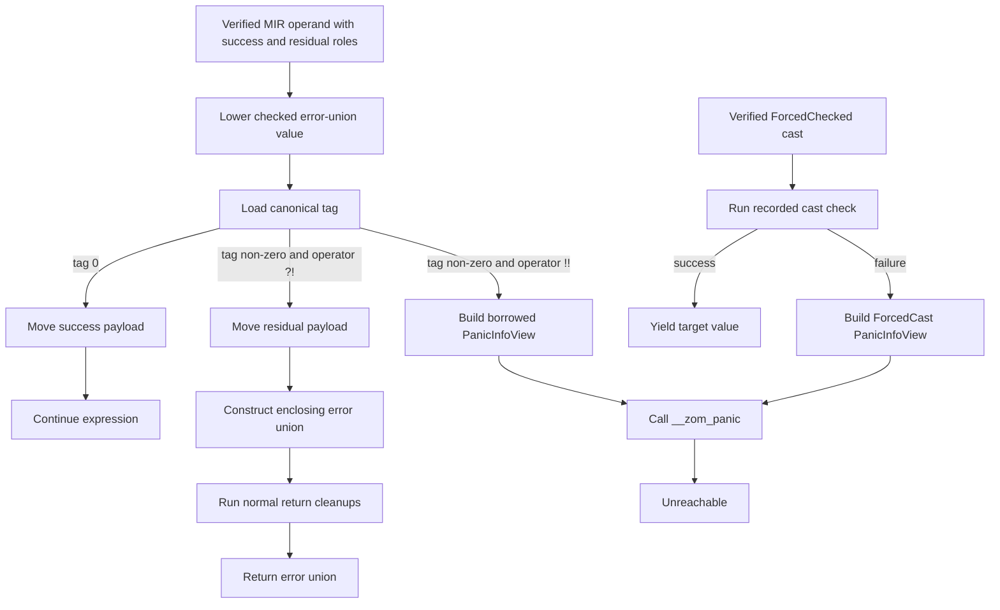

# RFC 0006: Error Lowering And Runtime ABI

## Summary

This RFC defines how ZOM lowers checked raising-call error-union shapes, `?!`,
`!!`, forced checked casts `as!`, `raises`, and panic boundaries after type
checking. RFC 0005 owns the checker-side type rules and publishes explicit
success/residual roles and `CheckedCastFact` records. `?!` is legal only when
the residual type fits the enclosing `raises` effect, `!!` is legal only when
the operand carries a verified error-union shape, and `as!` is legal only when
the checker publishes `ForcedChecked`. This RFC owns the downstream contract:
the ABI shape selected from verified roles, the control-flow lowering for
propagation, unwrap-or-panic, and cast-or-panic, deterministic cleanup on early
exits, and the runtime boundary where panics are printed, caught, or aborted.

## Motivation

The checker can prove that `expr?!` and `expr!!` are well typed, but codegen
still needs an exact target-independent contract:

1. Which tag represents success and which tags represent recoverable errors?
2. Where are the tag and payload stored in an error-union value?
3. How does `?!` run destructors before returning an error from the enclosing
   function?
4. What does `!!` call on the error path, and what source information reaches
   the panic handler?
5. Which panic boundaries may unwind, abort, or convert a panic into a typed
   value?

Leaving these questions implicit would make each backend choose its own ABI,
which would break cross-module calls, FFI boundaries, tests, and future runtime
optimization. The design must be explicit before backend work starts.

## Goals

- Define a canonical in-memory ABI for checked error-union shapes without
  assigning error roles to ordinary unions or nominal enums.
- Define target-independent IR lowering for `?!`, `!!`, and `as!`.
- Preserve normal RAII cleanup for `?!` early returns.
- Define the panic call boundary for `!!`, `as!`, `panic!`, `todo!`, and
  `unreachable!`.
- Define how `panic = "abort"` and `panic = "unwind"` affect generated code.
- Define a stable metadata contract for source span, error payload, and
  backtrace capture at panic sites.
- Define verification gates for unit, lit, runtime, and ABI tests before this
  RFC can move to `LANDED`.

## Non-Goals

- This RFC does not change the `?!`, `!!`, `as!`, `raises`, or union syntax.
- This RFC does not change checker diagnostics `ZOM4025` or `ZOM4026`.
- This RFC does not implement the backend, IR builder, or runtime panic
  functions.
- This RFC does not define full borrow checking, move checking, or lifetime
  analysis.
- This RFC does not decide cross-module `CompilerSession` scheduling or module
  metadata serialization beyond the error-union ABI fields named here.
- This RFC does not define target-specific calling conventions for every CPU;
  it defines the target-independent lowering contract that target ABI lowering
  must preserve.

## Prior Art

Rust lowers nominal result values and propagation through enum layout, MIR
branching, and cleanup blocks. The relevant mechanism for ZOM is the explicit
success/residual branch and cleanup-block discipline, not the source type's
identity.

Swift represents `throws` as an ABI-level error result convention distinct from
the normal return path. The relevant rule for ZOM is that a raising function
stores its success type and raises effect separately and that calls preserve
that distinction through lowering.

Zig error unions (`T!E`) lower to a payload plus error code and make `try`
syntactic sugar for early return. ZOM should copy the zero-cost branch shape and
the rule that the happy path is explicit, while keeping ZOM's richer union
payloads for error values that carry data.

C++ exception ABIs define unwind personalities and cleanup landing pads. ZOM
should avoid hidden exception-table control flow for recoverable errors, but
must still define a panic unwind boundary for unrecoverable programmer faults
when a crate opts into `panic = "unwind"`.

Go returns ordinary values for errors and uses `panic`/`recover` for exceptional
faults. ZOM should copy the separation between expected errors and panic
faults, while rejecting untyped error values and implicit panic recovery as the
default programming model.

## Guide-Level Explanation

User-facing behavior does not change. A function that returns a value or an
error still writes `raises`, `?!`, `!!`, `match`, and explicit union types as
specified in Chapter 11.

```zom
fun read_config(path: str) -> Config raises IoError | ParseError {
    let text = fs::read_to_string(path)?!;
    parse_config(text)?!
}
```

After type checking, each raising call carries a canonical union value type plus
verified success and residual roles. The compiler lowers that checked shape as
a sequence of tag tests. Tag `0` means success. A non-zero tag means one of the
declared residual alternatives. `?!` checks the tag:

- tag `0`: unwrap the success payload and continue;
- non-zero tag: run the same cleanup that an explicit `return` would run, then
  return the error union from the enclosing function.

`!!` is intentionally different. It means the author asserts the error branch
is impossible or accepts a panic if the assertion is wrong:

```zom
let cfg = read_config("dev.toml")!!;
```

This lowers to the same tag test, but the non-zero path calls the runtime panic
entry point with the source span and error payload. It never silently discards
the error.

## Reference-Level Design

### Pipeline Boundary

The post-checker pipeline treats signature success/raises separation, canonical
value types, and `ErrorUnionShapeFact` verification as solved by RFC 0005.
RFC 0010 carries those facts through HIR and MIR. Target lowering receives:

- verified executable MIR operations whose raising calls, propagation branches,
  forced unwraps retain exact success, result, and residual types, and forced
  casts retain the exact RFC 0005 cast kind, source type, target type, result
  type, unsafe requirement, and source span;
- verified cleanup edges and drop obligations for every early exit;
- the selected target profile and target data layout;
- validated source spans for panic metadata;
- the checked-facts and dispatch revisions that authorize the MIR roles.

Lowering must not inspect AST shape, query `TypeEnv`, redo type inference, or
infer roles from canonical union order. Missing, stale, or inconsistent role
facts are compiler invariant failures, not user diagnostics.

### Error-Union ABI

Every lowering-eligible checked error-union shape has one closed layout
descriptor:

```text
ErrorUnionTagWidth = U8 | U16 | U32 | U64
ErrorUnionAlternativeKind = Success | Residual

ErrorUnionAlternativeLayout {
  tag: uint64,
  typeKey: SemanticTypeKey,
  kind: ErrorUnionAlternativeKind,
  payloadSize: uint64,
  payloadAlign: uint64,
}

ErrorUnionLayoutDescriptor {
  valueTypeKey: SemanticTypeKey,
  successTypeKey: SemanticTypeKey,
  residualTypeKeys: SortedNonEmptySequence<SemanticTypeKey>,
  checkedFactsRevision: CheckedFactsRevision,
  dispatchFactsRevision: DispatchFactsRevision,
  targetSpecId: RFC0010::TargetSpecId,
  tagWidth: ErrorUnionTagWidth,
  tagOffset: uint64,
  payloadOffset: uint64,
  payloadSize: uint64,
  payloadAlign: uint64,
  size: uint64,
  align: uint64,
  alternatives: NonEmptySequence<ErrorUnionAlternativeLayout>,
}

VerifiedErrorUnionLayout {
  descriptor: ErrorUnionLayoutDescriptor,
  revision: ErrorUnionLayoutRevision,
}
```

`SemanticTypeKey` is exactly RFC 0005's canonical structural key.
`targetSpecId` is exactly RFC 0010's 32-byte digest of the canonical target
profile. Layout construction consumes the matching RFC 0010
`VerifiedTargetSelection` to access the profile; this RFC defines no second
target identity, panic-strategy tag, object-format tag, or feature codec.
`ErrorUnionTagWidth` tags are `U8 = 0x01`, `U16 = 0x02`, `U32 = 0x03`, and
`U64 = 0x04`. `ErrorUnionAlternativeKind` tags are `Success = 0x01` and
`Residual = 0x02`. Record fields encode in declaration order.

Tag `0` is always the verified success component. Residual alternatives use
tags `1..n` in canonical residual-key order. Lowering obtains the success and
residual keys from the verified shape, verifies that they are non-empty,
disjoint, and normalize to `valueTypeKey`, sorts only the residual keys
by unsigned bytewise lexicographic order, and assigns tags in that sorted order.
It never subtracts an inferred success alternative from an ordinary union.
Source order and the numeric value of a compiler-local `TypeId` never
participate in tag assignment. The complete role-bearing descriptor and
assigned tags are published in a target-artifact ABI manifest keyed by RFC 0008
`ModuleInterfaceRevision` plus RFC 0010 `TargetSpecId`. The semantic module
interface remains target-independent and contains no descriptor bytes. A local
type or layout handle may only be used as an in-process cache handle. A shape
with no residual alternative is invalid checked input rather than a degenerate
error union.

The greatest assigned residual tag selects the smallest width that contains it:
`U8` through `255`, `U16` through `65,535`, `U32` through `4,294,967,295`, and
`U64` otherwise. `tagOffset` is zero. `payloadOffset` is the tag size rounded up
to `payloadAlign`; `payloadSize` and `payloadAlign` are the maxima of all
alternative payloads; `size` rounds `payloadOffset + payloadSize` up to `align`;
and `align` is the maximum of tag and payload alignment. `alternatives` contains
the success record first with tag zero, followed by residual records in exact
`residualTypeKeys` order with consecutive tags starting at one. The sequence
cannot contain a duplicate key, tag, or second success record.

Every size, alignment, padding, pointer-width, and aggregate-layout query comes
from the selected target data layout. The compiler host's `sizeof`, native
pointer width, or ad hoc primitive alignment rules must not affect an ABI
descriptor. Layout construction fails before LIR publication if any alternative
lacks a concrete target layout. A descriptor is reusable only when every field,
including both input revisions and `targetSpecId`, is equal.

`ErrorUnionLayoutRevision` is SHA-256 over
`ASCII("zom.error-union-layout.v2")`, NUL, then the RFC 0011 encoding of
`ErrorUnionLayoutDescriptor`. `SemanticTypeKey` values are byte-framed;
sequences use `uint64` count framing; digests contribute 32 raw bytes;
`TargetSpecId` contributes its 32 raw digest bytes; all integers use RFC 0011
`UInt` encoding. Any field or tag change requires a new domain string.

The executable oracle uses value type `i32 | str`, success `i32`, residual
`str`, checked revision bytes `0x11`, dispatch revision bytes `0x22`, target-
spec digest bytes `0x33`, `U8`, outer layout `(offset=0, payloadOffset=8,
payloadSize=16, payloadAlign=8, size=24, align=8)`, and two alternatives with
payload layouts `(4,4)` and `(16,8)`. Its complete 423-byte preimage is:

```text
7a6f6d2e6572726f722d756e696f6e2d6c61796f75742e76320000000000000000267a6f6d2e73656d616e7469632d747970652d6b65792e7630000a00000000000000020103010f000000000000001b7a6f6d2e73656d616e7469632d747970652d6b65792e76300001030000000000000001000000000000001b7a6f6d2e73656d616e7469632d747970652d6b65792e763000010f1111111111111111111111111111111111111111111111111111111111111111222222222222222222222222222222222222222222222222222222222222222233333333333333333333333333333333333333333333333333333333333333330100000000000000000000000000000008000000000000001000000000000000080000000000000018000000000000000800000000000000020000000000000000000000000000001b7a6f6d2e73656d616e7469632d747970652d6b65792e763000010301000000000000000400000000000000040000000000000001000000000000001b7a6f6d2e73656d616e7469632d747970652d6b65792e763000010f0200000000000000100000000000000008
```

Its SHA-256 is
`0960aace205395c9ec049c04e7e1509d6945c72f128fce221771a23adbf98fdb`.

Cross-module target artifacts use a separate manifest:

```text
TargetArtifactAbiManifest {
  module: ModuleId,
  interfaceRevision: ModuleInterfaceRevision,
  targetSpecId: RFC0010::TargetSpecId,
  errorUnionLayouts: SortedUniqueSequence<VerifiedErrorUnionLayout>,
  revision: TargetArtifactAbiRevision,
}
```

Layouts sort by complete `valueTypeKey`, `successTypeKey`, residual-key
sequence, then layout revision and reject duplicate complete role keys.
`TargetArtifactAbiRevision` is SHA-256 over this exact stream:

```text
ASCII("zom.target-artifact-abi.v1")
0x00
uint64be(expandedModuleKeyByteLength)
expandedModuleKeyBytes
ModuleInterfaceRevision
TargetSpecId
uint64be(layoutCount)
for each layout in canonical role-key order:
  uint64be(encodedDescriptorByteLength)
  encoded ErrorUnionLayoutDescriptor bytes
  ErrorUnionLayoutRevision
```

Each layout revision is paired with the descriptor immediately preceding it.
Target-artifact manifest failures use RFC 0010's `ObjectEmission` phase with
`Session` owner and no site. Two layouts with the same complete role key are
`AdditionalFact`; an interface or target revision different from the authorized
input is `InputRevisionMismatch`; a present descriptor with an invalid role,
endpoint, or field is `InvalidFact`; and a descriptor/revision recomputation
mismatch, non-canonical order, direct concatenation, ordinary RFC 0011 sequence
framing, or sorting by local handles is `CanonicalCodecMismatch`. The first
three kinds map to `ZOM9948`; canonical mismatch maps to `ZOM9949`. Every
failure is rejected before manifest revision construction and publishes no
manifest or artifact.

The independent framing oracle uses module bytes `a1`, interface-revision bytes
`11`, target-spec bytes `22`, one already-encoded descriptor `b2`, and layout-
revision bytes `33`. Its complete 149-byte preimage is:

```text
7a6f6d2e7461726765742d61727469666163742d6162692e7631000000000000000001a11111111111111111111111111111111111111111111111111111111111111111222222222222222222222222222222222222222222222222222222222222222200000000000000010000000000000001b23333333333333333333333333333333333333333333333333333333333333333
```

Its SHA-256 is
`42700473dc56112c4c8c31f2c528d3305d0115c5c52df26fc9f45b0808369ec2`.
This manifest is emitted and consumed by
RFC 0010 LIR/backend artifact code. It is not stored in
`VerifiedModuleInterface`, does not participate in `ModuleInterfaceRevision`,
and cannot affect semantic checking.

The in-memory representation is:

```text
offset 0:             tag
offset payload_offset: payload storage for the active alternative
```

Padding bytes are unspecified. The active payload is initialized exactly once
and destroyed exactly once.

### Construction Lowering

When a verified component adjustment constructs a checked error-union value
`U`, lowering emits:

1. allocate destination storage for `U`;
2. write the canonical tag for `A`;
3. initialize the payload with the value, using move construction when the
   source value is owned;
4. mark the source as moved if ownership rules require it.

If `A` is the verified success component, the tag is `0`. If `A` is a verified
residual alternative, the tag is its matching non-zero value. If multiple
alternatives erase to the same layout but have different type identities, tag
assignment still follows type identity, not layout identity. Ordinary union
construction uses the general union-lowering contract and never creates an
error-union role as a side effect.

### `?!` Lowering

For `expr?!` whose operand carries a verified shape with success `T`, residual
`E`, and value type `T | E`, lowering emits target-independent control flow:

```text
tmp = lower(expr)
tag = load_tag(tmp)
if tag == 0:
  result = move_payload(tmp, success_alternative)
  destroy_inactive_union_shell(tmp)
  continue(result)
else:
  residual = move_payload(tmp, tag)
  out = construct_enclosing_error_union(residual)
  run_scope_cleanups_until_enclosing_function_return()
  return out
```

For a call that raises, the call result carries the required shape directly.
RFC 0005 may preserve that shape through an unambiguous binding, control-flow
join, or component-wise coercion. An ordinary union or nominal enum without the
verified shape cannot reach this lowering path.

The early-return edge must enter the function's normal cleanup graph. This is
the same cleanup graph used for explicit `return`, `break` out of scopes, and
fallible initialization failure. No backend may bypass destructors on the
recoverable-error path.

### `!!` Lowering

For `expr!!` with the same verified role contract, lowering emits:

```text
tmp = lower(expr)
tag = load_tag(tmp)
if tag == 0:
  result = move_payload(tmp, success_alternative)
  destroy_inactive_union_shell(tmp)
  continue(result)
else:
  residual_ref = borrow_payload_for_panic(tmp, tag)
  panic_view = build_panic_info_view(operator_span, residual_ref, PanicKind::ForcedUnwrap)
  call __zom_panic(panic_view)
  unreachable
```

`__zom_panic` has return type `never`. Under `panic = "abort"`, it prints or
records panic information according to runtime policy and terminates the
process. Under `panic = "unwind"`, it starts unwinding after constructing
runtime panic metadata. If a target has no unwind support, `panic = "unwind"`
is rejected before lowering.

The first implementation is abort-only. Before post-checker lowering begins,
the compiler validates the requested panic strategy against both runtime and
target capabilities. A request for `panic = "unwind"` is a compile-time error
unless the selected runtime and target both advertise complete unwind support;
the compiler emits no function IR or ABI snapshots for that request. The
presence of an unwind-named runtime symbol is not capability evidence. In
particular, an entry point that delegates to abort must not make the compiler
accept `panic = "unwind"`. Unwind lowering may be enabled only together with a
real unwinder, cleanup integration, `catch_unwind`, FFI containment, and target
tests.

The panic path does not convert the residual into the enclosing `raises` set.
It is unrecoverable unless an explicit panic boundary such as `catch_unwind`
exists and the crate is compiled with unwind support.

### `as!` Lowering

For a verified RFC 0005 `CheckedCastFact` whose mode is `ForcedChecked`, MIR
performs the recorded runtime check exactly once. The success edge yields the
recorded target type. The failure edge builds a call-scoped `PanicInfoView`
with `PanicKind::ForcedCast`, the cast operator span, and an optional message
derived from canonical source and target type display, then calls `__zom_panic`
and terminates in `unreachable`.

Lowering must not reinterpret an `OptionalChecked` cast as forced, infer a
cast kind from source and target types, or reuse the `!!` residual-payload path.
A forced-cast panic has no residual payload. Drop elaboration treats the
failure edge as a normal panic exit, so abort and unwind strategies use the
same cleanup and ownership rules as every other panic site.

### Cleanup And Drop Discipline

Every function lowering builds a cleanup stack. Each initialized local value
registers exactly one cleanup action unless it is moved. `?!` early return and
explicit `return` share the same cleanup unwinding path.

Cleanup order is lexical reverse initialization order. If a cleanup panics while
another panic is already unwinding, the runtime aborts. If a cleanup panics on a
recoverable-error `?!` early return, the panic supersedes the recoverable error
because the recoverable return cannot complete safely.

### Panic Boundary ABI

The runtime exposes these target-independent entry points:

```text
__zom_panic(info: PanicInfoView) -> never
__zom_begin_panic_unwind(info: PanicInfoView) -> never
__zom_abort_panic(info: PanicInfoView) -> never
__zom_catch_unwind(fn_ptr, ctx_ptr, out_handle: Out<OwnedPanicInfoHandle>) -> bool
__zom_owned_panic_info_view(handle: Borrow<OwnedPanicInfoHandle>) -> OwnedPanicInfoView
__zom_drop_owned_panic_info(handle: Own<OwnedPanicInfoHandle>) -> unit
```

`PanicInfoView` is a call-scoped borrowed view. It contains:

- panic kind: forced unwrap, forced cast, explicit panic, unreachable, todo,
  assertion, bounds, overflow, runtime;
- source file, line, column, and byte span;
- optional message;
- optional borrowed debug view of the residual payload;
- optional borrowed synchronous backtrace view;
- task/thread identity when the runtime has one.

The view and every borrowed field remain valid only for the dynamic call to a
panic entry point. The runtime may synchronously print an aborting view, but it
must not store the view, its residual reference, or its backtrace reference.
The active residual payload remains alive until the panic entry point has
materialized any required metadata and begins unwinding.

`OwnedPanicInfoHandle` is an ABI-stable opaque, move-only runtime handle. Before
the first stack frame is unwound, `__zom_begin_panic_unwind` eagerly creates one
runtime-owned record containing copied source metadata, copied optional
message, a bounded owned residual-debug summary with an explicit truncation
flag, an owned backtrace snapshot, panic kind, and scalar task/thread identity.
The owned record contains no source-stack address, borrowed string, payload
view, or borrowed backtrace handle. The unwind exception owns the handle until
it is either caught or destroyed as an uncaught panic.

The residual summary owns at most 4,096 UTF-8 bytes and truncates only at a
scalar boundary; formatting failure stores the fixed ASCII summary
`<panic payload unavailable>`. The backtrace snapshot owns at most 256 frames.
Each frame stores the instruction address, module-relative offset, and a copied
UTF-8 module name; it never stores a borrowed symbolizer string. Both summaries
carry truncation flags. `OwnedPanicInfoView` exposes only immutable byte/frame
slices borrowed from the opaque handle, so its ABI contains fixed-width scalar
fields and `(address, length)` views while all allocation and representation
ownership remains inside the runtime.

`__zom_catch_unwind` initializes `out_handle` to empty before invoking the
thunk. A normal return yields `false` and leaves it empty. A caught panic yields
`true` and transfers exactly one owning handle to the caller. The caller may
borrow `OwnedPanicInfoView` only while that handle remains alive and must call
`__zom_drop_owned_panic_info` exactly once. Dropping the unwind exception after
transfer does not drop the record. An uncaught panic, a catch boundary that
declines the panic, or a second panic during unwinding destroys the owned record
inside the runtime; the second-panic path then aborts. Null, foreign, copied,
or already-consumed handles are runtime invariants and never expose record
memory.

`__zom_panic` dispatches to abort or unwind according to crate panic strategy.
`__zom_catch_unwind` is only meaningful under `panic = "unwind"`; under
`panic = "abort"` it is compiled as a call boundary that cannot catch. Runtime
symbol availability and panic-strategy capability are separate contracts: the
compiler selects an entry point only after the pre-lowering capability check
succeeds.

### Main And Task Boundaries

At a raising `main` boundary:

- `()` exits with code `0`;
- a checked result with tag `0` follows the success exit path for `T`;
- a checked result with a non-zero tag prints the residual payload through
  `Error` or `Debug` formatting and exits with code `1`;
- an uncaught panic exits with code `101`.

Task boundaries inherit the same distinction: recoverable errors are typed
task results; panics are task faults. A scoped task may aggregate recoverable
errors according to the concurrency RFC, but a panic follows the panic strategy.

### FFI Boundary Rule

No panic may unwind across an `extern "C"` boundary. Lowering for exported C ABI
functions must either:

- prove the function cannot panic;
- insert `catch_unwind` and convert panic to the declared ABI error result; or
- reject the declaration until the function is annotated with an explicit
  panic boundary policy.

Checked error-union values crossing FFI require an explicit `repr(C)` wrapper.
The role-bearing layout defined here is a compiler ABI, not a C ABI.

### Failure And Diagnostic Contract

Every public error-layout, propagation, panic, ABI-legalization, and runtime
selection operation returns RFC 0010 `IrOperationResult<VerifiedValue>`. The
pre-LIR FFI source-eligibility verifier specializes RFC 0010's sole
`FeatureBoundaryVerificationResult` seam. This RFC adds no parallel result
algebra and no display-string error path.

| Condition | Result fact | Registered diagnostic |
|---|---|---|
| Checked or dispatch revision does not match the verified MIR module | `IrInvariantRejected(InputRevisionMismatch, LirLowering, Instance, Lir site)` | `ZOM9947 LirInvariant` |
| Required error-union shape is absent | `IrInvariantRejected(MissingRequiredFact, LirLowering, Instance, Lir site)` | `ZOM9947 LirInvariant` |
| Shape roles, keys, tags, or layout fields are inconsistent | `IrInvariantRejected(InvalidFact, LirVerification, Instance, Lir site)` | `ZOM9947 LirInvariant` |
| Descriptor bytes or revision are non-canonical | `IrInvariantRejected(CanonicalCodecMismatch, LirVerification, Instance, Lir site)` | `ZOM9949 IrCanonicalCodecMismatch` |
| A verified semantic type has no target layout | `IrInvariantRejected(MissingTargetLayout, LirLowering, Instance, Lir site)` | `ZOM9947 LirInvariant` |
| Target/runtime profile lacks requested unwind support | `CapabilityRejected(UnsupportedTargetCapability, TargetSelection, Session)` | `ZOM6009 TargetCapabilityUnavailable` |
| Requested output cannot be created | `CapabilityRejected(OutputCreationFailed, ObjectEmission, Session)` | `ZOM6008 IrOutputCreationFailed` |
| A total backend cannot translate verified LIR | `IrInvariantRejected(BackendTranslationRejected, LlvmTranslation, Instance, Backend site)` | `ZOM9948 BackendInvariant` |
| FFI gate input revision does not match its checked module, executable MIR, or selected target | `IrInvariantRejected(InputRevisionMismatch, FeatureBoundaryVerification, Module, no site)` | `ZOM9955 FeatureBoundaryInvariant` |
| Required FFI gate inventory is absent or additional | `IrInvariantRejected(MissingRequiredFact or AdditionalFact, FeatureBoundaryVerification, Module, no site)` | `ZOM9955 FeatureBoundaryInvariant` |
| FFI gate facts are structurally invalid | `IrInvariantRejected(InvalidFact, FeatureBoundaryVerification, Module or Definition, optional FrontendHandoff site)` | `ZOM9955 FeatureBoundaryInvariant` |
| FFI gate proof bytes are non-canonical | `IrInvariantRejected(CanonicalCodecMismatch, FeatureBoundaryVerification, Module, no site)` | `ZOM9949 IrCanonicalCodecMismatch` |

FFI boundary eligibility is a separate post-checker semantic verifier and does
not extend RFC 0005's closed checker registry:

```text
FfiBoundaryFailureKind = PanicContainmentRequired
                       | ErrorUnionWrapperRequired

FfiBoundaryFailure {
  kind: FfiBoundaryFailureKind,
  definition: DefId,
  span: SourceSpan,
  ordinal: uint32,
}

VerifiedFfiBoundaryFacts {
  contextFingerprint: SemanticContextFingerprint,
  module: ModuleId,
  checkedFactsRevision: CheckedFactsRevision,
  executableMirRevision: MirRevisionId,
  targetSpecId: TargetSpecId,
  definitions: SortedSequence<DefId>,
  revision: Sha256Digest,
}

FfiBoundaryVerificationResult = RFC0010::FeatureBoundaryVerificationResult<
  VerifiedFfiBoundaryFacts,
  FfiBoundaryFailure,
>
```

The verifier consumes RFC 0010 `VerifiedExecutableMir`, its retained RFC 0005
checked-facts lease, RFC 0008 module interface, and RFC 0010
`VerifiedTargetSelection`. It runs as the registered `ffi-boundary` gate in
RFC 0010 `FeatureBoundaryVerification`, after target selection and before LIR
construction. A successful result publishes the canonical
`VerifiedFfiBoundaryFacts` proof consumed by RFC 0010's
`VerifiedFeatureBoundarySet`; target lowering has no overload that omits this
proof. Failure-kind tags are `PanicContainmentRequired = 0x01` and
`ErrorUnionWrapperRequired = 0x02`. Source failures sort by expanded `DefId`,
kind tag, validated span, then ordinal. IR invariants use RFC 0010's exact
phase legality matrix and sort order. Invalid identities select the RFC 0011
branch before sorting.

`diagnostics-ffi.def` registers `ZOM6101 FfiPanicBoundaryRequired`, Error,
`C ABI export requires an explicit panic containment policy`, arity 0;
`ZOM6102 FfiErrorUnionRequiresWrapper`, Error,
`C ABI cannot expose a compiler error-union layout directly`, arity 0. RFC
0010's lowering registry owns `ZOM9955 FeatureBoundaryInvariant`, Fatal,
`Internal feature-boundary invariant violated ({0} occurrence(s))`, arity 1.
The adapter groups only adjacent invariant facts with the same validated
location, passes the exact count, and retains all complete facts in the bug
bundle. No source or invariant rejection publishes `VerifiedFfiBoundaryFacts`
or an RFC 0010 feature-boundary proof.

The FFI facts revision is SHA-256 over this exact stream:

```text
ASCII("zom.ffi-boundary-facts.v2")
0x00
SemanticContextFingerprint
uint64be(expandedModuleKeyByteLength)
expandedModuleKeyBytes
CheckedFactsRevision
Encode(ExecutableMirRevision)
TargetSpecId
uint64be(definitionCount)
for each expanded DefId key in canonical byte order:
  uint64be(encodedDefinitionKeyByteLength)
  encodedDefinitionKeyBytes
```

FFI inventory failures use RFC 0010's exact `FeatureBoundaryVerification`
classification: duplicate expanded definition keys are `AdditionalFact`; an
embedded definition that does not match its inventory entry is `InvalidFact`;
and reverse order, direct concatenation, ordinary RFC 0011 sequence framing, or
any malformed encoded length is `CanonicalCodecMismatch`. The first two map to
`ZOM9955`; canonical mismatch maps to `ZOM9949`. Every rejected case publishes
no facts or proof. The independent oracle uses a zero fingerprint, module bytes
`a1`, checked revision bytes `22`, executable
`MirRevisionId { phase: 0x04, digest: 0x33 * 32 }`, target-spec bytes `44`, and
one definition record `b3`. Its complete 181-byte preimage is:

```text
7a6f6d2e6666692d626f756e646172792d66616374732e76320000000000000000000000000000000000000000000000000000000000000000000000000000000001a12222222222222222222222222222222222222222222222222222222222222222043333333333333333333333333333333333333333333333333333333333333333444444444444444444444444444444444444444444444444444444444444444400000000000000010000000000000001b3
```

Its SHA-256 is
`9f5ac18311f9aba4af2e66107a55d80f9444ac66714ac8d9fb127d1735637b35`.

The direct replacement deletes prototype diagnostics `ZOM6001-ZOM6007` and
`ZOM9901-ZOM9903`. Unsupported unwind migrates from `ZOM6006` to RFC 0010's
`ZOM6009`; lowering and dump invariants migrate to `ZOM9942-ZOM9949`. Generated
mapping tests cover every condition above, every owner/site/no-location form,
and prove that no rejected branch publishes a descriptor, LIR module, LLVM
module, or object.

### Mermaid Lowering Diagram



## Repository Impact

| Area | Paths | Owner |
|---|---|---|
| RFC governance | `docs/rfc/0006-error-lowering-runtime-abi.md`, `docs/rfc/tracking/0006-review-and-implementation.md`, `docs/rfc/README.md` | `rfc` |
| Error handling spec | `docs/spec/chapters/11-error-handling.md` | `error-system` |
| Type checker contract | `products/zomlang/compiler/checker/**`, `products/zomlang/compiler/type/**` | `binder-checker` |
| Error semantic boundary | `products/zomlang/compiler/diagnostics/**`, `docs/spec/chapters/11-error-handling.md` | `error-system` |
| Cross-module error ABI metadata | `products/zomlang/compiler/driver/**`, `products/zomlang/compiler/symbol/**` | `module-system` |
| Typed IR, target layout, CLI, and backend boundary | `products/zomlang/compiler/irgen/**`, `products/zomlang/compiler/hir/**`, `products/zomlang/compiler/mir/**`, `products/zomlang/compiler/lir/**`, `products/zomlang/compiler/backend/**`, `products/zomlang/utils/zomc/**` | `ir-backend` |
| Runtime panic ABI | `products/zomlang/runtime/**`, `libraries/zc/**` | `runtime-memory` |
| Spec alignment | `docs/spec/**`, `docs/design/**` | `spec-audit` |
| Tests and verification | `products/zomlang/tests/**` | `verification` |

## Security And Safety Impact

This RFC affects safety directly. `?!` must run destructors on every early
return so resources are not leaked on expected failures. `!!` must surface panic
metadata and must not let a panic cross a C ABI boundary. The error-union ABI
selected from a verified error-union shape must initialize and destroy
exactly one active payload to avoid double-drop, use-after-move, or leaked
linear resources.

FFI boundaries are the main security-sensitive surface. A panic crossing an
unprepared C frame is undefined behavior, so backends must insert or require an
explicit panic boundary before exporting C ABI functions that can panic.

## Drawbacks And Risks

- A fixed tag-at-offset-zero ABI may be suboptimal for some targets compared
  with niche optimization. The benefit is deterministic lowering and easier
  conformance testing before the optimizer grows.
- Requiring `catch_unwind` policy for FFI exports adds implementation work to
  the backend and runtime.
- `panic = "unwind"` requires target support that may be unavailable on embedded
  and WebAssembly targets.
- The compiler must maintain a precise cleanup graph before codegen can safely
  implement `?!`.

## Alternatives Considered

- **Infer error roles from a nominal enum name or variant spelling.** Rejected
  because nominal enums and ordinary unions are ordinary values. Only RFC 0005
  checked role facts authorize `?!` and `!!` lowering.
- **Hidden exception unwinding for `?!`.** Rejected because recoverable errors
  must be explicit, typed, and cheap on the happy path. Hidden unwinding would
  make expected errors behave like panics.
- **Ad hoc backend-specific union layouts.** Rejected because cross-module code
  and conformance tests need one canonical layout algorithm parameterized by
  the selected target data layout.
- **Permanent abort-only panics.** Not selected as the final contract because
  controlled panic isolation requires a real unwind boundary. The staged first
  implementation is nevertheless abort-only and rejects unwind before lowering
  until the runtime and selected target satisfy the complete unwind contract.
- **C ABI exposure for structural error unions.** Rejected because structural
  union layout is a compiler ABI; FFI must use explicit `repr(C)` wrappers.

## Compatibility And Rollout

No existing source syntax changes. The rollout is an implementation sequence:

1. Refactor error-union descriptors to use sorted canonical type keys and the
   selected target data layout.
2. Add panic-strategy capability validation before lowering; accept abort and
   reject unwind in the first implementation.
3. Add IR nodes or lowering helpers for union construction and extraction.
4. Lower `?!` to tag tests plus cleanup edges.
5. Lower `!!` to tag tests plus the abort panic boundary.
6. Add FFI panic-boundary enforcement.
7. Add the dedicated LLVM lit IR runner and its IR/ABI snapshots.
8. Implement the borrowed-view to owned-panic-handle transfer, catch ownership,
   inspection, and destruction ABI.
9. Enable unwind only when the runtime, cleanup model, FFI boundary, and target
   test matrix satisfy the unwind contract together.

Rollback cost is moderate. If the ABI must change before `LANDED`, only backend
experiments and generated snapshots should be affected. Once cross-module
artifacts are emitted, layout changes require regenerating all ABI fixtures and
module metadata.

### Current Implementation Readiness

The repository now has a target-aware typed IR foundation under
`products/zomlang/compiler/irgen/`. `TargetDataLayout` owns the selected ZOM
ILP32 or LP64 pointer and scalar layout queries. `computeErrorUnionLayout()`
flattens nested unions, reserves tag zero for success, sorts unique error
alternatives by canonical key, and rejects unknown payload layouts before IR
emission. Function error layouts derive canonical union identity without an
owning polymorphic vector. The first typed lowering slice materializes a checked
integer constant, constructs tag-zero success values for tagged error unions,
passes through direct-success layouts, and emits deterministic `zom.ir.v0` text
through `zomc --emit ir`.

This experiment does not consume RFC 0005 `ErrorUnionShapeFact`, RFC 0009's
complete role-bearing dispatch envelope, or RFC 0010 verified MIR. Its
direct-success mode and AST/`TypeEnv` entry point are not part of the accepted
contract and must be deleted during the direct replacement.

This foundation is deliberately fail-closed. It accepts zero-parameter,
non-generic raising functions with one direct return. A direct integer return
lowers to tag-zero construction. A direct `return callee()?!;` lowers only when
the callee is a same-source free function, the call has no arguments, the
source layout has exactly one concrete residual alternative, and checker
dispatch metadata is frozen and consistent. The lowerer emits a symbolic
raising call, tag branch, success and residual payload moves, canonical
destination-tag reconstruction, and two jumps into one typed return block.
The residual-tag regression proves that source tag one can be remapped to
destination tag two when the enclosing `raises` set is wider.

The shared return block is currently an empty cleanup convergence point. The
lowerer rejects locals and multiple statements because no checker-owned drop
facts or destructor targets reach IR yet. It also rejects multi-error source
unions until a per-tag switch exists, and rejects external or method calls,
unknown layouts, missing checker facts, and multi-source CLI emission. It does
not yet implement real cleanup actions, a runtime call for the existing `!!`
panic terminator, FFI boundary enforcement, executable machine code, or
cross-module ABI publication. Panic strategy options and forced-unwrap source
metadata exist only in the current mixed prototype. Named type keys remain
name-oriented until RFC 0005 and RFC 0008 provide module-qualified nominal
identity.

The runtime reports abort support and unwind non-support. Its
`__zom_begin_panic_unwind` symbol currently delegates to abort. The compiler
option defaults to abort, accepts `--panic abort`, and recognizes
`--panic unwind` only to reject it after checking and before final emission.
The IR conformance test proves the rejected command emits no `zom.ir.v0`
header. Future target capability plumbing must preserve this rejection until a
runtime and target advertise the complete unwind contract together.

Status is `REVIEW`. `approvers` remains empty and `decision` remains `TBD`;
the design resolutions are formal review input, not owner approval or a
recorded acceptance decision.

## Documentation And Teaching Plan

- Update Chapter 11 with any accepted wording that differs from this RFC.
- Add a design document for backend lowering once IR code exists.
- Add examples showing `?!` early return, `!!` panic, and FFI panic boundaries.
- Add diagnostics documentation for any new runtime or FFI boundary codes.
- Cross-link RFC 0005 so readers understand checker semantics and lowering are
  separate contracts.

## Operational Readiness

Before the first implementation lands, CI must run abort-mode error lowering
and must prove that `panic = "unwind"` is rejected before lowering on every
runtime/target pair without unwind capability. Each runtime/target pair that
later enables unwind must add unwind cleanup, catch, FFI containment, and panic
tests in the same change. Runtime panic printing must produce deterministic
enough output for tests after stripping absolute paths and backtrace addresses.

## Acceptance Criteria

1. Error-union layout descriptors are keyed by canonical value, success, and
   residual type keys plus RFC 0010 `TargetSpecId` and the exact
   checked-facts and dispatch revisions that authorize those roles.
2. Tag `0` is the verified success component; residual tags `1..n` follow
   unsigned bytewise sorting of verified residual keys, independent of source
   order and local numeric `TypeId` assignment. Ordinary unions and nominal
   enums never enter this layout path without an RFC 0005 error-union shape.
3. `?!` lowering emits tag tests, success extraction, residual construction,
   cleanup edges, and an enclosing-function return.
4. `!!` lowering emits tag tests, success extraction, panic metadata, a call to
   `__zom_panic`, and an unreachable terminator.
5. `as!` lowering consumes only `ForcedChecked` facts, executes the recorded
   check once, yields `T` on success, and emits `ForcedCast` panic metadata plus
   an unreachable failure edge.
6. Explicit return and `?!` early return share the same cleanup graph.
7. Abort runtime entry points exist, and the compiler rejects
   `panic = "unwind"` before lowering until both runtime and target advertise
   complete unwind support.
8. `catch_unwind` cannot catch under abort; every runtime/target pair that
   advertises unwind eagerly materializes an owned panic record before stack
   teardown, transfers one opaque owning handle on catch, implements exact-once
   destruction, and tests the complete behavior before enabling that
   capability. No caught record retains a source-stack borrow.
9. FFI exports cannot let panic unwind through C ABI frames.
10. `main` returns exit code `0` on success, `1` on recoverable error, and `101`
   on uncaught panic.
11. Tests cover nested local cleanup on `?!` and panic during cleanup.
12. Tests cover union ABI tag/payload layout for scalar, aggregate, and
    zero-sized alternatives across source permutations, interner insertion
    histories, and representative target data layouts.
13. Tests cover `!!` source-span metadata and payload debug metadata plus `as!`
    source span, source type, target type, and absence of a residual payload.
    Unwind tests destroy the originating residual stack frame before inspecting
    the caught owned view, then drop the handle exactly once under ASan and LSan.
14. Tests cover abort strategy selection and pre-lowering rejection of
    unsupported unwind; enabling unwind adds the full target-specific matrix.
15. RFC 0010's `mir`, `lir`, and `llvm-ir` runners own logical error and forced
    cast control flow, target layout/ABI, and translated LLVM snapshots.
16. `python3 scripts/check-rfc.py` passes.
17. `python3 scripts/check-format.py` passes after implementation changes.
18. `ctest --preset default --output-on-failure` passes before `LANDED`.
19. The 423-byte descriptor oracle and every tag-width boundary reproduce the
    exact `ErrorUnionLayoutRevision`; any schema change changes the domain.
20. Every public operation returns RFC 0010 `IrOperationResult`, except the
    source-rejecting FFI gate specialization of
    `FeatureBoundaryVerificationResult`; generated tests exhaustively cover the
    failure-to-diagnostic table and prove rejected branches publish no verified
    artifact or feature proof.
21. Target-artifact ABI manifests reference an RFC 0008 interface revision but
    remain target-specific backend artifacts. Same-package cross-crate and
    cross-package calls consume identical descriptor bytes under worker and
    input permutations without adding target facts to the semantic interface.
    The 149-byte artifact oracle and zero/one/two-layout fixtures cover role-key
    order, duplicate roles, descriptor framing, descriptor/revision swaps,
    interface and target mutations, direct concatenation, and ordinary sequence
    framing. Each mutation asserts its exact `InputRevisionMismatch`,
    `AdditionalFact`, `InvalidFact`, or `CanonicalCodecMismatch` classification,
    `ZOM9948` or `ZOM9949`, stable sort position, and absence of a manifest and
    artifact.
22. The FFI boundary verifier reproduces the 181-byte facts oracle, binds the
    exact executable MIR revision and `TargetSpecId`, emits exactly `ZOM6101`
    or `ZOM6102` for its two source failures, maps every invariant to RFC 0011
    identity diagnostics, `ZOM9949`, or `ZOM9955`, and publishes no verified
    facts or feature-boundary proof from a rejected branch. Zero/one/two-
    definition fixtures cover canonical order, duplicate keys, reverse order,
    key/inventory disagreement, direct concatenation, and ordinary sequence
    framing. Each mutation asserts exact `AdditionalFact`, `InvalidFact`, or
    `CanonicalCodecMismatch`, exact `ZOM9955` or `ZOM9949`, stable sort position,
    and absence of verified facts and a feature proof.

### Pre-Acceptance Experiment Evidence

This RFC is `REVIEW`. The evidence below describes a disposable experiment
that predates an acceptance decision. It does not establish the accepted IR,
ABI, cleanup, panic, or backend architecture and cannot be used as approval
evidence.

| AC | Status | Evidence | Remaining Work |
|---|---|---|---|
| 1 | Partial | `products/zomlang/compiler/irgen/target-data-layout.*` and `error-union-layout.*` compute descriptors from explicit ZOM ILP32/LP64 profiles; the IR module owns one target profile and canonical interner, and unknown layouts fail before IR emission. Unit tests cover scalar, pointer-like, tuple, structural-object, zero-sized, and unknown payloads. | Replace the prototype with RFC 0010 `TargetSpecId`, module-qualified semantic keys, and the independent target-artifact ABI manifest. |
| 2 | Complete for local canonical keys | Tag zero is success. Error candidates are recursively flattened, deduplicated, sorted by canonical key, and tagged from one. Unit tests permute source/nesting order and interner insertion history. | Cross-module nominal identity remains part of AC 1 and RFC 0008. |
| 3 | Partial | A checked same-source zero-argument free-function call with one residual lowers to `call.raising`, an error-union tag branch, success/residual payload moves, destination union reconstruction, and a shared typed return block. The unit and IR tests prove source `str` tag one remaps to destination `bool | str` tag two. | Add per-tag switching for multiple residuals, general expressions and arguments, and the real cleanup graph with drop actions. |
| 5 | Not Met | The `?!` success and residual branches converge on one typed return block, providing the control-flow attachment point for future cleanup. | Explicit returns do not yet share that block, and functions with locals are rejected because drop facts and destructor targets are unavailable. |
| 6 | Partial | `panic.cc` implements abort reporting and reports unwind unsupported. Compiler options default to abort; `zomc --panic unwind` is rejected after checking and before final emission, so no function IR or ABI snapshot is produced. | Connect the compiler gate to explicit runtime and target capability objects before any target may enable unwind. |
| 7 | Partial | `__zom_catch_unwind` invokes its thunk and returns `false` when the thunk returns under abort mode; a panic in the thunk aborts the process. | Prove the compiler selects this behavior for abort. Add unwind catch behavior only when a runtime/target pair advertises unwind. |
| 11 | Partial | Layout unit tests cover source permutations, interner insertion history, ILP32/LP64 pointer-dependent layouts, fixed-width scalars, char, tuples, structural objects, raw/reference pointers, zero-sized values, direct success, unknown named/any payloads, and wide tags. The first IR snapshot fixes the LP64 `i32 | str` ABI. | Add broader ILP32/LP64 IR snapshots, error-alternative construction, aggregate combinations, and target profiles beyond the two initial ZOM profiles. |
| 13 | Complete for the abort-only capability gate | Runtime unit tests prove abort supported and unwind unsupported. `panic_unwind_capability_pos_17.check` invokes the real CLI, expects `ZOM6006`, and proves no IR header is emitted. | Every future enabled unwind target must add the full unwind, cleanup, catch, and FFI matrix in the same change. |
| 14 | Complete for the current slices | `conformance/runners/ir/` is registered with CTest, rejects an empty expectation set and orphan expectations at configure time, and runs `zomc --emit ir` plus FileCheck. Five tests cover deterministic LP64 success construction, one-residual propagation with tag remapping, forced-unwrap panic metadata, structured unsupported-source diagnostics, and pre-lowering unwind rejection. | Extend this executable runner with real cleanup actions, multi-residual switches, main, and FFI snapshots as those slices land. |
| 15 | Complete | `python3 scripts/check-rfc.py` passes for this 2026-07-10 review revision. | None. |
| 16 | Complete for this slice | `python3 scripts/check-format.py` passes after the target-layout, typed-IR, CLI, unit-test, and lit-runner changes. | Rerun after every later implementation slice and before `LANDED`. |
| 17 | Partial | A prior worktree state passed `ctest --preset default --output-on-failure`, including runtime panic and checker legality tests. | Rerun on the final implementation and add missing lowering, cleanup, target ABI, IR snapshot, strategy-rejection, and FFI tests. |

## Implementation Plan

1. Complete exact-hash owner review, record the acceptance decision, and enter
   `IMPLEMENTING`; no architecture implementation step precedes this gate.
2. Add the closed descriptor codec, revision oracle, RFC 0010 result adapter,
   and RFC 0008 module-interface record in the HIR/MIR/LIR replacement series.
3. Build executable MIR cleanup graphs before lowering returns and postfix
   error operators.
4. Lower logical `?!`, `!!`, and `as!` operations from verified executable MIR
   into target LIR tag tests, recorded cast checks, payload operations, cleanup
   edges, and panic exits.
5. Add panic-strategy capability validation. The first implementation accepts
   abort and reports unsupported unwind as `ZOM6009`.
6. Complete abort runtime ABI integration and FFI checker boundaries.
7. Add LIR, LLVM IR, target ABI, cleanup, runtime, strategy, module-interface,
   and FFI conformance tests.
8. Enable unwind for a runtime/target pair only in the same change that adds
   unwinder, cleanup, catch, FFI containment, and target test support.
9. Delete `compiler/irgen`, `zom.ir.v0`, `--emit ir`, prototype diagnostics,
   and the old IR runner in the direct RFC 0010 cutover.
10. Update Chapter 11 and backend design docs, run every acceptance gate, and
    enter `LANDED` only after implementation evidence is complete.

## Test Plan

- Build: `cmake --preset sanitizer` and `cmake --build --preset sanitizer -j`.
- Unit tests: canonical-key tag tests across source permutations and interner
  insertion histories; target data-layout tests for tag and payload offsets;
  cleanup graph tests for early returns; runtime tests for panic entry points;
  caught-panic tests that eagerly copy residual summaries, destroy originating
  frames before inspection, transfer handles exactly once, release owned
  message/backtrace storage, and exercise uncaught and second-panic destruction
  under ASan and LSan.
- Lit tests: RFC 0010 layer runners use `--emit=mir`, `--emit=lir`, and
  `--emit=llvm-ir`. MIR expectations own logical `?!`, `!!`, cleanup, and panic
  metadata; LIR expectations own tags, payload layout, runtime targets, and ABI;
  LLVM IR expectations own translated control flow and calls. The replacement
  deletes `products/zomlang/tests/conformance/runners/ir/` and the `zom.ir.v0`
  expectations.
- Conformance: diagnostics and AST tests continue to cover checker legality for
  `ZOM4025` and `ZOM4026`; the IR runner proves that unsupported unwind fails
  before IR emission. Negative cases prove that an ordinary union and a nominal
  enum with success/error-like variants do not acquire error roles. Every
  enabled unwind target adds its cleanup, catch, and FFI cases before capability
  is advertised.
- Generated files: MIR, LIR, and LLVM IR snapshots are runner-owned expectation
  files under their corresponding layer directories and are updated only
  through the executable layer runner workflow.
- Format: `python3 scripts/check-format.py`.
- RFC check: `python3 scripts/check-rfc.py`.

## Open Questions

None

## Status History

| Date | Status | Notes |
|---|---|---|
| 2026-07-08 | DRAFT | Initial draft defining error-union ABI, `?!` lowering, `!!` panic lowering, cleanup discipline, and runtime panic boundaries. |
| 2026-07-08 | REVIEW | The proposal entered review with an initial backend/runtime ABI contract, ordered implementation plan, concrete acceptance criteria, and local discussion/tracking anchors. Approval remains blocked on owner review, non-empty approvers, a recorded decision, and follow-on backend implementation evidence. |
| 2026-07-09 | REVIEW | At this review checkpoint, implementation remained `TBD` because the repository had not landed a backend IR/codegen owner or runtime panic ABI entry points for this RFC. |
| 2026-07-09 | REVIEW | Added the first runtime panic ABI entry points and abort-strategy catch-unwind boundary, with unit coverage for panic metadata names, deterministic metadata formatting, `__zom_catch_unwind`, abort signaling, and exported symbol linkage. |
| 2026-07-09 | REVIEW | Wired abort-strategy panic reporting to emit the deterministic panic metadata line to stderr through a best-effort no-allocation path before `SIGABRT`, with unit coverage that captures the child process stderr. |
| 2026-07-09 | REVIEW | Extended abort-strategy runtime coverage so `__zom_panic` and `__zom_begin_panic_unwind` are verified to emit the same panic metadata line before `SIGABRT`. |
| 2026-07-09 | REVIEW | Added explicit abort/unwind panic strategy query helpers, with tests proving abort support and current unwind non-support. |
| 2026-07-09 | REVIEW | Verified the current repository state with `ctest --preset default --output-on-failure` after repairing grammar and AST coverage drift. |
| 2026-07-09 | REVIEW | Added the initial error-union layout descriptor prototype with unit coverage for success/error tag assignment and tag-width selection. |
| 2026-07-09 | REVIEW | Extended error-union layout descriptors with primitive and tuple aggregate payload size/alignment computation. |
| 2026-07-09 | REVIEW | Extended error-union layout descriptors with aligned payload offsets and explicit known/unknown payload layout state, preventing unresolved named aggregates from being treated as zero-sized payloads. |
| 2026-07-09 | REVIEW | Extended error-union layout descriptors with `DirectSuccess` versus `TaggedUnion` layout kinds, including unit coverage that zero-error unions lower directly to the success payload without a tag header. |
| 2026-07-09 | REVIEW | Extended error-union layout descriptors with structural-object aggregate payload size/alignment computation using member-order padding rules. |
| 2026-07-09 | REVIEW | Extended error-union layout descriptors with pointer-sized payload layout for references and raw pointers. |
| 2026-07-09 | REVIEW | Extended error-union layout descriptors with whole-layout size/alignment fields for known direct-success and tagged-union layouts. |
| 2026-07-10 | REVIEW | Resolved the design questions: IR and ABI snapshots belong to a dedicated LLVM lit runner, and the first implementation is abort-only with unwind acceptance gated on complete runtime and target support. Replaced the host-derived layout prototype with canonical-key tag ordering and explicit ZOM ILP32/LP64 target profiles under `compiler/irgen`; added fail-closed typed success construction, real `zomc --emit ir`, unit coverage, and an executable IR snapshot. |
| 2026-07-10 | REVIEW | Added the first checked `?!` lowering slice for same-source zero-argument free-function calls with one residual. The IR branches on the source tag, moves the active payload, reconstructs the enclosing union with its canonical destination tag, and converges both paths on one typed return block. Locals, real drop actions, multiple residuals, forced unwrap, unwind, and FFI remain open, so review status and decision fields do not change. |
| 2026-07-10 | REVIEW | Added the abort-only compiler capability gate: abort is the default strategy, `--panic unwind` is recognized but rejected before final emission, and an IR conformance test proves rejection produces no IR snapshot. Runtime/target capability objects, real unwind, cleanup, catch, and FFI containment remain open. |
| 2026-07-10 | REVIEW | Replaced raw lowering display strings with closed `LoweringFailureKind` and `LoweringPhase` facts and registered `ZOM6001-ZOM6008` capability diagnostics plus `ZOM9901-ZOM9903` invariant diagnostics. The driver owns source locations; lowering validates binding-metadata capacity and source-buffer ownership; target and layout APIs fail closed in release builds; the dumper preflights every type, layout, symbol, block, value, instruction, terminator, and panic metadata reference before output; IR conformance proves unsupported checked sources and unwind rejection never use an unregistered lowering message. |
| 2026-07-10 | RETURNED | Governance review found invalid self-referential discussion and tracking links, a missing `ir-backend` owner, implementation before acceptance, and unresolved dependencies on RFC 0010 and RFC 0011. The live `irgen` work is recorded only as a disposable pre-acceptance experiment. |
| 2026-07-11 | RETURNED | Aligned lowering with RFC 0005 role-bearing checked error unions and RFC 0010 verified MIR, kept nominal enums and ordinary unions outside implicit error lowering, and marked the AST/TypeEnv mixed IR experiment for direct replacement. |
| 2026-07-11 | DRAFT | Re-entered drafting with a closed role-bearing descriptor codec and oracle, RFC 0010 operation results and diagnostic mapping, RFC 0008 publication ownership, layer-specific runners, and governance-first implementation ordering. |
| 2026-07-11 | REVIEW | Entered formal review after exact-hash governance, semantic, and invariant reviewers approved the acyclic target-selection gate, descriptor and FFI codecs, diagnostic ownership, and RFC 0010 handoff. Approvers and decision remain open. |
| 2026-07-11 | ACCEPTED | All eight required owners approved proposal hash `0b8915df3a7d5a49a52b3980bd8063edff7b24c4d0bc08a18697048e567d9ebc` after error-role, lowering, cleanup, panic lifetime, target artifact, FFI, diagnostic, codec, and verifier review. Implementation has not started. |
