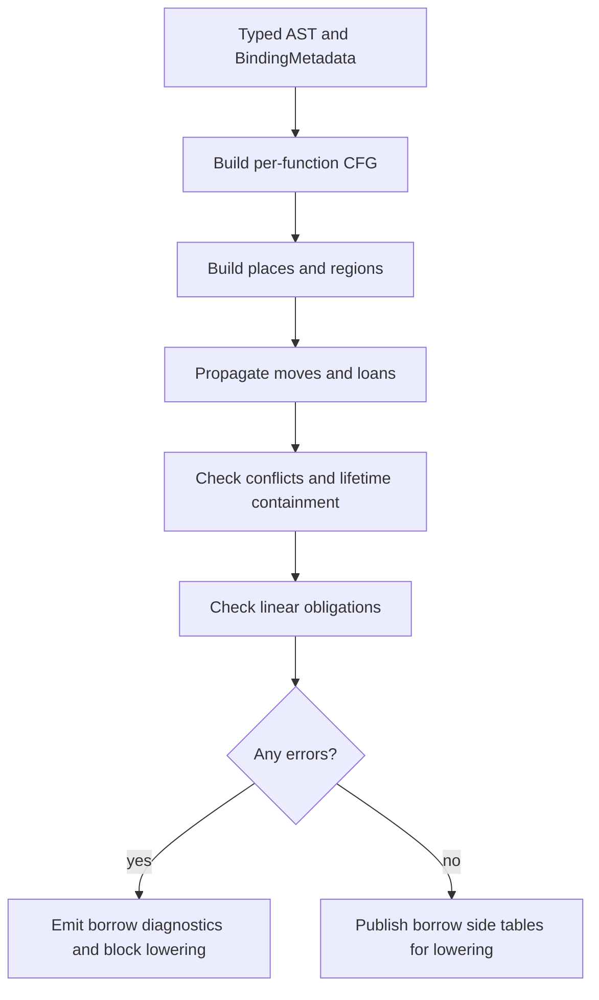

# RFC 0007: Borrow Lifetime And Ownership Checker

## Summary

This RFC defines the dedicated ZOM borrow, lifetime, and ownership checker that
runs after RFC 0005 type checking and before backend lowering. RFC 0005 proves
type correctness, basic mutability, and sanctioned coercions such as
`&mut T -> &T`. This RFC owns the remaining permission flow: moves, borrows,
reborrows, lifetime containment, use-after-move rejection, mutable alias
exclusion, scoped task reference safety, and linear consumption.

## Motivation

The type checker deliberately does not prove that references outlive their
referents or that owned values are consumed exactly once. That separation is
necessary: type inference, trait solving, and coercions operate on local type
facts, while borrow checking is a flow-sensitive dataflow problem over places,
loans, moves, drops, and control-flow joins.

Without a dedicated pass, the compiler cannot safely answer:

1. Is a value used after it has been moved?
2. Does a `&T` or `&mut T` reference outlive the storage it points to?
3. Does a mutable borrow overlap any other live borrow of the same place?
4. Does a reborrow end before the original mutable borrow becomes usable again?
5. Do references captured into `spawn_scope` tasks remain inside the scope?
6. Are `Linear` values consumed on every normal path and never consumed twice?

These are memory-safety and concurrency-safety questions. They need a separate
checker with explicit invariants, diagnostics, and conformance gates.

## Goals

- Define the post-type-check borrow checker pipeline phase.
- Define the internal place, loan, move, drop, and region model.
- Enforce use-after-move rejection.
- Enforce shared-vs-mutable borrow aliasing rules.
- Enforce reborrow lifetimes and restoration of the original mutable borrow.
- Enforce local reference lifetime containment for stack and field borrows.
- Enforce scoped-task capture lifetimes for `spawn_scope`-style APIs.
- Enforce normal-path linear consumption obligations.
- Define diagnostic families and test gates for borrow failures.
- Keep borrow checking separate from type inference and backend lowering.

## Non-Goals

- This RFC does not add user-written lifetime parameters or HRTB syntax.
- This RFC does not implement Rust's full Polonius model in the first landing.
- This RFC does not change reference type syntax in Chapter 03.
- This RFC does not change RFC 0005's type inference, trait solving, or
  coercion rules.
- This RFC does not define final concurrency scheduling semantics; it only
  defines lifetime constraints on references captured by scoped tasks.
- This RFC does not promise borrow checking for unsafe raw-pointer dereference.
  Unsafe code is still checked at safe boundaries, but raw-pointer interior
  aliasing remains outside the safe borrow model.

## Prior Art

Rust's MIR borrow checker uses non-lexical lifetimes over control-flow graphs,
with places, loans, moves, and drop elaboration. ZOM should copy the
post-type-check dataflow architecture and non-lexical lifetime behavior, while
not exposing Rust-style lifetime parameter syntax in v1.

Cyclone and region-based systems showed that region containment can make memory
safety explicit and checkable, but user-written region annotations are costly.
ZOM should copy the idea that references are bounded by regions and avoid the
annotation-heavy surface.

Swift's exclusivity enforcement prevents overlapping mutable access. ZOM should
copy the simple user rule of exclusive mutation, but enforce it statically for
safe code wherever possible instead of relying on dynamic exclusivity checks.

Vale's ownership model separates owning references from borrow references and
uses destructive reads for moves. ZOM should copy the place-state model for
ownership transfer, while keeping the ZOM syntax and `own`/`borrow` vocabulary
aligned with existing spec language.

C++ RAII demonstrates deterministic destruction but does not prevent dangling
references or use-after-move in the language core. ZOM should keep RAII cleanup
but add compile-time borrow checking on top.

## Guide-Level Explanation

Users write ordinary ZOM code with owned values, shared borrows, mutable borrows,
and moves:

```zom
fun update(mut value: Buffer) {
    let shared = &value;
    read(shared);

    let exclusive = &mut value;
    write(exclusive);
}
```

The checker allows any number of shared borrows while no mutable borrow is
active. A mutable borrow requires exclusive access to the place. Once the mutable
borrow ends, the original place becomes usable again.

Moving a value consumes the source place:

```zom
let a = make_buffer();
let b = a;        // moves a
use(a);           // error: use after move
```

Borrowing a temporary or stack local cannot escape the local's lifetime:

```zom
fun bad() -> &i32 {
    let x = 1;
    return &x;    // error: returned reference escapes local region
}
```

Scoped concurrency uses the same model. References captured by tasks spawned
inside a scope must not outlive the scope:

```zom
spawn_scope(fun(scope) {
    let local = Config::load();
    scope.spawn(fun() {
        use(&local);   // valid only while the spawned task joins before scope exit
    });
});
```

## Reference-Level Design

### Pipeline Position

The borrow checker runs after:

1. parse and AST publication;
2. binding and symbol resolution;
3. type checking, including `TypeEnv`, coercion records, trait bounds, and
   marker derivation facts.

It runs before:

1. error lowering and cleanup graph finalization;
2. IR generation;
3. backend target ABI lowering.

The pass receives typed AST plus binder metadata. It does not mutate the AST.
It writes borrow-check side tables keyed by `NodeId` and place IDs.

### Core Data Model

```text
Place {
  id: PlaceId,
  root: Local | Parameter | Field | Deref | Index | Temporary,
  projection: [Projection],
  type: TypeId,
}

Region {
  id: RegionId,
  kind: lexical | temporary | loop | closure | task_scope | return,
  parent: RegionId?,
  cfg_points: BitSet,
}

Loan {
  id: LoanId,
  place: PlaceId,
  kind: shared | mutable,
  region: RegionId,
  origin: NodeId,
}

Move {
  place: PlaceId,
  origin: NodeId,
}
```

Places are path-sensitive enough to distinguish `x.a` from `x.b` when the type
layout proves the fields are disjoint. Dereference and index projections are
conservative unless the type carries a trusted disjointness proof.

### Control-Flow Graph

The checker builds a per-function CFG from typed statements and expressions.
Edges include normal flow, early returns, loop control, match arms, `?!` early
return, and panic edges for `!!` only when `panic = "unwind"` is enabled.

Each CFG point has:

- initialized places;
- moved places;
- active shared loans;
- active mutable loans;
- pending linear obligations;
- region liveness.

Join points merge moved state by intersection for definite initialization and
union for possible moves. A value is usable only when definitely initialized and
not possibly moved on the incoming edge.

### Move Checking

A move from place `p` marks `p` as moved until it is reinitialized. Using `p` or
any projection of `p` after move is an error. Using a disjoint sibling field is
allowed only when the type supports field-sensitive partial moves.

Moves out of borrowed places are rejected unless the borrow is uniquely mutable
and the move is followed by reinitialization before the borrow's region can be
observed.

### Borrow Checking

A shared borrow of place `p` is valid when no active mutable loan overlaps `p`.
A mutable borrow of place `p` is valid when no active shared or mutable loan
overlaps `p`.

Overlap is place-based:

- identical roots overlap;
- field projections overlap only when one is a prefix of the other or fields
  may alias through layout;
- deref and index projections overlap conservatively.

### Reborrows

Reborrowing `&mut T` as `&T` creates a shared loan whose region is nested inside
the mutable loan's region. During the nested shared loan, the original mutable
borrow is suspended. When the shared loan ends, the mutable borrow becomes usable
again.

Reborrowing `&mut T` as `&mut T` creates a child mutable loan and similarly
suspends the parent mutable loan until the child ends.

### Lifetime Containment

Every reference value has an inferred region. A reference may flow into another
place only when its region outlives the destination's required region:

- returning a reference requires outliving the function return region;
- storing a reference in an object field requires outliving the object region;
- capturing a reference in a closure requires outliving the closure value;
- capturing a reference in a scoped task requires outliving the task scope, not
  necessarily `'static`.

Temporary regions end at the last use unless language rules extend them to the
enclosing statement or block.

### Linear Consumption

Types marked `Linear` create a normal-path obligation: every initialized value
of that type must be consumed exactly once before its region exits. Moving a
linear value transfers the obligation. Dropping, returning, or passing to a
known consuming function discharges it.

Panic unwind is a degraded path. Under `panic = "unwind"`, runtime cleanup may
run best-effort drop glue, but compile-time linear exactly-once guarantees apply
only to normal control-flow paths.

### Scoped Task Capture

Scoped task APIs declare a trusted scope region. A reference captured by a task
spawned in that scope is valid only if:

- the captured reference region outlives the task body;
- the task is guaranteed to join before the scope exits;
- the capture does not require mutable aliasing across concurrently running
  tasks unless the captured type is protected by an accepted synchronization
  primitive.

The first implementation may recognize only standard-library scoped task APIs
annotated with a compiler-known attribute. General HRTB syntax remains a
non-goal.

### Diagnostics

Borrow-checker diagnostics are checker-owned diagnostics. They must be allocated
from the checker-owned diagnostic authority in `diagnostics-checker.def` when
the implementation lands, and the RFC diagnostic catalog must be updated in the
same change. They must not use the `ZOM30xx` range, which is reserved for
binder diagnostics.

The implementation transition allocates checker-owned numeric codes as each
diagnostic family is wired from fact objects to emitted diagnostics:

| Family | Code | Trigger |
|---|---:|---|
| UseAfterMove | ZOM4056 | A moved place is read, borrowed, or moved again. |
| ValueMovedHere | ZOM4057 | Secondary note pointing at the move origin. |
| MoveOutOfBorrow | ZOM4070 | A value is moved out through an active borrow. |
| BorrowDoesNotLiveLongEnough | ZOM4061 | A reference escapes the region of its referent. |
| BorrowReferentHere | ZOM4062 | Secondary note pointing at the borrowed referent. |
| MutableBorrowConflicts | ZOM4058 | A mutable loan overlaps any active loan. |
| SharedBorrowConflicts | ZOM4059 | A shared loan overlaps an active mutable loan. |
| BorrowOriginHere | ZOM4060 | Secondary note pointing at the conflicting borrow origin. |
| ReborrowOutlivesParent | TBD | A child reborrow lives beyond the parent loan. |
| LinearNotConsumed | ZOM4063 | A linear value reaches region exit without consumption. |
| LinearInitializedHere | ZOM4064 | Secondary note pointing at the linear initialization. |
| LinearConsumedTwice | ZOM4065 | A linear obligation is discharged more than once. |
| LinearFirstConsumedHere | ZOM4066 | Secondary note pointing at the first consume. |
| ScopedTaskBorrowEscapes | ZOM4067 | A scoped task captures a reference that can outlive the scope. |
| ScopedTaskReferentHere | ZOM4068 | Secondary note pointing at the captured referent. |
| RawPointerBoundaryRequiresUnsafe | ZOM4069 | A raw-pointer safe boundary lacks an unsafe acknowledgement. |

Diagnostics must point at the use site and include a secondary note for the
originating move or borrow when available. Single-site boundary diagnostics
point at the boundary expression.

### Mermaid Flow



## Repository Impact

| Area | Paths | Owner |
|---|---|---|
| RFC governance | `docs/rfc/0007-borrow-lifetime-ownership-checker.md`, `docs/rfc/README.md` | `rfc` |
| Borrow semantic rules and checked facts | `products/zomlang/compiler/checker/**`, `products/zomlang/compiler/type/**` | `binder-checker` |
| Built MIR places, exits, revisions, and ownership handoff | `products/zomlang/compiler/mir/**` | `ir-backend` |
| Runtime and ownership vocabulary | `products/zomlang/runtime/**`, `libraries/zc/**` | `runtime-memory` |
| Scoped concurrency borrow rules | `docs/spec/chapters/15-concurrency.md`, `products/zomlang/runtime/**` | `concurrency` |
| Spec alignment | `docs/spec/**`, `docs/design/**` | `spec-audit` |
| Tests and verification | `products/zomlang/tests/**` | `verification` |

## Security And Safety Impact

This RFC is a memory-safety gate. Without it, safe ZOM cannot prove absence of
use-after-move, dangling references, mutable aliasing, and scoped task reference
escapes. The checker blocks backend lowering for unsafe safe-code programs.

The design also affects concurrency safety: scoped task references rely on the
borrow checker to prove that captured references cannot outlive their scope.
Runtime checks may exist in debug mode, but production safety must not depend on
runtime reference tracking for safe code.

## Drawbacks And Risks

- Borrow checking is complex and may reject valid programs until the dataflow
  model is sufficiently precise.
- Field-sensitive partial moves and disjoint borrows add implementation cost.
- Scoped task capture checking depends on trusted standard-library annotations
  until a more general higher-ranked lifetime model exists.
- Linear guarantees are normal-path only when panic unwinding is enabled; this
  must be taught clearly to users.
- Diagnostic quality is difficult because the primary error often depends on an
  earlier move or borrow origin.

## Alternatives Considered

- **Fold borrow checking into the type checker.** Rejected because type
  inference and borrow dataflow have different fixed points, state, and error
  recovery behavior. RFC 0005 intentionally excludes lifetime analysis.
- **Runtime borrow tracking.** Rejected for safe code because it adds overhead
  and can only detect bugs after execution reaches them.
- **Expose Rust-style lifetimes in v1.** Rejected because it increases syntax
  and teaching cost before ZOM needs general lifetime quantification.
- **ARC everywhere.** Rejected because reference counting prevents some lifetime
  bugs but does not enforce mutable exclusivity, scoped task joins, or linear
  consumption.
- **No linear checking until after borrow checking.** Rejected because the same
  place-state model is required for both move checking and linear consumption.

## Compatibility And Rollout

This is a new compiler phase and does not change accepted syntax. The rollout is:

1. implement CFG/place/region construction for a small safe subset;
2. enable use-after-move and local borrow conflict checks;
3. add lifetime containment for returned references and stored references;
4. add reborrow restoration;
5. add linear obligation tracking;
6. add scoped task capture checks;
7. enable the phase by default once diagnostics and conformance coverage are in
   place.

Rollback before `LANDED` is cheap: disable the borrow checker phase and keep the
RFC in `IMPLEMENTING` or `RETURNED`. After `LANDED`, weakening checks requires a
new RFC because users will rely on the safety guarantee.

### Current Implementation Readiness

`implementation: TBD` is required while this RFC is `RETURNED`. The current
`BorrowCheckerPhase` and typed-AST heuristics are a disposable pre-acceptance
experiment. They demonstrate diagnostic and dataflow questions but do not
satisfy the proposed architecture. Before re-entering review, this RFC must be
rewritten to consume RFC 0010's revision-safe Built MIR place and exit model;
AST-shape reconstruction cannot remain the normative ownership input.

## Documentation And Teaching Plan

- Update Chapter 03 with reference lifetime and reborrow rules after acceptance.
- Update Chapter 15 with scoped task capture lifetime rules after acceptance.
- Add a design document for borrow checker internals once implementation starts.
- Add examples for use-after-move, shared borrow, mutable borrow, reborrow,
  returned reference rejection, and scoped task captures.
- Add diagnostic documentation once numeric codes are allocated.

## Operational Readiness

Borrow checking must run deterministically and must not depend on thread
scheduling. It can be parallelized per function only after shared global inputs
are immutable. CI must include targeted borrow-checker tests and a translated
borrow-checker corpus before the RFC can move to `LANDED`.

## Acceptance Criteria

1. A post-type-check borrow checker phase exists and is wired into the driver.
2. The phase consumes typed AST, `BindingMetadata`, `TypeEnv`, and marker facts
   without mutating the AST.
3. Per-function CFG construction covers returns, loops, matches, `?!`, and
   closure bodies.
4. Place construction distinguishes locals, parameters, fields, dereferences,
   indexes, temporaries, and closure captures.
5. Use-after-move is rejected with source and move-origin diagnostics.
6. Overlapping mutable/shared borrow conflicts are rejected.
7. Reborrow lifetimes restore parent mutable borrows after child loans end.
8. Returning or storing references that outlive their referents is rejected.
9. Linear values are consumed exactly once on normal paths.
10. Scoped task reference captures are rejected when they may outlive the scope.
11. Unsafe raw-pointer interiors remain outside the safe borrow model, but safe
    boundaries are still checked.
12. Diagnostics conformance tests cover every diagnostic family.
13. A translated borrow-checker corpus has no known false negatives.
14. `python3 scripts/check-rfc.py` passes.
15. `python3 scripts/check-format.py` passes after implementation changes.
16. `ctest --preset default --output-on-failure` passes before `LANDED`.

### Implementation Evidence

| AC | Status | Evidence | Remaining Work |
|---|---|---|---|
| 1 | Partial | `BorrowCheckerPhase` is the first post-type-check phase owner. It consumes an immutable AST tree and type environment, runs place collection, builds initial borrow loans, builds per-function CFG summaries, infers the first phase-level move/reinitialize facts from typed AST, derives the first phase-level use-after-move reports from real use sites, and returns a `BorrowCheckerResult` with `BorrowPlaceCollectionResult`, function-to-CFG summaries, move-state queries, and stored use-after-move report queries. `emitBorrowDiagnostics()` is the first diagnostics bridge: it consumes an existing `BorrowCheckerResult`, emits `ZOM4056 UseAfterMove` at the use CFG node's AST span, and attaches `ZOM4057 ValueMovedHere` when the move-origin CFG node has an AST span. `Checker::check()` now runs this phase after body checking and trait coherence when earlier semantic phases are clean, so use-after-move diagnostics can reach the default checker pipeline. `borrow-model-test.cc` covers running the phase over a typed top-level function and observing populated places plus one function CFG, phase-level construction of a shared loan for `let ref = &value`, phase-level move/reinitialize inference over a typed move-only `let sink = owned; owned = replacement;` flow, phase-level return-value move inference for `return owned;`, phase-level call-argument move inference for `consume(owned);`, phase-level binary-operand move inference for `owned + other;`, phase-level index-operand move inference for `arr[index];`, phase-level unary-operand move inference for `-owned;`, phase-level use-after-move report construction for `let sink = owned; owned;`, phase-level call-argument use-after-move report construction for `let sink = owned; consume(owned);`, phase-level binary-operand use-after-move report construction for `let sink = owned; owned + other;`, phase-level index-operand use-after-move report construction for `let sink = index; arr[index];`, phase-level unary-operand use-after-move report construction for `let sink = owned; -owned;`, phase-level moved-parent member access report construction for `let sink = obj; obj.field;`, phase-level return-value use-after-move report construction for `let sink = owned; return owned;`, phase-level assignment-RHS use-after-move report construction for `let sink = owned; target = owned;`, declarator-typed binding inputs matching `BodyChecker` output, parser-shaped `IdentifierPattern` locals, `ZOM4056`/`ZOM4057` emission from a phase-level report, and default `Checker::check()` propagation of those diagnostics. `body-checker-test.cc` also covers the block-scope lookup fix that lets local `let` bindings be visible during body checking before borrow checking runs. `use_after_move_neg_11.check` covers user-visible CLI diagnostics for `ZOM4056` plus the `ZOM4057` move-origin note. | Add marker-fact precision, remaining borrow diagnostic families, and broader fact inference. |
| 2 | Partial | `BorrowPlaceBuilder` consumes typed AST nodes, `TypeEnv`, and optional `BindingMetadata` to create borrow places for typed function parameters, typed local binding patterns, and typed function return slots without mutating the AST. When binder metadata is available, parameter and local place roots use the binder symbol id instead of the AST node id fallback. `collectBorrowPlaces()` packages this into a standalone collection result, and `BorrowCheckerPhase::run()` now owns that collection as part of a phase-level result before invoking `BorrowLoanBuilder` for initial loan inference and typed move-fact inference. | Add marker-fact inputs for precise Copy/Linear classification, infer linear/lifetime facts from typed AST, and wire the phase after type checking. |
| 3 | Partial | `BorrowCfg`, `BorrowCfgNodeId`, `BorrowCfgEdge`, and `buildStraightLineBorrowCfg()` define the first per-function CFG skeleton, and `BorrowCheckerPhase::run()` now builds summary CFGs for top-level `FunctionDecl` nodes and function-like expression bodies (`FunctionExpression` / `LambdaExpression`). The current builder creates `Entry`, `Statement`, `Branch`, `Join`, `Return`, and `Exit` nodes for a function body block, preserves straight-line statement order, links `return` directly to `Exit`, stops adding nodes after an early return, models `if`/`else` branch edges with a join node, models `while` with a condition branch, body back-edge, loop-exit join, and nearest-loop `break`/`continue` targets, models `match` as branch-to-arm edges with fallthrough arms joining after the match while return arms go directly to `Exit`, models expression-bodied lambdas as entry-expression-exit, and adds early-exit edges for expression statements containing `PostfixExpression(ErrorPropagate)`, `let` initializer `PostfixExpression(ErrorPropagate)`, call callee/argument `PostfixExpression(ErrorPropagate)`, binary operand `PostfixExpression(ErrorPropagate)`, and assignment operand `PostfixExpression(ErrorPropagate)` while preserving the success fallthrough edge. `borrow-model-test.cc` covers empty function CFGs, linear `let` then `return`, return termination, `if`/`else` branch-and-join structure, `if` without `else` falling through to the join, while-loop back-edges, while-body returns that do not create back-edges, break edges to the loop join, continue edges to the loop branch, match-arm joins, match return arms that do not flow to the join, direct `?!` expression-statement early-exit edges, `?!` let-initializer early-exit edges, call-argument `?!` early-exit edges, binary-operand `?!` early-exit edges, assignment-operand `?!` early-exit edges, phase-level top-level function CFG summary creation, phase-level `FunctionExpression` CFG summary creation, and phase-level expression-bodied `LambdaExpression` CFG summary creation. | Add broader nested-expression `?!` coverage for remaining expression forms, nested labelled break/continue precision, and panic/unwind edges before this can satisfy the full CFG criterion. |
| 4 | Partial | `products/zomlang/compiler/checker/borrow-model.h` and `.cc` define `PlaceId`, `RegionId`, `LoanId`, `MoveId`, `Place`, `Region`, `Loan`, `Move`, root categories for locals, parameters, temporaries, closure captures, and return slots, plus projections for fields, dereferences, and indexes. The standalone `BorrowModel` owner allocates stable IDs and stores/query places, regions, loans, and moves. `BorrowPlaceBuilder` builds initial parameter, local, and return-slot places from typed `FunctionDecl`, `FunctionParameterList`, `BlockStmt`, `LetStmt`, `VariableDeclaratorList`, `VariableDeclarator`, and `BindingPattern` nodes. It also builds typed expression projection places for direct `obj.field`, `*ptr`, `arr[i]`, nested field chains such as `obj.field.child`, and dereference-then-field chains such as `(*ptr).field` when each projected expression is typed and the base binding already has a place; typed non-place rvalue expression statements now receive `Temporary` places rooted by expression `NodeId`; typed `let` initializer, `return` value, call argument, assignment operand, `if` condition/branch block, `while` condition/body block, and `match` scrutinee/guard/arm body expressions are traversed for projection and temporary places; typed outer-binding uses inside `FunctionExpression` / `LambdaExpression` block bodies now receive `ClosureCapture` places rooted by the captured binding `NodeId`, including direct captures and captured field/deref/index projections; closure-local `let` bindings shadow outer bindings for direct uses inside the same closure block. `BorrowPlaceCollectionResult` carries the model plus node-to-place mappings. `borrow-model-test.cc` covers root/type storage, projection-sensitive equality, different-root non-overlap, same-root overlap, nested field prefix overlap, proven-disjoint sibling fields, conservative sibling fields, conservative dereference/index divergence, region parents, loan permissions, move origins, ID allocation/query, invalid-ID queries, projection mutation through the owner, owner-level place-overlap checks, owner-level loan conflict queries, typed parameter/local/return-slot place construction, direct and nested field/deref/index expression projection place construction, temporary rvalue expression place construction, typed `let` initializer projection place construction, typed `return` value projection place construction, typed call argument projection place construction, typed assignment operand projection place construction, typed `if` branch block projection place construction, typed `while` body projection place construction, typed `match` arm body projection place construction, direct and projected closure-capture place construction for outer binding uses, closure-local shadow exclusion for direct uses, node-to-place mapping, skipping untyped bindings, binder-symbol root selection through `BindingMetadata`, and top-level place collection through `collectBorrowPlaces()`. | Add full lexical-scope-aware capture analysis across nested closure blocks, parameters, and patterns; connect the model owner to full CFG/dataflow. |
| 5 | Partial | `BorrowMoveState` provides the first move-state dataflow skeleton over `BorrowCfg`: callers can record explicit move facts with `addMove()`, record explicit reinitialization kills with `addReinitialize()`, run `propagate()`, query node-entry state with `isMovedBefore()` / `getMoveOriginBefore()`, query node-exit state with `isMovedAt()` / `getMoveOrigin()`, and call `checkUseAfterMoveAt()` to receive a `BorrowUseAfterMoveReport` containing the use CFG node, moved place, and move-origin CFG node for later diagnostic emission. The current propagation uses union semantics along CFG edges, applies per-node reinitialization kills before explicit moves, carries moved places to a fixed point, and preserves the first move origin for propagated moved state. `BorrowCheckerResult` stores phase-inferred move and reinitialize facts per function, exposes propagated node-entry and node-exit move-state queries by constructing a `BorrowMoveState` from those facts, exposes overlap-aware node-entry origin lookup for projected places, stores phase-level `BorrowUseAfterMoveReport` values, and stores phase-level `BorrowMoveOutOfBorrowReport` values when a move overlaps an active loan. `BorrowCheckerPhase::run()` infers direct move facts from move-only typed `let` initializers, call callee/argument expressions, binary operands, index object/index operands, non-reference unary operands, return values, and plain assignment RHS expressions while treating primitives, references, raw pointers, and function values as implicitly copyable until marker facts are wired; it also infers direct reinitialization facts from plain assignment LHS places, reports node-entry use-after-move for direct expression-statement uses, direct call callee/argument uses, binary operand uses, index object/index operand uses, non-reference unary operand uses, projected member uses whose parent place is moved, return-value uses, and plain-assignment RHS uses of moved places, and reports straight-line move-out-of-borrow when a move fact overlaps a currently active loan. Move-out-of-borrow inference now applies the first lexical block precision: a loan inferred inside a nested `BlockStmt`, an `if` branch block, a `while` body block, or a `match` arm body block is only active for CFG nodes whose AST is still inside that block, and a loan inferred from a call-argument borrow is only active for the call expression statement, so moves after those scopes are not rejected by ended loans. The expression scanner records moves/reports only for consumable place expressions (`IdentExpr`, member projections, dereference, and index) and recurses through compound expressions, so compound temporary nodes are not treated as user moves, moves created within the same CFG node are not reported as use-before-move in that node, and `UnaryOperatorKind::Ref` operands are treated as borrows rather than moves. `emitBorrowDiagnostics()` emits `ZOM4056 UseAfterMove` plus `ZOM4057 ValueMovedHere` from stored use-after-move reports and emits `ZOM4070 MoveOutOfBorrow` plus `ZOM4060 BorrowOriginHere` from stored move-out reports. `Checker::check()` invokes the unified borrow diagnostic bridge after earlier semantic phases succeed. `borrow-model-test.cc` covers a move recorded at a statement node propagating to a later successor node, entry-state versus exit-state distinction for a node that creates a move, a successor reporting the move origin node, structured use-after-move report lookup, a reinitialization node clearing moved state for itself and successors, phase-level inference for `let sink = owned; owned = replacement;` where `owned` is moved then reinitialized and `replacement` remains moved at the successor, phase-level return-value move inference for `return owned;`, phase-level call-argument move inference for `consume(owned);`, phase-level binary-operand move inference for `owned + other;`, phase-level index-operand move inference for `arr[index];`, phase-level unary-operand move inference for `-owned;`, a regression proving `&owned` does not move `owned`, phase-level report construction for `let sink = owned; owned;`, phase-level call-argument report construction for `let sink = owned; consume(owned);`, phase-level binary-operand report construction for `let sink = owned; owned + other;`, phase-level index-operand report construction for `let sink = index; arr[index];`, phase-level unary-operand report construction for `let sink = owned; -owned;`, phase-level moved-parent member report construction for `let sink = obj; obj.field;`, phase-level return-value report construction for `let sink = owned; return owned;`, phase-level assignment-RHS report construction for `let sink = owned; target = owned;`, use-after-move diagnostic emission with a move-origin note, phase-level move-out-of-borrow for `let ref = &owned; let sink = owned;`, suppression after a nested-block loan ends before the outer move, suppression after an `if`-branch loan ends before the outer move, suppression after a `while`-body loan ends before the outer move, suppression after a `match`-arm loan ends before the outer move, and suppression after a call-argument borrow ends before the outer move. `checker-test.cc` covers default checker-pipeline emission, `use_after_move_neg_11.check` covers the CLI use-after-move diagnostics path, `move_out_of_borrow_neg_15.check` covers CLI `ZOM4070` with a `ZOM4060` borrow-origin note, `move_after_block_borrow_pos_16.check` covers CLI acceptance after a nested-block borrow ends, `move_after_if_borrow_pos_17.check` covers CLI acceptance after an `if`-branch borrow ends, `move_after_while_borrow_pos_18.check` covers CLI acceptance after a `while`-body borrow ends, `move_after_match_borrow_pos_19.check` covers CLI acceptance after a `match`-arm borrow ends, and `move_after_call_borrow_pos_20.check` covers CLI acceptance after a call-argument borrow ends. | Add marker-fact driven Copy/Linear classification, detect moves and uses in remaining compound/nested expressions, infer loan lifetime/end points for reborrows, richer temporaries, and path-sensitive branch joins, and model path-sensitive joins. |
| 6 | Partial | `placesOverlap()` and `BorrowModel::placesOverlap()` implement the base overlap predicate needed by loan conflict checking: roots must match, field siblings are disjoint only under `FieldOverlapMode::ProvenDisjoint`, prefix projections overlap, and dereference/index divergence is conservative. `BorrowModel::findConflictingLoan()` implements the owner-level permission predicate for recorded loans: shared requests conflict only with overlapping mutable loans, mutable requests conflict with any overlapping loan, and field-disjoint places do not conflict when disjointness is proven. `BorrowLoanBuilder` provides the first AST borrow-construction slice by recognizing `let` initializers, nested block loans, `if` branch loans, `while` body loans, `match` arm loans, and call-argument loans that contain `UnaryExpression(Ref/RefMut)` over direct, field-projected, deref-projected, and index-projected referenced places. `BorrowCheckerPhase::run()` now invokes `BorrowLoanBuilder` for each top-level function, so these initial loans are part of the phase-level result rather than only an ad-hoc builder call, and source-AST loan conflicts are converted into stored `BorrowConflictReport` values. Phase-level conflict inference now filters previously active loans through the same lexical/call scope predicate used by move-out-of-borrow inference, so loans whose nested block, branch, loop body, match arm, or call expression has ended no longer cause later borrow conflicts. `BorrowLoanState` adds the first active-loan dataflow skeleton over `BorrowCfg`: callers can record explicit active loans at CFG nodes, record explicit loan-end kills with `addEndLoan()`, record parent-loan suspension/restoration with `addSuspendLoan()` and `addResumeLoan()`, propagate active and suspended loan ids along CFG edges to a fixed point, query `findConflictingLoanIdAt()` / `findConflictingLoanAt()` at successor nodes using the same overlap and permission rules, query `findConflictingLoanOriginAt()` so diagnostics can point at the originating borrow expression, and call `checkBorrowConflictAt()` to receive a single `BorrowConflictReport` containing the CFG node, requested place, requested loan kind, conflicting loan id, conflicting loan place, conflicting loan kind, region, and origin node for later diagnostic emission. `emitBorrowConflictDiagnostic()` maps a conflict report to `ZOM4058 MutableBorrowConflicts` or `ZOM4059 SharedBorrowConflicts` and attaches `ZOM4060 BorrowOriginHere` when the origin AST node is available. `borrow-model-test.cc` covers shared-loan construction for `&value` initializers, shared-loan construction for `&obj.field` initializers with a field-projected loan place, shared-loan construction for `&*ptr` initializers with a deref-projected loan place, shared-loan construction for `&arr[i]` initializers with an index-projected loan place, phase-level shared-loan inference for `let ref = &value`, source-AST mutable-borrow conflict inference for `&value` followed by `&mut value`, suppression when a nested-block shared borrow ends before a later mutable borrow, explicit mutable-loan construction through `markMutableBorrow()`, propagation of a shared loan to a successor node, detection of a later mutable-borrow conflict, conflict-loan-id lookup, conflict-origin lookup, structured conflict-report lookup, unit-level mutable-borrow conflict diagnostic emission, ended loans no longer conflicting at the end node or its successors, and manual suspend/resume of a mutable parent loan removing and restoring conflicts. `borrow_conflict_mutable_neg_12.check` covers CLI diagnostics for `ZOM4058` plus the `ZOM4060` borrow-origin note, `borrow_conflict_shared_neg_13.check` covers CLI diagnostics for `ZOM4059` plus the `ZOM4060` borrow-origin note, `borrow_after_block_borrow_pos_21.check` covers CLI acceptance after a nested-block shared borrow ends before a later mutable borrow, `borrow_after_if_borrow_pos_22.check` covers CLI acceptance after an `if`-branch shared borrow ends before a later mutable borrow, `borrow_after_while_borrow_pos_23.check` covers CLI acceptance after a `while`-body shared borrow ends before a later mutable borrow, `borrow_after_match_borrow_pos_24.check` covers CLI acceptance after a `match`-arm shared borrow ends before a later mutable borrow, and `borrow_after_call_borrow_pos_25.check` covers CLI acceptance after a call-argument shared borrow ends before a later mutable borrow. | Infer reborrow suspension/restoration from AST, infer richer loan lifetime/end points, implement path-sensitive loan joins, and extend conflict inference beyond straight-line source loans. |
| 7 | Partial | `BorrowLoanState` has the first explicit reborrow-restoration dataflow hook: callers can record a parent loan suspension with `addSuspendLoan()`, record restoration with `addResumeLoan()`, and `propagate()` keeps suspended loans separate from active loans until a matching resume event. `borrow-model-test.cc` covers a mutable parent loan that conflicts before suspension, does not conflict while suspended, and conflicts again after resume. | Infer child reborrow creation, parent suspension, child loan end, and parent restoration from real AST borrow expressions and region end points; prove nested reborrow stacks path-sensitively; emit diagnostics when child loans escape or parent restoration would be unsafe. |
| 8 | Partial | `BorrowModel::regionOutlives()` provides the first lifetime-containment primitive over the standalone region graph: identical regions outlive themselves, direct parents outlive children, transitive parents outlive descendants, invalid region IDs do not satisfy containment, and descendants do not outlive ancestors. `BorrowModel::checkRegionEscape()` adds the first diagnostics-facing escape fact object: it returns `BorrowRegionEscapeReport` when a referent region does not outlive the target region, carrying the target region, referent region, use node, and referent-origin node for later diagnostic emission. `BorrowCheckerResult` now stores per-function region-escape reports. `BorrowCheckerPhase::run()` infers the first source-AST escape slices for `return &local`, `return &local.field`, nested local-field projections such as `return &local.field.child`, indexed local projections such as `return &local[index]`, local reference bindings initialized from local borrows such as `let ref = &local; return ref;`, bounded alias chains such as `let alias = ref; return alias;`, simple stored local borrows such as `slot = &local; return slot;`, stored local reference aliases such as `slot = ref; return slot;`, returned reborrows such as `return &*ref;`, object-member compound returns such as `return { item: (&local) }.item`, struct-member compound returns such as `return Box { item: (&local) }.item`, aggregate object returns such as `return { item: (&local) }`, aggregate struct returns such as `return Box { item: (&local) }`, aggregate array returns such as `return [(&local)]`, conditional returns such as `return flag ? (&local) : (&local)`, cast-wrapper returns such as `return ((&local) as &T)`, and null-coalescing returns such as `return (&local) ?? (&local)`, error-default returns such as `return (&local) ?: (&local)`, and index-expression returns such as `return [(&local)][0]`, and call-expression returns such as `return id(&local)`, and new-expression returns such as `return new Box(&local)`, and import-call returns such as `return import("x", &local)`; these slices recognize returned `UnaryExpression(Ref/RefMut)` operands that resolve to local binding places or projections rooted in local binding places, trace local reference bindings back through a bounded chain to an initializer borrow or latest plain assignment, trace object/struct literal member returns and aggregate returns through property values, trace array aggregate returns through element values, trace conditional returns through then/else branch values, trace cast-wrapper returns through the cast operand, trace null-coalescing returns through primary/fallback values, trace error-default returns through primary/fallback values, trace index-expression returns through object/index values, conservatively trace call-expression returns through callee and argument values, conservatively trace new-expression returns through callee and argument values, conservatively trace import-call returns through argument values, trace `&*ref` through the local reference source, model the function return region as outliving the local lexical region, and store a region-escape report. Region-escape referent lookup now maps binder-symbol-rooted local places back to their AST binding pattern before diagnostics, so `ZOM4062` points at the `let` binding rather than a symbol-id-shaped unrelated AST node. `emitBorrowRegionEscapeDiagnostic()` maps that report to `ZOM4061 BorrowDoesNotLiveLongEnough` and attaches `ZOM4062 BorrowReferentHere` when the referent AST node is available, and `emitBorrowDiagnostics()` includes those reports in the unified borrow diagnostic bridge. `borrow-model-test.cc` covers direct containment, transitive containment, reflexive containment, reverse containment rejection, invalid-region rejection, region-escape reporting when a short-lived referent is used in a longer-lived target, no report when the referent outlives the target, unit-level region-escape diagnostic emission, phase-level report inference for returning a reference to a local binding, a field of a local binding, a nested field of a local binding, a local reference alias chain rooted in a local borrow, an object-member value rooted in a local borrow, a returned struct literal containing a local borrow, a returned array literal containing a local borrow, a returned conditional expression containing local borrows, a returned cast expression containing a local borrow, a returned null-coalescing expression containing local borrows, a returned error-default expression containing local borrows, a returned index expression containing local borrows, a returned call expression containing local borrows, a returned new expression containing local borrows, a returned import-call expression containing local borrows, a mutable reference slot assigned from a local borrow, a mutable reference slot assigned from a local reference alias, and a returned reborrow of a local reference. `return_local_reference_escape_neg_14.check`, `return_local_field_reference_escape_neg_26.check`, `return_nested_local_field_reference_escape_neg_27.check`, `return_local_reference_binding_escape_neg_28.check`, `return_local_reference_alias_escape_neg_29.check`, `return_local_index_reference_escape_neg_30.check`, `return_object_member_local_reference_escape_neg_39.check`, `return_struct_member_local_reference_escape_neg_40.check`, `return_struct_literal_local_reference_escape_neg_41.check`, `return_object_literal_local_reference_escape_neg_42.check`, `return_array_literal_local_reference_escape_neg_43.check`, `return_conditional_local_reference_escape_neg_44.check`, `return_cast_local_reference_escape_neg_45.check`, `return_null_coalesce_local_reference_escape_neg_46.check`, `return_error_default_local_reference_escape_neg_49.check`, `return_index_local_reference_escape_neg_47.check`, `return_call_local_reference_escape_neg_48.check`, `return_new_local_reference_escape_neg_50.check`, `return_import_call_local_reference_escape_neg_51.check`, `return_stored_local_reference_escape_neg_31.check`, `return_stored_alias_reference_escape_neg_32.check`, `return_reborrow_local_reference_escape_neg_33.check`, `return_nested_block_local_reference_escape_neg_34.check`, `return_if_branch_local_reference_escape_neg_35.check`, `return_else_branch_local_reference_escape_neg_38.check`, `return_while_body_local_reference_escape_neg_36.check`, and `return_match_arm_local_reference_escape_neg_37.check` cover CLI diagnostics for `ZOM4061` plus the `ZOM4062` referent note. | Generalize region inference beyond direct returns, bounded local reference alias chains, simple local-borrow stores, object/struct-member compound returns, aggregate object/struct/array returns, conditional returns, cast-wrapper returns, null-coalescing returns, error-default returns, index-expression returns, call-expression returns, new-expression returns, import-call returns, and returned reborrows to arbitrary returned projections, compound expressions, temporaries, closure captures, nested blocks, general reborrows, and loans; make region scopes path-sensitive instead of allocating the minimal return/local region pair used by this first slice. |
| 9 | Partial | `BorrowLinearState` provides the first normal-path linear-obligation dataflow skeleton over `BorrowCfg`: callers can record explicit linear initializations with `addInitialize()`, record explicit consumptions with `addConsume()`, run `propagate()`, query `isOutstandingAt()` at CFG nodes, query the originating initialization node with `getInitializeOrigin()`, call `checkMissingConsumeAt()` to receive a `BorrowMissingConsumeReport` containing the CFG node, outstanding place, and initialization-origin CFG node, and call `checkDoubleConsumeAt()` to receive a `BorrowDoubleConsumeReport` containing the second-consume CFG node, consumed place, and first-consume CFG node for later diagnostic emission. The current propagation uses union semantics along CFG edges, applies per-node consumptions before initializations for outstanding obligations, tracks consumed places separately, clears prior consumption state when a place is reinitialized, and preserves the first initialization or consumption origin for propagated state. `emitBorrowMissingConsumeDiagnostic()` maps missing-consume reports to `ZOM4063 LinearNotConsumed` plus `ZOM4064 LinearInitializedHere`, and `emitBorrowDoubleConsumeDiagnostic()` maps double-consume reports to `ZOM4065 LinearConsumedTwice` plus `ZOM4066 LinearFirstConsumedHere`. `borrow-model-test.cc` covers a missing-consume report at function exit after initialization, verifies that a later explicit consumption clears the outstanding obligation at exit, reports a double-consume fact when a second consume reaches a successor after a first consume, and covers unit-level diagnostics for both linear report families. | Detect real linear types, initialization sites, consumption sites, and normal-path exits from typed AST; make joins path-sensitive enough to distinguish all-path and some-path obligations; wire linear diagnostics into the checker pipeline. |
| 10 | Partial | `BorrowModel::checkScopedTaskCapture()` adds the first diagnostics-facing scoped-task capture fact object: it returns `BorrowScopedTaskCaptureReport` when a captured reference's referent region does not outlive the task-scope region, carrying the task region, referent region, capture node, and referent-origin node for later diagnostic emission. `emitBorrowScopedTaskCaptureDiagnostic()` maps that report to `ZOM4067 ScopedTaskBorrowEscapes` plus `ZOM4068 ScopedTaskReferentHere` when the referent AST node is available. `borrow-model-test.cc` covers reporting a scoped-task capture escape when the referent region is nested inside the task scope, no report when the referent region outlives the task scope, and unit-level scoped-task diagnostic emission. | Infer scoped-task regions from trusted standard-library APIs, infer closure capture references from typed AST, and connect capture facts to closure bodies and task lifetimes through the checker pipeline. |
| 11 | Partial | `BorrowModel::checkRawPointerBoundary()` adds the first safe-boundary fact for unsafe raw-pointer interiors: callers pass the raw-pointer boundary node and whether the boundary has an explicit unsafe acknowledgement, and the model returns `BorrowRawPointerBoundaryReport` only when the acknowledgement is missing. `BorrowCheckerResult` now stores per-function raw-pointer boundary reports, and `BorrowCheckerPhase::run()` infers the first typed-AST boundary slice by scanning `UnaryExpression(Deref)` whose operand has a raw-pointer type, including expression statements and `let` initializers. The inference tracks `UnsafeBlockExpr` ancestry and suppresses the report when the raw-pointer dereference occurs inside an unsafe block. `BodyChecker` now preserves the pointee type for reference and raw-pointer dereference and checks `IsExpression` operands before publishing the type-test result so the borrow phase can own unsafe-boundary diagnostics instead of being skipped by missing `TypeEnv` facts or an earlier `ErrorType`. `emitBorrowRawPointerBoundaryDiagnostic()` maps each report to `ZOM4069 RawPointerBoundaryRequiresUnsafe` at the boundary node span, and `emitBorrowDiagnostics()` includes those reports in the unified borrow diagnostic bridge. `borrow-model-test.cc` covers reporting an unacknowledged raw-pointer safe boundary, accepting an acknowledged boundary, unit-level raw-pointer boundary diagnostic emission, phase-level report inference for `*ptr` outside unsafe, phase-level report inference for `let value = *ptr`, phase-level report inference for `*ptr` inside conditional, null-coalescing, type-test, array literal, tuple literal, cast, object literal, struct literal, and member receiver expressions, and suppression for `unsafe { *ptr; }`. `body-checker-test.cc` covers raw-pointer dereference producing the pointee type and `is` operands being checked and recorded before the outer `bool` result, `raw_pointer_deref_requires_unsafe_neg_39.check` covers CLI diagnostics for `ZOM4069` in a `let` initializer, `raw_pointer_deref_expression_requires_unsafe_neg_41.check` covers CLI diagnostics for `ZOM4069` in an expression statement, `raw_pointer_deref_assignment_requires_unsafe_neg_42.check` covers CLI diagnostics for `ZOM4069` in an assignment RHS, `raw_pointer_deref_call_arg_requires_unsafe_neg_43.check` covers CLI diagnostics for `ZOM4069` in a call argument, `raw_pointer_deref_return_requires_unsafe_neg_44.check` covers CLI diagnostics for `ZOM4069` in a return value, `raw_pointer_deref_binary_requires_unsafe_neg_45.check` covers CLI diagnostics for `ZOM4069` in a binary operand, `raw_pointer_deref_conditional_requires_unsafe_neg_46.check` covers CLI diagnostics for `ZOM4069` in a conditional branch, `raw_pointer_deref_index_requires_unsafe_neg_47.check` covers CLI diagnostics for `ZOM4069` in an index operand, `raw_pointer_deref_null_coalesce_requires_unsafe_neg_48.check` covers CLI diagnostics for `ZOM4069` in a null-coalescing operand, `raw_pointer_deref_is_requires_unsafe_neg_49.check` covers CLI diagnostics for `ZOM4069` in a type-test operand, `raw_pointer_deref_array_literal_requires_unsafe_neg_50.check` covers CLI diagnostics for `ZOM4069` in an array literal element, `raw_pointer_deref_tuple_literal_requires_unsafe_neg_51.check` covers CLI diagnostics for `ZOM4069` in a tuple literal element, `raw_pointer_deref_cast_requires_unsafe_neg_52.check` covers CLI diagnostics for `ZOM4069` in a cast operand, `raw_pointer_deref_object_literal_requires_unsafe_neg_53.check` covers CLI diagnostics for `ZOM4069` in an object literal property value, `raw_pointer_deref_struct_literal_requires_unsafe_neg_54.check` covers CLI diagnostics for `ZOM4069` in a struct literal field value, `raw_pointer_deref_member_requires_unsafe_neg_55.check` covers CLI diagnostics for `ZOM4069` in a member expression receiver, and `raw_pointer_deref_unsafe_pos_40.check` covers CLI acceptance inside `unsafe {}`. | Extend raw-pointer boundary inference beyond unary dereference to FFI calls, unsafe function calls, packed-field reference creation, and marker-sensitive boundary facts; keep raw-pointer interior operations outside place/loan modeling while still enforcing safe-entry and safe-exit checks through the checker pipeline. |
| 14 | Partial | `python3 scripts/check-rfc.py` is part of the required verification for every RFC edit. | Re-run after each RFC update and before completion. |
| 15 | Partial | `python3 scripts/check-format.py` is part of the required verification for every C++ implementation change. | Re-run after implementation changes. |
| 16 | Partial | Focused borrow-model tests can verify the standalone model library. | Full default suite remains required before `LANDED`. |

## Implementation Plan

1. Add borrow-checker data structures for `Place`, `Region`, `Loan`, and `Move`.
2. Build per-function CFGs from typed AST.
3. Implement place overlap and field-disjointness rules.
4. Implement move-state dataflow and use-after-move diagnostics.
5. Implement shared/mutable loan dataflow and alias conflict diagnostics.
6. Implement reborrow nesting and parent-loan restoration.
7. Implement lifetime containment for returns, stores, closures, and temporaries.
8. Implement linear obligation tracking on normal control-flow paths.
9. Implement scoped task capture validation for trusted standard-library APIs.
10. Add CLI, lit, unit, and corpus tests.
11. Update Chapters 03 and 15 plus compiler design documentation.

## Test Plan

- Build: `cmake --preset sanitizer` and `cmake --build --preset sanitizer -j`.
- Unit tests: CFG construction, place overlap, move-state joins, loan conflicts,
  reborrow restoration, region containment, and linear obligations.
- Lit tests: `.zom` diagnostics for use-after-move, move-out-of-borrow,
  mutable aliasing, shared-vs-mutable conflict, escaping local reference,
  reborrow escape, linear missing consume, linear double consume, and scoped task
  borrow escape.
- Conformance: a translated subset of classic borrow-checker examples with
  expected diagnostics and accepted safe variants.
- Generated files: none expected unless AST or diagnostic registries change.
- Format: `python3 scripts/check-format.py`.
- RFC check: `python3 scripts/check-rfc.py`.

## Open Questions

- Should field-sensitive partial moves ship in the first implementation or only
  after whole-place move checking is stable?
- Which standard-library APIs are trusted scoped-task roots for the first
  implementation?

## Status History

| Date | Status | Notes |
|---|---|---|
| 2026-07-08 | DRAFT | Initial draft separating borrow, lifetime, ownership, move, reborrow, linear, and scoped-task checking from RFC 0005 type checking. |
| 2026-07-08 | REVIEW | The proposal now has a complete post-type-check borrow-checker design, safety impact, acceptance criteria, implementation plan, and local discussion/tracking anchors. Approval remains blocked on owner review, non-empty approvers, a recorded decision, and implementation evidence. |
| 2026-07-09 | REVIEW | Resolved the diagnostic-range question: borrow-checker diagnostics are checker-owned and must be allocated in `diagnostics-checker.def` when the implementation lands, not in the binder-owned ZOM30xx range. |
| 2026-07-09 | REVIEW | Implementation remains deliberately `TBD` because the repository has not landed a dedicated borrow-checker phase, borrow side-table owner, or place/loan/move dataflow model. |
| 2026-07-09 | REVIEW | Added the first standalone borrow-model implementation slice: place, region, loan, and move model types, a standalone `BorrowModel` owner, and unit-covered place-overlap rules. RFC remains blocked on phase wiring, typed AST construction, CFG/dataflow, diagnostics, integrated phase side tables, owner approval, and decision metadata. |
| 2026-07-09 | REVIEW | Added `BorrowPlaceBuilder` and `collectBorrowPlaces()` for the first typed-AST-to-place construction slice: typed function parameters, typed local binding patterns, and typed function return slots now populate the standalone `BorrowModel`, with unit coverage for node-to-place mapping, untyped-binding skips, binder-symbol root selection through `BindingMetadata`, and top-level function collection. RFC remains blocked on driver phase wiring, marker inputs, CFG/dataflow, diagnostics, integrated phase side tables, owner approval, and decision metadata. |
| 2026-07-09 | REVIEW | Extended the CFG skeleton for borrow checking: `BorrowCfg` and `buildStraightLineBorrowCfg()` now cover entry/exit nodes, block statement order, `if`/`else` branch-and-join edges, `while` loop back-edges and exit joins, nearest-loop `break`/`continue` targets, `match` arm joins, direct expression-statement `?!`, `let` initializer `?!`, call callee/argument `?!`, and binary operand `?!` early-exit edges, `return` edges to exit, and early return termination. RFC remains blocked on broader nested-expression `?!` coverage, labelled break/continue precision, dataflow, diagnostics, driver phase wiring, owner approval, and decision metadata. |
| 2026-07-09 | REVIEW | Added the first move-state dataflow skeleton: `BorrowMoveState` records explicit move facts, propagates moved places across `BorrowCfg` edges to a fixed point, and has unit coverage for propagation from a statement node to its successor. RFC remains blocked on AST move detection, reinitialization, path-sensitive joins, use-after-move diagnostics, driver phase wiring, owner approval, and decision metadata. |
| 2026-07-09 | REVIEW | Extended `BorrowMoveState` with explicit reinitialization kills and move-origin tracking, including unit coverage that reinitialization clears moved state for that node and its successors and that propagated moved state reports the originating CFG node. RFC remains blocked on AST move/reinitialization detection, path-sensitive joins, use-after-move diagnostics, driver phase wiring, owner approval, and decision metadata. |
| 2026-07-09 | REVIEW | Extended the active-loan implementation slice with `BorrowLoanBuilder`, which constructs the first shared loans from `&value`, `&obj.field`, `&*ptr`, and `&arr[i]` initializer AST and can construct mutable loans through an explicit `markMutableBorrow()` override, while `BorrowLoanState` records explicit active loans, loan-end kills, and manual parent-loan suspend/resume events, propagates active and suspended loans across `BorrowCfg` edges to a fixed point, and can query successor-node shared/mutable conflicts, conflict loan ids, and originating borrow expressions through `BorrowModel` place-overlap rules. RFC remains blocked on final mutable-borrow AST syntax, AST-inferred reborrow suspension/restoration, inferred loan lifetimes, diagnostics, driver phase wiring, owner approval, and decision metadata. |
| 2026-07-09 | REVIEW | Mapped the existing manual parent-loan suspend/resume dataflow into AC7 reborrow-restoration evidence: a mutable parent loan can be suspended while a child loan is active and resumed afterward, with unit coverage for conflict removal and restoration. RFC remains blocked on AST-inferred reborrow events, nested reborrow stacks, emitted diagnostics, driver phase wiring, owner approval, and decision metadata. |
| 2026-07-09 | REVIEW | Added the first diagnostics-facing borrow-conflict fact object: `BorrowConflictReport` and `BorrowLoanState::checkBorrowConflictAt()` now return the requested place/kind, conflicting loan id/place/kind, region, origin node, and CFG node in one unit-covered result, while the older conflict-id lookup reuses the same conflict scan. RFC remains blocked on final mutable-borrow AST syntax, AST-inferred reborrow suspension/restoration, inferred loan lifetimes, emitted diagnostics, driver phase wiring, owner approval, and decision metadata. |
| 2026-07-09 | REVIEW | Added the first diagnostics-facing use-after-move fact object: `BorrowUseAfterMoveReport` and `BorrowMoveState::checkUseAfterMoveAt()` now return the use CFG node, moved place, and propagated move-origin CFG node in one unit-covered result. RFC remains blocked on AST move/reinitialization detection, path-sensitive joins, emitted diagnostics, driver phase wiring, owner approval, and decision metadata. |
| 2026-07-09 | REVIEW | Added the first lifetime-containment primitive: `BorrowModel::regionOutlives()` checks reflexive, direct-parent, and transitive-parent outlives relationships with unit coverage for positive, reverse, and invalid-region cases. RFC remains blocked on AST-inferred region constraints, escape diagnostics, driver phase wiring, owner approval, and decision metadata. |
| 2026-07-09 | REVIEW | Added the first diagnostics-facing region-escape fact object: `BorrowRegionEscapeReport` and `BorrowModel::checkRegionEscape()` now report when a referent region does not outlive the target region, carrying the target region, referent region, use node, and referent-origin node. RFC remains blocked on AST-inferred region constraints, emitted escape diagnostics, driver phase wiring, owner approval, and decision metadata. |
| 2026-07-09 | REVIEW | Added the first normal-path linear-obligation skeleton: `BorrowLinearState` records explicit initializations and consumptions, propagates outstanding obligations over `BorrowCfg`, and returns `BorrowMissingConsumeReport` with the exit node, outstanding place, and initialization origin. RFC remains blocked on AST-inferred linear facts, double-consume detection, path-sensitive all-path checks, emitted diagnostics, driver phase wiring, owner approval, and decision metadata. |
| 2026-07-09 | REVIEW | Extended `BorrowLinearState` with consumed-place dataflow and `BorrowDoubleConsumeReport`, allowing a second explicit consume to report the first-consume CFG origin. RFC remains blocked on AST-inferred linear facts, path-sensitive all-path checks, emitted diagnostics, driver phase wiring, owner approval, and decision metadata. |
| 2026-07-09 | REVIEW | Added the first diagnostics-facing scoped-task capture fact object: `BorrowScopedTaskCaptureReport` and `BorrowModel::checkScopedTaskCapture()` now report when a captured reference's referent region does not outlive the task scope. RFC remains blocked on trusted scoped-task API recognition, closure capture inference, emitted diagnostics, driver phase wiring, owner approval, and decision metadata. |
| 2026-07-09 | REVIEW | Added the first raw-pointer safe-boundary fact object: `BorrowRawPointerBoundaryReport` and `BorrowModel::checkRawPointerBoundary()` now report unacknowledged raw-pointer boundaries while leaving raw-pointer interiors outside the borrow model. RFC remains blocked on AST-inferred unsafe boundaries, emitted diagnostics, driver phase wiring, owner approval, and decision metadata. |
| 2026-07-09 | REVIEW | Added the first standalone borrow-checker phase owner: `BorrowCheckerPhase::run()` now returns a `BorrowCheckerResult` containing phase-owned place collection and per-function CFG summaries. RFC remains blocked on driver scheduling, diagnostics, fact inference, full conformance, owner approval, and decision metadata. |
| 2026-07-09 | REVIEW | Extended `BorrowPlaceBuilder` with typed expression projection place construction for direct field, dereference, and index expressions whose base binding already has a place. RFC remains blocked on nested expression traversal, temporaries, closure captures, full fact inference, emitted diagnostics, driver phase wiring, owner approval, and decision metadata. |
| 2026-07-10 | REVIEW | Extended typed expression projection place construction to nested field chains and dereference-then-field chains when intermediate projection expressions are typed. RFC remains blocked on temporaries, closure captures, non-statement expression traversal, full fact inference, emitted diagnostics, driver phase wiring, owner approval, and decision metadata. |
| 2026-07-10 | REVIEW | Added temporary place construction for typed non-place rvalue expression statements, using the expression `NodeId` as the temporary root id. RFC remains blocked on closure captures, non-statement expression traversal, full fact inference, emitted diagnostics, driver phase wiring, owner approval, and decision metadata. |
| 2026-07-10 | REVIEW | Added the first closure-capture place construction slice: direct typed outer-binding uses inside `FunctionExpression` / `LambdaExpression` block bodies map to `ClosureCapture` places rooted by the captured binding `NodeId`. RFC remains blocked on complete closure capture analysis with scope shadowing, non-statement expression traversal, full fact inference, emitted diagnostics, driver phase wiring, owner approval, and decision metadata. |
| 2026-07-10 | REVIEW | Added typed `let` initializer expression traversal so projection and temporary places are collected from declaration initializers, not only expression statements. RFC remains blocked on expression traversal for calls, returns, assignments, nested blocks, branches, loops, matches, closure expression bodies, complete fact inference, emitted diagnostics, driver phase wiring, owner approval, and decision metadata. |
| 2026-07-10 | REVIEW | Added typed `return` value expression traversal so returned projection and temporary places are collected for later lifetime escape diagnostics. RFC remains blocked on expression traversal for calls, assignments, nested blocks, branches, loops, matches, closure expression bodies, complete fact inference, emitted diagnostics, driver phase wiring, owner approval, and decision metadata. |
| 2026-07-10 | REVIEW | Added typed call argument expression traversal so projection and temporary places are collected at call boundaries. RFC remains blocked on expression traversal for assignments, nested blocks, branches, loops, matches, closure expression bodies, complete fact inference, emitted diagnostics, driver phase wiring, owner approval, and decision metadata. |
| 2026-07-10 | REVIEW | Added typed assignment operand expression traversal so assignment LHS and RHS places are collected for later move, reinitialization, and borrow diagnostics. RFC remains blocked on expression traversal for nested blocks, branches, loops, matches, closure expression bodies, complete fact inference, emitted diagnostics, driver phase wiring, owner approval, and decision metadata. |
| 2026-07-10 | REVIEW | Added typed `if` condition and branch block traversal so projection and temporary places are collected inside nested branch blocks. RFC remains blocked on expression traversal for loops, matches, closure expression bodies, complete fact inference, emitted diagnostics, driver phase wiring, owner approval, and decision metadata. |
| 2026-07-10 | REVIEW | Added typed `while` condition and body block traversal so projection and temporary places are collected inside loop bodies. RFC remains blocked on expression traversal for matches, closure expression bodies, complete fact inference, emitted diagnostics, driver phase wiring, owner approval, and decision metadata. |
| 2026-07-10 | REVIEW | Added typed `match` scrutinee, guard, and arm body traversal so projection and temporary places are collected inside match arms. RFC remains blocked on closure expression bodies, complete closure capture shadowing, complete fact inference, emitted diagnostics, driver phase wiring, owner approval, and decision metadata. |
| 2026-07-10 | REVIEW | Extended closure-capture place construction to captured field/deref/index projections inside `FunctionExpression` / `LambdaExpression` block bodies. RFC remains blocked on complete closure capture shadowing, complete fact inference, emitted diagnostics, driver phase wiring, owner approval, and decision metadata. |
| 2026-07-10 | REVIEW | Added the first closure-local shadowing guard: direct uses of a same-named `let` binding inside a closure block now resolve to the closure-local place instead of creating a capture for the outer binding. RFC remains blocked on full lexical-scope-aware capture analysis, complete fact inference, emitted diagnostics, driver phase wiring, owner approval, and decision metadata. |
| 2026-07-10 | REVIEW | Connected initial shared-loan construction to the standalone `BorrowCheckerPhase`, so phase results now include loans inferred from reference initializers such as `let ref = &value`. RFC remains blocked on driver wiring, diagnostics, mutable-borrow syntax, inferred lifetimes, path-sensitive joins, owner approval, and decision metadata. |
| 2026-07-10 | REVIEW | Extended `BorrowCheckerPhase` CFG summary construction from top-level `FunctionDecl` nodes to function-like expression bodies, with unit coverage for `FunctionExpression` body CFG summaries. RFC remains blocked on lambda expression-body CFGs, broader nested-expression `?!` edges, diagnostics, driver phase wiring, owner approval, and decision metadata. |
| 2026-07-10 | REVIEW | Added CFG summaries for expression-bodied `LambdaExpression` nodes, modeling the lambda expression body as a straight-line expression statement between entry and exit. RFC remains blocked on broader nested-expression `?!` edges, diagnostics, driver phase wiring, owner approval, and decision metadata. |
| 2026-07-10 | REVIEW | Extended expression-statement `?!` detection to nested expressions, including assignment operands, so assignments such as `target = result?!` now get both early-exit and success fallthrough CFG edges. RFC remains blocked on broader nested-expression `?!` edges, diagnostics, driver phase wiring, owner approval, and decision metadata. |
| 2026-07-10 | REVIEW | Added the first phase-level move/reinitialize fact inference: `BorrowCheckerPhase::run()` now records direct move facts from move-only typed `let` initializers, direct reinitialization facts from plain assignment LHS places, and direct RHS move facts from move-only plain assignments; `BorrowCheckerResult` exposes propagated per-function move-state queries over those facts. RFC remains blocked on marker-fact precision, nested move sites, use-after-move diagnostics, driver phase wiring, owner approval, and decision metadata. |
| 2026-07-10 | REVIEW | Added the first phase-level use-after-move report inference: `BorrowCheckerPhase::run()` now scans direct expression-statement uses after move-state propagation and stores `BorrowUseAfterMoveReport` values in `BorrowCheckerResult` with report-count and indexed-report accessors. RFC remains blocked on nested use-site coverage, diagnostic emission, marker-fact precision, driver phase wiring, owner approval, and decision metadata. |
| 2026-07-10 | REVIEW | Extended phase-level use-after-move report inference from direct expression statements to call expressions, including callee and argument expression uses, with unit coverage for `let sink = owned; consume(owned);`. RFC remains blocked on return, compound, and deeper nested use-site coverage, diagnostic emission, marker-fact precision, driver phase wiring, owner approval, and decision metadata. |
| 2026-07-10 | REVIEW | Extended phase-level use-after-move report inference to return values, with unit coverage for `let sink = owned; return owned;`. RFC remains blocked on compound and deeper nested use-site coverage, diagnostic emission, marker-fact precision, driver phase wiring, owner approval, and decision metadata. |
| 2026-07-10 | REVIEW | Extended phase-level use-after-move report inference to plain-assignment RHS expressions while leaving assignment LHS as a write/reinitialization target, with unit coverage for `let sink = owned; target = owned;`. RFC remains blocked on remaining compound and deeper nested use-site coverage, diagnostic emission, marker-fact precision, driver phase wiring, owner approval, and decision metadata. |
| 2026-07-10 | REVIEW | Extended phase-level move-fact inference to return values, so returning a move-only place records a move origin at the return CFG node and propagates to exit. RFC remains blocked on call-argument moves, remaining compound and deeper nested move sites, marker-fact precision, diagnostics, driver phase wiring, owner approval, and decision metadata. |
| 2026-07-10 | REVIEW | Extended phase-level move-fact inference to call callee and argument expressions, while limiting direct move/report recording to consumable place expressions so compound temporary nodes are not reported as user moves. RFC remains blocked on remaining compound and deeper nested move sites, marker-fact precision, diagnostics, driver phase wiring, owner approval, and decision metadata. |
| 2026-07-10 | REVIEW | Extended phase-level move-fact and use-after-move report inference to binary operands, and split move-state queries into node-entry and node-exit views so a move created within a CFG node is not reported as a use-before-move in the same node. RFC remains blocked on remaining compound and deeper nested move sites, marker-fact precision, diagnostics, driver phase wiring, owner approval, and decision metadata. |
| 2026-07-10 | REVIEW | Extended phase-level move-fact and use-after-move report inference to index expressions, including both indexed object and index operands. RFC remains blocked on remaining compound and deeper nested move sites, marker-fact precision, diagnostics, driver phase wiring, owner approval, and decision metadata. |
| 2026-07-10 | REVIEW | Extended phase-level move-fact and use-after-move report inference to unary operands. RFC remains blocked on remaining compound and deeper nested move sites, marker-fact precision, diagnostics, driver phase wiring, owner approval, and decision metadata. |
| 2026-07-10 | REVIEW | Refined unary move inference so `UnaryOperatorKind::Ref` is treated as a borrow and does not move its operand. RFC remains blocked on remaining compound and deeper nested move sites, marker-fact precision, diagnostics, driver phase wiring, owner approval, and decision metadata. |
| 2026-07-10 | REVIEW | Added overlap-aware node-entry move-origin lookup so projected member uses such as `obj.field` report use-after-move when the parent `obj` has already moved. RFC remains blocked on remaining compound and deeper nested move sites, marker-fact precision, diagnostics, driver phase wiring, owner approval, and decision metadata. |
| 2026-07-10 | REVIEW | Allocated `ZOM4056 UseAfterMove` and `ZOM4057 ValueMovedHere`, and added `emitBorrowDiagnostics()` to turn phase-level use-after-move reports into a primary diagnostic plus move-origin note. RFC remains blocked on driver phase wiring, CLI diagnostics conformance, marker-fact precision, and remaining borrow diagnostic families. |
| 2026-07-10 | REVIEW | Wired the use-after-move borrow phase into `Checker::check()` after clean body checking and trait coherence, added a block-scope lookup fix so local `let` bindings are visible during body checking, and synchronized match exhaustiveness diagnostics with `BodyChecker::hadErrors`. RFC remains blocked on CLI diagnostics conformance, marker-fact precision, and remaining borrow diagnostic families. |
| 2026-07-10 | REVIEW | Added parser-shaped `IdentifierPattern` support to borrow place construction and CLI conformance for `ZOM4056 UseAfterMove` with a `ZOM4057 ValueMovedHere` note. RFC remains blocked on marker-fact precision and remaining borrow diagnostic families. |
| 2026-07-10 | REVIEW | Allocated `ZOM4070 MoveOutOfBorrow`, added straight-line move-out-of-borrow inference for moves overlapping active loans, and added CLI conformance through `move_out_of_borrow_neg_15.check`. RFC remains blocked on loan lifetime/end inference, reborrow restoration, path-sensitive loan joins, marker-fact precision, owner approval, and decision metadata. |
| 2026-07-10 | REVIEW | Added the first lexical block loan-end precision: loan construction now traverses nested blocks, move-out-of-borrow ignores loans whose enclosing block no longer contains the move node, and `move_after_block_borrow_pos_16.check` covers CLI acceptance after a nested-block borrow ends. RFC remains blocked on branch, loop, match, reborrow, temporary, and path-sensitive loan lifetime inference. |
| 2026-07-10 | REVIEW | Extended lexical loan traversal into `if` branch blocks and added `move_after_if_borrow_pos_17.check` to cover CLI acceptance after an `if`-branch borrow ends. RFC remains blocked on loop, match, reborrow, temporary, and path-sensitive branch-join loan lifetime inference. |
| 2026-07-10 | REVIEW | Extended lexical loan traversal into `while` body blocks and added `move_after_while_borrow_pos_18.check` to cover CLI acceptance after a `while`-body borrow ends. RFC remains blocked on match, reborrow, temporary, and path-sensitive branch-join loan lifetime inference. |
| 2026-07-10 | REVIEW | Extended lexical loan traversal into `match` arm body blocks and added `move_after_match_borrow_pos_19.check` to cover CLI acceptance after a `match`-arm borrow ends. RFC remains blocked on reborrow, temporary, and path-sensitive branch-join loan lifetime inference. |
| 2026-07-10 | REVIEW | Added call-argument borrow loan construction and call-expression loan scope precision, with `move_after_call_borrow_pos_20.check` covering CLI acceptance after a call-argument borrow ends. RFC remains blocked on reborrow, richer temporary, and path-sensitive branch-join loan lifetime inference. |
| 2026-07-10 | REVIEW | Reused lexical/call loan-scope filtering for phase-level borrow-conflict inference, and added `borrow_after_block_borrow_pos_21.check` to cover CLI acceptance after a nested-block shared borrow ends before a later mutable borrow. RFC remains blocked on reborrow, richer temporary, and path-sensitive branch-join loan lifetime inference. |
| 2026-07-10 | REVIEW | Added `borrow_after_if_borrow_pos_22.check` to cover CLI acceptance after an `if`-branch shared borrow ends before a later mutable borrow. RFC remains blocked on reborrow, richer temporary, and path-sensitive branch-join loan lifetime inference. |
| 2026-07-10 | REVIEW | Added borrow-conflict CLI conformance for ended `while` body, `match` arm, and call-argument loans through `borrow_after_while_borrow_pos_23.check`, `borrow_after_match_borrow_pos_24.check`, and `borrow_after_call_borrow_pos_25.check`. RFC remains blocked on reborrow, richer temporary, and path-sensitive branch-join loan lifetime inference. |
| 2026-07-10 | REVIEW | Allocated `ZOM4058 MutableBorrowConflicts`, `ZOM4059 SharedBorrowConflicts`, and `ZOM4060 BorrowOriginHere`, and added unit-covered conflict-report diagnostic emission. RFC remains blocked on AST-inferred conflict facts and remaining borrow diagnostic families. |
| 2026-07-10 | REVIEW | Added expression parser support for `&mut value` as `UnaryExpression(RefMut)`, source-AST mutable-loan construction, straight-line shared-then-mutable conflict inference, and CLI conformance for `ZOM4058` with `ZOM4060`. RFC remains blocked on lifetime-end inference, reborrow restoration, path-sensitive loan joins, and remaining borrow diagnostic families. |
| 2026-07-10 | REVIEW | Added CLI conformance for the opposite conflict direction, `&mut value` followed by `&value`, covering `ZOM4059` with the shared `ZOM4060` borrow-origin note. RFC remains blocked on lifetime-end inference, reborrow restoration, path-sensitive loan joins, and remaining borrow diagnostic families. |
| 2026-07-10 | REVIEW | Allocated `ZOM4061 BorrowDoesNotLiveLongEnough` and `ZOM4062 BorrowReferentHere`, and added unit-covered region-escape diagnostic emission from `BorrowRegionEscapeReport`. RFC remains blocked on source-AST region inference, lifetime-end inference, reborrow restoration, and remaining borrow diagnostic families. |
| 2026-07-10 | REVIEW | Added the first source-AST region-escape inference slice: `BorrowCheckerPhase::run()` now stores `BorrowRegionEscapeReport` values for `return &local`, emits them through the unified borrow diagnostic bridge, and `return_local_reference_escape_neg_14.check` covers CLI diagnostics for `ZOM4061` with the `ZOM4062` referent note. RFC remains blocked on general region inference for compound expressions, stores, temporaries, closure captures, nested blocks, reborrows, and loans. |
| 2026-07-10 | REVIEW | Extended source-AST region-escape inference to field projections rooted in local bindings, so `return &obj.field` reports against the local object binding, with CLI conformance in `return_local_field_reference_escape_neg_26.check`. RFC remains blocked on arbitrary returned projections, compound expressions, stores, temporaries, closure captures, nested blocks, reborrows, and loans. |
| 2026-07-10 | REVIEW | Extended region-escape inference to nested local-field projections and one-hop local reference bindings initialized from local borrows, fixed binder-metadata-backed referent note mapping, and added CLI conformance through `return_nested_local_field_reference_escape_neg_27.check` and `return_local_reference_binding_escape_neg_28.check`. RFC remains blocked on arbitrary returned projections, stores, temporaries, closure captures, nested blocks, reborrows, and loans. |
| 2026-07-10 | REVIEW | Extended local-reference escape inference through bounded alias chains, with unit coverage for `let alias = ref; return alias;` and CLI conformance in `return_local_reference_alias_escape_neg_29.check`. RFC remains blocked on arbitrary returned projections, stores, temporaries, closure captures, nested blocks, reborrows, and loans. |
| 2026-07-10 | REVIEW | Added CLI conformance for indexed local projection escape through `return_local_index_reference_escape_neg_30.check`, covering `return &arr[0]` with `ZOM4061` and the `ZOM4062` referent note. RFC remains blocked on arbitrary returned projections, stores, temporaries, closure captures, nested blocks, reborrows, and loans. |
| 2026-07-10 | REVIEW | Extended region-escape inference to simple stored local borrows, so `slot = &value; return slot;` reports through `ZOM4061` with `ZOM4062`, with unit coverage and CLI conformance in `return_stored_local_reference_escape_neg_31.check`. RFC remains blocked on arbitrary stores, temporaries, closure captures, nested blocks, reborrows, and loans. |
| 2026-07-10 | REVIEW | Added unit and CLI conformance for stored local reference aliases, so `slot = ref; return slot;` traces through `ref = &value`, with `return_stored_alias_reference_escape_neg_32.check` covering the user-visible diagnostics path. RFC remains blocked on arbitrary stores, temporaries, closure captures, nested blocks, reborrows, and loans. |
| 2026-07-10 | REVIEW | Added returned-reborrow region-escape inference for `return &*ref` when `ref` is rooted in a local borrow, with unit coverage and CLI conformance in `return_reborrow_local_reference_escape_neg_33.check`. RFC remains blocked on general reborrow lifetimes, arbitrary stores, temporaries, closure captures, nested blocks, and loans. |
| 2026-07-10 | REVIEW | Added CLI conformance for direct nested-block local-reference escape through `return_nested_block_local_reference_escape_neg_34.check`. RFC remains blocked on general nested-block region inference, arbitrary stores, temporaries, closure captures, reborrows, and loans. |
| 2026-07-10 | REVIEW | Added CLI conformance for direct `if`-branch local-reference escape through `return_if_branch_local_reference_escape_neg_35.check`. RFC remains blocked on general control-flow-sensitive region inference, arbitrary stores, temporaries, closure captures, reborrows, and loans. |
| 2026-07-10 | REVIEW | Added CLI conformance for direct `else`-branch local-reference escape through `return_else_branch_local_reference_escape_neg_38.check`. RFC remains blocked on general control-flow-sensitive region inference, arbitrary stores, temporaries, closure captures, reborrows, and loans. |
| 2026-07-10 | REVIEW | Added CLI conformance for direct `while`-body local-reference escape through `return_while_body_local_reference_escape_neg_36.check`. RFC remains blocked on general control-flow-sensitive region inference, arbitrary stores, temporaries, closure captures, reborrows, and loans. |
| 2026-07-10 | REVIEW | Added CLI conformance for direct `match`-arm local-reference escape through `return_match_arm_local_reference_escape_neg_37.check`. RFC remains blocked on general control-flow-sensitive region inference, arbitrary stores, temporaries, closure captures, reborrows, and loans. |
| 2026-07-10 | REVIEW | Added condition-branch region-escape inference for returned conditional expressions, with unit coverage for `return flag ? (&value) : (&value);` and CLI conformance in `return_conditional_local_reference_escape_neg_44.check`. RFC remains blocked on remaining compound expression region inference, arbitrary stores, temporaries, closure captures, reborrows, and loans. |
| 2026-07-10 | REVIEW | Added cast-wrapper region-escape inference for returned cast expressions, with unit coverage for `return ((&value) as &i32);` and CLI conformance in `return_cast_local_reference_escape_neg_45.check`. RFC remains blocked on remaining compound expression region inference, arbitrary stores, temporaries, closure captures, reborrows, and loans. |
| 2026-07-10 | REVIEW | Added null-coalescing region-escape inference for returned null-coalescing expressions, with unit coverage for `return (&value) ?? (&value);` and CLI conformance in `return_null_coalesce_local_reference_escape_neg_46.check`. RFC remains blocked on remaining compound expression region inference, arbitrary stores, temporaries, closure captures, reborrows, and loans. |
| 2026-07-10 | REVIEW | Added index-expression region-escape inference for returned index expressions, with unit coverage for `return [(&value)][0];` and CLI conformance in `return_index_local_reference_escape_neg_47.check`. RFC remains blocked on remaining compound expression region inference, arbitrary stores, temporaries, closure captures, reborrows, and loans. |
| 2026-07-10 | REVIEW | Added conservative call-expression region-escape inference for returned call expressions, with unit coverage for `return id(&value);` and CLI conformance in `return_call_local_reference_escape_neg_48.check`. RFC remains blocked on function region summaries, remaining compound expression region inference, arbitrary stores, temporaries, closure captures, reborrows, and loans. |
| 2026-07-10 | REVIEW | Added error-default region-escape inference for returned error-default expressions, with unit coverage for `return (&value) ?: (&value);` and CLI conformance in `return_error_default_local_reference_escape_neg_49.check`. RFC remains blocked on remaining compound expression region inference, arbitrary stores, temporaries, closure captures, reborrows, and loans. |
| 2026-07-10 | REVIEW | Added conservative new-expression region-escape inference for returned allocation expressions, with unit coverage for `return new Box(&value);` and CLI conformance in `return_new_local_reference_escape_neg_50.check`. RFC remains blocked on constructor region summaries, remaining compound expression region inference, arbitrary stores, temporaries, closure captures, reborrows, and loans. |
| 2026-07-10 | REVIEW | Added conservative import-call region-escape inference for returned import-call expressions, with unit coverage for `return import("x", &value);` and CLI conformance in `return_import_call_local_reference_escape_neg_51.check`. RFC remains blocked on import-call region summaries, remaining compound expression region inference, arbitrary stores, temporaries, closure captures, reborrows, and loans. |
| 2026-07-10 | REVIEW | Allocated `ZOM4063 LinearNotConsumed`, `ZOM4064 LinearInitializedHere`, `ZOM4065 LinearConsumedTwice`, and `ZOM4066 LinearFirstConsumedHere`, with unit-covered diagnostic emission from linear obligation reports. RFC remains blocked on real linear type/fact inference, checker-pipeline linear diagnostics, and remaining borrow diagnostic families. |
| 2026-07-10 | REVIEW | Allocated `ZOM4067 ScopedTaskBorrowEscapes` and `ZOM4068 ScopedTaskReferentHere`, with unit-covered diagnostic emission from scoped-task capture reports. RFC remains blocked on trusted task API recognition, closure capture fact inference, and checker-pipeline scoped-task diagnostics. |
| 2026-07-10 | REVIEW | Allocated `ZOM4069 RawPointerBoundaryRequiresUnsafe`, with unit-covered diagnostic emission from raw-pointer safe-boundary reports. RFC remains blocked on typed AST boundary inference, unsafe acknowledgement recognition, checker-pipeline boundary diagnostics, owner approval, and decision metadata. |
| 2026-07-10 | REVIEW | Added the first typed-AST raw-pointer boundary inference slice: `BorrowCheckerPhase::run()` now stores `BorrowRawPointerBoundaryReport` values for raw-pointer `UnaryExpression(Deref)` outside `UnsafeBlockExpr`, suppresses the report inside unsafe blocks, and emits those reports through the unified borrow diagnostic bridge. RFC remains blocked on cast, FFI, unsafe-call, packed-field, marker-sensitive boundary inference, owner approval, and decision metadata. |
| 2026-07-10 | REVIEW | Added CLI conformance for raw-pointer dereference safe-boundary diagnostics: `raw_pointer_deref_requires_unsafe_neg_39.check` covers `ZOM4069` for `let value = *ptr`, while `raw_pointer_deref_unsafe_pos_40.check` covers acceptance under `unsafe { *ptr }`. RFC remains blocked on cast, FFI, unsafe-call, packed-field, marker-sensitive boundary inference, owner approval, and decision metadata. |
| 2026-07-10 | REVIEW | Added CLI conformance for raw-pointer dereference used as an expression statement through `raw_pointer_deref_expression_requires_unsafe_neg_41.check`. RFC remains blocked on cast, FFI, unsafe-call, packed-field, marker-sensitive boundary inference, owner approval, and decision metadata. |
| 2026-07-10 | REVIEW | Added CLI conformance for raw-pointer dereference used as an assignment RHS through `raw_pointer_deref_assignment_requires_unsafe_neg_42.check`. RFC remains blocked on cast, FFI, unsafe-call, packed-field, marker-sensitive boundary inference, owner approval, and decision metadata. |
| 2026-07-10 | REVIEW | Added CLI conformance for raw-pointer dereference used as a call argument through `raw_pointer_deref_call_arg_requires_unsafe_neg_43.check`. RFC remains blocked on cast, FFI, unsafe-call, packed-field, marker-sensitive boundary inference, owner approval, and decision metadata. |
| 2026-07-10 | REVIEW | Added return-value raw-pointer safe-boundary inference and CLI conformance through `raw_pointer_deref_return_requires_unsafe_neg_44.check`. RFC remains blocked on cast, FFI, unsafe-call, packed-field, marker-sensitive boundary inference, owner approval, and decision metadata. |
| 2026-07-10 | REVIEW | Added CLI conformance for raw-pointer dereference used as a binary operand through `raw_pointer_deref_binary_requires_unsafe_neg_45.check`. RFC remains blocked on cast, FFI, unsafe-call, packed-field, marker-sensitive boundary inference, owner approval, and decision metadata. |
| 2026-07-10 | REVIEW | Added raw-pointer safe-boundary traversal for conditional expressions and CLI conformance through `raw_pointer_deref_conditional_requires_unsafe_neg_46.check`. RFC remains blocked on cast, FFI, unsafe-call, packed-field, marker-sensitive boundary inference, owner approval, and decision metadata. |
| 2026-07-10 | REVIEW | Added CLI conformance for raw-pointer dereference used as an index operand through `raw_pointer_deref_index_requires_unsafe_neg_47.check`. RFC remains blocked on cast, FFI, unsafe-call, packed-field, marker-sensitive boundary inference, owner approval, and decision metadata. |
| 2026-07-10 | RETURNED | Governance and IR reviews found invalid self-referential discussion and tracking links, implementation before acceptance, a missing `ir-backend` owner, stale readiness claims, and a normative typed-AST-to-CFG contract that conflicts with RFC 0010 Built MIR ownership. The live checker code is recorded only as a disposable pre-acceptance experiment. |
| 2026-07-11 | RETURNED | Added RFC 0013 as a required integration dependency. The proposal remains returned and its complete Built-MIR redesign requires a fresh exact-hash review after RFC 0013 is accepted. |
