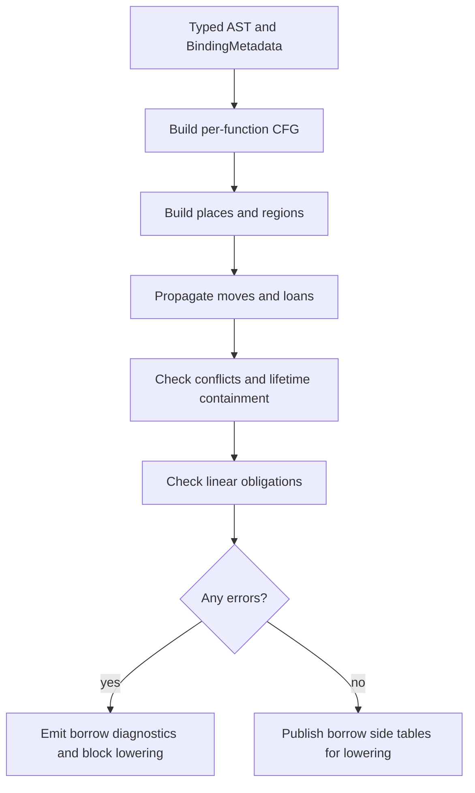

# RFC 0007: Borrow Lifetime And Ownership Checker

## Summary

This RFC defines the dedicated ZOM borrow, lifetime, and ownership checker that
runs after RFC 0005 type checking and before backend lowering. RFC 0005 proves
type correctness, basic mutability, and sanctioned coercions such as
`&mut T -> &T`. This RFC owns the remaining permission flow: moves, borrows,
reborrows, lifetime containment, use-after-move rejection, mutable alias
exclusion, scoped task reference safety, and linear consumption.

## Motivation

The type checker deliberately does not prove that references outlive their
referents or that owned values are consumed exactly once. That separation is
necessary: type inference, trait solving, and coercions operate on local type
facts, while borrow checking is a flow-sensitive dataflow problem over places,
loans, moves, drops, and control-flow joins.

Without a dedicated pass, the compiler cannot safely answer:

1. Is a value used after it has been moved?
2. Does a `&T` or `&mut T` reference outlive the storage it points to?
3. Does a mutable borrow overlap any other live borrow of the same place?
4. Does a reborrow end before the original mutable borrow becomes usable again?
5. Do references captured into `spawn_scope` tasks remain inside the scope?
6. Are `Linear` values consumed on every normal path and never consumed twice?

These are memory-safety and concurrency-safety questions. They need a separate
checker with explicit invariants, diagnostics, and conformance gates.

## Goals

- Define the post-type-check borrow checker pipeline phase.
- Define the internal place, loan, move, drop, and region model.
- Enforce use-after-move rejection.
- Enforce shared-vs-mutable borrow aliasing rules.
- Enforce reborrow lifetimes and restoration of the original mutable borrow.
- Enforce local reference lifetime containment for stack and field borrows.
- Enforce scoped-task capture lifetimes for `spawn_scope`-style APIs.
- Enforce normal-path linear consumption obligations.
- Define diagnostic families and test gates for borrow failures.
- Keep borrow checking separate from type inference and backend lowering.

## Non-Goals

- This RFC does not add user-written lifetime parameters or HRTB syntax.
- This RFC does not implement Rust's full Polonius model in the first landing.
- This RFC does not change reference type syntax in Chapter 03.
- This RFC does not change RFC 0005's type inference, trait solving, or
  coercion rules.
- This RFC does not define final concurrency scheduling semantics; it only
  defines lifetime constraints on references captured by scoped tasks.
- This RFC does not promise borrow checking for unsafe raw-pointer dereference.
  Unsafe code is still checked at safe boundaries, but raw-pointer interior
  aliasing remains outside the safe borrow model.

## Prior Art

Rust's MIR borrow checker uses non-lexical lifetimes over control-flow graphs,
with places, loans, moves, and drop elaboration. ZOM should copy the
post-type-check dataflow architecture and non-lexical lifetime behavior, while
not exposing Rust-style lifetime parameter syntax in v1.

Cyclone and region-based systems showed that region containment can make memory
safety explicit and checkable, but user-written region annotations are costly.
ZOM should copy the idea that references are bounded by regions and avoid the
annotation-heavy surface.

Swift's exclusivity enforcement prevents overlapping mutable access. ZOM should
copy the simple user rule of exclusive mutation, but enforce it statically for
safe code wherever possible instead of relying on dynamic exclusivity checks.

Vale's ownership model separates owning references from borrow references and
uses destructive reads for moves. ZOM should copy the place-state model for
ownership transfer, while keeping the ZOM syntax and `own`/`borrow` vocabulary
aligned with existing spec language.

C++ RAII demonstrates deterministic destruction but does not prevent dangling
references or use-after-move in the language core. ZOM should keep RAII cleanup
but add compile-time borrow checking on top.

## Guide-Level Explanation

Users write ordinary ZOM code with owned values, shared borrows, mutable borrows,
and moves:

```zom
fun update(mut value: Buffer) {
    let shared = &value;
    read(shared);

    let exclusive = &mut value;
    write(exclusive);
}
```

The checker allows any number of shared borrows while no mutable borrow is
active. A mutable borrow requires exclusive access to the place. Once the mutable
borrow ends, the original place becomes usable again.

Moving a value consumes the source place:

```zom
let a = make_buffer();
let b = a;        // moves a
use(a);           // error: use after move
```

Borrowing a temporary or stack local cannot escape the local's lifetime:

```zom
fun bad() -> &i32 {
    let x = 1;
    return &x;    // error: returned reference escapes local region
}
```

Scoped concurrency uses the same model. References captured by tasks spawned
inside a scope must not outlive the scope:

```zom
spawn_scope(fun(scope) {
    let local = Config::load();
    scope.spawn(fun() {
        use(&local);   // valid only while the spawned task joins before scope exit
    });
});
```

## Reference-Level Design

### Pipeline Position

The borrow checker runs after:

1. parse and AST publication;
2. binding and symbol resolution;
3. type checking, including `TypeEnv`, coercion records, trait bounds, and
   marker derivation facts.

It runs before:

1. error lowering and cleanup graph finalization;
2. IR generation;
3. backend target ABI lowering.

The pass receives typed AST plus binder metadata. It does not mutate the AST.
It writes borrow-check side tables keyed by `NodeId` and place IDs.

### Core Data Model

```text
Place {
  id: PlaceId,
  root: Local | Parameter | Field | Deref | Index | Temporary,
  projection: [Projection],
  type: TypeId,
}

Region {
  id: RegionId,
  kind: lexical | temporary | loop | closure | task_scope | return,
  parent: RegionId?,
  cfg_points: BitSet,
}

Loan {
  id: LoanId,
  place: PlaceId,
  kind: shared | mutable,
  region: RegionId,
  origin: NodeId,
}

Move {
  place: PlaceId,
  origin: NodeId,
}
```

Places are path-sensitive enough to distinguish `x.a` from `x.b` when the type
layout proves the fields are disjoint. Dereference and index projections are
conservative unless the type carries a trusted disjointness proof.

### Control-Flow Graph

The checker builds a per-function CFG from typed statements and expressions.
Edges include normal flow, early returns, loop control, match arms, `?!` early
return, and panic edges for `!!` only when `panic = "unwind"` is enabled.

Each CFG point has:

- initialized places;
- moved places;
- active shared loans;
- active mutable loans;
- pending linear obligations;
- region liveness.

Join points merge moved state by intersection for definite initialization and
union for possible moves. A value is usable only when definitely initialized and
not possibly moved on the incoming edge.

### Move Checking

A move from place `p` marks `p` as moved until it is reinitialized. Using `p` or
any projection of `p` after move is an error. Using a disjoint sibling field is
allowed only when the type supports field-sensitive partial moves.

Moves out of borrowed places are rejected unless the borrow is uniquely mutable
and the move is followed by reinitialization before the borrow's region can be
observed.

### Borrow Checking

A shared borrow of place `p` is valid when no active mutable loan overlaps `p`.
A mutable borrow of place `p` is valid when no active shared or mutable loan
overlaps `p`.

Overlap is place-based:

- identical roots overlap;
- field projections overlap only when one is a prefix of the other or fields
  may alias through layout;
- deref and index projections overlap conservatively.

### Reborrows

Reborrowing `&mut T` as `&T` creates a shared loan whose region is nested inside
the mutable loan's region. During the nested shared loan, the original mutable
borrow is suspended. When the shared loan ends, the mutable borrow becomes usable
again.

Reborrowing `&mut T` as `&mut T` creates a child mutable loan and similarly
suspends the parent mutable loan until the child ends.

### Lifetime Containment

Every reference value has an inferred region. A reference may flow into another
place only when its region outlives the destination's required region:

- returning a reference requires outliving the function return region;
- storing a reference in an object field requires outliving the object region;
- capturing a reference in a closure requires outliving the closure value;
- capturing a reference in a scoped task requires outliving the task scope, not
  necessarily `'static`.

Temporary regions end at the last use unless language rules extend them to the
enclosing statement or block.

### Linear Consumption

Types marked `Linear` create a normal-path obligation: every initialized value
of that type must be consumed exactly once before its region exits. Moving a
linear value transfers the obligation. Dropping, returning, or passing to a
known consuming function discharges it.

Panic unwind is a degraded path. Under `panic = "unwind"`, runtime cleanup may
run best-effort drop glue, but compile-time linear exactly-once guarantees apply
only to normal control-flow paths.

### Scoped Task Capture

Scoped task APIs declare a trusted scope region. A reference captured by a task
spawned in that scope is valid only if:

- the captured reference region outlives the task body;
- the task is guaranteed to join before the scope exits;
- the capture does not require mutable aliasing across concurrently running
  tasks unless the captured type is protected by an accepted synchronization
  primitive.

The first implementation may recognize only standard-library scoped task APIs
annotated with a compiler-known attribute. General HRTB syntax remains a
non-goal.

### Diagnostics

The concrete numeric code allocation is intentionally left for the implementation
RFC transition, but the diagnostic families are fixed:

| Family | Trigger |
|---|---|
| UseAfterMove | A moved place is read, borrowed, or moved again. |
| MoveOutOfBorrow | A value is moved out through an active borrow. |
| BorrowDoesNotLiveLongEnough | A reference escapes the region of its referent. |
| MutableBorrowConflicts | A mutable loan overlaps any active loan. |
| SharedBorrowConflicts | A shared loan overlaps an active mutable loan. |
| ReborrowOutlivesParent | A child reborrow lives beyond the parent loan. |
| LinearNotConsumed | A linear value reaches region exit without consumption. |
| LinearConsumedTwice | A linear obligation is discharged more than once. |
| ScopedTaskBorrowEscapes | A scoped task captures a reference that can outlive the scope. |

Diagnostics must point at the use site and include a secondary note for the
originating move or borrow when available.

### Mermaid Flow



## Repository Impact

| Area | Paths | Owner |
|---|---|---|
| RFC governance | `docs/rfc/0007-borrow-lifetime-ownership-checker.md`, `docs/rfc/README.md` | `rfc` |
| Borrow checker implementation | `products/zomlang/compiler/checker/**`, `products/zomlang/compiler/type/**` | `binder-checker` |
| Runtime and ownership vocabulary | `products/zomlang/runtime/**`, `libraries/zc/**` | `runtime-memory` |
| Scoped concurrency borrow rules | `docs/spec/chapters/15-concurrency.md`, `products/zomlang/runtime/**` | `concurrency` |
| Spec alignment | `docs/spec/**`, `docs/design/**` | `spec-audit` |
| Tests and verification | `products/zomlang/tests/**` | `verification` |

## Security And Safety Impact

This RFC is a memory-safety gate. Without it, safe ZOM cannot prove absence of
use-after-move, dangling references, mutable aliasing, and scoped task reference
escapes. The checker blocks backend lowering for unsafe safe-code programs.

The design also affects concurrency safety: scoped task references rely on the
borrow checker to prove that captured references cannot outlive their scope.
Runtime checks may exist in debug mode, but production safety must not depend on
runtime reference tracking for safe code.

## Drawbacks And Risks

- Borrow checking is complex and may reject valid programs until the dataflow
  model is sufficiently precise.
- Field-sensitive partial moves and disjoint borrows add implementation cost.
- Scoped task capture checking depends on trusted standard-library annotations
  until a more general higher-ranked lifetime model exists.
- Linear guarantees are normal-path only when panic unwinding is enabled; this
  must be taught clearly to users.
- Diagnostic quality is difficult because the primary error often depends on an
  earlier move or borrow origin.

## Alternatives Considered

- **Fold borrow checking into the type checker.** Rejected because type
  inference and borrow dataflow have different fixed points, state, and error
  recovery behavior. RFC 0005 intentionally excludes lifetime analysis.
- **Runtime borrow tracking.** Rejected for safe code because it adds overhead
  and can only detect bugs after execution reaches them.
- **Expose Rust-style lifetimes in v1.** Rejected because it increases syntax
  and teaching cost before ZOM needs general lifetime quantification.
- **ARC everywhere.** Rejected because reference counting prevents some lifetime
  bugs but does not enforce mutable exclusivity, scoped task joins, or linear
  consumption.
- **No linear checking until after borrow checking.** Rejected because the same
  place-state model is required for both move checking and linear consumption.

## Compatibility And Rollout

This is a new compiler phase and does not change accepted syntax. The rollout is:

1. implement CFG/place/region construction for a small safe subset;
2. enable use-after-move and local borrow conflict checks;
3. add lifetime containment for returned references and stored references;
4. add reborrow restoration;
5. add linear obligation tracking;
6. add scoped task capture checks;
7. enable the phase by default once diagnostics and conformance coverage are in
   place.

Rollback before `LANDED` is cheap: disable the borrow checker phase and keep the
RFC in `IMPLEMENTING` or `RETURNED`. After `LANDED`, weakening checks requires a
new RFC because users will rely on the safety guarantee.

## Documentation And Teaching Plan

- Update Chapter 03 with reference lifetime and reborrow rules after acceptance.
- Update Chapter 15 with scoped task capture lifetime rules after acceptance.
- Add a design document for borrow checker internals once implementation starts.
- Add examples for use-after-move, shared borrow, mutable borrow, reborrow,
  returned reference rejection, and scoped task captures.
- Add diagnostic documentation once numeric codes are allocated.

## Operational Readiness

Borrow checking must run deterministically and must not depend on thread
scheduling. It can be parallelized per function only after shared global inputs
are immutable. CI must include targeted borrow-checker tests and a translated
borrow-checker corpus before the RFC can move to `LANDED`.

## Acceptance Criteria

1. A post-type-check borrow checker phase exists and is wired into the driver.
2. The phase consumes typed AST, `BindingMetadata`, `TypeEnv`, and marker facts
   without mutating the AST.
3. Per-function CFG construction covers returns, loops, matches, `?!`, and
   closure bodies.
4. Place construction distinguishes locals, parameters, fields, dereferences,
   indexes, temporaries, and closure captures.
5. Use-after-move is rejected with source and move-origin diagnostics.
6. Overlapping mutable/shared borrow conflicts are rejected.
7. Reborrow lifetimes restore parent mutable borrows after child loans end.
8. Returning or storing references that outlive their referents is rejected.
9. Linear values are consumed exactly once on normal paths.
10. Scoped task reference captures are rejected when they may outlive the scope.
11. Unsafe raw-pointer interiors remain outside the safe borrow model, but safe
    boundaries are still checked.
12. Diagnostics conformance tests cover every diagnostic family.
13. A translated borrow-checker corpus has no known false negatives.
14. `python3 scripts/check-rfc.py` passes.
15. `python3 scripts/check-format.py` passes after implementation changes.
16. `ctest --preset default --output-on-failure` passes before `LANDED`.

## Implementation Plan

1. Add borrow-checker data structures for `Place`, `Region`, `Loan`, and `Move`.
2. Build per-function CFGs from typed AST.
3. Implement place overlap and field-disjointness rules.
4. Implement move-state dataflow and use-after-move diagnostics.
5. Implement shared/mutable loan dataflow and alias conflict diagnostics.
6. Implement reborrow nesting and parent-loan restoration.
7. Implement lifetime containment for returns, stores, closures, and temporaries.
8. Implement linear obligation tracking on normal control-flow paths.
9. Implement scoped task capture validation for trusted standard-library APIs.
10. Add CLI, lit, unit, and corpus tests.
11. Update Chapters 03 and 15 plus compiler design documentation.

## Test Plan

- Build: `cmake --preset sanitizer` and `cmake --build --preset sanitizer -j`.
- Unit tests: CFG construction, place overlap, move-state joins, loan conflicts,
  reborrow restoration, region containment, and linear obligations.
- Lit tests: `.zom` diagnostics for use-after-move, move-out-of-borrow,
  mutable aliasing, shared-vs-mutable conflict, escaping local reference,
  reborrow escape, linear missing consume, linear double consume, and scoped task
  borrow escape.
- Conformance: a translated subset of classic borrow-checker examples with
  expected diagnostics and accepted safe variants.
- Generated files: none expected unless AST or diagnostic registries change.
- Format: `python3 scripts/check-format.py`.
- RFC check: `python3 scripts/check-rfc.py`.

## Open Questions

- Which numeric diagnostic range should own borrow-checker errors: a dedicated
  `ZOM30xx` range as currently reserved in design docs, or a compiler-checker
  subrange near existing type diagnostics?
- Should field-sensitive partial moves ship in the first implementation or only
  after whole-place move checking is stable?
- Which standard-library APIs are trusted scoped-task roots for the first
  implementation?

## Status History

| Date | Status | Notes |
|---|---|---|
| 2026-07-08 | DRAFT | Initial draft separating borrow, lifetime, ownership, move, reborrow, linear, and scoped-task checking from RFC 0005 type checking. |
| 2026-07-08 | REVIEW | The proposal now has a complete post-type-check borrow-checker design, safety impact, acceptance criteria, implementation plan, and local discussion/tracking anchors. Approval remains blocked on owner review, diagnostic-range resolution, non-empty approvers, a recorded decision, and implementation evidence. |
