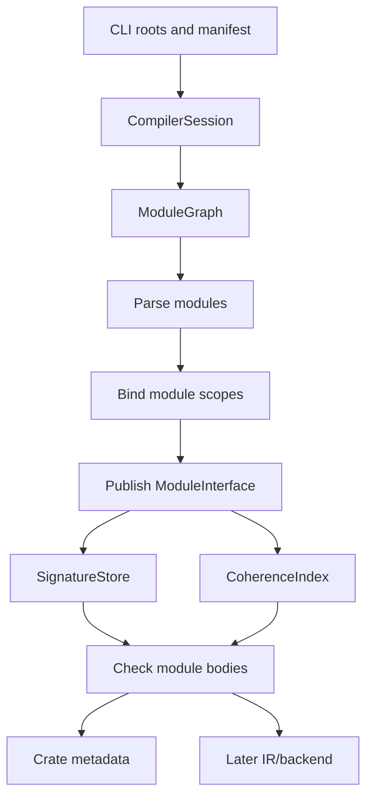

# RFC 0008: CompilerSession Cross-Module Architecture

## Summary

This RFC defines the `CompilerSession` architecture that connects module
resolution, import/export binding, visibility, cross-module type environments,
and global impl coherence across a crate or workspace. RFC 0004 defines binder
behavior for a bound AST, and RFC 0005 defines type checking over a bound tree.
This RFC defines the owner above those phases: a session that discovers the
module graph, schedules per-module frontend work, publishes immutable module
interfaces, checks cross-module visibility, and builds the global coherence
index needed by the checker.

## Motivation

The current `CompilerDriver` owns a `SourceManager`, a `DiagnosticEngine`, one
`SymbolTable`, and maps from buffer IDs to ASTs, binder metadata, and type
environments. That shape works for single-compilation-unit tests, but it is not
enough for the module, package, and coherence model already specified in
Chapters 13, 21, 22, 23, and 24.

The compiler needs one root object that can answer these questions:

1. Which source buffers belong to the current crate?
2. Which module exports a symbol, and is it visible from the requesting module?
3. Which declaration signature may a downstream module read?
4. Which type identities and impl heads must be visible for coherence?
5. Which diagnostics should be reported when independent modules are processed
   in parallel?

Without a `CompilerSession`, each subsystem would need private cross-module
caches. That duplicates state, hides ordering dependencies, and makes separate
compilation unsound.

## Goals

- Define `CompilerSession` as the root owner of one crate or workspace
  compilation.
- Define module graph discovery from roots, imports, re-exports, inline
  modules, manifests, and search paths.
- Define immutable module interface publication after binding and signature
  checking.
- Define cross-module symbol lookup through export scopes and visibility rules.
- Define cross-module `TypeEnv` use: imported modules expose signatures and
  type identities, not mutable body inference state.
- Define a global impl/coherence index for interface, marker, and negative impls.
- Define deterministic scheduling and diagnostic ordering for parallel frontend
  work.
- Define where crate metadata is read and written.

## Non-Goals

- This RFC does not implement `CompilerSession`.
- This RFC does not change import/export syntax or module path syntax.
- This RFC does not define package dependency solving; Chapter 21 owns that.
- This RFC does not define backend object linking or LTO.
- This RFC does not define the final incremental rebuild fingerprint format.
- This RFC does not move RFC 0004 or RFC 0005 to `ACCEPTED`; governance remains
  separate from this architecture draft.

## Prior Art

Rust compiles crates around a session and query system that owns source maps,
diagnostics, crate metadata, and cross-crate type lookup. ZOM should copy the
explicit crate boundary and metadata publication model while keeping v1 module
resolution simpler and more static.

Swift serializes module interfaces and validates access control during semantic
analysis. ZOM should copy the rule that downstream modules consume public
signatures rather than private bodies.

Go compiles packages from explicit import graphs and exposes only exported
declarations across package boundaries. ZOM should copy deterministic import
surfaces and avoid type-checking through private implementation state.

Zig resolves packages and modules at compile time from explicit roots and build
configuration. ZOM should copy the no-runtime-import property.

ML-family compilers separate signatures from structures. ZOM should copy the
signature-first discipline: imported modules provide names and types before
body-level implementation details are needed.

## Guide-Level Explanation

Users experience `CompilerSession` through ordinary module code:

```zom
// src/lib.zom
module graphics;
export shapes.{Point, Rect};
export fun area(rect: Rect) -> f64 { rect.width * rect.height }

// src/shapes.zom
module graphics.shapes;
export struct Point { x: f64, y: f64 }
export struct Rect { width: f64, height: f64 }
```

The session discovers both modules, binds each one in an isolated module scope,
publishes `graphics.shapes`' exported names, resolves `graphics`'s re-export,
and type-checks `area` against the imported signature of `Rect`. Private names
inside `graphics.shapes` never become visible to `graphics` unless exported.

For impls, the session owns the global view:

```zom
impl Draw for Rect { ... }
```

The impl is accepted only if the orphan rule permits it and no loaded module or
dependency metadata already provides an overlapping impl.

## Reference-Level Design

### Session Ownership

`CompilerSession` is the root owner for a compilation:

```text
CompilerSession {
  options: CompilerOptions,
  source_manager: SourceManager,
  diagnostics: DiagnosticEngine,
  module_graph: ModuleGraph,
  crate_graph: CrateGraph,
  symbol_arena: GlobalSymbolArena,
  type_interner: GlobalTypeInterner,
  coherence_index: CoherenceIndex,
  metadata_store: CrateMetadataStore,
}
```

The existing `CompilerDriver` becomes either a thin CLI-facing wrapper around
`CompilerSession` or is replaced by it. No phase owns hidden cross-module state
outside the session.

### Module Graph

```text
ModuleNode {
  id: ModuleId,
  crate_id: CrateId,
  path: ModulePath,
  source: BufferId | InlineModuleId,
  imports: [ImportEdge],
  exports: ExportScope,
  state: ModuleState,
}

ModuleState =
  Discovered
  Parsed
  Bound
  InterfaceChecked
  BodyChecked
  Failed
```

Edges come from explicit imports, re-exports, inline modules, manifest roots,
and standard prelude imports. Cycles in module loading are diagnosed before
dependent bodies are checked. Strongly connected components may be accepted
only when all cyclic dependencies are signature-only and do not require
body-level inference across modules.

### Phase Scheduling

The session runs phases in dependency-safe waves:

1. discover root modules from manifests and CLI inputs;
2. parse discovered modules;
3. bind declarations and imports enough to publish module export scopes;
4. compute declaration signatures for exported and locally referenced items;
5. build the global coherence index from all impl heads;
6. type-check bodies when every imported signature dependency is available;
7. publish crate metadata and module artifacts.

Parallel workers may process independent modules, but observable diagnostics are
sorted by `(crate_id, module_path, source_position, sequence_number)`.

### Module Interface Publication

After binding and signature computation, a module publishes:

```text
ModuleInterface {
  module_id: ModuleId,
  crate_id: CrateId,
  exported_symbols: [SymbolId],
  public_type_signatures: [TypeSignature],
  impl_heads: [ImplHead],
  marker_facts: [MarkerFact],
  visibility_facts: [VisibilityFact],
}
```

Private body-local symbols, local inference variables, and expression-level
`TypeEnv` entries are not exported. Downstream modules consume stable symbol and
type identities, not mutable implementation internals.

### Cross-Module Lookup

Name lookup proceeds in this order:

1. local lexical scopes;
2. explicit imports after duplicate checks;
3. module namespace imports;
4. prelude symbols;
5. dependency crate exported scopes.

An imported symbol is visible only if the exporting module's `ExportScope` and
visibility ladder allow access from the requesting module. Re-exported symbols
preserve their original defining crate and symbol identity; re-export creates an
additional exported name, not a copied declaration.

### Cross-Module Type Environment

Each module keeps a local `TypeEnv` for AST nodes in that module. The session
also owns a signature store:

```text
SignatureStore {
  function_types: Map<SymbolId, FunctionType>,
  type_aliases: Map<SymbolId, TypeId>,
  nominal_types: Map<SymbolId, NominalTypeInfo>,
  associated_types: Map<ImplId, AssociatedTypeBindings>,
}
```

The checker resolves imported identifiers through the signature store. It never
reads another module's expression-node `TypeEnv` directly. This prevents local
inference variables from leaking across modules.

### Global Coherence Index

The session builds a crate-wide and dependency-aware index:

```text
CoherenceIndex {
  interface_impls: Map<(InterfaceHead, TypeHead), ImplId>,
  marker_positive: Map<(MarkerId, TypeHead), ImplId>,
  marker_negative: Map<(MarkerId, TypeHead), ImplId>,
  blanket_impls: [ImplId],
  dependency_impls: [ExternalImplId],
}
```

The index is built from impl heads after alias normalization and before body
checking. Duplicate or overlapping impls produce deterministic diagnostics. The
index records enough source and metadata provenance to explain both sides of an
overlap.

### Crate Metadata

For downstream crates, the session writes metadata containing:

- exported module paths;
- exported symbol signatures;
- nominal type IDs and layout-relevant type identity;
- impl heads and associated type bindings;
- marker facts and negative marker impls;
- visibility and sealed/final/open facts;
- edition and cfg surface needed for import compatibility.

Metadata excludes private function bodies and local expression `TypeEnv`
entries.

### Failure Model

If parsing fails for a module, dependent modules that import it receive a single
import-resolution diagnostic and do not cascade. If binding fails in a module,
its interface is not published. If signature checking fails, body checking for
dependent modules is skipped. If one module body fails type checking, unrelated
modules may continue, but final session status is failed.

### Mermaid Architecture



## Repository Impact

| Area | Paths | Owner |
|---|---|---|
| RFC governance | `docs/rfc/0008-compiler-session-cross-module.md`, `docs/rfc/README.md` | `rfc` |
| Driver/session implementation | `products/zomlang/compiler/driver/**` | `module-system` |
| Binder and symbol integration | `products/zomlang/compiler/binder/**`, `products/zomlang/compiler/symbol/**` | `module-system` |
| Checker and TypeEnv integration | `products/zomlang/compiler/checker/**`, `products/zomlang/compiler/type/**` | `binder-checker` |
| Diagnostics | `products/zomlang/compiler/diagnostics/**` | `error-system` |
| Spec alignment | `docs/spec/**`, `docs/design/**` | `spec-audit` |
| Tests and verification | `products/zomlang/tests/**` | `verification` |

## Security And Safety Impact

This RFC affects encapsulation and coherence safety. Visibility checks prevent
private symbols from becoming part of downstream APIs. Global coherence prevents
two modules or crates from providing overlapping impls that would make dynamic
dispatch or operator resolution ambiguous. Deterministic module resolution also
prevents host-filesystem search order from silently changing program meaning.

The session must canonicalize file paths and reject traversal outside allowed
module roots. Build-tool callbacks for generated modules must return already
loaded buffers or paths inside explicitly trusted build output directories.

## Drawbacks And Risks

- `CompilerSession` centralizes ownership and can become too large if phase APIs
  are not kept narrow.
- Signature publication requires careful invalidation when incremental
  compilation arrives.
- Parallel scheduling makes deterministic diagnostic ordering mandatory.
- Coherence across dependency metadata requires exact type identity and alias
  normalization before implementation bodies are checked.
- Replacing or wrapping the existing `CompilerDriver` touches many tests.

## Alternatives Considered

- **Keep per-file driver state.** Rejected because imports, re-exports,
  visibility, and global impl coherence are crate-level properties.
- **Let binder load modules recursively on demand.** Rejected because it hides
  scheduling and cache ownership inside the binder, making diagnostics and
  parallelism harder to reason about.
- **Let the checker read every module's local `TypeEnv`.** Rejected because
  local inference variables and expression-node types are not stable public
  interface data.
- **Backend-only cross-module linking.** Rejected because visibility and impl
  coherence must be enforced before code generation.
- **Global mutable symbol table without module interfaces.** Rejected because it
  leaks private implementation details and weakens incremental rebuilds.

## Compatibility And Rollout

This RFC introduces architecture, not syntax. Rollout steps:

1. introduce `CompilerSession` beside `CompilerDriver`;
2. move `SourceManager`, `DiagnosticEngine`, and module graph ownership into the
   session;
3. add module graph discovery and deterministic module resolution;
4. publish `ModuleInterface` after binding and signature computation;
5. route cross-module lookup through exported scopes and the signature store;
6. build the global coherence index before body checking;
7. update tests and CLI paths to use the session.

Rollback before `LANDED` is straightforward: keep `CompilerDriver` as the CLI
entry point and disable session scheduling. After `LANDED`, rolling back would
weaken module and coherence guarantees and requires another RFC.

## Documentation And Teaching Plan

- Update Chapter 13 with any accepted module-interface terminology.
- Update Chapter 24 with implementation-facing `ModuleGraph` terminology if
  accepted.
- Update RFC 0004 and RFC 0005 cross-references after this RFC reaches REVIEW.
- Add a design document for `CompilerSession` internals when implementation
  starts.
- Add developer documentation for deterministic diagnostic ordering and module
  graph debugging.

## Operational Readiness

The session must support reproducible builds. Given the same inputs and module
search paths, module graph order, diagnostics, metadata, and output artifacts
must be identical. CI should include multi-module and multi-crate fixtures and a
parallel determinism test that runs the same crate repeatedly with different
worker counts.

## Acceptance Criteria

1. `CompilerSession` owns source, diagnostics, module graph, signature store,
   coherence index, and crate metadata state.
2. The driver can compile a crate root and discover transitive imports.
3. Module resolution is deterministic and memoized per symbolic module path.
4. Each parsed module has isolated AST, binding metadata, and local `TypeEnv`.
5. Each bound module publishes an immutable `ModuleInterface`.
6. Cross-module lookup reads only exported symbols and visible signatures.
7. Re-exports preserve original symbol identity.
8. Imported private symbols are rejected with source-positioned diagnostics.
9. Global impl coherence sees all local modules and dependency metadata.
10. Type checking one module can use imported signatures without reading foreign
    expression-node `TypeEnv` entries.
11. Diagnostic ordering is deterministic under parallel scheduling.
12. Crate metadata contains exported signatures, impl heads, associated type
    bindings, marker facts, and visibility facts.
13. Multi-module conformance tests cover import, export, re-export, visibility,
    cross-module associated projections, and cross-module impl conflicts.
14. `python3 scripts/check-rfc.py` passes.
15. `python3 scripts/check-format.py` passes after implementation changes.
16. `ctest --preset default --output-on-failure` passes before `LANDED`.

## Implementation Plan

1. Add `CompilerSession` and keep `CompilerDriver` as a temporary CLI wrapper.
2. Add `ModuleId`, `CrateId`, `ModuleGraph`, `ImportEdge`, and `ExportScope`.
3. Move source and diagnostic ownership into the session.
4. Implement module discovery from roots, imports, inline modules, and manifest
   search paths.
5. Publish module interfaces after binding and declaration signature checking.
6. Add `SignatureStore` and route cross-module lookup through it.
7. Add `CoherenceIndex` construction from impl heads and dependency metadata.
8. Add deterministic diagnostic sorting.
9. Add crate metadata serialization and loading stubs.
10. Migrate CLI and tests from per-file driver behavior to session behavior.

## Test Plan

- Build: `cmake --preset sanitizer` and `cmake --build --preset sanitizer -j`.
- Unit tests: module graph discovery, import edge construction, export scope
  publication, signature store lookup, coherence index overlap detection, and
  deterministic diagnostic sorting.
- Lit tests: multi-module `.zom` fixtures for import, export, re-export,
  private access rejection, unresolved import, ambiguous module path, and
  cross-module impl conflict diagnostics.
- Conformance: module/package grammar fixtures remain aligned with Chapter 13,
  Chapter 21, Chapter 22, Chapter 23, and Chapter 24.
- Generated files: crate metadata snapshot fixtures after serialization exists.
- Format: `python3 scripts/check-format.py`.
- RFC check: `python3 scripts/check-rfc.py`.

## Open Questions

- Should `CompilerSession` replace `CompilerDriver` in one change, or should
  `CompilerDriver` remain as a stable CLI facade during migration?
- Which metadata format should crate interfaces use before backend artifacts
  exist?
- Should strongly connected module components be rejected entirely in v1, or
  accepted when the cycle is signature-only?

## Status History

| Date | Status | Notes |
|---|---|---|
| 2026-07-08 | DRAFT | Initial draft defining `CompilerSession`, module graph scheduling, module interface publication, cross-module type signatures, and global coherence indexing. |
