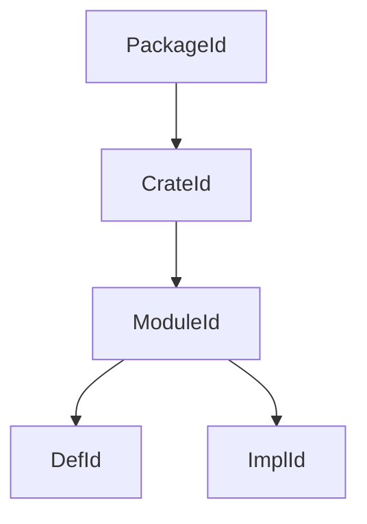
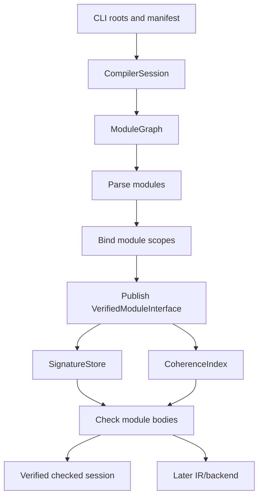

# RFC 0008: CompilerSession Cross-Module Architecture

## Summary

This RFC defines the `CompilerSession` architecture that connects module
resolution, import/export binding, module export visibility, cross-module type environments,
and global impl coherence across a crate or workspace. RFC 0004 defines binder
behavior for a bound AST, and RFC 0005 defines type checking over a bound tree.
This RFC defines the owner above those phases: a session that discovers the
module graph, schedules per-module frontend work, publishes immutable module
interfaces, checks cross-module export visibility, retains member-visibility
metadata, and builds the global coherence index needed by the checker.

## Motivation

The current `CompilerDriver` owns a `SourceManager`, a `DiagnosticEngine`, one
`SymbolTable`, and maps from buffer IDs to ASTs, binder metadata, and type
environments. That shape works for single-compilation-unit tests, but it is not
enough for the module, package, and coherence model proposed by RFC 0011 and
RFC 0012 and for the source-language rules in Chapters 13, 22, and 23.

The compiler needs one root object that can answer these questions:

1. Which source buffers belong to the current crate?
2. Which module exports a symbol, and is it visible from the requesting module?
3. Which declaration signature may a downstream module read?
4. Which type identities and impl heads must be visible for coherence?
5. Which diagnostics should be reported when independent modules are processed
   in parallel?

Without a `CompilerSession`, each subsystem would need private cross-module
caches. That duplicates state, hides ordering dependencies, and makes separate
compilation unsound.

## Goals

- Define `CompilerSession` as the root owner of one crate or workspace
  compilation.
- Define module graph discovery from roots, imports, re-exports, inline
  modules, manifests, and search paths.
- Define immutable module interface publication after binding and signature
  checking.
- Define cross-module symbol lookup through explicit export scopes.
- Retain member-visibility facts without inventing access-control or subclass
  contexts not defined by Chapter 23.
- Define cross-module `TypeEnv` use: imported modules expose signatures and
  type identities, not mutable body inference state.
- Define a global impl/coherence index for interface, marker, and negative impls.
- Define deterministic scheduling and diagnostic ordering for parallel frontend
  work.
- Define collision-free package, crate, module, definition, impl, and semantic
  context identities shared by all frontend and IR stages.

## Non-Goals

- This RFC does not implement `CompilerSession`.
- This RFC does not change import/export syntax or module path syntax.
- This RFC does not define package dependency solving; RFC 0012 owns that.
- This RFC does not define backend object linking or LTO.
- This RFC does not define persisted crate metadata encoding. The first
  implementation compiles source dependencies inside one session and publishes
  immutable in-memory interfaces. A later artifact RFC must select and verify
  on-disk encoding before precompiled dependency loading exists.
- This RFC does not define the final incremental rebuild fingerprint format.
- This RFC does not move RFC 0004 or RFC 0005 to `ACCEPTED`; governance remains
  separate from this architecture draft.

## Prior Art

Rust compiles crates around a session and query system that owns source maps,
diagnostics, crate metadata, and cross-crate type lookup. ZOM should copy the
explicit package, crate, and definition identity boundaries while keeping the
first ZOM implementation source-based and in-memory.

Swift serializes module interfaces and validates access control during semantic
analysis. ZOM should copy the rule that downstream modules consume public
signatures rather than private bodies.

Go compiles packages from explicit import graphs and exposes only exported
declarations across package boundaries. ZOM should copy deterministic import
surfaces and avoid type-checking through private implementation state.

Zig resolves packages and modules at compile time from explicit roots and build
configuration. ZOM should copy the no-runtime-import property.

ML-family compilers separate signatures from structures. ZOM should copy the
signature-first discipline: imported modules provide names and types before
body-level implementation details are needed.

## Guide-Level Explanation

Users experience `CompilerSession` through ordinary module code:

```zom
// src/lib.zom
module graphics;
export shapes::{Point, Rect};
export fun area(rect: Rect) -> f64 { rect.width * rect.height }

// src/shapes.zom
module shapes;
export struct Point { x: f64, y: f64 }
export struct Rect { width: f64, height: f64 }
```

The session discovers both modules, binds each one in an isolated module scope,
publishes `graphics.shapes`' exported names, resolves `graphics`'s re-export,
and type-checks `area` against the imported signature of `Rect`. Private names
inside `graphics.shapes` never become visible to `graphics` unless exported.

For impls, the session owns the global view:

```zom
impl Draw for Rect { ... }
```

The impl is accepted only if the orphan rule permits it and no source dependency
interface loaded in the session provides an overlapping impl.

## Reference-Level Design

### Session Ownership

`CompilerSession` is the root owner for a compilation:

```text
CompilerSession {
  semantic_context_brand: SemanticContextBrand,
  semantic_context_fingerprint: SemanticContextFingerprint,
  options: CompilerOptions,
  source_manager: SourceManager,
  diagnostics: DiagnosticEngine,
  package_graph: PackageGraph,
  crate_graph: CrateGraph,
  module_graph: ModuleGraph,
  symbol_arena: GlobalSymbolArena,
  semantic_type_store: SemanticTypeStore,
  signature_store: SignatureStore,
  coherence_index: CoherenceIndex,
  checked_facts_repository: CheckedFactsRepository,
}
```

`CompilerSession` directly replaces `CompilerDriver` in one change. No wrapper,
facade, alias, or second scheduling entry point remains. No phase owns hidden
cross-module state outside the session. RFC 0005 owns the semantic type payload
model; the session owns the store lifetime and context that issue its handles.

### Canonical Identity Integration

RFC 0011 owns the context brand, canonical keys, and identity hierarchy:



These are opaque RFC 0011 branded handles, not physical `{parent, index}`
structs. `CrateKey` includes package, target kind, target name, and the complete
`CompilationConfigKey`; host/target domain, target specification, edition,
semantic options, and build-script outputs therefore participate in identity.

The process root injects the RFC 0011 `SemanticContextFactory`; the session
requests one factory-issued `SemanticContextBrand`, owns the RFC 0011 identity
registries, and validates every handle at API boundaries. The session never
constructs or accepts a caller-provided brand. RFC 0004 owns
verified binding facts that target `DefId`; RFC 0005 owns branded
`SemanticTypeId`; RFC 0010 consumes the same identities without re-interning
them. The deterministic `SemanticContextFingerprint` records semantic inputs
but is never treated as an in-process issuer brand.

### Module Graph

```text
ModuleNode {
  id: ModuleId,
  crate_id: CrateId,
  path: ModulePath,
  source_file: SourceFileId,
  declaration_span: Maybe<SourceSpan>,
  imports: [ImportEdge],
  exports: ExportScope,
  state: ModuleState,
}

ModuleState =
  Discovered
  Parsed
  Bound
  InterfaceChecked
  BodyChecked
  Failed
```

The graph distinguishes containment edges from semantic dependency edges.
Crate-to-root and source-ownership relationships add containment edges. A
leading inline-root declaration supplies the current source module's items and
creates no child node or containment edge. Explicit imports, re-exports, and
prelude dependencies add directed semantic dependency edges. Package
dependencies are the exact RFC 0012 `PackageDependencyEdgeKey` set.
`CrateGraph` contains the exact RFC 0011 `CrateDependencyEdgeKey` set produced
by target selection. Both sorted edge sets enter the RFC 0011 semantic context
fingerprint. Only semantic module dependency edges participate in import SCC
analysis.

The private-constructor `ModuleGraphVerifier` consumes the complete RFC 0004
`ModuleGraphCandidate` and publishes one `VerifiedModuleGraph` plus immutable
views only after all path results, the canonical graph revision, and SCCs
verify. Semantic edge kinds are exactly
`Import`, `ForeignReexport`, `ModuleAlias`, and `Prelude`. Every SCC with more
than one module and every self-edge is rejected before any per-module binding
input exists. Any SCC containing a prelude edge produces only RFC 0004
`GraphInvariantRejected(InvalidPrelude)` and `ZOM9956`. Among prelude-free SCCs,
a foreign re-export produces `ZOM3014` at the least canonically encoded
foreign-re-export edge; otherwise the SCC produces `ZOM3011` at the least
encoded edge. This covers mixed import/re-export and import/module-alias cycles
without a second source classification. An implicit prelude edge uses RFC 0004
`Prelude` provenance with no invented AST node or source span. The first
implementation has no signature-only cycle exception.

Discovery runs before `ModuleId` issuance and memoizes structural keys:

```text
StructuralModuleResolutionKey {
  crate: CrateKey,
  requesterPath: ModulePath,
  requesterSource: SourceOriginKey,
  normalizedPath: ModulePath,
  environment: RFC0004::ModuleResolutionEnvironmentFingerprint,
}
```

The fingerprint is exclusively the RFC 0004 SHA-256 revision of the canonical
`ModuleResolutionEnvironmentRecord`. Its exact domain, field order, union tags,
43-byte framing oracle, search roots, source snapshot/content revisions,
generated-source revisions, dependency-alias roots, requester ancestry, and
path policy are not redefined by the session. These inputs are immutable for
one discovery fixed point. After RFC 0011 freezes identities, the session maps
structural records to `ModuleId` and may use an equivalent handle-keyed lookup
cache. A path-segment tuple without crate, requester, and environment context
is never a valid cache key.

The session's `StructuralModuleResolver` freezes those complete inputs into the
RFC 0004 private-constructor `VerifiedModuleResolutionEnvironment`. Every
zero/one/many candidate lookup publishes an exact
`VerifiedStructuralResolutionReceipt` whose request key, candidate set, issuer,
environment revision, and 68-byte framing contract are verified again by
`ModuleGraphVerifier`. The graph candidate cannot redirect a request to another
existing module or invent an ambiguity by supplying its own candidate set.

One discovery run receives a canonical crate key, the immutable RFC 0012
package graph, one selected target root, an ordered search-root set, an ordered
generated-source map, and a source-snapshot fingerprint. Generated sources are
inputs; discovery never invokes a callback that mutates compiler state.

The selected target root seeds a non-empty canonical module path from the RFC
0012 target name. Every subsequently requested source candidate receives its
canonical module path from the resolved request and requester ancestry. A
source declaration validates or binds within that selected path; it never
derives a different path from its own spelling.

The three preserved `ParsedModuleDeclaration` forms map exactly as follows:

| Form | Discovery and identity effect |
|---|---|
| `module name;` | `name` must equal the final segment of the selected source module path. The source items belong to that module. `SelectedModuleIdentityInput.declarationAnchor` is the declaration's complete unbranded source range. A mismatch is a module-discovery failure and no `ModuleId` is issued for that selected record. |
| `module name { items }` | `name` has the same exact-match rule. `items` are the current source module's complete module-item sequence; the form creates no child module or containment edge. The declaration's complete range is the selected input anchor. |
| `module name = target;` and `export module name = target;` | The current source module path remains the candidate-derived path and its selected input has no declaration anchor from this alias. The alias receives one RFC 0011 `DefId(ModuleAlias)` under the current module, resolves `target` as a semantic dependency, and creates no `ModuleId`, source module, or containment edge. The export form adds that alias `DefId` to the module export surface. |

An alias target is resolved using the same ancestry, crate-root, and dependency-
alias candidate set as an import. Alias resolution records the canonical target
module independently from the alias `DefId`. Alias cycles are diagnosed as one
canonical `ZOM3011` closing-edge failure through the complete graph rule above
before binding or interface publication; an alias never serves as a
source-module identity anchor.

RFC 0012 permits exactly one library target per package. A package dependency
always names that library target; build-script and executable targets are never
dependency providers. Target selection expands each RFC 0011
`PackageDependencyEdgeKey` with this closed matrix:

| Package-edge domain | Selected consumer crate kinds | Provider library compilation |
|---|---|---|
| `Target` | `Library`, `Binary`, `Test`, `Benchmark`, `Example` | `Target` domain with the consumer target specification |
| `Development` | `Test`, `Benchmark`, `Example` | `Target` domain with the consumer target specification |
| `Build` | `BuildScript` | `Host` domain with the workspace host target specification |

For every applicable selected consumer crate, expansion emits exactly one
`CrateDependencyEdgeKey { packageEdge, consumer, provider }`. The provider key
uses the provider package's library target name, edition and semantic options,
and verified build-script output. A package edge with no applicable selected
consumer emits no crate edge. A required provider package without a library
target is `DependencyLibraryTargetMissing`; duplicate library targets are a
manifest failure in RFC 0012. Target or development edges never attach to a
build-script consumer, and build edges never enter the final target context.

Each preparatory build-script context has one `BuildScript` root and one closed
host dependency graph. Expansion starts with the root package's `Build` edges.
Each selected provider is its package library compiled for the workspace host;
that provider library then expands its own `Target` edges, also to host-compiled
provider libraries, recursively to a fixed point. `Development` edges are never
included. A reachable provider package's own build script runs earlier in its
separate preparatory context, and only its frozen RFC 0011
`BuildScriptOutputKey` enters that provider library's host `CrateKey`.

The final context expands target and development edges only. No semantic handle
or `CrateDependencyEdgeKey` crosses between preparatory contexts or into the
final context; each context fingerprints its own complete sorted crate and
crate-edge sets. Expansion sorts package edges and selected consumers by
canonical bytes, so target declaration order and worker completion cannot
affect the result. Missing provider libraries and cycles are diagnosed before
any affected context publishes semantic handles.

For a requested local path `a::b::c` and search root `R`, discovery tests exactly
`R/a/b/c.zom` and `R/a/b/c/mod.zom`. One existing candidate is selected, two are
an ambiguity failure, and zero advances to the next root. Paths are
symlink-resolved, NFC-normalized, case-preserving, and compared
case-sensitively even on a case-insensitive host. A candidate outside an
allowed source root is rejected unless RFC 0012 selected it as an explicit
target root.

An import first segment may resolve through the requester's module ancestry,
the current crate root, or one exact RFC 0012 dependency alias. Zero candidates
is not found; multiple distinct candidates are ambiguous. Discovery never
silently prefers local source over a dependency and never reads object files or
persisted compiler metadata.

Discovery reaches a structural fixed point before issuing semantic handles:

1. seed a canonical worklist with every selected target root;
2. parse one unbranded source and preserve its leading module declaration;
3. emit RFC 0011 selected or rejected structural module records;
4. resolve unseen module-item import and re-export requests with the complete
   structural key;
5. add newly selected sources in canonical key order;
6. repeat until no source or module record is added;
7. freeze RFC 0011 source and module registries; and
8. construct semantic dependency edges over the resulting handles.

Filesystem enumeration, source registration, hash-map iteration, and worker
completion order cannot affect candidate choice, record order, or diagnostics.

### Phase Scheduling

The session runs phases in dependency-safe waves:

1. compile and execute preparatory build-script contexts, then create the final
   semantic context from their canonical outputs;
2. parse unbranded source records and discover modules to a fixed point;
3. freeze RFC 0011 source, module, definition, and impl identities;
4. bind declarations and imports, compute and verify RFC 0005
   `VerifiedSignatureFacts`, then freeze each `VerifiedModuleInterface` plus
   `ModuleInterfaceRevision`;
5. submit every frozen interface to the RFC 0005 coherence builder and require
   `CoherenceBuildResult::Frozen` before publishing the global coherence index;
6. type-check bodies when every imported interface revision is available;
7. freeze the verified checked-session result without mutating published
   interfaces; adopt every `VerifiedCheckedFacts` into
   `CheckedFactsRepository` before RFC 0010 checked-module construction.

Parallel workers may process independent modules, but observable diagnostics
are sorted by RFC 0011 package key, crate key, module key, primary source span,
diagnostic ID, and deterministic emitter ordinal. Wall-clock order and global
mutable sequence counters are forbidden.

### Module Interface Publication

After binding and RFC 0005 signature-fact verification, a module publishes:

```text
VerifiedModuleInterface {
  semantic_context_brand: SemanticContextBrand,
  revision: ModuleInterfaceRevision,
  package_id: PackageId,
  crate_id: CrateId,
  module_id: ModuleId,
  source_content_digest: Sha256Digest,
  binding_surface: VerifiedExportSurface,
  signature_facts_revision: SignatureFactsRevision,
  imported_signature_view_revision: ImportedSignatureViewRevision,
  signatures: AuthorizedSignatureBundle,
  visible_bindings: [VisibleBinding],
  exported_bindings: [ExportedBinding],
  coherence_impl_heads: SortedMap<ImplId, RFC0005::ImplHead>,
  marker_facts: SortedMap<MarkerFactKey, RFC0005::MarkerFact>,
}

AuthorizedSignatureBundle {
  roots: SortedUniqueSequence<SignatureRootAuthorization>,
  definitions: SortedMap<DefId, SemanticSignature>,
  supportDefinitions: SortedMap<DefId, SemanticSignature>,
}

TypeEnrichedBindingTarget =
  Definition { definition: DefId, signature: SemanticSignature }
  Module { module: ModuleId, surface_revision: ExportSurfaceRevision }

// Canonical tags: Definition = 0x01, Module = 0x02.

ExportedBinding {
  binding_identity: BindingTarget,
  name: BindingNameKey,
  target: TypeEnrichedBindingTarget,
  visibility: VisibilityEnvelope,
  binding_span: SourceSpan,
  canonical_declaration_span: SourceSpan,
  alias_span: Maybe<SourceSpan>,
  export_span: SourceSpan,
}

VisibleBinding {
  binding_identity: BindingTarget,
  name: BindingNameKey,
  target: TypeEnrichedBindingTarget,
  visibility: VisibilityEnvelope,
  binding_span: SourceSpan,
  canonical_declaration_span: SourceSpan,
  alias_span: Maybe<SourceSpan>,
}

```

`TypeEnrichedBindingTarget` uses the tags shown above. `ImplHead`,
`MarkerFact`, their tags, their canonical codecs, structural marker evidence,
impl safety, complete patterns, and associated bindings are exactly the RFC
0005 definitions; RFC 0008 declares no second form. `EncodeSortedRecords(records)` means one RFC 0011
sequence whose elements are each complete record encodings sorted by unsigned
bytewise comparison; duplicate encodings are invalid.

`binding_surface` is exactly the verifier-only RFC 0004 value, including its
`ExportSurfaceRevision`, requester-independent visibility envelopes, canonical
targets, and re-export provenance. The module interface verifier consumes that
surface, RFC 0005 `VerifiedSignatureFacts`, and the exact requester
`ImportedSignatureView` used for foreign imports and re-exports. Every `VisibleBinding` and
`ExportedBinding` must be the unique type-enriched projection of one matching
surface entry: binding identity, visible/exported name, target, visibility,
binding span, canonical declaration span, alias/export span, and exported subset
must agree exactly. A
definition target carries the one matching frozen signature. A module target
carries the exact target module and source-surface revision and cannot carry a
definition signature. `VisibleBinding.visibility` equals the source entry's
RFC 0004 `VisibilityEnvelope`; every `ExportedBinding.visibility` is exactly
`External`. Member visibility remains inside the RFC 0005 semantic signature
that owns the member and is not duplicated in a session-level visibility fact.
A missing, additional, disagreeing, or wrong-variant projection rejects
interface publication.

The interface verifier is the only producer of RFC 0005
`CoherenceModuleInput`. It projects the exact module, interface revision,
impl-head map, and marker sequence from one verified interface; no caller may
combine records from different interfaces.

`AuthorizedSignatureBundle.roots` is exactly one RFC 0005
`SignatureRootAuthorization` per definition binding in the verified binding
surface. The local binding alias and canonical target remain distinct. A local
target must resolve in the matching local signature-facts revision; a foreign
target must resolve in the matching imported-signature-view revision and must
already be authorized to the requester. A foreign re-export cannot read another
AST, signature store, or mutable session table. `definitions` contains the
canonical root signatures and every directly name-addressable member record of
those roots. Chapter 23 retains `Public`, `Protected`, and `Private` facts
without enforcing member access, so the interface verifier preserves those
facts but does not filter members or construct a subclass requester context.
`supportDefinitions` is the exact transitive closure required to interpret the
roots and published members, including generic parameters, enum variants,
associated definitions, callable signature dependencies, and private layout
fields. Support records grant no lookup, member selection, diagnostic-note, or
source-name visibility. Every record follows the RFC 0005 `SignatureScope`
chain, and every chain terminates at one module definition without a cycle. Requester-filtered
`ImportedSignatureView` values derive `lookupDefinitions` and
`supportDefinitions` from this bundle using RFC 0004 module-binding
authorization and RFC 0005's retained-member contract.

Private body-local symbols, local inference variables, and expression-level
`TypeEnv` entries are not exported. Downstream modules consume stable symbol and
type identities, not mutable implementation internals. `SemanticSignature`
contains only frozen `SemanticTypeId`, generic parameter, bound, raises,
receiver, and normalized attribute facts defined by RFC 0005. Interface vectors
are sorted by canonical identity and can be constructed only by the module
interface verifier after binding and declaration-signature checking succeed.
All coherence-relevant impl heads participate regardless of whether their
source declaration is exported; the interface is a compiler-internal session
surface, not a public artifact.

The verifier checks that package, crate, module, definition, impl, type, and
source ancestors all belong to the same context and expected owning module or
visible dependency. Payloads contain no names as semantic identity, AST nodes,
mutable inference state, type pointers, or target ABI facts.

Interface publication consumes the complete RFC 0004 binding result and RFC
0005 signature result, not unchecked optional values. Its closed result is:

```text
ModuleInterfaceSourceFailure =
  Binding { failure: RFC0004::BindingFailureRef }
  | Signature { failure: RFC0005::CheckerFailureRef }

ModuleInterfaceInvariantKind =
  InputMismatch | MissingProjection | AdditionalProjection
  | InvalidProjection | CanonicalCodecMismatch

ModuleInterfaceInvariantStage = Input | Projection | Verification | Encoding

ModuleInterfaceInvariantFact {
  kind: ModuleInterfaceInvariantKind,
  stage: ModuleInterfaceInvariantStage,
  module: ModuleId,
  binding: Maybe<DefId>,
  sourceSpan: Maybe<SourceSpan>,
  structuralFieldPath: Sequence<uint32>,
  expectedRevision: Maybe<Sha256Digest>,
  actualRevision: Maybe<Sha256Digest>,
  traversalOrdinal: uint32,
}

ModuleInterfaceVerificationFailure =
  Identity { fact: RFC0011::IdentityInvariant }
  | Binder { fact: RFC0004::BinderInvariantFact }
  | Checker { fact: RFC0005::CheckerInvariantFact }
  | Interface { fact: ModuleInterfaceInvariantFact }

ModuleInterfacePublicationResult =
  Verified { interface: VerifiedModuleInterface }
  | SourceRejected {
      failures: SortedNonEmptySequence<ModuleInterfaceSourceFailure>,
    }
  | InvariantRejected {
      failures: SortedNonEmptySequence<ModuleInterfaceVerificationFailure>,
    }
```

Source-failure tags are `Binding = 0x01` and `Signature = 0x02`.
Interface-invariant kind tags are `0x01` through `0x05`, stage tags are `0x01`
through `0x04`, and verification-failure tags are `Identity = 0x01`,
`Binder = 0x02`, `Checker = 0x03`, and `Interface = 0x04`. Record fields encode
in declaration order.

An upstream invariant result is forwarded with its complete fact and no
interface candidate is built. An upstream source result is forwarded without
emitting a second diagnostic. Binding rejection precedes signature checking, so
a publication result cannot contain both binding and signature source failures.
Forwarded source failures retain the exact RFC 0004 or RFC 0005 diagnostic
order; their wrapper tag never changes that order or their registered code.
Only verified binding and signature inputs enter projection. Invalid context,
registry, tag, slot, or source range is the exact RFC 0011 identity invariant;
wrong module, context, receipt, surface, signature, imported-view, or coherence
revision is `InputMismatch`; malformed canonical bytes are
`CanonicalCodecMismatch`; an absent required projection is `MissingProjection`;
an extra or duplicate projection is `AdditionalProjection`; and a present
wrong target, authorization, visibility, scope, provenance, span, closure,
owner, or record variant is `InvalidProjection`. Classification stops at the
first row and no failure publishes an interface.

`ModuleInterfaceVerificationFailure` sorts by union tag. The first three
variants use their exact RFC 0011, RFC 0004, or RFC 0005 sort key. Interface
facts compare kind, stage, expanded module and optional binding, validated span
with none first, structural field path, expected and actual revisions with none
first, then traversal ordinal. Invalid identities are never dereferenced for
sorting.

The interface-specific invariant mapping in `diagnostics-module.def` is exact:

| Kind | Registered diagnostic |
|---|---|
| `InputMismatch` | `ZOM9950 ModuleInterfaceInputMismatch`, fatal, `Internal module interface input is inconsistent ({0} occurrence(s))`, arity 1 |
| `MissingProjection` | `ZOM9951 ModuleInterfaceMissingProjection`, fatal, `Internal module interface projection is missing ({0} occurrence(s))`, arity 1 |
| `AdditionalProjection` | `ZOM9952 ModuleInterfaceAdditionalProjection`, fatal, `Internal module interface projection is not authorized ({0} occurrence(s))`, arity 1 |
| `InvalidProjection` | `ZOM9953 ModuleInterfaceInvalidProjection`, fatal, `Internal module interface projection is invalid ({0} occurrence(s))`, arity 1 |
| `CanonicalCodecMismatch` | `ZOM9954 ModuleInterfaceCanonicalCodecMismatch`, fatal, `Internal module interface canonical encoding is invalid ({0} occurrence(s))`, arity 1 |

The adapter groups only adjacent sorted interface facts with the same mapped
diagnostic and validated location, passes their exact count, and retains every
full fact in the compiler bug bundle. A test-only
`verifyModuleInterfaceWithInjection(CompleteValidInterfaceCandidate,
ModuleInterfaceInvariantInjection)` uses a generated field path, closed stage
and kind, and occurrence index; no production interface accepts injection or a
free-form failure message.

```text
ModuleInterfaceInvariantInjection {
  stage: ModuleInterfaceInvariantStage,
  kind: ModuleInterfaceInvariantKind,
  target: GeneratedModuleInterfaceFieldPath,
  occurrence: uint32,
}
```

`GeneratedModuleInterfaceFieldPath` is generated from the complete interface
candidate schema and accepts no free-form string or numeric cast to an unknown
field. Each fixture mutates one valid candidate field and asserts the exact
result branch, failure fact, code, location, sort key, retained bug context,
and absence of a verified interface.

`ModuleInterfaceRevision` is SHA-256 over this exact byte stream, encoded with
the RFC 0011 `CanonicalEncoder`:

```text
ASCII("zom.module-interface-revision.v0")
0x00
SemanticContextFingerprint
Encode(expanded owning ModuleKey)
Encode(sourceContentDigest)
Encode(binding_surface.revision)
Encode(signature_facts_revision)
Encode(imported_signature_view_revision)
EncodeSortedRecords(signatures.roots)
EncodeSortedRecords(signatures.definitions)
EncodeSortedRecords(signatures.supportDefinitions)
EncodeSortedRecords(visible_bindings)
EncodeSortedRecords(exported_bindings)
EncodeSortedRecords(coherence_impl_heads)
EncodeSortedRecords(marker_facts)
```

Each record encodes fields in declaration order. Every `PackageId`, `CrateId`,
`ModuleId`, `DefId`, `ImplId`, and `SourceSpan` expands to its RFC 0011
canonical key or source key plus byte offsets. Every `SemanticTypeId`, including
types nested in signatures, constraints, and associated bindings, expands
recursively to its RFC 0005 `SemanticTypeKey`. Optional and union fields use
their owner RFC's closed tags. Names use canonical NFC text. Context brands,
registry brands, numeric slots, object addresses, map iteration order, and
presentation strings never enter the byte stream. A record without a complete
canonical codec cannot be published in a verified interface.

The revision is a deterministic in-memory proof identity inside one session,
not a persisted metadata format. Changing any constituent record, field order,
tag allocation, or canonical key shape requires incrementing the revision
domain suffix; no compatibility decoder is retained.

The independent framing oracle supplies already-canonical component bytes:
context fingerprint is 32 zero bytes, expanded module bytes are `a1`, source
content digest is 32 bytes of `22`, binding-surface revision is 32 bytes of
`33`, signature-facts revision is 32 bytes of `44`, imported-signature-view
revision is 32 bytes of `55`, and all seven record sequences are empty.
The complete 250-byte preimage is
`7a6f6d2e6d6f64756c652d696e746572666163652d7265766973696f6e2e7630000000000000000000000000000000000000000000000000000000000000000000a122222222222222222222222222222222222222222222222222222222222222223333333333333333333333333333333333333333333333333333333333333333444444444444444444444444444444444444444444444444444444444444444455555555555555555555555555555555555555555555555555555555555555550000000000000000000000000000000000000000000000000000000000000000000000000000000000000000000000000000000000000000`
and its SHA-256 is
`c01992f0270c24786e3fe06e953e91053299d731cac573f2e6688971aa3dc73f`.
Integration tests compose this framing function with RFC 0011's full composite
module fixture and RFC 0005 semantic signature codecs.

### Cross-Module Lookup

The binder performs textual lookup in this order:

1. local lexical scopes;
2. explicit imports after duplicate checks;
3. module namespace imports;
4. local module declarations; and
5. the verified prelude surface.

Dependency-package exported scopes are consulted only by the session-side
module resolver while resolving the first segment of an explicit import,
foreign re-export, or module-alias path. They never participate in unqualified
source-name lookup and cannot make an unimported dependency name visible.

An imported symbol is visible only if it occurs in the target module's verified
export surface. After `ModuleGraphVerifier` has published an acyclic graph, the
session schedules modules in dependency order and gives RFC 0004
`BindingInputVerifier` the complete `VerifiedExportSurface` for every resolved
target. That verifier compares a selected name against complete
`visibleEntries`, decides missing versus invisible, and only then constructs the
requester-filtered `VerifiedExportSurfaceView`. The source module itself may
retain module-private definitions, while every different module receives only
explicit `exports`, regardless of crate or package equality. Re-exported symbols
preserve their original defining crate and canonical `DefId`; a re-export
creates an additional alias `DefId`, exported name, and export-site provenance,
not a copied declaration.

A selected import that is absent from the source surface produces `ZOM3013`; an
existing but requester-inaccessible entry produces `ZOM3018`. This distinction
reveals only existence versus invisibility through the diagnostic code. Neither
diagnostic renders the inaccessible name or attaches its private declaration
location. Foreign re-export absence and visibility similarly use `ZOM3016` and
`ZOM3019` at requester-owned export syntax. Later semantic diagnostics may
reference the canonical declaration only when it is present in a verified
requester-visible interface.

### Cross-Module Type Environment

Each function body uses a module-local inference context that cannot be
published or read by another module. The session owns the immutable semantic
type store and a signature store:

```text
SignatureStore {
  localFacts: SortedMap<ModuleId, VerifiedSignatureFacts>,
  interfaces: SortedMap<ModuleId, VerifiedModuleInterface>,
  importedViews: SortedMap<ModuleId, ImportedSignatureView>,
}

CheckedEvidenceKey {
  module: ModuleId,
  checkedRevision: CheckedFactsRevision,
}

CheckedFactsRepository {
  entries: SortedMap<CheckedEvidenceKey, VerifiedCheckedFacts>,
}

CheckedEvidenceLease {
  key: CheckedEvidenceKey,
  session: SemanticContextBrand,
}
```

The binder has already resolved every imported identifier to one
`BindingTarget`. The checker performs no textual lookup, scope walk, import
traversal, or module-path resolution; it uses the bound canonical `DefId` only
to index the signature store. It never reads another module's expression-node
`TypeEnv` directly. This prevents local inference variables from leaking across
modules. Every value in the store is immutable and context-checked; no rendered
type spelling is an identity key.

The session repository takes ownership of each successful module's complete
`VerifiedCheckedFacts`, including its frozen canonical substitution and witness
stores. It is append-only and outlives HIR, MIR, monomorphization, LIR planning,
and backend translation. Only the repository issues a private
`CheckedEvidenceLease`; lookup validates semantic context, module, checked
revision, store issuer, and handle before returning a canonical substitution or
witness record. A verified IR wrapper carries the lease, never a dangling
reference to a body-checker stack object. Failed modules create no entry.

### Global Coherence Index

The session builds a crate-wide and dependency-aware index:

```text
CoherenceIndex {
  view: FrozenCoherenceView,
  interfaceBuckets:
      SortedMap<(DefId, CanonicalTypeHead),
                SortedNonEmptySequence<ImplId>>,
  markerPositiveBuckets:
      SortedMap<(DefId, CanonicalTypeHead),
                SortedNonEmptySequence<MarkerFactKey>>,
  markerNegativeBuckets:
      SortedMap<(DefId, CanonicalTypeHead),
                SortedNonEmptySequence<MarkerFactKey>>,
  blanketBuckets:
      SortedMap<DefId, SortedNonEmptySequence<ImplId>>,
}
```

The index is a derived lookup acceleration over the one RFC 0005
`FrozenCoherenceView`; it owns no alternative impl or marker schema. A bucket
may contain several non-overlapping complete patterns with the same outer head,
so no map stores only one `ImplId`. Candidate matching always uses the complete
`ImplTypePattern` and RFC 0005 first-order algorithm. Interface and blanket
bucket sequences sort by expanded `ImplKey`; marker buckets sort by complete
`MarkerFactKey`. Every matching view record occurs exactly once.

Interface and blanket buckets contain `ImplId` values only. Marker buckets
contain RFC 0005 `MarkerFactKey` values, not impl IDs, so explicit, structural,
and builtin evidence are all representable. A positive or negative marker fact
appears in exactly one polarity bucket derived from its subject's canonical
outer head. Bucket keys and marker maps are exact projections of the frozen
coherence view; missing, duplicated, wrong-polarity, or wrong-head entries are
invariants.

The RFC 0005 coherence builder performs orphan, overlap, marker-evidence,
module/revision, and canonical-record verification before body checking.
`ZOM4017` or `ZOM4054` produces `CoherenceBuildResult::SourceRejected` and no
index. Identity, revision, codec, or membership corruption produces
`InvariantRejected`. Only `Frozen` constructs `CoherenceIndex`. The first
implementation builds dependency entries from source modules loaded into the
same session; no on-disk metadata loader exists.

### Failure Model

If parsing fails for a module, dependent modules that import it receive a single
import-resolution diagnostic and do not cascade. If binding fails in a module,
its interface is not published. If signature checking fails, body checking for
dependent modules is skipped. If one module body fails type checking, unrelated
modules may continue, but final session status is failed.

RFC 0004 defines the module diagnostic contract and RFC 0008 implements its two
producers. The global `ModuleGraphVerifier` owns `ZOM3011-ZOM3012`,
`ZOM3014-ZOM3015`, and `ZOM3023-ZOM3024` for cycles, missing modules, and
ambiguous module paths. RFC 0004 `BindingInputVerifier` owns `ZOM3013`,
`ZOM3016`, and `ZOM3018-ZOM3019` for selected-member absence and visibility
after receiving complete verified target surfaces. These rows live in
`diagnostics-module.def` before their producers land; neither component emits a
second source diagnostic for the same syntax. RFC 0004 lexical binding and RFC
0005 type-dependent diagnostics remain in their owning families. RFC 0008 owns
only the `ZOM9950-ZOM9954` interface invariants defined above.

### Mermaid Architecture



## Repository Impact

| Area | Paths | Owner |
|---|---|---|
| RFC governance | `docs/rfc/0008-compiler-session-cross-module.md`, `docs/rfc/tracking/0008-review-and-implementation.md`, `docs/rfc/README.md` | `rfc` |
| Driver/session implementation | `products/zomlang/compiler/driver/**` | `module-system` |
| Binder and symbol integration | `products/zomlang/compiler/binder/**`, `products/zomlang/compiler/symbol/**` | `module-system` |
| Checker and TypeEnv integration | `products/zomlang/compiler/checker/**`, `products/zomlang/compiler/type/**` | `binder-checker` |
| Diagnostics | `products/zomlang/compiler/diagnostics/**` | `error-system` |
| Checked-module and IR identity consumers | `products/zomlang/compiler/hir/**`, `products/zomlang/compiler/mir/**`, `products/zomlang/compiler/lir/**` | `ir-backend` |
| Spec alignment | `docs/spec/**`, `docs/design/**` | `spec-audit` |
| Tests and verification | `products/zomlang/tests/**` | `verification` |

## Security And Safety Impact

This RFC affects encapsulation and coherence safety. Explicit export checks
prevent module-private bindings from becoming part of downstream APIs. Member
visibility remains retained metadata until an access-control RFC and executable
conformance define its enforcement. Global coherence prevents
two modules or crates from providing overlapping impls that would make dynamic
dispatch or operator resolution ambiguous. Deterministic module resolution also
prevents host-filesystem search order from silently changing program meaning.

The session must canonicalize file paths and reject traversal outside allowed
module roots. Build-tool callbacks for generated modules must return already
loaded buffers or paths inside explicitly trusted build output directories.

## Drawbacks And Risks

- `CompilerSession` centralizes ownership and can become too large if phase APIs
  are not kept narrow.
- Signature publication requires careful invalidation when incremental
  compilation arrives.
- Parallel scheduling makes deterministic diagnostic ordering mandatory.
- Coherence across source dependencies requires exact type identity and alias
  normalization before implementation bodies are checked.
- Directly replacing the existing `CompilerDriver` touches many tests and
  requires one coordinated cutover.

## Alternatives Considered

- **Keep per-file driver state.** Rejected because imports, re-exports,
  visibility, and global impl coherence are crate-level properties.
- **Let binder load modules recursively on demand.** Rejected because it hides
  scheduling and cache ownership inside the binder, making diagnostics and
  parallelism harder to reason about.
- **Let the checker read every module's local `TypeEnv`.** Rejected because
  local inference variables and expression-node types are not stable public
  interface data.
- **Backend-only cross-module linking.** Rejected because visibility and impl
  coherence must be enforced before code generation.
- **Global mutable symbol table without module interfaces.** Rejected because it
  leaks private implementation details and weakens incremental rebuilds.

## Compatibility And Rollout

This RFC introduces architecture, not syntax. Rollout steps:

1. consume the accepted RFC 0011 identity implementation and exhaustive
   migration tests on the implementation branch;
2. implement the complete session, graph, verified interface, signature store,
   coherence index, diagnostics, CLI, and test migration on that branch;
3. cut the main branch directly from `CompilerDriver` to `CompilerSession`;
4. delete `CompilerDriver`, its tests, and every old caller in the same change;
5. prove no wrapper, facade, alias, or second scheduling path remains.

Rollback before `LANDED` is a source-control revert of the complete cutover.
There is no runtime or source compatibility switch.

### Current Implementation Readiness

Implementation has started with the direct `CompilerSession` cutover. The
session owns the process-unique semantic context brand and its sole RFC 0011
registry family. `ModuleGraph`, `VerifiedModuleInterface`, `SignatureStore`,
dependency scheduling, and the global coherence index remain open and are
tracked in the implementation record.

## Documentation And Teaching Plan

- Update Chapter 13 with any accepted module-interface terminology.
- Update Chapter 6 so public/private/protected member modifiers are retained
  facts and do not claim enforced subclass access.
- Update Chapter 23 to distinguish enforced module export visibility from
  retained member visibility and to avoid claiming subclass access contexts.
- Add implementation-facing `ModuleGraph` documentation only after the
  implementation lands.
- Update RFC 0004 and RFC 0005 cross-references before this RFC re-enters review.
- Add a design document for `CompilerSession` internals when implementation
  starts.
- Add developer documentation for deterministic diagnostic ordering and module
  graph debugging.

## Operational Readiness

The session must support reproducible builds. Given the same inputs and module
search paths, module graph order, diagnostics, interfaces, and output artifacts
must be identical. CI should include multi-module and multi-crate fixtures,
same-package multi-target identity fixtures, and a parallel determinism test
that runs the same crate repeatedly with different worker counts.

## Acceptance Criteria

1. `CompilerSession` owns source, diagnostics, package graph, crate graph,
   module graph, semantic context, signature store, coherence index, and checked
   facts repository.
2. `CompilerSession` directly replaces `CompilerDriver`; repository searches
   find no driver type, wrapper, alias, or second scheduling entry point.
3. `PackageId -> CrateId -> ModuleId -> DefId/ImplId` identities do not collide
   across two targets in one package, two packages, or same-name modules and
   definitions.
4. Each parsed module has isolated AST and binding metadata; each body uses an
   isolated function-local `InferenceContext` that is never published.
5. Each successfully bound module publishes RFC 0005
   `VerifiedSignatureFacts`, then an immutable `VerifiedModuleInterface` and
   `ModuleInterfaceRevision` with the exact authorized signature and support
   closure in canonical order before dependent body checking. The exact
   250-byte framing oracle and SHA-256 in this RFC are executable golden data.
6. Interface publication returns only `Verified`, `SourceRejected`, or
   `InvariantRejected`; it forwards exact RFC 0004/RFC 0005 rejections, uses
   the closed interface invariant algebra and `ZOM9950-ZOM9954` mapping, and
   never publishes a partial interface.
7. Cross-module lookup reads only explicitly exported bindings and frozen
   signatures; module-private bindings never cross a `ModuleId` boundary even
   inside the same crate or package.
8. Re-exports preserve a distinct alias `DefId`, original canonical target
   `DefId`, declaration span, export span, per-binding authorization, and exact
   source imported-interface revision.
9. Importing an absent or private name produces one source-positioned
   unavailable-name diagnostic at the import site without revealing a private
   declaration location, using only the exact RFC 0004 module diagnostic owner
   and code.
10. Global impl coherence sees all source modules and dependencies loaded by the
   session, reuses the exact RFC 0005 impl and marker schemas, associates every
   interface revision with its `ModuleId`, permits multiple non-overlapping
   patterns in one outer-head bucket, and publishes an index only from
   `CoherenceBuildResult::Frozen`.
11. Type checking one module can use imported signatures without reading foreign
    inference state or expression-node checked facts.
12. The session adopts complete verified checked facts and issues leases that
    keep substitution and witness stores valid through backend translation.
13. Diagnostic ordering and invariant occurrence aggregation are deterministic
    under parallel scheduling and retain every complete failure fact.
14. Every semantic dependency SCC with more than one module and every self-edge
    is rejected before binding input publication; a prelude edge selects
    `ZOM9956`, otherwise mixed foreign-re-export cycles select `ZOM3014` and
    every other source cycle selects `ZOM3011`; no signature-only cycle
    exception exists.
15. Multi-module conformance tests cover import, export, re-export,
    module-private rejection, retained public/private/protected member facts
    without member-access rejection, cross-module associated projections, and
    cross-module impl conflicts.
    Chapter 6 and Chapter 23 must expose the same retained-only member rule.
16. Identity fixtures include two crate targets in one package, same-name
    modules and definitions in those targets, two packages, reversed source
    registration, and worker counts `1, 2, 4, 8`.
17. `python3 scripts/check-compiler-session-architecture.py --check` proves
    `CompilerDriver`, wrappers, aliases, secondary schedulers, mutable foreign
    type environments, and direct foreign AST reads are absent after cutover.
18. `python3 scripts/check-rfc.py` passes.
19. `python3 scripts/check-format.py` passes after implementation changes.
20. `ctest --preset default --output-on-failure` passes before `LANDED`.

## Implementation Plan

1. Consume RFC 0011 `PackageId`, `CrateId`, `ModuleId`, `DefId`, `ImplId`,
   `SemanticContextBrand`, and `SemanticContextFingerprint`; add `ModuleGraph`,
   `ImportEdge`, and `ExportScope` on the implementation branch.
2. Implement `CompilerSession` as the only source, diagnostic, package, crate,
   module, signature, and coherence owner.
3. Implement structural module discovery from roots, imports, module blocks, and manifest
   search paths.
4. Reject import SCCs and self-imports before binding dependent bodies.
5. Verify RFC 0005 signature facts, then implement the closed module-interface
   publication result, invariant verifier, `ZOM9950-ZOM9954` adapter, generated
   injection, and verified module interfaces.
6. Route cross-module lookup through `SignatureStore` and requester-filtered
   verified visibility surfaces.
7. Run the RFC 0005 coherence builder over exact module/revision entries and
   construct `CoherenceIndex` only from its frozen view.
8. Adopt verified checked facts into `CheckedFactsRepository` and thread exact
   evidence leases through RFC 0010.
9. Consume deterministic RFC 0011 identities and add interface ordering and
   diagnostic sorting.
10. Migrate CLI and tests to `CompilerSession`, then delete `CompilerDriver` and
   every old caller in the same cutover.

## Test Plan

- Build: `cmake --preset sanitizer` and `cmake --build --preset sanitizer -j`.
- Unit tests: module graph discovery, import edge construction, export scope
  publication, local and foreign re-export authorization/revision proof,
  signature store lookup, marker fact key/polarity/evidence buckets, coherence
  index overlap detection, checked-evidence lease lifetime and mismatch, and
  deterministic identity/interface/diagnostic ordering across input and worker
  permutations.
- Interface verifier tests: upstream binding/signature source and invariant
  forwarding; every missing/additional/invalid projection; identity and codec
  precedence; exact `ZOM9950-ZOM9954` grouping, location, sort key, retained
  bug facts, generated injection, and absence of partial verified output.
- Revision codec tests: reproduce the exact 250-byte empty-sequence preimage and
  `c01992f0270c24786e3fe06e953e91053299d731cac573f2e6688971aa3dc73f`;
  compose every real root, definition, support, visible, exported, impl, and
  marker record codec; mutate each framing length, field order, tag, revision,
  and record group; and prove slot, map insertion, input, and worker order do not
  change canonical bytes or the digest.
- Identity fixtures: one package with library and binary crate targets that
  contain same-name modules and definitions; a second package with the same
  names; reversed source registration; and worker counts `1, 2, 4, 8`. Every
  identity, interface revision, lookup result, coherence result, diagnostic,
  and dump must remain collision-free and deterministic.
- Lit tests: multi-module `.zom` fixtures for import, export, re-export,
  module-private import rejection, retained member visibility without access
  rejection, unresolved import, ambiguous module path, and cross-module impl
  conflict diagnostics.
- Conformance: module grammar fixtures remain aligned with Chapters 13, 22, and
  23; package and resolver fixtures follow RFC 0012 until implementation lands.
- Generated files: deterministic verified-module-interface dump snapshots.
- Architecture gate:
  `python3 scripts/check-compiler-session-architecture.py --check` plus a CTest
  negative target that attempts to construct a second scheduler, retain
  `CompilerDriver`, introduce a wrapper or alias, read a foreign mutable type
  environment or AST, and bypass `SignatureStore` or
  `CheckedFactsRepository`. Every forbidden fixture must fail for its intended
  ownership reason; positive fixtures use only `CompilerSession` and verified
  stores.
- Format: `python3 scripts/check-format.py`.
- RFC check: `python3 scripts/check-rfc.py`.

## Open Questions

None

## Status History

| Date | Status | Notes |
|---|---|---|
| 2026-07-08 | DRAFT | Initial draft defining `CompilerSession`, module graph scheduling, module interface publication, cross-module type signatures, and global coherence indexing. |
| 2026-07-08 | REVIEW | The proposal now has a complete cross-module session design, repository impact, acceptance criteria, implementation plan, and local discussion/tracking anchors. Approval remains blocked on owner review, non-empty approvers, a recorded decision, and implementation evidence. |
| 2026-07-09 | REVIEW | Implementation remains deliberately `TBD` because the repository has not landed `CompilerSession`, module graph ownership, immutable module interfaces, signature-store lookup, crate metadata serialization, or a global coherence index. |
| 2026-07-10 | RETURNED | RFC 0010 dependency review found conflicting identity names, an underspecified immutable interface handoff, dual-driver rollout, and unresolved module-cycle and metadata decisions. The proposal must resolve these blockers before re-entering review. |
| 2026-07-10 | DRAFT | Defined package, crate-target, module, definition, impl, and semantic-context identities; made module interfaces verified and immutable; chose source-session dependencies with no persisted metadata format; rejected all import cycles; and required one direct `CompilerDriver` replacement. Owner re-review remains pending. |
| 2026-07-10 | DRAFT | Added the explicit `VerifiedSignatureFacts` handoff so signature-first interface publication does not depend on body-complete `VerifiedCheckedFacts`; removed the nonexistent semantic-cfg input. |
| 2026-07-11 | DRAFT | Embedded RFC 0004 `VerifiedExportSurface` and its revision in the module interface contract so requester views and type-enriched visible/exported projections preserve one verified binding identity source. |
| 2026-07-11 | DRAFT | Aligned interface visibility with the normative explicit-export rule: non-exported bindings are module-private, every distinct module receives only exports, and checker signature lookup consumes already-bound targets without textual rebinding. |
| 2026-07-11 | DRAFT | Synchronized module interfaces with RFC 0005 canonical signature scope and per-binding authorization closure, reused its exact impl and marker records, associated every coherence revision with its module, allowed multiple non-overlapping patterns per head bucket, and required a frozen coherence result before body checking. |
| 2026-07-11 | DRAFT | Made foreign re-export aliases prove their exact imported-interface revision, keyed marker buckets by `MarkerFactKey`, and added a session-owned checked-facts repository whose leases preserve canonical substitutions and witnesses through RFC 0010 backend translation. |
| 2026-07-11 | DRAFT | Closed interface publication with explicit source and invariant result branches, exact upstream rejection forwarding, deterministic interface failure sorting and aggregation, generated injection, `ZOM9950-ZOM9954`, and sole RFC 0004 ownership of module source diagnostics. |
| 2026-07-11 | DRAFT | Responded to verification review by making the 250-byte interface revision oracle executable, adding same-package multi-target and worker-permutation fixtures, and requiring an architecture gate that proves direct `CompilerDriver` replacement with one scheduler. |
| 2026-07-11 | DRAFT | Responded to spec-audit re-review by limiting enforced visibility to RFC 0004 explicit module exports, preserving all directly name-addressable member signatures plus their visibility metadata, and removing any dependency on an undefined member-access or subclass context. |
| 2026-07-11 | REVIEW | Entered formal review after exact-hash governance, semantic, and invariant reviewers approved the coordinated module, type, dispatch, error-lowering, and IR contracts. Approvers and decision remain open. |
| 2026-07-11 | ACCEPTED | All seven required owners approved proposal hash `4a299be3aa1c89d61bfeb679edcf96636e506d0d752997f0853040e4a9a0a67a` after module-graph, resolution-environment, session, interface, opaque evidence-lease, diagnostic, codec, and verifier review. Implementation has not started. |
| 2026-07-11 | IMPLEMENTING | Started the direct replacement series: `CompilerSession` is the sole compiler root and owns one process-unique semantic context brand plus its sole RFC 0011 identity registry family. Module graph discovery, verified interface publication, signature storage, dependency scheduling, coherence, and consumer migration remain open. |
