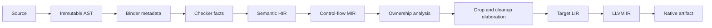
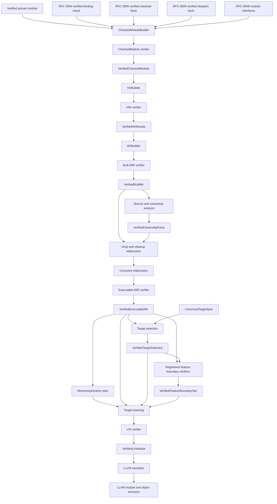

# RFC 0010: Intermediate Representation Pipeline Architecture

## Summary

This RFC defines three compiler-owned intermediate representations for ZOM:
semantic HIR, control-flow MIR, and target LIR. HIR is the immutable,
source-shaped semantic handoff after binding and type checking. MIR is the
target-independent, place-based control-flow representation used for ownership
analysis, drop elaboration, error control flow, and language-specific
optimization. LIR is the target-aware SSA representation that owns concrete
ABI layout, calling conventions, monomorphization, and translation to LLVM IR.

The parsed AST and checker side tables are inputs to HIR construction, not IR
layers. LLVM IR is an external backend representation, not a ZOM semantic IR.
Every boundary is verified, downstream stages consume canonical identities,
and no lowering stage may repeat name lookup, type inference, trait solving, or
call-target selection.

## Motivation

The worktree has one early `irgen::Module` that combines language-level
operations such as error propagation and forced unwrap with target data layout,
concrete error-union tags, and ABI return types. That combination leaves no
sound owner for several required tasks:

1. RFC 0007 needs a place-based CFG for path-sensitive moves, loans, regions,
   reborrows, and linear consumption.
2. RFC 0006 needs target-independent cleanup and panic control flow before
   concrete error-union layout and runtime ABI calls are selected.
3. RFC 0011 needs context-bound package, crate, module, definition, impl, and
   source identities that remain stable across RFC 0008 module interfaces.
4. RFC 0009 needs an explicit consumer for frozen call-dispatch facts without
   repeating checker resolution.
5. Native code generation needs a target-aware representation whose verifier
   guarantees that all language semantics have already been resolved.

Without explicit layers, semantic operations acquire layout indices too early,
borrow checking must reverse-engineer an SSA value graph, and target lowering
can accidentally depend on AST nodes or checker-owned type trees. A passing IR
snapshot cannot prove those boundaries. The repository needs one canonical
pipeline contract before more lowering is added.

## Goals

- Define exactly three ZOM IR layers and the responsibility of each layer.
- Make semantic HIR the sole handoff from frontend semantic analysis.
- Make MIR target-independent, place-based, and suitable for ownership and
  cleanup dataflow.
- Make LIR target-aware, SSA-based, ABI-complete, and mechanically translatable
  to LLVM IR.
- Define canonical identity, source provenance, ownership, immutability, and
  verification contracts at every boundary.
- Assign IR and backend path ownership to the `ir-backend` subagent.
- Define which RFC owns each lowering decision and prevent duplicate semantic
  resolution in downstream stages.
- Replace ambiguous IR output with layer-specific deterministic debug dumps.
- Delete the mixed `compiler/irgen` surface when the three-layer replacement is
  executable; no compatibility facade remains.

## Non-Goals

- This RFC does not change ZOM source syntax or type rules.
- This RFC does not define the complete instruction inventory for every future
  language feature.
- This RFC does not select a non-LLVM native backend.
- This RFC does not define a stable public serialization format for HIR, MIR,
  or LIR.
- This RFC does not make AST nodes mutable or move semantic analysis into
  lowering.
- This RFC does not define error, borrow, module, call-dispatch, or concurrency
  semantics already owned by RFCs 0006 through 0009 and the language spec.
- This RFC does not preserve `zom.ir`, `--emit ir`, or the `irgen` C++ API.

## Prior Art

### Rust HIR, THIR, And MIR

The Rust compiler lowers source through HIR and THIR into MIR. MIR is a
target-independent CFG with locals and places; it is used for borrow checking,
uninitialized-value analysis, constant evaluation, and Rust-specific
optimization before LLVM IR generation. ZOM should copy the separation between
semantic resolution and MIR construction, and should use a place-oriented MIR
for ownership analysis instead of forcing borrow rules onto target SSA.

References:

- <https://rustc-dev-guide.rust-lang.org/overview.html>
- <https://rustc-dev-guide.rust-lang.org/mir/construction.html>

### Swift Typed AST And SIL

Swift lowers a fully type-checked AST into raw SIL, runs mandatory correctness
and dataflow transformations to produce canonical SIL, performs
language-specific optimization, and only then generates LLVM IR. SIL makes
ownership and calling semantics explicit while retaining information LLVM IR
does not model directly. ZOM should copy the rule that correctness-affecting
passes and verifiers run before backend IR generation.

Reference: <https://www.swift.org/documentation/swift-compiler/>

### MLIR Conversion Legality

MLIR dialect conversion defines a conversion target, legal and illegal
operations, rewrite patterns, and explicit type conversion. ZOM should copy the
legality model: each lowering boundary has a verifier that rejects operations
or types belonging to the previous layer. ZOM does not need the MLIR framework
to apply this discipline.

References:

- <https://mlir.llvm.org/docs/DialectConversion/>
- <https://mlir.llvm.org/docs/TargetLLVMIR/>

### LLVM IR

LLVM IR is a typed SSA representation designed for low-level optimization and
machine-code generation. It supports modules, functions, basic blocks, calling
conventions, atomics, and target-facing attributes, but it does not encode ZOM
borrow regions, interface dispatch decisions, cleanup scopes, or structural
error semantics. ZOM should translate ABI-complete LIR to LLVM IR rather than
using LLVM IR as its language-semantic representation.

Reference: <https://llvm.org/docs/LangRef.html>

### Common Failure Modes

Three recurring compiler failures control this design:

1. Re-running semantic resolution during code generation can select a different
   symbol, impl, coercion, or vtable slot from the checker. ZOM freezes those
   facts in HIR and forbids downstream lookup.
2. Introducing target sizes and ABI tags before language control flow is
   normalized makes ownership and cleanup analyses target-dependent. ZOM keeps
   all concrete layout out of HIR and MIR.
3. Allowing passes to mutate one representation through undocumented phases
   makes verifier guarantees local and stale. ZOM uses explicit builders,
   immutable verified modules, and lowering functions that return a new layer.

## Guide-Level Explanation

Contributors see one ordered pipeline:



The names describe compiler contracts, not optimization levels:

- HIR answers what every source construct means.
- MIR answers how ZOM control flow, storage, ownership, and cleanup behave.
- LIR answers how the selected target represents and calls that behavior.
- LLVM IR is the backend input used to optimize and emit machine code.

Contributors choose the earliest layer that has all facts needed for a task.
An IDE reads AST, symbols, and HIR. Borrow checking reads MIR. ZOM-specific
control-flow optimization reads MIR. ABI layout and LLVM translation read LIR.
No consumer reads a later layer merely to recover information discarded by an
earlier one.

The CLI exposes layer-specific debug output:

```text
zomc compile --emit=hir input.zom
zomc compile --emit=mir input.zom
zomc compile --emit=lir input.zom
zomc compile --emit=llvm-ir input.zom
```

These outputs are deterministic test and debugging artifacts. They are not
stable interchange formats. Any future stable module or tooling format requires
its own RFC.

## Reference-Level Design

### Layer Count And Names

ZOM owns exactly three IR layers:

| Layer | Canonical C++ namespace | Canonical path | Target dependent | Primary consumers |
|---|---|---|---|---|
| Semantic HIR | `zomlang::compiler::hir` | `products/zomlang/compiler/hir/**` | No | IDE queries, MIR construction, semantic audits |
| Control-flow MIR | `zomlang::compiler::mir` | `products/zomlang/compiler/mir/**` | No | Borrow checker, drop elaboration, ZOM optimizations |
| Target LIR | `zomlang::compiler::lir` | `products/zomlang/compiler/lir/**` | Yes | LLVM translation, object emission, ABI tests |

The parsed AST, RFC 0004 verified binding input, RFC 0005 verified checked
facts, RFC 0009 verified dispatch facts, and RFC 0008 module interfaces are
frontend inputs. Mutable `TypeEnv` and binder tables are not HIR inputs. LLVM IR
and object files are backend outputs. They are not additional ZOM IR layers.

### Canonical Pipeline Contract



Every edge that produces an IR module returns ownership of a new module. A
builder may mutate its private incomplete state. Constructors for verified
wrappers are private; only the corresponding verifier can create
`VerifiedHirModule`, `VerifiedBuiltMir`, `VerifiedExecutableMir`, or
`VerifiedLirModule`. A pass that changes structure builds and verifies a
replacement module.

Target selection and pre-LIR source feature gates publish proof-carrying
tokens rather than side effects:

```text
TargetFeatureState = Enabled | Disabled

CanonicalTargetFeature {
  name: AsciiBytes,
  state: TargetFeatureState,
}

CanonicalTargetSpec {
  triple: AsciiBytes,
  llvmDataLayout: AsciiBytes,
  cpu: AsciiBytes,
  features: SortedSequence<CanonicalTargetFeature>,
  runtimeAbiProfile: AsciiBytes,
  panicStrategy: PanicStrategy,
  objectFormat: ObjectFormat,
}

TargetSpecId = Sha256Digest
TargetRegistryRevision = Sha256Digest

RegisteredTargetProfileRecord {
  name: RFC0012::RegisteredTargetProfileName,
  semanticProjection: RFC0011::CanonicalTargetSpecificationKey,
  semanticFeatureNames: SortedSet<RFC0011::TargetFeatureName>,
  specifications: SortedMap<PanicStrategy, CanonicalTargetSpec>,
}

TargetRegistrySnapshot {
  hostProfile: RFC0012::RegisteredTargetProfileName,
  profiles: SortedMap<RFC0012::RegisteredTargetProfileName,
                      RegisteredTargetProfileRecord>,
  revision: TargetRegistryRevision,
}

VerifiedTargetSelection {
  contextFingerprint: SemanticContextFingerprint,
  packageSelection: RFC0012::RegisteredTargetSelection,
  canonicalTargetSpec: CanonicalTargetSpec,
  targetSpecId: TargetSpecId,
}

FeatureBoundaryGateId = NonZeroUint32

FeatureBoundaryRegistryEntry {
  gate: FeatureBoundaryGateId,
  ownerRfc: uint32,
}

FeatureBoundaryRegistrySnapshot {
  entries: SortedSequence<FeatureBoundaryRegistryEntry>,
  revision: Sha256Digest,
}

FeatureBoundaryProof {
  gate: FeatureBoundaryGateId,
  contextFingerprint: SemanticContextFingerprint,
  module: ModuleId,
  executableMirRevision: MirRevisionId,
  targetSpecId: TargetSpecId,
  revision: Sha256Digest,
}

VerifiedFeatureBoundarySet {
  contextFingerprint: SemanticContextFingerprint,
  module: ModuleId,
  executableMirRevision: MirRevisionId,
  targetSpecId: TargetSpecId,
  registryRevision: Sha256Digest,
  proofs: SortedSequence<FeatureBoundaryProof>,
}
```

`TargetSpecId` is SHA-256 over `ASCII("zom.target-spec")`, NUL, then, in
field order, the byte-framed triple, LLVM data-layout string, CPU, the `uint64`
feature count, every feature's byte-framed name and state tag, the byte-framed
runtime ABI profile, panic-strategy tag, and object-format tag. Byte framing is
an unsigned big-endian `uint64` length followed by exact bytes. Features sort
by name bytes and duplicate names are invalid. Feature tags are `Enabled =
0x01` and `Disabled = 0x02`; panic tags are `Unwind = 0x01` and `Abort = 0x02`;
object-format tags are `Elf = 0x01`, `MachO = 0x02`, `Coff = 0x03`, and `Wasm =
0x04`. `TargetSpecId` encodes as the 32 digest bytes.

The independent target oracle uses triple `x86_64-zom-none`, LLVM data layout
`e-p:64:64`, CPU `generic`, one enabled feature `sse2`, runtime ABI profile
`zom`, unwind panic strategy, and ELF object format. Its complete 108-byte
preimage is:

```text
7a6f6d2e7461726765742d7370656300000000000000000f7838365f36342d7a6f6d2d6e6f6e650000000000000009652d703a36343a3634000000000000000767656e6572696300000000000000010000000000000004737365320100000000000000067a6f6d2d76310101
```

Its SHA-256 is
`d972a7d918fc7d64c002b4245b8e6f5151d3c3c8507ae26e1ca1cbd1a026c90b`.

Each registry profile contains at most one specification per panic strategy.
Every contained specification must reproduce its `TargetSpecId`, project to the
record's semantic projection by the total algorithm below, and differ from
another strategy entry only in panic-strategy-dependent backend/runtime fields.
Profile map keys must equal the embedded profile names. The host profile must
exist.

`ProjectTargetSemantics(spec, semanticFeatureNames)` is exact:

1. LLVM must parse `spec.triple` and normalize it back to the same lowercase
   bytes. Architecture, vendor, operating-system, and environment components are
   LLVM's canonical component spellings; an absent vendor, OS, or environment
   becomes the RFC 0011 unavailable component `unknown`.
2. `spec.runtimeAbiProfile` must construct RFC 0011 `TargetComponentName` and is
   the projection's ABI component.
3. LLVM must parse `spec.llvmDataLayout` and reproduce the same canonical bytes.
   The default address-space-zero pointer width is the projection pointer width,
   and the layout's leading endianness marker produces `Little` or `Big`.
   Missing or contradictory pointer/endianness facts reject the profile.
4. Every name in `semanticFeatureNames` must occur exactly once with the same
   bytes as an `Enabled` name in `spec.features`.
   No disabled or absent feature may be projected. The resulting normalized
   names form `semanticFeatures`; every other backend feature remains
   code-generation-only.
5. The resulting `CanonicalTargetSpecificationKey` must be byte-equal to
   `semanticProjection`.

Failure in steps 1-5 is `IrInvariantRejected(InvalidFact, TargetSelection,
Session)` and maps to `ZOM9947`; a non-canonical encoded registry or target
record is `CanonicalCodecMismatch` and maps to `ZOM9949`. The independent
positive projection vector uses the 108-byte target oracle: architecture
`x86_64`, vendor `zom`, OS `none`, environment `unknown`, ABI `zom`, pointer
width `64`, little endian, and semantic feature set `{sse2}`. Negative vectors
cover a non-canonical triple, malformed component spelling, a noncanonical or
address-space-only data layout, pointer-width and endian mismatch, an invalid
runtime ABI component, and semantic features that are absent, disabled,
duplicated, or invalid RFC 0011 names. A separate vector changes only the
declared `semanticProjection` and requires the same `InvalidFact` result before
snapshot publication.

`TargetRegistryRevision` is SHA-256 over this exact stream:

```text
ASCII("zom.target-registry")
0x00
uint64be(hostProfileByteLength)
hostProfileBytes
uint64be(profileCount)
for each profile sorted by profile-name bytes:
  uint64be(encodedProfileRevisionRecordByteLength)
  encodedProfileRevisionRecordBytes
```

`encodedProfileRevisionRecordBytes` contains the byte-framed profile name, the
RFC 0011 canonical encoding of its semantic projection, the sorted framed
semantic-feature-name set, a `uint64be` strategy count, then each panic tag and
32-byte recomputed `TargetSpecId` in tag order.
It contains no object address, registry slot, compiler invocation path, or
presentation string. The independent framing oracle uses host name `host` and
one already-encoded profile record `a1`. Its complete 52-byte preimage is
`7a6f6d2e7461726765742d7265676973747279000000000000000004686f737400000000000000010000000000000001a1`
and its SHA-256 is
`f0d22e55137466eaeac0852b11262f85865d01232d52128a49d0003e77f3c9ba`.
The registry verifier recomputes every target ID and this revision before
publishing the immutable snapshot.

The target-selection verifier consumes the exact RFC 0012
`RegisteredTargetSelection` carried through `CompilerSession`. It requires the
same immutable `TargetRegistrySnapshot` revision and profile name to map to one
`CanonicalTargetSpec`, requires the registry's source-visible projection to
equal `packageSelection.semanticProjection`, and requires its panic strategy to
equal `packageSelection.panicStrategy`. It owns an immutable copy of that
specification, recomputes `TargetSpecId` from the exact value, and publishes all
three records only when they match. `VerifiedTargetSelection` is therefore the
sole authorized lookup from a package target selection or target ID to the
profile used by layout, ABI, runtime, and object emission. Consumers read the
embedded immutable profile; no API attempts to invert a digest or accepts a
second unverified target record.

The gate registry is generated from
`products/zomlang/compiler/ir/feature-boundary-gates.def`. A gate ID is a
non-zero fixed-width `uint32`, encodes big-endian, and is unique in one
snapshot. Entries sort by numeric gate ID. The registry revision is SHA-256
over `ASCII("zom.feature-boundary-registry")`, NUL, a big-endian `uint64`
entry count, then each gate ID and owner RFC as big-endian `uint32` values.
The independent one-entry oracle uses gate `1` owned by RFC `6`. Its complete
46-byte preimage is:

```text
7a6f6d2e666561747572652d626f756e646172792d72656769737472790000000000000000010000000100000006
```

Its SHA-256 is
`374b122260c23a73d6fba979495c1fa89a2e8df6976145fb84813c2f4d9933e8`.
Generation fails on zero or duplicate IDs, a missing owner RFC, a registry
entry without an accepted owner contract, or an accepted gate contract without
an entry. The verified snapshot is immutable for one compilation.

The feature-boundary set assembler consumes that exact registry snapshot and
requires exactly one proof for every entry. It rejects missing, additional,
duplicate, stale-MIR, foreign-context, foreign-module, foreign-target, or
foreign-registry proofs. Proofs sort by numeric gate ID. A gate with no
applicable source declarations still publishes its canonical empty proof. When
multiple gates reject source, the coordinator runs every gate, sorts groups by
gate ID and failures within a group by the gate RFC's canonical key, emits all
groups, and publishes no set. Registration order, input order, worker count,
and first arrival do not affect the registry revision, proof order, diagnostics,
or set revision. Target lowering requires the matching
`VerifiedTargetSelection` and `VerifiedFeatureBoundarySet`; there is no
overload that accepts bare `VerifiedExecutableMir` plus an unchecked target
profile.

Every Built MIR module has one closed, recomputable `MirRevisionId`:

```text
MirRevisionInput {
  contextFingerprint: SemanticContextFingerprint,
  module: ModuleId,
  checkedFactsRevision: CheckedFactsRevision,
  dispatchFactsRevision: DispatchFactsRevision,
  borrowEvidenceRevision: BorrowEvidenceRevision,
  functions: SortedSequence<CanonicalMirFunctionRecord>,
}

MirRevisionId {
  digest: Sha256Digest,
}
```

`CanonicalMirFunctionRecord` is the complete non-textual canonical encoding of
one concrete `MirFunction`: expanded owning `DefId`, canonical signature and
semantic types, arguments, return place, locals, source scopes, blocks,
statements, rvalues, operands, places and projections, terminators, unwind and
cleanup edges, suspend/cancellation edges, logical drops, and validated source
spans. Functions sort by expanded `DefId`; locals, source scopes, and blocks
sort by their deterministic layer-local IDs; records inside a block remain in
execution order. Every union uses the closed implementation enum's declaration
order beginning at `0x01`. Semantic types, definitions, constants,
substitutions, witnesses, and spans expand through RFCs 0005, 0008, and 0011.
Numeric store slots, object addresses, hash iteration order, debug names, and
textual dumps never enter the encoding. Adding or reordering a MIR field or
variant directly replaces this canonical framing and every golden oracle in the
same accepted change. The repository contains one MIR codec and no alternate
decoder.

The digest is SHA-256 over this exact framing:

```text
ASCII("zom.mir-revision")
0x00
SemanticContextFingerprint
Frame(Encode(expanded ModuleKey))
Encode(checkedFactsRevision)
Encode(dispatchFactsRevision)
Encode(borrowEvidenceRevision)
EncodeFramedSequence(functions)
```

`Frame(bytes)` is an unsigned 64-bit big-endian byte length followed by the
bytes. `EncodeFramedSequence` is an unsigned 64-bit big-endian element count,
then one `Frame` per element. The independent oracle uses a zero context
fingerprint, module bytes `a1`, 32 checked-revision bytes `22`, 32
dispatch-revision bytes `33`, 32 borrow-evidence bytes `44`, and one
already-canonical function record `b3`. Its complete 171-byte preimage is:

```text
7a6f6d2e6d69722d7265766973696f6e0000000000000000000000000000000000000000000000000000000000000000000000000000000001a122222222222222222222222222222222222222222222222222222222222222223333333333333333333333333333333333333333333333333333333333333333444444444444444444444444444444444444444444444444444444444444444400000000000000010000000000000001b3
```

Its SHA-256 is
`9f8de0ad0794e63ee7ed8d8ab777683956d5d9ca9bf151987bd0a60dbaad7985`.
Integration oracles replace `b3` with every real MIR record and prove that a
field, edge, order, context, module, checked, dispatch, or borrow-evidence
revision mutation changes or rejects the revision as specified.

A module with no functions is valid and encodes an empty framed sequence. The
empty-module oracle has this complete 162-byte preimage:

```text
7a6f6d2e6d69722d7265766973696f6e0000000000000000000000000000000000000000000000000000000000000000000000000000000001a12222222222222222222222222222222222222222222222222222222222222222333333333333333333333333333333333333333333333333333333333333333344444444444444444444444444444444444444444444444444444444444444440000000000000000
```

Its SHA-256 is
`b9a8988df033e7ce07c6708a6e2ce42e6bac1067231c8c86128e494b3238cbc9`.

`VerifiedBuiltMir` stores the recomputed revision and the exact borrow-evidence
lineage used to construct it:

```text
VerifiedBuiltMir {
  module: MirModule,
  revision: MirRevisionId,
  borrowEvidenceRevision: BorrowEvidenceRevision,
  borrowEvidenceLease: VerifiedBorrowEvidenceLease,
}
```

`VerifiedOwnershipFacts` records the exact Built MIR revision it proves.
Ownership, cleanup, coroutine, and executable-MIR artifacts require their own
implemented builders, verifiers, canonical codecs, and exact lineage when those
stages enter production. Built MIR reserves no phase tags, optional certificate
slots, or fields for those absent stages.

### Canonical Identity

IR may use only RFC 0011 context-bound canonical identities:

- `PackageId` identifies one resolved package instance.
- `CrateId` identifies one RFC 0011 crate target and semantic compilation
  configuration. Library, binary, test, benchmark, example, and build-script
  targets in the same package always have distinct identities.
- `ModuleId` is an opaque RFC 0011 handle for one module without collision
  across package graphs or crate targets.
- `DefId` is an opaque RFC 0011 handle for a declaration or callable target.
- `ImplId` is an opaque RFC 0011 handle for one coherent interface
  implementation.
- `SemanticTypeId` addresses immutable canonical `TypeData` in the
  session-owned `SemanticTypeStore`.
- `InstanceId { DefId, CanonicalSubstitutionId, WitnessArgumentsId }`
  identifies one monomorphized callable instance.
- `SourceSpan { SourceFileId, byteStart, byteEnd }` is independent from an
  in-memory source pointer.
- `SemanticContextBrand` proves that an in-memory handle belongs to the live
  semantic context that issued it.
- `SemanticContextFingerprint` deterministically describes semantic inputs but
  is not an in-memory issuer capability.
- Layer-local `HirId`, `LocalId`, `PlaceId`, `BlockId`, and `ValueId` identify
  representation-owned entities.

AST `NodeId` may be consumed while building HIR but is not a semantic identity
in MIR or LIR. Source spelling, unqualified names, raw pointers to symbols, and
checker-owned `Type` object addresses are forbidden as cross-layer identity.

HIR and MIR borrow the immutable-payload session-owned `SemanticTypeStore` and
carry one RFC 0008 `CheckedEvidenceLease` for their module's frozen
substitution and witness stores; they do not own or re-intern either domain.
LIR owns a separate `LirTypeStore` addressed by `LirTypeId` and retains the same
evidence lease through backend translation. Every module and verified wrapper
carries the `SemanticContextBrand`, records the diagnostic fingerprint, and
rejects IDs from another context. Persisted metadata and handle remapping are
not pipeline behavior.

RFC 0011 exclusively defines deterministic package, crate, module, source,
definition, and impl allocation, including compilation configuration and
anonymous-definition disambiguation. This RFC does not restate or vary those
keys.
HIR IDs use specified preorder traversal. MIR locals, blocks, and temporaries
use the deterministic builder order defined by the MIR construction tests.
Parallel workers publish results into these canonical orders; scheduling and
hash-map iteration never affect an ID or dump.

`SemanticTypeId` is the context-global handle issued by the one RFC 0005
`SemanticTypeStore` in a final semantic context and carries no
`RegistryBrand`. `CanonicalSubstitutionId`, `WitnessArgumentsId`, and
`LirTypeId` are store-local handles over immutable canonical payloads and
include the RFC 0011 `RegistryBrand` of their issuing store in addition to the
semantic context brand. RFC 0008 adopts the two checker stores into
`CheckedFactsRepository` before HIR and keeps them alive for the complete
pipeline. Their stores may intern complete payloads online, but numeric slots never
participate in dump ordering, cache keys, artifact identity, or cross-context
equality. Observable ordering compares canonical structural keys.
`InstanceId` comparison and monomorphization ordering likewise compare the
structural definition, substitution, and witness keys rather than store slots.

### Verified Frontend Handoff

`VerifiedCheckedModule` is the only frontend value accepted by `HirBuilder`.
It is not an IR layer. It owns or immutably references:

- one `SemanticContextBrand` and diagnostic
  `SemanticContextFingerprint`;
- the current `PackageId`, `CrateId`, and `ModuleId`;
- one RFC 0008 `CheckedEvidenceLease` whose key is the exact module and
  `CheckedFactsRevision`;
- its own RFC 0008 `VerifiedModuleInterface` plus the exact canonically ordered
  visible imported interface set and interface revisions used during checking;
- the AST and canonical binding identities;
- solved expression and declaration `SemanticTypeId` values;
- complete coercion adjustments, including source and destination types,
  union alternative, reborrow, reference/raw-pointer conversion, dyn erasure or
  upcast path, and selected witness where applicable;
- the complete RFC 0005 checked-cast map, including mode, kind, source, target,
  result, impl and witness evidence, dyn path, unsafe requirement, and source
  span for every cast expression;
- matching RFC 0009 `VerifiedDispatchFacts`, including one complete
  `DispatchTarget`, receiver mode and adjustments, argument plans, success type,
  canonical result type, raises type, matching error-union shape when raising,
  substitution, witness, and source provenance for every call-like node, plus
  the exact `DispatchFactsRevision`;
- pattern constructors and exhaustiveness facts;
- closure capture place and mode facts;
- constant and aggregate facts, observed operations, raises facts, unsafe
  requirements, captures, and normalized `MoveReceiver` attributes;
- source spans, the immutable semantic type-store view, and the checked
  evidence repository view used by all facts.

Successful checked snapshots contain no string-based semantic target, AST
`implNode` identity, unresolved type variable, error target, or incomplete
coercion. The entire checked snapshot is frozen, not only its dispatch table.
Its verifier fails before HIR construction if any required fact is missing or
inconsistent. Every referenced `DefId`, `ImplId`, and semantic type must belong
to the current module or the recorded visible interface set and must carry the
same context brand.

`CheckedModuleBuilder` consumes one RFC 0008 `CheckedEvidenceLease`, resolves
its RFC 0005 `VerifiedCheckedFacts`, and consumes one RFC 0009
`VerifiedDispatchFacts` with identical semantic context, module, and
checked-facts revision. RFC 0009 exclusively defines `DispatchTarget`; this RFC
does not repeat its alternatives. Dyn dispatch carries logical interface and
method identity through HIR and MIR. Witness-table and vtable slots are assigned
during LIR target lowering. A mismatched, missing, or additional dispatch fact
is an invariant failure and no checked module is constructed.

`HirBuilder` copies the non-owning lease and exact `DispatchFactsRevision` into
`VerifiedHirModule`; every MIR replacement wrapper, `MonomorphizationPlan`,
`VerifiedLirModule`, and backend translation request carries both. The session
outlives all of them.
Dropping an earlier representation cannot invalidate a substitution or witness
handle. Repository lookup failure, lease mismatch, or use after session teardown
is an invariant before dereference.

### Semantic HIR

HIR is immutable and source-shaped. It removes parser-only structure while
preserving enough expression and declaration structure for diagnostics, IDE
queries, generic bodies, and deterministic MIR construction.

Every HIR declaration contains:

- canonical module and symbol identity;
- canonical declared and inferred types;
- visibility, linkage, generic parameters, bounds, raises, and receiver mode;
- normalized `MoveReceiver` when present;
- a source span and stable layer-local identity;
- a body when the current compilation unit owns the implementation.

Every HIR expression contains:

- one canonical result `SemanticTypeId`;
- an explicit coercion when source and destination types differ;
- one `HirCheckedCastFact` when the expression is a cast; `HirBuilder` maps the
  verified RFC 0005 AST `NodeId` to the expression's `HirNodeId` and preserves
  mode, kind, source, target, result, impl and witness evidence, dyn path,
  unsafe requirement, and source span without normalization or reconstruction;
- one complete RFC 0009 `DispatchTarget`, receiver adjustments, argument
  types, success type, canonical result type, raises type, matching error-union
  shape, and source provenance for every call-like operation;
- an explicit place/value category;
- normalized control constructs without parser recovery nodes;
- source provenance.

HIR must not contain:

- unresolved identifiers or error sentinel targets;
- mutable type variables or checker-owned `Type` trees;
- target pointer width, size, alignment, tag, or calling-convention choices;
- CFG edges, cleanup blocks, stack slots, or LLVM concepts;
- semantic facts recoverable only by repeating binder or checker work.

The layer-owned cast record is:

```text
HirCheckedCastFact {
  site: HirNodeId,
  mode: CastMode,
  kind: CastKind,
  source: SemanticTypeId,
  target: SemanticTypeId,
  result: SemanticTypeId,
  impl: Maybe<ImplId>,
  witnesses: Maybe<WitnessArgumentsId>,
  dynPath: Sequence<DefId>,
  unsafeRequirement: UnsafeRequirement,
  sourceSpan: SourceSpan,
}
```

`HirBuilder` requires a one-to-one association between every verified RFC 0005
cast fact and one HIR cast expression. The frontend `NodeId` is used only to
perform that checked association and is then discarded. It never enters a HIR
or MIR entity, dump, cache key, or revision.

`CheckedModuleBuilder` is the only component allowed to assemble the RFC 0004
verified binding result, RFC 0005 verified checked facts, RFC 0009 verified
dispatch facts, and RFC 0008 module interfaces. It cannot read a mutable binder
or checker table. `HirBuilder` accepts only `VerifiedCheckedModule`. Missing
facts are compiler invariant failures rather than lowering capability errors.

### Control-Flow MIR

MIR is a typed, target-independent CFG. Its storage model is place-based rather
than SSA-based because ownership rules apply to storage locations and
projections, not only computed values.

The minimum MIR vocabulary is:

```text
MirModule {
  contextFingerprint: SemanticContextFingerprint,
  module: ModuleId,
  checkedFactsRevision: CheckedFactsRevision,
  dispatchFactsRevision: DispatchFactsRevision,
  functions: SortedSequence<MirFunction>,
}
MirFunction
BasicBlock
LocalDecl
Place { local, projections }
Operand { copy, move, constant }
Rvalue
Statement
Terminator
SourceScope
```

Place projections include field, index, dereference, downcast, and subslice.
`copy` and `move` are operand uses, never standalone statements. Assignment
initializes or overwrites a destination place according to an explicit
initialization state. Statements include assignment, storage live/dead, borrow
creation, discriminant update, and deinitialization.

Terminators include goto, logical variant switch, call, logical drop,
drop-and-replace, return, panic, suspend, resume, and unreachable. A call
terminator carries argument operands, destination place, normal target, and an
explicit unwind action. HIR-to-MIR construction fixes language evaluation
order and materializes every temporary, temporary scope, defer/errdefer scope,
partial-initialization state, forced-unwrap payload borrow, and checked-cast
success and failure continuation. Each HIR cast site maps to exactly one
deterministic `MirOperationSite`; every non-identity cast field is copied
unchanged into the MIR operation and participates in the MIR dump and
`MirRevisionId`.

```text
MirOperationSite {
  owner: DefId,
  block: MirBlockId,
  statementOrdinal: uint32,
}

MirCheckedCast {
  site: MirOperationSite,
  mode: CastMode,
  kind: CastKind,
  source: SemanticTypeId,
  target: SemanticTypeId,
  result: SemanticTypeId,
  impl: Maybe<ImplId>,
  witnesses: Maybe<WitnessArgumentsId>,
  dynPath: Sequence<DefId>,
  unsafeRequirement: UnsafeRequirement,
  sourceSpan: SourceSpan,
}
```

The MIR verifier proves that each cast site has one unique owner/block/ordinal,
that the site belongs to the enclosing operation, and that every semantic field
equals the source `HirCheckedCastFact`. It rejects any AST identity or
checker-owned object in the MIR candidate.

MIR uses logical types and variants. It does not contain target sizes,
alignments, concrete union tags, payload offsets, registers, LLVM types, or
target calling conventions.

MIR ownership operations are exactly `copy`, `move`, borrow creation, logical
`Drop`, and `DropAndReplace`. There is no retain, release, weak-reference, or
reference-count adjustment operation. Chapter 14's affine ownership contract
and RFC 0007 marker and borrow proofs determine legality; this RFC represents
and elaborates the already-decided operations.

### Ownership And Cleanup Pipeline

Built MIR contains every normal, residual, panic, unwind, suspend, cancellation,
scope-exit, and explicit return edge before ownership analysis runs. It also
contains logical `Drop` and `DropAndReplace` obligations. No later pass may
invent a semantic exit edge that ownership analysis did not inspect.

Borrow and ownership analysis runs on `VerifiedBuiltMir`:

1. Build move paths and place conflicts.
2. Compute reaching definitions, liveness, loan issuance, loan activation,
   region containment, and reborrow relationships over the CFG.
3. Validate use-after-move, conflicting loans, escaping references, linear
   consumption, scoped-task captures, and unsafe boundaries.
4. Publish immutable `VerifiedOwnershipFacts` keyed by MIR identities and the
   exact `MirRevisionId`.
5. Elaborate logical drop obligations into static, conditional, open, and dead
   drop paths from initialization and move facts. Elaboration may refine an
   existing logical drop edge but may not add a semantic exit.
6. Elaborate checked coroutine suspension into an explicit target-independent
   state-machine CFG.
7. Verify executable MIR has no implicit destruction, unresolved ownership
   obligation, logical suspend, or stale proof token.

RFC 0007 owns the semantic rules and diagnostics. This RFC owns the MIR input
and output contract. AST-shape heuristics are not an accepted substitute for
MIR dataflow.

Generic MIR is checked once under its declared bounds and selected witness
contracts. Ownership legality cannot depend on a concrete layout. Target
instantiation verifies that substitutions satisfy every recorded bound and
marker obligation, but it does not rerun borrow checking. Type-specific drop
glue is selected during monomorphization from already elaborated logical drop
sites.

### Error And Panic Operations In MIR

RFC 0006 error behavior is represented logically in MIR:

- a raising call carries the exact RFC 0005 success type, canonical result
  type, residual type, and verified error-union shape through its RFC 0009
  dispatch fact;
- propagation branches on success versus a canonical residual type;
- the residual path enters the same cleanup graph as explicit return;
- forced unwrap branches to a logical panic terminator carrying source span
  and a borrowed payload operand;
- a guaranteed `as T` cast has no failure edge, produces exactly the recorded
  target value, and cannot introduce a null result or panic terminator;
  `RawPointerReinterpret` is one such guaranteed operation and preserves the
  RFC 0005 `RawPointerBoundary` fact without re-comparing pointee types or
  mutability;
- an optional checked `as? T` cast evaluates the recorded check exactly once,
  injects the target value into the success alternative on success, injects
  `null` into the canonical `T | null` result on failure, and never enters a
  panic or cleanup edge;
- a forced checked cast consumes one RFC 0005 `CheckedCastFact`, evaluates the
  recorded check once, yields the target value on success, and branches to a
  logical `ForcedCast` panic terminator on failure without fabricating a
  residual payload;
- abort versus unwind remains a compilation strategy fact, not a target tag.

MIR does not select a concrete error-union tag, payload offset, runtime symbol,
or unwind ABI. Those choices belong to LIR target lowering.

### Concurrency Operations In MIR

Async and structured-concurrency constructs lower to target-independent Built
MIR operations before target LIR exists. MIR owns logical suspend points, task
scope entry/exit, cancellation edges, captured places, and cleanup behavior.
Ownership analysis treats suspend points as cross-suspend boundaries. After
that check and drop elaboration, `CoroutineElaboration` converts logical
suspension into an explicit state-machine CFG in executable MIR. Target LIR
only lays out the frame and selects runtime calls and calling conventions.

### Target LIR

LIR is a typed SSA CFG with block parameters. It is the first representation
allowed to depend on the selected target triple, data layout, ABI profile, and
runtime capability set.

LIR construction performs:

- generic monomorphization and reachable-instance collection;
- aggregate, interface-object, closure, async-frame, and error-union layout;
- concrete function and runtime calling-convention selection;
- logical variant to concrete tag mapping;
- place and aggregate lowering to addresses and SSA values;
- drop and panic operation lowering to concrete callable symbols;
- integer-width, pointer-width, alignment, and atomic legalization;
- FFI boundary validation and wrapper generation.

The minimum LIR vocabulary is:

```text
LirTypeId
LayoutId
FnAbiId
TargetSpecId
RuntimeSymbolId
InstanceId
PassMode { ignore, direct, pair, indirect }
LirModule
LirFunction { instance, fnAbi, blocks }
LirBlock { parameters, instructions, terminator }
```

The closed minimum type inventory is:

```text
LirType =
  Void
  Integer { bitWidth }
  Float { semantics }
  Pointer { addressSpace }
  Array { element: LirTypeId, count }
  Struct { fields: [LirTypeId], layout: LayoutId }
  Function { abi: FnAbiId }
```

The closed minimum instruction inventory contains integer and floating
constants; integer and floating arithmetic and comparison; integer, float, and
pointer casts; stack allocation and address construction; load and store;
field and index address calculation; aggregate construction and extraction;
and non-unwinding direct, indirect, and runtime calls. Terminators include
`Invoke { callee, arguments, fnAbi, normalTarget, unwindTarget }`,
unconditional branch, conditional branch, integer/variant switch after
legalization, return, and unreachable.

Every instruction has fixed operand and result arity, every result has one
`LirTypeId`, every referenced value dominates its use, and every referenced ID
belongs to the same verified module and target context. Address operations
carry a `LayoutId`; loads and stores carry the accessed value type, alignment,
address space, volatility, atomic order, and provenance. Calls carry `FnAbiId`
and use pass modes that exactly match their arguments and results.

`LayoutId` describes storage size, alignment, field offsets, niches, and
address-only versus loadable representation. `FnAbiId` separately describes
argument and return passing modes, register classes, hidden parameters,
unwind behavior, and calling convention. Language ABI, C ABI wrappers, and
runtime ABI use distinct profiles.

Memory operations record alignment, address space, volatility, atomic order,
and alias-relevant provenance. `TargetSpecId` fingerprints the target triple,
LLVM target data layout, CPU/features, runtime ABI profile, panic strategy, and
object format. LLVM `TargetMachine` and `DataLayout` are the final authority for
target layout; hard-coded ILP32/LP64 profiles are test fixtures, not production
layout truth.

LIR contains no unresolved generic parameter, inferred coercion, trait query,
source-level overload, symbolic residual alternative, borrow region, implicit
drop, or AST identity.

`TargetDataLayout` and `ErrorUnionLayout` are LIR/backend services. They must
not be owned by HIR or MIR modules.

### Monomorphization Plan

`MonomorphizationPlan` is an analysis artifact, not a fourth IR layer. It
carries the executable MIR's `CheckedEvidenceLease`. Its key is `InstanceId`,
including canonical substitutions and witness arguments resolved through that
lease.
Roots are `main`, exported entry points, runtime-required roots, test harness
roots, and symbols explicitly retained by an accepted attribute contract.

Reachability edges include direct calls, address-taken functions, closure
bodies, coroutine resume and drop functions, materialized dyn and witness
tables plus their referenced methods, drop glue, panic/runtime shims, C ABI
wrappers, and generated thunks. The reachable-instance worklist is ordered by
canonical instance key.
Instantiation substitutes already selected definitions, impls, associated
types, and witness arguments. It must not run trait solving, overload
resolution, method lookup, associated-type lookup, or coherence queries.
Exact recursive instances are cycle-detected and reused. For each ancestor
chain, an occurrence of the same `DefId` whose canonical substitution tree
strictly contains the ancestor substitution as a proper structural subterm is
rejected as type-expanding recursion. A deterministic implementation budget on
instance count and canonical substitution-node count provides a second guard;
exhaustion emits the registered typed capability failure defined below before
LIR publication. Both rejection forms retain the exact root `InstanceId` and
canonical expansion chain; the public diagnostic anchors at the root
instantiation's checked source span.

### LLVM Translation Boundary

Target legalization rejects unsupported operations and capabilities before a
`VerifiedLirModule` is published. Translation from `VerifiedLirModule` to LLVM
IR is total: every legal LIR operation has exactly one defined translation. An
unsupported operation observed by the translator is a structured `ZOM99xx`
compiler invariant failure. The translator may not:

- run binder, checker, trait, borrow, or coherence queries;
- choose a ZOM overload or interface implementation;
- invent cleanup paths;
- reinterpret source syntax;
- accept an unverified LIR module.

LLVM verification runs on every emitted module in development and CI builds.
Object emission begins only after both the ZOM LIR verifier and LLVM verifier
succeed.

### Verifier Contracts

Each layer has a dedicated verifier and a legality inventory.

| Verifier | Required proof |
|---|---|
| Checked-module verifier | Every binding, type, adjustment, dispatch, witness, constant, capture, observed operation, raises fact, unsafe requirement, and source span is complete, canonical, frozen, and from one semantic context |
| HIR verifier | All identities resolve; every expression has one type; calls, coercions, raises, observed operations, and visibility are explicit; no parser recovery node remains |
| Built MIR verifier | CFG is closed; blocks terminate; every semantic exit and logical drop obligation is explicit; locals and places are typed; operations are target-independent; ownership inputs are complete |
| Executable MIR verifier | The consumed ownership proof matches the Built MIR revision; all required drops, cleanup, and coroutine states are explicit; no logical suspend or unresolved obligation remains |
| Target-selection verifier | The embedded canonical target profile is structurally valid and recomputes the published `TargetSpecId` exactly |
| Feature-boundary set verifier | Every registered gate publishes exactly one proof for the same semantic context, module, executable MIR revision, and selected `TargetSpecId`; no source or invariant rejection occurred |
| LIR verifier | SSA dominance and block arguments are valid; all types have target layouts; ABI and runtime targets are concrete; no HIR/MIR-only operation remains |
| LLVM verifier | Emitted LLVM module satisfies LLVM structural and type invariants |

Verifier failures are compiler invariant failures. Source-program errors are
diagnosed by the owning semantic pass before a verified downstream module is
published.

### Diagnostic Contract

IR builders, verifiers, passes, and target lowering return typed failure facts,
not display strings. Every user-correctable error or unsupported target/CLI
capability has a registered `ZOMxxxx` entry in
`products/zomlang/compiler/diagnostics/diagnostics-*.def`, a primary
`SourceSpan` when source caused it, and conformance coverage that checks the
diagnostic code.

```text
IrFailureOwner =
  Session { context: SemanticContextFingerprint }
  | Module { module: ModuleId }
  | Definition { definition: DefId }
  | Instance { instance: InstanceId }

IrFailureSite =
  FrontendHandoff { checkedNode: CheckedNodeKey }
  | Hir { owner: DefId, node: HirNodeId }
  | Mir { owner: DefId, block: MirBlockId,
          statement: Maybe<uint32> }
  | Lir { instance: InstanceId, block: LirBlockId,
          instruction: Maybe<uint32> }
  | Backend { instance: Maybe<InstanceId>, operation: BackendOperation }

IrFailurePhase =
  CheckedModuleAssembly | HirConstruction | HirVerification
  | MirConstruction | BuiltMirVerification | OwnershipProofValidation
  | CleanupElaboration | CoroutineElaboration | ExecutableMirVerification
  | Monomorphization | TargetSelection | LirLowering | LirVerification
  | LlvmTranslation | ObjectEmission | FeatureBoundaryVerification

IrFailureKind =
  InputRevisionMismatch | MissingRequiredFact | AdditionalFact | InvalidFact
  | InvalidControlFlow | InvalidPlace | InvalidOwnershipProof
  | InvalidCleanup | InvalidCoroutineState | InvalidSsa
  | MissingTargetLayout | InvalidAbi | UnresolvedDispatch
  | UnsupportedTargetCapability | BackendTranslationRejected
  | RecursiveInstantiation | InstantiationBudgetExceeded
  | OutputCreationFailed | CanonicalCodecMismatch

IrFailureDetail =
  None
  | InstantiationCycle {
      root: InstanceId,
      expansionChain: NonEmptySequence<InstanceId>,
    }
  | InstantiationBudget {
      root: InstanceId,
      expansionChain: NonEmptySequence<InstanceId>,
      requestedInstanceCount: uint64,
      requestedSubstitutionNodeCount: uint64,
      instanceLimit: uint64,
      substitutionNodeLimit: uint64,
    }

BackendOperation =
  TranslateType | DeclareFunction | DefineFunction | EmitCall | EmitBranch
  | EmitReturn | EmitPanic | EmitDebugInfo | VerifyLlvm | EmitObject

IrFailureFact {
  kind: IrFailureKind,
  phase: IrFailurePhase,
  owner: IrFailureOwner,
  site: Maybe<IrFailureSite>,
  detail: IrFailureDetail,
  sourceSpan: Maybe<SourceSpan>,
  structuralFieldPath: Sequence<uint32>,
  traversalOrdinal: uint32,
}

IrVerificationFailure =
  Identity { fact: RFC0011::IdentityInvariant }
  | Ir { fact: IrFailureFact }

IrOperationResult<VerifiedValue> =
  Verified { value: VerifiedValue }
  | CapabilityRejected {
      failures: SortedNonEmptySequence<IrFailureFact>,
    }
  | IdentityInvariantRejected {
      failures: SortedNonEmptySequence<RFC0011::IdentityInvariant>,
    }
  | IrInvariantRejected {
      failures: SortedNonEmptySequence<IrFailureFact>,
    }

FeatureBoundaryVerificationResult<VerifiedValue, SourceFailure> =
  Verified { value: VerifiedValue }
  | SourceRejected {
      failures: SortedNonEmptySequence<SourceFailure>,
    }
  | IdentityInvariantRejected {
      failures: SortedNonEmptySequence<RFC0011::IdentityInvariant>,
    }
  | IrInvariantRejected {
      failures: SortedNonEmptySequence<IrFailureFact>,
    }
```

`IrFailureOwner` tags are `0x01` through `0x04`; `IrFailureSite` tags are
`0x01` through `0x05`; `IrFailurePhase` tags are `0x01` through `0x10`;
`IrFailureKind` tags are `0x01` through `0x13`; `IrFailureDetail` tags are
`0x01` through `0x03`; `BackendOperation` tags are `0x01` through `0x0a`; and
`IrVerificationFailure` tags are `Identity = 0x01` and `Ir = 0x02`. Record
fields encode in declaration order.

`FeatureBoundaryVerificationResult` is the sole source-rejecting extension
point between executable MIR and LIR. An accepted feature RFC defines its
closed `SourceFailure` algebra, registered diagnostics, canonical sort, and
proof revision, then registers one gate. `SourceRejected` is legal only for
`FeatureBoundaryVerification`; it never contains `IrFailureFact` and never
publishes a proof. All builders and verifiers outside this seam use
`IrOperationResult`.

`CapabilityRejected` contains only `UnsupportedTargetCapability`,
`RecursiveInstantiation`, `InstantiationBudgetExceeded`, or
`OutputCreationFailed`. `RecursiveInstantiation` requires
`InstantiationCycle`; `InstantiationBudgetExceeded` requires
`InstantiationBudget`; every other kind requires `None`. Invalid context,
registry, tag, slot, source range, definition, or instance selects
`IdentityInvariantRejected`. Every remaining kind selects
`IrInvariantRejected`. No rejected branch constructs its verified value.

A function, method, constructor, destructor, closure, generic instance, block,
value, instruction, terminator, cleanup, or call failure must carry its
`Definition` or `Instance` owner. A module verifier failure may use `Module`.
Only session construction, target-profile selection, and whole-session
scheduling may use `Session`. A missing owner for a definition-local site is a
verifier invariant, so no function-local failure is emitted as an ownerless
node or raw string.

Missing verified semantic facts, invalid identities, stale MIR revisions,
malformed CFG/SSA, and impossible lowering states are compiler invariant
failures in the `ZOM99xx` range. Internal failure kinds and phase tags are a
closed domain model and do not require one `.def` entry per enumerator. The
driver exhaustively maps each fact to a registered diagnostic and preserves the
original kind, phase, structural identity, and verifier site in the compiler
bug context. It never formats those fields as an ad hoc user message or prefixes
a raw `LoweringFailure` display string. Assertion text used by `ZC_IREQUIRE`
may explain a programmer invariant in development builds but is not a substitute
for the structured user-visible diagnostic path.

The `.def` registry is the only owner of numeric code, severity, headline,
placeholder count, and public rendering. Layer failure enums remain internal
typed facts and do not duplicate numeric diagnostic IDs. Generated exhaustive
mapping tests fail when a failure variant has no registered destination, a
`.def` row has no producer, or a driver switch falls back to an unknown string.

Classification is single-valued. Invalid context, registry, tag, or slot is an
RFC 0011 identity invariant. A mismatched verified wrapper or revision is
`InputRevisionMismatch`; malformed canonical bytes are
`CanonicalCodecMismatch`; absent generated inventory is
`MissingRequiredFact`; extra inventory is `AdditionalFact`; a present invalid
endpoint or field is `InvalidFact`; then the phase verifier selects the one
structural kind named above. A target feature absent from a valid target profile
is `UnsupportedTargetCapability`. Failure to create the requested output is
`OutputCreationFailed`. Proper-subterm generic expansion is
`RecursiveInstantiation`; crossing either deterministic monomorphization limit
is `InstantiationBudgetExceeded`. A total translator encountering valid
verified LIR it cannot translate is `BackendTranslationRejected`, not a
capability error.

Every phase uses the following closed legality matrix. `Verified` and
`IdentityInvariantRejected` are legal at every phase; identity failures use
RFC 0011 and therefore do not construct an `IrFailureFact`. Every table row is
an exhaustive union of legal rejected branches and, for IR branches, legal
`IrFailureFact` combinations, not an example.
`owner/site pairs` lists the permitted owner followed by its permitted site
set; `None` in a site set means an absent site. All combinations not listed are
illegal. Every `IrInvariantRejected` row requires `IrFailureDetail::None`.

| Phase | Rejected branch and allowed kinds | Allowed owner/site pairs | Required detail |
|---|---|---|---|
| `CheckedModuleAssembly` | `IrInvariantRejected`: `InputRevisionMismatch`, `MissingRequiredFact`, `AdditionalFact`, `InvalidFact`, `CanonicalCodecMismatch` | `Module` / `{None, FrontendHandoff}` | `None` |
| `HirConstruction` | `IrInvariantRejected`: `InputRevisionMismatch`, `MissingRequiredFact`, `AdditionalFact`, `InvalidFact`, `InvalidControlFlow`, `UnresolvedDispatch`, `CanonicalCodecMismatch` | `Module` / `{None, FrontendHandoff}`; `Definition` / `{None, FrontendHandoff, Hir}` | `None` |
| `HirVerification` | `IrInvariantRejected`: `InputRevisionMismatch`, `MissingRequiredFact`, `AdditionalFact`, `InvalidFact`, `InvalidControlFlow`, `UnresolvedDispatch`, `CanonicalCodecMismatch` | `Module` / `{None}`; `Definition` / `{None, Hir}` | `None` |
| `MirConstruction` | `IrInvariantRejected`: `InputRevisionMismatch`, `MissingRequiredFact`, `AdditionalFact`, `InvalidFact`, `InvalidControlFlow`, `InvalidPlace`, `UnresolvedDispatch`, `CanonicalCodecMismatch` | `Definition` / `{None, Hir, Mir}` | `None` |
| `BuiltMirVerification` | `IrInvariantRejected`: `InputRevisionMismatch`, `MissingRequiredFact`, `AdditionalFact`, `InvalidFact`, `InvalidControlFlow`, `InvalidPlace`, `UnresolvedDispatch`, `CanonicalCodecMismatch` | `Definition` / `{None, Mir}` | `None` |
| `OwnershipProofValidation` | `IrInvariantRejected`: `InputRevisionMismatch`, `MissingRequiredFact`, `AdditionalFact`, `InvalidFact`, `InvalidPlace`, `InvalidOwnershipProof`, `CanonicalCodecMismatch` | `Definition` / `{None, Mir}` | `None` |
| `CleanupElaboration` | `IrInvariantRejected`: `InputRevisionMismatch`, `MissingRequiredFact`, `AdditionalFact`, `InvalidFact`, `InvalidControlFlow`, `InvalidPlace`, `InvalidOwnershipProof`, `InvalidCleanup`, `CanonicalCodecMismatch` | `Definition` / `{None, Mir}` | `None` |
| `CoroutineElaboration` | `IrInvariantRejected`: `InputRevisionMismatch`, `MissingRequiredFact`, `AdditionalFact`, `InvalidFact`, `InvalidControlFlow`, `InvalidPlace`, `InvalidOwnershipProof`, `InvalidCleanup`, `InvalidCoroutineState`, `CanonicalCodecMismatch` | `Definition` / `{None, Mir}` | `None` |
| `ExecutableMirVerification` | `IrInvariantRejected`: `InputRevisionMismatch`, `MissingRequiredFact`, `AdditionalFact`, `InvalidFact`, `InvalidControlFlow`, `InvalidPlace`, `InvalidOwnershipProof`, `InvalidCleanup`, `InvalidCoroutineState`, `CanonicalCodecMismatch` | `Definition` / `{None, Mir}` | `None` |
| `Monomorphization` | `CapabilityRejected`: `RecursiveInstantiation`, `InstantiationBudgetExceeded`; `IrInvariantRejected`: `InputRevisionMismatch`, `MissingRequiredFact`, `AdditionalFact`, `InvalidFact`, `UnresolvedDispatch`, `CanonicalCodecMismatch` | `Instance` / `{None, Hir, Mir}` | `InstantiationCycle` for `RecursiveInstantiation`; `InstantiationBudget` for `InstantiationBudgetExceeded`; otherwise `None` |
| `TargetSelection` | `CapabilityRejected`: `UnsupportedTargetCapability`; `IrInvariantRejected`: `InputRevisionMismatch`, `MissingRequiredFact`, `InvalidFact`, `CanonicalCodecMismatch` | `Session` / `{None}` | `None` |
| `FeatureBoundaryVerification` | `SourceRejected`: the registered gate's closed source-failure algebra; `IrInvariantRejected`: `InputRevisionMismatch`, `MissingRequiredFact`, `AdditionalFact`, `InvalidFact`, `CanonicalCodecMismatch` | `Module` / `{None, FrontendHandoff}`; `Definition` / `{None, FrontendHandoff}` | Source detail is owned by the feature RFC; IR detail is `None` |
| `LirLowering` | `IrInvariantRejected`: `InputRevisionMismatch`, `MissingRequiredFact`, `AdditionalFact`, `InvalidFact`, `InvalidSsa`, `MissingTargetLayout`, `InvalidAbi`, `UnresolvedDispatch`, `CanonicalCodecMismatch` | `Instance` / `{None, Mir, Lir}` | `None` |
| `LirVerification` | `IrInvariantRejected`: `InputRevisionMismatch`, `MissingRequiredFact`, `AdditionalFact`, `InvalidFact`, `InvalidSsa`, `MissingTargetLayout`, `InvalidAbi`, `CanonicalCodecMismatch` | `Instance` / `{None, Lir}` | `None` |
| `LlvmTranslation` | `IrInvariantRejected`: `InputRevisionMismatch`, `MissingRequiredFact`, `AdditionalFact`, `InvalidFact`, `InvalidSsa`, `MissingTargetLayout`, `InvalidAbi`, `BackendTranslationRejected`, `CanonicalCodecMismatch` | `Instance` / `{None, Lir, Backend}` | `None` |
| `ObjectEmission` | `CapabilityRejected`: `OutputCreationFailed`; `IrInvariantRejected`: `InputRevisionMismatch`, `MissingRequiredFact`, `AdditionalFact`, `InvalidFact`, `InvalidAbi`, `BackendTranslationRejected`, `CanonicalCodecMismatch` | `Session` / `{None, Backend}`; `Instance` / `{None, Backend}` | `None` |

Production code constructs failures only through generated phase-specific
constructors whose parameter types encode this table. Codec and test-injection
inputs first pass a separate descriptor validator. A rejected descriptor never
becomes an `IrFailureFact` and never enters `IrOperationResult`. Instead, the
enclosing operation emits exactly one legal `InvalidFact` for its known phase
and operation owner, with absent site, `None` detail, no source span, and the
descriptor field path; the raw rejected branch, kind, owner, site, and detail
tags remain only in the compiler bug bundle. This single conversion cannot
re-enter descriptor validation. An invalid phase tag uses the enclosing
operation phase. Generated tests prove that this fallback itself is a legal
row in the matrix and that no rejected descriptor is sorted or aggregated as
a failure fact.

For `TargetSelection`, `InputRevisionMismatch`, `MissingRequiredFact`, and
`InvalidFact` map to `ZOM9947`; `CanonicalCodecMismatch` maps to `ZOM9949`.

Invariant facts sort by phase, kind, expanded owner, site tag and structural
site fields, detail tag and complete canonical detail, validated source span
with none first, structural field path, then verified traversal ordinal.
`IrVerificationFailure` sorts by union tag; identity facts use the exact RFC
0011 order and IR facts use the order above. Capability facts use expanded
owner, kind, complete detail, validated source span, structural field path, and
traversal ordinal after the normal package/crate/module prefix. Invalid
identities are never dereferenced for sorting.

The exact registered mapping is:

| Condition | Diagnostic, severity, exact headline, arity |
|---|---|
| Target profile lacks a required supported feature | `ZOM6009 TargetCapabilityUnavailable`, Error, `The selected target does not support the required compiler operation`, 0 |
| Generic instance expands recursively | `ZOM6010 RecursiveInstantiation`, Error, `Generic instantiation is recursively expanding`, 0 |
| Deterministic monomorphization budget is exceeded | `ZOM6011 InstantiationBudgetExceeded`, Error, `Generic instantiation exceeds the configured compiler limit`, 0 |
| Requested output cannot be created | `ZOM6008 IrOutputCreationFailed`, Error, `IR emission could not create its output stream`, 0 |
| Checked-module assembly invariant | `ZOM9942 CheckedModuleInvariant`, Fatal, `Internal checked-module invariant violated ({0} occurrence(s))`, 1 |
| HIR construction or verification invariant | `ZOM9943 HirInvariant`, Fatal, `Internal HIR invariant violated ({0} occurrence(s))`, 1 |
| Built MIR construction or verification invariant | `ZOM9944 BuiltMirInvariant`, Fatal, `Internal Built MIR invariant violated ({0} occurrence(s))`, 1 |
| Ownership proof mismatch | `ZOM9945 OwnershipProofInvariant`, Fatal, `Internal ownership proof invariant violated ({0} occurrence(s))`, 1 |
| Cleanup, coroutine, or executable MIR invariant | `ZOM9946 ExecutableMirInvariant`, Fatal, `Internal executable MIR invariant violated ({0} occurrence(s))`, 1 |
| Target selection, monomorphization, LIR lowering, or LIR verification invariant | `ZOM9947 LirInvariant`, Fatal, `Internal LIR invariant violated ({0} occurrence(s))`, 1 |
| LLVM translation or object-emission invariant | `ZOM9948 BackendInvariant`, Fatal, `Internal backend invariant violated ({0} occurrence(s))`, 1 |
| Any IR canonical codec mismatch | `ZOM9949 IrCanonicalCodecMismatch`, Fatal, `Internal IR canonical encoding is invalid ({0} occurrence(s))`, 1 |
| Registered feature-boundary invariant | `ZOM9955 FeatureBoundaryInvariant`, Fatal, `Internal feature-boundary invariant violated ({0} occurrence(s))`, 1 |

RFC 0011 identity invariants keep `ZOM9910-ZOM9921`; RFC 0005 checker
invariants keep `ZOM9927-ZOM9936`; RFC 0009 dispatch invariants keep
`ZOM9937-ZOM9941`. `CanonicalCodecMismatch` always selects `ZOM9949` before a
phase group. `FeatureBoundaryVerification` otherwise selects `ZOM9955`. The
test-only `verifyIrWithInjection(CompleteValidLayer,
IrInvariantInjection)` API uses a generated layer field path, closed phase and
kind, and occurrence index. Production libraries expose no injection API.

```text
IrInvariantInjection {
  phase: IrFailurePhase,
  kind: IrFailureKind,
  target: GeneratedIrFieldPath,
  occurrence: uint32,
}
```

`GeneratedIrFieldPath` is emitted from the checked-module, HIR, MIR, ownership,
target-selection, feature-boundary, LIR, and backend verifier schemas and
accepts no free-form string or numeric cast to an unknown field. Each injection
mutates exactly one complete valid fixture and asserts owner, site, code,
severity, location, sort key, retained bug context, and absence of a verified
output. Generated negative
fixtures also attempt every disallowed result branch, phase/kind, phase/owner,
phase/site, and phase/detail combination and require the enclosing operation's
exact one-step `InvalidFact` classification.

After sorting, the adapter groups only adjacent IR invariant facts with the
same mapped diagnostic and validated location, passes their exact count, and
retains every complete fact in the compiler bug bundle. Identity invariants use
RFC 0011's own mapping and grouping. Capability facts with the same code,
validated location, and canonical root are emitted once after complete-key
deduplication; every contributing expansion chain remains in the compilation
failure bundle. Worker-local counts, hash iteration order, and first arrival
never affect output.

### Pass Ownership

| Decision or transformation | Owner |
|---|---|
| Name binding and visibility | RFC 0004 and RFC 0008 |
| Type, coercion, trait, raises, observed-operation, and object-safety decisions | RFC 0005 |
| Call and operator target selection | RFC 0009 |
| HIR construction and verification | RFC 0010 |
| MIR construction and verification | RFC 0010 |
| Borrow, lifetime, move, and linear legality | RFC 0007 |
| Error propagation, cleanup behavior, and panic semantics | RFC 0006 |
| Async and structured-concurrency semantics | Concurrency specification and its owning RFCs |
| Registered source feature gates and proof revisions | Each accepted feature RFC through the RFC 0010 feature-boundary seam |
| Drop elaboration | RFC 0006, RFC 0007, and RFC 0010 boundary contract |
| Target layout, ABI legalization, and LIR verification | RFC 0010 plus feature ABI RFCs |
| Runtime entry-point behavior | RFC 0006 and runtime-owned RFCs |
| LLVM translation and native artifacts | RFC 0010 |

### Debug Dumps And CLI Contract

The dump headers are layer-specific:

```text
zom.hir
zom.mir
zom.lir
```

Dump headers identify their layer-specific debug grammar. Dumps must be
deterministic for identical source, module graph, compiler options, and target.
Ordering uses canonical identity or source order as specified by each layer,
never hash-map iteration or process addresses.

The ambiguous `--emit ir` option and `zom.ir` header are removed when HIR,
MIR, and LIR emission lands. All repository callers and snapshots are updated
in the same change.

Without `--output`, layer dumps are written to stdout. With `--output`, HIR,
MIR, LIR, and LLVM IR use `.zhir`, `.zmir`, `.zlir`, and `.ll` respectively
when the provided path has no extension. An explicit output path is preserved
exactly. Multi-module dumps use canonical module order within one stream unless
a later artifact RFC defines directory output.

### Repository Structure

The implementation uses one directory per layer:

```text
products/zomlang/compiler/hir/
products/zomlang/compiler/mir/
products/zomlang/compiler/lir/
products/zomlang/compiler/backend/llvm/
```

The current `products/zomlang/compiler/irgen/` directory is directly replaced.
No alias, forwarding header, compatibility namespace, or duplicate CMake target
remains after replacement.

### Module And Incremental Boundary

RFC 0008 module interfaces publish canonical signatures, visibility, impl
headers, raises and receiver modes, and ABI-relevant attributes. Function bodies are represented
as HIR only in the compilation unit that owns them. MIR and LIR use
module-qualified identities and never infer identity from source spelling.

HIR/MIR/LIR debug dumps are not module interface artifacts. Any persisted body
format for incremental compilation requires one canonical schema, dependency
fingerprints, target identity where applicable, and a separate RFC. A schema
change directly replaces the unreleased format and invalidates its cache.

### Threading And Ownership

Each module value is move-only and owns its vectors, strings, blocks, and
instructions through `zc` value types and Pimpl where required. HIR and MIR
hold context-checked semantic type handles into the immutable session store;
LIR owns its separate lowered type store. References returned by a frozen
module remain valid for that module's lifetime. Raw pointers are forbidden at
layer boundaries. Parallel lowering may operate on independent functions, but
final module assembly uses deterministic canonical ordering.

## Repository Impact

| Area | Paths | Owner |
|---|---|---|
| Agent routing | `AGENTS.md`, `.agents/subagents/README.md`, `.agents/subagents/manifest.yaml`, `.agents/subagents/ir-backend.md` | `task-router` |
| RFC governance | `docs/rfc/**` | `rfc` |
| Checked semantic facts | `products/zomlang/compiler/binder/**`, `products/zomlang/compiler/checker/**`, `products/zomlang/compiler/type/**` | `binder-checker` |
| Module-qualified identities | `products/zomlang/compiler/symbol/**`, `products/zomlang/compiler/driver/**` | `module-system` |
| Error and panic semantics | `products/zomlang/compiler/diagnostics/**`, `docs/spec/chapters/11-error-handling.md` | `error-system` |
| Async lowering contract | `products/zomlang/runtime/**/task*`, `products/zomlang/runtime/**/async*`, `docs/spec/chapters/15-concurrency.md` | `concurrency` |
| HIR, MIR, LIR, backend, CLI, and build wiring | `products/zomlang/compiler/hir/**`, `products/zomlang/compiler/ir/**`, `products/zomlang/compiler/mir/**`, `products/zomlang/compiler/lir/**`, `products/zomlang/compiler/irgen/**`, `products/zomlang/compiler/backend/**`, `products/zomlang/compiler/basic/compiler-opts.h`, `products/zomlang/compiler/CMakeLists.txt`, `products/zomlang/utils/zomc/**` | `ir-backend` |
| Runtime ABI and memory ownership | `products/zomlang/runtime/**`, `libraries/zc/**`, `docs/spec/chapters/14-memory-management.md` | `runtime-memory` |
| Specification alignment | `docs/spec/**`, `docs/design/**` | `spec-audit` |
| Verifiers and conformance | `products/zomlang/tests/**`, `examples/**` | `verification` |

## Security And Safety Impact

The layer boundary is safety-critical. Borrow, move, linear, cleanup, panic,
async-capture, and FFI checks must complete before target code can be emitted.
An unchecked lowering shortcut could create use-after-free, double drop,
unwinding through C frames, or invalid cross-thread references even when the
checker accepted the source.

The design limits that risk by requiring executable verifiers, immutable
verified modules, canonical identity, explicit ownership facts, explicit drop
edges, and a fail-closed target capability gate. LLVM translation cannot emit
from malformed or partially lowered LIR.

Debug dumps may contain source paths, symbol names, and literal values. They are
written only when explicitly requested and inherit the output destination's
filesystem permissions. Production object emission does not implicitly write
IR dumps.

## Drawbacks And Risks

- Three explicit layers add data structures, verifiers, tests, and lowering
  cost compared with one mixed module.
- HIR may duplicate some AST shape and type metadata, increasing peak memory.
- A place-based MIR followed by SSA LIR requires a real mem2reg/value-lowering
  boundary.
- Direct replacement of `irgen` invalidates the current early IR snapshots and
  requires coordinated RFC 0006 test rewrites.
- Incorrect ownership of an operation can still create layer leakage unless
  legality inventories and include-boundary checks are automated.
- Persisting any layer later will require a separate canonical artifact design;
  the debug dumps are intentionally insufficient for that use.

## Alternatives Considered

### One Typed SSA IR

Rejected. A single representation would either expose target ABI choices to
borrow and cleanup analysis or force LLVM translation to understand logical
ZOM operations. Place-oriented ownership dataflow and ABI-complete SSA have
different invariants and consumers.

### AST Plus Side Tables Directly To LLVM IR

Rejected. It would make code generation consume checker internals, repeat
semantic queries, and provide no stable CFG on which to prove ownership,
cleanup, or error propagation.

### HIR And LLVM IR Only

Rejected. LLVM IR has no native model for ZOM places, borrow regions, logical
error alternatives, implicit drops, scoped tasks, or structured cleanup. Those
properties need a target-independent CFG before ABI lowering.

### MIR And LIR Without HIR

Rejected. Constructing MIR directly from AST plus multiple side tables keeps
the checker representation as an implicit IR, complicates module interfaces,
and lets later passes depend on AST layout and missing semantic records.

### Adopt MLIR As The Implementation Framework

Not selected. ZOM should copy explicit legality, conversion, and verification
discipline, but the current project does not need MLIR's dependency surface or
dialect infrastructure to implement three focused representations. Adopting
MLIR later would require its own RFC and a direct replacement plan.

## Compatibility And Rollout

ZOM is pre-1.0 and does not preserve the mixed IR API or dump syntax. Foundation
work is developed on the RFC implementation branch. The main branch retains
one lowering entry point until one cutover change adds the verified pipeline,
migrates CLI/CMake/tests, and deletes the mixed entry point. No main-branch
state exposes two usable lowering pipelines.

The ordered rollout is:

1. Land canonical immutable type and module identities required by HIR.
2. Add the verified checked-module handoff and HIR construction, verification,
   and deterministic dump tests on the implementation branch.
3. Add place-based Built MIR construction containing logical error, panic,
   drop, unwind, cancellation, and suspend edges.
4. Move RFC 0007 ownership analysis from AST heuristics to MIR dataflow.
5. Add cleanup/drop and coroutine elaboration to executable MIR.
6. Add target LIR, move target layout services into it, and verify ABI-complete
   SSA.
7. Add LLVM translation and native artifact smoke tests.
8. Cut over the main branch by wiring the verified pipeline and deleting
   `compiler/irgen`, `zom.ir`, and `--emit ir` in the same change.

The rollback boundary before `LANDED` is the complete RFC 0010 replacement
change. The repository must not retain both IR pipelines. Generated snapshots
are regenerated per layer; no user-source migration is required.

## Documentation And Teaching Plan

- Replace the IR and backend sections of `docs/design/architecture.md` with the
  implemented HIR/MIR/LIR pipeline after the corresponding slices exist.
- Remove unsupported HIR/MIR/LLVM claims from normative spec chapters or align
  them with the accepted layer contract.
- Add `docs/design/intermediate-representations.md` when HIR and MIR
  implementation begins; keep it synchronized with live types and verifiers.
- Document each `--emit` layer in the CLI reference and conformance README.
- Link RFCs 0006 through 0009 to the exact layer they provide or consume.
- Align Chapter 14 with copy/move/borrow/drop ownership and remove every ARC,
  weak-reference, or manual-allocation claim not present in the language.
- Add contributor examples showing the same function in HIR, MIR, LIR, and
  LLVM IR only after every shown form is executable.

## Operational Readiness

CI must run each layer verifier in sanitizer builds and execute positive and
negative lowering tests. Release builds may omit repeated expensive verifier
runs only after development and CI prove the same builder invariants; the final
LIR and LLVM verifier gates remain mandatory before artifact emission.

Compiler crashes must identify the layer, function identity, pass name, and
failing invariant without dumping source contents unless the user requested an
IR dump. Pass timing and module counts should be observable through the
existing trace infrastructure. Deterministic output is required for cache keys
and reproducible builds.

## Acceptance Criteria

1. `docs/rfc/README.md` indexes RFC 0010 and `scripts/check-rfc.py` passes.
2. The `ir-backend` subagent owns HIR, MIR, LIR, the `irgen` replacement, and
   native backend paths in the manifest and routing documentation.
3. HIR has concrete immutable C++ types, a builder, a verifier, and unit tests.
4. HIR construction consumes matching verified binding, type, coercion,
   checked-cast, dispatch, constant, capture, observed-operation, raises,
   unsafe, and module-identity facts without repeating semantic resolution.
   Golden and negative tests prove the exact `NodeId -> HirNodeId ->
   MirOperationSite` association and compare every non-identity checked-cast
   field across `VerifiedCheckedModule`, HIR, and MIR. Removing, adding, or
   mutating a cast fact fails HIR verification or changes `MirRevisionId`.
5. No MIR or LIR entity uses AST `NodeId`, source spelling, object address, or
   raw pointer as semantic identity.
6. MIR has concrete place, projection, local, block, statement, rvalue, and
   terminator types plus a verifier, deterministic dump, and the exact
   recomputable `MirRevisionId` codec, 171-byte non-empty framing oracle, and
   162-byte empty-module framing oracle.
7. RFC 0007 ownership analysis runs over MIR CFG facts rather than bounded AST
   tracing and covers path-sensitive regions, reborrows, temporaries, closures,
   stores, Copy/Linear facts, scoped tasks, and translated corpus cases.
8. Drop and cleanup elaboration inserts explicit paths for ordinary return,
   `?!`, `!!`, `as!`, panic, and partially initialized locals.
   MIR and LIR contain no implicit retain, release, weak-reference, or
   reference-count adjustment operation.
9. MIR error, checked-cast, and panic operations contain the complete logical
   types, cast mode and kind, unsafe requirement, and source metadata but no
   target tag, payload offset, target check implementation, or runtime ABI
   symbol. Tests prove that `as` has no failure edge, `as?` returns `T | null`
   with a null failure path and no panic, and `as!` enters `ForcedCast` panic
   plus the applicable cleanup graph only on failure. A guaranteed
   `RawPointerReinterpret` preserves its unsafe requirement, lowers to one
   target-independent pointer reinterpret operation, and never creates a
   failure continuation.
10. LIR has concrete SSA values, block arguments, ABI types, layouts, calling
    conventions, runtime targets, a verifier, and deterministic dump.
11. `TargetDataLayout` and error-union layout are owned exclusively by LIR or
    backend services and are absent from HIR/MIR modules.
12. RFC 0009 `VerifiedDispatchFacts` match the RFC 0005 checked revision, are
    consumed into HIR with their exact `DispatchFactsRevision`, remain logical
    through every MIR revision, and no later stage repeats trait or method
    lookup or assigns a dyn slot before LIR.
13. RFC 0008 package-, crate-, and module-qualified definition, type, and impl
    identities survive every layer. Tests include two crate targets in one
    package plus same-name definitions in distinct modules and packages.
14. LLVM translation accepts only verified LIR and emitted modules pass the LLVM
    verifier.
15. FFI and panic strategy tests prove invalid unwind or ABI boundaries publish
    no feature-boundary proof and fail before LIR construction.
16. `zomc` exposes `--emit=hir`, `--emit=mir`, `--emit=lir`, and
    `--emit=llvm-ir` with executable FileCheck coverage.
17. `--emit ir`, `zom.ir`, `compiler/irgen`, and every old caller are deleted
    in the replacement change.
18. Include and ownership checks prevent frontend modules from depending on LIR
    or backend headers and prevent LLVM translation from depending on checker
    internals.
19. `cmake --preset sanitizer`, `cmake --build --preset sanitizer`, and
    `ctest --preset default --output-on-failure` pass.
20. `python3 scripts/check-format.py`, IR conformance labels, and
    `git diff --check` pass before `LANDED`.
21. All IR and backend user diagnostics are registered in a diagnostics `.def`
    file. Internal failures use the closed `IrFailureKind`, `IrFailurePhase`,
    `IrFailureOwner`, `IrFailureSite`, and `BackendOperation` algebras; their
    exhaustive adapter maps capability failures to `ZOM6008-ZOM6011` and
    invariants to `ZOM9942-ZOM9949` or the registered feature-boundary
    `ZOM9955`, retains full bug context, and exposes no raw lowering error
    string on any CLI path.
22. Built MIR and every later verified artifact use revision-checked typestate,
    and ownership sees every semantic exit edge. Each verifier recomputes its
    complete artifact revision and rejects stale, foreign, swapped,
    wrong-origin, or wrong-certificate facts before publishing a successor.
    MIR itself has one canonical revision identity with no phase discriminator.
23. Monomorphization uses deterministic `InstanceId` keys and never repeats
    semantic resolution. Type-expanding recursion and instance/substitution-node
    budget exhaustion retain typed root and expansion chains and emit exactly
    `ZOM6010` or `ZOM6011` before LIR publication.
24. Every verified checked module, HIR, MIR, monomorphization plan, LIR module,
    and backend request carries the exact RFC 0008 `CheckedEvidenceLease` for
    its module and checked revision plus the exact RFC 0009
    `DispatchFactsRevision`; substitution and witness handles remain resolvable
    until backend translation completes, and stale, foreign, or prematurely
    released leases are rejected before lowering.
25. Generated invariant-injection tests cover every legal IR failure result
    branch/phase/kind/owner/site/detail combination, every individual enum
    value, backend operation, mapping destination, ordering field, and
    no-location case from a complete valid fixture. They reject every illegal
    matrix combination through the non-recursive descriptor fallback; no
    production API accepts a free-form failure message or test injection.
26. Every public IR builder, verifier, elaborator, monomorphizer, target
    lowerer, and backend operation returns the closed `IrOperationResult` with
    mutually exclusive verified, capability, identity-invariant, and
    IR-invariant branches. Registered pre-LIR source feature gates use only
    `FeatureBoundaryVerificationResult`; cross-operation invariant aggregation
    uses the unified `IrVerificationFailure` sort key and no rejected branch
    publishes a verified value or feature proof.
27. Target lowering requires a `VerifiedTargetSelection` and a
    `VerifiedFeatureBoundarySet` matching the semantic context, module,
    executable MIR revision, and `TargetSpecId`. The set contains exactly one
    proof from every registered gate, including canonical empty proofs, so a
    caller cannot bypass an FFI, panic, ABI, or future source feature gate. The
    target-selection verifier requires the exact RFC 0012 registered selection
    and registry revision, recomputes the ID from the token's immutable
    `CanonicalTargetSpec`, and proves semantic projection and panic strategy;
    all target-profile reads use that verified value.
28. Target selection reproduces the 108-byte `TargetSpecId` oracle, the target
    registry reproduces the 49-byte revision oracle, and the gate registry
    reproduces the 46-byte snapshot oracle. Generated tests reject
    zero or duplicate gate IDs, missing or additional accepted contracts,
    foreign registry revisions, and every mismatched proof field. Reversing
    registration and input order or using worker counts `1, 2, 4, 8` preserves
    target IDs, registry revisions, proof order, source diagnostics, and the
    verified set.

## Implementation Plan

1. Amend RFCs 0004 through 0009 to the reviewed identity, checked-module,
   MIR/LIR, diagnostic, and owner boundaries; resolve every dependency review
   blocker required by RFC 0010.
2. Resolve the RFC 0011, RFC 0004, RFC 0005, RFC 0008, and RFC 0009 dependency
   decisions; complete every RFC 0010 owner review, record the decision, and
   move RFC 0010 to `ACCEPTED` before architecture implementation begins.
3. Set `implementation` to the implementation branch or change series, move
   RFC 0010 to `IMPLEMENTING`, and keep the main branch on one lowering entry
   point until the direct cutover.
4. Complete RFC 0011 semantic identity and directly replace RFC 0005's current
   `TypeId` surface with the canonical immutable
   `SemanticTypeId -> TypeData` foundation required by all IR layers. No second
   semantic type identity remains.
5. Implement RFC 0008 `CheckedFactsRepository` adoption and lease validation,
   then implement the verified checked-module handoff and `compiler/hir`
   types, builder, verifier, dump, and unit tests. Map every RFC 0005 cast fact
   from AST identity to `HirNodeId` while preserving all semantic fields.
   Thread the same evidence lease through every later verified wrapper and
   backend request.
6. Implement place-based Built MIR types, HIR lowering, verifier, dump, logical
   error/checked-cast/panic/drop/suspend operations, and complete CFG
   construction tests.
7. Rebuild RFC 0007 ownership analysis over Built MIR and publish
   revision-checked `VerifiedOwnershipFacts`.
8. Implement drop/cleanup and coroutine elaboration plus executable-MIR
   verification.
9. Implement `compiler/lir`, target lowering, monomorphization, concrete ABI
   layout, SSA verification, and dumps.
10. Implement `compiler/backend/llvm`, LLVM verification, object emission, and
    link-driver smoke tests.
11. Register `ZOM6008-ZOM6011` and `ZOM9942-ZOM9949`, implement the exhaustive
    typed-failure adapter and generated test-only invariant injection, and
    remove every raw lowering/backend error-string path.
12. Replace CLI emissions and conformance runners with layer-specific commands.
13. Delete `compiler/irgen` and every mixed-IR reference without a compatibility
    layer.
14. Align the spec, architecture docs, agent routing,
    and active completion audit with executable evidence.
15. Run the full sanitizer, conformance, RFC, format, and default CTest gates;
    then perform the RFC acceptance and landing audit.

## Test Plan

- Build: `cmake --preset sanitizer` and
  `cmake --build --preset sanitizer -j 8`.
- Unit tests: HIR, MIR, ownership, drop elaboration, LIR, target layout, LLVM
  translation, checked-evidence lease lifetime and mismatch, and every layer
  verifier.
- MIR revision tests: reproduce the exact 171-byte Built framing preimage and
  `9f8de0ad0794e63ee7ed8d8ab777683956d5d9ca9bf151987bd0a60dbaad7985`;
  reproduce the 162-byte empty-module preimage and
  `b9a8988df033e7ce07c6708a6e2ce42e6bac1067231c8c86128e494b3238cbc9`;
  integrate every real function/local/scope/block/statement/rvalue/place/
  terminator/edge record; and mutate context, module, checked revision,
  dispatch revision, borrow-evidence revision, field, edge, order, and framing
  length independently.
- Proof-lineage negative matrix: start from one valid Built MIR and each
  available successor proof; then substitute a stale, foreign-context,
  foreign-module, swapped-function, wrong-Built-origin, or wrong-certificate
  revision and assert the exact invariant, sort key, diagnostic, and absence
  of every successor wrapper.
- Lit tests: layer-specific `hir`, `mir`, `lir`, and `llvm-ir` runners with
  positive snapshots and malformed-input verifier fixtures where applicable.
- Conformance: error propagation, forced unwrap, all three cast modes, cleanup,
  borrow, linear, scoped-task, async, cross-module dispatch, FFI, panic
  strategy, and proof that no ownership path depends on ARC or weak-reference
  operations. Cast fixtures prove `as` has no failure edge, `as?` produces the
  target alternative or `null` without panic, and `as!` produces the target or
  enters `ForcedCast` panic and cleanup. Raw-pointer fixtures cover every RFC
  0005 mutability-matrix row, preserve `RawPointerReinterpret` and
  `RawPointerBoundary` through HIR and MIR, reject `*const -> *mut`, and prove
  that no downstream phase reclassifies the cast.
- Identity conformance: two crate targets in one package plus a second package,
  with same-name modules, definitions, impls, and generic instances; reverse
  module/function input order and worker counts `1, 2, 4, 8`; require identical
  canonical HIR/MIR/LIR ordering, revisions, dumps, diagnostics, and native
  behavior without identity collisions.
- Diagnostic conformance: every `ZOM6008-ZOM6011` capability branch and every
  injected `ZOM9942-ZOM9949` invariant group, including exact severity,
  headline arity, location policy, stable ordering, retained typed bug context,
  and proof that no raw failure string reaches the CLI.
- Failure-algebra unit tests: every legal phase/kind/owner/site/detail
  combination, every individual `IrFailureKind`, `IrFailurePhase`, and
  `BackendOperation`, and every rejected illegal combination; every
  `IrOperationResult` branch; unified identity/IR sorting; exhaustive registered
  mapping; classification precedence; generated field-path rejection; and
  production-build absence of invariant injection.
- Target and gate-registry unit tests: reproduce the 108-byte target, 49-byte
  target-registry, and 46-byte gate-registry oracles; mutate every framed field,
  host profile, profile name, semantic projection, semantic feature set,
  panic-strategy map, target ID, feature state, enum tag, count, gate ID, owner
  RFC, registry revision, common proof binding, and proof revision independently;
  reject zero/duplicate IDs and registry/contract mismatches; aggregate
  multi-gate source failures in gate-ID order.
- Generated files: deterministic dump snapshots and any LLVM target fixtures
  are checked for orphaned or missing expectations.
- Determinism: repeat checked-module assembly, HIR construction, MIR building,
  ownership, elaboration, monomorphization, LIR lowering, and dump generation
  under reversed inputs, randomized map insertion, and worker counts
  `1, 2, 4, 8`; compare canonical identities, revision bytes, diagnostics,
  dumps, and object hashes.
- Architecture gates: include dependency checks, forbidden cross-layer type
  checks, and searches proving `NodeId`, raw pointers, and target layout do not
  cross prohibited boundaries.
- RFC: `python3 scripts/check-rfc.py`.
- Format: `python3 scripts/check-format.py` and `git diff --check`.
- Full suite: `ctest --preset default --output-on-failure`.

## Open Questions

None

## Status History

| Date | Status | Notes |
|---|---|---|
| 2026-07-10 | DRAFT | Created the three-layer HIR, MIR, and LIR architecture after the first mixed IR lowering slice exposed missing ownership and target-boundary contracts. |
| 2026-07-10 | REVIEW | Entered review with explicit layer legality, verifier, canonical identity, ownership, CLI, rollout, and acceptance contracts; approval and decision metadata remain open. |
| 2026-07-10 | RETURNED | Governance, IR backend, and spec reviews found blocking gaps in tracking, ownership, identity, LIR detail, monomorphization, and current-document alignment. |
| 2026-07-10 | DRAFT | Added a real review tracker, corrected path ownership, recorded dependency order, and revised the implementation governance sequence. |
| 2026-07-10 | REVIEW | Resubmitted the proposal for technical revision review; approvers and decision remain empty until every blocking item is resolved. |
| 2026-07-10 | REVIEW | Resolved the initial governance and IR architecture blockers with a verified checked-module handoff, package-qualified identities, closed call-target algebra, complete Built MIR exit edges, proof-carrying MIR revisions, coroutine elaboration, concrete LIR and ABI inventories, deterministic monomorphization, total LLVM translation, structured diagnostics, and atomic cutover. RFC and IR owners confirm this is implementable review input; dependency acceptance and remaining owner approvals stay open. |
| 2026-07-10 | RETURNED | Cross-checking Chapter 21 found that `ModuleId { PackageId, ModuleIndex }` collides across multiple crate targets in one package. RFC 0008 and RFC 0010 must define the complete `PackageId -> CrateId -> ModuleId` hierarchy and re-run module, binder, IR, and spec review. |
| 2026-07-10 | DRAFT | Added explicit package, crate-target, module, definition, and impl identity levels plus deterministic ordering and same-package multi-crate acceptance coverage. Dependency and owner revisions remain open before re-review. |
| 2026-07-11 | DRAFT | Synchronized the frontend handoff with RFC 0005 typed semantic selections and RFC 0009 verified dispatch facts, removed duplicate call-target and intrinsic algebras, and required every layer failure to carry a module, definition, or instance owner before registered diagnostic mapping. |
| 2026-07-11 | DRAFT | Responded to diagnostic, checker, module, and IR re-review by closing the IR failure algebra and registered mapping, making per-definition and per-instance ownership mandatory, threading RFC 0008 checked-evidence leases through every verified layer and backend request, and adding exhaustive generated invariant-injection gates. |
| 2026-07-11 | DRAFT | Added a closed operation-result algebra and unified identity/IR failure ordering, registered typed recursive-instantiation and budget failures with retained expansion chains, and defined deterministic occurrence aggregation for every lowering and backend failure. |
| 2026-07-11 | DRAFT | Responded to spec-audit re-review by carrying RFC 0005 success and residual role facts through dispatch and HIR/MIR, and by fixing the ownership representation to affine copy/move/borrow/drop with no retain, release, weak-reference, or implicit ARC operation. |
| 2026-07-11 | DRAFT | Added exact checker, dispatch, and borrow-evidence lineage to the canonical MIR revision input and added the target-selection failure phase required by capability validation. |
| 2026-07-11 | REVIEW | Entered formal review after exact-hash governance, semantic, and invariant reviewers approved the coordinated frontend handoff, MIR lineage, target-selection, diagnostics, and error-lowering boundaries. Approvers and decision remain open. |
| 2026-07-11 | ACCEPTED | All ten required owners approved proposal hash `715ae992a29e7ff83e4abf6e6c91d979bffccf7cae55ded450d80dfc730d70fe` after HIR/MIR/LIR, target, cast, error, ownership, concurrency, runtime, diagnostic, codec, and verifier review. Implementation has not started. |
| 2026-07-16 | IMPLEMENTING | Started the Canonical IR Direct Replacement Series with target-selection extraction and complete removal of the mixed `irgen` prototype before HIR, MIR, LIR, and backend construction. |
