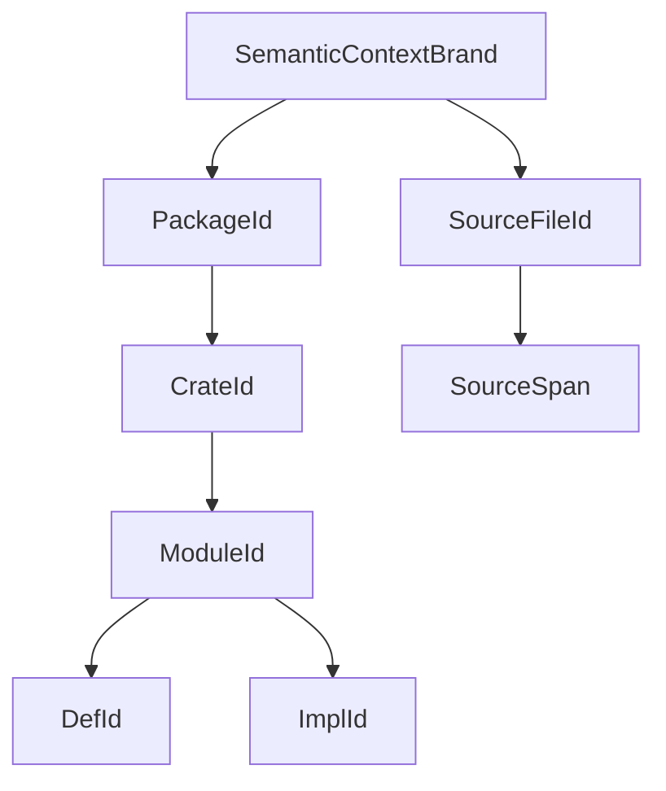

# RFC 0011: Semantic Identity Foundation

## Summary

This RFC defines the context branding and canonical identity hierarchy shared
by binding, type checking, cross-module compilation, IR, diagnostics, and
future artifact metadata. It separates process-local, non-serializable handle
safety from deterministic semantic keys:

- `SemanticContextBrand` proves that in-memory handles were issued by the same
  semantic context;
- canonical keys determine stable ordering and semantic fingerprints;
- `PackageId -> CrateId -> ModuleId -> DefId/ImplId` prevents collisions across
  packages, crate targets, modules, declarations, and implementations;
- `SourceFileId` and `SourceSpan` preserve provenance without source pointers.

This RFC does not define `CompilerSession`, binding facts, semantic type
payloads, module interfaces, or IR layers. Those contracts depend on this
foundation instead of depending on each other for identity.

## Motivation

The RFC 0008, RFC 0004, RFC 0005, and RFC 0010 dependency graph became cyclic
because package/module identity, binder definition identity, semantic type
identity, and verified interfaces were defined by consumers of one another.
The cycle also hid concrete correctness failures:

- a package may own multiple crate targets, so `ModuleId { PackageId,
  ModuleIndex }` is not unique;
- a crate target category differs from a library artifact `crate-type`;
- host and target compilation may use different target-dependent semantic and
  ABI rules;
- local numeric handles from independent contexts can compare equal;
- a deterministic fingerprint cannot serve as an in-process issuer brand;
- source addresses and insertion order cannot survive parallel scheduling or
  module interface publication.

One foundational identity RFC breaks the design cycle. RFC 0004 can define
binding over canonical module identities, RFC 0005 can brand semantic type
handles, RFC 0008 can assemble verified module interfaces, and RFC 0010 can
consume those identities without redefining them.

## Goals

- Define a process-local `SemanticContextBrand` distinct from deterministic
  fingerprints.
- Define canonical keys and context-bound IDs for packages, crate targets,
  modules, definitions, impls, and source files.
- Distinguish crate target category, artifact kind, compilation domain, target
  configuration, and target name.
- Guarantee deterministic allocation for the frozen package, crate, source,
  module, definition, and impl registries independent of registration order,
  worker count, object address, and hash-map iteration.
- Define source, nested-definition, and anonymous-definition disambiguation.
- Define validation and invariant behavior for foreign or malformed handles.
- Define crate identity for packages that contain multiple targets.
- Provide exact gates consumed by RFC 0004, RFC 0005, RFC 0008, and RFC 0010.

## Non-Goals

- This RFC does not define package dependency resolution.
- This RFC does not define `CompilerSession`, module discovery, imports,
  visibility, or module interfaces.
- This RFC defines only the context-brand and handle-safety contract consumed by
  `SemanticTypeId`. RFC 0005 owns `TypeData`, online semantic type interning,
  store construction, and slot allocation; semantic type slots are not stable
  or observable identities.
- This RFC does not define call targets, monomorphized instances, HIR, MIR, LIR,
  LLVM IR, or object artifacts.
- This RFC does not define persisted metadata encoding. Deterministic keys may
  support a later artifact RFC, but no serialized format is approved here.
- This RFC does not preserve table-local `SymbolId` or pointer identity.

## Prior Art

### Rust Stable Crate And Definition Identity

Rust distinguishes crate identity, crate-local definition paths, process-local
compiler IDs, and stable hashes used by incremental compilation. ZOM should
copy the hierarchy and the separation between a runtime handle and a stable
definition key.

References:

- <https://rustc-dev-guide.rust-lang.org/query-system/incremental-compilation-in-detail.html>
- <https://rustc-dev-guide.rust-lang.org/ty.html#the-key-types>

### LLVM Context Ownership

LLVM uniqued types and constants belong to one `LLVMContext`; values from
unrelated contexts are not interchangeable. ZOM should copy the explicit
context ownership rule while using value handles instead of raw context
pointers.

Reference: <https://llvm.org/doxygen/classllvm_1_1LLVMContext.html>

### MLIR Context And Storage Uniquing

MLIR stores uniqued types, attributes, and identifiers in an `MLIRContext` and
keeps dialect-local identities context-owned. ZOM should copy context-bound
uniquing and explicit verification at representation boundaries.

Reference: <https://mlir.llvm.org/docs/Tutorials/UnderstandingTheIRStructure/>

### Swift Module And Declaration Identity

Swift module serialization distinguishes module identity and declaration
identity from source spelling. ZOM should copy canonical declaration identity
plus separate source provenance.

Reference: <https://www.swift.org/documentation/swift-compiler/>

### Unicode And URL Canonicalization

Unicode Standard Annex 15 defines NFC, and Unicode Standard Annex 31 defines
the identifier profile consumed by the lexical specification. RFC 3986 defines
hierarchical URL syntax and dot-segment removal; RFC 5952 defines canonical
IPv6 text. ZOM uses these standards with a deliberately smaller, credential-free
`https`/`ssh` source URL domain.

References:

- <https://unicode.org/reports/tr15/>
- <https://unicode.org/reports/tr31/>
- <https://www.rfc-editor.org/rfc/rfc3986>
- <https://www.rfc-editor.org/rfc/rfc5952>

### Common Failure Modes

This design prevents three recurring failures:

1. Same-name or same-index declarations in different compilation roots
   collide. ZOM IDs include package, crate target, and module ancestry.
2. In-memory handles are treated as persistent fingerprints. ZOM uses a
   non-serializable context brand and separate deterministic keys.
3. Nested declarations and anonymous callable expressions can share source
   context or lack a declared spelling. ZOM definition keys use a structural
   definition path, a closed anonymous-name role, and deterministic source
   order without requiring a parent handle before the definition registry
   freezes.

## Guide-Level Explanation

Contributors use one hierarchy:



Two binary targets in one package have different `CrateId` values because
their target names differ. A library compiled for the host as a build
dependency and the same library compiled for the target have different
compilation configurations. Two definitions with the same name in different
modules have different `DefId` values even if their local ordinal is equal.

Debug dumps print canonical semantic keys, not context brands or local numeric
slots. A handle from another context is rejected before lookup.

## Reference-Level Design

### Context Brand And Fingerprint

`SemanticContextBrand` is an opaque value with a private constructor. One
semantic context creates one brand, and every in-memory semantic handle stores
that brand. The brand is process-local, non-deterministic, non-serializable,
and omitted from dumps.

`SemanticContextFactory` is the only constructor of
`SemanticContextBrand`. The process root owns one explicit factory and injects
it into every final-session and preparatory-context builder. The factory is not
a singleton. It issues thread-safe monotonically unique opaque 64-bit tokens,
never accepts caller-provided tokens, rejects exhaustion before wraparound, and
never reuses a token during the process lifetime. One semantic context owns one
`RegistryBrandIssuer` with the same rules for any store-local registries.

`ContextFingerprint` is a deterministic digest of canonical package and
crate dependency edges, package and crate compilation keys, source and module
keys, and immutable source contents. It is suitable for diagnostics and
in-memory revision validation. It is not an issuer capability, does not make
two live context handles interchangeable, and is not a persisted artifact
format.

APIs distinguish them by type. No conversion from fingerprint to brand exists.

The fingerprint byte stream is exactly:

```text
ASCII("zom.semantic-context")
0x00
EncodeSequence(sorted PackageKey values)
EncodeSequence(sorted PackageDependencyEdgeKey values)
EncodeSequence(sorted CrateKey values)
EncodeSequence(sorted CrateDependencyEdgeKey values)
EncodeSequence(sorted (SourceFileKey, Sha256Digest) source-content pairs)
EncodeSequence(sorted ModuleKey values)
```

The fingerprint is SHA-256 over that stream. Changing any canonical key shape,
tag allocation, field order, or semantic option replaces the domain, codec,
fixtures, and fingerprints together.

`CanonicalEncoder` is owned by this RFC and has one encoding rule per value:

| Value | Encoding |
|---|---|
| `uint8`, `uint32`, `uint64` | Fixed-width unsigned big-endian bytes |
| `bool` | `0x00` for false, `0x01` for true |
| `Sha256Digest` | Exactly 32 bytes, with no length prefix |
| byte string | `uint64` byte length followed by those bytes |
| text | NFC-normalized UTF-8 encoded as a byte string |
| sequence | `uint64` element count followed by element encodings |
| map | Sequence of key/value pairs sorted by encoded key bytes |
| optional | `0x00` for none; `0x01` followed by the value for some |
| closed enum or union | One RFC-assigned `uint8` tag followed by variant fields |

No platform ABI, object layout, pointer value, local handle slot, hash-table
order, credential, or presentation-only spelling enters a canonical stream.
The normative tag and field-order tables are defined with the corresponding
closed values below. `CanonicalEncoder` rejects unknown tags and non-canonical
text rather than normalizing after a key has been admitted.

### Canonical Scalar Domains

Canonical keys never contain an untyped `Name` or `CanonicalName`. Each text
field uses one of the following strong scalar domains, and each domain has one
validating constructor and one canonical encoding:

| Type | Accepted source domain | Canonical value and encoding |
|---|---|---|
| `CanonicalPathSegment` | Valid UTF-8; non-empty; no NUL, `/`, or `\\`; not `.` or `..` | NFC-normalized, case-preserving text |
| `PackageName` | `^[a-z][a-z0-9_]{0,63}$` | Exact lowercase ASCII text |
| `TargetName` | `^[a-z][a-z0-9_]{0,63}$` and not a reserved keyword | Exact lowercase ASCII text |
| `DependencyAlias` | `^[a-z][a-z0-9_]{0,63}$` and not a reserved keyword | Exact lowercase ASCII text |
| `FeatureName` | `^[a-z][a-z0-9_-]{0,63}$` | Exact lowercase ASCII text |
| `TargetComponentName` | `^[a-z0-9][a-z0-9_.-]{0,63}$` | Exact lowercase ASCII text; unavailable components use the literal `unknown` |
| `TargetFeatureName` | `^[a-z0-9][a-z0-9_.-]{0,63}$` | Exact lowercase ASCII text |
| `SemanticEnvironmentName` | `^[A-Z_][A-Z0-9_]{0,127}$` | Exact uppercase ASCII text |
| `SemanticIdentifier` | One decoded ZOM `IdentifierName` that is not classified as a reserved keyword | NFC-normalized UTF-8 text |
| `ModulePathSegment` | One `SemanticIdentifier` | A distinct strong type encoded as its canonical identifier text |
| `DeclaredDefinitionName` | One `SemanticIdentifier`, the exact receiver spelling `this`, or the exact declaration spellings `init`, `deinit`, `get`, and `set` | Canonical identifier text or the admitted exact ASCII spelling |

`ResolvedVersion` is a distinct strong type containing one valid Semantic
Versioning 2.0.0 value. It rejects a leading `v`, whitespace, missing core
components, and numeric identifiers with forbidden leading zeroes. Its
canonical text preserves the case-sensitive prerelease and build identifiers.
Build metadata participates in `PackageKey` identity even though SemVer ordering
ignores it. Canonical encoding is that complete validated text.

`SortedFeatureSet` is a sorted unique sequence of `FeatureName` values.
`SortedSet<TargetFeatureName>` and every sorted scalar map use the same rule:
compare canonical encoded bytes, reject duplicate keys, and never use locale or
insertion order.

Source-derived identifiers and already-admitted canonical key values have
different boundaries. The lexer retains original source bytes for diagnostics,
while semantic-name construction NFC-normalizes the decoded identifier before
binding or identity inventory. Canonically equivalent spellings therefore name
the same declaration and duplicate-name diagnostics retain both original source
ranges. `CanonicalEncoder` receives only the normalized strong value and treats
a non-NFC value as `NonCanonicalEncoding`; it never rejects otherwise legal
source merely because its original spelling was decomposed. The implementation
slice must update the lexical specification, interning path, and normalization
tests atomically before identity registries replace the current symbol table.

An NFC-equivalent spelling collision is a source-program redeclaration, never
`ZOM9921 IdentityNonCanonicalEncoding` or
`ZOM9916 IdentityDuplicateCanonicalKey`. The binder emits the declaration-kind
specific `ZOM3003` through `ZOM3009`, or `ZOM3010 DuplicateIdentifier` for a
kind without a more specific code, at the later declaration's original source
range. It attaches `ZOM3017 PreviousDeclarationHere` as a `Note` at the first
declaration's original source range. Canonical source order selects that first
declaration, so worker count and input registration order cannot change the
primary or note. RFC 0004 owns this diagnostic pair and its implementation.

### Context-Bound Handle Shape

Every identity uses a closed value type:

```text
ContextHandle<Tag> {
  brand: SemanticContextBrand,
  slot: uint32,
}
```

Constructors are private to the owning registry. Equality requires both the
same tag and brand and then compares the slot. Lookup first validates the brand
and range. Numeric slots are never printed, persisted, used as cache keys, or
compared across contexts.

RFC 0011 identity tags have exactly one registry per semantic context. A
consumer that permits multiple stores for one handle tag must instead use:

```text
StoreHandle<Tag> {
  context: SemanticContextBrand,
  issuer: RegistryBrand,
  slot: uint32,
}
```

`RegistryBrand` has the same process-lifetime non-reuse and non-serialization
rules as `SemanticContextBrand`. A consumer may replace it with a canonical
owner handle such as `ModuleId` when that owner uniquely identifies the store.
Default-constructed handles are invalid. Lookup rejects an invalid handle,
foreign issuer, foreign context, and slot overflow through structured invariant
diagnostics.

The final semantic context owns exactly one `SemanticTypeStore`.
`SemanticTypeId` is therefore a `ContextHandle<SemanticTypeTag>` and does not
carry a `RegistryBrand`. Creating a second semantic type store in the same
context is an invariant failure. RFC 0005 may allocate semantic types online;
the numeric `SemanticTypeId` slot is deliberately excluded from deterministic
allocation, ordering, dumps, fingerprints, and test oracles. Store-local
substitution, witness, MIR, and LIR handles use `StoreHandle` when their owner
permits more than one issuing store.

### Package Identity

`PackageKey` contains:

```text
PackageKey {
  source: CanonicalPackageSource,
  name: PackageName,
  version: ResolvedVersion,
  enabledFeatures: SortedFeatureSet,
}
```

Path values are distinct by containment domain:

```text
CanonicalRelativePath {
  segments: [CanonicalPathSegment],
}

CanonicalWorkspaceRelativePath {
  leadingParentCount: uint32,
  segments: [CanonicalPathSegment],
}
```

Both forms use NFC-normalized, case-preserving, non-empty segments and contain
no literal dot or parent segment. `CanonicalRelativePath` is confined to its
own package or generated-source root. A local package outside the workspace is
represented by `CanonicalWorkspaceRelativePath.leadingParentCount`; it is never
encoded with a literal `..` segment.

`CanonicalPackageSource` is a closed union:

```text
CanonicalPackageSource =
  Registry { registry: RegistryIdentity }
  Vcs { repository: CanonicalUrl, revision: VcsRevision, subdirectory: CanonicalRelativePath }
  LocalPath { canonicalPath: CanonicalWorkspaceRelativePath }
```

The union tags are `Registry = 0x01`, `Vcs = 0x02`, and
`LocalPath = 0x03`; fields encode in the order shown. `RegistryIdentity` is
exactly `{ indexUrl: CanonicalUrl, trustDomain: Sha256Digest }`. A registry URL
therefore has one source of truth. Local registry aliases, mirrors,
credentials, tokens, fragments, and cache paths never enter the key.

`CanonicalUrl` is an absolute hierarchical RFC 3986 URL restricted to `https`
and `ssh`. It has exactly one executable normalization algorithm:

1. Require `scheme://authority/path`; reject opaque URLs, relative references,
   empty hosts, user information, queries, and fragments. Credentials and
   tokens are separate operational inputs and are never stripped into an
   identity alias.
2. Lowercase the ASCII scheme and host. A DNS host contains only valid ASCII
   labels, removes one terminal root dot, and rejects non-ASCII input; an IPv4
   host uses canonical dotted decimal and an IPv6 host uses RFC 5952 text in
   brackets.
3. Remove port `443` for `https` and port `22` for `ssh`; retain any other
   validated decimal port in `1..65535` without leading zeroes.
4. Validate every percent triplet. Within each literal `/`-delimited segment,
   decode unreserved ASCII and percent-encoded non-ASCII UTF-8, validate and
   NFC-normalize the Unicode text, then percent-encode every byte outside the
   RFC 3986 unreserved set with uppercase hex. Percent-encoded reserved ASCII,
   including `%2F`, remains encoded and distinct from its literal delimiter.
5. After step 4 has decoded `%2E` to `.`, treat an empty path as `/`, apply RFC
   3986 dot-segment removal to the normalized segment sequence, and preserve a
   meaningful trailing slash. Applying all five steps to an already canonical
   result must return byte-identical text.

The following vectors are normative:

| Input | Result |
|---|---|
| `HTTPS://EXAMPLE.COM:443/a/./b/../c/%7euser` | `https://example.com/a/c/~user` |
| `ssh://example.com:22/repo/` | `ssh://example.com/repo/` |
| `https://example.com/a/%2e/b` | `https://example.com/a/b` |
| `https://example.com/a/%2e%2e/b` | `https://example.com/b` |
| `https://example.com/a/%252e%252e/b` | `https://example.com/a/%252e%252e/b` |
| `https://example.com/index?access_token=x` | reject |
| `https://user@example.com/index` | reject |
| `https://example.com/index#mirror` | reject |

Each accepted result in this table is also an idempotence vector: canonicalizing
the result again must produce the same byte sequence.

`VcsRevision` is `{ algorithm: Sha1 | Sha256, digest }`, tagged
`0x01` or `0x02`, with exactly 20 or 32 digest bytes. Branch and tag names are
resolver inputs and never replace the immutable revision. Canonical relative
paths encode their segment sequence in declaration order.

`LocalPath` covers both workspace members and manifest `path` dependencies.
The path is computed after symlink resolution relative to the workspace root.
Host separators, dot segments, Unicode spelling, and filesystem spelling are
normalized before `leadingParentCount` and the remaining segments are recorded.
Canonical local-path components preserve their NFC-normalized case and compare
case-sensitively; no case folding enters `PackageKey`, `SourceOriginKey`, or
`ModuleKey`. On a case-insensitive host, two filesystem entries whose preserved
canonical spellings collide are rejected during source materialization. Host
absolute path spelling is not encoded.

`TargetName` and `DependencyAlias` remain distinct despite sharing the scalar
domain above. Both can explicitly construct one `ModulePathSegment`; neither
implicitly converts to the other.

Dependency topology participates directly in semantic identity:

```text
DependencyDomain = Target | Development | Build

PackageDependencyEdgeKey {
  consumer: PackageKey,
  alias: DependencyAlias,
  domain: DependencyDomain,
  provider: PackageKey,
}

CrateDependencyEdgeKey {
  packageEdge: PackageDependencyEdgeKey,
  consumer: CrateKey,
  provider: CrateKey,
}
```

`DependencyDomain` tags are `Target = 0x01`, `Development = 0x02`, and
`Build = 0x03`. Fields encode in declaration order. RFC 0012 produces the
complete immutable package-edge set, including the resolved dependency alias.
RFC 0008 target selection expands it into the exact crate-edge set used by the
final semantic context. Embedding the complete package edge preserves alias,
domain, consumer package, and provider package provenance in every expanded
edge. Display package names and traversal order never replace these edge keys.

`PackageId` is the context-bound handle assigned after all `PackageKey` values
are sorted lexicographically by their canonical encoding.

### Crate Target Identity

`CrateTargetKind` is a closed semantic target-category enum:

```text
CrateTargetKind =
  Library
  Binary
  Test
  Benchmark
  Example
  BuildScript
```

This enum is not `[lib].crate-type`. Artifact kinds such as an rlib, static
library, dynamic library, or C-compatible library are output choices for one
library crate target and do not identify the source compilation root.

`CompilationDomain` is `Host = 0x01` or `Target = 0x02`.
`Endianness` is `Little = 0x01` or `Big = 0x02`.

```text
CanonicalTargetSpecificationKey {
  architecture: TargetComponentName,
  vendor: TargetComponentName,
  operatingSystem: TargetComponentName,
  environment: TargetComponentName,
  abi: TargetComponentName,
  pointerWidth: uint32,
  endianness: Endianness,
  semanticFeatures: SortedSet<TargetFeatureName>,
}

SemanticCompilerOptionsKey {
  editionYear: uint32,
  useUnicode: bool,
  allowDollarIdentifiers: bool,
  supportRegexLiterals: bool,
}

CompilationConfigKey {
  domain: CompilationDomain,
  target: CanonicalTargetSpecificationKey,
  semanticOptions: SemanticCompilerOptionsKey,
  buildScriptOutput: Maybe<BuildScriptOutputKey>,
}
```

Fields encode in the order shown. Target-name components are lowercase ASCII
canonical names. `pointerWidth` must be nonzero and divisible by eight.
`semanticFeatures` contains only target features that change source-visible
types, ABI eligibility, or semantic diagnostics. `SemanticCompilerOptionsKey`
exhaustively mirrors the live `LangOptions` semantic surface plus the edition;
adding or removing a semantic option requires changing this closed value and
the fingerprint domain. Diagnostic presentation limits, output paths,
optimization level, and debug information are excluded.

`BuildScriptOutputKey` is a 32-byte SHA-256 digest, not a handle. Its input is:

```text
PreparatoryBuildScriptKey {
  package: PackageKey,
  targetName: TargetName,
  hostTarget: CanonicalTargetSpecificationKey,
  semanticOptions: SemanticCompilerOptionsKey,
  buildDependencies: SortedSequence<PackageKey>,
}

BuildScriptOutputRecord {
  preparatoryKey: PreparatoryBuildScriptKey,
  sourceDigests: SortedMap<CanonicalRelativePath, Sha256Digest>,
  declaredEnvironment: SortedMap<SemanticEnvironmentName, ByteString>,
  generatedSources: SortedMap<CanonicalRelativePath, Sha256Digest>,
  exportedSemanticEnvironment: SortedMap<SemanticEnvironmentName, ByteString>,
}
```

The key is SHA-256 over `ASCII("zom.build-script-output")`, one zero byte,
and the canonical encoding of `BuildScriptOutputRecord`. The build-script crate
itself uses `buildScriptOutput = none`; final ordinary crate keys contain the
matching output key when the package declares a build script. No partial
`CrateKey` form exists.

`CrateKey` contains:

```text
CrateKey {
  package: PackageId,
  kind: CrateTargetKind,
  targetName: TargetName,
  compilation: CompilationConfigKey,
}
```

`CrateId` is assigned by canonical `CrateKey` order. Canonical encoding expands
the parent `PackageId` to its `PackageKey`; it never encodes the package's local
numeric slot. Target name distinguishes multiple binaries, tests, benchmarks,
and examples of the same kind. Host and target configurations remain distinct
when their target or semantic option keys differ.

`CrateTargetKind` tags in declaration order are `0x01` through `0x06`.
`CrateKey` encodes expanded `PackageKey`, target-kind tag, target name, then
`CompilationConfigKey`. `PackageKey` encodes package-source variant, package
name, normalized semantic version text, then the sorted feature-name sequence.

### Module Identity

RFC 0008 owns source discovery, duplicate selection, dependency construction,
and termination. Before identity handles exist, it supplies each selected
module as a structural identity input:

```text
SelectedModuleIdentityInput {
  crate: CrateKey,
  canonicalPath: [ModulePathSegment],
  source: SourceFileKey,
  declarationAnchor: Maybe<UnbrandedSourceRange>,
}
```

Only selected inputs receive `ModuleId` or contribute module keys to the
`ContextFingerprint`. Rejected duplicates are RFC 0008 diagnostic
facts and do not enter an RFC 0011 identity registry.

The parser preserves every accepted leading module form before discovery:

```text
ParsedModuleDeclaration {
  form: RootDeclaration | InlineRoot | Alias,
  declaredName: SemanticIdentifier,
  aliasTarget: Maybe<[ModulePathSegment]>,
  inlineItems: [AstNodeId],
  exportedAlias: bool,
  sourceRange: UnbrandedSourceRange,
}
```

`RootDeclaration` is the semicolon form. `InlineRoot` supplies the current
source module's items and does not create a child module. `Alias` requires an
alias target and may be exported. No accepted module-declaration token may be
discarded before RFC 0008 consumes this record.

RFC 0008 selects the source module path from the target root or resolved module
request. Root and inline-root names must equal that path's final segment and
their complete declaration range becomes `declarationAnchor`. An alias does not
select or rename the source module: it creates one `DefId(ModuleAlias)`, creates
no `ModuleId`, and contributes no `declarationAnchor` to the current source
module. Its export bit belongs to the alias definition's export surface.

The canonical identity rules are owned by this RFC. RFC 0008 defines the
discovery algorithm but does not define identity, and RFC 0012 defines package
and resolver inputs. Parsing operates on source buffers and structural inputs;
it does not require `ModuleId`.

`ModuleKey` is the frozen canonical form:

```text
ModuleKey {
  crate: CrateId,
  canonicalPath: [ModulePathSegment],
  source: SourceFileId,
  declarationAnchor: Maybe<SourceSpan>,
}
```

Its canonical encoding expands `CrateKey` and `SourceFileKey`, not local slots.
The leading root and inline-root forms validate the already selected canonical
path for the current source module. The inline form does not create a child
module or require a parent `ModuleId` while keys are being collected.

`ModuleId` is issued by the single module registry of one semantic context.
After all selected `ModuleKey` values from every crate in that context are
collected, the registry sorts them globally by canonical encoded bytes and
assigns context-unique slots. Slots never restart per crate. Module-key
encoding expands `CrateId` to `CrateKey`, never to a local numeric slot. Module
containment and import-dependency edges do not affect identity allocation.

`ModuleKey` field order is expanded crate key, module-path sequence, expanded
source-file key, then optional declaration span. `ModulePathSegment` is one
canonical non-empty name. The registry rejects two selected records with equal
encoded keys.

### Definition And Impl Identity

`DefinitionKind` is closed:

```text
DefinitionKind =
  ModuleAlias | Function | Method | Constructor | Destructor
  Class | Struct | Interface | Enum | Error | TypeAlias | AssociatedType
  Field | EnumVariant | Parameter | TypeParameter
  Constant | Static | Local | PatternBinding | Closure
  ImportAlias | ReexportAlias
```

The tags are `0x01` through `0x17` in declaration order. Marker classification
is a checked fact on an `Interface` definition, not a separate definition kind.
Primitive semantic types are owned by the RFC 0005 `SemanticTypeStore`; they do
not receive a source-backed `DefId`.

`DefinitionKey` and `ImplKey` are raw 32-byte SHA-256 digests of complete
canonical identity records. The registry retains each digest with its complete
record; equal digest bytes with unequal records are an invariant collision
before handle admission.

```text
EnclosingStableOwnerKey =
  DefinitionOwner(DefinitionKey) = 0x01
  | ImplementationOwner(ImplKey) = 0x02

DefinitionIdentityRecord {
  module: ModuleKey,
  owners: Sequence<EnclosingStableOwnerKey>,
  kind: DefinitionKind,
  namespace: Value | Type | Module,
  name: NfcDeclaredName,
  overloadHeader: Maybe<OverloadHeaderDigest>,
}

ImplIdentityRecord {
  module: ModuleKey,
  owners: Sequence<EnclosingStableOwnerKey>,
  genericParameters: Sequence<CanonicalGenericParameter>,
  polarity: Positive | Negative,
  safety: Safe | Unsafe,
  interface: CanonicalTraitReference,
  selfType: CanonicalHeaderTypeSyntax,
  obligations: SortedUniqueSequence<CanonicalBoundObligation>,
}
```

An owner element encodes as its one-byte tag followed by the referenced key's
raw 32-byte digest. Owner sequences run from outermost to innermost and are
validated against retained records for the same stable `ModuleKey`; skipped
prefixes, unknown or repeated owners, unequal collision records, self-owners,
and cycles are invariants. A named member declared directly inside an
implementation appends `ImplementationOwner(theImplKey)` to that
implementation's owner sequence.

`DefinitionIdentityRecord` admits NFC-declared stable names only. Value
definitions are `Function`, `Method`, `Constructor`, `Destructor`, `Field`,
`EnumVariant`, `Constant`, and `Static`; type definitions are `Class`, `Struct`,
`Interface`, `Enum`, `Error`, `TypeAlias`, and `AssociatedType`; the module
namespace admits `ModuleAlias`. `Parameter`, `TypeParameter`, `Local`,
`PatternBinding`, `Closure`, `ImportAlias`, and `ReexportAlias` never enter a
`DefinitionIdentityRecord`. RFC 0018 subordinate parameter keys and RFC 0017
semantic import binding keys provide their stable semantic identities where
applicable. Owner-local and anonymous syntax remains revision-local within the
nearest stable named-item query.

`DefinitionKey` is exactly:

```text
SHA-256(
  ASCII("zom.named-item-header")
  || 0x00
  || Encode(DefinitionIdentityRecord)
)
```

`ImplKey` is exactly:

```text
SHA-256(
  ASCII("zom.impl-header")
  || 0x00
  || Encode(ImplIdentityRecord)
)
```

RFC 0018 defines the complete overload-header, structural type, generic,
obligation, polarity, safety, and trait-reference schemas used by these records.
Bodies, source provenance, parser handles, traversal order, current resolution
results, and presentation text never encode. A definition collision group gives
only its first canonical source occurrence a `DefId`. Every byte-identical
implementation record group admits one shared `ImplId` authority and assigns a
revision-local `ImplOccurrenceId` to every source occurrence. Source conflict
is decided only among successfully classified RFC 0015 ordinary or marker
survivors.

Only semantic definitions that participate in binding, type identity, or
interface publication receive `DefId` or `ImplId`. IR blocks, temporaries,
drop flags, monomorphized instances, and backend symbols use identities owned by
their respective RFCs. Any syntax expansion that introduces a semantic
definition must first amend this RFC and finish before the definition registry
freezes. The current compiler has no prebinding producer of compiler-generated
semantic definitions. Adding one requires a real producer, `DefinitionKind`,
name key, structural parent, source anchor, and deterministic ordinal before
implementation. Binder-created semantic declarations are not part of this
contract; no current phase may inject them after inventory freeze.

The declaration inventory is exhaustive over the current AST schema:

| Producer | Identity rule |
|---|---|
| `ModuleDeclaration` root or inline form | `ModuleId`; no `DefId` |
| alias `ModuleDeclaration` | `DefId(ModuleAlias, Declared)` |
| `FunctionDecl`, `ExternDecl` | `DefId(Function, Declared)` |
| `MethodDecl` | `DefId(Method, Declared)` |
| `ConstructorDecl` | `DefId(Constructor, Declared)` |
| `DestructorDecl` | `DefId(Destructor, Declared)` |
| `ClassDecl` | `DefId(Class, Declared)` |
| `StructDecl` | `DefId(Struct, Declared)` |
| `InterfaceDecl` | `DefId(Interface, Declared)` |
| `EnumDeclaration` | `DefId(Enum, Declared)` |
| `UnitVariant`, `TupleVariant` | `DefId(EnumVariant, Declared)` |
| `AliasDecl` | `DefId(TypeAlias, Declared)` |
| `ErrorDecl` | `DefId(Error, Declared)` |
| `AssociatedTypeDecl` | `DefId(AssociatedType, Declared)` |
| `FieldDecl` | `DefId(Field, Declared)` |
| `ClassConstDecl` | `DefId(Constant, Declared)` |
| `FunctionParameterDecl` | RFC 0018 `CallableParameterKey`; no named `DefinitionKey` |
| `GenericTypeParam` | RFC 0018 `GenericParameterKey`; no named `DefinitionKey` |
| `ExternVarDecl` | `DefId(Static, Declared)` |
| `VariableDeclarator` container | No identity; each introduced binding owns one `DefId` |
| binding under module-scope `LetStmt(Const)` | `DefId(Constant, Declared)` per introduced name |
| binding under module-scope `LetStmt(Let | Mut)` | `DefId(Static, Declared)` per introduced name |
| binding under block-scope `LetStmt(Let | Mut | Const)` | RFC 0017 owner-local binding key; no stable `DefinitionKey` |
| binding pattern introduced by match, loop, or another pattern-only scope | RFC 0017 owner-local binding key; no stable `DefinitionKey` |
| `FunctionExpression`, `LambdaExpression` | RFC 0017 owner-local syntax identity; no stable `DefinitionKey` |
| `ImportDeclaration` namespace binding or `ImportSpecifier` | RFC 0017 `ImportBindingKey`; no named `DefinitionKey` |
| re-exporting `ExportDeclaration` or `ExportSpecifier` | RFC 0017 `ImportBindingKey`; no named `DefinitionKey` |
| `StandaloneImplDecl`, `MarkerImpl` | one shared `ImplId` authority per equal identity group and one `ImplOccurrenceId` per source occurrence; no `DefId` for the impl block |
| `ExternBlock`, declaration-list containers, attributes | No semantic identity; consumers may not treat them as definitions |

Unnamed types in a structural function type, such as `(i32, str) -> i32`, are
type components rather than parameter declarations. They produce no
`FunctionParameterDecl` and receive no `DefId`.

The architecture gate compares schema entries with live parser, binder, and
expansion construction paths; it fails when a declaration-bearing kind has no
row or a row has no producer. Any future expansion capable of producing an
import, re-export, module declaration, source origin, package edge, crate
target, definition, or impl must first extend this closed inventory and finish
before the owning registry freezes. Post-freeze normalization is structurally
incapable of producing those entities.

### Source Identity And Provenance

`SourceOriginKey` is closed:

```text
SourceOriginKey =
  LocalFile { canonicalPath: CanonicalWorkspaceRelativePath }
  RegistryFile { package: PackageKey, path: CanonicalRelativePath }
  VcsFile { package: PackageKey, path: CanonicalRelativePath }
  GeneratedFile { buildScriptOutput: BuildScriptOutputKey,
                  logicalPath: CanonicalRelativePath,
                  contentDigest: Sha256Digest }
```

The tags are `0x01` through `0x04` in declaration order and fields encode in
the order shown. A generated file is owned by the surrounding `SourceFileKey`'s
expanded `CrateKey`; the applied build-script output key is therefore a closed,
pre-source-freeze producer identity. Additional generated-source producer kinds
require an RFC 0011 union extension.

`SourceFileKey` contains the owning `CrateKey` and one `SourceOriginKey`. It
does not contain a
`ModuleId` or `ModuleKey`: source identity freezes before module keys and must
not depend on a handle issued by the later registry. `SourceFileId` is
context-bound and assigned in canonical key order.

Before `SourceFileId` is issued, diagnostics and parsed structural records use
a closed source-qualified range:

```text
UnbrandedSourceRange {
  source: SourceFileKey,
  contentDigest: Sha256Digest,
  byteStart: uint64,
  byteEnd: uint64,
}
```

The range validates `byteStart <= byteEnd`, buffer bounds, and an exact content
digest match against the immutable source snapshot selected by `SourceFileKey`.
It never relies on ambient current-buffer state or a process-local `BufferId`.

`SourceSpan { SourceFileId, byteStart, byteEnd }` uses half-open byte offsets.
It validates `byteStart <= byteEnd` and containment in the immutable source
buffer. Generated provenance uses an explicit source-origin chain and never
overloads a physical file identity.

Whenever a canonical module or definition key contains `SourceFileId` or
`SourceSpan`, its canonical encoding expands the referenced `SourceFileKey` and
byte offsets. The local source-file slot is never encoded.

The canonical field order is normative:

| Value | Field order |
|---|---|
| `PackageKey` | package-source variant, package name, normalized semantic version text, sorted feature sequence |
| `PackageDependencyEdgeKey` | consumer `PackageKey`, dependency alias, dependency-domain tag, provider `PackageKey` |
| `CrateKey` | expanded `PackageKey`, target-kind tag, target name, `CompilationConfigKey` |
| `CrateDependencyEdgeKey` | expanded `PackageDependencyEdgeKey`, expanded consumer `CrateKey`, expanded provider `CrateKey` |
| `CompilationConfigKey` | domain tag, target specification, semantic options, optional build-script output |
| `SourceOriginKey` | variant tag followed by the fields shown in its declaration |
| `SourceFileKey` | expanded `CrateKey`, then `SourceOriginKey` |
| `SourceSpan` | expanded `SourceFileKey`, `byteStart`, `byteEnd` |
| `ModuleKey` | expanded `CrateKey`, path sequence, expanded `SourceFileKey`, optional expanded declaration span |
| `EnclosingStableOwnerKey` | one-byte owner tag, referenced raw 32-byte digest |
| `DefinitionIdentityRecord` | expanded stable `ModuleKey`, owner sequence, definition-kind tag, namespace tag, NFC declared name, optional overload-header digest |
| `ImplIdentityRecord` | expanded stable `ModuleKey`, owner sequence, generic parameters, polarity, safety, canonical trait reference, self-type syntax, sorted-unique obligations |
| `DefinitionKey` | SHA-256 of `zom.named-item-header`, NUL, and the complete definition record |
| `ImplKey` | SHA-256 of `zom.impl-header`, NUL, and the complete implementation record |

These fixed codec vectors are independent implementation oracles:

| Input | Encoded hex | SHA-256 |
|---|---|---|
| canonical text `A` | `000000000000000141` | `ead76f8e70b5dd3b1a07a92c25c425b2b27198728862103d65c31c621e52a6aa` |
| empty sequence | `0000000000000000` | `af5570f5a1810b7af78caf4bc70a660f0df51e42baf91d4de5b2328de0e83dfc` |
| local package `a@0.0.0` at workspace root with no features | `030000000000000000000000000000000000000001610000000000000005302e302e300000000000000000` | `b0c7b4f55c7faf6d4522b3a6f81e979347436c782d29ad2eeaa09985479d40a6` |
| target dependency edge from that package through alias `dep` to the same key with package name `b` | `030000000000000000000000000000000000000001610000000000000005302e302e300000000000000000000000000000000364657001030000000000000000000000000000000000000001620000000000000005302e302e300000000000000000` | `b4a6fdda29af9e3c0b0d6a21b062aa94be3315bc47bde3f432d46e85766b2751` |
| fingerprint domain plus six empty sequences | ASCII `zom.semantic-context`, `00`, then 48 zero bytes | `aa36edfdf536f061cd028efd3cfe5003474aee9aa3ab39f294d3b42a95eaae5e` |

The final row is a codec fixture, not a valid empty compilation context. A
second fingerprint fixture contains the sorted packages `a` and `b` from the
rows above, the one `a --dep/Target--> b` edge above, and empty crate,
crate-edge, source-content, and module sequences. The complete fingerprint
input is 256 bytes and its SHA-256 is
`20d2a8ab26a6a17066de900f472dab2e6222c949c6b01da507753822bc116eac`.

The full composite-key fixture extends package `a` as follows:

- `CrateKey`: `Library`, target name `lib`, `Target` domain; target fields
  `x/v/o/e/a`, pointer width 64, little endian, no semantic features; edition
  2026, Unicode enabled, dollar identifiers and regex literals disabled; build
  output digest is 32 bytes of `0x11`;
- `SourceFileKey`: `GeneratedFile`, the same output digest, logical path
  `g.zom`, and a content digest of 32 bytes of `0x22`;
- `ModuleKey`: path `m` and no declaration anchor;
- `DefinitionKey` and `ImplKey` vectors are the RFC 0018 canonical record and
  digest fixtures; they do not reuse the source-bearing composite fixture.

The stage byte lengths and SHA-256 values are normative independent oracles:

| Stage | Encoded bytes | SHA-256 |
|---|---:|---|
| `PackageKey` | 43 | `b0c7b4f55c7faf6d4522b3a6f81e979347436c782d29ad2eeaa09985479d40a6` |
| `CrateKey` | 154 | `136b0e54d7750bc21ab3e1b5f7cd1f6046fa8f5bafab919c391444a869a6c537` |
| `CrateDependencyEdgeKey` | 406 | `64fcca3d969d5d52c170d40a8a8db32005853856b61087719d003799c2c387a5` |
| `SourceFileKey` | 240 | `f4198087783111e14911a0f550962f5c010ea2609edfdca47152907d74969102` |
| `ModuleKey` | 412 | `8ef9b8baabd646bf1a4640a8bd70af16e93bbe979229c21342cbebd0c429b91b` |

The crate-edge fixture expands the package edge `a --dep/Target--> b` from the
earlier table, uses the composite `CrateKey` above as its consumer, and uses the
same crate configuration with package name `b` as its provider. It therefore
proves that crate-edge encoding preserves the complete package edge before the
consumer and provider crate keys.

### Allocation Phases

Identity allocation is staged so consumers never observe insertion-order IDs:

1. Package resolution produces canonical `PackageKey` records without issuing
   semantic handles.
2. Every build-script crate is compiled in a separate preparatory host
   `SemanticContext`. The driver executes it and freezes a canonical
   `BuildScriptOutputKey`; no handle crosses from the preparatory context.
3. The driver creates the final closed semantic context. It collects and
   freezes `PackageKey` and final `CrateKey` values using build-script generated
   source and semantic environment outputs inside `CompilationConfigKey`.
4. RFC 0008 completes source and module discovery and supplies selected
   `SelectedModuleIdentityInput` values. RFC 0011 then freezes `SourceFileKey`
   followed by `ModuleKey`; canonical module source origins expand frozen
   `SourceFileKey` values rather than local slots.
5. Prebinding syntax normalization finishes, then a definition inventory walks
   every declaration-bearing AST node, retains complete identity records,
   validates digest collisions and owner prefixes, groups equal records, and
   freezes every stable `DefinitionKey` and `ImplKey`. Implementation grouping
   admits one authority and then allocates every revision-local occurrence.
6. Binding, checking, module interfaces, and IR consume only frozen handles.

Adding a package, crate, module, definition, or impl after its registry freezes
is an invariant failure. Incremental or generated-source changes create a new
semantic context.

A final context is therefore closed over one complete semantic compilation
graph, not over every preparatory compilation performed by a workspace command.
The driver may own several contexts, but semantic handles are never compared or
shared across them.

### Deterministic Ordering

Canonical encodings define a total bytewise order for every key. A child record
encodes its owner's stable digest, never the owner's local numeric slot. Lists
and dumps use semantic keys followed by complete revision-local source site keys
only where occurrence ordering is required. Semantic import and re-export
binding slots retain their own stable keys; their canonical target is a
separate value and never substitutes as the ordering key.

Post-freeze semantic diagnostics sort by expanded package key, crate key,
module key, primary source span, diagnostic ID, and deterministic emitter
ordinal assigned by schema preorder or verified IR traversal. Wall-clock order
and global mutable sequence counters are forbidden.

### Validation And Failure Model

Every registry and verifier checks:

- handle tag and context brand;
- slot range;
- ancestor consistency, including package in crate, crate in module, and module
  in definition or impl;
- source range ownership and bounds;
- canonical key uniqueness;
- closed enum validity;
- frozen-registry state.

Brand exhaustion, a second context-global semantic type store, and a
non-canonical encoder input are also invariants. User errors such as duplicate
definitions are diagnosed by the owning semantic phase; they may still receive
distinct deterministic definition keys so recovery facts remain unambiguous.

Registries and verifiers return facts and never depend on `DiagnosticEngine`:

```text
IdentityAllocationPhase =
  Context | Registry | Encoding | Package | Crate | Source | Module
  Definition | Impl | SemanticType

IdentityInvariantKind =
  InvalidHandle
  ForeignContext
  ForeignRegistry
  SlotOutOfRange
  AncestorMismatch
  InvalidSourceRange
  DuplicateCanonicalKey
  InvalidClosedValue
  PostFreezeMutation
  BrandExhausted
  DuplicateSingletonStore
  NonCanonicalEncoding

IdentityApiSite =
  ContextBrandIssue | RegistryBrandIssue | CanonicalEncode
  PackageFreeze | CrateFreeze | SourceFreeze | ModuleFreeze
  DefinitionFreeze | ImplFreeze | SemanticTypeStoreCreate
  HandleLookup | RegistryMutation

IdentityInvariant {
  kind: IdentityInvariantKind,
  phase: IdentityAllocationPhase,
  structuralInputKey: Maybe<CanonicalByteString>,
  diagnosticRange: Maybe<UnbrandedSourceRange>,
  apiSite: IdentityApiSite,
  inputTraversalOrdinal: uint32,
}
```

Phase tags are `0x01` through `0x0a`; invariant-kind tags are `0x01` through
`0x0c`; API-site tags are `0x01` through `0x0c`, all in declaration order. The
diagnostic mapping is exact:

| Kind | Diagnostic | Severity | Registered headline | Location policy |
|---|---|---|---|---|
| `InvalidHandle` | `ZOM9910 IdentityInvalidHandle` | fatal | `Internal semantic identity handle is invalid` | validated range or none |
| `ForeignContext` | `ZOM9911 IdentityForeignContext` | fatal | `Semantic identity handle belongs to another context` | validated range or none |
| `ForeignRegistry` | `ZOM9912 IdentityForeignRegistry` | fatal | `Semantic identity handle belongs to another registry` | validated range or none |
| `SlotOutOfRange` | `ZOM9913 IdentitySlotOutOfRange` | fatal | `Semantic identity handle slot is out of range` | validated range or none |
| `AncestorMismatch` | `ZOM9914 IdentityAncestorMismatch` | fatal | `Semantic identity ancestry is inconsistent` | validated range or none |
| `InvalidSourceRange` | `ZOM9915 IdentityInvalidSourceRange` | fatal | `Semantic identity source range is invalid` | validated range or none |
| `DuplicateCanonicalKey` | `ZOM9916 IdentityDuplicateCanonicalKey` | fatal | `Semantic identity registry contains a duplicate canonical key` | validated range or none |
| `InvalidClosedValue` | `ZOM9917 IdentityInvalidClosedValue` | fatal | `Semantic identity input contains an invalid closed value` | validated range or none |
| `PostFreezeMutation` | `ZOM9918 IdentityPostFreezeMutation` | fatal | `Semantic identity registry was mutated after freeze` | validated range or none |
| `BrandExhausted` | `ZOM9919 IdentityBrandExhausted` | fatal | `Semantic identity brand space is exhausted` | none |
| `DuplicateSingletonStore` | `ZOM9920 IdentityDuplicateSingletonStore` | fatal | `Semantic context contains a duplicate singleton store` | none |
| `NonCanonicalEncoding` | `ZOM9921 IdentityNonCanonicalEncoding` | fatal | `Semantic identity encoder received non-canonical input` | validated range or none |

Every `.def` entry has arity one and its complete message is exactly the table
headline followed by ` ({0} occurrence(s))`. The identity
collector retains every full fact for the compiler bug bundle, sorts facts by
phase tag, kind tag, optional structural bytes with `none` first, optional
diagnostic range with `none` first and then expanded `SourceFileKey`, content
digest, `byteStart`, and `byteEnd`, API-site tag, and traversal ordinal. A
foreign or invalid handle is never dereferenced for sorting.

The diagnostics adapter groups adjacent facts only when diagnostic ID and the
validated optional location are equal. It emits one registered diagnostic with
the group count; grouping never discards the underlying facts. A range is used
only after its source key, digest, and bounds validate against the immutable
snapshot. A source-less fact emits no fabricated file or zero location.

Any identity invariant invalidates the current semantic context and terminates
that compilation before a downstream phase consumes its registries. An
invariant in a preparatory build-script context terminates the whole workspace
operation; failed preparatory outputs never enter the final context. Messages
never print context brands, registry brands, numeric slots, credentials,
unsanitized URLs, or raw canonical byte strings.

### Identity Dump And Architecture Gate

Identity registries expose one deterministic debug dump:

```text
zom.identity
[packages]
package <lowercase canonical-key hex>
[crates]
crate <lowercase canonical-key hex>
[sources]
source <lowercase canonical-key hex> content=<lowercase sha256 hex>
[modules]
module <lowercase canonical-key hex>
[definitions]
definition <lowercase canonical-key hex>
[impls]
impl <lowercase canonical-key hex>
```

Sections always appear in this order; entries use canonical encoded-key order.
Empty sections remain present. The dump contains no context brand, registry
brand, numeric slot, pointer, credential, local alias, or unsanitized URL.
The encoding is UTF-8 with LF line endings. Every header or entry occupies
exactly one line, every entry has the single ASCII spaces shown above, hex is
lowercase with two digits per byte and no prefix, there are no blank lines or
trailing spaces, and the file ends with one LF. Changing the grammar replaces
the dump contract and regenerates every snapshot.

The implementation must add `scripts/check-identity-architecture.py` as the
executable architecture gate. It must compare both the generated AST schema and
the parser, binder, and expansion producer inventory with the matrix in this
RFC, fail when a listed producer has no live construction path, reject
pointer-derived or table-local identity crossing a semantic phase boundary, and
use an explicit allowlist for phase-local `NodeId`, `BufferId`, MIR, and LIR
handles. A raw repository-wide text search is not an acceptance gate.

## Repository Impact

| Area | Paths | Owner |
|---|---|---|
| Agent routing for identity ownership | `AGENTS.md`, `.codex/subagents/README.md`, `.codex/subagents/manifest.yaml` | `task-router` |
| RFC governance | `docs/rfc/0011-semantic-identity-foundation.md`, `docs/rfc/tracking/0011-review-and-implementation.md`, `docs/rfc/README.md` | `rfc` |
| Parsed declaration inventory | `products/zomlang/compiler/lexer/**`, `products/zomlang/compiler/parser/**`, `products/zomlang/compiler/ast/**` | `lexer-parser` |
| Shared identity values, keys, encoders, registries, and invariant facts | `products/zomlang/compiler/identity/**` | `module-system` |
| Context, package, crate, module, and source identity | `products/zomlang/compiler/driver/**`, `products/zomlang/compiler/symbol/**`, `products/zomlang/compiler/source/**` | `module-system` |
| Definition, impl, and semantic type handle consumers | `products/zomlang/compiler/binder/**`, `products/zomlang/compiler/checker/**`, `products/zomlang/compiler/type/**` | `binder-checker` |
| Identity invariant diagnostics | `products/zomlang/compiler/diagnostics/**` | `error-system` |
| HIR, MIR, LIR, and backend identity consumers | `products/zomlang/compiler/hir/**`, `products/zomlang/compiler/mir/**`, `products/zomlang/compiler/lir/**`, `products/zomlang/compiler/backend/**` | `ir-backend` |
| Compiler build wiring for the identity library | `products/zomlang/compiler/CMakeLists.txt` | `ir-backend` |
| Package, crate, module, and architecture alignment | `docs/spec/**`, `docs/design/**` | `spec-audit` |
| Identity, determinism, and cross-context tests | `products/zomlang/tests/**` | `verification` |
| Identity architecture gate | `scripts/check-identity-architecture.py` | `verification` |

## Security And Safety Impact

Context branding prevents stale or foreign semantic handles from redirecting
lookups into unrelated stores. Canonical package source identity prevents two
different dependencies with the same display name from sharing semantic
identity. Crate and module ancestry prevents same-index definitions in
different compilation roots from colliding.

The context brand is a correctness capability, not a security token. It is not
serialized, logged, or exposed to source programs. Package source
canonicalization must not reveal credentials embedded in URLs.

## Drawbacks And Risks

- Staged allocation requires discovery and skeleton phases before binding.
- Context-bound value handles are larger than unbranded local integers.
- Direct migration touches the driver, source manager, symbol table, binder,
  checker, type system, tests, and current mixed IR identity fields.
- A frozen identity registry requires a new context for newly discovered
  semantic entities until revisioned contexts are designed.

## Alternatives Considered

- **Let RFC 0008 own all identities.** Rejected because RFC 0008 interfaces
  depend on RFC 0004 binding and RFC 0005 semantic types, creating a cycle.
- **Let RFC 0004 own package and module identity.** Rejected because package,
  crate, module, and source context are session-wide module-system concerns.
- **Use qualified strings as IDs.** Rejected because aliases, nested
  definitions, anonymous definitions, source configurations, and same-name
  targets require structured identity.
- **Use deterministic fingerprints as context brands.** Rejected because a
  fingerprint validates semantic inputs but does not prove that a handle was
  issued by a particular live store.
- **Use object addresses as brands or IDs.** Rejected because addresses are
  non-deterministic, non-serializable, and unsafe after object lifetime ends.

### RFC 0025 Source-Backed Core Replacement

RFC 0025 atomically extends this RFC's semantic identity family at accepted
proposal SHA-256
`4f4085c176a9f391115e12170da93af899e350fa92440d5a51577692faf8bad0`.
Package resolution remains user-package-only; semantic identity uses one
exhaustive compilation-unit hierarchy:

| RFC 0011 Surface | Normative Replacement |
|---|---|
| Handle hierarchy and registries | Replace semantic `PackageId -> CrateId` with `CompilationUnitId -> CrateId` and `PackageRegistry` with `CompilationUnitRegistry`. `UserPackage` retains its exact `PackageKey`; `Toolchain(Core)` has no `PackageId` or package-registry entry. Every ancestor check switches exhaustively on `CompilationUnitIdentity`. |
| `CompilationUnitIdentity` codec | Encode `UserPackage` as `0x01` plus the complete `PackageKey`; encode `Toolchain` as `0x02` plus `ToolchainUnitKey`, whose `Core` component is `0x01`. Reject missing, additional, and unknown payload bytes. Canonical order places user packages before toolchain units. |
| `CrateKey` parent and codec | Replace the expanded `PackageKey` parent with the complete encoded `CompilationUnitIdentity`, followed by the unchanged target-kind, target-name, and compilation fields. Delete package-parent accessors and require exhaustive unit matching at every caller. |
| `CrateDependencyEdgeKey` | Replace `packageEdge` with `CrateDependencyOrigin`: `UserPackage = 0x01` carries the complete existing `PackageDependencyEdgeKey`; `ToolchainCore = 0x02` has no payload. Encode origin, consumer crate, then provider crate. Package edges and lockfile records exist only on the user branch. |
| Source origins and source keys | Preserve source-origin tags `0x01` through `0x04` byte-for-byte and add `CoreFile = 0x05` with complete `ToolchainUnitKey` and canonical relative path. `SourceFileKey` remains complete `CrateKey` followed by `SourceOriginKey`. |
| Transitive semantic keys | Recompute every `ModuleKey` and every transitive `DefinitionKey`, `ImplKey`, `OverloadHeaderDigest`, `GenericParameterKey`, `CallableParameterKey`, and `SemanticTypeKey`. No old digest, slot, alias, or alternate lookup key survives. |
| Semantic context fingerprint | Replace the sorted package sequence with sorted `CompilationUnitIdentity` values. Retain package edges only for user packages and encode the replaced crate, crate-edge, source-content, module, toolchain-distribution, and projection inputs exactly once. |
| Allocation phases and invariant coordinates | Freeze compilation units before crates, then sources, modules, definitions, implementations, and semantic types. Rename the existing `Package` phase and `PackageFreeze` site to `CompilationUnit` and `CompilationUnitFreeze` while preserving their tag positions. |
| Ordering and dumps | Sort by complete replacement encodings. Rename `[packages]` to `[compilation-units]` and `package` records to `compilation-unit`; later sections retain their names and use recomputed keys. |
| Fixed vectors and mutation oracles | Replace all affected user-package vectors, add toolchain-core unit, crate, edge, `CoreFile`, source, module, and mixed-context vectors, and mutate every tag, payload, field order, parent, path, origin, consumer, and provider independently. |
| One-step cutover | Update schema, codec, registry, verifier, dump, diagnostics, architecture inventory, consumers, and fixtures together. Retain no old decoder, alias, migration reader, compatibility shim, or dual expected vector. |

Implementation and evidence are owned by RFC 0025 tasks `R25-03`,
`R25-03T`, `R25-03C`, `R25-03CT`, `R25-07`, `R25-07T`, `R25-14`, and
`R25-15`. This synchronization does not alter the RFC's current `LANDED`
status and does not claim the replacement implementation has landed.

## Compatibility And Rollout

This is a direct internal replacement:

1. accept this RFC before RFC 0004, RFC 0005, RFC 0008, or RFC 0010;
2. implement branded value handles and frozen canonical key registries on the
   implementation branch;
3. migrate source, symbol, binder, checker, type, module, and current IR
   consumers in one coordinated series;
4. delete local `SymbolId`, unbranded cross-stage IDs, pointer-derived scope
   identity, and every compatibility alias;
5. prove deterministic behavior under input and worker permutations.

Rollback before landing is a source-control revert. No compatibility switch or
dual identity path exists.

## Documentation And Teaching Plan

- Keep package, module, visibility, and cache architecture in RFCs until the
  corresponding implementation exists; align normative chapters only in the
  implementation change.
- Update `docs/design/architecture.md` and compiler contracts only after live
  implementation exists.
- Document context brand versus fingerprint and canonical key versus local
  slot for compiler contributors.

## Operational Readiness

The identity registries must expose deterministic debug dumps and validation
statistics without printing brands or credentials. CI must permute package,
crate, module, and source registration order and worker count. Cache or
artifact integration is out of scope until a separate persisted metadata RFC
is accepted.

## Acceptance Criteria

1. `SemanticContextBrand` is opaque, private-construction,
   non-serializable, and distinct from `ContextFingerprint`.
2. Every semantic handle carries and validates its context brand.
3. `PackageKey` includes canonical source, name, version, and enabled features.
4. `CrateTargetKind` is closed and distinct from artifact kind.
5. `CrateKey` includes package, target kind, target name, and semantic
   compilation configuration.
6. Same-package library, binary, test, example, benchmark, and build-script
   targets never collide.
7. Host and target compilations with distinct target specifications or semantic
   option keys never collide.
8. Build scripts use preparatory contexts; their canonical outputs enter final
   `CompilationConfigKey` values and no preparatory handle crosses contexts.
9. RFC 0008 supplies a complete selected module-input set before source and
   module registries freeze; module identity is crate-qualified and
   deterministic by canonical path and source origin.
10. `DefinitionKey` and `ImplKey` are domain-separated SHA-256 digests of their
    complete retained RFC 0018 identity records. Stable owner digests, semantic
    header fields, and closed tags encode; source spans, sibling or traversal
    ordinals, parser handles, bodies, and current resolution results do not.
11. Stable named-definition admission, owner-local exclusion, subordinate
    parameter identity, and implementation occurrence grouping cover every
    current producer without a producerless definition variant.
12. Source keys freeze before module keys; source spans are
    source-file-qualified, half-open, bounds-checked, and canonically encoded by
    expanding `SourceFileKey` rather than a local slot.
13. Import and re-export slots have distinct RFC 0017 semantic binding identity
    and a separate canonical target value.
14. Package, crate, module, source, definition, and impl registries freeze in
    the specified order, validate complete retained records before handle
    admission, and reject post-freeze mutation.
15. Dumps and ordering use canonical keys, never brands or local slots; the
    canonical byte encoding and SHA-256 fingerprint input are fully specified.
16. Diagnostic order has a deterministic emitter ordinal and no wall-clock or
    global mutable sequence dependency.
17. Foreign-context and malformed-ancestry handles produce structured invariant
    diagnostics.
18. Each RFC 0011 tag has one context registry; multi-store consumer handles
    carry `RegistryBrand` or a unique canonical owner.
19. The package and crate design inputs match this target-category and
    configuration model without duplicating registry URLs or partial crate
    keys.
20. Tests cover same-name and same-slot entities across contexts, packages,
    crate targets, modules, definitions, and impls.
21. Registration order and worker count do not change canonical keys, frozen
    package/crate/source/module/definition/impl authorities, occurrence groups,
    dumps, or diagnostics.
    Online `SemanticTypeId` slots are excluded; canonical type keys and all
    observable semantic results remain deterministic.
22. Repository search finds no table-local `SymbolId`, pointer identity, or
    compatibility alias after implementation.
23. RFC, format, sanitizer, focused identity, and default CTest gates pass.
24. One process-root `SemanticContextFactory` and one context-local
    `RegistryBrandIssuer` are the only brand issuers and reject exhaustion.
25. The module registry assigns one global slot order across every crate in the
    final semantic context; rejected duplicate records receive no handle.
26. Every accepted module declaration preserves its form, alias target, inline
    items, export bit, and unbranded source range for RFC 0008. Root and inline
    forms may anchor a selected module input; aliases produce only definition
    identity and export/dependency facts.
27. The declaration-producer matrix is exhaustive over generated AST schema
    entries and live parser and binder producers, and supports declared and
    anonymous definition names without generated spellings or producerless
    builtin and expansion placeholders.
28. `CanonicalEncoder`, every closed tag value, every key field order, the
    fingerprint byte stream, and fixed golden vectors are executable without
    implementation-defined serialization choices.
29. Every text field uses one named scalar domain with a validating constructor,
    canonical encoding, duplicate policy, and normalization rule; no untyped
    `Name` or `CanonicalName` remains in a canonical key.
30. `CanonicalUrl` accepts only the closed `https`/`ssh` model, rejects user
    information, query, and fragment input, and passes every normalization and
    rejection vector in this RFC.
31. Identity invariant facts map exactly to fatal `ZOM9910-ZOM9921`, have
    deterministic pre-freeze ordering through explicit API-site and canonical
    input-traversal ordinals, use source-qualified unbranded ranges, and never
    expose brands, slots, credentials, or unsanitized URLs.
32. The final semantic context owns one `SemanticTypeStore`; all dependent RFCs
    use the same context-global `SemanticTypeId` safety contract without
    observing its online slot order.
33. Package and crate dependency edges participate in the semantic context
    fingerprint, and fixed package and dependency-edge codec vectors pass.
34. A stable named impl member appends `ImplementationOwner(ImplKey)` to its
    enclosing owner sequence; key collection never needs a pre-issued `ImplId`.
35. The identity dump has the exact UTF-8/LF/spacing/hex/final-newline grammar
    defined above.

## Implementation Plan

1. Complete all required-owner review and align dependent RFC contracts.
2. Add `products/zomlang/compiler/identity/**` and route it to the module-system
   owner as the only home of brands, keys, canonical encoding, registries, and
   invariant facts.
3. Add `SemanticContextFactory`, `RegistryBrandIssuer`, context and store handle
   value types, `CanonicalEncoder`, and the fixed codec vectors.
4. Preserve every module declaration form in the AST and expose unbranded
   structural records to RFC 0008 discovery.
5. Add package, crate, source, module, definition, and impl registries with
   canonical parent expansion, retained digest-authority records, implementation
   occurrence groups, one context-global order per semantic tag, and the
   specified freeze schedule.
6. Add the schema-and-live-producer declaration inventory gate and deterministic
   `zom.identity` dump.
7. Add validation facts, bug-bundle retention, deterministic grouping, fatal
   context termination, and the exact `ZOM9910-ZOM9921` diagnostic mapping.
8. Migrate source and module ownership, then binder definitions and impl
   identities.
9. Require the one RFC 0005 semantic type store to use the context-global brand.
10. Migrate RFC 0008 interfaces and RFC 0010 checked-module and IR consumers.
11. Delete old identity surfaces and every caller.
12. Run permutation, sanitizer, focused, default, RFC, architecture, generated
    dump, and format gates.

## Test Plan

- Build: `cmake --preset sanitizer` and
  `cmake --build --preset sanitizer`.
- Unit tests: canonical key normalization and fixed byte/hash vectors, closed
  target kinds, package and crate dependency edges, host/target configurations,
  brand-factory exhaustion, duplicate singleton stores, non-canonical encoder
  input, freeze order, ancestry, anonymous and impl-parented definitions,
  source ranges, Unicode identifier normalization and collisions, canonical URL
  normalization and rejection vectors, every identity invariant kind and API site,
  foreign brands, and post-freeze mutation.
- Lit tests: diagnostics that expose package, crate, module, definition, and
  source identity use canonical human-readable paths and exact source spans.
  `06-declarations/unicode_normalized_redeclaration_neg_03.zom` declares one
  identifier in NFC and one canonically equivalent decomposed spelling and
  asserts the kind-specific `ZOM30xx` primary at the latter spelling plus
  `ZOM3017` at the first; it asserts no `ZOM9916` or `ZOM9921`.
- Conformance: same package with multiple target categories and names, multiple
  packages with the same display name from distinct sources, same-name modules
  and definitions, and impl members with identical local spelling. Same-slot
  foreign-context cases cover `PackageId`, `CrateId`, `SourceFileId`,
  `ModuleId`, `DefId`, `ImplId`, and `SemanticTypeId`; same-slot
  foreign-registry cases cover every substitution, witness, MIR, LIR, and other
  `StoreHandle` tag introduced by an accepted dependent RFC. A preparatory
  build-script handle crossing into the final context is also rejected.
  Permutations use
  SplitMix64 plus Fisher-Yates with the fixed 64-bit seeds
  `0x0000000000000000` through `0x000000000000000f`. Gating worker counts are
  exactly 1, 2, 4, and 8; host maximum is a non-gating stress run. Generated
  source cases are none, one build script with one source, one build script with
  multiple sources, multiple build scripts, identical logical paths under
  distinct output keys, and changed output/content digests. Every gating
  permutation compares canonical keys, fingerprints, dumps, diagnostics, and
  context-success/failure status byte-for-byte.
- Generated files: deterministic `zom.identity` expectations, declaration
  inventory, and orphan checks.
- Architecture gate after implementation:
  `python3 scripts/check-identity-architecture.py` with the explicit
  phase-local allowlist and live-producer inventory.
- RFC: `python3 scripts/check-rfc.py`.
- Format: `python3 scripts/check-format.py` and `git diff --check`.
- Full suite: `ctest --preset default --output-on-failure`.

## Open Questions

None

## Status History

| Date | Status | Notes |
|---|---|---|
| 2026-07-10 | DRAFT | Split context branding and package, crate, module, definition, impl, and source identity out of the cyclic RFC 0004/RFC 0005/RFC 0008/RFC 0010 dependency graph. |
| 2026-07-11 | REVIEW | Entered focused review after every required owner approved the entry gate; acceptance approvers and decision remain unrecorded. |
| 2026-07-11 | REVIEW | Acceptance review returned scalar-domain, Unicode, URL, producer, parameter, build-graph, and cross-RFC blockers. The proposal remains in review after repairing them; all acceptance approvals must be obtained again. |
| 2026-07-11 | ACCEPTED | All nine required owners independently approved the repaired final design after scalar, URL, producer, grammar, diagnostic, dependency, codec, inventory, and full-suite verification. Implementation has not started. |
| 2026-07-11 | IMPLEMENTING | Started the coordinated direct-replacement series with compiler build wiring, process-root semantic and registry brand issuance, private-construction context/store handle primitives, SHA-256, and the fixed-width canonical byte primitives. Canonical text and composite keys, registries, consumer migration, and the architecture gate remain open. |
| 2026-07-12 | LANDED | Completed the six-registry session lifecycle, post-build crate finalization, exhaustive definition inventory, context-branded semantic type store migration, old identity deletion gates, registered failure boundaries, Linux native sandbox integration, and all architecture and repository hygiene gates. The final sanitizer matrix passes 1,238/1,238 tests. |
| 2026-07-18 | LANDED | Synchronized the accepted RFC 0018 later overlay for digest-based stable definition and implementation records, stable-owner digests, owner-local exclusion, subordinate parameter identity, and one-authority implementation occurrence grouping. Implementation evidence remains owned by RFC 0018. |
| 2026-07-25 | LANDED | Synchronized RFC 0025's accepted unversioned compilation-unit hierarchy, toolchain-core source identity, transitive key replacement, and atomic codec cutover at proposal SHA-256 `4f4085c176a9f391115e12170da93af899e350fa92440d5a51577692faf8bad0`; replacement implementation evidence remains owned by the named R25 tasks. |
