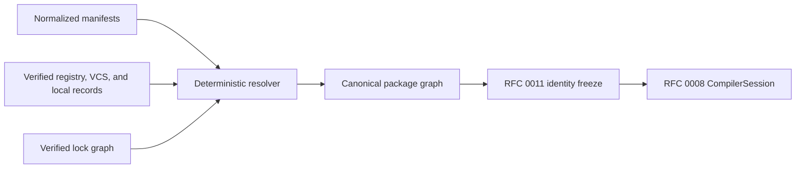

# RFC 0012: Package Manifest And Deterministic Resolver

## Summary

This RFC proposes the package, workspace, manifest, dependency-resolution,
lock-graph, source-materialization, and build-script input contracts that feed
RFC 0011 semantic identity and RFC 0008 `CompilerSession`. These contracts
remain proposal-only until the driver, resolver, diagnostics, and conformance
implementation land.

## Motivation

The compiler currently accepts source files directly. It has no `Zom.toml`
reader, workspace graph, package resolver, lock graph, registry verifier,
secure source materializer, build-script orchestrator, or package-aware
`CompilerSession`. Keeping those behaviors in normative language chapters
would promise tools that do not exist.

ZOM still needs one reviewed architecture before implementing those surfaces.
Without it, source spelling, registry aliases, filesystem order, feature
selection, and mutable network state could leak into semantic identity or make
build results non-reproducible.

## Goals

- Define a closed `Zom.toml` manifest and workspace model.
- Define package targets, dependency aliases, feature selection, and build
  dependency domains.
- Define deterministic registry, VCS, and local-path resolution inputs and
  outputs.
- Define a canonical lock graph and secure source materialization boundary.
- Feed only immutable structural values into RFC 0011 identity freeze and RFC
  0008 session construction.
- Require typed diagnostics and conformance evidence before any contract moves
  into the normative specification.

## Non-Goals

- This RFC does not implement the manifest parser, resolver, registry client,
  build scripts, or `CompilerSession`.
- This RFC does not define package publication commands, registry web APIs,
  account systems, or network transports.
- This RFC does not define source-language module syntax; Chapter 13 owns that.
- This RFC does not define module discovery after target roots are selected;
  RFC 0008 owns that.
- This RFC does not permit process-local semantic handles in manifests, lock
  graphs, registry records, or resolver caches.

## Prior Art

Rust Cargo provides a production-proven manifest, target, feature, source, and
lock-file model. ZOM should copy its separation between dependency aliases and
package names, its source-specific dependency declarations, and its generated
lock file. ZOM should keep identity encoding and feature selection explicit
rather than make TOML ordering observable.

References:

- <https://doc.rust-lang.org/cargo/reference/manifest.html>
- <https://doc.rust-lang.org/cargo/reference/workspaces.html>
- <https://doc.rust-lang.org/cargo/reference/features.html>
- <https://doc.rust-lang.org/cargo/reference/specifying-dependencies.html>
- <https://doc.rust-lang.org/cargo/reference/build-scripts.html>

Swift Package Manager models packages, products, targets, and dependency
requirements as immutable graph inputs. ZOM should copy the explicit target
root and target dependency boundary while using a standalone manifest data
format instead of executable manifest code.

Reference: <https://docs.swift.org/package-manager/PackageDescription/PackageDescription.html>.

Go modules demonstrate immutable module versions, content verification, and a
separate checksum database boundary. ZOM should copy the rule that verified
content identity is independent of local cache layout and credentials.

Reference: <https://go.dev/ref/mod>.

Dart Pub's PubGrub resolver provides deterministic incompatibility-driven
version solving and human-meaningful conflict explanations. ZOM should use a
verified PubGrub implementation or an equivalent algorithm with the same
completeness and deterministic selection properties rather than invent a
greedy resolver.

Reference: <https://github.com/dart-lang/pub/blob/master/doc/solver.md>.

Linux user and mount namespaces, seccomp filters, and cgroup v2 provide the
production kernel primitives used by the initial build-script adapter. ZOM
copies the default-deny syscall and resource-controller model while adding a
language-level ban on FFI, assembly, threads, and raw system calls in build
scripts. The adapter fails closed when the required kernel boundary is absent.
Linux `openat2` follows the established Unix rule that a successful open returns
the lowest currently unused descriptor. ZOM therefore treats the returned
descriptor as a runtime-tracked capability instead of assigning a fictitious
fixed number before the syscall occurs.

References:

- <https://man7.org/linux/man-pages/man7/user_namespaces.7.html>
- <https://man7.org/linux/man-pages/man7/mount_namespaces.7.html>
- <https://docs.kernel.org/userspace-api/seccomp_filter.html>
- <https://docs.kernel.org/admin-guide/cgroup-v2.html>
- <https://man7.org/linux/man-pages/man2/open.2.html>

The three common failure classes are dependency identity collapsing to display
names, non-reproducible feature/version selection, and unsafe archive
extraction. This RFC avoids them through canonical source keys, a completely
sorted resolver result and lock graph, and isolated digest-verified source
materialization.

## Guide-Level Explanation

A package or workspace root contains `Zom.toml`. A package declares its name,
version, edition, targets, dependencies, and optional features. Dependency
table keys are source-visible aliases:

```toml
[package]
name = "geometry"
version = "0.1.0"
edition = "2026"

[lib]
path = "src/lib.zom"

[dependencies]
stable_math = { package = "math", version = "1.4.0", registry = "https://packages.zom.dev/index", trust-domain-sha256 = "0000000000000000000000000000000000000000000000000000000000000000" }
local_util = { path = "../util" }
```

Source imports use the alias, for example `stable_math::geometry`. Resolution
produces one verified package graph and one canonical `Zom.lock`. The compiler
then creates RFC 0011 package and crate keys and hands selected target roots to
RFC 0008 module discovery.



## Reference-Level Design

### Manifest Encoding And Root

The manifest is named `Zom.toml`, encoded as UTF-8 without a byte-order mark,
and parsed as TOML 1.0. Its name is case-sensitive. Manifest paths are relative
to the manifest directory and are canonicalized before identity construction.

The closed top-level table set is `[package]`, `[lib]`, `[[bin]]`, `[[test]]`,
`[[bench]]`, `[[example]]`, `[build]`, `[dependencies]`,
`[dev-dependencies]`, `[build-dependencies]`, `[features]`, and `[workspace]`.
Unknown tables and keys are typed manifest errors. Profile configuration, lint
configuration, package metadata, workspace inheritance, target predicates,
dependency overrides, and tool-owned extension tables are not accepted by this
format. They require separate RFCs if the implementation needs them.

The parser produces exactly this normalized record:

```text
NormalizedManifest {
  document: InputDocumentKey,
  package: Maybe<PackageManifest>,
  workspace: Maybe<WorkspaceManifest>,
  library: Maybe<TargetManifest>,
  binaries: SortedSequence<TargetManifest>,
  tests: SortedSequence<TargetManifest>,
  benchmarks: SortedSequence<TargetManifest>,
  examples: SortedSequence<TargetManifest>,
  buildScript: Maybe<BuildScriptManifest>,
  targetDependencies: SortedSequence<DependencyRequirement>,
  developmentDependencies: SortedSequence<DependencyRequirement>,
  buildDependencies: SortedSequence<DependencyRequirement>,
  features: SortedMap<FeatureName, SortedSequence<FeatureEdgeRecord>>,
}
```

`InputDocumentKey` is `{ kind: Manifest | Lock, path: DiagnosticDocumentPath,
contentDigest: Sha256Digest }`, where `DiagnosticDocumentPath` is either
`Workspace(CanonicalWorkspaceRelativePath)` or
`Package { sourceDigest: Sha256Digest, relativePath: CanonicalRelativePath }`.
The workspace form is relative to the workspace root after symlink resolution;
the package form identifies an admitted external source without exposing its
URL or cache location. The content digest covers the exact original UTF-8
bytes. No form contains an absolute host path.

The package `sourceDigest` is SHA-256 over
`ASCII("zom.diagnostic-package-source")`, one zero byte, and the RFC 0011
encoding of `CanonicalPackageSource`. It is a diagnostic path component only;
it never replaces the package source in semantic identity.

The allowed manifest keys are exhaustive:

| Table | Required keys | Optional keys | Defaults |
|---|---|---|---|
| `[package]` | `name: string`, `version: string`, `edition: string` | None | None |
| `[workspace]` | `members: string[]` for a virtual workspace | `members: string[]` | Root package is a member |
| `[lib]` | None | `name: string`, `path: string` | Name is package name; path is `src/lib.zom` |
| `[[bin]]` | `name: string` | `path: string` | Path is `src/bin/<name>.zom` |
| `[[test]]` | `name: string` | `path: string` | `tests/<name>.zom` |
| `[[bench]]` | `name: string` | `path: string` | `benches/<name>.zom` |
| `[[example]]` | `name: string` | `path: string` | `examples/<name>.zom` |
| `[build]` | `path: string`, `inputs: string[]`, `outputs: string[]` | `environment: string[]`, `exported-environment: string[]` | Both environment lists are empty |
| Dependency entry | One source form described below | `package`, `features`, `default-features`, `optional` | Package is the alias; features empty; default features enabled; not optional |
| `[features]` entry | A string-array value | None | None |

`[package]` values must construct the RFC 0011 `PackageName` and
`ResolvedVersion` strong types exactly. `edition` is the exact string `"2026"`;
it maps to `SemanticCompilerOptionsKey.editionYear = 2026`. The first format
does not accept descriptive metadata because no current compiler consumer owns
it.

The normalized manifest component records are exact:

```text
PackageManifest {
  name: PackageName,
  version: ResolvedVersion,
  editionYear: uint32,
}

WorkspaceManifest {
  members: SortedSequence<CanonicalWorkspaceRelativePath>,
}

TargetManifest {
  kind: CrateTargetKind,
  name: TargetName,
  path: CanonicalRelativePath,
  implicit: bool,
  origin: DiagnosticAnchor,
}

BuildScriptManifest {
  target: TargetManifest,
  inputs: SortedSequence<CanonicalRelativePath>,
  outputs: SortedSequence<CanonicalRelativePath>,
  environment: SortedSequence<SemanticEnvironmentName>,
  exportedEnvironment: SortedSequence<SemanticEnvironmentName>,
}

FeatureEdgeRecord {
  edge: FeatureEdge,
  origin: DiagnosticAnchor,
}

CanonicalTargetManifest {
  kind: CrateTargetKind,
  name: TargetName,
  path: CanonicalRelativePath,
  implicit: bool,
}

CanonicalBuildScriptManifest {
  target: CanonicalTargetManifest,
  inputs: SortedSequence<CanonicalRelativePath>,
  outputs: SortedSequence<CanonicalRelativePath>,
  environment: SortedSequence<SemanticEnvironmentName>,
  exportedEnvironment: SortedSequence<SemanticEnvironmentName>,
}

CanonicalManifestRecord {
  package: Maybe<PackageManifest>,
  workspace: Maybe<WorkspaceManifest>,
  library: Maybe<CanonicalTargetManifest>,
  binaries: SortedSequence<CanonicalTargetManifest>,
  tests: SortedSequence<CanonicalTargetManifest>,
  benchmarks: SortedSequence<CanonicalTargetManifest>,
  examples: SortedSequence<CanonicalTargetManifest>,
  buildScript: Maybe<CanonicalBuildScriptManifest>,
  targetDependencies: SortedSequence<DependencyRequirementWithoutOrigin>,
  developmentDependencies: SortedSequence<DependencyRequirementWithoutOrigin>,
  buildDependencies: SortedSequence<DependencyRequirementWithoutOrigin>,
  features: SortedMap<FeatureName, SortedSequence<FeatureEdge>>,
}
```

All RFC 0012 record fields encode in declaration order through the RFC 0011
`CanonicalEncoder`. Every closed enum or union in this RFC assigns `0x01` to the
first listed variant and consecutive tags in declaration order; tag zero and
unlisted tags are invalid. The sole explicit exception is the sandbox wire enum
`BuildScriptResponseStatus`, whose `Success = 0x00` and failure tags are fixed in
the Build-Script Boundary; that enum is never encoded by the general RFC 0011
union helper. `DependencyRequirementWithoutOrigin` is exactly
`DependencyRequirement` without its `origin` field.

Manifest target names and dependency-table keys must construct the RFC 0011
`TargetName` and `DependencyAlias` strong types. An invalid target name or
dependency-table key is a `ManifestInvalid` failure with issue
`InvalidStrongScalar` at the exact manifest value or key span.

A manifest containing `[workspace]` is a workspace root and may also contain a
package. A manifest containing neither `[package]` nor `[workspace]` is invalid.
`members` contains explicit package-directory paths; glob syntax and implicit
path-dependency membership are not supported.
Every member path must name exactly one directory containing `Zom.toml`.
Workspace member paths are symlink-resolved, NFC-normalized, case-preserving,
compared case-sensitively, and deduplicated by canonical local-path identity.
A member manifest cannot define another workspace. A virtual workspace must
list at least one member. Workspace expansion applies only to the local root
manifest; a VCS, registry, or path dependency manifest must contain `[package]`
and must not contain `[workspace]`.

Package names are unique within one normalized workspace. The workspace
normalizer sorts members by canonical workspace-relative path, retains the
first `[package].name` occurrence, and reports
`ManifestIssue::DuplicateWorkspacePackageName` at the later name span with the
first name span as related provenance. The primary uses `ZOM7001`; the related
anchor uses `ZOM7093 PreviousWorkspacePackageHere`. No workspace with duplicate
package names can produce a target-selection request, so `--package` has only
the unknown-or-unique outcomes.

### Targets

The target kinds are `Library`, `Binary`, `Test`, `Benchmark`, `Example`, and
`BuildScript`. Repeated target tables require a `TargetName`; target kind plus
target name is unique within one package. `[lib]` is singular. Its name defaults
to the package name and may be overridden only by another valid `TargetName`.
`[build]` creates one target named `build`.

Every defaulted target name must also construct RFC 0011 `TargetName`. A package
name that cannot convert to `TargetName` must supply an explicit library name
and cannot create an implicit package binary.

An explicit `path` selects exactly one source file inside the canonical package
root. Default roots are:

| Target | Default root |
|---|---|
| Library | `src/lib.zom` |
| Package-name binary | `src/main.zom` |
| Named binary | `src/bin/<name>.zom` |
| Integration test | `tests/<name>.zom` |
| Benchmark | `benches/<name>.zom` |
| Example | `examples/<name>.zom` |
| Build script | `[build].path` |

If `[lib]` is absent, `src/lib.zom` creates an implicit library only when that
exact file exists. If no `[[bin]]` entry has the package name,
`src/main.zom` creates one implicit package binary only when that exact file
exists. No directory is enumerated to infer named targets. Every explicit or
default path must be a canonical package-relative regular `.zom` file and may
be owned by only one target. A missing explicit path is a manifest failure.

Target selection is explicit and produces:

```text
TargetSelection {
  package: PackageBaseKey,
  kind: CrateTargetKind,
  name: TargetName,
  requestedFeatures: SortedFeatureSet,
  useDefaultFeatures: bool,
}

SelectedLanguageOptions {
  useUnicode: bool,
  allowDollarIdentifiers: bool,
  supportRegexLiterals: bool,
}

RequestedTargetSelection {
  kind: CrateTargetKind,
  name: Maybe<TargetName>,
}

NormalizedPackageCompilationRequest {
  package: PackageName,
  requestedTargets: SortedNonEmptySequence<RequestedTargetSelection>,
  requestedFeatures: SortedFeatureSet,
  useDefaultFeatures: bool,
  hostTarget: RegisteredTargetSelection,
  target: RegisteredTargetSelection,
  languageOptions: SelectedLanguageOptions,
  lockMode: LockedOnly | PreferLocked | Update,
}

VerifiedPackageCompilationRequest {
  targetSelections: SortedNonEmptySequence<TargetSelection>,
  hostTarget: RegisteredTargetSelection,
  target: RegisteredTargetSelection,
  languageOptions: SelectedLanguageOptions,
  lockMode: LockedOnly | PreferLocked | Update,
}

RegisteredTargetSelection {
  registryRevision: Sha256Digest,
  profile: RegisteredTargetProfileName,
  semanticProjection: CanonicalTargetSpecificationKey,
  panicStrategy: Abort | Unwind,
}
```

`VerifiedPackageCompilationRequest.targetSelections` is private-constructor,
sorted by complete encoded selection, and rejects duplicate encoded elements.
Its `SortedNonEmptySequence` representation makes emptiness unrepresentable.
Every selection must name
one target in a normalized local workspace package, every requested feature must
exist, and command normalization rejects a missing or duplicate selection before
`NormalizedPackageCompilationRequest` exists. `RequestedTargetSelection.name`
is absent exactly for `--lib` and present for every other target flag. The
manifest/workspace target validator is the only producer of
`VerifiedPackageCompilationRequest`; it resolves the normalized package and
target names, applies the common feature request, and rejects unknown packages,
targets, or root features through
`ResolverFailure::TargetSelectionInvalid`. The resolver accepts only the
verified value. Neither type permits an empty or duplicate target list, so those
conditions have exactly one producer in `InvocationFailure`.

`RegisteredTargetProfileName` is non-empty lowercase ASCII containing only
letters, digits, `.`, `_`, and `-`, and is at most 255 bytes. The compiler owns
one immutable registered-target service. Lookup returns
`RegisteredTargetSelection`; callers cannot construct one from command text.
`registryRevision` identifies the exact immutable registry snapshot,
`semanticProjection` is the RFC 0011 source-visible target key, and
`panicStrategy` is the recognized requested strategy. These fields encode in
declaration order through RFC 0011. Panic tags are `Abort = 0x01` and `Unwind =
0x02` only in this package-selection record; they are not RFC 0010 backend tags.
The request verifier requires host and target selections to carry the same
nonzero registry revision. RFC 0010 defines the revision domain, profile-record
codec, fixed oracle, and sole registry verifier; RFC 0012 treats the resulting
32-byte revision as an opaque verified digest and never computes it.

This RFC deliberately does not define LLVM triples, data-layout strings,
backend feature states, runtime ABI strings, object formats, `TargetSpecId`, or
their codec. RFC 0010 is the sole owner of those values. Its target-selection
verifier consumes this exact registered selection, proves that the same registry
revision and profile map to one immutable `CanonicalTargetSpec`, recomputes the
RFC 0010 `TargetSpecId`, and proves that profile's semantic projection equals
`semanticProjection`. A missing mapping, changed registry revision, malformed
backend profile, unsupported panic strategy, or projection mismatch publishes
no verified target. The package layer never reconstructs or hashes a second
backend target record.

RFC 0008 passes only the registered selection and semantic projection through
session construction. Every ordinary `CrateKey.compilation.target` must equal
the request target's `semanticProjection`; every preparatory build-script crate
must equal the host selection's projection. RFC 0010 later verifies the backend
profile before LIR publication. A semantic context checked for one projection
cannot be emitted for another backend target.

`PackageBaseKey` is the structural tuple `{ source: CanonicalPackageSource,
name: PackageName, version: ResolvedVersion }` without enabled features. The
selected features create the final RFC 0011 `PackageKey`. The target kind,
target name, selected host or target semantic projection, semantic options, and
verified build-script output then create the complete `CrateKey`. Edition has
one source: each package's canonical manifest. For every root and dependency,
the driver constructs `SemanticCompilerOptionsKey` from that package's
`editionYear` plus the three request-wide `SelectedLanguageOptions`; no target
selection or dependency may override edition or the language flags. A build
script always selects `request.hostTarget.semanticProjection` and `Host`
compilation domain; all other targets use
`request.target.semanticProjection` and `Target` domain. An
output artifact container does not create another crate identity.

### Package CLI Contract

The complete package invocation is:

```text
zomc compile
  [--manifest-path <path-to-Zom.toml>]
  --package <package-name>
  (--lib | --bin <name> | --test <name> |
   --bench <name> | --example <name>)+
  [--features <name[,name...]>]
  [--no-default-features]
  [--target <registered-target-profile>]
  [--locked | --update-lock]
  [--no-unicode]
  [--allow-dollar-identifiers]
  [--no-regex-literals]
  [--panic abort|unwind]
```

Without `--manifest-path`, discovery starts at the process current directory
and selects the first regular `Zom.toml` found while walking parents toward the
filesystem root. An explicit path must name a regular file whose basename is
exactly `Zom.toml`; no alternate manifest name is accepted. The package name
must select exactly one normalized workspace member. At least one target flag
is required. A missing or repeated `--package` produces
`MissingPackageSelection` or `DuplicatePackageSelection`; a missing or repeated
target flag produces `MissingTargetSelection` or `DuplicateTargetSelection`.
Every successful selection receives the same requested feature set and
default-feature boolean. Feature text is a
comma-separated list with no empty item and is normalized through the manifest
feature-name scalar before sorting.

The compiler owns the immutable registered-target service described above. The
host selection is the compiler build's registered host profile and is not a
caller-constructed record. `--target` selects one registered profile; absence
selects the host profile. `--panic` records one recognized strategy in the
selection. RFC 0010, not the package layer, validates backend/runtime capability
when it turns that selection into `VerifiedTargetSelection`. Custom target JSON
and free-form LLVM data-layout strings are not part of this RFC.

No lock flag means `PreferLocked`; `--locked` means `LockedOnly`; and
`--update-lock` means `Update`. The two flags are mutually exclusive. The three
language flags map directly to `SelectedLanguageOptions`. Output and emission
flags remain non-semantic compiler options and do not enter this request. The
`run` command is outside this RFC and does not provide an alternate package or
direct-source compilation path.

Every failure to normalize this command into
`NormalizedPackageCompilationRequest` is an
`InvocationFailure` and uses source-less `ZOM7016` at the canonical invocation
anchor with `requestDigest = none`. After package validation succeeds, RFC
0010's target-selection verifier owns all backend outcomes: unsupported target
or panic capability is `ZOM6009 TargetCapabilityUnavailable`; malformed target
facts are the matching `ZOM9947 LirInvariant`; and non-canonical target bytes are
`ZOM9949 IrCanonicalCodecMismatch`. The package diagnostic adapter does not
translate, renumber, or wrap those downstream typed facts.

### Dependency Requirements

Each dependency-table key is a validated `DependencyAlias`. String shorthand is
not accepted; every value is an inline table with this normalized shape:

```text
DependencyRequirement {
  alias: DependencyAlias,
  requiredPackage: PackageName,
  domain: DependencyDomain,
  source: PackageSourceConstraint,
  versionCheck: Maybe<SemVerConstraint>,
  requestedFeatures: SortedFeatureSet,
  useDefaultFeatures: bool,
  optional: bool,
  origin: DiagnosticAnchor,
}

PackageSourceConstraint =
  Registry { registry: RegistryIdentity }
  Vcs { repository: CanonicalUrl, selector: VcsSelector,
        subdirectory: CanonicalRelativePath }
  LocalPath { canonicalPath: CanonicalWorkspaceRelativePath }

VcsSelector = Revision(VcsRevision) | Tag(ByteString) | Branch(ByteString)
```

The allowed dependency keys are exactly `package`, `version`, `registry`,
`trust-domain-sha256`, `git`, `rev`, `tag`, `branch`, `subdirectory`, `path`,
`features`, `default-features`, and `optional`. `package` defaults to the alias
and must construct `PackageName`; `features` is a unique array of `FeatureName`;
the two booleans have the defaults shown above.

A registry requirement has `version`, `registry`, and
`trust-domain-sha256`, and forbids every VCS and local-path key. `registry`
constructs RFC 0011 `CanonicalUrl`; the digest plus that URL constructs
`RegistryIdentity`. A VCS requirement has `git` and exactly one of `rev`, `tag`,
or `branch`; it may have `subdirectory` and an independent `version` check, and
forbids registry and path keys. A local requirement has `path`, may have an
independent `version` check, and forbids registry and VCS keys. `rev` must be a
complete RFC 0011 `VcsRevision`; tag and branch selectors are non-empty UTF-8
byte strings without NUL or ASCII control characters and never enter package
identity. `optional = true` is accepted only in `[dependencies]`.

`CanonicalWorkspaceRelativePath` is the RFC 0011 value with a
`leadingParentCount` and a sequence of canonical path segments. A dependency
outside the workspace uses a nonzero count; no literal `..` segment is stored.

The result of a tag or branch selector always records an immutable revision.
The dependency manifest must agree with the required package name and any
independent version check.

`SemVerConstraint` uses this complete grammar; every version operand has all
three core components:

```text
constraint = comparator ("," comparator)*
comparator = ("=" | ">" | ">=" | "<" | "<=" | "^" | "~")? semver
semver = ResolvedVersion without build metadata
```

Whitespace is not accepted. A bare version is a caret requirement. `^x.y.z`
permits updates below the next change to the leftmost non-zero core component;
when all components are zero, patch is the compatibility component.
`~x.y.z` permits updates below `x.(y+1).0`; comparison operators have their
ordinary total-order meaning; comma means intersection. Empty intersections
are valid constraints that resolve to `NoVersionSatisfiesConstraints`.
Prereleases are ineligible unless at least one comparator names a prerelease
with the same `major.minor.patch`; build metadata is rejected in constraints.
The normalized value is a sorted disjoint sequence of inclusive/exclusive
SemVer interval bounds, not the source text.

```text
SemVerConstraint {
  intervals: SortedSequence<SemVerInterval>,
  prereleaseCores: SortedSequence<SemVerCore>,
}

SemVerInterval {
  lower: Maybe<SemVerBound>,
  upper: Maybe<SemVerBound>,
}

SemVerBound { version: ResolvedVersion, inclusive: bool }
SemVerCore { major: ByteString, minor: ByteString, patch: ByteString }
```

Bound versions contain no build metadata. Core components are canonical
non-empty ASCII decimal bytes without leading zeroes except the single byte
`0`. Intervals sort by lower bound, then upper bound, reject overlap or
adjacency that could be merged, and use `none` as negative infinity for lower
bounds and positive infinity for upper bounds. Fields encode in declaration
order.

Dependency domains are `Target`, `Development`, and `Build`. Development edges
exist only for selected test, benchmark, and example targets. Build edges exist
only in a preparatory host context. Host and target compilations never exchange
semantic handles.

Every resolved dependency package must contain one library target. Executable
and build-script targets are roots, not dependency providers. RFC 0008 expands
target and development edges to selected target consumers and build edges to a
selected build-script consumer using the provider library; RFC 0012 does not
invent a provider target or silently select an executable target.

### Features

Every `[features]` key and every feature reference must construct the RFC 0011
`FeatureName` strong type. TOML quoted keys do not widen that domain. The closed
edge forms are:

```text
FeatureEdge =
  Local(FeatureName)
  EnableDependency(DependencyAlias)                 // dep:<alias>
  EnableDependencyFeature(DependencyAlias, FeatureName) // <alias>/<feature>
```

`:` and `/` are separators and are not part of either scalar. Unknown names,
unknown aliases, duplicate canonical names or edges, and local feature cycles
are errors. `EnableDependency` requires an optional target dependency.
`EnableDependencyFeature` enables the dependency and its named feature.

The feature named `default`, when present, is requested for a selected root or
dependency whose `useDefaultFeatures` flag is true. There is no implicit
feature for an optional dependency: it is activated only by an explicit
`dep:<alias>` or `<alias>/<feature>` edge. Features are additive. Resolution
unions requested features for one canonical package base identity separately
for the `Target` and `Build` activation domains and repeats package plus feature
solving to a fixed point. Development requests join the target domain only when
a test, benchmark, or example is selected. The resulting sorted set enters
`PackageKey`. Requests never unify across distinct sources, versions, or
activation domains. If the independently computed target and build feature sets
are byte-equal, they produce the same structural `PackageKey`; otherwise they
produce distinct keys for their respective edges and semantic contexts.

Resolution selects at most one version for each `PackageCoordinateKey`, defined
as the canonical registry identity, VCS repository/revision/subdirectory, or
local path plus `PackageName`, without a version or feature set. All constraints
on one coordinate must intersect. This follows Dart Pub and Swift Package
Manager's single-version rule and intentionally differs from Cargo's ability to
compile multiple versions of one package source: ZOM rejects that split because
it would create duplicate nominal type and coherence universes in one semantic
context. Distinct registry identities, revisions, or local paths remain distinct
coordinates even when their package names match.

Package-edge emission uses this closed activation matrix:

| Resolution context | Manifest edge | Consumer package key | Provider package key | Emitted domain |
|---|---|---|---|---|
| Final target graph | Target | Target activation | Target activation | Target |
| Selected test/benchmark/example | Development | Target activation | Target activation | Development |
| Any package build script | Build | Owning ordinary package activation | Build activation | Build |
| Recursive provider library in a preparatory host graph | Target | Build activation | Build activation | Target |
| Preparatory host graph | Development | None | None | No edge |

Target selections and target/development requirements contribute only to Target
feature fixed points. Build requirements and Target requirements traversed from
a preparatory provider contribute only to Build feature fixed points. If one
manifest dependency participates in both contexts, resolution emits both
package edges when their expanded keys differ; byte-identical edges collapse to
one structural edge.

For every `PackageKey` whose non-build-script crate is selected in a final or
preparatory context, a present `[build]` table automatically schedules exactly
one build-script execution for that package key, host target, and semantic
options. The build-script crate uses the owning ordinary package activation,
compiles for the host with `buildScriptOutput = none`, waits for its complete
Build-edge graph and every provider build output, and runs before the owning
ordinary crate. Its verified output key enters every corresponding ordinary
`CrateKey`. A provider library reached in a preparatory graph follows the same
rule recursively. No package without `[build]` receives a synthetic script or
output key.

For RFC 0011 `PreparatoryBuildScriptKey.buildDependencies`, the producer selects
exactly the provider `PackageKey` values on direct resolved
`DependencyDomain::Build` edges whose consumer is the owning build-script
package key. It sorts by complete RFC 0011 encoded `PackageKey` bytes and removes
byte-identical duplicates. Recursive Build providers and Target providers
reachable from those direct packages participate in the preparatory semantic
context, reachable-host crate graph, and execution key, but not in this direct
sequence. Development edges never participate.

### Registry And Source Records

`RegistryIdentity` is exactly the RFC 0011 record:

```text
RegistryIdentity {
  indexUrl: CanonicalUrl,
  trustDomain: Sha256Digest,
}
```

Credentials, mirrors, proxies, tokens, and cache paths are operational inputs
and never enter this identity. Trust and release records use Ed25519 and the RFC
0011 `CanonicalEncoder`:

```text
RegistryTrustConfiguration {
  indexUrl: CanonicalUrl,
  trustedKeys: SortedMap<SigningKeyId, Ed25519PublicKey>,
}

VerifiedRegistryReleaseRecord {
  registry: RegistryIdentity,
  package: PackageName,
  version: ResolvedVersion,
  manifest: CanonicalManifestRecord,
  manifestDigest: Sha256Digest,
  archiveFormat: ArchiveFormat,
  archiveDigest: Sha256Digest,
  sourceTreeDigest: Sha256Digest,
  yanked: bool,
  signingKey: SigningKeyId,
  signature: Ed25519Signature,
}
```

An Ed25519 public key is exactly 32 bytes and a signature is exactly 64 bytes.
`ArchiveFormat` has one accepted variant, `TarZstd`; it is a POSIX ustar
archive compressed as one Zstandard frame. Concatenated frames and trailing
bytes are rejected. Additional archive formats require an RFC revision.
`SigningKeyId` is SHA-256 over `ASCII("zom.ed25519-key")`, one zero byte,
and the raw public-key bytes. `RegistryIdentity.trustDomain` is SHA-256 over
`ASCII("zom.registry-trust")`, one zero byte, and the RFC 0011 encoding of
the sorted key map. Key addition, removal, or revocation therefore creates a
new trust domain and cannot silently change an existing package source.

The signed message is `ASCII("zom.registry-release")`, one zero byte, and
the RFC 0011 encoding of every release-record field in declaration order except
`signature`. A verifier requires the signing key in the exact trust
configuration whose digest equals the record's registry trust domain.
Duplicate differing signed records for one registry/name/version tuple are an
equivocation failure.

The record-verification input contains a sorted unique sequence of
`RegistryTrustConfiguration` values. A manifest registry requirement must match
exactly one configuration by canonical index URL and trust-domain digest. Zero
matches is `SourceUnavailable`; multiple matches is a trust-configuration
`TrustConfigurationInvalid(DuplicateIdentity)` failure and no release record is
admitted.

`CanonicalManifestRecord` is `NormalizedManifest` with `document`, every
`ManifestSpan`, and all other diagnostic provenance removed; dependency
requirements use `DependencyRequirementWithoutOrigin`. `manifestDigest` is
SHA-256 over `ASCII("zom.normalized-manifest")`, one zero byte, and the
canonical encoding of that record. `archiveDigest` is SHA-256 over the exact
downloaded archive bytes. `sourceTreeDigest` is defined below.

VCS and local records have no signature field:

```text
VerifiedVcsPackageRecord {
  base: PackageBaseKey,
  manifest: NormalizedManifest,
  manifestDigest: Sha256Digest,
  sourceTreeDigest: Sha256Digest,
}

ResolvedVcsSelectorRecord {
  identity: VcsSelectorIdentity,
  revision: VcsRevision,
}

VcsSelectorIdentity {
  repository: CanonicalUrl,
  kind: Tag | Branch,
  selectorDigest: Sha256Digest,
}

LocalPackageRecord {
  base: PackageBaseKey,
  manifest: NormalizedManifest,
  manifestDigest: Sha256Digest,
  sourceTreeDigest: Sha256Digest,
}
```

The VCS base contains the RFC 0011 canonical URL, immutable revision, and
canonical subdirectory. `selectorDigest` is SHA-256 over
`ASCII("zom.vcs-selector")`, one zero byte, the selector-kind tag, and one RFC
0011 byte string containing the exact tag or branch bytes. An unlocked tag or
branch requirement must match exactly one `ResolvedVcsSelectorRecord`; the
fetch boundary creates that record from one remote-ref response and verifies
that the admitted checkout has the recorded revision. Two differing revisions
for one selector identity are `VcsSelectorEquivocation`; this fact is
constructible before any checkout manifest supplies a package name or version.
A valid lock selection supplies its immutable revision directly and does not
re-query a tag or branch. The local base contains the canonical case-preserving
workspace-relative path. Every digest is verified before either record becomes
a resolver input.

### Resolver Contract

```text
ResolutionInput {
  request: VerifiedPackageCompilationRequest,
  workspacePackages: SortedSequence<LocalPackageRecord>,
  availableReleases: SortedSequence<VerifiedRegistryReleaseRecord>,
  vcsSelections: SortedSequence<ResolvedVcsSelectorRecord>,
  vcsRecords: SortedSequence<VerifiedVcsPackageRecord>,
  lockedSelections: Maybe<VerifiedLockGraph>,
}

ResolutionOutput {
  packages: SortedSequence<ResolvedPackageRecord>,
  edges: SortedSequence<PackageDependencyEdgeKey>,
  featureSets: SortedSequence<ResolvedFeatureSet>,
  lockGraph: VerifiedLockGraph,
}

VerifiedLockGraph {
  packages: SortedSequence<LockPackageRecord>,
  edges: SortedSequence<PackageDependencyEdgeKey>,
}

LockPackageRecord {
  key: PackageKey,
  manifestDigest: Sha256Digest,
  sourceTreeDigest: Sha256Digest,
  archiveFormat: Maybe<ArchiveFormat>,
  archiveDigest: Maybe<Sha256Digest>,
  signingKey: Maybe<SigningKeyId>,
}

ResolvedPackageRecord {
  key: PackageKey,
  manifest: CanonicalManifestRecord,
  manifestDigest: Sha256Digest,
  sourceTreeDigest: Sha256Digest,
  sourceView: SourceViewKey,
  libraryTarget: Maybe<TargetName>,
}

SourceViewKey {
  source: CanonicalPackageSource,
  sourceTreeDigest: Sha256Digest,
}

ResolvedFeatureSet {
  base: PackageBaseKey,
  domain: Target | Build,
  features: SortedFeatureSet,
}
```

A binary-only root package has `libraryTarget = none`. Before emitting a
dependency edge, provider validation requires `some` and otherwise returns
`DependencyLibraryTargetMissing`; roots that are never dependency providers do
not acquire a synthetic library.

Resolution and build execution use two distinct RFC 0008 handoffs:

```text
VerifiedSourceView {
  key: SourceViewKey,
  files: SortedSequence<SourceTreeFile>,
  snapshot: DigestVerifiedSourceSnapshot,
}

VerifiedGeneratedSourceView {
  key: BuildScriptOutputKey,
  files: SortedSequence<SourceTreeFile>,
  snapshot: DigestVerifiedSourceSnapshot,
}

BuildPlanNodeKey {
  preparatory: PreparatoryBuildScriptKey,
}

BuildPlanNode {
  key: BuildPlanNodeKey,
  contract: CanonicalBuildScriptManifest,
  sourceView: SourceViewKey,
  predecessors: SortedSequence<BuildPlanNodeKey>,
}

VerifiedBuildPreparationInput {
  request: VerifiedPackageCompilationRequest,
  resolution: ResolutionOutput,
  sourceViews: SourceViewStore,
  buildPlan: SortedMap<BuildPlanNodeKey, BuildPlanNode>,
}

VerifiedBuildResult {
  output: BuildScriptOutputRecord,
  generatedView: VerifiedGeneratedSourceView,
}

VerifiedFinalPackageSessionInput {
  request: VerifiedPackageCompilationRequest,
  resolution: ResolutionOutput,
  sourceViews: SourceViewStore,
  buildPlan: SortedMap<BuildPlanNodeKey, BuildPlanNode>,
  buildResults: SortedMap<BuildPlanNodeKey, VerifiedBuildResult>,
}

BuildScriptCacheCandidate {
  executionKeyBytes: ByteString,
  outputRecordBytes: ByteString,
  output: BuildScriptOutputRecord,
  generatedView: VerifiedGeneratedSourceView,
}

VerifiedBuildScriptResultSet {
  planKeys: SortedSequence<BuildPlanNodeKey>,
  results: SortedMap<BuildPlanNodeKey, VerifiedBuildResult>,
}
```

`SourceViewStore` is an immutable map keyed by `SourceViewKey`. The final input
retains the immutable build plan so its verifier can reproduce the exact key-set
equality without process history. Each final build
result preserves the plan-node association instead of publishing an unowned
output-key store. Its `output.preparatoryKey` must equal the map key's
`preparatory` value. Its generated-view key must equal the
`BuildScriptOutputKey` computed from the complete output record, and its file
inventory must equal `output.generatedSources` path for path and digest. The
final map key set must equal the preparation build-plan key set exactly.
`VerifiedBuildScriptResultSet` is constructible only after both sequences are
sorted by canonical plan-key bytes, duplicate keys are rejected, their key sets
are byte-identical, every generated-view inventory equals the corresponding
output record, and every generated byte stream reproduces its recorded digest
and valid UTF-8 source text.

The package driver owns manifest parsing, record verification, resolution,
materialization, and publication of `VerifiedBuildPreparationInput`. RFC 0008
`CompilerSession` alone owns the transition: it executes `BuildPlanNode` values
in predecessor order through separate host preparatory contexts, materializes
each complete `BuildScriptExecutionKey` only after predecessor outputs exist,
verifies every `BuildScriptOutputRecord`, and publishes
`VerifiedFinalPackageSessionInput` only after the exact map relation above is
proven. An empty build plan produces an empty build-result map without executing
code.

`DigestVerifiedSourceSnapshot` is a move-only Pimpl class. Its implementation
owns one `zc::Own<const zc::ReadableDirectory>` and the immutable sorted
`SourceTreeFile` inventory; it exposes only `readVerifiedFile(path)` and
`materializeVerifiedCopy(destination)`. It never exposes or clones the root
capability. Every read opens with no-follow semantics, checks the regular-file
type and exact length, streams SHA-256 while reading, and returns bytes only
after the digest equals the inventory entry. Materialization performs those
same checks while copying into a fresh private destination and verifies the
complete destination inventory before returning. A mismatch invalidates the
whole session input rather than returning partial bytes.

The package driver constructs all snapshots and then moves the complete
`VerifiedBuildPreparationInput` into `CompilerSession`; it retains no borrowed
root or cloned filesystem object. Preparatory contexts receive only const
borrows to the snapshot API. The session consumes the preparation value, moves
its source snapshots into the final value, and owns every generated snapshot
until compilation ends. Before reporting success, the session explicitly calls
`finish()` on every snapshot; the operation closes handles, recursively removes
private materialization directories, and returns `SnapshotCleanupFailed` if any
owned path remains. The Pimpl state is `Active | Finished`. `finish()` on
`Active` consumes each owned handle as that cleanup step succeeds and changes to
`Finished` only when no handle or path remains; `finish()` on `Finished` is a
no-op. On failure the state stays `Active` with only the uncleaned resources.
The `noexcept` destructor retries those remaining resources without reporting
or touching already consumed ones. Process-local capabilities and cleanup
handles never enter RFC 0011 keys, fingerprints, dumps, or canonical bytes.

The final session obtains target paths and the unique edition from each resolved
canonical manifest, host and target specifications plus non-edition language
options from the request, source search roots from matching verified source
views, and generated-source maps from the package's matching build result. For
every package that has a build plan node, ordinary final `CrateKey` values use
the SHA-256 output key of that node's output record, and the record's
`exportedSemanticEnvironment` belongs only to that package. Packages without a
build plan node use `buildScriptOutput = none`. No generated view is required by
the preparation input, and no unresolved filesystem path or mutable cache
directory crosses either handoff.

Dependencies are read from each verified package manifest; there is no second
caller-provided dependency list that can disagree with a manifest. All record
fields encode in declaration order with RFC 0011 tags. Sequences sort by their
complete encoded element bytes. `ResolutionOutput` canonical bytes are:

```text
ASCII("zom.resolution-output")
0x00
EncodeSequence(packages)
EncodeSequence(edges)
EncodeSequence(featureSets)
Encode(lockGraph)
```

Each edge is the exact RFC 0011 record containing the consumer `PackageKey`,
resolved dependency alias, dependency domain, and provider `PackageKey`. The
sorted edge set enters `ContextFingerprint`; no display-only or
traversal-order edge representation crosses into RFC 0008.

The resolver uses PubGrub incompatibility solving. A valid locked selection is
retained when it satisfies all current source, version, feature, digest, trust,
and target-domain inputs. An unlocked choice selects the greatest eligible
non-yanked SemVer version; canonical release-record bytes break any remaining
precedence tie. Incompatible constraints on one `PackageCoordinateKey` produce
`NoVersionSatisfiesConstraints`; the resolver never creates hidden version
slots.

Decision and explanation order is canonical. Unit propagation processes
incompatibilities by encoded bytes. Decision making selects the unresolved
`PackageCoordinateKey` with the fewest eligible releases, then canonical
coordinate bytes, and selects its greatest eligible release. Feature and graph
fixed-point worklists use canonical encoded key order. Dependency-cycle
detection visits nodes and outgoing edges in canonical order; the first DFS
back edge defines the reported directed cycle from its active stack suffix.

Conflict explanations use this closed derivation DAG:

```text
IncompatibilityTerm {
  coordinate: PackageCoordinateKey,
  positive: bool,
  constraint: SemVerConstraint,
}

IncompatibilityCause =
  Root(DiagnosticAnchor)
  Dependency(DependencyRequirementWithoutOrigin, DiagnosticAnchor)
  NoVersions(PackageCoordinateKey)
  Derived(IncompatibilityId, IncompatibilityId)

IncompatibilityRecord {
  terms: SortedSequence<IncompatibilityTerm>,
  cause: IncompatibilityCause,
}

IncompatibilityId = SHA256(
  ASCII("zom.incompatibility"), 0x00, Encode(IncompatibilityRecord))

IncompatibilityGraph {
  root: IncompatibilityId,
  records: SortedMap<IncompatibilityId, IncompatibilityRecord>,
}
```

Derived child IDs sort before hashing, duplicate terms are rejected, and every
child must exist and precede its parent in the acyclic derivation relation. This
graph is the byte-exact source for `ZOM7006` notes; no rendered solver trace or
container traversal order enters diagnostics.

The implementation is a C++20 translation of Dart Pub's documented PubGrub
incompatibility algorithm behind a provider interface over the records above.
ZOM owns a checked-in `pubgrub-scenarios.json` corpus with the exact input,
selected graph or incompatibility derivation, and canonical output bytes. A
change to algorithm semantics requires changing that corpus through a new RFC;
an implementation-library upgrade cannot change the oracle.

The result is independent of manifest table order, source enumeration,
registry response order, hash-map iteration, object address, and worker timing.
The resolver produces structural keys only; RFC 0011 allocates all semantic
handles after the result freezes.

Permutation seed `s` in `0..255` reorders each independently permutable input
sequence by sorting elements on
`SHA256(ASCII("zom.permutation"), 0x00, uint64be(s), Encode(element))`, then
on `Encode(element)` as the collision tie-breaker. TOML fixture generators use
the same key for table and key order only in valid-manifest success fixtures;
those runs compare semantic output and lock bytes, not source-positioned
diagnostics. Diagnostic permutation fixtures keep every source document
byte-identical and permute only registry/VCS record order, resolver worklists,
worker count, and other non-text inputs. This is the only permutation algorithm
in the determinism suite and requires no host PRNG.

### Lock Graph

`Zom.lock` is a generated canonical TOML 1.0 encoding of
`VerifiedLockGraph`. Its closed fields are:

```toml
[[package]]
key = "<lowercase hex RFC 0011 PackageKey encoding>"
source-kind = "registry|vcs|local"
source-key = "<lowercase hex RFC 0011 CanonicalPackageSource encoding>"
name = "<package name>"
version = "<canonical SemVer>"
features = ["<sorted feature>"]
manifest-sha256 = "<64 lowercase hex>"
source-tree-sha256 = "<64 lowercase hex>"
archive-format = "tar-zstd or absent"
archive-sha256 = "<64 lowercase hex or absent>"
signing-key = "<canonical signing key id or absent>"

[[package.dependency]]
domain = "target|development|build"
alias = "<dependency alias>"
target-key = "<lowercase hex RFC 0011 PackageKey encoding>"
```

`archive-format`, `archive-sha256`, and `signing-key` are required only for
registry sources and are omitted otherwise. `source-key` carries the complete registry identity,
VCS repository/revision/subdirectory, or local
`leadingParentCount`/segments record, so no host path spelling or lossy textual
path form is needed. No other field or table is accepted.

The file writes `schema` first. Package entries sort by decoded `key` bytes;
dependency entries sort by domain tag, NFC-normalized alias bytes, and decoded
target-key bytes. Fields within each table appear in the exact order above.
Arrays use one-line TOML syntax with comma-space separators. Strings use basic
TOML quoting with the shortest required escapes. UTF-8 text is NFC-normalized,
hex is lowercase, integers use decimal form, blank lines occur exactly where
shown, and line endings are LF. The file ends with one LF. A checked-in golden
fixture owns the exact bytes for a registry, VCS, and local package graph.

The reader decodes every `source-key` and `key`, reconstructs the RFC 0011
`PackageKey`, and requires byte equality with the encoded key and redundant
name, version, feature, and source-kind fields. An edge target must name exactly
one package entry.

The complete file is replaced atomically in the workspace root: create a fresh
same-directory temporary file, write all bytes, fsync the file, rename over
`Zom.lock`, then fsync the directory. A failure before rename leaves the old
file intact and removes the temporary file when possible; a failure after
rename reports failure without rewriting either graph. Unknown fields,
duplicate keys or edges, invalid digests, foreign trust identities, partial
files, and graphs that do not satisfy current manifests are rejected.

### Secure Source Materialization

Registry archives, VCS checkouts, and local packages are admitted through the
same canonical source-tree record:

```text
SourceTreeFile {
  path: CanonicalRelativePath,
  byteLength: uint64,
  contentDigest: Sha256Digest,
}

SourceTreeDigest = SHA256(
  ASCII("zom.source-tree"), 0x00,
  EncodeSequence(sortByEncodedPath(SourceTreeFile)))
```

`contentDigest` is SHA-256 over the exact regular-file bytes. Directories are
implicit, and executable/permission bits are intentionally ignored because no
accepted semantic consumer observes them. Archive and checkout entry names
must use `/`, be valid UTF-8, and
contain only non-empty RFC 0011 canonical path segments after NFC
normalization. Absolute paths, `.` or `..`, backslashes, NUL, symlinks,
hard links, devices, sockets, FIFOs, and any other non-regular entry are
rejected. Two entries collide if their canonical paths are byte-equal or if
their paths are equal after Unicode 15.1 full case folding; both are rejected
on every host. Path depth is at most 128 and canonical UTF-8 path length is at
most 4096 bytes.

Collision classification is mutually exclusive and uses this priority after
the individual paths pass syntax validation: identical raw pathname bytes are
`DuplicatePath`; distinct raw pathname bytes whose NFC-normalized canonical
paths are byte-equal are `UnicodeCollision`; distinct NFC canonical paths whose
Unicode 15.1 full-case-folded bytes are equal are `CaseFoldCollision`. The first
matching rule wins. A pair cannot be reported by more than one rule.

The closed default admission limits are:

```text
SourceAdmissionLimits {
  compressedArchiveBytes: 536870912,
  zstdWindowBytes: 67108864,
  decoderWorkingBytes: 134217728,
  archiveHeaderCount: 100000,
  archiveMetadataBytes: 67108864,
  fileCount: 100000,
  singleFileBytes: 67108864,
  totalFileBytes: 2147483648,
  ioChunkBytes: 1048576,
}
```

Every length, count, and cumulative addition is checked for `uint64` overflow
before allocation, decoder admission, or write. The compressed-byte counter is
incremented by the source callback before bytes reach Zstandard. The decoder
sets the maximum window before parsing the frame and rejects any request above
the window or working-memory limits. A streaming tar reader counts every header
and the exact header, pathname, extended-record, and padding bytes as metadata;
it never buffers an entire archive or file. Exactly one Zstandard frame and one
POSIX ustar archive are accepted, and any trailing compressed or tar data is
rejected. Trusted operator configuration may lower limits but packages cannot
change them; limits affect admission only and never semantic identity.

Registry archives, VCS checkouts, and local packages are all copied into fresh
private directories before becoming resolver inputs. Admission walks the source
twice in canonical path order. Each pass uses no-follow opens and records file
type, length, and content digest; publication requires byte-identical
inventories, and the copied destination must independently reproduce that
inventory. Concurrent local mutation therefore produces
`SourceChangedDuringSnapshot`; subsequent changes to the original tree cannot affect
the owned copy. Partial destinations are owned by an RAII cleanup object and
are recursively removed on every failure before any snapshot is published.
Network and cache mutation finish before the same process begins this admission
algorithm.

### Build-Script Boundary

A selected build script is a host `BuildScript` crate in a preparatory semantic
context. `[build].inputs` contains unique canonical package-relative regular
files and automatically includes the build-script source. `[build].outputs`
contains the complete unique set of canonical generated `.zom` paths.
`environment` and `exported-environment` contain unique RFC 0011
`SemanticEnvironmentName` values. The script may read and export only those
names, and may create only the declared output paths.

The execution cache and replay identity is separate from RFC 0011 output
identity:

```text
BuildScriptExecutionKey {
  preparatory: PreparatoryBuildScriptKey,
  preparatoryContext: ContextFingerprint,
  executable: BuildScriptExecutableKey,
  trustedRuntime: TrustedBuildRuntimeKey,
  contract: CanonicalBuildScriptManifest,
  rootCrate: CrateKey,
  reachableHostCrates: SortedSequence<CrateKey>,
  reachableHostEdges: SortedSequence<CrateDependencyEdgeKey>,
  inputDigests: SortedMap<CanonicalRelativePath, Sha256Digest>,
  declaredEnvironment: SortedMap<SemanticEnvironmentName, ByteString>,
  limits: BuildScriptLimitKey,
}

BuildScriptExecutableKey {
  target: RegisteredTargetSelection,
  format: StaticElf,
  imageDigest: Sha256Digest,
}

TrustedBuildRuntimeKey {
  runtimeAbiProfile: ByteString,
  objectDigests: NonEmptySequence<Sha256Digest>,
  symbolManifestDigest: Sha256Digest,
  relocationManifestDigest: Sha256Digest,
  operationManifestDigest: Sha256Digest,
}

TrustedRuntimeSymbolKind =
  NoType | Object | Function | Section | File | Common | Tls |
  OsSpecific(uint8) | ProcessorSpecific(uint8)
TrustedRuntimeSymbolBinding =
  Local | Global | Weak | OsSpecific(uint8) | ProcessorSpecific(uint8)
TrustedRuntimeSymbolVisibility = Default | Internal | Hidden | Protected
TrustedRuntimeSymbolSection =
  Undefined | Absolute | Common | Section(uint32)
TrustedRuntimeSymbolName = Unnamed | Named(ByteString)

TrustedRuntimeSymbolId {
  objectOrdinal: uint32,
  symbolTableSectionOrdinal: uint32,
  symbolIndex: uint32,
}

TrustedRuntimeSymbolRecord {
  id: TrustedRuntimeSymbolId,
  name: TrustedRuntimeSymbolName,
  kind: TrustedRuntimeSymbolKind,
  binding: TrustedRuntimeSymbolBinding,
  visibility: TrustedRuntimeSymbolVisibility,
  section: TrustedRuntimeSymbolSection,
  byteSize: uint64,
}

TrustedRuntimeRelocationRecord {
  objectOrdinal: uint32,
  sectionOrdinal: uint32,
  byteOffset: uint64,
  kind: uint32,
  target: TrustedRuntimeSymbolId,
  addend: int64,
}

TrustedRuntimeOperation =
  Allocate | Deallocate | ReadRequestFrame | WriteResponseFrame |
  ValidateContractPath | ReadInput | ReadEnvironment | WriteOutput |
  ExportEnvironment | OpenInput | OpenOutput | ReadFile | WriteFile |
  CloseFile | Fail | Exit

TrustedRuntimeOperationRecord {
  operation: TrustedRuntimeOperation,
  symbol: TrustedRuntimeSymbolId,
}

BuildScriptLimitKey {
  cpuMilliseconds: uint64,
  wallMilliseconds: uint64,
  memoryBytes: uint64,
  fileDescriptorCount: uint32,
  fileCount: uint64,
  outputBytes: uint64,
  requestFrameBytes: uint64,
  responseFrameBytes: uint64,
  environmentValueBytes: uint64,
  exportedEnvironmentBytes: uint64,
}

BuildScriptLimitInvariantIssue =
  CpuRange | CpuGranularity | WallRange | MemoryRange |
  FileDescriptorRange | FileCountRange | OutputRange |
  RequestFrameRange | ResponseFrameRange | EnvironmentValueRange |
  ExportedEnvironmentRange | FrameRelation

TrustedRuntimeInvariantIssue =
  EmptyObjectSet | DuplicateObjectDigest | RuntimeAbiMismatch |
  ObjectDigestMismatch | SymbolManifestMismatch |
  RelocationManifestMismatch | OperationManifestMismatch |
  InvalidManifestRecord | UnmanifestedSymbol | UnmanifestedRelocation |
  WeakFallback | UnexpectedInitializer
```

Provider `CrateKey` values include their already-verified build-script outputs,
so the complete recursive RFC 0008 host graph participates in replay identity.
RFC 0011 `PreparatoryBuildScriptKey` remains output provenance, not a complete
execution-cache key. `preparatoryContext` covers the full imported source and
dependency closure, and the executable image digest covers the actual
statically linked code produced by the selected compiler, backend, and runtime.
The image is admitted only after its embedded target note equals `target` and
its bytes reproduce `imageDigest`; a compiler or dependency implementation
change cannot reuse an old result unless it produces the identical executable
image from the identical semantic context.

`TrustedBuildRuntimeKey` is produced only by the checked runtime build target.
Its object digests cover every exact object byte in deterministic linker order
and reject duplicates; its symbol manifest lists every defined/undefined symbol, binding,
visibility, size, and owning object; its relocation manifest lists every source
object/section/offset, relocation kind, and target symbol; and its operation
manifest lists the admitted allocator, IPC, path-validation, file, and exit
operations. Each manifest uses one canonical record and the stored field
is SHA-256 over its exact bytes. The runtime ABI profile must equal the selected
registered target's runtime profile after RFC 0010 verification. Empty object
sets, duplicate digests, unmanifested symbols or relocations, weak fallbacks,
and manifest/digest disagreement reject the runtime key before linking. The
final executable digest remains separate and commits to the result after the
verified root/dependency closure and this exact runtime key are linked.

Standard symbol-kind tags follow declaration order from `NoType = 0x01` through
`Tls = 0x07`; `OsSpecific = 0x08` and `ProcessorSpecific = 0x09` carry the exact
ELF `st_info` kind byte, constrained to the corresponding ELF range. Binding
tags are `Local = 0x01`, `Global = 0x02`, `Weak = 0x03`, `OsSpecific = 0x04`,
and `ProcessorSpecific = 0x05`, with the latter two carrying their exact range-
checked ELF binding byte. Visibility tags are `Default = 0x01`, `Internal =
0x02`, `Hidden = 0x03`, and `Protected = 0x04`. Section tags are `Undefined =
0x01`, `Absolute = 0x02`, `Common = 0x03`, and `Section = 0x04`; `Section`
carries one existing section ordinal. Symbol-name tags are `Unnamed = 0x01` and
`Named = 0x02`; `Named` then carries the RFC 0011 byte-string encoding.
`TrustedRuntimeSymbolName` is a closed union, not `Maybe`, so RFC 0011 optional
tags do not apply. Operation tags follow declaration order starting at `0x01`.

The independent symbol-name codec oracle uses `Named(ByteString("x"))`. Prefixing
its exact tagged encoding `02000000000000000178` with
`ASCII("zom.build-runtime-symbol-name")` and one zero byte produces this
complete 43-byte test preimage:
`7a6f6d2e6275696c642d72756e74696d652d73796d626f6c2d6e616d650002000000000000000178`.
Its SHA-256 is
`52cc6eb4b5c6726138df5588464cd683d7279fac0cfb8ff344128627c5aa0774`.
The test mutates `Unnamed`, `Named`, the byte-string length, and the payload
independently; RFC 0011 `None = 0x00` and `Some = 0x01` are rejected here.

Named symbol bytes are non-empty and contain no NUL or ASCII control byte;
unnamed null and section symbols use `Unnamed`. `TrustedRuntimeSymbolId` is the
collision-free identity used by relocations and operations, so same-name local
symbols and unnamed section symbols remain distinct. Undefined, absolute,
common, and ordinary section definitions use their exact section variant;
undefined symbols require `byteSize = 0`, and no variant fabricates a section
ordinal. Fixed-width integers use big-endian encoding; `int64` uses two's-
complement big-endian.

Symbol records sort by complete `TrustedRuntimeSymbolId`; duplicate IDs are
invalid, and every ELF symbol-table entry, including null, file, section,
`NoType`, TLS, OS-specific, and processor-specific entries, occurs exactly once.
Two defined `Global` symbols with the same non-empty name are invalid.
Relocation records sort by object ordinal, section ordinal, offset, numeric kind,
target ID, then addend; duplicate source locations are invalid. Operation
records sort by operation tag then target ID and are unique; every target must
name one defined `Function`. Every object and ordinary section ordinal must
exist in the checked inventory, every relocation target ID must exist in the
symbol manifest, and weak/OS-specific/processor-specific bindings remain
representable so policy can reject them rather than silently omit them.

`ReadRequestFrame` owns length-prefix and canonical request decoding;
`WriteResponseFrame` owns status and success-payload encoding;
`ValidateContractPath` owns canonical path validation plus declared-table
lookup; `ReadEnvironment` and `ExportEnvironment` own their corresponding
contract-table and limit checks. `ReadInput`, `WriteOutput`, and `Fail` name the
three corresponding public runtime entry points; `Fail` deterministically
produces `ScriptFailure`. The remaining frame, file, path-validation,
allocation, and exit operations name their concrete primitive helper entry
points.

Operation records classify concrete function symbols, not abstract call-graph
effects. A public composite `ReadInput` or `WriteOutput` symbol receives its
high-level operation tag exactly once, while each separately emitted primitive
helper symbol it calls receives its own primitive tag exactly once. Inlining
removes the helper symbol and therefore its record; it never causes the public
symbol to receive multiple tags. Every exported runtime API symbol and every
non-inlined security-relevant helper entry point must occur in exactly one
operation record. An unclassified entry point, a tag whose required symbol is
absent, or one symbol assigned to multiple operations is
`OperationManifestMismatch`.

Each manifest digest uses the same framing algorithm: its domain, one zero byte,
`uint64be(recordCount)`, then for each sorted record
`uint64be(encodedRecordByteLength)` and the declaration-order encoded record.
The domains are exactly `zom.build-runtime-symbols`,
`zom.build-runtime-relocations`, and
`zom.build-runtime-operations`. Independent one-record framing oracles use
already-encoded record bytes `a1`:

| Manifest | Preimage bytes | SHA-256 |
|---|---:|---|
| Symbols | 46 | `25e137c5e8a37a0c7173c3bd08592eedbc446003ae4519a5793d57aba2b8cba8` |
| Relocations | 50 | `cfb3042480d8d384620325e7c9afe3d6902c5f4889ccf4393c31596c9ee77412` |
| Operations | 49 | `6469e53c101bf30c27c3275dc722df44e1b7f189b279ca6bb33859a98e6e9ad0` |

The exact oracle preimages are respectively
`7a6f6d2e6275696c642d72756e74696d652d73796d626f6c730000000000000000010000000000000001a1`,
`7a6f6d2e6275696c642d72756e74696d652d72656c6f636174696f6e730000000000000000010000000000000001a1`,
and
`7a6f6d2e6275696c642d72756e74696d652d6f7065726174696f6e730000000000000000010000000000000001a1`.
The runtime-key verifier independently decodes actual object files, reconstructs
all three manifests, recomputes every digest, and compares the complete records
before authorizing the key.

`[build].inputs` are runtime data inputs, not compiler-source discovery. The
RFC 0008 preparatory context discovers and fingerprints the complete source
closure independently. A successful execution produces the exact RFC 0011
`BuildScriptOutputRecord`. On every cache miss, the executor runs the image
twice in independent fresh sandboxes from the same verified snapshots and
requires byte-identical output records and generated bytes before atomically
publishing either the cache entry or final build result. Any mismatch reports
`NondeterministicOutput`; both output trees and records are destroyed. Cache
hits reverify the execution-key bytes, complete output record, and generated
source digests before use. Any stale key bytes, record bytes, plan association,
generated inventory, or generated digest is `BuildResultIntegrityViolation`;
no sandbox execution or cache publication follows that failure. CI additionally
exercises forced misses and intentional nondeterminism fixtures.

The initial closed adapter set contains only `LinuxNativeSandbox` on Linux
x86-64 and AArch64. A package without a build script remains portable; a build
script on any other host reports `SandboxUnavailable`. The adapter requires
unprivileged user, mount, PID, and network namespaces, `no_new_privs`, seccomp
BPF, and cgroup v2. If any primitive or controller is unavailable, execution is
rejected; there is no unsandboxed fallback.

The build-script crate is a static PIE executable with a custom constructor-free
entry point. Before code generation, the capability verifier walks the root
build-script crate, every reachable host-compiled build-dependency crate, every
generated shim, and the complete linked HIR/LIR operation and symbol inventory.
Except for the pinned trusted build runtime, that closure may contain no extern
declaration, FFI edge, unsafe block, raw-pointer construction or dereference,
unchecked memory intrinsic, inline assembly, dynamic-load operation, thread or
task creation, raw system-call intrinsic, inherited process API, global
constructor, indirect target without a frozen verified dispatch fact, or
executable-memory operation. A single violation rejects the executable as
`ForbiddenBuildCapability`; checking only the root crate is invalid.

After static linking, the executable verifier compares the complete defined and
undefined symbol table, relocation targets, operation inventory, and linked
object digests with that verified closure. The only additional symbols may come
from the exact `TrustedBuildRuntimeKey` object and manifest set recorded in the
execution key. No
unverified archive member, weak fallback, linker-injected initializer, raw
memory helper, or alternate syscall wrapper may enter the image. This memory-
safe closed-world proof is required because classic seccomp cannot inspect path
bytes behind an `openat2` pointer or infer descriptor provenance; the security
contract does not treat syscall-number filtering alone as declared-input
authorization.

The child mount namespace contains only the
executable, `/input` read-only data produced through
`materializeVerifiedCopy`, and one fresh writable `/out`. Build-dependency code
is resolved, compiled, and statically linked into the executable; there is no
runtime dependency service, `/deps` tree, dynamically loaded package code, host
root, workspace, home, procfs, sysfs, temporary directory, device tree, network
interface, or dynamic loader.

The child capability contract is default-deny and phase-specific. Before
`execveat`, the trusted launcher has already created namespaces, mounts, cgroup,
limits, and fixed descriptors. Its first seccomp filter admits the final runtime
set below plus exactly one executable transition through descriptor 7 and the
`seccomp` operation needed by the custom entry point to install the strictly
smaller runtime filter. The entry point performs no user initialization before
that second filter. The runtime filter admits exactly these Linux UAPI calls:

| Bootstrap-only operation | x86-64 | AArch64 | Exact admitted use |
|---|---:|---:|---|
| `execveat` | 322 | 281 | Descriptor 7, empty path, fixed compiler-owned argv, empty environment, and `AT_EMPTY_PATH` |
| `seccomp` | 317 | 277 | One `SECCOMP_SET_MODE_FILTER` call installing the checked runtime-filter bytes with no listener or synchronization flag |
| `write` | 1 | 64 | One-byte setup failure on close-on-exec descriptor 8; successful `execveat` closes it without a write |

| Operation | x86-64 | AArch64 | Exact admitted use |
|---|---:|---:|---|
| `read` | 0 | 63 | Descriptor 3 or runtime-tracked regular-file descriptor 0 |
| `write` | 1 | 64 | Descriptor 4 or runtime-tracked regular-file descriptor 0 |
| `close` | 3 | 57 | Descriptor 0 or descriptors 3-7; double close is rejected by the runtime state machine |
| `fstat` | 5 | 80 | Runtime-tracked regular-file descriptor 0 only |
| `mmap` | 9 | 222 | `MAP_PRIVATE | MAP_ANONYMOUS`, descriptor `-1`, non-executable protection only |
| `mprotect` | 10 | 226 | Anonymous runtime mappings only; may never add executable permission |
| `munmap` | 11 | 215 | Exact subranges of anonymous runtime mappings only |
| `brk` | 12 | 214 | Process heap growth or shrink within `memory.max` |
| `rt_sigprocmask` | 14 | 135 | Block or restore the runtime mask; no handler installation |
| `rt_sigreturn` | 15 | 139 | Kernel signal return only |
| `exit` | 60 | 93 | Current thread, which is the sole process thread |
| `exit_group` | 231 | 94 | Final process exit after exactly one response attempt |
| `openat2` | 437 | 437 | Descriptor 5 for canonical declared input or descriptor 6 for canonical declared output, with the flags below |

`openat2` input calls use `O_RDONLY | O_CLOEXEC`, mode zero, and
`RESOLVE_BENEATH | RESOLVE_NO_SYMLINKS | RESOLVE_NO_MAGICLINKS |
RESOLVE_NO_XDEV`. Output calls use
`O_WRONLY | O_CREAT | O_TRUNC | O_CLOEXEC`, mode `0600`, and the same resolve
flags. The path is one contract-validated relative byte sequence; absolute,
empty, dot, parent, undeclared, and non-canonical paths never reach the syscall.
All other argument combinations are runtime invariants and terminate without
publishing output. The BPF validates the audit architecture, rejects the x86
x32 syscall bit, admits only the listed numbers, and returns `SECCOMP_RET_TRAP`
for every other call. Socket, clone, fork, exec, namespace, mount, ptrace, clock,
randomness, device, handler-installation, and arbitrary filesystem calls are
therefore absent. Checked-in symbolic tables, architecture numbers, generated
BPF bytes, and their SHA-256 digests are one release fixture; CI regenerates
both filters and rejects any source, number, argument-policy, byte, or digest
drift.

The parent closes every inherited descriptor before exec except fixed
request/response descriptors 3 and 4, read-only input-root descriptor 5,
writable output-root descriptor 6, and executable descriptor 7. Descriptor 3 carries one length-prefixed
canonical request containing declared input paths, exact declared environment
bytes, and output paths. Descriptor 4 accepts one
length-prefixed canonical response containing only declared exported values and
typed status. OS environment is empty, descriptors 0 through 2 are closed, and
raw child output is never surfaced. The response has the fixed correlation
value `0` because exactly one request and one response are permitted. Any other
value, second frame, missing frame, unknown status tag, or trailing byte is
`MalformedResponse`. Neither canonical IPC frame contains a file descriptor
number, process identifier, pointer, or other process-local handle. Descriptors
5-7 are fixed sandbox implementation details, never IPC values or semantic keys,
and are closed by the runtime immediately after their final permitted use.
During launcher setup only, close-on-exec descriptor 8 carries a one-byte
failure marker. The parent does not report successful setup until reading EOF,
which can occur only when `execveat` closes descriptor 8. Mount, limit,
seccomp-installation, or executable-transition failure writes the marker and is
`SandboxSetupFailed`; descriptor 8 cannot survive into the runtime filter.
Because Linux allocates the lowest unused descriptor, the one permitted
runtime `openat2` returns descriptor 0. The trusted runtime records its
provenance and closes it before another file is opened; descriptors 1 and 2
remain closed for the entire execution. The seccomp policy admits descriptor 0
only for the file operations above, so it cannot become stdin, stdout, or
stderr behavior.

The request payload is `uint64be(correlation = 0)`, an RFC 0011 sequence of
declared input paths, a sorted map of declared environment names to byte
strings, then a sequence of declared output paths. Its empty structural frame is
32 bytes before path/value content. The response payload is
`uint64be(correlation = 0)`, one status byte, and, only for `Success`, a sorted
map of exported environment names to byte strings. A failure payload is exactly
9 bytes; an empty success payload is 17 bytes. The outer eight-byte length
prefix is not included in `requestFrameBytes` or `responseFrameBytes`.

The statically linked build runtime exposes exactly these operations:

```text
ReadInput(CanonicalRelativePath) -> ByteString | UndeclaredInput
ReadEnvironment(SemanticEnvironmentName) -> ByteString | UndeclaredEnvironment
WriteOutput(CanonicalRelativePath, ByteString) -> Ok | UndeclaredOutput
ExportEnvironment(SemanticEnvironmentName, ByteString) -> Ok | UndeclaredExport
Fail() -> ScriptFailure

BuildScriptResponseStatus =
  Success = 0x00
  UndeclaredInput = 0x01
  UndeclaredEnvironment = 0x02
  UndeclaredOutput = 0x03
  UndeclaredExport = 0x04
  ScriptFailure = 0x05
  FileDescriptorLimit = 0x06
  EnvironmentValueLimit = 0x07
  ExportedEnvironmentLimit = 0x08
  ResponseFrameLimit = 0x09
```

Each operation checks the canonical contract table before filesystem or value
access. The first non-success status stops user code and becomes the one
response status. Status tags map one-to-one to the same-named
`BuildScriptIssue`; `ScriptFailure` maps to `ExecutionFailed`. `Success` is the
only status that may carry exported values. The runtime has no dependency,
filesystem-handle, process, clock, random, thread, network, or arbitrary message
operation.

Only the trusted runtime opens files. `EMFILE` or `ENFILE` from an admitted
input or output `openat2` becomes `FileDescriptorLimit`, stops user code, closes
every runtime-opened file, and writes that status through the already-open
response descriptor 4. A descriptor acquisition during parent setup is instead
`SandboxSetupFailed`; an unrelated child exit is `ExecutionFailed`. The adapter
accepts `fileDescriptorCount` only in the inclusive range 8 through 16, so fixed
descriptors 3-7 and runtime-opened descriptor 0 can coexist and the response channel
does not depend on opening another descriptor.

Before spawning the child, the parent computes the exact canonical request
frame length with overflow-checked arithmetic. A frame above
`requestFrameBytes` is `RequestFrameLimit`; any declared environment value above
`environmentValueBytes` is `EnvironmentValueLimit`. The child runtime applies
the same single-value limit to every export, applies
`exportedEnvironmentBytes` to the overflow-checked cumulative encoded export
payload, and applies `responseFrameBytes` to the complete encoded response.
Those conditions produce their matching closed response tags before any
success frame is attempted.

The parent reads the eight-byte response length into a fixed stack buffer,
rejects `UINT64_MAX`, overflow, or a value above `responseFrameBytes` before
allocation, and decodes through bounded one-MiB chunks. A truncated frame,
trailing byte, invalid canonical length, or field-count overflow is
`MalformedResponse`; an otherwise well-formed over-limit prefix is
`ResponseFrameLimit`. No decoder allocation is based on an unchecked child
length. Exported environment bytes cannot enter `BuildScriptOutputRecord` until
all per-value, cumulative, frame, strong-name, and canonical-order checks pass;
environment values remain arbitrary bounded byte strings.

Defaults are 60,000 CPU milliseconds, 120,000 wall milliseconds, 512 MiB
`memory.max`, `pids.max = 1`, 16 inherited and opened file descriptors, 4096
output files, 256 MiB output bytes, 4 MiB request and response frames, 1 MiB per
environment value, and 4 MiB minus the 17-byte success-frame prefix for
cumulative exported environment bytes.
`BuildScriptLimitKeyVerifier` runs before sandbox preflight and admits exactly:

- CPU: 1,000 through 60,000 milliseconds, divisible by 1,000;
- wall: 1 through 120,000 milliseconds;
- memory: 16 MiB through 512 MiB;
- descriptors: 8 through 16;
- file count: 1 through 4,096;
- output bytes: 1 through 256 MiB;
- request frame: 33 through 4 MiB;
- response frame: 18 through 4 MiB;
- one environment value: 1 byte through 1 MiB and no greater than either
  `requestFrameBytes - 32` or `responseFrameBytes - 17`;
- cumulative exported environment: 1 byte through 4 MiB and no greater than
  `responseFrameBytes - 17`.

Every subtraction and comparison is overflow-checked. Trusted configuration may
only choose a value inside these ranges and relations. An invalid key produces
one closed `BuildScriptLimitInvariantIssue` before resource acquisition, maps to
fatal `ZOM9905 BuildScriptLimitInvariantViolation`, retains the rejected
structural key in the compiler bug bundle, and never becomes a package or child
failure. `LinuxNativeSandbox` accepts a positive
CPU limit only when it is an exact multiple of 1000. Before exec it divides by
1000 without rounding, sets `RLIMIT_CPU.rlim_cur` to that second count, and sets
`rlim_max` to the overflow-checked value `rlim_cur + 1`. Verified build-script
code cannot install or replace a `SIGXCPU` handler. The default `SIGXCPU`
termination at the soft limit produces `CpuLimit`; the hard-limit `SIGKILL` is
the fail-safe and is also `CpuLimit` when no higher-priority event below exists
and final cgroup CPU usage reached the soft limit. `cpu.stat usage_usec` is read
after reap only for that classification and accounting, never for polling or
kill timing.

The parent creates an absolute `CLOCK_MONOTONIC` timerfd for the exact wall
deadline and waits on it together with the child pidfd. A readable timerfd wins
even if both descriptors become readable in the same wait; the parent kills and
reaps the whole cgroup and produces `WallLimit`. `memory.max` and
`memory.events`, fixed `pids.max = 1`, and `RLIMIT_NOFILE` enforce the remaining process
limits. Failure classification priority is wall timer, cgroup memory event,
`RLIMIT_CPU` signal status, seccomp-policy violation, one fully validated
canonical response-decoder failure, one fully validated non-success runtime
response, then generic child failure. Runtime responses use
their numeric wire-tag order when a corrupted runtime exposes more than one
status; the decoder retains only the first complete frame and treats a second as
`MalformedResponse`. This priority covers every undeclared, script,
file-descriptor, environment, export, and frame-limit status. After reap, the
parent validates the output tree through the
source-admission walker, requiring exactly the declared regular files and
limits. Trusted driver configuration may only lower the defaults to values
admitted by this adapter, and every value is recorded in the execution key.

`LinuxNativeSandbox` is a move-only Pimpl object that owns the child process
handle, cgroup directory, namespace setup descriptors, IPC descriptors, and
fresh input and output trees. Its state is
`SettingUp | Running | Exited | Finished`; every resource field is an owning
`zc::Maybe` consumed and cleared immediately after its teardown step succeeds.
The required explicit `finish()` kills and reaps a remaining child, closes
handles, removes the cgroup, and recursively removes all trees. It changes to
`Finished` only when every owning field is empty; a call in `Finished` is a
no-op. A teardown failure retains the remaining owners, prevents cache or result
publication, and maps to `SandboxTeardownFailed`. The `noexcept` destructor is
the best-effort fallback: it operates only on remaining fields and never reports
or repeats completed cleanup. Setup, timeout, child failure, malformed response,
output validation, and teardown failure map once to typed `BuildScriptIssue`
values. Sanitizer and fault-injection tests exercise every state transition,
acquisition boundary, and partial-setup destructor path.

### Failure Contract

Failures remain owned by the component that can prove them. The package driver
composes the closed component sums; the resolver does not pretend to produce
manifest, materialization, lock-write, or build-execution failures:

```text
ManifestSpan {
  document: InputDocumentKey,
  byteStart: uint64,
  byteEnd: uint64,
}

RegistryReleaseKey {
  registry: RegistryIdentity,
  package: PackageName,
  version: ResolvedVersion,
}

RegistryRecordAnchor {
  release: RegistryReleaseKey,
  fieldPath: Sequence<uint32>,
}

PackageInvocationKey {
  operation: Resolve | Build | Check,
  requestDigest: Maybe<Sha256Digest>,
}

PackageInvocationRequest {
  operation: Resolve | Build | Check,
  compilation: NormalizedPackageCompilationRequest,
}

DiagnosticAnchor =
  Manifest(ManifestSpan)
  RegistryRecord(RegistryRecordAnchor)
  Package(PackageBaseKey)
  Invocation(PackageInvocationKey)

DiagnosticProvenance {
  primary: DiagnosticAnchor,
  related: SortedSequence<DiagnosticAnchor>,
}

RejectedSourcePath {
  rawDigest: Sha256Digest,
  rawByteLength: uint64,
  canonicalPath: Maybe<CanonicalRelativePath>,
}

DependencyCycleEdge {
  edge: PackageDependencyEdgeKey,
  origin: DiagnosticAnchor,
}

DependencyCycleRecord {
  edges: Sequence<DependencyCycleEdge>,
}
```

`ManifestSpan` requires `byteStart <= byteEnd <= document byte length`.
`RegistryRecordAnchor.fieldPath` indexes declaration-order fields and sorted
sequence entries in the signed canonical manifest; it never points into
presentation text. A present `requestDigest` is SHA-256 over
`ASCII("zom.package-invocation-request")`, one zero byte, and the RFC 0011
encoding of `PackageInvocationRequest` in declaration order. The key's
`operation` must equal the encoded request operation. It is `none` until one
complete `NormalizedPackageCompilationRequest` exists; therefore a missing or
duplicate package/target selection can never receive a request digest. All
pre-request failures share one fixed source-less anchor per operation and sort
by diagnostic ID and encoded issue. It becomes `some` before workspace target
validation, resolution, or build execution. The record excludes
working-directory spelling, credentials, output paths, environment values, and
rejected command text.

`RejectedSourcePath.rawDigest` hashes the exact rejected entry-name bytes with
domain `zom.rejected-source-path`. `canonicalPath` is present only after the
complete path validator succeeds. The materialization failure path is present
only when one archive or source-tree entry caused the failure; archive-level,
snapshot-level, resource-limit, and cleanup failures use `none` and never
fabricate path bytes. A cycle record follows directed edge order,
rotated so its least encoded edge is first; direction is never reversed. All
these records use the RFC 0011 encoder and contain no raw rejected bytes.

```text
ManifestFailure =
  ManifestInvalid { provenance: DiagnosticProvenance, issue: ManifestIssue }

InvocationFailure =
  InvocationInvalid { provenance: DiagnosticProvenance, issue: InvocationIssue }

PackageCompilerInvariant =
  BuildScriptLimitInvariant { anchor: PackageInvocationKey,
                              issue: BuildScriptLimitInvariantIssue }
  TrustedRuntimeInvariant { anchor: PackageInvocationKey,
                            issue: TrustedRuntimeInvariantIssue }

RegistryFailure =
  TrustConfigurationInvalid { provenance, issue: RegistryTrustIssue }
  SourceUnavailable { provenance, sourceKind: SourceKind }
  ReleaseSignatureInvalid { provenance, package, version, signingKey }
  ReleaseDigestMismatch { provenance, package, version, artifact, expected, actual }
  ReleaseEquivocation { provenance, package, version, firstDigest, secondDigest }
  VcsSelectorEquivocation { provenance, selector: VcsSelectorIdentity,
                            firstRevision: VcsRevision,
                            secondRevision: VcsRevision }

ResolverFailure =
  TargetSelectionInvalid { provenance, issue: TargetSelectionIssue }
  NoVersionSatisfiesConstraints { provenance, package, incompatibilityGraph }
  FeatureInvalid { provenance, package, feature, issue: FeatureIssue }
  DependencyCycle { provenance, cycle: DependencyCycleRecord }
  DependencyLibraryTargetMissing { provenance, requirement, providerPackage }

LockFailure =
  LockGraphInvalid { provenance, issue: LockIssue }
  LockUpdateFailed { provenance, stage: LockWriteStage }

MaterializationFailure =
  SourceMaterializationInvalid { provenance, package,
                                 path: Maybe<RejectedSourcePath>,
                                 issue: MaterializationIssue }

BuildScriptFailure =
  BuildScriptFailed { provenance, package, target, issue: BuildScriptIssue }

PackagePipelineFailure = OneOf<InvocationFailure, PackageCompilerInvariant,
  ManifestFailure,
  RegistryFailure, ResolverFailure, LockFailure,
  MaterializationFailure, BuildScriptFailure>
```

The issue enums are exhaustive:

```text
ManifestIssue =
  ReadFailed | InvalidUtf8 | ByteOrderMarkPresent | TomlSyntax | UnknownTable | UnknownKey |
  MissingRequiredKey | WrongValueType | InvalidStrongScalar | UnsupportedEdition |
  InvalidPath | PathOutsideRoot | DuplicateCanonicalValue | WorkspaceMemberMissing |
  NestedWorkspace | DuplicateWorkspacePackageName | TargetCollision | TargetPathCollision |
  MissingTargetPath | DependencySourceConflict | InvalidVersionConstraint |
  InvalidVcsSelector | InvalidFeatureEdge | FeatureCycle

InvocationIssue =
  ManifestNotFound | InvalidManifestPath | MissingPackageSelection |
  DuplicatePackageSelection | MissingTargetSelection |
  DuplicateTargetSelection | PositionalSourceArgument | InvalidFeatureList |
  ConflictingLockMode | UnknownTargetProfile | InvalidPanicStrategy

FeatureIssue =
  UnknownFeature | UnknownDependency | DependencyNotOptional | DuplicateEdge |
  Cycle | RequestedFeatureMissing

TargetSelectionIssue =
  UnknownWorkspacePackage | UnknownTarget | UnknownRootFeature

LockIssue =
  ReadFailed | InvalidUtf8 | TomlSyntax | UnsupportedSchema | UnknownField | MissingField |
  WrongValueType | NonCanonicalEncoding | DuplicatePackageKey | DuplicateEdge |
  PackageKeyMismatch | SourceKeyMismatch | DanglingEdge | InvalidDigest |
  SourceFieldMismatch | TrustDomainMismatch | CurrentInputMismatch

MaterializationIssue =
  UnsupportedArchiveFormat | ArchiveDecodeFailed | TrailingArchiveData |
  FreshDirectoryCreateFailed | SourceReadFailed | DestinationCreateFailed |
  DestinationWriteFailed | DestinationSyncFailed | InvalidEntryEncoding |
  AbsolutePath | ParentPath | DotPath | BackslashPath |
  EmptySegment | PathTooDeep | PathTooLong | Symlink | HardLink | SpecialFile |
  DuplicatePath | UnicodeCollision | CaseFoldCollision | FileTooLarge |
  CompressedSizeLimit | DecoderWindowLimit | DecoderMemoryLimit |
  ArchiveHeaderLimit | ArchiveMetadataLimit | FileCountLimit | TotalSizeLimit |
  LengthOverflow | SourceChangedDuringSnapshot | SourceTreeDigestMismatch |
  SnapshotCleanupFailed

BuildScriptIssue =
  SandboxUnavailable | SandboxSetupFailed | ForbiddenBuildCapability |
  SeccompPolicyViolation | OutputTreePolicyViolation |
  ExecutableIdentityMismatch | UndeclaredInput | UndeclaredEnvironment |
  UndeclaredExport | MissingOutput | UndeclaredOutput |
  CpuLimit | WallLimit | MemoryLimit | FileDescriptorLimit |
  FileCountLimit | OutputSizeLimit | ExecutionFailed | MalformedResponse |
  RequestFrameLimit | ResponseFrameLimit | EnvironmentValueLimit |
  ExportedEnvironmentLimit |
  InvalidGeneratedSource | NondeterministicOutput | SandboxTeardownFailed |
  BuildResultIntegrityViolation

RegistryTrustIssue = DuplicateIdentity | TrustDomainMismatch | InvalidPublicKey
SourceKind = Registry | Vcs | Local
ArtifactKind = Manifest | Archive | SourceTree
LockWriteStage = TemporaryCreate | Write | FileSync | Rename | DirectorySync
```

The package driver owns a `RequirementProvenanceStore`; for a transitive failure
it computes every root requirement path, selects the least encoded
`DiagnosticAnchor` as primary, and retains the remaining unique anchors for
notes. A missing root manifest, empty selection, virtual workspace, or first
lock-file creation uses `Invocation(PackageInvocationKey)`. A failure associated
with a resolved source but no document uses `Package(PackageBaseKey)`. No
failure fabricates a source range or stores a `BufferId`.

The producer mapping is exclusive:

| Producer | Failure family |
|---|---|
| Package CLI and request normalizer | `InvocationFailure` |
| Trusted build-script limit-key verifier | `PackageCompilerInvariant::BuildScriptLimitInvariant` |
| Trusted build-runtime object and manifest verifier | `PackageCompilerInvariant::TrustedRuntimeInvariant` |
| Manifest document, workspace membership, and target-schema normalizer | `ManifestFailure` |
| Workspace package/target/root-feature selection validator | `ResolverFailure::TargetSelectionInvalid` |
| Registry/VCS/local record verifier and fetch boundary | `RegistryFailure` |
| PubGrub, dependency feature fixed point, and provider validation | Every other `ResolverFailure` variant |
| Lock reader/verifier/atomic writer | `LockFailure` |
| Archive, checkout, and local snapshot admission, verified reads, and snapshot `finish()` | `MaterializationFailure` |
| Preparatory-context sandbox and output verifier | `BuildScriptFailure` |
| Package driver | `PackagePipelineFailure` composition and diagnostic projection only |

Compiler-owned configuration validates before any package-controlled build
operation. `BuildScriptLimitInvariant` has precedence over
`TrustedRuntimeInvariant`; within a family, issue declaration order is the
deterministic priority. The rejected complete structural key and all detected
facts remain in the bug bundle even though the CLI emits one fatal primary. No
compiler invariant is converted to `ZOM7011`, `ForbiddenBuildCapability`, or a
source failure.

Within materialization, each issue has one producing stage:

| Producer stage | Exact `MaterializationIssue` variants |
|---|---|
| Archive format gate and bounded streaming Zstandard/ustar decoder | `UnsupportedArchiveFormat`, `ArchiveDecodeFailed`, `TrailingArchiveData`, `CompressedSizeLimit`, `DecoderWindowLimit`, `DecoderMemoryLimit`, `ArchiveHeaderLimit`, `ArchiveMetadataLimit` |
| Canonical entry validator | `InvalidEntryEncoding`, `AbsolutePath`, `ParentPath`, `DotPath`, `BackslashPath`, `EmptySegment`, `PathTooDeep`, `PathTooLong`, `Symlink`, `HardLink`, `SpecialFile`, `DuplicatePath`, `UnicodeCollision`, `CaseFoldCollision` |
| Source/destination snapshot copier | `FreshDirectoryCreateFailed`, `SourceReadFailed`, `DestinationCreateFailed`, `DestinationWriteFailed`, `DestinationSyncFailed`, `FileTooLarge`, `FileCountLimit`, `TotalSizeLimit`, `LengthOverflow`, `SourceChangedDuringSnapshot`, `SourceTreeDigestMismatch` |
| `DigestVerifiedSourceSnapshot::finish()` | `SnapshotCleanupFailed` |

The session invokes snapshot `finish()` but only the snapshot component creates
the `MaterializationFailure`; `CompilerSession` forwards that closed fact to the
package driver. Collision variants follow the mutually exclusive priority
defined by Secure Source Materialization.

Build-script issue production is likewise closed:

| Producer stage | Exact `BuildScriptIssue` variants |
|---|---|
| Required-kernel-primitive preflight before resource acquisition | `SandboxUnavailable` |
| Namespace, cgroup, mount, descriptor, pidfd, timerfd, and seccomp acquisition after successful preflight | `SandboxSetupFailed` |
| Complete linked-closure capability and symbol-inventory verifier | `ForbiddenBuildCapability` |
| Seccomp result classifier for `SIGSYS` or an impossible inherited capability | `SeccompPolicyViolation` |
| Static executable note and digest verifier | `ExecutableIdentityMismatch` |
| Closed non-IPC-limit build-runtime response tags | `UndeclaredInput`, `UndeclaredEnvironment`, `UndeclaredOutput`, `UndeclaredExport`, `FileDescriptorLimit` |
| Resource-event classifier | `CpuLimit`, `WallLimit`, `MemoryLimit` |
| Shared canonical IPC limit verifier | `RequestFrameLimit`, `ResponseFrameLimit`, `EnvironmentValueLimit`, `ExportedEnvironmentLimit` |
| Canonical response frame decoder | `MalformedResponse` |
| Child result classifier | `ExecutionFailed` |
| Declared-output verifier | `MissingOutput`, `FileCountLimit`, `OutputSizeLimit`, `InvalidGeneratedSource`, `OutputTreePolicyViolation` |
| Two-run record and generated-byte comparator | `NondeterministicOutput` |
| Deterministic result publisher, cache replay verifier, and final session result-set verifier | `BuildResultIntegrityViolation` |
| `LinuxNativeSandbox::finish()` | `SandboxTeardownFailed` |

Preflight returns `SandboxUnavailable` only when a named mandatory primitive is
absent. Once preflight succeeds, any acquisition or configuration failure before
exec is `SandboxSetupFailed`. The output verifier maps a missing declared path
to `MissingOutput`; count and byte limits to their corresponding variants; and
invalid type, path, collision, digest, or `.zom` source bytes to
`InvalidGeneratedSource`. An extra output path cannot arise through
`WriteOutput`; observing one in the mounted tree proves a sandbox bypass and is
`OutputTreePolicyViolation`.

Implementation adds `diagnostics-package.def`, includes it from
`diagnostic-ids.h` and `diagnostic-info.h`, and atomically registers these exact
diagnostics before a producer can return its failure type:

| Registry ID | Severity | Headline and safe arguments | Primary anchor |
|---|---|---|---|
| `ZOM7001 PackageManifestInvalid` | Error | `Package manifest is invalid ({0})`, `ManifestIssue` | manifest span, file start, or invocation |
| `ZOM7002 PackageSourceUnavailable` | Error | `Package source is unavailable ({0})`, `SourceKind` | introducing requirement |
| `ZOM7003 PackageSignatureInvalid` | Error | `Package release signature is invalid for {0} {1}`, `PackageName`, `ResolvedVersion` | introducing requirement |
| `ZOM7004 PackageDigestMismatch` | Error | `Package {0} digest does not match`, `ArtifactKind` | introducing requirement |
| `ZOM7005 PackageReleaseEquivocation` | Error | `Registry returned conflicting records for {0} {1}`, `PackageName`, `ResolvedVersion` | introducing requirement |
| `ZOM7006 PackageVersionConflict` | Error | `No version of {0} satisfies all requirements`, `PackageName` | canonical root requirement |
| `ZOM7007 PackageFeatureInvalid` | Error | `Package feature selection is invalid ({0})`, `FeatureIssue` | feature or requirement span |
| `ZOM7008 PackageDependencyCycle` | Error | `Package dependency graph contains a cycle`, no arguments | canonical closing edge origin |
| `ZOM7009 PackageLockInvalid` | Error | `Package lock graph is invalid ({0})`, `LockIssue` | lock span or file start |
| `ZOM7010 PackageMaterializationInvalid` | Error | `Package source cannot be materialized ({0})`, `MaterializationIssue` | introducing requirement |
| `ZOM7011 PackageBuildScriptFailed` | Error | `Package build script failed ({0})`, `BuildScriptIssue` | build target declaration |
| `ZOM7012 PackageDependencyLibraryMissing` | Error | `Dependency package {0} has no library target`, `PackageName` | dependency declaration |
| `ZOM7013 PackageLockUpdateFailed` | Error | `Package lock update failed ({0})`, `LockWriteStage` | lock file start or invocation |
| `ZOM7014 PackageTrustConfigurationInvalid` | Error | `Package registry trust configuration is invalid ({0})`, `RegistryTrustIssue` | registry requirement or source-less root |
| `ZOM7015 PackageTargetSelectionInvalid` | Error | `Package target selection is invalid ({0})`, `TargetSelectionIssue` | target declaration or source-less root |
| `ZOM7016 PackageInvocationInvalid` | Error | `Package invocation is invalid ({0})`, `InvocationIssue` | invocation |
| `ZOM7017 PackageVcsSelectorEquivocation` | Error | `VCS selector resolved to conflicting revisions`, no arguments | introducing VCS requirement |
| `ZOM9905 BuildScriptLimitInvariantViolation` | Fatal | `Internal build-script limit configuration is invalid ({0})`, `BuildScriptLimitInvariantIssue` | invocation |
| `ZOM9906 TrustedBuildRuntimeInvariantViolation` | Fatal | `Internal trusted build runtime is invalid ({0})`, `TrustedRuntimeInvariantIssue` | invocation |
| `ZOM7091 PackageRequirementIntroducedHere` | Note | `Dependency requirement introduced here`, no arguments | additional root requirement |
| `ZOM7092 PackageDependencyEdgeHere` | Note | `Dependency edge participates in this failure`, no arguments | graph edge origin |
| `ZOM7093 PreviousWorkspacePackageHere` | Note | `Previous workspace package with this name is here`, no arguments | first package-name span |

The typed package diagnostic adapter is the only code allowed to translate a
`PackagePipelineFailure`. Its argument API accepts only `PackageName`,
`ResolvedVersion`, every closed display enum listed in this RFC including
`SourceKind`, `ArtifactKind`, `LockWriteStage`, `RegistryTrustIssue`, and
`TargetSelectionIssue`, `InvocationIssue`, `BuildScriptLimitInvariantIssue`,
`TrustedRuntimeInvariantIssue`,
`Sha256Digest`, `DependencyAlias`, and `DiagnosticEscapedText`; it has no
overload accepting `zc::StringPtr`, raw
paths, or arbitrary bytes. Enum display tokens are fixed by this RFC
as the ASCII lower-kebab transformation of the exact variant identifier, with a
hyphen inserted at every lower-to-upper word boundary. They are tested as part
of the `.def` contract. Graph and conflict notes use only `ZOM7091` or
`ZOM7092`, sorted by the canonical encoded span or edge. A duplicate workspace
package name uses exactly one attached `ZOM7093` at the first canonical member
path and no graph note.

`DiagnosticEscapedText` has one constructor. It preserves ASCII bytes `0x20`
through `0x7e` except that backslash becomes `\\`; every other valid Unicode
scalar becomes `\u{` plus uppercase hexadecimal scalar value plus `}`, and an
invalid UTF-8 byte becomes `\x` plus two uppercase hexadecimal digits. Package
paths insert literal `/` only between escaped segments. A
`SanitizedSourceView` retains the original-byte to escaped-column map so carets
still identify the original half-open span. Package diagnostics cannot use the
console consumer until buffer identifiers and source excerpts are rendered
through this view; raw source bytes are never written to a terminal.

Package-pipeline diagnostics occur before RFC 0011 identity freeze and sort by
the canonical encoded primary `DiagnosticAnchor`, diagnostic ID, then canonical
encoded failure fact. The anchor tag order places manifest spans first, followed
by registry-record, package, and invocation anchors. Manifest anchors expand to
document kind, encoded `DiagnosticDocumentPath`, byte start, and byte end.
There is no input, traversal, worker, or wall-clock ordinal.

RFC 0011 canonical URLs reject user information, queries, and fragments before
any package or lock record exists. The adapter never accepts raw URLs,
signatures, tokens, environment values, home paths, cache paths, absolute
workspace paths, sandbox messages, build-script stdout/stderr, or panic text.
Digests may be printed in full because they are content identities, not secrets.
The source manager renders a workspace document as its canonical relative path
and an external document as
`package:<source-digest>/<canonical-relative-path>`, with every path component
passed through `DiagnosticEscapedText`. Raw user-facing strings and unregistered
numeric codes are forbidden.

## Repository Impact

| Area | Paths | Owner |
|---|---|---|
| RFC governance | `docs/rfc/**` | `rfc` |
| Manifest, package graph, resolver, lock, materializer, and session inputs | `compiler/driver/**` | `module-system` |
| Typed package diagnostics | `compiler/diagnostics/**` | `error-system` |
| CLI, backend target profiles, and compiler-level build wiring | `utils/zomc/**`, `compiler/basic/compiler-opts.h`, `compiler/CMakeLists.txt` | `ir-backend` |
| Build-script executor and platform sandbox adapters | `compiler/driver/package/build-script-*.{h,cc}`, `compiler/driver/package/linux-*.{h,cc}` | `runtime-memory` |
| Normative package-tooling documentation after implementation | `docs/package-system.md` | `spec-audit` |
| Manifest, resolver, lock, materialization, and determinism tests | `tests/**` | `verification` |

## Security And Safety Impact

This RFC defines a supply-chain trust boundary. Digest and signature checks,
archive isolation, path normalization, size limits, immutable source snapshots,
credential exclusion from diagnostics and semantic keys, and atomic lock-file
replacement are mandatory. A resolver must not execute package code while
selecting or materializing dependencies. Build scripts execute only after their
dependency graph and source snapshots verify and must receive an explicit
capability set.

## Drawbacks And Risks

The surface is larger than the current direct-source driver and requires a TOML
frontend, SemVer and PubGrub libraries, cryptographic verification, secure
archive handling, and extensive filesystem tests. Case-sensitive canonical
paths can surprise users on case-insensitive hosts, but preserve cross-host
identity. Build scripts add a substantial capability boundary and should land
after manifest and resolver determinism are proven.

## Alternatives Considered

An executable manifest was rejected because evaluating package selection code
would precede a verified compiler context and complicate reproducibility.

A greedy resolver was rejected because it is incomplete and produces unstable
conflicts when dependency traversal order changes.

Using display names as package identity was rejected because aliases, multiple
versions, registry sources, and local/VCS sources can legitimately share a
name.

Omitting a lock graph was rejected because registry and VCS availability would
remain observable across otherwise identical builds.

Allowing multiple versions of one package coordinate was rejected because it
would create distinct nominal types and coherence universes for one source
identity. Cargo permits this; Dart Pub and Swift Package Manager demonstrate
the selected single-version model in production.

A WebAssembly build-script executor was considered because its import boundary
is compact, but it would introduce a second compilation target, runtime engine,
and package API ABI before the native backend contract exists. A multi-platform
native adapter set was also considered; Linux is the only admitted adapter
because this RFC can state and test its namespace, seccomp, and cgroup
requirements without claiming equivalent containment from different host
primitives.

### RFC 0025 Source-Backed Core Replacement

RFC 0025 narrows this RFC to user packages and adds the reserved module-root
failure at accepted proposal SHA-256
`4f4085c176a9f391115e12170da93af899e350fa92440d5a51577692faf8bad0`.
The replacement is atomic:

| RFC 0012 Surface | Normative Replacement |
|---|---|
| Package boundary | Keep release, resolver, lock, feature, manifest, and source-materialization contracts user-package-only. No toolchain-core identity or source enters `PackageKey`, a package graph, or a lockfile. |
| Reservation failure algebra | Add `PackageToolchainModuleRootFailure` to `PackagePipelineFailure` after invocation, compiler-invariant, and manifest failures but before registry, resolver, lock, materialization, and build-script failures. |
| Producer selection | Construct `UserTargetRoot` only from one normalized selected target and `DependencyAlias` only from a normalized alias. The target precedes aliases; aliases sort by complete canonical record and provenance. |
| Typed package adapter | Extend the package diagnostic adapter only with `ModuleRootArgument` reconstructed from the retained manifest record. Raw strings and the module-interface diagnostic adapter are prohibited. |
| Priority and suppression | A compiler invariant, invalid invocation selection, invalid manifest, or `TargetSelectionInvalid` remains the single earlier failure. After package, feature, and requested-target selection constructs the complete selected `PackageKey`, `ZOM3027` precedes and suppresses every downstream registry-graph, lock, materialization, or build-script failure derived from the reserved target or alias. |
| Legal package name | Permit a registry package named `core` when neither its selected target nor a dependency alias is `core`. A package name alone never constructs the reservation failure. |
| Tests and cutover | Add exact target, alias, priority, legal-package-name, anchor, typed-argument, renderer, no-publication, and mutation cases to the native package diagnostic and pipeline suites. Retain no compatibility branch. |

Implementation and evidence are owned by RFC 0025 tasks `R25-02A`,
`R25-02BA`, `R25-02B`, `R25-02BC`, `R25-02C`, `R25-03C`, `R25-04`,
`R25-14`, and `R25-15`. This synchronization does not claim those tasks are
complete.

## Compatibility And Rollout

The project is pre-1.0 and maintains no package-format compatibility. The first
implementation introduces one closed manifest and lock format, removes direct
driver assumptions that conflict with it, and fixes every caller in the same
change. No alternate manifest name, dual resolver, compatibility parser, or
fallback identity path is permitted.

## Documentation And Teaching Plan

Keep this architecture in RFC form while implementation is absent. After the
manifest parser, resolver, diagnostics, lock writer, materializer, and package
conformance suite land, add a normative package-tooling document and concise
user guide. Chapter 13 remains limited to implemented source-language module
syntax.

## Operational Readiness

Production readiness requires resolver performance metrics, bounded registry
and archive inputs, cache-integrity checks, atomic lock updates, offline locked
resolution, deterministic replay tests, credential redaction, and documented
cache cleanup. Each failure path must retain canonical structural context
without exposing secrets.

The repository currently compiles in C++23 mode through the root
`CMAKE_CXX_STANDARD`; this RFC does not change that build contract. Package code
continues to obey the repository's C++20-compatible `zc` coding rules, while all
targets and vendored dependencies are built and tested under the actual root
C++23 mode. The PubGrub solver is a `zc`-based implementation, not an additional
runtime dependency.

The dependency boundary is closed and has no system-library fallback:

| Dependency | Pin | Link and admitted use |
|---|---|---|
| [`toml++`](https://github.com/marzer/tomlplusplus/releases/tag/v3.4.0) | `v3.4.0` | Vendored header-only; TOML 1.0 tokenization and parsing only |
| [`Neargye/semver`](https://github.com/Neargye/semver/tree/v0.3.1) | `v0.3.1` | Vendored header-only; validated version parsing and primitive ordering only |
| [`libsodium`](https://github.com/jedisct1/libsodium/releases/tag/1.0.22-RELEASE) | `1.0.22-RELEASE` | Vendored static library; SHA-256 and Ed25519 verification only |
| [`libarchive`](https://github.com/libarchive/libarchive/releases/tag/v3.8.8) | `v3.8.8` | Vendored static library; streaming POSIX ustar reader only; every other format and compression filter disabled |
| [`Zstandard`](https://github.com/facebook/zstd/releases/tag/v1.5.7) | `v1.5.7` | Vendored static library; single-frame streaming decoder with the RFC window bound |

All source and license files live under
`compiler/driver/package/vendor/<dependency>/**`. The driver
CMake directory is the highest common scope of the C vendor targets, calls
`enable_language(C)` there, and builds portable C11 static libraries with
assembly disabled. C++ package targets retain the root C++23 mode. The driver
does not call `find_package`, use a host copy, or enable libarchive's automatic
compression discovery; libarchive receives already bounded decompressed bytes
from the direct Zstandard wrapper. The driver target links only the admitted
source inventories above. `tests/tools/check-vendored-dependencies.py` owns a
checked manifest with the exact upstream archive URL, tag and commit, SPDX
license identifier, archive SHA-256, extracted-content SHA-256, enabled-source
inventory, compile options, and local patch digest. The manifest must be
populated before implementation starts and CI rejects missing, additional, or
changed content. No dependency may widen the RFC's accepted syntax or canonical
encoding.

`SodiumRuntime` is a move-only Pimpl object owned by the process-root compiler
services object and borrowed by package drivers. Its constructor calls
`sodium_init` exactly once for that owning object; there is no singleton,
function-local mutable static, or hidden initialization path. Secret and
signature buffers use `zc::Array<byte>` and `zc::ArrayPtr<const byte>` and are
cleared before release where required by libsodium.

`ArchiveReader` and `ZstdDecoder` are move-only Pimpl objects. Their `.cc` files
are the only locations containing C pointers: an acquired `archive*` is
immediately wrapped in `zc::Own<archive, ArchiveDisposer>`, and a `ZSTD_DCtx*` in
`zc::Own<ZSTD_DCtx, ZstdContextDisposer>`. Callback buffers are owned
`zc::Array<byte>` values and expose bounded `zc::ArrayPtr` views. Each C status
is translated exactly once at the wrapper boundary into a closed
`MaterializationIssue`; raw library text and global error state never escape.
Sanitizer tests inject failure after every initialization, callback, allocation,
read, and close boundary and prove disposer execution and partial-directory
cleanup.

The package performance fixture is generated without randomness. It creates
packages `p00000` through `p09999`, four releases `1.0.0` through `1.3.0` for
each package, the chain edges `pNNNNN -> p(NNNNN+1)`, then the first additional
distinct `consumer < provider` pairs sorted by
`SHA256(ASCII("zom.performance-edge"), 0x00, uint32be(consumer),
uint32be(provider))` until the graph has exactly 50,000 edges. Every requirement
is `^1.0.0`, every package has one library, and `p00000` is the root. The locked
fixture selects `1.3.0` everywhere.

`package-resolver-performance-test` uses an injected counting allocator. Locked
replay must invoke PubGrub zero times and visit each package and edge at most
once. Unlocked resolution must select the byte-exact graph, use at most 40,000
package decisions, and use at most 1 GiB peak live allocated bytes. The test
records wall time but does not gate on machine speed. Implementation enables the
existing performance CTest path and runs:

```sh
cmake --preset release -DZOM_ENABLE_PERFORMANCE_TESTS=ON
cmake --build --preset release --target package-resolver-performance-test
ctest --test-dir build-release -R '^performance-package-resolver$' --output-on-failure
```

## Acceptance Criteria

1. `Zom.toml` parsing implements the closed schema and typed failures.
2. Workspace and target selection produce deterministic structural records.
3. Registry, VCS, and local records validate canonical identity and digests.
4. PubGrub resolution and feature fixed point are independent of all input
   permutations tested by the suite.
5. `Zom.lock` round-trips canonically and updates atomically.
6. Secure materialization rejects every listed escape and collision class.
7. The final session preserves an exact build-plan-node to complete output
   record and generated-view map; final crate keys and exported environment are
   derived from that map.
8. RFC 0011 freezes package and crate keys from resolver output without local
   spelling or process handles.
9. RFC 0008 receives selected target roots and immutable package graph input.
10. Every dependency provider has exactly one library target, and RFC 0008
    expands package edges with the closed consumer/domain matrix.
11. All user-facing failures use registered diagnostics with conformance tests.
12. Package diagnostics use only typed safe arguments; raw source URLs,
    credentials, environment values, sandbox text, and build-script output
    cannot enter the renderer.
13. The source-tree digest, signed release record, `ResolutionOutput`, and
    `Zom.lock` have byte-exact golden fixtures and permutation tests.
14. `zomc compile` constructs the exact package request, removes positional
    direct-source compilation, and proves semantic/backend target projection
    equality through RFC 0010 LIR publication.
15. Every build-script denial, resource limit, cache-miss double execution,
    teardown path, and nondeterminism failure is exercised on
    `LinuxNativeSandbox`; unsupported hosts fail closed.
16. Source admission enforces compressed, decoder, header, metadata, file, and
    total limits and publishes only owning digest-verified snapshots.
17. Normative documentation is added only after matching implementation and
   tests exist.
18. Every build executable records and verifies the exact trusted-runtime
   object, symbol, relocation, operation, and ABI manifests independently from
   the final executable digest; the complete linked closure passes the memory-
   safe capability gate.
19. `BuildScriptLimitKeyVerifier` enforces every range and cross-field relation
   before preflight; all IPC lengths are bounded before allocation and exported
   semantic environment bytes remain bounded in the execution key.
20. Every required owner approves the RFC before acceptance.

## Implementation Plan

1. Import the five pinned dependency sources, licenses, minimal static build
   inventories, and checked vendored digests; implement PubGrub with `zc` types.
2. Implement normalized manifest and workspace records with typed validation.
3. Implement verified registry, VCS, and local source records plus secure
   materialization.
4. Implement deterministic dependency and feature resolution.
5. Implement canonical `Zom.lock` parsing, verification, and atomic writing.
6. Replace direct-source `zomc compile`, implement package target selection,
   resolve RFC 0010 backend profiles, and produce RFC 0011 package/crate keys.
7. Implement owning digest-verified source snapshots and the bounded streaming
   Zstandard/ustar admission pipeline with RAII C-library wrappers.
8. Implement `LinuxNativeSandbox`, executable identity, cache-miss double
   execution, output verification, and the frozen node-to-result map.
9. Feed the immutable graph, target specifications, snapshots, and build results
   into RFC 0008 `CompilerSession` and RFC 0010 LIR target verification.
10. Add the typed package diagnostic adapter and all registered primary and note
   definitions in the same change as the first failure producer.
11. Add conformance, permutation, security, sandbox, atomicity, and performance
    tests, including the enabled performance CTest path.
12. Publish normative package documentation and move the RFC through its
    implementation states only with owner evidence.

## Test Plan

- Build: sanitizer configure and build for all driver, resolver, portable C
  vendor, and Linux sandbox targets; the vendored-dependency manifest checker
  runs before compilation.
- Unit tests: manifest tables, path canonicalization, SemVer, PubGrub
  incompatibilities, feature fixed point, lock canonicalization, source records,
  registered-target selection/projection and RFC 0010 registry-revision oracle,
  CLI request mapping, build-plan result-map equality, executable identity, and
  build-script output keys.
- Lit tests: registered manifest, dependency, lock, materialization, and
  build-script diagnostics.
- Invocation diagnostics: one negative fixture for every `InvocationIssue`
  variant (`ManifestNotFound`, `InvalidManifestPath`,
  `MissingPackageSelection`, `DuplicatePackageSelection`,
  `MissingTargetSelection`, `DuplicateTargetSelection`,
  `PositionalSourceArgument`, `InvalidFeatureList`, `ConflictingLockMode`,
  `UnknownTargetProfile`, and `InvalidPanicStrategy`). Each asserts exact
  `ZOM7016`, an `Invocation` anchor with `requestDigest = none`, no raw argv or
  path bytes, and deterministic output. Separate integration fixtures pass the
  verified package request to RFC 0010 and assert unsupported capability is
  exactly `ZOM6009`, malformed target facts are `ZOM9947`, and non-canonical
  target bytes are `ZOM9949`; none is wrapped as `ZOM7016` or a package failure.
- Session handoff: reject a missing result node, extra result node, mismatched
  `output.preparatoryKey`, incorrect computed output key, generated path-set
  mismatch, generated digest mismatch, and exported environment assigned to a
  different package. Positive fixtures prove ordinary final crate keys and
  exported environments derive only from the matching result. An empty build
  plan must publish empty results and the executor call count must remain zero.
- Conformance: workspace, duplicate workspace package name with exact
  `ZOM7001`/`ZOM7093` ordering, target, alias, source, version, incompatible-version,
  feature, domain-to-consumer expansion, missing provider library, cycle, trust,
  CLI manifest discovery and explicit target selection, positional `.zom`
  rejection, semantic/backend target mismatch, and path matrices. Determinism runs seeds
  `0..255` at worker counts `1`, `2`, `4`, and `8` and compares canonical
  `ResolutionOutput` bytes and `Zom.lock` bytes for valid TOML-order
  permutations; byte-identical source fixtures compare rendered diagnostic bytes
  across non-text input permutations and worker counts.
- Security: archive absolute/parent/dot/backslash paths, all link and special
  file kinds, duplicate/NFC/Unicode-15.1-case-fold collisions, path depth and
  length, compressed/window/decoder/header/metadata/file/count/total/overflow
  limits, single-frame and trailing-data rejection, local-source concurrent
  mutation, snapshot per-read verification, digest, Ed25519 key and signature,
  trust rotation, equivocation, credential redaction, C-wrapper fault injection,
  and RAII cleanup tests.
- VCS selector equivocation: one selector identity returns two revisions before
  either checkout manifest, package name, or version exists. Every input-order
  permutation must produce the same `VcsSelectorEquivocation` fact, introducing
  requirement anchor, and exact `ZOM7017`, never registry
  `ReleaseEquivocation` or a fabricated package anchor.
- Materialization failure projection: fault injection covers fresh-directory
  creation, source read, destination create/write/sync, snapshot verification,
  and explicit cleanup. Archive-, snapshot-, resource-, and cleanup-level facts
  must carry `path = none`; entry-level facts must carry `some` with only the
  rejected-path digest/length and optional validated canonical path. Every case
  asserts exact `ZOM7010`, canonical provenance, and no fabricated path. Raw-byte
  duplicate, distinct-raw NFC collapse, and distinct-NFC case-fold collision
  fixtures assert the three mutually exclusive variants and their priority.
- Vendored dependency checker: self-tests independently corrupt URL, tag,
  commit, SPDX identifier, archive digest, extracted-content digest, enabled
  source inventory, compile options, and patch digest; remove one declared file,
  add one undeclared file, inject `find_package`, and inject a system fallback.
  Every mutation must be rejected before compilation, while the pristine
  manifest passes byte-for-byte.
- Build-script sandbox: deny network, process spawn, wall clock, randomness,
  dynamic loading, FFI, raw syscalls, threads, home, workspace writes, devices,
  ambient environment, stdin, stdout, and stderr; reject sandbox unavailability,
  every CPU/wall/memory/descriptor/output limit, every undeclared
  input/environment/export/output, seccomp and output-tree policy bypasses,
  malformed IPC, invalid executable identity, invalid generated source, forced
  cache miss mismatch, and every partial-setup teardown path on
  `LinuxNativeSandbox`. Repeat the capability negatives from a transitive
  build dependency and generated shim; inject unsafe, raw-pointer,
  unchecked-memory, indirect-control-flow, weak-symbol, relocation, and
  unverified archive-member attempts and prove the final linked-closure verifier
  rejects each before execution. Independently mutate every trusted-runtime
  object digest, symbol-manifest digest, relocation-manifest digest,
  operation-manifest digest, ABI profile, and final image digest; no stale cache
  hit or executable may survive any mutation. Recompute the 46-, 50-, and
  49-byte manifest oracles and the 43-byte symbol-name codec oracle
  independently; mutate every field, tag, sort key, duplicate rule,
  object/section reference, symbol target, symbol-name union tag and payload,
  weak binding, and unexpected initializer. Positive inventories include the null symbol, an
  unnamed section symbol, undefined, absolute, common, `NoType`, TLS, and
  OS-specific symbols, duplicate local names with distinct structural IDs, and
  relocations to local and section symbols. Operation fixtures include every
  public composite entry point, `Fail`, every non-inlined primitive helper, one
  inlined-helper case with no helper symbol, one unclassified entry point, one
  missing required tag, and one multiply classified symbol. Runtime-key corruption produces exact fatal
  `ZOM9906`, never `ZOM7011` or a capability rejection.
- Sandbox boundary matrix: separately test unavailable preflight versus failed
  post-preflight setup; nonzero correlation, missing frame, second frame,
  unknown status tag, and trailing bytes; every build-runtime status tag;
  `UINT64_MAX`, truncated, and over-limit request/response lengths; one
  over-limit environment value; cumulative exported-environment overflow;
  decode-allocation instrumentation proving no unchecked child length reaches
  allocation; zero, minimum-minus-one, maximum-plus-one, and every cross-field
  violation for `BuildScriptLimitKey`, each producing exact fatal `ZOM9905`
  before preflight; a
  non-integral-second CPU limit; `SIGXCPU` and hard-limit `SIGKILL`
  classification; simultaneous pidfd/timerfd readiness choosing `WallLimit`;
  memory-before-CPU and CPU-before-generic failure priority; parent setup
  descriptor exhaustion as `SandboxSetupFailed`; runtime `EMFILE` and `ENFILE`
  as response tag `FileDescriptorLimit`; unrelated child exit as
  `ExecutionFailed`; every non-success response tag simultaneously visible with
  wall, memory, CPU, `SIGSYS`, decoder failure, and generic exit to prove the
  complete priority; exact bootstrap/runtime syscall-number tables, openat2
  flags, descriptor constraints, x86 x32 rejection, and default-deny BPF;
  cache-hit execution-key/output/generated-byte revalidation; cache-miss
  byte-equal double execution; and `finish()` failure preventing publication.
  State-transition tests call `finish()` twice after success and inject failure
  after every acquisition to prove no double cleanup and destructor retry of
  only remaining resources.
- Declared-output producer matrix: a success response missing one declared path
  must be `MissingOutput`; an output with an invalid filesystem type, canonical
  path, collision, content digest, or `.zom` source bytes must be
  `InvalidGeneratedSource`; and an extra physical output that bypasses
  `WriteOutput` must be `OutputTreePolicyViolation`. Each fixture asserts exact
  `ZOM7011` and must not leak a `MaterializationIssue` classification.
- Atomicity: inject termination before temporary-file creation, after write,
  after temporary-file fsync, after rename, and after directory fsync; recovery
  must expose either the complete prior graph or complete new graph, never a
  partial graph.
- Generated files: canonical lock and resolver trace snapshots, including one
  byte-for-byte golden lock containing registry, VCS-with-subdirectory, and
  external-local packages; signed-record, source-tree, `ResolutionOutput`, and
  registered-target-selection/build-execution records, the vendored dependency manifest,
  architecture-specific seccomp allowlists and BPF digests, and
  `pubgrub-scenarios.json` golden bytes.
- Performance: run the exact release configure, build, and CTest commands in
  Operational Readiness and assert allocator and decision counters.
- Default CTest: `ctest --preset default --output-on-failure`.
- Format: `python3 scripts/check-format.py`.
- RFC check: `python3 scripts/check-rfc.py`.
- Diff hygiene: `git diff --check`.

## Open Questions

None

## Status History

| Date | Status | Notes |
|---|---|---|
| 2026-07-10 | DRAFT | Moved unimplemented package, resolver, lock, registry, materialization, and build-script architecture out of the normative specification. |
| 2026-07-11 | DRAFT | Closed the manifest, resolver, trust, digest, lock, materialization, build-script, failure, diagnostic, determinism, ownership, and performance contracts after entry review returned the initial draft. |
| 2026-07-11 | DRAFT | Added the frozen build-result handoff, owning verified snapshots, complete backend target and package CLI contracts, bounded Linux sandbox, executable replay identity, decoder limits, pinned dependency model, and RAII FFI boundary after cross-owner re-review. |
| 2026-07-11 | REVIEW | Entered formal review after all required owners approved the complete design, failure producers, security boundary, and executable evidence plan. |
| 2026-07-11 | ACCEPTED | Every required owner approved proposal hash `39b7a9edfd5112b9f72fce569ffab1d274c94c957bd6106f6c9158d23b46a982` after formal target, resolver, ELF manifest, operation, sandbox, diagnostic, and verifier review. Implementation has not started. |
| 2026-07-11 | IMPLEMENTING | Started the direct package-input implementation series with all five pinned source imports, exact archive and extracted-file inventories, license and commit records, and a mandatory pre-driver vendored-dependency gate. Manifest normalization, resolver, lock, materialization, sandbox, and session handoff remain open. |
| 2026-07-12 | IMPLEMENTING | Corrected the executable runtime descriptor allocation and added exact cache-candidate and frozen build-result integrity contracts discovered during production launcher and session implementation. Fresh exact-hash owner review is required before LANDED. |
| 2026-07-13 | IMPLEMENTING | Exact-hash landing review returned the implementation for incomplete build-result publication, production sandbox evidence, typed failure projection, and the unwired build-script CLI path. Result publication and the first production-filter regressions are repaired; native build-script execution remains blocked on RFC 0010 backend, trusted-runtime, and cache implementation. |
| 2026-07-25 | IMPLEMENTING | Synchronized RFC 0025's accepted user-package-only boundary, `ZOM3027` package failure rail, producer ordering, and atomic test cutover at proposal SHA-256 `4f4085c176a9f391115e12170da93af899e350fa92440d5a51577692faf8bad0`; implementation evidence remains owned by the named R25 tasks. |
