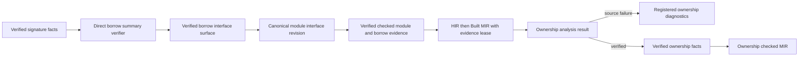

# RFC 0013: Ownership Analysis Integration Boundary

## Summary

This RFC defines the two upstream contracts required before RFC 0007 can be
redesigned over Built MIR:

1. one source-rejecting ownership-analysis result at RFC 0010
   `OwnershipProofValidation`; and
2. one revision-bound, cross-module direct-reference relation in RFC 0008
   module interfaces and the verified frontend handoff.

The first borrow-interface revision is deliberately conservative. It describes
only a direct reference result derived from a direct reference receiver or
parameter. Nested, parametric, opaque, and unverified extern reference results
are rejected. No AST ownership fallback, optional surface, compatibility
decoder, or second CFG is permitted.

## Motivation

RFC 0010 requires ownership analysis to consume `VerifiedBuiltMir`, but its
accepted `IrOperationResult` cannot represent source failures such as
use-after-move or conflicting loans. Treating those failures as IR invariants
would crash compilation for invalid source. Running ownership analysis on AST
or HIR would instead lose Built MIR places and complete semantic exits.

Cross-module calls also need a verified relation between a returned reference
and the receiver or parameter from which it derives. RFC 0008 publishes
signatures before dependent bodies are checked, but its accepted interface does
not carry that relation. A caller cannot inspect a foreign body or reconstruct
the relation from names, syntax, mutable tables, or source order.

The initial relation must remain sound under generics, re-exports, abstract
dispatch, and missing bodies. A compact root-only contract is preferable to an
unsound structural-leaf approximation. More expressive aggregate and explicit
region relations require a later language RFC.

## Goals

- Add a source-rejecting ownership result at exactly
  `OwnershipProofValidation`.
- Fix the verified success type to `VerifiedOwnershipFacts`.
- Preserve RFC 0011 identity failures and RFC 0010 IR invariant failures.
- Define a closed, deterministic direct-reference signature summary.
- Reject every reference result that the first summary revision cannot prove.
- Publish exact local, imported, re-exported, abstract, and dyn-call evidence.
- Publish one complete canonical RFC 0008 module-interface codec.
- Define exact diagnostics, precedence, codecs, oracles, and negative matrices.
- Make RFC 0007 depend on this RFC before returning to review.

## Non-Goals

- This RFC does not define move paths, loans, regions, reborrows, drop,
  coroutine, linear, or place-overlap algorithms; RFC 0007 owns them.
- This RFC does not add user-written lifetime or region syntax.
- This RFC does not encode nested reference leaves in tuples, objects, arrays,
  nominal values, unions, closures, or opaque values.
- This RFC does not permit a callee to store an input borrow beyond the call.
- This RFC does not define trusted extern reference contracts.
- This RFC does not add scoped-task, detached-task, cancellation, or suspension
  semantics.
- This RFC does not persist MIR, borrow summaries, or ownership facts.

## Prior Art

Rust separates signature lifetime elision from MIR borrow checking. Receiver
and single-input elision cover common direct-reference APIs, while ambiguous
relations require an explicit contract. ZOM adopts that conservative split but
does not add explicit lifetime syntax in this RFC.

Swift distinguishes source exclusivity failures from SIL verifier failures.
ZOM applies the same source-error versus compiler-invariant distinction at one
typed ownership operation.

ML module systems publish complete typed interfaces instead of requiring a
caller to inspect another module body. ZOM similarly publishes the direct
borrow relation under canonical definition identity and exact interface
revision.

The common failure modes are collapsing several reference regions into one,
reconstructing foreign contracts from shape, and trusting extern declarations
without proof. ZOM avoids them by accepting only root relations, reusing
foreign verified summaries, and rejecting unverified extern borrow surfaces.

## Guide-Level Explanation

A direct returned reference can be tied to the only direct reference input:

```zom
fun first(value: &Buffer) -> &Byte { value.first() }
```

A shared or mutable receiver is preferred when other direct reference
parameters are also present:

```zom
fun Buffer::choose(this: &Buffer, fallback: &Byte) -> &Byte {
    this.first()
}
```

A free function with two possible direct sources is rejected because ZOM does
not yet have explicit region syntax:

```zom
fun choose(left: &Byte, right: &Byte) -> &Byte
// error: returned reference region cannot be inferred
```

The first revision also rejects aggregate or parametric reference results:

```zom
fun wrap(value: &Byte) -> (&Byte, i32)
fun identity<T>(value: T) -> T
```

The second signature may instantiate `T` as a reference, so an empty summary
would be unsound. A generic direct-reference shell remains expressible because
its outer reference region does not change under substitution:

```zom
fun borrow<T>(value: &T) -> &T { value }
```

Borrow-bearing extern signatures are rejected until a trusted FFI contract is
accepted. Abstract and interface declarations may publish a direct relation,
but every concrete implementation must verify the same relation over Built
MIR.

## Reference-Level Design

### Normative Dependencies

RFC 0013 consumes the current canonical contracts in RFCs 0005, 0008, 0010,
and 0011. RFC 0010 owns the sole MIR revision codec and RFC 0013 owns the
borrow-evidence and ownership-result additions listed below. No alternate MIR
base or compatibility path is normative.

For RFC 0005, this RFC replaces only the body diagnostic registry and
production matrix to add `ZOM4085` for a borrow-bearing body-local closure that
the first borrow-summary revision cannot represent. The existing checked-body
source result and ordering remain unchanged.

For RFC 0008, this RFC replaces only:

- the complete `VerifiedModuleInterface` schema;
- `ModuleInterfaceSourceFailure` and its tags and precedence;
- the module-interface codec domain, stream, and oracle;
- the source and invariant publication matrix; and
- the checked evidence retained for borrow-signature consumption.

For RFC 0010, this RFC replaces only:

- the claim that `FeatureBoundaryVerificationResult` is the sole
  source-rejecting IR extension;
- the `OwnershipProofValidation` legality row and generated constructors;
- the `VerifiedCheckedModule` borrow-evidence handoff;
- ownership-result validation against the canonical Built MIR and
  borrow-evidence lineage;
- the ownership-fact Built/evidence revision lineage; and
- Acceptance Criterion 26's all-operations `IrOperationResult` claim.

The replacement text in this RFC is complete for those clauses. The RFC 0005,
RFC 0008, and RFC 0010 trackers record implementation evidence only and do not
create runtime dependencies.

### Total Borrow Shape Classification

The verifier classifies a semantic type before building a summary:

```text
BorrowShape =
  NoRegion
  | DirectRootRegion
  | NestedRegion
  | ParametricRegion
  | OpaqueRegion
```

Classification stops at `TypeData::Reference`: the outer reference is one
`DirectRootRegion`, and its referent is not traversed. `RawPointer` contributes
`NoRegion` because raw pointers are outside the safe borrow relation.

The following table is total over RFC 0005 `TypeData`:

| Type variant | Root classification |
|---|---|
| `Primitive` | `NoRegion` |
| `Reference` | `DirectRootRegion` |
| `RawPointer` | `NoRegion` |
| `TypeParameter` | `ParametricRegion` |
| `Function` | `OpaqueRegion` |
| `Existential`, `InterfaceBound` | `OpaqueRegion` |
| `Tuple`, `Object`, `DynamicArray`, `FixedArray`, `Union` | join child classifications, converting any child `DirectRootRegion` to `NestedRegion` |
| `Nominal` | substitute canonical arguments, then join all verified field classifications, converting any field `DirectRootRegion` to `NestedRegion` |
| `Slice` | upstream invariant if seen by value; behind a reference it is not traversed |
| `Intersection` | upstream invariant if used as a runtime value type |

The join order is `NoRegion < NestedRegion < ParametricRegion < OpaqueRegion`.
`DirectRootRegion` is valid only at the classified root and becomes
`NestedRegion` when joined by a containing constructor. Nominal traversal uses
a deterministic worklist over expanded `DefId` bytes. A re-entered nominal
contributes the current least fixed-point value; finite monotone updates reach
the unique result. A missing field signature, unsubstituted argument, invalid
runtime type, or non-canonical cycle is an upstream RFC 0005/RFC 0008 invariant,
not a borrow source diagnostic.

`ParameterMode::SharedReference` requires an outer
`Reference(Const, referent)` type and `MutableReference` requires an outer
`Reference(Mutable, referent)` type. `Value` and `Move` cannot claim a direct
input region merely because their semantic type is reference-shaped. A mode and
type disagreement is RFC 0008 `InvalidProjection`.

`ReceiverMode::Shared` and `Mutable` create one synthetic direct receiver
region over the owning `Self` type. `Static` and `Move` do not. No stored
receiver semantic type is required. A receiver mode on a callable without one
verified owning nominal/interface definition is `InvalidProjection`.

### Direct Borrow Signature Model

The first canonical algebra is:

```text
BorrowInputRegion =
  Receiver
  | Parameter(index: uint32)

BorrowReturnRelation =
  None
  | DirectRoot(source: BorrowInputRegion)

BorrowSignatureSummary {
  callable: DefId,
  directInputs: SortedUniqueSequence<BorrowInputRegion>,
  returnRelation: BorrowReturnRelation,
}
```

`BorrowInputRegion` tags are `Receiver = 0x01` and `Parameter = 0x02`.
`BorrowReturnRelation` tags are `None = 0x01` and `DirectRoot = 0x02`.
`Parameter.index` is zero-based and must name the same parameter in the frozen
callable signature. Fields encode in declaration order.

`directInputs` contains exactly the shared/mutable receiver and parameters
whose mode and outer semantic type establish a direct input region. It is
sorted by canonical encoding and rejects duplicates. Value and move parameters
never enter the set.

The result rule is exhaustive:

1. `NoRegion` publishes `None`.
2. `DirectRootRegion` rejects if any input has `NestedRegion`,
   `ParametricRegion`, or `OpaqueRegion`, because such an input may hide a
   different source region.
3. With a direct result, one direct input selects that input.
4. With several direct inputs, a direct receiver selects `Receiver`.
5. Every other direct result is ambiguous and rejects.
6. `NestedRegion`, `ParametricRegion`, and `OpaqueRegion` results reject as not
   expressible in the canonical revision.

Substitution cannot change an accepted outer `Reference` shell or its parameter
index. An unshielded type parameter, including `T -> T`, is
`ParametricRegion` and rejects. A type parameter beneath the referent of a
direct reference is not traversed, so `&T -> &T` remains stable.

### Body Conformance And Missing Bodies

RFC 0007 verifies these first-revision rules over Built MIR:

- a direct reference result derives only from the selected input region;
- no input borrow is written into global, heap, receiver, out-parameter,
  closure, coroutine-frame, or other storage that can outlive the call;
- no nested, parametric, or opaque result contains a non-static borrow;
- a no-result relation makes every input borrow call-scoped; and
- a mismatch is a source failure owned by RFC 0007, not an interface invariant.

This revision has no storage-effect relation. Therefore every input-to-storage
escape is rejected, even when a more expressive region system could prove it
safe.

An extern callable with any non-`NoRegion` input or result is rejected because
there is no body or accepted trusted proof. Abstract and interface declarations
may publish a signature-derived summary. Every concrete impl must have the same
canonical callable signature relation and pass RFC 0007 body conformance.
Witness and dyn dispatch consume the abstract/interface summary; they do not
select an implementation-specific relation.

### Signature Source Failures

Borrow signature construction has a closed source algebra:

```text
BorrowSignatureFailureKind =
  AmbiguousDirectResult
  | UnexpressibleResult
  | UnverifiedExternContract

BorrowSignatureFailure {
  kind: BorrowSignatureFailureKind,
  callable: DefId,
  primarySpan: SourceSpan,
  declarationSpan: SourceSpan,
  traversalOrdinal: uint32,
}
```

Kind tags are `0x01` through `0x03`. The diagnostics registry owns:

| Kind | Registered diagnostic |
|---|---|
| `AmbiguousDirectResult` | `ZOM4082 BorrowOutputRegionAmbiguous`, Error, `Returned reference region cannot be inferred`, arity 0 |
| `UnexpressibleResult` | `ZOM4083 BorrowOutputRegionUnexpressible`, Error, `Returned borrow relation requires an explicit region contract`, arity 0 |
| `UnverifiedExternContract` | `ZOM4084 BorrowExternContractUnverified`, Error, `Extern borrow relation is not verified`, arity 0 |

Failure selection for one callable is exact. Invalid signature identity or
mode/type projection is an invariant and precedes source classification. Then
an extern callable with any non-`NoRegion` input or result selects
`UnverifiedExternContract`; a `NestedRegion`, `ParametricRegion`, or
`OpaqueRegion` result selects `UnexpressibleResult`; a direct result with any
hidden nested, parametric, or opaque input also selects
`UnexpressibleResult`; and a remaining direct result without one unique input
or a direct receiver selects `AmbiguousDirectResult`. At most one source
failure is emitted per callable.

Failures use the RFC 0011 post-freeze diagnostic order: package key, crate key,
module key, validated `primarySpan`, mapped diagnostic ID, emitter ordinal, then
expanded callable key as the final tie-breaker. `primarySpan` is the checked
result-type span when present and otherwise equals `declarationSpan`.
`declarationSpan` is retained for bug context and notes. Rejection publishes no
summary, module interface, checked module, HIR, or MIR. There is no recovery
summary.

RFC 0008 `ModuleInterfaceSourceFailure` is replaced with:

```text
ModuleInterfaceSourceFailure =
  Binding { failure: RFC0004::BindingFailureRef }
  | Signature { failure: RFC0005::CheckerFailureRef }
  | BorrowSignature { failure: BorrowSignatureFailure }
```

Tags are `Binding = 0x01`, `Signature = 0x02`, and
`BorrowSignature = 0x03`. Publication is a staged operation with this exact
precedence:

1. forward an upstream binding invariant or source result unchanged;
2. forward an upstream signature invariant or source result unchanged;
3. validate RFC 0011 identities before dereferencing handles;
4. validate context, module, signature, imported-view, and source-interface
   revisions, selecting `InputMismatch`;
5. validate canonical input codecs, selecting `CanonicalCodecMismatch`;
6. validate input-stage mode/type, receiver owner, authorization, and imported
   origin consistency, selecting input-stage `InvalidProjection`;
7. on fully verified inputs, run borrow-shape source classification and return
   `BorrowSignature` source failures when non-empty;
8. only with no source failure, construct the interface candidate and validate
   `MissingProjection`;
9. validate `AdditionalProjection`; and
10. validate projection- or verification-stage `InvalidProjection`.

No candidate exists before step 8, so a source failure cannot hide a malformed
candidate and a candidate mutation cannot hide a source failure. Double and
triple fixtures cover identity plus ambiguous source, revision plus
unexpressible source, codec plus extern source, input invalidity plus source,
and each candidate-projection pair. Only the first legal stage is returned.

### Exact Callable Inventory And Foreign Reuse

The cross-module summary inventory is the sorted unique union of canonical
`SemanticSignature.definition` values whose payload is `Callable` in RFC 0008
`AuthorizedSignatureBundle.definitions` or `supportDefinitions`. The map key is
the canonical callable `DefId`, never a binding-alias `DefId`.

Every local callable in this inventory is derived from the exact frozen
`SignatureFactsRevision`. For a foreign or re-exported callable, the requester
collects every RFC 0005 `ImportedSignatureModule` whose `lookupDefinitions` or
`supportDefinitions` contains that canonical callable. Each record selects its
own `sourceModule` and `interfaceRevision`; the corresponding verified borrow
surface must contain the callable.

All collected summaries must be byte-identical. The proof source is the first
record sorted by expanded `sourceModule` key and then interface-revision bytes.
This handles `A` defining a callable, `B` re-exporting it, and `C` importing
`B`: `C` consumes `B`'s verified surface without requiring `A` to appear as a
direct imported module. If both `A` and `B` are visible, their summary bytes
must agree and the canonical proof-source order is deterministic.

The summary cannot be reconstructed from local signature shape. Several
authorized aliases of one canonical callable encode one summary. No collected
record is `MissingProjection`; an extra unauthorized callable is
`AdditionalProjection`; disagreement among collected summary bytes or an
alias-to-canonical mismatch is `InvalidProjection`; and a stale selected
interface revision is `InputMismatch`.

Body-local closures and enclosed callables absent from the two RFC 0008 maps do
not enter the module interface or `VerifiedBorrowEvidence`. RFC 0005 binds their
checked body facts, not `SignatureFactsRevision`. In this first revision, the
RFC 0005 body checker emits `ZOM4085 BorrowClosureContractUnexpressible`, Error,
`Body-local borrow-bearing closure requires an explicit region contract`, arity
0, when a closure callable input, result, or capture set contains
`DirectRootRegion`, `NestedRegion`, `ParametricRegion`, or `OpaqueRegion`.
The producer is `Return`, the stage is `Body`, the primary anchor is the closure
result type or closure expression, `itemOrdinal` is zero, and recovery is
`Never`.

The failure is an ordinary `CheckerFailureRef` returned through the accepted
RFC 0005 `CheckedVerificationResult::SourceRejected`; it publishes no checked
facts. Borrow-irrelevant closures require no summary. A closure call therefore
either has no borrow effect or never reaches verified checked-module assembly;
no summary is synthesized from body facts.

### Complete RFC 0008 Interface Replacement

The accepted `VerifiedModuleInterface` schema is replaced by this complete
field order:

```text
VerifiedBorrowInterfaceSurface {
  semanticContext: SemanticContextBrand,
  contextFingerprint: ContextFingerprint,
  module: ModuleId,
  signatureFactsRevision: SignatureFactsRevision,
  importedSignatureViewRevision: ImportedSignatureViewRevision,
  summaries: SortedMap<DefId, BorrowSignatureSummary>,
  revision: BorrowInterfaceRevision,
}

VerifiedModuleInterface {
  semantic_context_brand: SemanticContextBrand,
  revision: ModuleInterfaceRevision,
  package_id: PackageId,
  crate_id: CrateId,
  module_id: ModuleId,
  source_content_digest: Sha256Digest,
  binding_surface: VerifiedExportSurface,
  signature_facts_revision: SignatureFactsRevision,
  imported_signature_view_revision: ImportedSignatureViewRevision,
  borrow_surface: VerifiedBorrowInterfaceSurface,
  signatures: AuthorizedSignatureBundle,
  visible_bindings: [VisibleBinding],
  exported_bindings: [ExportedBinding],
  coherence_impl_heads: SortedMap<ImplId, RFC0005::ImplHead>,
  marker_facts: SortedMap<MarkerFactKey, RFC0005::MarkerFact>,
}
```

All context, module, signature, imported-view, and foreign source revisions must
match before summary validation. Missing, additional, invalid, and
non-canonical summaries use RFC 0008 `ZOM9951-ZOM9954`; input lineage mismatch
uses `ZOM9950`. No partial interface is published.

`ModuleInterfaceRevision` is SHA-256 over:

```text
ASCII("zom.module-interface-revision")
0x00
ContextFingerprint
Encode(expanded owning ModuleKey)
Encode(sourceContentDigest)
Encode(binding_surface.revision)
Encode(signature_facts_revision)
Encode(imported_signature_view_revision)
Encode(borrow_surface.revision)
EncodeSortedRecords(signatures.roots)
EncodeSortedRecords(signatures.definitions)
EncodeSortedRecords(signatures.supportDefinitions)
EncodeSortedRecords(visible_bindings)
EncodeSortedRecords(exported_bindings)
EncodeSortedRecords(coherence_impl_heads)
EncodeSortedRecords(marker_facts)
```

The independent empty-sequence oracle uses the canonical RFC 0008 fixture plus
32 borrow-revision bytes of `66`. Its complete 279-byte preimage is:

```text
7a6f6d2e6d6f64756c652d696e746572666163652d7265766973696f6e000000000000000000000000000000000000000000000000000000000000000000a1222222222222222222222222222222222222222222222222222222222222222233333333333333333333333333333333333333333333333333333333333333334444444444444444444444444444444444444444444444444444444444444444555555555555555555555555555555555555555555555555555555555555555566666666666666666666666666666666666666666666666666666666666666660000000000000000000000000000000000000000000000000000000000000000000000000000000000000000000000000000000000000000
```

Its SHA-256 is
`180fa61d71c6419dc0476128c90e40b55e805d6aeb57871d4f41d445f7b18585`.
### Summary And Surface Codecs

`BorrowSignatureSummary` uses this exact stream:

```text
ASCII("zom.borrow-signature-summary")
0x00
uint64be(expandedCallableKeyByteLength)
expandedCallableKeyBytes
uint64be(directInputCount)
encoded BorrowInputRegion values in canonical order
encoded BorrowReturnRelation
```

The non-empty oracle uses callable key `a1`, inputs `Receiver` and
`Parameter(2)`, and result `DirectRoot(Parameter(2))`. Its complete 58-byte
preimage is:

```text
7a6f6d2e626f72726f772d7369676e61747572652d73756d6d617279000000000000000001a10000000000000002010200000002020200000002
```

Its SHA-256 is
`fcaee879534108f89aa47013f72b6f17f6dd783def9ccd46029d76eb752ce603`.

The empty summary for callable `a1` has this complete 47-byte preimage:

```text
7a6f6d2e626f72726f772d7369676e61747572652d73756d6d617279000000000000000001a1000000000000000001
```

Its SHA-256 is
`cc571fedb7f910f31e1458668303e52ed5e7c1d71ca523a113ad68ca623aeca5`.

`BorrowInterfaceRevision` is SHA-256 over:

```text
ASCII("zom.borrow-interface")
0x00
ContextFingerprint
uint64be(expandedModuleKeyByteLength)
expandedModuleKeyBytes
SignatureFactsRevision
ImportedSignatureViewRevision
uint64be(summaryCount)
for each summary in expanded callable DefId order:
  uint64be(encodedSummaryByteLength)
  encoded BorrowSignatureSummary bytes
```

The empty-surface oracle uses a zero fingerprint, module `a1`, signature bytes
`22`, and imported-view bytes `33`. Its 134-byte preimage is:

```text
7a6f6d2e626f72726f772d696e746572666163650000000000000000000000000000000000000000000000000000000000000000000000000000000001a1222222222222222222222222222222222222222222222222222222222222222233333333333333333333333333333333333333333333333333333333333333330000000000000000
```

Its SHA-256 is
`799e2fed5be5220c268a5413afd2713520add15a0505105d61c9850c4256737a`.

The one-summary oracle embeds the complete 58-byte summary above. Its 200-byte
preimage is:

```text
7a6f6d2e626f72726f772d696e746572666163650000000000000000000000000000000000000000000000000000000000000000000000000000000001a1222222222222222222222222222222222222222222222222222222222222222233333333333333333333333333333333333333333333333333333333333333330000000000000001000000000000003d7a6f6d2e626f72726f772d7369676e61747572652d73756d6d617279000000000000000001a10000000000000002010200000002020200000002
```

Its SHA-256 is
`f9aa6a886615cbd3b5d0307d426cfa198ba656bdb320f7f17d6e3a8fd86dc799`.

The two-summary ordering fixture appends an empty callable `a2` summary after
the `a1` summary. Its complete 255-byte preimage is:

```text
7a6f6d2e626f72726f772d696e746572666163650000000000000000000000000000000000000000000000000000000000000000000000000000000001a1222222222222222222222222222222222222222222222222222222222222222233333333333333333333333333333333333333333333333333333333333333330000000000000002000000000000003d7a6f6d2e626f72726f772d7369676e61747572652d73756d6d617279000000000000000001a1000000000000000201020000000202020000000200000000000000327a6f6d2e626f72726f772d7369676e61747572652d73756d6d617279000000000000000001a2000000000000000001
```

Its SHA-256 is
`fbfa576a7b98b9d14e3293703257c54b9e71f9f773c71e713a58a3859606b20e`.

Bad tags, counts, lengths, order, duplicate inputs, duplicate callables, local
handle bytes, alias keys, stale source revisions, and hash mismatch are
`CanonicalCodecMismatch` or the earlier matching projection failure according
to the publication precedence.

### Verified Frontend Borrow Evidence

Checked-module assembly constructs one immutable evidence value:

```text
ImportedBorrowSurface {
  module: ModuleId,
  interfaceRevision: ModuleInterfaceRevision,
  surface: VerifiedBorrowInterfaceSurface,
}

VerifiedBorrowEvidence {
  semanticContext: SemanticContextBrand,
  contextFingerprint: ContextFingerprint,
  module: ModuleId,
  localSignatureFactsRevision: SignatureFactsRevision,
  localSummaries: SortedMap<DefId, BorrowSignatureSummary>,
  ownInterfaceRevision: ModuleInterfaceRevision,
  ownBorrowRevision: BorrowInterfaceRevision,
  importedSurfaces: SortedMap<ModuleId, ImportedBorrowSurface>,
  revision: BorrowEvidenceRevision,
}

BorrowEvidenceKey {
  module: ModuleId,
  revision: BorrowEvidenceRevision,
}

VerifiedBorrowEvidenceLease {
  semanticContext: SemanticContextBrand,
  repository: RegistryBrand,
  key: BorrowEvidenceKey,
}
```

`localSummaries` contains exactly the local callable rows in frozen
`VerifiedSignatureFacts`; body-local closures are excluded as specified above.
Each imported record embeds the complete immutable verified surface, not only a
digest. Its map key, embedded module, interface revision, borrow revision,
context, and requester-visible imported-signature record must agree exactly.

`BorrowEvidenceRevision` is SHA-256 over this exact stream:

```text
ASCII("zom.borrow-evidence")
0x00
ContextFingerprint
uint64be(expandedModuleKeyByteLength)
expandedModuleKeyBytes
SignatureFactsRevision
uint64be(localSummaryCount)
for each local summary in expanded callable DefId order:
  uint64be(encodedSummaryByteLength)
  encoded BorrowSignatureSummary bytes
ModuleInterfaceRevision
BorrowInterfaceRevision
uint64be(importedSurfaceCount)
for each imported surface in expanded source ModuleId order:
  uint64be(expandedSourceModuleKeyByteLength)
  expandedSourceModuleKeyBytes
  ModuleInterfaceRevision
  BorrowInterfaceRevision
```

The actual summary and imported-surface bytes are verified against the encoded
revisions before the evidence candidate is published. A duplicate module or
summary candidate is `AdditionalFact`; a missing expected row is
`MissingRequiredFact`; an embedded key or surface mismatch is `InvalidFact`;
a stale revision is `InputRevisionMismatch`; and invalid framing or digest is
`CanonicalCodecMismatch`, subject to the ownership input precedence below.

The empty fixture uses a zero fingerprint, module `a1`, signature bytes `22`,
no local summaries, own interface bytes `33`, own borrow bytes `44`, and no
imports. Its complete 173-byte preimage is:

```text
7a6f6d2e626f72726f772d65766964656e63650000000000000000000000000000000000000000000000000000000000000000000000000000000001a122222222222222222222222222222222222222222222222222222222222222220000000000000000333333333333333333333333333333333333333333333333333333333333333344444444444444444444444444444444444444444444444444444444444444440000000000000000
```

Its SHA-256 is
`82563cc1e964ee20cc8b2db144bce5b5a21a1728471cbc592ab0fca8f337aea6`.
Non-empty fixtures encode one local summary and one imported surface, then
mutate every count, length, key, revision, order, duplicate, and embedded
surface field independently and in precedence pairs.

One session-owned `BorrowEvidenceRepository` has a private RFC 0011
`RegistryBrand` and an immutable `SortedMap<BorrowEvidenceKey,
VerifiedBorrowEvidence>`. Only checked-module assembly may adopt a verified
candidate. Adoption rejects a duplicate key. The repository and every embedded
interface surface outlive HIR, MIR, ownership, and backend translation.

Resolving a lease first validates semantic-context and repository brands, then
the canonical module and exact revision key, and returns an immutable reference
to the complete evidence. A foreign, stale, swapped, missing, duplicated, or
post-teardown lease is rejected before any summary lookup or handle
dereference. No global registry, mutable session table, source module body, or
revision-only reconstruction is a legal lookup path.

`VerifiedCheckedModule` retains the lease. Direct, impl, witness, dyn, and
abstract/interface calls consume the RFC 0009 canonical dispatch target and
look up its canonical callable in the resolved local map or the complete set of
embedded imported surfaces authorized by the checked imported-signature view.
Foreign duplicates must be byte-identical and the proof source uses the same
expanded module/interface-revision order as interface publication. RFC 0009
binding and source provenance must name one member of that authorized set; it
cannot select an otherwise invisible surface. Borrow-bearing extern and
body-local closure calls never reach Built MIR. A missing or additional call
summary is `MissingRequiredFact` or `AdditionalFact`; a stale revision is
`InputRevisionMismatch`; unauthorized provenance, byte disagreement, or target
mismatch is `InvalidFact`; malformed bytes are `CanonicalCodecMismatch`.

### MIR Evidence Lineage

RFC 0010 owns the single canonical `MirRevisionInput`, the
`zom.mir-revision` domain, and the Built empty and non-empty oracles.
`BorrowEvidenceRevision` follows `DispatchFactsRevision` in that framing. This
RFC requires the verified Built capability to retain the matching lease:

```text
VerifiedBuiltMir {
  module: MirModule,
  revision: MirRevisionId,
  borrowEvidenceRevision: BorrowEvidenceRevision,
  borrowEvidenceLease: VerifiedBorrowEvidenceLease,
}
```

Ownership facts record the exact Built `MirRevisionId` and
`BorrowEvidenceRevision`. `OwnershipCheckedMir` can be constructed only when
both match the embedded verified Built MIR and the resolved lease. HIR carries
the same lease from `VerifiedCheckedModule`; MIR construction rejects a swap
before computing the revision. Built MIR contains no reserved phase tags,
successor certificate slots, or alternate codec.

### Ownership Source-Rejection Seam

RFC 0010 gains exactly one fixed operation:

```text
analyzeOwnership(
  built: VerifiedBuiltMir,
  evidence: VerifiedBorrowEvidenceLease,
) -> OwnershipAnalysisResult

OwnershipAnalysisResult =
  Verified { facts: VerifiedOwnershipFacts }
  | SourceRejected {
      failures: SortedNonEmptySequence<RFC0007::OwnershipSourceFailure>,
    }
  | IdentityInvariantRejected {
      failures: SortedNonEmptySequence<RFC0011::IdentityInvariant>,
    }
  | IrInvariantRejected {
      failures: SortedNonEmptySequence<RFC0010::IrFailureFact>,
    }
```

Result tags are `Verified = 0x01`, `SourceRejected = 0x02`,
`IdentityInvariantRejected = 0x03`, and `IrInvariantRejected = 0x04`.
There is no public generic verified-value parameter. RFC 0007 must replace the
qualified source-failure reference with its exact closed algebra before this
operation can move to implementation.

The operation and ownership proof verifier are one
`OwnershipProofValidation` phase. The exact precedence is:

1. validate context, identities, the canonical Built MIR artifact and revision,
   evidence lease, and evidence revision;
2. select identity failures before dereferencing invalid handles;
3. select `InputRevisionMismatch`, then `CanonicalCodecMismatch`, then the
   remaining legal RFC 0010 input invariants;
4. on completely verified input, run source analysis;
5. if any source failure exists, return `SourceRejected` and build no ownership
   candidate;
6. otherwise build and verify the ownership-fact candidate; and
7. publish `VerifiedOwnershipFacts` only after proof verification succeeds.

`SourceRejected` is legal only at `OwnershipProofValidation`. Identity failures
use RFC 0011. IR failures use only the accepted RFC 0010
`OwnershipProofValidation` kind/owner/site row and map to `ZOM9945`, except
`CanonicalCodecMismatch`, which maps to `ZOM9949`.

Generated phase-specific constructors expose the fixed operation above only.
HIR, MIR construction, cleanup, coroutine, LIR, and backend phases cannot name
the source constructor. A rejected result cannot carry ownership facts,
`OwnershipCheckedMir`, or any successor MIR. `FeatureBoundaryVerificationResult`
remains the only other source-rejecting IR result and remains legal only at
`FeatureBoundaryVerification`.

RFC 0010 Acceptance Criterion 26 is replaced by: every public IR operation
uses `IrOperationResult`, except the fixed ownership operation above and
registered pre-LIR feature gates using `FeatureBoundaryVerificationResult`.
All three result algebras retain mutually exclusive branches and publish no
verified value or proof on rejection.

### Determinism And Concurrency

Signature classification and summary construction use frozen semantic types
and signature facts. Local and foreign callables sort by expanded canonical
keys. Parallel workers may build candidates, but one deterministic verifier
publishes the surface. Worker count, map seed, handle slot, alias spelling,
source order, and completion order cannot affect facts, diagnostics, revisions,
or dumps.

This RFC adds no task or suspension semantics. RFC 0007 must conservatively
reject borrows live across suspension or depend on a later accepted concurrency
RFC. It cannot infer scoped-task safety from API names.

### Architecture Flow



## Repository Impact

| Area | Paths | Owner |
|---|---|---|
| Task routing and cross-RFC escalation | `.codex/subagents/**` | `task-router` |
| RFC overlay governance and RFC 0007 dependency | `docs/rfc/0005-type-system-architecture.md`, `docs/rfc/0007-borrow-lifetime-ownership-checker.md`, `docs/rfc/0008-compiler-session-cross-module.md`, `docs/rfc/0010-intermediate-representation-pipeline.md`, `docs/rfc/0013-ownership-analysis-integration-boundary.md`, `docs/rfc/tracking/0005-review-and-implementation.md`, `docs/rfc/tracking/0007-review-and-implementation.md`, `docs/rfc/tracking/0008-review-and-implementation.md`, `docs/rfc/tracking/0010-review-and-implementation.md`, `docs/rfc/tracking/0013-review-and-implementation.md`, `docs/rfc/README.md` | `rfc` |
| Borrow shape, receiver/parameter validation, and signature facts | `zomlang/compiler/checker/**`, `zomlang/compiler/type/**` | `binder-checker` |
| Borrow surface, canonical module interface, aliases, and re-exports | `zomlang/compiler/driver/**`, `zomlang/compiler/symbol/**` | `module-system` |
| `ZOM4082-ZOM4085`, interface invariants, and result mapping | `zomlang/compiler/diagnostics/**` | `error-system` |
| Suspension non-implication audit | `docs/spec/chapters/15-concurrency.md`, `docs/concurrency/**` | `concurrency` |
| MIR proof result seam, evidence lease, and typestate | `zomlang/compiler/mir/**`, `zomlang/compiler/hir/**` | `ir-backend` |
| Reference, storage, extern, and ABI safety boundary | `docs/spec/chapters/14-memory-management.md`, `zomlang/runtime/**` | `runtime-memory` |
| Type, module, memory, and compiler-contract alignment | `docs/spec/**`, `docs/design/**` | `spec-audit` |
| Codec, diagnostics, architecture, and conformance gates | `zomlang/tests/**`, `scripts/**` | `verification` |

## Security And Safety Impact

Misclassifying a source borrow failure as an invariant could crash compilation.
Collapsing several nested or generic regions could let a returned reference
outlive its referent. Trusting an extern declaration could publish a contract
that no body proves. The design prevents all three by separating the ownership
source seam, accepting only stable root relations, and rejecting unverified
extern borrow signatures.

No summary contains source spelling, object addresses, local handle slots, raw
pointers, or foreign body details. Diagnostics expose only registered messages
and validated declaration spans.

## Drawbacks And Risks

- Aggregate, opaque, and unshielded generic reference results are rejected.
- Input borrows cannot escape through mutable storage, even when safe under a
  richer explicit region system.
- Borrow-bearing extern functions remain unavailable without a trusted RFC.
- The canonical module-interface contract changes every producer and consumer
  together.
- A second specialized IR result algebra increases generated matrix coverage.

## Alternatives Considered

- **Report source failures as IR invariants.** Rejected because invalid source
  is not a compiler defect.
- **Run ownership on AST or HIR.** Rejected because only Built MIR has complete
  places and semantic exits.
- **Store only an input parameter without classifying the result.** Rejected
  because one aggregate input can contain several independent regions.
- **Encode arbitrary structural reference leaves now.** Rejected because
  generic substitution, opaque types, storage effects, and recursive nominal
  traversal require explicit language semantics not yet accepted.
- **Reconstruct foreign summaries.** Rejected because aliases and imported
  revisions would no longer prove the same contract.
- **Trust extern signatures.** Rejected because no body or proof establishes
  conformance.

### RFC 0025 Source-Backed Core Replacement

RFC 0025 replaces the imported-interface input boundary of this RFC at
accepted proposal SHA-256
`4f4085c176a9f391115e12170da93af899e350fa92440d5a51577692faf8bad0`.
Callable user-module borrow behavior remains unchanged:

| RFC 0013 Surface | Normative Replacement |
|---|---|
| Borrow-evidence input | Replace imported `VerifiedModuleInterface` inputs with the same canonically ordered `VerifiedInterfaceSource` set consumed by checked-module assembly. |
| User branch | Preserve the complete `VerifiedBorrowInterfaceSurface`, callable summary collection, revision validation, and `ImportedBorrowSurface` publication. |
| Toolchain-core branch | Validate exact context, module, interface revision, lookup and support definitions, and the closed no-callable core signature algebra. Publish no imported borrow-surface row. |
| Revision lineage | Match every imported signature record's `ImportedInterfaceRevision` to the exact interface-source alternative. `ImportedBorrowSurface.interfaceRevision` remains `ModuleInterfaceRevision` because only the user branch can publish a callable surface. |
| Failure mapping | Use RFC 0010 `InputRevisionMismatch` for same-alternative context, module, or revision disagreement; `MissingRequiredFact` for a missing core interface; `AdditionalFact` for a duplicate source or synthetic surface; `InvalidFact` for a callable core definition, user wrapper, valid wrong alternative, or unauthorized definition; and `CanonicalCodecMismatch` for an illegal tag, bootstrap-only payload, or malformed signature bytes. |
| Evidence and invalidation | Keep `VerifiedBorrowEvidence.importedSurfaces` callable-only. The ordinary module's interface revision and checked-module visible-interface lineage still invalidate on every core signature or export change. |
| Future extension | A callable core declaration requires a separately accepted RFC that defines its borrow surface and atomically replaces the closed no-callable branch. No empty placeholder surface or compatibility path is permitted. |
| Native gates | Add marker-only core imports, re-exports, wrong-branch, wrong-revision, synthetic-surface, injected-callable, checked-module, HIR, MIR, and architecture mutation cases. |

Implementation and evidence are owned by RFC 0025 tasks `R25-09A`,
`R25-10`, `R25-09B`, `R25-08T`, `R25-14`, and `R25-15`. This
synchronization does not claim production ownership-result publication.

## Compatibility And Rollout

1. add RFC 0013 to RFC 0007's dependencies before RFC 0007 returns to DRAFT;
2. implement borrow signature source failures and root-only summaries;
3. replace every module interface producer and consumer with the canonical
   contract;
4. retain verified borrow evidence through checked module, HIR, and Built MIR;
5. implement the fixed ownership result with RFC 0007's accepted failure
   algebra; and
6. delete incomplete constructors, AST ownership paths, and any foreign-summary
   reconstruction in the same change.

Rollback before landing reverts the complete overlay implementation. There is
no dual schema, optional surface, decoder, shim, feature flag, or fallback.

## Documentation And Teaching Plan

- Add root-only elision and rejection rules to Chapters 3 and 14.
- Document the source-error versus compiler-invariant ownership boundary.
- Explain that module interfaces publish canonical region relations, not
  lifetime names or foreign bodies.
- Add examples for direct input, receiver, ambiguity, aggregate, generic, and
  extern rejection.

## Operational Readiness

CI rejects any ownership source result outside `OwnershipProofValidation`, any
module interface without a complete borrow surface, and any consumer that
reconstructs foreign summaries. Revisions and
diagnostics must be byte-identical under worker counts `1, 2, 4, 8`, fixed map
seed permutations, reversed source order, aliases, and re-exports.

## Acceptance Criteria

1. The overlay binds the exact accepted RFC 0005/0008/0010/0011 hashes and
   lists every replaced clause.
2. RFC 0007 requires RFC 0013 before returning to DRAFT or REVIEW.
3. Borrow shape classification is total over every RFC 0005 `TypeData`,
   receiver mode, and parameter mode.
4. Direct input and receiver elision produce deterministic summaries.
5. Nested, parametric, opaque, ambiguous, and unverified extern reference
   results publish no interface and emit only `ZOM4082-ZOM4084`; borrow-bearing
   body-local closures emit only `ZOM4085` before checked-module assembly.
6. Foreign and re-exported summaries are reused under canonical callable
   identity and exact source revisions.
7. Empty, one-summary, and two-summary summary/surface oracles reproduce their
   exact lengths and SHA-256 values.
8. The canonical module-interface codec reproduces the 279-byte oracle.
9. RFC 0008 publication uses the exact source/invariant precedence and no
   rejected branch publishes a partial interface.
10. Verified borrow evidence reaches Built MIR through a branded immutable
    repository lease and covers direct, impl, witness, dyn, and abstract calls;
    borrow-bearing body-local closures fail with `ZOM4085` before assembly.
11. `analyzeOwnership` has the fixed success type, runs only at
    `OwnershipProofValidation`, and publishes no fact or successor on rejection.
12. Generated tests cover result branch by every phase, wrong success type,
    source result outside ownership, and rejected results carrying successor
    values.
13. Generated interface tests cover identity plus revision plus codec plus
    projection multi-mutation precedence; wrong mode/type; generic `T -> T`;
    aggregate and opaque outputs; alias/canonical swaps; missing/additional
    inventory; extern reference signatures; and body-local closure rejection.
14. Architecture gates forbid AST, `NodeId`, `BindingMetadata`, `TypeEnv`, name
    lookup, foreign body reads, foreign summary reconstruction, and a second CFG
    at the ownership seam.
15. Worker and input permutations produce byte-identical summaries, revisions,
    diagnostics, and dumps.
16. RFC 0005, RFC 0008, and RFC 0010 trackers record executable evidence for
    the current canonical contract before implementation begins.
17. `python3 scripts/check-rfc.py`, `python3 scripts/check-format.py`, default
    CTest, spec alignment, and `git diff --check` pass before `LANDED`.

## Implementation Plan

1. Add total borrow shape classification and typed signature source failures.
2. Add canonical summaries, source-summary reuse, and codec oracles.
3. Replace RFC 0008 interface publication and revision with the canonical
   contract.
4. Add verified local/imported borrow evidence to checked-module assembly.
5. Retain the evidence lease through HIR and Built MIR.
6. Rewrite RFC 0007 over Built MIR and provide its closed source algebra.
7. Implement the fixed ownership result and ownership-fact verification.
8. Delete AST ownership analysis and incomplete constructors.
9. Run the complete architecture, determinism, sanitizer, and conformance
   matrix before `LANDED`.

## Test Plan

- Unit tests: every shape-table row, fixed-point nominal traversal, receiver and
  parameter consistency, all result rules, source precedence, tags, codecs,
  and exact oracles.
- Lit tests: direct input and receiver success; ambiguous, aggregate, generic,
  opaque, extern, body-local closure, body-conformance, and storage-escape
  rejection.
- Module tests: local, cross-package, alias, re-export, abstract, witness, dyn,
  missing/additional/stale/swapped surfaces, and no partial publication.
- IR tests: every result branch and phase, evidence lineage, stale/foreign
  Built MIR, source-versus-invariant precedence, and successor suppression.
- Determinism: workers `1, 2, 4, 8`, fixed map-seed permutations, reversed
  modules/functions, and repeated clean processes.
- Gates: sanitizer build, default CTest, format, RFC checker, spec alignment,
  architecture checks, and diff hygiene.

## Open Questions

None

## Status History

| Date | Status | Notes |
|---|---|---|
| 2026-07-11 | DRAFT | Created the ownership source-rejection seam and verified cross-module borrow-signature surface required before RFC 0007 can be redesigned over Built MIR. |
| 2026-07-11 | DRAFT | Defined the conservative root-only contract, complete canonical module-interface codec, typed signature failures, foreign-summary reuse, and revision-bound frontend evidence. |
| 2026-07-11 | REVIEW | Entered formal owner review after semantic and invariant entry reviews approved the root-only contract, branded evidence repository, canonical module interface, canonical MIR revision, staged failure precedence, and transitive re-export proof selection. |
| 2026-07-11 | ACCEPTED | All ten required owners approved the same exact REVIEW snapshot with no objections. The accepted design remains unimplemented until an explicit `ACCEPTED -> IMPLEMENTING` transition. |
| 2026-07-17 | IMPLEMENTING | Started the direct ownership-integration replacement series with the accepted borrow-interface surface, branded BorrowEvidence repository, checked-module and HIR evidence lineage, MIR revision, and ownership-result seam. No predecessor or compatibility rail is permitted. |
| 2026-07-25 | IMPLEMENTING | Synchronized RFC 0025's accepted exhaustive interface-source borrow input, closed no-callable core branch, failure mapping, and invalidation lineage at proposal SHA-256 `4f4085c176a9f391115e12170da93af899e350fa92440d5a51577692faf8bad0`; implementation evidence remains owned by the named R25 tasks. |
