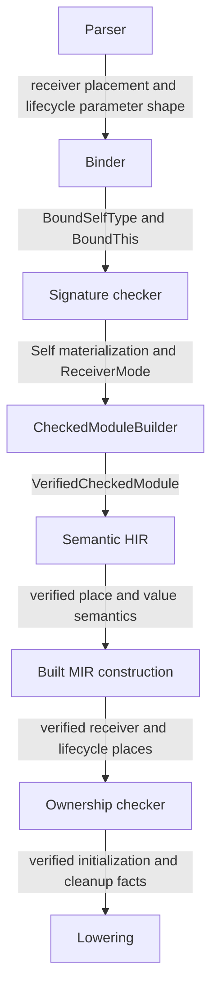

# RFC 0014: Contextual Self And Receiver Semantics

## Summary

This RFC defines one closed contract for contextual `Self`, explicit method
receivers, and the `this` value available during initialization and
deinitialization. It overlays the binding, signature, dispatch, and ownership
contracts in RFC 0004, RFC 0005, RFC 0009, RFC 0010, RFC 0011, and RFC 0013
without adding a compatibility path.

Ordinary instance methods declare an explicit first receiver. `Self` is a
contextual type owned by the nearest nominal, interface, or impl context.
`init` and `deinit` remain special callables: they do not declare receiver
parameters, and their bodies receive verified initialization or destruction
places rather than ordinary method receivers.

## Motivation

The accepted architecture defines `ReceiverMode = Static | Shared | Mutable |
Move`, but it does not define a total mapping from receiver syntax and method
modifiers to that algebra. The binder has a special `DefId(Parameter)` for
`this`, while explicit `Self` annotations still enter ordinary lexical name
lookup. The type system has no canonical representation for interface `Self`,
and the callable signature algebra separates a receiver from ordinary
parameters while the implementation still places it in a structural function
type.

Initialization and destruction need a different semantic object. An
initializer operates on storage whose fields may not all be initialized. A
deinitializer operates on storage whose lifetime is ending. Treating either as
an ordinary shared, mutable, or move receiver would allow the frontend to
publish permissions that have not been proven.

The missing contract blocks a correct implementation of explicit `this: Self`,
receiver ownership, object safety, constructor checking, destructor checking,
and RFC 0013 receiver regions.

## Goals

- Define the exact scope and canonical identity of contextual `Self`.
- Define the complete accepted receiver forms and their unique
  `ReceiverMode` mapping.
- Keep receiver identity out of ordinary parameters and structural function
  type identity.
- Define `init` and `deinit` as lifecycle callables with dedicated places.
- Define source diagnostics, invariant failures, ownership boundaries, and
  verification evidence required before implementation.

## Non-Goals

- General arbitrary receiver types or smart-pointer receiver families.
- User-written lifetime parameters or receiver lifetime syntax.
- A definite-initialization, inheritance-initialization, or drop-elaboration
  algorithm; the lifecycle sections define only the typed boundary consumed by
  the RFC 0007 redesign and RFC 0010.
- Constructor overload resolution, initializer delegation, or inheritance
  ordering.
- Receiver-bearing lifecycle declarations.

## Prior Art

### Rust contextual Self and receiver types

The Rust Reference gives `Self` a context-owned scope in nominal, trait, and
implementation bodies and restricts method receiver types to a closed family
rooted in the implementing type. ZOM adopts contextual ownership, explicit
receiver identity, and a closed receiver family. ZOM does not adopt arbitrary
receiver indirection in this revision because RFC 0005 and RFC 0013 have no
verified adjustment contract for it.

References:

- <https://doc.rust-lang.org/reference/names/scopes.html#self-scope>
- <https://doc.rust-lang.org/reference/items/associated-items.html#methods>

### Swift initialization and deinitialization

Swift treats initialization as a special operation that must establish every
stored property before the instance can be used, and it treats deinitializers
as parameterless cleanup declarations invoked by the runtime. ZOM adopts the
separation between lifecycle places and ordinary method receivers, including
the ban on using an incompletely initialized instance as a normal value.
Swift limits `deinit` to classes and omits parentheses. ZOM deliberately keeps
the repository's parenthesized declaration shape and permits lifecycle bodies
on class, struct, and error nominals; those differences do not change the
special-place boundary.

References:

- <https://docs.swift.org/swift-book/documentation/the-swift-programming-language/initialization/>
- <https://docs.swift.org/swift-book/documentation/the-swift-programming-language/deinitialization/>

### C++ explicit object parameters

C++23 explicit object parameters separate an object's call role from ordinary
parameters and do not give constructors an implied object argument during
overload resolution. ZOM adopts the separation between receiver and ordinary
parameter lists and keeps lifecycle construction outside ordinary receiver
dispatch.

Reference:

- <https://www.open-std.org/jtc1/sc22/wg21/docs/papers/2021/p0847r7.html>

Rust also rejects moving a field out of a value with destruction behavior and
makes `Copy` and `Drop` mutually exclusive. RFC 0007 must decide the equivalent
ZOM destruction permissions before lifecycle implementation.

References:

- <https://doc.rust-lang.org/error_codes/E0509.html>
- <https://doc.rust-lang.org/core/ops/trait.Drop.html>

### Go receiver ownership

The Go specification binds a method to one receiver base type and requires a
single receiver declaration. ZOM adopts the principle that method membership
and receiver validity are determined against one verified owner identity, not
against a matching source spelling.

Reference:

- <https://go.dev/ref/spec#Method_declarations>

## Guide-Level Explanation

An ordinary member is static unless it declares `this` first. A receiver may
use one of these forms:

```zom
class Buffer {
    fun len(this) -> usize { ... }
    fun inspect(this: &Self) { ... }
    mutating fun clear(this) { ... }
    fun reserve(this: &mut Self, additional: usize) { ... }
    fun into_bytes(#[zom::param::move] this) -> u8[] { ... }
}
```

Bare `this` and `this: Self` are equivalent. A non-mutating base receiver is
shared. `mutating` changes a base receiver to mutable. `&Self` is shared,
`&mut Self` is mutable, and `zom::param::move` consumes the receiver.

`Self` denotes the nearest semantic owner:

- in a nominal body, the current generic nominal instantiation;
- in an interface, the eventual implementing type;
- in an impl, the exact impl target after generic substitution.

Initializers and deinitializers do not declare `this` as a parameter:

```zom
class FileHandle {
    let descriptor: i32;

    init(descriptor: i32) {
        this.descriptor = descriptor;
    }

    deinit() {
        close(this.descriptor);
    }
}
```

Inside `init`, `this` denotes an initialization place. Inside `deinit`, it
denotes a destruction place. This RFC defines those identities but grants no
field, borrow, call, move, or escape permission; the RFC 0007 redesign defines
the permitted operations over Built MIR before lifecycle syntax can migrate.

## Reference-Level Design

### Bound base revisions

This draft is an overlay over these repository snapshots:

| RFC | SHA-256 |
|---|---|
| RFC 0004 | `63461c5af6d9b2ec32b742167a98f9c27dc8ff9183042ec95c2127c7bd6a6ad4` |
| RFC 0005 | `5c61e7a993867385f9a895054d25e4a9fe6f891b1c26d55fd1a4dfb3b3bb7d35` |
| RFC 0009 | `d29bac1e9cad25cee673e17c6b922ba935b669549dc8c44f05eba5900e75f362` |
| RFC 0010 | `c244a3ebae5b35e974a4b19331d218d0a1c6a1b9814729407d9afad1dd806124` |
| RFC 0011 | `383dc8905ae389949008f47f3b501d812a26d91769460d7e41731283b2f8cc03` |
| RFC 0013 | `e3909d5caad48a1c0255ee57d2a8fcc327e046945f20a586e0c6bf0115a237c3` |

Review must restart if any bound file changes before this RFC reaches
`ACCEPTED`.

### Contextual Self

```text
SelfOwner =
  Nominal(owner: DefId)
  | Interface(owner: DefId)
  | Impl(owner: ImplOccurrenceId)

BoundSelfType {
  syntax: NodeId,
  owner: SelfOwner,
  sourceSpan: SourceSpan,
}
```

`SelfOwner` tags are `Nominal = 0x01`, `Interface = 0x02`, and `Impl =
0x03`. A nominal or interface payload expands its RFC 0011 `DefId`. An impl
payload expands the occurrence handle through the frozen RFC 0018 occurrence
entry to its complete `ImplSourceOccurrenceKey`; the dense handle slot is never
encoded. The binding candidate and verified metadata each add
`selfTypes: SortedMap<NodeId, BoundSelfType>`. Records sort by unsigned
`NodeId` and encode `uint32be(syntax)`, the owner tag and expanded owner key,
then the expanded source span.

The binder publishes one `BoundSelfType` for every contextual root `Self` in a
type path. `syntax` is the outer `NamedTypeExpr` that owns the path and
`sourceSpan` is the exact `Self` token. A direct `Self` and the root of
`Self::Item` each publish one fact; the latter retains its associated tail in
the AST for signature checking. Parenthesized `(Self)` publishes the fact for
its inner `NamedTypeExpr`. `foo::Self` is an ordinary qualified path and
publishes no contextual fact. The parser-generated annotation for bare `this`
publishes no `BoundSelfType` because it has no lexical `Self` token.

The binder publishes no `BoundSelfType` for an impl head. An impl owner becomes
active only after its interface path, target type, generic parameters, and
where clause have verified binding facts. It applies to direct member
signatures and bodies, including nested closures and nested ordinary callables.
Nominal and interface owners likewise begin at their body, not their header.
Only a successfully classified ordinary braced occurrence may become an impl
`SelfOwner`. A bodyless marker occurrence owns an empty impl-body scope but
publishes no contextual `Self` owner.

It publishes no `BindingNameKey`, `ScopeBindingEntry`, ordinary `BoundName`, or
fabricated definition for that path. The owner is the nearest enclosing type,
interface, or impl scope. A nested owner shadows the outer owner. Closures and
nested ordinary callables inherit the type context but do not create one.

At module scope or any scope with no `SelfOwner`, lexical `Self` produces
`ZOM3025 ContextualSelfOutsideType`. A qualified path ending in `Self` is an
ordinary path and does not use this rule.

Signature checking materializes `Self` as follows:

| Owner | Semantic materialization |
|---|---|
| `Nominal(definition)` | the nominal type identified by `definition`, instantiated with the owner's active generic parameters |
| `Interface(definition)` | `TypeData::InterfaceSelf { interface: definition }` |
| `Impl(occurrence)` | the verified canonical impl target reconstructed from that source occurrence and published under its shared authority |

`InterfaceSelf` is a canonical semantic type, not a name or an inference
variable. It may appear only in a signature owned by its interface or while
checking a matching impl. Impl conformance substitutes it with the exact impl
target before comparing signatures.

RFC 0005 `TypeData` appends
`InterfaceSelf(interface: DefId)` with variant tag `0x10`; tags `0x01-0x0f`
remain assigned to their existing variants. Its canonical payload is the
expanded interface `DefId`. A non-interface definition, foreign semantic
context, or interface-self value outside its permitted signature context is a
verified-fact invariant failure.

The interner key domain changes to `ASCII("zom.semantic-type-key")` and
encodes tag `0x10` followed by the expanded interface `DefId`. Equality,
ordering, and hashing use those bytes. Two `InterfaceSelf` values unify only
when their interface definitions are identical. They have no implicit
coercion, cast, or normalization to a nominal type. Impl conformance first
substitutes the matching interface's `InterfaceSelf` with the canonical
`ImplHead.selfType`; selected-call substitution then applies the call's
`CanonicalSubstitutionId`. No `InterfaceSelf` may reach executable HIR or MIR.
The canonical semantic-type codec has these independent golden vectors. The nominal
and interface fixtures use the already-canonical expanded definition bytes
`a1`; the nominal fixture has no type arguments. The final row proves recursive
expansion of `InterfaceSelf` under a reference without inventing an unresolved
projection `TypeData` variant.

| Input | Complete preimage hex | SHA-256 |
|---|---|---|
| `Primitive(I32)` | `7a6f6d2e73656d616e7469632d747970652d6b6579000103` | `edbd50f06b02d4d14baeb6b1f07fcf941d14b594724b927f96b3fae528fec5ed` |
| `Nominal(a1, [])` | `7a6f6d2e73656d616e7469632d747970652d6b65790008a10000000000000000` | `811b765a1ed0b02f8d0758fa323a8a15ef1fe0fce006a2f56d2b3b289f4744ff` |
| `InterfaceSelf(a1)` | `7a6f6d2e73656d616e7469632d747970652d6b65790010a1` | `0534cda2f6356c991fb390bff9f42d3abcfbdd436ec89e34c7688a76cc68def3` |
| `Reference(Const, InterfaceSelf(a1))` | `7a6f6d2e73656d616e7469632d747970652d6b6579000c0110a1` | `6a95d8f3fdfe8908639f5ed7a009ce363998a7ed14773d7b345b1ced06c313bb` |

During impl signature checking, contextual `Self` materializes as the
canonical `ImplHead.selfType` containing the impl type-parameter `DefId` values.
Conformance applies the interface-to-impl substitution. Selected call checking
applies call-site substitution only after selection. These stages cannot use a
rendered type name or an already call-substituted type as impl identity.

For interface inheritance, each interface has a sorted, duplicate-free
transitive closure containing its own instantiation and every parent
instantiation, keyed by the complete canonical `InterfaceInstantiation`
encoding. Exact diamond repeats deduplicate, while two instantiations of the
same interface `DefId` with different arguments remain distinct. When
comparing a child declaration with an inherited declaration, every
`InterfaceSelf` whose owner `DefId` occurs in that inherited instantiation's
closure is rebased to the child's `InterfaceSelf`, and all interface arguments
retain the exact path substitution. When checking an impl, each closure
instantiation applies its own interface-argument substitution while every
covered `InterfaceSelf` maps to the same canonical impl target. An
`InterfaceSelf` outside the relevant closure is unrelated and cannot unify or
substitute.

For `Self::Item`, signature checking first selects the contextual `Self` owner.
An interface owner searches its own canonical instantiation and verified
transitive parent closure. An impl owner searches its verified
`ImplHead.interface` instantiation and that interface's verified transitive
parent closure. A nominal owner has no unqualified associated-type candidate;
`Self::Item` in a nominal body produces `ZOM4020`, while the existing fully
qualified `<Self as I>::Item` form remains available through RFC 0005. This
keeps nominal signature checking independent of the later global coherence
view.

For the two searchable owner kinds, the checker collects `(declaring
InterfaceInstantiation, associated DefId)` candidates named `Item`. Candidates
sort and deduplicate by the complete interface instantiation encoding followed
by expanded associated `DefId`; the same associated definition reached under
different type arguments remains distinct. One direct declaration on the
selected root interface wins over inherited candidates. Otherwise zero
candidates produce `ZOM4020`, one candidate is selected, and multiple
candidates produce `ZOM4021` in canonical candidate order. The checker
constructs RFC 0005 `ProjectionKey` with `subject` equal to the materialized
contextual `Self`, `interface` equal to the selected declaring interface
instantiation, and `associated` equal to the selected associated type `DefId`.
Projection normalization and impl associated bindings then follow RFC 0005;
no unresolved projection enters a successful semantic type.

RFC 0013 classifies `InterfaceSelf` as `ParametricRegion`. Its receiver-owner
invariant is replaced: a receiver callable is valid when its verified semantic
owner is a nominal/interface `DefId`, or an `ImplOccurrenceId` whose
independently reconstructed source header supplies one canonical impl target
under the occurrence entry's shared `ImplId` authority. The receiver region uses
the stage-appropriate canonical self type described above. Module-interface canonical
inherits RFC 0013 canonical's complete field order and encoding, changes only the
domain to `ASCII("zom.module-interface-revision")`, and expands semantic
types through the canonical semantic-type key. No canonical decoder remains after cutover.

The independent empty-sequence oracle reuses RFC 0013's component fixture. Its
complete 279-byte preimage is:

```text
7a6f6d2e6d6f64756c652d696e746572666163652d7265766973696f6e000000000000000000000000000000000000000000000000000000000000000000a1222222222222222222222222222222222222222222222222222222222222222233333333333333333333333333333333333333333333333333333333333333334444444444444444444444444444444444444444444444444444444444444444555555555555555555555555555555555555555555555555555555555555555566666666666666666666666666666666666666666666666666666666666666660000000000000000000000000000000000000000000000000000000000000000000000000000000000000000000000000000000000000000
```

Its SHA-256 is
`180fa61d71c6419dc0476128c90e40b55e805d6aeb57871d4f41d445f7b18585`.

The one-record framing oracle replaces the empty `signatures.definitions`
sequence with one already-canonical component whose bytes are the
`InterfaceSelf(a1)` semantic-type key above. This isolates module sequence
framing from semantic-signature validity. Its complete 303-byte preimage is:

```text
7a6f6d2e6d6f64756c652d696e746572666163652d7265766973696f6e000000000000000000000000000000000000000000000000000000000000000000a122222222222222222222222222222222222222222222222222222222222222223333333333333333333333333333333333333333333333333333333333333333444444444444444444444444444444444444444444444444444444444444444455555555555555555555555555555555555555555555555555555555555555556666666666666666666666666666666666666666666666666666666666666666000000000000000000000000000000017a6f6d2e73656d616e7469632d747970652d6b65790010a100000000000000000000000000000000000000000000000000000000000000000000000000000000
```

Its SHA-256 is
`5399dfc03737f4633203748d7b3fc93cc077c7fbb65357a3e6834a31a1ad3d7d`.
Implementation tests additionally compose a valid exported interface
signature containing `InterfaceSelf`; the framing oracle does not replace that
semantic integration test.

### Ordinary receiver context

Only a direct method or accessor member of a nominal, interface, or impl may
declare a receiver. Module functions, block functions, extern functions,
function expressions, and lambdas cannot declare one. A forbidden receiver
produces `ZOM2095 ReceiverNotAllowedHere` at the `this` token.

The receiver remains the unique first parameter and has no default value. It
owns the RFC 0004 special `DefId(Parameter)` and the callable's receiver place.
It does not enter `CallableSignature.parameters`, ordinary argument arity, or a
structural `Function` type's parameter sequence.

```text
ReceiverSignature {
  parameter: DefId(Parameter),
  mode: ReceiverMode,
}

CallableSignature {
  genericParameters: Sequence<GenericParameterSignature>,
  receiver: Maybe<ReceiverSignature>,
  parameters: Sequence<ParameterSignature>,
  success: SemanticTypeId,
  raises: Maybe<SemanticTypeId>,
  abi: Maybe<ExternAbi>,
}
```

This replaces RFC 0005's `Maybe<ReceiverMode>`. A receiver `DefId(Parameter)`
is excluded from standalone `ValueSignature` rows and appears exactly once as
the nested `ReceiverSignature.parameter` of its owning callable. Ordinary
parameter definitions still publish `ValueSignature`. Signature verification
requires the frozen parameter census to partition exactly into nested receiver
parameters and ordinary parameter value signatures, with no overlap or
missing definition. A receiver signature stores no `SemanticTypeId`; its owning
`Self` materialization plus mode is the complete semantic contract.

### Receiver normalization

This RFC replaces the accepted receiver algebra with
`ReceiverMode = Shared | Mutable | Move`. Static, free, and lifecycle callables
have `CallableSignature.receiver = none`; member scope and the selected dispatch
target distinguish a static member from a free or lifecycle callable. RFC 0013
therefore has no `Static` receiver-mode branch, and RFC 0009 static dispatch has
no receiver plan.
Receiver mode tags are `Shared = 0x01`, `Mutable = 0x02`, and `Move = 0x03`.

The following matrix is exhaustive. `Base` means an omitted annotation or the
exact contextual `Self` type. `Move` means the exact normalized
`zom::param::move` attribute.

| Receiver form | `mutating` | Move | Result |
|---|---:|---:|---|
| absent | no | no | `CallableSignature.receiver = none` |
| `Base` | no | no | `ReceiverMode::Shared` |
| `Base` | yes | no | `ReceiverMode::Mutable` |
| `Base` | no | yes | `ReceiverMode::Move` |
| `&Self` | no | no | `ReceiverMode::Shared` |
| `&mut Self` | no or yes | no | `ReceiverMode::Mutable` |

Every other combination produces one source failure and no callable
signature:

- a receiver type outside `Base`, `&Self`, and `&mut Self` produces
  `ZOM4086 InvalidReceiverType`;
- `mutating` with `&Self`, or Move with `mutating`, `&Self`, or `&mut Self`,
  produces `ZOM4087 ConflictingReceiverMode`.

A `mutating` method with no receiver and any `static` method with a receiver
also produce `ZOM4087`. A `static mutating` declaration produces the repository's
general modifier-combination diagnostic before receiver normalization. Static
methods with no receiver retain `CallableSignature.receiver = none`.

Aliases, projections, unions, raw pointers, nested references, and nominal
types that happen to equal the owner after coercion are not receiver forms in
this revision. This keeps receiver normalization independent of user-defined
conversion and alias expansion.

`readonly` does not choose a receiver mode. Its independent modifier rules may
reject a declaration, but it cannot change this matrix.

After normalization, bare `this`, `this: Self`, and `this: &Self` produce the
same shared receiver place: the `ThisExpr` semantic type is the owning `Self`
type and `ReceiverMode::Shared` supplies permission. `mutating fun f(this)` and
`fun f(this: &mut Self)` likewise produce the same owning-`Self` place with
`ReceiverMode::Mutable`. The annotation is a receiver-mode declaration, not an
ordinary reference-typed parameter value. A move receiver produces the owning
`Self` value with `ReceiverMode::Move`.

### This expressions and capture

```text
ThisBinding =
  Receiver(parameter: DefId)
  | InitializationPlace(callable: DefId, owner: LifecycleOwner)
  | DestructionPlace(callable: DefId, owner: LifecycleOwner)

LifecycleOwner =
  Class(owner: DefId)
  | Struct(owner: DefId)
  | Error(owner: DefId)

BoundThis {
  expression: NodeId,
  binding: ThisBinding,
  sourceSpan: SourceSpan,
}
```

`ThisBinding` tags are `Receiver = 0x01`, `InitializationPlace = 0x02`, and
`DestructionPlace = 0x03`. `LifecycleOwner` tags are `Class = 0x01`, `Struct =
0x02`, and `Error = 0x03`. Each payload encodes the expanded callable or
parameter `DefId`; lifecycle payloads then encode the owner tag and expanded
owner `DefId`. The binding
candidate and verified metadata each add
`thisBindings: SortedMap<NodeId, BoundThis>`. Records sort by unsigned
`NodeId` and encode `uint32be(expression)`, the binding tag and payload, then
the expanded source span.

Receiver and contextual-`Self` cutover appends the `selfTypes` sequence followed
by `thisBindings` immediately before `currentSurface`. RFC 0004 defines the
structural `BindingMetadataCandidate` inventory but no complete serialized
metadata revision, so this RFC does not invent a full-metadata domain or
decoder. The two added sequences use RFC 0011 sequence framing and the record
encodings above; verifier equality remains structural over the complete frozen
candidate.

The receiver implementation's closed `ThisBinding` source algebra contains
only `Receiver = 0x01`. The later atomic lifecycle cutover replaces that closed
definition with the three-variant algebra shown above and adds tags `0x02` and
`0x03`; no dormant lifecycle variants or alternate decoder exist in the
receiver-only implementation. The final field order is unchanged. The RFC
0007 lifecycle design must bind exact lifecycle integration vectors before
that replacement.

The independent acceptance oracle encodes `selfTypes` followed immediately by
`thisBindings`. It supplies already-canonical record components `a1`, `b2`, and
`c3` to isolate sequence framing from record validity. Implementation tests
must additionally compose the framing with complete valid `BoundSelfType` and
`BoundThis` records.

| Fixture | Complete preimage hex | SHA-256 |
|---|---|---|
| empty sequences | `00000000000000000000000000000000` | `374708fff7719dd5979ec875d56cd2286f6d3cf7ec317a3b25632aab28ec37bb` |
| one `selfTypes` record | `0000000000000001a10000000000000000` | `c02ad86008dffaa50c141da2dc596ec90bf4fdddb44e29500d33ba32ab9a07eb` |
| one `selfTypes` and two `thisBindings` records | `0000000000000001a10000000000000002b2c3` | `c8d7b4d650f7730b37fe8f562b8963fa19c339fc3f9d01528090d49d1c1aea22` |

`thisBindings` replaces `nodeBindings` for every `ThisExpr`; the same expression
cannot occur in both maps. The receiver parameter retains its special
`DefId(Parameter)` and `DefinitionFact`, but no `ThisExpr` publishes an ordinary
`BoundName`. On a successful binder run, every lexical contextual root has
exactly one `selfTypes` row and every `ThisExpr` has exactly one `thisBindings`
row. Missing required rows map to `ZOM9923`; additional, duplicate, wrong-owner,
wrong-callable-kind, cross-context, or cross-map rows map to `ZOM9925`.

An ordinary method `ThisExpr` resolves to its receiver parameter through
closure scopes and stops at a named callable or module boundary, preserving
RFC 0004 capture behavior. A lifecycle `ThisExpr` resolves only inside that
lifecycle body. Lifecycle places cannot enter explicit or inferred closure
capture facts.

### Initialization

`init` is a special callable owned by one class, struct, or error. Its parameter list
contains ordinary parameters only. It has no `ReceiverMode`, receiver
parameter, receiver region, vtable slot, or ordinary member-call target.

```ebnf
ClassLifecycleElement ::= ClassInitDeclaration | DeinitDeclaration
StructLifecycleElement ::= AggregateInitDeclaration | DeinitDeclaration
ErrorLifecycleElement ::= AggregateInitDeclaration | DeinitDeclaration

ClassInitDeclaration ::= MemberVisibility? InitDeclaration
AggregateInitDeclaration ::= AggregateVisibility? InitDeclaration
InitDeclaration ::= 'init' '(' OrdinaryParameterList? ')'
                    RaisesClause? BlockStatement
OrdinaryParameterList ::= OrdinaryParameter
                          (',' OrdinaryParameter)* ','?
MemberVisibility ::= 'public' | 'private' | 'protected'
AggregateVisibility ::= 'public' | 'private'
```

These productions replace the lifecycle alternatives wrapped by an outer
`ModifierList` in class, struct, and error element grammars. There is exactly
one modifier entry. `protected init` on a struct or error and `static`,
`readonly`, `mutating`, `override`, `abstract`, or `export` on any initializer
produce `ZOM2098 InvalidLifecycleModifier`.

Its body receives one `InitializationPlace`. That place is not a value, a
reference, or a receiver and cannot enter an ordinary expression type or call
fact. Field projections and whole-place operations require verified lifecycle
permission facts produced by the redesigned RFC 0007 analysis over Built MIR.
Before lifecycle cutover, an accepted RFC 0010 overlay must define a dedicated
verified Semantic HIR lifecycle-place representation and its one-to-one
lowering into Built MIR; an ordinary HIR expression with an invented
`SemanticTypeId` is forbidden. RFC 0010 owns cleanup lowering. No AST walk may
publish definite-initialization facts.

This RFC deliberately does not define required-field classification, default
field initialization, base initialization, delegation, successful-exit state,
or partial cleanup order. The RFC 0007 redesign must define those rules before
lifecycle syntax migration or lifecycle-place implementation begins.

### Deinitialization

`deinit` is a parameterless special callable owned by one class, struct, or
error. It
has no `ReceiverMode`, receiver parameter, receiver region, vtable slot, or
ordinary call target. Source syntax retains empty parentheses for declaration
uniformity. Any declared parameter produces
`ZOM2096 DeinitializerParametersNotAllowed`.

```ebnf
DeinitDeclaration ::= 'deinit' '(' ')' BlockStatement
```

`DeinitDeclaration` is inserted directly into the three lifecycle element
productions above and is never wrapped in `ModifierList`. Any modifier produces
`ZOM2098 InvalidLifecycleModifier`. Interfaces, enums, and impl bodies cannot
declare either lifecycle callable; `init` or `deinit` in those owner bodies
produces `ZOM2099 LifecycleDeclarationNotAllowedHere` and no lifecycle binding
fact.

Its body receives one `DestructionPlace`. That place is not a value, reference,
or receiver and cannot enter an ordinary expression type or call fact. The
same accepted RFC 0010 overlay must transport it through a dedicated verified
Semantic HIR lifecycle-place representation into Built MIR.
Field access, borrowing, cleanup calls, and moves require explicit permissions
from the redesigned RFC 0007 analysis; this RFC grants none implicitly.
`deinit` cannot declare a `raises` clause; `ZOM2097
DeinitializerRaisesNotAllowed` anchors at `raises`. `deinit` remains
runtime-invoked and cannot be named or called by source code. Exactly one
deinitializer may exist for an owner; RFC 0004 duplicate-definition diagnostics
enforce this before body checking.

Lifecycle syntax migration and implementation are blocked until RFC 0007
defines initialization and destruction permissions and an accepted RFC 0010
overlay defines the corresponding verified Semantic HIR representation, Built
MIR input, and cleanup operations.

### Diagnostic precedence

The parser reports at most one receiver-shape diagnostic for a parameter list.
In a forbidden callable context, `ZOM2095` suppresses `ZOM2093-ZOM2094` for that
receiver. In an allowed method context, a non-leading receiver produces
`ZOM2093`; otherwise a receiver default produces `ZOM2094`.

The parser reports at most one RFC 0014 lifecycle primary per declaration. It
applies this total precedence order:

1. `ZOM2099` for a forbidden lifecycle owner, suppressing `ZOM2095-ZOM2098`
   and general modifier-combination diagnostics for that declaration;
2. `ZOM2098` for the first disallowed modifier in source order, suppressing
   `ZOM2095-ZOM2097` and general modifier-combination diagnostics;
3. for `deinit`, `ZOM2096` for a non-empty parameter list, then `ZOM2097` for a
   `raises` clause;
4. for `init`, `ZOM2095` for any receiver, suppressing
   `ZOM2093-ZOM2094` for that parameter list.

Consequently, `deinit(value: T) raises E` produces only `ZOM2096`, and an
owner-invalid lifecycle declaration produces only `ZOM2099` from this family.
After the parser selects any lifecycle primary, binder and signature checking
publish no facts for that declaration.

Binding failure for contextual `Self` suppresses receiver type and mode
diagnostics. During signature checking, `ZOM4086` invalid type takes precedence
over `ZOM4087` conflicting mode. No rejected declaration publishes a partial
callable signature.

Parser diagnostic display arguments use closed ASCII vocabularies rather than
AST kind names or arbitrary strings:

| Value | Exact rendering |
|---|---|
| `ModuleFunction` | `module function` |
| `BlockFunction` | `block function` |
| `ExternFunction` | `extern function` |
| `FunctionExpression` | `function expression` |
| `Lambda` | `lambda` |
| `Initializer` | `initializer` |
| `Deinitializer` | `deinitializer` |
| `InterfaceOwner` | `interface` |
| `EnumOwner` | `enum` |
| `ImplOwner` | `impl` |

The first seven rows form `CallableKindDisplay` with tags `0x01-0x07`; the
last three form `LifecycleOwnerKindDisplay` with tags `0x01-0x03`.
`ZOM2098`'s `{Identifier}` is the exact lowercase ASCII source token for the
offending modifier. The following diagnostic registry rows are exact:

| ID and name | Headline and arity | Producer | Primary anchor |
|---|---|---|---|
| `ZOM2095 ReceiverNotAllowedHere` | `Receiver 'this' is not allowed in {CallableKind}` (1) | Parser callable-context validation | `this` token |
| `ZOM2096 DeinitializerParametersNotAllowed` | `deinit cannot declare parameters` (0) | Parser deinitializer validation | first parameter token |
| `ZOM2097 DeinitializerRaisesNotAllowed` | `deinit cannot declare a raises clause` (0) | Parser deinitializer validation | `raises` token |
| `ZOM2098 InvalidLifecycleModifier` | `Modifier {Identifier} is not allowed on {CallableKind}` (2) | Parser lifecycle modifier validation | offending modifier token |
| `ZOM2099 LifecycleDeclarationNotAllowedHere` | `{CallableKind} is not allowed in {OwnerKind}` (2) | Parser owner-body validation | `init` or `deinit` token |
| `ZOM3025 ContextualSelfOutsideType` | `Self is only available in a nominal, interface, or impl context` (0) | Body binder | `Self` token |
| `ZOM4086 InvalidReceiverType` | `Receiver type must be Self, &Self, or &mut Self` (0) | Signature checker | explicit receiver annotation |
| `ZOM4087 ConflictingReceiverMode` | `Receiver type and modifiers specify conflicting modes` (0) | Signature checker | first conflicting `static`, `mutating`, move attribute, or type token in source order |

`init(this, ...)` produces `ZOM2095`. Any non-empty deinitializer parameter
list, including `deinit(this)`, produces `ZOM2096` and suppresses `ZOM2095`.
`deinit() raises E` produces `ZOM2097`. The complete cross-family examples are:

| Source | Only RFC 0014 parser primary |
|---|---|
| interface member `static init(this) {}` | `ZOM2099` |
| impl member `deinit(value: T) raises E {}` | `ZOM2099` |
| struct member `protected init(this) {}` | `ZOM2098` |
| class member `deinit(value: T) raises E {}` | `ZOM2096` |

The boundary conformance matrix is exact:

| Source condition | Primary |
|---|---|
| receiver in module, block, extern, function expression, or lambda callable | `ZOM2095` |
| non-empty `deinit` parameter list | `ZOM2096` |
| `deinit` with `raises` | `ZOM2097` |
| disallowed lifecycle modifier, including `protected init` on struct/error | `ZOM2098` |
| lifecycle declaration in interface, enum, or impl | `ZOM2099` |
| lexical `Self` without a contextual owner | `ZOM3025` |
| receiver type outside the closed receiver family | `ZOM4086` |
| `mutating` without receiver, `static` with receiver, or conflicting receiver forms | `ZOM4087` |

Parser diagnostics suppress binder and signature diagnostics for the rejected
declaration. `ZOM3025` suppresses `ZOM4086-ZOM4087`. `ZOM4086` suppresses
`ZOM4087`. The modifier-combination diagnostic precedes `ZOM4087` for `static
mutating`; `ZOM2098` precedes general modifier-combination diagnostics on a
lifecycle declaration.

RFC 0005 `CheckerDiagnosticProducer` appends
`ReceiverNormalization = 0x14`; existing tags `0x01-0x13` do not change.
`CheckerErrorId` appends `ZOM4086` and `ZOM4087`. Both failures have stage
`Signature`, producer `ReceiverNormalization`, recovery policy `None`, no
display arguments, no notes, and `itemOrdinal = 0`. `ZOM4086.primaryNode` is
the explicit receiver annotation type node. `ZOM4087.primaryNode` is the
receiver parameter node when present and the callable declaration node for
`mutating` without a receiver. In both rows `primarySpan` is the exact anchor
in the registry table above. `CheckerEmitterOrdinal` uses stage tag `0x01`, the
callable declaration's verified schema-preorder index as
`ownerSchemaPreorder`, the exact `primaryNode` schema-preorder index as
`siteSchemaPreorder`, and zero as `itemOrdinal`. A mismatched stage, producer,
node, span, ordinal, or recovery handle is an invalid checked fact.

### Phase ownership



The parser owns only source-shape failures. The binder owns contextual identity.
The signature checker owns receiver normalization. RFC 0010 owns checked-module
assembly, Semantic HIR, and Built MIR place construction. The redesigned RFC
0007 owns path-sensitive lifecycle permission over that Built MIR input.
Lowering consumes verified facts and may not reconstruct any decision from AST
spelling. Lifecycle cutover remains blocked until the RFC 0010 overlay defines
the dedicated HIR lifecycle-place transport required above.

## Repository Impact

| Area | Paths | Owner |
|---|---|---|
| RFC governance | `docs/rfc/**` | `rfc` |
| Parser and AST | `products/zomlang/compiler/parser/**`, `products/zomlang/compiler/ast/**` | `lexer-parser` |
| Binding facts | `products/zomlang/compiler/binder/**` | `binder-checker` |
| Semantic identity and module publication | `products/zomlang/compiler/identity/**`, `products/zomlang/compiler/symbol/**`, `products/zomlang/compiler/driver/**` | `module-system` |
| Signature and ownership checking | `products/zomlang/compiler/checker/**`, `products/zomlang/compiler/type/**` | `binder-checker` |
| Diagnostics | `products/zomlang/compiler/diagnostics/**` | `error-system` |
| Lifecycle safety specification | `docs/spec/chapters/14-memory-management.md` | `runtime-memory` |
| Dispatch and lowering | `products/zomlang/compiler/irgen/**`, `products/zomlang/compiler/hir/**`, `products/zomlang/compiler/mir/**` | `ir-backend` |
| Normative specification and grammar | `docs/spec/**` | `spec-audit` |
| Gates and tests | `products/zomlang/tests/**` | `verification` |

## Security And Safety Impact

The proposal closes receiver-mode ambiguity and prevents lifecycle places from
being misclassified as ordinary receivers. It does not itself prove safe field
access, initialization, destruction, borrowing, or escape. Those safety claims
remain blocked on the RFC 0007 analysis over Built MIR and the accepted RFC
0010 HIR lifecycle-place overlay; the lifecycle cutover cannot occur through an
AST approximation.

## Drawbacks And Risks

- Lifecycle declarations require source updates because receiver parameters
  are not accepted there.
- `InterfaceSelf` adds one canonical `TypeData` variant and therefore changes
  the semantic-type codec revision.
- Lifecycle syntax and implementation remain blocked until the RFC 0007
  redesign closes initialization and cleanup permissions over Built MIR and an
  accepted RFC 0010 overlay defines verified HIR lifecycle-place transport.
- Closed receiver forms postpone smart-pointer and alias-based receivers.

## Alternatives Considered

### Ordinary receiver parameters on lifecycle callables

This would reuse parameter binding but would assign shared, mutable, or move
permissions to storage whose lifecycle state is different from an ordinary
instance. It also conflicts with automatic destruction and partial
initialization cleanup, so it is not selected.

### Bind Self to a lexical type definition

This works only for simple nominal bodies. Interfaces require an abstract
implementor and impls require the substituted target, so one fabricated or
enclosing definition identity is not sufficient.

### Resolve receiver validity by type equality

This would admit aliases and user-defined conversions and make receiver
normalization depend on later solving. The first revision instead uses a
closed contextual family with deterministic early validation.

### Keep the receiver in ordinary parameter types

This duplicates ownership in both the function type and `ReceiverMode`, changes
ordinary arity, and disagrees with RFC 0005 and RFC 0013. One receiver field is
the canonical representation.

## Compatibility And Rollout

No source or artifact compatibility is provided. Implementation updates every
lifecycle declaration in the repository, regenerates grammar expectations,
replaces receiver-bearing lifecycle tests, updates affected verified-fact
framing and semantic-type codec revisions, and deletes any checker path that treats a
receiver as an ordinary function parameter.

Receiver and contextual-`Self` implementation may proceed after acceptance.
Lifecycle syntax and implementation remain blocked until the RFC 0007 design
and the accepted RFC 0010 HIR lifecycle-place overlay named above are
implementable. The final lifecycle cutover is atomic: semantic facts, HIR/MIR
transport, ownership, lowering, parser, specification, repository sources, and
tests change in one landing sequence.

## Documentation And Teaching Plan

- Update Chapters 3, 4, 6, 8, 9, 14, and 17 with the accepted contextual
  `Self`, receiver matrix, and lifecycle-place rules.
- Update architecture documents only after implementation evidence exists.
- Keep examples to accepted syntax and remove receiver parameters from every
  lifecycle declaration.
- Document the diagnostic matrix and ownership-phase boundary for compiler
  contributors.

## Operational Readiness

CI must verify parser/spec alignment, binder fact integrity, signature codec
revision, HIR-to-MIR lifecycle-place transport, ownership analysis over Built
MIR, lifecycle cleanup lowering, and deterministic diagnostics. All producers
and consumers use this contract.

## Acceptance Criteria

1. All required owners approve one exact RFC snapshot with no blocking open
   questions.
2. `SelfOwner`, `BoundSelfType`, `ThisBinding`, and `BoundThis` have closed
   codecs and verifier rules.
3. Interface `Self` has canonical identity and impl substitution tests.
4. Every receiver source form maps through the exhaustive matrix to one mode or
   one registered source diagnostic.
5. Receivers are absent from ordinary parameter sequences and structural
   function type identity.
6. Free functions, block functions, extern functions, and closures reject
   receiver declarations.
7. Initializers publish initialization places and no receiver facts.
8. Deinitializers are parameterless, publish destruction places, and remain
   non-raising and uncallable from source.
9. RFC 0007 records the lifecycle permission rules still required before
   lifecycle implementation, including fields, defaults, inheritance,
   delegation, exits, failure cleanup, borrowing, calls, and moves.
10. The accepted RFC 0010 overlay records the verified Semantic HIR
    lifecycle-place representation and one-to-one Built MIR lowering required
    before lifecycle implementation.
11. The semantic-type, module-interface, and added binding-fact framing
    preimages and SHA-256 values reproduce exactly.
12. Receiver and contextual-`Self` spec, binder, checker, sanitizer, format, and
    determinism gates pass without compatibility code.
13. Every impl `SelfOwner` carries the ordinary source occurrence handle, keeps
    tag `0x03`, and expands to the complete `ImplSourceOccurrenceKey`; bodyless
    marker occurrences publish no impl `SelfOwner`.

## Implementation Plan

1. Complete owner review and record the accepted overlay hashes in the base RFC
   tracking decisions.
2. Add contextual `Self` and ordinary receiver binding facts with independent
   verifier reconstruction.
3. Add canonical `InterfaceSelf` and signature receiver normalization; remove
   receiver entries from ordinary parameter lists.
4. Replace the call-dispatch receiver representation with the accepted
   signature mode and verified adjustment facts.
5. Complete the RFC 0007 lifecycle permission design and an accepted RFC 0010
   Semantic HIR-to-Built-MIR lifecycle-place overlay, then implement lifecycle
   binding, ownership, and lowering.
6. Atomically migrate lifecycle syntax, normative specification, repository
   sources, generated expectations, and tests.
7. Delete spelling-based `Self`, scope-name-based `this`, and AST lifecycle
   inference.
8. Run the complete verification matrix before `LANDED`.

## Test Plan

- Build: sanitizer configure and full sanitizer build.
- Unit tests: all contextual owners, generic substitution, receiver matrix,
  receiver/ordinary-parameter census, parent and diamond interface rebasing,
  `Self::Item` direct, inherited, missing, ambiguous, and impl-bound
  projections, forbidden contexts, lifecycle places, verifier mutations, and
  semantic-type and module-interface codecs plus added binding-fact framing.
- Lit tests: nominal, interface, generic impl, static member, shared, mutable,
  move, initializer, and deinitializer positive and negative cases.
- Conformance: `init(value: T)` and `deinit()` acceptance; `init(this, value:
  T)` as `ZOM2095`; `deinit(value: T)` as `ZOM2096`; `deinit() raises E` as
  `ZOM2097`; every permitted and forbidden lifecycle owner; and exact IDs for
  every rejected receiver form.
- Binding verification: lifecycle `this` produces the matching place and no
  parameter, receiver, or capture fact; mutations cover a wrong owner, wrong
  callable kind, and a lifecycle binding inserted into an ordinary receiver
  domain.
- Generated files: ANTLR grammar oracle, parser coverage, AST expectations,
  codec revisions, and exact revision hashes.
- Determinism: worker counts `1, 2, 4, 8`, reversed module/function input, and
  repeated clean processes.
- Gates: `python3 scripts/check-rfc.py`, `python3 scripts/check-format.py`,
  spec alignment, binder architecture, default CTest, and `git diff --check`.

## Open Questions

None

## Status History

| Date | Status | Notes |
|---|---|---|
| 2026-07-15 | DRAFT | Defined contextual Self, a closed receiver-mode matrix, and lifecycle places as a focused overlay over RFC 0004, RFC 0005, RFC 0009, and RFC 0013. |
| 2026-07-15 | REVIEW | Entered formal owner review after task routing, binder-checker, and spec-audit entry reviews closed contextual identity, generic interface substitution, receiver census, lifecycle grammar, diagnostic, codec staging, and phase-boundary blockers. |
| 2026-07-15 | ACCEPTED | All nine required owners approved the same exact REVIEW snapshot with no objections; lifecycle implementation remains separately blocked by RFC 0007 and the required RFC 0010 HIR lifecycle-place overlay. |
| 2026-07-15 | IMPLEMENTING | Began the accepted receiver and contextual-Self slices under the local implementation tracker; lifecycle remains blocked by its accepted prerequisites. |
| 2026-07-18 | IMPLEMENTING | Synchronized the accepted RFC 0018 occurrence owner payload: ordinary impl contextual `Self` is source-occurrence-owned, retains tag `0x03`, and expands to the complete occurrence key. |
