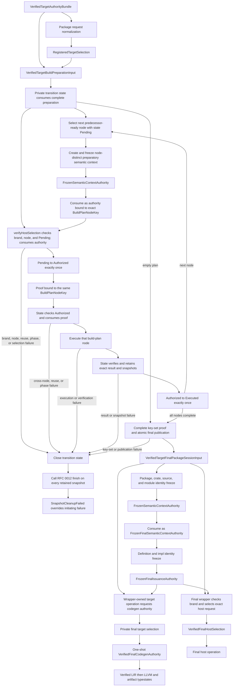

# RFC 0016: Context-Bound Target Registry Verification

## Summary

This RFC makes target selection and target-dependent code-generation authority
context-bound verified facts. It defines the only legal ordering from package
target registration through semantic identity freeze to target-token
publication, assigns one immutable target-authority bundle to the exact RFC
0012 preparation and final session handoffs, and closes LLVM triple,
data-layout, object-format, panic-strategy, target-ID, registry-revision,
runtime-capability, code-generation-capability, and runtime-ABI-contract
validation.

This RFC is a hash-bound additive normative overlay over the panic-capability,
target-registry, target-selection, package-handoff, and `CompilerSession`
clauses of RFCs 0006, 0008, 0010, 0011, and 0012. It defines the final-session
authority handoff consumed by target-dependent operations, but it does not
define LIR, LLVM translation, or backend artifact semantics. Those contracts
belong to their downstream RFC and cannot be imported back into this proposal.
Implementation remains blocked until every required owner approves one exact
proposal snapshot and this RFC moves to `ACCEPTED`.

## Motivation

RFC 0010 declares that `VerifiedTargetSelection` contains a
`ContextFingerprint`, but its selection algorithm does not accept that
fingerprint. The repository implementation reflects the incomplete algorithm:
`TargetRegistrySnapshot::verify` accepts only a context-free registered
selection, and `zomc` verifies host and target profiles before
`CompilerSession` freezes semantic identity.

The target registry also admits target records with hand-parsed triple and
data-layout fragments. It does not use LLVM's parsers as the authority, bind
the exact accepted data-layout bytes to registry identity, require an explicit
address-space-zero pointer entry, enforce object-format agreement, or
independently reproduce the complete registry codec. A target token can
therefore exist without the semantic context named by its type, and a target
profile can satisfy local string checks without proving that LLVM interprets
the profile as declared.

The two gaps are one authority problem. Package selection is context-free
request data. A target profile is backend configuration. Only the semantic
session that owns the final frozen brand-and-fingerprint authority may combine
them into a proof consumed by LIR and backend work.

## Goals

- Define one brand-and-fingerprint-bound `VerifiedTargetSelection` producer and
  delete every context-free target-token path.
- Retain the exact immutable `TargetRegistrySnapshot` through package-session
  installation and semantic identity freeze.
- Bind one immutable, independently verified runtime-capability snapshot to
  registry admission, package handoffs, target tokens, and consumers.
- Bind one independently verified code-generation capability registry and one
  target-independent runtime ABI contract registry to the same package
  handoffs and target-authority bundle.
- Make the final package wrapper the only authority host for target-dependent
  operations, with one private, move-only final code-generation authority
  issued at most once for the exact selected target.
- Define total verification order, failure ownership, panic-strategy mapping,
  LLVM triple, subtarget, CPU, feature, target-machine, and data-layout
  validation, object-format agreement, target-ID recomputation, and registry-
  revision recomputation.
- Preserve exact target and registry codec domains while binding their complete
  preimages through independent oracles.
- Separate preparatory build-script host selection from final host and target
  selection so a preparatory token cannot authorize final compilation.
- Make LLVM discovery, components, and CI availability explicit repository
  requirements.
- Strengthen architecture gates against constructors, rebinding, manual target
  parsing, hard-coded layout allowlists, missing LLVM validation, and missing
  codec oracles.

## Non-Goals

- Changing RFC 0010 HIR, MIR, LIR, feature-boundary, translator, or backend
  operation algebras.
- Defining `lowerToLir`, a LIR algebra registry, an LLVM translator contract,
  target-legalized runtime function ABIs, or object-emission behavior.
- Adding target JSON, a target-plugin protocol, runtime CPU detection, or
  target-specific optimization policy.
- Adding a public target-token persistence codec.
- Changing the RFC 0011 semantic-context fingerprint or brand codecs.
- Treating the host compiler runtime's ambient behavior or an unwind-named
  symbol as target-runtime capability evidence.
- Normalizing LLVM data-layout text or treating byte-distinct layouts as the
  same registry identity.
- Preserving a context-free target verifier, token constructor, or rebinding
  adapter.
- Implementing compiler code before this RFC is accepted.

## Prior Art

### LLVM data-layout authority

LLVM's language reference defines the data-layout grammar and requires a
frontend's data layout to agree with the final code generator. LLVM's
`DataLayout::parse` returns a typed parse result, while
`getStringRepresentation()` explicitly is not an equality or canonicalization
operation because distinct strings can represent the same layout. ZOM uses
LLVM parsing and typed queries for validity and semantic projection while
retaining the exact admitted bytes for identity.

References:

- <https://llvm.org/docs/LangRef.html#data-layout>
- <https://llvm.org/doxygen/classllvm_1_1DataLayout.html>

### LLVM target triples and object formats

LLVM's `Triple` provides normalization, typed architecture/vendor/OS/environment
access, and typed object-format classification. Clang requires an explicit
target for cross-compilation because host inference can silently select the
wrong CPU and toolchain behavior. ZOM uses the parsed triple for semantic
projection, requires a known LLVM object format to match the registry, and
rejects a triple whose object format is unknown rather than permitting a
registry override.

References:

- <https://llvm.org/doxygen/classllvm_1_1Triple.html>
- <https://clang.llvm.org/docs/CrossCompilation.html>

### Rust target specifications

Rust target specifications bind the LLVM target, data layout, pointer width,
and target options as one version-sensitive compiler input. The rustc
documentation warns that target specifications are compiler-version specific
and exposes a schema from the running compiler. ZOM treats the registry
snapshot and its exact bytes as one canonical compiler input rather than
ambient strings.

References:

- <https://doc.rust-lang.org/rustc/targets/custom.html>
- <https://doc.rust-lang.org/stable/nightly-rustc/rustc_target/spec/index.html>

### LLVM 22 API baseline

The version-sensitive admission contract is bound to the official
`llvmorg-22.1.8` source tag rather than unversioned Doxygen generated from LLVM
main. The implementation uses the typed APIs and ownership contracts in these
official sources:

- <https://github.com/llvm/llvm-project/blob/llvmorg-22.1.8/llvm/include/llvm/IR/DataLayout.h>
- <https://github.com/llvm/llvm-project/blob/llvmorg-22.1.8/llvm/include/llvm/TargetParser/Triple.h>
- <https://github.com/llvm/llvm-project/blob/llvmorg-22.1.8/llvm/include/llvm/MC/TargetRegistry.h>
- <https://github.com/llvm/llvm-project/blob/llvmorg-22.1.8/llvm/include/llvm/MC/MCSubtargetInfo.h>
- <https://github.com/llvm/llvm-project/blob/llvmorg-22.1.8/llvm/include/llvm/Target/TargetMachine.h>
- <https://github.com/llvm/llvm-project/blob/llvmorg-22.1.8/llvm/docs/CMake.rst>

The repository dependency is exactly LLVM `22.1.8`. A dependency update must
change this baseline, the build checks, and every LLVM admission probe in one
reviewed change.


## Guide-Level Explanation

A package request continues to name a registered host and target profile. That
selection proves only that request normalization used one immutable registry
revision. It is not permission to construct target-dependent IR.

`CompilerSession` owns the same target-authority bundle. Before any build-plan
node work, one private transition state
consumes the complete preparation wrapper. While holding that exact state, the
session creates and freezes one distinct preparatory semantic context for each
predecessor-ready build-plan node and consumes that node's generic frozen
authority into a fresh `FrozenPreparatorySemanticContextAuthority`. The state
initializes one entry keyed by every exact `BuildPlanNodeKey` to `Pending`.
Its private `verifyHostSelection` consumes the authority, requires its node key
to equal the currently selected predecessor-ready node, and requires that node
to be `Pending` before it selects the nested wrapper's exact host request field.
Only successful selection performs the one `Pending -> Authorized` transition
and returns one move-only preparation-host proof carrying that same node key.
The state consumes that proof before execution and performs the one
`Authorized -> Executed` transition only after execution and result verification
succeed. Callers cannot provide a selection, and an authority or
proof cannot cross node keys, skip a phase, repeat a phase, or be reused. Any
such mismatch is `InputRevisionMismatch` before request selection or another
node execution, closes the entire transition, and finishes every retained RFC
0012 snapshot; `SnapshotCleanupFailed` overrides the initiating failure. The
state verifies each node result internally in predecessor order so verified
predecessor output keys can construct the next execution key, but publishes
nothing. After the complete key-set proof and atomic final publication, the
session holds the exact final wrapper, completes
package, crate, source-content, and module identity freeze, and consumes that
context's generic frozen authority into one
`FrozenFinalSemanticContextAuthority`. The definition and impl freeze operation
consumes that phase authority and, only on complete success, returns a
`FrozenFinalIssuanceAuthority`. Only that post-freeze capability may reach the
final wrapper. Host work remains a separately typed operation. The first
target-dependent code-generation operation is a consuming method on that
wrapper. It verifies exact same-wrapper brand equality, privately selects the
exact target request field, and receives the one-shot final code-generation
authority. Each successful downstream verified state move-owns that authority
into the next LIR, LLVM, or artifact typestate. No downstream entry point
accepts a target proof or independently assembled registry arguments.



Build scripts use a distinct preparatory semantic context. Their verified host
token carries the preparatory brand and fingerprint. After build-script outputs
finalize source roots, the final session freezes a different context and issues
final host and target tokens with a different brand. The preparatory token
cannot satisfy the final context's brand check even if the two deterministic
fingerprints are byte-equal.

The registry stores the exact LLVM data-layout bytes it admits. For example,
two layouts that LLVM considers equivalent but that differ as `p:` and `p0:`
remain different target specifications, target IDs, and registry revisions.
LLVM parses both; ZOM does not rewrite either string.

## Reference-Level Design

### Bound Proposal Snapshots

This RFC overlays only the clauses named below. All other clauses retain their
existing authority.

| RFC | Proposal SHA-256 | Overlaid clauses |
|---|---|---|
| RFC 0006 | `c37e40c9f903901a4f8f738e8d5d8fed842d55473ec9420eda901a46aede1613` | Runtime and target panic-capability validation before lowering |
| RFC 0008 | `f1169871ea0e983bcf69b13ead94093522fff7c25c37187787d9a2fb6b003854` | Package-session input ownership, semantic freeze order, and build-script context separation |
| RFC 0010 | `6deb4954d6a6d2dc8904b366a338c1bdad452d3ab55d1392444d106653a78921` | Target registry, target selection, target verification failures, and target acceptance criteria |
| RFC 0011 | `383dc8905ae389949008f47f3b501d812a26d91769460d7e41731283b2f8cc03` | Semantic-context brand and fingerprint use and canonical target projection |
| RFC 0012 | `7f77fe66cb6a84b0279255081073755bb7d0e61ff2de908c251eb6c1182f8cce` | Registered target selection, package request ownership, panic-strategy mapping, build-result validation ownership, preparation-to-final transition timing, final-record publication, and retained-snapshot cleanup |

Acceptance of this RFC does not mutate those proposal files. Their trackers
must record the accepted RFC 0016 proposal hash before implementation begins.

### Normative overlay authority

Where this RFC conflicts with the bound panic-capability, target-selection, or
RFC 0012 final-handoff clauses named in the table above, this RFC is
authoritative. It preserves the target-spec and target-registry hash domains
and all unrelated records.

### Closed records

The normative semantic contract is:

```text
FrozenSemanticContextAuthority {
  contextBrand: RFC0011::SemanticContextBrand,
  contextFingerprint: RFC0011::ContextFingerprint,
}

FrozenPreparatorySemanticContextAuthority {
  packageSessionBrand: TargetPackageSessionBrand,
  node: RFC0012::BuildPlanNodeKey,
  authority: FrozenSemanticContextAuthority,
}

FrozenFinalSemanticContextAuthority {
  packageSessionBrand: TargetPackageSessionBrand,
  authority: FrozenSemanticContextAuthority,
}

FrozenFinalIssuanceAuthority {
  packageSessionBrand: TargetPackageSessionBrand,
  authority: FrozenFinalSemanticContextAuthority,
}

PackageSelectionPanicStrategy = Abort | Unwind

RuntimePanicCapability = Abort | Unwind

RuntimeCapability =
  PanicAbort | PanicUnwind | CatchUnwind | Allocation | Deallocation

RuntimeCapabilityEntry {
  capabilities: SortedUniqueSequence<RuntimeCapability>,
}

RuntimeCapabilityClause = SortedUniqueSequence<RuntimeCapability>
RuntimeCapabilityPredicate = SortedUniqueSequence<RuntimeCapabilityClause>

VerifiedRuntimeCapabilitySnapshot {
  capabilityBrand: RuntimeCapabilityBrand,
  entries: SortedMap<RFC0011::TargetComponentName, RuntimeCapabilityEntry>,
  revision: RuntimeCapabilityRevision,
}

LlvmBaseline = Llvm22_1_8

CodegenCapabilitySetRevision = RFC0011::Sha256Digest
CodegenCapabilityRegistryRevision = RFC0011::Sha256Digest
RuntimeAbiContractRevision = RFC0011::Sha256Digest
RuntimeAbiContractRegistryRevision = RFC0011::Sha256Digest
TargetAuthorityBundleRevision = RFC0011::Sha256Digest

TargetAbiClassifierId =
  ZomInternal
  | SysVX8664
  | Aapcs64
  | Win64

TargetExceptionModel = None | Itanium

TargetRelocationModel = Static | PositionIndependent
TargetCodeModel = Small | Medium | Large
TargetTlsModel = None | GeneralDynamic | LocalDynamic | InitialExec | LocalExec

AddressSpaceCastCapability =
  PointerToInteger {
    integerWidths: SortedUniqueSequence<uint16>,
  }
  | IntegerToPointer {
      integerWidths: SortedUniqueSequence<uint16>,
    }
  | ToAddressSpace {
      targetAddressSpace: uint32,
    }

AddressSpaceCapability {
  addressSpace: uint32,
  pointerWidthBits: uint16,
  indexWidthBits: uint16,
  integral: bool,
  legalCasts: SortedUniqueSequence<AddressSpaceCastCapability>,
}

AtomicOperation =
  Load | Store | Exchange | CompareExchange
  | Add | Subtract | And | Or | Xor | Nand
  | SignedMinimum | SignedMaximum
  | UnsignedMinimum | UnsignedMaximum

AtomicOrdering =
  Relaxed | Acquire | Release | AcquireRelease | SequentiallyConsistent

AtomicLockFreedom = Always | Sometimes | Never

AtomicCapability {
  widthBits: uint16,
  minimumAlignmentBytes: uint16,
  addressSpaces: SortedUniqueSequence<uint32>,
  operations: SortedUniqueSequence<AtomicOperation>,
  orderings: SortedUniqueSequence<AtomicOrdering>,
  lockFreedom: AtomicLockFreedom,
}

AtomicFenceCapability {
  orderings: SortedUniqueSequence<AtomicOrdering>,
}

TargetVisibility = Default | Hidden | Protected
TargetDllStorageClass = None | Import | Export
TargetSectionKind =
  Text | Data | ReadOnlyData | Bss | TlsData | TlsBss | InitArray | Custom
TargetSymbolAddressKind = Absolute | PcRelative | Got | Plt | Tls

ObjectCapabilityCombination {
  relocationModel: TargetRelocationModel,
  codeModel: TargetCodeModel,
  tlsModel: TargetTlsModel,
  visibility: TargetVisibility,
  dllStorageClass: TargetDllStorageClass,
  sectionKind: TargetSectionKind,
  symbolAddressKind: TargetSymbolAddressKind,
}

ObjectCapabilitySet {
  format: RFC0010::ObjectFormat,
  relocationModels: SortedUniqueSequence<TargetRelocationModel>,
  codeModels: SortedUniqueSequence<TargetCodeModel>,
  tlsModels: SortedUniqueSequence<TargetTlsModel>,
  visibilities: SortedUniqueSequence<TargetVisibility>,
  dllStorageClasses: SortedUniqueSequence<TargetDllStorageClass>,
  sectionKinds: SortedUniqueSequence<TargetSectionKind>,
  symbolAddressKinds: SortedUniqueSequence<TargetSymbolAddressKind>,
  legalCombinations: SortedUniqueSequence<ObjectCapabilityCombination>,
  supportsComdat: bool,
}

VerifiedCodegenCapabilitySet {
  targetSpecId: RFC0010::TargetSpecId,
  llvmBaseline: LlvmBaseline,
  dataLayoutBytes: AsciiBytes,
  abiClassifier: TargetAbiClassifierId,
  exceptionModel: TargetExceptionModel,
  addressSpaces: SortedSequence<AddressSpaceCapability>,
  atomics: SortedSequence<AtomicCapability>,
  atomicFences: AtomicFenceCapability,
  objectCapabilities: ObjectCapabilitySet,
  revision: CodegenCapabilitySetRevision,
}

VerifiedCodegenCapabilityRegistrySnapshot {
  llvmBaseline: LlvmBaseline,
  entries: SortedMap<RFC0010::TargetSpecId, VerifiedCodegenCapabilitySet>,
  revision: CodegenCapabilityRegistryRevision,
}

RuntimeAbiMutability = ReadOnly | Mutable
RuntimeOpaqueTypeId = uint32
RuntimeSymbolId = uint32
RuntimeFunctionSignatureId = uint32
PanicThunkContextTypeId: RuntimeOpaqueTypeId = 1

RuntimeAbiTypeRef =
  Unit
  | Never
  | Bool
  | SignedInteger { widthBits: uint16 }
  | UnsignedInteger { widthBits: uint16 }
  | PointerSizedSignedInteger
  | PointerSizedUnsignedInteger
  | OpaquePointer {
      pointee: RuntimeOpaqueTypeId,
      mutability: RuntimeAbiMutability,
      addressSpace: uint32,
    }
  | BorrowedView {
      element: RuntimeOpaqueTypeId,
      mutability: RuntimeAbiMutability,
      addressSpace: uint32,
    }
  | OwnedOpaqueHandle {
      handle: RuntimeOpaqueTypeId,
      addressSpace: uint32,
    }
  | OutPointer {
      pointee: RuntimeOpaqueTypeId,
      addressSpace: uint32,
    }
  | DefinedRecord { type: RuntimeOpaqueTypeId }
  | FunctionPointer {
      signature: RuntimeFunctionSignatureId,
      addressSpace: uint32,
    }

RuntimeAbiTypeDeclaration =
  Opaque { id: RuntimeOpaqueTypeId }
  | Record {
      id: RuntimeOpaqueTypeId,
      fields: Sequence<RuntimeAbiTypeRef>,
    }

RuntimeCallingConvention = ZomRuntime

RuntimeFunctionSignature {
  callingConvention: RuntimeCallingConvention,
  parameters: Sequence<RuntimeAbiTypeRef>,
  result: RuntimeAbiTypeRef,
  variadic: bool,
}

RuntimeMemoryEffect = None | ReadOnly | WriteOnly | ReadWrite | Unknown
RuntimeUnwindContract = CannotUnwind | MayUnwind | BeginsUnwind | CatchesUnwind
RuntimeReturnBehavior = Returns | NoReturn
RuntimeAllocationEffect = None | ReturnsFreshAllocation | ConsumesAllocation

RuntimeEffects {
  memory: RuntimeMemoryEffect,
  unwind: RuntimeUnwindContract,
  returnBehavior: RuntimeReturnBehavior,
  allocation: RuntimeAllocationEffect,
}

RuntimeCallbackSignature {
  id: RuntimeFunctionSignatureId,
  signature: RuntimeFunctionSignature,
  effects: RuntimeEffects,
}

RuntimeSymbolDeclaration {
  id: RuntimeSymbolId,
  name: AsciiBytes,
  signature: RuntimeFunctionSignature,
  effects: RuntimeEffects,
  availability: RuntimeCapabilityPredicate,
}

RuntimeAbiContract {
  runtimeAbi: RuntimeAbiProfileId,
  types: SortedMap<RuntimeOpaqueTypeId, RuntimeAbiTypeDeclaration>,
  callbacks:
      SortedMap<RuntimeFunctionSignatureId, RuntimeCallbackSignature>,
  symbols: SortedSequence<RuntimeSymbolDeclaration>,
  revision: RuntimeAbiContractRevision,
}

VerifiedRuntimeAbiContractRegistrySnapshot {
  capabilityBrand: RuntimeCapabilityBrand,
  capabilityRevision: RuntimeCapabilityRevision,
  entries: SortedMap<RuntimeAbiProfileId, RuntimeAbiContract>,
  revision: RuntimeAbiContractRegistryRevision,
}

VerifiedTargetAuthorityBundle {
  runtimeCapabilities: VerifiedRuntimeCapabilitySnapshot,
  targetRegistry: TargetRegistrySnapshot,
  codegenCapabilities: VerifiedCodegenCapabilityRegistrySnapshot,
  runtimeAbiContracts: VerifiedRuntimeAbiContractRegistrySnapshot,
  revision: TargetAuthorityBundleRevision,
}

VerifiedTargetBuildPreparationInput {
  packageSessionBrand: TargetPackageSessionBrand,
  packageInput: RFC0012::VerifiedBuildPreparationInput,
  targetAuthorities: VerifiedTargetAuthorityBundle,
}

TargetBuildTransitionState {
  lifecycle: TargetBuildTransitionLifecycle,
  packageSessionBrand: TargetPackageSessionBrand,
  preparation: VerifiedTargetBuildPreparationInput,
  nodeStates: SortedMap<RFC0012::BuildPlanNodeKey, PreparatoryNodeState>,
  currentNode: Maybe<RFC0012::BuildPlanNodeKey>,

  verifyHostSelection(
    context: FrozenPreparatorySemanticContextAuthority&&,
  ) -> PrivateTransitionResult<VerifiedPreparationHostSelection>

  executeAuthorizedNode(
    proof: VerifiedPreparationHostSelection&&,
  ) -> PrivateTransitionResult<PrivateExecutedNode>
}

TargetBuildTransitionLifecycle = Open | Closed

PreparatoryNodeState =
  Pending
  | Authorized {
      contextBrand: RFC0011::SemanticContextBrand,
      contextFingerprint: RFC0011::ContextFingerprint,
    }
  | Executed {
      contextBrand: RFC0011::SemanticContextBrand,
      contextFingerprint: RFC0011::ContextFingerprint,
      result: RFC0012::VerifiedBuildResult,
    }

PrivateExecutedNode {
  node: RFC0012::BuildPlanNodeKey,
}

PrivateTransitionResult<VerifiedValue> =
  OneOf<
    RFC0010::IrOperationResult<VerifiedValue>,
    RFC0012::PackagePipelineFailure,
  >

VerifiedTargetFinalPackageSessionInput {
  packageSessionBrand: TargetPackageSessionBrand,
  packageInput: RFC0012::VerifiedFinalPackageSessionInput,
  targetAuthorities: VerifiedTargetAuthorityBundle,
  codegenIssuance: FinalCodegenIssuanceState,

  verifyHostSelection(
    context: const FrozenFinalIssuanceAuthority&,
  ) -> RFC0010::IrOperationResult<VerifiedFinalHostSelection>

  private verifyTargetSelection(
    context: const FrozenFinalIssuanceAuthority&,
  ) -> RFC0010::IrOperationResult<VerifiedFinalTargetSelection>

  private consumeForFinalCodegen(
    context: const FrozenFinalIssuanceAuthority&,
  ) && -> FinalTargetOperationResult<VerifiedFinalCodegenOperationState>
}

FinalCodegenIssuanceState = Available | Issued | Closed

VerifiedTargetSelection {
  contextBrand: RFC0011::SemanticContextBrand,
  contextFingerprint: RFC0011::ContextFingerprint,
  runtimeCapabilityBrand: RuntimeCapabilityBrand,
  runtimeCapabilityRevision: RuntimeCapabilityRevision,
  packageSelection: RFC0012::RegisteredTargetSelection,
  canonicalTargetSpec: RFC0010::CanonicalTargetSpec,
  targetSpecId: RFC0010::TargetSpecId,
}

VerifiedPreparationHostSelection {
  packageSessionBrand: TargetPackageSessionBrand,
  node: RFC0012::BuildPlanNodeKey,
  selection: VerifiedTargetSelection,
}

VerifiedFinalHostSelection {
  packageSessionBrand: TargetPackageSessionBrand,
  selection: VerifiedTargetSelection,
}

VerifiedFinalTargetSelection {
  packageSessionBrand: TargetPackageSessionBrand,
  selection: VerifiedTargetSelection,
}

VerifiedFinalCodegenAuthority {
  packageSessionBrand: TargetPackageSessionBrand,
  selection: VerifiedFinalTargetSelection,
  targetAuthorities: VerifiedTargetAuthorityBundle,
  codegenCapabilityKey: RFC0010::TargetSpecId,
  runtimeAbiContractKey: RuntimeAbiProfileId,
}

VerifiedFinalCodegenOperationState {
  packageInput: RFC0012::VerifiedFinalPackageSessionInput,
  authority: VerifiedFinalCodegenAuthority,
}

FinalSnapshotCleanupFailure {
  provenance: RFC0012::DiagnosticProvenance,
  package: RFC0011::PackageName,
  path: Maybe<RFC0012::RejectedSourcePath>,
}

FinalTargetOperationResult<VerifiedValue> =
  OneOf<
    RFC0010::IrOperationResult<VerifiedValue>,
    FinalSnapshotCleanupFailure,
  >
```

`PrivateTransitionResult` is an implementation-private cleanup composition, not
a second target-selection failure algebra. Its first alternative is the exact
RFC 0010 result without translated, added, or removed variants. Its second
alternative exists only because the transition owns RFC 0012 snapshots. On an
initiating RFC 0010 or RFC 0012 failure, the transition closes and calls every
required `finish()`; if cleanup succeeds, it returns the initiating alternative,
and if cleanup fails, it returns the exact RFC 0012 `PackagePipelineFailure`
whose materialization issue is `SnapshotCleanupFailed`. No caller unwraps an
initiating target-selection failure before cleanup completes.

`VerifiedTargetAuthorityBundle` is move-only, private-constructor, and
non-serializable. One process-root construction transaction verifies the
runtime capability snapshot, target registry, code-generation capability
registry, and runtime ABI contract registry, proves their complete
cross-associations, and publishes all four or none. The package preparation
wrapper owns the complete bundle by value. The preparation-to-final transition
moves that same bundle without cloning, reconstructing, selecting one target
early, or exposing a nested authority.

`VerifiedCodegenCapabilityRegistrySnapshot` contains exactly one entry for
every admitted `TargetSpecId`. Its data-layout bytes must be byte-identical to
the corresponding target specification, its object format must agree with the
LLVM triple, and its address-space, atomic, ABI-classifier, exception, and
object capabilities must be independently reproduced from the pinned LLVM
baseline before publication. A missing, additional, duplicate, swapped, or
inconsistent row is `InvalidFact`.

`TargetAbiClassifierId` selects a closed classifier contract but does not
define or digest that contract. The downstream LIR RFC owns the complete
classifier registry, decision-program codec, revision domain, and independent
verification because only that RFC defines the `FnAbi` result algebra. Its
selected classifier ID must equal this capability row's ID. This RFC therefore
does not accept an unscoped classifier revision as authority.

Address-space casts are closed and directed. Integer-pointer casts enumerate
their exact legal integer widths, and a pointer-space cast names its exact
destination address space. Every destination must exist in the same capability
set. Carrier-bearing atomic legality is the cross-product stated by each row,
including `Nand` and signed versus unsigned minimum/maximum operations; an
operation, ordering, width, alignment, or address-space combination absent from
the row is unsupported. A fence has no carrier, width, alignment, or address
space and is checked only against `AtomicFenceCapability.orderings`. Object
emission is legal only when the complete requested tuple appears in
`legalCombinations` and every component also appears in its corresponding
projected set. `supportsComdat` is an additional constraint, not a substitute
for tuple membership.

`VerifiedRuntimeAbiContractRegistrySnapshot` is target-independent. It carries
closed structural runtime signatures, effects, and capability predicates, but
no semantic-context brand, LIR type or layout handle, `FnAbiId`,
`CanonicalFnAbiKey`, target-legalized carrier, semantic monomorphization root,
or LLVM object. A
downstream LIR RFC may derive a context- and target-bound physical ABI manifest
only after final target issuance and ABI legalization. The derived manifest is
not an input to the operation that creates its own ABI store.

`VerifiedFinalCodegenAuthority` is move-only, private-constructor,
non-serializable, and created only by consuming
`VerifiedTargetFinalPackageSessionInput` as part of the first target-dependent
operation. The consuming method moves the complete wrapper, not an individual
field, into one private issuance transaction. That transaction separates the
RFC 0012 package input from the target-authority bundle only after ownership of
the original wrapper has ended, then moves the complete bundle into the
authority and publishes `VerifiedFinalCodegenOperationState`. The state owns
the package input needed for cleanup and the authority needed for target work;
there is no partially moved wrapper. Selected row keys address immutable
records inside the authority-owned bundle. No digest or borrowed projection
substitutes for this non-forgeable ownership. The authority then moves
privately through verified LIR, LLVM, and artifact typestates. No public
function accepts it as a standalone parameter, and no caller can assemble its
fields.

A second issuance, cross-wrapper authority, wrong phase, or use after any
failed issuance is `InputRevisionMismatch`. Failure changes the wrapper state
to `Closed`; the owning first target-dependent operation performs RFC 0012
snapshot cleanup and publishes no proof or partial authority. That operation
returns `FinalTargetOperationResult`, so `SnapshotCleanupFailed` takes
precedence. Successful cleanup closes only the RFC 0012 source/generated
snapshot lifetime. It does not destroy the moved target-authority bundle.

`FinalSnapshotCleanupFailure` is the narrow projection of RFC 0012
`MaterializationFailure::SourceMaterializationInvalid` whose issue is exactly
`SnapshotCleanupFailed`; its three fields are retained byte-for-byte from that
failure. No invocation, compiler-invariant, manifest, registry, resolver, lock,
other materialization, or build-script failure can inhabit
`FinalTargetOperationResult`. The RFC 0012 snapshot `finish()` operation is the
exclusive producer of this alternative.

This RFC deliberately does not define a concrete target-dependent operation.
A downstream RFC adds the first operation as an rvalue-qualified consuming
method on the final wrapper. That method privately obtains
`VerifiedFinalCodegenOperationState`, completes or fails the target work,
calls every RFC 0012 `finish()`, and moves the authority into its success
typestate only when cleanup succeeds. Later target operations are consuming
methods on those authority-carrying verified typestates, not methods on the
destroyed final wrapper. The downstream RFC owns any LIR algebra, translator
contract, physical runtime ABI manifest, or backend artifact types that those
operations need. This one-way overlay avoids a proposal dependency cycle.

`RuntimeCapabilityPredicate` is canonical disjunctive normal form. The outer
sequence is logical OR; every `RuntimeCapabilityClause` is logical AND. An
empty outer sequence is `false`. A single empty clause is `true` and may not
coexist with any other clause. Capabilities inside a clause sort by enum tag
and are unique. Clauses sort by their complete encoded bytes and are unique.
No clause may be a strict superset of another clause; this absorption rule
gives each Boolean function one admitted minimal DNF within the positive
capability algebra. Publication rejects any non-canonical predicate as
`InvalidFact`. Evaluation uses only the capabilities in the verified entry for
the selected runtime ABI profile: a clause matches when all of its capabilities
are present, and the predicate matches when any clause matches.

Every runtime ABI type reference names an entry in the same complete type
table, and every function-pointer reference names an entry in the same complete
callback table. A map key must equal its type declaration or callback
signature's embedded `id`. `DefinedRecord` may name only a `Record`; its
by-value edges must be acyclic. `OpaquePointer`, `BorrowedView`,
`OwnedOpaqueHandle`, and `OutPointer` may name either an `Opaque` or `Record`,
and those indirect edges may form cycles. `FunctionPointer` is also indirect,
so callbacks may refer to one another through function pointers. All initial
runtime pointer, view, handle, out-pointer, and function-pointer references use
address space zero. Runtime function signatures are never variadic;
`variadic == true`, an absent type or callback, a map-key mismatch, a kind
mismatch, or a by-value record cycle is `InvalidFact`.

Before target ABI classification, every `RuntimeAbiTypeRef` has this exact
logical lowering:

| Runtime type | Logical layout and carrier input |
|---|---|
| `Unit` | Zero carriers; legal as a result or record field only |
| `Never` | No returning carrier; legal only as a function result |
| `Bool` | One unsigned 8-bit integer with valid values exactly `0` and `1` |
| Fixed signed or unsigned integer | One integer of the declared width and signedness |
| Pointer-sized signed or unsigned integer | One integer whose width is the selected target's address-space-zero pointer width |
| `OpaquePointer` | One pointer in the declared address space to the named opaque or record declaration |
| `BorrowedView` | One record in field order `{ data pointer in the declared address space, length: PointerSizedUnsignedInteger }`; it carries no ownership |
| `OwnedOpaqueHandle` | One opaque, move-only pointer in the declared address space; nullability and dereferenceability are not inferred |
| `OutPointer` | One mutable pointer in the declared address space to storage for the named declaration |
| `DefinedRecord` | The named record's fields inline in declaration order |
| `FunctionPointer` | One function pointer in the declared address space whose complete callable signature and effects are the named callback entry |

This table defines logical shapes, not target calling convention decisions.
The downstream ABI classifier consumes these shapes and verified layouts to
produce physical carriers. No implementation may replace a view with an
ambient host slice, treat a handle as an integer, erase callback effects, or
choose a pointer width independently of the selected target.

The runtime ABI contract registry declares imported runtime symbols and their
structural contracts. Imported symbols are not semantic monomorphization roots,
so this RFC deliberately carries no runtime-root table. Compiler-generated
adapters or cleanup functions are derived by the downstream lowering contract
after semantic reachability is closed; they are not caller-selectable roots.

`PackageSelectionPanicStrategy` gives the anonymous closed value domain of RFC
0012 `RegisteredTargetSelection.panicStrategy` an implementation name. This
overlay changes that field's type from the anonymous `Abort | Unwind` spelling
to `PackageSelectionPanicStrategy` without changing its field position or
encoding. Its tags remain exactly `Abort = 0x01` and `Unwind = 0x02` as bound
by RFC 0012. In this RFC, `PanicStrategy` refers only to the exact closed
backend algebra declared by RFC 0010; its tags remain `Unwind = 0x01` and
`Abort = 0x02`. These are distinct types and neither is an alias for the
other.

`FrozenSemanticContextAuthority` is move-only, non-serializable, and produced
only by the RFC 0011 semantic-context freeze operation. It is not constructible
from a caller-provided brand or fingerprint. Preparatory and final contexts
receive distinct brands from the process `SemanticContextFactory` even when
their deterministic fingerprints are byte-equal.

`FrozenPreparatorySemanticContextAuthority`,
`FrozenFinalSemanticContextAuthority`, and `FrozenFinalIssuanceAuthority` are
unrelated move-only, private-constructor capabilities. They do not expose a
public conversion, aggregate initialization, clone, factory, decoder,
deserializer, rebinding operation, or caller-selected phase.
`CompilerSession` is their sole producer. It constructs a preparatory authority
only while holding the exact transition state and only after freezing one
build-plan node's preparatory semantic context, with that exact key selected as
`currentNode`, that key's state equal to `Pending`, and the lifecycle equal to
`Open`. It constructs the final semantic
authority only while holding the exact final wrapper and only after the final
package, crate, source-content, and module registries freeze and the RFC 0011
semantic-context fingerprint is complete. Construction consumes the generic
frozen authority into exactly one phase capability, so the generic authority
cannot also be retained.

Each build-plan node receives a newly issued preparatory semantic-context brand
even when two node fingerprints are byte-equal. The transition state binds the
node identity, fresh authority, and resulting host proof in one linear internal
step. Construction sets the lifecycle to `Open`. Every plan key initializes
exactly one map entry in `Pending`; no other
entry may be inserted, removed, or re-keyed. `verifyHostSelection` is the sole
`Pending -> Authorized` operation. It consumes a preparatory authority carrying
the exact current `BuildPlanNodeKey`, retains the successful context brand and
fingerprint in that key's state entry, and returns a proof carrying the same
package-session brand, node key, brand, and fingerprint. No unsuccessful call
changes the node to `Authorized`.

`executeAuthorizedNode` is the sole `Authorized -> Executed` operation. It
consumes the exact node-bound proof, constructs the execution key only from
already `Executed` predecessor entries, executes and verifies that node, and
stores the resulting `VerifiedBuildResult` in the same map entry. No operation
transitions `Pending` directly to `Executed`, transitions backward, repeats
either edge, or changes more than one entry. After the node reaches `Executed`,
neither capability can be accepted again or for another node. A cross-node
authority or proof, a second authorization or execution, an attempted phase
skip, or any state/key disagreement is a pre-selection
`InputRevisionMismatch`; it closes the complete transition before request-field
selection, target-selection algorithm entry, script execution, or acceptance
of another result, whichever would otherwise occur next.

Before returning any failure, the transition atomically changes its lifecycle
from `Open` to `Closed`; this edge occurs exactly once and precedes snapshot
cleanup. `Closed` has no production method surface. A private negative fixture
that attempts another transition against retained test-only state receives
pre-selection `InputRevisionMismatch`, invokes only idempotent RFC 0012
`finish()` retries, and cannot authorize, execute, or publish. Complete final
publication instead consumes the `Open` state into the final wrapper, leaving no
transition object to reuse.

Final definition and impl freeze is one private operation that consumes the
complete `FrozenFinalSemanticContextAuthority`. On any identity or freeze
failure it publishes no successor. Only after both registries freeze does it
return `FrozenFinalIssuanceAuthority` carrying the same context authority and
exact package-session brand. No final-wrapper method accepts
`FrozenFinalSemanticContextAuthority`; therefore early final host or target
issuance is outside the callable algebra rather than prohibited only by prose.
Compile-negative and architecture fixtures reject direct construction,
conversion, alternate production, retention of the consumed predecessor, and
final issuance without this post-freeze capability.

`TargetPackageSessionBrand` is an opaque nonzero process-local association
authority. Its constructor is private to the process-root
`TargetPackageSessionFactory`; callers cannot provide, decode, deserialize,
convert, reset, or reuse a brand. The factory uses the same serialized monotonic
`1..UINT64_MAX` issuance and permanent exhaustion contract as
`RuntimeCapabilityFactory`, including final-two-issuance and concurrent
uniqueness tests. Exhaustion returns
`TargetAuthorityConstructionIssue::InvalidFact`, publishes no target-bound
preparation wrapper, and maps to `ZOM9957`.

The target-bound package-session implementation issues exactly one brand only
after complete preparation input, registry, and runtime-snapshot association
validation. The preparation wrapper owns it; final-wrapper construction moves
the same brand from the transition-owned wrapper without reissuing or
substituting another wrapper's identity. While holding the exact transition
state or final wrapper, `CompilerSession` copies that opaque identity into the
corresponding phase authority it privately constructs. Every issuance method
first requires exact brand equality between its owning state or wrapper and
phase authority. A same-phase authority from another transition state or final
wrapper returns
`InputRevisionMismatch` before request-field selection or any target-selection
algorithm step and publishes no proof. The brand is private bug context only:
it is absent from all canonical preimages, deterministic revisions, target
tokens, diagnostics, and persistence formats.

`CompilerProcessAuthorityRoot` is the explicit process-root owner of exactly
one `RuntimeCapabilityFactory`, one `TargetAuthorityBundleFactory`, and one
`TargetPackageSessionFactory`, each held by value. The bundle factory is the
sole producer of the code-generation capability and runtime ABI contract
registries and receives the runtime capability factory's verified output. The
executable constructs the root before worker launch and injects explicit
factory references only into the private target-authority construction path.
No factory or registry has static storage duration, a function-local static, a
singleton or service-locator accessor, an independently default-constructible
production path, or an alternate issuer. Test construction uses an explicit
test process root rather than replacing global state. Architecture fixtures
reject every static, singleton, duplicate-owner, or construction-path-
bypassing issuer.

`RuntimeCapabilityBrand` is an opaque nonzero process-local authority issued
only by the process-root-owned compiler-distribution
`RuntimeCapabilityFactory`.
The brand constructor is private to that factory; callers cannot provide a raw
value, decode, deserialize, issue, or reset a brand. Copying an issued brand
preserves the same identity and creates no new authority. The factory owns one
process-lifetime serialized state `{ lastIssued: uint64, exhausted: bool }`.
It issues `1..UINT64_MAX` exactly once each. Issuing `UINT64_MAX` atomically
sets `exhausted`; every later request returns no brand without increment,
wrapping, resetting, or reusing a value. The process root constructs the single
runtime capability snapshot before worker launch through its privately injected
factory reference. Test-only process-root injection sets
`lastIssued = UINT64_MAX - 2` and proves the final two unique issuances,
`UINT64_MAX - 1` followed by `UINT64_MAX`, exhaustion, concurrent uniqueness,
and permanent non-reuse. Brand issuance occurs only
after manifest and codec verification; exhaustion returns
`TargetAuthorityConstructionIssue::InvalidFact`, publishes no snapshot, and
maps to `ZOM9957`.
`RuntimeCapabilityRevision` is the SHA-256 digest of the complete canonical
capability manifest defined below. `RuntimeCapability` tags begin with
`PanicAbort = 0x01` and `PanicUnwind = 0x02` in declaration order.
`RuntimePanicCapability::Abort` maps semantically to `PanicAbort`, and
`RuntimePanicCapability::Unwind` maps semantically to `PanicUnwind`; no raw
numeric cast is legal.

`RuntimeAbiProfileId` is a closed generated enum whose initial and only value
is `Zom = 0x01`. Registry construction is the sole operation that maps an
RFC 0011 `TargetComponentName` runtime-ABI field to this enum; an unknown or
duplicate mapping is `InvalidFact`.

`VerifiedRuntimeCapabilitySnapshot` is move-only, private-constructor, and
generated from the single `runtime/panic-capabilities.def` registry. The same
definition file generates only the private construction oracle
`RuntimeCapabilityManifestOracle::supports(RuntimeAbiProfileId,
RuntimeCapability)`, which is callable solely by
`RuntimeCapabilityFactory` while verifying and publishing the snapshot. The
published snapshot exposes the only later query,
`VerifiedRuntimeCapabilitySnapshot::supports(RuntimeAbiProfileId,
RuntimeCapability) const`; it reads the snapshot's immutable verified
records and therefore cannot be called without the exact non-forgeable
snapshot. No free function, runtime-symbol query, `ZomPanicStrategy` overload,
raw ABI string overload, or snapshot-unbound query exists. The initial registry
contains exactly `zom -> {PanicAbort}`. `PanicUnwind` and `CatchUnwind`
entries are forbidden until the same change implements and verifies the RFC
0006 unwinder, cleanup integration, catch boundary, FFI containment, and target
matrix. Allocation and deallocation entries require their runtime
implementations and ABI tests in the same change. A runtime symbol name is
never capability evidence.

`TargetRuntimeAbiAssociation` is the private pair
`{ target: TargetSpecId, runtimeAbi: RuntimeAbiProfileId }`.
`TargetCodegenCapabilityAssociation` is the private pair
`{ target: TargetSpecId, capabilities: CodegenCapabilitySetRevision }`.
`TargetRuntimeAbiContractAssociation` is the private pair
`{ target: TargetSpecId, contract: RuntimeAbiContractRevision }`.
`TargetRegistrySnapshot` retains the exact runtime capability brand and
revision plus three sorted, unique, complete association sequences containing
exactly one runtime profile, code-generation capability, and runtime ABI
contract row for every admitted target specification. Registry admission is
the sole phase that maps each specification's RFC 0011
`TargetComponentName` `runtimeAbiProfile` to `RuntimeAbiProfileId`. The bundle
factory constructs all associations atomically with each target candidate.
An independent admission verifier rebuilds the typed rows from the verified
registries and requires exact equality before bundle publication. Missing,
additional, duplicate, swapped, wrong-target, wrong-profile, wrong-baseline,
or wrong-revision rows are
`TargetAuthorityConstructionIssue::InvalidFact`, publish no snapshot, and map
to `ZOM9957`.

An admitted specification may contain a panic strategy that the runtime does
not support. That unsupported pair remains a valid target codec and is rejected
as a capability only if selected. The private brand, revision, and typed
association sequence do not enter or alter the existing target, profile, or
`zom.target-registry` codec preimages.

`VerifiedTargetBuildPreparationInput` owns one exact RFC 0012
`VerifiedBuildPreparationInput` and the complete target-authority bundle by
value. Before any build-script execution, one private
`TargetBuildTransitionState` consumes the complete preparation wrapper. The
state exclusively owns the nested request, resolution, `SourceViewStore`, build
plan, authority bundle, package-session brand, every candidate result, and every
generated snapshot from that point onward.

The state advances only in canonical predecessor order. For one ready plan
node, it chooses the exact map key, requires every predecessor entry to be
`Executed`, and sets `currentNode` to that key while its entry remains
`Pending`. `verifyHostSelection` first checks package-session brand equality,
authority node equality with `currentNode`, and the exact `Pending` state, in
that order; it then consumes the authority, selects the exact host request, and
runs target selection. Only success stores `Authorized` and returns the exact
node-bound proof. `executeAuthorizedNode` first checks proof package-session
brand equality, proof node equality with `currentNode`, the exact `Authorized`
state, and equality of the retained context brand and fingerprint, in that
order; it then consumes the proof, constructs the complete
`BuildScriptExecutionKey` from already-verified predecessor output keys held
inside `Executed` entries, executes the script, takes ownership of its untrusted
result and generated snapshots, and immediately verifies the exact plan-node
association, output record, generated view, digest, and UTF-8 source
requirements. Only complete success stores `Executed`, clears `currentNode`,
and makes the result internally usable for later execution keys. No result,
view, key, state entry, or map is published.

After every plan node succeeds, the same state proves exact plan/result key-set
equality over its complete internal result map, moves the nested RFC 0012
request, resolution, source views, build plan, verified results, and generated
views to construct the exact `VerifiedFinalPackageSessionInput`, and publishes
it only as part of one `VerifiedTargetFinalPackageSessionInput` with the same
target-authority bundle and package-session brand. No authority is cloned or
reconstructed, and no standalone final RFC 0012 value is published.

Both target-bound input types are move-only, have private constructors, and
are constructible only by the target-bound package-session implementation.
Preparation construction atomically validates and moves one exact RFC 0012
preparation input with the target-authority bundle. Transition-state
construction is the only operation that consumes that preparation wrapper;
final construction is the only terminal success state and validates the exact
final RFC 0012 request, resolution, source-view, build-plan, build-result,
generated-view, key-set, and cleanup association while moving the same
authority bundle. No public constructor, aggregate
initialization, field-wise factory, deserializer, clone, or caller-provided
association is available for either wrapper. No API accepts a caller-supplied
`VerifiedFinalPackageSessionInput`, exposes a partially moved preparation
wrapper, or returns the nested final value outside the target-bound wrapper.

The final wrapper preserves the exact RFC 0012 request, resolution,
`SourceViewStore`, build-plan map, build-result map, generated views, key-set
bijection, and snapshot cleanup contract. On success or failure it retains
ownership until every move-only snapshot has completed RFC 0012 `finish()`;
cleanup failure remains `SnapshotCleanupFailed`. Neither wrapper contains a
`VerifiedTargetSelection`, borrowed root, caller-owned reference, or alternate
source inventory.

Every failure during preparatory brand, node, phase, reuse, or context checks;
host selection; node execution; incremental result or generated-view
validation; key-set proof; nested-final construction; registry/runtime/brand
transfer; or final-wrapper publication irreversibly closes the transition.
The closed state cannot select, authorize, execute, retry, or publish. It
retains all not-yet-moved snapshots in exactly one transition-owned owner and
calls RFC 0012 `finish()` on every retained source and generated snapshot
before returning. If any `finish()` call fails, RFC 0012
`SnapshotCleanupFailed` replaces the initiating failure; otherwise the original
failure is returned. No failure returns either wrapper, the nested final record,
a proof, a result map, an internally verified predecessor output, or a partially
moved source-view store.

`VerifiedTargetSelection` is move-only. Its constructor is private to the
target-bound package-session implementation and owns its exact
`CanonicalTargetSpec` by value. There is no
default constructor, public factory, one-argument verifier, `withContext`,
rebinding API, deserializer, public clone, registry-backed reference, or API
that can replace any of its seven fields. The context brand is the live
semantic issuer capability; the fingerprint remains deterministic semantic
revision and diagnostic binding. The runtime capability brand and revision
bind the exact runtime feature authority.

The three phase proof types are move-only, private-constructor, unrelated
closed types. They expose read-only access to their contained proof and no
conversion to another phase proof. The private transition state exposes only
preparation `verifyHostSelection`; it reads exactly the nested
`packageInput.request.hostTarget` and cannot name or verify the nested
`packageInput.request.target`. The final wrapper exposes host verification and
keeps target verification private to wrapper-owned target operations. Those
paths read exactly `packageInput.request.hostTarget` and
`packageInput.request.target`, respectively. Preparation issuance accepts only
`FrozenPreparatorySemanticContextAuthority`; both final issuance methods accept
only `FrozenFinalIssuanceAuthority`. None of the three methods accepts a raw
`FrozenSemanticContextAuthority`, pre-definition/impl
`FrozenFinalSemanticContextAuthority`, `RegisteredTargetSelection`, profile,
target ID, or phase argument.

The thirteen-step target-selection algorithm is a private implementation
detail invoked only by those methods. It receives a sealed phase authorization
created from the owning state or wrapper's exact request field; no callable
generic verifier
accepts raw context, registry, runtime snapshot, and caller-selected target
arguments. Build-script and final-host consumers take only their exact phase
proof. Target-dependent wrapper methods consume the one-shot
`VerifiedFinalCodegenAuthority`, whose private issuer compares the proof's
complete `packageSelection` with the exact final request field before selecting
the exact code-generation and runtime ABI contract rows.

### Session ordering

The production order is total:

1. Build and independently verify one immutable
   `VerifiedRuntimeCapabilitySnapshot` and one immutable, target-independent
   `VerifiedRuntimeAbiContractRegistrySnapshot` against its exact capability
   brand and revision.
2. In one bundle-factory transaction, build and independently verify one
   `TargetRegistrySnapshot` and one
   `VerifiedCodegenCapabilityRegistrySnapshot` against the pinned LLVM
   baseline. Prove exactly one runtime profile, code-generation capability,
   and runtime ABI contract association for every admitted `TargetSpecId`, then
   publish one `VerifiedTargetAuthorityBundle`.
3. Derive the context-free RFC 0012 `RegisteredTargetService` from that exact
   bundle's target registry.
4. Normalize and verify the package request, resolution, source views, and
   build plan into RFC 0012 `VerifiedBuildPreparationInput` using that service.
5. Move the complete RFC 0012 preparation value and exact target-authority
   bundle atomically into
   `VerifiedTargetBuildPreparationInput`, issuing its one
   `TargetPackageSessionBrand` only after association validation succeeds.
6. Before executing any build-plan node, consume the complete target-bound
   preparation wrapper into one private `TargetBuildTransitionState` and
   initialize exactly one `Pending` entry for every build-plan key. In canonical
   predecessor order, select one predecessor-ready key as `currentNode`, create
   and freeze that node's preparatory context, and consume its generic frozen
   authority into one `FrozenPreparatorySemanticContextAuthority` carrying the
   transition's exact package-session brand and exact `BuildPlanNodeKey`.
7. Invoke `verifyHostSelection` once for that node. The state checks brand, node,
   and `Pending` phase before request selection, consumes the authority, and on
   success alone changes that exact entry to `Authorized` and returns one proof
   carrying the same node key. Immediately consume that proof through
   `executeAuthorizedNode`; the state checks brand, node, `Authorized` phase,
   and context identity before execution, constructs the execution key only
   from internally retained `Executed` predecessor results, and on complete
   execution and verification success alone changes the same entry to
   `Executed`. Repeat this per-node cycle for the next predecessor-ready key; an
   empty build plan proceeds directly to the empty key-set proof. A
   cross-node, reused, skipped, repeated, or otherwise phase-inconsistent
   authority or proof is pre-selection `InputRevisionMismatch`, closes the
   transition, and performs RFC 0012 cleanup with `SnapshotCleanupFailed`
   precedence. After all nodes are `Executed`, prove exact plan/result key-set
   equality and atomically construct the RFC 0012
   `VerifiedFinalPackageSessionInput` only inside
   `VerifiedTargetFinalPackageSessionInput` with the same target-authority
   bundle and package-session brand. Publish no intermediate
   proof, result, view, key, map, node state, or nested final value.
8. Freeze final package, crate, source-content, and module identity.
9. Consume the generic final frozen authority into one
    `FrozenFinalSemanticContextAuthority` containing the final brand and
    fingerprint plus that final wrapper's exact package-session brand after the
    final source and module registries freeze.
10. Consume that final semantic authority into the definition and impl freeze
    operation. Only complete success returns one `FrozenFinalIssuanceAuthority`
    with the same context and package-session brand.
11. Verify final host selection using that exact post-freeze issuance
    authority. A target-dependent wrapper method privately verifies final
    target selection, selects the exact code-generation capability and runtime
    ABI contract rows from the retained bundle, and issues one
    `VerifiedFinalCodegenAuthority`.
12. Consume that authority inside the same wrapper-owned operation. No target
    proof, selected capability row, runtime ABI contract, or final code-
    generation authority is published independently.

No target token exists before step 6 for a preparatory context or step 11 for
the final context. Parsing, module discovery, binding, checking, HIR, and MIR
do not consume target tokens. A downstream RFC that requires target-aware
feature-boundary evidence creates and consumes it inside the same final
wrapper-owned operation after semantic checking and executable MIR
publication.

### Preparatory and final context separation

The build-script host token carries the preparatory brand and fingerprint. The
final host token is independently verified from the same registered host
selection and retained target-authority bundle after final identity freeze. The
two values always have different `contextBrand` fields. If their deterministic
fingerprints are byte-equal, the brand mismatch still rejects transfer.
Build-script and final-host consumers compare their exact phase proof with the
owning transition or wrapper. Target-dependent work instead receives the
private one-shot final code-generation authority and compares its context,
runtime capability, target, code-generation capability, runtime ABI contract,
registry, bundle, and package-session identities before reading structural
payloads.

The build-script executable cache key continues to use the context-free
registered host selection. Executing a cached artifact requires the
preparatory verified host token and the existing sandbox and artifact-digest
checks.

### Panic-strategy mapping

`PackageSelectionPanicStrategy` and RFC 0010 `PanicStrategy` are intentionally
distinct closed algebras. Conversion is semantic and exhaustive:

```text
PackageSelectionPanicStrategy::Abort  (0x01)
  -> PanicStrategy::Abort  (0x02)

PackageSelectionPanicStrategy::Unwind (0x02)
  -> PanicStrategy::Unwind (0x01)

PanicStrategy::Abort (0x02)
  -> RuntimePanicCapability::Abort (0x01)
  -> runtime::ZomPanicStrategy::Abort

PanicStrategy::Unwind (0x01)
  -> RuntimePanicCapability::Unwind (0x02)
  -> runtime::ZomPanicStrategy::Unwind
```

Raw numeric comparison, casting, shared underlying values, and a default arm
are forbidden. The two conversions are separate exhaustive generated switches
and are tested in both directions over every value in all four algebras.

### Registry construction failures

Registry construction occurs before a semantic context exists. It therefore
does not publish an RFC 0010 `IrFailureFact`, whose legal target-selection
owner is a context-bound session.

```text
TargetAuthorityConstructionIssue =
  InvalidFact
  | CanonicalCodecMismatch

TargetRegistryConstructionResult =
  TargetRegistrySnapshot
  | TargetAuthorityConstructionIssue

RuntimeCapabilityConstructionResult =
  VerifiedRuntimeCapabilitySnapshot
  | TargetAuthorityConstructionIssue

TargetAuthorityBundleConstructionResult =
  VerifiedTargetAuthorityBundle
  | TargetAuthorityConstructionIssue
```

`InvalidFact` covers malformed or contradictory target profile or runtime
capability contents, an unrecognized runtime ABI, and disagreement between the
capability registry and the private `RuntimeCapabilityManifestOracle`. It maps through
the target-authority diagnostic adapter to `ZOM9957
TargetAuthorityInvariant`, fatal, `Internal target authority invariant violated`,
arity zero. `CanonicalCodecMismatch` covers disagreement between the production
and independent runtime-capability, target, profile, or registry encoders or a
recomputed revision and
maps to `ZOM9958 TargetAuthorityCanonicalCodecMismatch`, fatal, `Canonical
target authority codec verification failed`, arity zero.
`TargetRegistryConstructionResult` and
`RuntimeCapabilityConstructionResult` are factory-private intermediate
results and cannot escape the process-root transaction. Its only public result
is `TargetAuthorityBundleConstructionResult`, which publishes the complete
verified bundle or one issue. Construction returns a typed result, never
`Maybe`, `bool`, exception text, or a free-form string. It publishes no partial
snapshot and no package target service.

Once a context exists, target selection returns RFC 0010's existing
`IrOperationResult<VerifiedTargetSelection>` directly. No second selection
failure enum or diagnostic adapter exists. The exact mapping is:

| Failed check | RFC 0010 result |
|---|---|
| A same-phase semantic authority carries another target-bound package-session brand | `IrInvariantRejected(InputRevisionMismatch, TargetSelection, Session(contextFingerprint), no site)` |
| A preparatory authority or proof carries a `BuildPlanNodeKey` other than the exact current node | `IrInvariantRejected(InputRevisionMismatch, TargetSelection, Session(contextFingerprint), no site)` |
| The transition is not `Open`, a preparatory authority reaches a node not in `Pending`, a proof reaches a node not in `Authorized`, or either capability is skipped, repeated, stale, or reused | `IrInvariantRejected(InputRevisionMismatch, TargetSelection, Session(contextFingerprint), no site)` |
| A phase proof's complete package selection differs from the exact request field authorized by its owning phase wrapper | `IrInvariantRejected(InputRevisionMismatch, TargetSelection, Session(contextFingerprint), no site)` |
| Registered selection has another registry revision | `IrInvariantRejected(InputRevisionMismatch, TargetSelection, Session(contextFingerprint), no site)` |
| Runtime capability brand or revision differs from the pair bound to the registry | `IrInvariantRejected(InputRevisionMismatch, TargetSelection, Session(contextFingerprint), no site)` |
| Profile named by a same-revision registered selection is absent | `IrInvariantRejected(MissingRequiredFact, TargetSelection, Session(contextFingerprint), no site)` |
| Semantic projection, profile shape, strategy map key, embedded strategy, runtime ABI entry, or exhaustive strategy conversion is invalid | `IrInvariantRejected(InvalidFact, TargetSelection, Session(contextFingerprint), no site)` |
| Requested valid panic strategy has no registered target specification or is unsupported by the selected runtime ABI | `CapabilityRejected(UnsupportedTargetCapability, TargetSelection, Session(contextFingerprint), no site)` |
| Recomputed target ID, registry revision, or runtime capability revision disagrees with the retained record | `IrInvariantRejected(CanonicalCodecMismatch, TargetSelection, Session(contextFingerprint), no site)` |

Wrong-phase authority is unrepresentable at a production issuance entry point,
and phase-proof type mismatch is unrepresentable at a typed consumer entry
point. Compile-negative API tests and architecture fixtures prove that no
generic, opposite-phase, converted, or caller-constructed authority can reach a
wrapper method; there is no privileged corruption API that bypasses the closed
type boundary. Production can call transition methods only while lifecycle is
`Open`; the private closed-state negative fixture rejects `Closed` as
pre-selection `InputRevisionMismatch` before every other check. For a
representable same-phase call on `Open`, exact target-bound
package-session brand equality is the first issuance check. For preparation,
exact `BuildPlanNodeKey` equality with `currentNode` is second and exact
`Pending` state is third. Only then does `verifyHostSelection` consume the
authority, select the request-host field, and enter the numbered target-
selection algorithm. On success, it records `Authorized` before publishing the
proof. At execution, brand equality is first, node equality is second, exact
`Authorized` state is third, and retained context brand/fingerprint equality is
fourth; only then does the state consume the proof or execute the script. A
failure in any of those preparatory checks is pre-selection
`InputRevisionMismatch` before request-field selection, another numbered
target-selection invocation, script execution, or result acceptance, as
applicable. It closes the transition and runs RFC 0012 `finish()`; cleanup
failure has `SnapshotCleanupFailed` precedence over the mismatch.

The complete package-selection equality check is the first runtime consumer
check and therefore precedes context, runtime, registry, target-ID, module, IR,
and LLVM reconstruction checks. At final issuance, the wrapper accepts only its
exact phase capability, checks exact package-session brand equality, selects its
exact authorized request field, and only then runs the numbered target-selection
algorithm. The algorithm's own failure precedence remains the numbered order
below. Move-only typing makes ordinary source-level use-after-consume
unrepresentable; private transition negative fixtures nevertheless exercise
each stale-state edge directly and require the same closed failure mapping.

The `InputRevisionMismatch`, `MissingRequiredFact`, and `InvalidFact` rows map
to `ZOM9947`; canonical mismatch maps to `ZOM9949`; unsupported capability maps
to `ZOM6009`. The verifier retains the context and runtime capability brands in
private bug context but does not serialize or render them. No rejected branch
publishes a target token.

### Target-spec admission

`CanonicalTargetSpec` retains RFC 0010 field order, tags, and encoding. Target
specification admission performs the following checks before any
`TargetSpecId` is published.

#### Admission limits

The following decimal limits are part of the canonical admission contract:

| Value | Limit |
|---|---|
| Registry profiles | `1..256` |
| Specifications per profile | `1..2` |
| Runtime ABI capability profiles | `1..64` |
| Panic capabilities per runtime ABI | `1..2` |
| Semantic feature names per profile | `0..256` |
| Backend features per specification | `0..256` |
| Triple bytes | `1..255` |
| LLVM data-layout bytes | `1..4096` |
| CPU bytes | `1..64` |
| Runtime ABI profile bytes | `1..64` |
| Complete registry preimage | at most `1,048,576` bytes |
| Complete runtime capability preimage | at most `65,536` bytes |

Every count, byte length, `uint64` framing addition, and preimage-size addition
is checked for overflow and against these limits before allocation, LLVM API
entry, sorting, or hashing. RFC 0012's 255-byte registered-profile-name limit
remains authoritative.

#### Triple

1. Bytes satisfy the admission limit and contain only lowercase ASCII triple
   spelling without NUL.
2. `llvm::Triple::normalize` produces exactly the stored lowercase bytes.
3. The parsed architecture is known.
4. `llvm::TargetRegistry::lookupTarget(parsedTriple, error)` succeeds against
   one initialized production backend.
5. Architecture, vendor, OS, and environment projection components use LLVM's
   typed triple access and RFC 0011 unavailable-component rules.
6. `runtimeAbiProfile` is a valid RFC 0011 `TargetComponentName`, satisfies the
   admission limit, and names exactly one entry in the runtime capability
   snapshot whose brand and revision are bound privately to the registry.

#### LLVM data layout

`llvmDataLayout` satisfies the admission limit and contains ASCII without NUL.
Its exact bytes are registry identity and are never rewritten. Parsed layout
compatibility is compared structurally, never by comparing LLVM's rendered
string.

Admission requires all of the following:

1. `llvm::DataLayout::parse` succeeds.
2. The first hyphen-delimited token is exactly `e` or `E`.
3. No later token is `e` or `E`.
4. Exactly one explicit address-space-zero pointer token exists. A token
   beginning `p:` or `p0:` denotes address space zero. A decimal address-space
   selector with numeric value zero is also address space zero. Leading sign,
   whitespace, empty selector, non-decimal selector, and integer overflow are
   invalid.
5. A layout containing only pointer entries for nonzero address spaces does
   not satisfy the address-space-zero requirement.
6. LLVM's parsed address-space-zero pointer width is nonzero, fits `uint32`,
   and is divisible by eight as required by RFC 0011.
7. `isLittleEndian()` or `isBigEndian()` agrees with the leading marker.
8. The parsed pointer width and endianness produce the RFC 0011 semantic
   projection and match the profile record exactly.
9. The selected `TargetMachine::isCompatibleDataLayout(parsedLayout)` returns
   true.

The scanner in steps 2-5 identifies only framing facts that LLVM's query API
does not expose. It does not parse pointer sizes, alignments, native integer
sets, mangling, stack alignment, or any other layout semantics. LLVM remains
the semantic parser.

`DataLayout::getStringRepresentation()` is not used to canonicalize or compare
layouts. Valid byte-distinct layouts are distinct specifications and therefore
produce distinct target IDs and registry revisions.

#### Object format

The stored object-format tag remains part of `TargetSpecId`.

- LLVM `ELF`, `MachO`, `COFF`, or `Wasm` must equal the corresponding RFC 0010
  tag.
- An LLVM format unsupported by RFC 0010 is `InvalidFact`.
- `UnknownObjectFormat` is `InvalidFact`; a registry tag never supplies a
  provisional override.

No LLVM object format may be overridden by the registry. LLVM 22.1.8 classifies the
RFC 0010 `x86_64-zom-none` oracle as `ELF`, so rejecting unknown formats does
not alter that target oracle.

#### Features and CPU

CPU and feature bytes remain exact RFC 0010 backend identity. A CPU or feature
name has `1..64` bytes, begins with lowercase ASCII letter or digit, and every
remaining byte is a lowercase ASCII letter, digit, `_`, `.`, or `-`. This
grammar excludes comma and leading `+` or `-`, so LLVM feature-string assembly
is unambiguous.

Feature names sort by exact byte order and are unique. The LLVM feature string
is the comma-joined sorted sequence in which `Enabled(name)` becomes `+name`
and `Disabled(name)` becomes `-name`; no other spelling is accepted. Every
semantic feature named by the profile occurs exactly once as enabled. Disabled,
absent, duplicate, or invalid RFC 0011 semantic feature names reject the
profile. Backend-only features do not enter the semantic projection but remain
in target identity.

#### LLVM backend admission

LLVM 22.1.8 `X86` and `AArch64` are the complete initial production backend set.
Registry construction initializes only their target-info, target, target-MC,
asm-printer, and asm-parser entry points before any concurrent lookup. A target
specification is admitted in this exact order:

1. Look up the parsed triple through the typed `llvm::TargetRegistry` overload.
2. Create one capability-inventory `MCSubtargetInfo` from the triple, the known
   baseline CPU `generic`, and an empty feature string.
3. Require the inventory's `isCPUStringValid(cpu)` and require every feature
   name to occur exactly once in `getAllProcessorFeatures()`.
4. Create the admitted `MCSubtargetInfo` from the candidate CPU and exact
   feature string and require `checkFeatures(featureString)`.
5. Create one non-JIT `TargetMachine` with `TargetOptions {}`, no requested
   relocation model, no requested code model, and default code-generation
   optimization level.
6. Require its triple bytes to equal the stored normalized triple and require
   `isCompatibleDataLayout(parsedLayout)`.
7. Require its triple's known object format to equal the stored object-format
   tag.

A missing backend, subtarget, CPU, feature, target machine, compatible data
layout, or known matching object format is `InvalidFact` during registry
construction. The public selection service is never derived from a registry
containing a target that the linked LLVM build cannot construct.

### Strategy-pair invariant

A profile contains one or two specifications. Each map key equals the embedded
backend panic strategy. A two-specification profile contains exactly one
`Abort` and one `Unwind` entry.

The pair differs only in `panicStrategy`:

```text
left.triple == right.triple
left.llvmDataLayout == right.llvmDataLayout
left.cpu == right.cpu
left.features == right.features
left.runtimeAbiProfile == right.runtimeAbiProfile
left.objectFormat == right.objectFormat
left.panicStrategy != right.panicStrategy
```

Equality is exact field equality, including feature order after canonical
sorting. Changing any other field rejects the profile as `InvalidFact`.

### Runtime, target, and registry codecs

This RFC changes no accepted encoding. It introduces one separate runtime
capability digest domain so a deterministic capability set and its live brand
must agree without contaminating semantic-context, target, or registry
identity.

- `zom.semantic-context` remains unchanged and does not absorb target or
  registry bytes.
- `zom.target-spec` remains unchanged and includes the exact stored LLVM
  data-layout bytes and RFC 0010 backend panic tag.
- `zom.target-registry` remains unchanged and contains recomputed target
  IDs.
- `zom.runtime-capabilities` contains the complete sorted runtime ABI and
  capability manifest and produces `RuntimeCapabilityRevision`.
- RFC 0012 `RegisteredTargetSelection` encoding remains unchanged.
- The seven-field `VerifiedTargetSelection` is an in-memory proof tuple with no
  persistence codec.

The runtime capability preimage is:

```text
ASCII("zom.runtime-capabilities")
0x00
EncodeUint64(entryCount)
for each entry sorted by runtime ABI bytes:
  EncodeByteString(runtimeAbiProfile)
  EncodeUint64(capabilityCount)
  for each capability sorted by tag:
    EncodeUint8(capabilityTag)
```

The initial `{ zom -> {PanicAbort} }` manifest has this exact 53-byte
preimage:

```text
7a6f6d2e72756e74696d652d6361706162696c697469657300000000000000000100000000000000037a6f6d000000000000000101
```

Its `RuntimeCapabilityRevision` is SHA-256
`d28e24b427e44fc9fd1545956a3cc8ec8f70454c92b07a2728b5953a1a93a70e`.
The production encoder and a structurally independent verifier must reproduce
the bytes, length, and digest before issuing a capability brand.

The exact RFC 0010 105-byte value remains the independent target-codec oracle:

```text
7a6f6d2e7461726765742d7370656300000000000000000f7838365f36342d7a6f6d2d6e6f6e650000000000000009652d703a36343a3634000000000000000767656e6572696300000000000000010000000000000004737365320100000000000000037a6f6d0101
```

Its SHA-256 is
`b5171e0d457c8ddac8eec7df5625c5edcec1b4b20d1f42945053ce95300c4c0b`.
Its minimal `e-p:64:64` layout is not structurally compatible with LLVM 22.1.8's
X86 `TargetMachine`, so this vector verifies the unchanged codec only and is
not admitted into a production `TargetRegistrySnapshot`.

The LLVM-22-admitted integration pair uses the same fields except for the exact
87-byte layout
`e-m:e-p:64:64-p270:32:32-p271:32:32-p272:64:64-i64:64-i128:128-f80:128-n8:16:32:64-S128`.
The explicit `p:` entry preserves the RFC 0011 AS0 proof while the parsed layout
is structurally compatible with LLVM 22.1.8 X86. The complete 183-byte `Unwind`
preimage is:

```text
7a6f6d2e7461726765742d7370656300000000000000000f7838365f36342d7a6f6d2d6e6f6e650000000000000057652d6d3a652d703a36343a36342d703237303a33323a33322d703237313a33323a33322d703237323a36343a36342d6936343a36342d693132383a3132382d6638303a3132382d6e383a31363a33323a36342d53313238000000000000000767656e6572696300000000000000010000000000000004737365320100000000000000037a6f6d0101
```

Its SHA-256 is
`6c4ac5a58c4897f024830425a951e9a9b24386b3f1b71f69de512aaa0843fe7c`.
The complete 183-byte `Abort` companion changes only the backend panic tag:

```text
7a6f6d2e7461726765742d7370656300000000000000000f7838365f36342d7a6f6d2d6e6f6e650000000000000057652d6d3a652d703a36343a36342d703237303a33323a33322d703237313a33323a33322d703237323a36343a36342d6936343a36342d693132383a3132382d6638303a3132382d6e383a31363a33323a36342d53313238000000000000000767656e6572696300000000000000010000000000000004737365320100000000000000037a6f6d0201
```

Its SHA-256 is
`a9a0f57e1b80cfb0a3d734ab4f99f7e4fbfb41ef958e2b9882c3fd6ee5af31c9`.

The RFC 0010 49-byte value is the independent outer-registry-framing
oracle. Its one-byte `a1` payload is intentionally an already-encoded profile
record and therefore is not the complete registry oracle:

```text
7a6f6d2e7461726765742d7265676973747279000000000000000004686f737400000000000000010000000000000001a1
```

Its SHA-256 is
`f25c636ba9240f1454cb006c39a7fce3443b7f2871de97923e01757e5048e272`.

The complete integration oracle contains host profile `host`, the RFC 0011
projection `{ x86_64, zom, none, unknown, zom, 64, Little, {sse2} }`, one
semantic feature `sse2`, and the `Unwind` and `Abort` target IDs above. Its
complete profile revision record is this 194-byte value:

```text
0000000000000004686f737400000000000000067838365f363400000000000000037a6f6d00000000000000046e6f6e650000000000000007756e6b6e6f776e00000000000000037a6f6d0000004001000000000000000100000000000000047373653200000000000000010000000000000004737365320000000000000002016c4ac5a58c4897f024830425a951e9a9b24386b3f1b71f69de512aaa0843fe7c02a9a0f57e1b80cfb0a3d734ab4f99f7e4fbfb41ef958e2b9882c3fd6ee5af31c9
```

Its SHA-256 is
`53f341ba10c347ac125d38c8eaff7b8e0ed75ac0bae88d40b0fd398ef26ac7e0`.
The complete `zom.target-registry` preimage is this 242-byte value:

```text
7a6f6d2e7461726765742d7265676973747279000000000000000004686f7374000000000000000100000000000000c20000000000000004686f737400000000000000067838365f363400000000000000037a6f6d00000000000000046e6f6e650000000000000007756e6b6e6f776e00000000000000037a6f6d0000004001000000000000000100000000000000047373653200000000000000010000000000000004737365320000000000000002016c4ac5a58c4897f024830425a951e9a9b24386b3f1b71f69de512aaa0843fe7c02a9a0f57e1b80cfb0a3d734ab4f99f7e4fbfb41ef958e2b9882c3fd6ee5af31c9
```

Its SHA-256 registry revision is
`460c7b56abf177df2488b63f5e7349a6721084c0c858e49dd2e47841486ee06f`.
The production encoder and a structurally independent test oracle must both
reproduce the two target preimages, the 194-byte profile record, the 242-byte
registry preimage, and all four target, profile, and registry digests exactly.

The registry verifier recomputes every `TargetSpecId` from the selected
registry candidate before constructing a token. It recomputes every target ID
at profile admission, snapshot publication, and token issuance. It recomputes
the complete registry revision before snapshot publication. No algorithm
computes an ID from a token under construction.

One integration fixture binds the existing valid RFC 0011 semantic-context
fixture and initial runtime capability fixture to the admitted 183-byte
`Abort` target fixture. It verifies byte-exact retention of the context brand,
context fingerprint, runtime capability brand, runtime capability revision,
package selection, target specification, and target ID in memory. A second
live context built from byte-identical semantic inputs must receive another
context brand and reject the first token. A second runtime capability snapshot
built from byte-identical manifest bytes must receive another capability brand
and reject the first token. Because the proof has no codec, the fixture asserts
the seven fields rather than inventing another digest domain.

This RFC adds five deterministic authority domains:

```text
CodegenCapabilitySetRevision =
  SHA256(
    ASCII("zom.codegen-capability-set")
    0x00
    TargetSpecId
    Encode(LlvmBaseline)
    Frame(dataLayoutBytes)
    Encode(abiClassifier)
    Encode(exceptionModel)
    EncodeFramedSequence(addressSpaces)
    EncodeFramedSequence(atomics)
    Frame(Encode(atomicFences))
    Frame(Encode(objectCapabilities))
  )

CodegenCapabilityRegistryRevision =
  SHA256(
    ASCII("zom.codegen-capability-registry")
    0x00
    Encode(LlvmBaseline)
    EncodeFramedMap(targetSpecId, completeCapabilitySet)
  )

RuntimeAbiContractRevision =
  SHA256(
    ASCII("zom.runtime-abi-contract")
    0x00
    Encode(runtimeAbi)
    EncodeFramedMap(runtimeOpaqueTypeId, completeTypeDeclaration)
    EncodeFramedMap(runtimeFunctionSignatureId, completeCallbackSignature)
    EncodeFramedSequence(symbolDeclarations)
  )

RuntimeAbiContractRegistryRevision =
  SHA256(
    ASCII("zom.runtime-abi-contract-registry")
    0x00
    RuntimeCapabilityRevision
    EncodeFramedMap(runtimeAbi, completeContract)
  )

TargetAuthorityBundleRevision =
  SHA256(
    ASCII("zom.target-authority-bundle")
    0x00
    RuntimeCapabilityRevision
    TargetRegistryRevision
    CodegenCapabilityRegistryRevision
    RuntimeAbiContractRegistryRevision
    EncodeFramedSequence(targetRuntimeAbiAssociations)
    EncodeFramedSequence(targetCodegenCapabilityAssociations)
    EncodeFramedSequence(targetRuntimeAbiContractAssociations)
  )
```

`Frame`, `EncodeFramedSequence`, and `EncodeFramedMap` use the RFC 0011
big-endian `uint64` length and count rules. Closed enum tags begin at `0x01` in
declaration order. Address spaces sort by numeric ID. Cast alternatives sort by
their complete encoded bytes; integer widths and destination address spaces
are encoded explicitly. Atomic rows sort by width, minimum alignment, then
encoded address-space sequence, operations sequence, orderings sequence, and
lock-freedom tag; equivalently, they sort by the complete encoded row bytes.
Fence orderings sort by enum tag and are encoded independently of
carrier-bearing atomic rows. Object combinations sort by their complete
encoded bytes. Runtime type declarations sort by numeric ID. Only their
`DefinedRecord` by-value subgraph must be acyclic; indirect edges retain their
declared address spaces and may cycle. Callback signatures sort by
`RuntimeFunctionSignatureId`; their complete signatures and effects are
framed. Symbol declarations sort by `RuntimeSymbolId`; names are unique ASCII
byte strings. Each runtime
capability clause encodes its sorted capability tags; the predicate encodes
the sorted, framed clauses. Registry maps sort by their encoded keys. Every
complete nested record is framed.

No process-local brand enters any deterministic preimage.
`RuntimeCapabilityBrand`, `TargetPackageSessionBrand`, and
`SemanticContextBrand` are checked before hashing and retained only in memory.
The runtime ABI contract registry includes the deterministic runtime capability
revision while retaining the matching live capability brand separately.

The generated `Zom` runtime ABI contract initially assigns stable symbol IDs
in this order:

| ID | Symbol | Capability predicate |
|---|---|---|
| 1 | `__zom_panic` | `[{ PanicAbort }, { PanicUnwind }]` |
| 2 | `__zom_begin_panic_unwind` | `[{ PanicUnwind }]` |
| 3 | `__zom_abort_panic` | `[{ PanicAbort }]` |
| 4 | `__zom_catch_unwind` | `[{ PanicUnwind, CatchUnwind }]` |
| 5 | `__zom_owned_panic_info_view` | `[{ PanicUnwind }]` |
| 6 | `__zom_drop_owned_panic_info` | `[{ PanicUnwind }]` |

The initial callback table contains exactly one entry:

```text
RuntimeCallbackSignature {
  id: 1,
  signature: {
    callingConvention: ZomRuntime,
    parameters: [
      OpaquePointer {
        pointee: PanicThunkContextTypeId,
        mutability: Mutable,
        addressSpace: 0,
      },
    ],
    result: Unit,
    variadic: false,
  },
  effects: {
    memory: Unknown,
    unwind: MayUnwind,
    returnBehavior: Returns,
    allocation: None,
  },
}
```

The generated type table contains one `Opaque` declaration at
`PanicThunkContextTypeId = 1`. `__zom_catch_unwind` parameter zero is
`FunctionPointer { signature: 1, addressSpace: 0 }`, parameter one is the
matching mutable context `OpaquePointer`, and parameter two is an address-space
zero `OutPointer` to the `OwnedPanicInfoHandle` declaration. This makes the
runtime's invocation ABI, unwind behavior, and context type structural facts,
not knowledge hidden in the runtime implementation.

Their structural signatures and effects are the exact RFC 0006 panic-boundary
contracts. The generated definition file expands every named runtime opaque
type, callback, and every parameter/result record into the closed
`RuntimeAbiTypeRef` algebra; it does not store a display string. Because the initial runtime
capability snapshot advertises only abort, declarations requiring unwind do
not authorize unwind selection even when their exported symbols exist.

Production constructors and structurally independent test encoders must
reproduce every new complete preimage and revision. Mutation tests change each
field, enum tag, sequence order, association, count, length, live brand, and
revision separately. A malformed record or association is `InvalidFact`; a
missing selected row is `MissingRequiredFact`; a deterministic recomputation
mismatch is `CanonicalCodecMismatch`; a brand, phase, bundle, or package-
session mismatch is `InputRevisionMismatch`; and an otherwise valid selected
capability absent from the verified runtime or target set is
`UnsupportedTargetCapability`.

### Target-selection verification

After a phase-specific wrapper has selected its exact authorized request field,
its private verifier performs these checks in order:

1. Require exact registry revision equality.
2. Require the runtime capability brand and revision to equal the pair bound
   privately to the registry.
3. Locate the exact profile name.
4. Require exact profile semantic-projection equality.
5. Convert package panic strategy to backend strategy through the exhaustive
   semantic mapping.
6. Locate the specification for that backend panic strategy; absence is
   `UnsupportedTargetCapability`.
7. Require exactly one retained `TargetRuntimeAbiAssociation` for the located
   candidate's retained `TargetSpecId`, require its target key to match that
   candidate, and re-run complete target-spec and strategy-pair validity without
   remapping the raw runtime ABI name. A missing, duplicate, swapped, or
   inconsistent association is `InvalidFact` and publishes no token.
8. Convert backend strategy to runtime capability and
   `runtime::ZomPanicStrategy` through the second exhaustive mapping.
9. Independently recompute the runtime capability revision and require exact
   equality.
10. Pass the retained typed `RuntimeAbiProfileId` directly to the exact
    `VerifiedRuntimeCapabilitySnapshot::supports` query and require it to
    advertise the mapped capability; absence is `UnsupportedTargetCapability`.
11. Recompute the selected target ID from the registry candidate.
12. Recompute the registry revision and require exact equality.
13. Construct all seven `VerifiedTargetSelection` fields atomically from the
    frozen context authority, runtime capability authority, and retained
    registry value.

The wrapper-owned methods share this private algorithm without exposing it as
a callable verifier. A token owns the selected specification by value. Every
consumer reads that exact verified value through its phase proof. There is no
target-ID inversion, ambient registry or runtime capability lookup,
registry-backed reference, caller-selected phase, or second target record.

The final code-generation issuer then performs these checks in order:

1. Require `codegenIssuance == Available`.
2. Require exact package-session brand equality between the consumed final
   wrapper and `FrozenFinalIssuanceAuthority`.
3. Run the complete target-selection algorithm above for the wrapper's exact
   final target request.
4. Require the produced private final target proof to carry the same
   package-session brand.
5. Require one and only one code-generation capability association and registry
   row for the selected `TargetSpecId`.
6. Require one and only one runtime ABI contract association and registry row
   for the selected target's retained `RuntimeAbiProfileId`.
7. Require exact LLVM baseline, data-layout bytes, object format, runtime
   capability brand and revision, every referenced registry revision, and
   every required address-space, atomic, and object capability.
8. Independently recompute the selected capability set, runtime ABI contract,
   both registry revisions, and target-authority bundle revision.
9. Atomically move the complete bundle into
   `VerifiedFinalCodegenAuthority`, move the RFC 0012 package input beside it
   in `VerifiedFinalCodegenOperationState`, and change the issuance state from
   `Available` to `Issued` as one transaction that consumes the wrapper.
10. Construct the selected row keys from the retained verified associations
    and return the state only to the invoking wrapper-owned operation.

Any failure before step 9 closes the consumed transaction, and no retry is
legal. No failure at or after step 9 can publish the authority partially. The
first wrapper-owned operation retains the RFC 0012 final snapshots until its
target-dependent work finishes. It calls every required `finish()` before
publishing a success value; `SnapshotCleanupFailed` replaces the initiating
failure or otherwise successful result.

### Consumer requirements

HIR and MIR never consume any target-selection proof.

Build-script and final-host entry points declare exactly one accepted proof
type: `VerifiedPreparationHostSelection` or
`VerifiedFinalHostSelection`. The preparation proof is accepted only by
build-script host work, and the final host proof is accepted only by final-host
work. The first public operation that moves semantic input into the target
pipeline is an rvalue-qualified method on
`VerifiedTargetFinalPackageSessionInput`; it privately issues and immediately
consumes `VerifiedFinalCodegenOperationState`. Every later target-dependent
operation consumes an authority-carrying verified typestate from the preceding
stage and moves the same authority lineage forward. It neither returns to the
destroyed final wrapper nor reissues or independently assembles authority. No
public LIR or backend entry point accepts `VerifiedFinalTargetSelection`.

The first operation and each later authority-carrying operation require, in
order:

- exact `TargetPackageSessionBrand` equality with the owning final wrapper;
- exact complete `packageSelection` equality with the host or target request
  field authorized by the owning phase wrapper;
- exact `SemanticContextBrand` equality with every branded semantic input;
- exact `ContextFingerprint` equality;
- exact `RuntimeCapabilityBrand` and `RuntimeCapabilityRevision` equality with
  the current phase's target-bound package-session snapshot;
- exact `TargetSpecId` equality;
- exact registry revision equality through the embedded package selection;
- exact `CodegenCapabilitySetRevision`,
  `CodegenCapabilityRegistryRevision`, `RuntimeAbiContractRevision`,
  `RuntimeAbiContractRegistryRevision`, and `TargetAuthorityBundleRevision`
  equality with the selected retained rows;
- its own module identity and IR revision checks; and
- reconstruction of the same LLVM `TargetMachine` and structural data-layout
  agreement before object or binary publication.

No consumer accepts a raw `CanonicalTargetSpec`, `TargetSpecId`, registered
selection, profile name, triple, data-layout string, panic tag, or object-format
tag as target authority. No consumer accepts the common contained
`VerifiedTargetSelection`, `VerifiedFinalTargetSelection`,
`VerifiedCodegenCapabilitySet`, or `RuntimeAbiContract` directly. A downstream
LIR RFC owns its LIR algebra and translator contract and binds them in addition
to, not inside, this RFC's authority bundle.

### Determinism and ordering

Profile names sort by exact encoded name bytes. Target specifications sort by
backend panic tag. Features sort by name bytes. Verification order and failure
precedence are the numbered orders in this RFC. Reversing registration input
or using worker counts `1`, `2`, `4`, and `8` produces identical runtime
capability revisions, target IDs, registry revisions, code-generation
capability revisions, runtime ABI contract revisions, bundle revisions,
selected records, diagnostics, and deterministic token fields. Live brand
values may differ
between independent sessions but never depend on input or worker order within
one session.

### LLVM build and CI contract

The top-level configure path rejects an unset or empty `LLVM_DIR` with
`ZOM-CMAKE-LLVM-DIR-REQUIRED` before any package search. It snapshots and
canonicalizes that directory, requires the directory and its
`LLVMConfig.cmake` to exist, and otherwise fails with
`ZOM-CMAKE-LLVM-DIR-INVALID`. `CMakePresets.json` forwards only the developer-
or CI-supplied `LLVM_DIR`; it does not synthesize a host path or enable an
ambient search. The compiler calls
`find_package(LLVM REQUIRED CONFIG PATHS "${ZOM_REQUESTED_LLVM_DIR}" NO_DEFAULT_PATH)`
only after those checks. It canonicalizes the resolved `LLVM_DIR` and requires
exact equality with the snapshotted request. It canonicalizes
`LLVM_CMAKE_DIR`, `LLVM_INSTALL_PREFIX`, and `LLVM_TOOLS_BINARY_DIR`; requires
`LLVM_CMAKE_DIR`, the resolved `LLVM_DIR`, and the requested directory to be
byte-identical canonical paths; and requires the only executable used for
package introspection to be the canonical existing
`${LLVM_TOOLS_BINARY_DIR}/llvm-config`. That executable's canonical parent must
equal `LLVM_TOOLS_BINARY_DIR`. Its `--prefix` result must canonicalize to exact
`LLVM_INSTALL_PREFIX`, and its `--cmakedir` result must canonicalize to exact
`LLVM_CMAKE_DIR`, resolved `LLVM_DIR`, and the requested directory. Every path
or command-result mismatch fails with `ZOM-CMAKE-LLVM-PROVENANCE`; the build
never calls `find_program(llvm-config)` or accepts a different executable from
`PATH`. No forwarding `LLVMConfig.cmake`, package registry,
`CMAKE_PREFIX_PATH`, environment hint, system prefix, or sibling LLVM install
may replace any member of this provenance chain. It then requires
`LLVM_PACKAGE_VERSION` and that exact `llvm-config --version` result to equal
`22.1.8`; it does not use
`find_package(LLVM 22 ...)`, because LLVM 22.1's official version file treats a
bare `22` request as incompatible `22.0`. Every other version is rejected. The
exact component set is `Core`, `Support`, `Target`, `TargetParser`, `MC`,
`CodeGen`, `AsmParser`, `AsmPrinter`, `BitWriter`, `X86`, and `AArch64`. CMake
maps and links those components explicitly and requires both `X86` and
`AArch64` in the installed LLVM target inventory.

Repository-owned configure-negative fixtures invoke the real top-level
configure contract in isolated build directories. They must fail before any
compiler target is generated when: `LLVM_DIR` is unset or empty; `LLVM_DIR` is
non-empty but missing, does not contain `LLVMConfig.cmake`, or resolves to a
different package directory while a compatible ambient LLVM is deliberately
available through `CMAKE_PREFIX_PATH`, the environment, and the user package
registry; `LLVM_PACKAGE_VERSION` is not exactly `22.1.8`; the package-prefix
`llvm-config --version` disagrees with `LLVM_PACKAGE_VERSION`; any one of the
eleven mapped components is unavailable; or the installed target inventory
omits X86 or AArch64. Every fixture asserts a stable repository-owned failure
identifier rather than matching vendor prose. The identifiers are
`ZOM-CMAKE-LLVM-DIR-REQUIRED`, `ZOM-CMAKE-LLVM-DIR-INVALID`,
`ZOM-CMAKE-LLVM-PROVENANCE`,
`ZOM-CMAKE-LLVM-VERSION`, `ZOM-CMAKE-LLVM-CONFIG-VERSION`,
`ZOM-CMAKE-LLVM-COMPONENT`, and `ZOM-CMAKE-LLVM-TARGET`, respectively. The
ambient-fallback fixture must fail with `ZOM-CMAKE-LLVM-DIR-INVALID` before
`find_package` can publish any LLVM variables. Provenance-negative fixtures
independently inject a forwarding config package, mismatched `LLVM_CMAKE_DIR`,
mismatched `LLVM_INSTALL_PREFIX`, mismatched `LLVM_TOOLS_BINARY_DIR`, a foreign
or missing `${LLVM_TOOLS_BINARY_DIR}/llvm-config`, and false `--prefix` or
`--cmakedir` results while all versions remain `22.1.8`; every case must fail
with `ZOM-CMAKE-LLVM-PROVENANCE`. The positive fixture separately records the
requested and resolved `LLVM_DIR`, `LLVM_CMAKE_DIR`, `LLVM_INSTALL_PREFIX`,
`LLVM_TOOLS_BINARY_DIR`, exact `llvm-config` path, and its `--prefix`,
`--cmakedir`, and `--version` results, followed by the exact component list and
required target inventory from the same configure run.

macOS CI uses the fixed `macos-15` runner label, installs through Homebrew's
official `llvm@22` selector for the `llvm` formula, passes its opt-prefix CMake
package directory as `LLVM_DIR`, and requires exact version `22.1.8`. Linux CI uses the fixed
`ubuntu-24.04` runner label, the signed official <https://apt.llvm.org/> LLVM 22
repository, installs `llvm-22-dev`, passes its CMake directory explicitly, and
requires exact version `22.1.8`. The Homebrew source is
<https://formulae.brew.sh/formula/llvm>. Both jobs record the runner label,
package source, package receipt, version, CMake package path, mapped components,
and target inventory in configure output and fail when any value differs.
Developer documentation names the same sources, paths, and checks.

No bundled string parser, hard-coded layout table, implicit host LLVM, all-
targets initializer, or ambient CMake search result substitutes for the pinned
dependency and exact backend set.

### Architecture enforcement

Repository gates reject:

- a one-argument or context-free target verifier;
- a generic callable verifier that accepts a caller-provided registered
  selection or phase, or preparation input that exposes target verification;
- a target-bound wrapper method that accepts the generic
  `FrozenSemanticContextAuthority`, a public phase-authority constructor or
  conversion, a non-`CompilerSession` phase-authority producer, or issuance
  whose authority phase is not fixed by its parameter type;
- a target-bound wrapper or phase authority without the same opaque
  `TargetPackageSessionBrand`, a public brand constructor or alternate issuer,
  final-wrapper brand reissuance, or issuance without first checking exact
  same-wrapper brand equality;
- two build-plan nodes sharing one preparatory context brand, authority, or
  preparation-host proof; a preparatory authority or proof without its exact
  `BuildPlanNodeKey`; a transition state without one immutable key-indexed
  `Pending | Authorized | Executed` entry per plan node and an `Open | Closed`
  lifecycle; any operation other
  than `verifyHostSelection` consuming the authority and performing the sole
  `Pending -> Authorized` edge; any operation other than
  `executeAuthorizedNode` consuming the proof and performing the sole
  `Authorized -> Executed` edge; a skipped, repeated, backward, cross-node, or
  multi-entry transition; or any node execution not immediately preceded by
  its own context freeze and host verification;
- final phase-authority construction before final source/module freeze and
  fingerprint completion, a final-wrapper method accepting that pre-freeze
  authority, a public or alternate `FrozenFinalIssuanceAuthority` producer, or
  final target-proof issuance without the post-definition/impl-freeze
  capability;
- public construction, aggregate initialization, cloning, deserialization, or
  caller-provided association for either target-bound package-session wrapper;
- a public target-token constructor, factory, deserializer, or rebinding API;
- target verification before semantic-context freeze;
- a frozen target token without context brand, context fingerprint, runtime
  capability brand, or runtime capability revision, or a consumer that does
  not compare all four;
- either target-bound RFC 0012 handoff without the exact registry and runtime
  capability snapshots or without the complete RFC 0012 preparation/final
  fields and cleanup ownership;
- a standalone or caller-supplied RFC 0012 final input between target-bound
  wrappers, a public prep-to-final transition, partial movement of preparation
  fields, build-script execution before the private transition state owns the
  complete preparation wrapper, result or generated-view validation outside
  that state, exposure of an internally verified predecessor output, final
  publication before every plan-key entry is `Executed` and complete key-set
  proof succeeds, a cross-node/reuse/phase mismatch not mapped to pre-selection
  `InputRevisionMismatch`, a failed transition that remains callable or
  resumable, or any transition failure that does not finish every retained
  snapshot and give `SnapshotCleanupFailed` precedence;
- manual triple component splitting or a hard-coded data-layout allowlist;
- target admission without `llvm::Triple`, `llvm::DataLayout::parse`, typed
  `TargetRegistry` lookup, `MCSubtargetInfo`, `TargetMachine`, and
  `isCompatibleDataLayout`;
- `UnknownObjectFormat`, an unregistered CPU or feature, a malformed feature
  string, or any admission-limit overflow;
- raw numeric panic-strategy comparison or casts, a non-exhaustive package to
  backend or backend to runtime conversion, or a selected strategy that skips
  runtime capability verification;
- a second runtime panic-capability table, any free, raw-string,
  `ZomPanicStrategy`, one-argument, or snapshot-unbound runtime query, a public
  construction oracle, an unwind-named symbol used as evidence, a static or
  singleton runtime-capability issuer, a factory not owned and injected by the
  unique `CompilerProcessAuthorityRoot`, or a capability manifest without the
  exact brand, revision, and independent oracle;
- a target-registry snapshot without an exact complete typed runtime-ABI
  profile, code-generation capability, and runtime ABI contract association
  per `TargetSpecId`, selection-time remapping of a raw runtime ABI name, or
  selection that tolerates a missing, duplicate, swapped, or inconsistent
  typed association;
- a public final-target verifier, a public LIR or backend entry point accepting
  `VerifiedFinalTargetSelection`, a free function accepting separately
  assembled target/runtime/code-generation records, a first target-pipeline
  operation that does not consume
  `VerifiedTargetFinalPackageSessionInput`, or a later operation that does not
  consume an authority-carrying verified typestate from the preceding stage;
- a final wrapper without an exact moved `VerifiedTargetAuthorityBundle`, a
  code-generation issuer without the `Available | Issued | Closed` state, a
  second issuance, retry after failure, cross-wrapper authority use, or a
  `VerifiedFinalCodegenAuthority` with a public constructor, clone, decoder, or
  persistence codec; a later typestate that reissues, clones, loses, or
  independently reconstructs that authority lineage;
- a code-generation capability or runtime ABI contract registry built from
  ambient LLVM/runtime state, missing an exact entry for an admitted target or
  profile, containing an extra entry, or admitting a process-local brand into
  a deterministic revision;
- a runtime ABI contract containing a LIR type/layout handle, `FnAbiId`,
  `CanonicalFnAbiKey`, target-legalized carrier, semantic-context brand, or
  LLVM object;
- an RFC 0016 dependency on a downstream LIR algebra, translator contract,
  `lowerToLir` operation, physical runtime ABI manifest, or backend artifact
  type;
- target/profile construction that does not return the closed typed result;
- a target token or consumer lacking context brand, context fingerprint,
  runtime capability brand, runtime capability revision, registry revision,
  target-ID, phase-specific proof type, and exact phase-authorized complete
  package-selection checks;
- a preparation-host proof accepted by a final consumer, either final proof
  accepted by preparation work, a final-host proof accepted by target work, or
  a final-target proof accepted by host work;
- runtime, target, profile, or registry hashing without the 53-byte runtime
  capability preimage, both target preimages, the 194-byte profile preimage,
  the full 242-byte registry integration preimage, and independent oracles;
- LLVM discovery without the canonical requested directory,
  `NO_DEFAULT_PATH`, exact requested/resolved/`LLVM_CMAKE_DIR` equality,
  canonical install and tools directories, exact
  `${LLVM_TOOLS_BINARY_DIR}/llvm-config`, or exact `--prefix` and `--cmakedir`
  provenance equality; and
- CMake or CI paths that omit LLVM 22.1.8, any required component, either
  required backend, or the platform's versioned package source;
- a configure contract without repository-owned positive provenance evidence
  and all seven negative fixture families for missing `LLVM_DIR`, invalid or
  foreign `LLVM_DIR` with ambient LLVM available, forwarded or mismatched
  package/tool provenance, wrong package version, `llvm-config` version
  disagreement, missing component, and missing X86 or AArch64 inventory;


## Repository Impact

| Area | Paths | Owner |
|---|---|---|
| RFC proposal, tracker, and index | `docs/rfc/0016-*`, `docs/rfc/tracking/0016-*`, `docs/rfc/README.md` | `rfc` |
| Ownership routing | `.codex/subagents/manifest.yaml`, `.codex/subagents/README.md`, `.codex/subagents/task-router.md`, `.codex/subagents/ir-backend.md`, `.codex/subagents/spec-audit.md`, `.codex/subagents/verification.md` | `task-router` |
| Context authority, session ordering, and registry lifetime | `products/zomlang/compiler/identity/**`, `products/zomlang/compiler/driver/compiler-session.*`, `products/zomlang/compiler/driver/package/**` | `module-system` |
| Target registry, LLVM validation, panic mapping, and target-profile invariants | `products/zomlang/compiler/ir/**` | `ir-backend` |
| CLI target construction | `products/zomlang/utils/zomc/**` | `ir-backend` |
| Runtime capability and ABI contract registries | `products/zomlang/runtime/panic-capabilities.def`, `products/zomlang/runtime/runtime-abi-contracts.def`, `products/zomlang/runtime/panic.h`, `products/zomlang/runtime/panic.cc`, `products/zomlang/runtime/CMakeLists.txt` | `runtime-memory` |
| Failure adapters and registry rows | `products/zomlang/compiler/diagnostics/**` | `error-system` |
| LLVM discovery, component mapping, and compiler linking | `CMakeLists.txt`, `CMakePresets.json`, `products/zomlang/compiler/CMakeLists.txt`, `products/zomlang/compiler/ir/CMakeLists.txt`, `products/zomlang/compiler/backend/**` | `ir-backend` |
| CI dependency installation and configure-contract gates | `.github/workflows/**`, `products/zomlang/tests/**`, `scripts/check-ir-architecture.py` | `verification` |
| Executable developer build contract | `README.md` | `verification` |
| Repository command and routing governance | `AGENTS.md` | `task-router` |
| Architecture documentation | `docs/design/**` | `spec-audit` |
| Unit, architecture, and determinism tests | `products/zomlang/tests/**` | `verification` |

## Security And Safety Impact

Context brand and fingerprint binding prevents a target proof from authorizing
work in another live context, including one with byte-identical semantic
inputs. Runtime capability brand and revision binding prevents a target proof
from authorizing a different runtime feature set. The target-authority bundle
and one-shot final code-generation issuer prevent a caller from mixing a target
selection with code-generation capabilities or runtime ABI declarations from
another distribution, session, or issuance. Immutable snapshot lifetime
prevents dangling registry references and time-of-check/time-of-use profile
replacement. LLVM parsing and backend admission prevent malformed or
incompatible data layouts from reaching target-dependent layout or object
emission. Exact panic-strategy mapping and capability checks prevent an ABI
path from silently treating unwind as abort or accepting an abort-only runtime.

The verifier performs byte-length, count, numeric-overflow, and resource-limit
checks before allocation. No parser or diagnostic exposes source contents,
filesystem paths, registry object addresses, or untrusted LLVM exception text.
LLVM parse details may be attached to internal trace records, while public
diagnostics use closed registered messages.

## Drawbacks And Risks

- LLVM becomes a configure-time dependency for target registry verification,
  increasing local setup and CI cost.
- Exact data-layout bytes intentionally treat equivalent LLVM layouts as
  distinct cache and registry identities.
- Preparatory and final host verification duplicate a small amount of work.
- The complete target-authority bundle retains more immutable distribution
  metadata for each package session.
- LLVM's target and data-layout behavior can change across releases, so the
  repository pins LLVM 22.1.8 and requires a reviewed dependency update for a
  different version.
- Requiring both X86 and AArch64 backends increases the installed LLVM package
  and link surface even when one developer host uses only one architecture.

These costs are bounded by immutable snapshots, exact version reporting,
golden codecs, typed failure paths, and architecture gates.

## Alternatives Considered

### Include target bytes in `ContextFingerprint`

This would make source semantic identity depend on backend profile details such
as CPU and code-generation-only features. RFC 0011 intentionally separates
source semantic projection from backend target identity. Matching a context
brand, fingerprint, runtime capability brand and revision, and target ID at
target-dependent boundaries preserves that separation.

### Omit `SemanticContextBrand` from the target token

A fingerprint is deterministic and can be equal for two simultaneously live
contexts with byte-identical semantic inputs. It therefore cannot prevent a
preparatory or foreign-session token from authorizing another live context.
The target token is itself an authorization capability, so this RFC carries
both the opaque brand and deterministic fingerprint.

### Canonicalize data-layout strings

LLVM explicitly states that distinct strings can represent the same layout and
does not provide its string representation as an equality mechanism. Retaining
exact admitted bytes gives deterministic cache identity and avoids inventing a
normal form that may drift from LLVM.

### Keep registry construction inside `IrFailureFact`

Registry construction precedes semantic context publication, while RFC 0010's
target-selection failure owner is a context-bound session. A separate closed
construction result preserves typed diagnostics without manufacturing a
nonexistent semantic owner.

### Validate only when constructing `TargetMachine`

That delays malformed profile rejection until backend work and permits invalid
registry revisions to participate in package request normalization and caches.
Registry admission validates structure, projection, CPU, features, backend
availability, data-layout compatibility, and known object format by
constructing a `TargetMachine`. Backend publication reconstructs and rechecks
the same machine but is not the first validation point.

### Query ambient runtime support during lowering

An ambient call cannot prove which runtime ABI, capability manifest, or
compiler-distribution revision authorized the token. It also permits a target
token to outlive a changed capability source. The selected design generates
one runtime capability manifest shared by the compiler and runtime, verifies
its deterministic revision, binds its live brand into the registry and token,
and rejects unsupported strategy selection before any lowering.

### Publish final target proof to LIR and backend callers

A public final proof still permits an API to combine that proof with
independently selected code-generation, runtime ABI, or translator records.
The selected design keeps final target verification private, issues one sealed
code-generation authority from the owning wrapper, and requires downstream
target-dependent operations to be methods on that wrapper.

### Store target-legalized runtime ABIs in the final wrapper

Physical function ABI records require target layouts and the downstream LIR ABI
store. Making them an input to LIR construction creates a dependency cycle.
The selected design stores target-independent structural runtime contracts in
RFC 0016 and leaves physical ABI derivation and its context-bound manifest to
the downstream LIR RFC.

### Put the LLVM translator contract in RFC 0016

The translator contract depends on the downstream LIR operation algebra. If
this RFC imported that type while the LIR RFC depended on this RFC's target
authority, neither proposal could bind an acyclic accepted snapshot. The
selected design ends RFC 0016 at the code-generation authority handoff.

## Compatibility And Rollout

The implementation is an atomic direct replacement:

1. Add the generated runtime capability and runtime ABI contract registries,
   code-generation capability registry, target-authority bundle, closed
   construction results, LLVM-backed admission, exact codecs, and unit tests.
2. Wrap the exact RFC 0012 preparation and final handoffs with the same moved
   target-authority bundle and remove verified target tokens from their
   constructors.
3. Move target verification into `CompilerSession` after the corresponding
   brand-and-fingerprint context-authority freeze.
4. Add distinct preparatory and final host verification.
5. Keep build-script and final-host consumers on their exact phase proofs.
   Replace public final-target consumption with wrapper-owned target operations
   and one private, one-shot final code-generation authority.
6. Delete context-free verification, manual triple/data-layout parsing, hard-
   coded layouts, public construction paths, and stale tests in the same
   change.
7. Add CMake/CI LLVM discovery and mandatory architecture gates.
8. Bind the downstream LIR RFC to the accepted RFC 0016 hash; that RFC owns
   the concrete LIR operation, translator contract, physical runtime ABI
   manifest, and monomorphization sequencing.

No compatibility adapter or parallel verifier is permitted. The rollback unit
is the complete direct-replacement series.

## Documentation And Teaching Plan

- Update `docs/design/architecture.md` with the final identity-freeze and
  target-verification order.
- Update `docs/design/compiler-contracts.md` with registry construction,
  package-session ownership, preparatory/final contexts, target-authority
  bundle, one-shot code-generation issuance, and target consumers.
- Update RFC 0006, 0008, 0010, 0011, and 0012 trackers with the accepted overlay
  hash and implementation evidence.
- Document the required LLVM version, CMake discovery, and platform packages in
  repository build documentation.
- Keep all target codec and architecture-gate instructions next to the
  production target registry tests.

No language specification chapter changes because this RFC changes compiler
authority and backend configuration, not ZOM source syntax or semantics.

## Operational Readiness

- macOS and Linux sanitizer CI install exact LLVM 22.1.8 from the named
  versioned package sources and pass an explicit canonical `LLVM_DIR`.
- Configure output records the requested and resolved LLVM paths, version,
  component set, `llvm-config` provenance, and X86/AArch64 inventory.
- The runtime capability, runtime ABI contract, target, and code-generation
  capability registries are generated once before worker launch and expose no
  ambient lookup path.
- Target-authority construction and selection failures emit only registered
  diagnostics and never retain a partial bundle, proof, or authority.
- Determinism tests run with reversed registration order and worker counts
  `1`, `2`, `4`, and `8`.
- Backend smoke tests reconstruct the selected LLVM `TargetMachine` and confirm
  known object format plus byte-identical, structurally compatible data layout
  before artifact publication.

## Acceptance Criteria

1. Every required owner approves one exact RFC 0016 proposal snapshot and the
   tracker records the decision.
2. The bound RFC 0006, 0008, 0010, 0011, and 0012 proposal hashes reproduce
   exactly.
3. One process-root transaction publishes a complete
   `VerifiedTargetAuthorityBundle` or nothing. The bundle contains the runtime
   capability snapshot, target registry, code-generation capability registry,
   and runtime ABI contract registry, with exactly one complete association of
   each required kind for every admitted `TargetSpecId`.
4. `VerifiedTargetBuildPreparationInput` and
   `VerifiedTargetFinalPackageSessionInput` wrap the exact RFC 0012 records,
   own the same moved target-authority bundle and package-session brand, expose
   no nested record or partial move, and preserve all RFC 0012 snapshot cleanup
   obligations.
5. Preparatory, final semantic, and final issuance authorities remain
   unrelated move-only types. Final issuance is impossible before final
   package/module and definition/impl identity freeze. Same-phase
   cross-wrapper use fails by exact package-session brand before request
   selection.
6. The final wrapper keeps target verification private and implements the
   exact `Available -> Issued` or `Available -> Closed` one-shot code-generation
   state. `VerifiedFinalCodegenAuthority` is private-constructor, move-only,
   non-serializable, bound to the exact final wrapper, and never published as
   an independently callable API.
7. The runtime ABI contract registry contains only target-independent closed
   types, signatures, effects, capabilities, and imported symbols. It contains
   no semantic monomorphization roots,
   semantic-context brand, LIR type/layout handle, function ABI key,
   target-legalized carrier, translator record, or LLVM object.
8. Every code-generation capability set is independently reproduced from the
   pinned LLVM baseline and exactly matches its target's ID, data-layout bytes,
   object format, ABI classifier, exception model, address spaces, atomic
   capabilities, and object capabilities.
9. The five new authority revision domains use the exact codecs, ordering, and
   live-brand exclusion defined by this RFC. Production and structurally
   independent encoders reproduce them, and field-by-field mutation tests fail
   closed.
10. Target selection preserves the exact thirteen-step order. Final
    code-generation issuance preserves its exact ten-step order. No failed
    branch publishes a token, selected row, partial bundle, or authority.
11. Failure mapping is exact: authority/revision/phase/wrapper reuse is
    `InputRevisionMismatch`; a missing selected row is `MissingRequiredFact`;
    malformed records or associations are `InvalidFact`; deterministic digest
    disagreement is `CanonicalCodecMismatch`; and a valid but unsupported
    selected capability is `UnsupportedTargetCapability`.
12. Build-script and final-host work accept only their exact phase proofs. The
    first target-pipeline operation consumes the final wrapper and privately
    issues the one-shot final code-generation authority. Every later operation
    consumes the preceding authority-carrying verified typestate and moves the
    same lineage forward. No public LIR/backend API accepts a final target proof
    or separately assembled target, runtime, or code-generation records.
13. RFC 0016 contains no LIR algebra, LLVM translator contract, `lowerToLir`
    signature, physical runtime ABI manifest, monomorphization plan, or backend
    artifact type. The downstream LIR RFC binds the accepted RFC 0016 hash and
    owns those contracts without a reverse dependency.
14. The first target-pipeline operation completes RFC 0012 snapshot cleanup
    before publishing its success typestate. `SnapshotCleanupFailed` takes
    precedence over the initiating result and is the only package-pipeline
    failure alternative. Later typestate operations own no RFC 0012 snapshot.
15. Exact LLVM discovery, architecture, unit, compile-negative, mutation,
    determinism, sanitizer, full CTest, formatting, RFC, and diff-hygiene gates
    pass.

## Implementation Plan

1. Complete exact-hash review, record the accepted proposal hash, and move RFC
   0016 to `IMPLEMENTING`.
2. Implement the process-root runtime capability and runtime ABI contract
   registries plus their generated definitions, codecs, and independent
   verifiers.
3. Implement LLVM-backed code-generation capability extraction and atomic
   target-authority bundle construction with complete association verification.
4. Replace the current RFC 0012 target handoffs with the move-only
   target-authority bundle while preserving the existing preparation-to-final
   transition and cleanup behavior.
5. Make final target verification private, add consuming one-shot final
   code-generation issuance, and move its authority through the verified
   target-pipeline typestates.
6. Delete the context-free verifier, public final-target consumer path, manual
   target parsing, ambient runtime/LLVM lookup, and all alternate authority
   constructors in the same change.
7. Add LLVM configure/CI gates, native unit and compile-negative tests,
   architecture enforcement, deterministic codec oracles, and downstream RFC
   hash binding.
8. Update design documents and trackers, then move the RFC to `LANDED` only
   after every acceptance criterion passes.

## Test Plan

- Build: `cmake --preset sanitizer` and
  `cmake --build --preset sanitizer` with explicit LLVM 22.1.8.
- Unit tests: target-authority bundle construction; runtime ABI contract and
  code-generation capability codecs; exact associations; one-shot issuance;
  cross-wrapper, phase, brand, revision, capability, and cleanup failures.
- Compile-negative tests: no public final target verifier or authority
  constructor; no wrong-phase proof use; no LIR/backend consumer accepting a
  final target proof or independently assembled authority records.
- Integration tests: complete RFC 0012 preparation/build-script/final
  transition, final identity freeze, wrapper-owned target operation, LLVM
  target-machine reconstruction, and `SnapshotCleanupFailed` precedence.
- Determinism: reverse registration inputs and use worker counts `1`, `2`, `4`,
  and `8`; require identical deterministic revisions and diagnostics.
- Configure tests: positive LLVM provenance plus stable negative cases for
  missing/foreign paths, version disagreement, missing components, and missing
  X86/AArch64 targets.
- Repository gates: `ctest --preset default --output-on-failure`,
  `python3 scripts/check-ir-architecture.py`, `python3 scripts/check-rfc.py`,
  `python3 scripts/check-format.py`, and `git diff --check`.

## Open Questions

None

## Status History

| Date | Status | Notes |
|---|---|---|
| 2026-07-16 | DRAFT | Initial context-bound target registry proposal. |
| 2026-07-17 | REVIEW | Entered formal review after the first target, runtime capability, package-session, and LLVM contract closure. |
| 2026-07-17 | RETURNED | Owner review found incomplete wrapper ownership, phase authority, LLVM provenance, and repository routing contracts. |
| 2026-07-17 | DRAFT | Repaired package-session ownership, phase-specific authority, target verification, deterministic codecs, and LLVM discovery. |
| 2026-07-23 | DRAFT | Added the atomic target-authority bundle, code-generation capability and runtime ABI contract registries, private one-shot final code-generation issuance, acyclic downstream LIR boundary, native verification plan, and removed the unrelated controlled-coverage execution model from this proposal. |
| 2026-07-23 | REVIEW | Entered formal review after three independent locked audits approved exact DRAFT SHA-256 `0f2cedcad9b06b6190657339d11eb2db61e453e2bf20d0252a3a36fd84166062`. |
| 2026-08-26 | ACCEPTED | All eight required owners approved snapshot SHA-256 `cfabf1a014521cd1897d6637eb2cb1997dbae6048e35860883a448c4bf183c51` after the `.agents`->`.codex` routing correction and the repository-wide `zom-v1`->`zom` codec-fixture regeneration resolved the two prior blocking objections. See the tracker decision record. |
| 2026-08-27 | IMPLEMENTING | LLVM 22.1.8 provisioned on the host (from-source, glibc-2.36-native) and the first slice, `LLVM build and CI contract`, landed as `cmake/utils/llvm.cmake` behind `ZOM_ENABLE_LLVM_BACKEND` with its positive and 13 negative configure fixtures passing (commit `db8fe17e`). Implementation pointer set to the tracker Implementation Tracker. |
