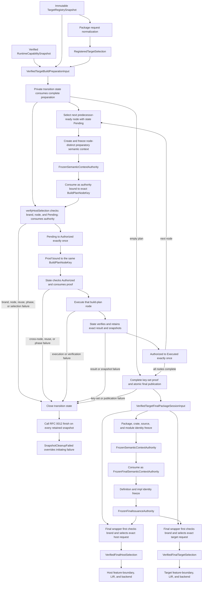
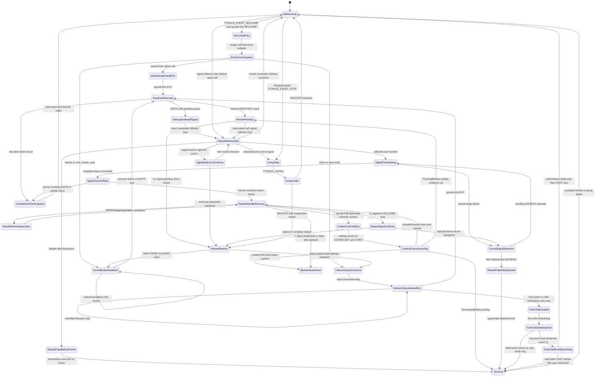

# RFC 0016: Context-Bound Target Registry Verification

## Summary

This RFC makes target selection a context-bound verified fact. It defines the
only legal ordering from package target registration through semantic identity
freeze to target-token publication, assigns immutable target-registry and
runtime-capability lifetime to the exact RFC 0012 preparation and final session
handoffs, and closes LLVM triple, data-layout, object-format, panic-strategy,
target-ID, registry-revision, and runtime-capability validation.

This RFC is a hash-bound additive normative overlay over the panic-capability,
target-registry, target-selection, package-handoff, and `CompilerSession`
clauses of RFCs 0006, 0008, 0010, 0011, and 0012. It does not change the
accepted HIR, MIR, LIR, feature-boundary, or backend architecture.
Implementation remains blocked until every required owner approves one exact
proposal snapshot and this RFC moves to `ACCEPTED`.

## Motivation

RFC 0010 declares that `VerifiedTargetSelection` contains a
`SemanticContextFingerprint`, but its selection algorithm does not accept that
fingerprint. The repository implementation reflects the incomplete algorithm:
`TargetRegistrySnapshot::verify` accepts only a context-free registered
selection, and `zomc` verifies host and target profiles before
`CompilerSession` freezes semantic identity.

The target registry also admits target records with hand-parsed triple and
data-layout fragments. It does not use LLVM's parsers as the authority, bind
the exact accepted data-layout bytes to registry identity, require an explicit
address-space-zero pointer entry, enforce object-format agreement, or
independently reproduce the complete registry codec. A target token can
therefore exist without the semantic context named by its type, and a target
profile can satisfy local string checks without proving that LLVM interprets
the profile as declared.

The two gaps are one authority problem. Package selection is context-free
request data. A target profile is backend configuration. Only the semantic
session that owns the final frozen brand-and-fingerprint authority may combine
them into a proof consumed by LIR and backend work.

## Goals

- Define one brand-and-fingerprint-bound `VerifiedTargetSelection` producer and
  delete every context-free target-token path.
- Retain the exact immutable `TargetRegistrySnapshot` through package-session
  installation and semantic identity freeze.
- Bind one immutable, independently verified runtime-capability snapshot to
  registry admission, package handoffs, target tokens, and consumers.
- Define total verification order, failure ownership, panic-strategy mapping,
  LLVM triple, subtarget, CPU, feature, target-machine, and data-layout
  validation, object-format agreement, target-ID recomputation, and registry-
  revision recomputation.
- Preserve exact target and registry codec domains while binding their complete
  preimages through independent oracles.
- Separate preparatory build-script host selection from final host and target
  selection so a preparatory token cannot authorize final compilation.
- Make LLVM discovery, components, and CI availability explicit repository
  requirements.
- Strengthen architecture gates against constructors, rebinding, manual target
  parsing, hard-coded layout allowlists, missing LLVM validation, and missing
  codec oracles.

## Non-Goals

- Changing RFC 0010 HIR, MIR, LIR, feature-boundary, or backend operation
  algebras.
- Adding target JSON, a target-plugin protocol, runtime CPU detection, or
  target-specific optimization policy.
- Adding a public target-token persistence codec.
- Changing the RFC 0011 semantic-context fingerprint or brand codecs.
- Treating the host compiler runtime's ambient behavior or an unwind-named
  symbol as target-runtime capability evidence.
- Normalizing LLVM data-layout text or treating byte-distinct layouts as the
  same registry identity.
- Preserving a context-free target verifier, token constructor, or rebinding
  adapter.
- Implementing compiler code before this RFC is accepted.

## Prior Art

### LLVM data-layout authority

LLVM's language reference defines the data-layout grammar and requires a
frontend's data layout to agree with the final code generator. LLVM's
`DataLayout::parse` returns a typed parse result, while
`getStringRepresentation()` explicitly is not an equality or canonicalization
operation because distinct strings can represent the same layout. ZOM uses
LLVM parsing and typed queries for validity and semantic projection while
retaining the exact admitted bytes for identity.

References:

- <https://llvm.org/docs/LangRef.html#data-layout>
- <https://llvm.org/doxygen/classllvm_1_1DataLayout.html>

### LLVM target triples and object formats

LLVM's `Triple` provides normalization, typed architecture/vendor/OS/environment
access, and typed object-format classification. Clang requires an explicit
target for cross-compilation because host inference can silently select the
wrong CPU and toolchain behavior. ZOM uses the parsed triple for semantic
projection, requires a known LLVM object format to match the registry, and
rejects a triple whose object format is unknown rather than permitting a
registry override.

References:

- <https://llvm.org/doxygen/classllvm_1_1Triple.html>
- <https://clang.llvm.org/docs/CrossCompilation.html>

### Rust target specifications

Rust target specifications bind the LLVM target, data layout, pointer width,
and target options as one version-sensitive compiler input. The rustc
documentation warns that target specifications are compiler-version specific
and exposes a schema from the running compiler. ZOM similarly treats the
registry snapshot and its exact bytes as versioned compiler input rather than
ambient strings.

References:

- <https://doc.rust-lang.org/rustc/targets/custom.html>
- <https://doc.rust-lang.org/stable/nightly-rustc/rustc_target/spec/index.html>

### LLVM 22 API baseline

The version-sensitive admission contract is bound to the official
`llvmorg-22.1.8` source tag rather than unversioned Doxygen generated from LLVM
main. The implementation uses the typed APIs and ownership contracts in these
official sources:

- <https://github.com/llvm/llvm-project/blob/llvmorg-22.1.8/llvm/include/llvm/IR/DataLayout.h>
- <https://github.com/llvm/llvm-project/blob/llvmorg-22.1.8/llvm/include/llvm/TargetParser/Triple.h>
- <https://github.com/llvm/llvm-project/blob/llvmorg-22.1.8/llvm/include/llvm/MC/TargetRegistry.h>
- <https://github.com/llvm/llvm-project/blob/llvmorg-22.1.8/llvm/include/llvm/MC/MCSubtargetInfo.h>
- <https://github.com/llvm/llvm-project/blob/llvmorg-22.1.8/llvm/include/llvm/Target/TargetMachine.h>
- <https://github.com/llvm/llvm-project/blob/llvmorg-22.1.8/llvm/docs/CMake.rst>

The repository dependency is exactly LLVM `22.1.8`. A dependency update must
change this baseline, the build checks, and every LLVM admission probe in one
reviewed change.

### Hermetic action execution

Bazel remote execution models an action from its command, environment, input
root, and declared outputs, while Bazel sandboxing treats access to an
undeclared input as a correctness failure because it can poison local or
remote cache identity. Nix build sandboxes similarly expose only declared
store inputs and private build state. ZOM adopts the closed command,
environment, input, output, and network boundary, but does not require a build
system migration. The coverage runner instead reconstructs those authorities
around the existing CMake, Ninja, and CTest process trees and rejects every
unclassified observation or mutation.

References:

- <https://bazel.build/remote/caching>
- <https://bazel.build/docs/sandboxing>
- <https://nix.dev/manual/nix/latest/command-ref/conf-file#conf-sandbox>

### Controlled user-observation execution

Linux seccomp user notification can mediate syscalls, but Linux documents that
vDSO calls do not pass through seccomp or syscall tracing. KVM supplies a
separate machine boundary where CPUID, devices, auxiliary-vector construction,
and direct clock instructions can be controlled. The KVM API defines CPUID
through `KVM_SET_CPUID2`, while its x86 `KVM_EXIT_EXCEPTION` payload is unused;
ZOM therefore does not depend on a userspace exit for either instruction.
Instead it uses a fixed KVM CPUID table and repository-owned guest #GP/#UD
handlers for TSC and rejected entropy instructions. Native Linux vfork uses a
shared `mm`, blocks the caller until child exec or exit, and exposes
`PTRACE_EVENT_VFORK_DONE`; ZOM binds those kernel semantics directly and adds
fixed-kernel census, snapshot, and completion hooks where upstream UAPI does
not expose enough typed evidence.
Linux 4.8 and later place `PTRACE_EVENT_SECCOMP` between an optional ordinary
syscall-entry stop and the syscall-exit stop, and document it as entry-
equivalent. ZOM therefore resumes tracees with `PTRACE_CONT` between calls,
treats the seccomp event as the unique entry-equivalent stop, and uses exactly
one `PTRACE_SYSCALL` continuation chain to obtain the paired exit or one documented
non-returning completion. glibc 2.39 implements `posix_spawn` with
`CLONE_VM | CLONE_VFORK`, an allocated child stack, and, on the clone3 path,
`CLONE_CLEAR_SIGHAND`; those calls enter the same native-vfork admission path
as raw `vfork` rather than the ordinary `CLONE_VM` path. Linux pipe capacity,
`PIPE_BUF`, nonblocking partial-write rules, and writable-space observations
are modeled as explicit broker authority instead of ambient kernel queue state.
ZOM does not claim that a namespace sandbox observes user-mode instructions.
Darwin has no admitted equivalent in this RFC, so coverage rejects that
platform before execution.

References:

- <https://www.kernel.org/doc/html/latest/userspace-api/seccomp_filter.html>
- <https://man7.org/linux/man-pages/man2/ptrace.2.html>
- <https://man7.org/linux/man-pages/man2/clone.2.html>
- <https://github.com/bminor/glibc/blob/glibc-2.39/sysdeps/unix/sysv/linux/spawni.c>
- <https://man7.org/linux/man-pages/man7/pipe.7.html>
- <https://man7.org/linux/man-pages/man2/F_GETPIPE_SZ.2const.html>
- <https://man7.org/linux/man-pages/man7/vdso.7.html>
- <https://www.kernel.org/doc/html/latest/virt/kvm/api.html>
- <https://github.com/torvalds/linux/blob/v6.8/kernel/fork.c>

### Linux 6.8 lifecycle and ABI baseline

The controlled guest kernel starts from the official Linux `v6.8` source tag.
The RFC does not generalize observed behavior from an ambient host kernel. Its
ptrace event encoding, `exec_mm_release` clear-child-TID behavior, robust-futex
exit walk, parent reaping, directory records, and clone3 validation are bound
to these primary sources and to the explicit guest-UAPI extension defined
below:

- <https://github.com/torvalds/linux/blob/v6.8/include/uapi/linux/ptrace.h>
- <https://github.com/torvalds/linux/blob/v6.8/include/linux/ptrace.h>
- <https://github.com/torvalds/linux/blob/v6.8/kernel/fork.c>
- <https://github.com/torvalds/linux/blob/v6.8/kernel/futex/core.c>
- <https://github.com/torvalds/linux/blob/v6.8/include/linux/futex.h>
- <https://github.com/torvalds/linux/blob/v6.8/kernel/exit.c>
- <https://github.com/torvalds/linux/blob/v6.8/fs/readdir.c>
- <https://github.com/torvalds/linux/blob/v6.8/include/linux/dirent.h>
- <https://github.com/torvalds/linux/blob/v6.8/fs/read_write.c>
- <https://github.com/torvalds/linux/blob/v6.8/fs/open.c>
- <https://github.com/torvalds/linux/blob/v6.8/mm/filemap.c>
- <https://github.com/torvalds/linux/blob/v6.8/fs/splice.c>
- <https://github.com/torvalds/linux/blob/v6.8/lib/iov_iter.c>
- <https://github.com/torvalds/linux/blob/v6.8/include/linux/fs.h>
- <https://github.com/torvalds/linux/blob/v6.8/include/uapi/linux/uio.h>
- <https://github.com/torvalds/linux/blob/v6.8/include/uapi/linux/sched.h>
- <https://github.com/torvalds/linux/blob/v6.8/include/linux/pid_namespace.h>

Linux `v6.8` is the normative behavior when this RFC says "Linux" below.
Changing the base tag or any guest patch changes `guestKernelSha256`,
`kernelUapiSha256`, `ptraceAbiSha256`, the positive and negative preflight
oracles, and the accepted baseline together.

### Path-operation request identity

Linux `openat2` makes `open_how.flags`, `mode`, `resolve`, and structure size
part of pathname-resolution behavior. `statx` likewise makes the lookup flags
and requested mask observable inputs. ZOM retains those typed requests and the
resolved path versions; a generic operation name and final pathname are not
sufficient evidence.

References:

- <https://man7.org/linux/man-pages/man2/openat2.2.html>
- <https://man7.org/linux/man-pages/man2/open_how.2type.html>
- <https://man7.org/linux/man-pages/man2/statx.2.html>

### Process provenance and supply-chain attestations

in-toto link metadata records the command, materials, products, and execution
environment for a supply-chain step. SLSA provenance binds output subjects to
a build definition, run details, and resolved dependencies. ZOM adopts those
separate command, dependency, product, and result identities and retains raw
evidence from which the checker independently reconstructs them. It does not
treat a self-authored attestation or build-graph declaration as proof that no
undeclared file was observed; the sandbox and closed event trace must prove
that stronger property before an attestation is accepted.

References:

- <https://github.com/in-toto/docs/blob/v1.0/in-toto-spec.md>
- <https://slsa.dev/spec/v1.0/provenance>

### External coverage evidence

GitHub Actions workflow artifacts are intended for coverage and test evidence,
and artifact attestations bind artifact bytes to the repository, workflow, and
commit that produced them. ZOM keeps RFC 0016 coverage reports outside the
source tree, hashes both rendered reports into an attested bundle, and binds
that bundle to the exact source commit and tree. This avoids an impossible
report-contains-its-own-commit cycle while preserving deterministic local
regeneration.

References:

- <https://docs.github.com/en/actions/concepts/workflows-and-actions/workflow-artifacts>
- <https://docs.github.com/en/actions/how-tos/secure-your-work/use-artifact-attestations/use-artifact-attestations>
- <https://slsa.dev/spec/v1.0/requirements#provenance-generation>

### Reproducible build inputs

The Reproducible Builds project standardizes `SOURCE_DATE_EPOCH` and documents
that timestamps, build paths, locale, and tool behavior must be normalized or
recorded. ZOM adopts a source-derived epoch, closed locale and timezone, root
normalization, and exact tool and input digests. It does not require byte-equal
artifacts across two different source revisions: each revision is proved
independently, while only the comparison projection that defines equivalent
test and tool semantics must match.

References:

- <https://reproducible-builds.org/docs/source-date-epoch/>
- <https://reproducible-builds.org/docs/build-path/>
- <https://reproducible-builds.org/docs/locales/>

### Dual-revision source coverage

Clang source-based coverage defines the three independent stages of
instrumented compilation, profile collection, and report generation;
`llvm-cov export` consumes the instrumented objects and the merged indexed
profile. `diff-cover` demonstrates the established practice of evaluating
coverage against a Git comparison rather than treating one current aggregate
as a regression oracle. ZOM adopts independent baseline and current builds,
profiles, objects, and exports, including one export with each compilation
object as the sole `BIN` for exact translation-unit attribution, then performs
exact Git-blob and integer-ratio comparison. It rejects report-only patch coverage, reused profiles, or a
caller-selected baseline because none proves that both revisions executed the
same retained semantic test set under equivalent build policy.

References:

- <https://clang.llvm.org/docs/SourceBasedCodeCoverage.html>
- <https://llvm.org/docs/CommandGuide/llvm-cov.html#llvm-cov-export>
- <https://github.com/Bachmann1234/diff_cover>

## Guide-Level Explanation

A package request continues to name a registered host and target profile. That
selection proves only that request normalization used one immutable registry
revision. It is not permission to construct target-dependent IR.

`CompilerSession` owns the same registry snapshot and runtime-capability
snapshot. Before any build-plan node work, one private transition state
consumes the complete preparation wrapper. While holding that exact state, the
session creates and freezes one distinct preparatory semantic context for each
predecessor-ready build-plan node and consumes that node's generic frozen
authority into a fresh `FrozenPreparatorySemanticContextAuthority`. The state
initializes one entry keyed by every exact `BuildPlanNodeKey` to `Pending`.
Its private `verifyHostSelection` consumes the authority, requires its node key
to equal the currently selected predecessor-ready node, and requires that node
to be `Pending` before it selects the nested wrapper's exact host request field.
Only successful selection performs the one `Pending -> Authorized` transition
and returns one move-only preparation-host proof carrying that same node key.
The state consumes that proof before execution and performs the one
`Authorized -> Executed` transition only after execution and result verification
succeed. Callers cannot provide a selection, and an authority or
proof cannot cross node keys, skip a phase, repeat a phase, or be reused. Any
such mismatch is `InputRevisionMismatch` before request selection or another
node execution, closes the entire transition, and finishes every retained RFC
0012 snapshot; `SnapshotCleanupFailed` overrides the initiating failure. The
state verifies each node result internally in predecessor order so verified
predecessor output keys can construct the next execution key, but publishes
nothing. After the complete key-set proof and atomic final publication, the
session holds the exact final wrapper, completes
package, crate, source-content, and module identity freeze, and consumes that
context's generic frozen authority into one
`FrozenFinalSemanticContextAuthority`. The definition and impl freeze operation
consumes that phase authority and, only on complete success, returns a
`FrozenFinalIssuanceAuthority`. Only that post-freeze capability may reach the
final wrapper, which first verifies exact same-wrapper brand equality, selects
its exact host or target request field, and invokes the private verifier.
Successful phase-specific results are the only target proofs accepted by their
respective feature-boundary, LIR, or backend entry points.



Build scripts use a distinct preparatory semantic context. Their verified host
token carries the preparatory brand and fingerprint. After build-script outputs
finalize source roots, the final session freezes a different context and issues
final host and target tokens with a different brand. The preparatory token
cannot satisfy the final context's brand check even if the two deterministic
fingerprints are byte-equal.

The registry stores the exact LLVM data-layout bytes it admits. For example,
two layouts that LLVM considers equivalent but that differ as `p:` and `p0:`
remain different target specifications, target IDs, and registry revisions.
LLVM parses both; ZOM does not rewrite either string.

## Reference-Level Design

### Bound Proposal Snapshots

This RFC overlays only the clauses named below. All other clauses retain their
existing authority.

| RFC | Proposal SHA-256 | Overlaid clauses |
|---|---|---|
| RFC 0006 | `c37e40c9f903901a4f8f738e8d5d8fed842d55473ec9420eda901a46aede1613` | Runtime and target panic-capability validation before lowering |
| RFC 0008 | `f1169871ea0e983bcf69b13ead94093522fff7c25c37187787d9a2fb6b003854` | Package-session input ownership, semantic freeze order, and build-script context separation |
| RFC 0010 | `6deb4954d6a6d2dc8904b366a338c1bdad452d3ab55d1392444d106653a78921` | Target registry, target selection, target verification failures, and target acceptance criteria |
| RFC 0011 | `383dc8905ae389949008f47f3b501d812a26d91769460d7e41731283b2f8cc03` | Semantic-context brand and fingerprint use and canonical target projection |
| RFC 0012 | `7f77fe66cb6a84b0279255081073755bb7d0e61ff2de908c251eb6c1182f8cce` | Registered target selection, package request ownership, panic-strategy mapping, build-result validation ownership, preparation-to-final transition timing, final-record publication, and retained-snapshot cleanup |

Acceptance of this RFC does not mutate those proposal files. Their trackers
must record the accepted RFC 0016 proposal hash before implementation begins.

### Normative overlay authority

Where this RFC conflicts with the bound panic-capability, target-selection, or
RFC 0012 final-handoff clauses named in the table above, this RFC is
authoritative. It preserves the target-spec and target-registry hash domains
and all unrelated records.

### Closed records

The normative semantic contract is:

```text
FrozenSemanticContextAuthority {
  contextBrand: RFC0011::SemanticContextBrand,
  contextFingerprint: RFC0011::SemanticContextFingerprint,
}

FrozenPreparatorySemanticContextAuthority {
  packageSessionBrand: TargetPackageSessionBrand,
  node: RFC0012::BuildPlanNodeKey,
  authority: FrozenSemanticContextAuthority,
}

FrozenFinalSemanticContextAuthority {
  packageSessionBrand: TargetPackageSessionBrand,
  authority: FrozenSemanticContextAuthority,
}

FrozenFinalIssuanceAuthority {
  packageSessionBrand: TargetPackageSessionBrand,
  authority: FrozenFinalSemanticContextAuthority,
}

PackageSelectionPanicStrategy = Abort | Unwind

RuntimePanicCapability = Abort | Unwind

RuntimeCapabilityEntry {
  panicStrategies: SortedUniqueSequence<RuntimePanicCapability>,
}

VerifiedRuntimeCapabilitySnapshot {
  capabilityBrand: RuntimeCapabilityBrand,
  entries: SortedMap<RFC0011::TargetComponentName, RuntimeCapabilityEntry>,
  revision: RuntimeCapabilityRevision,
}

VerifiedTargetBuildPreparationInput {
  packageSessionBrand: TargetPackageSessionBrand,
  packageInput: RFC0012::VerifiedBuildPreparationInput,
  targetRegistry: TargetRegistrySnapshot,
  runtimeCapabilities: VerifiedRuntimeCapabilitySnapshot,
}

TargetBuildTransitionState {
  lifecycle: TargetBuildTransitionLifecycle,
  packageSessionBrand: TargetPackageSessionBrand,
  preparation: VerifiedTargetBuildPreparationInput,
  nodeStates: SortedMap<RFC0012::BuildPlanNodeKey, PreparatoryNodeState>,
  currentNode: Maybe<RFC0012::BuildPlanNodeKey>,

  verifyHostSelection(
    context: FrozenPreparatorySemanticContextAuthority&&,
  ) -> PrivateTransitionResult<VerifiedPreparationHostSelection>

  executeAuthorizedNode(
    proof: VerifiedPreparationHostSelection&&,
  ) -> PrivateTransitionResult<PrivateExecutedNode>
}

TargetBuildTransitionLifecycle = Open | Closed

PreparatoryNodeState =
  Pending
  | Authorized {
      contextBrand: RFC0011::SemanticContextBrand,
      contextFingerprint: RFC0011::SemanticContextFingerprint,
    }
  | Executed {
      contextBrand: RFC0011::SemanticContextBrand,
      contextFingerprint: RFC0011::SemanticContextFingerprint,
      result: RFC0012::VerifiedBuildResult,
    }

PrivateExecutedNode {
  node: RFC0012::BuildPlanNodeKey,
}

PrivateTransitionResult<VerifiedValue> =
  OneOf<
    RFC0010::IrOperationResult<VerifiedValue>,
    RFC0012::PackagePipelineFailure,
  >

VerifiedTargetFinalPackageSessionInput {
  packageSessionBrand: TargetPackageSessionBrand,
  packageInput: RFC0012::VerifiedFinalPackageSessionInput,
  targetRegistry: TargetRegistrySnapshot,
  runtimeCapabilities: VerifiedRuntimeCapabilitySnapshot,

  verifyHostSelection(
    context: const FrozenFinalIssuanceAuthority&,
  ) -> RFC0010::IrOperationResult<VerifiedFinalHostSelection>

  verifyTargetSelection(
    context: const FrozenFinalIssuanceAuthority&,
  ) -> RFC0010::IrOperationResult<VerifiedFinalTargetSelection>
}

VerifiedTargetSelection {
  contextBrand: RFC0011::SemanticContextBrand,
  contextFingerprint: RFC0011::SemanticContextFingerprint,
  runtimeCapabilityBrand: RuntimeCapabilityBrand,
  runtimeCapabilityRevision: RuntimeCapabilityRevision,
  packageSelection: RFC0012::RegisteredTargetSelection,
  canonicalTargetSpec: RFC0010::CanonicalTargetSpec,
  targetSpecId: RFC0010::TargetSpecId,
}

VerifiedPreparationHostSelection {
  packageSessionBrand: TargetPackageSessionBrand,
  node: RFC0012::BuildPlanNodeKey,
  selection: VerifiedTargetSelection,
}

VerifiedFinalHostSelection {
  selection: VerifiedTargetSelection,
}

VerifiedFinalTargetSelection {
  selection: VerifiedTargetSelection,
}
```

`PrivateTransitionResult` is an implementation-private cleanup composition, not
a second target-selection failure algebra. Its first alternative is the exact
RFC 0010 result without translated, added, or removed variants. Its second
alternative exists only because the transition owns RFC 0012 snapshots. On an
initiating RFC 0010 or RFC 0012 failure, the transition closes and calls every
required `finish()`; if cleanup succeeds, it returns the initiating alternative,
and if cleanup fails, it returns the exact RFC 0012 `PackagePipelineFailure`
whose materialization issue is `SnapshotCleanupFailed`. No caller unwraps an
initiating target-selection failure before cleanup completes.

`PackageSelectionPanicStrategy` gives the anonymous closed value domain of RFC
0012 `RegisteredTargetSelection.panicStrategy` an implementation name. This
overlay changes that field's type from the anonymous `Abort | Unwind` spelling
to `PackageSelectionPanicStrategy` without changing its field position or
encoding. Its tags remain exactly `Abort = 0x01` and `Unwind = 0x02` as bound
by RFC 0012. In this RFC, `PanicStrategy` refers only to the exact closed
backend algebra declared by RFC 0010; its tags remain `Unwind = 0x01` and
`Abort = 0x02`. These are distinct types and neither is an alias for the
other.

`FrozenSemanticContextAuthority` is move-only, non-serializable, and produced
only by the RFC 0011 semantic-context freeze operation. It is not constructible
from a caller-provided brand or fingerprint. Preparatory and final contexts
receive distinct brands from the process `SemanticContextFactory` even when
their deterministic fingerprints are byte-equal.

`FrozenPreparatorySemanticContextAuthority`,
`FrozenFinalSemanticContextAuthority`, and `FrozenFinalIssuanceAuthority` are
unrelated move-only, private-constructor capabilities. They do not expose a
public conversion, aggregate initialization, clone, factory, decoder,
deserializer, rebinding operation, or caller-selected phase.
`CompilerSession` is their sole producer. It constructs a preparatory authority
only while holding the exact transition state and only after freezing one
build-plan node's preparatory semantic context, with that exact key selected as
`currentNode`, that key's state equal to `Pending`, and the lifecycle equal to
`Open`. It constructs the final semantic
authority only while holding the exact final wrapper and only after the final
package, crate, source-content, and module registries freeze and the RFC 0011
semantic-context fingerprint is complete. Construction consumes the generic
frozen authority into exactly one phase capability, so the generic authority
cannot also be retained.

Each build-plan node receives a newly issued preparatory semantic-context brand
even when two node fingerprints are byte-equal. The transition state binds the
node identity, fresh authority, and resulting host proof in one linear internal
step. Construction sets the lifecycle to `Open`. Every plan key initializes
exactly one map entry in `Pending`; no other
entry may be inserted, removed, or re-keyed. `verifyHostSelection` is the sole
`Pending -> Authorized` operation. It consumes a preparatory authority carrying
the exact current `BuildPlanNodeKey`, retains the successful context brand and
fingerprint in that key's state entry, and returns a proof carrying the same
package-session brand, node key, brand, and fingerprint. No unsuccessful call
changes the node to `Authorized`.

`executeAuthorizedNode` is the sole `Authorized -> Executed` operation. It
consumes the exact node-bound proof, constructs the execution key only from
already `Executed` predecessor entries, executes and verifies that node, and
stores the resulting `VerifiedBuildResult` in the same map entry. No operation
transitions `Pending` directly to `Executed`, transitions backward, repeats
either edge, or changes more than one entry. After the node reaches `Executed`,
neither capability can be accepted again or for another node. A cross-node
authority or proof, a second authorization or execution, an attempted phase
skip, or any state/key disagreement is a pre-selection
`InputRevisionMismatch`; it closes the complete transition before request-field
selection, target-selection algorithm entry, script execution, or acceptance
of another result, whichever would otherwise occur next.

Before returning any failure, the transition atomically changes its lifecycle
from `Open` to `Closed`; this edge occurs exactly once and precedes snapshot
cleanup. `Closed` has no production method surface. A private negative fixture
that attempts another transition against retained test-only state receives
pre-selection `InputRevisionMismatch`, invokes only idempotent RFC 0012
`finish()` retries, and cannot authorize, execute, or publish. Complete final
publication instead consumes the `Open` state into the final wrapper, leaving no
transition object to reuse.

Final definition and impl freeze is one private operation that consumes the
complete `FrozenFinalSemanticContextAuthority`. On any identity or freeze
failure it publishes no successor. Only after both registries freeze does it
return `FrozenFinalIssuanceAuthority` carrying the same context authority and
exact package-session brand. No final-wrapper method accepts
`FrozenFinalSemanticContextAuthority`; therefore early final host or target
issuance is outside the callable algebra rather than prohibited only by prose.
Compile-negative and architecture fixtures reject direct construction,
conversion, alternate production, retention of the consumed predecessor, and
final issuance without this post-freeze capability.

`TargetPackageSessionBrand` is an opaque nonzero process-local association
authority. Its constructor is private to the process-root
`TargetPackageSessionFactory`; callers cannot provide, decode, deserialize,
convert, reset, or reuse a brand. The factory uses the same serialized monotonic
`1..UINT64_MAX` issuance and permanent exhaustion contract as
`RuntimeCapabilityFactory`, including final-two-issuance and concurrent
uniqueness tests. Exhaustion returns
`TargetAuthorityConstructionIssue::InvalidFact`, publishes no target-bound
preparation wrapper, and maps to `ZOM9957`.

The target-bound package-session implementation issues exactly one brand only
after complete preparation input, registry, and runtime-snapshot association
validation. The preparation wrapper owns it; final-wrapper construction moves
the same brand from the transition-owned wrapper without reissuing or
substituting another wrapper's identity. While holding the exact transition
state or final wrapper, `CompilerSession` copies that opaque identity into the
corresponding phase authority it privately constructs. Every issuance method
first requires exact brand equality between its owning state or wrapper and
phase authority. A same-phase authority from another transition state or final
wrapper returns
`InputRevisionMismatch` before request-field selection or any target-selection
algorithm step and publishes no proof. The brand is private bug context only:
it is absent from all canonical preimages, deterministic revisions, target
tokens, diagnostics, and persistence formats.

`CompilerProcessAuthorityRoot` is the explicit process-root owner of exactly
one `RuntimeCapabilityFactory` and exactly one
`TargetPackageSessionFactory`, each held by value. The executable constructs
the root before worker launch and injects explicit factory references only into
the private target-authority construction path. Neither factory has static
storage duration, a function-local static, a singleton or service-locator
accessor, an independently default-constructible production path, or an
alternate issuer. Test construction uses an explicit test process root rather
than replacing global state. Architecture fixtures reject every static,
singleton, duplicate-owner, or construction-path-bypassing issuer.

`RuntimeCapabilityBrand` is an opaque nonzero process-local authority issued
only by the process-root-owned compiler-distribution
`RuntimeCapabilityFactory`.
The brand constructor is private to that factory; callers cannot provide a raw
value, decode, deserialize, issue, or reset a brand. Copying an issued brand
preserves the same identity and creates no new authority. The factory owns one
process-lifetime serialized state `{ lastIssued: uint64, exhausted: bool }`.
It issues `1..UINT64_MAX` exactly once each. Issuing `UINT64_MAX` atomically
sets `exhausted`; every later request returns no brand without increment,
wrapping, resetting, or reusing a value. The process root constructs the single
runtime capability snapshot before worker launch through its privately injected
factory reference. Test-only process-root injection sets
`lastIssued = UINT64_MAX - 2` and proves the final two unique issuances,
`UINT64_MAX - 1` followed by `UINT64_MAX`, exhaustion, concurrent uniqueness,
and permanent non-reuse. Brand issuance occurs only
after manifest and codec verification; exhaustion returns
`TargetAuthorityConstructionIssue::InvalidFact`, publishes no snapshot, and
maps to `ZOM9957`.
`RuntimeCapabilityRevision` is the SHA-256 digest of the complete canonical
capability manifest defined below. `RuntimePanicCapability` tags are `Abort =
0x01` and `Unwind = 0x02`; neither numeric value is shared with or cast to RFC
0010 backend panic tags or the C++ runtime enum.

`RuntimeAbiProfileId` is a closed generated enum whose initial and only value
is `ZomV1 = 0x01`. Registry construction is the sole operation that maps an
RFC 0011 `TargetComponentName` runtime-ABI field to this enum; an unknown or
duplicate mapping is `InvalidFact`.

`VerifiedRuntimeCapabilitySnapshot` is move-only, private-constructor, and
generated from the single `runtime/panic-capabilities.def` registry. The same
definition file generates only the private construction oracle
`RuntimeCapabilityManifestOracle::supports(RuntimeAbiProfileId,
RuntimePanicCapability)`, which is callable solely by
`RuntimeCapabilityFactory` while verifying and publishing the snapshot. The
published snapshot exposes the only later query,
`VerifiedRuntimeCapabilitySnapshot::supports(RuntimeAbiProfileId,
RuntimePanicCapability) const`; it reads the snapshot's immutable verified
records and therefore cannot be called without the exact non-forgeable
snapshot. No free function, runtime-symbol query, `ZomPanicStrategy` overload,
raw ABI string overload, or snapshot-unbound query exists. The initial registry
contains exactly `zom-v1 -> {Abort}`. An `Unwind` entry is forbidden until the
same change implements and verifies the RFC 0006 unwinder, cleanup integration,
catch boundary, FFI containment, and target matrix. A runtime symbol name is
never capability evidence.

`TargetRuntimeAbiAssociation` is the private pair
`{ target: TargetSpecId, runtimeAbi: RuntimeAbiProfileId }`.
`TargetRegistrySnapshot` retains the exact runtime capability brand and
revision plus a sorted unique, complete association sequence containing exactly
one row for every admitted target specification. Registry admission is the sole
phase that maps each specification's RFC 0011 `TargetComponentName`
`runtimeAbiProfile` to `RuntimeAbiProfileId`. It constructs the association
atomically with the candidate and an independent admission verifier rebuilds
the typed rows from the generated manifest table and requires exact equality
before snapshot publication. Missing, additional, duplicate, swapped,
wrong-target, or wrong-profile rows are
`TargetAuthorityConstructionIssue::InvalidFact`, publish no snapshot, and map
to `ZOM9957`.

An admitted specification may contain a panic strategy that the runtime does
not support. That unsupported pair remains a valid target codec and is rejected
as a capability only if selected. The private brand, revision, and typed
association sequence do not enter or alter the existing target, profile, or
`zom.target-registry.v0` codec preimages.

`VerifiedTargetBuildPreparationInput` owns one exact RFC 0012
`VerifiedBuildPreparationInput`, the registry snapshot, and the runtime
capability snapshot by value. Before any build-script execution, one private
`TargetBuildTransitionState` consumes the complete preparation wrapper. The
state exclusively owns the nested request, resolution, `SourceViewStore`, build
plan, registry, runtime snapshot, package-session brand, every candidate result,
and every generated snapshot from that point onward.

The state advances only in canonical predecessor order. For one ready plan
node, it chooses the exact map key, requires every predecessor entry to be
`Executed`, and sets `currentNode` to that key while its entry remains
`Pending`. `verifyHostSelection` first checks package-session brand equality,
authority node equality with `currentNode`, and the exact `Pending` state, in
that order; it then consumes the authority, selects the exact host request, and
runs target selection. Only success stores `Authorized` and returns the exact
node-bound proof. `executeAuthorizedNode` first checks proof package-session
brand equality, proof node equality with `currentNode`, the exact `Authorized`
state, and equality of the retained context brand and fingerprint, in that
order; it then consumes the proof, constructs the complete
`BuildScriptExecutionKey` from already-verified predecessor output keys held
inside `Executed` entries, executes the script, takes ownership of its untrusted
result and generated snapshots, and immediately verifies the exact plan-node
association, output record, generated view, digest, and UTF-8 source
requirements. Only complete success stores `Executed`, clears `currentNode`,
and makes the result internally usable for later execution keys. No result,
view, key, state entry, or map is published.

After every plan node succeeds, the same state proves exact plan/result key-set
equality over its complete internal result map, moves the nested RFC 0012
request, resolution, source views, build plan, verified results, and generated
views to construct the exact `VerifiedFinalPackageSessionInput`, and publishes
it only as part of one `VerifiedTargetFinalPackageSessionInput` with the same
registry, runtime snapshot, and package-session brand. Neither authority is
cloned or reconstructed, and no standalone final RFC 0012 value is published.

Both target-bound input types are move-only, have private constructors, and
are constructible only by the target-bound package-session implementation.
Preparation construction atomically validates and moves one exact RFC 0012
preparation input with the registry and runtime snapshots. Transition-state
construction is the only operation that consumes that preparation wrapper;
final construction is the only terminal success state and validates the exact
final RFC 0012 request, resolution, source-view, build-plan, build-result,
generated-view, key-set, and cleanup association while moving the same two
authority snapshots. No public constructor, aggregate
initialization, field-wise factory, deserializer, clone, or caller-provided
association is available for either wrapper. No API accepts a caller-supplied
`VerifiedFinalPackageSessionInput`, exposes a partially moved preparation
wrapper, or returns the nested final value outside the target-bound wrapper.

The final wrapper preserves the exact RFC 0012 request, resolution,
`SourceViewStore`, build-plan map, build-result map, generated views, key-set
bijection, and snapshot cleanup contract. On success or failure it retains
ownership until every move-only snapshot has completed RFC 0012 `finish()`;
cleanup failure remains `SnapshotCleanupFailed`. Neither wrapper contains a
`VerifiedTargetSelection`, borrowed root, caller-owned reference, or alternate
source inventory.

Every failure during preparatory brand, node, phase, reuse, or context checks;
host selection; node execution; incremental result or generated-view
validation; key-set proof; nested-final construction; registry/runtime/brand
transfer; or final-wrapper publication irreversibly closes the transition.
The closed state cannot select, authorize, execute, retry, or publish. It
retains all not-yet-moved snapshots in exactly one transition-owned owner and
calls RFC 0012 `finish()` on every retained source and generated snapshot
before returning. If any `finish()` call fails, RFC 0012
`SnapshotCleanupFailed` replaces the initiating failure; otherwise the original
failure is returned. No failure returns either wrapper, the nested final record,
a proof, a result map, an internally verified predecessor output, or a partially
moved source-view store.

`VerifiedTargetSelection` is move-only. Its constructor is private to the
target-bound package-session implementation and owns its exact
`CanonicalTargetSpec` by value. There is no
default constructor, public factory, one-argument verifier, `withContext`,
rebinding API, deserializer, public clone, registry-backed reference, or API
that can replace any of its seven fields. The context brand is the live
semantic issuer capability; the fingerprint remains deterministic semantic
revision and diagnostic binding. The runtime capability brand and revision
bind the exact runtime feature authority.

The three phase proof types are move-only, private-constructor, unrelated
closed types. They expose read-only access to their contained proof and no
conversion to another phase proof. The private transition state exposes only
preparation `verifyHostSelection`; it reads exactly the nested
`packageInput.request.hostTarget` and cannot name or verify the nested
`packageInput.request.target`. The final wrapper exposes separate host and
target methods that read exactly `packageInput.request.hostTarget` and
`packageInput.request.target`, respectively. Preparation issuance accepts only
`FrozenPreparatorySemanticContextAuthority`; both final issuance methods accept
only `FrozenFinalIssuanceAuthority`. None of the three methods accepts a raw
`FrozenSemanticContextAuthority`, pre-definition/impl
`FrozenFinalSemanticContextAuthority`, `RegisteredTargetSelection`, profile,
target ID, or phase argument.

The thirteen-step target-selection algorithm is a private implementation
detail invoked only by those methods. It receives a sealed phase authorization
created from the owning state or wrapper's exact request field; no callable
generic verifier
accepts raw context, registry, runtime snapshot, and caller-selected target
arguments. Consumers take the exact phase proof type required by their entry
point and compare the proof's complete `packageSelection` for equality with
the same phase-authorized request field before comparing every other authority
field.

### Session ordering

The production order is total:

1. Build and independently verify one immutable
   `VerifiedRuntimeCapabilitySnapshot`.
2. Build and independently verify one immutable `TargetRegistrySnapshot`
   against that exact runtime capability brand and revision.
3. Derive the context-free RFC 0012 `RegisteredTargetService` from that exact
   snapshot.
4. Normalize and verify the package request, resolution, source views, and
   build plan into RFC 0012 `VerifiedBuildPreparationInput` using that service.
5. Move the complete RFC 0012 preparation value, exact registry snapshot, and
   exact runtime capability snapshot atomically into
   `VerifiedTargetBuildPreparationInput`, issuing its one
   `TargetPackageSessionBrand` only after association validation succeeds.
6. Before executing any build-plan node, consume the complete target-bound
   preparation wrapper into one private `TargetBuildTransitionState` and
   initialize exactly one `Pending` entry for every build-plan key. In canonical
   predecessor order, select one predecessor-ready key as `currentNode`, create
   and freeze that node's preparatory context, and consume its generic frozen
   authority into one `FrozenPreparatorySemanticContextAuthority` carrying the
   transition's exact package-session brand and exact `BuildPlanNodeKey`.
7. Invoke `verifyHostSelection` once for that node. The state checks brand, node,
   and `Pending` phase before request selection, consumes the authority, and on
   success alone changes that exact entry to `Authorized` and returns one proof
   carrying the same node key. Immediately consume that proof through
   `executeAuthorizedNode`; the state checks brand, node, `Authorized` phase,
   and context identity before execution, constructs the execution key only
   from internally retained `Executed` predecessor results, and on complete
   execution and verification success alone changes the same entry to
   `Executed`. Repeat this per-node cycle for the next predecessor-ready key; an
   empty build plan proceeds directly to the empty key-set proof. A
   cross-node, reused, skipped, repeated, or otherwise phase-inconsistent
   authority or proof is pre-selection `InputRevisionMismatch`, closes the
   transition, and performs RFC 0012 cleanup with `SnapshotCleanupFailed`
   precedence. After all nodes are `Executed`, prove exact plan/result key-set
   equality and atomically construct the RFC 0012
   `VerifiedFinalPackageSessionInput` only inside
   `VerifiedTargetFinalPackageSessionInput` with the same registry, runtime
   capability snapshot, and package-session brand. Publish no intermediate
   proof, result, view, key, map, node state, or nested final value.
8. Freeze final package, crate, source-content, and module identity.
9. Consume the generic final frozen authority into one
    `FrozenFinalSemanticContextAuthority` containing the final brand and
    fingerprint plus that final wrapper's exact package-session brand after the
    final source and module registries freeze.
10. Consume that final semantic authority into the definition and impl freeze
    operation. Only complete success returns one `FrozenFinalIssuanceAuthority`
    with the same context and package-session brand.
11. Verify final host and target selections using that exact post-freeze
    issuance authority, retained registry snapshot, and retained runtime
    capability snapshot.
12. Publish target tokens before any registered feature-boundary, LIR, or
    backend operation.

No target token exists before step 6 for a preparatory context or step 11 for
the final context. Parsing, module discovery, binding, checking, HIR, and MIR
do not consume target tokens. Source feature gates that RFC 0010 registers as
pre-LIR boundaries consume the final token only after semantic checking and
executable MIR publication.

### Preparatory and final context separation

The build-script host token carries the preparatory brand and fingerprint. The
final host token is independently verified from the same registered host
selection, retained registry snapshot, and retained runtime capability
snapshot after final identity freeze. The two values always have different
`contextBrand` fields. If their deterministic fingerprints are byte-equal, the
brand mismatch still rejects transfer. Every feature-boundary, LIR, and backend
entry point compares the token's context brand and fingerprint with its
semantic inputs and compares the runtime capability brand and revision with its
owning transition state before build-script host work or its final session
input before final host or target work, then compares target IDs.

The build-script executable cache key continues to use the context-free
registered host selection. Executing a cached artifact requires the
preparatory verified host token and the existing sandbox and artifact-digest
checks.

### Panic-strategy mapping

`PackageSelectionPanicStrategy` and RFC 0010 `PanicStrategy` are intentionally
distinct closed algebras. Conversion is semantic and exhaustive:

```text
PackageSelectionPanicStrategy::Abort  (0x01)
  -> PanicStrategy::Abort  (0x02)

PackageSelectionPanicStrategy::Unwind (0x02)
  -> PanicStrategy::Unwind (0x01)

PanicStrategy::Abort (0x02)
  -> RuntimePanicCapability::Abort (0x01)
  -> runtime::ZomPanicStrategy::Abort

PanicStrategy::Unwind (0x01)
  -> RuntimePanicCapability::Unwind (0x02)
  -> runtime::ZomPanicStrategy::Unwind
```

Raw numeric comparison, casting, shared underlying values, and a default arm
are forbidden. The two conversions are separate exhaustive generated switches
and are tested in both directions over every value in all four algebras.

### Registry construction failures

Registry construction occurs before a semantic context exists. It therefore
does not publish an RFC 0010 `IrFailureFact`, whose legal target-selection
owner is a context-bound session.

```text
TargetAuthorityConstructionIssue =
  InvalidFact
  | CanonicalCodecMismatch

TargetRegistryConstructionResult =
  TargetRegistrySnapshot
  | TargetAuthorityConstructionIssue

RuntimeCapabilityConstructionResult =
  VerifiedRuntimeCapabilitySnapshot
  | TargetAuthorityConstructionIssue
```

`InvalidFact` covers malformed or contradictory target profile or runtime
capability contents, an unrecognized runtime ABI, and disagreement between the
capability registry and the private `RuntimeCapabilityManifestOracle`. It maps through
the target-authority diagnostic adapter to `ZOM9957
TargetAuthorityInvariant`, fatal, `Internal target authority invariant violated`,
arity zero. `CanonicalCodecMismatch` covers disagreement between the production
and independent runtime-capability, target, profile, or registry encoders or a
recomputed revision and
maps to `ZOM9958 TargetAuthorityCanonicalCodecMismatch`, fatal, `Canonical
target authority codec verification failed`, arity zero. Construction returns a typed
result, never `Maybe`, `bool`, exception text, or a free-form string. It
publishes no partial snapshot and no package target service.

Once a context exists, target selection returns RFC 0010's existing
`IrOperationResult<VerifiedTargetSelection>` directly. No second selection
failure enum or diagnostic adapter exists. The exact mapping is:

| Failed check | RFC 0010 result |
|---|---|
| A same-phase semantic authority carries another target-bound package-session brand | `IrInvariantRejected(InputRevisionMismatch, TargetSelection, Session(contextFingerprint), no site)` |
| A preparatory authority or proof carries a `BuildPlanNodeKey` other than the exact current node | `IrInvariantRejected(InputRevisionMismatch, TargetSelection, Session(contextFingerprint), no site)` |
| The transition is not `Open`, a preparatory authority reaches a node not in `Pending`, a proof reaches a node not in `Authorized`, or either capability is skipped, repeated, stale, or reused | `IrInvariantRejected(InputRevisionMismatch, TargetSelection, Session(contextFingerprint), no site)` |
| A phase proof's complete package selection differs from the exact request field authorized by its owning phase wrapper | `IrInvariantRejected(InputRevisionMismatch, TargetSelection, Session(contextFingerprint), no site)` |
| Registered selection has another registry revision | `IrInvariantRejected(InputRevisionMismatch, TargetSelection, Session(contextFingerprint), no site)` |
| Runtime capability brand or revision differs from the pair bound to the registry | `IrInvariantRejected(InputRevisionMismatch, TargetSelection, Session(contextFingerprint), no site)` |
| Profile named by a same-revision registered selection is absent | `IrInvariantRejected(MissingRequiredFact, TargetSelection, Session(contextFingerprint), no site)` |
| Semantic projection, profile shape, strategy map key, embedded strategy, runtime ABI entry, or exhaustive strategy conversion is invalid | `IrInvariantRejected(InvalidFact, TargetSelection, Session(contextFingerprint), no site)` |
| Requested valid panic strategy has no registered target specification or is unsupported by the selected runtime ABI | `CapabilityRejected(UnsupportedTargetCapability, TargetSelection, Session(contextFingerprint), no site)` |
| Recomputed target ID, registry revision, or runtime capability revision disagrees with the retained record | `IrInvariantRejected(CanonicalCodecMismatch, TargetSelection, Session(contextFingerprint), no site)` |

Wrong-phase authority is unrepresentable at a production issuance entry point,
and phase-proof type mismatch is unrepresentable at a typed consumer entry
point. Compile-negative API tests and architecture fixtures prove that no
generic, opposite-phase, converted, or caller-constructed authority can reach a
wrapper method; there is no privileged corruption API that bypasses the closed
type boundary. Production can call transition methods only while lifecycle is
`Open`; the private closed-state negative fixture rejects `Closed` as
pre-selection `InputRevisionMismatch` before every other check. For a
representable same-phase call on `Open`, exact target-bound
package-session brand equality is the first issuance check. For preparation,
exact `BuildPlanNodeKey` equality with `currentNode` is second and exact
`Pending` state is third. Only then does `verifyHostSelection` consume the
authority, select the request-host field, and enter the numbered target-
selection algorithm. On success, it records `Authorized` before publishing the
proof. At execution, brand equality is first, node equality is second, exact
`Authorized` state is third, and retained context brand/fingerprint equality is
fourth; only then does the state consume the proof or execute the script. A
failure in any of those preparatory checks is pre-selection
`InputRevisionMismatch` before request-field selection, another numbered
target-selection invocation, script execution, or result acceptance, as
applicable. It closes the transition and runs RFC 0012 `finish()`; cleanup
failure has `SnapshotCleanupFailed` precedence over the mismatch.

The complete package-selection equality check is the first runtime consumer
check and therefore precedes context, runtime, registry, target-ID, module, IR,
and LLVM reconstruction checks. At final issuance, the wrapper accepts only its
exact phase capability, checks exact package-session brand equality, selects its
exact authorized request field, and only then runs the numbered target-selection
algorithm. The algorithm's own failure precedence remains the numbered order
below. Move-only typing makes ordinary source-level use-after-consume
unrepresentable; private transition negative fixtures nevertheless exercise
each stale-state edge directly and require the same closed failure mapping.

The `InputRevisionMismatch`, `MissingRequiredFact`, and `InvalidFact` rows map
to `ZOM9947`; canonical mismatch maps to `ZOM9949`; unsupported capability maps
to `ZOM6009`. The verifier retains the context and runtime capability brands in
private bug context but does not serialize or render them. No rejected branch
publishes a target token.

### Target-spec admission

`CanonicalTargetSpec` retains RFC 0010 field order, tags, and encoding. Target
specification admission performs the following checks before any
`TargetSpecId` is published.

#### Admission limits

The following decimal limits are part of the canonical admission contract:

| Value | Limit |
|---|---|
| Registry profiles | `1..256` |
| Specifications per profile | `1..2` |
| Runtime ABI capability profiles | `1..64` |
| Panic capabilities per runtime ABI | `1..2` |
| Semantic feature names per profile | `0..256` |
| Backend features per specification | `0..256` |
| Triple bytes | `1..255` |
| LLVM data-layout bytes | `1..4096` |
| CPU bytes | `1..64` |
| Runtime ABI profile bytes | `1..64` |
| Complete registry preimage | at most `1,048,576` bytes |
| Complete runtime capability preimage | at most `65,536` bytes |

Every count, byte length, `uint64` framing addition, and preimage-size addition
is checked for overflow and against these limits before allocation, LLVM API
entry, sorting, or hashing. RFC 0012's 255-byte registered-profile-name limit
remains authoritative.

#### Triple

1. Bytes satisfy the admission limit and contain only lowercase ASCII triple
   spelling without NUL.
2. `llvm::Triple::normalize` produces exactly the stored lowercase bytes.
3. The parsed architecture is known.
4. `llvm::TargetRegistry::lookupTarget(parsedTriple, error)` succeeds against
   one initialized production backend.
5. Architecture, vendor, OS, and environment projection components use LLVM's
   typed triple access and RFC 0011 unavailable-component rules.
6. `runtimeAbiProfile` is a valid RFC 0011 `TargetComponentName`, satisfies the
   admission limit, and names exactly one entry in the runtime capability
   snapshot whose brand and revision are bound privately to the registry.

#### LLVM data layout

`llvmDataLayout` satisfies the admission limit and contains ASCII without NUL.
Its exact bytes are registry identity and are never rewritten. Parsed layout
compatibility is compared structurally, never by comparing LLVM's rendered
string.

Admission requires all of the following:

1. `llvm::DataLayout::parse` succeeds.
2. The first hyphen-delimited token is exactly `e` or `E`.
3. No later token is `e` or `E`.
4. Exactly one explicit address-space-zero pointer token exists. A token
   beginning `p:` or `p0:` denotes address space zero. A decimal address-space
   selector with numeric value zero is also address space zero. Leading sign,
   whitespace, empty selector, non-decimal selector, and integer overflow are
   invalid.
5. A layout containing only pointer entries for nonzero address spaces does
   not satisfy the address-space-zero requirement.
6. LLVM's parsed address-space-zero pointer width is nonzero, fits `uint32`,
   and is divisible by eight as required by RFC 0011.
7. `isLittleEndian()` or `isBigEndian()` agrees with the leading marker.
8. The parsed pointer width and endianness produce the RFC 0011 semantic
   projection and match the profile record exactly.
9. The selected `TargetMachine::isCompatibleDataLayout(parsedLayout)` returns
   true.

The scanner in steps 2-5 identifies only framing facts that LLVM's query API
does not expose. It does not parse pointer sizes, alignments, native integer
sets, mangling, stack alignment, or any other layout semantics. LLVM remains
the semantic parser.

`DataLayout::getStringRepresentation()` is not used to canonicalize or compare
layouts. Valid byte-distinct layouts are distinct specifications and therefore
produce distinct target IDs and registry revisions.

#### Object format

The stored object-format tag remains part of `TargetSpecId`.

- LLVM `ELF`, `MachO`, `COFF`, or `Wasm` must equal the corresponding RFC 0010
  tag.
- An LLVM format unsupported by RFC 0010 is `InvalidFact`.
- `UnknownObjectFormat` is `InvalidFact`; a registry tag never supplies a
  provisional override.

No LLVM object format may be overridden by the registry. LLVM 22.1.8 classifies the
RFC 0010 `x86_64-zom-none` oracle as `ELF`, so rejecting unknown formats does
not alter that target oracle.

#### Features and CPU

CPU and feature bytes remain exact RFC 0010 backend identity. A CPU or feature
name has `1..64` bytes, begins with lowercase ASCII letter or digit, and every
remaining byte is a lowercase ASCII letter, digit, `_`, `.`, or `-`. This
grammar excludes comma and leading `+` or `-`, so LLVM feature-string assembly
is unambiguous.

Feature names sort by exact byte order and are unique. The LLVM feature string
is the comma-joined sorted sequence in which `Enabled(name)` becomes `+name`
and `Disabled(name)` becomes `-name`; no other spelling is accepted. Every
semantic feature named by the profile occurs exactly once as enabled. Disabled,
absent, duplicate, or invalid RFC 0011 semantic feature names reject the
profile. Backend-only features do not enter the semantic projection but remain
in target identity.

#### LLVM backend admission

LLVM 22.1.8 `X86` and `AArch64` are the complete initial production backend set.
Registry construction initializes only their target-info, target, target-MC,
asm-printer, and asm-parser entry points before any concurrent lookup. A target
specification is admitted in this exact order:

1. Look up the parsed triple through the typed `llvm::TargetRegistry` overload.
2. Create one capability-inventory `MCSubtargetInfo` from the triple, the known
   baseline CPU `generic`, and an empty feature string.
3. Require the inventory's `isCPUStringValid(cpu)` and require every feature
   name to occur exactly once in `getAllProcessorFeatures()`.
4. Create the admitted `MCSubtargetInfo` from the candidate CPU and exact
   feature string and require `checkFeatures(featureString)`.
5. Create one non-JIT `TargetMachine` with `TargetOptions {}`, no requested
   relocation model, no requested code model, and default code-generation
   optimization level.
6. Require its triple bytes to equal the stored normalized triple and require
   `isCompatibleDataLayout(parsedLayout)`.
7. Require its triple's known object format to equal the stored object-format
   tag.

A missing backend, subtarget, CPU, feature, target machine, compatible data
layout, or known matching object format is `InvalidFact` during registry
construction. The public selection service is never derived from a registry
containing a target that the linked LLVM build cannot construct.

### Strategy-pair invariant

A profile contains one or two specifications. Each map key equals the embedded
backend panic strategy. A two-specification profile contains exactly one
`Abort` and one `Unwind` entry.

The pair differs only in `panicStrategy`:

```text
left.triple == right.triple
left.llvmDataLayout == right.llvmDataLayout
left.cpu == right.cpu
left.features == right.features
left.runtimeAbiProfile == right.runtimeAbiProfile
left.objectFormat == right.objectFormat
left.panicStrategy != right.panicStrategy
```

Equality is exact field equality, including feature order after canonical
sorting. Changing any other field rejects the profile as `InvalidFact`.

### Runtime, target, and registry codecs

This RFC changes no accepted encoding. It introduces one separate runtime
capability digest domain so a deterministic capability set and its live brand
must agree without contaminating semantic-context, target, or registry
identity.

- `zom.semantic-context.v0` remains unchanged and does not absorb target or
  registry bytes.
- `zom.target-spec.v1` remains unchanged and includes the exact stored LLVM
  data-layout bytes and RFC 0010 backend panic tag.
- `zom.target-registry.v0` remains unchanged and contains recomputed target
  IDs.
- `zom.runtime-capabilities.v0` contains the complete sorted runtime ABI and
  panic-capability manifest and produces `RuntimeCapabilityRevision`.
- RFC 0012 `RegisteredTargetSelection` encoding remains unchanged.
- The seven-field `VerifiedTargetSelection` is an in-memory proof tuple with no
  persistence codec.

The runtime capability preimage is:

```text
ASCII("zom.runtime-capabilities.v0")
0x00
EncodeUint64(entryCount)
for each entry sorted by runtime ABI bytes:
  EncodeByteString(runtimeAbiProfile)
  EncodeUint64(panicStrategyCount)
  for each strategy sorted by tag:
    EncodeUint8(strategyTag)
```

The initial `{ zom-v1 -> {Abort} }` manifest has this exact 59-byte preimage:

```text
7a6f6d2e72756e74696d652d6361706162696c69746965732e763000000000000000000100000000000000067a6f6d2d7631000000000000000101
```

Its `RuntimeCapabilityRevision` is SHA-256
`329ee4445e2a6e4fa84ac05c481d7643759a7b37dea4b306d7b075b0d6284739`.
The production encoder and a structurally independent verifier must reproduce
the bytes, length, and digest before issuing a capability brand.

The exact RFC 0010 111-byte value remains the independent target-codec oracle:

```text
7a6f6d2e7461726765742d737065632e763100000000000000000f7838365f36342d7a6f6d2d6e6f6e650000000000000009652d703a36343a3634000000000000000767656e6572696300000000000000010000000000000004737365320100000000000000067a6f6d2d76310101
```

Its SHA-256 is
`6d72a26055117cb6e84c3cc3a72fd4c1e42caf861138d8f84f5bf34f2f244d37`.
Its minimal `e-p:64:64` layout is not structurally compatible with LLVM 22.1.8's
X86 `TargetMachine`, so this vector verifies the unchanged codec only and is
not admitted into a production `TargetRegistrySnapshot`.

The LLVM-22-admitted integration pair uses the same fields except for the exact
87-byte layout
`e-m:e-p:64:64-p270:32:32-p271:32:32-p272:64:64-i64:64-i128:128-f80:128-n8:16:32:64-S128`.
The explicit `p:` entry preserves the RFC 0011 AS0 proof while the parsed layout
is structurally compatible with LLVM 22.1.8 X86. The complete 189-byte `Unwind`
preimage is:

```text
7a6f6d2e7461726765742d737065632e763100000000000000000f7838365f36342d7a6f6d2d6e6f6e650000000000000057652d6d3a652d703a36343a36342d703237303a33323a33322d703237313a33323a33322d703237323a36343a36342d6936343a36342d693132383a3132382d6638303a3132382d6e383a31363a33323a36342d53313238000000000000000767656e6572696300000000000000010000000000000004737365320100000000000000067a6f6d2d76310101
```

Its SHA-256 is
`49e8bb1633a0c9363db11d5a09b760e6a7a5a96b0669468cccf492c209bce569`.
The complete 189-byte `Abort` companion changes only the backend panic tag:

```text
7a6f6d2e7461726765742d737065632e763100000000000000000f7838365f36342d7a6f6d2d6e6f6e650000000000000057652d6d3a652d703a36343a36342d703237303a33323a33322d703237313a33323a33322d703237323a36343a36342d6936343a36342d693132383a3132382d6638303a3132382d6e383a31363a33323a36342d53313238000000000000000767656e6572696300000000000000010000000000000004737365320100000000000000067a6f6d2d76310201
```

Its SHA-256 is
`5185b41d5f91b8b5f218440ba6c0b2e410582d350d9976ce67bb3a0e3d381cfc`.

The RFC 0010 52-byte value remains the independent outer-registry-framing
oracle. Its one-byte `a1` payload is intentionally an already-encoded profile
record and therefore is not the complete registry oracle:

```text
7a6f6d2e7461726765742d72656769737472792e7630000000000000000004686f737400000000000000010000000000000001a1
```

Its SHA-256 is
`f0d22e55137466eaeac0852b11262f85865d01232d52128a49d0003e77f3c9ba`.

The complete integration oracle contains host profile `host`, the RFC 0011
projection `{ x86_64, zom, none, unknown, zom-v1, 64, Little, {sse2} }`, one
semantic feature `sse2`, and the `Unwind` and `Abort` target IDs above. Its
complete profile revision record is this 197-byte value:

```text
0000000000000004686f737400000000000000067838365f363400000000000000037a6f6d00000000000000046e6f6e650000000000000007756e6b6e6f776e00000000000000067a6f6d2d763100000040010000000000000001000000000000000473736532000000000000000100000000000000047373653200000000000000020149e8bb1633a0c9363db11d5a09b760e6a7a5a96b0669468cccf492c209bce569025185b41d5f91b8b5f218440ba6c0b2e410582d350d9976ce67bb3a0e3d381cfc
```

Its SHA-256 is
`a5d3e5b0806c3bf8b73d3e1bb6d3c76f6575f63da6a980a68ca0441c3e6b87df`.
The complete `zom.target-registry.v0` preimage is this 248-byte value:

```text
7a6f6d2e7461726765742d72656769737472792e7630000000000000000004686f7374000000000000000100000000000000c50000000000000004686f737400000000000000067838365f363400000000000000037a6f6d00000000000000046e6f6e650000000000000007756e6b6e6f776e00000000000000067a6f6d2d763100000040010000000000000001000000000000000473736532000000000000000100000000000000047373653200000000000000020149e8bb1633a0c9363db11d5a09b760e6a7a5a96b0669468cccf492c209bce569025185b41d5f91b8b5f218440ba6c0b2e410582d350d9976ce67bb3a0e3d381cfc
```

Its SHA-256 registry revision is
`a6382e96c364113b0527d197b6c4484bfb5c1bc083b68c438b3fa5cf58c6398c`.
The production encoder and a structurally independent test oracle must both
reproduce the two target preimages, the 197-byte profile record, the 248-byte
registry preimage, and all four target, profile, and registry digests exactly.

The registry verifier recomputes every `TargetSpecId` from the selected
registry candidate before constructing a token. It recomputes every target ID
at profile admission, snapshot publication, and token issuance. It recomputes
the complete registry revision before snapshot publication. No algorithm
computes an ID from a token under construction.

One integration fixture binds the existing valid RFC 0011 semantic-context
fixture and initial runtime capability fixture to the admitted 189-byte
`Abort` target fixture. It verifies byte-exact retention of the context brand,
context fingerprint, runtime capability brand, runtime capability revision,
package selection, target specification, and target ID in memory. A second
live context built from byte-identical semantic inputs must receive another
context brand and reject the first token. A second runtime capability snapshot
built from byte-identical manifest bytes must receive another capability brand
and reject the first token. Because the proof has no codec, the fixture asserts
the seven fields rather than inventing another digest domain.

### Target-selection verification

After a phase-specific wrapper has selected its exact authorized request field,
its private verifier performs these checks in order:

1. Require exact registry revision equality.
2. Require the runtime capability brand and revision to equal the pair bound
   privately to the registry.
3. Locate the exact profile name.
4. Require exact profile semantic-projection equality.
5. Convert package panic strategy to backend strategy through the exhaustive
   semantic mapping.
6. Locate the specification for that backend panic strategy; absence is
   `UnsupportedTargetCapability`.
7. Require exactly one retained `TargetRuntimeAbiAssociation` for the located
   candidate's retained `TargetSpecId`, require its target key to match that
   candidate, and re-run complete target-spec and strategy-pair validity without
   remapping the raw runtime ABI name. A missing, duplicate, swapped, or
   inconsistent association is `InvalidFact` and publishes no token.
8. Convert backend strategy to runtime capability and
   `runtime::ZomPanicStrategy` through the second exhaustive mapping.
9. Independently recompute the runtime capability revision and require exact
   equality.
10. Pass the retained typed `RuntimeAbiProfileId` directly to the exact
    `VerifiedRuntimeCapabilitySnapshot::supports` query and require it to
    advertise the mapped capability; absence is `UnsupportedTargetCapability`.
11. Recompute the selected target ID from the registry candidate.
12. Recompute the registry revision and require exact equality.
13. Construct all seven `VerifiedTargetSelection` fields atomically from the
    frozen context authority, runtime capability authority, and retained
    registry value.

The wrapper-owned methods share this private algorithm without exposing it as
a callable verifier. A token owns the selected specification by value. Every
consumer reads that exact verified value through its phase proof. There is no
target-ID inversion, ambient registry or runtime capability lookup,
registry-backed reference, caller-selected phase, or second target record.

### Consumer requirements

HIR and MIR never consume any target-selection proof.

Each feature-boundary, LIR, or backend entry point declares exactly one accepted
proof type: `VerifiedPreparationHostSelection`, `VerifiedFinalHostSelection`,
or `VerifiedFinalTargetSelection`. The preparation proof is accepted only by
build-script host work; final host and target proofs are accepted only by their
corresponding final-session operations. Each consumer requires, in order:

- exact complete `packageSelection` equality with the host or target request
  field authorized by the owning phase wrapper;
- exact `SemanticContextBrand` equality with every branded semantic input;
- exact `SemanticContextFingerprint` equality;
- exact `RuntimeCapabilityBrand` and `RuntimeCapabilityRevision` equality with
  the current phase's target-bound package-session snapshot;
- exact `TargetSpecId` equality;
- exact registry revision equality through the embedded package selection;
- its own module identity and IR revision checks; and
- reconstruction of the same LLVM `TargetMachine` and structural data-layout
  agreement before object or binary publication.

No consumer accepts a raw `CanonicalTargetSpec`, `TargetSpecId`, registered
selection, profile name, triple, data-layout string, panic tag, or object-format
tag as target authority. No consumer accepts the common contained
`VerifiedTargetSelection` directly.

### Determinism and ordering

Profile names sort by exact encoded name bytes. Target specifications sort by
backend panic tag. Features sort by name bytes. Verification order and failure
precedence are the numbered orders in this RFC. Reversing registration input
or using worker counts `1`, `2`, `4`, and `8` produces identical runtime
capability revisions, target IDs, registry revisions, selected records,
diagnostics, and deterministic token fields. Live brand values may differ
between independent sessions but never depend on input or worker order within
one session.

### LLVM build and CI contract

The top-level configure path rejects an unset or empty `LLVM_DIR` with
`ZOM-CMAKE-LLVM-DIR-REQUIRED` before any package search. It snapshots and
canonicalizes that directory, requires the directory and its
`LLVMConfig.cmake` to exist, and otherwise fails with
`ZOM-CMAKE-LLVM-DIR-INVALID`. `CMakePresets.json` forwards only the developer-
or CI-supplied `LLVM_DIR`; it does not synthesize a host path or enable an
ambient search. The compiler calls
`find_package(LLVM REQUIRED CONFIG PATHS "${ZOM_REQUESTED_LLVM_DIR}" NO_DEFAULT_PATH)`
only after those checks. It canonicalizes the resolved `LLVM_DIR` and requires
exact equality with the snapshotted request. It canonicalizes
`LLVM_CMAKE_DIR`, `LLVM_INSTALL_PREFIX`, and `LLVM_TOOLS_BINARY_DIR`; requires
`LLVM_CMAKE_DIR`, the resolved `LLVM_DIR`, and the requested directory to be
byte-identical canonical paths; and requires the only executable used for
package introspection to be the canonical existing
`${LLVM_TOOLS_BINARY_DIR}/llvm-config`. That executable's canonical parent must
equal `LLVM_TOOLS_BINARY_DIR`. Its `--prefix` result must canonicalize to exact
`LLVM_INSTALL_PREFIX`, and its `--cmakedir` result must canonicalize to exact
`LLVM_CMAKE_DIR`, resolved `LLVM_DIR`, and the requested directory. Every path
or command-result mismatch fails with `ZOM-CMAKE-LLVM-PROVENANCE`; the build
never calls `find_program(llvm-config)` or accepts a different executable from
`PATH`. No forwarding `LLVMConfig.cmake`, package registry,
`CMAKE_PREFIX_PATH`, environment hint, system prefix, or sibling LLVM install
may replace any member of this provenance chain. It then requires
`LLVM_PACKAGE_VERSION` and that exact `llvm-config --version` result to equal
`22.1.8`; it does not use
`find_package(LLVM 22 ...)`, because LLVM 22.1's official version file treats a
bare `22` request as incompatible `22.0`. Every other version is rejected. The
exact component set is `Core`, `Support`, `Target`, `TargetParser`, `MC`,
`CodeGen`, `AsmParser`, `AsmPrinter`, `BitWriter`, `X86`, and `AArch64`. CMake
maps and links those components explicitly and requires both `X86` and
`AArch64` in the installed LLVM target inventory.

Repository-owned configure-negative fixtures invoke the real top-level
configure contract in isolated build directories. They must fail before any
compiler target is generated when: `LLVM_DIR` is unset or empty; `LLVM_DIR` is
non-empty but missing, does not contain `LLVMConfig.cmake`, or resolves to a
different package directory while a compatible ambient LLVM is deliberately
available through `CMAKE_PREFIX_PATH`, the environment, and the user package
registry; `LLVM_PACKAGE_VERSION` is not exactly `22.1.8`; the package-prefix
`llvm-config --version` disagrees with `LLVM_PACKAGE_VERSION`; any one of the
eleven mapped components is unavailable; or the installed target inventory
omits X86 or AArch64. Every fixture asserts a stable repository-owned failure
identifier rather than matching vendor prose. The identifiers are
`ZOM-CMAKE-LLVM-DIR-REQUIRED`, `ZOM-CMAKE-LLVM-DIR-INVALID`,
`ZOM-CMAKE-LLVM-PROVENANCE`,
`ZOM-CMAKE-LLVM-VERSION`, `ZOM-CMAKE-LLVM-CONFIG-VERSION`,
`ZOM-CMAKE-LLVM-COMPONENT`, and `ZOM-CMAKE-LLVM-TARGET`, respectively. The
ambient-fallback fixture must fail with `ZOM-CMAKE-LLVM-DIR-INVALID` before
`find_package` can publish any LLVM variables. Provenance-negative fixtures
independently inject a forwarding config package, mismatched `LLVM_CMAKE_DIR`,
mismatched `LLVM_INSTALL_PREFIX`, mismatched `LLVM_TOOLS_BINARY_DIR`, a foreign
or missing `${LLVM_TOOLS_BINARY_DIR}/llvm-config`, and false `--prefix` or
`--cmakedir` results while all versions remain `22.1.8`; every case must fail
with `ZOM-CMAKE-LLVM-PROVENANCE`. The positive fixture separately records the
requested and resolved `LLVM_DIR`, `LLVM_CMAKE_DIR`, `LLVM_INSTALL_PREFIX`,
`LLVM_TOOLS_BINARY_DIR`, exact `llvm-config` path, and its `--prefix`,
`--cmakedir`, and `--version` results, followed by the exact component list and
required target inventory from the same configure run.

macOS CI uses the fixed `macos-15` runner label, installs through Homebrew's
official `llvm@22` selector for the `llvm` formula, passes its opt-prefix CMake
package directory as `LLVM_DIR`, and requires exact version `22.1.8`. Linux CI uses the fixed
`ubuntu-24.04` runner label, the signed official <https://apt.llvm.org/> LLVM 22
repository, installs `llvm-22-dev`, passes its CMake directory explicitly, and
requires exact version `22.1.8`. The Homebrew source is
<https://formulae.brew.sh/formula/llvm>. Both jobs record the runner label,
package source, package receipt, version, CMake package path, mapped components,
and target inventory in configure output and fail when any value differs.
Developer documentation names the same sources, paths, and checks.

No bundled string parser, hard-coded layout table, implicit host LLVM, all-
targets initializer, or ambient CMake search result substitutes for the pinned
dependency and exact backend set.

### Architecture enforcement

Repository gates reject:

- a one-argument or context-free target verifier;
- a generic callable verifier that accepts a caller-provided registered
  selection or phase, or preparation input that exposes target verification;
- a target-bound wrapper method that accepts the generic
  `FrozenSemanticContextAuthority`, a public phase-authority constructor or
  conversion, a non-`CompilerSession` phase-authority producer, or issuance
  whose authority phase is not fixed by its parameter type;
- a target-bound wrapper or phase authority without the same opaque
  `TargetPackageSessionBrand`, a public brand constructor or alternate issuer,
  final-wrapper brand reissuance, or issuance without first checking exact
  same-wrapper brand equality;
- two build-plan nodes sharing one preparatory context brand, authority, or
  preparation-host proof; a preparatory authority or proof without its exact
  `BuildPlanNodeKey`; a transition state without one immutable key-indexed
  `Pending | Authorized | Executed` entry per plan node and an `Open | Closed`
  lifecycle; any operation other
  than `verifyHostSelection` consuming the authority and performing the sole
  `Pending -> Authorized` edge; any operation other than
  `executeAuthorizedNode` consuming the proof and performing the sole
  `Authorized -> Executed` edge; a skipped, repeated, backward, cross-node, or
  multi-entry transition; or any node execution not immediately preceded by
  its own context freeze and host verification;
- final phase-authority construction before final source/module freeze and
  fingerprint completion, a final-wrapper method accepting that pre-freeze
  authority, a public or alternate `FrozenFinalIssuanceAuthority` producer, or
  final target-proof issuance without the post-definition/impl-freeze
  capability;
- public construction, aggregate initialization, cloning, deserialization, or
  caller-provided association for either target-bound package-session wrapper;
- a public target-token constructor, factory, deserializer, or rebinding API;
- target verification before semantic-context freeze;
- a frozen target token without context brand, context fingerprint, runtime
  capability brand, or runtime capability revision, or a consumer that does
  not compare all four;
- either target-bound RFC 0012 handoff without the exact registry and runtime
  capability snapshots or without the complete RFC 0012 preparation/final
  fields and cleanup ownership;
- a standalone or caller-supplied RFC 0012 final input between target-bound
  wrappers, a public prep-to-final transition, partial movement of preparation
  fields, build-script execution before the private transition state owns the
  complete preparation wrapper, result or generated-view validation outside
  that state, exposure of an internally verified predecessor output, final
  publication before every plan-key entry is `Executed` and complete key-set
  proof succeeds, a cross-node/reuse/phase mismatch not mapped to pre-selection
  `InputRevisionMismatch`, a failed transition that remains callable or
  resumable, or any transition failure that does not finish every retained
  snapshot and give `SnapshotCleanupFailed` precedence;
- manual triple component splitting or a hard-coded data-layout allowlist;
- target admission without `llvm::Triple`, `llvm::DataLayout::parse`, typed
  `TargetRegistry` lookup, `MCSubtargetInfo`, `TargetMachine`, and
  `isCompatibleDataLayout`;
- `UnknownObjectFormat`, an unregistered CPU or feature, a malformed feature
  string, or any admission-limit overflow;
- raw numeric panic-strategy comparison or casts, a non-exhaustive package to
  backend or backend to runtime conversion, or a selected strategy that skips
  runtime capability verification;
- a second runtime panic-capability table, any free, raw-string,
  `ZomPanicStrategy`, one-argument, or snapshot-unbound runtime query, a public
  construction oracle, an unwind-named symbol used as evidence, a static or
  singleton runtime-capability issuer, a factory not owned and injected by the
  unique `CompilerProcessAuthorityRoot`, or a capability manifest without the
  exact brand, revision, and independent oracle;
- a target-registry snapshot without an exact complete typed runtime-ABI
  association per `TargetSpecId`, selection-time remapping of a raw runtime ABI
  name, or selection that tolerates a missing, duplicate, swapped, or
  inconsistent typed association;
- target/profile construction that does not return the closed typed result;
- a target token or consumer lacking context brand, context fingerprint,
  runtime capability brand, runtime capability revision, registry revision,
  target-ID, phase-specific proof type, and exact phase-authorized complete
  package-selection checks;
- a preparation-host proof accepted by a final consumer, either final proof
  accepted by preparation work, a final-host proof accepted by target work, or
  a final-target proof accepted by host work;
- runtime, target, profile, or registry hashing without the 59-byte runtime
  capability preimage, both target preimages, the 197-byte profile preimage,
  the full 248-byte registry integration preimage, and independent oracles;
- LLVM discovery without the canonical requested directory,
  `NO_DEFAULT_PATH`, exact requested/resolved/`LLVM_CMAKE_DIR` equality,
  canonical install and tools directories, exact
  `${LLVM_TOOLS_BINARY_DIR}/llvm-config`, or exact `--prefix` and `--cmakedir`
  provenance equality; and
- CMake or CI paths that omit LLVM 22.1.8, any required component, either
  required backend, or the platform's versioned package source;
- a configure contract without repository-owned positive provenance evidence
  and all seven negative fixture families for missing `LLVM_DIR`, invalid or
  foreign `LLVM_DIR` with ambient LLVM available, forwarded or mismatched
  package/tool provenance, wrong package version, `llvm-config` version
  disagreement, missing component, and missing X86 or AArch64 inventory;
- a trace event whose failure outcome contains a success-only descriptor,
  object, metadata, child, mapping, replacement, or state change, or replay that
  mutates state for a failed outcome;
- incomplete clone flags, thread-group, `CLONE_VM`, `CLONE_FILES`, descriptor,
  address-space, mapping-key/version, private/shared mapping, remap, protection,
  sync, unmap, fork, seal, or mapping write-after-read enforcement;
- an unmediated or unattested clock, time, entropy, host-identity, `uname`,
  auxiliary-vector, vDSO, direct CPU, affinity, resource-limit, sysconf, or
  system-capability input; a positive Darwin coverage execution; or baseline/
  current controlled-executor or host-authority inequality;
- a compiler `.cc` LCOV source without its complete non-empty set of primary
  compilation-object mappings, or a
  header/included source without its complete deduplicated one-to-many
  translation-unit, object, trace-input, link-membership, translation-unit-
  LCOV, and
  Git-blob contribution closure; or
- an implementation gate without an exact changed-compiler-source census,
  per-file line-coverage enforcement, reviewed exemptions, aggregate baseline
  non-regression, or a repository-owned coverage report.

### Closed Coverage Verification Contract

All JSON objects in this contract use the JSON Canonicalization Scheme from
[RFC 8785](https://www.rfc-editor.org/rfc/rfc8785). `JCS(value)` means its exact
UTF-8 canonical bytes; `digest(value)` means `SHA-256(JCS(value))` as 64
lowercase hexadecimal characters. A canonical JSON evidence file is exactly
`JCS(root)` followed by one LF byte. JSON numbers are non-negative integers no
larger than `2^53 - 1`; strings are Unicode scalar sequences; arrays retain
their declared order; and an unknown, missing, duplicate, non-canonical, or
wrong-typed field is rejected.
`FileSHA(path, revision)` means SHA-256 of the exact Git blob bytes at that
revision, including the canonical file's LF. `StreamSHA(bytes)` means SHA-256
of one exact captured byte stream; stdout and stderr are never concatenated.

The implementation baseline is not caller-selected. On `HEAD`'s first-parent
history, the runner finds the unique commit whose first parent has RFC status
`REVIEW`, tracker Decision `TBD`, and no approvers, and whose tree has RFC status
`ACCEPTED`, tracker Decision `Accepted`, and the complete required approver set.
The runner parses the exact NUL-delimited output of
`git diff-tree --no-commit-id --raw -z --no-renames -r <acceptance>^ <acceptance>`.
The parsed
set must be exactly three `M` rows, each retaining mode `100644`, for only:

- `docs/rfc/0016-context-bound-target-registry-verification.md`;
- `docs/rfc/tracking/0016-review-and-implementation.md`; and
- `docs/rfc/README.md`.

Output ordering is irrelevant after parsing. Any other path, mode, status,
rename, copy, type change, merge parent, zero or multiple candidate, or
non-first-parent relationship is rejected. The unique
acceptance commit's first parent is the baseline. The caller passes the coverage
source revision `S` as an immutable 40-hex subject; the clean invoking checkout
must have `HEAD == S`, and its source tree is exactly `S^{tree}`; the
acceptance commit and baseline must be first-parent
ancestors; both detached coverage worktrees and every RFC impact path in the
invoking worktree must be clean. The test-set, empty exemption file, and
pre-acceptance coverage plumbing described below must already exist in the
baseline. Coverage reports and their CI envelope are written only below the
explicit output root, which must be outside every worktree. A report path in
the Git index, worktree, source tree, or commit diff is a hard failure. A report
never discovers or labels an "own HEAD": it has no repository membership, and
its `source_revision` is only the explicit subject `S` checked out for replay.

The invoking checkout is discovery input only. Before reading history, the
runner uses the explicit Git executable and closed ingress environment to
capture the exact NUL-delimited local configuration and construct a safe
projection. The projection records every key, origin, scope, and
`SHA-256(value)` but never persists a raw value; dangerous-family decisions are
made in memory before redaction. It
rejects a shallow file, grafts file, object alternates, replace refs, worktree
config, `include`/`includeIf`, `extensions.partialClone`,
`extensions.worktreeConfig`, every `remote.*.promisor` or
`remote.*.partialCloneFilter`, every `core.alternateRefs*`, and every
`uploadpack.*` key. Ordinary `core.repositoryformatversion`, `core.filemode`,
`core.bare`, `core.logallrefupdates`, `core.ignorecase`,
`core.precomposeunicode`, `remote.*` URL/fetch, `branch.*`, `user.*`, and
tool-specific keys are recorded but ignored after projection; they cannot
affect evidence semantics. The repository must be normal, non-bare, complete,
and have `HEAD` at exact source revision `S`.

The one permitted ingress operation runs the explicit Git executable as
`clone --bare --no-local` from that exact local repository into a fresh output
directory. `GIT_NO_REPLACE_OBJECTS=1`, the closed global/system configuration,
the rejected dangerous local-key families, and the no-alternates/no-shallow
checks bind ingress semantics. The runner creates one ref that points to the
exact source revision `S`, deletes every other ref, makes `HEAD` symbolic to that
ref, removes the clone remote, and rewrites the clone config to exactly
`core.repositoryformatversion=0`, `core.filemode=<observed boolean>`, and
`core.bare=true`. The sealed bare repository must have no shallow file,
grafts, alternates, replace refs, worktree config, remotes, include keys, or
additional refs. All ancestry, blob, tree, census, and exemption-approval
queries use only this sealed repository. The runner and checker independently
recreate it and require the same source commit and tree, baseline commit, acceptance
commit, reachable-object census, config bytes, and ref bytes. This prevents
ambient configuration, replacement objects, alternate object databases, or a
different worktree from changing history semantics. The runner also reads
every reachable object from both repositories with `git cat-file --batch`,
requires identical object IDs, types, sizes, and raw object bytes, and binds the
safe-projection digest to the sealed-repository evidence.

Every Git invocation uses the explicit Git executable, the exact closed
environment, `GIT_NO_REPLACE_OBJECTS=1`, `--no-pager`, the prescribed
repository path, argv without a shell, and a fixed cwd. After the single
ingress clone, a Git command may not supply `-c`, consult a remote, invoke a
hook, use text conversion, or read an unrecorded config source.

The pre-acceptance coverage plumbing is a governance prerequisite, not target
registry implementation. Before the acceptance transition,
`cmake/utils/coverage.cmake` must make every selected process write unique raw
profiles below `${BUILD}/coverage`, generate the closed object manifest below,
and never invoke CTest or LLVM reporting tools. `cmake/utils/common.cmake`,
`cmake/utils/unittests.cmake`, and both conformance `lit.cfg.py` files must use
that same directory and collision-free `%m-%p` profile naming. The external
runner is the only test/report orchestrator. Its environment evidence records
the exact hashes of those five plumbing files, and baseline/current hashes must
match. This prevents a fail-soft CMake target, ambient `xcrun`, or a second test
run from participating in evidence.

`products/zomlang/tests/coverage/rfc0016-test-set.json` has exactly this root
algebra:

```text
{
  "schema": "zom.rfc0016.coverage-test-set.v1",
  "commands": [{"argv": [<non-empty string>, ...],
                "cwd": "${SOURCE}",
                "role": "configure" | "build" | "test"}, ...],
  "profile_globs": [<non-empty relative POSIX glob>, ...],
  "object_manifest": <absolute placeholder path>,
  "merge_arguments": [<non-empty string>, ...],
  "export_arguments": [<non-empty string>, ...],
  "test_environment": {"LLVM_PROFILE_FILE": <placeholder pattern>,
                       "ZC_CLEAN_SHUTDOWN": "1"}
}
```

`commands` has exactly three records in `configure`, `build`, and `test` order.
Every `cwd` is exactly `${SOURCE}`. The configure command uses explicit `-S`,
`-B`, Ninja generator, compilers, SDK root, LLVM directory, build type,
coverage options, sanitizer options, product options, and
`CMAKE_EXPORT_COMPILE_COMMANDS=ON`; it does not use a preset. The build command
uses the exact build root and positive parallel count. The CTest command uses
the exact build root, fail-hard `--no-tests=error`, JUnit output, and no filter.
Only `${SOURCE}`, `${BUILD}`, `${OUTPUT}`, `${LLVM_DIR}`, `${SDKROOT}`,
`${JOBS}`, `${CMAKE}`, `${NINJA}`, `${CTEST}`, `${CC}`, and `${CXX}` are legal.
The committed file's exact bytes have SHA-256
`8f9d00bfe2bb3949a848139d913b4fab3cd4a2f941079e806fd819af1b8822cd`.
Shell strings, redirections, environment-dependent filters, ignored exit
codes, presets, an unknown placeholder, or different baseline/current bytes
are rejected.

`${BUILD}/coverage/rfc0016-objects.json` is generated after all targets and is
canonical JSON plus LF with this exact algebra:

```text
{
  "schema": "zom.rfc0016.coverage-objects.v1",
  "objects": [{"target": <target name>, "path": <canonical absolute path>}]
}
```

Rows are sorted uniquely by target. They contain every executable registered
through `add_test_to_coverage` plus `zomc`; each path is a regular executable
inside `${BUILD}` and contains LLVM coverage mapping. No library, symlink,
missing target, duplicate path, or extra field is legal. Every baseline target
must remain in the current manifest; current additions are allowed.

`scripts/run-rfc0016-coverage.py` creates detached worktrees from the sealed
bare repository at the fixed baseline and current revisions under one output
root. It accepts canonical absolute paths for the invoking repository, output
root, `LLVM_DIR`, SDK root, Git, CMake, Ninja, CTest, C and C++ compilers,
Python, POSIX shell, `llvm-config`, `llvm-profdata`, `llvm-cov`, `llvm-ar`,
`readelf`, the controlled executor, its guest kernel, guest monitor, and root
image, and the
repository-owned executor policy, plus a positive job count. A Darwin invocation
accepts no tool path beyond the runner and writes only the unsupported-platform
preflight oracle. A Linux invocation writes the CMake
File API query `codemodel-v2` before configure. It executes each manifest
command exactly once, directly, in the command record's exact expanded `cwd`,
and fails on any nonzero exit. Only the test command receives the two exact
test-environment additions.

Every subprocess receives a newly constructed environment map; the runner
does not copy or merge the invoking environment. The map contains exactly
`HOME=<fresh empty directory>`, `TMPDIR=<fresh run directory>`,
`PATH=<fresh private tool-farm directory>`,
`LANG=C`, `LC_ALL=C`, `TZ=UTC`,
`SOURCE_DATE_EPOCH=<acceptance commit timestamp>`, `SDKROOT=<exact SDK root>`,
`PYTHONHASHSEED=0`, `PYTHONNOUSERSITE=1`,
`PYTHONDONTWRITEBYTECODE=1`,
`GIT_CONFIG_NOSYSTEM=1`, `GIT_CONFIG_GLOBAL=<fresh empty file>`,
`GIT_TERMINAL_PROMPT=0`, `GIT_OPTIONAL_LOCKS=0`, and
`GIT_NO_REPLACE_OBJECTS=1`. Test execution adds only
`LLVM_PROFILE_FILE` and `ZC_CLEAN_SHUTDOWN`. Variables that affect compilers,
loaders, package discovery, locale, time, Git, CMake, Ninja, Python, or LLVM,
including `CPATH`, `LIBRARY_PATH`, `CMAKE_PREFIX_PATH`, `CC`, `CXX`, and
`LD_*`, cannot cross the boundary. No environment variable is the host-input
interception mechanism; every manifest child starts inside the controlled
executor described below.
Every recorded process has exact role, argv, cwd, environment digest, exit
code, stdout digest, and stderr digest. Baseline and current process
environment maps and role-relative working directories must be byte-identical
after root normalization.

The tool farm contains only runner-created non-writable symlinks whose names
and canonical targets are declared in the environment evidence. It includes
the exact Python interpreter as `python3`, the exact POSIX shell as `sh`, and
every other executable that a configure, build, or test process may resolve by
name. Duplicate names with different targets, a relative target, a directory
entry not declared by the evidence, or a target whose bytes or execution
authority changes during the run is rejected. No system or package-manager
directory enters `PATH`; a bare `python3` or shell lookup therefore resolves to
the bound role or fails.

The configure, build, and test commands each run in one fresh controlled-
executor phase with one complete process trace. The guest exposes read-only
source, tool-input, SDK, compiler-resource, LLVM, dynamic-authority, and
recorded platform-input images and phase-scoped writable build, output, home,
and temporary images. An executable outside those authorities is denied;
allowing the build image does not confer trust because every generated
executable must satisfy the producer and trace rules below. Executor policy,
image manifests, argv, stdout, stderr, VM exits, and exit are raw per-run
evidence.

The trace contract is a closed event algebra. The implementation uses the
following scalar domains and no implicit fields:

```text
U31 = integer in [0, 2^31 - 1]
LinuxNumericId = integer in [1, 0x3fffffff], encoded as U31
U16 = integer in [0, 2^16 - 1]
U32 = integer in [0, 2^32 - 1]
U64 = integer in [0, 2^64 - 1]
I32 = integer in [-2^31, 2^31 - 1]
I64 = integer in [-2^63, 2^63 - 1]
ByteString = byte sequence with an explicit U64 length
Ascii = non-empty byte sequence in [0x20, 0x7e]
Sha256 = exactly 32 digest bytes, rendered as 64 lowercase hexadecimal ASCII
         characters only in Markdown and JSON evidence
Path = canonical absolute guest path with no NUL
Sequence = { entryOrdinal: positive U64,
             completionOrdinal: positive U64,
             subordinal: U32 }
ByteRange = { offset: U64, length: U64 }
AddressRange = { start: U64, length: positive U64 }
ProcessKey = { creationSequence: Sequence }
ThreadKey = { process: ProcessKey, creationSequence: Sequence }
ThreadGroupKey = { creationSequence: Sequence }
PidNamespaceKey = { authoritySha256: Sha256 }
PidSlotKey = { namespace: PidNamespaceKey,
  value: LinuxNumericId, generation: U64 }
NumericProcessIdentity = { slot: PidSlotKey }
NumericThreadIdentity = { slot: PidSlotKey }
NumericProcessGroupIdentity = { slot: PidSlotKey }
NumericSessionIdentity = { slot: PidSlotKey }
PidTaskList = Pid | Tgid | Pgid | Sid
PidTaskLifecycle = Live | Zombie | ExitTrace | ExitDead
PidSlotHolder = { list: PidTaskList, task: ThreadKey,
  lifecycle: PidTaskLifecycle }
PtraceExitStopEvidence = { thread: ThreadKey,
  stopRecordOrdinal: positive U64, resumeRecordOrdinal: positive U64,
  waitStatus: U32, eventMessage: U64, exitCode: U32,
  exitStateBefore: PidTaskLifecycle,
  exitStateAfter: PidTaskLifecycle }
PidHolderLifecycleRow = { slot: PidSlotKey,
  list: PidTaskList, task: ThreadKey,
  before: PidTaskLifecycle, after: PidTaskLifecycle,
  recordOrdinal: positive U64 }
PidHolderLifecycleTransition = { thread: ThreadKey,
  recordOrdinal: positive U64,
  before: PidTaskLifecycle, after: PidTaskLifecycle,
  rows: [PidHolderLifecycleRow, ...] }
PidfdExitWake = { recordOrdinal: positive U64,
  slot: PidSlotKey, waitingBefore: U31, waitingAfter: U31 }
PidDeathNotification = { target: RealParent | Ptracer,
  parent: ProcessKey, signal: U31,
  signalGeneration: SigchldGeneration,
  signalRecordOrdinal: null | positive U64,
  parentWakeRecordOrdinal: positive U64 }
PidPtraceExitNotify = {
  transition: PidHolderLifecycleTransition,
  pidfdWake: PidfdExitWake,
  ptracerNotification: PidDeathNotification }
PidHolderDetachRow = { slot: PidSlotKey, list: PidTaskList,
  task: ThreadKey, before: ExitDead, afterAbsent: true,
  detachRecordOrdinal: positive U64 }
PidDetachedSlotDisposition =
    Retained { slot: PidSlotKey,
      references: [Pidfd | RealParentWait | PtracerWait, ... nonempty] }
  | Freed { before: PidSlotKey,
      after: PidSlotState }
PidHolderDetachEffect = { unhashRecordOrdinal: positive U64,
  rows: [PidHolderDetachRow, ... exactly Pid, Tgid, Pgid, Sid],
  slotDisposition: PidDetachedSlotDisposition }
PidNotifyCountEffect =
    ProcessExitNoExecWait
  | OrdinarySiblingNoWake { before: positive U31,
      after: positive U31 }
  | OrdinaryLastSiblingWake { before: 1, after: 0,
      groupExecWakeRecordOrdinal: positive U64 }
  | DisplacedLeaderNoDecrement { before: -1, after: -1 }
PidReleaseTaskEffect = {
  releaseTaskRecordOrdinal: positive U64,
  ptraceUnlinkRecordOrdinal: positive U64,
  exitSignalRecordOrdinal: positive U64,
  holderDetach: PidHolderDetachEffect,
  notifyCount: PidNotifyCountEffect }
ThreadNumericExitIdentity =
    RetainedForWait { identity: NumericThreadIdentity }
  | ReleasedAfterDetach { identity: NumericThreadIdentity,
      detachRecordOrdinal: positive U64 }
PidPtracePostWaitDisposition =
    ReparentedZombie { ptraceUnlinkRecordOrdinal: positive U64,
      realParentNotification: PidDeathNotification,
      transition: PidHolderLifecycleTransition,
      numericThread: ThreadNumericExitIdentity }
  | AutoReaped { ptraceUnlinkRecordOrdinal: positive U64,
      realParentNotification: PidDeathNotification,
      transition: PidHolderLifecycleTransition,
      release: PidReleaseTaskEffect,
      numericThread: ThreadNumericExitIdentity }
PidPtraceWaitDisposition =
    DirectExitDead { ptracerWaitRecordOrdinal: positive U64,
      transition: PidHolderLifecycleTransition,
      release: PidReleaseTaskEffect,
      numericThread: ThreadNumericExitIdentity }
  | ReparentedLeader { ptracerWaitRecordOrdinal: positive U64,
      toExitTrace: PidHolderLifecycleTransition,
      postWait: PidPtracePostWaitDisposition }
PidPtraceExitLifecycle = { stop: PtraceExitStopEvidence,
  exitNotify: PidPtraceExitNotify,
  wait: PidPtraceWaitDisposition }
PidSlotState =
    Free { namespace: PidNamespaceKey, value: LinuxNumericId,
      nextGeneration: U64 }
  | NullReserved { slot: PidSlotKey, attemptOrdinal: positive U31 }
  | Allocated { slot: PidSlotKey, attemptOrdinal: positive U31 }
  | Published { slot: PidSlotKey, holders: [PidSlotHolder, ...] }
numericValue(identity) = identity.slot.value
ProcessImageKey = { process: ProcessKey, execGeneration: U32 }
DescriptorTableKey = { creationSequence: Sequence }
FileSystemContextKey = { creationSequence: Sequence }
SystemVSemaphoreContextKey = { creationSequence: Sequence }
SignalDispositionTableKey = { creationSequence: Sequence }
OpenDescriptionKey = { creationSequence: Sequence }
EndpointKey = { kind: Pipe | UnixStreamSocket, creationSequence: Sequence }
EndpointChannelKey = { endpoint: EndpointKey,
  direction: PipeWriteToRead | FirstToSecond | SecondToFirst }
EpollKey = { creationSequence: Sequence }
AddressSpaceKey = { creationSequence: Sequence }
MountKey = { mountId: U64 }
ObjectKey = { mount: MountKey, deviceMajor: U32, deviceMinor: U32,
              inode: U64, firstObservation: Sequence }
PathVersion = { path: Path, generation: U64 }
MappingKey = { addressSpace: AddressSpaceKey, creationSequence: Sequence }
MappingVersionRef = { key: MappingKey, version: U64 }
OutputPageIdentityPreimage = { version: U16,
  addressSpace: AddressSpaceKey, mapping: MappingVersionRef,
  guestPageAddress: U64, guestPfn: U64 }
OutputPageClass = BaseAnonymous | BaseFile
OutputPagePinLifetime = { flags: U32, pageClass: OutputPageClass,
  pinRecordOrdinal: positive U64,
  pfnRevalidationRecordOrdinal: positive U64,
  revalidatedGuestPfn: U64,
  unpinRecordOrdinal: positive U64 }
OutputPageIdentity = { preimage: OutputPageIdentityPreimage,
  pin: OutputPagePinLifetime, pageIdentitySha256: Sha256 }
OutputDestination = { address: U64, length: U64,
  mapping: MappingVersionRef, mappingOffset: U64,
  pinnedPages: [OutputPageIdentity, ...] }
OutputLeaseKey = { operationEntryOrdinal: positive U64,
  addressSpace: AddressSpaceKey }
OutputTraceeWritePolicy = DeniedUntilRelease
OutputContentSegment = { address: U64, length: positive U64,
  mapping: MappingVersionRef, mappingOffset: U64,
  beforeBytes: ByteString }
OutputContentSealPreimage = { version: U16,
  lease: OutputLeaseKey, addressSpace: AddressSpaceKey,
  segments: [OutputContentSegment, ...] }
OutputContentSeal = { preimage: OutputContentSealPreimage,
  beforeBytesSha256: Sha256,
  traceeWrites: OutputTraceeWritePolicy }
OutputMappingLease = { key: OutputLeaseKey,
  addressSpace: AddressSpaceKey,
  destinations: [OutputDestination, ...],
  contentSeal: OutputContentSeal }
```

`TracePlatformError` is exactly `{ domain, code, name }`, where `domain` is
`LinuxErrno | DarwinErrno | ControlledExecutor`, `code` is `U31`, and `name`
is the ASCII symbolic name from the hash-bound platform error table. The table
contains exactly the errno names published by the fixed Linux guest UAPI and
Darwin 24 SDK plus these executor names: `UnsupportedPlatform`,
`UnsupportedOperation`, `TraceLoss`, `UnobservableState`, and `PolicyDenied`.
The checker rejects a code/name mismatch. Ordinary fallible operations use:

```text
TraceOutcome<S> = Succeeded { value: S } | Failed { error: TracePlatformError }

FdCloseOutcome =
    Closed { value: FdCloseSuccess,
             diagnostic: null | TracePlatformError }
  | NotClosed { error: TracePlatformError }
  | StateUnknown { error: TracePlatformError,
                   descriptorTable: DescriptorTableKey,
                   fd: U31,
                   bindingBefore: DescriptorBinding }
```

`StateUnknown` is evidence, but is never replayable: it terminates the phase
immediately before another tracee instruction executes. This is the only
outcome whose error arm can describe a possibly completed state transition.
All `TraceOutcome.Failed` arms below are guaranteed by the fixed raw mapping to
have no state effect.

The complete supporting record algebra is:

```text
DescriptorFlags = { closeOnExec: boolean }
AccessMode = ReadOnly | WriteOnly | ReadWrite
StatusFlags = { append: boolean, nonBlocking: boolean, sync: boolean,
                dataSync: boolean, direct: boolean }
DescriptorBinding =
    FileDescriptor { description: OpenDescriptionKey, object: ObjectKey,
                     accessMode: AccessMode,
                     descriptorFlags: DescriptorFlags,
                     statusFlags: StatusFlags }
  | PipeDescriptor { description: OpenDescriptionKey, endpoint: EndpointKey,
                     end: Read | Write, descriptorFlags: DescriptorFlags,
                     statusFlags: StatusFlags }
  | UnixSocketDescriptor { description: OpenDescriptionKey,
                           endpoint: EndpointKey,
                           side: First | Second,
                           descriptorFlags: DescriptorFlags,
                           statusFlags: StatusFlags }
  | EpollDescriptor { description: OpenDescriptionKey, instance: EpollKey,
                      descriptorFlags: DescriptorFlags }
  | PidfdDescriptor { description: OpenDescriptionKey,
      process: ProcessKey, identity: NumericProcessIdentity,
      descriptorFlags: DescriptorFlags }

Metadata = { fileType: Regular | Directory | Symlink,
             mode: U32, uid: U32, gid: U32, size: U64,
             mtimeNanoseconds: I64, ctimeNanoseconds: I64,
             deviceMajor: U32, deviceMinor: U32, inode: U64,
             mount: MountKey }
DirectoryEntryType = Unknown | Fifo | CharacterDevice | Directory |
  BlockDevice | Regular | Symlink | Socket | Whiteout
LegacyDirectoryEntry = { name: ByteString,
  type: DirectoryEntryType, rawType: U32,
  inode: U64, dOff: U64,
  recordLength: U16, recordBytes: ByteString }
DirectoryEntry64 = { name: ByteString,
  type: DirectoryEntryType, rawType: U32,
  inode: U64, dOff64: I64,
  recordLength: U16, recordBytes: ByteString }
DirectoryCursor =
    Legacy { before: U64, after: U64 }
  | Linux64 { before: I64, after: I64 }
DirectoryEntrySet =
    Legacy { entries: [LegacyDirectoryEntry, ...] }
  | Linux64 { entries: [DirectoryEntry64, ...] }

DirectoryBase = CurrentWorkingDirectory | Descriptor { fd: U31 }
FinalSymlinkPolicy = Follow | NoFollow
PathLookupRequest = { base: DirectoryBase, requestedPath: ByteString,
                      finalSymlink: FinalSymlinkPolicy }
LookupTarget = Descriptor { fd: U31 } |
  PathLookup { base: DirectoryBase, requestedPath: ByteString,
               finalSymlink: FinalSymlinkPolicy }
Clone3TailWord = { alignedAddress: U64, rawBits: U64,
  significantMask: U64 }
Clone3ExtensionTailInspection =
    NotPresent
  | AllZero { words: [Clone3TailWord, ...] }
  | Nonzero { words: [Clone3TailWord, ...] }
  | ReadFault { words: [Clone3TailWord, ...], faultAddress: U64 }
UserCopyFaultCause =
    InjectedBeforeAccessCheck
  | AccessCheckRejected
  | RawCopyFault
Clone3UndecodedRejection =
    SizeAbovePage
  | SizeBelowVer0
  | ExtensionNonzero { inspection: Clone3ExtensionTailInspection }
  | ExtensionReadFault { inspection: Clone3ExtensionTailInspection }
  | PrefixCopyFault { inspection: Clone3ExtensionTailInspection,
      cause: UserCopyFaultCause, copiedPrefix: ByteString }
Clone3SetTidCapture =
    NotRead
  | CopyFault { cause: UserCopyFaultCause, copiedPrefix: ByteString }
  | Captured { values: [I32, ...] }
Clone3ExitSignalValidation =
    Valid { effectiveSignal: U31 }
  | InvalidHighBits
  | InvalidSignalNumber
Clone3ExitSignal = { raw: U64, validation: Clone3ExitSignalValidation }
ProcessForkRequest =
    CloneFamily { rawOperation: Clone | Fork | Vfork,
      rawFlags: U64, requestedExitSignal: U31,
      stackPointer: null | U64, stackSize: null | U64,
      parentTidAddress: null | U64, childTidAddress: null | U64,
      pidfdAddress: null | U64, tlsValue: null | U64 }
  | Clone3UndecodedRejected { structAddress: U64, structSize: U64,
      reason: Clone3UndecodedRejection }
  | Clone3Decoded { structAddress: U64, structSize: U64,
      providedPrefix: ByteString, zeroFillLength: U64,
      rawFlags: U64, exitSignal: Clone3ExitSignal,
      stackPointer: U64, stackSize: U64,
      parentTidAddress: U64, childTidAddress: U64,
      pidfdAddress: U64, tlsValue: U64,
      setTidPointer: U64, setTidSize: U64,
      setTid: Clone3SetTidCapture, cgroup: U64,
      extensionInspection: Clone3ExtensionTailInspection,
      extension: ByteString }
FdOpenRequest = { operation: Open | OpenAt | OpenAt2 | Creat,
  base: DirectoryBase, requestedPath: ByteString,
  flags: U64, mode: null | U64,
  openHowResolve: null | U64, openHowSize: null | U64,
  openHowExtension: null | ByteString }
StatRequest = { operation: Stat | Lstat | Fstat | NewFstatat | Statx,
  target: LookupTarget, rawFlags: U32, requestedMask: U32 }
ProcessExecRequest = { operation: Execve | ExecveAt,
  target: PathLookupRequest, rawFlags: U32,
  argv: [ByteString, ...], environment: [ByteString, ...], cwd: Path }
CwdChangeRequest =
    Chdir { base: CurrentWorkingDirectory, requestedPath: ByteString }
  | Fchdir { fd: U31 }
CwdObserveRequest = { bufferSize: U64 }
AccessRequest = { operation: Access | FaccessAt | FaccessAt2,
  target: PathLookupRequest, requestedMode: U32, rawFlags: U32 }
DirectoryReadCountDecision =
    Admitted { count: U31 }
  | DeniedAboveIntMax
DirectoryReadRequest = { operation: Getdents | Getdents64,
  directoryFd: U31, destinationAddress: U64,
  rawCountRegister: U64, abiCount: U32,
  countDecision: DirectoryReadCountDecision }
SymlinkReadRequest = { operation: Readlink | ReadlinkAt,
  base: DirectoryBase, requestedPath: ByteString, bufferSize: U64 }
FileTruncateRequest =
    OpenTruncate { request: FdOpenRequest }
  | Explicit { operation: Truncate | Ftruncate,
      target: LookupTarget, requestedLength: U64 }
PathRenameRequest = { operation: Rename | RenameAt | RenameAt2,
  source: PathLookupRequest, destination: PathLookupRequest, rawFlags: U32 }
PathLinkRequest =
    HardLink { operation: Link | LinkAt, source: PathLookupRequest,
      destination: PathLookupRequest, rawFlags: U32 }
  | SymbolicLink { operation: Symlink | SymlinkAt, target: ByteString,
      destination: PathLookupRequest }
PathUnlinkRequest = { operation: Unlink | UnlinkAt,
  target: PathLookupRequest, rawFlags: U32 }
DirectoryMutationRequest = { operation: Mkdir | MkdirAt | Rmdir,
  target: PathLookupRequest, requestedMode: null | U32 }
TimestampUpdate = Omit | Now |
  Exact { seconds: I64, nanoseconds: U32 }
MetadataMutationRequest =
    Mode { operation: Chmod | Fchmod | FchmodAt,
      target: LookupTarget, mode: U32, rawFlags: U32 }
  | Owner { operation: Chown | Fchown | FchownAt,
      target: LookupTarget, uid: null | U32, gid: null | U32,
      rawFlags: U32 }
  | Times { operation: Utime | Utimes | UtimensAt | Futimens,
      target: LookupTarget, access: TimestampUpdate,
      modification: TimestampUpdate, rawFlags: U32 }
  | SetExtendedAttribute {
      operation: Setxattr | Lsetxattr | Fsetxattr,
      target: LookupTarget, name: ByteString,
      value: ByteString, rawFlags: U32 }
  | RemoveExtendedAttribute {
      operation: Removexattr | Lremovexattr | Fremovexattr,
      target: LookupTarget, name: ByteString, rawFlags: U32 }

EndpointChannelState = { channel: EndpointChannelKey, version: U64,
  capacity: positive U64, occupancy: U64,
  writableLowWater: positive U64, atomicWriteLimit: positive U64 }
EndpointCapacityObservation = { descriptorTable: DescriptorTableKey,
  fd: U31, state: EndpointChannelState }
NativeVforkPeerRole = CallingThread | SameProcessThread |
  NonthreadCloneVmPeer
NativeVforkPeerPreState = Running |
  PtraceStop { kind: SignalDelivery | GroupStop | InterruptStop,
    signal: null | U31 } |
  LifecycleStop { kind: Vfork | VforkDone | Exec | Exit,
    eventMessage: U64 } |
  CallerVforkWait
NativeVforkStopAction = CallerEnteredTaskKillableWait |
  PtraceInterrupt { requestRecordOrdinal: positive U64,
    stopRecordOrdinal: positive U64 } |
  RetainedExistingStop { proofRecordOrdinal: positive U64 }
NativeVforkRestoreAction = RemainedStopped {
    proofRecordOrdinal: positive U64 } |
  Resumed { requestRecordOrdinal: positive U64,
    resumeRecordOrdinal: positive U64,
    request: U32, signalData: U64, rawReturn: I64 }
NativeVforkPeer = { process: ProcessKey, thread: ThreadKey,
  role: NativeVforkPeerRole, preState: NativeVforkPeerPreState,
  stop: NativeVforkStopAction,
  restore: null | NativeVforkRestoreAction }
NativeVforkCloneVmGate = { installRecordOrdinal: positive U64,
  atomicCensusRecordOrdinal: positive U64,
  removeRecordOrdinal: null | positive U64,
  newCloneVmAttempts: [OperationKey, ...] }
ObjectByteRange = { offset: U64, length: positive U64 }
NativeVforkWritableDescriptor = { process: ProcessKey,
  descriptorTable: DescriptorTableKey, fd: U31,
  openDescription: OpenDescriptionKey, object: ObjectKey,
  append: boolean, writableRange: ObjectByteRange }
NativeVforkBackingMutationLease = { object: ObjectKey,
  ownerProcess: ProcessKey, ownerThread: ThreadKey,
  operation: OperationKey, mutableRange: ObjectByteRange }
NativeVforkMappingBacking =
    AnonymousAlias { addressSpace: AddressSpaceKey,
      sourceRange: AddressRange }
  | FileObject { object: ObjectKey,
      objectRange: ObjectByteRange }
NativeVforkDistinctMmWriter =
    ProcessVmAddressSpaceWriter { process: ProcessKey, thread: ThreadKey,
      operation: OperationKey,
      targetAddressSpace: AddressSpaceKey,
      orderedRemoteIovecs: [NativeVforkRemoteIovec, ... nonempty] }
  | AddressSpaceWriter { process: ProcessKey, thread: ThreadKey,
      operation: OperationKey,
      mechanism: ProcMemWrite | PtraceWrite,
      targetAddressSpace: AddressSpaceKey,
      mutableRanges: [AddressRange, ... nonempty] }
  | MappingWriter { mapping: MappingVersionRef,
      sourceRange: AddressRange,
      backing: NativeVforkMappingBacking }
NativeVforkDescriptorRow = { descriptorTable: DescriptorTableKey,
  fd: U31, binding: DescriptorBinding,
  writableObject: null | ObjectKey }
NativeVforkDescriptorTableCensus = { descriptorTable: DescriptorTableKey,
  rows: [NativeVforkDescriptorRow, ...] }
NativeVforkOpenDescriptionRow = { openDescription: OpenDescriptionKey,
  object: null | ObjectKey, writable: boolean, append: boolean }
NativeVforkFutureMutationKind = OpenWritable | Write | Pwrite | Writev |
  Pwritev | Truncate | Ftruncate | Fallocate | CopyFileRange | Sendfile |
  Splice | DirectIo | Writeback | HostMutation | MmapWritable |
  MprotectWritable | Reflink | MetadataMutation | ProcessVmWrite |
  ProcMemWrite | PtraceWrite
NativeVforkRemoteIovec = { index: U31, range: AddressRange }
NativeVforkFutureMutation =
    OpenWritable { object: ObjectKey }
  | Write { object: ObjectKey, ranges: [ObjectByteRange, ... nonempty] }
  | Pwrite { object: ObjectKey, range: ObjectByteRange }
  | Writev { object: ObjectKey, ranges: [ObjectByteRange, ... nonempty] }
  | Pwritev { object: ObjectKey, ranges: [ObjectByteRange, ... nonempty] }
  | Truncate { object: ObjectKey }
  | Ftruncate { object: ObjectKey }
  | Fallocate { object: ObjectKey, range: ObjectByteRange }
  | CopyFileRange { destination: ObjectKey,
      range: ObjectByteRange }
  | Sendfile { destination: ObjectKey, range: ObjectByteRange }
  | Splice { destination: ObjectKey, ranges: [ObjectByteRange, ... nonempty] }
  | DirectIo { object: ObjectKey, ranges: [ObjectByteRange, ... nonempty] }
  | Writeback { object: ObjectKey }
  | HostMutation { authoritySha256: Sha256 }
  | MmapWritable { mapping: MappingVersionRef, range: AddressRange }
  | MprotectWritable { addressSpace: AddressSpaceKey,
      ranges: [AddressRange, ... nonempty] }
  | Reflink { destination: ObjectKey, range: ObjectByteRange }
  | MetadataMutation { object: ObjectKey }
  | ProcessVmWrite { targetAddressSpace: AddressSpaceKey,
      orderedRemoteIovecs: [NativeVforkRemoteIovec, ... nonempty],
      totalRemoteBytes: positive U64 }
  | ProcMemWrite { targetAddressSpace: AddressSpaceKey,
      ranges: [AddressRange, ... nonempty] }
  | PtraceWrite { targetAddressSpace: AddressSpaceKey,
      wordRange: AddressRange }
kind(mutation: NativeVforkFutureMutation) =
  the arm name's same-named NativeVforkFutureMutationKind value
NativeVforkFutureMutationEntryGuard = {
  operation: OperationKey,
  mutation: NativeVforkFutureMutation,
  entryRecordOrdinal: positive U64,
  guardRecordOrdinal: positive U64,
  observedInstallRecordOrdinal: positive U64,
  deniedBeforeMutation: true }
NativeVforkFutureMutationGate = {
  protectedAddressSpace: AddressSpaceKey,
  installRecordOrdinal: positive U64,
  deniedAttempts: [NativeVforkFutureMutationEntryGuard, ...],
  guardedKinds: [NativeVforkFutureMutationKind,
    ... exactly every declared kind] }
NativeVforkFutureMutationPairingRejection = {
  claimedKind: NativeVforkFutureMutationKind,
  incompatiblePayload: ByteString,
  failure: DiscriminantPayloadMismatch | MissingPayload | TrailingPayload }
NativeVforkFutureMutationPairingRejectionCensus = {
  rows: [NativeVforkFutureMutationPairingRejection,
    ... exactly one for every declared kind] }
NativeVforkBackingObjectSealPreimage = { version: U16,
  object: ObjectKey,
  installRecordOrdinal: positive U64,
  outerCensusRecordOrdinal: positive U64,
  outerFutureGateInstallRecordOrdinal: positive U64,
  descriptorProjection: [NativeVforkWritableDescriptor, ...],
  openDescriptionProjection: [NativeVforkOpenDescriptionRow, ...],
  leaseProjection: [NativeVforkBackingMutationLease, ...],
  distinctMmWriterProjection: [NativeVforkDistinctMmWriter, ...],
  futureGuardProjection: [NativeVforkFutureMutationEntryGuard, ...],
  admittedMutations: [], removeRecordOrdinal: null | positive U64 }
NativeVforkBackingObjectSeal = {
  preimage: NativeVforkBackingObjectSealPreimage,
  projectionSha256: Sha256 }
NativeVforkFileMappingKind = ReadOnlyShared | PrivateFileBacked
NativeVforkSealedFileMapping = { kind: NativeVforkFileMappingKind,
  mapping: MappingVersionRef,
  object: ObjectKey, mappingRange: AddressRange, fileOffset: U64,
  seal: NativeVforkBackingObjectSeal }
NativeVforkExternalWriterCensus = {
  censusRecordOrdinal: positive U64,
  ioUringContexts: [], legacyAioContexts: [],
  userfaultfdContexts: [], gupWritePins: [], dmaWriteAuthorities: [],
  descriptorTables: [NativeVforkDescriptorTableCensus, ...],
  openDescriptions: [NativeVforkOpenDescriptionRow, ...],
  writableDescriptors: [NativeVforkWritableDescriptor, ...],
  backingMutationLeases: [NativeVforkBackingMutationLease, ...],
  distinctMmWriters: [NativeVforkDistinctMmWriter, ...],
  openOutputLeases: [OutputMappingLease, ...],
  futureMutationGate: NativeVforkFutureMutationGate }
NativeVforkExternalWriterClosure = {
  census: NativeVforkExternalWriterCensus,
  sealedFileMappings: [NativeVforkSealedFileMapping, ...] }
NativeVforkMmFenceCensusPreimage = { version: U16,
  addressSpace: AddressSpaceKey,
  cloneVmGate: NativeVforkCloneVmGate,
  externalWriters: NativeVforkExternalWriterClosure }
NativeVforkMmFence = { version: U16,
  preimage: NativeVforkMmFenceCensusPreimage,
  censusSha256: Sha256 }
NativeVforkExecEventOrder = VforkDoneBeforeExec | ExecBeforeVforkDone
NativeVforkReleaseJoin =
    Exec { childExecEntryRecordOrdinal: positive U64,
      completionHookRecordOrdinal: positive U64,
      completeVforkDoneRecordOrdinal: positive U64,
      callerVforkDoneStopRecordOrdinal: positive U64,
      childMmSwitchRecordOrdinal: positive U64,
      childExecEventRecordOrdinal: positive U64,
      observedEventOrder: NativeVforkExecEventOrder }
  | Exit { childExitStopRecordOrdinal: positive U64,
      childExitResumeRecordOrdinal: positive U64,
      childRobustCleanupRecordOrdinal: positive U64,
      childClearChildTidRecordOrdinal: positive U64,
      completionHookRecordOrdinal: positive U64,
      completeVforkDoneRecordOrdinal: positive U64,
      callerVforkDoneStopRecordOrdinal: positive U64 }
  | ParentFatalInterrupted {
      parentFatalRecordOrdinal: positive U64,
      waitAbortedRecordOrdinal: positive U64,
      cancelVforkDoneRecordOrdinal: positive U64,
      childFrozenRecordOrdinal: positive U64,
      noVforkDoneProofRecordOrdinal: positive U64,
      terminalSequence: Sequence }
NativeVforkSchedulePreimage = { version: U16,
  addressSpace: AddressSpaceKey, peerSetEpoch: U64,
  fence: NativeVforkMmFence,
  participants: [NativeVforkPeer, ...],
  childFirstRunRecordOrdinal: positive U64,
  release: NativeVforkReleaseJoin,
  sealRecordOrdinal: positive U64,
  allPeersResumedRecordOrdinal: null | U64 }
NativeVforkUnpopulatedBacking = AnonymousZero |
  FileRange { object: ObjectKey, fileOffset: U64 }
NativeVforkPageSnapshot =
    Resident { pageAddress: U64, guestPfn: U64, bytes: ByteString }
  | Unpopulated { pageAddress: U64,
      logicalBacking: NativeVforkUnpopulatedBacking,
      bytes: ByteString }
NativeVforkVmaSnapshot = { mapping: MappingVersionRef,
  range: AddressRange, readable: boolean, writable: boolean,
  executable: boolean, shared: boolean,
  backingObject: null | ObjectKey,
  fileOffset: null | U64,
  pages: [NativeVforkPageSnapshot, ...] }
NativeVforkTopologySegment =
    Unmapped { range: AddressRange }
  | Mapped { vma: NativeVforkVmaSnapshot }
NativeVforkRssCounters = { anonymousPages: U64, filePages: U64,
  sharedMemoryPages: U64, pageTableBytes: U64 }
NativeVforkFaultCounters = { minorFaults: U64, majorFaults: U64 }
NativeVforkSnapshotNonMutationProof = {
  pageTableEntryBytesBefore: ByteString,
  pageTableEntryBytesAfter: ByteString,
  residentPfnsBefore: [U64, ...], residentPfnsAfter: [U64, ...],
  rssBefore: NativeVforkRssCounters,
  rssAfter: NativeVforkRssCounters,
  faultsBefore: NativeVforkFaultCounters,
  faultsAfter: NativeVforkFaultCounters }
NativeVforkUnsupportedPageState = Swap | Migration | HardwarePoison |
  Marker | TransparentHugePage | Hugetlb | Ksm | Dax | PfnMap
NativeVforkAddressSpaceSnapshot = { version: U16,
  addressSpace: AddressSpaceKey,
  snapshotRecordOrdinal: positive U64,
  mappingEpoch: U64,
  fixedHookAbiSha256: Sha256,
  userAddressRange: AddressRange,
  topology: [NativeVforkTopologySegment, ...],
  nonMutation: NativeVforkSnapshotNonMutationProof,
  unsupportedStates: [NativeVforkUnsupportedPageState, ... must be empty] }
NativeVforkSharedMmPreimage = { version: U16,
  addressSpace: AddressSpaceKey,
  policy: DenyWritableSharedMappings,
  before: NativeVforkAddressSpaceSnapshot,
  after: NativeVforkAddressSpaceSnapshot,
  validationRecordOrdinal: positive U64,
  afterSealRecordOrdinal: positive U64,
  oldMmOwnersAtValidation: [ThreadKey, ...] }
NativeVforkSharedMmEvidence = {
  preimage: NativeVforkSharedMmPreimage,
  sharedMmSha256: Sha256 }
NativeVforkAbortedSharedMmPreimage = { version: U16,
  addressSpace: AddressSpaceKey,
  before: NativeVforkAddressSpaceSnapshot,
  atFreeze: NativeVforkAddressSpaceSnapshot,
  childFrozenRecordOrdinal: positive U64,
  freezeSealRecordOrdinal: positive U64,
  noCompletionSealProofRecordOrdinal: positive U64 }
NativeVforkAbortedSharedMmEvidence = {
  preimage: NativeVforkAbortedSharedMmPreimage,
  sharedMmSha256: Sha256 }
NativeVforkSharedMmOutcome =
    NormalRelease { evidence: NativeVforkSharedMmEvidence }
  | WaitAborted { evidence: NativeVforkAbortedSharedMmEvidence }
NativeVforkChildBudget = { maxSyscalls: positive U64,
  observedSyscalls: U64, maxUserInstructions: positive U64,
  observedUserInstructions: U64,
  maxVirtualNanoseconds: positive U64,
  observedVirtualNanoseconds: U64 }
NativeVforkSnapshotBudget = { maxVmas: positive U64,
  observedVmas: U64, maxPages: positive U64,
  observedPages: U64, maxBytes: positive U64,
  observedBytes: U64 }
NativeVforkChildRestriction = CloneFamily | ProcessCreation | UnsafeIpc |
  BlockingLock | FatalSignalToParticipant | Write | Pwrite | Writev |
  Pwritev | Truncate | Ftruncate | Mmap | Mprotect |
  WritableSharedMapping | ExternalMemoryWriter | ObjectMutation
NativeVforkChildPolicy = { denied: [NativeVforkChildRestriction, ...],
  budget: NativeVforkChildBudget,
  snapshotBudget: NativeVforkSnapshotBudget,
  deniedAttempts: [OperationKey, ...] }
NativeVforkExecution = { schedule: NativeVforkSchedulePreimage,
  scheduleSha256: Sha256,
  sharedMm: NativeVforkSharedMmOutcome,
  childPolicy: NativeVforkChildPolicy }

ProcessForkIdentity =
    ChildProcess { child: ProcessKey, childThread: ThreadKey,
      threadGroup: ThreadGroupKey }
  | ChildThread { process: ProcessKey, childThread: ThreadKey,
      threadGroup: ThreadGroupKey }
ProcessForkSuccess = { identity: ProcessForkIdentity,
  numericProcess: null | NumericProcessIdentity,
  numericThread: NumericThreadIdentity,
  processImage: ProcessImageKey,
  rseqImage: null | RseqForkInheritedImage,
  addressSpace: AddressSpaceKey, descriptorTable: DescriptorTableKey,
  fileSystemContext: FileSystemContextKey,
  systemVSemaphoreContext: SystemVSemaphoreContextKey,
  signalDispositionTable: SignalDispositionTableKey,
  sharesAddressSpace: boolean, sharesDescriptorTable: boolean,
  sharesFileSystemContext: boolean,
  sharesSystemVSemaphoreContext: boolean,
  sharesSignalDispositionTable: boolean,
  effectiveOperation: Clone | Clone3 | Fork | Vfork,
  effectiveFlags: U64,
  execution: Ordinary | NativeVfork { evidence: NativeVforkExecution },
  tlsValue: null | U64,
  inheritedMappings: [MappingVersionRef, ...] }
CloneFailurePhase =
    Clone3SizeAbovePage
  | Clone3SizeBelowVer0
  | Clone3ExtensionTail
  | Clone3CommonPrefixCopy
  | Clone3SetTidShape
  | Clone3ExitSignal
  | Clone3Cgroup
  | Clone3SetTidCopy
  | CloneArguments
  | PidfdParentTidAlias
  | FlagCompatibility
  | PendingSignal
  | TaskStructureAllocation
  | Credentials
  | ProcessLimit
  | GlobalThreadLimit
  | NumaPolicy
  | Scheduler
  | PerformanceEvents
  | Audit
  | Security
  | SemUndo
  | FileTable
  | FileSystem
  | SignalHandlers
  | SignalState
  | Memory
  | Namespaces
  | IoContext
  | ArchitectureThread
  | RequestedTidValidation
  | TaskIdAllocation
  | PidfdNumberReservation
  | PidfdFilePreparation
  | PidfdUserWrite
  | CgroupAdmission
  | PidNamespaceShutdown
  | FatalSignal
  | ControlledPolicyAdmission
CloneResourceKind =
    TaskStructure
  | NumaPolicy
  | Scheduler
  | PerformanceEvents
  | Audit
  | Security
  | SemUndo
  | FileTable
  | FileSystem
  | SignalHandlers
  | SignalState
  | Memory
  | Namespaces
  | IoContext
  | ArchitectureThread
CloneResourceKey = { attemptOrdinal: positive U31,
  acquisitionOrdinal: positive U31, kind: CloneResourceKind }
CloneUserWriteDisposition = Stored | FaultReturned | FaultIgnored
X86PutUser4RangeTransform = Identity | NegativeToAllOnes
X86PutUser4Fault =
    PageFault { address: U64, errorCode: U32 }
  | GeneralProtection { address: null }
X86PutUser4Result = Stored | Faulted { fault: X86PutUser4Fault }
CloneOutputPageBinding =
    NonCanonical
  | Unmapped
  | Mapped { mapping: MappingVersionRef, mappingOffset: U64,
      writable: boolean }
CloneOutputPageIntersection = { pageStart: U64, range: AddressRange,
  binding: CloneOutputPageBinding }
X86PutUser4Proof = { requestedAddress: U64, effectiveAddress: U64,
  rangeTransform: X86PutUser4RangeTransform,
  before: ByteString, intended: ByteString, writeMask: ByteString,
  after: ByteString, result: X86PutUser4Result,
  hookAbiSha256: Sha256 }
MappingMutationKind = MapFixed | Protect | Unmap | Remap | HeapBreak |
  ExecOrExitRetire | StackGrowth | FaultResolve
MappingAuthorityTerminal = Complete |
  NoUserMapping { faultAddress: U64 } |
  Noncanonical { faultAddress: null | U64 }
MappingAuthoritySnapshot = { version: U16,
  addressSpace: AddressSpaceKey, sampleRecordOrdinal: positive U64,
  mappingEpoch: U64, effectiveAddress: U64, byteCount: positive U31,
  intersections: [CloneOutputPageIntersection, ...],
  terminal: MappingAuthorityTerminal }
MappingPeerFenceParticipantState = Writer | SameMmPeerStopped |
  SameMmPeerAlreadyStopped
MappingPeerFenceParticipant = { thread: ThreadKey,
  state: MappingPeerFenceParticipantState,
  stopRecordOrdinal: null | U64, resumeRecordOrdinal: null | U64 }
MappingPeerFence = { version: U16, addressSpace: AddressSpaceKey,
  installRecordOrdinal: positive U64,
  removeRecordOrdinal: positive U64,
  peerSetEpoch: U64,
  participants: [MappingPeerFenceParticipant, ...],
  prohibitedMutations: [MappingMutationKind, ...] }
PrimitiveWriteBoundary = { afterRecordOrdinal: positive U64,
  beforeRecordOrdinal: positive U64 }
X86PutUser4MutationGuard = {
  acquireRecordOrdinal: positive U64,
  releaseRecordOrdinal: positive U64,
  writeBoundary: PrimitiveWriteBoundary,
  mappingAuthority: MappingAuthoritySnapshot,
  mappingAuthoritySha256: Sha256,
  accessiblePrefixLength: U64,
  peerFence: MappingPeerFence,
  peerFenceSha256: Sha256 }
CloneOutputAccess =
    FullyLeased { lease: OutputLeaseKey,
      guard: X86PutUser4MutationGuard,
      proof: X86PutUser4Proof, proofSha256: Sha256 }
  | PrefixLeasedFaultPath { lease: OutputLeaseKey,
      guard: X86PutUser4MutationGuard,
      proof: X86PutUser4Proof, proofSha256: Sha256 }
  | FaultWithoutLease { guard: X86PutUser4MutationGuard,
      proof: X86PutUser4Proof,
      proofSha256: Sha256 }
CloneUserWrite = { address: U64,
  access: CloneOutputAccess, disposition: CloneUserWriteDisposition }
CloneVforkWaitRelease = ChildExec | ChildExit | ChildFatalSignal
CloneAttemptEffect =
    ResourceAcquired { resource: CloneResourceKey }
  | ResourceReleased { resource: CloneResourceKey }
  | CredentialProcessCountChanged { uid: U32,
      before: U64, after: U64 }
  | CgroupForkCountChanged { cgroupAuthoritySha256: Sha256,
      before: U64, after: U64 }
  | PidCursorAdvanced { namespace: PidNamespaceKey,
      before: LinuxNumericId, after: LinuxNumericId }
  | NullIdrReserved { identity: NumericThreadIdentity }
  | PidObjectPublished { identity: NumericThreadIdentity }
  | PidObjectRetired { identity: NumericThreadIdentity }
  | NullIdrReleased { identity: NumericThreadIdentity }
  | PidfdNumberReserved { descriptorTable: DescriptorTableKey,
      fd: U31, nextFdBefore: U31, nextFdAfter: U31 }
  | PidfdNumberReleased { descriptorTable: DescriptorTableKey,
      fd: U31, nextFdBefore: U31, nextFdAfter: U31 }
  | PidfdFilePrepared { fd: U31, binding: DescriptorBinding }
  | PidfdFileReleased { fd: U31, binding: DescriptorBinding }
  | PidfdUserWriteAttempted { write: CloneUserWrite }
  | PidfdUserWriteCommitted { writeEffectIndex: U64 }
  | ChildClearTidArmed { address: U64 }
  | ChildClearTidDisarmed { address: U64 }
  | ChildMadeVisible { identity: ProcessForkIdentity }
  | PidfdInstalled { fd: U31, binding: DescriptorBinding }
  | ParentTidWriteAttempted { value: LinuxNumericId,
      write: CloneUserWrite }
  | ChildWoken
  | PtraceForkEventObserved { kind: Fork | Clone | Vfork,
      childTid: LinuxNumericId }
  | VforkWaitEnqueued { ticket: WaitTicketKey }
  | VforkWaitReleased { ticket: WaitTicketKey,
      reason: CloneVforkWaitRelease }
  | ParentCompleted { outcome: TraceOutcome<U31> }
CloneAttemptEffectRecord = { effectIndex: U64,
  recordOrdinal: positive U64, effect: CloneAttemptEffect }
CloneAttemptInput = { attemptOrdinal: positive U31,
  inputConsumedRecordOrdinal: positive U64,
  request: ProcessForkRequest, canonicalRequestBytes: ByteString,
  requestSha256: Sha256 }
CloneAttemptCommit =
    NotCommitted
  | ChildCommitted { value: ProcessForkSuccess,
      visibilityEffectIndex: U64,
      pidfdInstallEffectIndex: null | U64 }
CloneAttemptCompletion =
    RestartNoIntr { internalResultRecordOrdinal: positive U64 }
  | Failed { phase: CloneFailurePhase, error: TracePlatformError,
      parentCompletionEffectIndex: U64 }
  | Succeeded { returnValue: LinuxNumericId,
      parentCompletionEffectIndex: U64 }
CloneChildFinalization =
    NotApplicable
  | Required { child: ThreadKey,
      tidWrite: null | { value: LinuxNumericId, address: U64 } }
RestartClass = RestartSys | RestartNoHand | RestartNoIntr | RestartBlock
CloneRestartAbandonReason = AtomicContextCommit | ProcessExec | ThreadExit |
  FatalSignalAfterFrameEpisode | DefaultFatalBeforeFrame
CloneRestartToken = { version: U16, thread: ThreadKey,
  operation: OperationKey, attemptOrdinal: positive U31,
  class: RestartClass, restartGeneration: positive U64,
  restartBlockIdentity: null | U64, kernelTokenSha256: Sha256 }
RestartPendingSignal = { signal: U31,
  origin: ThreadDirected | ProcessDirected | KernelGenerated |
    MonitorControl | ContinueSignal,
  observationSequence: Sequence, siginfoBytes: ByteString }
RestartSigqueueNodeKey = { allocationSequence: Sequence }
RestartSigqueueNode = { key: RestartSigqueueNodeKey,
  value: RestartPendingSignal, flags: U32,
  sigqueuePrealloc: boolean }
RestartPendingState = { bitset: ByteString,
  nodes: [RestartSigqueueNode, ...] }
RestartBitOnlyDequeueScope = Private | Shared
RestartSynthesizedSiUser = { signal: U31, siCode: I32,
  pid: U32, uid: U32, siginfoBytes: ByteString }
RestartBitOnlyDequeueResult = { scope: RestartBitOnlyDequeueScope,
  signal: RestartSynthesizedSiUser,
  synthesizedSiUserRecordOrdinal: positive U64,
  pendingBefore: RestartPendingState,
  pendingAfter: RestartPendingState }
RestartPendingDelivery =
    QueuedNode { nodeIndex: U64, node: RestartSigqueueNode }
  | InfoLostBitOnly { result: RestartBitOnlyDequeueResult }
RestartSignalDisposition = Default | Ignored |
  Handler { entryAddress: U64,
    restorerAddress: null | U64 }
RestartSignalActionFlags = { raw: U64, restart: boolean,
  noDefer: boolean, resetHandler: boolean, onStack: boolean,
  siginfo: boolean, immutable: boolean }
RestartSignalActionState = { disposition: RestartSignalDisposition,
  flags: RestartSignalActionFlags, blockedMask: ByteString }
RestartForcedSignalState = None | GroupExit { signal: U31 } |
  GroupExecKill
RestartJobctlState = { stopPending: boolean, trapPending: boolean,
  freezerPending: boolean, cgroupFrozen: boolean,
  childNotificationPending: boolean }
RestartSignalPrelude = { clearNotifySignalRecordOrdinal: positive U64,
  taskWorkPending: boolean,
  taskWorkRunRecordOrdinal: null | U64,
  taskSignalPendingAfterTaskWork: boolean,
  uprobeDeniedSignal: boolean,
  tryToFreezeRecordOrdinal: null | U64 }
RestartPrivatePendingSnapshot = {
  pending: RestartPendingState,
  synchronousNodeIndices: [strictly increasing U64, ...] }
RestartSignalQueueSource = PrivateSynchronous | PrivateOrdinary |
  SharedPending
RestartSignalCandidate =
    None
  | ForcedGroupExit { signal: U31 }
  | ForcedGroupExec { signal: U31 }
  | Dequeued { source: RestartSignalQueueSource,
      delivery: RestartPendingDelivery,
      pendingBefore: RestartPendingState,
      pendingAfter: RestartPendingState }
RestartTimerEffect =
    None
  | PosixTimerRearmed { timerIdentity: U64,
      unlockRecordOrdinal: positive U64,
      rearmRecordOrdinal: positive U64,
      relockRecordOrdinal: positive U64 }
  | RealTimerRestarted { timerIdentity: U64,
      restartRecordOrdinal: positive U64 }
RestartPtraceNotReachedReason = NoDequeuedSignal | Sigkill |
  SaImmutable | ForcedGroupExit | ForcedGroupExec
RestartPtraceReplacement = Unchanged | Replaced
RestartPtraceRequeue =
    NotRequeued
  | Requeued { source: RestartSignalQueueSource,
      pendingBefore: RestartPendingState,
      pendingAfter: RestartPendingState,
      node: RestartSigqueueNode,
      enqueueRecordOrdinal: positive U64 }
RestartPtraceSignalOutcome =
    NotReached { reason: RestartPtraceNotReachedReason }
  | NotTraced
  | Suppressed { original: RestartPendingSignal,
      stopRecordOrdinal: positive U64,
      resumeRecordOrdinal: positive U64 }
  | Delivered { original: RestartPendingSignal,
      delivered: RestartPendingSignal,
      replacement: RestartPtraceReplacement,
      stopRecordOrdinal: positive U64,
      resumeRecordOrdinal: positive U64,
      requeue: RestartPtraceRequeue }
RestartSignalContinueReason =
    ParentChildStateNotified { notificationRecordOrdinal: positive U64 }
  | JobControlStopCompleted { stopRecordOrdinal: positive U64 }
  | JobctlTrapCompleted { trapRecordOrdinal: positive U64 }
  | FreezerTrapCompleted { trapRecordOrdinal: positive U64 }
  | CgroupFreezeCleared { leaveRecordOrdinal: positive U64 }
  | PtraceSuppressed
  | SignalIgnored
  | DefaultIgnored
  | UnkillableIgnored
  | DefaultStopCompleted { stopRecordOrdinal: positive U64 }
  | DefaultStopRaced
RestartSignalDecisionAction =
    Continue { reason: RestartSignalContinueReason }
  | Exhausted
  | GroupExitFatal
  | GroupExecFatal
  | HandlerSelected { oneshotResetRecordOrdinal: null | U64 }
  | FatalSelected
GetSignalLockSnapshot = { version: U16, target: ThreadKey,
  snapshotOrdinal: positive U64, lockEpoch: positive U64,
  snapshotRecordOrdinal: positive U64,
  blockedMask: ByteString,
  forced: RestartForcedSignalState,
  jobctl: RestartJobctlState,
  privatePending: RestartPrivatePendingSnapshot,
  sharedPending: RestartPendingState }
GetSignalLockSnapshotRef = { snapshotOrdinal: positive U64,
  lockEpoch: positive U64, snapshotSha256: Sha256 }
SignalFenceSelectionRule = LinuxV68GetSignalOrder
SignalFencePolicy = { version: U16, target: ThreadKey,
  participantCensusEpoch: U64, controlSignal: U31,
  participantProcesses: [ProcessKey, ...],
  selectionRule: SignalFenceSelectionRule }
MultiprocessSignalFence = { installRecordOrdinal: positive U64,
  sampleRecordOrdinal: positive U64,
  removeRecordOrdinal: positive U64,
  participantProcesses: [ProcessKey, ...],
  fencePolicy: SignalFencePolicy, fencePolicySha256: Sha256 }
GetSignalLockBoundary = { acquireRecordOrdinal: positive U64,
  releaseRecordOrdinal: positive U64,
  acquireReason: Initial | Relock,
  releaseReason: Return | ChildNotification | TimerRearm |
    PtraceStop | OrphanGroupCheck | JobControl | Freezer | Cgroup }
GetSignalLockEpoch = { lockEpoch: positive U64,
  fence: MultiprocessSignalFence,
  boundary: GetSignalLockBoundary,
  snapshots: [GetSignalLockSnapshot, ...] }
GetSignalDecisionStep = { stepOrdinal: positive U64,
  before: GetSignalLockSnapshotRef,
  candidate: RestartSignalCandidate,
  timerEffect: RestartTimerEffect,
  ptrace: RestartPtraceSignalOutcome,
  actionBefore: null | RestartSignalActionState,
  actionAfter: null | RestartSignalActionState,
  action: RestartSignalDecisionAction,
  after: GetSignalLockSnapshotRef }
GetSignalTranscriptTerminal =
    Exhausted { stepOrdinal: positive U64 }
  | Handler { stepOrdinal: positive U64,
      signal: RestartPendingSignal,
      disposition: RestartSignalDisposition }
  | Fatal { stepOrdinal: positive U64,
      signal: U31, terminalSequence: Sequence }
GetSignalTranscriptProgress = { version: U16, target: ThreadKey,
  prelude: RestartSignalPrelude,
  epochs: [GetSignalLockEpoch, ...],
  decisions: [GetSignalDecisionStep, ...] }
GetSignalTranscript = { version: U16, target: ThreadKey,
  prelude: RestartSignalPrelude,
  epochs: [GetSignalLockEpoch, ...],
  decisions: [GetSignalDecisionStep, ...],
  terminal: GetSignalTranscriptTerminal }
RestartExecutionBinding =
    Broker { handle: U64 }
  | NativeClone { completedAttemptOrdinal: positive U31,
      nextAttemptOrdinal: positive U31 }
X86UserRegisterSnapshot = { r15: U64, r14: U64, r13: U64,
  r12: U64, bp: U64, bx: U64, r11: U64, r10: U64, r9: U64,
  r8: U64, ax: U64, cx: U64, dx: U64, si: U64, di: U64,
  origAx: U64, ip: U64, cs: U64, flags: U64, sp: U64,
  ss: U64, fsBase: U64, gsBase: U64,
  ds: U64, es: U64, fs: U64, gs: U64 }
RestartUserContext = { binding: RestartExecutionBinding,
  registers: X86UserRegisterSnapshot,
  signalMask: ByteString,
  alternateStack: AlternateSignalStack }
RestartFrame = { operation: OperationKey,
  context: RestartUserContext,
  savedSyscallNumber: U64,
  savedArgumentRegisters: [U64, ... exactly six],
  class: RestartClass, ticket: null | WaitTicketKey,
  pendingSignal: U31 }
DisabledSignalExtensionEvidence = { configRseq: boolean,
  configX86UserShadowStack: boolean,
  kernelRseqObjectLinked: boolean,
  kernelShadowStackObjectLinked: boolean,
  rseqRunAuthority: RseqRunAuthorityKey,
  rseqImageLifecycleSha256: Sha256 }
SignalFrameEnvironmentBinding = { configX86Xsave: boolean,
  kernelConfigSha256: Sha256, cpuFeatureSha256: Sha256,
  disabledExtensions: DisabledSignalExtensionEvidence }
ForcedSignalPrimitive = ForceSig | ForceFatalSig | ForceSigsegv
ForcedSignalQueueResult =
    EnqueuedNode { nodeIndex: U64,
      enqueueRecordOrdinal: positive U64 }
  | MergedExistingNode { nodeIndex: U64,
      mergeRecordOrdinal: positive U64 }
  | MergedExistingBitOnly { mergeRecordOrdinal: positive U64 }
  | InfoLostBitOnly { allocationFailureRecordOrdinal: positive U64,
      bitSetRecordOrdinal: positive U64,
      allocationPolicy: GfpAtomic }
ForcedSignalSendReturn = { rawReturn: I64,
  error: null | TracePlatformError }
ForcedSignalEffect = { primitive: ForcedSignalPrimitive,
  forcingRecordOrdinal: positive U64,
  signal: U31, originalSignal: null | U31,
  siCode: I32,
  actionBefore: RestartSignalActionState,
  actionAfter: RestartSignalActionState,
  blockedMaskBefore: ByteString, blockedMaskAfter: ByteString,
  unkillableBefore: boolean, unkillableAfter: boolean,
  privatePendingBefore: RestartPendingState,
  privatePendingAfter: RestartPendingState,
  result: ForcedSignalQueueResult,
  sendReturn: ForcedSignalSendReturn }
SignalFrameWriteRegion = FpState | Xstate | MainFrame |
  UcontextHeader | AlternateStack | Restorer | Sigcontext |
  SignalMask | Siginfo
SignalFrameWriteResult = Stored | Faulted { firstFaultAddress: U64 }
SignalFrameWriteProof = { region: SignalFrameWriteRegion,
  address: U64, before: ByteString, intended: ByteString,
  writeMask: ByteString, after: ByteString,
  result: SignalFrameWriteResult }
GetSigframeFpXsaveEffect =
    Disabled
  | Copied { writes: [SignalFrameWriteProof, ...] }
  | Failed { writes: [SignalFrameWriteProof, ...],
      error: TracePlatformError }
GetSigframeEffect = { frameAddress: U64,
  fpXsave: GetSigframeFpXsaveEffect,
  completionRecordOrdinal: null | U64 }
SignalFrameSetupFailurePhase = GetSigframe |
  FpXsave | UcontextHeader | AlternateStack | Restorer | Sigcontext |
  SignalMask | Siginfo | HandlerRegisters
HandlerRegisterInstall = { recordOrdinal: positive U64,
  before: X86UserRegisterSnapshot,
  after: X86UserRegisterSnapshot }
HandlerMaskInstall = { recordOrdinal: positive U64,
  before: ByteString, after: ByteString,
  actionFlags: RestartSignalActionFlags,
  actionMask: ByteString, selectedSignal: U31,
  selectedSignalAdded: boolean, kernelMaskFilter: ByteString,
  derivedAfter: ByteString }
HandlerUserFlagsEffect = { recordOrdinal: positive U64,
  before: U64, after: U64,
  clearedMask: U64 }
HandlerLiveUserFpuClear = { recordOrdinal: positive U64,
  userStateBefore: ByteString, userStateAfter: ByteString,
  initializedUserState: ByteString,
  supervisorStateBefore: ByteString,
  supervisorStateAfter: ByteString,
  fpregsActiveBefore: boolean, fpregsActiveAfter: boolean }
HandlerRestoreSigmaskClear = { recordOrdinal: positive U64,
  before: boolean, after: boolean }
HandlerAltstackAutodisarmEffect =
    NotArmed
  | Reset { recordOrdinal: positive U64,
      before: AlternateSignalStack,
      after: AlternateSignalStack,
      ssAutodisarmBefore: boolean,
      ssAutodisarmAfter: boolean }
HandlerSingleStepAdmission = Denied { preflightRecordOrdinal: positive U64,
  ptraceSingleStepRequests: [], tifSingleStepBefore: boolean,
  tifSingleStepAfter: boolean, debugControlSingleStepBefore: boolean }
HandlerEntryPostamble = { flags: HandlerUserFlagsEffect,
  liveUserFpu: HandlerLiveUserFpuClear,
  restoreSigmask: HandlerRestoreSigmaskClear,
  handlerMask: HandlerMaskInstall,
  altstack: HandlerAltstackAutodisarmEffect,
  singleStep: HandlerSingleStepAdmission }
RestartSignalSelectionTrigger = InitialInterruptedSignal |
  NestedHandlerSignal | PendingSignalSelection
RestartSignalResolution =
    HandlerFrameCommitted { signalCommitRecordOrdinal: positive U64,
      signal: U31, restartFrame: RestartFrame,
      environment: SignalFrameEnvironmentBinding,
      getSigframe: GetSigframeEffect,
      mainFrameWrites: [SignalFrameWriteProof, ...],
      handlerRegisters: HandlerRegisterInstall,
      postamble: HandlerEntryPostamble,
      signalFrameBytes: ByteString, signalFrameSha256: Sha256 }
  | HandlerFrameSetupFailed { signal: U31,
      restartFrame: RestartFrame,
      environment: SignalFrameEnvironmentBinding,
      getSigframe: GetSigframeEffect,
      mainFrameWrites: [SignalFrameWriteProof, ...],
      handlerRegisters: null | HandlerRegisterInstall,
      phase: SignalFrameSetupFailurePhase,
      error: TracePlatformError,
      forcedSignal: ForcedSignalEffect }
  | FatalAfterEpisode { signal: U31, terminalSequence: Sequence }
SigreturnFrameSource = { frameAddress: U64,
  frameBytes: ByteString, frameSha256: Sha256,
  restartFrame: RestartFrame,
  encodedContext: RestartUserContext }
SigreturnFrameAccessProof = { recordOrdinal: positive U64,
  frameAddress: U64, intendedLength: positive U64,
  accepted: boolean }
SigreturnScalarReadPhase = SignalMaskRead | UcFlagsRead
SigreturnScalarReadResult =
    Success { value: U64 }
  | Faulted { error: TracePlatformError, valueZeroed: true }
SigreturnScalarReadProof = { phase: SigreturnScalarReadPhase,
  recordOrdinal: positive U64, address: U64,
  result: SigreturnScalarReadResult }
SigreturnReadPhase = Sigcontext | FloatingPointXsave | AlternateStack
SigreturnReadResult = Complete | Faulted { firstFaultAddress: U64 }
SigreturnReadProof = { phase: SigreturnReadPhase,
  recordOrdinal: positive U64, address: U64,
  intendedLength: positive U64,
  returnedBytes: ByteString, result: SigreturnReadResult }
RestartContextField = Binding | Register { index: U31 } |
  SignalMask | AlternateStack | RestartClass | Ticket
SigreturnRestartRelation =
    RestartReentry { source: RestartUserContext,
      restored: RestartUserContext,
      restartIp: U64, restartAx: U64,
      restartArguments: [U64, ... exactly six],
      nextEntryRecordOrdinal: positive U64,
      nextSyscallNumber: U64, nextArguments: [U64, ... exactly six],
      noncriticalDifferences: [RestartContextField, ...] }
  | ModifiedDiversion { source: RestartUserContext,
      restored: RestartUserContext,
      changedFields: [RestartContextField, ...],
      nextEntryRecordOrdinal: null | positive U64 }
SigreturnMaskEffect =
    NotReached
  | Installed { recordOrdinal: positive U64,
      before: ByteString, after: ByteString }
SigreturnRestartBlockEffect =
    NotReached
  | Disabled { recordOrdinal: positive U64,
      beforeIdentity: U64, afterIdentity: U64 }
SigreturnRegisterEffect =
    NotReached
  | Restored { recordOrdinal: positive U64,
      before: X86UserRegisterSnapshot,
      after: X86UserRegisterSnapshot }
SigreturnFloatingPointAttempt = { recordOrdinal: positive U64,
  before: ByteString, after: ByteString,
  result: Complete | Faulted { firstFaultAddress: U64 } }
SigreturnFloatingPointEffect =
    NotReached
  | Restored { attempts: [SigreturnFloatingPointAttempt, ...],
      after: ByteString }
  | Failed { attempts: [SigreturnFloatingPointAttempt, ...],
      resetRecordOrdinal: positive U64, afterReset: ByteString,
      error: TracePlatformError }
SigreturnAlternateStackEffect =
    NotReached
  | Restored { recordOrdinal: positive U64,
      before: AlternateSignalStack,
      after: AlternateSignalStack }
  | InternalFailureSwallowed { recordOrdinal: positive U64,
      before: AlternateSignalStack,
      attempted: AlternateSignalStack,
      error: TracePlatformError }
SigreturnRestoreSideEffects = { mask: SigreturnMaskEffect,
  restartBlock: SigreturnRestartBlockEffect,
  registers: SigreturnRegisterEffect,
  floatingPoint: SigreturnFloatingPointEffect,
  alternateStack: SigreturnAlternateStackEffect }
SigreturnFrameValidation =
    Accepted { validationRecordOrdinal: positive U64,
      sigreturnCompleteRecordOrdinal: positive U64,
      source: SigreturnFrameSource,
      frameAccess: SigreturnFrameAccessProof,
      signalMaskRead: SigreturnScalarReadProof,
      ucFlagsRead: SigreturnScalarReadProof,
      reads: [SigreturnReadProof, ...],
      ucFlags: U64,
      effects: SigreturnRestoreSideEffects,
      relation: SigreturnRestartRelation }
  | Rejected { validationRecordOrdinal: positive U64,
      source: SigreturnFrameSource,
      frameAccess: SigreturnFrameAccessProof,
      signalMaskRead: null | SigreturnScalarReadProof,
      ucFlagsRead: null | SigreturnScalarReadProof,
      reads: [SigreturnReadProof, ...],
      ucFlags: null | U64,
      completedPhases: [SignalMaskRead | UcFlagsRead | SignalMaskInstall |
        RestartBlockDisable | SigcontextCopy | GeneralRegisters |
        FloatingPoint |
        AlternateStack, ...],
      partialEffects: SigreturnRestoreSideEffects,
      failurePhase: FrameAccess | SignalMaskRead | UcFlagsRead |
        SignalMaskInstall |
        RestartBlockDisable | SigcontextCopy | GeneralRegisters |
        FloatingPoint |
        AlternateStackCopy,
      error: TracePlatformError,
      forcedSignal: ForcedSignalEffect }
RestartSignalEpisode =
    SignalSelection { trigger: RestartSignalSelectionTrigger,
      transcript: GetSignalTranscript,
      resolution: RestartSignalResolution }
  | Sigreturn { validation: SigreturnFrameValidation }
CloneRestartAuthority =
    DirectNoHandler { token: CloneRestartToken,
      transcript: GetSignalTranscript }
  | HandlerFramed { token: CloneRestartToken,
      episodes: [RestartSignalEpisode, ...] }
  | FatalBeforeFrame { token: CloneRestartToken,
      transcript: GetSignalTranscript }
CloneAtomicContextTarget = { kernelOwnedBytes: ByteString,
  contextSha256: Sha256, context: RestartUserContext }
CloneAtomicContextRequest = { syscallNumber: U32, userAddress: U64 }
CloneAtomicContextRequestCopy =
    Completed { recordOrdinal: positive U64,
      userAddress: U64, intendedLength: U64,
      copiedBytes: ByteString }
  | Faulted { recordOrdinal: positive U64,
      userAddress: U64, intendedLength: U64,
      copiedPrefix: ByteString,
      cause: UserCopyFaultCause,
      firstFaultAddress: null | U64 }
CloneAtomicContextUserAddressValidation = {
  la57Enabled: boolean, userAddressUpperExclusive: U64,
  rip: U64, rsp: U64, fsBase: U64, gsBase: U64,
  ripCanonical: boolean, rspCanonical: boolean,
  fsBaseCanonical: boolean, gsBaseCanonical: boolean,
  ripBelowLimit: boolean, rspBelowLimit: boolean,
  fsBaseBelowLimit: boolean, gsBaseBelowLimit: boolean }
CloneAtomicContextSegmentValidation = {
  cs: U64, ss: U64, ds: U64, es: U64, fs: U64, gs: U64,
  requiredCs: U64, requiredSs: U64,
  csNonzero: boolean, ssNonzero: boolean,
  csRpl: U16, ssRpl: U16,
  dataSelectorsByteEqualToLive: boolean }
CloneAtomicContextRflagsValidation = { requested: U64,
  before: U64, fixEflagsMask: U64,
  preservedMask: U64, effective: U64,
  trapFlagRequested: boolean }
CloneAtomicContextSignalMaskValidation = { requested: ByteString,
  unmaskableSignals: ByteString, filtered: ByteString,
  committed: ByteString }
CloneAtomicContextAltstackKernelBinding = {
  configDynamicSigframe: boolean,
  configStrictSigaltstackSize: boolean,
  strictSasSizeBootEnabled: boolean,
  maximumFrameSize: U64,
  defaultFpuStateSize: U64,
  permittedUserStateSize: U64,
  statePermissionMask: U64,
  dynamicUserFeatureMask: U64,
  fpuStateSizeDynamic: boolean }
CloneAtomicContextOnSigStackEvidence = {
  stackPointer: U64,
  liveBase: U64, liveSize: U64,
  liveAutodisarm: boolean,
  stackGrowsUp: false,
  downwardLowerBoundExclusive: U64,
  downwardUpperBoundInclusive: U64,
  physicalRangeStartInclusive: U64,
  physicalRangeEndExclusive: U64,
  result: boolean }
CloneAtomicContextAltstackSizeChecks = {
  requestedSize: U64,
  minimumCheckCalled: true,
  minimumRequiredSize: U64,
  minimumPassed: boolean,
  dynamicCheckCalled: true,
  dynamicPolicyEvaluated: boolean,
  computedDynamicFrameSize: U64,
  dynamicPermissionPresent: boolean,
  strictSizeEnforced: boolean,
  dynamicPassed: boolean }
CloneAtomicContextDoSigaltstackDecision =
    RejectedOnCurrentStack { error: TracePlatformError }
  | RejectedFlags { error: TracePlatformError }
  | Unchanged
  | Disabled
  | RejectedSize { checks: CloneAtomicContextAltstackSizeChecks,
      error: TracePlatformError }
  | Enabled { checks: CloneAtomicContextAltstackSizeChecks }
CloneAtomicContextAltstackHardening =
    NotApplicable { reason: LinuxRejected | Unchanged | Disabled }
  | Evaluated { userAddressUpperExclusive: U64,
      rangeStartInclusive: U64,
      rangeEndExclusive: U64,
      rangeCanonical: boolean,
      rangeBelowLimit: boolean,
      overflowFree: boolean,
      result: Accepted | Rejected { error: TracePlatformError } }
CloneAtomicContextAltstackValidation = {
  requested: AlternateSignalStack,
  live: AlternateSignalStack,
  onSigStack: CloneAtomicContextOnSigStackEvidence,
  recognizedFlagMask: U32,
  requestedMode: U32,
  unchangedRequest: boolean,
  minimumEnabledSize: U64,
  kernel: CloneAtomicContextAltstackKernelBinding,
  linuxDecision: CloneAtomicContextDoSigaltstackDecision,
  hardening: CloneAtomicContextAltstackHardening }
CloneAtomicContextValidation = {
  requestCopy: CloneAtomicContextRequestCopy,
  tokenValidationRecordOrdinal: positive U64,
  taskValidationRecordOrdinal: positive U64,
  sourceFrameValidationRecordOrdinal: positive U64,
  registerValidationRecordOrdinal: positive U64,
  signalMaskValidationRecordOrdinal: positive U64,
  alternateStackValidationRecordOrdinal: positive U64,
  finalValidationRecordOrdinal: positive U64,
  tokenSha256: Sha256, task: ThreadKey,
  sourceFrameSha256: Sha256,
  registers: X86UserRegisterSnapshot,
  arbitraryGprIndices: [U31, ... exactly 15],
  addresses: CloneAtomicContextUserAddressValidation,
  segments: CloneAtomicContextSegmentValidation,
  rflags: CloneAtomicContextRflagsValidation,
  origAx: U64,
  signalMask: CloneAtomicContextSignalMaskValidation,
  alternateStack: CloneAtomicContextAltstackValidation,
  stateBefore: RestartUserContext,
  stateAfterValidation: RestartUserContext }
CloneAtomicContextEffect = { recordOrdinal: positive U64,
  before: RestartUserContext, after: RestartUserContext,
  retargetSharedPendingRecordOrdinal: null | positive U64,
  recalcSigpendingRecordOrdinal: positive U64 }
CloneAtomicContextNormalReturn = { rawReturn: I64,
  raxStoreRecordOrdinal: positive U64,
  syscallSpecificExitRecordOrdinal: positive U64 }
CloneAtomicContextPrecommitFailure = {
  request: CloneAtomicContextRequest,
  requestCopy: CloneAtomicContextRequestCopy,
  failedPhase: RequestCopy | Size | Version | FlagsAndReserved |
    Token | Task | SourceFrame | Registers | SignalMask | AlternateStack,
  alternateStackValidation: null | CloneAtomicContextAltstackValidation,
  stateBefore: RestartUserContext,
  stateAfterFailure: RestartUserContext,
  architecturalMutationRecordOrdinals: [],
  result: CloneAtomicContextNormalReturn,
  error: TracePlatformError }
CloneAtomicContextCommittedToken = { commitTokenSha256: Sha256 }
AtomicContextEvent12StopEvidence = {
  stopRecordOrdinal: positive U64,
  waitStatus: U32,
  registers: PtraceRegisterSnapshotEvidence,
  syscallInfo: PtraceSyscallInfoNoneEvidence,
  eventMessage: PtraceEventMessageEvidence,
  siginfo: PtraceSiginfoEvidence,
  ringRecordOrdinal: positive U64,
  evidenceSealRecordOrdinal: positive U64,
  resume: ChildPtraceResume }
CloneAtomicContextLanding =
    NoSignalWorkLanded { generalExitToUserRecordOrdinal: positive U64,
      pendingWorkObserved: false,
      landingHookRecordOrdinal: positive U64,
      context: RestartUserContext,
      forcedIretRecordOrdinal: positive U64 }
  | SignalScanLanded { generalExitToUserRecordOrdinal: positive U64,
      completedEpisodes: [RestartSignalEpisode, ...],
      exhausted: GetSignalTranscript,
      landingHookRecordOrdinal: positive U64,
      context: RestartUserContext,
      forcedIretRecordOrdinal: positive U64 }
  | HandlerDiverted { generalExitToUserRecordOrdinal: positive U64,
      episodes: [RestartSignalEpisode, ... nonempty],
      landingHookRecordOrdinal: positive U64,
      entryContext: RestartUserContext,
      forcedIretRecordOrdinal: positive U64 }
  | TerminatedBeforeLanding { generalExitToUserRecordOrdinal: positive U64,
      completedEpisodes: [RestartSignalEpisode, ...],
      terminalTranscript: GetSignalTranscript,
      terminalSequence: Sequence,
      reason: ProcessExec | ThreadExit | FatalSignal,
      processExitSequence: Sequence,
      innerCompletionRecordOrdinal: positive U64 }
CloneAtomicContextDispatch = {
  syscallEnterRecordOrdinal: positive U64,
  seccompRecordOrdinal: positive U64,
  dispatchRecordOrdinal: positive U64,
  result: CloneAtomicContextCommittedToken,
  origAxAfterCommit: U64,
  normalReturnStoreSkippedRecordOrdinal: positive U64,
  syscallSpecificExitSkippedRecordOrdinal: positive U64,
  event12: AtomicContextEvent12StopEvidence }
CloneAtomicContextCommit = { version: U16,
  syscallNumber: U32, hookAbiSha256: Sha256,
  requestRecordOrdinal: positive U64,
  target: CloneAtomicContextTarget,
  validation: CloneAtomicContextValidation,
  commit: CloneAtomicContextEffect,
  dispatch: CloneAtomicContextDispatch,
  event12Context: RestartUserContext }
CloneAtomicContextCompleted = {
  commit: CloneAtomicContextCommit,
  landing: CloneAtomicContextLanding,
  completionRecordOrdinal: positive U64 }
CloneAtomicContextOpenAtCut = {
  commit: CloneAtomicContextCommit,
  generalExitToUserRecordOrdinal: positive U64,
  completedEpisodes: [RestartSignalEpisode, ...],
  progress: GetSignalTranscriptProgress,
  cut: ControlledExecutionCutEvidence }
CloneAtomicContextOutcome =
    PrecommitFailure { failure: CloneAtomicContextPrecommitFailure }
  | Completed { value: CloneAtomicContextCompleted }
CloneRestartLink =
    Reentered { attemptOrdinal: positive U31,
      boundaryRecordOrdinal: positive U64,
      nextAttemptOrdinal: positive U31,
      priorCommits: [CloneAtomicContextCompleted, ...],
      authority: CloneRestartAuthority }
  | Abandoned { attemptOrdinal: positive U31,
      boundaryRecordOrdinal: positive U64,
      abandonmentRecordOrdinal: positive U64,
      reason: CloneRestartAbandonReason,
      contextCommit: null | CloneAtomicContextCompleted,
      priorCommits: [CloneAtomicContextCompleted, ...],
      authority: CloneRestartAuthority }
  | CommittedThenDiverted { attemptOrdinal: positive U31,
      boundaryRecordOrdinal: positive U64,
      priorCommits: [CloneAtomicContextCompleted, ...],
      commit: CloneAtomicContextCompleted,
      authority: CloneRestartAuthority }
  | CommittedThenTerminated { attemptOrdinal: positive U31,
      boundaryRecordOrdinal: positive U64,
      priorCommits: [CloneAtomicContextCompleted, ...],
      commit: CloneAtomicContextCompleted,
      processExitSequence: Sequence,
      authority: CloneRestartAuthority }
  | PendingAtCut { attemptOrdinal: positive U31,
      priorCommits: [CloneAtomicContextCompleted, ...],
      pending: CloneRestartPendingAuthority }
CloneRestartPendingPhase = AwaitingSignalSelection |
  AwaitingJobControlContinue | AwaitingFrameSetup
CloneRestartPendingAuthority =
    BeforeAttemptSeal { token: CloneRestartToken,
      phase: CloneRestartPendingPhase,
      transcript: null | GetSignalTranscriptProgress }
  | AfterAttemptSeal { sealRecordOrdinal: positive U64,
      authority: CloneRestartAuthority }
CloneOperationAttempt = { input: CloneAttemptInput,
  effects: [CloneAttemptEffectRecord, ...],
  commit: CloneAttemptCommit,
  completion: CloneAttemptCompletion,
  childFinalization: CloneChildFinalization,
  seal: null | CloneAttemptSeal }
CloneAttemptSeal =
    CompletionBoundary { recordOrdinal: positive U64 }
  | RestartBoundary { recordOrdinal: positive U64,
      token: CloneRestartToken }
  | TerminationBoundary { recordOrdinal: positive U64,
      terminalSequence: Sequence }
CloneOperationDisposition =
    Completed { sealRecordOrdinal: positive U64 }
  | Abandoned { sealRecordOrdinal: positive U64 }
  | PendingAtCut
CloneOperation = { operation: OperationKey,
  attempts: [CloneOperationAttempt, ...],
  restartLinks: [CloneRestartLink, ...],
  disposition: CloneOperationDisposition }
ControlledOpenOperation =
    Clone { operation: OperationKey,
      finalAttemptOrdinal: positive U31,
      openStateSha256: Sha256 }
  | AtomicContext { operation: OperationKey,
      request: CloneAtomicContextRequest,
      phase: Precommit | GeneralExit | SignalSelection,
      openStateSha256: Sha256 }
ControlledExecutionCutEvidence = { cutRecordOrdinal: positive U64,
  openOperations: [ControlledOpenOperation, ...] }
ChildFirstReturnOutcome =
    NoTidWrite
  | TidWriteAttempted { value: LinuxNumericId, write: CloneUserWrite }
PtraceRegisterSnapshotEvidence = {
  requestRecordOrdinal: positive U64,
  request: U32, noteType: U64,
  requestedIovLength: positive U64, rawReturn: I64,
  returnedIovLength: positive U64,
  registerBytes: ByteString, registers: X86UserRegisterSnapshot }
PtraceSyscallInfoNoneEvidence = {
  requestRecordOrdinal: positive U64,
  requestedSize: positive U64, returnedLength: U64,
  operation: U16, arch: U32, instructionPointer: U64,
  stackPointer: U64, exactReturnedBytes: ByteString }
PtraceEventMessageEvidence = {
  requestRecordOrdinal: positive U64, rawReturn: I64,
  pidNamespace: PidNamespaceKey, message: U64 }
PtraceSiginfoEvidence =
    NotRequested
  | Requested { requestRecordOrdinal: positive U64,
      rawReturn: I64, siginfoBytes: ByteString }
ChildPtraceResume = { requestRecordOrdinal: positive U64,
  request: U32, signalData: U64, rawReturn: I64 }
ChildEvent11StopEvidence = { stopRecordOrdinal: positive U64,
  waitStatus: U32,
  registers: PtraceRegisterSnapshotEvidence,
  syscallInfo: PtraceSyscallInfoNoneEvidence,
  eventMessage: PtraceEventMessageEvidence,
  siginfo: PtraceSiginfoEvidence,
  ringRecordOrdinal: positive U64,
  tag45SealRecordOrdinal: positive U64,
  resume: ChildPtraceResume }
ChildFatalRingBinding = { fatalRecordOrdinal: positive U64,
  signal: U31, terminalSequence: Sequence,
  ringRecordOrdinal: positive U64 }
ChildPostEvent11Disposition =
    ReturnedToUser { firstUserRecordOrdinal: positive U64 }
  | FatalBeforeFirstUserInstruction { terminal: ChildFatalRingBinding }
ChildFirstReturnDisposition =
    Event11StopObserved { event11: ChildEvent11StopEvidence,
      afterResume: ChildPostEvent11Disposition }
  | FatalBeforeEvent11Stop { terminal: ChildFatalRingBinding }
ChildFirstReturnRecord = { cloneOperation: OperationKey,
  attemptOrdinal: positive U31, child: ThreadKey,
  scheduleTailRecordOrdinal: positive U64,
  scheduleTailRegisters: X86UserRegisterSnapshot,
  outcome: ChildFirstReturnOutcome,
  disposition: ChildFirstReturnDisposition }
FutexResolvedKey =
    Private { addressSpace: AddressSpaceKey, wordAddress: U64 }
  | SharedAnonymous { addressSpace: AddressSpaceKey,
      pageAddress: U64, wordOffset: U32 }
  | SharedObject { object: ObjectKey, pageIndex: U64, wordOffset: U32 }
FutexWakeFailurePhase = Alignment | KeyLookup | QueueWake
FutexWakeResult =
    Succeeded { rawResult: I32, count: U31, key: FutexResolvedKey }
  | Failed { rawResult: I32, error: TracePlatformError,
      phase: FutexWakeFailurePhase, key: null | FutexResolvedKey }
RobustFutexWake =
    NotAttemptedNoWaiters
  | NotAttemptedPi
  | Attempted { result: FutexWakeResult }
FutexKeyLookup = PrivateLookup | SharedLookup
RobustFutexOwnerDeath = { addressSpace: AddressSpaceKey,
  address: U64, lookup: FutexKeyLookup, beforeWord: U32,
  afterWord: U32, wake: RobustFutexWake }
RobustFutexEffect =
    OwnerDeath { value: RobustFutexOwnerDeath }
  | PendingOwnerZeroWake { addressSpace: AddressSpaceKey,
      address: U64, lookup: FutexKeyLookup, word: U32,
      wake: FutexWakeResult }
  | OwnerMismatchSkipped { addressSpace: AddressSpaceKey,
      address: U64, lookup: FutexKeyLookup, word: U32,
      observedOwner: U31 }
RobustListPointer = { raw: U64, nodeAddress: U64, pi: boolean }
RobustListEntry = { nodeAddress: U64, futexAddress: U64, pi: boolean }
RobustNextReadResult =
    Succeeded { value: RobustListPointer }
  | ReadFault
RobustFutexRetryCause =
    CompareMismatch { atomicObserved: U32 }
  | AtomicRetry
  | WriteFaultRecovered
RobustFutexRetryObservation = { readValue: U32, replacement: U32,
  cause: RobustFutexRetryCause }
RobustFutexHandlingFault =
    MisalignedNoRead
  | InitialReadFault
  | RetryReadFault { retries: [RobustFutexRetryObservation, ...] }
  | UnrecoverableWriteFault {
      retries: [RobustFutexRetryObservation, ...],
      readValue: U32, replacement: U32 }
  | AtomicFailure { retries: [RobustFutexRetryObservation, ...],
      readValue: U32, replacement: U32,
      error: TracePlatformError }
RobustPreWalkFault =
    HeadNextReadFault
  | FutexOffsetReadFault { first: RobustListPointer }
  | ListOpPendingReadFault { first: RobustListPointer,
      futexOffset: I64 }
RobustPreWalkSnapshot =
    Failed { fault: RobustPreWalkFault }
  | Ready { first: RobustListPointer, futexOffset: I64,
      listOpPending: RobustListPointer }
RobustWalkTermination =
    HeadReached { finalNext: RobustListPointer }
  | LimitReached { finalNext: RobustListPointer }
  | NextEntryReadFault { current: RobustListEntry }
  | ListFutexHandlingFault { entry: RobustListEntry,
      nextRead: RobustNextReadResult,
      fault: RobustFutexHandlingFault }
RobustPendingDisposition =
    Absent
  | HandledAfterWalk { entry: RobustListEntry,
      effectIndex: U64 }
  | NotProcessedAfterWalkFault { entry: RobustListEntry }
  | HandlingFaultAfterWalk { entry: RobustListEntry,
      fault: RobustFutexHandlingFault }
  | NotObservedBeforeWalk
RobustCleanupTermination =
    PreWalkFault
  | Walk { value: RobustWalkTermination }
RobustCleanup = { headAddress: U64, preWalk: RobustPreWalkSnapshot,
  visited: [RobustListEntry, ...],
  skippedPendingDuringList: boolean,
  effects: [RobustFutexEffect, ...],
  termination: RobustCleanupTermination,
  pendingDisposition: RobustPendingDisposition }
RobustRegistrationCleanup =
    Unregistered
  | Registered { cleanup: RobustCleanup }
PiStateEmptyProof = { task: ThreadKey, cleanupOrdinal: positive U64,
  initialMutationEpoch: U64, finalMutationEpoch: U64,
  initialCount: U64, finalCount: U64,
  policySha256: Sha256, hookAbiSha256: Sha256 }
RobustPiStateCleanup = ProvenEmpty { proof: PiStateEmptyProof }
FutexCleanupMode = Exec | Exit
FutexTaskState = Ok | Exiting | Dead
FutexCleanupCompletion =
    ExecOk { exitMutexReleased: boolean }
  | ExitDead { exitMutexReleased: boolean }
FutexExitEndState = { nativeRegistrationCleared: boolean,
  compatRegistrationCleared: boolean, piStateListEmpty: boolean,
  futexState: FutexTaskState }
FutexExitCleanup = { mode: FutexCleanupMode,
  stateBefore: FutexTaskState, exitMutexAcquired: boolean,
  stateDuringCleanup: FutexTaskState,
  native: RobustRegistrationCleanup,
  compat: RobustRegistrationCleanup, pi: RobustPiStateCleanup,
  completion: FutexCleanupCompletion, endState: FutexExitEndState }
ClearChildTidZeroStore =
    Stored { guard: X86PutUser4MutationGuard,
      proof: X86PutUser4Proof, proofSha256: Sha256 }
  | FaultIgnored { guard: X86PutUser4MutationGuard,
      proof: X86PutUser4Proof, proofSha256: Sha256 }
ClearChildTidCleanup =
    Unarmed
  | DisarmedOnly { address: U64, mmUsersBefore: positive U31 }
  | ZeroStoreAttemptedAndWake { address: U64,
      mmUsersBefore: positive U31, store: ClearChildTidZeroStore,
      wake: FutexWakeResult }
ProcessExitKernelOrder = {
  ptraceEventExitRecordOrdinal: positive U64,
  ptraceExitResumeRecordOrdinal: positive U64,
  exitMmEntryRecordOrdinal: positive U64,
  futexExitReleaseRecordOrdinal: positive U64,
  mmReleaseRecordOrdinal: positive U64,
  exitMmCompleteRecordOrdinal: positive U64,
  exitNotifyRecordOrdinal: positive U64 }
ThreadExitRecord = { thread: ThreadKey,
  numericThread: ThreadNumericExitIdentity,
  status: Exited(U31) | Signaled(U31),
  kernelOrder: ProcessExitKernelOrder,
  robustCleanup: FutexExitCleanup,
  clearChildTid: ClearChildTidCleanup,
  pidLifecycle: PidPtraceExitLifecycle }
SigchldDisposition = Default | Ignored | Handler
SigchldPolicy = { disposition: SigchldDisposition,
  noChildWait: boolean, noChildStop: boolean }
ChildTransitionStatus = Exited { status: U31 } |
  Signaled { signal: U31, coreDumped: boolean } |
  Stopped { signal: U31 } | Continued
SigchldGeneration = NotGenerated | Generated |
  GeneratedButIgnored
ChildLifecycleTransition = { transitionOrdinal: positive U64,
  parent: ProcessKey, child: ProcessKey,
  status: ChildTransitionStatus, policy: SigchldPolicy,
  waitable: boolean, autoReaped: boolean,
  sigchld: SigchldGeneration }
ParentTerminationNotification =
    RootProcess
  | ChildTransition { transition: ChildLifecycleTransition }
ReparentReason = NearestLivingSubreaper | GuestInit
ExistingZombieReparentDecision = { policy: SigchldPolicy,
  waitableAfter: boolean, autoReaped: boolean,
  sigchld: SigchldGeneration }
ReparentedChild = { child: ProcessKey,
  previousParent: ProcessKey, newParent: ProcessKey,
  reason: ReparentReason,
  transferredWaitTransitions: [positive U64, ...],
  existingZombieNotification: null | ExistingZombieReparentDecision }
ProcessHierarchyEffect = { guestInit: ProcessKey,
  selectedSubreaper: null | ProcessKey,
  reparentedChildren: [ReparentedChild, ...] }
PidNamespaceKillRow = { thread: ThreadKey,
  signalRecordOrdinal: positive U64,
  alreadyFatalBefore: boolean, signalSent: boolean }
PidNamespaceWaitIteration = { waitRecordOrdinal: positive U64,
  rawReturn: I64, reaped: null | ThreadKey,
  error: null | TracePlatformError }
PidNamespaceInitShutdown = { namespace: PidNamespaceKey,
  init: ProcessKey,
  tasklistUnlockRecordOrdinal: positive U64,
  disablePidAllocationRecordOrdinal: positive U64,
  sigchldDispositionRecordOrdinal: positive U64,
  sigchldBefore: SigchldDisposition,
  sigchldAfter: Ignored,
  kills: [PidNamespaceKillRow, ...],
  waits: [PidNamespaceWaitIteration, ... nonempty ending ECHILD],
  tasklistRelockRecordOrdinal: positive U64 }
PidNamespaceExitDisposition =
    NonInit { namespace: PidNamespaceKey,
      guestInit: ProcessKey, numericPid: LinuxNumericId }
  | InitShutdown { effect: PidNamespaceInitShutdown }
ProcessNumericExitIdentity =
    RetainedForWait { identity: NumericProcessIdentity }
  | Released { identity: NumericProcessIdentity }
ProcessExitRequest =
    ThreadExit { thread: ThreadKey, rawStatus: U32 }
  | ThreadGroupExit { thread: ThreadKey, rawStatus: U32 }
  | FatalSignal { thread: ThreadKey, signal: U31,
      groupDirected: boolean }
ProcessExitEffect =
    ThreadOnly { exited: ThreadExitRecord,
      remainingThreads: [ThreadKey, ...] }
  | ThreadGroupTerminated {
      cause: ExitGroup | LastThreadExit | FatalSignal,
      exited: [ThreadExitRecord, ...],
      status: Exited(U31) | Signaled(U31),
      closedDescriptors: [{ fd: U31, binding: DescriptorBinding }, ...],
      descriptorTableRetired: boolean,
      retiredMappings: [MappingVersionRef, ...],
      addressSpaceRetired: boolean,
      numericProcess: ProcessNumericExitIdentity,
      namespaceExit: PidNamespaceExitDisposition,
      notification: ParentTerminationNotification,
      hierarchy: ProcessHierarchyEffect }
ExecPidfdReference = { descriptorTable: DescriptorTableKey, fd: U31,
  binding: DescriptorBinding }
PidHolderTransfer = { list: PidTaskList, slot: PidSlotKey,
  from: null | ThreadKey, to: null | ThreadKey,
  recordOrdinal: positive U64,
  holdersBefore: [PidSlotHolder, ...],
  holdersAfter: [PidSlotHolder, ...] }
ExecPtraceContinuity = { tracer: null | ThreadKey,
  eventMessagePidNamespace: PidNamespaceKey,
  ptraceFlagsBefore: U64, ptraceFlagsAfter: U64,
  formerTidMessage: LinuxNumericId,
  survivingCallerRelinkRecordOrdinal: null | U64,
  displacedLeaderPtraceUnlinkRecordOrdinal: null | U64,
  execEventRecordOrdinal: positive U64 }
ExecSiblingTerminationPrefix = { sibling: ThreadKey,
  killRecordOrdinal: positive U64,
  ptraceExitStop: PtraceExitStopEvidence,
  exitMmRecordOrdinal: positive U64,
  robustCleanup: FutexExitCleanup,
  clearChildTid: ClearChildTidCleanup,
  mmReleaseRecordOrdinal: positive U64,
  exitNotify: PidHolderLifecycleTransition }
ExecPtracerNotification = { beforePending: boolean,
  transition: ChildLifecycleTransition,
  afterPending: boolean }
ExecSiblingTermination = { prefix: ExecSiblingTerminationPrefix,
  ptracerNotification: ExecPtracerNotification,
  ptracerWakeRecordOrdinal: positive U64,
  ptracerWaitRecordOrdinal: positive U64,
  zombieToExitDead: PidHolderLifecycleTransition,
  release: PidReleaseTaskEffect }
ExecBirthTimeTransfer = { recordOrdinal: positive U64,
  callerStartTimeBefore: U64, callerStartBootTimeBefore: U64,
  displacedLeaderStartTime: U64, displacedLeaderStartBootTime: U64,
  callerStartTimeAfter: U64, callerStartBootTimeAfter: U64 }
ExecTidExchange =
    LeaderUnchanged { caller: ThreadKey,
      processSlot: PidSlotKey, identity: NumericThreadIdentity }
  | NonLeaderExchange { caller: ThreadKey,
      displacedLeader: ThreadKey,
      processSlot: PidSlotKey, callerOriginalSlot: PidSlotKey,
      displacedLeaderPrefix: ExecSiblingTerminationPrefix,
      displacedLeaderPtracerNotification: ExecPtracerNotification,
      displacedLeaderPtracerWakeRecordOrdinal: positive U64,
      deThreadZombieWakeRecordOrdinal: positive U64,
      birthTimeTransfer: ExecBirthTimeTransfer,
      exchangeRecordOrdinal: positive U64,
      holderTransfers: [PidHolderTransfer, ...],
      taskListReplaceRecordOrdinal: positive U64,
      siblingListReplaceRecordOrdinal: positive U64,
      groupLeaderPivotRecordOrdinal: positive U64,
      displacedLeaderZombieToExitDead: PidHolderLifecycleTransition,
      displacedLeaderExitDeadPtracerWakeRecordOrdinal: positive U64,
      tasklistUnlockRecordOrdinal: positive U64,
      displacedLeaderRelease: PidReleaseTaskEffect,
      callerBefore: NumericThreadIdentity,
      callerAfter: NumericThreadIdentity,
      displacedLeaderBefore: NumericThreadIdentity,
      displacedLeaderAfterExchange: NumericThreadIdentity }
ExecSignalReset = { tableBefore: SignalDispositionTableKey,
  tableAfter: SignalDispositionTableKey,
  resetCaughtSignals: [strictly increasing U31, ...],
  preservedIgnoredSignals: [strictly increasing U31, ...],
  alternateStackBefore: null | AlternateSignalStack,
  alternateStackAfter: AlternateSignalStack }
ProcessExecSuccess = { previousImage: ProcessImageKey,
  image: ProcessImageKey, executableObject: ObjectKey,
  executablePathVersion: PathVersion,
  rseqImage: RseqFreshImageStart,
  caller: ThreadKey, tidExchange: ExecTidExchange,
  destroyedSiblings: [ExecSiblingTermination, ...],
  pidfdReferencesBefore: [ExecPidfdReference, ...],
  pidfdReferencesAfter: [ExecPidfdReference, ...],
  ptrace: ExecPtraceContinuity,
  callerRobustCleanup: FutexExitCleanup,
  callerClearChildTid: ClearChildTidCleanup,
  addressSpaceBefore: AddressSpaceKey, addressSpaceAfter: AddressSpaceKey,
  descriptorTableBefore: DescriptorTableKey,
  descriptorTableAfter: DescriptorTableKey,
  descriptorTableUnshared: boolean,
  closedDescriptors: [{ fd: U31, binding: DescriptorBinding }, ...],
  signalReset: ExecSignalReset,
  retiredMappings: [MappingVersionRef, ...] }
CwdChangeSuccess = { fileSystemContext: FileSystemContextKey,
  before: Path, after: Path, directoryObject: ObjectKey,
  pathVersion: PathVersion }
CwdObservation = { fileSystemContext: FileSystemContextKey,
  current: Path, directoryObject: ObjectKey,
                   pathVersion: PathVersion }
FdOpenSuccess = { descriptorTable: DescriptorTableKey, fd: U31,
  description: OpenDescriptionKey, object: ObjectKey,
  pathVersion: PathVersion, descriptorFlags: DescriptorFlags,
  statusFlags: StatusFlags }
FdPairCreateSuccess = { descriptorTable: DescriptorTableKey,
  firstFd: U31, first: DescriptorBinding, secondFd: U31,
  second: DescriptorBinding, endpoint: EndpointKey,
  channels: [EndpointChannelState, ...] }
FdDuplicateSuccess = { descriptorTable: DescriptorTableKey, sourceFd: U31,
  newFd: U31, binding: DescriptorBinding,
  replaced: null | DescriptorBinding }
FdCloseSuccess = { descriptorTable: DescriptorTableKey, fd: U31,
                   binding: DescriptorBinding }
FdRangeChangeSuccess = { descriptorTable: DescriptorTableKey,
  action: Close | SetCloseOnExec,
  affected: [{ fd: U31, before: DescriptorBinding,
               after: null | DescriptorBinding }, ...] }
FdFlagsObservation = { descriptorTable: DescriptorTableKey, fd: U31,
  accessMode: AccessMode, descriptorFlags: DescriptorFlags,
  statusFlags: StatusFlags }
FdFlagsChangeSuccess = { descriptorTable: DescriptorTableKey, fd: U31,
  before: DescriptorBinding, after: DescriptorBinding }
StatObservation = { object: ObjectKey, metadata: Metadata,
  pathVersion: null | PathVersion, returnedMask: U32 }
AccessObservation = { grantedMode: U32, pathVersion: PathVersion }
DirectoryBufferImage = {
  destinations: [OutputDestination, ...],
  beforeBytes: ByteString, kernelWriteMask: ByteString,
  afterBytes: ByteString, returnedLength: U31 }
DirectoryObservation = { description: OpenDescriptionKey,
  object: ObjectKey, pathVersion: PathVersion,
  cursor: DirectoryCursor, buffer: DirectoryBufferImage,
  entries: DirectoryEntrySet }
SymlinkObservation = { returnedTarget: ByteString,
  fullTargetLength: U64, truncated: boolean, pathVersion: PathVersion }
DataIoRawSyscall = Read | Pread64 | Readv | Preadv | Preadv2 |
                   Write | Pwrite64 | Writev | Pwritev | Pwritev2
DataIoOffsetMode =
    CurrentOpenDescriptionOffset
  | ExplicitOffset { value: U64 }
DataIoRequest = { fd: U31, rawSyscall: DataIoRawSyscall,
  rawOffsetBits: null | U64, rawSignedOffset: null | I64,
  effectiveOffsetMode: null | DataIoOffsetMode,
  requestedBytes: U64, effectiveBytes: U31,
  vectorLengths: [U64, ...],
  effectiveVectorLengths: [U64, ...], rawFlags: U32 }
DataIoResult = { rawReturn: I64, returnedBytes: U31 }
DataIoOffsetEffect =
    CurrentOpenDescriptionOffset { description: OpenDescriptionKey,
      before: U64, after: U64 }
  | ExplicitOffset { description: OpenDescriptionKey,
      requested: U64,
      openDescriptionOffsetBefore: U64,
      openDescriptionOffsetAfter: U64 }
  | StreamWithoutOffset { description: OpenDescriptionKey }
FileReadEffect = { object: ObjectKey, range: ByteRange, data: ByteString }
EndpointReadEffect = { before: EndpointChannelState,
  after: EndpointChannelState, data: ByteString, eof: boolean }
DataReadSuccess =
    FileRead { result: DataIoResult, offset: DataIoOffsetEffect,
      effect: FileReadEffect }
  | EndpointRead { result: DataIoResult, offset: DataIoOffsetEffect,
      effect: EndpointReadEffect }
FileWritePlacement =
    RequestedPosition
  | AppendAtEnd { serializationRecordOrdinal: positive U64,
      objectSizeBefore: U64, objectVersionBefore: U64 }
FileWriteEffect = { object: ObjectKey,
  beforeVersion: U64, afterVersion: U64, range: ByteRange,
  placement: FileWritePlacement, data: ByteString }
EndpointWriteSummary = { channel: EndpointChannelKey,
  effectiveBytes: U31, committedBytes: U31,
  commitProgressCount: U31, commitProgressSha256: Sha256,
  stateAtCompletion: EndpointChannelState }
DataWriteSuccess =
    FileWrite { result: DataIoResult, offset: DataIoOffsetEffect,
      effect: FileWriteEffect }
  | EndpointWrite { result: DataIoResult, offset: DataIoOffsetEffect,
      summary: EndpointWriteSummary }
DataTransferRequest = { operation: CopyFileRange | Sendfile | Splice,
  sourceFd: U31, destinationFd: U31,
  requestedBytes: U64, effectiveBytes: U31,
  sourceOffset: null | U64, destinationOffset: null | U64, rawFlags: U32 }
TransferSource =
    FileSource { object: ObjectKey, description: OpenDescriptionKey,
      range: ByteRange, offsetBefore: U64, offsetAfter: U64 }
  | EndpointSource { before: EndpointChannelState,
      after: EndpointChannelState }
TransferDestination =
    FileDestination { object: ObjectKey, description: OpenDescriptionKey,
      beforeVersion: U64, afterVersion: U64, range: ByteRange,
      offsetBefore: U64, offsetAfter: U64 }
  | EndpointDestination { before: EndpointChannelState,
      after: EndpointChannelState }
DataTransferSuccess = { source: TransferSource,
  destination: TransferDestination, data: ByteString }
FileCreateSuccess = { object: ObjectKey, pathVersion: PathVersion,
                      effectiveMode: U32 }
FileTruncateSuccess = { object: ObjectKey, beforeVersion: U64,
  afterVersion: U64, oldLength: U64, newLength: U64 }
PathRenameSuccess = { object: ObjectKey, sourceBefore: PathVersion,
  sourceAfter: PathVersion, destinationBefore: PathVersion,
  destinationAfter: PathVersion, replaced: null | ObjectKey }
PathLinkSuccess = { object: ObjectKey,
  source: null | PathVersion, destinationBefore: PathVersion,
  destinationAfter: PathVersion }
PathUnlinkSuccess = { object: ObjectKey, before: PathVersion,
                      after: PathVersion }
DirectoryMutation = { object: ObjectKey, before: PathVersion,
                      after: PathVersion }
MetadataMutation = { object: ObjectKey, beforeVersion: U64,
                     afterVersion: U64, metadata: Metadata }
```

The mapping request and success records are fully structural:

```text
MappingCreateRequest = { addressSpace: AddressSpaceKey, addressHint: U64,
  length: positive U64, protection: U32, sharing: Anonymous | Private |
  SharedRead | SharedWrite, fixed: None | Fixed | FixedNoReplace,
  fd: null | U31, description: null | OpenDescriptionKey,
  fileOffset: U64, rawFlags: U64 }
MappingCreateSuccess = { mapping: MappingVersionRef, range: AddressRange,
  effectiveProtection: U32, backingObject: null | ObjectKey }
MappingRemapRequest = { mapping: MappingVersionRef, oldRange: AddressRange,
  newLength: positive U64, addressHint: U64, mayMove: boolean, fixed: boolean }
MappingRemapSuccess = { before: MappingVersionRef, after: MappingVersionRef,
                        intervals: [AddressRange, ...] }
MappingProtectRequest = { mapping: MappingVersionRef, range: AddressRange,
                          protection: U32 }
MappingProtectSuccess = { before: MappingVersionRef, after: MappingVersionRef,
  intervals: [{ range: AddressRange, protection: U32 }, ...] }
MappingSyncRequest = { mapping: MappingVersionRef, range: AddressRange,
                       flags: Sync | Async | Invalidate }
MappingSyncSuccess = { before: MappingVersionRef, after: MappingVersionRef }
MappingUnmapRequest = { mapping: MappingVersionRef, range: AddressRange }
MappingUnmapSuccess = { before: MappingVersionRef,
  after: null | MappingVersionRef, survivingIntervals: [AddressRange, ...] }
```

Process waiting, readiness, local memory growth, and runtime-local calls use
these closed records:

```text
ClockKind = Realtime | Monotonic | MonotonicRaw | Boottime |
            ProcessCpu | ThreadCpu
TimespecValue = { seconds: I64, nanoseconds: U32 }
TimevalValue = { seconds: I64, microseconds: U32 }
TimezoneValue = { minutesWest: I64, daylightSaving: I64 }
ProcessTimesValue = { userTicks: I64, systemTicks: I64,
  childrenUserTicks: I64, childrenSystemTicks: I64, elapsedTicks: I64 }
ResourceUsageValue = { user: TimevalValue, system: TimevalValue,
  maxResidentSet: I64, integralSharedMemory: I64,
  integralUnsharedData: I64, integralUnsharedStack: I64,
  pageReclaims: I64, pageFaults: I64, swaps: I64,
  blockInputs: I64, blockOutputs: I64, messagesSent: I64,
  messagesReceived: I64, signalsReceived: I64,
  voluntaryContextSwitches: I64, involuntaryContextSwitches: I64 }
CpuLocationValue = { cpu: U32, numaNode: U32 }
DirectClockValue = { ticks: U64, auxiliary: U32 }
SystemInfoValue = { uptimeSeconds: I64, loads: [U64, U64, U64],
  totalRam: U64, freeRam: U64, sharedRam: U64, bufferRam: U64,
  totalSwap: U64, freeSwap: U64, processCount: U31,
  highTotal: U64, highFree: U64, memoryUnit: U32 }
FileSystemInfoValue = { type: U64, blockSize: U64, totalBlocks: U64,
  freeBlocks: U64, availableBlocks: U64, totalFiles: U64, freeFiles: U64,
  fileSystemId: ByteString, nameMax: U64, fragmentSize: U64, flags: U64 }

ProcessWaitSelector = AnyChild |
  ChildPid { identity: NumericProcessIdentity, child: ProcessKey } |
  ProcessGroup { identity: NumericProcessGroupIdentity } | SameProcessGroup
ProcessWaitRequest = { operation: Wait4 | WaitId,
  selector: ProcessWaitSelector, options: U32 }
ProcessWaitStatus =
    Exited { status: U31 }
  | Signaled { signal: U31, coreDumped: boolean }
  | Stopped { signal: U31 }
  | Continued
ProcessWaitSuccess =
    NoChildReady
  | ChildState { child: ProcessKey, identity: NumericProcessIdentity,
      pid: LinuxNumericId, status: ProcessWaitStatus,
      transitionOrdinal: positive U64, realUserId: U32,
      usage: null | ResourceUsageValue, reaped: boolean,
      releasedIdentity: null | NumericProcessIdentity }

HeapBreakResult =
    Observed { current: U64 }
  | Changed { before: U64, after: U64 }
  | Refused { requested: U64, current: U64 }

ReadinessMask = { input: boolean, priority: boolean, output: boolean,
  error: boolean, hangup: boolean, invalid: boolean,
  peerReadClosed: boolean }
PollRequestEntry = { fd: U31, requested: ReadinessMask }
PollEntry = { fd: U31, requested: ReadinessMask,
              returned: ReadinessMask }
FdSet = [strictly increasing U31, ...]
ReadinessTimeout = Infinite | Immediate | Relative { value: TimespecValue }
ReadinessRequest =
    Poll { entries: [PollRequestEntry, ...], timeout: ReadinessTimeout }
  | Ppoll { entries: [PollRequestEntry, ...], timeout: ReadinessTimeout,
      temporarySignalMask: null | ByteString }
  | Select { nfds: U31, read: FdSet, write: FdSet, except: FdSet,
      timeout: ReadinessTimeout }
  | Pselect { nfds: U31, read: FdSet, write: FdSet, except: FdSet,
      timeout: ReadinessTimeout, temporarySignalMask: null | ByteString }
  | EpollWait { instance: EpollKey, maxEvents: positive U31,
      timeout: ReadinessTimeout, temporarySignalMask: null | ByteString }
ReadinessResult =
    PollReady { entry: PollEntry }
  | EpollReady { description: OpenDescriptionKey, returned: ReadinessMask,
                 userData: U64 }
ReadinessSuccess = { readyCount: U31, entries: [ReadinessResult, ...],
  endpointStates: [EndpointChannelState, ...],
  remainingTimeout: null | TimespecValue }
EpollCreateSuccess = { descriptorTable: DescriptorTableKey, fd: U31,
  description: OpenDescriptionKey, instance: EpollKey,
  descriptorFlags: DescriptorFlags }
EpollRegistration = { fd: U31, description: OpenDescriptionKey,
                      mask: ReadinessMask, userData: U64 }
EpollControlRequest = { instance: EpollKey, operation: Add | Modify | Delete,
  targetFd: U31, targetDescription: OpenDescriptionKey,
  replacement: null | { mask: ReadinessMask, userData: U64 } }
EpollControlSuccess = { before: null | EpollRegistration,
                        after: null | EpollRegistration }

SeekRequest = { fd: U31, offset: I64, origin: Start | Current | End |
  Data | Hole }
SeekSuccess = { description: OpenDescriptionKey, before: U64, after: U64 }
IdentityKind = Process | Thread | ParentProcess | ProcessGroup | Session |
  RealUser | EffectiveUser | RealGroup | EffectiveGroup
SignalActionValue = { handler: Default | Ignore | Address { value: U64 },
  flags: U64, restorer: null | U64, mask: ByteString }
AlternateSignalStack = { address: U64, size: U64,
  rawFlags: U32, disabled: boolean, autodisarm: boolean }
SignalTarget =
    Process { identity: NumericProcessIdentity, process: ProcessKey }
  | Thread { processIdentity: NumericProcessIdentity,
      threadIdentity: NumericThreadIdentity,
      process: ProcessKey, thread: ThreadKey }
  | ProcessGroup { identity: NumericProcessGroupIdentity }
  | CallerProcessGroup
  | EveryPermittedProcess
FutexRequest =
    Wait { address: U64, expected: U32,
      timeout: null | TimespecValue, private: boolean }
  | WaitBitset { address: U64, expected: U32,
      timeout: null | TimespecValue, bitset: U32,
      private: boolean, realtimeClock: boolean }
  | Wake { address: U64, maximum: U31, private: boolean }
  | WakeBitset { address: U64, maximum: U31,
      bitset: U32, private: boolean }
  | Requeue { sourceAddress: U64, destinationAddress: U64,
      wakeCount: U31, requeueCount: U31, private: boolean }
  | CompareRequeue { sourceAddress: U64, destinationAddress: U64,
      wakeCount: U31, requeueCount: U31, compare: U32,
      private: boolean }
MemoryAdvice = Normal | Random | Sequential | WillNeed | DontNeed | Free |
  NoHugePage | HugePage
RseqRequestOrigin = GlibcInitial | Direct | Librseq
RseqRunAuthorityKey = { run: Sequence,
  authorityRecordOrdinal: positive U64 }
RseqRequest = { authority: RseqRunAuthorityKey,
  image: ProcessImageKey, origin: RseqRequestOrigin,
  rawSyscallNumber: U32, rseqAddress: U64, rseqLength: U32,
  rawFlags: U32, signature: U32 }
RseqUnavailableEvidence = { syscallEntryRecordOrdinal: positive U64,
  syscallExitRecordOrdinal: positive U64,
  userBufferBefore: ByteString, userBufferAfter: ByteString,
  rawReturn: I64, error: TracePlatformError }
RseqFreshImageOrigin = InitialProcess | ExecGeneration
RseqFreshImageStart = { authority: RseqRunAuthorityKey,
  image: ProcessImageKey,
  origin: RseqFreshImageOrigin,
  activationRecordOrdinal: positive U64 }
RseqFailureSealPreimage = { version: U16,
  authority: RseqRunAuthorityKey,
  image: ProcessImageKey,
  request: RseqRequest,
  unavailable: RseqUnavailableEvidence }
RseqFailureSeal = { preimage: RseqFailureSealPreimage,
  failureSealSha256: Sha256 }
RseqParentFailureSealPreimage = { version: U16,
  authority: RseqRunAuthorityKey,
  image: ProcessImageKey,
  parentImage: ProcessImageKey,
  inheritedFailureSealSha256: Sha256 }
RseqForkInheritedImage = { image: ProcessImageKey,
  parentImage: ProcessImageKey,
  parentFailureSealPreimage: RseqParentFailureSealPreimage,
  parentFailureSealSha256: Sha256 }
RseqRawEntryCensusRow = { recordOrdinal: positive U64,
  authority: RseqRunAuthorityKey,
  thread: ThreadKey, request: RseqRequest }
RseqLifecycleBoundary = { startRecordOrdinal: positive U64,
  endRecordOrdinal: positive U64 }
RseqRawEntryScope =
    WholeRun
  | ImageRequests { image: ProcessImageKey }
  | ImageThreadRegistrations { image: ProcessImageKey,
      threads: [ThreadKey, ...] }
  | ForkStartup { image: ProcessImageKey,
      parentImage: ProcessImageKey }
RseqRawEntryCensusPreimage = { version: U16,
  authority: RseqRunAuthorityKey,
  scope: RseqRawEntryScope,
  lifecycle: RseqLifecycleBoundary,
  firstRecordOrdinal: positive U64,
  lastRecordOrdinal: positive U64,
  rows: [RseqRawEntryCensusRow, ...] }
RseqRawEntryCensus = { preimage: RseqRawEntryCensusPreimage,
  exhaustiveRawEntrySha256: Sha256 }
RseqEmptyRequestSetEvidence = {
  census: RseqRawEntryCensus,
  requests: [] }
RseqImageLifecycle =
    Fresh { start: RseqFreshImageStart,
      initialRequest: RseqRequest,
      unavailable: RseqUnavailableEvidence,
      failureSeal: RseqFailureSeal,
      laterRequests: RseqEmptyRequestSetEvidence,
      threadRegistrations: RseqEmptyRequestSetEvidence }
  | ForkInherited { projection: RseqForkInheritedImage,
      startupRequests: RseqEmptyRequestSetEvidence,
      threadRegistrations: RseqEmptyRequestSetEvidence }
RseqThreadLifecycle = { authority: RseqRunAuthorityKey,
  image: ProcessImageKey, thread: ThreadKey,
  lifecycle: RseqLifecycleBoundary }
RseqImageLifecycleCensus = {
  authority: RseqRunAuthorityKey,
  runLifecycle: RseqLifecycleBoundary,
  census: RseqRawEntryCensus,
  threads: [RseqThreadLifecycle, ...],
  images: [RseqImageLifecycle, ...] }
RseqRunAuthority = { key: RseqRunAuthorityKey,
  lifecycle: RseqImageLifecycleCensus,
  lifecycleSha256: Sha256 }
LocalRuntimeRequest =
    Identity { kind: IdentityKind, argument: null | I64 }
  | SignalAction { signal: U31, replacement: null | SignalActionValue }
  | SignalMask { operation: Block | Unblock | Replace,
      replacement: null | ByteString }
  | SignalAltStack { replacement: null | AlternateSignalStack }
  | SignalReturn { frameSha256: Sha256 }
  | SignalSend { target: SignalTarget, signal: U31 }
  | ProcessRelationship { operation: SetPgid | GetPgid | GetSid | SetSid,
      first: I64, second: I64,
      process: null | ProcessKey,
      processIdentity: null | NumericProcessIdentity,
      processGroupIdentity: null | NumericProcessGroupIdentity,
      sessionIdentity: null | NumericSessionIdentity }
  | Futex { request: FutexRequest }
  | Rseq { request: RseqRequest }
  | SetTidAddress { address: U64 }
  | RobustList { operation: Set | Get,
      target: null | { process: ProcessKey, thread: ThreadKey,
        processIdentity: NumericProcessIdentity,
        threadIdentity: NumericThreadIdentity },
      address: U64, length: U64 }
  | ArchPrctl { operation: SetFs | GetFs, address: U64 }
  | Prctl { operation: SetName | GetName | SetDumpable | GetDumpable,
      argument: U64, name: ByteString }
  | MemoryBarrier { command: Query | Global | GlobalExpedited |
      PrivateExpedited | RegisterPrivateExpedited, flags: U32 }
  | Umask { replacement: U32 }
  | RestartSyscall
  | SchedulerYield
  | Sleep { operation: Nanosleep | ClockNanosleep,
      clock: null | ClockKind, absolute: boolean, requested: TimespecValue }
  | MemoryAdvise { range: AddressRange, advice: MemoryAdvice }
  | FileAdvise { fd: U31, offset: U64, length: U64,
      advice: Normal | Random | Sequential | WillNeed | DontNeed | NoReuse }
  | SyncFileRange { fd: U31, range: ByteRange, rawFlags: U32 }
  | BytesAvailable { fd: U31 }
  | TerminalQuery { operation: GetAttributes | GetWindowSize, fd: U31 }
LocalRuntimeEffect = StateNeutral | SignalState | ThreadSynchronization |
  ProcessRelationship | MemoryResidency | FileFlush
LocalIdentityResult =
    Process { process: ProcessKey, identity: NumericProcessIdentity }
  | Thread { thread: ThreadKey, identity: NumericThreadIdentity }
  | ProcessGroup { identity: NumericProcessGroupIdentity }
  | Session { identity: NumericSessionIdentity }
  | Scalar { value: I64 }
ProcessRelationshipSnapshot = { process: ProcessKey,
  processIdentity: NumericProcessIdentity,
  processGroupIdentity: NumericProcessGroupIdentity,
  sessionIdentity: NumericSessionIdentity }
LocalRuntimeSuccess = { returnValue: I64, output: ByteString,
  effect: LocalRuntimeEffect,
  identity: null | LocalIdentityResult,
  relationshipBefore: null | ProcessRelationshipSnapshot,
  relationshipAfter: null | ProcessRelationshipSnapshot }
LocalRuntimeFailureEvidence =
    RseqUnavailable { evidence: RseqUnavailableEvidence }

SignalTransitionRequest = { signal: U31,
  origin: ThreadDirected | ProcessDirected | KernelGenerated |
          MonitorControl | ContinueSignal,
  siginfoBytes: ByteString, blockedMask: ByteString,
  interruptedEntryOrdinal: null | U64 }
SignalTransitionEffect =
    Suppressed
  | Reinjected { signal: U31 }
  | GroupListened { suspendedRestart: null | OperationKey }
  | GroupContinued { resumedRestart: null | OperationKey }
  | RestartLinked { originalEntryOrdinal: U64,
      restartOperation: RepeatedCall | RestartSyscall,
      waitTicket: null | WaitTicket }
  | Interrupted { originalEntryOrdinal: U64,
      waitTicket: null | WaitTicket }
  | ChildStateChanged { transition: ChildLifecycleTransition }

WaitQueueKey =
    EndpointReadQueue { channel: EndpointChannelKey }
  | EndpointWriteQueue { channel: EndpointChannelKey }
  | FutexQueue { addressSpace: AddressSpaceKey, address: U64,
      private: boolean }
  | ChildStateQueue { process: ProcessKey }
  | ReadinessQueue { process: ProcessKey }
  | SleepQueue { clock: ClockKind }
  | VforkParentQueue { process: ProcessKey }
  | OutputMappingQueue { addressSpace: AddressSpaceKey }
WaitWakeReason = EndpointReadable | EndpointWritable | FutexWake |
  ChildState | Readiness | Timeout | Signal | VforkChildExecOrExit |
  OutputMappingLeaseReleased
WaitTicketKey = { thread: ThreadKey, entryOrdinal: positive U64 }
WaitEligibility =
    Always
  | FutexBitset { bitset: U32 }
  | ChildTransition { selector: ProcessWaitSelector, options: U32 }
  | ReadinessState { request: ReadinessRequest }
  | OutputMappingOverlap { requestedRange: AddressRange }
WaitQueuePosition = { queue: WaitQueueKey,
  positionOrdinal: positive U64, eligibility: WaitEligibility }
WaitTicket = { key: WaitTicketKey,
  initialPosition: WaitQueuePosition,
  finalPosition: WaitQueuePosition,
  parkOrdinal: positive U64, wakeOrdinal: positive U64,
  reason: WaitWakeReason }
WaitDisposition = Immediate | Parked { ticket: WaitTicket }

OperationKey = { thread: ThreadKey, callOrdinal: positive U64,
  entryOrdinal: positive U64 }
OperationRequestProjection = { semanticEventTag: U31,
  canonicalRequestBytes: ByteString, requestSha256: Sha256 }
BrokerSignalResult =
    Restart { class: RestartClass }
  | Interrupted
  | PartialSuccess { committedBytes: positive U64 }
OperationProgressEffect =
    WaitEnqueued { ticket: WaitTicketKey, position: WaitQueuePosition }
  | WaitRequeued { ticket: WaitTicketKey,
      before: WaitQueuePosition, after: WaitQueuePosition }
  | WaitWoken { ticket: WaitTicketKey, position: WaitQueuePosition,
      reason: WaitWakeReason }
  | EndpointWriteCommitted { channel: EndpointChannelKey,
      requestOffset: U64, before: EndpointChannelState,
      after: EndpointChannelState, data: ByteString }
  | OutputMappingLeaseAcquired { lease: OutputMappingLease }
  | OutputMappingLeaseReleased { lease: OutputMappingLease,
      committed: boolean }
  | RobustOwnerDeathCommitted { thread: ThreadKey,
      effect: RobustFutexOwnerDeath }
  | RestartSignalCommitted { result: BrokerSignalResult,
      frame: RestartFrame,
      signalCommitRecordOrdinal: positive U64 }
  | FileAppendSerializationAcquired { description: OpenDescriptionKey,
      object: ObjectKey,
      objectSizeBefore: U64, objectVersionBefore: U64 }
OperationEntryRecord = { recordOrdinal: positive U64,
  operation: OperationKey, request: OperationRequestProjection }
ProgressCause = Operation { key: OperationKey } |
  Lifecycle { sequence: Sequence }
OperationProgressRecord = { recordOrdinal: positive U64,
  cause: ProgressCause, effect: OperationProgressEffect }
OperationCompletionRecord = { recordOrdinal: positive U64,
  operation: OperationKey, semanticSubeventCount: positive U31,
  semanticEventsSha256: Sha256 }

ZomPtraceLifecycleKind = InputConsumed | SignalCommit | SigreturnComplete |
  ChildFirstReturn | AtomicContextCommit
ZomPtraceLifecycleMessage = { version: U32,
  kind: ZomPtraceLifecycleKind, recordOrdinal: positive U64 }
```

Host requests and results have no open key/value extension point:

```text
EntropySource = GetRandom | GetEntropy | AuxiliaryRandom
ResourceKind = AddressSpace | Core | Cpu | Data | FileSize | LockedMemory |
               OpenFiles | Processes | ResidentSet | Stack
RusageWho = Self | Children | Thread
AuxiliaryKey = PageSize | ClockTick | Secure | Platform | HardwareCaps |
               HardwareCaps2 | Random
SysconfKey = PageSize | ClockTick | ProcessorCount | PhysicalPages |
             AvailablePhysicalPages | OpenMax
HostRequest =
    ClockGetTime { kind: ClockKind }
  | ClockGetResolution { kind: ClockKind }
  | GetTimeOfDay { includeTimezone: boolean }
  | Time { storeResult: boolean }
  | Times
  | GetRusage { who: RusageWho }
  | GetCpu { includeCpu: boolean, includeNumaNode: boolean }
  | DirectClock { operation: Rdtsc | Rdtscp }
  | SystemInfo
  | FileSystemInfo { pathOrFd: Path | U31 }
  | Entropy { source: EntropySource, length: U31 }
  | Uname
  | HostName
  | DomainName
  | CpuCount
  | CpuQuery { leaf: U32, subleaf: U32 }
  | ExtendedControl { register: U32 }
  | Affinity
  | ResourceLimit { resource: ResourceKind }
  | Auxiliary { key: AuxiliaryKey }
  | Sysconf { key: SysconfKey }
HostValue =
    Timespec { value: TimespecValue }
  | TimevalAndTimezone { time: TimevalValue, timezone: TimezoneValue }
  | EpochSeconds { value: I64 }
  | ProcessTimes { value: ProcessTimesValue }
  | ResourceUsage { value: ResourceUsageValue }
  | CpuLocation { value: CpuLocationValue }
  | DirectClock { value: DirectClockValue }
  | SystemInfo { value: SystemInfoValue }
  | FileSystemInfo { value: FileSystemInfoValue }
  | Signed { value: I64 }
  | Unsigned { value: U64 }
  | Bytes { value: ByteString }
  | Text { value: Ascii }
  | UnsignedList { value: [U64, ...] }
  | UnameValue { system: Ascii, node: Ascii, release: Ascii,
                 version: Ascii, machine: Ascii, domain: Ascii }
  | LimitValue { soft: U64 | Infinity, hard: U64 | Infinity }
  | CpuValue { eax: U32, ebx: U32, ecx: U32, edx: U32 }
HostObservation = { requestOrdinal: U64, value: HostValue,
                    resultBytesSha256: Sha256 }
```

`requestOrdinal` is positive, gap-free, and independent for each `ThreadKey`;
materialization events use the main thread and precede its first runtime
request.

`TraceEvent` is exactly the following union; fields named `request` and
`outcome` use the record types above:

```text
TraceEvent =
    ProcessFork { sequence: Sequence, parent: ProcessKey,
      thread: ThreadKey, operation: CloneOperation }
  | ProcessExec { sequence: Sequence, process: ProcessKey,
      request: ProcessExecRequest,
      outcome: TraceOutcome<ProcessExecSuccess> }
  | ProcessExit { sequence: Sequence, process: ProcessKey,
      request: ProcessExitRequest, effect: ProcessExitEffect }
  | CwdChange { sequence: Sequence, process: ProcessKey, thread: ThreadKey,
                request: CwdChangeRequest,
                outcome: TraceOutcome<CwdChangeSuccess> }
  | CwdObserve { sequence: Sequence, process: ProcessKey, thread: ThreadKey,
                 request: CwdObserveRequest,
                 outcome: TraceOutcome<CwdObservation> }
  | FdOpen { sequence: Sequence, process: ProcessKey,
      request: FdOpenRequest, outcome: TraceOutcome<FdOpenSuccess> }
  | FdPairCreate { sequence: Sequence, process: ProcessKey,
      operation: Pipe | Pipe2 | SocketPair, domain: U31, type: U31,
      protocol: U31, requestedFlags: U64,
      outcome: TraceOutcome<FdPairCreateSuccess> }
  | FdDuplicate { sequence: Sequence, process: ProcessKey, oldFd: U31,
      operation: Dup | Dup2 | Dup3 | FcntlDupFd | FcntlDupFdCloseOnExec,
      requestedTargetOrMinimum: null | U31, requestedFlags: U64,
      outcome: TraceOutcome<FdDuplicateSuccess> }
  | FdClose { sequence: Sequence, process: ProcessKey, fd: U31,
              outcome: FdCloseOutcome }
  | FdRangeChange { sequence: Sequence, process: ProcessKey,
      first: U32, last: U32, action: Close | SetCloseOnExec, rawFlags: U32,
      outcome: TraceOutcome<FdRangeChangeSuccess> }
  | FdFlagsObserve { sequence: Sequence, process: ProcessKey, fd: U31,
      operation: GetDescriptorFlags | GetStatusFlags,
      outcome: TraceOutcome<FdFlagsObservation> }
  | FdFlagsChange { sequence: Sequence, process: ProcessKey, fd: U31,
      operation: SetDescriptorFlags | SetStatusFlags, requestedFlags: U32,
      outcome: TraceOutcome<FdFlagsChangeSuccess> }
  | FdSeek { sequence: Sequence, process: ProcessKey, request: SeekRequest,
      outcome: TraceOutcome<SeekSuccess> }
  | EpollCreate { sequence: Sequence, process: ProcessKey,
      operation: EpollCreate | EpollCreate1,
      requestedSize: null | U31, rawFlags: U32,
      outcome: TraceOutcome<EpollCreateSuccess> }
  | EpollControl { sequence: Sequence, process: ProcessKey,
      request: EpollControlRequest,
      outcome: TraceOutcome<EpollControlSuccess> }
  | ReadinessObserve { sequence: Sequence, process: ProcessKey,
      request: ReadinessRequest, wait: WaitDisposition,
      outcome: TraceOutcome<ReadinessSuccess> }
  | StatObserve { sequence: Sequence, process: ProcessKey,
      request: StatRequest,
      outcome: TraceOutcome<StatObservation> }
  | AccessObserve { sequence: Sequence, process: ProcessKey,
      request: AccessRequest,
      outcome: TraceOutcome<AccessObservation> }
  | DirectoryObserve { sequence: Sequence, process: ProcessKey,
      request: DirectoryReadRequest,
      outcome: TraceOutcome<DirectoryObservation> }
  | SymlinkObserve { sequence: Sequence, process: ProcessKey,
      request: SymlinkReadRequest,
      outcome: TraceOutcome<SymlinkObservation> }
  | DataRead { sequence: Sequence, process: ProcessKey,
      request: DataIoRequest, wait: WaitDisposition,
      outcome: TraceOutcome<DataReadSuccess> }
  | FileCreate { sequence: Sequence, process: ProcessKey,
      request: FdOpenRequest, outcome: TraceOutcome<FileCreateSuccess> }
  | DataWrite { sequence: Sequence, process: ProcessKey,
      request: DataIoRequest, wait: WaitDisposition,
      outcome: TraceOutcome<DataWriteSuccess> }
  | DataTransfer { sequence: Sequence, process: ProcessKey,
      request: DataTransferRequest, wait: WaitDisposition,
      outcome: TraceOutcome<DataTransferSuccess> }
  | FileTruncate { sequence: Sequence, process: ProcessKey,
      request: FileTruncateRequest,
      outcome: TraceOutcome<FileTruncateSuccess> }
  | PathRename { sequence: Sequence, process: ProcessKey,
      request: PathRenameRequest,
      outcome: TraceOutcome<PathRenameSuccess> }
  | PathLink { sequence: Sequence, process: ProcessKey,
      request: PathLinkRequest,
      outcome: TraceOutcome<PathLinkSuccess> }
  | PathUnlink { sequence: Sequence, process: ProcessKey,
      request: PathUnlinkRequest, outcome: TraceOutcome<PathUnlinkSuccess> }
  | DirectoryMutate { sequence: Sequence, process: ProcessKey,
      request: DirectoryMutationRequest,
      outcome: TraceOutcome<DirectoryMutation> }
  | MetadataMutate { sequence: Sequence, process: ProcessKey,
      request: MetadataMutationRequest,
      outcome: TraceOutcome<MetadataMutation> }
  | MappingCreate { sequence: Sequence, process: ProcessKey,
      request: MappingCreateRequest, outcome: TraceOutcome<MappingCreateSuccess> }
  | MappingRemap { sequence: Sequence, process: ProcessKey,
      request: MappingRemapRequest, outcome: TraceOutcome<MappingRemapSuccess> }
  | MappingProtect { sequence: Sequence, process: ProcessKey,
      request: MappingProtectRequest,
      outcome: TraceOutcome<MappingProtectSuccess> }
  | MappingSync { sequence: Sequence, process: ProcessKey,
      request: MappingSyncRequest, outcome: TraceOutcome<MappingSyncSuccess> }
  | MappingUnmap { sequence: Sequence, process: ProcessKey,
      request: MappingUnmapRequest, outcome: TraceOutcome<MappingUnmapSuccess> }
  | ProcessWait { sequence: Sequence, process: ProcessKey,
      request: ProcessWaitRequest, wait: WaitDisposition,
      outcome: TraceOutcome<ProcessWaitSuccess> }
  | HeapBreak { sequence: Sequence, process: ProcessKey, requested: U64,
      result: HeapBreakResult }
  | LocalRuntimeCall { sequence: Sequence, process: ProcessKey,
      thread: ThreadKey, request: LocalRuntimeRequest,
      wait: WaitDisposition,
      failureEvidence: null | LocalRuntimeFailureEvidence,
      outcome: TraceOutcome<LocalRuntimeSuccess> }
  | HostObserve { sequence: Sequence, process: ProcessKey, thread: ThreadKey,
      request: HostRequest, outcome: TraceOutcome<HostObservation> }
  | EndpointCapacityObserve { sequence: Sequence, process: ProcessKey,
      fd: U31, outcome: TraceOutcome<EndpointCapacityObservation> }
  | SignalTransition { sequence: Sequence, process: ProcessKey,
      thread: ThreadKey, request: SignalTransitionRequest,
      effect: SignalTransitionEffect }
  | OperationEntry { value: OperationEntryRecord }
  | OperationProgress { value: OperationProgressRecord }
  | OperationCompletion { value: OperationCompletionRecord }
  | ChildFirstReturn { sequence: Sequence,
      value: ChildFirstReturnRecord }
  | CloneAtomicContext { sequence: Sequence,
      process: ProcessKey, thread: ThreadKey,
      request: CloneAtomicContextRequest,
      outcome: CloneAtomicContextOutcome }
  | RunAuthority { sequence: Sequence,
      rseq: RseqRunAuthority }
```

##### Canonical trace binary codec

`normalized_events_sha256` is SHA-256 of a binary stream, never of JSON,
debug text, an in-memory object representation, or platform ABI structs. The
codec is version one and applies recursively to every scalar, alias, record,
anonymous record, tuple, optional, sequence, enum, and union named by the
complete algebra above:

- `U16` is two unsigned big-endian bytes. `U31` and `U32` are four unsigned
  big-endian bytes; decoding rejects a
  `U31` value above `0x7fffffff`. `U64` is eight unsigned big-endian bytes.
  `I32` is four and `I64` is eight big-endian two's-complement bytes. Positive
  refinements use the same width and reject zero. `LinuxNumericId` uses the
  `U31` width and rejects zero or a value above Linux
  `FUTEX_TID_MASK=0x3fffffff`. This rule covers timestamps, addresses, lengths,
  offsets, inode numbers, device numbers, and ordinals without JSON number
  conversion.
- `boolean` is one byte, `00` or `01`. `null | T` is one tag byte: `00` for
  null and `01` followed by `T`; every other tag rejects. `U64 | Infinity`
  uses the ordinary union tags below, so infinity has tag `0002` and no
  payload.
- `ByteString` is an eight-byte `U64` length followed by exactly that many
  uninterpreted bytes, including zero and bytes above `0x7f`. `Ascii` and
  `Path` use the same length prefix after their semantic validation. `Sha256`
  encodes the 32 raw digest bytes decoded from its required lowercase
  hexadecimal presentation, with no length prefix.
- A dynamic `[T, ...]` sequence is an eight-byte element count followed by
  each element in declared order. A fixed tuple such as `[U64, U64, U64]` has
  no count and encodes its declared elements in order. Set-like sequences must
  already satisfy their stated sorting and uniqueness rule; the decoder does
  not sort them.
- A record has no padding, field count, field name, host alignment, or omitted
  default. It is the concatenation of every field in the exact textual order
  of that record's declaration above. An anonymous nested record follows the
  same rule. An alias contributes no bytes of its own.
- Every enum and every arm of a tagged union uses one unsigned big-endian
  `U16` tag, numbered from `0001` in exact textual declaration order, followed
  by the selected payload fields in textual order. A payload-free arm has only
  its tag. This includes inline unions such as `Path | U31`, inline enums,
  `TraceOutcome` (`Succeeded=0001`, `Failed=0002`), and `FdCloseOutcome`
  (`Closed=0001`, `NotClosed=0002`, `StateUnknown=0003`). Zero, an undeclared
  tag, missing payload, and trailing payload bytes reject.

The top-level `TraceEvent` tags are fixed independently of source-language
enum layout:

| Tag | Variant | Tag | Variant | Tag | Variant |
|---:|---|---:|---|---:|---|
| 1 | `ProcessFork` | 14 | `EpollCreate` | 27 | `PathLink` |
| 2 | `ProcessExec` | 15 | `EpollControl` | 28 | `PathUnlink` |
| 3 | `ProcessExit` | 16 | `ReadinessObserve` | 29 | `DirectoryMutate` |
| 4 | `CwdChange` | 17 | `StatObserve` | 30 | `MetadataMutate` |
| 5 | `CwdObserve` | 18 | `AccessObserve` | 31 | `MappingCreate` |
| 6 | `FdOpen` | 19 | `DirectoryObserve` | 32 | `MappingRemap` |
| 7 | `FdPairCreate` | 20 | `SymlinkObserve` | 33 | `MappingProtect` |
| 8 | `FdDuplicate` | 21 | `DataRead` | 34 | `MappingSync` |
| 9 | `FdClose` | 22 | `FileCreate` | 35 | `MappingUnmap` |
| 10 | `FdRangeChange` | 23 | `DataWrite` | 36 | `ProcessWait` |
| 11 | `FdFlagsObserve` | 24 | `DataTransfer` | 37 | `HeapBreak` |
| 12 | `FdFlagsChange` | 25 | `FileTruncate` | 38 | `LocalRuntimeCall` |
| 13 | `FdSeek` | 26 | `PathRename` | 39 | `HostObserve` |
| 40 | `EndpointCapacityObserve` | 41 | `SignalTransition` | 42 | `OperationEntry` |
| 43 | `OperationProgress` | 44 | `OperationCompletion` | 45 | `ChildFirstReturn` |
| 46 | `CloneAtomicContext` | 47 | `RunAuthority` |  |  |

One normalized stream is:

```text
bytes[8] magic = 5a 4f 4d 54 52 43 45 31  // ZOMTRCE1
U16 version = 1
U16 phase = 1 configure | 2 build | 3 test
U64 eventCount
repeat eventCount times:
  U64 encodedEventByteLength
  TraceEvent encodedEvent
```

Event lengths must be minimal and exact. Every admitted raw operation emits
exactly one `OperationEntry`, zero or more `OperationProgress` records, its
gap-free semantic subevents, and exactly one `OperationCompletion`.
`OperationRequestProjection.canonicalRequestBytes` is the version-one encoding
of every request field in the selected semantic event, excluding sequence,
process, thread, wait, outcome, effect, and success fields; its event tag
selects that closed projection type, and its digest must match. A raw operation
with multiple semantic subevents names its primary event tag: `FdOpen` for an
open that also emits create or truncate, and otherwise the event whose request
directly names the raw syscall. All subevents must carry that same request value
or a declared request wrapper containing it; an operation with two unrelated
request projections rejects. `ProcessFork` is the declared restart exception:
the outer `OperationEntry` projects attempt one, while each later attempt's
input-consumed record carries and hashes its own fresh projection under the
same `OperationKey`; the closed attempt sequence is the semantic value.
Completion
binds the count and digest of the exact semantic subevent encodings. Its digest
preimage is the concatenation, in increasing semantic subordinal, of one
big-endian `U64` encoded-event length followed by that complete encoded
`TraceEvent` for each semantic subevent. Entry, progress, and completion
markers are excluded from this digest.

The stream is strictly increasing under `(raw monitor-record ordinal,
record class, subordinal)`: entry first, progress in emission order, semantic
completion subevents in increasing subordinal, and the completion marker last.
Each syscall-derived semantic event has `entryOrdinal < completionOrdinal`;
lifecycle-only semantic events have equal ordinals and do not emit operation
markers. A later-entered operation, including nested `rt_sigreturn`, may
complete first, but its entry remains earlier in the stream and its semantic
outcome appears only at its completion marker.
An entry without completion, operation-caused progress outside its open
operation, lifecycle-caused progress without the exact following lifecycle
semantic event, duplicate completion, request-projection mismatch, or semantic
digest mismatch rejects.
`CloneAtomicContext` is not a lifecycle-only exception. Both
`PrecommitFailure` and `Committed` require one tag-42 entry projecting the
12-byte `CloneAtomicContextRequest`, exactly one tag-46 semantic event, and one
tag-44 completion whose count is one and whose digest covers that complete
tag-46 event. The committed payload may be referenced byte-identically by a
suspended outer `ProcessFork`, but that reference neither replaces nor closes
the inner operation. A failure object, committed object, or event-12 KAT that
is not reachable through this entry/event/completion root rejects.
Global entry, progress, completion, park, and wake ordinals refer to the one
gap-free raw monitor-record stream.
`eventCount` must be positive, and EOF must follow the last event exactly. The
runner retains these exact bytes;
the checker decodes them, reconstructs the typed values from the independent
raw normalizer, re-encodes them, and requires byte equality before hashing.

Normative codec oracles include:

| Value | Exact hexadecimal encoding |
|---|---|
| `U31(0x01020304)` | `01020304` |
| `U16(0x0102)` | `0102` |
| `U32(0xffffffff)` | `ffffffff` |
| `U64(0x0102030405060708)` | `0102030405060708` |
| `I32(-2)` | `fffffffe` |
| `I64(-2)` | `fffffffffffffffe` |
| `false`, `true` | `00`, `01` |
| `KernelSemanticFeatureVector` with all 17 declared features false | `0000000000000000000000000000000000` |
| `KernelConfigExtractRecord(version=1, buildId="B", preceding raw/gzip fixture digests, 17 features false, MEMBARRIER/IKCONFIG true)` | `0001000000000000000142e4bc23c0cdd02abdf98af0627213dc2424e01f536f1bd3864609b4005c3c171b7e5ff20efca697c315e3895d2811d12d87dd83d56fff4fb05a25bc90dea3766b00000000000000000000000000000000000101` |
| `KernelConfigHookRecord(version=1, buildId="B", same feature/gate vector, objects and CPUID false)` | `000100000000000000014200000000000000000000000000000000000101000000` |
| `X86PutUser4RangeTransform::NegativeToAllOnes` | `0002` |
| `X86PutUser4Fault::PageFault(address=UINT64_MAX, errorCode=2)` | `0001ffffffffffffffff00000002` |
| `X86PutUser4Fault::GeneralProtection(address=null)` | `000200` |
| `X86PutUser4Proof(requested=effective=UINT64_MAX, NegativeToAllOnes, before/after empty, intended=01 00 00 00, mask zero, page fault above, zero hook digest)` | `ffffffffffffffffffffffffffffffff00020000000000000000000000000000000401000000000000000000000400000000000000000000000000020001ffffffffffffffff000000020000000000000000000000000000000000000000000000000000000000000000` |
| `MappingAuthoritySnapshot(v1, address-space Sequence(1,2,0), sample=2, epoch=4, effective=UINT64_MAX, four bytes, no intersections, NoUserMapping(UINT64_MAX))` | `0001000000000000000100000000000000020000000000000000000000020000000000000004ffffffffffffffff0000000400000000000000000002ffffffffffffffff` |
| `MappingPeerFence(v1, address-space Sequence(1,2,0), install=1, remove=3, epoch=3, one writer ThreadKey(Process Sequence(1,2,0), Sequence(3,4,0)), all eight mutations)` | `0001000000000000000100000000000000020000000000000000000000010000000000000003000000000000000300000000000000010000000000000001000000000000000200000000000000000000000300000000000000040000000000010000000000000000000800010002000300040005000600070008` |
| `X86PutUser4MutationGuard(acquire/install=1, sample/write-after=2, write-before/remove/release=3, preceding typed mapping/fence records and domain digests, zero prefix)` | `00000000000000010000000000000003000000000000000200000000000000030001000000000000000100000000000000020000000000000000000000020000000000000004ffffffffffffffff0000000400000000000000000002ffffffffffffffff27caefd55d90182f1f57d27b26c64287d5e843025263f1a0f79354a8c336d2e600000000000000000001000000000000000100000000000000020000000000000000000000010000000000000003000000000000000300000000000000010000000000000001000000000000000200000000000000000000000300000000000000040000000000010000000000000000000800010002000300040005000600070008f5be1868950f7435b8b136a80dd31e3c238d8f030e92bff2dd6a6afb6c74a5da` |
| `SignalFencePolicy(v1, target preceding writer, census epoch=1, control signal 63, one Process Sequence(1,2,0), LinuxV68GetSignalOrder)` | `00010000000000000001000000000000000200000000000000000000000300000000000000040000000000000000000000010000003f000000000000000100000000000000010000000000000002000000000001` |
| `CloneRestartToken(v1, preceding writer/OperationKey(call=1,entry=1), attempt=1, RestartNoIntr, generation=1, no restart block, domain digest)` | `000100000000000000010000000000000002000000000000000000000003000000000000000400000000000000000000000100000000000000020000000000000000000000030000000000000004000000000000000000000001000000000000000100000001000300000000000000010071fa2111cce3b9bcbfb6a2c83a54e788ce8d05139f1b1207bc10d5854442203e` |
| `OutputPageIdentityPreimage(v1, address-space Sequence(1,2,0), mapping Sequence(3,4,0)/v0, page=0x1000, PFN=2)` | `0001000000000000000100000000000000020000000000000000000000010000000000000002000000000000000000000003000000000000000400000000000000000000000000000000000010000000000000000002` |
| `OutputContentSealPreimage(v1, operation entry=1/address-space Sequence(1,2,0), one byte aa at 0x1000 in mapping Sequence(3,4,0)/v0)` | `000100000000000000010000000000000001000000000000000200000000000000000000000100000000000000020000000000000000000000010000000000001000000000000000000100000000000000010000000000000002000000000000000000000003000000000000000400000000000000000000000000000000000000000000000000000001aa` |
| `ClearChildTidCleanup::Unarmed` | `0001` |
| `FutexWakeResult::Failed(raw=-EINVAL, EINVAL, Alignment, key=null)` for clear-child-TID | `0002ffffffea000100000016000000000000000645494e56414c000100` |
| `FutexWakeResult::Succeeded(raw=0, count=0, Private(address-space Sequence(1,2,0), address=0x1000))` | `00010000000000000000000100000000000000010000000000000002000000000000000000001000` |
| `FutexWakeResult::Failed(raw=-EINVAL, EINVAL, QueueWake, SharedAnonymous(address-space Sequence(1,2,0), page=0x1000, offset=0))` | `0002ffffffea000100000016000000000000000645494e56414c00030100020000000000000001000000000000000200000000000000000000100000000000` |
| `RobustFutexWake::Attempted(preceding resolved-key queue failure)` | `00030002ffffffea000100000016000000000000000645494e56414c00030100020000000000000001000000000000000200000000000000000000100000000000` |
| `RobustFutexHandlingFault::AtomicFailure(no retries, read=0x80000001, replacement=0xc0000000, ENOSYS)` | `0005000000000000000080000001c00000000001000000260000000000000006454e4f535953` |
| `PtraceSyscallInfoNoneEvidence(request=3, requested=32, returned=24, op=0, arch=x86-64, IP=0x1000, SP=0x2000, exact 24 bytes)` | `0000000000000003000000000000002000000000000000180000c000003e000000000000100000000000000020000000000000000018000000003e0000c000100000000000000020000000000000` |
| `ChildPtraceResume(request ordinal=7, PTRACE_CONT=7, data=0, raw return=0)` | `00000000000000070000000700000000000000000000000000000000` |
| `ChildPostEvent11Disposition::ReturnedToUser(first-user ordinal 8)` | `00010000000000000008` |
| `ChildFirstReturnDisposition::FatalBeforeEvent11Stop(fatal=6, SIGKILL, terminal Sequence(6,6,0), ring=5)` | `000200000000000000060000000900000000000000060000000000000006000000000000000000000005` |
| `ExecTidExchange::LeaderUnchanged(writer thread, zero-digest slot value 1 generation 0)` | `00010000000000000001000000000000000200000000000000000000000300000000000000040000000000000000000000000000000000000000000000000000000000000000000000000000000100000000000000000000000000000000000000000000000000000000000000000000000000000000000000010000000000000000` |
| `CloneOperationDisposition::PendingAtCut` | `0003` |
| `ChildFirstReturnOutcome::NoTidWrite` | `0001` |
| `ByteString([00, ff, 41])` | `000000000000000300ff41` |
| `Ascii("A")` | `000000000000000141` |
| `Sequence { entryOrdinal=1, completionOrdinal=3, subordinal=2 }` | `0000000000000001000000000000000300000002` |
| `TraceOutcome<U31>::Succeeded(7)` | `000100000007` |
| `TraceOutcome::Failed(LinuxErrno, 2, "ENOENT")` | `00020001000000020000000000000006454e4f454e54` |
| `Clone3TailWord(alignedAddress=0x1058, rawBits=0, significantMask=UINT64_MAX)` | `00000000000010580000000000000000ffffffffffffffff` |
| `Clone3ExtensionTailInspection::NotPresent` | `0001` |
| `Clone3ExtensionTailInspection::AllZero(words=[preceding word])` | `0002000000000000000100000000000010580000000000000000ffffffffffffffff` |
| `Clone3ExtensionTailInspection::Nonzero(words=[preceding word with rawBits=1])` | `0003000000000000000100000000000010580000000000000001ffffffffffffffff` |
| `Clone3ExtensionTailInspection::ReadFault(words=[preceding word], faultAddress=0x1060)` | `0004000000000000000100000000000010580000000000000000ffffffffffffffff0000000000001060` |
| `Clone3UndecodedRejection::ExtensionNonzero(preceding nonzero inspection)` | `00030003000000000000000100000000000010580000000000000001ffffffffffffffff` |
| `Clone3UndecodedRejection::ExtensionReadFault(preceding read-fault inspection)` | `00040004000000000000000100000000000010580000000000000000ffffffffffffffff0000000000001060` |
| `UserCopyFaultCause::InjectedBeforeAccessCheck` | `0001` |
| `UserCopyFaultCause::AccessCheckRejected` | `0002` |
| `UserCopyFaultCause::RawCopyFault` | `0003` |
| `Clone3UndecodedRejection::PrefixCopyFault(preceding all-zero inspection, RawCopyFault, copiedPrefix=[00,ff])` | `00050002000000000000000100000000000010580000000000000000ffffffffffffffff0003000000000000000200ff` |
| `Clone3ExitSignal(raw=SIGCHLD=17, Valid(effectiveSignal=17))` | `0000000000000011000100000011` |
| `Clone3ExitSignal(raw=0x0000000100000011, InvalidHighBits)` | `00000001000000110002` |
| `Clone3ExitSignal(raw=65, InvalidSignalNumber)` | `00000000000000410003` |
| `Clone3SetTidCapture::NotRead` | `0001` |
| `Clone3SetTidCapture::CopyFault(RawCopyFault, copiedPrefix=[ff,00,7f])` | `000200030000000000000003ff007f` |
| `Clone3SetTidCapture::Captured([-1])` | `00030000000000000001ffffffff` |
| `Clone3SetTidCapture::Captured([0])` | `0003000000000000000100000000` |
| `Clone3SetTidCapture::Captured([INT32_MAX])` | `000300000000000000017fffffff` |
| `Clone3SetTidCapture::Captured([-1, 0, INT32_MAX])` | `00030000000000000003ffffffff000000007fffffff` |
| `RobustListPointer(raw=0x1000, nodeAddress=0x1000, pi=false)` | `0000000000001000000000000000100000` |
| `RobustListEntry(nodeAddress=0x1000, futexAddress=0x1008, pi=false)` | `0000000000001000000000000000100800` |
| `RobustNextReadResult::Succeeded(pointer raw=nodeAddress=0x2000, pi=false)` | `00010000000000002000000000000000200000` |
| `RobustNextReadResult::ReadFault` | `0002` |
| `RobustFutexRetryObservation(read=0x80000001, replacement=0xc0000000, CompareMismatch(atomicObserved=0x80000002))` | `80000001c0000000000180000002` |
| `RobustFutexRetryObservation(read=0x80000001, replacement=0xc0000000, AtomicRetry)` | `80000001c00000000002` |
| `RobustFutexRetryObservation(read=0x80000001, replacement=0xc0000000, WriteFaultRecovered)` | `80000001c00000000003` |
| `RobustFutexHandlingFault::MisalignedNoRead` | `0001` |
| `RobustFutexHandlingFault::InitialReadFault` | `0002` |
| `RobustFutexHandlingFault::RetryReadFault(retries=[preceding mismatch, atomic-retry, recovered-write observations])` | `0003000000000000000380000001c000000000018000000280000001c0000000000280000001c00000000003` |
| `RobustFutexHandlingFault::UnrecoverableWriteFault(retries=[preceding mismatch observation], read=0x80000001, replacement=0xc0000000)` | `0004000000000000000180000001c000000000018000000280000001c0000000` |
| `RobustPreWalkFault::HeadNextReadFault` | `0001` |
| `RobustPreWalkFault::FutexOffsetReadFault(first=preceding pointer)` | `00020000000000001000000000000000100000` |
| `RobustPreWalkFault::ListOpPendingReadFault(first=preceding pointer, futexOffset=8)` | `000300000000000010000000000000001000000000000000000008` |
| `RobustPreWalkSnapshot::Failed(HeadNextReadFault)` | `00010001` |
| `RobustPreWalkSnapshot::Ready(first=preceding pointer, futexOffset=8, listOpPending=zero pointer)` | `0002000000000000100000000000000010000000000000000000080000000000000000000000000000000000` |
| `RobustWalkTermination::HeadReached(finalNext=raw=node=0x1000, pi=false)` | `00010000000000001000000000000000100000` |
| `RobustWalkTermination::HeadReached(finalNext=raw=0x1001, node=0x1000, pi=true)` | `00010000000000001001000000000000100001` |
| `RobustWalkTermination::LimitReached(finalNext=raw=0x2001, node=0x2000, pi=true)` | `00020000000000002001000000000000200001` |
| `RobustWalkTermination::NextEntryReadFault(current=preceding entry)` | `00030000000000001000000000000000100800` |
| `RobustWalkTermination::ListFutexHandlingFault(entry=preceding entry, nextRead=preceding succeeded result, fault=MisalignedNoRead)` | `00040000000000001000000000000000100800000100000000000020000000000000002000000001` |
| `RobustWalkTermination::ListFutexHandlingFault(entry=preceding entry, nextRead=ReadFault, fault=preceding RetryReadFault)` | `0004000000000000100000000000000010080000020003000000000000000380000001c000000000018000000280000001c0000000000280000001c00000000003` |
| `RobustCleanupTermination::PreWalkFault` | `0001` |
| `RobustCleanupTermination::Walk(preceding HeadReached)` | `000200010000000000001000000000000000100000` |
| `RobustPendingDisposition::Absent` | `0001` |
| `RobustPendingDisposition::HandledAfterWalk(entry=preceding entry, effectIndex=3)` | `000200000000000010000000000000001008000000000000000003` |
| `RobustPendingDisposition::NotProcessedAfterWalkFault(entry=preceding entry)` | `00030000000000001000000000000000100800` |
| `RobustPendingDisposition::HandlingFaultAfterWalk(entry=preceding entry, fault=preceding UnrecoverableWriteFault)` | `000400000000000010000000000000001008000004000000000000000180000001c000000000018000000280000001c0000000` |
| `RobustPendingDisposition::NotObservedBeforeWalk` | `0005` |
| `RobustCleanup(head=0x1000, failed head-next snapshot, no visits/effects)` | `000000000000100000010001000000000000000000000000000000000000010005` |
| `FutexExitCleanup(Exit, no registrations, task Sequence(1,2,0), cleanupOrdinal=1, zero PI epochs/counts, zero policy/hook digests)` | `000200010100020001000100010000000000000001000000000000000200000000000000000000000100000000000000020000000000000000000000010000000000000000000000000000000000000000000000000000000000000000000000000000000000000000000000000000000000000000000000000000000000000000000000000000000000000000000000000000000000000000000000000002010101010003` |
| `DirectoryReadRequest(Getdents64, fd=3, address=0x1000, rawCount=abiCount=INT_MAX, Admitted(INT_MAX))` | `0002000000030000000000001000000000007fffffff7fffffff00017fffffff` |
| `DirectoryReadRequest(Getdents64, fd=3, address=0x1000, rawCount=0x1122334480000000, abiCount=0x80000000, DeniedAboveIntMax)` | `00020000000300000000000010001122334480000000800000000002` |
| `ByteString(legacy getdents write mask for one 24-byte, one-character record)` | `0000000000000003fffff1` |
| `ByteString(getdents64 write mask for one 24-byte, one-character record)` | `0000000000000003fffff8` |
| `DataIoRequest(Write, fd=3, current mode, raw=effective=MAX_RW_COUNT, scalar, flags=0)` | `0000000300060000010001000000007ffff0007ffff0000000000000000000000000000000000000000000` |
| `DataIoRequest(Write, fd=3, current mode, raw=MAX_RW_COUNT+1, effective=MAX_RW_COUNT, scalar, flags=0)` | `0000000300060000010001000000007ffff0017ffff0000000000000000000000000000000000000000000` |
| `DataIoRequest(Writev, fd=3, current mode, raw lengths=[MAX_RW_COUNT-1,2], effective lengths=[MAX_RW_COUNT-1,1], flags=0)` | `0000000300080000010001000000007ffff0017ffff0000000000000000002000000007fffefff00000000000000020000000000000002000000007fffefff000000000000000100000000` |
| `DataIoOffsetMode::CurrentOpenDescriptionOffset` | `0001` |
| `DataIoOffsetMode::ExplicitOffset(5)` | `00020000000000000005` |
| `DataIoRequest(Pwritev2, fd=3, raw bits=UINT64_MAX, signed=-1, current mode, lengths=[2], flags=0)` | `00000003000a01ffffffffffffffff01ffffffffffffffff010001000000000000000200000002000000000000000100000000000000020000000000000001000000000000000200000000` |
| `DataIoRequest(Pwritev, fd=3, raw bits=UINT64_MAX, signed=-1, null mode, lengths=[2], flags=0)` | `00000003000901ffffffffffffffff01ffffffffffffffff00000000000000000200000002000000000000000100000000000000020000000000000001000000000000000200000000` |
| `DataIoRequest(Pwritev2, fd=3, raw bits=signed=5, ExplicitOffset(5), lengths=[2], flags=0)` | `00000003000a0100000000000000050100000000000000050100020000000000000005000000000000000200000002000000000000000100000000000000020000000000000001000000000000000200000000` |
| `DataIoResult(rawReturn=2, returnedBytes=2)` | `000000000000000200000002` |
| `DataIoOffsetEffect::CurrentOpenDescriptionOffset(description=Sequence(1,2,0), before=5, after=7)` | `0001000000000000000100000000000000020000000000000000000000050000000000000007` |
| `DataIoOffsetEffect::ExplicitOffset(description=Sequence(1,2,0), requested=5, openDescriptionOffsetBefore=openDescriptionOffsetAfter=11)` | `000200000000000000010000000000000002000000000000000000000005000000000000000b000000000000000b` |
| `DataIoOffsetEffect::StreamWithoutOffset(description=Sequence(1,2,0))` | `00030000000000000001000000000000000200000000` |
| `FileWritePlacement::RequestedPosition` | `0001` |
| `FileWritePlacement::AppendAtEnd(serializationRecordOrdinal=2, objectSizeBefore=10, objectVersionBefore=9)` | `00020000000000000002000000000000000a0000000000000009` |
| `FileWriteEffect(object={mount=1, major=2, minor=3, inode=4, firstObservation=Sequence(1,2,0)}, versions=9..10, range=[5,7), RequestedPosition, data="AB")` | `00000000000000010000000200000003000000000000000400000000000000010000000000000002000000000000000000000009000000000000000a00000000000000050000000000000002000100000000000000024142` |
| `DataWriteSuccess::FileWrite(result=2, current offset 5..7, preceding requested-position effect)` | `0001000000000000000200000002000100000000000000010000000000000002000000000000000000000005000000000000000700000000000000010000000200000003000000000000000400000000000000010000000000000002000000000000000000000009000000000000000a00000000000000050000000000000002000100000000000000024142` |
| `DataIoOffsetEffect::CurrentOpenDescriptionOffset append(description=Sequence(1,2,0), before=5, actual after=12)` | `000100000000000000010000000000000002000000000000000000000005000000000000000c` |
| `OperationProgressEffect::FileAppendSerializationAcquired(description=Sequence(1,2,0), object above, objectSizeBefore=10, objectVersionBefore=9)` | `000900000000000000010000000000000002000000000000000000000001000000020000000300000000000000040000000000000001000000000000000200000000000000000000000a0000000000000009` |
| `OperationProgressRecord(recordOrdinal=2, operation={thread Process/Thread Sequence(1,2,0), callOrdinal=1, entryOrdinal=1}, preceding append acquisition)` | `000000000000000200010000000000000001000000000000000200000000000000000000000100000000000000020000000000000000000000010000000000000001000900000000000000010000000000000002000000000000000000000001000000020000000300000000000000040000000000000001000000000000000200000000000000000000000a0000000000000009` |
| `FileWriteEffect append(object above, versions=9..10, actual range=[10,12), serialization record 2, pre-size=10, pre-version=9, data="AB")` | `00000000000000010000000200000003000000000000000400000000000000010000000000000002000000000000000000000009000000000000000a000000000000000a000000000000000200020000000000000002000000000000000a000000000000000900000000000000024142` |
| `DataWriteSuccess::FileWrite current append(result=2, requested current before=5, actual after=12, preceding append effect)` | `0001000000000000000200000002000100000000000000010000000000000002000000000000000000000005000000000000000c00000000000000010000000200000003000000000000000400000000000000010000000000000002000000000000000000000009000000000000000a000000000000000a000000000000000200020000000000000002000000000000000a000000000000000900000000000000024142` |
| `DataWriteSuccess::FileWrite explicit append(result=2, requested=5, shared offset=11 unchanged, preceding append effect)` | `0001000000000000000200000002000200000000000000010000000000000002000000000000000000000005000000000000000b000000000000000b00000000000000010000000200000003000000000000000400000000000000010000000000000002000000000000000000000009000000000000000a000000000000000a000000000000000200020000000000000002000000000000000a000000000000000900000000000000024142` |
| `TraceOutcome::Failed(LinuxErrno, 22, "EINVAL")` | `0002000100000016000000000000000645494e56414c` |
| `TraceOutcome::Failed(LinuxErrno, 17, "EEXIST")` | `00020001000000110000000000000006454558495354` |
| `OperationEntryRecord(recordOrdinal=1, operation={thread Process/Thread Sequence(1,2,0), callOrdinal=1, entryOrdinal=1}, DataWrite request=Pwritev2(-1) above)` | `0000000000000001000000000000000100000000000000020000000000000000000000010000000000000002000000000000000000000001000000000000000100000017000000000000004b00000003000a01ffffffffffffffff01ffffffffffffffff01000100000000000000020000000200000000000000010000000000000002000000000000000100000000000000020000000033d14fc07e9c77219502338706b20c4fc40130e469cb6a0617bc865ff49e3c48` |

The 44 composite known-answer tests embed their complete canonical bytes. A length or
digest never substitutes for the byte carrier. Each value below is decoded,
semantically validated, re-encoded, byte-compared, and then hashed by both the
production and independent test codecs. The selected fixtures cover the
many-to-many signal lock/decision schedule; complete forced-signal state;
bit-only pending synthesis, frame success/failure, and distinct scalar
sigreturn read and FP-failure semantics; atomic context precommit, commit,
pending cut, terminated-history link, root tag-46 operation streams, and
diverted ABI; exact event-11 and event-12
register/query chains; typed RSEQ failure, parent, raw-entry, and image
lifecycle seals; ordinary exec and both PID ptrace exit paths; the exhaustive
future-mutation gate; every distinct-mm writer mechanism/backing; native shared-mm bytes,
the aborted freeze snapshot, both permitted exec orders, and the aborted-wait
join; and PID-holder lifecycle states through `ExitDead` and final slot release.

#### `GetSignalTranscriptCycle5`

Canonical byte length: `4194`. SHA-256: `b48dc8252484be98913ad60b970a4de99d127b22beb90196f64ef635fec582ad`.
Concatenate the following hexadecimal lines without whitespace:

```text
00010000000000000001000000000000000200000000000000000000000300000000000000040000000000000000000000010000010000000000000000000400
00000000000001000000000000000100000000000000020000000000000003000000000000000100000000000000010000000000000002000000000001000000
0000000001000000000000000200000000000000000000000300000000000000040000000000000000000000010000003f000000000000000100000000000000
010000000000000002000000000001dc742077654cb8e4275e460c1aea517905d460e147dddbc00911984bc2f9f3ad0000000000000004000000000000000500
01000100000000000000030001000000000000000100000000000000020000000000000000000000030000000000000004000000000000000000000001000000
0000000001000000000000006500000000000000080000000000000000000100000000000000000000000008002a000000000000000000000000000300000000
000000140000000000000014000000000000000a0001000000000000001400000000000000140000000000000000000000014100000000000000000000000015
0000000000000015000000000000000c000100000000000000150000000000000015000000000000000000000001420000000000000000000000001600000000
00000016000000000000000e00010000000000000016000000000000001600000000000000000000000143000000000000000000000000000000000000000008
00000000000000000000000000000000000100000000000000010000000000000002000000000000000000000003000000000000000400000000000000000000
00020000000000000001000000000000006600000000000000080000000000000000000100000000000000000000000008002800000000000000000000000000
0200000000000000150000000000000015000000000000000c000100000000000000150000000000000015000000000000000000000001420000000000000000
00000000160000000000000016000000000000000e00010000000000000016000000000000001600000000000000000000000143000000000000000000000000
00000000000000000800000000000000000000000000000000000100000000000000010000000000000002000000000000000000000003000000000000000400
00000000000000000000030000000000000001000000000000006700000000000000080000000000000000000100000000000000000000000008002000000000
0000000000000000000100000000000000160000000000000016000000000000000e000100000000000000160000000000000016000000000000000000000001
43000000000000000000000000000000000000000008000000000000000000000000000000000000000000000002000000000000000a000000000000000b0000
00000000000c00000000000000010000000000000001000000000000000200000000000100000000000000010000000000000002000000000000000000000003
00000000000000040000000000000000000000020000003f000000000000000100000000000000010000000000000002000000000001c21cdfca7d92d49c865f
3e15a1683b8c6ddff62f6273c9f18d86a5fe2837aaf7000000000000000d000000000000000e0002000400000000000000020001000000000000000100000000
000000020000000000000000000000030000000000000004000000000000000000000004000000000000000200000000000000cc000000000000000800000000
00000000000100000000000000000000000008000400000000000000000000000000000000000000000000000000000000000800000000000000000000000000
00000000010000000000000001000000000000000200000000000000000000000300000000000000040000000000000000000000050000000000000002000000
00000000cd0000000000000008000000000000000000010000000000000000000000000800000000000000000000000000000000000000000000000000000000
00000008000000000000000000000000000000000000000000000003000000000000001400000000000000150000000000000016000000000000000100000000
00000001000000000000000200000000000100000000000000010000000000000002000000000000000000000003000000000000000400000000000000000000
00030000003f000000000000000100000000000000010000000000000002000000000001093dd21162d11143049acba35ef7ba50ce5fde6c788842fb9e93bee5
209b6f3f000000000000001700000000000000180002000300000000000000000000000000000004000000000000001e000000000000001f0000000000000020
00000000000000010000000000000001000000000000000200000000000100000000000000010000000000000002000000000000000000000003000000000000
00040000000000000000000000040000003f0000000000000001000000000000000100000000000000020000000000016d4c1898760eac2a756b20d300e68bf5
0e6d51587c05677006660fff3e215cc1000000000000002100000000000000220002000100000000000000010001000000000000000100000000000000020000
00000000000000000003000000000000000400000000000000000000000600000000000000040000000000000196000000000000000800000000000000000001
00000000000000000000000008000000000000000000000000000000000000000000000000000000000000000800000000000000000000000000000000000000
000000000500000000000000010000000000000001000000000000000167bfa94ff532968e066a3d249dcb00fd40a6f83c7829451bb8c93c725277c5d8000400
020001000000000000000000000000000000140000000000000014000000000000000a0001000000000000001400000000000000140000000000000000000000
014100000000000000000000000008002a000000000000000000000000000300000000000000140000000000000014000000000000000a000100000000000000
14000000000000001400000000000000000000000141000000000000000000000000150000000000000015000000000000000c00010000000000000015000000
000000001500000000000000000000000142000000000000000000000000160000000000000016000000000000000e0001000000000000001600000000000000
16000000000000000000000001430000000000000000000000000800280000000000000000000000000002000000000000001500000000000000150000000000
00000c00010000000000000015000000000000001500000000000000000000000142000000000000000000000000160000000000000016000000000000000e00
01000000000000001600000000000000160000000000000000000000014300000000000001000201000200000000000000000000000000000000000000000008
00000000000000000100020000000000000000000000000000000000000000000800000000000000000001000700000000000000020000000000000001dc9dfb
e836460e29f126ba3e803a596e7f6a9739527e6d52a5547514edb40fb1000000000000000200000000000000020000000000000001dc9dfbe836460e29f126ba
3e803a596e7f6a9739527e6d52a5547514edb40fb1000400020001000000000000000000000000000000150000000000000015000000000000000c0001000000
00000000150000000000000015000000000000000000000001420000000000000000000000000800280000000000000000000000000002000000000000001500
00000000000015000000000000000c00010000000000000015000000000000001500000000000000000000000142000000000000000000000000160000000000
000016000000000000000e0001000000000000001600000000000000160000000000000000000000014300000000000000000000000008002000000000000000
0000000000000100000000000000160000000000000016000000000000000e000100000000000000160000000000000016000000000000000000000001430000
00000000010002010001000000000000000000000000000000000000000000080000000000000000010001000000000000000000000000000000000000000000
080000000000000000000100080000000000000003000000000000000139ca51b08f764f7b3247487c5ea9df003976904f1b9947762d462c1241f4f99f000000
00000000030000000000000003000000000000000139ca51b08f764f7b3247487c5ea9df003976904f1b9947762d462c1241f4f99f0004000200010000000000
00000000000000000000160000000000000016000000000000000e00010000000000000016000000000000001600000000000000000000000143000000000000
000000000000080020000000000000000000000000000100000000000000160000000000000016000000000000000e0001000000000000001600000000000000
16000000000000000000000001430000000000000000000000000800000000000000000000000000000000000100030000000e00010000000000000016000000
000000001600000000000000000000000143000000000000012d000000000000012e010003000000000000300000000000000000000000000000000000000000
00000008000000000000000001000300000000000030000000000000000000000000000000000000000000000008000000000000000000010006000000000000
000400000000000000020957e0f062cd0827aebff0f74ae7ef8aa3fdd5243234cdcee3a23ad37127370a00000000000000040000000000000004000000000000
00020957e0f062cd0827aebff0f74ae7ef8aa3fdd5243234cdcee3a23ad37127370a00040002000200010000000b000000000000000000000000000000000000
00800000000000000000000000000000000000000000000000000000000000000000000000000000000000000000000000000000000000000000000000000000
00000000000000000000000000000000000000000000000000000000000000000000000000000000000000000000000000000000000000000000000000000000
0000000000000000012f000000000000000800040000000000000000000000000000000000000000000800000000000000000000000000000000000000000000
00080004000000000000000000000000000000000000000000080000000000000000000000000000000000010002010002000000000000000000000000000000
00000000000008000000000000000001000200000000000000000000000000000000000000000008000000000000000000010007000000000000000500000000
000000027a76edc987e47ee59070a029c3bf54c574390fbfd2101b69f84db9d804d6d9330000000000000005000000000000000500000000000000027a76edc9
87e47ee59070a029c3bf54c574390fbfd2101b69f84db9d804d6d93300010001000100010000000200000000000000060000000000000004b48ad3bb2f0bf7be
62707f2c245ec889dbb1c8449da69240c0e50ec896bbcb9700010000000000000005
```

#### `ForcedSignalEffectForceFatalMerge`

Canonical byte length: `325`. SHA-256: `cc02f82fc36449a026ddcbde459fbb4b112b764470fd4cd24c98c44ff4f303f5`.
Concatenate the following hexadecimal lines without whitespace:

```text
000200000000000000080000000b010000000b000000800003000000000000300000000000000000000000000000000000000000000000080100000000000000
00010000000000000000000000000000000000000000000800000000000000000000000000000008010000000000000000000000000000080000000000000000
010000000000000000080004000000000000000000000000000100000000000000090000000000000009000000000000000b0001000000000000000900000000
00000009000000000000000000000001530000000101000000000000000800040000000000000000000000000001000000000000000900000000000000090000
00000000000b00010000000000000009000000000000000900000000000000000000000153000000010100020000000000000000000000000000000a00000000
0000000000
```

#### `ForcedSignalEffectInfoLostBitOnly`

Canonical byte length: `207`. SHA-256: `a4c43a7076e2bf07d1f4ebb0c42990703d83d3cbc86e607be42085a0b19302e4`.
Concatenate the following hexadecimal lines without whitespace:

```text
000200000000000000080000000b010000000b000000800003000000000000300000000000000000000000000000000000000000000000080100000000000000
00010000000000000000000000000000000000000000000800000000000000000000000000000008010000000000000000000000000000080000000000000000
01000000000000000008000000000000000000000000000000000000000000000008000400000000000000000000000000000004000000000000000a00000000
0000000b0001000000000000000000
```

#### `ForcedSignalEffectMergedExistingBitOnly`

Canonical byte length: `197`. SHA-256: `d9d10e81c1a67b01d0b965cf7d2a2122165d7ac46e27e41f14ad649696f28bdc`.
Concatenate the following hexadecimal lines without whitespace:

```text
000200000000000000080000000b010000000b000000800003000000000000300000000000000000000000000000000000000000000000080100000000000000
00010000000000000000000000000000000000000000000800000000000000000000000000000008010000000000000000000000000000080000000000000000
01000000000000000008000400000000000000000000000000000000000000000008000400000000000000000000000000000003000000000000000a00000000
0000000000
```

#### `RestartPendingDeliveryInfoLostPrivate`

Canonical byte length: `212`. SHA-256: `27ad3f47f14f6e09ca17cee370eb1b80f8d2c9c552fa228b5fb86de6f141d7ec`.
Concatenate the following hexadecimal lines without whitespace:

```text
000200010000000b0000000000000000000000000000000000000080000000000000000000000000000000000000000000000000000000000000000000000000
00000000000000000000000000000000000000000000000000000000000000000000000000000000000000000000000000000000000000000000000000000000
00000000000000000000000000000000000000000000000000000000000000000000012f00000000000000080004000000000000000000000000000000000000
0000000800000000000000000000000000000000
```

#### `RestartPendingDeliveryInfoLostShared`

Canonical byte length: `212`. SHA-256: `96906663efa51e1921a6683cd5b13f7a582b58cdc7550fe84602c0213da3b29e`.
Concatenate the following hexadecimal lines without whitespace:

```text
000200020000000b0000000000000000000000000000000000000080000000000000000000000000000000000000000000000000000000000000000000000000
00000000000000000000000000000000000000000000000000000000000000000000000000000000000000000000000000000000000000000000000000000000
00000000000000000000000000000000000000000000000000000000000000000000012f00000000000000080004000000000000000000000000000000000000
0000000800000000000000000000000000000000
```

#### `RestartSignalResolutionCommitted`

Canonical byte length: `1407`. SHA-256: `ffcecb960883ca3af5772654fe75e4541007818465e4da3ad42d3d6b82afb1aa`.
Concatenate the following hexadecimal lines without whitespace:

```text
0001000000000000002d0000000a0000000000000001000000000000000200000000000000000000000300000000000000040000000000000000000000010000
00000000000100020000000100000002000000000000000000000000000000000000000000000000000000000000000000000000000000000000000000000000
00000000000000000000000000000004000000000000000600000000000000050000000000000000000000000000000000000000000000030000000000000002
0000000000000001ffffffffffffffff0000000000001000000000000000003300000000000002020000000000002000000000000000002b0000000000000000
00000000000000000000000000000000000000000000000000000000000000000000000000000000000000000000000800000000000000000000000000000000
00000000000000000000000201000000000000000038000000000000000100000000000000020000000000000003000000000000000400000000000000050000
0000000000060003000000000a010000000000000000000000000000000000000000000000000000000000000000111111111111111111111111111111111111
11111111111111111111111111110000000066666666666666666666666666666666666666666666666666666666666666660000000000008000000200000000
00000001000100000000000070000000000000000001000000000000000001010000000000000001ff000000000000000101000101000000000000001e000000
00000000010003000000000000800000000000000000010000000000000000054652414d450000000000000005ffffffffff00000000000000054652414d4500
01000000000000002600000000000000000000000000000000000000000000000000000000000000000000000000000000000000000000000000000000000000
00000000000000000000000000000000000000000000000000000000000000000000000000000000000000000000000000000000000000000000000000000000
00ffffffffffffffff0000000000001000000000000000003300000000000002020000000000002000000000000000002b000000000000000000000000000000
00000000000000000000000000000000000000000000000000000000000000000000000000000000000000000000000000000000000000000000000000000000
00000000000000000000000000000000000000000000000000000000000000000000000000000000000000000000000000000000000000000000000000000000
00000000000000000000000000000000000000000000000000ffffffffffffffff00000000000030000000000000000033000000000000020200000000000020
00000000000000002b00000000000000000000000000000000000000000000000000000000000000000000000000000000000000000000000000000000000000
27000000000001070200000000000002020000000000010500000000000000002800000000000000014600000000000000014900000000000000014900000000
0000000153000000000000000153010000000000000000290100000000000000002a000000000000000800000000000000000000000000000008040200000000
00000000000000000000000000000000000000000000000804000000000000000000000a01000000000000000800010400000000000000000000000008040200
00000000000002000000000000002b000000000000c0000000000000001000800000000001000000000000000000000000000000000000000201000100000100
0000000000002c000000000000000000000000000000000000054652414d458b8681bbaf8584f16e0ac6034e52dab12b97d8ac97da2d682bec665f762ff7b9
```

#### `RestartSignalResolutionFailed`

Canonical byte length: `939`. SHA-256: `3d78f3f303902c2b874d3461e857e8a62d81e7bb0af8e3f718921422adb05abc`.
Concatenate the following hexadecimal lines without whitespace:

```text
00020000000a00000000000000010000000000000002000000000000000000000003000000000000000400000000000000000000000100000000000000010002
00000001000000020000000000000000000000000000000000000000000000000000000000000000000000000000000000000000000000000000000000000000
00000000000000040000000000000006000000000000000500000000000000000000000000000000000000000000000300000000000000020000000000000001
ffffffffffffffff0000000000001000000000000000003300000000000002020000000000002000000000000000002b00000000000000000000000000000000
00000000000000000000000000000000000000000000000000000000000000000000000000000008000000000000000000000000000000000000000000000000
00000002010000000000000000380000000000000001000000000000000200000000000000030000000000000004000000000000000500000000000000060003
000000000a0100000000000000000000000000000000000000000000000000000000000000001111111111111111111111111111111111111111111111111111
11111111111100000000666666666666666666666666666666666666666666666666666666666666666600000000000080000003000000000000000100010000
000000007000000000000000000000000000000000010100000000000000010000000000000000000002000000000000700000010000000e0000000000000006
454641554c5400000000000000000000000200010000000e0000000000000006454641554c54000200000000000000080000000b010000000b00000080000300
00000000003000000000000000000000000000000000000000000000000801000000000000000001000000000000000000000000000000000000000000080000
00000000000000000000000000080100000000000000000000000000000800000000000000000100000000000000000800040000000000000000000000000001
00000000000000090000000000000009000000000000000b00010000000000000009000000000000000900000000000000000000000153000000010100000000
000000080004000000000000000000000000000100000000000000090000000000000009000000000000000b0001000000000000000900000000000000090000
0000000000000000000153000000010100020000000000000000000000000000000a000000000000000000
```

#### `SigreturnAccepted`

Canonical byte length: `2208`. SHA-256: `dd964dc65047c7add6f45831a0bf8bc2164ee19e6a672c8ffb74294c1bd54ae8`.
Concatenate the following hexadecimal lines without whitespace:

```text
0001000000000000000d000000000000000e00000000000090000000000000000006534947524554fd4392e696935b9a2eba8233f635da51960d3ab2ed7e2525
2521d7993699e0200000000000000001000000000000000200000000000000000000000300000000000000040000000000000000000000010000000000000001
00020000000100000002000000000000000000000000000000000000000000000000000000000000000000000000000000000000000000000000000000000000
00000000000000000004000000000000000600000000000000050000000000000000000000000000000000000000000000030000000000000002000000000000
0001ffffffffffffffff0000000000001000000000000000003300000000000002020000000000002000000000000000002b0000000000000000000000000000
00000000000000000000000000000000000000000000000000000000000000000000000000000000000800000000000000000000000000000000000000000000
00000000000201000000000000000038000000000000000100000000000000020000000000000003000000000000000400000000000000050000000000000006
0003000000000a000200000001000000020000000000000000000000000000000000000000000000000000000000000000000000000000000000000000000000
00000000000000000000000000000000040000000000000006000000000000000500000000000000000000000000000000000000000000000300000000000000
020000000000000001ffffffffffffffff0000000000001000000000000000003300000000000002020000000000002000000000000000002b00000000000000
00000000000000000000000000000000000000000000000000000000000000000000000000000000000000000000000008000000000000000000000000000000
00000000000000000000000002010000000000000000010000000000009000000000000000020001000100000000000000020000000000009001000101000000
00000000000200000000000000030000000000009002000100000000000000000000000000000003000100000000000000040000000000009003000000000000
00010000000000000001430001000200000000000000050000000000009004000000000000000100000000000000014600010003000000000000000600000000
00009005000000000000000100000000000000014100010000000000000000000200000000000000040000000000000008000000000000000000000000000000
08010000000000000000020000000000000005000000000000000100000000000000000002000000000000000700000000000000000000000000000000000000
00000000000000000000000000000000000000000000000000000000000000000000000000000000000000000000000000000000000000000000000000000000
00000000000000000000000000000000000000000000000000000000000000000000000000ffffffffffffffff00000000000010000000000000000033000000
00000002020000000000002000000000000000002b00000000000000000000000000000000000000000000000000000000000000000000000000000000000000
00000000000000000000000000000000000000000000000000000000000000000000000000000000000000000000000000000000000000000000000000000000
00000000040000000000000006000000000000000500000000000000000000000000000000000000000000000300000000000000020000000000000001ffffff
ffffffffff0000000000001000000000000000003300000000000002020000000000002000000000000000002b00000000000000000000000000000000000000
00000000000000000000000000000000000000000000000000000000000002000000000000000100000000000000090000000000000001460000000000000001
4600010000000000000001460002000000000000000c00000000000000000000000000000000000000020100000000000000c000000000000000100000000000
00000001000200000001000000020000000000000000000000000000000000000000000000000000000000000000000000000000000000000000000000000000
00000000000000000000000000040000000000000006000000000000000500000000000000000000000000000000000000000000000300000000000000020000
000000000001ffffffffffffffff0000000000001000000000000000003300000000000002020000000000002000000000000000002b00000000000000000000
00000000000000000000000000000000000000000000000000000000000000000000000000000000000000000008000000000000000000000000000000000000
00000000000000000002010000020000000100000002000000000000000000000000000000000000000000000000000000000000000000000000000000000000
00000000000000000000000000000000000000000004000000000000000600000000000000050000000000000000000000000000000000000000000000030000
0000000000020000000000000001ffffffffffffffff0000000000001000000000000000003300000000000002020000000000002000000000000000002b0000
00000000000000000000000000000000000000000000000000000000000000000000000000000000000000000000000000000000000801000000000000000000
00000000c00000000000000010000000000000000000000000001000000000000000000000000000000000010000000000000002000000000000000300000000
00000004000000000000000500000000000000060000000000000014000000000000003800000000000000010000000000000002000000000000000300000000
0000000400000000000000050000000000000006000000000000000200030004
```

#### `SigreturnRejectedSignalMaskRead`

Canonical byte length: `1034`. SHA-256: `bf5b62baf8c0acf678ae095ed8a632c3d854c10e08ca38625726bab4e39b2f08`.
Concatenate the following hexadecimal lines without whitespace:

```text
0002000000000000000d00000000000090000000000000000006534947524554fd4392e696935b9a2eba8233f635da51960d3ab2ed7e25252521d7993699e020
00000000000000010000000000000002000000000000000000000003000000000000000400000000000000000000000100000000000000010002000000010000
00020000000000000000000000000000000000000000000000000000000000000000000000000000000000000000000000000000000000000000000000000000
00040000000000000006000000000000000500000000000000000000000000000000000000000000000300000000000000020000000000000001ffffffffffff
ffff0000000000001000000000000000003300000000000002020000000000002000000000000000002b00000000000000000000000000000000000000000000
00000000000000000000000000000000000000000000000000000000000000000008000000000000000000000000000000000000000000000000000000020100
00000000000000380000000000000001000000000000000200000000000000030000000000000004000000000000000500000000000000060003000000000a00
02000000010000000200000000000000000000000000000000000000000000000000000000000000000000000000000000000000000000000000000000000000
00000000000000000400000000000000060000000000000005000000000000000000000000000000000000000000000003000000000000000200000000000000
01ffffffffffffffff0000000000001000000000000000003300000000000002020000000000002000000000000000002b000000000000000000000000000000
00000000000000000000000000000000000000000000000000000000000000000000000000000000080000000000000000000000000000000000000000000000
0000000002010000000000000000010000000000009000000000000000020001000100000000000000020000000000009001000200010000000e000000000000
0006454641554c540100000000000000000000000000000000000000010001000100010001000200010000000e0000000000000006454641554c540002000000
00000000080000000b010000000b0000008000030000000000003000000000000000000000000000000000000000000000000801000000000000000001000000
00000000000000000000000000000000000008000000000000000000000000000000080100000000000000000000000000000800000000000000000100000000
0000000008000000000000000000000000000000000000000000000008000400000000000000000000000000000004000000000000000a000000000000000b00
01000000000000000000
```

#### `SigreturnRejectedUcFlagsRead`

Canonical byte length: `1064`. SHA-256: `783b9ec55ac5160be14d94356642ca3c500139df57fae7b84870496798e36464`.
Concatenate the following hexadecimal lines without whitespace:

```text
0002000000000000000d00000000000090000000000000000006534947524554fd4392e696935b9a2eba8233f635da51960d3ab2ed7e25252521d7993699e020
00000000000000010000000000000002000000000000000000000003000000000000000400000000000000000000000100000000000000010002000000010000
00020000000000000000000000000000000000000000000000000000000000000000000000000000000000000000000000000000000000000000000000000000
00040000000000000006000000000000000500000000000000000000000000000000000000000000000300000000000000020000000000000001ffffffffffff
ffff0000000000001000000000000000003300000000000002020000000000002000000000000000002b00000000000000000000000000000000000000000000
00000000000000000000000000000000000000000000000000000000000000000008000000000000000000000000000000000000000000000000000000020100
00000000000000380000000000000001000000000000000200000000000000030000000000000004000000000000000500000000000000060003000000000a00
02000000010000000200000000000000000000000000000000000000000000000000000000000000000000000000000000000000000000000000000000000000
00000000000000000400000000000000060000000000000005000000000000000000000000000000000000000000000003000000000000000200000000000000
01ffffffffffffffff0000000000001000000000000000003300000000000002020000000000002000000000000000002b000000000000000000000000000000
00000000000000000000000000000000000000000000000000000000000000000000000000000000080000000000000000000000000000000000000000000000
00000000020100000000000000000100000000000090000000000000000200010001000000000000000200000000000090010001010000000000000001000200
000000000000030000000000009002000200010000000e0000000000000006454641554c54010000000000000000000000000000000001000100010001000100
010001000300010000000e0000000000000006454641554c54000200000000000000080000000b010000000b0000008000030000000000003000000000000000
00000000000000000000000000000000080100000000000000000100000000000000000000000000000000000000000008000000000000000000000000000000
08010000000000000000000000000000080000000000000000010000000000000000080000000000000000000000000000000000000000000000080004000000
00000000000000000000000004000000000000000a000000000000000b0001000000000000000000
```

#### `SigreturnRejectedFloatingPoint`

Canonical byte length: `1736`. SHA-256: `d57f01d7edee560cd83c1a10237c979b1f459075f97249bee123709a7a706601`.
Concatenate the following hexadecimal lines without whitespace:

```text
0002000000000000000d00000000000090000000000000000006534947524554fd4392e696935b9a2eba8233f635da51960d3ab2ed7e25252521d7993699e020
00000000000000010000000000000002000000000000000000000003000000000000000400000000000000000000000100000000000000010002000000010000
00020000000000000000000000000000000000000000000000000000000000000000000000000000000000000000000000000000000000000000000000000000
00040000000000000006000000000000000500000000000000000000000000000000000000000000000300000000000000020000000000000001ffffffffffff
ffff0000000000001000000000000000003300000000000002020000000000002000000000000000002b00000000000000000000000000000000000000000000
00000000000000000000000000000000000000000000000000000000000000000008000000000000000000000000000000000000000000000000000000020100
00000000000000380000000000000001000000000000000200000000000000030000000000000004000000000000000500000000000000060003000000000a00
02000000010000000200000000000000000000000000000000000000000000000000000000000000000000000000000000000000000000000000000000000000
00000000000000000400000000000000060000000000000005000000000000000000000000000000000000000000000003000000000000000200000000000000
01ffffffffffffffff0000000000001000000000000000003300000000000002020000000000002000000000000000002b000000000000000000000000000000
00000000000000000000000000000000000000000000000000000000000000000000000000000000080000000000000000000000000000000000000000000000
00000000020100000000000000000100000000000090000000000000000200010001000000000000000200000000000090010001010000000000000001000200
00000000000003000000000000900200010000000000000000000000000000000200010000000000000004000000000000900300000000000000010000000000
00000143000100020000000000000005000000000000900400000000000000020000000000000001460002000000000000900501000000000000000000000000
00000006000100020003000400050006000200000000000000040000000000000008000000000000000000000000000000080100000000000000000200000000
00000005000000000000000100000000000000000002000000000000000700000000000000000000000000000000000000000000000000000000000000000000
00000000000000000000000000000000000000000000000000000000000000000000000000000000000000000000000000000000000000000000000000000000
00000000000000000000000000000000000000000000ffffffffffffffff00000000000010000000000000000033000000000000020200000000000020000000
00000000002b00000000000000000000000000000000000000000000000000000000000000000000000000000000000000000000000000000000000000000000
00000000000000000000000000000000000000000000000000000000000000000000000000000000000000000000000000000000000400000000000000060000
00000000000500000000000000000000000000000000000000000000000300000000000000020000000000000001ffffffffffffffff00000000000010000000
00000000003300000000000002020000000000002000000000000000002b00000000000000000000000000000000000000000000000000000000000000000000
00000000000000000000000000000003000000000000000100000000000000090000000000000001460000000000000001500002000000000000900500000000
0000000a00000000000000013000010000000e0000000000000006454641554c540001000800010000000e0000000000000006454641554c5400020000000000
0000080000000b010000000b00000080000300000000000030000000000000000000000000000000000000000000000008010000000000000000010000000000
00000000000000000000000000000000080000000000000000000000000000000801000000000000000000000000000008000000000000000001000000000000
000008000000000000000000000000000000000000000000000008000400000000000000000000000000000004000000000000000a000000000000000b000100
0000000000000000
```

#### `CloneAtomicContextPrecommitFailure`

Canonical byte length: `642`. SHA-256: `4ed6a98b464a0494d0c9b73f8e64fe4e84e56a02c5ecabd780ca38a376ed2990`.
Concatenate the following hexadecimal lines without whitespace:

```text
00000224000000000000600000020000000000000001000000000000600000000000000001400000000000000002aabb00030100000000000060020001000002
00000001000000020000000000000000000000000000000000000000000000000000000000000000000000000000000000000000000000000000000000000000
00000000000000040000000000000006000000000000000500000000000000000000000000000000000000000000000300000000000000020000000000000001
ffffffffffffffff0000000000001000000000000000003300000000000002020000000000002000000000000000002b00000000000000000000000000000000
00000000000000000000000000000000000000000000000000000000000000000000000000000008000000000000000000000000000000000000000000000000
00000002010000020000000100000002000000000000000000000000000000000000000000000000000000000000000000000000000000000000000000000000
00000000000000000000000000000004000000000000000600000000000000050000000000000000000000000000000000000000000000030000000000000002
0000000000000001ffffffffffffffff0000000000001000000000000000003300000000000002020000000000002000000000000000002b0000000000000000
00000000000000000000000000000000000000000000000000000000000000000000000000000000000000000000000800000000000000000000000000000000
00000000000000000000000201000000000000000000fffffffffffffff20000000000000002000000000000000300010000000e000000000000000645464155
4c54
```

#### `CloneAtomicContextCommit`

Canonical byte length: `8407`. SHA-256: `900a739cc9c91dd2a0752511101168727b57c5203cd11fa276f3df642a2c957a`.
Concatenate the following hexadecimal lines without whitespace:

```text
00010000022444444444444444444444444444444444444444444444444444444444444444440000000000000001000000000000014040010000010000002222
22222222222222222222222222222222222222222222222222222222222233333333333333333333333333333333333333333333333333333333333333330000
00000000000000000000000000000000000000000000000000000000000000000000000000000000000000000000000000000000000004000000000000000600
000000000000050000000000000007000000000000000000000000000000030000000000000002000000000000000100000000000000ffffffffffffffff0030
0000000000003300000000000000020200000000000000400000000000002b000000000000000000000000000000000000000000000000000000000000000000
000000000000000000000000000000000000000000000100000000000000005000000000000000100000000000000000000000000000384a5ba1ae323e7c20f6
21361c9d5cfefd6928dd072c643e65afbf4e7de11980000200000001000000020000000000000000000000000000000000000000000000000000000000000000
00000000000000000000000000000000000000000000000000000000000000040000000000000006000000000000000500000000000000070000000000000000
000000000000000300000000000000020000000000000001ffffffffffffffff0000000000003000000000000000003300000000000002020000000000004000
000000000000002b0000000000000000000000000000000000000000000000000000000000000000000000000000000000000000000000000000000000000008
01000000000000000000000000005000000000000000100000000000000000010000000000000002000000000000600000000000000001400000000000000140
40010000010000002222222222222222222222222222222222222222222222222222222222222222333333333333333333333333333333333333333333333333
33333333333333330000000000000000000000000000000000000000000000000000000000000000000000000000000000000000000000000000000000000000
04000000000000000600000000000000050000000000000007000000000000000000000000000000030000000000000002000000000000000100000000000000
ffffffffffffffff00300000000000003300000000000000020200000000000000400000000000002b0000000000000000000000000000000000000000000000
00000000000000000000000000000000000000000000000000000000000000000100000000000000005000000000000000100000000000000000000000000000
00000000000000030000000000000004000000000000000500000000000000060000000000000007000000000000000800000000000000092222222222222222
22222222222222222222222222222222222222222222222200000000000000010000000000000002000000000000000000000003000000000000000400000000
33333333333333333333333333333333333333333333333333333333333333330000000000000000000000000000000000000000000000000000000000000000
00000000000000000000000000000000000000000000000000000000000000040000000000000006000000000000000500000000000000070000000000000000
000000000000000300000000000000020000000000000001ffffffffffffffff0000000000003000000000000000003300000000000002020000000000004000
000000000000002b000000000000000000000000000000000000000000000000000000000000000000000000000000000000000000000000000000000000000f
000000000000000100000002000000030000000400000005000000060000000700000008000000090000000a0000000b0000000c0000000d0000000e0000007f
fffffff000000000000000300000000000000040000000000000000000000000000000000001010101010101010000000000000033000000000000002b000000
00000000000000000000000000000000000000000000000000000000000000000000000033000000000000002b01010003000301000000000000020200000000
000002020000000000050dd5fffffffffffaf22a000000000000020200ffffffffffffffff000000000000000801000000000000000000000000000008000104
00000000000000000000000008010000000000000000000000000000080100000000000000000000000000500000000000000010000000000000000000000000
00000000000000000000000000000201000000000000000008000100000000000000001000000000000000040000000000000004000000000000000000000000
00000600000000070100007ffffffff0000000000000006000010101000100020000000100000002000000000000000000000000000000000000000000000000
00000000000000000000000000000000000000000000000000000000000000000000000000000004000000000000000600000000000000050000000000000000
0000000000000000000000000000000300000000000000020000000000000001ffffffffffffffff000000000000100000000000000000330000000000000202
0000000000002000000000000000002b000000000000000000000000000000000000000000000000000000000000000000000000000000000000000000000000
00000000000000080000000000000000000000000000000000000000000000000000000201000002000000010000000200000000000000000000000000000000
00000000000000000000000000000000000000000000000000000000000000000000000000000000000000000000000400000000000000060000000000000005
00000000000000000000000000000000000000000000000300000000000000020000000000000001ffffffffffffffff00000000000010000000000000000033
00000000000002020000000000002000000000000000002b00000000000000000000000000000000000000000000000000000000000000000000000000000000
00000000000000000000000000000008000000000000000000000000000000000000000000000000000000020100000000000000000c00020000000100000002
00000000000000000000000000000000000000000000000000000000000000000000000000000000000000000000000000000000000000000000000000000004
0000000000000006000000000000000500000000000000000000000000000000000000000000000300000000000000020000000000000001ffffffffffffffff
0000000000001000000000000000003300000000000002020000000000002000000000000000002b000000000000000000000000000000000000000000000000
00000000000000000000000000000000000000000000000000000000000000080000000000000000000000000000000000000000000000000000000201000002
00000001000000020000000000000000000000000000000000000000000000000000000000000000000000000000000000000000000000000000000000000000
00000000000000040000000000000006000000000000000500000000000000070000000000000000000000000000000300000000000000020000000000000001
ffffffffffffffff0000000000003000000000000000003300000000000002020000000000004000000000000000002b00000000000000000000000000000000
00000000000000000000000000000000000000000000000000000000000000000000000000000008010000000000000000000000000050000000000000001000
00000000000000000000000000000b000000000000000d000000000000000e000000000000000f77777777777777777777777777777777777777777777777777
77777777777777ffffffffffffffff000000000000001000000000000000110000000000000015000c057f000000000000001600004204000000000000000100
000000000000d8000000000000000000000000000000d800000000000000d8000000000000000000000000000000000000000000000000000000000000000000
00000000000000000000000000000000000000000000000400000000000000060000000000000005000000000000000700000000000000000000000000000003
0000000000000002000000000000000100000000000000ffffffffffffffff00300000000000003300000000000000020200000000000000400000000000002b
00000000000000000000000000000000000000000000000000000000000000000000000000000000000000000000000000000000000000000000000000000000
00000000000000000000000000000000000000000000000000000000000000000000000000000000000000000000000000000000000004000000000000000600
0000000000000500000000000000070000000000000000000000000000000300000000000000020000000000000001ffffffffffffffff000000000000300000
0000000000003300000000000002020000000000004000000000000000002b000000000000000000000000000000000000000000000000000000000000000000
0000000000000000000000000000000000000000000017000000000000002000000000000000180000c000003e00000000000030000000000000004000000000
0000000018000000003e0000c0003000000000000000400000000000000000000000000018000000000000000000000000000000000000000000000000000000
000000000000000000000000000105000000000012000100000000000000120000000000000019000000000000001a0000000700000000000000000000000000
0000000001000000000000001b000000000000000000010000000000000001000000000000000200000000000000000000000300000000000000040000000000
00000000000001000001000000000000000000040000000000000001000000000000000100000000000000020000000000000003000000000000000100000000
00000001000000000000000200000000000100000000000000010000000000000002000000000000000000000003000000000000000400000000000000000000
00010000003f000000000000000100000000000000010000000000000002000000000001dc742077654cb8e4275e460c1aea517905d460e147dddbc00911984b
c2f9f3ad000000000000000400000000000000050001000100000000000000030001000000000000000100000000000000020000000000000000000000030000
00000000000400000000000000000000000100000000000000010000000000000065000000000000000800000000000000000001000000000000000000000000
08002a000000000000000000000000000300000000000000140000000000000014000000000000000a0001000000000000001400000000000000140000000000
0000000000000141000000000000000000000000150000000000000015000000000000000c000100000000000000150000000000000015000000000000000000
00000142000000000000000000000000160000000000000016000000000000000e00010000000000000016000000000000001600000000000000000000000143
00000000000000000000000000000000000000000800000000000000000000000000000000000100000000000000010000000000000002000000000000000000
00000300000000000000040000000000000000000000020000000000000001000000000000006600000000000000080000000000000000000100000000000000
0000000000080028000000000000000000000000000200000000000000150000000000000015000000000000000c000100000000000000150000000000000015
00000000000000000000000142000000000000000000000000160000000000000016000000000000000e00010000000000000016000000000000001600000000
00000000000000014300000000000000000000000000000000000000000800000000000000000000000000000000000100000000000000010000000000000002
00000000000000000000000300000000000000040000000000000000000000030000000000000001000000000000006700000000000000080000000000000000
0001000000000000000000000000080020000000000000000000000000000100000000000000160000000000000016000000000000000e000100000000000000
16000000000000001600000000000000000000000143000000000000000000000000000000000000000008000000000000000000000000000000000000000000
000002000000000000000a000000000000000b000000000000000c00000000000000010000000000000001000000000000000200000000000100000000000000
01000000000000000200000000000000000000000300000000000000040000000000000000000000020000003f00000000000000010000000000000001000000
0000000002000000000001c21cdfca7d92d49c865f3e15a1683b8c6ddff62f6273c9f18d86a5fe2837aaf7000000000000000d000000000000000e0002000400
00000000000002000100000000000000010000000000000002000000000000000000000003000000000000000400000000000000000000000400000000000000
0200000000000000cc00000000000000080000000000000000000100000000000000000000000008000400000000000000000000000000000000000000000000
00000000000000080000000000000000000000000000000000010000000000000001000000000000000200000000000000000000000300000000000000040000
00000000000000000005000000000000000200000000000000cd0000000000000008000000000000000000010000000000000000000000000800000000000000
00000000000000000000000000000000000000000000000008000000000000000000000000000000000000000000000003000000000000001400000000000000
15000000000000001600000000000000010000000000000001000000000000000200000000000100000000000000010000000000000002000000000000000000
00000300000000000000040000000000000000000000030000003f000000000000000100000000000000010000000000000002000000000001093dd21162d111
43049acba35ef7ba50ce5fde6c788842fb9e93bee5209b6f3f000000000000001700000000000000180002000300000000000000000000000000000004000000
000000001e000000000000001f000000000000002000000000000000010000000000000001000000000000000200000000000100000000000000010000000000
00000200000000000000000000000300000000000000040000000000000000000000040000003f00000000000000010000000000000001000000000000000200
00000000016d4c1898760eac2a756b20d300e68bf50e6d51587c05677006660fff3e215cc1000000000000002100000000000000220002000100000000000000
01000100000000000000010000000000000002000000000000000000000003000000000000000400000000000000000000000600000000000000040000000000
00019600000000000000080000000000000000000100000000000000000000000008000000000000000000000000000000000000000000000000000000000000
000800000000000000000000000000000000000000000000000500000000000000010000000000000001000000000000000167bfa94ff532968e066a3d249dcb
00fd40a6f83c7829451bb8c93c725277c5d8000400020001000000000000000000000000000000140000000000000014000000000000000a0001000000000000
001400000000000000140000000000000000000000014100000000000000000000000008002a0000000000000000000000000003000000000000001400000000
00000014000000000000000a00010000000000000014000000000000001400000000000000000000000141000000000000000000000000150000000000000015
000000000000000c0001000000000000001500000000000000150000000000000000000000014200000000000000000000000016000000000000001600000000
0000000e000100000000000000160000000000000016000000000000000000000001430000000000000000000000000800280000000000000000000000000002
00000000000000150000000000000015000000000000000c00010000000000000015000000000000001500000000000000000000000142000000000000000000
000000160000000000000016000000000000000e0001000000000000001600000000000000160000000000000000000000014300000000000001000201000200
00000000000000000000000000000000000000000800000000000000000100020000000000000000000000000000000000000000000800000000000000000001
000700000000000000020000000000000001dc9dfbe836460e29f126ba3e803a596e7f6a9739527e6d52a5547514edb40fb10000000000000002000000000000
00020000000000000001dc9dfbe836460e29f126ba3e803a596e7f6a9739527e6d52a5547514edb40fb100040002000100000000000000000000000000000015
0000000000000015000000000000000c000100000000000000150000000000000015000000000000000000000001420000000000000000000000000800280000
00000000000000000000000200000000000000150000000000000015000000000000000c00010000000000000015000000000000001500000000000000000000
000142000000000000000000000000160000000000000016000000000000000e0001000000000000001600000000000000160000000000000000000000014300
0000000000000000000000080020000000000000000000000000000100000000000000160000000000000016000000000000000e000100000000000000160000
00000000001600000000000000000000000143000000000000010002010001000000000000000000000000000000000000000000080000000000000000010001
000000000000000000000000000000000000000000080000000000000000000100080000000000000003000000000000000139ca51b08f764f7b3247487c5ea9
df003976904f1b9947762d462c1241f4f99f00000000000000030000000000000003000000000000000139ca51b08f764f7b3247487c5ea9df003976904f1b99
47762d462c1241f4f99f000400020001000000000000000000000000000000160000000000000016000000000000000e00010000000000000016000000000000
00160000000000000000000000014300000000000000000000000008002000000000000000000000000000010000000000000016000000000000001600000000
0000000e000100000000000000160000000000000016000000000000000000000001430000000000000000000000000800000000000000000000000000000000
000100030000000e00010000000000000016000000000000001600000000000000000000000143000000000000012d000000000000012e010003000000000000
30000000000000000000000000000000000000000000000008000000000000000001000300000000000030000000000000000000000000000000000000000000
000008000000000000000000010006000000000000000400000000000000020957e0f062cd0827aebff0f74ae7ef8aa3fdd5243234cdcee3a23ad37127370a00
00000000000004000000000000000400000000000000020957e0f062cd0827aebff0f74ae7ef8aa3fdd5243234cdcee3a23ad37127370a000400020002000100
00000b00000000000000000000000000000000000000800000000000000000000000000000000000000000000000000000000000000000000000000000000000
00000000000000000000000000000000000000000000000000000000000000000000000000000000000000000000000000000000000000000000000000000000
0000000000000000000000000000000000000000000000000000000000012f000000000000000800040000000000000000000000000000000000000000000800
00000000000000000000000000000000000000000000080004000000000000000000000000000000000000000000080000000000000000000000000000000000
01000201000200000000000000000000000000000000000000000008000000000000000001000200000000000000000000000000000000000000000008000000
000000000000010007000000000000000500000000000000027a76edc987e47ee59070a029c3bf54c574390fbfd2101b69f84db9d804d6d93300000000000000
05000000000000000500000000000000027a76edc987e47ee59070a029c3bf54c574390fbfd2101b69f84db9d804d6d933000100010001000100000002000000
00000000060000000000000004b48ad3bb2f0bf7be62707f2c245ec889dbb1c8449da69240c0e50ec896bbcb9700010000000000000005000000000000001c00
02000000010000000200000000000000000000000000000000000000000000000000000000000000000000000000000000000000000000000000000000000000
00000000000000000400000000000000060000000000000005000000000000000700000000000000000000000000000003000000000000000200000000000000
01ffffffffffffffff0000000000003000000000000000003300000000000002020000000000004000000000000000002b000000000000000000000000000000
00000000000000000000000000000000000000000000000000000000000000000000000000000000080100000000000000000000000000500000000000000010
00000000000000000000000000001d00020000000100000002000000000000000000000000000000000000000000000000000000000000000000000000000000
00000000000000000000000000000000000000000000000004000000000000000600000000000000050000000000000007000000000000000000000000000000
0300000000000000020000000000000001ffffffffffffffff000000000000300000000000000000330000000000000202000000000000400000000000000000
2b000000000000000000000000000000000000000000000000000000000000000000000000000000000000000000000000000000000000000801000000000000
0000000000000050000000000000001000000000000000
```


#### `CloneAtomicContextCommitPending`

Canonical byte length: `8331`. SHA-256: `7b40ab8d99ae4b5a73195d7817bb26cdfc1fc820ce3aa3a0766f8863e51d579d`.
Concatenate the following hexadecimal lines without whitespace:

```text
00010000022444444444444444444444444444444444444444444444444444444444444444440000000000000001000000000000014040010000010000002222
22222222222222222222222222222222222222222222222222222222222233333333333333333333333333333333333333333333333333333333333333330000
00000000000000000000000000000000000000000000000000000000000000000000000000000000000000000000000000000000000004000000000000000600
000000000000050000000000000007000000000000000000000000000000030000000000000002000000000000000100000000000000ffffffffffffffff0030
0000000000003300000000000000020200000000000000400000000000002b000000000000000000000000000000000000000000000000000000000000000000
000000000000000000000000000000000000000000000100000000000000005000000000000000100000000000000000000000000000384a5ba1ae323e7c20f6
21361c9d5cfefd6928dd072c643e65afbf4e7de11980000200000001000000020000000000000000000000000000000000000000000000000000000000000000
00000000000000000000000000000000000000000000000000000000000000040000000000000006000000000000000500000000000000070000000000000000
000000000000000300000000000000020000000000000001ffffffffffffffff0000000000003000000000000000003300000000000002020000000000004000
000000000000002b0000000000000000000000000000000000000000000000000000000000000000000000000000000000000000000000000000000000000008
01000000000000000000000000005000000000000000100000000000000000010000000000000002000000000000600000000000000001400000000000000140
40010000010000002222222222222222222222222222222222222222222222222222222222222222333333333333333333333333333333333333333333333333
33333333333333330000000000000000000000000000000000000000000000000000000000000000000000000000000000000000000000000000000000000000
04000000000000000600000000000000050000000000000007000000000000000000000000000000030000000000000002000000000000000100000000000000
ffffffffffffffff00300000000000003300000000000000020200000000000000400000000000002b0000000000000000000000000000000000000000000000
00000000000000000000000000000000000000000000000000000000000000000100000000000000005000000000000000100000000000000000000000000000
00000000000000030000000000000004000000000000000500000000000000060000000000000007000000000000000800000000000000092222222222222222
22222222222222222222222222222222222222222222222200000000000000010000000000000002000000000000000000000003000000000000000400000000
33333333333333333333333333333333333333333333333333333333333333330000000000000000000000000000000000000000000000000000000000000000
00000000000000000000000000000000000000000000000000000000000000040000000000000006000000000000000500000000000000070000000000000000
000000000000000300000000000000020000000000000001ffffffffffffffff0000000000003000000000000000003300000000000002020000000000004000
000000000000002b000000000000000000000000000000000000000000000000000000000000000000000000000000000000000000000000000000000000000f
000000000000000100000002000000030000000400000005000000060000000700000008000000090000000a0000000b0000000c0000000d0000000e0000007f
fffffff000000000000000300000000000000040000000000000000000000000000000000001010101010101010000000000000033000000000000002b000000
00000000000000000000000000000000000000000000000000000000000000000000000033000000000000002b01010003000301000000000000020200000000
000002020000000000050dd5fffffffffffaf22a000000000000020200ffffffffffffffff000000000000000801000000000000000000000000000008000104
00000000000000000000000008010000000000000000000000000000080100000000000000000000000000500000000000000010000000000000000000000000
00000000000000000000000000000201000000000000000008000100000000000000001000000000000000040000000000000004000000000000000000000000
00000600000000070100007ffffffff0000000000000006000010101000100020000000100000002000000000000000000000000000000000000000000000000
00000000000000000000000000000000000000000000000000000000000000000000000000000004000000000000000600000000000000050000000000000000
0000000000000000000000000000000300000000000000020000000000000001ffffffffffffffff000000000000100000000000000000330000000000000202
0000000000002000000000000000002b000000000000000000000000000000000000000000000000000000000000000000000000000000000000000000000000
00000000000000080000000000000000000000000000000000000000000000000000000201000002000000010000000200000000000000000000000000000000
00000000000000000000000000000000000000000000000000000000000000000000000000000000000000000000000400000000000000060000000000000005
00000000000000000000000000000000000000000000000300000000000000020000000000000001ffffffffffffffff00000000000010000000000000000033
00000000000002020000000000002000000000000000002b00000000000000000000000000000000000000000000000000000000000000000000000000000000
00000000000000000000000000000008000000000000000000000000000000000000000000000000000000020100000000000000000c00020000000100000002
00000000000000000000000000000000000000000000000000000000000000000000000000000000000000000000000000000000000000000000000000000004
0000000000000006000000000000000500000000000000000000000000000000000000000000000300000000000000020000000000000001ffffffffffffffff
0000000000001000000000000000003300000000000002020000000000002000000000000000002b000000000000000000000000000000000000000000000000
00000000000000000000000000000000000000000000000000000000000000080000000000000000000000000000000000000000000000000000000201000002
00000001000000020000000000000000000000000000000000000000000000000000000000000000000000000000000000000000000000000000000000000000
00000000000000040000000000000006000000000000000500000000000000070000000000000000000000000000000300000000000000020000000000000001
ffffffffffffffff0000000000003000000000000000003300000000000002020000000000004000000000000000002b00000000000000000000000000000000
00000000000000000000000000000000000000000000000000000000000000000000000000000008010000000000000000000000000050000000000000001000
00000000000000000000000000000b000000000000000d000000000000000e000000000000000f77777777777777777777777777777777777777777777777777
77777777777777ffffffffffffffff000000000000001000000000000000110000000000000015000c057f000000000000001600004204000000000000000100
000000000000d8000000000000000000000000000000d800000000000000d8000000000000000000000000000000000000000000000000000000000000000000
00000000000000000000000000000000000000000000000400000000000000060000000000000005000000000000000700000000000000000000000000000003
0000000000000002000000000000000100000000000000ffffffffffffffff00300000000000003300000000000000020200000000000000400000000000002b
00000000000000000000000000000000000000000000000000000000000000000000000000000000000000000000000000000000000000000000000000000000
00000000000000000000000000000000000000000000000000000000000000000000000000000000000000000000000000000000000004000000000000000600
0000000000000500000000000000070000000000000000000000000000000300000000000000020000000000000001ffffffffffffffff000000000000300000
0000000000003300000000000002020000000000004000000000000000002b000000000000000000000000000000000000000000000000000000000000000000
0000000000000000000000000000000000000000000017000000000000002000000000000000180000c000003e00000000000030000000000000004000000000
0000000018000000003e0000c0003000000000000000400000000000000000000000000018000000000000000000000000000000000000000000000000000000
000000000000000000000000000105000000000012000100000000000000120000000000000019000000000000001a0000000700000000000000000000000000
0000000003000000000000001b000000000000000000010000000000000001000000000000000200000000000000000000000300000000000000040000000000
00000000000001000001000000000000000000040000000000000001000000000000000100000000000000020000000000000003000000000000000100000000
00000001000000000000000200000000000100000000000000010000000000000002000000000000000000000003000000000000000400000000000000000000
00010000003f000000000000000100000000000000010000000000000002000000000001dc742077654cb8e4275e460c1aea517905d460e147dddbc00911984b
c2f9f3ad000000000000000400000000000000050001000100000000000000030001000000000000000100000000000000020000000000000000000000030000
00000000000400000000000000000000000100000000000000010000000000000065000000000000000800000000000000000001000000000000000000000000
08002a000000000000000000000000000300000000000000140000000000000014000000000000000a0001000000000000001400000000000000140000000000
0000000000000141000000000000000000000000150000000000000015000000000000000c000100000000000000150000000000000015000000000000000000
00000142000000000000000000000000160000000000000016000000000000000e00010000000000000016000000000000001600000000000000000000000143
00000000000000000000000000000000000000000800000000000000000000000000000000000100000000000000010000000000000002000000000000000000
00000300000000000000040000000000000000000000020000000000000001000000000000006600000000000000080000000000000000000100000000000000
0000000000080028000000000000000000000000000200000000000000150000000000000015000000000000000c000100000000000000150000000000000015
00000000000000000000000142000000000000000000000000160000000000000016000000000000000e00010000000000000016000000000000001600000000
00000000000000014300000000000000000000000000000000000000000800000000000000000000000000000000000100000000000000010000000000000002
00000000000000000000000300000000000000040000000000000000000000030000000000000001000000000000006700000000000000080000000000000000
0001000000000000000000000000080020000000000000000000000000000100000000000000160000000000000016000000000000000e000100000000000000
16000000000000001600000000000000000000000143000000000000000000000000000000000000000008000000000000000000000000000000000000000000
000002000000000000000a000000000000000b000000000000000c00000000000000010000000000000001000000000000000200000000000100000000000000
01000000000000000200000000000000000000000300000000000000040000000000000000000000020000003f00000000000000010000000000000001000000
0000000002000000000001c21cdfca7d92d49c865f3e15a1683b8c6ddff62f6273c9f18d86a5fe2837aaf7000000000000000d000000000000000e0002000400
00000000000002000100000000000000010000000000000002000000000000000000000003000000000000000400000000000000000000000400000000000000
0200000000000000cc00000000000000080000000000000000000100000000000000000000000008000400000000000000000000000000000000000000000000
00000000000000080000000000000000000000000000000000010000000000000001000000000000000200000000000000000000000300000000000000040000
00000000000000000005000000000000000200000000000000cd0000000000000008000000000000000000010000000000000000000000000800000000000000
00000000000000000000000000000000000000000000000008000000000000000000000000000000000000000000000003000000000000001400000000000000
15000000000000001600000000000000010000000000000001000000000000000200000000000100000000000000010000000000000002000000000000000000
00000300000000000000040000000000000000000000030000003f000000000000000100000000000000010000000000000002000000000001093dd21162d111
43049acba35ef7ba50ce5fde6c788842fb9e93bee5209b6f3f000000000000001700000000000000180002000300000000000000000000000000000004000000
000000001e000000000000001f000000000000002000000000000000010000000000000001000000000000000200000000000100000000000000010000000000
00000200000000000000000000000300000000000000040000000000000000000000040000003f00000000000000010000000000000001000000000000000200
00000000016d4c1898760eac2a756b20d300e68bf50e6d51587c05677006660fff3e215cc1000000000000002100000000000000220002000100000000000000
01000100000000000000010000000000000002000000000000000000000003000000000000000400000000000000000000000600000000000000040000000000
00019600000000000000080000000000000000000100000000000000000000000008000000000000000000000000000000000000000000000000000000000000
000800000000000000000000000000000000000000000000000500000000000000010000000000000001000000000000000167bfa94ff532968e066a3d249dcb
00fd40a6f83c7829451bb8c93c725277c5d8000400020001000000000000000000000000000000140000000000000014000000000000000a0001000000000000
001400000000000000140000000000000000000000014100000000000000000000000008002a0000000000000000000000000003000000000000001400000000
00000014000000000000000a00010000000000000014000000000000001400000000000000000000000141000000000000000000000000150000000000000015
000000000000000c0001000000000000001500000000000000150000000000000000000000014200000000000000000000000016000000000000001600000000
0000000e000100000000000000160000000000000016000000000000000000000001430000000000000000000000000800280000000000000000000000000002
00000000000000150000000000000015000000000000000c00010000000000000015000000000000001500000000000000000000000142000000000000000000
000000160000000000000016000000000000000e0001000000000000001600000000000000160000000000000000000000014300000000000001000201000200
00000000000000000000000000000000000000000800000000000000000100020000000000000000000000000000000000000000000800000000000000000001
000700000000000000020000000000000001dc9dfbe836460e29f126ba3e803a596e7f6a9739527e6d52a5547514edb40fb10000000000000002000000000000
00020000000000000001dc9dfbe836460e29f126ba3e803a596e7f6a9739527e6d52a5547514edb40fb100040002000100000000000000000000000000000015
0000000000000015000000000000000c000100000000000000150000000000000015000000000000000000000001420000000000000000000000000800280000
00000000000000000000000200000000000000150000000000000015000000000000000c00010000000000000015000000000000001500000000000000000000
000142000000000000000000000000160000000000000016000000000000000e0001000000000000001600000000000000160000000000000000000000014300
0000000000000000000000080020000000000000000000000000000100000000000000160000000000000016000000000000000e000100000000000000160000
00000000001600000000000000000000000143000000000000010002010001000000000000000000000000000000000000000000080000000000000000010001
000000000000000000000000000000000000000000080000000000000000000100080000000000000003000000000000000139ca51b08f764f7b3247487c5ea9
df003976904f1b9947762d462c1241f4f99f00000000000000030000000000000003000000000000000139ca51b08f764f7b3247487c5ea9df003976904f1b99
47762d462c1241f4f99f000400020001000000000000000000000000000000160000000000000016000000000000000e00010000000000000016000000000000
00160000000000000000000000014300000000000000000000000008002000000000000000000000000000010000000000000016000000000000001600000000
0000000e000100000000000000160000000000000016000000000000000000000001430000000000000000000000000800000000000000000000000000000000
000100030000000e00010000000000000016000000000000001600000000000000000000000143000000000000012d000000000000012e010003000000000000
30000000000000000000000000000000000000000000000008000000000000000001000300000000000030000000000000000000000000000000000000000000
000008000000000000000000010006000000000000000400000000000000020957e0f062cd0827aebff0f74ae7ef8aa3fdd5243234cdcee3a23ad37127370a00
00000000000004000000000000000400000000000000020957e0f062cd0827aebff0f74ae7ef8aa3fdd5243234cdcee3a23ad37127370a000400020002000100
00000b00000000000000000000000000000000000000800000000000000000000000000000000000000000000000000000000000000000000000000000000000
00000000000000000000000000000000000000000000000000000000000000000000000000000000000000000000000000000000000000000000000000000000
0000000000000000000000000000000000000000000000000000000000012f000000000000000800040000000000000000000000000000000000000000000800
00000000000000000000000000000000000000000000080004000000000000000000000000000000000000000000080000000000000000000000000000000000
01000201000200000000000000000000000000000000000000000008000000000000000001000200000000000000000000000000000000000000000008000000
000000000000010007000000000000000500000000000000027a76edc987e47ee59070a029c3bf54c574390fbfd2101b69f84db9d804d6d93300000000000000
05000000000000000500000000000000027a76edc987e47ee59070a029c3bf54c574390fbfd2101b69f84db9d804d6d933000100010001000100000002000000
00000000060000000000000004b48ad3bb2f0bf7be62707f2c245ec889dbb1c8449da69240c0e50ec896bbcb97000000000000001c0000000000000002000100
00000000000001000000000000000200000000000000000000000300000000000000040000000000000000000000010000000000000001000000019191919191
91919191919191919191919191919191919191919191919191919100020000000000000001000000000000000200000000000000000000000300000000000000
04000000000000000000000002000000000000000d00000224000000000000600000039292929292929292929292929292929292929292929292929292929292
92929200020000000100000002000000000000000000000000000000000000000000000000000000000000000000000000000000000000000000000000000000
00000000000000000000000004000000000000000600000000000000050000000000000007000000000000000000000000000000030000000000000002000000
0000000001ffffffffffffffff0000000000003000000000000000003300000000000002020000000000004000000000000000002b0000000000000000000000
00000000000000000000000000000000000000000000000000000000000000000000000000000000000000000801000000000000000000000000005000000000
0000001000000000000000
```
#### `TraceEventCloneAtomicContextPrecommitFailure`

Canonical byte length: `738`. SHA-256: `62d7882af18a6fa571d8bb12e5d06a411a0028fd05ca532c4317bbe00638c9ef`.
Concatenate the following hexadecimal lines without whitespace:

```text
002e0000000000000001000000000000000300000000000000000000000100000000000000020000000000000000000000010000000000000002000000000000
00000000000300000000000000040000000000000224000000000000600000010000022400000000000060000002000000000000000100000000000060000000
0000000001400000000000000002aabb000301000000000000600200010000020000000100000002000000000000000000000000000000000000000000000000
00000000000000000000000000000000000000000000000000000000000000000000000000000004000000000000000600000000000000050000000000000000
0000000000000000000000000000000300000000000000020000000000000001ffffffffffffffff000000000000100000000000000000330000000000000202
0000000000002000000000000000002b000000000000000000000000000000000000000000000000000000000000000000000000000000000000000000000000
00000000000000080000000000000000000000000000000000000000000000000000000201000002000000010000000200000000000000000000000000000000
00000000000000000000000000000000000000000000000000000000000000000000000000000000000000000000000400000000000000060000000000000005
00000000000000000000000000000000000000000000000300000000000000020000000000000001ffffffffffffffff00000000000010000000000000000033
00000000000002020000000000002000000000000000002b00000000000000000000000000000000000000000000000000000000000000000000000000000000
000000000000000000000000000000080000000000000000000000000000000000000000000000000000000201000000000000000000fffffffffffffff20000
000000000002000000000000000300010000000e0000000000000006454641554c54
```

#### `TraceEventCloneAtomicContextCommitted`

Canonical byte length: `8503`. SHA-256: `3d009c15bdbae1dad6b9f450097c388ed51998dd182cdd842d725ee6e9f034d3`.
Concatenate the following hexadecimal lines without whitespace:

```text
002e0000000000000001000000000000001e00000000000000000000000100000000000000020000000000000000000000010000000000000002000000000000
00000000000300000000000000040000000000000224000000000000600000020001000002244444444444444444444444444444444444444444444444444444
44444444444400000000000000010000000000000140400100000100000022222222222222222222222222222222222222222222222222222222222222223333
33333333333333333333333333333333333333333333333333333333333300000000000000000000000000000000000000000000000000000000000000000000
00000000000000000000000000000000000000000000040000000000000006000000000000000500000000000000070000000000000000000000000000000300
00000000000002000000000000000100000000000000ffffffffffffffff00300000000000003300000000000000020200000000000000400000000000002b00
00000000000000000000000000000000000000000000000000000000000000000000000000000000000000000000000000000000000001000000000000000050
00000000000000100000000000000000000000000000384a5ba1ae323e7c20f621361c9d5cfefd6928dd072c643e65afbf4e7de1198000020000000100000002
00000000000000000000000000000000000000000000000000000000000000000000000000000000000000000000000000000000000000000000000000000004
0000000000000006000000000000000500000000000000070000000000000000000000000000000300000000000000020000000000000001ffffffffffffffff
0000000000003000000000000000003300000000000002020000000000004000000000000000002b000000000000000000000000000000000000000000000000
00000000000000000000000000000000000000000000000000000000000000080100000000000000000000000000500000000000000010000000000000000001
00000000000000020000000000006000000000000000014000000000000001404001000001000000222222222222222222222222222222222222222222222222
22222222222222223333333333333333333333333333333333333333333333333333333333333333000000000000000000000000000000000000000000000000
00000000000000000000000000000000000000000000000000000000000000000400000000000000060000000000000005000000000000000700000000000000
0000000000000000030000000000000002000000000000000100000000000000ffffffffffffffff003000000000000033000000000000000202000000000000
00400000000000002b00000000000000000000000000000000000000000000000000000000000000000000000000000000000000000000000000000000000000
01000000000000000050000000000000001000000000000000000000000000000000000000000003000000000000000400000000000000050000000000000006
00000000000000070000000000000008000000000000000922222222222222222222222222222222222222222222222222222222222222220000000000000001
00000000000000020000000000000000000000030000000000000004000000003333333333333333333333333333333333333333333333333333333333333333
00000000000000000000000000000000000000000000000000000000000000000000000000000000000000000000000000000000000000000000000000000004
0000000000000006000000000000000500000000000000070000000000000000000000000000000300000000000000020000000000000001ffffffffffffffff
0000000000003000000000000000003300000000000002020000000000004000000000000000002b000000000000000000000000000000000000000000000000
000000000000000000000000000000000000000000000000000000000000000f0000000000000001000000020000000300000004000000050000000600000007
00000008000000090000000a0000000b0000000c0000000d0000000e0000007ffffffff000000000000000300000000000000040000000000000000000000000
000000000001010101010101010000000000000033000000000000002b0000000000000000000000000000000000000000000000000000000000000000000000
0000000033000000000000002b01010003000301000000000000020200000000000002020000000000050dd5fffffffffffaf22a000000000000020200ffffff
ffffffffff0000000000000008010000000000000000000000000000080001040000000000000000000000000801000000000000000000000000000008010000
00000000000000000000005000000000000000100000000000000000000000000000000000000000000000000000020100000000000000000800010000000000
000000100000000000000004000000000000000400000000000000000000000000000600000000070100007ffffffff000000000000000600001010100010002
00000001000000020000000000000000000000000000000000000000000000000000000000000000000000000000000000000000000000000000000000000000
00000000000000040000000000000006000000000000000500000000000000000000000000000000000000000000000300000000000000020000000000000001
ffffffffffffffff0000000000001000000000000000003300000000000002020000000000002000000000000000002b00000000000000000000000000000000
00000000000000000000000000000000000000000000000000000000000000000000000000000008000000000000000000000000000000000000000000000000
00000002010000020000000100000002000000000000000000000000000000000000000000000000000000000000000000000000000000000000000000000000
00000000000000000000000000000004000000000000000600000000000000050000000000000000000000000000000000000000000000030000000000000002
0000000000000001ffffffffffffffff0000000000001000000000000000003300000000000002020000000000002000000000000000002b0000000000000000
00000000000000000000000000000000000000000000000000000000000000000000000000000000000000000000000800000000000000000000000000000000
0000000000000000000000020100000000000000000c000200000001000000020000000000000000000000000000000000000000000000000000000000000000
00000000000000000000000000000000000000000000000000000000000000040000000000000006000000000000000500000000000000000000000000000000
000000000000000300000000000000020000000000000001ffffffffffffffff0000000000001000000000000000003300000000000002020000000000002000
000000000000002b0000000000000000000000000000000000000000000000000000000000000000000000000000000000000000000000000000000000000008
00000000000000000000000000000000000000000000000000000002010000020000000100000002000000000000000000000000000000000000000000000000
00000000000000000000000000000000000000000000000000000000000000000000000000000004000000000000000600000000000000050000000000000007
0000000000000000000000000000000300000000000000020000000000000001ffffffffffffffff000000000000300000000000000000330000000000000202
0000000000004000000000000000002b000000000000000000000000000000000000000000000000000000000000000000000000000000000000000000000000
000000000000000801000000000000000000000000005000000000000000100000000000000000000000000000000b000000000000000d000000000000000e00
0000000000000f7777777777777777777777777777777777777777777777777777777777777777ffffffffffffffff0000000000000010000000000000001100
00000000000015000c057f000000000000001600004204000000000000000100000000000000d8000000000000000000000000000000d800000000000000d800
00000000000000000000000000000000000000000000000000000000000000000000000000000000000000000000000000000000000000040000000000000006
00000000000000050000000000000007000000000000000000000000000000030000000000000002000000000000000100000000000000ffffffffffffffff00
300000000000003300000000000000020200000000000000400000000000002b0000000000000000000000000000000000000000000000000000000000000000
00000000000000000000000000000000000000000000000000000000000000000000000000000000000000000000000000000000000000000000000000000000
00000000000000000000000000000000000000000000040000000000000006000000000000000500000000000000070000000000000000000000000000000300
000000000000020000000000000001ffffffffffffffff0000000000003000000000000000003300000000000002020000000000004000000000000000002b00
00000000000000000000000000000000000000000000000000000000000000000000000000000000000000000000000000000000000017000000000000002000
000000000000180000c000003e000000000000300000000000000040000000000000000018000000003e0000c000300000000000000040000000000000000000
00000000180000000000000000000000000000000000000000000000000000000000000000000000000000000001050000000000120001000000000000001200
00000000000019000000000000001a00000007000000000000000000000000000000000001000000000000001b00000000000000000001000000000000000100
00000000000002000000000000000000000003000000000000000400000000000000000000000100000100000000000000000004000000000000000100000000
00000001000000000000000200000000000000030000000000000001000000000000000100000000000000020000000000010000000000000001000000000000
000200000000000000000000000300000000000000040000000000000000000000010000003f0000000000000001000000000000000100000000000000020000
00000001dc742077654cb8e4275e460c1aea517905d460e147dddbc00911984bc2f9f3ad00000000000000040000000000000005000100010000000000000003
00010000000000000001000000000000000200000000000000000000000300000000000000040000000000000000000000010000000000000001000000000000
006500000000000000080000000000000000000100000000000000000000000008002a0000000000000000000000000003000000000000001400000000000000
14000000000000000a00010000000000000014000000000000001400000000000000000000000141000000000000000000000000150000000000000015000000
000000000c0001000000000000001500000000000000150000000000000000000000014200000000000000000000000016000000000000001600000000000000
0e000100000000000000160000000000000016000000000000000000000001430000000000000000000000000000000000000000080000000000000000000000
00000000000001000000000000000100000000000000020000000000000000000000030000000000000004000000000000000000000002000000000000000100
00000000000066000000000000000800000000000000000001000000000000000000000000080028000000000000000000000000000200000000000000150000
000000000015000000000000000c0001000000000000001500000000000000150000000000000000000000014200000000000000000000000016000000000000
0016000000000000000e000100000000000000160000000000000016000000000000000000000001430000000000000000000000000000000000000000080000
00000000000000000000000000000001000000000000000100000000000000020000000000000000000000030000000000000004000000000000000000000003
00000000000000010000000000000067000000000000000800000000000000000001000000000000000000000000080020000000000000000000000000000100
000000000000160000000000000016000000000000000e0001000000000000001600000000000000160000000000000000000000014300000000000000000000
0000000000000000000008000000000000000000000000000000000000000000000002000000000000000a000000000000000b000000000000000c0000000000
00000100000000000000010000000000000002000000000001000000000000000100000000000000020000000000000000000000030000000000000004000000
0000000000000000020000003f000000000000000100000000000000010000000000000002000000000001c21cdfca7d92d49c865f3e15a1683b8c6ddff62f62
73c9f18d86a5fe2837aaf7000000000000000d000000000000000e00020004000000000000000200010000000000000001000000000000000200000000000000
00000000030000000000000004000000000000000000000004000000000000000200000000000000cc0000000000000008000000000000000000010000000000
00000000000000080004000000000000000000000000000000000000000000000000000000000008000000000000000000000000000000000001000000000000
000100000000000000020000000000000000000000030000000000000004000000000000000000000005000000000000000200000000000000cd000000000000
00080000000000000000000100000000000000000000000008000000000000000000000000000000000000000000000000000000000000000800000000000000
00000000000000000000000000000000030000000000000014000000000000001500000000000000160000000000000001000000000000000100000000000000
020000000000010000000000000001000000000000000200000000000000000000000300000000000000040000000000000000000000030000003f0000000000
00000100000000000000010000000000000002000000000001093dd21162d11143049acba35ef7ba50ce5fde6c788842fb9e93bee5209b6f3f00000000000000
1700000000000000180002000300000000000000000000000000000004000000000000001e000000000000001f00000000000000200000000000000001000000
00000000010000000000000002000000000001000000000000000100000000000000020000000000000000000000030000000000000004000000000000000000
0000040000003f0000000000000001000000000000000100000000000000020000000000016d4c1898760eac2a756b20d300e68bf50e6d51587c05677006660f
ff3e215cc10000000000000021000000000000002200020001000000000000000100010000000000000001000000000000000200000000000000000000000300
00000000000004000000000000000000000006000000000000000400000000000001960000000000000008000000000000000000010000000000000000000000
00080000000000000000000000000000000000000000000000000000000000000008000000000000000000000000000000000000000000000005000000000000
00010000000000000001000000000000000167bfa94ff532968e066a3d249dcb00fd40a6f83c7829451bb8c93c725277c5d80004000200010000000000000000
00000000000000140000000000000014000000000000000a00010000000000000014000000000000001400000000000000000000000141000000000000000000
00000008002a000000000000000000000000000300000000000000140000000000000014000000000000000a0001000000000000001400000000000000140000
0000000000000000000141000000000000000000000000150000000000000015000000000000000c000100000000000000150000000000000015000000000000
00000000000142000000000000000000000000160000000000000016000000000000000e00010000000000000016000000000000001600000000000000000000
000143000000000000000000000000080028000000000000000000000000000200000000000000150000000000000015000000000000000c0001000000000000
0015000000000000001500000000000000000000000142000000000000000000000000160000000000000016000000000000000e000100000000000000160000
00000000001600000000000000000000000143000000000000010002010002000000000000000000000000000000000000000000080000000000000000010002
0000000000000000000000000000000000000000000800000000000000000001000700000000000000020000000000000001dc9dfbe836460e29f126ba3e803a
596e7f6a9739527e6d52a5547514edb40fb1000000000000000200000000000000020000000000000001dc9dfbe836460e29f126ba3e803a596e7f6a9739527e
6d52a5547514edb40fb1000400020001000000000000000000000000000000150000000000000015000000000000000c00010000000000000015000000000000
00150000000000000000000000014200000000000000000000000008002800000000000000000000000000020000000000000015000000000000001500000000
0000000c00010000000000000015000000000000001500000000000000000000000142000000000000000000000000160000000000000016000000000000000e
00010000000000000016000000000000001600000000000000000000000143000000000000000000000000080020000000000000000000000000000100000000
000000160000000000000016000000000000000e0001000000000000001600000000000000160000000000000000000000014300000000000001000201000100
00000000000000000000000000000000000000000800000000000000000100010000000000000000000000000000000000000000000800000000000000000001
00080000000000000003000000000000000139ca51b08f764f7b3247487c5ea9df003976904f1b9947762d462c1241f4f99f0000000000000003000000000000
0003000000000000000139ca51b08f764f7b3247487c5ea9df003976904f1b9947762d462c1241f4f99f00040002000100000000000000000000000000000016
0000000000000016000000000000000e000100000000000000160000000000000016000000000000000000000001430000000000000000000000000800200000
00000000000000000000000100000000000000160000000000000016000000000000000e00010000000000000016000000000000001600000000000000000000
0001430000000000000000000000000800000000000000000000000000000000000100030000000e000100000000000000160000000000000016000000000000
00000000000143000000000000012d000000000000012e0100030000000000003000000000000000000000000000000000000000000000000800000000000000
00010003000000000000300000000000000000000000000000000000000000000000080000000000000000000100060000000000000004000000000000000209
57e0f062cd0827aebff0f74ae7ef8aa3fdd5243234cdcee3a23ad37127370a0000000000000004000000000000000400000000000000020957e0f062cd0827ae
bff0f74ae7ef8aa3fdd5243234cdcee3a23ad37127370a00040002000200010000000b0000000000000000000000000000000000000080000000000000000000
00000000000000000000000000000000000000000000000000000000000000000000000000000000000000000000000000000000000000000000000000000000
00000000000000000000000000000000000000000000000000000000000000000000000000000000000000000000000000000000000000000000000000012f00
00000000000008000400000000000000000000000000000000000000000008000000000000000000000000000000000000000000000008000400000000000000
00000000000000000000000000000800000000000000000000000000000000000100020100020000000000000000000000000000000000000000000800000000
0000000001000200000000000000000000000000000000000000000008000000000000000000010007000000000000000500000000000000027a76edc987e47e
e59070a029c3bf54c574390fbfd2101b69f84db9d804d6d9330000000000000005000000000000000500000000000000027a76edc987e47ee59070a029c3bf54
c574390fbfd2101b69f84db9d804d6d93300010001000100010000000200000000000000060000000000000004b48ad3bb2f0bf7be62707f2c245ec889dbb1c8
449da69240c0e50ec896bbcb9700010000000000000005000000000000001c000200000001000000020000000000000000000000000000000000000000000000
00000000000000000000000000000000000000000000000000000000000000000000000000000000040000000000000006000000000000000500000000000000
070000000000000000000000000000000300000000000000020000000000000001ffffffffffffffff0000000000003000000000000000003300000000000002
020000000000004000000000000000002b0000000000000000000000000000000000000000000000000000000000000000000000000000000000000000000000
000000000000000008010000000000000000000000000050000000000000001000000000000000000000000000001d0002000000010000000200000000000000
00000000000000000000000000000000000000000000000000000000000000000000000000000000000000000000000000000000000000000400000000000000
06000000000000000500000000000000070000000000000000000000000000000300000000000000020000000000000001ffffffffffffffff00000000000030
00000000000000003300000000000002020000000000004000000000000000002b00000000000000000000000000000000000000000000000000000000000000
00000000000000000000000000000000000000000000000008010000000000000000000000000050000000000000001000000000000000
```

#### `CloneAtomicContextPrecommitFailureOperationStream`

Canonical byte length: `1006`. SHA-256: `fdc314f785733046067a538bbff220c1ccc02a565e97c49980d103401c439598`.
Concatenate the following hexadecimal lines without whitespace:

```text
5a4f4d5452434531000100010000000000000003000000000000007a002a00000000000000010000000000000001000000000000000200000000000000000000
0003000000000000000400000000000000000000000100000000000000010000002e000000000000000c0000022400000000000060004874e2b56ff47cd31b16
ac778d27e3fe831f05fe1cc0878359ff44c4458d444d00000000000002e2002e0000000000000001000000000000000300000000000000000000000100000000
00000002000000000000000000000001000000000000000200000000000000000000000300000000000000040000000000000224000000000000600000010000
0224000000000000600000020000000000000001000000000000600000000000000001400000000000000002aabb000301000000000000600200010000020000
00010000000200000000000000000000000000000000000000000000000000000000000000000000000000000000000000000000000000000000000000000000
0000000000040000000000000006000000000000000500000000000000000000000000000000000000000000000300000000000000020000000000000001ffff
ffffffffffff0000000000001000000000000000003300000000000002020000000000002000000000000000002b000000000000000000000000000000000000
00000000000000000000000000000000000000000000000000000000000000000000000000080000000000000000000000000000000000000000000000000000
00020100000200000001000000020000000000000000000000000000000000000000000000000000000000000000000000000000000000000000000000000000
00000000000000000000000000040000000000000006000000000000000500000000000000000000000000000000000000000000000300000000000000020000
000000000001ffffffffffffffff0000000000001000000000000000003300000000000002020000000000002000000000000000002b00000000000000000000
00000000000000000000000000000000000000000000000000000000000000000000000000000000000000000008000000000000000000000000000000000000
0000000000000000000201000000000000000000fffffffffffffff20000000000000002000000000000000300010000000e0000000000000006454641554c54
0000000000000066002c000000000000000300000000000000010000000000000002000000000000000000000003000000000000000400000000000000000000
000100000000000000010000000175e258021b308f1a234577c46ea8aa5bb22d4aae8542fcb7efde1af2ea83691a
```

#### `CloneAtomicContextCommittedOperationStream`

Canonical byte length: `8771`. SHA-256: `9ce31429d42b66d6b76fa552bcb53efce6c3ac386d8225f250e129204bfff0a5`.
Concatenate the following hexadecimal lines without whitespace:

```text
5a4f4d5452434531000100010000000000000003000000000000007a002a00000000000000010000000000000001000000000000000200000000000000000000
0003000000000000000400000000000000000000000100000000000000010000002e000000000000000c0000022400000000000060004874e2b56ff47cd31b16
ac778d27e3fe831f05fe1cc0878359ff44c4458d444d0000000000002137002e0000000000000001000000000000001e00000000000000000000000100000000
00000002000000000000000000000001000000000000000200000000000000000000000300000000000000040000000000000224000000000000600000020001
00000224444444444444444444444444444444444444444444444444444444444444444400000000000000010000000000000140400100000100000022222222
22222222222222222222222222222222222222222222222222222222333333333333333333333333333333333333333333333333333333333333333300000000
00000000000000000000000000000000000000000000000000000000000000000000000000000000000000000000000000000000040000000000000006000000
00000000050000000000000007000000000000000000000000000000030000000000000002000000000000000100000000000000ffffffffffffffff00300000
000000003300000000000000020200000000000000400000000000002b0000000000000000000000000000000000000000000000000000000000000000000000
00000000000000000000000000000000000000000100000000000000005000000000000000100000000000000000000000000000384a5ba1ae323e7c20f62136
1c9d5cfefd6928dd072c643e65afbf4e7de119800002000000010000000200000000000000000000000000000000000000000000000000000000000000000000
00000000000000000000000000000000000000000000000000000000000400000000000000060000000000000005000000000000000700000000000000000000
00000000000300000000000000020000000000000001ffffffffffffffff00000000000030000000000000000033000000000000020200000000000040000000
00000000002b00000000000000000000000000000000000000000000000000000000000000000000000000000000000000000000000000000000000000080100
00000000000000000000000050000000000000001000000000000000000100000000000000020000000000006000000000000000014000000000000001404001
00000100000022222222222222222222222222222222222222222222222222222222222222223333333333333333333333333333333333333333333333333333
33333333333300000000000000000000000000000000000000000000000000000000000000000000000000000000000000000000000000000000000000000400
0000000000000600000000000000050000000000000007000000000000000000000000000000030000000000000002000000000000000100000000000000ffff
ffffffffffff00300000000000003300000000000000020200000000000000400000000000002b00000000000000000000000000000000000000000000000000
00000000000000000000000000000000000000000000000000000000000001000000000000000050000000000000001000000000000000000000000000000000
00000000000300000000000000040000000000000005000000000000000600000000000000070000000000000008000000000000000922222222222222222222
22222222222222222222222222222222222222222222000000000000000100000000000000020000000000000000000000030000000000000004000000003333
33333333333333333333333333333333333333333333333333333333333300000000000000000000000000000000000000000000000000000000000000000000
00000000000000000000000000000000000000000000000000000000000400000000000000060000000000000005000000000000000700000000000000000000
00000000000300000000000000020000000000000001ffffffffffffffff00000000000030000000000000000033000000000000020200000000000040000000
00000000002b000000000000000000000000000000000000000000000000000000000000000000000000000000000000000000000000000000000000000f0000
00000000000100000002000000030000000400000005000000060000000700000008000000090000000a0000000b0000000c0000000d0000000e0000007fffff
fff000000000000000300000000000000040000000000000000000000000000000000001010101010101010000000000000033000000000000002b0000000000
0000000000000000000000000000000000000000000000000000000000000000000033000000000000002b010100030003010000000000000202000000000000
02020000000000050dd5fffffffffffaf22a000000000000020200ffffffffffffffff0000000000000008010000000000000000000000000000080001040000
00000000000000000000080100000000000000000000000000000801000000000000000000000000005000000000000000100000000000000000000000000000
00000000000000000000000002010000000000000000080001000000000000000010000000000000000400000000000000040000000000000000000000000000
0600000000070100007ffffffff00000000000000060000101010001000200000001000000020000000000000000000000000000000000000000000000000000
00000000000000000000000000000000000000000000000000000000000000000000000000040000000000000006000000000000000500000000000000000000
000000000000000000000000000300000000000000020000000000000001ffffffffffffffff0000000000001000000000000000003300000000000002020000
000000002000000000000000002b0000000000000000000000000000000000000000000000000000000000000000000000000000000000000000000000000000
00000000000800000000000000000000000000000000000000000000000000000002010000020000000100000002000000000000000000000000000000000000
00000000000000000000000000000000000000000000000000000000000000000000000000000000000000000004000000000000000600000000000000050000
0000000000000000000000000000000000000000000300000000000000020000000000000001ffffffffffffffff000000000000100000000000000000330000
0000000002020000000000002000000000000000002b000000000000000000000000000000000000000000000000000000000000000000000000000000000000
0000000000000000000000000008000000000000000000000000000000000000000000000000000000020100000000000000000c000200000001000000020000
00000000000000000000000000000000000000000000000000000000000000000000000000000000000000000000000000000000000000000000000000040000
000000000006000000000000000500000000000000000000000000000000000000000000000300000000000000020000000000000001ffffffffffffffff0000
000000001000000000000000003300000000000002020000000000002000000000000000002b0000000000000000000000000000000000000000000000000000
00000000000000000000000000000000000000000000000000000000000800000000000000000000000000000000000000000000000000000002010000020000
00010000000200000000000000000000000000000000000000000000000000000000000000000000000000000000000000000000000000000000000000000000
0000000000040000000000000006000000000000000500000000000000070000000000000000000000000000000300000000000000020000000000000001ffff
ffffffffffff0000000000003000000000000000003300000000000002020000000000004000000000000000002b000000000000000000000000000000000000
00000000000000000000000000000000000000000000000000000000000000000000000000080100000000000000000000000000500000000000000010000000
0000000000000000000000000b000000000000000d000000000000000e000000000000000f777777777777777777777777777777777777777777777777777777
7777777777ffffffffffffffff000000000000001000000000000000110000000000000015000c057f0000000000000016000042040000000000000001000000
00000000d8000000000000000000000000000000d800000000000000d80000000000000000000000000000000000000000000000000000000000000000000000
00000000000000000000000000000000000000000004000000000000000600000000000000050000000000000007000000000000000000000000000000030000
000000000002000000000000000100000000000000ffffffffffffffff00300000000000003300000000000000020200000000000000400000000000002b0000
00000000000000000000000000000000000000000000000000000000000000000000000000000000000000000000000000000000000000000000000000000000
00000000000000000000000000000000000000000000000000000000000000000000000000000000000000000000000000000000040000000000000006000000
000000000500000000000000070000000000000000000000000000000300000000000000020000000000000001ffffffffffffffff0000000000003000000000
000000003300000000000002020000000000004000000000000000002b0000000000000000000000000000000000000000000000000000000000000000000000
000000000000000000000000000000000000000017000000000000002000000000000000180000c000003e000000000000300000000000000040000000000000
000018000000003e0000c00030000000000000004000000000000000000000000000180000000000000000000000000000000000000000000000000000000000
00000000000000000000000105000000000012000100000000000000120000000000000019000000000000001a00000007000000000000000000000000000000
000001000000000000001b0000000000000000000100000000000000010000000000000002000000000000000000000003000000000000000400000000000000
00000000010000010000000000000000000400000000000000010000000000000001000000000000000200000000000000030000000000000001000000000000
00010000000000000002000000000001000000000000000100000000000000020000000000000000000000030000000000000004000000000000000000000001
0000003f000000000000000100000000000000010000000000000002000000000001dc742077654cb8e4275e460c1aea517905d460e147dddbc00911984bc2f9
f3ad0000000000000004000000000000000500010001000000000000000300010000000000000001000000000000000200000000000000000000000300000000
00000004000000000000000000000001000000000000000100000000000000650000000000000008000000000000000000010000000000000000000000000800
2a000000000000000000000000000300000000000000140000000000000014000000000000000a00010000000000000014000000000000001400000000000000
000000000141000000000000000000000000150000000000000015000000000000000c0001000000000000001500000000000000150000000000000000000000
0142000000000000000000000000160000000000000016000000000000000e000100000000000000160000000000000016000000000000000000000001430000
00000000000000000000000000000000000008000000000000000000000000000000000001000000000000000100000000000000020000000000000000000000
03000000000000000400000000000000000000000200000000000000010000000000000066000000000000000800000000000000000001000000000000000000
000000080028000000000000000000000000000200000000000000150000000000000015000000000000000c0001000000000000001500000000000000150000
0000000000000000000142000000000000000000000000160000000000000016000000000000000e000100000000000000160000000000000016000000000000
00000000000143000000000000000000000000000000000000000008000000000000000000000000000000000001000000000000000100000000000000020000
00000000000000000003000000000000000400000000000000000000000300000000000000010000000000000067000000000000000800000000000000000001
000000000000000000000000080020000000000000000000000000000100000000000000160000000000000016000000000000000e0001000000000000001600
00000000000016000000000000000000000001430000000000000000000000000000000000000000080000000000000000000000000000000000000000000000
02000000000000000a000000000000000b000000000000000c000000000000000100000000000000010000000000000002000000000001000000000000000100
0000000000000200000000000000000000000300000000000000040000000000000000000000020000003f000000000000000100000000000000010000000000
000002000000000001c21cdfca7d92d49c865f3e15a1683b8c6ddff62f6273c9f18d86a5fe2837aaf7000000000000000d000000000000000e00020004000000
00000000020001000000000000000100000000000000020000000000000000000000030000000000000004000000000000000000000004000000000000000200
000000000000cc000000000000000800000000000000000001000000000000000000000000080004000000000000000000000000000000000000000000000000
00000000000800000000000000000000000000000000000100000000000000010000000000000002000000000000000000000003000000000000000400000000
0000000000000005000000000000000200000000000000cd00000000000000080000000000000000000100000000000000000000000008000000000000000000
00000000000000000000000000000000000000000000080000000000000000000000000000000000000000000000030000000000000014000000000000001500
00000000000016000000000000000100000000000000010000000000000002000000000001000000000000000100000000000000020000000000000000000000
0300000000000000040000000000000000000000030000003f000000000000000100000000000000010000000000000002000000000001093dd21162d1114304
9acba35ef7ba50ce5fde6c788842fb9e93bee5209b6f3f0000000000000017000000000000001800020003000000000000000000000000000000040000000000
00001e000000000000001f0000000000000020000000000000000100000000000000010000000000000002000000000001000000000000000100000000000000
0200000000000000000000000300000000000000040000000000000000000000040000003f000000000000000100000000000000010000000000000002000000
0000016d4c1898760eac2a756b20d300e68bf50e6d51587c05677006660fff3e215cc10000000000000021000000000000002200020001000000000000000100
01000000000000000100000000000000020000000000000000000000030000000000000004000000000000000000000006000000000000000400000000000001
96000000000000000800000000000000000001000000000000000000000000080000000000000000000000000000000000000000000000000000000000000008
00000000000000000000000000000000000000000000000500000000000000010000000000000001000000000000000167bfa94ff532968e066a3d249dcb00fd
40a6f83c7829451bb8c93c725277c5d8000400020001000000000000000000000000000000140000000000000014000000000000000a00010000000000000014
00000000000000140000000000000000000000014100000000000000000000000008002a00000000000000000000000000030000000000000014000000000000
0014000000000000000a000100000000000000140000000000000014000000000000000000000001410000000000000000000000001500000000000000150000
00000000000c00010000000000000015000000000000001500000000000000000000000142000000000000000000000000160000000000000016000000000000
000e0001000000000000001600000000000000160000000000000000000000014300000000000000000000000008002800000000000000000000000000020000
0000000000150000000000000015000000000000000c000100000000000000150000000000000015000000000000000000000001420000000000000000000000
00160000000000000016000000000000000e00010000000000000016000000000000001600000000000000000000000143000000000000010002010002000000
00000000000000000000000000000000000008000000000000000001000200000000000000000000000000000000000000000008000000000000000000010007
00000000000000020000000000000001dc9dfbe836460e29f126ba3e803a596e7f6a9739527e6d52a5547514edb40fb100000000000000020000000000000002
0000000000000001dc9dfbe836460e29f126ba3e803a596e7f6a9739527e6d52a5547514edb40fb1000400020001000000000000000000000000000000150000
000000000015000000000000000c0001000000000000001500000000000000150000000000000000000000014200000000000000000000000008002800000000
0000000000000000000200000000000000150000000000000015000000000000000c000100000000000000150000000000000015000000000000000000000001
42000000000000000000000000160000000000000016000000000000000e00010000000000000016000000000000001600000000000000000000000143000000
000000000000000000080020000000000000000000000000000100000000000000160000000000000016000000000000000e0001000000000000001600000000
00000016000000000000000000000001430000000000000100020100010000000000000000000000000000000000000000000800000000000000000100010000
00000000000000000000000000000000000000080000000000000000000100080000000000000003000000000000000139ca51b08f764f7b3247487c5ea9df00
3976904f1b9947762d462c1241f4f99f00000000000000030000000000000003000000000000000139ca51b08f764f7b3247487c5ea9df003976904f1b994776
2d462c1241f4f99f000400020001000000000000000000000000000000160000000000000016000000000000000e000100000000000000160000000000000016
00000000000000000000000143000000000000000000000000080020000000000000000000000000000100000000000000160000000000000016000000000000
000e0001000000000000001600000000000000160000000000000000000000014300000000000000000000000008000000000000000000000000000000000001
00030000000e00010000000000000016000000000000001600000000000000000000000143000000000000012d000000000000012e0100030000000000003000
00000000000000000000000000000000000000000000080000000000000000010003000000000000300000000000000000000000000000000000000000000000
08000000000000000000010006000000000000000400000000000000020957e0f062cd0827aebff0f74ae7ef8aa3fdd5243234cdcee3a23ad37127370a000000
0000000004000000000000000400000000000000020957e0f062cd0827aebff0f74ae7ef8aa3fdd5243234cdcee3a23ad37127370a0004000200020001000000
0b000000000000000000000000000000000000008000000000000000000000000000000000000000000000000000000000000000000000000000000000000000
00000000000000000000000000000000000000000000000000000000000000000000000000000000000000000000000000000000000000000000000000000000
000000000000000000000000000000000000000000000000000000012f0000000000000008000400000000000000000000000000000000000000000008000000
00000000000000000000000000000000000000000800040000000000000000000000000000000000000000000800000000000000000000000000000000000100
02010002000000000000000000000000000000000000000000080000000000000000010002000000000000000000000000000000000000000000080000000000
00000000010007000000000000000500000000000000027a76edc987e47ee59070a029c3bf54c574390fbfd2101b69f84db9d804d6d933000000000000000500
0000000000000500000000000000027a76edc987e47ee59070a029c3bf54c574390fbfd2101b69f84db9d804d6d9330001000100010001000000020000000000
0000060000000000000004b48ad3bb2f0bf7be62707f2c245ec889dbb1c8449da69240c0e50ec896bbcb9700010000000000000005000000000000001c000200
00000100000002000000000000000000000000000000000000000000000000000000000000000000000000000000000000000000000000000000000000000000
000000000000040000000000000006000000000000000500000000000000070000000000000000000000000000000300000000000000020000000000000001ff
ffffffffffffff0000000000003000000000000000003300000000000002020000000000004000000000000000002b0000000000000000000000000000000000
00000000000000000000000000000000000000000000000000000000000000000000000000000801000000000000000000000000005000000000000000100000
0000000000000000000000001d000200000001000000020000000000000000000000000000000000000000000000000000000000000000000000000000000000
00000000000000000000000000000000000000000000040000000000000006000000000000000500000000000000070000000000000000000000000000000300
000000000000020000000000000001ffffffffffffffff0000000000003000000000000000003300000000000002020000000000004000000000000000002b00
00000000000000000000000000000000000000000000000000000000000000000000000000000000000000000000000000000000000008010000000000000000
0000000000500000000000000010000000000000000000000000000066002c000000000000001e00000000000000010000000000000002000000000000000000
0000030000000000000004000000000000000000000001000000000000000100000001786ff1b1e3f1142f8d6c9ca86da5d0a4b5aa99d715c6af86c2da910569
b80820
```
#### `CloneRestartLinkCommittedThenDiverted`

Canonical byte length: `13330`. SHA-256: `f7d2913d3e977a5e4954f1913d2c83f050e3c5eda5c09c91709121dda0396aec`.
Concatenate the following hexadecimal lines without whitespace:

```text
000300000001000000000000001e0000000000000000000100000224444444444444444444444444444444444444444444444444444444444444444400000000
00000001000000000000014040010000010000002222222222222222222222222222222222222222222222222222222222222222333333333333333333333333
33333333333333333333333333333333333333330000000000000000000000000000000000000000000000000000000000000000000000000000000000000000
00000000000000000000000004000000000000000600000000000000050000000000000007000000000000000000000000000000030000000000000002000000
000000000100000000000000ffffffffffffffff00300000000000003300000000000000020200000000000000400000000000002b0000000000000000000000
00000000000000000000000000000000000000000000000000000000000000000000000000000000000000000100000000000000005000000000000000100000
000000000000000000000000384a5ba1ae323e7c20f621361c9d5cfefd6928dd072c643e65afbf4e7de119800002000000010000000200000000000000000000
00000000000000000000000000000000000000000000000000000000000000000000000000000000000000000000000000000000000400000000000000060000
00000000000500000000000000070000000000000000000000000000000300000000000000020000000000000001ffffffffffffffff00000000000030000000
00000000003300000000000002020000000000004000000000000000002b00000000000000000000000000000000000000000000000000000000000000000000
00000000000000000000000000000000000000000008010000000000000000000000000050000000000000001000000000000000000100000000000000020000
00000000600000000000000001400000000000000140400100000100000022222222222222222222222222222222222222222222222222222222222222223333
33333333333333333333333333333333333333333333333333333333333300000000000000000000000000000000000000000000000000000000000000000000
00000000000000000000000000000000000000000000040000000000000006000000000000000500000000000000070000000000000000000000000000000300
00000000000002000000000000000100000000000000ffffffffffffffff00300000000000003300000000000000020200000000000000400000000000002b00
00000000000000000000000000000000000000000000000000000000000000000000000000000000000000000000000000000000000001000000000000000050
00000000000000100000000000000000000000000000000000000000000300000000000000040000000000000005000000000000000600000000000000070000
00000000000800000000000000092222222222222222222222222222222222222222222222222222222222222222000000000000000100000000000000020000
00000000000000000003000000000000000400000000333333333333333333333333333333333333333333333333333333333333333300000000000000000000
00000000000000000000000000000000000000000000000000000000000000000000000000000000000000000000000000000000000400000000000000060000
00000000000500000000000000070000000000000000000000000000000300000000000000020000000000000001ffffffffffffffff00000000000030000000
00000000003300000000000002020000000000004000000000000000002b00000000000000000000000000000000000000000000000000000000000000000000
0000000000000000000000000000000000000000000f000000000000000100000002000000030000000400000005000000060000000700000008000000090000
000a0000000b0000000c0000000d0000000e0000007ffffffff00000000000000030000000000000004000000000000000000000000000000000000101010101
0101010000000000000033000000000000002b000000000000000000000000000000000000000000000000000000000000000000000000000000330000000000
00002b01010003000301000000000000020200000000000002020000000000050dd5fffffffffffaf22a000000000000020200ffffffffffffffff0000000000
00000801000000000000000000000000000008000104000000000000000000000000080100000000000000000000000000000801000000000000000000000000
00500000000000000010000000000000000000000000000000000000000000000000000002010000000000000000080001000000000000000010000000000000
0004000000000000000400000000000000000000000000000600000000070100007ffffffff00000000000000060000101010001000200000001000000020000
00000000000000000000000000000000000000000000000000000000000000000000000000000000000000000000000000000000000000000000000000040000
000000000006000000000000000500000000000000000000000000000000000000000000000300000000000000020000000000000001ffffffffffffffff0000
000000001000000000000000003300000000000002020000000000002000000000000000002b0000000000000000000000000000000000000000000000000000
00000000000000000000000000000000000000000000000000000000000800000000000000000000000000000000000000000000000000000002010000020000
00010000000200000000000000000000000000000000000000000000000000000000000000000000000000000000000000000000000000000000000000000000
0000000000040000000000000006000000000000000500000000000000000000000000000000000000000000000300000000000000020000000000000001ffff
ffffffffffff0000000000001000000000000000003300000000000002020000000000002000000000000000002b000000000000000000000000000000000000
00000000000000000000000000000000000000000000000000000000000000000000000000080000000000000000000000000000000000000000000000000000
00020100000000000000000c00020000000100000002000000000000000000000000000000000000000000000000000000000000000000000000000000000000
00000000000000000000000000000000000000000004000000000000000600000000000000050000000000000000000000000000000000000000000000030000
0000000000020000000000000001ffffffffffffffff0000000000001000000000000000003300000000000002020000000000002000000000000000002b0000
00000000000000000000000000000000000000000000000000000000000000000000000000000000000000000000000000000000000800000000000000000000
00000000000000000000000000000000000201000002000000010000000200000000000000000000000000000000000000000000000000000000000000000000
00000000000000000000000000000000000000000000000000000000000400000000000000060000000000000005000000000000000700000000000000000000
00000000000300000000000000020000000000000001ffffffffffffffff00000000000030000000000000000033000000000000020200000000000040000000
00000000002b00000000000000000000000000000000000000000000000000000000000000000000000000000000000000000000000000000000000000080100
0000000000000000000000005000000000000000100000000000000000000000000000000b000000000000000d000000000000000e000000000000000f777777
7777777777777777777777777777777777777777777777777777777777ffffffffffffffff000000000000001000000000000000110000000000000015000c05
7f000000000000001600004204000000000000000100000000000000d8000000000000000000000000000000d800000000000000d80000000000000000000000
00000000000000000000000000000000000000000000000000000000000000000000000000000000000000000004000000000000000600000000000000050000
000000000007000000000000000000000000000000030000000000000002000000000000000100000000000000ffffffffffffffff0030000000000000330000
0000000000020200000000000000400000000000002b000000000000000000000000000000000000000000000000000000000000000000000000000000000000
00000000000000000000000000000000000000000000000000000000000000000000000000000000000000000000000000000000000000000000000000000000
00000000000000000000000004000000000000000600000000000000050000000000000007000000000000000000000000000000030000000000000002000000
0000000001ffffffffffffffff0000000000003000000000000000003300000000000002020000000000004000000000000000002b0000000000000000000000
000000000000000000000000000000000000000000000000000000000000000000000000000000000000000017000000000000002000000000000000180000c0
00003e000000000000300000000000000040000000000000000018000000003e0000c00030000000000000004000000000000000000000000000180000000000
00000000000000000000000000000000000000000000000000000000000000000000000105000000000012000100000000000000120000000000000019000000
000000001a00000007000000000000000000000000000000000002000000000000001b0000000000000002000100010001000000000000000100000000000000
0200000000000000000000000300000000000000040000000000000000000001f400000100000000000000000001000000000000000100000000000001f70000
0000000001f800000000000001f90000000000000001000000000000000100000000000000020000000000010000000000000001000000000000000200000000
000000000000000300000000000000040000000000000000000000010000003f000000000000000100000000000000010000000000000002000000000001dc74
2077654cb8e4275e460c1aea517905d460e147dddbc00911984bc2f9f3ad00000000000001fa00000000000001fb000100010000000000000002000100000000
0000000100000000000000020000000000000000000000030000000000000004000000000000000000000001000000000000000100000000000001f500000000
00000008000000000000000000010000000000000000000000000800020000000000000000000000000001000000000000020800000000000002080000000000
00000a0001000000000000020800000000000002080000000000000000000000010a000000000000000000000000000000000000000008000000000000000000
00000000000000000100000000000000010000000000000002000000000000000000000003000000000000000400000000000000000000000200000000000000
0100000000000001f600000000000000080000000000000000000100000000000000000000000008000000000000000000000000000000000000000000000000
0000000000000008000000000000000000000000000000000000000000000001000000000000000100000000000000010000000000000001f52a28f33c6d89e6
ead631b38b929278f87da51edf0099e0f565dfc8b7b7d9b2000400020001000000000000000000000000000002080000000000000208000000000000000a0001
000000000000020800000000000002080000000000000000000000010a0000000000000000000000000800020000000000000000000000000001000000000000
02080000000000000208000000000000000a0001000000000000020800000000000002080000000000000000000000010a000000000000000000000000080000
00000000000000000000000000000001000201000300000000000030000000000000000000000000000000000000000000000008000000000000000001000300
0000000000300000000000000000000000000000000000000000000000080000000000000000000500000000000000000200000000000000013e7d782945c4a0
db00386f55ad2c5802323dead6681b69d1ee0626e153c9da6a000200000000000000010000000a00010000000000000208000000000000020800000000000000
00000000010a000300000000000030000000020000000a0000000000000001000000000000000200000000000000000000000300000000000000040000000000
00000000000001000000000000000100020000000100000002000000000000000000000000000000000000000000000000000000000000000000000000000000
00000000000000000000000000000000000000000000000004000000000000000600000000000000050000000000000000000000000000000000000000000000
0300000000000000020000000000000001ffffffffffffffff000000000000100000000000000000330000000000000202000000000000200000000000000000
2b000000000000000000000000000000000000000000000000000000000000000000000000000000000000000000000000000000000000000800000000000000
00000000000000000000000000000000000000000201000000000000000038000000000000000100000000000000020000000000000003000000000000000400
0000000000000500000000000000060003000000000a010000000000000000000000000000000000000000000000000000000000000000111111111111111111
11111111111111111111111111111111111111111111110000000066666666666666666666666666666666666666666666666666666666666666660000000000
00800000030000000000000001000100000000000070000000000000000000000000000000000101000000000000000100000000000000000000020000000000
00700000010000000e0000000000000006454641554c5400000000000000000000000200010000000e0000000000000006454641554c54000200000000000000
080000000b010000000b000000800003000000000000300000000000000000000000000000000000000000000000080100000000000000000100000000000000
00000000000000000000000000000800000000000000000000000000000008010000000000000000000000000000080000000000000000010000000000000000
080004000000000000000000000000000100000000000000090000000000000009000000000000000b0001000000000000000900000000000000090000000000
0000000000000153000000010100000000000000080004000000000000000000000000000100000000000000090000000000000009000000000000000b000100
00000000000009000000000000000900000000000000000000000153000000010100020000000000000000000000000000000a00000000000000000000010002
00010000000000000001000000000000000200000000000000000000000300000000000000040000000000000000000002580000010000000000000000000100
00000000000001000000000000025b000000000000025c000000000000025d000000000000000100000000000000010000000000000002000000000001000000
0000000001000000000000000200000000000000000000000300000000000000040000000000000000000000010000003f000000000000000100000000000000
010000000000000002000000000001dc742077654cb8e4275e460c1aea517905d460e147dddbc00911984bc2f9f3ad000000000000025e000000000000025f00
01000100000000000000020001000000000000000100000000000000020000000000000000000000030000000000000004000000000000000000000001000000
00000000010000000000000259000000000000000800000000000000000001000000000000000000000000080004000000000000000000000000000100000000
0000026c000000000000026c000000000000000b0001000000000000026c000000000000026c0000000000000000000000010b00000000000000000000000000
00000000000000080000000000000000000000000000000000010000000000000001000000000000000200000000000000000000000300000000000000040000
000000000000000000020000000000000001000000000000025a0000000000000008000000000000000000010000000000000000000000000800000000000000
00000000000000000000000000000000000000000000000008000000000000000000000000000000000000000000000001000000000000000100000000000000
0100000000000000017b51d62b78c76d7ab273fe0fe7ee22b502c8bdb2a2de9b5ce4b70f0c9dfd8aad0004000200010000000000000000000000000000026c00
0000000000026c000000000000000b0001000000000000026c000000000000026c0000000000000000000000010b000000000000000000000000080004000000
0000000000000000000001000000000000026c000000000000026c000000000000000b0001000000000000026c000000000000026c0000000000000000000000
010b0000000000000000000000000800000000000000000000000000000000000100020100030000000000003000000000000000000000000000000000000000
00000000080000000000000000010003000000000000300000000000000000000000000000000000000000000000080000000000000000000500000000000000
00020000000000000001b9130cac3aea01beead3a41e1a4201560cc61c2529aa79fd0484d4681b8b11fb000200000000000000010000000b0001000000000000
026c000000000000026c0000000000000000000000010b00030000000000003000000001000000000000002d0000000b00000000000000010000000000000002
00000000000000000000000300000000000000040000000000000000000000010000000000000001000200000001000000020000000000000000000000000000
00000000000000000000000000000000000000000000000000000000000000000000000000000000000000000000000000040000000000000006000000000000
000500000000000000000000000000000000000000000000000300000000000000020000000000000001ffffffffffffffff0000000000001000000000000000
003300000000000002020000000000002000000000000000002b0000000000000000000000000000000000000000000000000000000000000000000000000000
00000000000000000000000000000000000800000000000000000000000000000000000000000000000000000002010000000000000000380000000000000001
000000000000000200000000000000030000000000000004000000000000000500000000000000060003000000000a0100000000000000000000000000000000
00000000000000000000000000000000111111111111111111111111111111111111111111111111111111111111111100000000666666666666666666666666
66666666666666666666666666666666666666660000000000008000000200000000000000010001000000000000700000000000000000010000000000000000
01010000000000000001ff000000000000000101000101000000000000001e000000000000000100030000000000008000000000000000000100000000000000
00054652414d450000000000000005ffffffffff00000000000000054652414d4500010000000000000026000000000000000000000000000000000000000000
00000000000000000000000000000000000000000000000000000000000000000000000000000000000000000000000000000000000000000000000000000000
0000000000000000000000000000000000000000000000000000000000000000000000ffffffffffffffff000000000000100000000000000000330000000000
0002020000000000002000000000000000002b000000000000000000000000000000000000000000000000000000000000000000000000000000000000000000
00000000000000000000000000000000000000000000000000000000000000000000000000000000000000000000000000000000000000000000000000000000
0000000000000000000000000000000000000000000000000000000000000000000000000000000000000000000000000000000000000000000000ffffffffff
ffffff0000000000003000000000000000003300000000000002020000000000002000000000000000002b000000000000000000000000000000000000000000
00000000000000000000000000000000000000000000000000000000000000000000270000000000010702000000000000020200000000000105000000000000
00002800000000000000014600000000000000014900000000000000014900000000000000015300000000000000015301000000000000000029010000000000
0000002a000000000000000800000000000000000000000000000008040400000000000000000000000000000000000000000000000000000008040000000000
00000000000b0100000000000000080001040000000000000000000000000804040000000000000002000000000000002b000000000000c00000000000000010
008000000000010000000000000000000000000000000000000002010001000001000000000000002c000000000000000000000000000000000000054652414d
458b8681bbaf8584f16e0ac6034e52dab12b97d8ac97da2d682bec665f762ff7b9000000000000001c0002000000010000000200000000000000000000000000
00000000000000000000000000000000000000000000000000000000000000000000000000000000000000000000000000000400000000000000060000000000
00000500000000000000070000000000000000000000000000000300000000000000020000000000000001ffffffffffffffff00000000000030000000000000
00003300000000000002020000000000004000000000000000002b00000000000000000000000000000000000000000000000000000000000000000000000000
00000000000000000000000000000000000008010000000000000000000000000050000000000000001000000000000000000000000000001d00020000000100
00000200000000000000000000000000000000000000000000000000000000000000000000000000000000000000000000000000000000000000000000000000
0000040000000000000006000000000000000500000000000000070000000000000000000000000000000300000000000000020000000000000001ffffffffff
ffffff0000000000003000000000000000003300000000000002020000000000004000000000000000002b000000000000000000000000000000000000000000
00000000000000000000000000000000000000000000000000000000000000000000080100000000000000000000000000500000000000000010000000000000
00000200010000000000000001000000000000000200000000000000000000000300000000000000040000000000000000000000010000000000000002000000
0000000000000000030000000000000004000000000000000000000001000000000000000100000001000300000000000000010071fa2111cce3b9bcbfb6a2c8
3a54e788ce8d05139f1b1207bc10d5854442203e0000000000000002000100010001000000000000000100000000000000020000000000000000000000030000
0000000000040000000000000000000001f400000100000000000000000001000000000000000100000000000001f700000000000001f800000000000001f900
00000000000001000000000000000100000000000000020000000000010000000000000001000000000000000200000000000000000000000300000000000000
040000000000000000000000010000003f000000000000000100000000000000010000000000000002000000000001dc742077654cb8e4275e460c1aea517905
d460e147dddbc00911984bc2f9f3ad00000000000001fa00000000000001fb000100010000000000000002000100000000000000010000000000000002000000
0000000000000000030000000000000004000000000000000000000001000000000000000100000000000001f500000000000000080000000000000000000100
0000000000000000000000080002000000000000000000000000000100000000000002080000000000000208000000000000000a000100000000000002080000
0000000002080000000000000000000000010a000000000000000000000000000000000000000008000000000000000000000000000000000001000000000000
000100000000000000020000000000000000000000030000000000000004000000000000000000000002000000000000000100000000000001f6000000000000
00080000000000000000000100000000000000000000000008000000000000000000000000000000000000000000000000000000000000000800000000000000
0000000000000000000000000000000001000000000000000100000000000000010000000000000001f52a28f33c6d89e6ead631b38b929278f87da51edf0099
e0f565dfc8b7b7d9b2000400020001000000000000000000000000000002080000000000000208000000000000000a0001000000000000020800000000000002
080000000000000000000000010a0000000000000000000000000800020000000000000000000000000001000000000000020800000000000002080000000000
00000a0001000000000000020800000000000002080000000000000000000000010a000000000000000000000000080000000000000000000000000000000000
01000201000300000000000030000000000000000000000000000000000000000000000008000000000000000001000300000000000030000000000000000000
0000000000000000000000000000080000000000000000000500000000000000000200000000000000013e7d782945c4a0db00386f55ad2c5802323dead6681b
69d1ee0626e153c9da6a000200000000000000010000000a0001000000000000020800000000000002080000000000000000000000010a000300000000000030
000000020000000a0000000000000001000000000000000200000000000000000000000300000000000000040000000000000000000000010000000000000001
00020000000100000002000000000000000000000000000000000000000000000000000000000000000000000000000000000000000000000000000000000000
00000000000000000004000000000000000600000000000000050000000000000000000000000000000000000000000000030000000000000002000000000000
0001ffffffffffffffff0000000000001000000000000000003300000000000002020000000000002000000000000000002b0000000000000000000000000000
00000000000000000000000000000000000000000000000000000000000000000000000000000000000800000000000000000000000000000000000000000000
00000000000201000000000000000038000000000000000100000000000000020000000000000003000000000000000400000000000000050000000000000006
0003000000000a010000000000000000000000000000000000000000000000000000000000000000111111111111111111111111111111111111111111111111
11111111111111110000000066666666666666666666666666666666666666666666666666666666666666660000000000008000000300000000000000010001
0000000000007000000000000000000000000000000000010100000000000000010000000000000000000002000000000000700000010000000e000000000000
0006454641554c5400000000000000000000000200010000000e0000000000000006454641554c54000200000000000000080000000b010000000b0000008000
03000000000000300000000000000000000000000000000000000000000000080100000000000000000100000000000000000000000000000000000000000008
00000000000000000000000000000008010000000000000000000000000000080000000000000000010000000000000000080004000000000000000000000000
000100000000000000090000000000000009000000000000000b0001000000000000000900000000000000090000000000000000000000015300000001010000
0000000000080004000000000000000000000000000100000000000000090000000000000009000000000000000b000100000000000000090000000000000009
00000000000000000000000153000000010100020000000000000000000000000000000a00000000000000000000010002000100000000000000010000000000
0000020000000000000000000000030000000000000004000000000000000000000258000001000000000000000000010000000000000001000000000000025b
000000000000025c000000000000025d000000000000000100000000000000010000000000000002000000000001000000000000000100000000000000020000
0000000000000000000300000000000000040000000000000000000000010000003f000000000000000100000000000000010000000000000002000000000001
dc742077654cb8e4275e460c1aea517905d460e147dddbc00911984bc2f9f3ad000000000000025e000000000000025f00010001000000000000000200010000
00000000000100000000000000020000000000000000000000030000000000000004000000000000000000000001000000000000000100000000000002590000
000000000008000000000000000000010000000000000000000000000800040000000000000000000000000001000000000000026c000000000000026c000000
000000000b0001000000000000026c000000000000026c0000000000000000000000010b00000000000000000000000000000000000000000800000000000000
00000000000000000000010000000000000001000000000000000200000000000000000000000300000000000000040000000000000000000000020000000000
000001000000000000025a0000000000000008000000000000000000010000000000000000000000000800000000000000000000000000000000000000000000
000000000000000000080000000000000000000000000000000000000000000000010000000000000001000000000000000100000000000000017b51d62b78c7
6d7ab273fe0fe7ee22b502c8bdb2a2de9b5ce4b70f0c9dfd8aad0004000200010000000000000000000000000000026c000000000000026c000000000000000b
0001000000000000026c000000000000026c0000000000000000000000010b000000000000000000000000080004000000000000000000000000000100000000
0000026c000000000000026c000000000000000b0001000000000000026c000000000000026c0000000000000000000000010b00000000000000000000000008
00000000000000000000000000000000000100020100030000000000003000000000000000000000000000000000000000000000000800000000000000000100
0300000000000030000000000000000000000000000000000000000000000008000000000000000000050000000000000000020000000000000001b9130cac3a
ea01beead3a41e1a4201560cc61c2529aa79fd0484d4681b8b11fb000200000000000000010000000b0001000000000000026c000000000000026c0000000000
000000000000010b00030000000000003000000001000000000000002d0000000b00000000000000010000000000000002000000000000000000000003000000
00000000040000000000000000000000010000000000000001000200000001000000020000000000000000000000000000000000000000000000000000000000
00000000000000000000000000000000000000000000000000000000000000000000040000000000000006000000000000000500000000000000000000000000
000000000000000000000300000000000000020000000000000001ffffffffffffffff0000000000001000000000000000003300000000000002020000000000
002000000000000000002b0000000000000000000000000000000000000000000000000000000000000000000000000000000000000000000000000000000000
00000800000000000000000000000000000000000000000000000000000002010000000000000000380000000000000001000000000000000200000000000000
030000000000000004000000000000000500000000000000060003000000000a0100000000000000000000000000000000000000000000000000000000000000
00111111111111111111111111111111111111111111111111111111111111111100000000666666666666666666666666666666666666666666666666666666
6666666666000000000000800000020000000000000001000100000000000070000000000000000001000000000000000001010000000000000001ff00000000
0000000101000101000000000000001e00000000000000010003000000000000800000000000000000010000000000000000054652414d450000000000000005
ffffffffff00000000000000054652414d4500010000000000000026000000000000000000000000000000000000000000000000000000000000000000000000
00000000000000000000000000000000000000000000000000000000000000000000000000000000000000000000000000000000000000000000000000000000
0000000000000000000000000000000000000000ffffffffffffffff000000000000100000000000000000330000000000000202000000000000200000000000
0000002b000000000000000000000000000000000000000000000000000000000000000000000000000000000000000000000000000000000000000000000000
00000000000000000000000000000000000000000000000000000000000000000000000000000000000000000000000000000000000000000000000000000000
0000000000000000000000000000000000000000000000000000000000000000000000000000000000000000ffffffffffffffff000000000000300000000000
0000003300000000000002020000000000002000000000000000002b000000000000000000000000000000000000000000000000000000000000000000000000
00000000000000000000000000000000000000270000000000010702000000000000020200000000000105000000000000000028000000000000000146000000
000000000149000000000000000149000000000000000153000000000000000153010000000000000000290100000000000000002a0000000000000008000000
0000000000000000000000000804040000000000000000000000000000000000000000000000000000000804000000000000000000000b010000000000000008
0001040000000000000000000000000804040000000000000002000000000000002b000000000000c00000000000000010008000000000010000000000000000
000000000000000000000002010001000001000000000000002c000000000000000000000000000000000000054652414d458b8681bbaf8584f16e0ac6034e52
dab12b97d8ac97da2d682bec665f762ff7b9
```


#### `CloneRestartLinkCommittedThenTerminated`

Canonical byte length: `7291`. SHA-256: `fa46fbfdebf28a6f345cd6343c22197a83334a2238d41f1f81d5e7c29373fa47`.
Concatenate the following hexadecimal lines without whitespace:

```text
00040000000100000000000002dd0000000000000000000100000224444444444444444444444444444444444444444444444444444444444444444400000000
00000001000000000000014040010000010000002222222222222222222222222222222222222222222222222222222222222222333333333333333333333333
33333333333333333333333333333333333333330000000000000000000000000000000000000000000000000000000000000000000000000000000000000000
00000000000000000000000004000000000000000600000000000000050000000000000007000000000000000000000000000000030000000000000002000000
000000000100000000000000ffffffffffffffff00300000000000003300000000000000020200000000000000400000000000002b0000000000000000000000
00000000000000000000000000000000000000000000000000000000000000000000000000000000000000000100000000000000005000000000000000100000
000000000000000000000000384a5ba1ae323e7c20f621361c9d5cfefd6928dd072c643e65afbf4e7de119800002000000010000000200000000000000000000
00000000000000000000000000000000000000000000000000000000000000000000000000000000000000000000000000000000000400000000000000060000
00000000000500000000000000070000000000000000000000000000000300000000000000020000000000000001ffffffffffffffff00000000000030000000
00000000003300000000000002020000000000004000000000000000002b00000000000000000000000000000000000000000000000000000000000000000000
00000000000000000000000000000000000000000008010000000000000000000000000050000000000000001000000000000000000100000000000000020000
00000000600000000000000001400000000000000140400100000100000022222222222222222222222222222222222222222222222222222222222222223333
33333333333333333333333333333333333333333333333333333333333300000000000000000000000000000000000000000000000000000000000000000000
00000000000000000000000000000000000000000000040000000000000006000000000000000500000000000000070000000000000000000000000000000300
00000000000002000000000000000100000000000000ffffffffffffffff00300000000000003300000000000000020200000000000000400000000000002b00
00000000000000000000000000000000000000000000000000000000000000000000000000000000000000000000000000000000000001000000000000000050
00000000000000100000000000000000000000000000000000000000000300000000000000040000000000000005000000000000000600000000000000070000
00000000000800000000000000092222222222222222222222222222222222222222222222222222222222222222000000000000000100000000000000020000
00000000000000000003000000000000000400000000333333333333333333333333333333333333333333333333333333333333333300000000000000000000
00000000000000000000000000000000000000000000000000000000000000000000000000000000000000000000000000000000000400000000000000060000
00000000000500000000000000070000000000000000000000000000000300000000000000020000000000000001ffffffffffffffff00000000000030000000
00000000003300000000000002020000000000004000000000000000002b00000000000000000000000000000000000000000000000000000000000000000000
0000000000000000000000000000000000000000000f000000000000000100000002000000030000000400000005000000060000000700000008000000090000
000a0000000b0000000c0000000d0000000e0000007ffffffff00000000000000030000000000000004000000000000000000000000000000000000101010101
0101010000000000000033000000000000002b000000000000000000000000000000000000000000000000000000000000000000000000000000330000000000
00002b01010003000301000000000000020200000000000002020000000000050dd5fffffffffffaf22a000000000000020200ffffffffffffffff0000000000
00000801000000000000000000000000000008000104000000000000000000000000080100000000000000000000000000000801000000000000000000000000
00500000000000000010000000000000000000000000000000000000000000000000000002010000000000000000080001000000000000000010000000000000
0004000000000000000400000000000000000000000000000600000000070100007ffffffff00000000000000060000101010001000200000001000000020000
00000000000000000000000000000000000000000000000000000000000000000000000000000000000000000000000000000000000000000000000000040000
000000000006000000000000000500000000000000000000000000000000000000000000000300000000000000020000000000000001ffffffffffffffff0000
000000001000000000000000003300000000000002020000000000002000000000000000002b0000000000000000000000000000000000000000000000000000
00000000000000000000000000000000000000000000000000000000000800000000000000000000000000000000000000000000000000000002010000020000
00010000000200000000000000000000000000000000000000000000000000000000000000000000000000000000000000000000000000000000000000000000
0000000000040000000000000006000000000000000500000000000000000000000000000000000000000000000300000000000000020000000000000001ffff
ffffffffffff0000000000001000000000000000003300000000000002020000000000002000000000000000002b000000000000000000000000000000000000
00000000000000000000000000000000000000000000000000000000000000000000000000080000000000000000000000000000000000000000000000000000
00020100000000000000000c00020000000100000002000000000000000000000000000000000000000000000000000000000000000000000000000000000000
00000000000000000000000000000000000000000004000000000000000600000000000000050000000000000000000000000000000000000000000000030000
0000000000020000000000000001ffffffffffffffff0000000000001000000000000000003300000000000002020000000000002000000000000000002b0000
00000000000000000000000000000000000000000000000000000000000000000000000000000000000000000000000000000000000800000000000000000000
00000000000000000000000000000000000201000002000000010000000200000000000000000000000000000000000000000000000000000000000000000000
00000000000000000000000000000000000000000000000000000000000400000000000000060000000000000005000000000000000700000000000000000000
00000000000300000000000000020000000000000001ffffffffffffffff00000000000030000000000000000033000000000000020200000000000040000000
00000000002b00000000000000000000000000000000000000000000000000000000000000000000000000000000000000000000000000000000000000080100
0000000000000000000000005000000000000000100000000000000000000000000000000b000000000000000d000000000000000e000000000000000f777777
7777777777777777777777777777777777777777777777777777777777ffffffffffffffff000000000000001000000000000000110000000000000015000c05
7f000000000000001600004204000000000000000100000000000000d8000000000000000000000000000000d800000000000000d80000000000000000000000
00000000000000000000000000000000000000000000000000000000000000000000000000000000000000000004000000000000000600000000000000050000
000000000007000000000000000000000000000000030000000000000002000000000000000100000000000000ffffffffffffffff0030000000000000330000
0000000000020200000000000000400000000000002b000000000000000000000000000000000000000000000000000000000000000000000000000000000000
00000000000000000000000000000000000000000000000000000000000000000000000000000000000000000000000000000000000000000000000000000000
00000000000000000000000004000000000000000600000000000000050000000000000007000000000000000000000000000000030000000000000002000000
0000000001ffffffffffffffff0000000000003000000000000000003300000000000002020000000000004000000000000000002b0000000000000000000000
000000000000000000000000000000000000000000000000000000000000000000000000000000000000000017000000000000002000000000000000180000c0
00003e000000000000300000000000000040000000000000000018000000003e0000c00030000000000000004000000000000000000000000000180000000000
00000000000000000000000000000000000000000000000000000000000000000000000105000000000012000100000000000000120000000000000019000000
000000001a00000007000000000000000000000000000000000004000000000000001b0000000000000001000100030001000000000000000100000000000000
0200000000000000000000000300000000000000040000000000000000000002bc00000100000000000000000001000000000000000100000000000002bf0000
0000000002c000000000000002c10000000000000001000000000000000100000000000000020000000000010000000000000001000000000000000200000000
000000000000000300000000000000040000000000000000000000010000003f000000000000000100000000000000010000000000000002000000000001dc74
2077654cb8e4275e460c1aea517905d460e147dddbc00911984bc2f9f3ad00000000000002c200000000000002c3000100010000000000000002000100000000
0000000100000000000000020000000000000000000000030000000000000004000000000000000000000001000000000000000100000000000002bd00000000
0000000800000000000000000001000000000000000000000000080004000000000000000000000000000100000000000002d000000000000002d00000000000
00000b000100000000000002d000000000000002d00000000000000000000000010b000000000000000000000000000000000000000008000000000000000000
00000000000000000100000000000000010000000000000002000000000000000000000003000000000000000400000000000000000000000200000000000000
0100000000000002be00000000000000080000000000000000000100000000000000000000000008000000000000000000000000000000000000000000000000
00000000000000080000000000000000000000000000000000000000000000010000000000000001000000000000000100000000000000011277e95b1f8f3c8c
23574109225d19c21859c7e358a68d2fab39e8db340caa5d000400020001000000000000000000000000000002d000000000000002d0000000000000000b0001
00000000000002d000000000000002d00000000000000000000000010b0000000000000000000000000800040000000000000000000000000001000000000000
02d000000000000002d0000000000000000b000100000000000002d000000000000002d00000000000000000000000010b000000000000000000000000080000
00000000000000000000000000000001000201000100000000000000000000000000000000000000000008000000000000000001000100000000000000000000
0000000000000000000000080000000000000000000600000000000000020000000000000001fd13c145c47c6ff73c6d9ecda58e583c2dd0d9bdc9ff95ee1633
0b2010bcbf5e000300000000000000010000000b00000000000002da00000000000002db0000000000030000000b00000000000002da00000000000002db0000
000000010000000000000001000000000000000200000000000000000000000300000000000000040000000000000000000002bc000001000000000000000000
01000000000000000100000000000002bf00000000000002c000000000000002c100000000000000010000000000000001000000000000000200000000000100
00000000000001000000000000000200000000000000000000000300000000000000040000000000000000000000010000003f00000000000000010000000000
0000010000000000000002000000000001dc742077654cb8e4275e460c1aea517905d460e147dddbc00911984bc2f9f3ad00000000000002c200000000000002
c3000100010000000000000002000100000000000000010000000000000002000000000000000000000003000000000000000400000000000000000000000100
0000000000000100000000000002bd00000000000000080000000000000000000100000000000000000000000008000400000000000000000000000000010000
0000000002d000000000000002d0000000000000000b000100000000000002d000000000000002d00000000000000000000000010b0000000000000000000000
00000000000000000008000000000000000000000000000000000001000000000000000100000000000000020000000000000000000000030000000000000004
000000000000000000000002000000000000000100000000000002be000000000000000800000000000000000001000000000000000000000000080000000000
00000000000000000000000000000000000000000000000000000800000000000000000000000000000000000000000000000100000000000000010000000000
00000100000000000000011277e95b1f8f3c8c23574109225d19c21859c7e358a68d2fab39e8db340caa5d000400020001000000000000000000000000000002
d000000000000002d0000000000000000b000100000000000002d000000000000002d00000000000000000000000010b00000000000000000000000008000400
0000000000000000000000000100000000000002d000000000000002d0000000000000000b000100000000000002d000000000000002d0000000000000000000
0000010b000000000000000000000000080000000000000000000000000000000000010002010001000000000000000000000000000000000000000000080000
000000000000010001000000000000000000000000000000000000000000080000000000000000000600000000000000020000000000000001fd13c145c47c6f
f73c6d9ecda58e583c2dd0d9bdc9ff95ee16330b2010bcbf5e000300000000000000010000000b00000000000002da00000000000002db000000000000000000
0002da00000000000002db00000000000300000000000002da00000000000002db0000000000000000000002dc00020000000100000002000000000000000000
00000000000000000000000000000000000000000000000000000000000000000000000000000000000000000000000000000000000004000000000000000600
0000000000000500000000000000070000000000000000000000000000000300000000000000020000000000000001ffffffffffffffff000000000000300000
0000000000003300000000000002020000000000004000000000000000002b000000000000000000000000000000000000000000000000000000000000000000
000000000000000000000000000000000000000000000801000000000000000000000000005000000000000000100000000000000000000000000002da000000
00000002db0000000000020001000000000000000100000000000000020000000000000000000000030000000000000004000000000000000000000001000000
00000000020000000000000000000000030000000000000004000000000000000000000001000000000000000100000001000300000000000000010071fa2111
cce3b9bcbfb6a2c83a54e788ce8d05139f1b1207bc10d5854442203e000000000000000100010003000100000000000000010000000000000002000000000000
00000000000300000000000000040000000000000000000002bc00000100000000000000000001000000000000000100000000000002bf00000000000002c000
000000000002c1000000000000000100000000000000010000000000000002000000000001000000000000000100000000000000020000000000000000000000
0300000000000000040000000000000000000000010000003f000000000000000100000000000000010000000000000002000000000001dc742077654cb8e427
5e460c1aea517905d460e147dddbc00911984bc2f9f3ad00000000000002c200000000000002c300010001000000000000000200010000000000000001000000
00000000020000000000000000000000030000000000000004000000000000000000000001000000000000000100000000000002bd0000000000000008000000
00000000000001000000000000000000000000080004000000000000000000000000000100000000000002d000000000000002d0000000000000000b00010000
0000000002d000000000000002d00000000000000000000000010b00000000000000000000000000000000000000000800000000000000000000000000000000
00010000000000000001000000000000000200000000000000000000000300000000000000040000000000000000000000020000000000000001000000000000
02be0000000000000008000000000000000000010000000000000000000000000800000000000000000000000000000000000000000000000000000000000000
080000000000000000000000000000000000000000000000010000000000000001000000000000000100000000000000011277e95b1f8f3c8c23574109225d19
c21859c7e358a68d2fab39e8db340caa5d000400020001000000000000000000000000000002d000000000000002d0000000000000000b000100000000000002
d000000000000002d00000000000000000000000010b000000000000000000000000080004000000000000000000000000000100000000000002d00000000000
0002d0000000000000000b000100000000000002d000000000000002d00000000000000000000000010b00000000000000000000000008000000000000000000
00000000000000000100020100010000000000000000000000000000000000000000000800000000000000000100010000000000000000000000000000000000
00000000080000000000000000000600000000000000020000000000000001fd13c145c47c6ff73c6d9ecda58e583c2dd0d9bdc9ff95ee16330b2010bcbf5e00
0300000000000000010000000b00000000000002da00000000000002db0000000000030000000b00000000000002da00000000000002db00000000
```
#### `ChildEvent11StopEvidence`

Canonical byte length: `676`. SHA-256: `fc7f561938203dbeb62915bb6bab381863f23ef205dc6befa23ca8c779accccc`.
Concatenate the following hexadecimal lines without whitespace:

```text
0000000000000001000b057f000000000000000200004204000000000000000100000000000000d8000000000000000000000000000000d800000000000000d8
00000000000000000000000000000000000000000000000000000000000000000000000000000000000000000000000000000000000000000400000000000000
06000000000000000500000000000000000000000000000000000000000000000300000000000000020000000000000001000000000000000000000000000000
00100000000000003300000000000000020200000000000000200000000000002b00000000000000000000000000000000000000000000000000000000000000
00000000000000000000000000000000000000000000000000000000000000000000000000000000000000000000000000000000000000000000000000000000
00000000000000000000000000000000000000000000000400000000000000060000000000000005000000000000000000000000000000000000000000000003
0000000000000002000000000000000100000000000000000000000000001000000000000000003300000000000002020000000000002000000000000000002b
00000000000000000000000000000000000000000000000000000000000000000000000000000000000000000000000000000000000000030000000000000020
00000000000000180000c000003e000000000000100000000000000020000000000000000018000000003e0000c0001000000000000000200000000000000000
00000000000400000000000000000000000000000000000000000000000000000000000000000000000000000000010400000000000500010000000000000005
000000000000000600000000000000070000000700000000000000000000000000000000
```

#### `RseqLocalRuntimeRequest`

Canonical byte length: `52`. SHA-256: `f5172e79069ecd98fe31c70529e25ae005f9ad78b62cdd6f7e1aacc7ddd0175f`.
Concatenate the following hexadecimal lines without whitespace:

```text
000900000000000000010000000000000002000000000000000000010000014e0000000000007000000000200000000053053053
```


#### `RseqFailureSeal`

Canonical byte length: `232`. SHA-256: `c058b57eb51c0463aace5c033cd5918feed3a09fedfeb83f7ee2cabbe4f65c8e`.
Concatenate the following hexadecimal lines without whitespace:

```text
000100000000000000010000000000000002000000000000000000000000000000010000000000000002000000000000000000010000014e0000000000007000
000000200000000053053053000000000000000100000000000000020000000000000020000102030405060708090a0b0c0d0e0f101112131415161718191a1b
1c1d1e1f0000000000000020000102030405060708090a0b0c0d0e0f101112131415161718191a1b1c1d1e1fffffffffffffffda000100000026000000000000
0006454e4f535953aba2d493ddb9d64eab865d75dae4537a0c326ade0e2a81f5bc3ffd083ca88246
```

#### `RseqParentFailureProjection`

Canonical byte length: `162`. SHA-256: `3b7015b1c4ab34e1a00031ba697e5d0476cd5e1f420fd3962463541c0ef14400`.
Concatenate the following hexadecimal lines without whitespace:

```text
00000000000000030000000000000004000000000000000000000000000000010000000000000002000000000000000000010000000000000003000000000000
00040000000000000000000000000000000100000000000000020000000000000000aba2d493ddb9d64eab865d75dae4537a0c326ade0e2a81f5bc3ffd083ca8
8246266c5a4e0110d1499f1a1a3c359fdb8bb66ee135c26c127ecdc7b163810b8a8c
```

#### `RseqRawEntryCensus`

Canonical byte length: `156`. SHA-256: `c146d4b48070722708a2e41fa9957a1372c679ee5a3e8fc6e56ae7ba0bdb0ee1`.
Concatenate the following hexadecimal lines without whitespace:

```text
00010000000000000001000000000000000a00000000000000010000000000000001000000000000000100000000000000020000000000000000000000030000
0000000000040000000000000000000000010000000000000002000000000000000000010000014e0000000000007000000000200000000053053053518238fb
fa8f0bb95bf95516b0a4d4c913006fceaa3c7df93a0cea56b72dbba8
```
#### `RseqImageLifecycleCensus`

Canonical byte length: `1034`. SHA-256: `316b61177caebeb3277ac4d3530d8f596084c89c0be754f791be13a83c68120b`.
Concatenate the following hexadecimal lines without whitespace:

```text
00010000000000000001000000000000000a00000000000000010000000000000001000000000000000100000000000000020000000000000000000000030000
0000000000040000000000000000000000010000000000000002000000000000000000010000014e0000000000007000000000200000000053053053518238fb
fa8f0bb95bf95516b0a4d4c913006fceaa3c7df93a0cea56b72dbba8000000000000000200010000000000000001000000000000000200000000000000000001
000000000000000100000000000000010000000000000002000000000000000000010000014e0000000000007000000000200000000053053053000000000000
000100000000000000020000000000000020000102030405060708090a0b0c0d0e0f101112131415161718191a1b1c1d1e1f0000000000000020000102030405
060708090a0b0c0d0e0f101112131415161718191a1b1c1d1e1fffffffffffffffda0001000000260000000000000006454e4f53595300010000000000000001
0000000000000002000000000000000000000000000000010000000000000002000000000000000000010000014e000000000000700000000020000000005305
3053000000000000000100000000000000020000000000000020000102030405060708090a0b0c0d0e0f101112131415161718191a1b1c1d1e1f000000000000
0020000102030405060708090a0b0c0d0e0f101112131415161718191a1b1c1d1e1fffffffffffffffda0001000000260000000000000006454e4f535953aba2
d493ddb9d64eab865d75dae4537a0c326ade0e2a81f5bc3ffd083ca8824600010000000000000003000000000000000a0000000000000000fb3a3f8184c89a86
68fbe26350178ec9fbfa37089e5d1a8a19dc0a5194fa640d000000000000000000010000000000000003000000000000000a0000000000000000fb3a3f8184c8
9a8668fbe26350178ec9fbfa37089e5d1a8a19dc0a5194fa640d0000000000000000000200000000000000030000000000000004000000000000000000000000
00000001000000000000000200000000000000000001000000000000000300000000000000040000000000000000000000000000000100000000000000020000
000000000000aba2d493ddb9d64eab865d75dae4537a0c326ade0e2a81f5bc3ffd083ca88246266c5a4e0110d1499f1a1a3c359fdb8bb66ee135c26c127ecdc7
b163810b8a8c00010000000000000003000000000000000a0000000000000000fb3a3f8184c89a8668fbe26350178ec9fbfa37089e5d1a8a19dc0a5194fa640d
000000000000000000010000000000000003000000000000000a0000000000000000fb3a3f8184c89a8668fbe26350178ec9fbfa37089e5d1a8a19dc0a5194fa
640d0000000000000000
```

#### `ExecOrdinarySiblingTermination`

Canonical byte length: `1332`. SHA-256: `61681ebb09ca2a4674b868333130f66bdedba0b40a18c67d28787edd674d4356`.
Concatenate the following hexadecimal lines without whitespace:

```text
00000000000000010000000000000002000000000000000000000003000000000000000400000000000000000000000100000000000000010000000000000002
000000000000000000000003000000000000000400000000000000000000000200000000000000030006057f0000000000000000000000000001000100000000
00000004000200010100020001000100010000000000000001000000000000000200000000000000000000000300000000000000040000000000000000000000
05000000000000000000000000000000000000000000000000000000000000000000000000000000000000000000000000000000000000000000000000000000
00000000000000000000000000000000000000000000000000000000000000000000020101010100030001000000000000000600000000000000010000000000
00000200000000000000000000000300000000000000040000000000000000000000070001000200000000000000040000000000000000000000000000000000
00000000000000000000000000000000000001000000000000000000010000000000000001000000000000000200000000000000000000000300000000000000
04000000000001000200000000000000070000000000000000000000000000000000000000000000000000000000000000000000010000000000000000000200
00000000000001000000000000000200000000000000000000000300000000000000040000000000010002000000000000000700000000000000000000000000
00000000000000000000000000000000000000000000010000000000000000000300000000000000010000000000000002000000000000000000000003000000
00000000040000000000010002000000000000000700000000000000000000000000000000000000000000000000000000000000000000000100000000000000
00000400000000000000010000000000000002000000000000000000000003000000000000000400000000000100020000000000000007000000000000000008
00000000000000010000000000000002000000000000000000000003000000000000000400000000000200000009000001000001000002010000000000000009
000000000000000a00000000000000010000000000000002000000000000000000000003000000000000000400000000000000000000000c0002000400000000
00000004000000000000000000000000000000000000000000000000000000000000000000000001000000000000000000010000000000000001000000000000
000200000000000000000000000300000000000000040000000000020004000000000000000c0000000000000000000000000000000000000000000000000000
00000000000000000001000000000000000000020000000000000001000000000000000200000000000000000000000300000000000000040000000000020004
000000000000000c0000000000000000000000000000000000000000000000000000000000000000000000010000000000000000000300000000000000010000
00000000000200000000000000000000000300000000000000040000000000020004000000000000000c00000000000000000000000000000000000000000000
00000000000000000000000000010000000000000000000400000000000000010000000000000002000000000000000000000003000000000000000400000000
00020004000000000000000c000000000000000d000000000000000e000000000000000f00000001000000000000000000000010
```

#### `PidPtraceExitLifecycleReparented`

Canonical byte length: `1460`. SHA-256: `c952fb67c0bef998de4bab46409b144b09bba4a39a3e95c971aed084ff7e39dd`.
Concatenate the following hexadecimal lines without whitespace:

```text
00000000000000010000000000000002000000000000000000000003000000000000000400000000000000000000000100000000000000020006057f00000000
00000000000000000001000100000000000000010000000000000002000000000000000000000003000000000000000400000000000000000000000300010002
00000000000000040000000000000000000000000000000000000000000000000000000000000000000000010000000000000000000100000000000000010000
00000000000200000000000000000000000300000000000000040000000000010002000000000000000300000000000000000000000000000000000000000000
00000000000000000000000000010000000000000000000200000000000000010000000000000002000000000000000000000003000000000000000400000000
00010002000000000000000300000000000000000000000000000000000000000000000000000000000000000000000100000000000000000003000000000000
00010000000000000002000000000000000000000003000000000000000400000000000100020000000000000003000000000000000000000000000000000000
00000000000000000000000000000000000100000000000000000004000000000000000100000000000000020000000000000000000000030000000000000004
00000000000100020000000000000003000200000000000000040000000000000001000000000000000200000000000000000000000300000000000000040000
00000000000000000005000200030000000000000004000000000000000000000000000000000000000000000000000000000000000000000001000000000000
00000001000000000000000100000000000000020000000000000000000000030000000000000004000000000002000300000000000000050000000000000000
00000000000000000000000000000000000000000000000000000001000000000000000000020000000000000001000000000000000200000000000000000000
00030000000000000004000000000002000300000000000000050000000000000000000000000000000000000000000000000000000000000000000000010000
00000000000000030000000000000001000000000000000200000000000000000000000300000000000000040000000000020003000000000000000500000000
00000000000000000000000000000000000000000000000000000000000000010000000000000000000400000000000000010000000000000002000000000000
00000000000300000000000000040000000000020003000000000000000500010000000000000006000000000000000700000000000000010000000000000002
00000000000000000000000300000000000000040000000000000000000000080003000200000000000000040000000000000000000000000000000000000000
00000000000000000000000000000001000000000000000000010000000000000001000000000000000200000000000000000000000300000000000000040000
00000003000200000000000000080000000000000000000000000000000000000000000000000000000000000000000000010000000000000000000200000000
00000001000000000000000200000000000000000000000300000000000000040000000000030002000000000000000800000000000000000000000000000000
00000000000000000000000000000000000000010000000000000000000300000000000000010000000000000002000000000000000000000003000000000000
00040000000000030002000000000000000800000000000000000000000000000000000000000000000000000000000000000000000100000000000000000004
00000000000000010000000000000002000000000000000000000003000000000000000400000000000300020000000000000008
```

#### `PidPtraceExitLifecycleDirectExitDead`

Canonical byte length: `1031`. SHA-256: `dd7bdfddc8c82eaadf22b515041dd9225d066d67c090cb10feab72e24067cee1`.
Concatenate the following hexadecimal lines without whitespace:

```text
00000000000000010000000000000002000000000000000000000003000000000000000400000000000000000000000100000000000000020006057f00000000
00000000000000000001000100000000000000010000000000000002000000000000000000000003000000000000000400000000000000000000000300010002
00000000000000040000000000000000000000000000000000000000000000000000000000000000000000010000000000000000000100000000000000010000
00000000000200000000000000000000000300000000000000040000000000010002000000000000000300000000000000000000000000000000000000000000
00000000000000000000000000010000000000000000000200000000000000010000000000000002000000000000000000000003000000000000000400000000
00010002000000000000000300000000000000000000000000000000000000000000000000000000000000000000000100000000000000000003000000000000
00010000000000000002000000000000000000000003000000000000000400000000000100020000000000000003000000000000000000000000000000000000
00000000000000000000000000000000000100000000000000000004000000000000000100000000000000020000000000000000000000030000000000000004
00000000000100020000000000000003000100000000000000040000000000000001000000000000000200000000000000000000000300000000000000040000
00000000000000000005000200040000000000000004000000000000000000000000000000000000000000000000000000000000000000000001000000000000
00000001000000000000000100000000000000020000000000000000000000030000000000000004000000000002000400000000000000050000000000000000
00000000000000000000000000000000000000000000000000000001000000000000000000020000000000000001000000000000000200000000000000000000
00030000000000000004000000000002000400000000000000050000000000000000000000000000000000000000000000000000000000000000000000010000
00000000000000030000000000000001000000000000000200000000000000000000000300000000000000040000000000020004000000000000000500000000
00000000000000000000000000000000000000000000000000000000000000010000000000000000000400000000000000010000000000000002000000000000
00000000000300000000000000040000000000020004000000000000000500000000000000060000000000000007000000000000000800000001000000000100
00000000000009
```

#### `NativeVforkDistinctMmWriterKinds`

Canonical byte length: `708`. SHA-256: `b76b735aae9063281065e033bb1fef370f5e133f55e465185c456455d4981496`.
Concatenate the following hexadecimal lines without whitespace:

```text
00000000000000050001000000000000000100000000000000020000000000000000000000010000000000000002000000000000000000000003000000000000
00040000000000000000000000010000000000000002000000000000000000000003000000000000000400000000000000000000000100000000000000010001
00000000000000010000000000000002000000000000000000001000000000000000001000010000000000000001000000000000000200000000000000000000
00010000000000000002000000000000000000000003000000000000000400000000000000000000000100000000000000020000000000000000000000030000
00000000000400000000000000000000000100000000000000010002000000000000000100000000000000020000000000000000000020000000000000000010
00010000000000000001000000000000000200000000000000000000000100000000000000020000000000000000000000030000000000000004000000000000
00000000000100000000000000020000000000000000000000030000000000000004000000000000000000000001000000000000000100030000000000000001
00000000000000020000000000000000000030000000000000000010000200000000000000010000000000000002000000000000000000000005000000000000
00060000000000000000000000000000000000001000000000000000001000010000000000000001000000000000000200000000000000000000100000000000
00000010000200000000000000010000000000000002000000000000000000000005000000000000000600000000000000000000000000000000000020000000
00000000001000020000000000000001000000020000000300000000000000040000000000000001000000000000000200000000000000000000000000000000
00000010
```


#### `NativeVforkFutureMutationGate`

Canonical byte length: `449`. SHA-256: `37e9bed503d16768c641bdae735aaa0c4f80f5d2ed14f57d3d53295d6a78ff8b`.
Concatenate the following hexadecimal lines without whitespace:

```text
0000000000000001000000000000000200000000000000000000000d000000000000000300000000000000010000000000000002000000000000000000000003
00000000000000040000000000000000000000130000000000000014001300000000000000140000000000000014000000000000000d00020000000000000001
00000000000000020000000000000000000010000000000000000010010000000000000001000000000000000200000000000000000000000300000000000000
040000000000000000000000140000000000000015001400000000000000150000000000000015000000000000000d0002000000000000000100000000000000
02000000000000000000002000000000000000001001000000000000000100000000000000020000000000000000000000030000000000000004000000000000
0000000000150000000000000016001500000000000000160000000000000016000000000000000d000200000000000000010000000000000002000000000000
0000000030000000000000000010010000000000000015000100020003000400050006000700080009000a000b000c000d000e000f0010001100120013001400
15
```
#### `NativeVforkMmFenceCensusPreimage`

Canonical byte length: `237`. SHA-256: `ae774d3c68512f4ee18353d1e92382a5d49998548888acfcd2a41829f638d12a`.
Concatenate the following hexadecimal lines without whitespace:

```text
00010000000000000001000000000000000200000000000000000000000a000000000000000b000000000000000000000000000000000c000000000000000000
00000000000000000000000000000000000000000000000000000000000000000000000000000000000000000000000000000000000000000000000000000000
0000000000000000000000000000000000000000000001000000000000000200000000000000000000000d000000000000000000000000000000150001000200
03000400050006000700080009000a000b000c000d000e000f0010001100120013001400150000000000000000
```

#### `NativeVforkSchedulePreimage`

Canonical byte length: `459`. SHA-256: `799ba9cb60a87de81e8cdd2757a6ac46c8d718149d4a0ffaa9553ce5ab264cb2`.
Concatenate the following hexadecimal lines without whitespace:

```text
000100000000000000010000000000000002000000000000000000000001000100010000000000000001000000000000000200000000000000000000000a0000
00000000000b000000000000000000000000000000000c0000000000000000000000000000000000000000000000000000000000000000000000000000000000
00000000000000000000000000000000000000000000000000000000000000000000000000000000000000000000000000000000000001000000000000000200
000000000000000000000d00000000000000000000000000000015000100020003000400050006000700080009000a000b000c000d000e000f00100011001200
130014001500000000000000002f2d2fa9da0e8c37f1403599d9ef3f2598a8384000c99a011faea03ca06e3b9800000000000000010000000000000001000000
0000000002000000000000000000000001000000000000000200000000000000000000000300000000000000040000000000010001000100000000000000001e
000200000000000000280000000000000029000000000000002a000000000000002b000000000000002c000000000000002d000000000000002e000000000000
002f010000000000000030
```

#### `NativeVforkSharedMmEvidence`

Canonical byte length: `17324`. SHA-256: `fe91a5243ce94d11105f861d9135b5659cbb5d2bfc70a18f3d36d034ef69c233`.
Concatenate the following hexadecimal lines without whitespace:

```text
00010000000000000001000000000000000200000000000100010000000000000001000000000000000200000000000000000000000a00000000000000015555
55555555555555555555555555555555555555555555555555555555555500000000000000000000800000000000000000000000000300010000000000000000
00000000000010000002000000000000000100000000000000020000000000000000000000050000000000000006000000000000000000000000000000000000
10000000000000002000010100000000000000000000000200010000000000001000000000000000000700000000000010000000000000000000000000000000
00000000000000000000000000000000000000000000000000000000000000000000000000000000000000000000000000000000000000000000000000000000
00000000000000000000000000000000000000000000000000000000000000000000000000000000000000000000000000000000000000000000000000000000
00000000000000000000000000000000000000000000000000000000000000000000000000000000000000000000000000000000000000000000000000000000
00000000000000000000000000000000000000000000000000000000000000000000000000000000000000000000000000000000000000000000000000000000
00000000000000000000000000000000000000000000000000000000000000000000000000000000000000000000000000000000000000000000000000000000
00000000000000000000000000000000000000000000000000000000000000000000000000000000000000000000000000000000000000000000000000000000
00000000000000000000000000000000000000000000000000000000000000000000000000000000000000000000000000000000000000000000000000000000
00000000000000000000000000000000000000000000000000000000000000000000000000000000000000000000000000000000000000000000000000000000
00000000000000000000000000000000000000000000000000000000000000000000000000000000000000000000000000000000000000000000000000000000
00000000000000000000000000000000000000000000000000000000000000000000000000000000000000000000000000000000000000000000000000000000
00000000000000000000000000000000000000000000000000000000000000000000000000000000000000000000000000000000000000000000000000000000
00000000000000000000000000000000000000000000000000000000000000000000000000000000000000000000000000000000000000000000000000000000
00000000000000000000000000000000000000000000000000000000000000000000000000000000000000000000000000000000000000000000000000000000
00000000000000000000000000000000000000000000000000000000000000000000000000000000000000000000000000000000000000000000000000000000
00000000000000000000000000000000000000000000000000000000000000000000000000000000000000000000000000000000000000000000000000000000
00000000000000000000000000000000000000000000000000000000000000000000000000000000000000000000000000000000000000000000000000000000
00000000000000000000000000000000000000000000000000000000000000000000000000000000000000000000000000000000000000000000000000000000
00000000000000000000000000000000000000000000000000000000000000000000000000000000000000000000000000000000000000000000000000000000
00000000000000000000000000000000000000000000000000000000000000000000000000000000000000000000000000000000000000000000000000000000
00000000000000000000000000000000000000000000000000000000000000000000000000000000000000000000000000000000000000000000000000000000
00000000000000000000000000000000000000000000000000000000000000000000000000000000000000000000000000000000000000000000000000000000
00000000000000000000000000000000000000000000000000000000000000000000000000000000000000000000000000000000000000000000000000000000
00000000000000000000000000000000000000000000000000000000000000000000000000000000000000000000000000000000000000000000000000000000
00000000000000000000000000000000000000000000000000000000000000000000000000000000000000000000000000000000000000000000000000000000
00000000000000000000000000000000000000000000000000000000000000000000000000000000000000000000000000000000000000000000000000000000
00000000000000000000000000000000000000000000000000000000000000000000000000000000000000000000000000000000000000000000000000000000
00000000000000000000000000000000000000000000000000000000000000000000000000000000000000000000000000000000000000000000000000000000
00000000000000000000000000000000000000000000000000000000000000000000000000000000000000000000000000000000000000000000000000000000
00000000000000000000000000000000000000000000000000000000000000000000000000000000000000000000000000000000000000000000000000000000
00000000000000000000000000000000000000000000000000000000000000000000000000000000000000000000000000000000000000000000000000000000
00000000000000000000000000000000000000000000000000000000000000000000000000000000000000000000000000000000000000000000000000000000
00000000000000000000000000000000000000000000000000000000000000000000000000000000000000000000000000000000000000000000000000000000
00000000000000000000000000000000000000000000000000000000000000000000000000000000000000000000000000000000000000000000000000000000
00000000000000000000000000000000000000000000000000000000000000000000000000000000000000000000000000000000000000000000000000000000
00000000000000000000000000000000000000000000000000000000000000000000000000000000000000000000000000000000000000000000000000000000
00000000000000000000000000000000000000000000000000000000000000000000000000000000000000000000000000000000000000000000000000000000
00000000000000000000000000000000000000000000000000000000000000000000000000000000000000000000000000000000000000000000000000000000
00000000000000000000000000000000000000000000000000000000000000000000000000000000000000000000000000000000000000000000000000000000
00000000000000000000000000000000000000000000000000000000000000000000000000000000000000000000000000000000000000000000000000000000
00000000000000000000000000000000000000000000000000000000000000000000000000000000000000000000000000000000000000000000000000000000
00000000000000000000000000000000000000000000000000000000000000000000000000000000000000000000000000000000000000000000000000000000
00000000000000000000000000000000000000000000000000000000000000000000000000000000000000000000000000000000000000000000000000000000
00000000000000000000000000000000000000000000000000000000000000000000000000000000000000000000000000000000000000000000000000000000
00000000000000000000000000000000000000000000000000000000000000000000000000000000000000000000000000000000000000000000000000000000
00000000000000000000000000000000000000000000000000000000000000000000000000000000000000000000000000000000000000000000000000000000
00000000000000000000000000000000000000000000000000000000000000000000000000000000000000000000000000000000000000000000000000000000
00000000000000000000000000000000000000000000000000000000000000000000000000000000000000000000000000000000000000000000000000000000
00000000000000000000000000000000000000000000000000000000000000000000000000000000000000000000000000000000000000000000000000000000
00000000000000000000000000000000000000000000000000000000000000000000000000000000000000000000000000000000000000000000000000000000
00000000000000000000000000000000000000000000000000000000000000000000000000000000000000000000000000000000000000000000000000000000
00000000000000000000000000000000000000000000000000000000000000000000000000000000000000000000000000000000000000000000000000000000
00000000000000000000000000000000000000000000000000000000000000000000000000000000000000000000000000000000000000000000000000000000
00000000000000000000000000000000000000000000000000000000000000000000000000000000000000000000000000000000000000000000000000000000
00000000000000000000000000000000000000000000000000000000000000000000000000000000000000000000000000000000000000000000000000000000
00000000000000000000000000000000000000000000000000000000000000000000000000000000000000000000000000000000000000000000000000000000
00000000000000000000000000000000000000000000000000000000000000000000000000000000000000000000000000000000000000000000000000000000
00000000000000000000000000000000000000000000000000000000000000000000000000000000000000000000000000000000000000000000000000000000
00000000000000000000000000000000000000000000000000000000000000000000000000000000000000000000000000000000000000000000000000000000
00000000000000000000000000000000000000000000000000000000000000000000000000000000000000000000000000000000000000000000000000000000
00000000000000000000000000000000000000000000000000000000000000000000000000000000000000000000000000000000000000000000000000000000
00000000000000000000000000000000000000000000000000000000000000000000000000000000000000000000000000000000000000000000000000000000
00000000000000000000000000000000000000000000000000000000000000000000000000000000000000000000000000000000000000000000000000000000
00000000000000000000000000000000000000000000000000000000000000000000000000000000000000000000000000000000000000000000000000000000
00000000000000000000000000000000000000000000000000000000000000000000000000000000000000000000000000000002000000000000200000010000
00000000100000000000000000000000000000000000000000000000000000000000000000000000000000000000000000000000000000000000000000000000
00000000000000000000000000000000000000000000000000000000000000000000000000000000000000000000000000000000000000000000000000000000
00000000000000000000000000000000000000000000000000000000000000000000000000000000000000000000000000000000000000000000000000000000
00000000000000000000000000000000000000000000000000000000000000000000000000000000000000000000000000000000000000000000000000000000
00000000000000000000000000000000000000000000000000000000000000000000000000000000000000000000000000000000000000000000000000000000
00000000000000000000000000000000000000000000000000000000000000000000000000000000000000000000000000000000000000000000000000000000
00000000000000000000000000000000000000000000000000000000000000000000000000000000000000000000000000000000000000000000000000000000
00000000000000000000000000000000000000000000000000000000000000000000000000000000000000000000000000000000000000000000000000000000
00000000000000000000000000000000000000000000000000000000000000000000000000000000000000000000000000000000000000000000000000000000
00000000000000000000000000000000000000000000000000000000000000000000000000000000000000000000000000000000000000000000000000000000
00000000000000000000000000000000000000000000000000000000000000000000000000000000000000000000000000000000000000000000000000000000
00000000000000000000000000000000000000000000000000000000000000000000000000000000000000000000000000000000000000000000000000000000
00000000000000000000000000000000000000000000000000000000000000000000000000000000000000000000000000000000000000000000000000000000
00000000000000000000000000000000000000000000000000000000000000000000000000000000000000000000000000000000000000000000000000000000
00000000000000000000000000000000000000000000000000000000000000000000000000000000000000000000000000000000000000000000000000000000
00000000000000000000000000000000000000000000000000000000000000000000000000000000000000000000000000000000000000000000000000000000
00000000000000000000000000000000000000000000000000000000000000000000000000000000000000000000000000000000000000000000000000000000
00000000000000000000000000000000000000000000000000000000000000000000000000000000000000000000000000000000000000000000000000000000
00000000000000000000000000000000000000000000000000000000000000000000000000000000000000000000000000000000000000000000000000000000
00000000000000000000000000000000000000000000000000000000000000000000000000000000000000000000000000000000000000000000000000000000
00000000000000000000000000000000000000000000000000000000000000000000000000000000000000000000000000000000000000000000000000000000
00000000000000000000000000000000000000000000000000000000000000000000000000000000000000000000000000000000000000000000000000000000
00000000000000000000000000000000000000000000000000000000000000000000000000000000000000000000000000000000000000000000000000000000
00000000000000000000000000000000000000000000000000000000000000000000000000000000000000000000000000000000000000000000000000000000
00000000000000000000000000000000000000000000000000000000000000000000000000000000000000000000000000000000000000000000000000000000
00000000000000000000000000000000000000000000000000000000000000000000000000000000000000000000000000000000000000000000000000000000
00000000000000000000000000000000000000000000000000000000000000000000000000000000000000000000000000000000000000000000000000000000
00000000000000000000000000000000000000000000000000000000000000000000000000000000000000000000000000000000000000000000000000000000
00000000000000000000000000000000000000000000000000000000000000000000000000000000000000000000000000000000000000000000000000000000
00000000000000000000000000000000000000000000000000000000000000000000000000000000000000000000000000000000000000000000000000000000
00000000000000000000000000000000000000000000000000000000000000000000000000000000000000000000000000000000000000000000000000000000
00000000000000000000000000000000000000000000000000000000000000000000000000000000000000000000000000000000000000000000000000000000
00000000000000000000000000000000000000000000000000000000000000000000000000000000000000000000000000000000000000000000000000000000
00000000000000000000000000000000000000000000000000000000000000000000000000000000000000000000000000000000000000000000000000000000
00000000000000000000000000000000000000000000000000000000000000000000000000000000000000000000000000000000000000000000000000000000
00000000000000000000000000000000000000000000000000000000000000000000000000000000000000000000000000000000000000000000000000000000
00000000000000000000000000000000000000000000000000000000000000000000000000000000000000000000000000000000000000000000000000000000
00000000000000000000000000000000000000000000000000000000000000000000000000000000000000000000000000000000000000000000000000000000
00000000000000000000000000000000000000000000000000000000000000000000000000000000000000000000000000000000000000000000000000000000
00000000000000000000000000000000000000000000000000000000000000000000000000000000000000000000000000000000000000000000000000000000
00000000000000000000000000000000000000000000000000000000000000000000000000000000000000000000000000000000000000000000000000000000
00000000000000000000000000000000000000000000000000000000000000000000000000000000000000000000000000000000000000000000000000000000
00000000000000000000000000000000000000000000000000000000000000000000000000000000000000000000000000000000000000000000000000000000
00000000000000000000000000000000000000000000000000000000000000000000000000000000000000000000000000000000000000000000000000000000
00000000000000000000000000000000000000000000000000000000000000000000000000000000000000000000000000000000000000000000000000000000
00000000000000000000000000000000000000000000000000000000000000000000000000000000000000000000000000000000000000000000000000000000
00000000000000000000000000000000000000000000000000000000000000000000000000000000000000000000000000000000000000000000000000000000
00000000000000000000000000000000000000000000000000000000000000000000000000000000000000000000000000000000000000000000000000000000
00000000000000000000000000000000000000000000000000000000000000000000000000000000000000000000000000000000000000000000000000000000
00000000000000000000000000000000000000000000000000000000000000000000000000000000000000000000000000000000000000000000000000000000
00000000000000000000000000000000000000000000000000000000000000000000000000000000000000000000000000000000000000000000000000000000
00000000000000000000000000000000000000000000000000000000000000000000000000000000000000000000000000000000000000000000000000000000
00000000000000000000000000000000000000000000000000000000000000000000000000000000000000000000000000000000000000000000000000000000
00000000000000000000000000000000000000000000000000000000000000000000000000000000000000000000000000000000000000000000000000000000
00000000000000000000000000000000000000000000000000000000000000000000000000000000000000000000000000000000000000000000000000000000
00000000000000000000000000000000000000000000000000000000000000000000000000000000000000000000000000000000000000000000000000000000
00000000000000000000000000000000000000000000000000000000000000000000000000000000000000000000000000000000000000000000000000000000
00000000000000000000000000000000000000000000000000000000000000000000000000000000000000000000000000000000000000000000000000000000
00000000000000000000000000000000000000000000000000000000000000000000000000000000000000000000000000000000000000000000000000000000
00000000000000000000000000000000000000000000000000000000000000000000000000000000000000000000000000000000000000000000000000000000
00000000000000000000000000000000000000000000000000000000000000000000000000000000000000000000000000000000000000000000000000000000
00000000000000000000000000000000000000000000000000000000000000000000000000000000000000000000000000000000000000000000000000000000
00000000000000000000000000000000000000000000000000000000000000000000000000000000000000000000000000000000000000000000000000000000
00000000000000000000000000000000000000000000000000000000000000000000000000000000000000000000000000000000000000000000000000000000
0000000000000001000000000000300000007fffffffd00000000000000000015000000000000000015000000000000000010000000000000007000000000000
00010000000000000007000000000000000100000000000000000000000000000000000000000000100000000000000000010000000000000000000000000000
00000000000000001000000000000000000000000000000000000000000000000000000000000000000000000000000000000001000000000000000100000000
00000002000000000000000000000014000000000000000255555555555555555555555555555555555555555555555555555555555555550000000000000000
00008000000000000000000000000003000100000000000000000000000000001000000200000000000000010000000000000002000000000000000000000005
00000000000000060000000000000000000000000000000000001000000000000000200001010000000000000000000000020001000000000000100000000000
00000007000000000000100001000000000000000000000000000000000000000000000000000000000000000000000000000000000000000000000000000000
00000000000000000000000000000000000000000000000000000000000000000000000000000000000000000000000000000000000000000000000000000000
00000000000000000000000000000000000000000000000000000000000000000000000000000000000000000000000000000000000000000000000000000000
00000000000000000000000000000000000000000000000000000000000000000000000000000000000000000000000000000000000000000000000000000000
00000000000000000000000000000000000000000000000000000000000000000000000000000000000000000000000000000000000000000000000000000000
00000000000000000000000000000000000000000000000000000000000000000000000000000000000000000000000000000000000000000000000000000000
00000000000000000000000000000000000000000000000000000000000000000000000000000000000000000000000000000000000000000000000000000000
00000000000000000000000000000000000000000000000000000000000000000000000000000000000000000000000000000000000000000000000000000000
00000000000000000000000000000000000000000000000000000000000000000000000000000000000000000000000000000000000000000000000000000000
00000000000000000000000000000000000000000000000000000000000000000000000000000000000000000000000000000000000000000000000000000000
00000000000000000000000000000000000000000000000000000000000000000000000000000000000000000000000000000000000000000000000000000000
00000000000000000000000000000000000000000000000000000000000000000000000000000000000000000000000000000000000000000000000000000000
00000000000000000000000000000000000000000000000000000000000000000000000000000000000000000000000000000000000000000000000000000000
00000000000000000000000000000000000000000000000000000000000000000000000000000000000000000000000000000000000000000000000000000000
00000000000000000000000000000000000000000000000000000000000000000000000000000000000000000000000000000000000000000000000000000000
00000000000000000000000000000000000000000000000000000000000000000000000000000000000000000000000000000000000000000000000000000000
00000000000000000000000000000000000000000000000000000000000000000000000000000000000000000000000000000000000000000000000000000000
00000000000000000000000000000000000000000000000000000000000000000000000000000000000000000000000000000000000000000000000000000000
00000000000000000000000000000000000000000000000000000000000000000000000000000000000000000000000000000000000000000000000000000000
00000000000000000000000000000000000000000000000000000000000000000000000000000000000000000000000000000000000000000000000000000000
00000000000000000000000000000000000000000000000000000000000000000000000000000000000000000000000000000000000000000000000000000000
00000000000000000000000000000000000000000000000000000000000000000000000000000000000000000000000000000000000000000000000000000000
00000000000000000000000000000000000000000000000000000000000000000000000000000000000000000000000000000000000000000000000000000000
00000000000000000000000000000000000000000000000000000000000000000000000000000000000000000000000000000000000000000000000000000000
00000000000000000000000000000000000000000000000000000000000000000000000000000000000000000000000000000000000000000000000000000000
00000000000000000000000000000000000000000000000000000000000000000000000000000000000000000000000000000000000000000000000000000000
00000000000000000000000000000000000000000000000000000000000000000000000000000000000000000000000000000000000000000000000000000000
00000000000000000000000000000000000000000000000000000000000000000000000000000000000000000000000000000000000000000000000000000000
00000000000000000000000000000000000000000000000000000000000000000000000000000000000000000000000000000000000000000000000000000000
00000000000000000000000000000000000000000000000000000000000000000000000000000000000000000000000000000000000000000000000000000000
00000000000000000000000000000000000000000000000000000000000000000000000000000000000000000000000000000000000000000000000000000000
00000000000000000000000000000000000000000000000000000000000000000000000000000000000000000000000000000000000000000000000000000000
00000000000000000000000000000000000000000000000000000000000000000000000000000000000000000000000000000000000000000000000000000000
00000000000000000000000000000000000000000000000000000000000000000000000000000000000000000000000000000000000000000000000000000000
00000000000000000000000000000000000000000000000000000000000000000000000000000000000000000000000000000000000000000000000000000000
00000000000000000000000000000000000000000000000000000000000000000000000000000000000000000000000000000000000000000000000000000000
00000000000000000000000000000000000000000000000000000000000000000000000000000000000000000000000000000000000000000000000000000000
00000000000000000000000000000000000000000000000000000000000000000000000000000000000000000000000000000000000000000000000000000000
00000000000000000000000000000000000000000000000000000000000000000000000000000000000000000000000000000000000000000000000000000000
00000000000000000000000000000000000000000000000000000000000000000000000000000000000000000000000000000000000000000000000000000000
00000000000000000000000000000000000000000000000000000000000000000000000000000000000000000000000000000000000000000000000000000000
00000000000000000000000000000000000000000000000000000000000000000000000000000000000000000000000000000000000000000000000000000000
00000000000000000000000000000000000000000000000000000000000000000000000000000000000000000000000000000000000000000000000000000000
00000000000000000000000000000000000000000000000000000000000000000000000000000000000000000000000000000000000000000000000000000000
00000000000000000000000000000000000000000000000000000000000000000000000000000000000000000000000000000000000000000000000000000000
00000000000000000000000000000000000000000000000000000000000000000000000000000000000000000000000000000000000000000000000000000000
00000000000000000000000000000000000000000000000000000000000000000000000000000000000000000000000000000000000000000000000000000000
00000000000000000000000000000000000000000000000000000000000000000000000000000000000000000000000000000000000000000000000000000000
00000000000000000000000000000000000000000000000000000000000000000000000000000000000000000000000000000000000000000000000000000000
00000000000000000000000000000000000000000000000000000000000000000000000000000000000000000000000000000000000000000000000000000000
00000000000000000000000000000000000000000000000000000000000000000000000000000000000000000000000000000000000000000000000000000000
00000000000000000000000000000000000000000000000000000000000000000000000000000000000000000000000000000000000000000000000000000000
00000000000000000000000000000000000000000000000000000000000000000000000000000000000000000000000000000000000000000000000000000000
00000000000000000000000000000000000000000000000000000000000000000000000000000000000000000000000000000000000000000000000000000000
00000000000000000000000000000000000000000000000000000000000000000000000000000000000000000000000000000000000000000000000000000000
00000000000000000000000000000000000000000000000000000000000000000000000000000000000000000000000000000000000000000000000000000000
00000000000000000000000000000000000000000000000000000000000000000000000000000000000000000000000000000000000000000000000000000000
00000000000000000000000000000000000000000000000000000000000000000000000000000000000000000000000000000000000000000000000000000000
00000000000000000000000000000000000000000000000000000000000000000000000000000000000000000000000000000000000000000000000000000000
00000000000000000000000000000000000000000000000000000000000000000000000000000000000000000000000000000000000000000000000000000000
00000000000000000000000000000000000000000000000000000000000000000000000000000000000000000000000000000000000000000000000000000000
00000000000000000000000000000000000000000000000000000000000000000000000000000000000000000000000000000000000000000000000000000000
00000000000000000000000000000000000000000000000000000000000000000000000000000000000000000000000000000000000000000000000000000000
00000000000000000000000000000000000000000000000000000000000000000000000000000000000000000000000000000000000000000000000000000000
00000000000000000000000000020000000000002000000100000000000010000000000000000000000000000000000000000000000000000000000000000000
00000000000000000000000000000000000000000000000000000000000000000000000000000000000000000000000000000000000000000000000000000000
00000000000000000000000000000000000000000000000000000000000000000000000000000000000000000000000000000000000000000000000000000000
00000000000000000000000000000000000000000000000000000000000000000000000000000000000000000000000000000000000000000000000000000000
00000000000000000000000000000000000000000000000000000000000000000000000000000000000000000000000000000000000000000000000000000000
00000000000000000000000000000000000000000000000000000000000000000000000000000000000000000000000000000000000000000000000000000000
00000000000000000000000000000000000000000000000000000000000000000000000000000000000000000000000000000000000000000000000000000000
00000000000000000000000000000000000000000000000000000000000000000000000000000000000000000000000000000000000000000000000000000000
00000000000000000000000000000000000000000000000000000000000000000000000000000000000000000000000000000000000000000000000000000000
00000000000000000000000000000000000000000000000000000000000000000000000000000000000000000000000000000000000000000000000000000000
00000000000000000000000000000000000000000000000000000000000000000000000000000000000000000000000000000000000000000000000000000000
00000000000000000000000000000000000000000000000000000000000000000000000000000000000000000000000000000000000000000000000000000000
00000000000000000000000000000000000000000000000000000000000000000000000000000000000000000000000000000000000000000000000000000000
00000000000000000000000000000000000000000000000000000000000000000000000000000000000000000000000000000000000000000000000000000000
00000000000000000000000000000000000000000000000000000000000000000000000000000000000000000000000000000000000000000000000000000000
00000000000000000000000000000000000000000000000000000000000000000000000000000000000000000000000000000000000000000000000000000000
00000000000000000000000000000000000000000000000000000000000000000000000000000000000000000000000000000000000000000000000000000000
00000000000000000000000000000000000000000000000000000000000000000000000000000000000000000000000000000000000000000000000000000000
00000000000000000000000000000000000000000000000000000000000000000000000000000000000000000000000000000000000000000000000000000000
00000000000000000000000000000000000000000000000000000000000000000000000000000000000000000000000000000000000000000000000000000000
00000000000000000000000000000000000000000000000000000000000000000000000000000000000000000000000000000000000000000000000000000000
00000000000000000000000000000000000000000000000000000000000000000000000000000000000000000000000000000000000000000000000000000000
00000000000000000000000000000000000000000000000000000000000000000000000000000000000000000000000000000000000000000000000000000000
00000000000000000000000000000000000000000000000000000000000000000000000000000000000000000000000000000000000000000000000000000000
00000000000000000000000000000000000000000000000000000000000000000000000000000000000000000000000000000000000000000000000000000000
00000000000000000000000000000000000000000000000000000000000000000000000000000000000000000000000000000000000000000000000000000000
00000000000000000000000000000000000000000000000000000000000000000000000000000000000000000000000000000000000000000000000000000000
00000000000000000000000000000000000000000000000000000000000000000000000000000000000000000000000000000000000000000000000000000000
00000000000000000000000000000000000000000000000000000000000000000000000000000000000000000000000000000000000000000000000000000000
00000000000000000000000000000000000000000000000000000000000000000000000000000000000000000000000000000000000000000000000000000000
00000000000000000000000000000000000000000000000000000000000000000000000000000000000000000000000000000000000000000000000000000000
00000000000000000000000000000000000000000000000000000000000000000000000000000000000000000000000000000000000000000000000000000000
00000000000000000000000000000000000000000000000000000000000000000000000000000000000000000000000000000000000000000000000000000000
00000000000000000000000000000000000000000000000000000000000000000000000000000000000000000000000000000000000000000000000000000000
00000000000000000000000000000000000000000000000000000000000000000000000000000000000000000000000000000000000000000000000000000000
00000000000000000000000000000000000000000000000000000000000000000000000000000000000000000000000000000000000000000000000000000000
00000000000000000000000000000000000000000000000000000000000000000000000000000000000000000000000000000000000000000000000000000000
00000000000000000000000000000000000000000000000000000000000000000000000000000000000000000000000000000000000000000000000000000000
00000000000000000000000000000000000000000000000000000000000000000000000000000000000000000000000000000000000000000000000000000000
00000000000000000000000000000000000000000000000000000000000000000000000000000000000000000000000000000000000000000000000000000000
00000000000000000000000000000000000000000000000000000000000000000000000000000000000000000000000000000000000000000000000000000000
00000000000000000000000000000000000000000000000000000000000000000000000000000000000000000000000000000000000000000000000000000000
00000000000000000000000000000000000000000000000000000000000000000000000000000000000000000000000000000000000000000000000000000000
00000000000000000000000000000000000000000000000000000000000000000000000000000000000000000000000000000000000000000000000000000000
00000000000000000000000000000000000000000000000000000000000000000000000000000000000000000000000000000000000000000000000000000000
00000000000000000000000000000000000000000000000000000000000000000000000000000000000000000000000000000000000000000000000000000000
00000000000000000000000000000000000000000000000000000000000000000000000000000000000000000000000000000000000000000000000000000000
00000000000000000000000000000000000000000000000000000000000000000000000000000000000000000000000000000000000000000000000000000000
00000000000000000000000000000000000000000000000000000000000000000000000000000000000000000000000000000000000000000000000000000000
00000000000000000000000000000000000000000000000000000000000000000000000000000000000000000000000000000000000000000000000000000000
00000000000000000000000000000000000000000000000000000000000000000000000000000000000000000000000000000000000000000000000000000000
00000000000000000000000000000000000000000000000000000000000000000000000000000000000000000000000000000000000000000000000000000000
00000000000000000000000000000000000000000000000000000000000000000000000000000000000000000000000000000000000000000000000000000000
00000000000000000000000000000000000000000000000000000000000000000000000000000000000000000000000000000000000000000000000000000000
00000000000000000000000000000000000000000000000000000000000000000000000000000000000000000000000000000000000000000000000000000000
00000000000000000000000000000000000000000000000000000000000000000000000000000000000000000000000000000000000000000000000000000000
00000000000000000000000000000000000000000000000000000000000000000000000000000000000000000000000000000000000000000000000000000000
00000000000000000000000000000000000000000000000000000000000000000000000000000000000000000000000000000000000000000000000000000000
00000000000000000000000000000000000000000000000000000000000000000000000000000000000000000000000000000000000000000000000000000000
00000000000000000000000000000000000000000000000000000000000000000000000000000000000000000000000000000000000000000000000000000000
00000000000000000000000000000000000000000000000000000000000000000000000000000000000000000000000000000000000000000000000000000000
00000000000000000000000000000000000000000000000000000000000000000000000000000000000000000000000000000000000000000000000000000000
00000000000000000000000000000000000000000000000000000000000000000000000000000000000000000000000000000000000000000000000000000000
00000000000000000000000000000000000000000000000000000000000000000000000000000000000000000000000000000000000000000000000000000000
00000000000000000000000000000000000000000000000000000000000000000001000000000000300000007fffffffd0000000000000000001500000000000
00000150000000000000000100000000000000070000000000000001000000000000000700000000000000010000000000000000000000000000000000000000
00001000000000000000000100000000000000000000000000000000000000000000100000000000000000000000000000000000000000000000000000000000
000000000000000000000000000000000000001e000000000000001f000000000000000100000000000000010000000000000002000000000000000000000003
0000000000000004000000009637758f827c788a33ab469a50b50dfc0cfa3070b24fffc828ae046e1ceb80e6
```

#### `NativeVforkAbortedSharedMmEvidence`

Canonical byte length: `17282`. SHA-256: `bf83950f094c83e199ee1d8fdb60e0650d9e83ba6513bd2060dfe9c92224de28`.
Concatenate the following hexadecimal lines without whitespace:

```text
0001000000000000000100000000000000020000000000010000000000000001000000000000000200000000000000000000000a000000000000000155555555
55555555555555555555555555555555555555555555555555555555000000000000000000008000000000000000000000000003000100000000000000000000
00000000100000020000000000000001000000000000000200000000000000000000000500000000000000060000000000000000000000000000000000001000
00000000000020000101000000000000000000000002000100000000000010000000000000000007000000000000100000000000000000000000000000000000
00000000000000000000000000000000000000000000000000000000000000000000000000000000000000000000000000000000000000000000000000000000
00000000000000000000000000000000000000000000000000000000000000000000000000000000000000000000000000000000000000000000000000000000
00000000000000000000000000000000000000000000000000000000000000000000000000000000000000000000000000000000000000000000000000000000
00000000000000000000000000000000000000000000000000000000000000000000000000000000000000000000000000000000000000000000000000000000
00000000000000000000000000000000000000000000000000000000000000000000000000000000000000000000000000000000000000000000000000000000
00000000000000000000000000000000000000000000000000000000000000000000000000000000000000000000000000000000000000000000000000000000
00000000000000000000000000000000000000000000000000000000000000000000000000000000000000000000000000000000000000000000000000000000
00000000000000000000000000000000000000000000000000000000000000000000000000000000000000000000000000000000000000000000000000000000
00000000000000000000000000000000000000000000000000000000000000000000000000000000000000000000000000000000000000000000000000000000
00000000000000000000000000000000000000000000000000000000000000000000000000000000000000000000000000000000000000000000000000000000
00000000000000000000000000000000000000000000000000000000000000000000000000000000000000000000000000000000000000000000000000000000
00000000000000000000000000000000000000000000000000000000000000000000000000000000000000000000000000000000000000000000000000000000
00000000000000000000000000000000000000000000000000000000000000000000000000000000000000000000000000000000000000000000000000000000
00000000000000000000000000000000000000000000000000000000000000000000000000000000000000000000000000000000000000000000000000000000
00000000000000000000000000000000000000000000000000000000000000000000000000000000000000000000000000000000000000000000000000000000
00000000000000000000000000000000000000000000000000000000000000000000000000000000000000000000000000000000000000000000000000000000
00000000000000000000000000000000000000000000000000000000000000000000000000000000000000000000000000000000000000000000000000000000
00000000000000000000000000000000000000000000000000000000000000000000000000000000000000000000000000000000000000000000000000000000
00000000000000000000000000000000000000000000000000000000000000000000000000000000000000000000000000000000000000000000000000000000
00000000000000000000000000000000000000000000000000000000000000000000000000000000000000000000000000000000000000000000000000000000
00000000000000000000000000000000000000000000000000000000000000000000000000000000000000000000000000000000000000000000000000000000
00000000000000000000000000000000000000000000000000000000000000000000000000000000000000000000000000000000000000000000000000000000
00000000000000000000000000000000000000000000000000000000000000000000000000000000000000000000000000000000000000000000000000000000
00000000000000000000000000000000000000000000000000000000000000000000000000000000000000000000000000000000000000000000000000000000
00000000000000000000000000000000000000000000000000000000000000000000000000000000000000000000000000000000000000000000000000000000
00000000000000000000000000000000000000000000000000000000000000000000000000000000000000000000000000000000000000000000000000000000
00000000000000000000000000000000000000000000000000000000000000000000000000000000000000000000000000000000000000000000000000000000
00000000000000000000000000000000000000000000000000000000000000000000000000000000000000000000000000000000000000000000000000000000
00000000000000000000000000000000000000000000000000000000000000000000000000000000000000000000000000000000000000000000000000000000
00000000000000000000000000000000000000000000000000000000000000000000000000000000000000000000000000000000000000000000000000000000
00000000000000000000000000000000000000000000000000000000000000000000000000000000000000000000000000000000000000000000000000000000
00000000000000000000000000000000000000000000000000000000000000000000000000000000000000000000000000000000000000000000000000000000
00000000000000000000000000000000000000000000000000000000000000000000000000000000000000000000000000000000000000000000000000000000
00000000000000000000000000000000000000000000000000000000000000000000000000000000000000000000000000000000000000000000000000000000
00000000000000000000000000000000000000000000000000000000000000000000000000000000000000000000000000000000000000000000000000000000
00000000000000000000000000000000000000000000000000000000000000000000000000000000000000000000000000000000000000000000000000000000
00000000000000000000000000000000000000000000000000000000000000000000000000000000000000000000000000000000000000000000000000000000
00000000000000000000000000000000000000000000000000000000000000000000000000000000000000000000000000000000000000000000000000000000
00000000000000000000000000000000000000000000000000000000000000000000000000000000000000000000000000000000000000000000000000000000
00000000000000000000000000000000000000000000000000000000000000000000000000000000000000000000000000000000000000000000000000000000
00000000000000000000000000000000000000000000000000000000000000000000000000000000000000000000000000000000000000000000000000000000
00000000000000000000000000000000000000000000000000000000000000000000000000000000000000000000000000000000000000000000000000000000
00000000000000000000000000000000000000000000000000000000000000000000000000000000000000000000000000000000000000000000000000000000
00000000000000000000000000000000000000000000000000000000000000000000000000000000000000000000000000000000000000000000000000000000
00000000000000000000000000000000000000000000000000000000000000000000000000000000000000000000000000000000000000000000000000000000
00000000000000000000000000000000000000000000000000000000000000000000000000000000000000000000000000000000000000000000000000000000
00000000000000000000000000000000000000000000000000000000000000000000000000000000000000000000000000000000000000000000000000000000
00000000000000000000000000000000000000000000000000000000000000000000000000000000000000000000000000000000000000000000000000000000
00000000000000000000000000000000000000000000000000000000000000000000000000000000000000000000000000000000000000000000000000000000
00000000000000000000000000000000000000000000000000000000000000000000000000000000000000000000000000000000000000000000000000000000
00000000000000000000000000000000000000000000000000000000000000000000000000000000000000000000000000000000000000000000000000000000
00000000000000000000000000000000000000000000000000000000000000000000000000000000000000000000000000000000000000000000000000000000
00000000000000000000000000000000000000000000000000000000000000000000000000000000000000000000000000000000000000000000000000000000
00000000000000000000000000000000000000000000000000000000000000000000000000000000000000000000000000000000000000000000000000000000
00000000000000000000000000000000000000000000000000000000000000000000000000000000000000000000000000000000000000000000000000000000
00000000000000000000000000000000000000000000000000000000000000000000000000000000000000000000000000000000000000000000000000000000
00000000000000000000000000000000000000000000000000000000000000000000000000000000000000000000000000000000000000000000000000000000
00000000000000000000000000000000000000000000000000000000000000000000000000000000000000000000000000000000000000000000000000000000
00000000000000000000000000000000000000000000000000000000000000000000000000000000000000000000000000000000000000000000000000000000
00000000000000000000000000000000000000000000000000000000000000000000000000000000000000000000000000000000000000000000000000000000
00000000000000000000000000000000000000000000000000000000000000000000000000000000000000000000000000000000000000000000000000000000
00000000000000000000000000000000000000000000000000000000000000000000000000000000000000000000000000000000000000000000000000000000
00000000000000000000000000000000000000000000000000000000000000000000000000000000000000000000000000000000000000000000000000000000
00000000000000000000000000000000000000000000000000000000000000000000000000000000000000000000000000020000000000002000000100000000
00001000000000000000000000000000000000000000000000000000000000000000000000000000000000000000000000000000000000000000000000000000
00000000000000000000000000000000000000000000000000000000000000000000000000000000000000000000000000000000000000000000000000000000
00000000000000000000000000000000000000000000000000000000000000000000000000000000000000000000000000000000000000000000000000000000
00000000000000000000000000000000000000000000000000000000000000000000000000000000000000000000000000000000000000000000000000000000
00000000000000000000000000000000000000000000000000000000000000000000000000000000000000000000000000000000000000000000000000000000
00000000000000000000000000000000000000000000000000000000000000000000000000000000000000000000000000000000000000000000000000000000
00000000000000000000000000000000000000000000000000000000000000000000000000000000000000000000000000000000000000000000000000000000
00000000000000000000000000000000000000000000000000000000000000000000000000000000000000000000000000000000000000000000000000000000
00000000000000000000000000000000000000000000000000000000000000000000000000000000000000000000000000000000000000000000000000000000
00000000000000000000000000000000000000000000000000000000000000000000000000000000000000000000000000000000000000000000000000000000
00000000000000000000000000000000000000000000000000000000000000000000000000000000000000000000000000000000000000000000000000000000
00000000000000000000000000000000000000000000000000000000000000000000000000000000000000000000000000000000000000000000000000000000
00000000000000000000000000000000000000000000000000000000000000000000000000000000000000000000000000000000000000000000000000000000
00000000000000000000000000000000000000000000000000000000000000000000000000000000000000000000000000000000000000000000000000000000
00000000000000000000000000000000000000000000000000000000000000000000000000000000000000000000000000000000000000000000000000000000
00000000000000000000000000000000000000000000000000000000000000000000000000000000000000000000000000000000000000000000000000000000
00000000000000000000000000000000000000000000000000000000000000000000000000000000000000000000000000000000000000000000000000000000
00000000000000000000000000000000000000000000000000000000000000000000000000000000000000000000000000000000000000000000000000000000
00000000000000000000000000000000000000000000000000000000000000000000000000000000000000000000000000000000000000000000000000000000
00000000000000000000000000000000000000000000000000000000000000000000000000000000000000000000000000000000000000000000000000000000
00000000000000000000000000000000000000000000000000000000000000000000000000000000000000000000000000000000000000000000000000000000
00000000000000000000000000000000000000000000000000000000000000000000000000000000000000000000000000000000000000000000000000000000
00000000000000000000000000000000000000000000000000000000000000000000000000000000000000000000000000000000000000000000000000000000
00000000000000000000000000000000000000000000000000000000000000000000000000000000000000000000000000000000000000000000000000000000
00000000000000000000000000000000000000000000000000000000000000000000000000000000000000000000000000000000000000000000000000000000
00000000000000000000000000000000000000000000000000000000000000000000000000000000000000000000000000000000000000000000000000000000
00000000000000000000000000000000000000000000000000000000000000000000000000000000000000000000000000000000000000000000000000000000
00000000000000000000000000000000000000000000000000000000000000000000000000000000000000000000000000000000000000000000000000000000
00000000000000000000000000000000000000000000000000000000000000000000000000000000000000000000000000000000000000000000000000000000
00000000000000000000000000000000000000000000000000000000000000000000000000000000000000000000000000000000000000000000000000000000
00000000000000000000000000000000000000000000000000000000000000000000000000000000000000000000000000000000000000000000000000000000
00000000000000000000000000000000000000000000000000000000000000000000000000000000000000000000000000000000000000000000000000000000
00000000000000000000000000000000000000000000000000000000000000000000000000000000000000000000000000000000000000000000000000000000
00000000000000000000000000000000000000000000000000000000000000000000000000000000000000000000000000000000000000000000000000000000
00000000000000000000000000000000000000000000000000000000000000000000000000000000000000000000000000000000000000000000000000000000
00000000000000000000000000000000000000000000000000000000000000000000000000000000000000000000000000000000000000000000000000000000
00000000000000000000000000000000000000000000000000000000000000000000000000000000000000000000000000000000000000000000000000000000
00000000000000000000000000000000000000000000000000000000000000000000000000000000000000000000000000000000000000000000000000000000
00000000000000000000000000000000000000000000000000000000000000000000000000000000000000000000000000000000000000000000000000000000
00000000000000000000000000000000000000000000000000000000000000000000000000000000000000000000000000000000000000000000000000000000
00000000000000000000000000000000000000000000000000000000000000000000000000000000000000000000000000000000000000000000000000000000
00000000000000000000000000000000000000000000000000000000000000000000000000000000000000000000000000000000000000000000000000000000
00000000000000000000000000000000000000000000000000000000000000000000000000000000000000000000000000000000000000000000000000000000
00000000000000000000000000000000000000000000000000000000000000000000000000000000000000000000000000000000000000000000000000000000
00000000000000000000000000000000000000000000000000000000000000000000000000000000000000000000000000000000000000000000000000000000
00000000000000000000000000000000000000000000000000000000000000000000000000000000000000000000000000000000000000000000000000000000
00000000000000000000000000000000000000000000000000000000000000000000000000000000000000000000000000000000000000000000000000000000
00000000000000000000000000000000000000000000000000000000000000000000000000000000000000000000000000000000000000000000000000000000
00000000000000000000000000000000000000000000000000000000000000000000000000000000000000000000000000000000000000000000000000000000
00000000000000000000000000000000000000000000000000000000000000000000000000000000000000000000000000000000000000000000000000000000
00000000000000000000000000000000000000000000000000000000000000000000000000000000000000000000000000000000000000000000000000000000
00000000000000000000000000000000000000000000000000000000000000000000000000000000000000000000000000000000000000000000000000000000
00000000000000000000000000000000000000000000000000000000000000000000000000000000000000000000000000000000000000000000000000000000
00000000000000000000000000000000000000000000000000000000000000000000000000000000000000000000000000000000000000000000000000000000
00000000000000000000000000000000000000000000000000000000000000000000000000000000000000000000000000000000000000000000000000000000
00000000000000000000000000000000000000000000000000000000000000000000000000000000000000000000000000000000000000000000000000000000
00000000000000000000000000000000000000000000000000000000000000000000000000000000000000000000000000000000000000000000000000000000
00000000000000000000000000000000000000000000000000000000000000000000000000000000000000000000000000000000000000000000000000000000
00000000000000000000000000000000000000000000000000000000000000000000000000000000000000000000000000000000000000000000000000000000
00000000000000000000000000000000000000000000000000000000000000000000000000000000000000000000000000000000000000000000000000000000
00000000000000000000000000000000000000000000000000000000000000000000000000000000000000000000000000000000000000000000000000000000
00000000000000000000000000000000000000000000000000000000000000000000000000000000000000000000000000000000000000000000000000000000
00000000000000000000000000000000000000000000000000000000000000000000000000000000000000000000000000000000000000000000000000000000
00000000000000000000000000000000000000000000000000000000000000000000000000000000000000000000000000000000000000000000000000000000
000000000001000000000000300000007fffffffd000000000000000000150000000000000000150000000000000000100000000000000070000000000000001
00000000000000070000000000000001000000000000000000000000000000000000000000001000000000000000000100000000000000000000000000000000
00000000000010000000000000000000000000000000000000000000000000000000000000000000000000000000000000010000000000000001000000000000
00020000000000000000000000140000000000000002555555555555555555555555555555555555555555555555555555555555555500000000000000000000
80000000000000000000000000030001000000000000000000000000000010000002000000000000000100000000000000020000000000000000000000050000
00000000000600000000000000000000000000000000000010000000000000002000010100000000000000000000000200010000000000001000000000000000
00070000000000001000010000000000000000000000000000000000000000000000000000000000000000000000000000000000000000000000000000000000
00000000000000000000000000000000000000000000000000000000000000000000000000000000000000000000000000000000000000000000000000000000
00000000000000000000000000000000000000000000000000000000000000000000000000000000000000000000000000000000000000000000000000000000
00000000000000000000000000000000000000000000000000000000000000000000000000000000000000000000000000000000000000000000000000000000
00000000000000000000000000000000000000000000000000000000000000000000000000000000000000000000000000000000000000000000000000000000
00000000000000000000000000000000000000000000000000000000000000000000000000000000000000000000000000000000000000000000000000000000
00000000000000000000000000000000000000000000000000000000000000000000000000000000000000000000000000000000000000000000000000000000
00000000000000000000000000000000000000000000000000000000000000000000000000000000000000000000000000000000000000000000000000000000
00000000000000000000000000000000000000000000000000000000000000000000000000000000000000000000000000000000000000000000000000000000
00000000000000000000000000000000000000000000000000000000000000000000000000000000000000000000000000000000000000000000000000000000
00000000000000000000000000000000000000000000000000000000000000000000000000000000000000000000000000000000000000000000000000000000
00000000000000000000000000000000000000000000000000000000000000000000000000000000000000000000000000000000000000000000000000000000
00000000000000000000000000000000000000000000000000000000000000000000000000000000000000000000000000000000000000000000000000000000
00000000000000000000000000000000000000000000000000000000000000000000000000000000000000000000000000000000000000000000000000000000
00000000000000000000000000000000000000000000000000000000000000000000000000000000000000000000000000000000000000000000000000000000
00000000000000000000000000000000000000000000000000000000000000000000000000000000000000000000000000000000000000000000000000000000
00000000000000000000000000000000000000000000000000000000000000000000000000000000000000000000000000000000000000000000000000000000
00000000000000000000000000000000000000000000000000000000000000000000000000000000000000000000000000000000000000000000000000000000
00000000000000000000000000000000000000000000000000000000000000000000000000000000000000000000000000000000000000000000000000000000
00000000000000000000000000000000000000000000000000000000000000000000000000000000000000000000000000000000000000000000000000000000
00000000000000000000000000000000000000000000000000000000000000000000000000000000000000000000000000000000000000000000000000000000
00000000000000000000000000000000000000000000000000000000000000000000000000000000000000000000000000000000000000000000000000000000
00000000000000000000000000000000000000000000000000000000000000000000000000000000000000000000000000000000000000000000000000000000
00000000000000000000000000000000000000000000000000000000000000000000000000000000000000000000000000000000000000000000000000000000
00000000000000000000000000000000000000000000000000000000000000000000000000000000000000000000000000000000000000000000000000000000
00000000000000000000000000000000000000000000000000000000000000000000000000000000000000000000000000000000000000000000000000000000
00000000000000000000000000000000000000000000000000000000000000000000000000000000000000000000000000000000000000000000000000000000
00000000000000000000000000000000000000000000000000000000000000000000000000000000000000000000000000000000000000000000000000000000
00000000000000000000000000000000000000000000000000000000000000000000000000000000000000000000000000000000000000000000000000000000
00000000000000000000000000000000000000000000000000000000000000000000000000000000000000000000000000000000000000000000000000000000
00000000000000000000000000000000000000000000000000000000000000000000000000000000000000000000000000000000000000000000000000000000
00000000000000000000000000000000000000000000000000000000000000000000000000000000000000000000000000000000000000000000000000000000
00000000000000000000000000000000000000000000000000000000000000000000000000000000000000000000000000000000000000000000000000000000
00000000000000000000000000000000000000000000000000000000000000000000000000000000000000000000000000000000000000000000000000000000
00000000000000000000000000000000000000000000000000000000000000000000000000000000000000000000000000000000000000000000000000000000
00000000000000000000000000000000000000000000000000000000000000000000000000000000000000000000000000000000000000000000000000000000
00000000000000000000000000000000000000000000000000000000000000000000000000000000000000000000000000000000000000000000000000000000
00000000000000000000000000000000000000000000000000000000000000000000000000000000000000000000000000000000000000000000000000000000
00000000000000000000000000000000000000000000000000000000000000000000000000000000000000000000000000000000000000000000000000000000
00000000000000000000000000000000000000000000000000000000000000000000000000000000000000000000000000000000000000000000000000000000
00000000000000000000000000000000000000000000000000000000000000000000000000000000000000000000000000000000000000000000000000000000
00000000000000000000000000000000000000000000000000000000000000000000000000000000000000000000000000000000000000000000000000000000
00000000000000000000000000000000000000000000000000000000000000000000000000000000000000000000000000000000000000000000000000000000
00000000000000000000000000000000000000000000000000000000000000000000000000000000000000000000000000000000000000000000000000000000
00000000000000000000000000000000000000000000000000000000000000000000000000000000000000000000000000000000000000000000000000000000
00000000000000000000000000000000000000000000000000000000000000000000000000000000000000000000000000000000000000000000000000000000
00000000000000000000000000000000000000000000000000000000000000000000000000000000000000000000000000000000000000000000000000000000
00000000000000000000000000000000000000000000000000000000000000000000000000000000000000000000000000000000000000000000000000000000
00000000000000000000000000000000000000000000000000000000000000000000000000000000000000000000000000000000000000000000000000000000
00000000000000000000000000000000000000000000000000000000000000000000000000000000000000000000000000000000000000000000000000000000
00000000000000000000000000000000000000000000000000000000000000000000000000000000000000000000000000000000000000000000000000000000
00000000000000000000000000000000000000000000000000000000000000000000000000000000000000000000000000000000000000000000000000000000
00000000000000000000000000000000000000000000000000000000000000000000000000000000000000000000000000000000000000000000000000000000
00000000000000000000000000000000000000000000000000000000000000000000000000000000000000000000000000000000000000000000000000000000
00000000000000000000000000000000000000000000000000000000000000000000000000000000000000000000000000000000000000000000000000000000
00000000000000000000000000000000000000000000000000000000000000000000000000000000000000000000000000000000000000000000000000000000
00000000000000000000000000000000000000000000000000000000000000000000000000000000000000000000000000000000000000000000000000000000
00000000000000000000000000000000000000000000000000000000000000000000000000000000000000000000000000000000000000000000000000000000
00000000000000000000000000000000000000000000000000000000000000000000000000000000000000000000000000000000000000000000000000000000
00000000000000000000000000000000000000000000000000000000000000000000000000000000000000000000000000000000000000000000000000000000
00000000000000000000000000000000000000000000000000000000000000000000000000000000000000000000000000000000000000000000000000000000
00000000000000000000000000000000000000000000000000000000000000000000000000000000000000000000000000000000000000000000000000000000
00000000000000000000000000000000000000000000000000000000000000000000000000000000000000000000000000000000000000000000000000000000
00000000000000000000000000000000000000000000000000000000000000000000000000000000000000000000000000000000000000000000000000000000
00000000000000000000000200000000000020000001000000000000100000000000000000000000000000000000000000000000000000000000000000000000
00000000000000000000000000000000000000000000000000000000000000000000000000000000000000000000000000000000000000000000000000000000
00000000000000000000000000000000000000000000000000000000000000000000000000000000000000000000000000000000000000000000000000000000
00000000000000000000000000000000000000000000000000000000000000000000000000000000000000000000000000000000000000000000000000000000
00000000000000000000000000000000000000000000000000000000000000000000000000000000000000000000000000000000000000000000000000000000
00000000000000000000000000000000000000000000000000000000000000000000000000000000000000000000000000000000000000000000000000000000
00000000000000000000000000000000000000000000000000000000000000000000000000000000000000000000000000000000000000000000000000000000
00000000000000000000000000000000000000000000000000000000000000000000000000000000000000000000000000000000000000000000000000000000
00000000000000000000000000000000000000000000000000000000000000000000000000000000000000000000000000000000000000000000000000000000
00000000000000000000000000000000000000000000000000000000000000000000000000000000000000000000000000000000000000000000000000000000
00000000000000000000000000000000000000000000000000000000000000000000000000000000000000000000000000000000000000000000000000000000
00000000000000000000000000000000000000000000000000000000000000000000000000000000000000000000000000000000000000000000000000000000
00000000000000000000000000000000000000000000000000000000000000000000000000000000000000000000000000000000000000000000000000000000
00000000000000000000000000000000000000000000000000000000000000000000000000000000000000000000000000000000000000000000000000000000
00000000000000000000000000000000000000000000000000000000000000000000000000000000000000000000000000000000000000000000000000000000
00000000000000000000000000000000000000000000000000000000000000000000000000000000000000000000000000000000000000000000000000000000
00000000000000000000000000000000000000000000000000000000000000000000000000000000000000000000000000000000000000000000000000000000
00000000000000000000000000000000000000000000000000000000000000000000000000000000000000000000000000000000000000000000000000000000
00000000000000000000000000000000000000000000000000000000000000000000000000000000000000000000000000000000000000000000000000000000
00000000000000000000000000000000000000000000000000000000000000000000000000000000000000000000000000000000000000000000000000000000
00000000000000000000000000000000000000000000000000000000000000000000000000000000000000000000000000000000000000000000000000000000
00000000000000000000000000000000000000000000000000000000000000000000000000000000000000000000000000000000000000000000000000000000
00000000000000000000000000000000000000000000000000000000000000000000000000000000000000000000000000000000000000000000000000000000
00000000000000000000000000000000000000000000000000000000000000000000000000000000000000000000000000000000000000000000000000000000
00000000000000000000000000000000000000000000000000000000000000000000000000000000000000000000000000000000000000000000000000000000
00000000000000000000000000000000000000000000000000000000000000000000000000000000000000000000000000000000000000000000000000000000
00000000000000000000000000000000000000000000000000000000000000000000000000000000000000000000000000000000000000000000000000000000
00000000000000000000000000000000000000000000000000000000000000000000000000000000000000000000000000000000000000000000000000000000
00000000000000000000000000000000000000000000000000000000000000000000000000000000000000000000000000000000000000000000000000000000
00000000000000000000000000000000000000000000000000000000000000000000000000000000000000000000000000000000000000000000000000000000
00000000000000000000000000000000000000000000000000000000000000000000000000000000000000000000000000000000000000000000000000000000
00000000000000000000000000000000000000000000000000000000000000000000000000000000000000000000000000000000000000000000000000000000
00000000000000000000000000000000000000000000000000000000000000000000000000000000000000000000000000000000000000000000000000000000
00000000000000000000000000000000000000000000000000000000000000000000000000000000000000000000000000000000000000000000000000000000
00000000000000000000000000000000000000000000000000000000000000000000000000000000000000000000000000000000000000000000000000000000
00000000000000000000000000000000000000000000000000000000000000000000000000000000000000000000000000000000000000000000000000000000
00000000000000000000000000000000000000000000000000000000000000000000000000000000000000000000000000000000000000000000000000000000
00000000000000000000000000000000000000000000000000000000000000000000000000000000000000000000000000000000000000000000000000000000
00000000000000000000000000000000000000000000000000000000000000000000000000000000000000000000000000000000000000000000000000000000
00000000000000000000000000000000000000000000000000000000000000000000000000000000000000000000000000000000000000000000000000000000
00000000000000000000000000000000000000000000000000000000000000000000000000000000000000000000000000000000000000000000000000000000
00000000000000000000000000000000000000000000000000000000000000000000000000000000000000000000000000000000000000000000000000000000
00000000000000000000000000000000000000000000000000000000000000000000000000000000000000000000000000000000000000000000000000000000
00000000000000000000000000000000000000000000000000000000000000000000000000000000000000000000000000000000000000000000000000000000
00000000000000000000000000000000000000000000000000000000000000000000000000000000000000000000000000000000000000000000000000000000
00000000000000000000000000000000000000000000000000000000000000000000000000000000000000000000000000000000000000000000000000000000
00000000000000000000000000000000000000000000000000000000000000000000000000000000000000000000000000000000000000000000000000000000
00000000000000000000000000000000000000000000000000000000000000000000000000000000000000000000000000000000000000000000000000000000
00000000000000000000000000000000000000000000000000000000000000000000000000000000000000000000000000000000000000000000000000000000
00000000000000000000000000000000000000000000000000000000000000000000000000000000000000000000000000000000000000000000000000000000
00000000000000000000000000000000000000000000000000000000000000000000000000000000000000000000000000000000000000000000000000000000
00000000000000000000000000000000000000000000000000000000000000000000000000000000000000000000000000000000000000000000000000000000
00000000000000000000000000000000000000000000000000000000000000000000000000000000000000000000000000000000000000000000000000000000
00000000000000000000000000000000000000000000000000000000000000000000000000000000000000000000000000000000000000000000000000000000
00000000000000000000000000000000000000000000000000000000000000000000000000000000000000000000000000000000000000000000000000000000
00000000000000000000000000000000000000000000000000000000000000000000000000000000000000000000000000000000000000000000000000000000
00000000000000000000000000000000000000000000000000000000000000000000000000000000000000000000000000000000000000000000000000000000
00000000000000000000000000000000000000000000000000000000000000000000000000000000000000000000000000000000000000000000000000000000
00000000000000000000000000000000000000000000000000000000000000000000000000000000000000000000000000000000000000000000000000000000
00000000000000000000000000000000000000000000000000000000000000000000000000000000000000000000000000000000000000000000000000000000
00000000000000000000000000000000000000000000000000000000000000000000000000000000000000000000000000000000000000000000000000000000
00000000000000000000000000000000000000000000000000000000000000000000000000000000000000000000000000000000000000000000000000000000
00000000000000000000000000000000000000000000000000000000000000000000000000000000000000000000000000000000000000000000000000000000
00000000000000000000000000000000000000000000000000000000000000000000000000000000000000000000000000000000000000000000000000000000
0000000000000000000000000000000000000000000000000000000000000001000000000000300000007fffffffd00000000000000000015000000000000000
01500000000000000001000000000000000700000000000000010000000000000007000000000000000100000000000000000000000000000000000000000000
10000000000000000001000000000000000000000000000000000000000000001000000000000000000000000000000000000000000000000000000000000000
00000000000000000000000000000000002a000000000000002b000000000000002c248794a098b6b5fe6e8026c8bc73480b155304bd3d52518c37ad507febfb
e83e
```

#### `NativeVforkReleaseJoinExecDoneBeforeExec`

Canonical byte length: `52`. SHA-256: `833ba91601555826e96a9657597aedd49be822b5a4c357a8494b1354dfde6fe5`.
Concatenate the following hexadecimal lines without whitespace:

```text
000100000000000000280000000000000029000000000000002a000000000000002c000000000000002b000000000000002d0001
```

#### `NativeVforkReleaseJoinExecExecBeforeDone`

Canonical byte length: `52`. SHA-256: `4d88c2dc1044d16a075f2f5ad82f9fae7e642c430445e38deee0e44c467fc00d`.
Concatenate the following hexadecimal lines without whitespace:

```text
000100000000000000280000000000000029000000000000002a000000000000002d000000000000002b000000000000002c0002
```

#### `NativeVforkReleaseJoinParentFatal`

Canonical byte length: `62`. SHA-256: `e44be21918229a84000afcb6da55637df552e0eaea1189e6a39a8eee9da193c5`.
Concatenate the following hexadecimal lines without whitespace:

```text
000300000000000000280000000000000029000000000000002a000000000000002b000000000000002c000000000000002c000000000000002c00000000
```

#### `PidSlotStateLive`

Canonical byte length: `98`. SHA-256: `0fa5b5abf4a2cc3df918762b9d35bf2b66c86c57e2c94b4355c67c808d2368d2`.
Concatenate the following hexadecimal lines without whitespace:

```text
00040000000000000000000000000000000000000000000000000000000000000000000000010000000000000000000000000000000100010000000000000001
00000000000000020000000000000000000000030000000000000004000000000001
```

#### `PidSlotStateZombie`

Canonical byte length: `98`. SHA-256: `a53550c2e35a7488730f492f997ab674fab67cfe1f87cf7006fd655829e84729`.
Concatenate the following hexadecimal lines without whitespace:

```text
00040000000000000000000000000000000000000000000000000000000000000000000000010000000000000000000000000000000100010000000000000001
00000000000000020000000000000000000000030000000000000004000000000002
```

#### `PidSlotStateExitTrace`

Canonical byte length: `98`. SHA-256: `a6154dd119db409e6bb5f24759c0b069b74fe0c16a3518acae96327969b97abd`.
Concatenate the following hexadecimal lines without whitespace:

```text
00040000000000000000000000000000000000000000000000000000000000000000000000010000000000000000000000000000000100010000000000000001
00000000000000020000000000000000000000030000000000000004000000000003
```

#### `PidSlotStateExitDead`

Canonical byte length: `98`. SHA-256: `e69de4f7ace10b168f31f7badab6ae2d4b7d7d8dcc68f9e73e8033a96564ff00`.
Concatenate the following hexadecimal lines without whitespace:

```text
00040000000000000000000000000000000000000000000000000000000000000000000000010000000000000000000000000000000100010000000000000001
00000000000000020000000000000000000000030000000000000004000000000004
```

#### `PidSlotStateFreeAfterExitDead`

Canonical byte length: `46`. SHA-256: `12fe5ebfb7312fbabdbc740cf3aa0733b26df44c989462cf1f4120b6d1ec9d4a`.
Concatenate the following hexadecimal lines without whitespace:

```text
00010000000000000000000000000000000000000000000000000000000000000000000000010000000000000001
```
The domain-separated fixture digests are
`mapping-authority=27caefd55d90182f1f57d27b26c64287d5e843025263f1a0f79354a8c336d2e6`,
`mapping-peer-fence=f5be1868950f7435b8b136a80dd31e3c238d8f030e92bff2dd6a6afb6c74a5da`,
`get-signal-snapshot=67bfa94ff532968e066a3d249dcb00fd40a6f83c7829451bb8c93c725277c5d8`,
`signal-fence-policy=dc742077654cb8e4275e460c1aea517905d460e147dddbc00911984bc2f9f3ad`,
`output-page=7818c4b57c5f83300a172fdfc37db86694c809573bdae353bb8366ad95fe31cc`,
`output-content=b0f769b9293cbd368be40fcf2d321ee7e03e776c3c41aa36a8f166e59ba440ed`,
`native-vfork-census=2f2d2fa9da0e8c37f1403599d9ef3f2598a8384000c99a011faea03ca06e3b98`,
`native-vfork-schedule=f77aea9248652b73ec0e3518bccfc0d87d42707e227316517523312b096500f6`,
`native-vfork-shared-mm=9637758f827c788a33ab469a50b50dfc0cfa3070b24fffc828ae046e1ceb80e6`,
`native-vfork-aborted-shared-mm=248794a098b6b5fe6e8026c8bc73480b155304bd3d52518c37ad507febfbe83e`,
`rseq-failure=aba2d493ddb9d64eab865d75dae4537a0c326ade0e2a81f5bc3ffd083ca88246`,
`rseq-parent-failure=266c5a4e0110d1499f1a1a3c359fdb8bb66ee135c26c127ecdc7b163810b8a8c`,
and `rseq-raw-entry-census=518238fbfa8f0bb95bf95516b0a4d4c913006fceaa3c7df93a0cea56b72dbba8`.

The three-event configure stream containing one admitted last-thread
`ProcessExit` has one `OperationEntry`, the semantic event, and one
`OperationCompletion`. It uses `Sequence(1,2,0)` for the process and thread
keys, call ordinal one, the all-zero namespace digest, numeric PID and TID one
at generation zero, `ThreadExit(rawStatus=0)`, the explicit empty-work exit
futex cleanup followed by `ClearChildTidCleanup::Unarmed`, and the rooted
`PidPtraceExitLifecycle::DirectExitDead`. That lifecycle proves orthogonal
`Live -> Live` EXIT stop/resume, `exit_notify(Live -> Zombie)`, ptracer wait,
`Zombie -> ExitDead`, and ordered `release_task` entry, ptrace unlink, and
`__exit_signal`. It then carries
`ThreadGroupTerminated(cause=LastThreadExit, Exited(0),
closedDescriptors=[], retiredMappings=[], descriptorTableRetired=true,
addressSpaceRetired=true, numericProcess=Released,
notification=RootProcess, hierarchy={guestInit=the root ProcessKey,
selectedSubreaper=null, reparentedChildren=[]})`. The request projection
is the unchanged 46-byte `ProcessExitRequest`, whose SHA-256 is
`cb456200e21aea68d38a83e301297bf572167cd8e17eff4923ab966007be07fc`.
The completion digest preimage is the big-endian semantic-event length 1481
followed by the complete event; its SHA-256 is
`006eae446d90cdca0fdb93cb0188ea3f0330b3fc24a944c7c7dd99db071669c6`.
The entry, semantic, and completion events are respectively 156, 1481, and 102
bytes. The complete stream is exactly 1783 bytes:

```text
5a4f4d5452434531000100010000000000000003000000000000009c002a00000000000000010000000000000001000000000000000200000000000000000000
00010000000000000002000000000000000000000001000000000000000100000003000000000000002e00010000000000000001000000000000000200000000
000000000000000100000000000000020000000000000000cb456200e21aea68d38a83e301297bf572167cd8e17eff4923ab966007be07fc00000000000005c9
00030000000000000001000000000000000200000000000000000000000100000000000000020000000000010000000000000001000000000000000200000000
00000000000000010000000000000002000000000000000000020002000000000000000100000000000000010000000000000002000000000000000000000001
00000000000000020000000000000000000000000000000000000000000000000000000000000000000000000000000100000000000000000001000000000002
00010100020001000100010000000000000001000000000000000200000000000000000000000100000000000000020000000000000000000000010000000000
00000000000000000000000000000000000000000000000000000000000000000000000000000000000000000000000000000000000000000000000000000000
00000000000000000000000000000000000000000000000000000000020101010100030001000000000000000100000000000000020000000000000000000000
01000000000000000200000000000000000000001e000000000000001f0006057f00000000000000000000000000010001000000000000000100000000000000
02000000000000000000000001000000000000000200000000000000000000002000010002000000000000000400000000000000000000000000000000000000
00000000000000000000000000000000010000000000000000000100000000000000010000000000000002000000000000000000000001000000000000000200
00000000010002000000000000002000000000000000000000000000000000000000000000000000000000000000000000000100000000000000000002000000
00000000010000000000000002000000000000000000000001000000000000000200000000000100020000000000000020000000000000000000000000000000
00000000000000000000000000000000000000000100000000000000000003000000000000000100000000000000020000000000000000000000010000000000
00000200000000000100020000000000000020000000000000000000000000000000000000000000000000000000000000000000000001000000000000000000
04000000000000000100000000000000020000000000000000000000010000000000000002000000000001000200000000000000200001000000000000002100
00000000000001000000000000000200000000000000000000000100000000000000020000000000000000000000220002000400000000000000040000000000
00000000000000000000000000000000000000000000000000000000000001000000000000000000010000000000000001000000000000000200000000000000
00000000010000000000000002000000000002000400000000000000220000000000000000000000000000000000000000000000000000000000000000000000
01000000000000000000020000000000000001000000000000000200000000000000000000000100000000000000020000000000020004000000000000002200
00000000000000000000000000000000000000000000000000000000000000000000010000000000000000000300000000000000010000000000000002000000
00000000000000000100000000000000020000000000020004000000000000002200000000000000000000000000000000000000000000000000000000000000
00000000010000000000000000000400000000000000010000000000000002000000000000000000000001000000000000000200000000000200040000000000
00002200000000000000230000000000000024000000000000002500000000000000000000010000000000000000000000000100000000000000000100020000
00000000000000000000000000000000000000000000000000000000000000000001000000000000000000010000000000000001000000000000000200000000
0000000000000000000000000000000066002c000000000000000200000000000000010000000000000002000000000000000000000001000000000000000200
0000000000000000000001000000000000000100000001006eae446d90cdca0fdb93cb0188ea3f0330b3fc24a944c7c7dd99db071669c6
```

Its SHA-256 is
`3e8b9a7fe1dcfb2753751809592606820f16d49e312f2e1bab022c8c7d8a4982`.
That stream contains no clone3 request and its process-exit event has
`ClearChildTidCleanup::Unarmed` after an explicit empty-work futex cleanup, so
set-TID copy prefixes, requested-ID collision outcomes, next-read payloads,
and robust handling-fault attempts contribute no bytes. Independent
re-encoding must reproduce exactly 1783 bytes and the same stream hash.
The `I32(-2)` oracle is 4 bytes and has SHA-256
`bf906cd362964d265fdb27547a75d2ad2ce86cccec49cdc613764a77dc5f149d`.
The all-false kernel semantic feature vector is 17 bytes and has SHA-256
`0a88111852095cae045340ea1f0b279944b2a756a213d9b50107d7489771e159`.
The sample extract and hook records are 94 and 33 bytes. Their raw hashes are
`691c00a314d21c65a7ef730d73613173e66c98856aa22707030530ba914cd912`
and `7c81d40cbc4d26a13bfd42eefa97a07561cc56f202f3e772a919b2fff0f8fc20`;
their domain-separated oracle hashes are
`cf409f091b9ea901bd1b005f9a15200eb6d840ea95b37bcc840f2f1b572f5970`
and `f4d968595ad595e1ad9bfce480d4f64ab0cec8eb1c9af6aa6d1e21e04eee6ef2`.
The sample x86 put-user proof and mutation guard are 106 and 294 bytes, with
raw hashes
`801e2b044b40fe3c8172b979a64cc688a8761b2d85d4b0ebba50a0a348e0e7b5`
and `1af26a7b54b62c1b42fc919fa571b2b140aed1f7fecbd5090829534621866feb`.
Their domain-separated combined `proofSha256` is
`707aca711f01fb404f5f788ef0b27c4ec74d3268c77f0c74301a56012ade14f8`.
The 68-byte mapping authority and 122-byte peer fence have raw hashes
`3997a87b94e7dec7e21b5ea3b55e042ea279ede072b44bc25e61b9e6d60b8942`
and `9e3fcb0f2afbda6e2cd9ffef8761ddaa02d094403f42b5594c7c56799d9270a0`;
their domain digests are the values published above.

Every Cycle-6 signal, frame, sigreturn, event-12, RSEQ, exec/PID, census,
schedule, and shared-mm
composite oracle publishes its complete canonical bytes, length, and raw hash
above. Those blocks are the sole component-oracle authority; no older
length/hash summary participates in acceptance.

The generic alignment failure, successful zero wake, resolved-key queue
failure, and robust attempted queue-failure oracles are 29, 40, 63, and 65
bytes with hashes
`66d95a16efac3f64ac9c6e6458dfc2ebbbd4de977482a94a96b51d64c1b764b7`,
`db09374fab60815b48c309a07bb48b30148f7004d1cea63f0f2c0c737d523794`,
`1700ee67133b03e783c4e9d5d9997a34c58596790d446154e41feb1b32b843a5`,
and `240c694469f2ef7cddd1c1b1256f59a556b789fa067ff4a2a1864f43f470dd38`.
The event-11 stop oracle above is 676 bytes with SHA-256
`fc7f561938203dbeb62915bb6bab381863f23ef205dc6befa23ca8c779accccc`.
The 130-byte leader-unchanged exec-TID oracle has SHA-256
`947c4b10593790e2d2b972c4c88b00e952ab1e67aa0a585274d95d9c9d2f3be6`.
The two-byte `Unarmed`, `PendingAtCut`, and `NoTidWrite` union oracles have
SHA-256 values
`b413f47d13ee2fe6c845b2ee141af81de858df4ec549a58b7970bb96645bc8d2`,
`583c7dfb7b3055d99465544032a571e10a134b1b6f769422bbb71fd7fa167a5d`,
and
`b413f47d13ee2fe6c845b2ee141af81de858df4ec549a58b7970bb96645bc8d2`.
The failed-outcome oracle above is 22 bytes and has SHA-256
`0e6312fd58f5c5f7ee87d22229569c808a5641eed8513d542a163e913a84dd13`.
The admitted and denied directory-count request oracles are respectively 32
and 28 bytes and have SHA-256
`a658f8489834acd29718112c5d6fd785f1a6e3d614888be71cf905abfc791fc4`
and
`96dcc72734eeb2f3ce7e1b5821ae38225d911d039b8c2351f1d4159c71b4c871`.
The two directory write-mask oracles are 11 bytes each and have SHA-256
`57ea2c2a532dcd3b4723f18a3f76913e7f24704ed65ef5675475410630189988`
and
`6ac511198b2ecddb90647c74b5b747d8e2e3e373e30b50bf8c15842dff1bd7c2`.
Their raw three-byte mask payloads are `ff ff f1` and `ff ff f8`.
The clone3 tail-word oracle is 24 bytes and has SHA-256
`fd948e9ce11c61931814e675e2452fb08d9806cea6f0add388cc6c2c5785529e`.
The not-present, all-zero, nonzero, and read-fault extension-inspection
oracles are respectively 2, 34, 34, and 42 bytes and have SHA-256
`b413f47d13ee2fe6c845b2ee141af81de858df4ec549a58b7970bb96645bc8d2`,
`a3c1330d4f0a745efbe468b352a673f114c1c52ce3a0139630c813e981567e9f`,
`ba034f2cde71b818192dad15c2cc3afc91398bb381e3ae4943bfa97e5f0f2cc2`,
and
`fa193b439b4f45c8a9d98b230a9e35b47dc78c94d2833f916506dcb547eed02a`.
The extension-nonzero, extension-read-fault, and prefix-copy-fault rejection
oracles are respectively 36, 44, and 48 bytes and have SHA-256
`0d71744d8f07ef41a43e0e6b20c0087e686b335f1b76fa3af13bd9b0f7fa2599`,
`fb0e6fe921acf9b539a3202a30f0aac2235c02f96f1c59005bafed215e6d6d18`,
and
`d281940076a0977352c01144c9c3c4908328f7f7d9fd08fa50e02e3a011ad770`.
The injected, access-check, and raw-copy usercopy-cause oracles are two bytes
each and have SHA-256
`b413f47d13ee2fe6c845b2ee141af81de858df4ec549a58b7970bb96645bc8d2`,
`fcf0a6c700dd13e274b6fba8deea8dd9b26e4eedde3495717cac8408c9c5177f`,
and
`583c7dfb7b3055d99465544032a571e10a134b1b6f769422bbb71fd7fa167a5d`.
The valid `SIGCHLD`, high-bit-invalid, and low-byte-invalid clone3 exit-signal
oracles are respectively 14, 10, and 10 bytes and have SHA-256
`c8e9ec11e986e290da9649079fd489428c6cd23f688886332f56a849785c1f43`,
`e0c1de214a16da12ae3090cb78ec254fae5867e4cfc70f775b1eee087b0795bc`,
and
`e1333474b13715b0bfc3888c60d067224a4d0d4af5922ef9b55e2d5922b59515`.
The not-read, three-byte copy-fault, captured negative-one, captured zero,
captured `INT32_MAX`, and ordered signed-boundary set-TID oracles are
respectively 2, 15, 14, 14, 14, and 22 bytes and have SHA-256
`b413f47d13ee2fe6c845b2ee141af81de858df4ec549a58b7970bb96645bc8d2`,
`2b46a5be7c9f7958cccc09f01c3e00cdc65715ed422cc1e3f14627be3d4e683a`,
`f341a51e1109a84a353ddef81bdeb4d2348aa7d2fec3220e7dfd57a92386d13b`,
`5f224161a5886bb91f2b20eaeb3dced60e7b33f3c3486dc37df4bc75f7adce5e`,
`10ff9afdd4eda7b29eaa0198a4c0f9c54bddb32735a9e393d1224fcb131db0f5`,
and
`0e17ff2bc704494dfe1c9a784058e6bdedc8e5cecbd56bf11ac3989ddcc184e3`.
The robust-list pointer oracle is 17 bytes and has SHA-256
`e18eb4f97235b31853af53bf4be0e02a0c5d98cd7489a15e404d94e07a93faf1`.
The robust-list entry oracle is 17 bytes and has SHA-256
`3467b4b841b20c2eb89d7042b2a1bf60128b7d6c545432adb60633ddca69b72f`.
The head-next, futex-offset, and list-op-pending pre-walk-fault oracles are
respectively 2, 19, and 27 bytes and have SHA-256
`b413f47d13ee2fe6c845b2ee141af81de858df4ec549a58b7970bb96645bc8d2`,
`4db799ad4c2337c3d9fcca36c60144e3558d35948541318a5e5a9d79c78883ac`,
and
`008ed384b52015390a961bca6aa98db2ce602d484d400b071a5caeb7b5867f81`.
The failed-head and ready pre-walk snapshots are 4 and 44 bytes with SHA-256
`76cc5805dab9b4eacefdb477f498020fd82bccdbc9c6a2d9ce10586ac85512b4`
and
`0fefde4f0f95dba574e8c658013f3a572b2ea5a2fcb2ed3f35eeba476894ab00`.
The successful and faulted next-read-result oracles are respectively 19 and 2
bytes and have SHA-256
`f8531604cc37e9344a450cc348bcb7b230bedaa6cc54666ec1418cc27062e1e5`
and
`fcf0a6c700dd13e274b6fba8deea8dd9b26e4eedde3495717cac8408c9c5177f`.
The compare-mismatch, atomic-retry, and recovered-write retry observations are
respectively 14, 10, and 10 bytes and have SHA-256
`5239a521f33456b5cb822c088e05f4914772f2085d5849a567d707eb99dcab95`,
`ad8338303cd23a1265c1d44a7aaa4ea8dd7f450afe0296887cb7f536af7c1b59`,
and
`303a3059cd2ff8083c70bd280955bfa51314cda84cafdacb640d478a8657f929`.
The misaligned-no-read, initial-read-fault, retry-read-fault, and
unrecoverable-write-fault oracles are respectively 2, 2, 44, and 32 bytes and
have SHA-256
`b413f47d13ee2fe6c845b2ee141af81de858df4ec549a58b7970bb96645bc8d2`,
`fcf0a6c700dd13e274b6fba8deea8dd9b26e4eedde3495717cac8408c9c5177f`,
`4f2553cca6fc49391471d5312b7eecf6503740d81a73b3ab38e26efa2fb691b5`,
and
`213b540f359c148c925789e1128e95b091eb62c9360732472cd95f3ca1c099cc`.
The head, low-bit head, limit, next-entry-read-fault, successful-next plus
list-futex-handling-fault, and faulted-next plus list-futex-handling-fault
termination oracles are respectively 19, 19, 19, 19, 40, and 65 bytes and have
SHA-256
`4c3ee8c8a45307f20efae3df6844d7eba250d9580023d9e32c59fefaf9ff6ee7`,
`0552cd2c7930396db1b92a8678d98a238bfa612a4f4e1044c990925381112ad5`,
`6d1f9b8d83e4f007373b6eb627079f4c937fcbb5ced48d515d34f83e0e83bd9d`,
`5f800e209a47cc37bc63443590d305d6fdf19ce506bc4575213ade314542d99a`,
`5a91d7f232687484da178076a7b46acbff69da3383fcc7ea99c4e4c4fe8445d1`,
and
`229ccdd7da215548c40f526c2d41cbda72dc20740088ff4a7fbc9e6f22624a5c`.
The pre-walk-fault and walk-head cleanup-termination oracles are 2 and 21 bytes
with SHA-256
`b413f47d13ee2fe6c845b2ee141af81de858df4ec549a58b7970bb96645bc8d2`
and
`c62c0fa89caf04c5b8193f9a781b3da90fe201b71a8bfce0d17b69d413e0a151`.
The absent, handled, not-processed-after-walk-fault, and handling-fault
pending-disposition oracles are respectively 2, 27, 19, and 51 bytes and have
SHA-256
`b413f47d13ee2fe6c845b2ee141af81de858df4ec549a58b7970bb96645bc8d2`,
`27c2a912ea0549828244e582421797813e90c2702947a1ef1f1f19f8ce5cfb4a`,
`5f800e209a47cc37bc63443590d305d6fdf19ce506bc4575213ade314542d99a`,
and
`43ef4f83846c014c4d9e5bfd0f24f83bacce87755aed79c3d1c68a151dea491e`.
The not-observed-before-walk pending disposition is 2 bytes with SHA-256
`9f1afa4dc124cba73134e82ff50f17c8f7164257c79fed9a13f5943a6acb8e3d`.
The complete failed-head robust-cleanup oracle is 33 bytes with SHA-256
`dd630e7eaf7faef92feba12ea213832765bb2dbbe0ee6a45e6246852d63ba00a`.
The explicit empty-work exit futex-cleanup oracle is 165 bytes with SHA-256
`fde83766a508ab059b3ff5f86547e79443c7701f582ba50d062faa0ffa9e6e36`.
The scalar `MAX_RW_COUNT`, scalar `MAX_RW_COUNT+1`, and truncated-final-iovec
request oracles are respectively 43, 43, and 75 bytes and have SHA-256
`868f653f0f1374b4661bcd19a2492c35f708ac7f2de21c9f9f9e989ec9af5aea`,
`94202c2679dc098bf49435669dec7c69f322353128702603b38192c79336b088`,
and
`ca24a8ba3b28ee30cae33674b7c0a6ffceea24d1a2ca114c79a0c4395a49e6af`.
The current-mode and explicit-mode values are two and ten bytes with SHA-256
`b413f47d13ee2fe6c845b2ee141af81de858df4ec549a58b7970bb96645bc8d2`
and
`41077b968c124baa7850033e4caf25386c44be205b21ae5661ff2ac555d6a42e`.
The `Pwritev2(-1)`, ordinary `Pwritev(-1)`, and `Pwritev2(5)` request
oracles are 75, 73, and 83 bytes with SHA-256
`33d14fc07e9c77219502338706b20c4fc40130e469cb6a0617bc865ff49e3c48`,
`b8d9fdaf72dd5779fff4423fcf2b8633aa8a99db5d171d347a9e5370baca1535`,
and
`39164550908b610cedb0770480819ef16acb2c61aa8a6717b46e8b14046c0ab6`.
The success result, non-append current-offset effect, explicit-offset effect,
and stream-offset effect oracles are respectively 12, 38, 46, and 22 bytes
with SHA-256
`c2dbaa077aa5e5fb36dfdb4f86205fe3a6b47cec7c4992ced3e4077333182bcb`,
`c29776f6035d9dce9b7c497dc73b96001b11efda2c6674177142a6b3805629e8`,
`3f0bf6a150bf33abd30670d74bdfb75e1a10b6e7956b3d22c13498d801419dc3`,
and
`d5fc64a39bdf246dc0a8c074211406e95e0ef124991b5ba0494ef6de687327aa`.
The requested-position placement, append placement,
requested-position file effect, and complete requested-position success
oracles are 2, 26, 88, and 140 bytes with SHA-256
`b413f47d13ee2fe6c845b2ee141af81de858df4ec549a58b7970bb96645bc8d2`,
`43033dc784547757ae4c9e7a988ab100cb7f29e1b00eb7685dba12e4209c9771`,
`745cc989324b2e80a4d4b9d2cfcd6a2f8fcd3d30bdd1a7e8d35457ae34646887`,
and
`cf93eb2367d522287191f32301a1b6dc808398c7ef3b3dfd23e9e8b7b5c50aa1`.
The current-append offset effect, append-acquisition progress effect, complete
progress record, append file effect, current-mode append success, and
explicit-mode append success oracles are respectively 38, 82, 148, 112, 164,
and 172 bytes with SHA-256
`228993f021e39426ac03d0c95f62c8a308e5bbd8f9a59e30c2d19b7d3978204c`,
`32a93d8456e1c77f96521b471a655180ed27fd8a339007fccb317351576944eb`,
`9e82a5b8d9e7ff3e873c6ffd630c0591815dec312f7b5fe26d99d2e2739f1c2e`,
`44149b8d507f952c25462206bb3f8f353964fbec9ed753c63671e55ddf5707b9`,
`97e24ff8c70c6d7b1c4fc6102b4c94abbb288aaafc46d64f412064814af96314`,
and
`b726faf31e0e0a75791f84ddd457206b9f4bd51064971d067a9a969c7acf29a7`.
The `EINVAL`, `EEXIST`, and operation-entry oracles are 22, 22, and 183 bytes
with SHA-256
`47dd8411578f3518bb6dbad101c92e69d97a3c616cf9e0b18730069ff33c974c`,
`a26222ed52061326aa92b48039224963d0fc54c5499de3e0af50189467ac718c`,
and
`7f7f01fd2f0f1230cddd77fed2804b256d93eb35bd7b9ba2f2f7802f592d50c2`.
The entry embeds the exact 75-byte request and its
`33d14fc07e9c77219502338706b20c4fc40130e469cb6a0617bc865ff49e3c48`
digest; changing either without the other rejects.
The corresponding fixtures prefill the three unmasked legacy bytes 20..22
and 64-bit bytes 21..23 with `a5 5a c3` and require those bytes to remain
`a5 5a c3` in the returned record.

The oracle corpus's typed JSON is diagnostic only and never a hash preimage for
the event stream. Its projection is still exact: U16/U31/U32 and I32 are JSON
integers; U64 is `"u64:"` plus 16 lowercase hexadecimal digits; I64 is
`"i64:"` plus its signed base-ten spelling with no leading zero or plus sign;
`ByteString` and `Path` are `"hex:"` plus two lowercase hexadecimal digits per byte;
`Ascii` is a JSON string; `Sha256` is its 64-character lowercase hexadecimal
form; booleans, null, and sequences use their JSON counterparts; records use
declared field-name order; and an enum or union is
`{"tag":<declared name>,"value":<payload object or null>}`. This projection
allows independent debugging without forcing arbitrary trace bytes or 64-bit
integers through JSON string/number heuristics.

The repository codec corpus contains one independently authored oracle for
every enum value, every union arm, every record, every anonymous record, every
`TraceEvent` variant, all three close outcomes, both ordinary outcomes, every
empty/nonempty optional and sequence, and every scalar boundary. Compound
vectors include `7f/80/ff` in argv, environment, and symlink target fields and
arbitrary `00/7f/80/ff` in data and native-vfork page-byte fields; invalid semantic
vectors place `00` in argv, environment, and symlink targets and must reject
after lossless decode.
They also cover minimum, negative, zero, and maximum `I32` and `I64`; zero and
maximum U16/U31/U32/U64 addresses, offsets, timestamps, inode and device
values; partial endpoint I/O; and every zero-copy source/destination pair. For
each valid vector the fixture stores the typed canonical JSON diagnostic
projection, exact binary bytes, byte length, and SHA-256; production and
structurally independent test codecs must reproduce all four.

The mutation oracle truncates each valid vector at every byte boundary, appends
one trailing byte, changes every boolean/optional/enum/union tag to zero and the
first undeclared value, changes every length/count to `n-1`, `n+1`, and
`UINT64_MAX`, swaps and duplicates every ordered field/element where the type
permits detection, violates every sort/uniqueness rule, inserts invalid
ASCII/path/hash bytes, exercises U31 overflow and signed endpoints, and flips
each event tag and declared event length. Every mutation must reject; no
decoder may normalize, truncate, reorder, skip an unknown field, or accept a
non-minimal representation.

Semantic codec mutations additionally change every `Sequence` entry,
completion, and subordinal and every wait queue, ticket, park, wake, and reason;
every wait eligibility arm, selector, option, readiness request, and futex mask;
every `ProcessForkRequest` variant, raw or effective operation, flag, clone3
structure address/size, size rejection, extension-inspection arm, aligned word
address, raw bits, significant mask, word order, first nonzero word, fault
address, tail-versus-prefix fault phase, partially copied prefix, successful
prefix, zero-fill, stack, TID pointer/capture/value array, copy-fault prefix
cause, length and byte, forbidden partial-I32 decoding, every signed set-TID element
including sign-bit reinterpretation and element order, raw U64 exit signal,
validation arm, effective signal, cgroup, extension byte, and pidfd pairing;
every clone attempt ordinal, input-consumed record ordinal, request byte,
request digest, decode/pre-allocation/allocation/late/policy failure phase,
resource key, credential/cgroup counter transition, PID cursor, null-IDR
reservation, pid-object publication/retirement, IDR release, descriptor-table
fd reservation and `next_fd` transition, user-write access path/mask/result,
effect index/raw ordinal, commit index, parent terminal, child-finalization
requirement, seal ordinal, ptrace fork event, and causally linked
`ChildFirstReturn` arm;
every robust next-read arm and retained successful pointer; every robust
alignment/read/write fault phase, retry cause, read value, replacement,
atomic-observed value, retry count and order, and list-versus-pending carrier;
each open operation's
base, mode, `open_how.resolve`, size, extension bytes, and nullability; every
stat operation's target, final-symlink policy, flags, mask, and returned mask;
every exec, cwd, access, directory-read, symlink-read, truncate, rename, link,
unlink, directory-mutation, and metadata request tag and typed value; every
directory ABI raw register, ABI count, count-decision arm, destination,
pre-call byte, write-mask bit, after byte, returned length, record byte, U16
length, unsigned legacy `d_off`, signed `d_off64`, raw and decoded `d_type`,
ABI variant, and typed cursor transition; every symlink buffer
size, returned prefix, full length, and truncation bit; every clone3 supplied
prefix, zero-fill length, effective zero field, tail-before-prefix precedence,
nonzero-tail `E2BIG`, tail-read `EFAULT`, prefix-copy `EFAULT`, decoded-error
precedence, extension byte, and denied
`CLONE_PARENT`; every numeric PID/TID/PGID/SID value, namespace, generation,
allocation, release, reuse, requested-ID occupancy decision, `EEXIST`, and
policy precedence; every thread-only versus group exit,
last-thread promotion, ordinary and exec-mm-release clear-child-TID action,
unregistered versus registered robust state, each ordered pre-walk read and
partial snapshot, raw/masked pointer and PI bit, pre-walk fault arm, zero-visit
silent return and
not-observed pending disposition, zero-visit ready head with raw-bit/PI
retention, robust list/pending order, fixed 2048 visit
bound, 2047/2048/2049 boundary, acyclic prefix, repeated cycle visits, exact
walk termination and final successful next pointer, pending
early-return/handled/fault disposition, owner-zero
wake-without-write, owner mismatch, owner-death word and actual wake,
outer futex mode/state/mutex transition, native and compat registration
clearing, per-task PI empty proof, and final state,
descriptor close, mapping retirement, exec sibling/TID/fd/signal reset, child
transition, reparent target and transferred wait/SIGCHLD ownership, wait
consumption, and SIGCHLD policy fact; every native-vfork topology segment,
population state, before/after page byte, event order, peer restoration,
and evidence digest; the hard-link source `PathVersion`; each endpoint capacity, occupancy,
threshold, version, before/after delta, effect-free summary/progress digest,
interleaved completion state, and readiness state; every output destination,
mapping version, pinned-page identity, lease acquire/release, and overlap;
every data-I/O raw syscall tag, raw offset bit pattern, signed offset value,
offset-field nullability, effective offset-mode arm and explicit value; the
`Preadv2`/`Pwritev2` `-1` sentinel, `-2`, zero, and maximum positive offset;
ordinary positional `-1` failure; current-position advancement,
explicit-position non-advancement, stream-without-offset arm, result raw
return, returned byte count, `StatusFlags.append`, requested-versus-append
placement arm, append acquisition ordinal, pre-write object size and version,
actual EOF range, current-mode actual-end update, explicit-mode shared-offset
preservation, file range, file version, and payload; every raw and effective
scalar I/O count, raw and effective iovec length, shortened final iovec, zero
suffix after exhaustion, `MAX_RW_COUNT` boundary, transfer count decision,
effect length, committed byte count, and commit-progress count;
every signal
origin, siginfo byte, blocked mask, suppress/reinject/group/restart/interrupt
effect and restart link; every restart token, attempt seal, signal-selection
trigger, signal-fence preimage, frame region/address/before/intended/mask/after,
stored/faulted result, setup phase/error/force ordinal, signal-commit ordinal,
frame bytes/digest, sigreturn validation/error/force ordinal, episode order,
fatal sequence, reentry, abandonment, and pending-at-cut arm; every lifecycle
event number, option, wait status,
message version/kind/ordinal, ring ownership, syscall-info result, and resume
operation, including a fresh native-clone input-consumed record on every
restart attempt; every operation entry projection, progress cause and
effect, completion count and digest; and every host request/key to each wrong
value variant. They change each tag from 40 through 45 to every declared and
undeclared tag and require both codecs to preserve the exact new request
records. An orphan, duplicate, out-of-order, post-completion, or wrong-operation
progress record; a second entry or completion; a request projection whose raw
syscall, bytes, or digest differs from the semantic event; a v2 `-1` request
rewritten as `Readv`/`Writev`; a bit-pattern/signed-value mismatch; a negative
ordinary positional call with a success or effect; a regular-file current-mode
success without exact open-description advancement; an explicit-mode success
that advances that description; a stream success with a file offset effect; an
append effect without its exact preceding serialization progress record; a
changed progress ordinal, object, pre-write size, or version; an append range
not beginning at serialized EOF; a current append whose open-description offset
does not become the actual end; an explicit append that changes the shared
offset; overlapping or out-of-order concurrent append ranges; an append
acquisition on a zero-byte write; a `RequestedPosition` effect on a nonempty
append write; or an `AppendAtEnd` effect when append status is false;
and a semantically invalid but byte-decodable value must fail validation rather
than be silently repaired.

`sequence` orders normalized subevents by completion while retaining their
independent entry order. An
`open(O_CREAT | O_TRUNC)` failure emits failed `FileCreate`, `FileTruncate`,
and `FdOpen` attempts with the same error and no success state. A successful
open of an existing file omits `FileCreate`; successful truncation precedes
`FdOpen`. Partial reads and writes are successful outcomes whose payload carries
the exact transferred count. Every key is trace-local and contains its creation
sequence; paths never stand in for object identity.
The codec can carry every byte, but Linux argv, environment entries, paths, and
symlink targets reject embedded NUL before replay; the terminating ABI NUL is
not part of the encoded `ByteString`. Bytes `0x80..0xff` remain uninterpreted
and are never decoded through locale or Unicode.

The fixed Linux raw-operation mapping is normative:

| Raw Linux operation | Normalized event or action |
|---|---|
| `clone`, `clone3`, `fork`, `vfork` | `ProcessFork`; every request carrying `CLONE_VFORK`, plus raw `vfork`, enters the native-vfork path below |
| `execve`, `execveat` | `ProcessExec` with the exact typed lookup request |
| `exit`, `exit_group`, fatal signal death | `ProcessExit`; raw `exit` is thread-scoped and promotes to group termination only for the last live thread, while `exit_group` is group-scoped |
| `chdir`, `fchdir`, `getcwd` | `CwdChange` or `CwdObserve` |
| `open`, `openat`, `openat2`, `creat` | ordered `FileCreate`, `FileTruncate`, `FdOpen` as applicable |
| `pipe`, `pipe2` | `FdPairCreate` with `Pipe` or `Pipe2` |
| `socketpair` | `FdPairCreate` only for `AF_UNIX`, `SOCK_STREAM`, protocol zero; every other tuple is denied before execution |
| `dup`, `dup2`, `dup3`, `fcntl(F_DUPFD)`, `fcntl(F_DUPFD_CLOEXEC)` | `FdDuplicate` |
| `close` | `FdClose` using the platform-specific outcome table below |
| `close_range` | `FdRangeChange`; flags zero and `CLOSE_RANGE_CLOEXEC` are supported, `CLOSE_RANGE_UNSHARE` and unknown flags are denied before execution |
| `fcntl(F_GETFD)`, `fcntl(F_GETFL)` | `FdFlagsObserve` |
| `fcntl(F_GETPIPE_SZ)` | `EndpointCapacityObserve` |
| `fcntl(F_SETFD)`, `fcntl(F_SETFL)` | `FdFlagsChange`; unknown bits are denied before execution |
| `fcntl(F_SETPIPE_SZ)` | denied before execution; the fixed-capacity broker is the viable coverage alternative |
| `lseek` | `FdSeek` |
| `epoll_create`, `epoll_create1`, `epoll_ctl` | `EpollCreate` or `EpollControl` |
| `poll`, `ppoll`, `select`, `pselect6`, `epoll_wait`, `epoll_pwait`, `epoll_pwait2` | `ReadinessObserve` |
| `stat`, `lstat`, `fstat`, `newfstatat`, `statx` | `StatObserve` |
| `access`, `faccessat`, `faccessat2` | `AccessObserve` |
| `getdents`, `getdents64` | `DirectoryObserve` |
| `readlink`, `readlinkat` | `SymlinkObserve` |
| `read`, `pread64`, `readv`, `preadv`, `preadv2` | `DataRead` |
| `write`, `pwrite64`, `writev`, `pwritev`, `pwritev2` | `DataWrite` |
| `copy_file_range`, `sendfile`, `splice` | one atomic `DataTransfer` containing both source and destination effects |
| `truncate`, `ftruncate` | `FileTruncate` |
| `rename`, `renameat`, `renameat2` | `PathRename` |
| `link`, `linkat`, `symlink`, `symlinkat` | `PathLink` |
| `unlink`, `unlinkat` | `PathUnlink` |
| `mkdir`, `mkdirat`, `rmdir` | `DirectoryMutate` |
| `chmod`, `fchmod`, `fchmodat`, `chown`, `fchown`, `fchownat`, `utime`, `utimes`, `utimensat`, `futimens`, `setxattr`, `lsetxattr`, `fsetxattr`, `removexattr`, `lremovexattr`, `fremovexattr` | `MetadataMutate` |
| `mmap`, `mmap2`, `mremap`, `mprotect`, `msync`, `munmap` | corresponding mapping event |
| `wait4`, `waitid` | `ProcessWait` |
| `brk` | `HeapBreak` |
| `clock_gettime`, `clock_getres`, `gettimeofday`, `time`, `times`, `getrusage`, `getcpu`, `sysinfo`, `statfs`, `fstatfs`, `getrandom`, `uname`, `gethostname`, `getdomainname`, `sched_getaffinity`, `getrlimit`, query-only `prlimit64` | the exact matching `HostObserve` request and value variant |
| `getpid`, `gettid`, `getppid`, `getpgrp`, `getpgid`, `getsid`, `getuid`, `geteuid`, `getgid`, `getegid`, `setpgid`, `setsid` | `LocalRuntimeCall` identity or process-relationship variant |
| `rt_sigaction`, `rt_sigprocmask`, `sigaltstack`, `rt_sigreturn`, `kill`, `tgkill` | `LocalRuntimeCall` signal variant |
| `futex`, `set_tid_address`, `set_robust_list`, `get_robust_list`, `arch_prctl` | `LocalRuntimeCall` thread-runtime variant |
| x86-64 `rseq` syscall 334 | `LocalRuntimeCall::Rseq`; only the one glibc initial request of a fresh image is executable and it must fail as unavailable |
| x86-64 `__NR_zom_context_commit` syscall 548 | independent `CloneAtomicContext` event with its own `OperationEntry` and `OperationCompletion`; a committed value may also appear byte-identically in the suspended outer clone history |
| `sched_yield`, `nanosleep`, `clock_nanosleep`, `restart_syscall` | `LocalRuntimeCall` scheduling variant |
| `madvise`, `fadvise64`, `sync_file_range`, `umask` | `LocalRuntimeCall` local-state variant |
| `prctl(PR_SET_NAME)`, `prctl(PR_GET_NAME)`, `prctl(PR_SET_DUMPABLE)`, `prctl(PR_GET_DUMPABLE)`, admitted `membarrier` commands, `ioctl(FIONREAD)`, `ioctl(TCGETS)`, `ioctl(TIOCGWINSZ)` | `LocalRuntimeCall`; every other command is denied |

`LocalRuntimeRequest::Rseq` is input-only. The selected
`LocalRuntimeFailureEvidence::RseqUnavailable` and failed outcome together
must prove raw return `-38`, Linux `ENOSYS`, and exact byte equality between
the complete 32-byte user buffer before and after the call. No success arm,
registration effect, or repaired buffer exists. The only executable origin is
`GlibcInitial`; `Direct` and `Librseq` are closed policy-denied fixtures and
must not reach a raw syscall entry.

Every fresh process image has exactly one initial request with x86-64 syscall
number 334 and tuple `(rseqAddress, 32, 0, 0x53053053)`. The startup image and
every successful exec image each receive a `Fresh` row. Successful exec first
increments `ProcessImageKey.execGeneration` and publishes
`ProcessExecSuccess.rseqImage`; the loader's later initial probe then closes
that row with `RseqUnavailableEvidence` and its failure seal. A failed exec
does not increment the generation, create a fresh-image row, or permit another
probe. `RseqEmptyRequestSetEvidence.census.preimage` covers the closed scoped
post-probe raw-entry interval and its exhaustive typed row census, proving both `laterRequests=[]` and
`threadRegistrations=[]` rather than inferring absence from a static feature
bit.

`ChildProcess` fork success inherits the parent's already sealed unavailable
image projection, sets `ProcessForkSuccess.rseqImage` to the corresponding
`RseqForkInheritedImage`, and records zero child startup requests. A
`ChildThread` sets that field to null because it remains in the same process
image. Fork-created processes, pthread-created threads, and every later thread
therefore make zero startup or registration calls. The per-run
`RseqImageLifecycleCensus.census` covers every image's exact closed ordinal
interval and exhaustive raw-entry rows; it is dynamic trace evidence and cannot be
replaced by `ControlledExecutorAuthority`, a one-time preflight canary, or the
compile-time `CONFIG_RSEQ` projection.

All three RSEQ seals have typed, versioned, domain-separated preimages.
`failureSealSha256` hashes ASCII `zom.rseq-failure.v1`, one zero byte, then
the exact `RseqFailureSealPreimage`; `parentFailureSealSha256` hashes ASCII
`zom.rseq-parent-failure.v1`, one zero byte, then the exact
`RseqParentFailureSealPreimage`; and `exhaustiveRawEntrySha256` hashes ASCII
`zom.rseq-raw-entry-census.v1`, one zero byte, then the exact
`RseqRawEntryCensusPreimage`. Raw-entry rows are the complete census for the
inclusive `[firstRecordOrdinal, lastRecordOrdinal]` interval and are strictly
sorted and unique by `(recordOrdinal, thread, canonical request bytes)`. The
parent preimage names both images and the actual parent failure-seal digest.
Deleting, duplicating, reordering, moving a row outside the closed interval,
or substituting a JSON or digest-only census rejects even when the decoded
request set would otherwise be empty.

Descriptor-operation arguments use the fixed Linux guest UAPI values, and the
normalizer applies this exhaustive partition before the operation executes:

- `pipe` admits no flags. `pipe2` admits only `O_CLOEXEC | O_NONBLOCK`.
  `socketpair` admits the base type `SOCK_STREAM` plus only `SOCK_CLOEXEC |
  SOCK_NONBLOCK`; it records those two bits in `requestedFlags` rather than in
  the base `type`. Both returned bindings must cite one new endpoint and two
  distinct new open descriptions. Pipe ends are respectively `ReadOnly` and
  `WriteOnly`; both Unix-stream socket ends are `ReadWrite`.
- `dup` has no target and zero flags. `dup2` and `dup3` name an exact target;
  only `dup3` may carry `O_CLOEXEC`. `F_DUPFD` and `F_DUPFD_CLOEXEC` name a
  minimum result fd and differ only in the new descriptor's close-on-exec bit.
  Replacement closes the previous target binding atomically only for `dup2`
  and `dup3`. The new binding retains the source open description, access
  mode, and status flags but owns independent descriptor flags.
- `close_range` requires `first <= last`; `last=UINT32_MAX` is the canonical
  unbounded upper limit. Flags zero produce `Close`, exactly
  `CLOSE_RANGE_CLOEXEC` produces `SetCloseOnExec`, and every other bit or
  `CLOSE_RANGE_UNSHARE` is denied. The success payload lists every affected
  live fd in increasing order and no absent fd.
- `F_GETFD` returns exactly `FD_CLOEXEC`; `F_SETFD` admits only that bit.
  `F_GETFL` records `O_ACCMODE`, `O_APPEND`, `O_NONBLOCK`, `O_SYNC`,
  `O_DSYNC`, and `O_DIRECT`. `F_SETFL` may change only `O_APPEND`,
  `O_NONBLOCK`, and `O_DIRECT`; access mode, sync, and data-sync remain equal
  to the binding before the operation. `O_ASYNC`, `O_NOATIME`, an unknown
  command, and every unknown argument bit are denied before execution.
- `F_GETPIPE_SZ` is admitted only for a pipe descriptor and returns the exact
  channel capacity from `EndpointChannelState`. `F_SETPIPE_SZ` is denied before
  execution because changing capacity would invalidate the fixed broker policy;
  declared tools that require it are unsupported and must use the fixed
  capacity or a file-backed temporary stream.

Path lookup requests preserve the behavior-changing ABI inputs rather than
only the final path. `open` and `creat` use `CurrentWorkingDirectory`; `openat`
and `openat2` retain either `CurrentWorkingDirectory` for `AT_FDCWD` or the
exact directory fd. `openat2` alone requires non-null `openHowResolve` and
`openHowSize`, and its `mode` is always the exact zero-extended 64-bit
`open_how.mode`. `open` and `openat` carry non-null mode exactly when their
flags make the variadic argument present; `creat` always carries mode. The
request records exact `open_how.flags`, `mode`, `resolve`, size, and every
extension byte beyond the fixed three fields; `openHowExtension.length` equals
`openHowSize - 24` without overflow. The other open forms require all
three `openHow*` fields null. The normalizer rejects a short structure, unknown
flag, nonzero unknown extension
byte, and every resolution bit absent from the fixed guest UAPI, and reproduces
`RESOLVE_BENEATH`, `RESOLVE_IN_ROOT`, `RESOLVE_NO_MAGICLINKS`,
`RESOLVE_NO_SYMLINKS`, `RESOLVE_NO_XDEV`, and `RESOLVE_CACHED` failure
semantics. A success binds the
fully resolved `PathVersion`; a failure binds the attempted component chain and
exact error.

`StatRequest` is equally closed. `stat`, `lstat`, and `fstat` use
`requestedMask=STATX_BASIC_STATS` and zero raw flags, with the target shape
fixed by the operation. `newfstatat` preserves its exact directory base,
pathname, and admitted `AT_EMPTY_PATH | AT_NO_AUTOMOUNT |
AT_SYMLINK_NOFOLLOW` flags and also uses the fixed normalized
`requestedMask=STATX_BASIC_STATS`. `statx` preserves its exact requested mask
and admits only `AT_EMPTY_PATH | AT_NO_AUTOMOUNT | AT_SYMLINK_NOFOLLOW` plus
exactly one of `AT_STATX_SYNC_AS_STAT`, `AT_STATX_FORCE_SYNC`, or
`AT_STATX_DONT_SYNC`, with every bit defined by the fixed guest UAPI. Success records the exact
returned mask; replay rejects a returned field whose bit is absent and a
requested field silently invented by normalization.

Every remaining path operation also retains its ABI identity. `execve` uses a
current-directory lookup with zero flags; `execveat` retains `dirfd`, raw path,
and exactly the admitted `AT_EMPTY_PATH | AT_SYMLINK_NOFOLLOW` bits. Its
success binds the resolved executable path version as well as the object.
`chdir` retains its raw path and `fchdir` its fd; both name the exact
`FileSystemContextKey` changed by the calling thread. `getcwd` retains its
buffer size and reproduces exact success or `ERANGE`. `access`, `faccessat`,
and `faccessat2` retain operation, directory base, raw path, mode, final-link
policy, and raw flags. `truncate` and `ftruncate` remain distinct, and an
`O_TRUNC` subevent carries the complete originating `FdOpenRequest`.

`rename`, `renameat`, and `renameat2`; `link` and `linkat`; `symlink` and
`symlinkat`; `unlink` and `unlinkat`; and `mkdir`, `mkdirat`, and `rmdir` each
retain their exact operation and every applicable source and destination
directory base, raw path, mode, and flag. A field that the selected ABI form
does not accept must have its algebraically absent form; it may not be filled
from a resolved path. The normalizer rejects an operation/field mismatch,
unknown bit, disallowed empty path, NUL, or lookup result not reproduced from
the retained base and bytes. Resolved `PathVersion` values are results only and
never replace a request identity.

Directory and link reads preserve their output ABI rather than only semantic
content. `DirectoryReadRequest` distinguishes `getdents` from `getdents64`
and retains the exact fd, destination address, 64-bit x86 register, and
ABI-narrowed low 32-bit count. There is no clamp. If `abiCount <= INT_MAX`,
`countDecision` is exactly `Admitted(count=abiCount)` and the guest may execute
the call. If `abiCount > INT_MAX`, it is exactly `DeniedAboveIntMax` and the
monitor returns `ControlledExecutor/PolicyDenied` before descriptor lookup,
directory iteration, cursor movement, destination snapshot, or output-lease
acquisition. An admitted count therefore converts losslessly to the signed
`getdents_callback.count`; the executor never relies on implementation-defined
U32-to-int conversion. Count zero remains admitted: Linux v6.8 returns
`EINVAL` without writes when a first entry exists and returns zero with no
writes for an empty directory. A different count decision or outcome rejects.

The result discriminates the two fixed x86-64 ABIs; a legacy
result cannot contain a `DirectoryEntry64`, and a `getdents64` result cannot
contain a `LegacyDirectoryEntry`. Each entry carries its exact record bytes,
`d_reclen`, inode, correctly signed offset, raw `d_type`, decoded type, and
name. The
closed mapping covers `DT_UNKNOWN`, `DT_FIFO`, `DT_CHR`, `DT_DIR`, `DT_BLK`,
`DT_REG`, `DT_LNK`, `DT_SOCK`, and `DT_WHT`; another raw value rejects. For
legacy `getdents`, `linux_dirent.d_off` is x86-64 `unsigned long` and is
retained as exact `U64` bits, `d_reclen` is `unsigned short`, the record length
is `ALIGN(offsetof(linux_dirent, d_name) + nameLength + 2, sizeof(long))`, and
`d_type` is the final record byte. For `getdents64`,
`linux_dirent64.d_off` is signed `s64`, `d_reclen` is `unsigned short`, the
record length is
`ALIGN(offsetof(linux_dirent64, d_name) + nameLength + 1, sizeof(u64))`, and
`d_type` is the declared one-byte field. In either ABI, `recordLength` is at
most `UINT16_MAX`, does not exceed the remaining return count, is aligned to
eight bytes, contains its required terminating NUL, and retains every padding
and type byte in `recordBytes`.

Linux v6.8 does not write alignment padding. Before execution, the broker
captures exactly `count` bytes beginning at `destinationAddress` while peers
are stopped. `DirectoryBufferImage.destinations` is the unique increasing
mapping-contained partition of that range and equals the acquired output
lease; `beforeBytes` is the captured byte string and, with those destination
lengths, reproduces the lease content-seal digest. `kernelWriteMask` has exactly
`ceil(count / 8)` bytes, bit `i` is the most-significant-bit-first bit for
destination byte `i`, and unused low bits in its last byte are zero.
`afterBytes` also has exactly `count` bytes. A zero mask bit requires
`afterBytes[i] == beforeBytes[i]`; a one bit requires the byte written by the
fixed Linux v6.8 `filldir` or `filldir64` path. Every bit at or after
`returnedLength` is zero, and `returnedLength` equals the nonnegative syscall
result and is at most `count`.

Relative to each legacy record, the write mask contains `d_ino[0..8)`,
`d_off[8..16)`,
`d_reclen[16..18)`, `d_name[18..18+nameLength+1)`, and the final record byte
holding `d_type`. Relative to each 64-bit record it contains `d_ino[0..8)`,
`d_off[8..16)`, `d_reclen[16..18)`, `d_type[18]`, and
`d_name[19..19+nameLength+1)`. The final `d_off` update uses the same already-
set mask bits. Every alignment byte outside those sets is unmasked and retains
its corresponding pre-call value; it is never required to be zero.

The broker initializes kernel bounce storage from `beforeBytes`, applies only
the fixed source writes, and, in the completion snapshot, commits only the
masked bytes. The acquired content lease rejects any same-mm tracee store to
any pinned destination page before release, so the sealed pre-call bytes cannot
change while the broker operates. The concatenation of entry `recordBytes` is
exactly `afterBytes[0..returnedLength)`, including unchanged padding.
`DirectoryCursor::Legacy` uses U64
before/after values and `DirectoryCursor::Linux64` uses I64 before/after
values; its `after` equals the final entry offset or its `before` for an empty
result. A zero-length result has an all-zero write mask, identical before and
after bytes, an empty entry sequence, and an unchanged cursor.
Replay validates the selected fixed-UAPI layout byte for byte and advances the
open-description cursor exactly once. `SymlinkReadRequest` distinguishes
`readlink` and `readlinkat` and retains directory base, raw path, and `bufsiz`.
The result carries the exact returned prefix, full target byte length, and a
derived truncation bit; returned length is `min(bufsiz, fullTargetLength)`, and
no terminating NUL is synthesized.

`MetadataMutationRequest` is a discriminated value, not opaque bytes. Mode
requests retain the exact syscall operation and mode; owner requests retain
the exact syscall operation and independently retain omitted or
exact uid and gid; time requests retain `Omit`, `Now`, or an exact normalized
seconds/nanoseconds pair for both timestamps; extended-attribute set and remove
requests retain the exact name, value where present, and admitted create/
replace/follow flags. The target and raw flags distinguish every path, at-path,
no-follow, and fd form. Each operation accepts only its corresponding variant,
and every unknown flag, invalid timestamp, or NUL-containing name rejects.
Hard-link success carries the fully resolved source `PathVersion`; symbolic-link
success requires `source=null` because its source bytes are the uninterpreted
target rather than a resolved object.

The table above is the exhaustive executable syscall partition for the fixed
CMake, Ninja, CTest, Python, glibc, Clang, LLVM, shell, and repository-tool
images. The authority's `syscallTableSha256` covers the x86-64 syscall number,
ABI name, one normalized variant above, admitted argument masks, and
success/error decoder for every row. An ABI alias maps to the same variant;
there is no generic pass-through row. Preflight runs the repository-owned
startup and configure/build/test syscall-census fixtures with those exact
images, requires every observed number and command to appear in the table,
then installs a default-deny seccomp policy. A declared tool image that needs
an unlisted call is an unsupported executor image and cannot begin coverage.

`HostRequest` and `HostValue` are paired exactly: `ClockGetTime` and
`ClockGetResolution` return `Timespec`; `GetTimeOfDay` returns
`TimevalAndTimezone` with the timezone zeroed when it was not requested;
`Time` returns `EpochSeconds`; `Times` returns `ProcessTimes`; `GetRusage`
returns `ResourceUsage`; `GetCpu` returns `CpuLocation`; `DirectClock` returns
`DirectClock`; `SystemInfo` returns `SystemInfo`; `FileSystemInfo` returns
`FileSystemInfo`; entropy returns `Bytes`; `Uname` returns `UnameValue`; host and
domain name return `Text`; `CpuCount` returns `Unsigned`; affinity returns
`UnsignedList`; resource limits return `LimitValue`; `CpuQuery` returns
`CpuValue`; and `ExtendedControl(0)` returns `Unsigned` while every other
register rejects. The remaining pairings are exhaustive:

| Request key | Required value |
|---|---|
| `Auxiliary(PageSize)` | `Unsigned(pageSize)` |
| `Auxiliary(ClockTick)` | `Unsigned(clockTick)` |
| `Auxiliary(Secure)` | `Unsigned(0 | 1)` |
| `Auxiliary(Platform)` | `Text("x86_64")` |
| `Auxiliary(HardwareCaps)` | `Unsigned(exact AT_HWCAP bits)` |
| `Auxiliary(HardwareCaps2)` | `Unsigned(exact AT_HWCAP2 bits)` |
| `Auxiliary(Random)` | `Bytes(exactly 16 deterministic bytes)` |
| `Sysconf(PageSize)` | `Signed(positive pageSize)` |
| `Sysconf(ClockTick)` | `Signed(positive clockTick)` |
| `Sysconf(ProcessorCount)` | `Signed(positive cpuCount)` |
| `Sysconf(PhysicalPages)` | `Signed(nonnegative physicalPages)` |
| `Sysconf(AvailablePhysicalPages)` | `Signed(nonnegative availablePhysicalPages)` |
| `Sysconf(OpenMax)` | `Signed(positive openMax)` |

`CpuQuery(leaf, subleaf)` returns the exact declared table row as `CpuValue`
or the all-zero default row; no other `HostValue` is legal. `Entropy` returns
`Bytes` whose length equals the request, while `Auxiliary(Random)` is always
sixteen bytes. Every snapshot auxiliary and sysconf row is validated against
this same key-to-variant and key-to-value projection before execution. A
mismatched request/value variant, duplicate key, missing key, negative
nonnegative sysconf count, or value disagreeing with the corresponding scalar
snapshot field rejects. The broker
retains the exact raw ABI output bytes, validates padding is zero, decodes all
fields above, and requires re-encoding to reproduce
`HostObservation.resultBytesSha256`.
Timespec nanoseconds are below `1_000_000_000`, timeval microseconds below
`1_000_000`, and every reserved or ABI padding byte is zero. `clock_getres`,
`times`, and `getrusage` require their output pointers; `getcpu` requires at
least one of CPU or NUMA-node output and a null cache pointer. `prlimit64`
requires a null replacement and non-null result. `statfs` and `fstatfs` resolve
to one exact mount row in `HostCapabilitySnapshot`; unknown mounts reject.

Endpoint queue state is broker authority, not ambient guest-kernel buffering.
`FdPairCreateSuccess.channels` contains exactly one initial state for a pipe in
`PipeWriteToRead` order or two initial states for a socketpair in
`FirstToSecond`, `SecondToFirst` order. Every initial version and occupancy is
zero. Pipe state uses capacity 65,536, atomic-write limit 4,096, and writable
low-water 4,096. Each Unix-stream direction uses capacity 65,536, atomic-write
limit 1, and writable low-water 1. These values must equal
`ControlledExecutorAuthority.endpointPolicy`; baseline/current equality binds
them. Every later state satisfies `occupancy <= capacity`, occupancy equals the
broker FIFO byte length, and capacity and both thresholds never change.

Blocking is an explicit entry/progress/completion contract. Entry emits the
complete request projection. Parking emits `WaitEnqueued`; every state change
while parked emits an ordered progress record; wake emits `WaitWoken`; the
semantic event and completion marker then seal the final result. An immediately
decidable call has `WaitDisposition::Immediate` and no wait progress. A parked
call's final `WaitTicket` names its stable ticket key, initial and final queue
positions, park and wake ordinals, and reason; the progress ledger must
reproduce the complete intervening history.

Position ordinals are positive, gap-free at append time, monotonic, and never
reused. Endpoint resource service is strict head-of-line FIFO:
only the head may commit or receive a resource wake, and no later resource
request may bypass it. A signal or timeout removes its exact named ticket at
any position, emits `WaitWoken` with that reason, and preserves the relative
order of every survivor; cancellation never authorizes a later resource
commit retroactively. An atomic pipe write therefore waits until its complete
payload fits. A larger pipe write remains the head while
each `EndpointWriteCommitted` appends the next nonempty contiguous prefix. Its
`requestOffset` equals the sum of this operation's preceding committed payload
lengths. Each progress record is the only endpoint-write state transition: its
`before` must equal the replay state at that exact raw ordinal and its `after`
must increase occupancy and version by the appended bytes. Reads and other
declared endpoint transitions may interleave between two commit records, so no
aggregate before/after write transition is inferred across them.

`EndpointWriteSummary` is an effect-free completion summary. It never appends
bytes and is never replayed as a second mutation. Its channel equals the
request fd's bound write direction and `effectiveBytes` equals the canonical
`DataIoRequest.effectiveBytes`. `committedBytes` equals the
sum of this operation's commit payload lengths and cannot exceed
`effectiveBytes`; `commitProgressCount` is their count; and
`commitProgressSha256` hashes, in increasing raw ordinal, each progress
record's U64 encoded length followed by its complete canonical
`OperationProgress` encoding. `stateAtCompletion` equals the channel state at
the semantic event ordinal after every permitted interleaved read or other endpoint transition,
not the last commit's `after` unless no transition intervened. A zero-byte
successful write has zero committed bytes, zero commit records, and the SHA-256
`e3b0c44298fc1c149afbf4c8996fb92427ae41e4649b934ca495991b7852b855`
of the empty preimage. A nonempty success has at least one commit record.
After a nonempty commit, signal interruption completes as a successful partial
write, never `Failed(EINTR)`; zero committed bytes may complete with no-effect
`EINTR`.

Child and readiness queues use eligible FIFO. A child ticket stores its exact
selector and option bits; a readiness ticket stores its complete request. For
one child transition or readiness-state change, the broker scans increasing
positions and selects the first matching ticket, may pass only a ticket whose
typed predicate is false for that exact change, and leaves every passed ticket
in place. A later matching ticket never bypasses an earlier matching ticket.

Futex queues use the same eligible-FIFO rule because `FUTEX_WAKE_BITSET` is
defined to filter waiters. A wait stores `FutexBitset` with its exact nonzero
mask (`WAIT` uses all ones). Wake scans increasing positions and selects the
first requested count whose eligibility intersects the wake mask; it may bypass
only an ineligible position and never reorders the queue. Requeue has no bitset
filter: it wakes the requested first live positions, then migrates the requested
next live positions in source order. Each migration emits `WaitRequeued`,
removes the old position, preserves
the stable `WaitTicketKey`, and appends a fresh monotonic destination position;
it cannot skip an eligible source ticket or insert before an existing
destination ticket. Endpoint and sleep positions use `Always`;
child, readiness, and futex positions require their corresponding eligibility
arm. Sleep queues use deadline priority, with position as the
only tie-breaker; a later-enqueued earlier deadline may therefore complete
first, and no other bypass is legal.
Queue append, partial commit, migration, wake, interruption, and removal are
raw progress evidence; replay rejects a skipped, duplicated, out-of-order,
prematurely woken, or stranded ticket.

All endpoint reads, writes, `FIONREAD`, `F_GETPIPE_SZ`, readiness calls, and
zero-copy endpoint arms are kernel-brokered by the fixed guest mechanism below.
Underlying pipe/socket handles are
descriptor identities only and never contain payload bytes. Pipe writes
enqueue on `PipeWriteToRead`; socket writes from `First` enqueue on
`FirstToSecond` and writes from `Second` enqueue on `SecondToFirst`. Reads
consume the opposite channel. Each nonempty enqueue or dequeue increments the
channel version once; zero-byte success leaves it unchanged. Every success
carries complete before/after states and exact bytes, which the independent
checker recomputes from its FIFO.

For a nonblocking pipe write whose effective count is at most the atomic limit,
the whole effective request is
enqueued iff free capacity is at least `effectiveBytes`; otherwise `EAGAIN`
has no effect. A nonblocking pipe write with a larger effective count returns
`EAGAIN` when free capacity is zero and otherwise enqueues exactly
`min(effectiveBytes, free)`. A blocking pipe write whose effective count is at
most the limit remains pending until it can enqueue atomically. A larger
blocking pipe write commits deterministic nonempty chunks
as head-of-line progress until the complete effective request is enqueued,
unless an
ordered signal interruption returns the exact nonempty committed prefix or no-
effect `EINTR`. A Unix-stream write returns `EAGAIN` only when nonblocking and free
capacity is zero; otherwise it enqueues the deterministic prefix
`min(effectiveBytes, free)`, waiting for positive free capacity when blocking.
Zero-length writes always succeed without state change.

Replay derives open reader and writer counts from live descriptor references
to the endpoint's open descriptions, including duplicates, fork, shared
descriptor tables, exec, close-range, and exit. EOF is a successful zero-byte
endpoint read only when the request length is nonzero, the selected FIFO is
empty, and its writer count is zero. A zero-length request succeeds with empty
data and `eof=false`. `FIONREAD` returns exact occupancy; `F_GETPIPE_SZ` returns
exact capacity. Read readiness is true iff occupancy is positive or the writer
count is zero. Write readiness is true iff a live peer reader exists and free
capacity is at least `writableLowWater`; a missing peer reader instead derives
the exact error/hangup bits and makes the next positive write fail with `EPIPE`.
Every poll/select/epoll success lists the unique channel states used to derive
its result, sorted by channel key. `EAGAIN`, `EWOULDBLOCK`, `EINTR`, `EPIPE`,
and every other error are failed outcomes with no FIFO, offset, object, or
version change; signal delivery associated with `EINTR` or `EPIPE` is a
separate ordered `SignalTransition`.

The fixed x86-64 guest defines
`LinuxMaxRwCount = U31(0x7ffff000)`, exactly Linux v6.8
`MAX_RW_COUNT = INT_MAX & PAGE_MASK` with its fixed 4,096-byte page size, and
`LinuxIovMax = U31(1024)`, exactly the fixed UAPI `UIO_MAXIOV`. Raw scalar
`size_t` and iovec lengths remain `U64`; no host `size_t`, `ssize_t`, or
implicit narrowing enters the normalized algebra.

For scalar I/O, `vectorLengths` and `effectiveVectorLengths` are both empty.
The monitor first reproduces Linux's raw-range `access_ok` decision for the
scalar address and complete raw `requestedBytes`; a failing range produces the
exact no-effect `EFAULT` before count reduction. On success,
`effectiveBytes = min(requestedBytes, LinuxMaxRwCount)`. Input capture, output
leases, broker work, offsets, endpoint progress, object versions, copied data,
and the nonnegative `ssize_t` result use only `effectiveBytes`.

For vectored I/O, `vectorLengths` is nonempty, has count in
`1..LinuxIovMax`, preserves exact iovec order, and sums without U64 overflow
to `requestedBytes`. A zero or above-`LinuxIovMax` vector count, a raw element
above `INT64_MAX`, an overflowing raw sum, or an
unreadable iovec array is a typed `ControlledExecutor/PolicyDenied` before
descriptor lookup, buffer capture, lease acquisition, or endpoint progress;
the raw policy record retains the offending index and length where applicable.
For an admitted vector, the broker reproduces Linux v6.8 `import_iovec`: start
with `remaining = LinuxMaxRwCount`; for each raw element in order append
`min(rawLength, remaining)` to `effectiveVectorLengths` and subtract it from
`remaining`. Thus the two vectors have equal cardinality, all elements after
exhaustion are zero, and at most one element is a shortened nonzero suffix.
`effectiveBytes` is the exact sum of `effectiveVectorLengths` and equals
`min(requestedBytes, LinuxMaxRwCount)`. For one iovec, Linux v6.8
`import_ubuf` reduces its length before `access_ok`, so address validation uses
the sole effective length. For two or more iovecs, `__import_iovec` validates
each admitted raw segment range in order before shortening that element; it
continues those raw-range checks even after the effective remainder reaches
zero. The monitor reproduces that distinction exactly. Input capture and output
leases then use each effective segment length; bytes outside the effective
prefix are neither read, written, pinned, nor reported as effects.
A different shortened element, a nonzero element after exhaustion, a count
above `LinuxMaxRwCount`, or any effect derived from a raw rather than effective
length rejects.

`DataIoRawSyscall` is the exact raw Linux syscall identity and is never replaced
by the implementation path selected below. `DataRead` admits only the five
read tags and `DataWrite` only the five write tags; crossing the partition
rejects. `rawOffsetBits` and `rawSignedOffset` are both null exactly for
`Read`, `Readv`, `Write`, and `Writev`. They are both present for every other
tag. The unsigned field preserves the raw 64-bit pattern reconstructed by the
fixed x86-64 syscall ABI, the signed field is the exact two's-complement `I64`
interpretation of those bits, and a pair that is not bit-identical rejects.
This redundancy is intentional: it prevents a normalizer from erasing the raw
`-1` sentinel while still making signed Linux comparisons explicit.

The effective offset decision reproduces Linux v6.8 `fs/read_write.c`
exactly:

| Raw syscall | Raw signed offset | Effective mode and route |
|---|---:|---|
| `Read`, `Readv`, `Write`, `Writev` | absent | `CurrentOpenDescriptionOffset`; ordinary `do_readv`/`do_writev` or scalar current-position path |
| `Pread64`, `Pwrite64`, `Preadv`, `Pwritev` | nonnegative | `ExplicitOffset(value)`; positional path |
| `Pread64`, `Pwrite64`, `Preadv`, `Pwritev` | negative | null; exact no-effect `EINVAL` before descriptor lookup |
| `Preadv2`, `Pwritev2` | `-1` | `CurrentOpenDescriptionOffset`; exact `do_readv`/`do_writev` route while preserving the v2 raw tag |
| `Preadv2`, `Pwritev2` | nonnegative | `ExplicitOffset(value)`; exact `do_preadv`/`do_pwritev` route |
| `Preadv2`, `Pwritev2` | less than `-1` | null; exact no-effect `EINVAL` before descriptor lookup |

No other nullability or mode is valid. In particular, `Preadv`/`Pwritev` with
`-1` do not receive the v2 special case, and changing the raw syscall tag after
deriving a current-position route rejects. All ten variants require
`rawFlags=0`; unsupported `preadv2`/`pwritev2` request flags are denied.

On a regular file, `CurrentOpenDescriptionOffset` resolves the request start
from the bound open description under the same `fdget_pos` serialization used
by Linux. A successful call emits
`DataIoOffsetEffect::CurrentOpenDescriptionOffset` with `before` equal to that
captured position. A non-append call has `after = before + returnedBytes`. An
append write instead has `after = FileWriteEffect.range.offset +
returnedBytes`, the actual serialized end described below, even when `before`
did not equal the pre-write file size. The executor then publishes `after` as
the new open-description position. This includes successful
`Preadv2`/`Pwritev2` calls whose raw signed offset is `-1`. A failed call emits
no result, offset, file, endpoint, or version effect and does not advance the
position.

`ExplicitOffset(value)` is admitted only for a regular file. Its offset effect
retains `requested=value` and has equal
`openDescriptionOffsetBefore` and `openDescriptionOffsetAfter`; replay rejects
an explicit call that advances the shared position. For reads and non-append
writes, the file-effect range begins at `requested`. For an append write, the
requested value remains evidence but does not select the actual range. A
current-position stream call, including `Preadv2`/`Pwritev2` with raw `-1`, instead carries
`StreamWithoutOffset` for the bound pipe or Unix-stream open description and
has no file-position state. A stream request with `ExplicitOffset` rejects.

`StatusFlags.append` is effective for every regular-file `Write`, `Writev`,
`Pwrite64`, `Pwritev`, and `Pwritev2`, including the v2 `-1` route. The request
retains its current or explicit offset mode; append placement is a distinct
effect decision. This reproduces Linux v6.8 `init_sync_kiocb`,
`generic_file_write_iter`, and `generic_write_checks`: the open-file append flag
sets `IOCB_APPEND`, the filesystem holds its inode write lock, and only then
replaces `ki_pos` with the current `i_size`, including for nominally positional
write syscalls.

Before a nonempty append commit, the controlled executor acquires the one FIFO
append-serialization authority for the `ObjectKey` and emits exactly one
`OperationProgressEffect::FileAppendSerializationAcquired`. Its record ordinal
is the serialization order; its description is the request fd's bound open
description and must have append status at the exact `init_sync_kiocb` point;
`objectSizeBefore` and `objectVersionBefore` are sampled while that authority
is held. The authority remains held through the
file mutation or failed completion. A successful `FileWriteEffect` selects
`AppendAtEnd`, repeats the progress ordinal, size, and version exactly, has
`beforeVersion=objectVersionBefore`, and has actual
`range={offset=objectSizeBefore, length=returnedBytes}`. Its data is therefore
written to `[objectSizeBefore, objectSizeBefore + returnedBytes)`, its
`afterVersion` is the next object-version edge after `beforeVersion`, and the
replayed object size becomes exactly that interval's end. Concurrent
appends to the same object have strictly increasing serialization ordinals,
each later pre-write size and version equal the replayed state after its
predecessor, and cannot overlap. An append progress record is an acquisition
fact, not a file mutation; a failed operation releases the authority without a
file or offset effect.

A non-append successful write selects `RequestedPosition`; its range begins at
the current-mode `before` or the explicit `requested` value. A zero-effective-
byte write succeeds with `RequestedPosition`, empty data, no append acquisition,
unchanged object version, and unchanged open-description offset; Linux returns
from `generic_write_checks_count` before its `IOCB_APPEND` placement branch.
The controlled executor admits no zero-byte success for a positive effective
regular-file write: it either returns a nonempty prefix or an exact failed
outcome. These rules make the actual write range independent of the requested
offset mode without losing either fact.

A successful `DataIoResult` has nonnegative `rawReturn`,
`rawReturn=returnedBytes`, and
`returnedBytes <= effectiveBytes <= LinuxMaxRwCount`. Its returned byte count
equals the file or endpoint payload length and therefore fits both `ssize_t`
and `U31`. A positive effective request may return a partial nonempty payload;
regular-file reads may instead return empty at EOF. File reads carry the exact source
bytes. File writes and endpoint writes carry the exact prefix copied from the
tracee buffer, so replay independently recomputes object bytes and endpoint
FIFO bytes. A non-append file effect's range equals the current offset effect's
`[before, after)` interval or begins at the explicit offset effect's
`requested` value. An append file effect instead obeys its serialized EOF
placement while the requested offset effect remains independently checkable.
An endpoint read has
`returnedBytes=effect.data.length`; an endpoint write has
`returnedBytes=summary.committedBytes`. A failed outcome carries no
`DataIoResult` or success effect and changes nothing. Because every endpoint
commit is nonempty,
`commitProgressCount <= committedBytes <= effectiveBytes <= LinuxMaxRwCount`,
so the summary's `U31` domains are total.

Zero-copy transfer is one atomic event, never an unrelated read plus write.
`copy_file_range` admits regular-file to regular-file with flags zero.
`sendfile` admits a regular-file source and a regular-file, pipe-write, or
Unix-stream destination with flags zero. `splice` admits flags from exactly
`SPLICE_F_MOVE | SPLICE_F_NONBLOCK | SPLICE_F_MORE` and requires at least one
pipe end; the other endpoint may be a regular file, a pipe, or a Unix stream.
Source and destination must be distinct open descriptions; regular-file source
and destination objects must also be distinct. Same-description and same-object
transfers are denied before execution.
For `copy_file_range`, each offset is independently null or explicit.
`sendfile` permits a null or explicit source offset and requires a null
destination offset. `splice` requires a null offset on every pipe or socket
arm and permits a null or explicit offset on a regular-file arm.
`sendfile` records its raw `requestedBytes` and sets
`effectiveBytes = min(requestedBytes, LinuxMaxRwCount)`, matching the Linux
v6.8 reduction before splice work. The fixed executor admits
`copy_file_range` and `splice` only when `requestedBytes <=
LinuxMaxRwCount`; a value above that boundary is a typed
`ControlledExecutor/PolicyDenied` before descriptor lookup, offset-pointer
capture, queueing, or filesystem/endpoint effect, and the diagnostic names
splitting the transfer into bounded calls as the viable alternative. An
admitted transfer stores `effectiveBytes=requestedBytes`. This explicit subset
avoids inventing one result rule across Linux filesystem-specific
`copy_file_range` implementations and pipe-specific splice paths. Every
transfer return register and effect length is nonnegative and at most
`effectiveBytes`, so it fits `ssize_t` and `U31`.
`DataTransferSuccess.data` is the exact transferred byte string; its length is
at most `effectiveBytes`. Before execution, the broker computes source
availability from file length or endpoint occupancy and destination availability
from file authority or endpoint free capacity. An endpoint destination with no
free capacity produces no-effect `EAGAIN` for a nonblocking transfer. An
endpoint source with zero occupancy produces no-effect `EAGAIN` while writers remain and
a zero-byte EOF success after the writer count reaches zero; a blocking source
waits for one of those states. A pipe
destination whose candidate count is at most its atomic limit admits only the
complete candidate or no-effect `EAGAIN`; every other endpoint candidate is the
deterministic minimum of effective bytes, source availability, and destination
free capacity. Thus a zero-copy return count is independently derivable rather
than trusted from the kernel. The source arm advances a non-explicit file offset or
dequeues exactly those bytes and one endpoint version. The destination arm
advances a non-explicit file offset and creates one object version or enqueues
the same bytes and one endpoint version. Explicit file offsets do not mutate
open-description offsets. Zero-byte success changes no source, destination,
offset, FIFO, or object version. A partial success applies both arms for the
same exact prefix. Any error, including `EAGAIN`, `EINTR`, `EINVAL`, or
`EXDEV`, applies neither arm. The checker rejects unequal source bytes,
destination bytes, event payload, buffer evidence, offsets, versions, or
authority flow.

`epoll_create` requires a positive requested size and zero flags;
`epoll_create1` requires null size and admits only `EPOLL_CLOEXEC`.
`epoll_create*` creates the declared epoll open description. `epoll_ctl` binds
each registration to the target open description, not its transient fd, and
replays add, modify, and delete exactly. Add and modify require a non-null
replacement; delete requires null. Closing the last reference retires the
instance. Poll/select results preserve caller entry order, epoll results
preserve kernel-return order, and every returned mask is recomputed from file
readiness, endpoint FIFO/open-end state, and epoll registrations. Timeout-only
success is empty. Failed readiness calls and epoll controls change no state.
`wait4` admits only `WNOHANG | WUNTRACED | WCONTINUED`; `waitid` admits only
`WEXITED | WSTOPPED | WCONTINUED | WNOHANG`, requires at least one state class,
and rejects `WNOWAIT` and unknown bits. Results must name a traced child
lifecycle transition and reproduce its live `NumericProcessIdentity`; the raw
returned PID must equal that identity's PID and resolve to the same `ProcessKey`
at the transition ordinal. `wait4` supplies non-null usage and `waitid`
supplies null. A returned terminal, stopped, or continued transition is
consumed exactly once because `WNOWAIT` is denied; `reaped=true` is required
only for a returned terminal transition. A terminal return also requires
`releasedIdentity=identity` and releases that retained numeric process row;
stop, continue, and `NoChildReady` require null `releasedIdentity` and release
nothing.
Auto-reaped children are never candidates, and a selector with no remaining
eligible child returns the exact `ECHILD` failure rather than `NoChildReady`.
`brk(0)` observes; a requested break either records the exact old/new range or
a state-preserving refusal.

`LocalRuntimeCall` is closed but does not pretend every process-local kernel
effect is filesystem authority. Identity queries, scheduler yield, memory
barrier query, get-name/get-dumpable, and `FIONREAD` are `StateNeutral`.
Signal, futex/thread, process-relationship, memory-advice, and file-flush
variants use their correspondingly named effect. `output` is the exact
zero-padded ABI output structure or empty bytes; `returnValue` is the exact
success register value and is nonnegative except for the signed register frame
restored by `SignalReturn`. Identity requests and `SetTidAddress` require
exactly one typed `identity` result (`SetTidAddress` requires the calling
thread) and null relationship snapshots. Process-relationship
requests require null `identity` and exact before/after membership snapshots;
state-neutral relationship queries have byte-equal snapshots. Every other
request requires all three typed identity fields null. The normalizer rejects
an effect tag inconsistent
with the request, a nonempty output for a no-output variant, an unknown signal,
futex, prctl, membarrier, advice, ioctl, or flag, and every pointer-output byte
that the stopped-thread snapshot does not reproduce.

`SetTidAddress` records the raw U64 unchanged and returns the calling TID. The
kernel performs no mapping, writability, alignment, or non-null validation:
zero disarms the registration, while every nonzero value arms it. Closed
fixtures therefore include null, read-only, unmapped, and misaligned values.
Their later exit or exec behavior is decided only by
`ClearChildTidCleanup`: a bad store may still be followed by wake key lookup,
and a misaligned value can store successfully before the wake fails `EINVAL`.

Futex wait variants require an aligned live word, exact expected value, and a
nonzero bitset where present. Wake variants use the request maximum and select
eligible wait tickets in their recorded source-queue order. Requeue variants
first wake the requested number of live source-head tickets and then migrate
the next live requested tickets, preserving each `WaitTicketKey` and source order while
assigning gap-free destination positions. `CompareRequeue` performs no wake or
migration unless the source word equals `compare`. This revision admits only
private futex operations, keyed by the exact address space; a shared futex
request rejects before execution. A changed address, privacy class, bitset,
expected value, compare value, maximum, ticket identity, or migration order is
not normalizable.
`RobustList::Set` requires a null target and installs the calling thread's
address and exact fixed-UAPI length. `RobustList::Get` resolves even raw target
zero to one non-null stable/numeric process-and-thread target before execution.
A stale target generation, wrong process membership, or target field on `Set`
rejects.
Because `rt_sigreturn` restores a frame instead of returning through an ordinary
syscall-exit stop, its event snapshots and hashes the complete frame at entry.
The repository-owned guest kernel emits one `sigreturn-complete` lifecycle
record with the validated restored RIP/RSP/RAX immediately before returning to
user mode; the monitor seals the event from that record. A missing, duplicate,
or disagreeing record rejects.

`eventfd`, `signalfd`, `timerfd`, `memfd_create`, `io_uring`, file-handle
opens, sockets other than the admitted `socketpair`, manifest-tracee
`sendto`/`recvfrom`/`sendmsg`/`recvmsg`/`shutdown`, namespace mutation, mount,
fanotify, inotify, perf, ptrace by a tracee, device access, and an unlisted
filesystem, descriptor, mapping, process, or host-observation operation are
denied at the controlled-executor boundary before the guest kernel performs
them. The raw policy-decision record is retained even though no `TraceEvent`
is created for an ordinary denied, unexecuted operation. Clone-family denial is
the one exception: `ControlledPolicyAdmission` must remain in the outer
`CloneOperation` so its precedence against native validation and requested-ID
collision is independently checkable.
The monitor's pre-user-instruction `SCM_RIGHTS` setup uses trusted
`sendmsg`/`recvmsg` outside the manifest syscall table and is bound by the
executor setup evidence; both control descriptors are closed before
manifest execution. The exact toolchain syscall census proves no declared
image needs the denied socket-message or shutdown interfaces.

Close normalization is exact and platform-specific:

| Platform/raw result | `FdCloseOutcome` |
|---|---|
| fixed Linux guest, zero | `Closed` with no diagnostic |
| fixed Linux guest, `EBADF` | `NotClosed` |
| fixed Linux guest, any other errno | `Closed` with that diagnostic, because Linux releases the descriptor before late error reporting |
| Darwin 24 conformance normalizer, zero | `Closed` with no diagnostic |
| Darwin 24 conformance normalizer, `EBADF` | `NotClosed` |
| Darwin 24 conformance normalizer, every other errno | `StateUnknown`; the synthetic conformance phase must reject immediately |

Darwin coverage execution is not admitted by this RFC. Its close rows are
retained only as platform-normalizer oracles; they prevent a future Darwin
backend from reusing the invalid rule that every error preserves an fd.

The Linux normalizer first classifies every `clone` and `clone3` request by
`CLONE_VFORK`, before interpreting `CLONE_VM`. A request with `CLONE_VFORK`
never reaches the ordinary shared-address-space branch. `ProcessForkRequest`
is discriminated before field decoding. `CloneFamily` retains the raw
clone/fork/vfork operation, complete flags, exit signal, stack pointer,
parent/child TID addresses, pidfd address, and TLS value; its `stackSize` is
always null because legacy clone has no size argument, and the vfork class
separately binds the complete allocated VMA containing a non-null child stack.

`Clone3UndecodedRejected` retains the raw structure address, size, and exact
failed `copy_struct_from_user` phase. Linux v6.8 first checks a size above
`PAGE_SIZE` and returns `E2BIG`, then checks a size below
`CLONE_ARGS_SIZE_VER0` and returns `EINVAL`, without dereferencing the
structure. These are `SizeAbovePage` and `SizeBelowVer0`; neither carries
invented structure bytes.

For a valid size above `CLONE_ARGS_SIZE_VER2=88`, Linux v6.8 runs
`check_zeroed_user` over the extension tail before it copies one byte of the
common prefix. `Clone3TailWord` records each successful x86-64 unsigned-long
load in the kernel's increasing aligned-address order. `rawBits` is the exact
little-endian interpretation of the eight bytes loaded at `alignedAddress`,
including bytes outside the logical tail that the kernel masks, and
`significantMask` is the exact mask applied by `check_zeroed_user`. Addresses
are eight-byte aligned and gap-free. The first and last masks select exactly
the requested tail interval; every interior mask is `UINT64_MAX`.

`NotPresent` is required when `structSize <= 88`. `AllZero` contains every
required word and every `rawBits & significantMask` is zero. `Nonzero`
contains only preceding zero words followed by the first word whose masked
bits are nonzero; Linux stops there, returns `E2BIG`, performs no prefix copy,
and the request is `ExtensionNonzero`. `ReadFault` contains only successfully
read preceding zero words and the exact next aligned `faultAddress`; Linux
returns `EFAULT`, performs no prefix copy, and the request is
`ExtensionReadFault`. The word sequence may be empty when the first load
faults. If `user_read_access_begin` rejects the complete range, the sequence is
empty and `faultAddress` is the first required aligned word; otherwise it is
the exact failed `unsafe_get_user` word. Replay distinguishes those cases from
the retained address range and mapping state. A nonzero word reached before a
later inaccessible word therefore wins as `E2BIG`; an earlier fault wins as
`EFAULT`. Unread words after either result are absent rather than fabricated.

Only `NotPresent` or `AllZero` proceeds to the common-prefix
`copy_from_user`. A fault there is `PrefixCopyFault`; `copiedPrefix` is the
exact leading byte prefix actually copied before the fault, may be empty, and
is strictly shorter than `min(structSize, 88)`. It returns `EFAULT` and carries
no decoded fields, zero-fill result, set-TID capture, or clone effect. This arm
also retains the already completed extension inspection, so a tail-read fault
cannot be rewritten as a prefix-copy fault.

Every `copy_from_user` failure also retains its exact `UserCopyFaultCause`.
Linux v6.8 evaluates `should_fail_usercopy()` before `access_ok()` and before
the raw architecture copy. `InjectedBeforeAccessCheck` therefore requires an
empty prefix and outranks both an invalid range and a raw-copy fault;
`AccessCheckRejected` likewise requires an empty prefix; `RawCopyFault` may
retain any strict prefix, including empty. The fixed executor exposes the
usercopy-fault decision through its hash-bound lifecycle hook instead of
inferring it from prefix length. Reclassifying an injected failure as an
address failure, consulting mappings before an injected failure, or assigning
a nonempty prefix to either pre-copy arm rejects.

After a successful prefix copy, `Clone3Decoded` retains every field. Its
`providedPrefix` length is `min(structSize, 88)` and contains the exact copied
bytes. Linux zero-fills bytes from the supplied size through byte 88;
`zeroFillLength` records the exact count and every typed field carries the
resulting effective zero or nonzero value. Thus a VER0 request has effective
zero `set_tid`, `set_tid_size`, and cgroup fields. `extensionInspection` is
`NotPresent` with an empty `extension` when `structSize <= 88`; otherwise it is
`AllZero`, and `extension` is the exact all-zero logical tail reconstructed
from the significant word bytes. An incorrect phase, load address, raw word,
mask, prefix, zero-fill length, extension byte, or field/flag projection
rejects.

The clone3 structure's `exit_signal` field is an unsigned 64-bit value.
`Clone3ExitSignal.raw` retains all 64 copied bits and is never narrowed before
validation. For this fixed x86-64 Linux v6.8 guest, `CSIGNAL=0xff` and
`_NSIG=64`. `Valid` requires `(raw & ~U64(0xff)) == 0` and `raw <= 64`; its
`effectiveSignal` is the exactly equal U31 value, including valid zero.
`InvalidHighBits` requires a nonzero bit outside `CSIGNAL` and takes precedence
over the low-byte signal-number classification. `InvalidSignalNumber` requires
all higher bits clear and a raw value from 65 through 255. A request whose raw
value is `0x0000000100000011` therefore records `InvalidHighBits`; rewriting it
as effective `SIGCHLD`, or retaining only its low U31 bits, rejects.

The post-copy validation order reproduces Linux v6.8
`copy_clone_args_from_user` and `clone3_args_valid` exactly:

1. `setTidSize > MAX_PID_NS_LEVEL=32` returns `EINVAL`.
2. A zero set-TID pointer with nonzero size, or a nonzero pointer with zero
   size, returns `EINVAL`.
3. `InvalidHighBits` or `InvalidSignalNumber` returns `EINVAL`.
4. With `CLONE_INTO_CGROUP`, a cgroup value above `INT_MAX` or a structure
   shorter than `CLONE_ARGS_SIZE_VER2` returns `EINVAL`.
5. A requested nonempty set-TID array is copied; its copy fault returns
   `EFAULT` with `setTid=CopyFault(cause, copiedPrefix)`.
6. Unknown or reserved clone3 flags, simultaneous `CLONE_SIGHAND` and
   `CLONE_CLEAR_SIGHAND`, nonzero effective exit signal with `CLONE_THREAD` or
   `CLONE_PARENT`, and invalid stack shape or access return `EINVAL` in that
   `clone3_args_valid` order.

Only after item 6 succeeds does `kernel_clone` reach `alloc_pid` set-TID value
validation. In the fixed one-level PID namespace, a count greater than one
fails the namespace-depth check with `EINVAL` before any element is validated.
For a one-element array, Linux reads the captured `pid_t` as signed 32-bit and
rejects a value below one or at least the hash-bound namespace `pid_max` with
`EINVAL`; later child-reaper and capability checks are in the same
`alloc_pid` order. No unsigned reinterpretation, `LinuxNumericId` refinement,
or policy decision may occur before these comparisons.

The complete first-failure order is size-above-page, size-below-VER0,
extension-tail inspection, common-prefix copy, and only then the numbered
post-copy validations above. Tail nonzero or tail-read fault therefore outranks
a prefix-copy fault and every decoded exit-signal or later error; a successful
tail inspection followed by a prefix-copy fault outranks every decoded error.
Within the post-copy phase, set-TID cardinality and shape errors outrank
exit-signal errors; exit-signal errors outrank cgroup, set-TID copy, flag, and
stack errors; and a set-TID copy fault outranks the later flag and stack checks.
Flag and stack errors outrank namespace-depth and signed set-TID value errors.
The first failure is the only normalized failure. An invalid exit signal has
`setTid=NotRead`; a successfully copied array remains `Captured` even when a
later flag, stack, namespace-depth, value, child-reaper, capability, or policy
check fails. These validation and policy arms precede `copy_process` resource
acquisition and therefore have no child, numeric-identity, TID-write, or pidfd
effect. Executed attempts that fail later use the effect-bearing clone algebra
below; failure never implies an empty effect list.

After decode, Linux rejects `setTidSize > MAX_PID_NS_LEVEL=32` with `EINVAL`
before reading the set-TID array. It also rejects a zero pointer with nonzero
size or nonzero pointer with zero size as `EINVAL`. These cases require
`setTid=NotRead`; fabricating values rejects. They are kernel validation errors,
not executor policy denials.

Whenever item 5 completes, `Clone3SetTidCapture::Captured` contains exactly
`setTidSize` elements in user-array order, each decoded from its complete four
copied bytes as signed two's-complement `I32`. Negative values, zero, and
`INT32_MAX` are representable evidence. A zero count after a valid pointer/count
shape uses `Captured([])`. `NotRead` is required only when an earlier validation
prevents the copy.

If Linux `copy_from_user` returns a nonzero uncopied count, `CopyFault`
contains exactly the leading `setTidSize * 4 - uncopied` user bytes that reached
the kernel destination before the fault. Its length is strictly less than
`setTidSize * 4` and may be zero or any other byte count; the architecture is
not required to stop on an `I32` boundary. The zero padding that
`copy_from_user` writes after the returned prefix is kernel initialization, not
copied user evidence, and is omitted. No byte prefix, including one whose
length happens to be divisible by four, is partially decoded into `I32`
elements. Rewriting `CopyFault` as `NotRead`, `Captured`, or a padded prefix
rejects.

The set-TID copy uses the same fault-cause order as the clone3 common-prefix
copy. `InjectedBeforeAccessCheck` and `AccessCheckRejected` require an empty
`copiedPrefix`; only `RawCopyFault` may carry a nonempty prefix. The injected
case wins even when the set-TID range would also fail `access_ok`, and all
three copy-fault causes win over flag, stack, namespace-depth, signed-value,
occupancy, and executor-policy decisions.

The controlled executor has one PID namespace and does not admit a requested
PID allocation that would survive the frozen `alloc_pid` validation. It first
replays items 1 through 6 and the fixed namespace-depth, signed-value,
child-reaper, and capability checks in Linux order. It then consults the bound
numeric task-ID occupancy authority at the exact serialized allocation point.
If the requested value is live, Linux's single-value `idr_alloc` collision is
normalized from `ENOSPC` to `EEXIST`. A request that Linux deterministically
rejects in any of these phases retains its exact Linux errno. Only a valid,
capability-admitted, unoccupied request receives typed `PolicyDenied`, before
any child, numeric identity, TID write, or pidfd exists. This removes ambient
requested PID allocation without moving policy ahead of a Linux flag, stack,
depth, value, capability, or collision error. Every nonempty successfully
copied request, including a collision or policy-denied one, retains
`Captured(values)`.

A set-TID copy fault precedes every flag, stack, namespace-depth, value,
occupancy, and policy decision. Closed fixtures use empty, one-byte,
three-byte, four-byte, and final-byte-short prefixes and cross each with an
otherwise later flag error and stack error. Every row returns Linux `EFAULT`
with the exact `CopyFault` bytes and no decoded `I32`; changing the later
condition cannot change the first failed phase.

The following closed precedence vectors use a mapped four-byte set-TID array,
`setTidSize=1`, a valid pointer/count shape, valid exit signal and cgroup, and
no earlier failure. `Later condition=None` means that flags and stack are valid.
Each row returns `EINVAL`; the named phase is what the checker must reproduce
from the retained request rather than infer from errno alone:

| Captured signed `pid_t` | Later condition | First failed phase |
|---|---|---|
| `-1` (`ff ff ff ff`) | unknown or reserved flag | `clone3_args_valid` flag validation |
| `0` (`00 00 00 00`) | unknown or reserved flag | `clone3_args_valid` flag validation |
| `INT32_MAX` (`7f ff ff ff`) | unknown or reserved flag | `clone3_args_valid` flag validation |
| `-1` (`ff ff ff ff`) | invalid stack shape or access | `clone3_args_valid` stack validation |
| `0` (`00 00 00 00`) | invalid stack shape or access | `clone3_args_valid` stack validation |
| `INT32_MAX` (`7f ff ff ff`) | invalid stack shape or access | `clone3_args_valid` stack validation |
| `-1` (`ff ff ff ff`) | None | `alloc_pid` signed-value validation |
| `0` (`00 00 00 00`) | None | `alloc_pid` signed-value validation |
| `INT32_MAX` (`7f ff ff ff`) | None | `alloc_pid` signed-value validation |

Changing any row to `NotRead`, an unsigned value, a reordered element, a policy
denial, or an `alloc_pid` first failure when its later flag or stack condition
is present rejects.

Requested-TID collision and policy are a separate closed pair. For the same
valid one-element `Captured([V])` request with all earlier checks passing, a
non-`Free` `PidSlotState` for namespace/value `V` at the serialized allocation
point requires Linux `EEXIST`. Linux uses one namespace IDR for numeric PID,
TGID, PGID, and SID views; the four `PidTaskList` holder classes, rather than a
thread-only map, are the occupancy authority. Live tasks, ptrace `ExitTrace`
tasks, waitable `Zombie` tasks, and surviving PGID or SID members all retain
the slot. The same request after the exact slot reaches `Free` and before any
reuse requires `ControlledExecutor/PolicyDenied`. The occupancy decision
therefore precedes policy but follows every flag, stack, depth, signed-value,
child-reaper, and capability decision.

Closed fixtures cover a live PID holder, an `EXIT_TRACE` child before transfer
to its real parent, a waitable zombie before wait, the same child after wait, an
auto-reaped child after termination, a reaped process-group or session leader
whose other member still holds `Pgid` or `Sid`, that value after the last such
holder leaves, and a freed slot retained only by a pidfd. Their outcomes are
respectively `EEXIST`, `EEXIST`, `EEXIST`, `PolicyDenied`, `PolicyDenied`,
`EEXIST`, `PolicyDenied`, and `PolicyDenied`. A pidfd preserves historical
identity and generation but is not a `PidSlotHolder` and cannot prevent
`free_pid` or later reuse. Reversing an outcome, ignoring any of the four task
lists or lifecycle states, treating a pidfd reference as occupancy, or
policy-denying an occupied case rejects.

`ProcessFork` is an outer operation algebra, not a single request/outcome
pair. `CloneOperation.operation` is the one logical syscall operation key and
`attempts` is nonempty. Attempt ordinals start at one and are gap-free. Every
attempt independently snapshots and canonically encodes a complete
`ProcessForkRequest`; `canonicalRequestBytes` must equal a fresh encoding of
that attempt's typed request and `requestSha256` must hash those exact bytes.
`inputConsumedRecordOrdinal` names that attempt's unique lifecycle-hook ring
record and cannot be shared with another attempt.
No request field, clone3 prefix, set-TID byte prefix, decoded set-TID array, or
fault cause is inherited from an earlier attempt.

This independent snapshot is required for Linux `-ERESTARTNOINTR`. Any
attempt that exposes the internal value terminates as
`RestartNoIntr(internalResultRecordOrdinal)`, has `commit=NotCommitted` and
`childFinalization=NotApplicable`, and stops at `PendingSignal` before
task-structure allocation. Merely observing the internal value does not seal
the attempt. Its optional typed `CloneAttemptSeal` is populated only at the
actual kernel boundary: `RestartBoundary` when the fixed hook commits a direct
restart, a complete handler frame, or a failed setup into a forced-SIGSEGV
episode; `TerminationBoundary` when a fatal signal terminates before a frame;
or `CompletionBoundary` for an ordinary final attempt. The seal ordinal is
greater than the internal-result and every effect ordinal. A cut before that
boundary retains `seal=null`. A restart or termination seal closes only that
attempt, never the outer operation.

Every `RestartNoIntr` attempt has exactly one byte-equal `restartLinks` member.
`Reentered` and `Abandoned` require a populated attempt seal and their
`boundaryRecordOrdinal` equals that seal ordinal. `Reentered` names the
immediately following gap-free attempt, whose fresh input-consumed ordinal is
greater than the typed attempt-seal boundary.
`DirectNoHandler` covers a restart with no user frame only when its complete
transcript terminates as `Exhausted`. Earlier epochs may contain ptrace
suppression, ignored/default-ignore dispositions, or completed job-control,
but none of those intermediate actions alone authorizes direct restart. It has
no `SignalCommit` or signal-frame field. `HandlerFramed` carries a
nonempty ordered episode sequence. Its first episode is an
`InitialInterruptedSignal` selection resolved as either
`HandlerFrameCommitted` or `HandlerFrameSetupFailed`; it can never start with
`FatalAfterEpisode`. A committed frame alone carries a signal-commit ordinal,
byte-identical restart-frame authority, exact fixed-UAPI frame bytes,
environment binding, installed handler registers, and complete entry
postamble. A failed setup has no commit ordinal and instead retains the restart
frame, every completed get-sigframe/main-frame effect, exact phase/error, and
forced-SIGSEGV effect. Handler
syscalls are complete nested operations while the clone operation is
suspended, and the handler may change registers, clone3 memory, set-TID
memory, or mappings. `FatalBeforeFrame` carries a transcript with terminal
`Fatal` and cannot reenter or fabricate a frame.

Consequently the resumed attempt is never required to equal its predecessor;
it starts from newly consumed user memory and may carry different request
bytes, faults, or decoded values. `Abandoned` has no next attempt and selects
one closed cause: an atomic event-12 `siglongjmp`-style context commit that
bypasses the restart, successful process exec, thread exit, fatal death after a
frame-selection episode, or default-fatal death before a frame. The first four require
`HandlerFramed`; the last requires `FatalBeforeFrame`. Frame setup or
`rt_sigreturn` validation failure forces a new SIGSEGV selection episode and
does not itself abandon the restart.
`Abandoned(AtomicContextCommit)` requires `contextCommit` whose landing arm is
`Landed`, and every other abandonment reason requires `contextCommit=null`.
Its fixed-kernel validation names the same token, task, and source frame; its
atomic effect and event-12 context are byte-equal; its event-12 ordinal equals
`abandonmentRecordOrdinal`; the post-event/pre-CONT `PTRACE_GETREGSET` image
equals all 27 target registers; and the later landing hook equals that same
context. `HandlerDiverted` instead creates `CommittedThenDiverted`, retaining
the committed context and complete nonempty signal-episode chain while the
outer clone stays open. `TerminatedBeforeLanding` creates
`CommittedThenTerminated` and binds the same terminal `ProcessExit` sequence.
Every later `Reentered`, `Abandoned`, `CommittedThenDiverted`,
`CommittedThenTerminated`, or `PendingAtCut` link carries the byte-identical
append-only prefix in `priorCommits`; no terminal edge may discard a committed
context. A userspace marker without the atomic commit cannot populate any of
these links.
`PendingAtCut` is legal only on the final retained restart attempt and has no
next attempt. `BeforeAttemptSeal` requires `attempt.seal=null` and distinguishes
waiting for signal selection, job-control continuation, or selected-handler
frame setup. Awaiting signal selection may carry null; the other in-progress
states carry the exact nonterminal `GetSignalTranscriptProgress` observed so
far. `AfterAttemptSeal` requires a populated
`RestartBoundary` with the same ordinal and retains the complete direct or
ordered handler-episode authority observed so far. At a cut, that handler
episode sequence may end in a frame-setup failure or rejected sigreturn whose
forced-SIGSEGV selection has not yet run; a final admitted stream may not. A
fatal-before-frame path is already terminated and cannot be pending at cut.

`PendingAtCut` is serialized only in `ControlledExecutionCutEvidence`, which
captures every open clone and atomic-context operation at the raw monitor cut
ordinal through the closed `ControlledOpenOperation` union. The sorted open
set contains the suspended outer clone and inner syscall-548 operation
whenever event 12 has committed but landing has not closed. It is not a
`ProcessFork` semantic `TraceEvent`, does not emit `OperationCompletion`, and
cannot make a coverage phase acceptable. Final admitted normalized streams
still reject an entry without completion; the cut bundle prevents diagnostics,
preflight, or interrupted collection from fabricating a failed or successful
clone result merely to satisfy that acceptance rule.

A `Failed` or `Succeeded` attempt is the unique final completed attempt and
requires a populated `CompletionBoundary` and outer
`Completed(sealRecordOrdinal)`. An abandoned chain requires outer
`Abandoned(sealRecordOrdinal)`. Those outer seals equal the one outer
`OperationCompletionRecord.recordOrdinal` and follow every attempt input,
boundary, effect, and attempt seal. A pending-at-cut chain requires outer
`PendingAtCut` and has no outer completion or outer seal; its final attempt
seal is present only in `AfterAttemptSeal`. Reusing an earlier request
digest without independently equal bytes, fabricating a resumed attempt after
abandonment, forcing a final syscall outcome at a trace cut, or sealing the
outer operation merely because `-ERESTARTNOINTR` was observed rejects.

Every restart link carries kernel-owned causal authority rather than a
same-program-counter guess. `kernelTokenSha256` is SHA-256 of ASCII
`zom.clone-restart-token.v1`, one zero byte, then the token encoding excluding
that digest field. The typed task, operation, attempt, class, restart
generation, and optional restart-block identity must match the fixed hook.
For each `HandlerFrameCommitted` resolution, `signalFrameSha256` is SHA-256 of
ASCII `zom.signal-frame.v1`, one zero byte, then the exact version-one
`ByteString` encoding of `signalFrameBytes`. `SignalFrameEnvironmentBinding`
binds the frozen configuration and runtime-disable evidence used by the run.
`rseqImageLifecycleSha256` is the raw SHA-256 of that run's complete canonical
`RseqImageLifecycleCensus`; it is dynamic evidence, not a field of the static
controlled-executor authority.
`CONFIG_RSEQ`, `CONFIG_X86_USER_SHADOW_STACK`, linked support objects, the
per-image RSEQ unavailable/later-empty census, and the user-shadow-stack CPUID
bit must match the bound disabled-extension evidence. Any successful RSEQ
registration or shadow-stack enable rejects before frame construction or
event 12; there is no successful support arm. `CONFIG_X86_XSAVE` remains
explicitly bound.
Every committed
main-frame write is `Stored`, and its ordered `after` images reconstruct the
fixed-UAPI frame bytes exactly.

`SignalFrameWriteProof` records exact before, intended, mask, after, and first
fault address per write region. `intended` is nonempty; `writeMask` has the same
length and contains only `00` or `ff`. `before` and `after` have equal length
and are the exact accessible prefix beginning at `address`. `Stored` requires
that prefix to cover all intended bytes and every mask byte to be `ff`.
`Faulted` requires a shorter prefix, `firstFaultAddress == address +
before.length`, an all-zero mask suffix, and byte-for-byte reconstruction of
`after` from `before`, `intended`, and the mask.

Every `AlternateSignalStack` retains raw Linux flags. `disabled` and
`autodisarm` are exact decoded projections of `SS_DISABLE` and
`SS_AUTODISARM`; unknown bits or inconsistent projections reject.

The Linux v6.8 x86-64 order is normative: `get_sigframe` establishes frame
placement and copies FP/XSAVE state; main-frame ucontext, alternate-stack,
restorer, sigcontext, signal-mask, and optional siginfo writes follow; handler
GPRs are installed; then the non-faulting handler-entry postamble runs in the
declared field order. It first clears exactly
`X86_EFLAGS_DF | X86_EFLAGS_RF | X86_EFLAGS_TF` (`0x10500`). It then
initializes live user FPU bytes while proving supervisor bytes unchanged and
the exact `fpregs_active` transition, clears restore-sigmask state, installs
the mask derived from the prior mask plus `sa_mask` and, unless `SA_NODEFER`,
the selected signal, then applies the fixed unmaskable-signal filter. Finally
it resets an `SS_AUTODISARM` alternate stack, including raw before/after flags,
to the disabled state. The postamble finishes
before the first handler instruction. A frame-setup failure has no complete
frame digest or signal-commit ordinal and retains the precise phase, every
completed effect, and the later forced-signal primitive.

Single-step execution is outside the controlled guest. Preflight rejects
`PTRACE_SINGLESTEP`, `TIF_SINGLESTEP=true`, or a debug-control single-step bit.
Every committed postamble embeds the empty/false admission evidence, proves
`TIF_SINGLESTEP=false` across the path, and proves TF clear in the final flags.
Consequently signal delivery cannot create
an unmodeled stepping SIGTRAP.

`ForcedSignalEffect` records the actual `force_sig`, `force_fatal_sig`, or
`force_sigsegv` primitive with `SI_KERNEL` (`siCode == 128`), complete action,
blocked-mask, unkillable, and private-pending pre/post states, and the exact
`send_signal_locked` enqueue, merge, or `GFP_ATOMIC` information-loss result
plus its signed return. `ForceFatalSig` first changes the action
to default and unblocks the signal, then performs the same locked send; it does
not commit fatal exit at the force point. An already pending SIGSEGV may merge,
so later selection is `PendingSignalSelection` and cannot claim unique causal
attribution from a forcing ordinal. Group exit, group exec, job control,
freezer, ptrace replacement, or an earlier queue member may intervene.
Recursive frame-setup or sigreturn failure repeats this rule without a depth
shortcut. `FatalAfterEpisode` closes the restart only through
`Abandoned(FatalSignalAfterFrameEpisode)` after a later terminal transcript; a
force operation alone is not terminal authority.

Signal-pending bits and sigqueue nodes are independent authority. Every
`RestartPendingState` carries the complete bitset and complete ordered node
list. Every node has a stable allocation-sequence identity, raw flags, and a
decoded `SIGQUEUE_PREALLOC` bit; those values cannot change during merge,
dequeue, ptrace replacement, or requeue. `InfoLostBitOnly` is permitted only
when `GFP_ATOMIC` sigqueue allocation
fails: the signal bit becomes set, no node appears, `send_signal_locked`
returns success, and the forcing record is not fatal authority. A later
dequeue of that bit with no matching node clears the bit and records a
`RestartPendingDelivery::InfoLostBitOnly` carrying fixed `SI_USER`, `pid=0`,
`uid=0`, the complete fixed-UAPI bytes, and synthesis ordinal. Its typed scope
must agree with the private or shared source. The enclosing dequeued
candidate's `pendingBefore` and `pendingAfter` must be byte-equal to the
corresponding states inside that bit-only result; neither layer may summarize
or replace the other. A merge may target an existing node through
`MergedExistingNode` or an already-set bit through
`MergedExistingBitOnly` without inventing a node; neither case rewrites earlier
siginfo.

Pending bitsets use the fixed guest `kernel_sigset_t` width. Sigqueue-node keys
are process-lifetime unique, and `sigqueuePrealloc` must equal
`(flags & SIGQUEUE_PREALLOC) != 0`; unknown flags reject. A successful forced
send has `rawReturn=0` and `error=null`; a signed negative return carries the
matching fixed errno and cannot mutate the pending state.

`GetSignalTranscript` is an ordered replay of Linux v6.8 `get_signal`, not one
sampled decision. The prelude records `clear_notify_signal`, optional task-work
execution, the post-task-work pending test, uprobe denial, and the one
`try_to_freeze` call. Every real `siglock` acquisition and release receives a
separate `GetSignalLockEpoch`, boundary pair, multiprocess fence, and zero or
more immutable snapshots. Child-state notification, timer rearm, ptrace stop,
orphan-group inspection, job control, freezer work, and cgroup work can release
and reacquire the lock. Such an epoch may contain no decision, while one
`GetSignalDecisionStep` may reference a before snapshot in one epoch and an
after snapshot in a later epoch. Lock epochs and decision steps are therefore
many-to-many; the codec and checker never infer one from the other.

Epoch numbers, acquisition/release records, snapshot ordinals, and decision
ordinals are independently positive, gap-free, and strictly ordered in their
own domains. Every snapshot belongs to the named held-lock interval, and every
decision reference must reproduce its exact epoch, ordinal, and SHA-256. One
decision's `after` is the next decision's `before`, even when intervening
zero-decision epochs exist. The terminal's `stepOrdinal` equals the last
decision; a transcript with no decision cannot be terminal. A
`GetSignalTranscriptProgress` is an exact prefix with the same prelude and may
end on an epoch boundary or decision boundary; it cannot skip an acquisition,
release, fence, snapshot, or completed decision.

Within a snapshot, `privatePending.pending.bitset` and `.nodes` are the
complete private pending state and `synchronousNodeIndices` is the exact
strictly increasing filtered view of synchronous nodes; synchronous candidates
are not a second queue. Shared pending has an independent complete bitset and
node list. A queued dequeue names the exact node index and removes that node;
the corresponding signal bit clears only when no matching node remains. A
bit-only dequeue names no node, carries synthesized `SI_USER`, and clears the
bit. The following lock snapshot must reproduce all bit and node effects,
including ptrace replacement and requeue. Node lists preserve Linux
observation order and are never sorted by signal number.

Every action snapshot preserves the raw flags and decoded `SA_RESTART`,
`SA_NODEFER`, `SA_RESETHAND`, `SA_ONSTACK`, `SA_SIGINFO`, and immutable state.
`actionBefore` and `actionAfter` prove the exact reset or retention; a
`SA_RESETHAND` handler selection names the reset record. Ptrace evidence is
`NotReached` only with its exact typed reason. A reached ptrace stop releases
the lock and therefore requires a later lock epoch; suppression, replacement,
and requeue cannot mutate a snapshot in place. Suppression, ignored/default-
ignored, unkillable, and completed/raced job-control outcomes use
`Continue`; none is a direct restart or terminal transition.

Snapshot SHA-256 uses ASCII `zom.get-signal-snapshot.v1`, one zero byte, then
the exact version-one snapshot encoding. `fencePolicySha256` uses ASCII
`zom.signal-fence-policy.v1`, one zero byte, then its version-one policy
encoding. The policy participant list is byte-equal to the fence list, and
`participantCensusEpoch` is sampled while the install fence excludes every
authority-changing process transition.

`LinuxV68GetSignalOrder` means child-state notification; forced group exit or
exec; stop/trap/freezer/cgroup work; synchronous dequeue; thread then shared
dequeue and timer effects; ptrace; ignored/custom/default action; and any
relock. Ignored, default-ignore, suppressed, unkillable, and completed/raced
job-control actions may continue. The only transcript terminals are
`Exhausted`, `Handler`, and `Fatal`. Direct restart is legal only after
`Exhausted`; framed and fatal authority bind the matching terminal. Every fence
satisfies install < sample < remove. A changed preimage with an unchanged
digest, a signal crossing the fence, an unlisted participant, a skipped relock,
or a mandatory frame on a direct/fatal-before-frame path rejects.

Closed multi-step fixtures cover ignored then handler; ptrace-suppressed then
another ignored/default-ignore in the same epoch; ptrace suppression with a
zero-decision stop epoch and later job-control/handler decision; forced SIGSEGV
merged while job control relocks and later selected without unique force
attribution; and forced SIGSEGV left queued while group exec wins fatally.
Single-step fixtures cover group exit, synchronous fault, thread/shared
dequeue, timer rearm, SA_ONESHOT, ptrace replacement/requeue, default ignore,
and fatal action. Swapping queues, eliding a relock, treating suppression as
pre-dequeue, forcing immediate SIGSEGV selection, or hashing only the terminal
rejects.

Before `alloc_pid`, `CloneFailurePhase` follows Linux v6.8 syscall decoding,
`kernel_clone`, and `copy_process` source order exactly. Clone3 decoding uses
`Clone3SizeAbovePage`, `Clone3SizeBelowVer0`, `Clone3ExtensionTail`,
`Clone3CommonPrefixCopy`, `Clone3SetTidShape`, `Clone3ExitSignal`,
`Clone3Cgroup`, `Clone3SetTidCopy`, and `CloneArguments` in the exact precedence
specified above. Legacy argument checks use `CloneArguments`.
`PidfdParentTidAlias` is the distinct `kernel_clone` rejection when pidfd and
parent-TID outputs alias. The subsequent phases are `FlagCompatibility`, `PendingSignal`,
`TaskStructureAllocation`, `Credentials`, `ProcessLimit`,
`GlobalThreadLimit`, `NumaPolicy`, `Scheduler`, `PerformanceEvents`, `Audit`,
`Security`, `SemUndo`, `FileTable`, `FileSystem`, `SignalHandlers`,
`SignalState`, `Memory`, `Namespaces`, `IoContext`, and
`ArchitectureThread`. The hash-bound kernel configuration identifies which
conditional phase exists. A phase or fault-injection route may be denied by
preflight only when the fixed configuration and negative capability probe
prove it unreachable; otherwise the executor records its exact error and all
preceding acquisitions and releases. A pending signal outranks every resource
or PID decision, resource and security failures outrank `alloc_pid`, and no PID
collision or policy result may replace them.

`ControlledPolicyAdmission` is a hash-bound fixed-kernel hook inside the
`alloc_pid` path after requested-value validation and occupied-ID detection but
before the first IDR reservation. Reaching it has already acquired the
preceding `copy_process` resources and may have changed credential process
counters, so a denial records and unwinds those exact effects; it never claims
an empty effect list. The failed parent completion carries
`ControlledExecutor/PolicyDenied` and remains in the semantic event stream.
Moving this phase before a Linux error or occupancy decision, or moving it
after IDR reservation, rejects.

`RequestedTidValidation` and `TaskIdAllocation` cover `alloc_pid` in that
order. A successful cyclic allocation records every observable
`PidCursorAdvanced`, even if a later failure frees the PID; freeing a slot does
not erase cursor history. Allocation progresses through exactly three
byte-distinct states: `NullIdrReserved`, `PidObjectPublished`, and
`ChildMadeVisible`, corresponding to `Free -> NullReserved -> Allocated ->
Published`. `Published.holders` is nonempty, strictly sorted by list then task,
and replayed from the four Linux pid task lists. A failure after the first or second state records the
matching `PidObjectRetired` when publication occurred and `NullIdrReleased` in
Linux unwind order. A requested occupied slot fails with `EEXIST`
without a reservation or cursor-advance effect. Transient kernel resources use
unique `CloneResourceKey` values; every resource acquired by a failed attempt
is released exactly once in reverse Linux unwind order. Credential process
counts and cgroup fork counts are never represented by a generic resource:
their exact before/after values use `CredentialProcessCountChanged` and
`CgroupForkCountChanged`. Fabricating an empty effect list merely because the
syscall returned an error rejects.

Holder addition, lifecycle retagging, and removal are gap-free raw lifecycle
evidence. A `PTRACE_EVENT_EXIT` stop is orthogonal to task exit state:
`PtraceExitStopEvidence` requires `Live -> Live` across the stop and resume.
Only `exit_notify` retags every applicable holder `Live -> Zombie`. A traced
nonleader can then move directly `Zombie -> ExitDead`; only a ptrace-reparented
group leader may move `Zombie -> ExitTrace` during ptracer wait and then
`ExitTrace -> Zombie` for real-parent waitability or `ExitTrace -> ExitDead`
for auto-reap. Every terminal path reaches typed `ExitDead` before holder
removal. Group and session membership changes add or remove `Pgid` and `Sid`
holders independently of task death. The slot can move from `Published` to
`Allocated` and then `Free` only after every `Pid`, `Tgid`, `Pgid`, and `Sid`
holder is absent, matching `__change_pid` and `free_pid`; only that final edge
increments generation.
Every `PidHolderLifecycleTransition.rows` sequence is exhaustive for that task
at the named record ordinal and is sorted by `(slot, list, task)`. Aliased
numeric views still contribute separate `Pid`, `Tgid`, `Pgid`, and `Sid` rows;
no process-level state summary can substitute for the per-slot/list evidence.

Multithreaded exec uses the same lifecycle explicitly. Every seized
`PTRACE_O_TRACEEXIT` sibling first records its non-null EXIT stop and resume
while still `Live`. The shared termination prefix is kill, EXIT stop/resume,
`exit_mm`, futex robust cleanup, clear-child-TID cleanup, `mm_release`, then
`exit_notify(Live -> Zombie)`. An ordinary seized sibling then records its
mandatory ptracer notification and wake, ptracer wait, `Zombie -> ExitDead`,
and the exact nested `release_task` order: release entry, ptrace unlink,
`__exit_signal`, `notify_count` decrement, and the wake that releases
`de_thread`. There is no admitted seized-sibling branch with absent
notification or wake.

For a nonleader exec caller, the displaced leader uses the same complete
termination prefix plus mandatory ptracer notification and wake, then sets the
de-thread `notify_count=-1` zombie wake before identity exchange. It has no
ptracer-wait branch. Every
`PidHolderTransfer` records complete holder sets before and after the
displaced leader/caller exchange. The displaced leader remains a typed
intermediate holder until `displacedLeaderZombieToExitDead`; no slot,
generation, task-list, pidfd, or ptrace identity can jump directly from a
zombie holder to the surviving caller. Only after task-list unlock may the
typed displaced-leader `release_task` effect perform ptrace unlink,
`__exit_signal`, notify-count transition, wake, and removal of that `ExitDead`
holder. The
four complete canonical KAT states plus final `Free` vector below make each
intermediate independently decodable.

`ChildClearTidArmed` occurs when `copy_process` installs the requested child
address in the new task structure, before credential copying and PID
allocation. Every failed attempt that armed it records
`ChildClearTidDisarmed` during unwind; a committed child retains the
registration for the exit/exec clear-child-TID contract. Treating the arm as a
success-only summary or losing it on a late failure rejects.

After PID allocation the remaining fallible phases are
`PidfdNumberReservation`, `PidfdFilePreparation`, `PidfdUserWrite`,
`CgroupAdmission`, `PidNamespaceShutdown`, and `FatalSignal`, in fixed-kernel
order. Pidfd number reservation, pidfd file preparation, and the required
four-byte user write are separate effects. Pidfd-number reservation binds the
exact `DescriptorTableKey`, fd, and allocator `next_fd` before/after values;
release records the same authority and its own before/after transition. Before
that allocator runs, the monitor stops every owner of the descriptor table,
including a different-mm process sharing it through `CLONE_FILES`.
`CloneUserWrite` retains one primitive-specific `X86PutUser4Proof`; no generic
copy-to-user proof exists in this contract. The x86 proof contains the exact
requested and effective addresses, address transform,
four-byte intended value, accessible bytes before and after, four-byte write
mask, architectural result, and hash-bound hook ABI. It reproduces Linux v6.8
x86-64 `__put_user_4`, not a generic `access_ok(address, 4)` abstraction. The
assembly copies the pointer, arithmetic-shifts the copy by 63, and ORs it back
into the effective address. A nonnegative pointer records `Identity` and an
unchanged effective address without an address-plus-four bounds check. A
pointer with bit 63 set records `NegativeToAllOnes` and
`effectiveAddress=UINT64_MAX`; the ensuing single store records its actual
architectural result. In the fixed unmapped-upper-page fixture that is
`Faulted(PageFault(address=UINT64_MAX,errorCode=2))`. An identity-transformed
store that reaches a noncanonical byte instead records
`Faulted(GeneralProtection(address=null))`; no invented wrapped address is
allowed.

Clone output mapping evidence is acquired at the actual write boundary, not
at syscall entry. Immediately before each pidfd, parent-TID, or child-TID
`__put_user_4`, the fixed hook stops the writer and every same-mm mapping
mutator, samples the current interval set, installs a mutation fence, and only
then permits the one instruction. `X86PutUser4MutationGuard` binds the
acquire/release ordinals, open-interval primitive-write boundary, typed current
mapping authority, typed peer fence, ordered page intersections, and writable
prefix. The exact relation is `acquire == peer.install < mapping.sample ==
writeBoundary.after < writeBoundary.before == peer.remove == release`; the
only event in that open interval is the one primitive store. The canonical
fixture uses records one, two, and three respectively. `MAP_FIXED`, `mprotect`, `munmap`, and
`mremap` cannot cross that interval. Entry-time pointer capture supplies only
the requested address and has no authority over the later write mapping.

`mappingAuthoritySha256` is recomputed as SHA-256 of ASCII
`zom.mapping-authority.v1`, one zero byte, then the exact version-one
`MappingAuthoritySnapshot` encoding. Intersections are strictly increasing by
`(pageStart, range.start)` and gap-free over the representable sampled user
range. `Complete` requires full classification. `NoUserMapping` and
`Noncanonical` terminate at the exact first fault address and permit an empty
intersection sequence only when the accessible prefix is zero.
`peerFenceSha256` is SHA-256 of ASCII `zom.mapping-peer-fence.v1`, one zero
byte, then the exact version-one `MappingPeerFence` encoding. The mapping and
peer-set epochs are sampled raw hook evidence, not checker-generated counters.
Participants are strictly ordered by `ThreadKey`, contain the writer exactly once, and contain
every same-mm peer exactly once at `peerSetEpoch`. Stop/resume ordinals are null only for the
writer or a peer already stopped in a retained lifecycle state. The mutation
list is exactly `[MapFixed, Protect, Unmap, Remap, HeapBreak,
ExecOrExitRetire, StackGrowth, FaultResolve]` in enum order and covers
`mmap(MAP_FIXED)`, `mprotect`, `munmap`, `mremap`, `brk`, exec/exit mm
retirement, automatic stack expansion, and fixed-kernel fault resolution. The
authority and fence address-space keys must equal the guard authority. Their
sample/install/remove ordinals satisfy the exact boundary relation above.
Digest-only evidence, host-map iteration order, a
missing peer, a reordered mutation list, or a typed preimage that does not
recompute its digest rejects.

For an identity-transformed address, the mathematical four-byte range cannot
overflow U64 because its start has bit 63 clear. Guard intersections are
nonempty, gap-free, strictly increasing maximal page subranges. A
noncanonical, unmapped, or nonwritable intersection determines the accessible
prefix; later pages cannot override an earlier fault. The architectural proof
then records `Stored` or the actual `Faulted(PageFault(address,errorCode))` or
`Faulted(GeneralProtection(address=null))`. A faulting cross-page store may
leave an architecture-permitted subset of its writable prefix changed, so the
exact `writeMask`, `before`, and `after` are authoritative and cannot claim a
changed byte outside the guarded lease.

`FullyLeased` requires four guarded writable bytes and a lease whose
destinations reproduce every intersection. `PrefixLeasedFaultPath` requires a
guarded prefix of one through three bytes and a lease covering exactly it.
`FaultWithoutLease` requires zero prefix and owns no fictitious lease. In every
arm, `proofSha256` is SHA-256 of ASCII `zom.x86-put-user-4.v1`, one zero byte,
then the exact version-one encoding of the guard followed by the proof.
`FullyLeased` requires four-byte `before` and `after`; a prefix path requires
their length to equal the guarded prefix; a fault-without-lease proof requires
both empty. `FaultReturned` is legal only for the pidfd
write and produces a failed attempt after committing exactly the written mask;
`FaultIgnored` is legal only for Linux's parent- and child-TID writes. The
monitor's bounce buffer does not hide a partial pidfd write: its exact masked
tracee-memory mutation is published by `PidfdUserWriteCommitted` before parent
completion. A later failure releases the pidfd file, descriptor number,
task-ID reservation, and other resources while retaining that committed user
memory and every cursor advance.

`CloneAttemptEffectRecord.effectIndex` starts at zero, is gap-free within the
attempt, and its `recordOrdinal` values are strictly increasing in raw kernel
lifecycle order. `CloneAttemptCommit::NotCommitted` is required until the
no-more-failure point attaches the task under `tasklist_lock`.
`ChildCommitted` names the one `ChildMadeVisible` effect and, when applicable,
the later `PidfdInstalled` effect. Once committed, no failure completion is
legal. `ProcessForkSuccess` contains only final child identity and sharing
state; it does not duplicate writes, descriptor installation, wakeups, waits,
or completion facts from the effect ledger.

The successful post-commit parent lifecycle is closed. The child becomes visible;
the prepared pidfd is installed; the parent-TID write is attempted and may
fault silently; `ChildWoken` records `wake_up_new_task`; and the matching
`PtraceForkEventObserved` follows that wake when the fixed monitor enables the
fork, clone, or vfork event. An armed
clear-child-TID registration is a distinct effect, not an implied consequence
of either write. Parent return is `ParentCompleted(Succeeded(tid))`, not an
alias for visibility or child wake. For `CLONE_VFORK`,
`VforkWaitEnqueued` follows child wake, `VforkWaitReleased` records either
child exec/exit or signal interruption, and only then may parent completion
occur. Normal clone has no vfork wait effects.

Child first return is causally linked but is not progress appended to a sealed
parent operation. Every successful committed attempt uses
`CloneChildFinalization::Required` and produces exactly one independent tag-45
`ChildFirstReturn` event. With `CLONE_CHILD_SETTID`, `Required.tidWrite` carries
the exact value and address and tag 45 must carry the byte-equal
`TidWriteAttempted`, including an ignored store fault. Without that flag,
`tidWrite=null` and tag 45 carries `NoTidWrite`. Failed and restarted attempts
use `NotApplicable` and cannot produce tag 45. The event cites the original
`OperationKey`, final attempt ordinal, child `ThreadKey`, and the exact
schedule-tail ring ordinal. It must be sealed before the child's first user
instruction but may occur before or after the parent's fork/clone/vfork event,
parent completion, and outer operation seal. The parent lifecycle effect and
schedule-tail record are both mandatory, but their raw ordinals have no fixed
ordering; each is linked by the same child identity and clone attempt. It is never an
`OperationProgress` record; the checker resolves the forward or backward
causal reference after the stream is complete and requires exact key, attempt,
child, optional-write, and value equality. The ordinary seized-child initial
stop is closed by `ChildFirstReturnDisposition`, including the transport race.
The schedule-tail hook always publishes the authenticated ring record before
calling the standard event-11 `ptrace_event`. A fatal signal can terminate the
child before that standard stop becomes observable; `FatalBeforeEvent11Stop`
therefore binds the terminal edge directly to the already published ring
ordinal and TID-write result. It does not fabricate a stop or resume.

If event 11 is observed, `ChildEvent11StopEvidence` carries exact wait status
`0x000b057f`. While the child remains stopped, the monitor performs, in order,
`PTRACE_GETREGSET(0x4204, NT_PRSTATUS=1)`, `PTRACE_GET_SYSCALL_INFO`,
`PTRACE_GETEVENTMSG`, and optional `PTRACE_GETSIGINFO`. The syscall-info request
records its requested size and exact return value 24, and its exact 24 bytes
decode as `op=NONE`, x86-64 audit arch `0xc000003e`, IP, SP, and zero ABI
padding. The register request starts with iovec length 216, returns raw zero and
length 216, and retains exactly 216 bytes decoding as 27 little-endian U64
registers in the fixed `X86UserRegisterSnapshot` field order. Every register,
not only IP and SP, must be byte-equal to the authenticated schedule-tail hook
snapshot. The event-message request records a zero raw return, the child TID as
observed in the declared PID namespace, and the exact lifecycle message. A
claimed siginfo query retains its raw return and complete fixed-UAPI bytes;
otherwise the evidence is explicitly `NotRequested`.

The ring publication precedes the tag-45 semantic seal. Every GET request
precedes that seal, and the seal precedes the recorded resume request. Resume
is exactly `PTRACE_CONT` (`request=7`), data zero, and raw return zero. That
event-11 stop is the authoritative inherited child first-return and initial
stop. Linux v6.8 `ptrace_stop` consumes and clears the pending
`JOBCTL_TRAP_STOP`; the guest patch does not re-arm it and no second
`PTRACE_EVENT_STOP` is expected. A non-24 NONE result, inconsistent registers,
GET requests after the seal, resume before the seal, status `0x0080057f`, event
message zero, a register request other than `0x4204/1/216`, a short or long
register result, one changed register byte, reordered query, nonzero resume
data, or a second inherited stop rejects.

After the zero-signal continue, `ReturnedToUser` names the fixed first-user
boundary. A fatal signal between that continue and the first user instruction
instead records `FatalBeforeFirstUserInstruction`; its terminal binding cites
the same ring ordinal. `PTRACE_INTERRUPT` is prohibited from ring publication
until event 11 is observed or the fatal-before-stop terminal binding closes the
transport, and is also prohibited between event-11 resume and the post-resume
boundary. A missing ring record, a terminal edge without the ring binding,
conflation of the two fatal windows, a resume other than zero-signal
`PTRACE_CONT`, a re-armed jobctl trap, or a second initial stop is trace loss.
This causal event lets the parent execute later syscalls without permitting
progress on an already sealed operation.

For a failed final attempt, `commit` is `NotCommitted` and the indexed
`ParentCompleted(Failed(error))` is its last externally visible effect. For
success, the indexed parent-completion effect has the same numeric TID as
`Succeeded.returnValue`. The completed or abandoned outer disposition names
the exact parent-operation seal and no later clone progress may cite it;
required child-local evidence is carried only by the causally linked
`ChildFirstReturn` event and may have a greater or smaller raw ordinal than the
seal. Every attempt has its own earlier attempt seal; outer `PendingAtCut` has
no parent-operation seal.
Missing visibility, installation, output commit, ignored write, wake, vfork
wait transition, cleanup release, or parent completion; merging any two of
them; or deriving one from the final outcome rejects.

For non-vfork requests, the controlled thread class requires
`CLONE_THREAD | CLONE_SIGHAND | CLONE_VM | CLONE_FILES | CLONE_FS |
CLONE_SYSVSEM`, a `Valid` zero effective exit signal, and creates `ChildThread`
in the existing `ProcessKey` and `ThreadGroupKey`; it never creates a waitable
child or SIGCHLD transition. Requiring the complete fixed glibc 2.39 thread-sharing bundle keeps
descriptor, filesystem, semaphore, signal, and address-space ownership at the
thread-group boundary; a `CLONE_THREAD` request missing any member rejects.
Without `CLONE_THREAD`, the admitted child-process class requires a `Valid`
effective `SIGCHLD` and
creates `ChildProcess`; other exit signals would require unsupported clone-
child wait options and are denied. `CLONE_VM` shares the
address-space key. `CLONE_FILES` shares the descriptor-table key; otherwise a
new table contains the same open-description references. `CLONE_FS` shares the
`FileSystemContextKey`, including cwd, root, and umask; otherwise the child or
thread receives a copied context and later cwd changes are isolated.
`CLONE_SYSVSEM` shares the `SystemVSemaphoreContextKey`; otherwise it is
copied. The fixed executable table denies `semop`, so this context is empty but
still has exact lifetime and sharing identity. `CLONE_SIGHAND` shares the
`SignalDispositionTableKey`; otherwise dispositions are copied. `fork` is the
no-sharing case.
Namespace, tracing, `CLONE_INTO_CGROUP`, unknown, and every state-sharing flag
not named by this contract are denied before execution. `CLONE_PARENT` is
explicitly denied for every class: it would move parenthood, wait ownership,
and SIGCHLD authority outside the closed process tree. Declared tools use the
ordinary parent relationship, and syscall-census preflight rejects an image
that requires `CLONE_PARENT`.

`CLONE_PARENT_SETTID`, `CLONE_CHILD_SETTID`, and `CLONE_CHILD_CLEARTID` require
the corresponding non-null address and produce separate effect records.
`ParentTidWriteAttempted` runs in `kernel_clone` after `copy_process` commits
the child and before child wake; its `FaultIgnored` arm does not roll back the
child. The linked `ChildFirstReturn::TidWriteAttempted` runs only at the
child's `schedule_tail` boundary and may occur before or after the parent's
completion. Both writes use the address-space version current at their own raw
record ordinal.
`CLONE_CHILD_CLEARTID` separately arms the address until that thread exits;
both exit and successful exec apply the common `ClearChildTidCleanup` algebra.
An unarmed task records `Unarmed`. An armed task atomically samples
`mm_users`: `mmUsersBefore==1` records `DisarmedOnly`, while
`mmUsersBefore>1` attempts the zero store and then performs the one Linux
shared-key futex wake even after an ignored store fault, as recorded by
`ZeroStoreAttemptedAndWake`. Every arm clears the registration.
`CLONE_PIDFD` requires the correct raw pidfd address,
records reservation, file preparation, required user-write attempt and commit,
and installation as distinct effects. The installed `PidfdDescriptor` in the
parent descriptor table has the stable process key and numeric generation of
the child commit. Closing the pidfd retires that binding normally; child exit
or numeric-row release does not rewrite its historical generation.
`CLONE_PIDFD` is forbidden with `CLONE_THREAD`.
`CLONE_SETTLS` requires and records `tlsValue`. A TID write without its flag,
a flag without its address, a reused live TID, or a lifecycle value not equal
to the kernel result rejects.

The guest uses one hash-bound PID namespace. Its startup authority binds the
initial `ProcessKey -> NumericProcessIdentity` and main
`ThreadKey -> NumericThreadIdentity` rows before the first instruction. Fork
success binds one new numeric process and thread identity; `CLONE_THREAD`
binds only a new numeric thread identity. All four numeric identity wrappers
reference a `PidSlotKey`; wrappers with the same namespace/value/generation
are views of one slot, never separate allocations. A process identity's PID is
the aliased TID/TGID slot of its leader. Each live task contributes the exact
`Pid`, `Tgid`, `Pgid`, and `Sid` holder memberships present in the kernel's four
task lists. The ptrace EXIT stop leaves those holders `Live`; `exit_notify`
retags them `Zombie`. Ptrace wait may temporarily retag only a reparented group
leader `ExitTrace`, after which real-parent waitability restores `Zombie` or
auto-reap selects `ExitDead`. Requested set-TID allocation
collides with every non-free slot regardless of which holder kind preserves it.
The fixed namespace
`pid_max` never exceeds
`FUTEX_TID_MASK`, so a robust owner word cannot alias an identity flag. On
task exit, auto-reap, terminal wait, group change, or session change, only the
applicable holders are removed. The value becomes free and its generation is
incremented only when all four holder lists are empty; a stale
`(value, generation)` can therefore never resolve to a later task. Allocation, release, and reuse records are
gap-free raw lifecycle evidence and are independently replayed. Their exact
raw-record order serializes every requested-ID occupancy decision with all
allocations and releases.

Startup creates root `Pgid` and `Sid` holders on existing slots. `setpgid` and
`setsid` resolve the target numeric view through the same slot authority and
add or remove task-list holders; they do not allocate a parallel numeric map.
Reaping a group or session leader does not free its numeric value while another
task remains on the corresponding holder list. Conversely, a pidfd reference
after all four task lists empty does not keep the slot allocated. Every
identity-query result and every relationship mutation records the selected
stable membership, slot, and holder set before and after the call.

Every numeric ABI boundary carries both forms: raw PID/TID/PGID values in
registers or memory and the resolved stable process, thread, or process-group
key plus shared slot generation. This includes clone results and TID writes, identity
queries, signal targets, wait selectors/results, ptrace wait records, robust
futex owner words, pidfds, process relationships, and exec de-threading. Zero,
negative, caller-relative, process-group, and all-process signal forms are
resolved through the declared `SignalTarget` arm before execution. A numeric
value without one matching slot generation and required holder, a stable key
resolved through a different value, premature reuse, or a returned value not
reproduced from the slot authority rejects.

The native-vfork admission class contains exactly raw `vfork`; `clone` with
`CLONE_VM | CLONE_VFORK`, `SIGCHLD`, a non-null allocated child stack, and an
optional `CLONE_PIDFD` whose parent-TID argument is the exact pidfd output
address (`parentTidAddress == pidfdAddress`); and `clone3` with those same facts plus optional
`CLONE_CLEAR_SIGHAND` and `CLONE_PIDFD` with its exact pidfd output address.
`CLONE_CLEAR_SIGHAND` is legal only
for clone3 and is retained in the executed request. `CLONE_FILES`,
`CLONE_FS`, `CLONE_SYSVSEM`, `CLONE_THREAD`, `CLONE_SIGHAND`, `CLONE_SETTLS`,
TID sharing, a nonempty clone3 `set_tid` array, namespace flags,
`CLONE_INTO_CGROUP`, a nonzero cgroup field, another exit signal, a missing or
invalid child stack for the clone forms, and every unknown flag are denied
before execution. The fixed
glibc 2.39 `posix_spawn` clone3 request
`CLONE_VM | CLONE_VFORK | CLONE_CLEAR_SIGHAND` and its clone fallback
`CLONE_VM | CLONE_VFORK` are admitted, including the optional pidfd request.
`POSIX_SPAWN_SETCGROUP` is not admitted; the viable alternative for declared
tools is ordinary `posix_spawn` in the already isolated microVM, and a tool
that requires a child cgroup is unsupported at preflight. For every other
denied vfork-class sharing form, the policy diagnostic names the supported
alternative: `fork` or clone without `CLONE_VM | CLONE_VFORK`, followed by
`exec`. A declared image that cannot use that process-isolated form is rejected
during syscall-census preflight rather than failing partway through coverage.

The controlled executor runs those exact native flags; it never rewrites the
operation or clears either sharing flag. Preflight requires
`PTRACE_O_TRACEVFORK`, `PTRACE_O_TRACEVFORKDONE`, `PTRACE_O_TRACEEXEC`, and
`PTRACE_O_TRACEEXIT`. A successful admission produces one
`PTRACE_EVENT_VFORK`, and every normal release joins the child's typed exec or
exit sequence to the caller's one `PTRACE_EVENT_VFORK_DONE`. Missing,
duplicated, reordered, or zero event messages reject.

Before the child can run, one fixed-kernel atomic transaction installs the
`NativeVforkMmFence`, enumerates every live task whose `mm` resolves to the
caller's `AddressSpaceKey`, and closes the external-writer census. The fence
rejects every new `CLONE_VM` attempt until removal; a userspace scan followed
by a separately installed gate is not equivalent. `participants` contains the
caller, every other thread in the caller process, and every nonthread
`CLONE_VM` peer in strictly sorted `ThreadKey` order. The caller is blocked in
the native `TASK_KILLABLE` vfork wait; every other participant is
ptrace-stopped or retained in its already authenticated ptrace/lifecycle stop.
Each row records the exact pre-state and stop action. Normal restoration either
replays the matching request and signal or deliberately leaves an originally
stopped task stopped; it never resumes all rows with one generic action. All
stop proofs precede `childFirstRunRecordOrdinal`. A missing same-mm task, a
distinct-address-space task included as authority, a new shared-mm task after
the census, or any participant running while the child uses the shared mm
rejects.

The same atomic transaction constructs the complete typed external-writer
census. It walks every descriptor-table row and the complete open-description
universe, then enumerates every writable descriptor with its open description
and `ObjectKey`, every backing-object mutation lease, every distinct-mm writer,
and every open output lease. The writer algebra is a disjoint partition by
addressing semantics: object mutation authority exists only in
`backingMutationLeases`; remote writes through `process_vm_writev`,
`/proc/<pid>/mem`, or ptrace exist only as
`AddressSpaceWriter(targetAddressSpace, mutableRange)`; standing VMAs exist
only as `MappingWriter(mapping, sourceRange, backing)` with a real typed
`AnonymousAlias(addressSpace, sourceRange)` or
`FileObject(object, objectRange)` identity; and kernel output authority exists
only in `openOutputLeases`. A row cannot appear in two partitions, omit its
backing identity, or use a null or opaque backing carrier. It separately proves
the absence of `io_uring`, legacy AIO, `userfaultfd`, write-capable GUP pins,
and DMA write authorities. The installed future-mutation gate denies new
writable opens, writes, truncation, fallocate, direct I/O, writable mappings or
protection, copy, splice, reflink, writeback, host mutation, metadata mutation,
`process_vm_writev`, `/proc/<pid>/mem`, and ptrace writes. `deniedKinds` is not
a sampled capability list: it is the strictly tag-sorted, unique set equal to
all 21 declared `NativeVforkFutureMutationKind` values. Every observed attempt
has one atomic entry guard that names its operation, entry and guard ordinals,
the installed gate, and a typed target. The three remote mechanisms require
`AddressSpaceRange` with the exact target `AddressSpaceKey` and mutable range;
they cannot be recast as an object lease or standing VMA. Admission requires
every mutable authority and denied-attempt list to be empty while preserving
the exhaustive denied-kind set. The complete negative
`NativeVforkDistinctMmWriterKinds` KAT exercises
all three address-space mechanisms and both mapping-backing arms. The
controller may stop and inspect tasks but cannot write
their memory during the fenced interval. Full typed rows, not a digest or
syscall census alone, are the authority. Fence removal occurs only after the
completion seal; the fatal wait-interruption arm never removes it.

Closed mutation fixtures delete, duplicate, and reorder denied-kind tags;
insert a remote write after the census but before gate installation; and race
all three remote mechanisms after census under a stale or wrong-address-space
guard. Each rejects. The writer partition has one canonical owner per
authority: object lease, address-space writer, mapping writer, output lease, or
future entry guard. No operation may appear in two partitions.

The fixed schedule rejects every writable `VM_SHARED`, shmem, or file-backed
shared VMA. Every file-backed VMA, including read-only `MAP_SHARED` and
`MAP_PRIVATE`, is admitted only with a
`NativeVforkBackingObjectSeal` installed in the same transaction. That seal
contains the complete descriptor, open-description, mutation-lease, and distinct-mm-writer
censuses for the backing `ObjectKey`, admits no mutation, and remains installed
through completion. Missing seal evidence or any write-capable holder rejects.
Creation, remapping, writable promotion, file writeback, and any object
mutation remain denied while vfork is active. Private anonymous mappings remain
admissible. Private file-backed mappings remain admissible only under that
object seal. A same-object alias in another mapping is conservatively rejected
unless the seal carries its exact nonoverlapping `objectRange`; object identity
alone never proves that an alias cannot mutate the observed bytes.

The child policy denies nested `clone`, `clone3`, `fork`, `vfork`, and every
other process-creation path; unsafe IPC; blocking or process-shared locks;
fatal signals directed at any participant; `write`, `pwrite`, `writev`,
`pwritev`, `truncate`, `ftruncate`, `mmap`, `mprotect`, and every other
backing-object or external-memory mutation. It also carries
positive syscall, user-instruction, and virtual-time ceilings plus exact
observations below each ceiling. Budget exhaustion freezes the child and fails
closed; it is not normalized as child exit or caller completion. These limits
bound a child that executes arbitrary pre-exec preparation while every other
same-mm task is stopped.

The fixed limits are 4,096 child syscalls, 100,000,000 user instructions, ten
seconds of virtual time, 4,096 VMAs, 262,144 observed pages, and
1,073,741,824 snapshot bytes. Observations include both pre- and post-snapshot
work and must remain at or below every limit. Exceeding a limit before child
execution rejects admission; exceeding one after execution freezes the child
under the same fail-closed terminal path as other vfork evidence loss.

While all participants are stopped, the fixed non-faulting snapshot hook
records a gap-free topology partition over the complete canonical user range.
Each segment is either an exact unmapped interval or one VMA with mapping
identity and version, range, protection bits, sharing flag, optional backing
object, exact file offset, and every page in increasing address order. The
hook records each page as either `Resident { PFN, bytes }` or
`Unpopulated { logical backing, bytes }`. Only the resident arm contains a PFN.
The unpopulated arm derives logical bytes from anonymous-zero or the exact
sealed file range without installing a PTE, changing RSS, or taking a fault.
Each snapshot embeds exact before/after PTE bytes, resident-PFN inventory, RSS
counters, and fault counters; all corresponding values must be byte-equal.
This is a complete topology,
protection, backing-offset, population, and byte snapshot; absence from a VMA
list is never interpreted as an unmapped proof. The child then runs directly
in the same `AddressSpaceKey`; its stack, `args.err`, signal-frame,
syscall-output, mapping, and ordinary user writes mutate that mm with native
Linux semantics. No ptrace stop, seccomp record, digest, or invented
per-instruction or per-byte event is treated as memory authority.

At the closure boundary the child is stopped again while the parent-owned old
mm is alive. After exit cleanup or the exec-entry preparation required by the
selected arm, the completion hook emits and seals the complete post-state with
the same carrier immediately before `complete_vfork_done`.
`NativeVforkSharedMmEvidence.preimage.before` and `.after`, not their digest, are the
authority for every unmapped range, VMA, page identity, population state,
and exact byte change. Their address-space keys and canonical user ranges
agree; topology segments form complete non-overlapping partitions; pages are
sorted and gap-free over each VMA; byte strings are exactly the fixed guest
page size; and independent replay computes the exact VMA/page delta without a
snapshot-caused PTE, RSS, residency, or fault change.
`preimage.afterSealRecordOrdinal` is the completion-hook seal and has no intervening
child progress before `complete_vfork_done`. `sharedMmSha256` is only an integrity check over ASCII
`zom.native-vfork-shared-mm.v1`, one zero byte, then the complete
`NativeVforkSharedMmPreimage` encoding, excluding the digest field by type.
`preimage.oldMmOwnersAtValidation` is the complete sorted live `ThreadKey`
owner set and includes the caller thread. A missing page, faulting snapshot,
digest-only claim, changed
PFN without its full post-state, an unpopulated page with a PFN, any snapshot
side effect, or inaccessible old mm rejects.

`censusSha256` is SHA-256 of ASCII `zom.native-vfork-census.v1`, one zero byte,
then the exact `NativeVforkMmFenceCensusPreimage`; the digest field is absent
from that type. `scheduleSha256` is SHA-256 of ASCII
`zom.native-vfork-schedule.v1`, one zero byte, then the exact
`NativeVforkSchedulePreimage`. Normal `sharedMmSha256` uses the domain above and
the exact normal preimage. Aborted `sharedMmSha256` uses ASCII
`zom.native-vfork-aborted-shared-mm.v1`, one zero byte, then the exact
`NativeVforkAbortedSharedMmPreimage`. The monitor, normalizer, and checker each
recompute all four digests independently from decoded typed values; hashing a
record containing its own digest, JSON, or a nested digest in place of the
declared preimage rejects.

The snapshot hook admits only base resident PTEs and unpopulated logical
backing. Swap, migration, hardware-poison, marker, THP, hugetlb, KSM, DAX, and
PFNMAP states reject before bytes are collected. A file range that reaches EOF
or would produce SIGBUS also rejects rather than synthesizing bytes.
`unsupportedStates` must therefore be empty in every admitted snapshot; a
converted or split state is not acceptable evidence.

For either normal release arm,
`schedule.release.completionHookRecordOrdinal ==
sharedMm.NormalRelease.evidence.preimage.afterSealRecordOrdinal`, and
`sharedMm.NormalRelease.evidence.preimage.validationRecordOrdinal <=
sharedMm.NormalRelease.evidence.preimage.afterSealRecordOrdinal`.
The exit arm additionally requires robust and clear-child cleanup ordinals
before that shared seal. The parent-fatal arm selects `WaitAborted`, takes one
complete non-faulting `atFreeze` snapshot after the child-frozen record, seals
it only as diagnostic failure evidence, and proves absence of a normal
completion seal. That freeze seal cannot authorize release.

Exec closure follows Linux v6.8 exactly: child exec entry and final shared-mm
validation precede the completion hook; the hook is immediately before
`complete_vfork_done`; completion precedes the mm switch; and the mm switch
precedes `PTRACE_EVENT_EXEC`. The caller's `PTRACE_EVENT_VFORK_DONE` names the
same child and joins that release. Scheduler order permits either the caller's
done stop before the child's exec stop or the child's exec stop before the
caller's done stop, so `observedEventOrder` selects and the ordinal relation
must prove exactly one of those two orders. Exit closure first records
`PTRACE_EVENT_EXIT`, then explicitly resumes that stop before robust cleanup
and clear-child-TID run; the completion hook then seals post-cleanup bytes
immediately before `complete_vfork_done`, followed by caller
`PTRACE_EVENT_VFORK_DONE`. The schedule seal follows the complete join and mm
fence removal. Each participant's typed restoration follows the seal, and
`allPeersResumedRecordOrdinal` exists only when every row was originally
running and has been resumed; otherwise it is null and the retained stop proof
is authoritative.

The caller waits in `TASK_KILLABLE`. A fatal signal may produce the exact
`WaitAborted` transition and cancel its `vfork_done` pointer without producing
`PTRACE_EVENT_VFORK_DONE` while the child still shares the mm. The fixed hook
therefore records `ParentFatalInterrupted`, freezes the child before its next
instruction, proves absence of the done event, leaves every participant
restoration null, keeps the mm fence installed, and terminates the controlled
phase. The child cannot exec, exit, write, receive a continuation, or be
resumed after that terminal sequence. Treating this arm as a normal release,
fabricating a done stop, removing the fence, or allowing child progress is
trace loss.

Positive fixtures execute raw `vfork`, clone, clone3, and glibc 2.39
`posix_spawn` requests and prove direct shared-mm stack and `args.err` changes,
unchanged pages, resident and unpopulated pages, unmapped topology gaps,
private file-backed offsets, both permitted exec event orders, exit-stop
resume, both normal release joins, and exact peer restoration after seal.
Negative fixtures omit each same-mm peer; race a new `CLONE_VM`; retain each
external writer class or output lease; admit or create a writable shared
mapping; omit the seal for any file-backed mapping; retain a write-capable
descriptor/open description, `userfaultfd`, GUP pin, DMA writer, or future
mutation attempt; inject each unsupported page-table state or EOF/SIGBUS file
range; attempt nested process creation, unsafe IPC, a blocking lock, or a
fatal participant signal; exceed each budget; fault either full snapshot;
omit an unmapped or unpopulated segment; mutate after validation; misorder
every exec/exit/done edge; resume a peer early or with the wrong stop kind;
duplicate the done event; or allow progress after fatal wait interruption.

Raw records come from the controlled executor's serialized seccomp entry-
equivalent, paired syscall-exit, operation entry/progress/completion, guest-
broker, signal-commit, VM-exit, and lifecycle stream. Pointer operands enter
kernel-owned
broker or lifecycle storage only inside the bounded entry snapshot; output is
committed only at the class-specific bounded completion snapshot or declared
native lifecycle hook. A kernel-blocked caller
never keeps peers stopped. Entry, progress, completion, call, monitor-record,
queue-position, ticket, and subevent ordinals must satisfy their gap-free
domains. Unknown,
duplicated, out-of-order, truncated, or unparseable records reject the phase.

Every successful mapping receives `MappingKey { addressSpace, creationSequence
}` and starts at mapping version zero. Its request retains address hint, byte
length, protection bits, private/shared/fixed flags, descriptor and open-
description key when file-backed, file offset, and raw platform flags. A
successful file-backed payload binds the already known descriptor to its object
key. A failed map has no mapping key, range, backing-object binding, or effective
protection. Replay
stores a disjoint interval set for each address space. `mprotect`, `mremap`,
`msync`, and `munmap` name an existing mapping key plus exact mapping version
and requested subrange. Success creates the next version; partial unmap or
remap records the surviving and moved intervals under the same stable key,
while complete unmap retires it. Failure changes no interval or version.
Overlapping fixed replacement first emits successful unmaps for every replaced
interval. Unknown overlap, stale mapping version, unaligned range, overflow, or
an effect not reproduced by interval replay rejects.

Every mapped output range that can commit bytes to tracee memory owns an
`OutputMappingLease` from its entry snapshot through its class-specific output
commit or cancellation. Native clone `__put_user_4` is primitive-specific: it
acquires its lease and mutation guard at the write-boundary hook instead, and
`FaultWithoutLease` proves that the guarded writable prefix was empty. Each leased destination names the exact virtual address and length,
`MappingVersionRef`, byte offset within that mapping, and the ordered identity
and pin lifetime of every guest page covering the range. Each page is acquired
with exactly `FOLL_PIN | FOLL_WRITE` (`0x80001` in the frozen Linux v6.8
kernel contract), must be a base anonymous or base file
page, is revalidated to the same guest PFN before commit, and is unpinned only
after lease release. THP/compound, KSM, swap, special, device, and migration
entries reject before acquisition. `pageIdentitySha256` is SHA-256 of ASCII
`zom.output-page.v1`, one zero byte, then the exact version-one
`OutputPageIdentityPreimage` encoding, including address space, mapping
version, guest page address, and guest PFN. No host pointer enters the
preimage. `mappingOffset` is exactly `address - mappingInterval.start`, and the
complete range must be contained in that one live mapping version. Zero-length outputs have
no destination; a user range crossing mapping boundaries is split into the
unique increasing maximal mapping-contained destinations. One operation may acquire one lease per affected address space;
the key's address space, lease address space, and every destination mapping key
must agree. Before peers resume, the guest kernel also write-protects every
pinned destination page. `OutputContentSeal.preimage` carries the lease key,
address space, ordered destination address, length, mapping version, mapping
offset, and exact pre-call bytes. `beforeBytesSha256` is SHA-256 of ASCII
`zom.output-content.v1`, one zero byte, then that exact version-one preimage
encoding. Its segments are byte-equal to lease destinations, so an independent
checker needs no external before-byte oracle.
`traceeWrites=DeniedUntilRelease` is the only admitted policy. Any tracee store
to a protected page before release raises the hash-bound guest output-lease
fault, records `PolicyDenied`, and terminates the phase before the store
mutates memory; reads remain allowed. The completion snapshot commits broker
bytes while peers remain stopped; native clone hooks commit their declared
write mask at the pidfd, parent-TID, or child-first-return boundary. Each path
then removes write protection before release. Preflight proves acquisition,
page protection, denied peer writes, each class-specific commit, and protection
removal against the fixed guest-kernel and broker ABI digests.

The broker serializes `munmap`, `mremap`, `MAP_FIXED`
replacement, and any other mapping transition whose requested range overlaps
an active output lease behind that lease; it cannot apply the transition and
cannot acquire a second conflicting output lease first. Nonoverlapping mapping
transitions remain eligible normally. Each blocked mutation uses
`OutputMappingQueue` with its exact `OutputMappingOverlap` range; release wakes
the first eligible overlapping ticket in FIFO order and cannot bypass another
eligible mutation. Thus a pinned page cannot be committed
through an address that has been unmapped, remapped, or replaced.

A readable or executable private file mapping observes the complete mapped
file range at the successful map or protection-transition ordinal; later
private writes never mutate the file object. A shared writable file mapping
opens one mutation lease at the first writable map or protection transition,
immediately creates an unsealed object version, and retains that lease through
remap and `msync`. `msync` records the exact request and result but never seals
while a writable interval remains. The version seals only after the last shared
writable interval and every inherited writable authority are unmapped,
protected non-writable, or retired by process exit; the runner then hashes the
complete resulting object bytes. Any authoritative read before that seal is
read-before-seal. Opening a shared writable lease after the first authoritative
read is write-after-read. `MAP_PRIVATE`, anonymous mappings, `PROT_NONE`, and
read-only shared mappings never create a file mutation lease; anonymous bytes
are not filesystem input authority.

`CLONE_VM` threads share mapping keys and one thread-group producer. A
non-`CLONE_VM` child receives a new address-space key and child mapping keys
that cite the exact parent key and version. Private and anonymous contents are
child-local. Shared file mappings retain the object and mutation lease; a
writable mapping inherited by a process outside the thread group is a second
producer and rejects.

Successful Linux `exec` is one closed de-thread transition. After the fixed
kernel's input-consumed stop, `zap_other_threads` kills every sibling and the
caller waits for their exit notifications. Each ordinary sibling records exact
kill, mandatory seized EXIT stop/resume while `Live`, `exit_mm`, robust
cleanup, clear-child cleanup, `mm_release`, `exit_notify` to `Zombie`,
mandatory ptracer notification/wake, ptracer wait, `ExitDead`, then nested
`release_task -> ptrace_unlink -> __exit_signal -> notify_count decrement ->
de-thread wake` ordinals in
`destroyedSiblings`. These internal deaths create no real-parent wait or
SIGCHLD transition. For a non-leader caller, the old leader is special: it
uses the same full prefix and mandatory ptracer notification/wake through
`Zombie`, publishes the `notify_count=-1`
de-thread wake, and remains `Zombie` until identity exchange without a ptracer
wait. It is not encoded as an ordinary released sibling. A leader caller uses
`LeaderUnchanged` and retains the same numeric value and generation.

`NonLeaderExchange` reproduces Linux v6.8 `de_thread` under `tasklist_lock` in
this exact order after the full displaced-leader prefix and de-thread zombie
wake: observe the displaced leader as EXIT_ZOMBIE;
`exchange_tids`; `transfer_pid` for TGID, PGID, and SID; replace task and
sibling list links; pivot both group-leader references; set the displaced
leader EXIT_DEAD; unlock `tasklist_lock`; then call `release_task`, including
ptrace unlink, `__exit_signal`, notify-count transition, wake, and final PID
holder removal. `holderTransfers` is the complete
ordered authority. The two
PID transfers share `exchangeRecordOrdinal`: process-slot PID leader to caller,
then caller-original-slot PID caller to displaced leader. TGID, PGID, and SID
transfers follow in that order, each with its own ordinal even when slots alias.
The final transfer is caller-original-slot PID displaced leader to null during
`release_task`; no earlier transfer may free that slot.

Every transfer carries its list, slot, from/to `ThreadKey`, ordinal, and exact
intermediate holder vectors sorted by `(list, task, lifecycle)`. Let B be the
process/TGID slot and P/S the PGID/SID slots. Exactly four alias partitions are
legal: B, P, and S all distinct; B=P distinct from S; B distinct from P=S; or
B=P=S. B=S distinct from P is impossible under the process-group/session
invariants and rejects. Alias does not collapse list operations: the after
vector of one transfer is the before vector of the next operation on that same
slot. The caller-original nonleader TID slot cannot carry PGID or SID holders,
because `setpgid` cannot make a non-thread-group leader one of those leaders;
after exchange it contains only the displaced leader's temporary PID holder
and becomes free at its final removal. The process slot is never freed or
generation-incremented.

Every `ExecPidfdReference.binding` is a `PidfdDescriptor`; the before/after
vectors are byte-equal and continue to name the same `ProcessKey` and original
`NumericProcessIdentity(processSlot)`. The pidfd remains attached to the same
struct-pid identity through the exchange. `ExecPtraceContinuity.tracer` is a
`ThreadKey`, not a process approximation. It carries the exact event-message
PID namespace, ptrace flags before/after, surviving-caller relink,
displaced-leader ptrace unlink, and event
ordinals. The `PTRACE_EVENT_EXEC` message equals caller-original `old_vpid` in
that namespace; later task observations use `processSlot.value`. The
de-thread zombie wake lives only in `NonLeaderExchange` and precedes identity
exchange; no displaced-leader ptracer wait exists. Ptrace unlink occurs inside
`release_task`, and the exec event follows the completed exchange. Reallocating
the process slot, changing a generation,
rewriting pidfd identity, losing the tracer, collapsing an alias transfer, or
releasing caller-original PID before `release_task` rejects.

Closed fixtures cover leader exec; non-leader exec with each of the four legal
B/P/S partitions; zero, one, and multiple pidfds; an independently seized
caller; and a ptraced displaced leader with exact de-thread wake and unlink but
no ptracer wait. Negative
fixtures cover B=S distinct from P, a PGID/SID holder on caller-original slot,
collapsed aliased transfers, early EXIT_DEAD/release, namespace-mismatched
former-TID message, and changed pidfd identity.

Exec releases the caller's robust list through `callerRobustCleanup` and then
applies Linux `exec_mm_release` before the old address space is released.
Thread exit applies the identical cleanup after `futex_exit_release` and before
dropping the mm. In both paths, `Unarmed` is required when the registration is
null. For an armed registration, `mmUsersBefore` is the atomic value tested by
`mm_release`: one requires `DisarmedOnly` with no store or wake, while any
value greater than one requires `ZeroStoreAttemptedAndWake`. The latter records
either `Stored` with `X86PutUser4Result::Stored` or `FaultIgnored` with
`X86PutUser4Result::Faulted`, followed in both
cases by the signed Linux result normalized as either
`Succeeded(rawResult,count,key)`, whose equal values may be zero, or
`Failed(rawResult,error,phase,key?)`. Alignment and key-lookup failures have no resolved
key; a later queue failure retains it. The store and wake are independent:
store `EFAULT` followed by a successful wake, and a successful store followed
by wake `EINVAL`, are both closed fixtures.
Both zero-store arms use the same mutation guard and domain-separated proof
digest as clone writes, require `intended=00 00 00 00`, and retain the exact
before/mask/after bytes. Store disposition cannot be inferred from wake
disposition.
The store attempt, including an ignored fault, precedes the shared-key wake;
actual `WaitWoken` progress precedes address-space retirement. This covers a
single or last thread, an early sibling in `exit_group`, an ordinary thread
exit, and a non-thread `CLONE_VM` peer that keeps the mm alive. In a group-exit
sequence every exiting thread samples the then-current count independently, so
earlier threads may store and wake while the last records `DisarmedOnly`.
Treating a fault as a successful zero, omitting the wake because the store
faulted, using the group size instead of `mm_users`, or encoding absence as an
optional field rejects. `futex_exit_release` completes before clear-child-TID;
registration clearing and its optional store/wake complete before
`complete_vfork_done`, so a parent vfork-release effect cannot precede them.
Exec resets thread-local runtime registrations and retires the old address space and every
mapping. It unshares a shared file-
descriptor table before applying close-on-exec: `descriptorTableBefore` and
`descriptorTableAfter` differ exactly when another owner existed; only the new
private table loses descriptors carrying `closeOnExec=true`, and all other
bindings survive. It similarly installs a private signal-disposition table,
resets every caught signal to default, preserves every ignored disposition,
and replaces the alternate signal stack with the canonical disabled value.
The new image cannot execute until sibling destruction, numeric identity exchange,
robust cleanup, descriptor unshare/close, signal reset, and mapping retirement
all seal atomically. Missing or extra sibling death, TID exchange, close, robust
write, or reset fact rejects.

Raw `exit` terminates only its calling `ThreadKey`. The monitor first performs
that thread's robust cleanup, armed `clear_child_tid` zero-store attempt and Linux
shared-key futex wake, retires its TLS and robust-list ownership, and emits
the complete `ThreadExitRecord.pidLifecycle`. Its EXIT ptrace stop is always
the orthogonal `Live -> Live` transition, `exit_notify` supplies the later
`Live -> Zombie` edge, and the selected wait/release disposition carries every
Pid/Tgid/Pgid/Sid row through holder removal. This rooted carrier is mandatory
for every `ThreadOnly` row and every member of
`ThreadGroupTerminated.exited`; a standalone lifecycle KAT or an unreferenced
definition is not exit evidence. The event emits `ThreadOnly` while another
live thread remains. It does not close a process descriptor, retire a process
mapping, create a parent wait transition, or deliver SIGCHLD. When raw `exit`
removes the last live thread, the same event is promoted to
`ThreadGroupTerminated(cause=LastThreadExit)`. Raw `exit_group` records
`ThreadGroupExit`, terminates every live thread in stable `ThreadKey` order,
applies each armed clear-child-TID effect, and emits one group termination.
A fatal signal records whether delivery was thread- or process-directed but
always produces `ThreadGroupTerminated(cause=FatalSignal)` with the exact
affected live-thread set.

Futex cleanup is byte-exact and follows Linux v6.8 `futex_cleanup_begin`,
`futex_cleanup`, and `futex_cleanup_end`, including nested
`exit_robust_list` and `handle_futex_death`. Every thread exit and exec carries
an explicit `FutexExitCleanup`, even when both robust registrations are absent
and the PI-state list is empty. `native=Unregistered` never suppresses later
compat or PI processing, and absence of the native head is never overloaded as
absence of the outer lifecycle.

A cleanup starts from `stateBefore=Ok`, acquires
`futex_exit_mutex`, and changes the state under `pi_lock` to
`stateDuringCleanup=Exiting`. It then processes native registration, clears the
native registration even when its inner walk faults, processes and clears the
compat registration, and finally proves PI state empty before the outer
completion. No PI release arm
exists. Normal exec uses `mode=Exec`, `completion=ExecOk(true)`, and an
`endState.futexState=Ok`; normal exit uses `mode=Exit`,
`completion=ExitDead(true)`, and `endState.futexState=Dead`. Both completion
arms require the exit mutex to be released. The recursive fatal path
`futex_exit_recursive` is not normalized as a successful full cleanup:
observing it terminates the controlled phase as
`ControlledExecutor/TraceLoss` with its raw state and mutex-release record, and
no `FutexExitCleanup` semantic success is published. Any early return from an
inner native or compat walk that skips registration clearing, PI proof, state
publication, or mutex release rejects.

Every registered native head produces
`RobustRegistrationCleanup::Registered(RobustCleanup)`, including a silent
pre-walk return or a terminal futex-handling fault; absence and an unreadable
registration are never conflated. The fixed executor admits only x86-64 ELF
tracees and its ABI preflight proves that no IA32 or x32 task and no compat
robust registration can be created. The compat subphase is therefore always
`Unregistered`; compat evidence encoded with native U64/I64 pointer rules
rejects instead of being approximated. The fixed workload also forbids every
PI futex command after masking with `FUTEX_CMD_MASK`: `FUTEX_LOCK_PI`,
`FUTEX_LOCK_PI2`, `FUTEX_TRYLOCK_PI`, `FUTEX_UNLOCK_PI`,
`FUTEX_WAIT_REQUEUE_PI`, and `FUTEX_CMP_REQUEUE_PI`.
`RobustPiStateCleanup::ProvenEmpty` carries a per-task, per-cleanup
`PiStateEmptyProof` bound to the exact policy and lifecycle-hook ABI. Both
counts must be zero and both mutation epochs equal; the fixed-kernel hook increments the epoch on every PI-list
insertion, removal, owner transfer, and retry-visible mutation. The syscall
census, negative command fixtures, initial zero count, unchanged epoch, and
final zero count jointly prove emptiness; a static preflight digest alone is
insufficient. If a future executor admits PI state,
it must first extend the closed algebra with exact owner transfer, selected
waiter, retry, unlock, and wake evidence; `ProvenEmpty` cannot stand in for a
release.

For a registered head, Linux performs exactly three ordered user-memory reads
before entering the bounded loop:

1. `fetch_robust_entry(&head->list.next)` obtains the first node address with
   bit zero removed and retains both the raw U64 and that bit as `pi`.
2. `get_user(head->futex_offset)` obtains the signed x86-64 offset.
3. `fetch_robust_entry(&head->list_op_pending)` obtains the optional pending
   node, raw U64, and `pi` bit.

`RobustPreWalkSnapshot` retains this partial order. A fault in the first read
is `Failed(HeadNextReadFault)`. A fault in the second is
`Failed(FutexOffsetReadFault(first))`. A fault in the third is
`Failed(ListOpPendingReadFault(first, futexOffset))`. No later field is
invented. All three faults reproduce Linux's silent return with empty
`visited`, `skippedPendingDuringList=false`, empty `effects`,
`termination=PreWalkFault`, and
`pendingDisposition=NotObservedBeforeWalk`; pending handling is not attempted.
A different partial snapshot or any effect on these arms rejects.

After all three reads, `Ready(first, futexOffset, listOpPending)` contains the
exact pointer values and `termination` must be `Walk(...)`. Every
`RobustListPointer` satisfies `nodeAddress = raw & ~U64(1)` and
`pi = boolean(raw & 1)`; a pending pointer is absent for handling exactly when
its masked `nodeAddress` is zero, while its raw bits remain retained. Each
walked or pending `RobustListEntry.futexAddress` is exactly its node address plus that
signed offset without losing the fixed x86-64 address bits, and its `pi` bit
equals the corresponding fetched pointer. Linux v6.8 fixes
`ROBUST_LIST_LIMIT=2048`; this is a protocol constant, not a configurable
executor limit. `visited` records one entry for every loop iteration,
including repeated entries in a cycle and a pending entry that is skipped for
futex handling. Its length is therefore at most 2048.

For every successful non-final iteration, the next-pointer observation is
reconstructed without duplication from the immediately following
`visited` entry: `raw = nodeAddress | U64(pi)`, with the same `pi` and derived
futex address. A faulted iteration stores its explicit `nextRead`, and a normal
termination stores `finalNext` because no following visit exists. This is one
canonical source for each pointer observation, not two competing summaries.

Each iteration first fetches the current entry's next pointer and retains the
result as `RobustNextReadResult::Succeeded(value)` or `ReadFault`. It then
handles the current futex unless the current node equals `list_op_pending`. If
that handling faults, termination is
`Walk(ListFutexHandlingFault(entry, nextRead, fault))`; the payload preserves
whether the already attempted next read succeeded and, when it did, its
complete raw, masked-node, and PI-bit pointer, plus the closed phase and retry
attempt evidence from `handle_futex_death`. Thus successful-next plus futex
fault and next-read fault plus futex fault are distinct evidence even though
the futex fault wins Linux's return order in both cases. Otherwise a `ReadFault`
terminates as `Walk(NextEntryReadFault)`. After both steps succeed, Linux
advances to the fetched entry and decrements the remaining limit. A zero
remainder terminates as `Walk(LimitReached(finalNext))` immediately, even when
the fetched entry is the list head. Only a subsequent loop-condition
observation of the head terminates as `Walk(HeadReached(finalNext))`. In both
normal arms `finalNext` is the exact last successful pointer observation,
including raw value, masked node address, and PI bit. For an empty list it is
the pre-walk `first` pointer; otherwise it is the preceding iteration's
successful next read. Dropping raw low-bit evidence or reconstructing the
pointer only from the termination class rejects.

The zero-visit ready fixture is explicit. When `preWalk.first.nodeAddress`
already equals the list-head node, the loop performs no next-pointer or futex
access, `visited=[]`, and termination is
`HeadReached(finalNext=preWalk.first)`. Paired rows use raw head and raw
`head|1`; both have the same masked node but retain different `pi` bits and
different bytes. A nonzero pending pointer is still handled once after this
zero-visit termination. Adding a visit, reading the head node as a list entry,
clearing the raw low bit, substituting a later pointer, or omitting pending
processing rejects.

`RobustFutexHandlingFault` reproduces Linux v6.8
`handle_futex_death` exactly. The function first checks four-byte alignment and
then starts a retry loop whose first action is `get_user`:

1. `MisalignedNoRead` requires an address not divisible by four. No user word
   was read and `retries` is absent.
2. `InitialReadFault` requires an aligned address whose first `get_user`
   faults. No word or atomic attempt is fabricated.
3. After a successful read whose owner equals the exiting thread, the attempted
   replacement is exactly `(readValue & FUTEX_WAITERS) | FUTEX_OWNER_DIED`.
   A successful compare-exchange with a different `atomicObserved` value adds
   `CompareMismatch`; `-EAGAIN` adds `AtomicRetry`; and `-EFAULT` followed by
   successful `fault_in_user_writeable` adds `WriteFaultRecovered`. Each
   `RobustFutexRetryObservation` retains the exact read value, derived
   replacement, and result, then restarts at `get_user`.
4. A `get_user` fault after one or more such observations is
   `RetryReadFault(retries)`. The sequence is nonempty and retains every retry
   in order.
5. A compare-exchange `-EFAULT` whose `fault_in_user_writeable` recovery also
   fails is `UnrecoverableWriteFault(retries, readValue, replacement)`.
   `retries` contains every preceding retry and may be empty; the final read
   and attempted replacement are retained separately.
6. Any other negative `futex_cmpxchg_value_locked` result is
   `AtomicFailure(retries,readValue,replacement,error)`. It preserves the raw
   Linux errno selected by the default return path rather than treating the
   kernel warning as an impossible state.

For `CompareMismatch`, `atomicObserved != readValue`; every retry observation
and terminal write attempt has the exiting thread as owner. Pending non-PI
owner-zero handling and owner mismatch perform no compare-exchange and cannot
produce a handling fault after the successful read. A terminal handling fault appends no
`RobustFutexEffect`; successful compare-exchange and wake behavior remain in
the effect algebra.

The two futex-fault precedence vectors are closed: a successful next read plus
a current-futex fault requires `ListFutexHandlingFault` with
`nextRead=Succeeded(the exact fetched pointer)` and the exact handling-fault
payload; a faulted next read plus a current-futex fault requires the same
termination arm with `nextRead=ReadFault` and its independently determined
handling-fault payload. Neither advances the walk, decrements the remaining
limit, or appends an effect. Replacing either next-read result with the other,
changing any successful pointer or fault-attempt field, dropping either
payload, or normalizing the second case as `NextEntryReadFault` rejects. When
current is the pending node, futex handling is skipped; therefore a next-read
fault uses `NextEntryReadFault` and cannot fabricate
`ListFutexHandlingFault`.

Consequently, an acyclic list of 2047 nodes records 2047 visits and
`Walk(HeadReached(finalNext=head pointer))`; a list of exactly 2048 nodes
records 2048 visits and `Walk(LimitReached(finalNext=the fetched pointer))`,
including when node 2048 points directly to the head; and a
list of 2049 or any greater acyclic length records only its first 2048 visits
and `Walk(LimitReached(finalNext))`. Linux performs no independent cycle detection. A cycle
that does not reach the head records repeated visits until the 2048th
iteration and then `Walk(LimitReached(finalNext))`; the cycle is valid evidence rather than a
replay rejection. A different visited prefix, a 2049th visit, deduplication of
repeated nodes, an incorrect final pointer, or `Walk(HeadReached)` at the 2048
boundary rejects.

If a visited node equals `preWalk.Ready.listOpPending`, the cleanup records
`skippedPendingDuringList=true` and skips futex handling on every such visit.
For `Walk(HeadReached(finalNext))` and `Walk(LimitReached(finalNext))`, a pending node whose masked
address is nonzero is then handled exactly once after the walk. Success records
`HandledAfterWalk`, whose
`effectIndex` names the final element of `effects`; a pending futex-handling
fault records `HandlingFaultAfterWalk(entry, fault)` with the same closed
alignment/read/retry/write evidence and adds no effect. For either walk-
fault termination, Linux returns before pending handling and the record uses
`NotProcessedAfterWalkFault`, even if that pending node was already visited and
skipped. A ready pending pointer whose masked address is zero always requires
`Absent`, no skipped node, and no pending effect. `NotObservedBeforeWalk` is
legal only on a failed
pre-walk snapshot. These rules make unregistered, pre-walk failure,
skip-during-walk, early-return, limit termination, and pending-last processing
byte-distinct and prevent a pending effect from being encoded or applied
twice.

Linux v6.8 robust-list cleanup always calls `futex_wake` through shared-key
lookup because no private flag is encoded in a robust-list entry. Each effect
therefore carries `SharedLookup`; replay resolves the exact key from the
address space and backing mapping and rejects a private-key substitution. For
a word whose owner bits equal the exiting numeric TID,
`OwnerDeath` atomically writes
`(beforeWord & FUTEX_WAITERS) | FUTEX_OWNER_DIED`, thereby clearing the owner
bits. A non-PI word attempts one wake only when the original word has
`FUTEX_WAITERS`; a PI word records no robust-list wake because PI-state exit
owns that wake. `NotAttemptedNoWaiters` and `NotAttemptedPi` are the only
no-call arms. `Attempted.result` records the signed `futex_wake` result as
`Succeeded(rawResult,count,key)` or
`Failed(rawResult,error,phase,key?)`; successful `rawResult` equals count and
may be zero, while failure preserves the exact negative I32 and matching
errno. The Linux robust caller ignores that negative return after the word
commit, but the trace does not. Robust-list address alignment is checked before
the word read and before any wake eligibility exists: misalignment is exactly
`RobustFutexHandlingFault::MisalignedNoRead` and produces no
`RobustFutexEffect` or `RobustFutexWake`. Therefore a robust
`Attempted.result` may fail only at `KeyLookup` with no key or at `QueueWake`
with a resolved key; `Alignment` remains available only to independent wake
paths such as clear-child-TID. A queue failure
after `get_futex_key` retains the resolved key. `WaitWoken` is emitted only for
each concrete selected ticket, never merely because a wake was attempted.

Linux's pending non-PI owner-zero race is a distinct
`PendingOwnerZeroWake`: it attempts one wake without writing the word or
setting `FUTEX_OWNER_DIED`, even when no waiter exists, and carries the same
typed `FutexWakeResult`. An ordinary owner
mismatch is `OwnerMismatchSkipped` and performs neither write nor wake. Each
owner-death write emits `RobustOwnerDeathCommitted` before the thread-exit
semantic event and before its wake call. A later key-lookup or queue failure
does not roll back, hide, or rewrite that already committed owner-death word.
Every actual wake follows the eligible futex-queue order. Closed fixtures cover
owner-death write plus key-lookup failure, owner-death write plus resolved-key
queue `EINVAL`, owner-death write plus successful zero wake, one selected
waiter, pending-owner-zero with zero wake, and both no-attempt reasons. An
unbounded or deduplicated cycle, an unaligned or unreadable node presented
without its exact fault termination, duplicate pending handling, owner mismatch
presented as a write, owner-zero pending presented as owner death, missing
`OWNER_DIED`, rollback after wake failure, lost resolved key, changed
non-waiter bits, assumed waiter, wrong wake selection,
wrong walk termination, reordered or duplicated pending handling, or a robust
effect after numeric TID release rejects.

Process hierarchy is fixed authority, not inferred from whichever supervisor
is alive at replay time. `guestInitProcess` is the stable `ProcessKey` for PID
1 in the one guest PID namespace. `phaseSubreaperProcess` is the one
repository supervisor marked `PR_SET_CHILD_SUBREAPER` before the manifest
starts; the two keys may be equal only when the startup authority explicitly
says so. Manifest tasks cannot change subreaper status. Every fork success
records the ordinary parent edge, and every parent group exit runs the Linux
v6.8 `find_new_reaper` order: another live thread in the exiting group first,
otherwise the nearest living ancestor equal to the declared subreaper, and
otherwise guest init. Because `ProcessHierarchyEffect` occurs only after the
thread group is dead, its selected reaper is the latter subreaper-or-init
choice.

Each reparented child moves from the exiting parent to exactly that selected
`ProcessKey`. Every unconsumed waitable transition for the child transfers to
the new parent's child-state queue without changing its ordinal or status;
future stop, continue, and terminal transitions snapshot the new parent's
SIGCHLD policy and are owned only by the new parent. If the child is already a
non-ptraced zombie, Linux v6.8 `reparent_leader` notifies the new parent using
`SIGCHLD`; `existingZombieNotification` records that exact policy decision and
may auto-reap the child and release its retained numeric identity. A live child
or a child reparented within the same still-live thread group has no such
notification. The old parent cannot wait for, consume, or receive a future
SIGCHLD for a transferred child. Wrong reaper selection, a child attached to
two parents, duplicated or lost wait authority, notification using the old
policy, or a zombie retained after an auto-reaping reparent notification
rejects.

Only `ThreadGroupTerminated` releases the process's descriptor-table and
address-space ownership. When that release removes the last owner,
`descriptorTableRetired=true` closes exactly every remaining binding and
`addressSpaceRetired=true` retires every mapping and mutation lease. When a
separate process still shares either object, the corresponding retired bit is
false, its effect list is empty, and replay proves the surviving owner; thread-
group death cannot close or unmap its peer's shared state. Group termination
also uses `RootProcess` for the phase root or derives one terminal
`ChildLifecycleTransition` for a non-root child. `CLONE_THREAD` produces no
parent transition. The parent policy is snapshotted at the child state change.
Explicit `SIG_IGN` or `SA_NOCLDWAIT` makes a terminal transition
`autoReaped=true` and `waitable=false`; a later wait cannot observe it and
returns the exact `ECHILD` result. Linux still generates SIGCHLD for
`SA_NOCLDWAIT`, while explicit `SIG_IGN` records `GeneratedButIgnored` even
when `SA_NOCLDWAIT` is also set; ignored disposition has precedence in the
recorded generation arm.
Default or handler disposition without `SA_NOCLDWAIT` leaves exactly one
waitable terminal transition and one generated SIGCHLD; a blocked mask delays
delivery but changes neither fact.

Numeric process lifetime follows zombie lifetime. The root and an auto-reaped
child use `ProcessNumericExitIdentity::Released` at group termination. A
waitable terminal child uses `RetainedForWait`; the row remains allocated and
its zombie `Pid` and `Tgid` holders keep the shared slot occupied for
requested-TID collision. The one terminal `ProcessWaitSuccess` consumes the
transition, records `releasedIdentity`, and removes those holders. Reuse is
permitted only if no `Pgid` or `Sid` holder from another task remains; otherwise
the same slot and generation stay occupied. A stop or continue never releases the row.
An auto-reaped transition performs that release at termination and creates no
retained zombie interval, subject to the same remaining-holder rule. The
disposition identity must equal the terminating process slot, so termination,
wait, group/session membership, requested-TID collision, and reuse cannot
disagree.

Child stop and continue produce nonterminal `ChildLifecycleTransition` records
through `SignalTransition::ChildStateChanged`. They remain waitable for the
matching `WUNTRACED` or `WCONTINUED` request. `SA_NOCLDSTOP` makes their SIGCHLD
generation `NotGenerated` without deleting the wait transition; otherwise
generation follows the declared default, ignored, or handler disposition.
`wait4` or `waitid` names the exact transition ordinal and consumes each
returned waitable transition exactly once. Terminal returns set `reaped=true`;
and carry the released numeric identity. Stop and continue returns set
`reaped=false` and carry no release. `NoChildReady` consumes nothing, and
`WNOWAIT` is not admitted.
Terminal auto-reap, duplicate transition consumption, a stop/continue signal
that violates `SA_NOCLDSTOP`, or policy sampled after the transition rejects.

Descriptor or mapping
retirement on `ThreadOnly`, missing last-thread promotion, duplicate SIGCHLD,
clear-child-TID without its armed clone flag, or a futex wake not reproduced by
the queue rejects. A phase cannot finish with an unexplained live thread,
mapping, shared descriptor table, mutation lease, wait transition, or inherited
authority.

#### Controlled execution and host-input closure

Coverage execution is admitted only on the fixed `ubuntu-24.04-x86_64` runner
inside the repository-owned `zom-controlled-executor-v1`. This is a KVM
microVM, not a claim that `strace`, seccomp, or an environment preload can
observe user-mode instructions. Its evidence binds:

```text
KernelSemanticFeatureVector = {
  modules: false,
  faultInjection: false,
  usercopyFaultInjection: false,
  failSlab: false,
  failPageAllocation: false,
  ia32Emulation: false,
  x86X32Abi: false,
  compat: false,
  cgroups: false,
  security: false,
  audit: false,
  auditSyscall: false,
  numa: false,
  performanceEvents: false,
  sysvIpc: false,
  rseq: false,
  x86UserShadowStack: false
}
KernelRequiredConfigVector = { membarrier: true, ikconfig: true }
KernelConfigExtractRecord = { version: U16, kernelBuildId: Ascii,
  extractedRawSha256: Sha256, embeddedGzipSha256: Sha256,
  features: KernelSemanticFeatureVector,
  required: KernelRequiredConfigVector }
KernelConfigHookRecord = { version: U16, kernelBuildId: Ascii,
  features: KernelSemanticFeatureVector,
  required: KernelRequiredConfigVector,
  kernelRseqObjectLinked: boolean,
  kernelShadowStackObjectLinked: boolean,
  cpuidUserShadowStack: boolean }
KernelCompileOutEvidence = { builtObjects: [Path, ...],
  kernelRseqObjectMatches: [], kernelShadowStackObjectMatches: [],
  forbiddenSymbolMatches: [] }
DisabledExtensionProbeResult = { recordOrdinal: positive U64,
  syscallNumber: U32, rawReturn: I64, error: TracePlatformError }
DisabledArchPrctlProbe = { recordOrdinal: positive U64,
  command: U64, rawReturn: I64, error: TracePlatformError }
DisabledShadowStackRuntimeEvidence = {
  mapShadowStackProbe: DisabledExtensionProbeResult,
  archShadowStackProbes: [DisabledArchPrctlProbe, ...],
  cpuidUserShadowStack: boolean,
  successfulShadowStackEnables: [] }
ControlledExecutorAuthority = {
  executorPath: canonical absolute host path,
  executorSha256: Sha256,
  guestKernelPath: canonical absolute host path,
  guestKernelSha256: Sha256,
  guestMonitorPath: canonical absolute host path,
  guestMonitorSha256: Sha256,
  guestRootImagePath: canonical absolute host path,
  guestRootImageSha256: Sha256,
  policyPath: canonical absolute repository path,
  policySha256: Sha256,
  guestArchitecture: X86_64,
  backend: Kvm,
  kernelRelease: Ascii,
  kernelBuildId: Ascii,
  kernelConfigExtractRawSha256: Sha256,
  kernelConfigEmbeddedGzipSha256: Sha256,
  kernelSemanticFeatures: KernelSemanticFeatureVector,
  kernelConfigHookRecord: KernelConfigHookRecord,
  kernelCompileOutEvidence: KernelCompileOutEvidence,
  disabledShadowStack: DisabledShadowStackRuntimeEvidence,
  kernelConfigExtractOracleSha256: Sha256,
  kernelConfigRuntimeOracleSha256: Sha256,
  kernelUapiSha256: Sha256,
  ptraceAbiSha256: Sha256,
  ptraceStateMachineSha256: Sha256,
  ptracePreflightSha256: Sha256,
  guestBrokerAbiSha256: Sha256,
  guestLifecycleHookSha256: Sha256,
  pidNamespaceSha256: Sha256,
  initialNumericIdentitySha256: Sha256,
  guestInitProcess: ProcessKey,
  phaseSubreaperProcess: ProcessKey,
  processHierarchyPolicySha256: Sha256,
  kvmApiVersion: U31,
  cpuModel: ZomCoverageV1,
  cpuidSha256: Sha256,
  directInstructionAbiSha256: Sha256,
  nativeVforkHookAbiSha256: Sha256,
  deviceModelSha256: Sha256,
  endpointPolicy: { pipeCapacity: 65536,
    pipeAtomicWriteLimit: 4096, pipeWritableLowWater: 4096,
    unixStreamCapacity: 65536, unixStreamWritableLowWater: 1 },
  syscallTableSha256: Sha256,
  errorTableSha256: Sha256
}

ControlledExecutionCapability = KvmApi | GuestKernelIdentity |
  GuestUapiIdentity | KernelConfiguration | CloneAttemptLifecycle |
  FutexCleanupLifecycle | PiStateEmptyProof | PtraceGetSyscallInfoEntry |
  PtraceGetSyscallInfoSeccomp | PtraceGetSyscallInfoExit |
  PtraceGetSyscallInfoNone | SeccompTraceOrdering | ExecExitStop |
  SignalDelivery | GroupStop | SignalSuppressReinject | SyscallRestart |
  PtraceInterruptStop | PtraceVforkDone | NativeVforkHook |
  DisabledSignalExtensions | SingleStepAdmissionDenied |
  DirectInstruction |
  GuestBrokerRestart | GuestLifecycleInputConsumed | GuestSignalCommit |
  GuestSigreturnComplete | GuestChildFirstReturn |
  GuestAtomicContextCommit |
  GuestOutputMappingLease | GuestProcessHierarchy | GuestOutputContentSeal
ControlledExecutionPreflight =
    Supported { authoritySha256: Sha256,
      positiveOracleSha256: Sha256, negativeOracleSha256: Sha256 }
  | Unsupported { capability: ControlledExecutionCapability,
      expectedSha256: Sha256, observedSha256: Sha256,
      error: TracePlatformError }
```

The accepted baseline freezes the exact guest kernel image, `kernelRelease`,
kernel configuration, semantic feature vector, fixed kernel-UAPI header/tree
digest, ptrace ABI digest, state-machine digest,
and preflight corpus digest in `ControlledExecutorAuthority`; changing any one
requires a new RFC proposal snapshot and baseline. Preflight requires
`/dev/kvm`, the exact KVM API version, unrestricted guest
creation for the declared machine type, `KVM_CAP_EXT_CPUID`, successful
`KVM_SET_CPUID2` before the first `KVM_RUN`, the fixed guest exception-handler
self-test, every native-vfork fixed-hook record, and
`PTRACE_O_TRACEVFORKDONE`. It does not require
or claim a `KVM_EXIT_EXCEPTION`: the KVM API marks that x86 exit payload
unused. Failure writes a typed unsupported-capability oracle and starts no
manifest process; software emulation outside the hashed guest kernel and
silent fallback to host execution are forbidden.

Kernel configuration is bound through three exact channels; no text
canonicalization is permitted. First, the frozen v6.8 build rule copies
`KCONFIG_CONFIG` byte for byte into `kernel/config_data` and executes the
hash-bound equivalent of `cat config_data | gzip -n -f -9 >
config_data.gz`. `kernelConfigEmbeddedGzipSha256` hashes those exact gzip bytes
before they are linked behind the `IKCFG_ST` marker. Second, the hash-bound
v6.8 `scripts/extract-ikconfig` stdout must be byte-identical to the original
`KCONFIG_CONFIG`, including comments, order, line endings, and final newline;
`kernelConfigExtractRawSha256` hashes that raw stdout. Decompression mismatch,
trailing or missing bytes, a different gzip member, or a reserialized `.config`
invalidates the image. Third, the built-in guest hook reports the kernel build
ID and compile-time `IS_ENABLED` values.

The feature fields, record order, and Kconfig mapping are exactly:

| Field order | Hook field | Kconfig expression |
|---:|---|---|
| 1 | `modules` | `IS_ENABLED(CONFIG_MODULES)` |
| 2 | `faultInjection` | `IS_ENABLED(CONFIG_FAULT_INJECTION)` |
| 3 | `usercopyFaultInjection` | `IS_ENABLED(CONFIG_FAULT_INJECTION_USERCOPY)` |
| 4 | `failSlab` | `IS_ENABLED(CONFIG_FAILSLAB)` |
| 5 | `failPageAllocation` | `IS_ENABLED(CONFIG_FAIL_PAGE_ALLOC)` |
| 6 | `ia32Emulation` | `IS_ENABLED(CONFIG_IA32_EMULATION)` |
| 7 | `x86X32Abi` | `IS_ENABLED(CONFIG_X86_X32_ABI)` |
| 8 | `compat` | `IS_ENABLED(CONFIG_COMPAT)` |
| 9 | `cgroups` | `IS_ENABLED(CONFIG_CGROUPS)` |
| 10 | `security` | `IS_ENABLED(CONFIG_SECURITY)` |
| 11 | `audit` | `IS_ENABLED(CONFIG_AUDIT)` |
| 12 | `auditSyscall` | `IS_ENABLED(CONFIG_AUDITSYSCALL)` |
| 13 | `numa` | `IS_ENABLED(CONFIG_NUMA)` |
| 14 | `performanceEvents` | `IS_ENABLED(CONFIG_PERF_EVENTS)` |
| 15 | `sysvIpc` | `IS_ENABLED(CONFIG_SYSVIPC)` |
| 16 | `rseq` | `IS_ENABLED(CONFIG_RSEQ)` |
| 17 | `x86UserShadowStack` | `IS_ENABLED(CONFIG_X86_USER_SHADOW_STACK)` |

The two required configuration gates are independently projected as
`membarrier=IS_ENABLED(CONFIG_MEMBARRIER)` and
`ikconfig=IS_ENABLED(CONFIG_IKCONFIG)` and must both be true.

The minimal channel fixture uses these exact 574 `KCONFIG_CONFIG` bytes,
including the final LF:

```text
# CONFIG_MODULES is not set
# CONFIG_FAULT_INJECTION is not set
# CONFIG_FAULT_INJECTION_USERCOPY is not set
# CONFIG_FAILSLAB is not set
# CONFIG_FAIL_PAGE_ALLOC is not set
# CONFIG_IA32_EMULATION is not set
# CONFIG_X86_X32_ABI is not set
# CONFIG_COMPAT is not set
# CONFIG_CGROUPS is not set
# CONFIG_SECURITY is not set
# CONFIG_AUDIT is not set
# CONFIG_AUDITSYSCALL is not set
# CONFIG_NUMA is not set
# CONFIG_PERF_EVENTS is not set
# CONFIG_SYSVIPC is not set
# CONFIG_RSEQ is not set
# CONFIG_X86_USER_SHADOW_STACK is not set
CONFIG_MEMBARRIER=y
CONFIG_IKCONFIG=y
```

Its raw SHA-256 is
`e4bc23c0cdd02abdf98af0627213dc2424e01f536f1bd3864609b4005c3c171b`.
The exact 212-byte `gzip -n -f -9` member is:

```text
1f8b08000000000002038d923d0ec2300c46774e51891b80845818dcd42d86fc112740274f0c2c30b40bb7a7085562482436cbef0df6672f2be56c4b9d18d7248d5cdd87eaf11cabe1362e96336b21e928640fa82239fb8f23893128e7fb824c9a35d445281e3a14d0daa9ac43b05e099aa4a138d075bb91eb64414d59ae9cf110f3a80b2ef97c168c2a058af9bd203514cb847b56d34e59c1260359e031b48267b4b13050cf67f2f99802e3a918cee742c27b68dc4538823afe9af357a0a92104c2b07bcd3d3a7e8ba9f30615811acc3e020000
```

Its SHA-256 is
`7e5ff20efca697c315e3895d2811d12d87dd83d56fff4fb05a25bc90dea3766b`;
extractor stdout must reproduce the 574 raw bytes and first digest.

Both records have version one. `KernelConfigExtractRecord` encodes, in declared
order, U16 version, `kernelBuildId`, the 32-byte raw-extract digest, the
32-byte embedded-gzip digest, the 17 false-feature booleans, and two required
gate booleans. `KernelConfigHookRecord` encodes U16 version, build ID, the same
17 false-feature booleans, two required gates, two compile-out booleans, and
the CPUID shadow-stack boolean.
`kernelConfigExtractOracleSha256` is SHA-256 of ASCII
`zom.kernel-config.extract.v1`, one zero byte, then the exact extract-record
encoding. `kernelConfigRuntimeOracleSha256` uses ASCII
`zom.kernel-config.hook.v1`, one zero byte, then the hook-record encoding.
`DisabledShadowStackRuntimeEvidence` is static preflight authority only for the
shadow-stack extension. Its map and `ARCH_SHSTK_*` probes, CPUID result, and
successful-enable census are hash-bound to the controlled executor. RSEQ
requests are dynamic per-image trace evidence in `RseqImageLifecycleCensus`;
they are never summarized into `ControlledExecutorAuthority`.
The host independently parses the 17 named false assignments and two required
true assignments. Their projected values must equal the guest hook record.
Duplicate, missing, `m`, or wrong-polarity entries reject.

The compile-out evidence requires no `kernel/rseq.o`, no
`arch/x86/kernel/shstk.o`, and no forbidden symbol in the complete
linked-object/symbol universe.
The static runtime evidence requires `map_shadow_stack` to return `ENOSYS`,
every `ARCH_SHSTK_*` probe to return `EINVAL`, the CPUID SHSTK bit to be false,
and the successful-enable list to be empty. The per-image RSEQ contract below
independently proves one failed glibc startup probe for each fresh image and
the complete absence of every later registration attempt.
Any raw configuration, embedded configuration, compile-time object, CPUID
leaf, runtime probe, or syscall record that successfully enables either
disabled extension invalidates the microVM. RSEQ has only the exact unavailable
request arm above; neither extension has a successful normalization arm.

A disagreement among raw extraction, embedded gzip, host projection, built-in
hook, runtime-disable evidence, or build ID invalidates the microVM before a manifest task starts. These
exact false values compile away compat, cgroup, security, audit, NUMA,
performance-event, SysV-IPC, and kernel fault-injection branches. The
corresponding normalizer arms remain closed negative-corpus cases but are
unreachable in admitted execution. Remaining allocation and resource failures
are not assumed away: they retain their exact `CloneFailurePhase` and unwind
ledger, or invalidate the microVM if the required lifecycle hook cannot observe
them.

The guest image is read-only; each phase receives fresh copy-on-write build,
output, home, and temporary disks. It has no network device, host filesystem
mount, wall-clock device, entropy device, passthrough device, or writable
firmware. Source, SDK, LLVM, tool inputs, and generated roots are attached as
separately hashed virtio block images whose manifests reproduce the host tree
digests. The guest kernel exposes only the raw-operation table above. A guest
ptrace lifecycle monitor seizes every task before its first user instruction
and installs a seccomp filter that checks the x86-64 audit architecture,
returns `SECCOMP_RET_TRACE` for every syscall instruction, and returns
`SECCOMP_RET_KILL_PROCESS` for another architecture. With
`PTRACE_O_TRACESECCOMP | PTRACE_O_TRACECLONE |
PTRACE_O_TRACEFORK | PTRACE_O_TRACEVFORK | PTRACE_O_TRACEEXEC |
PTRACE_O_TRACEEXIT | PTRACE_O_TRACESYSGOOD |
PTRACE_O_ZOM_INPUT_CONSUMED | PTRACE_O_ZOM_SIGNAL_COMMIT |
PTRACE_O_ZOM_SIGRETURN_COMPLETE | PTRACE_O_ZOM_CHILD_FIRST_RETURN |
PTRACE_O_ZOM_CONTEXT_COMMIT`, the
monitor implements this closed
per-thread pairing state machine:

The last five options are a concrete patch to the hash-bound Linux v6.8 guest
UAPI. The patch adds event numbers `PTRACE_EVENT_ZOM_INPUT_CONSUMED=8`,
`PTRACE_EVENT_ZOM_SIGNAL_COMMIT=9`, and
`PTRACE_EVENT_ZOM_SIGRETURN_COMPLETE=10`, and
`PTRACE_EVENT_ZOM_CHILD_FIRST_RETURN=11`, and
`PTRACE_EVENT_ZOM_CONTEXT_COMMIT=12`; option bits `0x00000100`,
`0x00000200`, `0x00000400`, `0x00000800`, and `0x00001000`; and extends the low event
portion of `PTRACE_O_MASK` from `0x000000ff` to `0x00001fff`. It uses the standard v6.8
`ptrace_event(event, message)` mechanism. Therefore `waitpid` reports
`WIFSTOPPED(status)`, `WSTOPSIG(status)==SIGTRAP`, and
`status >> 16 == event`. The exact 32-bit wait status is
`((SIGTRAP | (event << 8)) << 8) | 0x7f`: `0x0008057f`,
`0x0009057f`, `0x000a057f`, `0x000b057f`, or `0x000c057f` respectively.
`PTRACE_GET_SYSCALL_INFO` with a request size of at least 24 returns exactly 24
and the exact x86-64 `NONE` prefix (`op`, zero pad, audit arch, IP, SP);
`PTRACE_GETEVENTMSG` request `0x4201` returns zero and writes the x86-64
unsigned-long message below:

```text
bits 63..56 = lifecycle-message version 1
bits 55..48 = kind 1 InputConsumed, 2 SignalCommit, 3 SigreturnComplete,
              4 ChildFirstReturn, 5 AtomicContextCommit
bits 47..0  = positive gap-free authenticated trace-ring record ordinal
```

The event number, kind, and referenced `ZomPtraceLifecycleMessage` must agree.
The ordinal selects exactly one already-published record in the monitor-owned
authenticated trace ring, whose canonical bytes and digest are part of the
guest lifecycle-hook ABI. An ordinal above `2^48-1`, zero, a kind/event
mismatch, a missing or duplicate ring record, or `GETEVENTMSG` truncation
rejects. Only the one `PTRACE_SEIZE` parent that installed the corresponding
option may observe or resume these stops. The tracee has neither the control fd
nor the ring mapping, and a second tracer cannot attach.

Resume operations are fixed. `InputConsumed` is resumed with
`PTRACE_SYSCALL` and signal zero so clone or exec continues to its declared
standard lifecycle event and ordinary syscall-exit stop. `SignalCommit` is
resumed with `PTRACE_CONT` and signal zero after the monitor has validated and
sealed the committed interrupted, partial-success, or handler-framed restart;
the already constructed signal frame then enters the real handler.
`SigreturnComplete` is resumed with `PTRACE_CONT` and signal zero to the exact
restart reentry or restored user context. `ChildFirstReturn` is resumed with
`PTRACE_CONT` and signal zero after its ring record and write result are
retained; event 11 itself is the authoritative initial stop and no jobctl trap
is re-armed. A fatal-before-event11-stop transport has no resume; tag 45 is
sealed by its terminal ring binding.
`AtomicContextCommit` is resumed with `PTRACE_CONT` and signal zero only after
the monitor has consumed event 12 and proved the post-commit register image
with the exact event-11-style `PTRACE_GETREGSET` transaction below. The context
is already committed in kernel state before the stop; ptrace does not perform
the transfer.
Another ptrace request, a nonzero resume signal, or resumption before the
referenced ring record is consumed rejects.



`ptrace_init_task` copies the seizing tracer state to a traced fork child and
sets `JOBCTL_TRAP_STOP`. On x86-64, the newly scheduled child executes
`finish_task_switch`, `preempt_enable`, and the ordinary `set_child_tid` store
before exit-to-user signal work can consume that pending trap. The fixed kernel
patch publishes the child-first-return ring record immediately after that
store and before `calculate_sigpending`, then requests event 11. Ring
publication is not conditional on the standard `ptrace_event` stop completing.
The parent may
observe its standard fork/clone/vfork event before or after this child hook;
the normalizer allows both raw ordinal orders and joins them by child identity
and clone attempt.

If a fatal pending signal wins before the event-11 stop, the terminal hook
publishes `FatalBeforeEvent11Stop` with the ring ordinal and no monitor resume.
Otherwise the monitor validates exact event-11 stop evidence and uses only
`PTRACE_CONT` with signal zero. Standard `ptrace_stop` has consumed the
inherited `JOBCTL_TRAP_STOP`; event 11 is therefore the authoritative initial
stop and the patch deliberately does not re-arm it. The ordinary path records
`ReturnedToUser` at the first-user boundary. A fatal signal that wins after
event-11 resume but before that boundary records
`FatalBeforeFirstUserInstruction` and binds the same ring ordinal to the
terminal edge. No seccomp stop, syscall entry, exec edge, second inherited
stop, re-arm, or interrupt stop is legal between ring publication and either
closure. Exact status `0x0080057f` and event message zero are negative vectors.
A missing or duplicate ring record, a terminal edge without its ring binding,
an unclassified missing event-11 stop, or direct resume without the exact
event-11 evidence is `ControlledExecutor/TraceLoss`.

`PTRACE_CONT` is the only restart from `IdleRunning`, so Linux 4.8 or later cannot
produce a preceding ordinary syscall-entry stop. The
`PTRACE_EVENT_SECCOMP` stop is the unique entry-equivalent record for the call.
Its status must match the documented event encoding, and
`PTRACE_GET_SYSCALL_INFO` must report `SECCOMP`; a plain `SIGTRAP`,
`SIGTRAP|0x80`, duplicate seccomp stop, or entry stop in `Idle` rejects. The
global `callOrdinal`, monitor-record ordinal, and each thread-local call ordinal
are positive and gap-free. `Sequence.entryOrdinal` names the seccomp record;
`completionOrdinal` names the paired exit or later broker completion; lifecycle
subevents use increasing `subordinal` values. The completion record repeats the
call and thread ordinals, so an exit cannot be paired by alternation or register
heuristics.

At `SeccompEntry`, the monitor looks up the exact number and arguments in the
closed table. An absent row is recorded, changed to syscall `-1`, and completes
at its one `ENOSYS` syscall-exit stop before terminating the phase. For an
admitted row, the monitor performs a bounded entry snapshot. It issues
`PTRACE_INTERRUPT` only to running address-space peers and requires each such
peer to report `PTRACE_EVENT_STOP` with the interrupt cause. A genuine signal-
delivery stop, group stop, seccomp stop, lifecycle stop, or broker-blocked task
retains its prior state and is not relabeled as an interrupt stop. After all
peers are stopped, the monitor chooses exactly one execution class:

Clone snapshots extend that stop set to every task that can observe a PID
allocation and every owner of the target `DescriptorTableKey`, including a
different-mm process sharing the table through `CLONE_FILES`. The authority
holds those observers through null IDR reservation, pid-object publication,
pidfd number reservation, child visibility, and pidfd installation; it holds
the child through its first-user-instruction lifecycle hook. This
serialization may make transient internal states unobservable to tracees, but
it never deletes a persistent PID-cursor advance, user-memory write,
descriptor allocation, or other effect from the ledger.

- `NativeScalar` contains only calls with no user pointer, no blocking wait,
  and no mutable same-mm input or output. They resume directly with
  `PTRACE_SYSCALL`.
- `KernelBrokered` contains every filesystem pathname or structure, data
  buffer, readiness/wait/futex operation, endpoint operation, host query, and
  other call that can block or touch user memory. The monitor copies its exact
  request into a kernel-owned immutable broker object through a monitor-only
  fixed-UAPI control fd, rewrites the tracee syscall to
  `zom_broker_wait(handle)`, and resumes with `PTRACE_SYSCALL`. The handle is a
  scalar capability bound to `OperationKey`; no tracee mapping aliases the
  object. The guest broker performs immediate or blocking work, emits progress
  records to the authenticated trace ring, stores output in kernel memory, and
  returns through the ordinary syscall-exit path.
- `NativeLifecycle` contains only clone/fork/vfork and exec. The fixed guest
  kernel copies every supplied structure, string, vector, and pointer address
  into kernel-owned memory while peers remain stopped and emits one hash-bound
  `input-consumed` ptrace lifecycle stop for each attempt. The ring record
  carries the attempt ordinal, canonical request bytes, digest, and exact
  usercopy-fault cause. Only after that stop may the monitor resume interrupted
  peers and the caller. A failed input copy still seals that attempt's input
  record and typed failure; it emits no later clone resource effect. A
  `-ERESTARTNOINTR` clone reentry stays under the same outer `OperationKey` but
  allocates a new attempt ordinal, repeats the bounded peer snapshot, recopies
  all request memory, and emits a new input-consumed stop. It never reuses the
  earlier request object or digest.

  Clone outputs are not deferred to parent completion. The fixed-kernel hooks
  publish pidfd user-write attempts at the `copy_process` `put_user` boundary,
  parent-TID writes at the post-commit `kernel_clone` boundary, and child-TID
  writes at `schedule_tail`. Each hook applies its exact write mask to the
  pinned destination immediately, emits the corresponding clone effect, and
  releases only that destination's output lease. The child, another same-mm
  peer, and the parent can therefore observe exact Linux lifecycle ordering;
  completion does not replay or duplicate those writes. Exec uses the
  multithreaded de-thread contract below.

There is no user-address staging mapping. A broker entry snapshot resolves its
output range against the replay mapping interval set, pins every covered page,
and emits `OutputMappingLeaseAcquired` before any peer resumes. A clone output
performs the corresponding work only at its write-boundary mutation guard. The destination's
mapping version and address-to-page identity must still be byte-equal in the
completion snapshot, every PFN must pass its typed revalidation, and the
still-protected exact pre-call bytes in `contentSeal.preimage` must reproduce
`beforeBytesSha256`. The broker copies output to the declared address only
after that check, then emits `OutputMappingLeaseReleased(committed=true)`.
For `KernelBrokered`, failure, interruption without output, exec, or process
death releases with `committed=false` and performs no write. Native lifecycle
failure instead follows its typed `CloneOutputAccess`: a prefix-leased pidfd
fault commits exactly its write mask before releasing, while a
`FaultWithoutLease` performs no write and owns no fictitious lease. Output bytes cannot exceed the leased
length. For `KernelBrokered`, release progress is appended immediately before
the semantic event inside the same peer-stopped completion transaction. For
`NativeLifecycle`, each output destination instead releases at its declared
fixed-kernel lifecycle hook; the final semantic event proves that every output
lease was released exactly once. Queued mapping operations
cannot execute until the semantic event and completion marker are sealed and
peers resume. A mapping operation overlapping the lease remains broker-queued until
release, so `munmap`, `mremap`, or fixed replacement cannot make the same
address denote a new object during request-to-commit. Missing acquisition or
release, changed mapping generation, changed page-identity digest, address or
length drift, changed content seal, a tracee write fault, an unpinned covered
page, overlapping leases, or any write after
release by the broker rejects. Consequently a resumed same-mm peer cannot alter a broker
request, lifecycle input, or output destination after the input-consumed
point. A pointer-bearing syscall outside `KernelBrokered` or
`NativeLifecycle`, a native scalar call that blocks, an unbound broker handle,
direct tracee access to the control fd/ring, missing input-consumed stop, or a
user alias of kernel bounce storage rejects at preflight or terminates the
phase.

Every class has one normal `PTRACE_GET_SYSCALL_INFO=EXIT` stop unless it uses a
declared non-returning alternative. Clone and exec may interpose exact lifecycle
stops paired to the open operation. A second exit, an exit without an open call,
a new unrelated seccomp event before completion, or an unclassified lifecycle
or broker-progress record rejects. The sole exception is a normally paired
nested operation executed by a real signal handler while an outer restart
frame is suspended; its operation key, entry, progress, and completion remain
independent. Native vfork uses the exact unmodified operation and flags within
`NativeLifecycle`.

Completion is a second bounded atomic section. The monitor again interrupts
only running address-space peers, proves each requested interrupt by its
`PTRACE_EVENT_STOP`, validates sealed kernel inputs, copies exact output bytes
from kernel bounce storage into tracee memory only for outputs whose declared
class commits at completion, writes return registers, applies the state
transition, and seals the completion record as one transaction. It validates
but never rewrites pidfd, parent-TID, or child-TID destinations already
committed by clone lifecycle hooks. It
then restores each peer's prior state and resumes the caller. A missing,
duplicate, wrong-cause, or unmatched `PTRACE_EVENT_STOP`; a peer resumed while
the snapshot is open; or a peer kept stopped while a kernel-brokered call waits
rejects.

There are exactly three non-syscall-exit completion alternatives.
`rt_sigreturn`
ends with the one guest `sigreturn-complete` record defined above and no ptrace
syscall-exit. `exit` and `exit_group` end with one `PTRACE_EVENT_EXIT` and wait
death record per affected thread and no syscall-exit; normalization then applies
the thread-only or thread-group rules above. A suspended native clone restart
may end as typed `Abandoned`; only a landed atomic-context commit, exec, exit,
or fatal record seals the outer operation without inventing a syscall-exit
result. A context commit diverted into a handler remains open as
`CommittedThenDiverted` and carries its commit into the next restart link.
Successful exec is not an alternate: after `PTRACE_EVENT_EXEC`, the monitor
continues with `PTRACE_SYSCALL` and requires its normal zero-valued exit stop.
SIGKILL or silent death during any other open call, or without the exact clone
abandonment authority, is trace loss and rejects.
Signal delivery remains an explicit transition even when a later signal-commit
stop determines an interrupted syscall outcome. A signal-delivery stop
records full `siginfo`, blocked-mask state, interrupted call/ticket, and exactly
one decision: suppress with signal zero only for a hash-bound monitor-control
signal, or reinject the original signal number unchanged. A different injected
signal rejects. A stopping signal enters `GroupStop`; with `PTRACE_SEIZE`, its
`PTRACE_EVENT_STOP` is distinguished from interrupt-stop evidence by cause and
signal, the monitor uses `PTRACE_LISTEN`, and only an observed SIGCONT transition
returns the task to its prior running state. `GroupListened` snapshots whether
the stop suspended a restart frame, and `GroupContinued` must reproduce the
same optional `OperationKey`; it returns to `RestartReentry` when present and
to `IdleRunning` otherwise. The suspended path's next stop is the kernel-chosen
repeated broker call or `restart_syscall` at `RestartReentry`; it does not emit
a second outer entry.

Each accepted signal state edge emits one `SignalTransition` whose request
retains the raw siginfo and blocked mask and whose effect is exactly the ptrace
decision, group-listen/continue action, restart link, or final interruption.
Monitor-control suppression, guest-signal reinjection, kernel-generated
SIGPIPE, SIGCHLD, child stop/continue transitions, group stops, SIGCONT, and
`EINTR` are therefore replayed
rather than inferred from neighboring syscalls. `siginfoBytes` has the exact
fixed-UAPI `siginfo_t` size, every inactive union and padding byte is zero, and
decoded sender, code, address, status, and value fields must re-encode to those
bytes. The mask length is the fixed guest `kernel_sigset_t` width.

An interrupted call that reports a kernel `-ERESTARTSYS`,
`-ERESTARTNOHAND`, `-ERESTARTNOINTR`, or `-ERESTART_RESTARTBLOCK` value enters
`RestartPending`; those internal values never become `TraceOutcome` errors or
an `OperationCompletion`. `zom_broker_wait` participates in the fixed guest
kernel's ordinary restart-block machinery. After the syscall-exit internal
restart code, the fixed hook evaluates a complete `GetSignalTranscript`.
Only terminal `Exhausted` commits `DirectNoHandler` at the actual kernel
restart boundary; ignored, suppressed, and job-control steps are intermediate
unless a later epoch exhausts selection. It constructs no user frame or
signal-commit stop. Terminal `Fatal` commits `FatalBeforeFrame` and cannot
reenter. Only terminal `Handler` attempts the real signal frame. If
get-sigframe, main-frame, register, and handler-entry postamble phases succeed,
the hook raises one
`signal-commit` ptrace lifecycle stop before the first handler instruction;
that stop records `HandlerFrameCommitted`, commits `HandlerFramed`, and emits
`RestartSignalCommitted` as raw progress caused by the still-open outer
`OperationKey`. The progress event carries the byte-identical serialized
`RestartFrame` and the same signal-commit ordinal as the authority, so a digest
or neighboring PC cannot substitute for the actual restart context. If frame
setup fails, no signal-commit progress exists. The failure retains exact
get-sigframe, main-frame, and forced-SIGSEGV effects. A later signal transcript decides
what is selected; it may contain intervening epochs. A broker
`Restart` preserves the broker object, queue
position, and ticket; a native-clone `Restart` preserves only the outer
operation and allocates a fresh attempt. `Interrupted` removes the named ticket and places real
`-EINTR` in the saved user return register. `PartialSuccess(n)` requires `n` to
equal the concatenated preceding pipe-commit progress and places that positive
count in the saved return register. The monitor validates every kernel record,
partial write proof, and complete frame byte on the handler path; it does not
invent a result or require a frame on direct and fatal-before-frame paths.

For handler-framed `Restart`, the restart frame is a concrete per-thread
`RestartFrame`
containing the `OperationKey`, closed execution binding, saved syscall number
and six argument registers, restart class, optional ticket, and pending signal.
`Broker(handle)` retains the same immutable broker object and ticket;
`NativeClone(completedAttemptOrdinal,nextAttemptOrdinal)` retains no copied
request object and requires the next gap-free attempt to perform a fresh input
snapshot and input-consumed stop. Reinjecting a restartable
signal resumes the real user handler. That handler may execute any admitted
syscall; each is a complete nested operation while the outer restart operation
remains suspended. It may also change user memory and saved context.
`rt_sigreturn` receives its own nested operation entry and typed frame
validation episode. An accepted frame receives the semantic event,
`sigreturn-complete` lifecycle record, and completion. If the kernel restores
the selected restart context, the next seccomp stop is the same
`zom_broker_wait(handle)`, the fixed broker `restart_syscall` form, or a fresh
original clone-family reentry. It enters `RestartReentry`; broker bindings
rejoin `KernelBrokerAwaitExit` without another outer entry, while native clone
bindings create the `Reentered` link and repeat `LifecycleInputConsume` for the
new attempt without a second outer `OperationEntry`. Changed clone arguments
or pointed-to bytes are expected inputs to that new attempt, not a mismatch.

Direct restart reaches the same binding-specific `RestartReentry` without a
handler or nested `rt_sigreturn`. A job-control direct path must first record
the exact stopping-signal delivery, `PTRACE_EVENT_STOP`, `PTRACE_LISTEN`, and
SIGCONT transition. A ptrace-suppressed control path requires the exact
monitor-control signal and signal-zero suppression decision; suppressing an
ordinary guest signal rejects.

Linux v6.8 `rt_sigreturn` is replayed in its actual order. The initial
`access_ok` is only the full-frame range gate recorded by
`SigreturnFrameAccessProof`; it reads no bytes and performs no header
validation. The kernel then performs two independent ordered eight-byte user
reads: `SignalMaskRead` first and `UcFlagsRead` second. Each has its own record
ordinal and a closed scalar result: `Success` contains the complete U64, while
`Faulted` contains Linux `EFAULT` and proves the destination scalar was
zero-initialized. A scalar read never carries a copied prefix, byte count, or
first-fault address. Short-circuiting after a failed mask read leaves
`ucFlagsRead=null`; every path reaching the second read carries both records in
strict order. The restored mask is
installed only after both reads complete. A fault in either read therefore
leaves the mask, restart block, GPRs, FP state, and alternate stack untouched.

After mask installation, the kernel disables `restart_block`, copies and
restores the sigcontext, batch-installs GPRs, IP, SP, flags, and
`orig_ax=-1`, restores FP/XSAVE with every retry retained, and finally copies
and restores the alternate-stack record. Every `SigreturnReadProof` carries
the intended length, exact returned bytes, and either complete coverage or the
first fault address. Read phases and effect records follow this order exactly;
a later phase is `NotReached` after an earlier rejecting fault.

FP/XSAVE attempts retain exact before and after bytes, including partial
architectural pollution. A terminal FP failure runs the fixed Linux reset and
records its exact post-reset state before forcing SIGSEGV. Alternate-stack
internal `EINVAL`, `ENOMEM`, or `EPERM` is recorded as
`InternalFailureSwallowed` and does not reject `rt_sigreturn`; only the
alternate-stack user-copy `EFAULT` selects `AlternateStackCopy` failure.

`Accepted` carries the exact source frame and bound `RestartFrame`, all reads,
complete before/after masks and registers, FP state, alternate
stack, and a closed `RestartReentry` or `ModifiedDiversion` relation. Reentry
is decided from the source restart binding plus the restart-critical IP, AX,
and six arguments and then proved by the later real syscall-entry record with
the same syscall number and six arguments. The restored `orig_ax=-1`, signal-
mask changes, alternate-stack changes, and other listed noncritical differences
do not by themselves convert a real reentry into diversion. A differing
critical value or absence of the required next syscall entry is diversion or
pending evidence, never a same-PC guess. `changedFields` and
`noncriticalDifferences` are sorted exact diffs over all 27 GPR indices, mask,
alternate stack, binding, class, and ticket. Every accepted effect arm is
reached, effect ordinals follow Linux order, and
`sigreturnCompleteRecordOrdinal` follows validation and every restore effect.

`Rejected` retains every read and side effect completed before the failing
phase. The distinct `SignalMaskRead` and `UcFlagsRead` failure fixtures both
prove that mask installation was not reached; later failures may retain a mask
already installed, disabled restart block, whole sigcontext copy, batched GPR
state, FP pollution and reset, or alternate-stack copy. It publishes
no event-10 `SigreturnComplete` and records the exact forced-SIGSEGV operation.
Failure does not itself abandon the restart. A later transcript may select a
SIGSEGV handler, recurse through another frame failure, or terminate through
another earlier authority such as group exec.

A valid nonrestart frame does not prove abandonment and remains `PendingAtCut`
until an independently observable typed closure. The instrumented route is one
fixed-kernel ABI: x86-64 guest syscall number
`__NR_zom_context_commit=548` accepts exactly a version-one
`ZomContextCommitV1 { size, version, flags=0, token_sha256, source_frame_sha256,
gpr[27], signal_mask[8], altstack_sp, altstack_size, altstack_flags }` with all
reserved bytes zero. The syscall first copies the entire request into kernel-
owned storage, hashes that exact typed target, and validates version, size,
reserved fields, current `ThreadKey`, open restart token, and source-frame
digest. Under `siglock`, it atomically commits the 27 registers, signal mask,
and alternate stack and publishes the authenticated ring record; only then
does it raise `PTRACE_EVENT_ZOM_CONTEXT_COMMIT=12`.

The fixed x86-64 entry patch selects syscall 548 only after ordinary
`syscall_enter_from_user_mode`, audit entry, and seccomp processing have
completed. The C helper returns one internal `NormalReturn | ContextCommitted`
token to the patched `do_syscall_x64` dispatch switch. Validation failure
returns `NormalReturn(-errno)`, writes that value to `pt_regs.ax`, and joins
the ordinary syscall-return path. Success sets `orig_ax=-1`, atomically commits
the target, publishes the ring record, raises `ptrace_event(12, ordinal)`, and
returns `ContextCommitted(token)` only inside the kernel. It is not a
user-visible syscall success return. After `PTRACE_CONT`, that dispatch arm
skips the normal RAX store and all syscall-specific exit, audit-exit,
syscall-ptrace, and disabled-extension work. It still runs general
`exit_to_user_mode` work and forces the IRET restoration tail; SYSRET is
forbidden for this arm.

The post-CONT result is the closed four-arm `CloneAtomicContextLanding`
partition, and every arm carries the complete general-exit and signal-selection
authority it observed. `Landed` requires a terminal `Exhausted` transcript;
that transcript may contain any number of suppressed, ignored, or
default-ignored decisions before exhaustion. `HandlerDiverted` carries a
nonempty episode sequence whose final resolution is
`HandlerFrameCommitted`; earlier episodes may include frame failure, forced
SIGSEGV, and later handler selection. It then publishes the hook, exact entry
context, and forced IRET. `PendingBeforeLanding` carries completed episodes,
the exact nonterminal `get_signal` progress, and a cut whose open-operation set
contains both the suspended clone and inner atomic-context operation.
`TerminatedBeforeLanding` carries the terminal transcript, exact
`ProcessExit` sequence, and inner completion ordinal. The two before-landing
arms have no hook or IRET. Only `Landed` byte-equal to the committed context
seals `Abandoned(AtomicContextCommit)`. `HandlerDiverted` seals
`CommittedThenDiverted`; terminal closure uses
`CommittedThenTerminated`. Both retain the commit in append-only
`priorCommits`. The pre-CONT event-12 observation is necessary evidence, not
proof of final landing. No dispatch writes RAX after commit, and no userspace
wrapper instruction executes before the committed IP, SP, and RAX take effect.

The x86-64 guest UAPI is exactly 320 little-endian bytes:

| Offset | Size | Field |
|---:|---:|---|
| 0 | 4 | `size=320` |
| 4 | 2 | `version=1` |
| 6 | 2 | `flags=0` |
| 8 | 32 | raw `token_sha256` digest bytes |
| 40 | 32 | raw `source_frame_sha256` digest bytes |
| 72 | 216 | 27 U64 GPRs in `X86UserRegisterSnapshot` field order |
| 288 | 8 | fixed `kernel_sigset_t` bytes |
| 296 | 8 | `altstack_sp` |
| 304 | 8 | `altstack_size` |
| 312 | 4 | `altstack_flags` |
| 316 | 4 | reserved zero |

Copy failure returns `EFAULT` with no state change. The typed fault carrier
always records `userAddress`, `intendedLength=320`, the exact copied prefix,
the injected/access/raw-copy cause, and the first fault address when a raw copy
fault actually occurred. Injected and access-check failures have an empty
prefix and no fault address. `architecturalMutationRecordOrdinals=[]` and
byte-equal before/after contexts prove zero mutation. All request copies and all
validation complete in scratch storage before one atomic state effect.
Validation precedence is size, version, flags/reserved, open-token identity,
current task, source frame, registers, signal mask, and alternate stack. The
respective errors are `EINVAL`, `EPROTONOSUPPORT`, `EINVAL`, `ESTALE`, `EPERM`,
`ESTALE`, `EINVAL`, `EINVAL`, and `EINVAL`. Every precommit failure requires
`stateAfterFailure == stateBefore`, returns normally through the syscall-exit
path, and emits no event 12 or partial architectural effect.

Register validation is exact for the fixed non-LA57 x86-64 guest. Only GPR
indices 0 through 14 are arbitrary. `orig_ax` must equal `UINT64_MAX`; CS and
SS must equal `0x33` and `0x2b`; DS, ES, FS, GS, FS base, and GS base must be
byte-equal to their live pre-call values. RIP, RSP, FS base, and GS base must
all be canonical and below `TASK_SIZE_MAX=0x00007ffffffff000`, with
`la57Enabled=false`. The effective flags are exactly
`(before & ~0x50dd5) | (requested & 0x50dd5)`; requesting TF rejects instead
of creating a single-step landing. `arbitraryGprIndices` must therefore be the
ordered exhaustive vector `[0, ..., 14]`, not an implementation-selected
subset.

The signal-mask field is exactly eight bytes. SIGKILL and SIGSTOP must already
be absent, so `requested == filtered == committed`; silently clearing either
bit rejects. If the committed mask changes the visibility of shared pending
signals, the atomic effect records the exact retarget operation and then
`recalc_sigpending`; otherwise the retarget ordinal is null and the recalc
still follows the register/mask/stack commit. Alternate-stack validation first
reproduces Linux v6.8 `do_sigaltstack` in exact branch order: being on the
current alternate stack is `EPERM`; an invalid mode is `EINVAL`; byte-equal
state is the early unchanged success; disable clears address and size;
enabled size below `MINSIGSTKSZ` is `ENOMEM`; and a failing
`sigaltstack_size_valid` check is `ENOMEM`. The dynamic check is bound to
`CONFIG_DYNAMIC_SIGFRAME`, `CONFIG_STRICT_SIGALTSTACK_SIZE`, the
`strict_sas_size` boot value, `max_frame_size`, default FPU size, permitted
user-state size, state-permission mask, dynamic feature mask, and whether the
FPU size is dynamic. Only after that Linux decision does the RFC hardening
carrier separately require a canonical, nonoverflowing range below
`0x00007ffffffff000`; a hardening rejection is `EINVAL` and is never
misreported as the Linux size or on-stack branch.

Both syscall-548 outcomes are independent tag-46 `CloneAtomicContext`
semantic events with their own `OperationEntry` and `OperationCompletion`.
Failure completes only after its ordinary negative return is recorded. Success
completes only after landing, pending-cut, or typed terminal authority closes;
the same `CloneAtomicContextCommit` may also occur byte-identically in the
outer clone restart history. Success cannot use the normal-return path: the dispatch token, atomic commit,
authenticated ring publication, event-12 stop, CONT, general exit-to-user
work, selected landing arm, and any forced IRET form one fixed-kernel
transaction. `CloneAtomicContextDispatch` requires
`origAxAfterCommit == UINT64_MAX`. Its event-12 stop has wait status
`0x000c057f`; CONT follows that stop; general exit-to-user work
follows CONT; and a landing-hook ordinal, when present, follows general
exit-to-user work. In `Landed` and `HandlerDiverted`, forced IRET follows the
hook. No skipped-store or skipped-exit ordinal denotes executed normal-return
work; each proves that the normal arm was bypassed.

`CloneAtomicContextCommit` retains the kernel-owned bytes, decoded context,
validation, atomic before/after effect, full event-12 stop, and event context.
Immediately after event 12 and before resume, the monitor performs, in order,
`PTRACE_GETREGSET(0x4204, NT_PRSTATUS=1, iov_len=216)`,
`PTRACE_GET_SYSCALL_INFO` returning exact 24-byte `NONE`,
`PTRACE_GETEVENTMSG`, and optional `PTRACE_GETSIGINFO`. The stop, ring,
message, and query ordinals are distinct and strictly ordered. GETREGSET raw
return and returned length are zero and 216; all 216 bytes decode as the 27
little-endian U64 registers byte-equal to the committed context. The event
message is the authenticated event-12 lifecycle message in the declared PID
namespace. The evidence seal follows every query and ring record; exact
`PTRACE_CONT(7, data=0, raw=0)` follows the seal. That equality proves the
pre-CONT commit image; only a later `Landed` arm seals
`Abandoned(AtomicContextCommit)`.
Inline assembly, custom context jumps, and uninstrumented setjmp-family or
context APIs have no enforceable commit event; they leave the outer clone
`PendingAtCut`, and final admission rejects that open operation. A different
PC, a request digest, or a userspace pre-jump marker is never proof.
Handler exec, thread exit, or fatal death produces `ProcessExec`, `ThreadExit`,
or `FatalSignalAfterFrameEpisode`. Default fatal death before the first handler
selection is `DefaultFatalBeforeFrame` with `FatalBeforeFrame` authority. An evidence cut
while a handler, frame, direct job-control stop, or unconsumed restart boundary
remains live produces `PendingAtCut`.
Abandonment seals the outer operation only after its cause is observed, while
pending-at-cut seals neither the outer operation nor a fabricated syscall
outcome. Reused clone request bytes without independent equality, a missing or
duplicate attempt hook, or a reentry inconsistent with the kernel-restored
context rejects.

For handler-framed `Interrupted` or `PartialSuccess`, the monitor seals the
failed or successful semantic event and completion marker at
`SignalCommitStop` while the completed signal frame remains stopped, then
resumes the real handler. A direct kernel `-EINTR` result uses its actual
kernel-result boundary and does not fabricate a signal-commit or frame. There
is no second syscall-exit stop. For `Restart`, the outer operation remains open
through every direct, handler, nested-operation, and job-control path. Its next accepted transition is a
binding-specific broker reentry, a fresh native-clone attempt, a typed
abandonment, or the retained pending-at-cut state, all linked to the original
`OperationKey` without a second outer `OperationEntry`.
No tracee is parked at a synthetic `ENOSYS` exit, and ptrace never fabricates a
kernel restart state. A
second signal, group stop, or lifecycle stop is processed in its own state
without losing that linkage. Unexpected entry, changed arguments, new ticket,
exposed restart errno, duplicate reinjection, or an untyped disappearance of
the restart chain rejects. Changed native-clone arguments are handled only by
the fresh attempt snapshot; they are not rejected at the restart link.

The restart fixture matrix crosses all four restart classes with no-signal
direct restart, ptrace-suppressed control signal, ignored disposition,
job-control stop/SIGCONT, user handler with zero and multiple nested syscalls,
initial `setup_rt_frame` partial failure followed by a SIGSEGV handler, that
handler's complete frame and successful reentry, recursive SIGSEGV frame-setup
failure followed by default-fatal termination, rejected `rt_sigreturn`
followed by both a SIGSEGV handler and recursive default-fatal termination,
absence of event 9 on failed setup and event 10 on rejected sigreturn,
independent signal-mask-read and `uc_flags`-read faults before mask install,
FP restore failure after earlier effects, atomic event-12 `siglongjmp` context
commit, uninstrumented non-local escape
retained as pending at a controlled cut and rejected at final admission,
handler exec, handler thread exit, default fatal before the first handler selection,
fatal after a frame episode, and pending-at-cut in direct and framed states.
Each scalar-read row proves either a complete U64 or typed `EFAULT` with a
zeroed destination and no partial prefix; the mask-fault row short-circuits the
second read, while the `uc_flags`-fault row proves both ordered records. Each
restart row proves the actual attempt-seal boundary, exact ordered episode chain,
partial write masks and first-fault address, optional frame and signal-commit
fields, exact outer disposition, and absence of a fabricated syscall exit or
completion.

The syscall-548 matrix separately mutates request-copy pointer, exact length
320, copied prefix, cause, first fault address, size, version,
flags/reserved bytes, token, task, source frame, every one of the 27 register
fields, the exact 15-arbitrary-GPR index set, non-LA57 address limits, CS/SS,
live DS/ES/FS/GS and base equality, `FIX_EFLAGS=0x50dd5`, TF, `orig_ax`, every
signal-mask byte including SIGKILL/SIGSTOP, and every `do_sigaltstack` range,
size, flag, on-stack, `CONFIG_DYNAMIC_SIGFRAME`, strict-size configuration and
boot value, max/default/permitted FPU frame size, feature-permission mask, and
RFC hardening overflow condition. Every negative row proves zero
partial state change, an empty mutation record set, and an ordinary
`NormalReturn`; positive rows prove internal `ContextCommitted`, skipped normal
return work, event 12 wait `0x000c057f`, the ordered 216-byte GETREGSET,
24-byte syscall-info NONE, event-message, optional siginfo, evidence seal,
CONT7/0/raw0 chain, and forced IRET. Both outcomes also prove their dedicated
tag-46 entry/event/completion roots. Landing fixtures cover `Landed`,
`HandlerDiverted`, `PendingBeforeLanding`, and `TerminatedBeforeLanding`;
only the first produces `Abandoned(AtomicContextCommit)`, the second produces
`CommittedThenDiverted`, terminal closure produces
`CommittedThenTerminated`, and every subsequent or terminal link preserves
the append-only `priorCommits`. The landed fixture exhausts after ignored and
suppressed signals; the diverted fixture has a failed-frame/forced-SIGSEGV
episode followed by a final committed handler; pending includes both open
operations at its cut; and terminal binds the inner completion to
`ProcessExit`.

After normal or exact alternate completion, the monitor emits the serialized
raw stream consumed by both normalizers. There is no seccomp user-notification
continuation path and no claimed exit notification from seccomp itself.

Before a manifest process can start, a repository-owned positive and negative
ptrace corpus runs against the frozen guest kernel and UAPI. Positive fixtures
require all four `PTRACE_GET_SYSCALL_INFO` forms used by the design: `ENTRY` in
an isolated `PTRACE_SYSCALL` probe, `SECCOMP` at `PTRACE_EVENT_SECCOMP`, `EXIT`
at the paired syscall-exit stop, and `NONE` at a non-syscall stop. They prove
Linux-4.8-or-later seccomp ordering under both `PTRACE_CONT` and
`PTRACE_SYSCALL`, a successful exec sequence containing `PTRACE_EVENT_EXEC`
followed by a zero exit stop, interrupt-created `PTRACE_EVENT_STOP`, signal
suppression and reinjection, stopping-signal group-stop/listen/continue, and
all four restart classes through `zom_broker_wait` ending in either success or
`EINTR`, plus native-clone reentry, abandonment, and pending-at-cut. They also prove the monitor-only broker control fd, kernel-owned request
and output storage, progress-ring authentication, scalar-handle restart,
lifecycle input-consumed, signal-commit, sigreturn-complete, and
child-first-return stops with
their exact event-message records, exact saved `-EINTR` and
partial-success registers, and resumed same-mm peer inability to mutate a
sealed request or output. Output preflight additionally proves page write
protection, the exact content-seal digest, a typed denial before a peer store,
masked broker commit, and protection removal on release. Negative fixtures
delete, duplicate, reorder, or change each stop, operation form, siginfo,
decision, broker handle, progress record, input-consumed or signal-commit hook,
saved return register, restart link, and exec exit, and attempt pointer-bearing
native admission and broker-memory alias. Child negatives cross parent-event
and schedule-tail order, delete or duplicate event 11, inject forbidden status
`0x0080057f`, re-arm `JOBCTL_TRAP_STOP`, and prove that only the two typed fatal
windows are accepted. Restart negatives mutate the kernel token, signal-frame
digest, each signal-fence ordinal/participant/digest, abandonment reason, and
outer-seal presence.
The canonical positive and negative raw
streams must hash to the authority digests. Any mismatch writes exactly one
`ControlledExecutionPreflight::Unsupported` naming the failed capability and
expected/observed digest, then starts no manifest task, worktree, or coverage
process.

The guest kernel boots with vDSO disabled and constructs the initial auxiliary
vector itself. `AT_SYSINFO_EHDR` is absent; `AT_RANDOM`, page size, platform,
hardware-capability, and clock-tick entries come from the authority below.
Before the first vCPU run, the host executor calls `KVM_SET_CPUID2` with the
fixed `ZomCoverageV1` table and reads it back with `KVM_GET_CPUID2`. Guest
`CPUID` instructions execute normally against that KVM-configured table; they
do not cause a claimed userspace exit. The lifecycle monitor materializes each
table row as one ordered `CpuQuery` observation before the first user
instruction. The table marks indexed leaves explicitly and defines every
unlisted leaf/subleaf as all-zero; preflight probes every boundary and one
unlisted value. Direct reads cannot return another result.

The guest kernel sets `CR4.TSD` on every context switch to user mode. Its
repository-owned x86 general-protection handler recognizes only the exact
user-mode `RDTSC` and `RDTSCP` opcodes at the saved RIP, obtains the next
deterministic tick from the kernel broker, writes EDX:EAX and RDTSCP AUX into
the saved register frame, advances RIP by the decoded length, emits one
`DirectClock` record through the guest trace ring, and returns. Every other
user-mode general-protection fault is fatal. CPUID hides RDRAND and RDSEED; the
guest invalid-opcode handler recognizes those exact encodings and emits a
fatal policy record without advancing RIP. The fixed CPU table also hides
RDPID, PKU, SGX, MONITOR/MWAIT, and performance-monitoring features; the kernel
keeps `CR4.PCE=0` and enables `CR4.UMIP`. User-mode RDPMC, RDPID, RDPKRU,
WRPKRU, SGDT, SIDT, SLDT, STR, SMSW, MONITOR, MWAIT, ENCLU, RDMSR, and WRMSR
therefore reach the #GP/#UD policy handler and are fatal. `XGETBV` is admitted
only for XCR0 and returns the one fixed XCR0 value recorded in the capability
snapshot. Preflight executes one page for every admitted, emulated, hidden, and
rejected direct-observation opcode and requires the exact CPUID/XCR0 result,
two deterministic TSC records, and one fatal record for every rejected opcode.
This is guest-kernel exception handling and KVM feature configuration, not
per-instruction KVM interception.

Executable guest mappings are immutable file-backed mappings from the hashed
tool or generated-object authority. Anonymous executable mappings,
writable-executable transitions, self-modifying code, kernel modules, eBPF,
`perf_event_open`, raw device access, and an unknown KVM exit reject. These
mechanisms make direct clock and random instructions, auxiliary-vector values,
and vDSO bypasses deterministic, rejected, or absent before the next tracee
instruction.

The process root owns exactly one broker authority:

```text
HostCapabilitySnapshot = {
  platform: LinuxGlibc239X86_64,
  uname: { system: "Linux", node: Ascii, release: Ascii,
           version: Ascii, machine: "x86_64", domain: Ascii },
  hostName: Ascii,
  domainName: Ascii,
  pageSize: positive U64,
  clockTick: positive U64,
  cpuCount: positive U31,
  physicalPages: positive U64,
  availablePhysicalPages: U64,
  openMax: positive U64,
  secureMode: 0 | 1,
  platformName: "x86_64",
  hardwareCaps: U64,
  hardwareCaps2: U64,
  xcr0: U64,
  cpuidDefault: Zero,
  cpuid: [{ leaf: U32, subleaf: U32,
            eax: U32, ebx: U32, ecx: U32, edx: U32 }, ...],
  affinity: [strictly increasing U31, ...],
  resourceLimits: [{ resource: ResourceKind,
                     soft: U64 | Infinity, hard: U64 | Infinity }, ...],
  fileSystems: [{ mount: MountKey, value: FileSystemInfoValue }, ...],
  auxiliary: [{ key: AuxiliaryKey, value: HostValue }, ...],
  sysconf: [{ key: SysconfKey, value: HostValue }, ...]
}
```

CPUID rows sort by `(leaf, subleaf)`, resource rows occur once in `ResourceKind`
tag order, filesystem rows sort by mount ID, auxiliary rows once in
`AuxiliaryKey` order, and sysconf rows once in
`SysconfKey` order. Unknown keys and duplicate rows reject. Clock results are
derived from `SOURCE_DATE_EPOCH`, phase, `ProcessImageKey`, `ThreadKey`, the
clock/direct-clock operation, and the per-thread request ordinal;
monotonic-family values additionally use a fixed
one-microsecond positive step. Entropy, including `AT_RANDOM`, is a
counter-mode SHA-256 stream over the same authority and requested length. Every
other `HostRequest` is answered exactly from `HostCapabilitySnapshot`.
`HostObservation.resultBytesSha256` binds the canonical raw ABI result bytes.

Auxiliary-vector and `sysconf` values can be consumed entirely in user mode,
so the architecture does not pretend that each library call causes a syscall.
Immediately after each successful exec and before its first user instruction,
the guest lifecycle monitor emits one `HostObserve` materialization event for
every `AuxiliaryKey` and `SysconfKey` in tag order. It then hashes the exact
initial stack bytes and immutable glibc image that can return those values.
Direct memory reads emit no later request event, but cannot obtain a different
value: the guest has no writable auxiliary-vector alias, glibc and executable
code are immutable, and the fixed guest kernel rejects attempts to replace the
process image or create executable code outside the admitted mapping policy.
CPUID rows and `ExtendedControl(0)` are materialized once per process image,
direct TSC operations emit one guest-kernel event each, and syscall-backed clocks, entropy, identity,
affinity, limits, and other kernel observations emit an event for every actual
request.

The runner and checker independently probe the executor, guest kernel, guest
monitor, image, policy, KVM API, CPUID table, direct-instruction and
native-vfork hook ABIs, device model, endpoint policy, syscall/error tables, and capability
snapshot; baseline and current authority objects must be byte-identical after
root normalization. No host value is supplied through `LD_*`, `DYLD_*`, an
inherited environment variable, or a host syscall made directly by a tracee.

macOS coverage execution is explicitly unsupported. On every Darwin host the
runner performs only a read-only preflight, writes
`UnsupportedControlledExecutionPlatform { platform: Darwin,
reason: DarwinUserObservationInterceptionUnavailable }`, and exits before it
creates a worktree, microVM, source/build/output root, or manifest child. The
checker requires this negative oracle. macOS sanitizer, unit, and lit CI remain
required for the compiler implementation, but RFC 0016's dual-revision coverage
decision is produced only by the fixed Linux controlled executor. Supporting a
Darwin positive coverage run requires a later accepted RFC with an equally
enforceable commpage, Mach, direct-instruction, and syscall architecture.

The Linux startup fixture exercises every normalized variant and both outcome
tags. It additionally covers `pipe`, `pipe2`, admitted `socketpair`, every
duplicate operation, `close_range` close and close-on-exec modes, and all four
admitted `fcntl` flag operations, including every admitted bit and access mode,
plus `F_GETPIPE_SZ`.
Negative fixtures cover `first > last`, `CLOSE_RANGE_UNSHARE`, unknown
close-range and fcntl bits, `F_SETFL` access-mode or sync mutation, invalid
`dup3` flags and same-fd targets, unsupported pipe or socket flags, unsupported
socket tuples, `eventfd`, `memfd_create`, an unknown descriptor creator, and
each descriptor-table or open-description mismatch.
It writes and partially reads both pipe and socket directions, proves EOF and
nonblocking/error no-effect cases, fills and drains every queue across its
capacity and writable low-water boundary, proves atomic pipe writes,
`FIONREAD`, `F_GETPIPE_SZ`, partial socket writes, and readiness transitions,
interleaves a read between two write-commit progress records, and proves that
the final endpoint summary causes no second mutation. It exercises every admitted
copy-file-range, sendfile, and splice source/destination pair with zero,
partial, complete, and failed outcomes. It invokes every admitted raw syscall
row and every HostRequest/HostValue pair through the fixed glibc and direct
syscall ABIs, plus wait/reap, brk, poll/select/epoll, signal, futex, identity,
and local-runtime effects. The exact CMake/Ninja/CTest/Python/glibc startup
census must be a subset of those successful fixtures; adding or passing through
one unclassified syscall rejects.
The RSEQ corpus starts the initial image and a successfully execed image with
exactly one glibc-origin syscall-334 request each, proves the 32-byte buffer is
unchanged and the result is `ENOSYS`, and proves exhaustive empty later-request
and thread-registration intervals. Each failure, parent inheritance, and raw
entry census is independently re-encoded under its declared versioned domain.
Fixtures delete, duplicate, reorder, and move raw rows outside the closed
ordinal interval, mutate the parent failure seal, and add a post-probe raw
entry. It proves zero startup requests for a fork-inherited process image
linked to the parent failure seal and zero later requests for pthread-created
threads. Failed exec retains the old generation
and adds no probe. Direct and librseq-origin calls are policy-denied before raw
entry; a second glibc call, a successful registration, a changed signature or
length, or a static-authority substitute rejects.
It includes failed and successful open, `openat`, `openat2`, `creat`, every
admitted `open_how.resolve` bit and failure, `stat`, `lstat`, `fstat`,
`newfstatat`, `statx`, every admitted lookup flag and mask, `access`, directory enumeration,
readlink, create, write, truncate, rename, hard link, symbolic link, unlink,
directory and every typed metadata mutation, descriptor duplicate and close,
plus one raw
`open(O_CREAT | O_TRUNC)` whose failure proves that no descriptor, object,
metadata, replacement, or path version is fabricated. It covers `fork`,
`vfork`, `clone`, and `clone3`; every supported `CLONE_VM`, `CLONE_FILES`,
`CLONE_FS`, and `CLONE_SYSVSEM` non-thread combination plus the exact complete
`CLONE_THREAD` sharing bundle; clone3 structure
sizes, partial prefixes, VER0/VER1/VER2 zero-fill, empty and rejected nonempty
set-TID arrays with exact signed `pid_t` capture, arbitrary-byte copy-fault
prefixes and exact usercopy causes without partial-I32 decoding, cgroup and extension fields, plus
explicit `CLONE_PARENT`
rejection, `size=PAGE_SIZE+1 -> E2BIG`, size below VER0, no-tail and all-zero
tail inspection, first-word and later-word nonzero tails, first-word and
later-word tail-read faults, partial common-prefix copy faults after successful
tail inspection, and exact tail-before-prefix-before-decode precedence,
`set_tid_size=MAX_PID_NS_LEVEL+1 -> EINVAL`; one-level namespace-depth
rejection; signed `-1`, zero, and `INT32_MAX` value rejection after flag and
stack validation; requested-TID `EEXIST` for live, `EXIT_TRACE`, zombie, and
surviving PGID/SID holders; controlled-policy denial after wait, auto-reap,
last-holder removal, and pidfd-only retention; controlled-policy denial
only for unoccupied requested PID selections that survive the frozen
`alloc_pid` checks; valid zero, `SIGCHLD`, and signal
64 clone3 exit signals; low-byte-invalid signal 65; high-bit-invalid
`0x0000000100000011`; and pairwise competing failures proving size, tail
inspection, prefix copy, set-TID cardinality/shape, exit-signal, cgroup,
set-TID partial-copy, flag, stack, namespace-depth, signed-value, occupancy,
and policy
precedence;
restarted clone chains whose per-attempt structure and set-TID bytes differ,
with a distinct input-consumed ordinal, digest, and attempt seal on every
attempt; exact restart token, many-to-many lock-epoch/decision v6.8 signal transcript and
fence-policy preimages, direct/no-handler, handler-framed, and
fatal-before-frame authority, exact get-sigframe/main-frame/register/postamble effects,
signal-frame bytes and digest, ordered accepted/rejected sigreturn effects,
nested handler operations, atomic event-12 non-local context commit,
reentry, every
abandonment reason, and pending at cut without
an outer seal; failures at
every reachable pre-allocation, allocation, pidfd, cgroup, namespace-shutdown,
fatal-signal, and policy phase; exact reverse resource unwind, credential and
cgroup counters, persistent PID-cursor advance, null-IDR reservation,
pid-object publication, late release, pidfd descriptor-table/`next_fd`
reservation, complete/prefix/fault-without-lease pidfd writes with primitive
x86 put-user proof and recomputable mapping/fence guard, child visibility, pidfd
installation, ignored parent-TID faults, child wake, post-wake ptrace fork
events, either parent-event/schedule-tail ordinal order, parent completion,
both vfork wait releases, and tag-45 child-first-return write/no-write with
authoritative event-11 initial-stop evidence, fatal-before-event11 transport,
or post-resume fatal-before-first-user closure;
descriptor-table, filesystem-context, and semaphore-context copy versus
sharing; parent/child TID writes, clear-child-TID and futex wake; close-on-exec;
thread-group and process inheritance; thread-only exit, last-thread promotion,
exit-group, explicit empty-work outer futex cleanup, every exec/exit
`Ok -> Exiting -> Ok/Dead` transition and mutex release, unregistered robust
state and registered heads that fault on each
of the three ordered pre-walk reads with exact partial snapshots and zero
visits/effects, robust lists with 2047, 2048, 2049, and greater acyclic lengths;
zero-visit ready heads with raw head and raw `head|1`, pending processing after
zero visits, head and limit final-next pointers, next-read-fault, and both successful-next plus futex-fault and
faulted-next plus futex-fault walk termination; every alignment/no-read,
initial-read, retry-read, and unrecoverable-write handling fault on both list
and pending paths; ordered compare-mismatch, atomic-retry, and recovered-write
observations; a self-cycle
and a multi-node cycle with all repeated visits retained; pending
skip-then-handle order after head and limit termination; pending non-processing
after either walk fault; pending handling fault; pending non-PI owner-zero
wake-without-write with zero and one actual waiter; owner mismatch and
owner-death words with and without `FUTEX_WAITERS`; generation-bearing numeric
identity allocation/reuse including zombie retention until terminal wait and
auto-reap release; denied PI commands and a per-cleanup task-local zero-count,
unchanged-epoch `PiStateEmptyProof`;
pidfd stable-generation binding, multithreaded exec
de-thread with leader-unchanged and non-leader `ExecTidExchange`, same-generation
process-slot continuity, ordered Pid/Tgid/Pgid/Sid holder transfers under all
four legal leader/process-group/session alias partitions, temporary
caller-original TID ownership/release without PGID/SID transfer through that
slot; mandatory seized EXIT stop/resume while `Live`, exit-mm/robust/clear/mm-
release cleanup before `exit_notify(Live -> Zombie)`, ordinary-sibling optional
user-ptracer notification followed by wait/unlink and `Zombie -> ExitDead`,
notify-count decrement and de-thread wake, and the displaced leader's full
prefix plus `notify_count=-1` wake with no ptracer wait; task-list/group-leader/
release ordering, pidfd continuity, exact tracer `ThreadKey`, event namespace,
former-TID message, relink/unlink order, fd unshare/
signal reset, terminal/stop/continue waits, and every declared SIGCHLD policy;
non-thread `CLONE_VM` exec with `mm_users > 1` clear-child-TID zero/wake,
single-owner exec disarm-only, parent exit selecting a nearest living subreaper
or guest init, existing-zombie notification/auto-reap, and transfer of every
unconsumed wait transition;
failed clone; and rejection of an unknown or forbidden flag. It runs the fixed
glibc 2.39 `posix_spawn` clone3 and clone
fallback requests with `CLONE_VM | CLONE_VFORK`, verifies the exact raw/effective
flags, allocated child stack, optional pidfd, parent suspension, direct shared-mm
stack and `args.err` writes, atomic task census and clone gate, exact stopped
peer pre-state/restoration, external-writer closure with the disjoint
object-lease, three remote address-space mechanism, two typed mapping-backing,
and kernel-output carriers, complete unmapped/VMA/page
topology, full-page pre/post bytes, completion-hook seal, both permitted exec
event orders, exit-stop resume, and unchanged pages, and rejects every
vfork-class sharing or cgroup flag. Exact `execveat` and every admitted at-form
fixture vary operation, dirfd, raw path, and flag independently. `getdents` and
`getdents64` fixtures vary the full register and narrowed ABI count. They admit
zero, one, `INT_MAX-1`, and `INT_MAX` without clamping; deny `INT_MAX+1` and
`UINT32_MAX` as `PolicyDenied` before execution; vary high register bits while
holding the low U32 value fixed; and prove that an invalid fd cannot outrank
the above-`INT_MAX` policy decision. Count-zero fixtures return `EINVAL` for a
nonempty directory and zero for an empty directory, both without writes.
They exercise every admitted `d_type` and reproduce raw record bytes, lengths,
unsigned-long legacy `d_off`, signed `d_off64`, U16 `d_reclen`, their exact
boundary failures, and typed cursor transitions.

The one-character 24-byte legacy and 64-bit fixtures reproduce mask payloads
`ff ff f1` and `ff ff f8`. They prefill unmasked alignment bytes with
`a5 5a c3`, prove those bytes survive unchanged, and repeat with all-zero,
all-one, and deterministic nonuniform buffers. Negative cases delete or add
each mask bit, mutate each pre-call byte, change an unmasked after byte, write
beyond `returnedLength`, alter the destination partition or content-seal
digest, and attempt a same-mm peer store while the output lease is open; every
case rejects before an unrecorded memory mutation. `readlink` and `readlinkat` vary dirfd, raw
path, buffer size, exact fit, truncation, and zero length.

Offset-routing fixtures invoke every `DataIoRawSyscall` directly. They cover
absent offsets, zero, one, `INT64_MAX`, `-1`, `-2`, and `INT64_MIN`; preserve
both the raw U64 bits and signed I64 value; and require the exact raw tag in the
entry request projection and semantic event. `Preadv2` and `Pwritev2` with
`-1` run through current-position regular files and both endpoint kinds while
retaining the v2 tag. The regular-file fixtures prove exact shared
open-description state on zero-byte success, exact advancement on partial and
complete success, and no advancement on failure; stream fixtures prove
`StreamWithoutOffset`.
Nonnegative v2 calls prove explicit ranges with an unchanged open-description
offset. The same `-1` bits on `Pread64`, `Pwrite64`, `Preadv`, and `Pwritev`,
and every value below `-1` on a v2 call, return `EINVAL` before an invalid fd
can win and emit no result or effect. Exact codec fixtures cover the operation
entry, current and explicit requests, success result, both file offset effects,
file-write effect, complete file-write success, and `EINVAL` outcome.

Append-placement fixtures open the same regular object through independent and
duplicated open descriptions with and without `O_APPEND`. They invoke `write`,
`writev`, `pwrite64`, `pwritev`, `pwritev2` with an explicit offset, and
`pwritev2(-1)`. Every nonempty append call emits one FIFO serialization
acquisition before its semantic event, binds the locked pre-write object size
and version, and writes the exact returned prefix at that EOF. Concurrent
fixtures enter two append calls before either completes and prove ordered,
nonoverlapping actual ranges, successor versions, and pre-write sizes. The
current-mode oracle starts with open-description offset 5 and object size 10,
writes two bytes at `[10,12)`, and advances the shared offset to 12. The
explicit-mode oracle retains requested offset 5 and shared offset 11, writes
the same two bytes at `[10,12)`, and leaves the shared offset at 11. Failed and
zero-byte append fixtures emit no file mutation; zero-byte calls also emit no
append acquisition. Exact codecs cover both placement arms, append acquisition
effect and progress record, current append offset, append file effect, and
complete current and explicit append successes. Mutations alter every
serialization ordinal, pre-size, pre-version, actual range, resulting offset,
version edge, payload, placement tag, and cross-operation ordering.

Scalar read/write fixtures use raw counts `LinuxMaxRwCount - 1`,
`LinuxMaxRwCount`, `LinuxMaxRwCount + 1`, `INT64_MAX`, and `UINT64_MAX` and
prove the raw scalar `access_ok` result precedes the one effective-count
reduction. Vectored fixtures use `[LinuxMaxRwCount - 1, 1]`,
`[LinuxMaxRwCount - 1, 2]`, and `[1, LinuxMaxRwCount, 1]`; they reproduce the
exact effective vectors, including the shortened final element and every zero
suffix. Negative fixtures mutate raw/effective cardinality, shorten a
different element, change the shortened length, make a post-exhaustion element
nonzero, copy or lease one byte beyond the effective prefix, return more than
the effective count, or exceed the committed-byte progress bound. Exact
request-codec oracles cover scalar `MAX_RW_COUNT`, scalar `MAX_RW_COUNT+1`,
the two-element truncated-final-iovec case, and all three
`Pwritev`/`Pwritev2` offset routes above. Vector count zero,
`LinuxIovMax + 1`, an above-`INT64_MAX` element, and raw-sum overflow prove the
typed pre-execution policy boundary. Single-iovec fixtures prove effective-
range validation, while multi-iovec fixtures prove raw-range validation for
every element including zero-effective suffixes. Transfer fixtures prove sendfile's single
reduction and the exact `copy_file_range`/`splice` admission boundary at
`LinuxMaxRwCount`; values one above it are denied before any descriptor,
offset, queue, file, or endpoint effect.

The ptrace fixture proves the fixed kernel/UAPI digests, every positive and
negative `PTRACE_GET_SYSCALL_INFO` form, `PTRACE_CONT` from idle, one unique
seccomp entry-equivalent stop, exact call/thread/entry/completion/monitor-record
ordinals, immediate and queued calls completing out of entry order, strict
wait-ticket FIFO, operation entry/progress/completion closure, partial pipe
commits and futex requeue migration, one ordinary exit after the
`PTRACE_SYSCALL` chain,
interposed clone and exec events, `PTRACE_INTERRUPT` peer snapshots with exact
interrupt-created `PTRACE_EVENT_STOP`, peer progress while the guest broker
waits, sealed kernel input and output despite resumed same-mm peers, real
event 8/9/10 wait statuses, `GETEVENTMSG` tokens, `NONE` syscall-info results,
ring-record ownership, and the exact `PTRACE_SYSCALL` or `PTRACE_CONT` resume
operation for every lifecycle stop; output leases also race overlapping
`munmap`, `mremap`, and `MAP_FIXED` replacement and require unchanged mapping
version and pinned-page identities at commit;
the same fixture proves real
signal interruption and restart-block transitions, signal suppression/
reinjection, group-stop/listen/continue, all restart classes, and only the
declared sigreturn/exit completion alternatives. Close
fixtures cover Linux zero, `EBADF`, `EINTR`, `EIO`,
`ENOSPC`, and `EDQUOT`, proving that late Linux errors consume the fd; synthetic
Darwin 24 normalizer fixtures prove zero, `EBADF`, and immediate
`StateUnknown` rejection for every other error.

The same fixture creates anonymous, private file, read-only shared, and shared
writable mappings and exercises successful and failed map, partial and complete
unmap, move and resize remap, protection changes in both directions, sync,
fixed replacement, fork with private mappings, `CLONE_VM` sharing, and process
exit. Positive cases prove stable mapping keys, exact versions, interval splits,
private-write isolation, one shared-writer lease, final seal, and final bytes.
Negative cases remove each map/remap/protect/sync/unmap event, reuse a stale
version, forge a key, overlap intervals, lose an inherited mapping, fork a live
shared writer into a second producer, read before seal, write after read, and
leave a writable mapping live at phase exit.

Host-input startup probes cover every `ClockKind`, entropy source, auxiliary
key, sysconf key, resource kind, `uname`, host/domain name, affinity, every
CPUID row, fixed XCR0, every direct-instruction policy arm, both
guest-kernel-emulated TSC instructions, and the absent-vDSO
auxiliary vector. Positive fixtures
recompute broker results and equal authority across two roots. Negative
fixtures mutate each executor/image/policy/snapshot field, expose
`AT_SYSINFO_EHDR`, execute RDRAND/RDSEED without the fatal guest policy record,
permit TSC without the exact guest exception record, mutate the
`KVM_SET_CPUID2` table after first run, add a
wall-clock or entropy device, create an anonymous executable page, return an
unbrokered syscall value, omit or duplicate a host event, or invoke an unknown
query or KVM exit. Each rejects before configure or before the next tracee
instruction. The Darwin preflight oracle proves that no manifest process is
created. Independent codec fixtures reproduce every required type and event
oracle, the published exact vectors, and the full mutation matrix; each phase's
retained binary stream must decode and re-encode byte-for-byte. The complete
fixture proves argv, environment, cwd, descriptor,
object, mapping, buffer, outcome, host authority, parent edge, and loss
detection before configure.
One runner-owned supervisor is the unique root of each phase trace, and its
one manifest-command child is uniquely labelled by phase role; the test
supervisor also runs the one inventory helper before that child. Thus CMake
`execute_process`, compiler drivers and their assembler/linker children, Ninja
archive/link/custom commands, absolute-path children, CTest, lit, Python,
shells, and every test descendant enter one of the three closed trees. A child
outside its phase tree, unknown cwd or descriptor, process surviving its root,
or event whose ancestry cannot attach to exactly one tree rejects the run.

Every execution row binds phase, stable execution key, parent key, semantic
role, canonical executable path, executable size and SHA-256, complete argv,
cwd, complete environment, dynamic authority, and exit status. A semantic role
is exactly one explicit tool role, CMake File API target ID, root-normalized
generated-tool path with producer key, or tracked script path; a caller cannot
name a role.

The runner and checker replay the event sequence into an object-version and
path-binding graph. Create, content mutation, truncate, shared writable map,
copy destination, and metadata mutation produce a new object version. Rename,
link, unlink, symlink, and directory mutation produce a new path or directory
version. Every successful observation binds the exact version visible at that
ordinal. A failed observation changes no version and binds only its attempted
resolution chain plus exact `TracePlatformError`; it binds an absent-path
version only when the normalized error proves that one exact resolved component
was absent. Permission, type, loop, limit, interruption, and other errors never
become absence. Directory
observations retain the raw entry order and a canonical bytewise-sorted
projection, including name, kind, and object key. Symlink observations retain
the exact uninterpreted target bytes and the subsequently resolved path chain.
Every path component, including a negative lookup, therefore has an input
authority.

Every content, metadata, directory, symlink, and absence observation has
exactly one authority:

- `git-blob`: a tracked source path and exact sealed blob SHA-256;
- `tool-input`: a file below a fully hashed CMake, Git, Ninja, Python standard-
  library, shell, compiler, linker, or controlled-executor input tree;
- `sdk`, `compiler-resource`, `llvm`, or `dynamic`: an object already bound by
  the corresponding environment authority;
- `platform-file`: one read-only platform object with exact path, metadata,
  size, SHA-256, and equal baseline/current identity;
- `runner-seed`: an exact runner-created pre-phase object whose bytes and path
  are part of the test-set authority;
- `generated`: an object below `${BUILD}`, `${OUTPUT}`, `HOME`, or `TMPDIR`
  with exact final bytes and the unique earlier producer execution key; or
- `path-state`: an exact metadata, directory, symlink, or absent-path snapshot
  whose component objects each have one of the preceding authorities.

The four phases `runner-seed`, `configure`, `build`, and `test` form one
ordered producer graph; a later phase may consume a sealed object from an
earlier phase. A generated object obtains one producer key at its first
successful create, truncate, shared writable mapping, copy destination, or
content write, including creation of a zero-length file. Opening a shared
writable mapping means opening the mutation lease defined above, not assuming a
page write that the trace did not observe. Only that thread-group execution may
retain a writable descriptor or shared writable mutation lease for the object. It may perform
multiple writes before sealing, but a different execution, an inherited
unaccounted writable descriptor, or a second producer rejects the run. The
object seals only after the producer closes every writable descriptor and
retires every shared writable mutation lease. Atomic temporary-file publication is
legal only when that same producer seals the object and then performs the
recorded rename. Every generated content read must follow sealing; its
attested SHA-256 is computed from the sealed version. Any content, metadata,
or path mutation after the first authoritative content read, including
truncate, opening a shared writable mutation lease, rename replacement, link
substitution, or unlink,
is write-after-read and rejects. Directory and absent-path observations may be
followed by a recorded new version, but every later consumer must bind the new
version and the producer edge; no observation is silently rewritten to the
phase-final state.

At phase completion, replay must account for every descriptor table, open
description, address space, mapping version, mapping inheritance edge, thread
group, process-image execution, mutation lease, and controlled host observation,
and derive every object's complete path history, sorted live hard-link aliases,
and final canonical paths. An artifact or generated input with zero final path,
a path outside its writable authority, a replaced-but-retained stale version,
or multiple final aliases where the artifact schema requires one path is
rejected. Hashing only the phase-final pathname cannot substitute for replay.
Only `/dev/null` and `/dev/zero` are legal virtual objects. Source writes,
executable mutation, unclassified observations, unbrokered `/dev/urandom`,
random, time, host-identity, or capability input, unlisted sockets, devices, network
access, read-before-seal, write-after-read, an unknown event, or any trace loss
rejects. The runner and checker independently parse raw executor, trace, and
host-observation streams, replay the same graph, hash every sealed object, recompute
every deterministic host result, and require the same canonical phase
attestation. Per-run attestations may
differ for legitimate current source, target, or test additions, but each run
must close independently.

The runner scans the complete build tree for `.profraw`, rejects every profile
outside the declared globs, expands matches in bytewise relative-path order,
invokes the explicit `llvm-profdata` with the manifest merge argv followed by
every raw profile, and invokes the explicit `llvm-cov` with the export argv,
first object, then `-object <object>` for every remaining object. Empty
profiles, absent objects, failed commands, a tool reached only through ambient
`PATH`, missing File API replies, missing compilation database, or empty LCOV
is a hard failure. The runner also invokes the same explicit `llvm-cov` once
per object with the same profdata and export arguments and retains each raw
per-translation-unit-object LCOV stream; those streams define object
contribution rather than
assuming that target membership implies contribution.

Each run writes canonical `environment.json` with this exact algebra:

```text
{
  "schema": "zom.rfc0016.coverage-environment.v1",
  "revision": <40 lowercase hex>,
  "baseline_revision": <40 lowercase hex>,
  "acceptance_revision": <40 lowercase hex>,
  "llvm_dir": <canonical absolute path>,
  "sdk_root": <canonical absolute path>,
  "test_set_sha256": <64 lowercase hex>,
  "object_manifest_sha256": <64 lowercase hex>,
  "tools": [{"role": <role>, "path": <canonical absolute path>,
             "sha256": <64 lowercase hex>, "version_argv": [<string>, ...],
             "version_exit_code": 0,
             "parsed_version": {"product": <tool role>,
                                "major": <nonnegative integer>,
                                "minor": <nonnegative integer>,
                                "patch": <nonnegative integer>,
                                "suffix": <ASCII string>},
             "version_stdout": <exact UTF-8 stdout>,
             "version_stdout_sha256": <64 lowercase hex>,
             "version_stderr": <exact UTF-8 stderr>,
             "version_stderr_sha256": <64 lowercase hex>,
             "dynamic_closure":
               {"platform": "elf-glibc-2.39",
                "root_executable": <canonical ELF path>,
                "interpreter": {"path": <canonical absolute PT_INTERP path>,
                                  "size": <positive integer>,
                                  "sha256": <64 lowercase hex>,
                                  "gnu_build_id": <lowercase hex>},
                "loader_profile": {
                  "glibc_release": "2.39",
                  "package_receipt_sha256": <64 lowercase hex>,
                  "list_diagnostics_stdout_sha256": <64 lowercase hex>,
                  "list_stdout_sha256": <64 lowercase hex>,
                  "auxv_sha256": <64 lowercase hex>,
                  "lib_token": <exact expansion>,
                  "platform_token": <exact expansion>,
                  "multiarch_tuple": <exact Debian multiarch tuple>,
                  "legacy_hwcap_mask": <nonnegative integer>,
                  "legacy_platform_mask": <nonnegative integer>,
                  "system_dirs": [{"path": <canonical absolute directory>,
                                    "kind": "multiarch" | "default"}],
                  "active_hwcaps": [<ordered glibc-hwcaps suffix>, ...],
                  "cache": {"path": "/etc/ld.so.cache",
                             "format": "glibc-ld.so.cache1.1",
                             "size": <positive integer>,
                             "sha256": <64 lowercase hex>,
                             "entries_sha256": <64 lowercase hex>}},
                "edges": [{"loader": <canonical ELF path>,
                            "loader_chain": [<loader-to-root canonical ELF path>, ...],
                            "needed_index": <nonnegative integer>,
                            "load_name": <raw DT_NEEDED bytes>,
                            "expanded_name": <expanded bytes>,
                            "dt_rpath": [<ordered raw path element>, ...],
                            "dt_runpath": [<ordered raw path element>, ...],
                            "nodefaultlib": <boolean>,
                            "candidates": [{"ordinal": <nonnegative integer>,
                                             "stage": "slash" | "rpath" |
                                                      "environment-empty" |
                                                      "runpath" | "cache" |
                                                      "default",
                                             "declaring_image": null |
                                                <canonical ELF path>,
                                             "raw_directory": null | <raw path element>,
                                             "expanded_directory": null |
                                                <canonical absolute directory>,
                                             "hwcap": null | <glibc-hwcaps suffix>,
                                             "path": null | <canonical candidate>,
                                             "result": "selected" | "missing" |
                                                       "wrong-elf" |
                                                       "inactive-hwcap" |
                                                       "nodefaultlib-skipped" |
                                                       "after-first-match"}],
                            "selected": <canonical absolute ELF path>,
                            "authority": {"kind": "filesystem",
                                           "path": <canonical absolute path>,
                                           "size": <positive integer>,
                                           "sha256": <64 lowercase hex>,
                                           "gnu_build_id": <lowercase hex>}}]}}],
  "toolchain": {"cc_resource_dir": <canonical absolute path>,
                "cxx_resource_dir": <canonical absolute path>,
                "cc_sysroot": <canonical absolute path>,
                "cxx_sysroot": <canonical absolute path>,
                "cc_resource_tree_sha256": <64 lowercase hex>,
                "cxx_resource_tree_sha256": <64 lowercase hex>,
                "sdk_tree_sha256": <64 lowercase hex>,
                "llvm_cmake_tree_sha256": <64 lowercase hex>,
                "llvm_config_prefix": <canonical absolute path>,
                "llvm_config_cmake_dir": <canonical absolute path>,
                "llvm_config_version": "22.1.8",
                "driver_tools": [{"role": "linker" | "archiver" | "ranlib",
                                  "path": <canonical absolute path>,
                                  "sha256": <64 lowercase hex>,
                                  "dynamic_closure": <same closed platform closure object as tools>}]},
  "controlled_executor_authority": <ControlledExecutorAuthority>,
  "host_input_authority": {
    "source_date_epoch": <nonnegative integer>,
    "capability_snapshot": <HostCapabilitySnapshot>,
    "capability_snapshot_sha256": <64 lowercase hex>},
  "sealed_git": {"config_sha256": <64 lowercase hex>,
                 "ingress_projection_sha256": <64 lowercase hex>,
                 "head_ref_sha256": <64 lowercase hex>,
                 "reachable_objects_sha256": <64 lowercase hex>},
  "tool_farm": [{"name": <non-empty filename>,
                 "target": <canonical tool path>,
                 "sha256": <64 lowercase hex>}],
  "tool_input_trees": [{"role": <tool role>,
                        "root": <canonical absolute path>,
                        "tree_sha256": <64 lowercase hex>}],
  "platform_input_roots": [<canonical absolute read-only root>, ...],
  "process_environment": {<exact closed key>: <root-normalized value>, ...},
  "commands": [{"role": <role>, "argv": [<root-normalized string>, ...],
                "cwd": <root-normalized path>,
                "environment_sha256": <64 lowercase hex>,
                "exit_code": 0,
                "stdout_path": <root-normalized path>,
                "stdout_sha256": <64 lowercase hex>,
                "stderr_path": <root-normalized path>,
                "stderr_sha256": <64 lowercase hex>}],
  "plumbing": [{"path": "cmake/utils/common.cmake" |
                          "cmake/utils/coverage.cmake" |
                          "cmake/utils/unittests.cmake" |
                          "products/zomlang/tests/conformance/runners/ast/lit.cfg.py" |
                          "products/zomlang/tests/conformance/runners/diagnostics/lit.cfg.py",
                 "sha256": <64 lowercase hex>}],
  "test_environment": {"LLVM_PROFILE_FILE": <root-normalized pattern>,
                       "ZC_CLEAN_SHUTDOWN": "1"},
  "profile_globs": [<normalized manifest glob>, ...],
  "merge_arguments": [<root-normalized string>, ...],
  "export_arguments": [<root-normalized string>, ...],
  "object_targets": [<sorted target name>, ...],
  "effective_configuration_sha256": <64 lowercase hex>,
  "streams_sha256": <digest of all exact per-run stdout/stderr records>,
  "identity_sha256": <64 lowercase hex>
}
```

Tool roles occur exactly once in order `git`, `cmake`, `ninja`, `ctest`, `cc`,
`cxx`, `python`, `shell`, `llvm-config`, `llvm-profdata`, `llvm-cov`,
`llvm-ar`, `readelf`, and `controlled-executor`. `parsed_version.product` must
equal the row role; `major`, `minor`, and `patch` come from that role's exact
version grammar, and `suffix` contains the remaining printable ASCII build
identifier or the empty string. A role without three numeric components uses
zero for absent trailing components. Commands,
arguments, and paths replace only the exact
roots with `${SOURCE}`, `${BUILD}`, `${OUTPUT}`, `${LLVM_DIR}`, `${SDKROOT}`,
and replace executable paths with role placeholders.
`plumbing` contains
exactly bytewise-sorted `cmake/utils/common.cmake`,
`cmake/utils/coverage.cmake`, `cmake/utils/unittests.cmake`, and the AST and
diagnostics conformance `lit.cfg.py` files. Each version or provenance probe is
a fixed argv executed directly in the closed environment and its prescribed
cwd. The checker independently probes both compilers, using the configured
sysroot arguments, for resource directory and sysroot, and probes
`llvm-config` for exact version, prefix, and CMake directory; the results must
agree with the configure contract. It derives the exact linker, archiver, and
ranlib from the CMake cache, requires canonical absolute paths, requires fixed
compiler-driver `-###` probes to resolve the same linker, and records each
executable and its dynamic closure under `driver_tools`.

The checker separately invokes the controlled-executor self-description and
startup-oracle probes, reproduces `ControlledExecutorAuthority`, canonicalizes
the complete `HostCapabilitySnapshot`, and requires both digests to match the
runner. Baseline and current executor and host-input authority objects must be
byte-identical after root normalization. A raw host value is never omitted from
its per-run trace; the cross-run identity binds the deterministic authority
from which every accepted value is recomputed.

A directory-tree digest is the digest of bytewise-sorted records for every
descendant regular file and symlink, including relative path, kind, mode, file
SHA-256 or exact symlink target. A symlink that does not resolve inside its
canonical tree is rejected. The digest covers both compiler resource trees, the
complete SDK tree, and every file below the LLVM CMake directory. The explicit
platform inspector enumerates each tool's complete transitive dynamic-library
closure, including the program interpreter where present.

#### Linux glibc 2.39 loader closure

Linux coverage is supported only on the fixed `ubuntu-24.04` image whose exact
ELF interpreter identifies GNU glibc `2.39`. The runner records the canonical
absolute `PT_INTERP` path, loader bytes and GNU build ID, distribution package
receipt, the exact `/etc/ld.so.cache` bytes, and raw output from that
interpreter's `--list-diagnostics` and `--list` modes in the closed
environment. These probes execute inside the same microVM and therefore see the
guest-created auxiliary vector, including deterministic `AT_RANDOM` and no
`AT_SYSINFO_EHDR`; host auxiliary-vector bytes never participate. The checker
parses the ELF dynamic segments, guest auxiliary vector, loader diagnostics,
cache, and package evidence itself. A musl, bionic, non-glibc
interpreter, a glibc release other than `2.39`, a patched loader whose declared
model or diagnostics disagree, secure execution, launching a target command by
directly invoking the loader outside the two prescribed diagnostic probes,
audit/preload namespace, loader command-line search override, or unrecognized
dynamic tag that can change lookup is unsupported and rejects before the
coverage commands.

The only supported process state has `AT_SECURE == 0`, no `LD_*` or
`GLIBC_TUNABLES` variable, no `/etc/ld.so.preload`, no audit object, and no
loader option that inhibits the cache, changes hwcaps, or supplies a library
path. The exact diagnostics bind `$LIB`, `$PLATFORM`, the ordered compiled
system directories including Debian multiarch directories, the platform
value, `AT_HWCAP`, `AT_HWCAP2`, the active ordered `glibc-hwcaps` names, and
legacy cache masks. `$ORIGIN` is edge-local and expands to the canonical
directory of the ELF object whose dynamic string contains it. `${ORIGIN}`,
`${LIB}`, and `${PLATFORM}` are equivalent brace forms. Any other `$` token,
unterminated token, empty path element, relative result, path escape, or token
whose expansion is absent is unsupported and rejects.

For every `DT_NEEDED` entry in dynamic-tag order, the checker reproduces GNU
glibc 2.39 `elf/dl-load.c` lookup exactly:

1. Expand dynamic string tokens in the dependency name. If the result contains
   `/`, that one canonical path is the sole candidate; no search list applies.
2. If the requesting loader has no `DT_RUNPATH`, search `DT_RPATH` lists from
   that loader through its `l_loader` chain in loader-to-root order, preserving
   colon-element order within each declaring image. If the main executable was
   not on that chain, search its `DT_RPATH` last. If the requesting loader has
   `DT_RUNPATH`, no `DT_RPATH` from it, an ancestor, or the main executable
   participates. This is the exact transitivity boundary.
3. Record the closed `LD_LIBRARY_PATH` stage as empty; no candidate can appear
   there.
4. Search only the requesting loader's `DT_RUNPATH`, preserving element order.
   A child's dependency must use that child's own `DT_RUNPATH`; a parent's
   `DT_RUNPATH` is not inherited.
5. Require the Linux system-dependent pre-cache hook to produce no candidate,
   then parse `glibc-ld.so.cache1.1`. For the exact soname, reproduce glibc's
   numeric-aware key comparison, ELF-class and machine flags, platform and
   legacy hwcap masks, named `glibc-hwcaps` activity and priority, and cache row
   order. Named-hwcap rows are considered in their recorded priority before a
   plain compatible row. If the requesting object has `DF_1_NODEFLIB`, a cache
   result below any compiled system directory is recorded as skipped.
6. Unless `DF_1_NODEFLIB` is set, search the loader's ordered compiled system
   directories. For each directory, try each active
   `glibc-hwcaps/<name>/` prefix in diagnostics order and then the base
   directory. These directories already contain the distribution's multiarch
   and default-directory order; the checker neither invents `/lib` and
   `/usr/lib` nor sorts them.

Every candidate is retained, including missing, wrong-class, wrong-machine,
inactive-hwcap, `NODEFLIB`-skipped, selected, and after-first-match rows. The
first openable ABI-compatible candidate wins. Each selected file is a regular
ELF object whose class, endianness, machine, OS ABI, canonical path, bytes, GNU
build ID, `DT_SONAME`, `DT_NEEDED`, `DT_RPATH`, `DT_RUNPATH`, and `FLAGS_1`
are recorded. The cache parser accepts only the glibc 2.39 new format, matching
endianness, valid bounded offsets, the known glibc-hwcaps extension, and the
exact sorted-entry invariant; old, embedded-old, corrupt, duplicate-ambiguous,
or unknown-extension cache formats reject rather than falling back.

Resolution recursively follows `DT_NEEDED` order. Every edge retains its exact
loader-to-root chain. If an already loaded soname is encountered, the checker
still resolves the edge and requires it to select the same canonical path and
object identity; otherwise reuse would hide path-dependent ambiguity and the
run is rejected. Cycles fold only by `(canonical path, GNU build ID, SHA-256)`.
The exact interpreter `--list` output is corroborating evidence: its normalized
loaded-object set and selected canonical paths must equal the independently
computed closure, but it cannot add, remove, or select an object. Every cache,
loader, diagnostics, auxiliary-vector, path-element, symlink, and selected ELF
file is also a classified trace input. This contract is bound to glibc 2.39
source `elf/dl-load.c`, `elf/dl-cache.c`, and `elf/dl-hwcaps.c`:

- <https://sourceware.org/git/?p=glibc.git;a=blob;f=elf/dl-load.c;hb=glibc-2.39>
- <https://sourceware.org/git/?p=glibc.git;a=blob;f=elf/dl-cache.c;hb=glibc-2.39>
- <https://sourceware.org/git/?p=glibc.git;a=blob;f=elf/dl-hwcaps.c;hb=glibc-2.39>
- <https://man7.org/linux/man-pages/man8/ld.so.8.html>

The Darwin negative preflight performs no dynamic-loader discovery because it
never executes a target process. A future positive Darwin backend must define
its complete dyld and shared-cache authority in the RFC that introduces that
backend; none is implied by this Linux-only coverage contract.

`effective_configuration_sha256` is the SHA-256 of the exact canonical
`effective-configuration.json` artifact reconstructed from the complete CMake
cache, File API generator and configuration records, compiler and linker
identities, sysroot, LLVM provenance, coverage/sanitizer/product options, and
normalized compile/link flag policy. It excludes revision, roots, target
names, source paths, and object paths. Baseline and current effective-
configuration objects must be byte-identical. Every retained target's
normalized compile-group and link-fragment policy must also be equal across
runs. Current targets and sources may be additive only under the rules below
and must satisfy that same policy; no preset, ambient cache initialiser,
toolchain file, injected environment flag, or unrecorded CMake variable
participates.

The effective-configuration artifact has this exact algebra:

```text
{
  "schema": "zom.rfc0016.effective-configuration.v1",
  "generator": {"name": "Ninja", "cmake_version": <exact version>,
                "configuration": "Debug"},
  "cache": [{"name": <cache key>, "type": <cache type>,
             "value": <root-normalized value>}],
  "toolchain": {"c_compiler": <tool placeholder>,
                "cxx_compiler": <tool placeholder>,
                "linker": <canonical role or root-normalized path>,
                "ninja": "${NINJA}", "sdk_root": "${SDKROOT}",
                "llvm_dir": "${LLVM_DIR}"},
  "options": {"build_cli": true, "build_static_lib": true,
              "coverage": true, "address_sanitizer": false,
              "undefined_sanitizer": false, "unittests": true,
              "rfc0016_controlled_executor": true},
  "flag_policy": {"compile": ["-fprofile-instr-generate",
                                "-fcoverage-mapping", "-fno-inline"],
                  "link": ["-fprofile-instr-generate",
                             "-fcoverage-mapping",
                             <GNU or LLD linker-map argument with normalized path>]}
}
```

Cache rows contain the complete parsed cache, are bytewise sorted uniquely by
name, and reject duplicate, unknown-type, or unnormalizable entries. The
checker derives every other field from cache and File API evidence; no caller
supplies a value.
`object_manifest_sha256` is the SHA-256 of the exact generated file bytes.
`streams_sha256` binds the sorted `(producer-role, stream-kind, path, size,
SHA-256)` rows for every tool probe, manifest command, dependency probe, and
process, syscall-result, and host-input helper in that run. The complete
`environment.json` file and its
per-run file digest therefore retain every raw stdout/stderr byte.

`identity_sha256` is the digest of a comparison projection, not the complete
environment object. The projection omits `revision`, `object_manifest_sha256`,
`object_targets`, `streams_sha256`, and `identity_sha256`; from every tool it
omits `version_stdout`, `version_stdout_sha256`, `version_stderr`, and
`version_stderr_sha256`; from every command it omits `stdout_path`,
`stdout_sha256`, `stderr_path`, and `stderr_sha256`; and from every dependency
authority it omits raw probe-stream paths and digests such as
`dependents_stdout_sha256`. It retains tool paths and bytes, parsed versions,
parsed dependency identities, argv, cwd, closed environment, exit policy,
toolchain, the complete controlled-executor and capability-snapshot
authority, safe Git projection, plumbing, and effective configuration.
Baseline/current identity values must be equal, and every baseline object
target must remain current.

Each run also writes canonical `artifacts.json` with this exact algebra:

```text
SemanticRole =
    ToolRole { role: Git | CMake | Ninja | CTest | CCompiler | CxxCompiler |
                     Python | Shell | LlvmConfig | LlvmProfdata | LlvmCov |
                     LlvmAr | Readelf | ControlledExecutor }
  | CMakeTargetRole { targetId: Ascii }
  | GeneratedToolRole { path: Path, producer: ProcessImageKey }
  | TrackedScriptRole { gitPath: normalized repository path }

MutationLease = { object: ObjectKey, objectVersion: U64,
  ownerThreadGroup: ThreadGroupKey, opened: Sequence,
  writableMappings: [MappingVersionRef, ...] }

InputEvidenceOutcome =
    Observed
  | Absent { error: TracePlatformError, pathVersion: PathVersion }
```

```text
{
  "schema": "zom.rfc0016.coverage-artifacts.v1",
  "revision": <40 lowercase hex>,
  "environment_file_sha256": <64 lowercase hex>,
  "test_set_sha256": <64 lowercase hex>,
  "junit": {"path": <root-normalized path>, "size": <positive integer>,
            "sha256": <64 lowercase hex>},
  "object_manifest": {"path": <root-normalized path>, "size": <positive integer>,
                      "sha256": <64 lowercase hex>},
  "ctest_inventory": {"path": <root-normalized path>, "size": <positive integer>,
                      "sha256": <64 lowercase hex>},
  "process_traces": [{"phase": "configure" | "build" | "test",
                       "path": <root-normalized path>,
                       "size": <positive integer>,
                       "sha256": <64 lowercase hex>}],
  "normalized_traces": [{"phase": "configure" | "build" | "test",
                           "path": <root-normalized path>,
                           "size": <positive integer>,
                           "sha256": <64 lowercase hex>}],
  "host_input_traces": [{"phase": "configure" | "build" | "test",
                           "path": <root-normalized path>,
                           "size": <positive integer>,
                           "sha256": <64 lowercase hex>}],
  "executor_evidence": [{"phase": "configure" | "build" | "test",
                         "record_path": <root-normalized path>,
                         "record_sha256": <64 lowercase hex>,
                         "stdout_sha256": <64 lowercase hex>,
                         "stderr_sha256": <64 lowercase hex>}],
  "phase_attestations": [{
    "phase": "configure" | "build" | "test",
    "trace_sha256": <64 lowercase hex>,
    "executor_sha256": <64 lowercase hex>,
    "trace_model": "linux-kvm-controlled-executor-v1",
    "raw_event_count": <positive integer>,
    "normalized_event_count": <positive integer>,
    "normalized_events_path": <root-normalized path>,
    "normalized_events_size": <positive integer>,
    "normalized_events_sha256": <64 lowercase hex>,
    "executions": [{"key": <execution key>,
                     "parent_key": null | <execution key>,
                     "semantic_role": <SemanticRole>,
                     "executable": <canonical executable path>,
                     "executable_size": <positive integer>,
                     "executable_sha256": <64 lowercase hex>,
                     "argv": [<root-normalized string>, ...],
                     "cwd": <root-normalized path>,
                     "environment_sha256": <64 lowercase hex>,
                     "dynamic_authority_sha256": <64 lowercase hex>,
                     "exit_code": 0}],
    "objects": [{"key": <object key>,
                  "producer_key": null | <execution key>,
                  "seal_sequence": null | <event sequence>,
                  "final_paths": [<sorted root-normalized path>, ...],
                  "final_size": null | <nonnegative integer>,
                  "final_sha256": null | <64 lowercase hex>}],
    "mappings": [{"key": <mapping key>,
                   "address_space": <address-space key>,
                   "creation_sequence": <event sequence>,
                   "parent_mapping": null | <mapping key and version>,
                   "final_version": <nonnegative integer>,
                   "final_intervals": [<sorted disjoint interval>, ...],
                   "backing_object": null | <object key>,
                   "sharing": "anonymous" | "private" | "shared-read" |
                              "shared-write",
                   "mutation_lease": null | <MutationLease>,
                   "retire_sequence": null | <event sequence>}],
    "path_versions_sha256": <64 lowercase hex>,
    "producer_graph_sha256": <64 lowercase hex>,
    "inputs": [{"sequence": <event sequence>,
                 "execution_key": <execution key>,
                 "path": <root-normalized path>,
                 "observation": "content" | "metadata" | "directory" |
                                "symlink" | "absence",
                 "authority": "git-blob" | "tool-input" | "sdk" |
                              "compiler-resource" | "llvm" | "dynamic" |
                              "platform-file" | "runner-seed" |
                              "generated" | "path-state",
                 "outcome": <InputEvidenceOutcome>,
                 "object_key": null | <object key>,
                 "snapshot_sha256": <64 lowercase hex>,
                 "producer_key": null | <execution key>}],
    "host_observations": [{"sequence": <event sequence>,
                            "execution_key": <execution key>,
                            "request": <HostRequest>,
                            "outcome": <TraceOutcome<HostObservation>>,
                            "raw_result_sha256": <64 lowercase hex>,
                            "authority": "controlled-executor" |
                                         "capability-snapshot",
                            "authority_sha256": <64 lowercase hex>}],
    "identity_sha256": <64 lowercase hex>
  }],
  "raw_profiles": [{"path": <root-normalized path>, "size": <positive integer>,
                    "sha256": <64 lowercase hex>}],
  "profdata": {"path": <root-normalized path>, "size": <positive integer>,
               "sha256": <64 lowercase hex>},
  "lcov": {"path": <root-normalized path>, "size": <positive integer>,
           "sha256": <64 lowercase hex>},
  "objects": [{"target": <target name>, "path": <root-normalized path>,
               "size": <positive integer>, "sha256": <64 lowercase hex>}],
  "target_lcov": [{"target": <target name>, "path": <root-normalized path>,
                   "size": <positive integer>, "sha256": <64 lowercase hex>}],
  "translation_unit_lcov": [{
    "compile_target": <target name>,
    "translation_unit": <root-normalized primary source>,
    "object": <root-normalized build path>,
    "object_sha256": <64 lowercase hex>,
    "path": <root-normalized output path>,
    "size": <positive integer>,
    "sha256": <64 lowercase hex>}],
  "cmake_cache": {"path": <root-normalized path>, "size": <positive integer>,
                   "sha256": <64 lowercase hex>},
  "effective_configuration": {"path": <root-normalized path>,
                              "size": <positive integer>,
                              "sha256": <64 lowercase hex>},
  "cmake_file_api": [{"path": <root-normalized reply path>,
                       "size": <positive integer>,
                       "sha256": <64 lowercase hex>}],
  "compile_database": {"path": <root-normalized path>,
                       "size": <positive integer>,
                       "sha256": <64 lowercase hex>,
                       "records": [{"target": <target name>,
                                    "source": <root-normalized path>,
                                    "source_kind": "tracked" | "generated",
                                    "git_path": null | <normalized repository path>,
                                    "source_sha256": <64 lowercase hex>,
                                    "object": <root-normalized build path>,
                                    "object_size": <positive integer>,
                                    "object_sha256": <64 lowercase hex>,
                                    "argv": [<root-normalized string>, ...],
                                    "response_files": [{"path": <root-normalized path>,
                                                        "sha256": <64 lowercase hex>}]}]},
  "coverage_sources": [{
    "path": <root-normalized source path>,
    "git_path": <normalized repository path>,
    "source_sha256": <64 lowercase hex>,
    "role": "primary-translation-unit" | "included-source",
    "contributions": [{
      "translation_unit": <root-normalized primary source>,
      "translation_unit_sha256": <64 lowercase hex>,
      "compile_target": <compile target>,
      "compile_execution_key": <execution key>,
      "object": <root-normalized build path>,
      "object_sha256": <64 lowercase hex>,
      "first_input_sequence": <event sequence>,
      "input_observation_count": <positive integer>,
      "translation_unit_lcov_sha256": <64 lowercase hex>,
      "final_targets": [<sorted object-manifest target>, ...]}]}],
  "archives": [{"target": <target name>, "path": <root-normalized build path>,
                "size": <positive integer>, "sha256": <64 lowercase hex>,
                "members": [{"name": <archive member name>,
                             "source_object": <root-normalized build path>,
                             "source_object_sha256": <64 lowercase hex>,
                             "member_sha256": <64 lowercase hex>}]}],
  "link_maps": [{"target": <object-manifest target>,
                 "path": <root-normalized build path>,
                 "size": <positive integer>, "sha256": <64 lowercase hex>}],
  "link_membership": [{"source_object": <root-normalized build path>,
                       "source_object_sha256": <64 lowercase hex>,
                       "via_archive": null | <root-normalized archive path>,
                       "final_target": <object-manifest target>,
                       "link_map_sha256": <64 lowercase hex>}],
  "identity_sha256": <64 lowercase hex>
}
```

For an `inputs` row, `Observed` requires a non-null `object_key` and
`snapshot_sha256` is the observed content or canonical state digest. `Absent`
requires `object_key=null`; `snapshot_sha256` is the digest of its exact
`PathVersion`, resolution chain, and error. `producer_key` is non-null exactly
for a generated observed object.

Raw-profile, File API, process-trace, normalized-trace, host-input-trace,
executor-evidence, and response-file rows sort uniquely by phase then normalized path where a phase
exists, otherwise by normalized path. Phase attestations occur exactly once in
`configure`, `build`, `test` order; execution rows sort by key, trace-object rows
sort by object key, mapping rows sort by mapping key, mapping intervals sort by
start address, each `final_paths` array sorts bytewise, input rows sort by
sequence, execution key, path, and observation, and host observations sort by
sequence and execution key. Object and target-LCOV rows sort uniquely by target
and have identical target sets. Translation-unit-LCOV rows sort uniquely by
compile target, translation unit, and object and have exactly one row per
compile record whose object contains coverage mapping. Compile records sort by
target, source, and object; coverage-source rows sort by path, and their
contribution rows sort uniquely by translation unit, compile target, object,
and compile execution key; archives
and link maps sort by target; membership rows sort by source object, final
target, and archive.
Every artifact path
resolves to a regular non-symlink below the
exact run build or output root. The checker recomputes every size and SHA-256
from raw files. It invokes the explicit `llvm-profdata` over the listed raw
profiles into a fresh checker-owned temporary file and requires byte equality
with the listed profdata. It invokes the explicit `llvm-cov` over that
reproduced profdata and listed objects and requires byte equality with the
listed combined LCOV. It reproduces every per-target stream and requires byte
equality with `target_lcov`. It then invokes `llvm-cov export -format=lcov`
with the reproduced profdata and each exact compilation object as the sole
`BIN`; LLVM explicitly admits an object file as `BIN`. The exact output must
equal the corresponding `translation_unit_lcov` row. An object for which LLVM
reports no coverage mapping has no row and cannot contribute a source.

Coverage CMake plumbing emits one platform linker map for every object-manifest
executable. The runner uses the explicit `llvm-ar` role to enumerate and
extract every retained static-archive member into a checker-owned directory,
hashes the archive and members, and requires each member's bytes to equal its
declared compilation object. The runner parses the raw Apple-ld or GNU/LLD map
with a closed platform grammar. Every tracked compiler compilation object that
contributes an LCOV `SF` must have a non-empty path to an object-manifest
executable: either the exact object digest appears directly in that
executable's map, or an equal-digest archive member appears under the exact
hashed archive named by the map. The final executable, link map, archive,
archive member, compilation object, and source are all raw hash-bound
artifacts. Duplicate archive-member ambiguity, an object changed after
compilation, a map entry without an artifact, an archive member without one
source object, or a contributing object with zero or multiple inconsistent
membership paths is rejected. The checker independently re-extracts every
archive, reparses every link map, and reproduces `link_membership` before LCOV
counts are read.

The checker parses the CMake File API index, codemodel-v2 object, directory
objects, and every referenced target object. The listed reply files must be the
exact complete transitive reference closure from the one post-configure index;
an unlisted, unreferenced, duplicate, stale, or differently hashed reply is
rejected. It independently parses `CMakeCache.txt` and
`compile_commands.json`. Compilation-database `command` fields use the closed
platform command-line lexer; shell operators and expansion are rejected. Any
referenced response file is retained as a raw artifact, parsed with the
compiler response-file grammar, and hashed before expansion. Each compilation
record maps one File API target/source pair to exactly one source, one output
object below `${BUILD}`, its exact size and SHA-256, and one compiler argv. A
`tracked` source has one
non-null normalized `git_path`, resolves below `${SOURCE}`, and its exact bytes
must equal the sealed Git blob at that run revision. A `generated` source has
null `git_path`, resolves below `${BUILD}`, and is bound by its exact raw file
SHA-256. No other source kind or root is legal. Every covered target's
transitive File API source closure must have exactly one compilation record and
every record must belong to that closure. Every compile argv and
corresponding File API compile group contains
`-fprofile-instr-generate`, `-fcoverage-mapping`, and `-fno-inline`; every
covered target's File API link fragments contain `-fprofile-instr-generate`
and `-fcoverage-mapping` plus its exact root-normalized linker-map argument.
Missing, duplicate, contradictory, or target-
inconsistent flags, sources, objects, languages, compilers, sysroots, linkers,
or configurations are rejected. This binds the generated build model and
actual per-source compilation database. It is not a substitute for process
authority: the build-phase controlled executor and process trace independently close every
Ninja shell, custom-command, compiler, archiver, and linker descendant.

Every normalized `products/zomlang/compiler/**` combined-LCOV `SF` record has
exactly one `coverage_sources` row. A `primary-translation-unit` path is the
primary `source` of one or more tracked compilation records. Every compiler
`.cc` `SF` uses this role. Each compilation record whose exact
translation-unit LCOV contains the normalized `SF` contributes one row; a
legitimate source compiled into multiple targets therefore retains multiple
objects rather than being rejected or collapsed.

An `included-source` is a tracked regular non-symlink source that is not a
primary source in any compilation record. Headers, inline files, and generated-
registry include files use this role. A compilation object contributes such a
source if and only if all of these facts hold:

1. the exact `translation_unit_lcov` reproduced directly from that compilation
   object contains the normalized `SF`;
2. its compiler execution has at least one successful complete-content
   observation of the same source object and Git blob;
3. its compilation record, translation-unit bytes, and object bytes match; and
4. the object reaches at least one, not every, object-manifest executable
   through independently reproduced link membership.

For both roles the contribution retains the complete sorted non-empty set of
those final targets. A target-level LCOV stream containing the source must have
at least one contributing object whose `final_targets` contains that target;
every such object-level source mapping must appear in the combined LCOV. This
bidirectional rule prevents target-level coverage from inventing an object and
prevents a real object mapping from being dropped.

Contribution identity is `(translation unit, compile target, compile object,
compile execution key)`. For all successful content observations of the source
by that one compiler execution, the checker first groups hard-link aliases by
`ObjectKey`, requires every snapshot to equal the Git blob, records the minimum
`Sequence` as `first_input_sequence`, and records the number of distinct
normalized observation sequences as `input_observation_count`. Repeated opens,
chunked reads, repeated inclusion, multiple LCOV functions, and multiple `DA`
rows therefore have one deterministic evidence row without discarding the fact
that repetition occurred.

The combined LCOV source record is normalized once by repository path; its
`DA` rows are merged once by line as specified below and are not multiplied by
contribution count. Included-source rows never enter the `.cc` change census,
per-file threshold, or aggregate compiler denominator. A `.cc` file, a source
that is both primary and included, or a generated/untracked source below the
compiler tree cannot use `included-source`.

For both roles, the normalized `SF` path, worktree bytes, sealed Git blob,
`source_sha256`, successful trace snapshots, translation-unit LCOV, compilation
object, archive member when present, and final-link membership must agree. An
empty contribution set, empty final-target set, claimed target absent from the
link graph, target-level source with no matching object mapping, object mapping
with no combined source, or any blob, trace, object, LCOV, archive, or link-map
mismatch rejects.

`identity_sha256` is the digest of the complete artifact object with only
`identity_sha256` omitted. It binds each run's raw bytes and therefore normally
differs between baseline and current. Cross-run comparability comes from equal
environment identities, equal test-set bytes, the baseline-test superset rule,
and the object-target retention rule; current may add targets only under that
rule.

Before the one test execution, the runner invokes the explicit CTest role once
as `--test-dir ${BUILD} --show-only=json-v1` in the test command's exact cwd and
closed environment. It retains the complete raw JSON bytes as
`ctest_inventory`; this is the only inventory query and does not execute a
test. The inventory helper and the third manifest command are the two recorded
direct children of the test-phase supervisor; the third manifest command
itself executes exactly once inside the controlled executor. The complete raw-
operation table applies. The startup fixture proves process, argv, cwd,
environment, descriptor, open-mode, mapping, outcome, and controlled host-input
capture before CTest may run. Entry/exit stops must pair and all executor
ordinals must be gap-free. Truncation, loss, an unknown operation or VM exit,
an unparseable record, or a process event without its required host observation
rejects. Any event whose ancestry intersects the CTest tree but cannot attach
to exactly one normalized top-level definition group also rejects.

The checker parses raw CTest JSON and requires exactly one resolved record per
test: name, command argv, working directory, complete effective environment
after `ENVIRONMENT` and `ENVIRONMENT_MODIFICATION`, timeout, labels, fixtures,
resource locks/groups, disabled state, and every remaining CTest property. It
combines the closed runner environment with those properties rather than
trusting a caller-provided environment. It reconstructs the raw test-phase
process-trace
parent/child graph and attaches every descendant to exactly one top-level
normalized CTest definition. When multiple test names have byte-identical
command, cwd, and effective environment, they form one definition group and
the closure retains the group's sorted names plus exact top-level occurrence
count; no unverifiable assignment among equivalent definitions is invented.
The checker resolves every executable through the private tool farm or an
absolute path. Every executable is a regular non-symlink with exact bytes and the
platform dynamic authority above. A Python or shell invocation records the
exact interpreter, argv, command string, and every direct script operand or
shebang script with root-normalized path, size, SHA-256, and sealed Git blob
identity when tracked. A shell command with an unresolved script operand and a
Python invocation using `-S`, `-E`, an unbound `PYTHONPATH`, user site, or an
unrecorded direct script is rejected. Bare `python3` in CTest and lit therefore
resolves only to the explicit Python role and every directly executed test,
runner, and FileCheck script is hash-bound.

The per-run trace closure contains every descendant executable, interpreter,
script, and exact argv. Each execution receives one `SemanticRole`: an
explicit tool role, a CMake File API target identifier, a generated executable
path paired with its unique producer role, or a tracked script repository path.
Rows are normalized by definition-group digest, parent execution key, semantic
role, executable identity, argv, cwd, and occurrence count; process IDs,
timestamps, and scheduling order do not enter the per-run attestation. Every
executable, script, dynamic dependency, and input remains independently byte-
attested in each run by `phase_attestations`; no cross-run rule weakens this
per-run closure.

The same-test-set comparison uses a separate semantic projection. It retains
the selected test names; each complete normalized CTest definition; command,
interpreter, script, generated-tool, and child-executable semantic roles; argv
with executable and script operands replaced by those roles; cwd and
environment root roles; timeout; all CTest properties; parent/child role edges;
and top-level occurrence count. It omits executable and script paths where a
stable role replaces them, all executable and script sizes and SHA-256 values,
dynamic-probe stream digests, process keys, and generated object bytes. Every
retained baseline test must have a byte-identical semantic projection in
current. Current may add tests, but an existing name cannot change selection,
definition, semantic role, normalized argv, cwd, environment, timeout,
property, role edge, or occurrence count, and a current-only test may not
duplicate a retained definition-group digest. Baseline and current executable
or script SHA-256 values are not compared and may legitimately differ; each
run's exact bytes must still pass its independent phase attestation. This is
the same-test-set comparability rule.

The runner derives pass/fail evidence only from the JUnit file named by the
third manifest command; no second test execution is permitted. Each run writes
canonical `tests.json` with this exact algebra:

```text
{
  "schema": "zom.rfc0016.coverage-tests.v1",
  "revision": <40 lowercase hex>,
  "test_set_sha256": <64 lowercase hex>,
  "environment_file_sha256": <64 lowercase hex>,
  "junit_sha256": <64 lowercase hex>,
  "ctest_inventory_file_sha256": <64 lowercase hex>,
  "test_process_trace_sha256": <test-phase raw trace digest>,
  "semantic_inventory_sha256": <64 lowercase hex>,
  "run_attestation_sha256": <64 lowercase hex>,
  "tests": [{"name": <non-empty CTest name>,
             "result": "passed",
             "command": [<root-normalized string>, ...],
             "semantic_command": [<semantic role or normalized string>, ...],
             "cwd": <root-normalized path>,
             "environment": [{"name": <variable>, "value": <normalized value>}],
             "timeout_seconds": <positive integer>,
             "properties_sha256": <64 lowercase hex>}],
  "execution_closure": [{"definition_sha256": <64 lowercase hex>,
                         "test_names": [<sorted equivalent test names>],
                         "top_level_occurrences": <positive integer>,
                         "parent_key": null | <execution key>,
                         "key": <execution key>,
                         "semantic_parent_role": null | <SemanticRole>,
                         "semantic_role": <SemanticRole>,
                         "semantic_key": <semantic execution key>,
                         "executable": <canonical tool path>,
                         "executable_size": <positive integer>,
                         "executable_sha256": <64 lowercase hex>,
                         "argv": [<root-normalized string>, ...],
                         "semantic_argv": [<semantic role or normalized string>, ...],
                         "cwd": <root-normalized path>,
                         "script": null | {"path": <root-normalized path>,
                                           "size": <positive integer>,
                                           "sha256": <64 lowercase hex>,
                                           "git_path": null | <repository path>}}],
  "semantic_projection": {
    "selection": [<sorted selected test names>],
    "definitions": [<sorted complete semantic CTest definitions>],
    "execution_roles": [<sorted semantic execution-role edges>]
  }
}
```

Test rows are bytewise sorted uniquely by name; environment rows sort by name;
execution rows sort by definition digest and normalized key. `junit_sha256`
covers the exact CTest JUnit bytes; the inventory and test-process-trace fields
cover the exact raw evidence;
`environment_file_sha256` covers the exact environment evidence file bytes,
`semantic_inventory_sha256` is the digest of exactly `semantic_projection`,
and `run_attestation_sha256` is the digest of the complete normalized
`tests.json` object with only that field omitted. Every selected test must
pass. The JUnit, inventory, trace, execution, and input digests must equal the
corresponding test-phase `artifacts.json` records. The checker independently
reparses JUnit, CTest JSON, raw process traces, executor evidence, and input
events; reconstructs the complete per-run rows, semantic projection, and
digests; and requires byte-for-byte agreement with `tests.json`. It compares
only the retained-baseline subset of the two semantic projections across runs;
the full `semantic_inventory_sha256` values may differ when current adds a
test. It never compares per-run executable bytes across runs or trusts caller-
provided rows. The runner emits no timing, host, or test output fields and
never edits either source worktree.

The changed-source census parses the complete NUL-delimited output of exactly:

```text
git diff --name-status -z --no-ext-diff --no-textconv \
  --find-renames=100% --find-copies=100% --find-copies-harder \
  -l0 --diff-filter=ACDMRT <baseline> <current> --
```

Eligible paths are regular, tracked, non-symlink `.cc` files in these closed
sets:

- `products/zomlang/compiler/identity/**`;
- `products/zomlang/compiler/driver/compiler-session.cc`;
- `products/zomlang/compiler/driver/package/**`, excluding
  `products/zomlang/compiler/driver/package/vendor/**`;
- `products/zomlang/compiler/ir/**`; and
- `products/zomlang/compiler/backend/**`.

Every row is parsed before scope classification. A row whose relevant source
and destination are both lexically outside the closed sets is ignored. An `A`
or `M` row is included when its current entry is eligible. A `D` row is included
when its baseline entry is eligible. When both endpoints of `C100` or `R100`
are eligible, the destination is included and the source path is retained. Any
copy or rename with exactly one eligible endpoint is rejected, including an
eligible source copied or renamed to an excluded, vendor, utility, or otherwise
out-of-scope destination. Moving code across the closed boundary requires a
reviewed non-copy/non-rename change; it cannot preserve bytes while escaping the
coverage population. Deletions have no current threshold. `T`, a non-100 copy
or rename, any in-scope symlink or non-regular entry, a malformed row, duplicate
destination, or path escape is rejected. Paths must be UTF-8 normalized
repository-relative POSIX paths; absolute paths and `..` are illegal.

`scripts/check-rfc0016-coverage.py` accepts only the explicit sealed-repository
input, Git, CMake, Ninja, CTest, compilers, `llvm-config`, `llvm-profdata`,
`llvm-cov`, `llvm-ar`, Python, shell, `readelf`, controlled-executor, guest-
kernel, guest-monitor, guest-root-image, and executor-policy paths, SDK and LLVM
roots, both source,
build, and output roots, both raw JUnit and CTest inventory files, every raw
configure/build/test process, normalized binary, and host-input trace, executor
record and stream, the exact codec-oracle corpus, canonical phase attestation,
combined, per-target, and per-translation-unit-
object LCOV files, compilation
object, archive, link map, both
environment, test, and artifact evidence files, the exact test-set manifest,
`products/zomlang/tests/coverage/rfc0016-exemptions.json`, and exact JSON and
Markdown output paths. It recreates the sealed repository and uses it to
rederive the acceptance baseline, commit ancestry, worktree cleanliness,
census, Git blob bytes, and approval history. It performs closed-environment,
controlled-executor, host-authority, and toolchain probes, raw artifact,
all-phase executor/trace/input-
and-mapping attestation, CMake File API, compilation-database,
archive/link-map membership, role-specific primary-TU and included-source
contribution closure, CTest
definition and semantic projection, per-run process-execution closure, LLVM,
and JUnit recomputation before reading any coverage count. LCOV `SF` paths must
resolve inside their corresponding worktree and satisfy the exact Git-blob and
role-specific primary-TU or included-source contribution relation above. The
checker merges duplicate `DA` rows within the one normalized combined source by
normalized file and line,
counts a line covered when any retained count is nonzero, derives `LF` and
`LH` from distinct `DA` lines rather than trusting summary rows, and rejects a
conflicting checksum, malformed number, duplicate normalized combined source,
duplicate contribution key, or path escape. Repetition of one included source
across distinct translation-unit-object LCOV streams is the required one-to-many closure and
is not a duplicate combined source. Every census file must have a current LCOV
record and nonzero `LF`
unless it has a valid exemption. The per-file threshold uses integer
arithmetic, `100 * LH >= 70 * LF`; no rounded percentage participates.

Aggregate compiler coverage is the sum of derived `LH` and `LF` over every
normalized `.cc` `SF` record below `products/zomlang/compiler/**`, excluding
the vendor subtree. Every baseline aggregate path that still exists, or its
100% rename destination, must have a current record, and every census path must
enter the current aggregate. Aggregate non-regression is the exact
cross-multiplication
`current_LH * baseline_LF >= baseline_LH * current_LF`; zero denominators are
rejected. These membership rules prevent a missing object from improving the
denominator. For every current report row, `source_sha256` is exactly
`FileSHA(path, current)`. For every deletion row it is exactly
`FileSHA(path, baseline)`, and `baseline_lf` and `baseline_lh` are the derived
counts from that path's baseline LCOV record. A rename or copy destination uses
its current destination blob. No report or exemption field may supply or
override these values.

The exemption file has exactly this closed canonical JSON algebra:

```text
{
  "schema": "zom.rfc0016.coverage-exemptions.v1",
  "entries": [{
    "path": <normalized census path>,
    "source_sha256": <64 lowercase hex>,
    "uncovered_lines": <strictly increasing positive integers>,
    "category": "ffi-boundary" | "provably-unreachable",
    "evidence": [{"path": <tracked repository path>, "sha256": <64 lowercase hex>}],
    "approval_path": <tracked approval artifact path>,
    "expires": "source-or-uncovered-lines-change"
  }]
}
```

Entries and evidence rows are sorted uniquely by path, contain no extra or
missing fields, and apply only to a below-threshold or zero-`LF` census file.
`source_sha256` must equal `FileSHA(path, current)`, and `uncovered_lines` must
equal exactly the strictly increasing set of distinct zero-count `DA` lines in
that file's current LCOV record. Evidence is non-empty, tracked at current,
inside the repository, and each evidence `sha256` must equal its current Git
blob SHA-256. The checker computes all of these hashes and line sets before it
computes the request digest.
For each entry, `request` is the complete entry object with `approval_path`
omitted and `request_sha256 = digest(request)`. `approval_path` is exactly
`products/zomlang/tests/coverage/rfc0016-approvals/<request_sha256>.json`. It
contains canonical JSON plus LF:

```text
{
  "schema": "zom.rfc0016.coverage-approval.v1",
  "owner": "verification",
  "decision": "approved",
  "request_sha256": <digest of the exemption request>,
  "rationale": <non-empty ASCII string>
}
```

The unique first-parent commit `A` that adds the approval artifact is derived
with `git log --first-parent --diff-filter=A --format=%H -- <approval_path>`.
It must be an ancestor of current, have exactly one parent `E`, and its exact
`git diff-tree --no-commit-id --raw -z --no-renames -r E A` result must contain only one add
from mode `000000` to `100644` at `approval_path`. `E` must already
contain the byte-identical current exemption entry while the approval path is
absent. The artifact blob at `A` must equal current bytes. Thus the request is
committed before its separate approval, while neither object embeds a commit
hash. The entry expires mechanically when its source hash, exact uncovered-line
set, evidence bytes, any request field, approval artifact, or census membership
changes; a new request digest and two-commit sequence are required. An improved
line set is stale. A threshold-passing file may not retain an exemption.
The accepted pre-implementation empty exemption file has exact SHA-256
`4c25179d74203d4bf944c85c18a69a3174a1699f08a3b4704596254178e239cf`;
later exemption changes require the approval and staleness proof above.

The checker writes canonical
`${OUTPUT}/reports/zom-rfc0016-coverage.json` with this exact algebra:

```text
{
  "schema": "zom.rfc0016.coverage-report.v1",
  "baseline_revision": <40 lowercase hex>,
  "source_revision": <40 lowercase hex>,
  "source_tree": <40 lowercase hex>,
  "acceptance_revision": <40 lowercase hex>,
  "inputs": {"environment_identity_sha256": <64 lowercase hex>,
             "baseline_environment_sha256": <64 lowercase hex>,
             "current_environment_sha256": <64 lowercase hex>,
             "baseline_tests_sha256": <64 lowercase hex>,
             "current_tests_sha256": <64 lowercase hex>,
             "baseline_artifacts_sha256": <64 lowercase hex>,
             "current_artifacts_sha256": <64 lowercase hex>,
             "test_set_sha256": <64 lowercase hex>,
             "exemptions_sha256": <64 lowercase hex>},
  "runs": {
    "baseline": {
      "artifact_identity_sha256": <64 lowercase hex>,
      "streams_sha256": <64 lowercase hex>,
      "junit_sha256": <64 lowercase hex>,
      "ctest_inventory_sha256": <64 lowercase hex>,
      "process_traces": [{"phase": "configure" | "build" | "test",
                           "sha256": <64 lowercase hex>}],
      "normalized_traces": [{"phase": "configure" | "build" | "test",
                               "size": <positive integer>,
                               "sha256": <64 lowercase hex>}],
      "host_input_traces": [{"phase": "configure" | "build" | "test",
                              "sha256": <64 lowercase hex>}],
      "host_input_authority_sha256": <64 lowercase hex>,
      "controlled_executor_authority_sha256": <64 lowercase hex>,
      "executor_evidence_sha256": <64 lowercase hex>,
      "phase_attestations": [{"phase": "configure" | "build" | "test",
                               "identity_sha256": <64 lowercase hex>}],
      "object_manifest_sha256": <64 lowercase hex>,
      "raw_profiles": [{"path": <root-normalized path>,
                        "sha256": <64 lowercase hex>}],
      "profdata_sha256": <64 lowercase hex>,
      "lcov_sha256": <64 lowercase hex>,
      "objects": [{"target": <target name>, "path": <root-normalized path>,
                   "sha256": <64 lowercase hex>}],
      "target_lcov": [{"target": <target name>,
                       "path": <root-normalized path>,
                       "sha256": <64 lowercase hex>}],
      "translation_unit_lcov": [{"compile_target": <target name>,
                                  "translation_unit": <root-normalized path>,
                                  "object": <root-normalized build path>,
                                  "object_sha256": <64 lowercase hex>,
                                  "path": <root-normalized path>,
                                  "sha256": <64 lowercase hex>}],
      "cmake_cache_sha256": <64 lowercase hex>,
      "effective_configuration_sha256": <64 lowercase hex>,
      "cmake_file_api": [{"path": <root-normalized reply path>,
                           "sha256": <64 lowercase hex>}],
      "compile_database_sha256": <64 lowercase hex>,
      "compile_records": [{"target": <target name>,
                            "source": <root-normalized path>,
                            "source_kind": "tracked" | "generated",
                            "git_path": null | <normalized repository path>,
                            "source_sha256": <64 lowercase hex>,
                            "object": <root-normalized build path>,
                            "object_size": <positive integer>,
                            "object_sha256": <64 lowercase hex>}],
      "coverage_sources_sha256": <digest of sorted source and contribution rows>,
      "archives_sha256": <digest of sorted archive rows>,
      "link_maps_sha256": <digest of sorted link-map rows>,
      "link_membership_sha256": <digest of sorted membership rows>},
    "current": <same closed run-evidence object>
  },
  "tests": {"baseline_semantic_inventory_sha256": <64 lowercase hex>,
            "current_semantic_inventory_sha256": <64 lowercase hex>,
            "baseline_retained_semantic_sha256": <64 lowercase hex>,
            "current_retained_semantic_sha256": <64 lowercase hex>,
            "retained_semantic_equal": true,
            "baseline_run_attestation_sha256": <64 lowercase hex>,
            "current_run_attestation_sha256": <64 lowercase hex>,
            "baseline": [<sorted names>], "current": [<sorted names>]},
  "census": [{"status": "A" | "C100" | "M" | "R100",
              "source_path": null | <normalized path>, "path": <normalized path>}],
  "deletions": [{"status": "D", "path": <normalized baseline path>,
                 "source_sha256": <64 lowercase hex>,
                 "baseline_lf": <integer>, "baseline_lh": <integer>}],
  "files": [{"path": <normalized current path>,
             "status": "A" | "C100" | "M" | "R100",
             "source_sha256": <64 lowercase hex>,
             "lf": <positive integer>, "lh": <integer 0..lf>,
             "uncovered_lines": [<strictly increasing positive integers>],
             "threshold_passed": <boolean>,
             "exemption_request_sha256": null | <64 lowercase hex>,
             "approval_artifact_sha256": null | <64 lowercase hex>,
             "approval_commit": null | <40 lowercase hex>}],
  "aggregate": {"baseline": {"lf": <positive integer>, "lh": <integer 0..lf>},
                "current": {"lf": <positive integer>, "lh": <integer 0..lf>},
                "comparison": {"left": <integer>, "right": <integer>,
                               "passed": <boolean>}},
  "decision": "pass" | "fail"
}
```

Path-keyed row arrays are sorted bytewise by `path`; census status/source path
breaks ties, though duplicate destinations remain illegal. Other arrays use
their explicitly declared keys. `inputs.test_set_sha256`
is SHA-256 of the exact manifest file bytes;
`inputs.exemptions_sha256` is SHA-256 of exact exemption file bytes; each
environment, tests, and artifacts digest is SHA-256 of that exact canonical
evidence file; and the environment comparison identity is equal baseline/
current. The complete controlled-executor and host-capability authority objects are
part of that equal identity. Complete environment-file digests, stream digests,
phase-attestation
digests, and run-attestation digests remain per-run evidence and need not be
equal. Every `runs` digest and row is copied only after recomputing the
corresponding raw file and must equal the accepted artifact record. Process-
trace, normalized-trace, host-input-trace, and phase-attestation rows occur in
`configure`, `build`, `test` order;
run profile rows sort by path; File API rows sort by path; object and target-
LCOV rows sort by target; translation-unit-LCOV and compile records sort by
compile target, source, and object; coverage-source
rows and their role-specific contribution sets use the canonical order above;
archive, link-map, and membership digests cover the exact canonical rows from
`artifacts.json`.
`tests.retained_semantic_equal` is true exactly when the baseline semantic
projection and the projection of the same names in current have equal retained
digests and current otherwise satisfies the additive-test rules; the two full
inventory digests may differ. It never compares the per-run executable or
script digests. Comparison operands are the exact cross-products declared
above. `decision` is `pass` exactly when
all gates pass. `source_revision` must equal `S`, and `source_tree` must equal
the object ID returned by `git rev-parse S^{tree}` from both sealed
repositories. The checker deterministically renders
`${OUTPUT}/reports/zom-rfc0016-coverage.md` from the JSON and rejects either report
when regeneration differs byte-for-byte, a row is missing or extra, or a
digest disagrees. The Markdown records the generated JSON file SHA-256; the JSON
does not contain its own digest.

Neither report is committed. On CI, the repository-owned coverage workflow
creates canonical `${OUTPUT}/reports/coverage-evidence-manifest.json` after
both reports regenerate and the complete source worktree remains clean:

```text
{
  "schema": "zom.rfc0016.coverage-evidence.v1",
  "repository": <exact owner/name>,
  "source_revision": <S>,
  "source_tree": <S^{tree}>,
  "workflow_path": ".github/workflows/rfc0016-coverage.yml",
  "workflow_revision": <40 lowercase hex>,
  "run_id": <positive integer>,
  "reports": [
    {"path": "zom-rfc0016-coverage.json", "size": <positive integer>,
     "sha256": <64 lowercase hex>},
    {"path": "zom-rfc0016-coverage.md", "size": <positive integer>,
     "sha256": <64 lowercase hex>}
  ],
  "evidence_root_sha256": <digest of the sorted complete raw-evidence manifest>
}
```

Report rows occur in the displayed order. The workflow uploads the manifest,
both reports, and the complete hashed raw-evidence tree as the immutable run
artifact named `rfc0016-coverage-<S>`. It uses GitHub artifact attestation with
the manifest file as subject; verification must prove the repository, workflow
path and revision, source commit, run ID, manifest SHA-256, and both report
preimages. The executed workflow revision must equal `S`, and every upload and
attestation action is pinned by immutable commit SHA in that workflow; a
branch, floating action tag, or pull-request base workflow cannot authorize
landing. An upload without the attestation, a mutable external URL used as
identity, or an artifact whose downloaded bytes disagree rejects.

The clean landing sequence is exact. CI first tests implementation source
revision `S`. If merge, rebase, or any source/tool/workflow change creates a
different candidate, that candidate becomes the new `S` and the complete run,
render, upload, and attestation repeat. Only after the artifact for final `S`
passes may one status-only commit `L` move the RFC from `IMPLEMENTING` to
`LANDED`. `L` has exactly one parent `S`; its parsed no-renames diff may modify
only this RFC, its tracker, and `docs/rfc/README.md`, and the tracker records
`S`, `S^{tree}`, workflow revision/run ID, evidence-manifest SHA-256, both
report SHA-256 values, and attestation identity. The reports are not among
those paths. Independent regeneration checks out `S` in a clean detached
worktree and must reproduce both report bytes; a later change to an impact
path, runner, checker, policy, test set, exemption, toolchain lock, workflow, or
raw evidence invalidates the artifact and requires a new source revision and
run. Thus no report ever records the commit that contains that report, and no
self-referential HEAD identity exists.

`check-rfc0016-coverage.py --self-test` is mandatory. Its isolated fixtures
cover the positive two-revision flow, accept changed raw stdout/stderr and
changed retained-test executable or script bytes when parsed environment facts
and semantic test roles remain equal and both runs independently attest the
new exact bytes, and reject a non-acceptance baseline,
non-ancestor or dirty revision, every extra acceptance path/status/mode/parent,
changed manifest, command cwd, inherited or extra environment variable,
baseline/current effective-configuration drift, preset injection, tool or
parsed-version change, forged, missing, or mismatched per-run stream evidence,
plumbing change, compiler resource-directory drift, SDK drift, LLVM CMake-tree
drift, filesystem dependency drift, changed executor, guest kernel, guest
monitor, root image, policy, KVM API, CPUID, direct-instruction ABI,
native-vfork hook ABI, device model, endpoint policy, syscall table, or error table;
a Darwin
run that creates a worktree or child instead of returning the exact preflight
oracle; a non-glibc or non-2.39 ELF interpreter, changed
loader/package/diagnostics/auxiliary-vector evidence, changed multiarch or
default directories, `$LIB`, `$PLATFORM`, hwcaps, or cache, malformed or
unknown cache format or extension, incorrect `DT_RPATH` ancestry,
`DT_RUNPATH` precedence or transitivity, dynamic-token expansion, cache row,
hwcap, `DF_1_NODEFLIB`, or default-directory candidate order, loader `--list`
disagreement, or an unsupported Linux loader mode,
shallow or grafted history, alternate object storage, replace ref, dangerous
ingress config, changed safe-projection digest, post-ingress remote access,
include config, worktree config, extra sealed ref, finite rename limit, extra
tool-farm entry, bare-tool escape, changed Python or shell, a missing process,
stat, access, directory, readlink, mmap, data read/write/transfer, create,
truncate, rename, link, unlink, pipe, socketpair, duplicate, close-range, fcntl,
seek, wait, brk, readiness, epoll, host-request, local-runtime, or close event in
configure, build, or test; any ordinary failed event carrying a
descriptor, object, metadata, directory entry set, replaced object, child,
mapping, or state mutation; a failed event normalized as success; an error other
than exact absence normalized as an absent path; an unknown platform event,
sequence gap, truncated event buffer, unmatched descriptor or mapping, wrong
final path or path history; Linux close error normalized as unconsumed, Darwin
non-`EBADF` close error replayed instead of `StateUnknown`, omitted close
diagnostic, forbidden `CLOSE_RANGE_UNSHARE`, fcntl bit, socket tuple, descriptor
creator, capacity/occupancy/low-water/atomic-limit mismatch, or fd-table
transition; a ptrace call restarted with `PTRACE_SYSCALL` from `IdleRunning`, a
preceding ordinary entry stop, missing/duplicate seccomp entry-equivalent stop,
wrong `PTRACE_GET_SYSCALL_INFO` operation, call/thread/entry/completion/monitor-
record ordinal gap or
mispairing, missing/duplicate ordinary exit, unclassified interposed lifecycle
stop, wrong guest event number or option bit, malformed wait status,
zero/overflowing/mismatched `GETEVENTMSG` token, tracee-visible lifecycle ring,
wrong lifecycle-stop resume request or signal, successful exec without its exact exit, wrong signal suppress/reinject,
group stop without listen/continue, exposed restart errno, changed restart
arguments/ticket, missing interrupt-created `PTRACE_EVENT_STOP`, interrupt stop
confused with a group stop, peer held while a broker operation waits, mutable
same-mm request or output staging, missing broker input seal, synthetic syscall
exit, missing or overlapping output lease, changed destination address/length,
mapping version or pinned-page identity, overlapping unmap/remap/replacement
committed before release, double output commit,
fabricated restart state, or non-returning alternate
on an operation other than `rt_sigreturn`, `exit`, `exit_group`, or a
token-bound abandoned native clone restart; changed, missing,
unknown, or illegal `clone` or
`clone3` flags, structure size, supplied prefix, zero-fill length, effective
zero field, wrong `PAGE_SIZE`/`E2BIG`, tail-word address/bits/mask/order,
nonzero-tail `E2BIG`, tail-read versus prefix-copy `EFAULT`, or
tail-before-prefix-before-decoded-failure precedence; wrong
`MAX_PID_NS_LEVEL`/`EINVAL` boundary, unsigned or truncated set-TID capture,
lost or padded copy-fault prefix, partial-I32 decoding after a short copy,
wrong usercopy fault cause or injected-before-access precedence,
wrong copy-fault or signed-value versus later flag/stack precedence, policy
denial before a Linux depth, value, capability, or occupied-ID `EEXIST` error,
wrong unified PID-slot generation/holder/lifecycle, a pidfd treated as a
holder, set-TID pointer/count/values, cgroup, or
extension bytes; admitted
`CLONE_PARENT`; `CLONE_VFORK` classified as ordinary `CLONE_VM`, a glibc
`posix_spawn` clone/clone3 request denied or not executed with its native flags, wrong
effective operation/flags, wrong process/thread identity, numeric namespace,
PID/TID/PGID/SID generation, release, reuse, or stable mapping, thread group,
`CLONE_VM`, `CLONE_FILES`, `CLONE_FS`, `CLONE_SYSVSEM`, descriptor-table,
filesystem-context, semaphore-context, address-space, close-on-exec, parent/
child TID write, clear-child-TID/futex, fork, or vfork inheritance;
a missing, duplicate, successful, or mutated per-fresh-image RSEQ startup
request, RSEQ probe on failed exec, fork, or pthread creation, changed exec
generation order, absent parent failure seal, nonempty later-request interval,
changed 32-byte buffer, non-`ENOSYS` result, direct/librseq request reaching raw
entry, missing/versionless/self-hashed failure or parent preimage, non-inclusive
raw interval, deleted/duplicated/reordered/out-of-interval raw row, noncanonical
row sorting, wrong raw-entry census digest, or static preflight evidence
substituted for the dynamic image census;
reused request bytes or input-consumed ordinal across restarted clone attempts,
missing or observation-time attempt seal, fabricated outer seal at restart or
cut, changed restart token/get-signal epoch/transcript/fence-policy/participant,
an omitted or reordered relock, queue, timer, ptrace, action, or prelude step,
mandatory
frame or signal-commit on a direct/fatal path, a handler commit without its
complete frame or a handler setup failure without its partial writes and forced
SIGSEGV episode, changed get-sigframe/FP/XSAVE/main-frame/register/postamble
phase, retained write, forced-signal pre/post state, or sigreturn read, retry,
reset, swallowed-altstack, or later-entry side effect; naive signal-number selection; untracked nested handler
operation, an uninstrumented non-local escape classified as abandonment, an
invalid or non-atomic event-12 commit classified as closure, event 9
on failed frame setup, event 10 on rejected sigreturn, failure classified as
immediate abandonment, wrong reentry/abandonment/pending link,
a fabricated sigreturn header validation, one combined mask/`uc_flags` read,
partial scalar prefix or byte count, nonzero faulted destination, a second read
after mask-read short circuit, missing or reordered second read on a reached
path,
mask installation before both reads complete, a signal-mask-read or
`uc_flags`-read failure with any restore side effect, wrong 548 GPR set,
LA57/address/segment/live-selector/FIX_EFLAGS/TF/`orig_ax` rule, silently
filtered SIGKILL/SIGSTOP bit, wrong 320-byte request-copy address/length/prefix/
cause/fault address, missing zero-mutation set, wrong non-LA57
`0x00007ffffffff000` limit, a collapsed Linux-versus-RFC altstack decision,
wrong `EPERM`/`EINVAL`/`ENOMEM`, missing dynamic-frame/FPU permission binding,
partial precommit mutation, SYSRET, ordinary success return, absent or
duplicated tag-46 entry/completion, outer-clone reference substituted for the
inner semantic event, wrong event-12 wait/query/message/seal/CONT chain, hook
or IRET on a before-landing arm, landed without terminal exhaustion,
diversion with an empty episode chain or noncommitted final episode,
pending cut missing either open operation, terminal without the linked
`ProcessExit` and inner completion, `HandlerDiverted` classified as
abandonment, or a later or terminal link that drops `priorCommits`,
missing or reordered clone phase/resource/counter/PID-state effect, erased PID
cursor advance, descriptor reservation without its table or `next_fd`, empty
effect ledger after late failure, generic access proof substituted for x86
put-user, entry-time or digest-only mapping authority used at a later write,
changed mapping/peer epoch, incomplete peer census, missing `brk`, stack,
exec/exit, or fault-resolution mutator, missing or changed write-boundary guard,
fictitious full lease on a write-fault path,
deferred or duplicated pidfd/parent-TID write, child visibility merged with
wake, ptrace fork event before child wake, parent completion merged with vfork
release, child-TID progress appended after operation seal, or an unlinked,
missing, or duplicate `ChildFirstReturn` event, a forced child/parent event
order, terminal edge without ring binding, conflated fatal window, wrong
event-11 evidence, missing or reordered
`PTRACE_GETREGSET(0x4204, NT_PRSTATUS=1, iov_len=216, raw=0,
returned=216)`, any mismatch in its 27 registers, exact 24-byte
`PTRACE_GET_SYSCALL_INFO/NONE`, `PTRACE_GETEVENTMSG`, optional
`PTRACE_GETSIGINFO`, tag-45 seal, or `PTRACE_CONT/0`, register/arch/IP/SP or
event-message inconsistency, `0x0080057f` accepted as a positive stop,
non-CONT-zero resume, interrupt before authoritative event 11 or before the post-resume
boundary, any re-arm, or a duplicate inherited stop;
exit/exec disarm without the required non-thread-`CLONE_VM` zero/wake, a
missing wake after an ignored zero-store fault, a store-derived wake result,
wrong wake key/phase/raw-I32 outcome, an invented zero/wake at `mm_users==1`,
clear-child before futex cleanup, or vfork release before registration clear;
multithreaded
exec with a missing or extra sibling death, leader displacement, TID exchange,
process-slot free/reallocation or generation bump, collapsed aliasing
transfers, an impossible B=S!=P alias partition, transfer of PGID or SID through
the caller-original nonleader TID slot, early caller-original TID release,
wrong tracer `ThreadKey`, event namespace, former TID, relink/unlink
ordinal, or changed pidfd/ptrace target, robust cleanup, descriptor unshare,
close-on-exec close, signal-disposition
reset, alternate-stack disable, or stale identity; a ptrace EXIT stop that
retags `Live`, `exit_notify` missing `Live -> Zombie`, a nonleader routed
through `ExitTrace`, a reparented leader missing
`Zombie -> ExitTrace -> Zombie|ExitDead`, a lifecycle transition without every
aliased Pid/Tgid/Pgid/Sid row, ordinary exec cleanup after `exit_notify`, a
missing EXIT-stop resume, mandatory notification or wake omitted for a seized
sibling or displaced leader, release before `Zombie -> ExitDead`, ptrace
unlink before `release_task`, `__exit_signal` before unlink, notify-count wake
before decrement, a displaced-leader ptracer wait, or a normal
`ThreadExitRecord` without its rooted PID lifecycle; thread exit
that closes group descriptors or mappings, missing last-thread promotion,
wrong exit versus exit-group scope, robust pending handled before the list or
twice, unregistered and unreadable robust heads conflated, a missing or changed
same-iteration next-read result on a list-futex fault, a missing or changed
alignment/read/write phase, retry cause, read/replacement/atomic-observed
value, unexpected atomic errno, or retry order on a list or pending futex
fault, owner-death rollback after a negative wake, lost resolved wake key,
optional pending-owner-zero wake, changed pre-walk
read order or partial snapshot, a visit/effect/pending attempt after a pre-walk
fault, missing or changed head/limit `finalNext`, a zero-visit head access,
native fault suppressing registration clear/compat/PI/final-state processing,
wrong futex state or mutex release, compat-native-width substitution, admitted
PI command, changed PI epoch/nonzero count, owner-zero pending word mutation, owner mismatch mutation, assumed
waiter, wrong robust `OWNER_DIED` word or actual wake,
duplicate/missing/auto-reaped wait transition, wrong `SIG_IGN`, `SA_NOCLDWAIT`,
or `SA_NOCLDSTOP` generation policy, wrong guest-init/subreaper reparent target,
lost or duplicated transferred wait ownership, SIGCHLD retained by an exited
parent, wrong existing-zombie policy, lost stop/continue transition, failed
clone with child state; rewritten native-vfork flags, missing parent
suspension, non-atomic mm census/creation gate, missing same-mm peer or exact
stop restoration, nonempty external-writer or output-lease set, an admitted
writable shared mapping or new shared write, incomplete unmapped/VMA/page
topology, snapshot side effects, absent resident/unpopulated state, short
full-page bytes, post-validation child progress, wrong completion-hook
placement, misordered exec/done/exit-resume/cleanup edges, missing wait-aborted
proof, fabricated done stop, early fence removal, or budget overflow; or
an object writer outside `backingMutationLeases`, remote write outside
`AddressSpaceWriter`, standing VMA outside `MappingWriter`, kernel output
outside `openOutputLeases`, missing or opaque mapping backing, one authority in
multiple writer partitions, an untested writer/mechanism tag, a denied-kind set
that deletes, duplicates, reorders, or omits any of the 21 tags, a
post-census mutation before gate installation, a remote write without its
atomic entry guard and exact target address-space/range, a stale install
record, or a same-object
alias admitted without its exact nonoverlapping object-range seal; or
parent-page identity mismatch; a forged or stale mapping key/version, PFN,
`FOLL_PIN | FOLL_WRITE` flags, pin/revalidation/unpin ordinal, non-base page
class, incomplete exact output before-bytes carrier, or changed output preimage,
lost partial unmap, remap,
protection, sync, fixed replacement, fork, or process-exit transition; private
map treated as a file mutation, shared writable map without one lease or final
seal, second producer through inherited writable mapping, read before seal,
mapping write after read, or live mapping/lease at phase exit; unattached
`execute_process`, compiler-driver child, Ninja archive/link/custom-command,
absolute-path child, CTest/lit/Python/shell descendant, changed argv/cwd/env,
executor escape, source write, executable mutation, unclassified input,
unbrokered clock/time, random, auxiliary-vector random, `uname`, host identity,
CPU, affinity, limit, sysconf, or system-capability input; endpoint FIFO,
partial-I/O, capacity, occupancy, writable-low-water, readiness, `FIONREAD`,
`F_GETPIPE_SZ`, EOF, offset, vectored-length, zero-copy count, byte, or authority-
flow mismatch; operation entry/progress/completion gap, orphan or late progress,
pipe partial-commit/EINTR mismatch, wait-ticket FIFO eligibility mismatch, or
endpoint summary used as a second mutation, summary/progress digest mismatch,
interleaved-read state mismatch, raw/effective scalar count mismatch, missing or
double `MAX_RW_COUNT` reduction, raw/effective iovec cardinality or prefix
mismatch, wrong shortened iovec, nonzero effective iovec after exhaustion,
effect or return above the effective count, raw data-I/O syscall or signed
offset loss, raw-offset bit/value disagreement, wrong `-1` route, missing or
spurious offset mode, current-position advancement mismatch, explicit-position
open-description mutation, stream offset fabrication, result/effect range or
payload mismatch, append-status or placement mismatch, missing or forged append
serialization progress, pre-write size/version mismatch, append range not at
serialized EOF, overlapping append ranges, wrong current-mode actual-end
update, explicit append offset mutation, progress count above committed bytes,
unbounded transfer count, or futex-requeue ticket migration/order mismatch;
execveat, at-family operation/dirfd/raw-path/flag, openat2 resolve/size, stat
mask/flags, getdents variant/destination/raw-register/ABI/count-decision/
pre-call-byte/write-mask/after-byte/returned-length/record-byte/U16-length/
unsigned legacy `d_off`/signed `d_off64`/raw-or-decoded-`d_type`/typed cursor,
zeroed or mutated alignment padding, above-`INT_MAX` execution, tracee write
during a directory content lease, readlink
variant/dirfd/path/bufsiz/truncation, hard-link source-version, typed metadata,
or host key/value pairing loss; exposed vDSO, changed post-run
CPUID, TSC without the exact guest #GP
record, admitted RDRAND/RDSEED without the guest #UD policy record, mutable executable mapping, wall-clock or
entropy device, changed capability snapshot, forged deterministic result,
missing or duplicate host observation, controlled-executor bypass,
`/dev/urandom`, socket, device, network access, multiple generated writers, read-before-seal,
unaccounted writable-descriptor inheritance, or any content or path write-after-
read, changed CTest raw JSON,
retained-test command/cwd/environment/timeout/property/script-role/child-role
drift, retained-test selection/definition/semantic-role/role-edge/occurrence
drift, forged per-run executable or script SHA-256, removed or failed baseline
test, forged tests without the same-pass raw
JUnit, replaced raw profile, profdata, executable, target LCOV,
translation-unit-object LCOV, CMake cache,
File API reply, compilation database, compilation object, response file,
archive, archive member, or link map, missing or contradictory compile/link/
map flag, source-to-target or source-to-object mismatch, source/Git-blob
mismatch, archive-member digest mismatch, absent or ambiguous final-link
membership, a compiler `.cc` LCOV `SF` without every actual primary compilation-
object mapping, a header or other included-source `SF` forced into a primary record,
an included source with no contributing translation unit/object, an omitted or
extra one-to-many contribution, duplicate contribution key, empty or overbroad
final-target set, an object required to reach every manifest target, target LCOV
without a contributing object mapping, object mapping without combined LCOV,
non-minimum `first_input_sequence`, wrong observation count, contribution whose
compiler trace did not read the exact Git blob, header/blob/object/translation-
unit-LCOV mismatch, a header counted in the `.cc` census or aggregate, omitted/extra/
misclassified census row, cross-boundary copy/rename and deletion errors,
symlink and path escape, missing LCOV source, duplicate or
malformed `DA`, missing baseline aggregate member, `69/100`, accept exact
`7/10`, aggregate regression and equality, every missing/extra/malformed
exemption field, unsorted lines, invalid category, source or evidence hash
mismatch, uncovered-line drift, improved-line stale exemption, wrong owner,
missing, modified, same-commit, mixed-change, or non-ancestor approval artifact,
constructible two-step approval and reapproval, threshold-passing exemption,
every missing codec oracle, scalar boundary, enum or union arm, record or event
variant, arbitrary-byte vector, event-length/count/order mutation, truncation,
trailing byte, invalid tag, noncanonical boolean/optional, length overflow,
sorted-set violation, field or element permutation, production/test codec
disagreement, retained normalized-trace byte or hash mismatch, each
unknown/missing/wrong-typed field in every closed schema, non-JCS bytes, each
value/file/stream digest preimage mismatch, and every
missing, extra, stale, or digest-mismatched report row; a report inside the
source tree, dirty post-run worktree, wrong source commit/tree, missing or
forged external evidence manifest, report preimage, workflow/run binding,
workflow revision other than `S`, floating workflow action, artifact download,
or artifact attestation; and a `LANDED` transition whose
parent is not the attested source revision or whose diff is not status-only.

## Repository Impact

| Area | Paths | Owner |
|---|---|---|
| RFC proposal, tracker, and index | `docs/rfc/0016-*`, `docs/rfc/tracking/0016-*`, `docs/rfc/README.md` | `rfc` |
| Ownership routing | `.agents/subagents/manifest.yaml`, `.agents/subagents/README.md`, `.agents/subagents/task-router.md`, `.agents/subagents/ir-backend.md`, `.agents/subagents/spec-audit.md`, `.agents/subagents/verification.md` | `task-router` |
| Context authority, session ordering, and registry lifetime | `products/zomlang/compiler/identity/**`, `products/zomlang/compiler/driver/compiler-session.*`, `products/zomlang/compiler/driver/package/**` | `module-system` |
| Target registry, LLVM validation, panic mapping, and target-profile invariants | `products/zomlang/compiler/ir/**` | `ir-backend` |
| CLI target construction | `products/zomlang/utils/zomc/**` | `ir-backend` |
| Runtime panic-capability registry and query | `products/zomlang/runtime/panic-capabilities.def`, `products/zomlang/runtime/panic.h`, `products/zomlang/runtime/panic.cc`, `products/zomlang/runtime/CMakeLists.txt` | `runtime-memory` |
| Failure adapters and registry rows | `products/zomlang/compiler/diagnostics/**` | `error-system` |
| LLVM discovery, component mapping, and compiler linking | `CMakeLists.txt`, `CMakePresets.json`, `products/zomlang/compiler/CMakeLists.txt`, `products/zomlang/compiler/ir/CMakeLists.txt`, `products/zomlang/compiler/backend/**` | `ir-backend` |
| CI dependency installation and configure-contract gates | `.github/workflows/**`, `products/zomlang/tests/**`, `scripts/check-ir-architecture.py` | `verification` |
| Executable developer build contract | `README.md` | `verification` |
| Repository command and routing governance | `AGENTS.md` | `task-router` |
| Architecture documentation | `docs/design/**` | `spec-audit` |
| Unit, architecture, and determinism tests | `products/zomlang/tests/**` | `verification` |
| Coverage instrumentation, profile naming, and object-manifest plumbing | `cmake/utils/common.cmake`, `cmake/utils/coverage.cmake`, `cmake/utils/unittests.cmake` | `verification` |
| Coverage controlled executor, runner, closed inputs, enforcement, and evidence | `products/zomlang/tests/coverage/controlled-executor/**`, `scripts/run-rfc0016-coverage.py`, `scripts/check-rfc0016-coverage.py`, `products/zomlang/tests/coverage/rfc0016-test-set.json`, `products/zomlang/tests/coverage/rfc0016-exemptions.json`, `.github/workflows/rfc0016-coverage.yml`; generated reports and evidence manifest live only below `${OUTPUT}/reports/` and in the attested CI artifact | `verification` |

## Security And Safety Impact

Context brand and fingerprint binding prevents a target proof from authorizing
work in another live context, including one with byte-identical semantic
inputs. Runtime capability brand and revision binding prevents a target proof
from authorizing a different runtime feature set. Immutable snapshot lifetime
prevents dangling registry references and time-of-check/time-of-use profile
replacement. LLVM parsing and backend admission prevent malformed or
incompatible data layouts from reaching target-dependent layout or object
emission. Exact panic-strategy mapping and capability checks prevent an ABI
path from silently treating unwind as abort or accepting an abort-only runtime.

The verifier performs byte-length, count, numeric-overflow, and resource-limit
checks before allocation. No parser or diagnostic exposes source contents,
filesystem paths, registry object addresses, or untrusted LLVM exception text.
LLVM parse details may be attached to internal trace records, while public
diagnostics use closed registered messages.

## Drawbacks And Risks

- LLVM becomes a configure-time dependency for target registry verification,
  increasing local setup and CI cost.
- Exact data-layout bytes intentionally treat equivalent LLVM layouts as
  distinct cache and registry identities.
- Preparatory and final host verification duplicate a small amount of work.
- LLVM's target and data-layout behavior can change across releases, so the
  repository pins LLVM 22.1.8 and requires a reviewed dependency update for a
  different version.
- Requiring both X86 and AArch64 backends increases the installed LLVM package
  and link surface even when one developer host uses only one architecture.

These costs are bounded by immutable snapshots, exact version reporting,
golden codecs, typed failure paths, and architecture gates.

## Alternatives Considered

### Include target bytes in `SemanticContextFingerprint`

This would make source semantic identity depend on backend profile details such
as CPU and code-generation-only features. RFC 0011 intentionally separates
source semantic projection from backend target identity. Matching a context
brand, fingerprint, runtime capability brand and revision, and target ID at
target-dependent boundaries preserves that separation.

### Omit `SemanticContextBrand` from the target token

A fingerprint is deterministic and can be equal for two simultaneously live
contexts with byte-identical semantic inputs. It therefore cannot prevent a
preparatory or foreign-session token from authorizing another live context.
The target token is itself an authorization capability, so this RFC carries
both the opaque brand and deterministic fingerprint.

### Canonicalize data-layout strings

LLVM explicitly states that distinct strings can represent the same layout and
does not provide its string representation as an equality mechanism. Retaining
exact admitted bytes gives deterministic cache identity and avoids inventing a
normal form that may drift from LLVM.

### Keep registry construction inside `IrFailureFact`

Registry construction precedes semantic context publication, while RFC 0010's
target-selection failure owner is a context-bound session. A separate closed
construction result preserves typed diagnostics without manufacturing a
nonexistent semantic owner.

### Validate only when constructing `TargetMachine`

That delays malformed profile rejection until backend work and permits invalid
registry revisions to participate in package request normalization and caches.
Registry admission validates structure, projection, CPU, features, backend
availability, data-layout compatibility, and known object format by
constructing a `TargetMachine`. Backend publication reconstructs and rechecks
the same machine but is not the first validation point.

### Query ambient runtime support during lowering

An ambient call cannot prove which runtime ABI, capability manifest, or
compiler-distribution revision authorized the token. It also permits a target
token to outlive a changed capability source. The selected design generates
one runtime capability manifest shared by the compiler and runtime, verifies
its deterministic revision, binds its live brand into the registry and token,
and rejects unsupported strategy selection before any lowering.

## Compatibility And Rollout

The implementation is an atomic direct replacement:

1. Add the single generated runtime capability registry, closed construction
   results, direct RFC 0010 selection result, LLVM-backed admission, exact
   codecs, and unit tests.
2. Wrap the exact RFC 0012 preparation and final handoffs with the same moved
   registry and runtime capability snapshots and remove verified target tokens
   from their constructors.
3. Move target verification into `CompilerSession` after the corresponding
   brand-and-fingerprint context-authority freeze.
4. Add distinct preparatory and final host verification.
5. Update all consumers to require the context-bound and runtime-bound token.
6. Delete context-free verification, manual triple/data-layout parsing, hard-
   coded layouts, public construction paths, and stale tests in the same
   change.
7. Add CMake/CI LLVM discovery and mandatory architecture gates.

No compatibility adapter or parallel verifier is permitted. The rollback unit
is the complete direct-replacement series.

## Documentation And Teaching Plan

- Update `docs/design/architecture.md` with the final identity-freeze and
  target-verification order.
- Update `docs/design/compiler-contracts.md` with registry construction,
  package-session ownership, preparatory/final contexts, and target consumers.
- Update RFC 0006, 0008, 0010, 0011, and 0012 trackers with the accepted overlay
  hash and implementation evidence.
- Document the required LLVM version, CMake discovery, and platform packages in
  repository build documentation.
- Keep all target codec and architecture-gate instructions next to the
  production target registry tests.

No language specification chapter changes because this RFC changes compiler
authority and backend configuration, not ZOM source syntax or semantics.

## Operational Readiness

- macOS and Linux sanitizer CI install LLVM 22.1.8 from the named versioned
  Homebrew and `apt.llvm.org` sources.
- Configure output records LLVM version, package source and path, the exact
  component set, and the X86 and AArch64 target inventory.
- Configure-contract tests prove the positive census and stable early failure
  for missing `LLVM_DIR`, invalid or foreign `LLVM_DIR` despite a compatible
  ambient LLVM, every config/install/tools/executable/prefix/cmakedir provenance
  mismatch, wrong package version, package/`llvm-config` version disagreement,
  every missing component, and either missing required backend.
- The compiler emits one typed diagnostic for registry construction or target
  selection failure and never continues with a partial token.
- Determinism tests run at worker counts `1`, `2`, `4`, and `8`.
- The fixed Linux coverage runner binds the controlled executor, guest kernel,
  guest monitor, root image, policy, CPUID, direct-instruction and native-vfork
  hook ABIs, device model, endpoint policy, syscall/error tables, and capability snapshot. Startup
  fixtures prove close-error state, pipe/socketpair/range/fcntl descriptor
  transitions, endpoint streams and zero-copy flow, wait/brk/readiness/epoll,
  exhaustive syscall partition, clone/thread and native-vfork lifecycle,
  mappings, content and path replay, guest-kernel direct-instruction handling,
  absent vDSO, deterministic auxv/time/entropy, canonical trace bytes, and
  rejected unknown interfaces. Configure,
  build, and test each run in a fresh microVM with a private tool farm. Darwin
  proves the exact unsupported-platform preflight and creates no child.
- Coverage source readiness proves the complete set of actual primary
  compilation-object mappings for every compiler `.cc` source and the complete
  deduplicated one-to-many object mappings for every header or included source,
  with exact build-trace reads, Git blobs, per-translation-unit-object LCOV,
  and non-empty exact final-target membership.
- Linux dynamic-closure readiness binds glibc 2.39, the exact `PT_INTERP`,
  package receipt, diagnostics, auxiliary vector, `/etc/ld.so.cache`,
  multiarch/default directories, active hwcaps, dynamic tokens, loader-to-root
  `DT_RPATH`, non-transitive `DT_RUNPATH`, `DF_1_NODEFLIB`, candidate order,
  and independently matched `--list` output; any other loader model rejects.
- Target-profile mutation tests cover every field, missing/additional/
  duplicate/swapped/wrong-target/wrong-profile typed runtime-ABI associations,
  selection-time raw-name remapping rejection, and every failure-precedence
  boundary.
- Backend smoke tests confirm the reconstructed `TargetMachine` triple's known
  object format and structurally compatible data layout before artifact
  publication.
- A routing-consistency gate proves that the manifest, manual routing matrix,
  `AGENTS.md`, every named owner prompt, and this RFC's Repository Impact table
  assign each implementation and governance path to one authoritative owner.

## Acceptance Criteria

1. Every required owner approves one exact RFC 0016 proposal snapshot and the
   tracker records the decision.
2. Bound RFC 0006, 0008, 0010, 0011, and 0012 proposal hashes reproduce exactly.
3. `VerifiedTargetBuildPreparationInput` and
   `VerifiedTargetFinalPackageSessionInput` wrap the exact RFC 0012 preparation
   and final records, own the same moved registry and runtime capability
   snapshots by value, preserve source views, build plan, build results,
   generated views, key-set verification, and snapshot cleanup, and contain no
   verified target token or caller-owned reference. Both have private
   constructors and one atomic target-bound package-session producer; neither
   admits aggregate, field-wise, cloned, deserialized, or caller-provided
   authority association. Preparation owns one opaque target-package-session
   brand and final construction moves exactly that brand without reissuance.
   One private transition state is the only prep-to-final path: it consumes the
   complete target-bound preparation wrapper before any build-script execution,
   owns every later candidate and snapshot, creates exactly one key-indexed
   `Pending` entry per plan node, and exposes only the one-shot
   `Pending -> Authorized -> Executed` path. `verifyHostSelection` consumes an
   authority carrying the exact current `BuildPlanNodeKey`; execution consumes
   the returned proof carrying that same key. The state validates each
   predecessor result internally before using its output key for a dependent
   execution key, proves that every entry is `Executed` and the complete key-set
   relation holds, constructs the exact nested RFC 0012 final record by moving
   its source views and other fields, and publishes that record only inside the
   target-bound final wrapper. It exposes no intermediate authority, proof,
   state, result, key, view, or map. No standalone or caller-supplied final
   record and no partially moved preparation state exist. Every transition
   failure closes the state, finishes all retained RFC 0012 snapshots, and
   gives `SnapshotCleanupFailed` precedence.
4. `CompilerSession` publishes no final target token before final
   `FrozenFinalIssuanceAuthority` publication. It constructs
   `FrozenFinalSemanticContextAuthority` exactly after final source/module
   freeze and fingerprint completion, consumes it into definition/impl identity
   freeze, and publishes the issuance authority only after both registries
   freeze, without creating a circular dependency.
5. Preparatory and final host tokens are independently verified and cannot be
   exchanged even when their fingerprints are byte-equal because their context
   brands differ; tokens also reject another runtime capability brand or
   revision. Preparation exposes only exact request-host verification. Final
   input exposes separately typed exact request-host and exact request-target
   verification, and no method accepts a caller-selected registered selection
   or phase. Preparation issuance requires an unrelated private-constructor
   preparatory semantic-context authority, final issuance requires the
   post-definition/impl-freeze issuance authority, and only `CompilerSession`
   can consume a generic frozen authority into a phase and then consume the
   final phase authority into that issuance capability. A representable
   same-phase authority from another transition state or final wrapper is
   rejected by exact opaque package-session-brand equality before request
   selection. In a multi-node
   build plan, every node has a distinct preparatory context brand and its
   authority and preparation-host proof are single-node capabilities that
   carry the exact `BuildPlanNodeKey` and cannot be reused by another node.
   Cross-node, reused, skipped, repeated, or wrong-state authority/proof use is
   pre-selection `InputRevisionMismatch` before request selection or another
   execution and closes the complete transition through RFC 0012 cleanup.
6. `VerifiedTargetSelection` contains all seven required fields and has no
   public constructor, context-free verifier, rebinding API, or persistence
   codec. Three unrelated private-constructor phase proof types seal
   preparation host, final host, and final target authority, and consumers do
   not accept their common contained record directly.
7. Target verification follows the exact thirteen-step order and no failed
   branch publishes a token. Every consumer first requires exact complete
   package-selection equality with its owning wrapper's phase-authorized request
   field; mismatch is `InputRevisionMismatch` before every other consumer
   check.
8. Package, backend, runtime capability, and C++ runtime panic strategies use
   the two exhaustive semantic mappings; generated tests prove raw numeric
   comparison is incorrect, and the initial runtime rejects `Unwind` without
   publishing a token.
9. Runtime capability and registry construction return the closed target-authority
   typed result and map `InvalidFact` to `ZOM9957 TargetAuthorityInvariant` and
   `CanonicalCodecMismatch` to
   `ZOM9958 TargetAuthorityCanonicalCodecMismatch`;
   target selection returns RFC 0010 `IrOperationResult` directly with the
   exact mapping table in this RFC. The private transition composes that exact
   result only with RFC 0012 `PackagePipelineFailure` so cleanup failure can
   take precedence; it introduces no selection issue or translated result.
10. The exact 59-byte runtime capability preimage, 111-byte codec-only target
    preimage, two LLVM-admitted 189-byte target preimages, 52-byte outer
    framing preimage, 197-byte profile record, and 248-byte complete registry
    preimage reproduce their declared normative SHA-256 values through
    independent oracles.
11. Every runtime capability revision is recomputed before brand issuance and
    token issuance; every target ID is recomputed at profile admission,
    snapshot publication, and token issuance; every registry revision is
    recomputed before snapshot publication and token issuance.
12. LLVM 22.1.8 parses every triple and data layout, looks up the X86 or AArch64
    backend, validates CPU and features through `MCSubtargetInfo`, constructs a
    `TargetMachine`, and proves structural data-layout compatibility; tests
    reject every absent or mismatched step.
13. Valid byte-distinct `p:` and `p0:` layouts retain their exact bytes and
    produce distinct target IDs.
14. Known LLVM object formats must match the target record and
    `UnknownObjectFormat` is rejected before snapshot publication.
15. A two-entry target profile differs only in panic strategy. Mutation of
    triple, layout, CPU, features, runtime ABI, or object format rejects the
    pair.
16. Tests reject every admission-limit overflow, non-normalized triple, invalid
    runtime ABI, CPU, feature grammar or feature membership, absent, disabled,
    duplicate, or invalid semantic feature, changed semantic projection,
    foreign registry revision, foreign context brand or fingerprint, foreign
    runtime capability brand or revision, missing runtime ABI, runtime manifest
    codec mismatch, missing profile, absent target strategy, runtime-unsupported
    strategy, changed target ID, changed registry revision, incomplete RFC 0012
    final key sets, snapshot cleanup failure, preparation target issuance,
    preparation/final proof exchange, final host/target proof exchange, and any
    token whose complete package selection differs from the exact authorized
    request field. Compile-negative tests prove a preparatory authority cannot
    call final issuance and a final authority cannot call preparation issuance;
    neither case has a runtime result because it is outside the closed callable
    algebra. Runtime tests swap same-phase authorities between two preparation
    wrappers and between two final wrappers and require
    `InputRevisionMismatch` before request selection or token publication.
    Compile-negative tests also prove that pre-definition/impl
    `FrozenFinalSemanticContextAuthority` cannot call either final issuance
    method. Multi-node transition tests require each dependent execution key to
    consume only an internally verified predecessor output and require every
    map entry to traverse `Pending -> Authorized -> Executed` exactly once.
    They reject an authority or proof for another key, a second authorization
    or execution, execution from `Pending`, authorization from `Authorized` or
    `Executed`, backward transition, stale capability, and proof/context
    disagreement as pre-selection `InputRevisionMismatch` before request
    selection or another execution. They inject failure at every authority and
    proof check, host selection, node execution, result and generated-view
    validation, key-set proof, nested-final construction, authority move, and
    final publication; every path closes the state, finishes all retained
    snapshots, and publishes no proof, predecessor output, nested value, or
    outer final value, with `SnapshotCleanupFailed` precedence when cleanup
    fails.
17. Reversed input order and worker counts `1`, `2`, `4`, and `8` preserve all
    runtime capability revisions, target IDs, registry revisions, diagnostics,
    and deterministic token fields.
18. The architecture gate rejects every forbidden construction, parsing,
    ordering, consumer, codec, build, and CI pattern named by this RFC and its
    negative-fixture self-test passes. It also rejects a public constructor or
    alternate producer for either target-bound wrapper, any public raw target
    verifier, public generic-to-phase authority conversion, target-wrapper
    methods accepting the generic authority, missing or alternate
    target-package-session brand issuance, missing first-check brand equality,
    preparation target issuance, a separate or caller-supplied RFC 0012 final
    handoff, partial preparation moves, a public prep-to-final transition,
    build execution before transition-state ownership, result validation or
    predecessor-output publication outside that state, a transition without an
    exact per-key `Pending | Authorized | Executed` state map, authority or proof
    types missing `BuildPlanNodeKey`, non-consuming verification or execution,
    skipped/repeated/backward/cross-node state edges, resumable failure, missing
    pre-selection `InputRevisionMismatch` mapping, missing RFC 0012 cleanup or
    cleanup precedence, a final-wrapper method
    accepting pre-freeze final authority, a public or alternate post-freeze
    issuance-authority producer, a phase argument, and any consumer that omits
    exact phase-proof and package-selection equality.
19. CMake requires explicit non-empty `LLVM_DIR`, `NO_DEFAULT_PATH`, exact
    requested/resolved/`LLVM_CMAKE_DIR` equality, canonical
    `LLVM_INSTALL_PREFIX` and `LLVM_TOOLS_BINARY_DIR`, exact
    `${LLVM_TOOLS_BINARY_DIR}/llvm-config`, equality of its canonical
    `--prefix` and `--cmakedir` results, exact LLVM 22.1.8, the exact eleven
    components, and X86 and AArch64. Repository-owned isolated configure
    fixtures prove the positive census and stable early failure for unset
    `LLVM_DIR`, non-empty invalid or foreign `LLVM_DIR` despite an available
    compatible ambient LLVM, every forwarded config, CMake directory, install
    prefix, tools directory, exact executable, reported prefix, and reported
    CMake-directory provenance mismatch, wrong `LLVM_PACKAGE_VERSION`,
    `llvm-config` version disagreement, each missing component, and each
    missing required backend. The positive census records every provenance
    field separately. macOS and Linux CI use the fixed runner labels and named
    versioned package sources.
20. A repository-owned routing-consistency gate proves that every Repository
    Impact path has exactly one authoritative primary owner and that
    `.agents/subagents/manifest.yaml`, `.agents/subagents/README.md`,
    `AGENTS.md`, and the `ir-backend`, `spec-audit`, and `verification` owner
    prompts agree with this RFC. Negative fixtures remove or misassign each
    newly named path family and must be rejected.
21. Sanitizer configure/build, full unit and lit tests, format, RFC, architecture,
    determinism, coverage, and diff-hygiene gates pass. The coverage gate uses
    the closed coverage contract above to produce both LCOV inputs, derives the
    exact `ACMRT` `.cc` census, and requires at least 70% line coverage for each
    census file. Exemptions use only the closed JSON algebra and expire on any
    source, uncovered-line, evidence, approval, or census change. The canonical
    JSON and generated Markdown reports record the fixed acceptance baseline,
    exact source revision and tree, sealed Git identity, closed process environment,
    tool farm, toolchain, controlled-executor authority and equal capability
    snapshot, SDK, LLVM CMake, and filesystem dependency,
    effective-configuration, per-run stream, and test-set identities, raw JUnit
    and CTest JSON, configure/build/test process, normalized binary, and
    host-input traces and executor evidence, exhaustive codec oracles,
    canonical phase execution/input/mapping/host attestations,
    profile, profdata, executable,
    per-target and per-translation-unit-object LCOV, compilation object,
    archive, link-map, CMake cache, File
    API, compilation-database, primary-TU, and included-source contribution
    digests, tests, census, per-file counts,
    exemptions, and aggregate counts. Cross-run environment equality uses only
    the parsed comparison projection; raw streams remain bound per run. Cross-
    run same-test-set equality binds selection, complete CTest definitions, and
    semantic execution roles; executable and script bytes are independently
    attested in each run and are not required to be equal. The checker
    independently reproduces the sealed repository, controlled executor,
    toolchain probes, complete glibc 2.39
    interpreter, token, RPATH/RUNPATH, cache, hwcap, `NODEFLIB`, multiarch, and
    default-directory closure, effective CMake model, all three closed-algebra
    phase discriminated-outcome, clone/thread/descriptor, mapping-version,
    process/input/object-version/final-path, and controlled-host closures, CTest
    definitions, semantic test projection and per-run execution closure, unique
    primary-TU plus deduplicated one-to-many included-source/object/archive/
    final-link/LCOV relation, profdata, LCOV, and JUnit inventory. The Darwin
    preflight negative oracle is independently reproduced.
    Aggregate coverage must not regress by exact cross-multiplication. Reports
    exist only below the external output root; the exact CI evidence manifest,
    report preimages, workflow/run identity, and artifact attestation bind them
    to the source commit/tree. The only later landing-status commit has that
    source revision as its parent and modifies only RFC status artifacts. Any
    closed-contract failure fails acceptance.
22. Raw Linux events normalize ordinary fallible operations through the closed
    `TraceOutcome` union. `FdCloseOutcome` separately represents `Closed` with
    an optional late error, `NotClosed`, and immediately fatal `StateUnknown`.
    Linux and synthetic Darwin close oracles reproduce their exact tables.
    Ordinary `TraceOutcome::Failed` carries exact error only and changes no
    state. `ProcessFork` does not use that union: its closed attempt ledger
    retains every transient and persistent effect before a late failure.
23. Process and mapping replay retains complete clone flags, thread groups,
    clone3 structure size, ordered extension-tail word evidence, nonzero-tail
    and tail-read results, partial prefix-copy evidence, supplied prefix,
    Linux-compatible zero-fill, exact copy-before-decode failure precedence,
    effective fields, set-TID array or arbitrary-byte copy-fault prefix and
    cause without
    partial decoding, cgroup, extension bytes, and the explicit `CLONE_PARENT`
    denial; generation-bearing PID/TID/PGID/SID maps, pidfd bindings, task-ID
    occupancy collision and `EEXIST`, per-attempt input snapshots and restart
    ordinals, complete failure-phase/resource/counter unwind, null-IDR/pid-
    object/visibility states, persistent PID cursor, descriptor-table `next_fd`
    transitions, immediate pidfd and parent-TID write effects, separate child
    wake/ptrace/parent/vfork events, causally linked child-first-return evidence,
    zombie retention, terminal-wait release,
    auto-reap, and reuse;
    descriptor-table sharing, `CLONE_FILES`, `CLONE_FS`, `CLONE_SYSVSEM`,
    `CLONE_THREAD`, `CLONE_VM`, address-space and
    mapping inheritance, stable mapping keys and versions, pipe/socketpair,
    versioned endpoint FIFO contents, fixed capacity, occupancy, atomic-write
    limit, writable low-water, partial and failed stream I/O, EOF,
    exact raw/effective scalar and vectored I/O counts under Linux v6.8
    `MAX_RW_COUNT`, shortened-final-iovec and zero-suffix reconstruction,
    exact raw syscall and signed-offset-bit retention, `Preadv2`/`Pwritev2`
    `-1` current-position routing and advancement, ordinary negative-offset
    `EINVAL`, explicit-position non-advancement, stream no-offset effects,
    append-aware `write`/`writev`/`pwrite64`/`pwritev`/`pwritev2` placement,
    FIFO append serialization, locked pre-write EOF and object version, actual
    append range, current-mode actual-end update, explicit-mode shared-offset
    preservation,
    U31/`ssize_t` result and progress bounds, bounded transfer admission,
    copy-file-range/sendfile/splice source-to-destination authority flow,
    close-range, fcntl descriptor flags, wait/reap, brk, poll/select/epoll,
    local-runtime and exact per-key host-request/value partitions, including
    one unchanged-buffer `ENOSYS` RSEQ request per fresh initial/exec image,
    zero fork/pthread/later requests, parent failure-seal inheritance, failed-
    exec generation stability, and direct/librseq pre-entry denial; typed
    execveat/at-family/openat2/stat/getdents/readlink/metadata requests,
    hard-link source versions, private/shared and protection state,
    remap/sync/unmap transitions, thread exit, last-thread and exit-group
    termination, unregistered versus registered robust heads, the three
    ordered pre-walk reads and every partial-snapshot fault with zero visits
    and effects, exact `ROBUST_LIST_LIMIT=2048`, 2047/2048/2049 and overlong
    acyclic boundaries, repeated cycle visits, head/limit/fault walk
    termination with exact final-next evidence, zero-visit raw-head/PI
    retention, same-iteration successful-next and faulted-next evidence on
    every list-futex-handling fault, closed alignment/read/write phases and
    ordered compare-mismatch/atomic-retry/recovered-write observations on both
    list and pending handling faults, typed unexpected atomic errno,
    pending-last versus pre-walk/walk early-return order, explicit outer
    futex `Ok -> Exiting -> Ok/Dead` and mutex lifecycle, registration clearing
    after inner faults, compat-unreachable proof, per-task PI empty proof,
    pending owner-zero mandatory wake-without-write, conditional owner-death
    writes, raw-I32 success/failure, resolved keys, zero wakes, retained writes
    after wake failure, ordinary and
    exit/exec common `Unarmed | DisarmedOnly |
    ZeroStoreAttemptedAndWake` clear-child-TID behavior, signed keyed wake
    success/failure independent of zero-store success, null/read-only/unmapped/
    misaligned `set_tid_address`, registration clearing before vfork release,
    and non-thread `CLONE_VM`, multithreaded exec sibling destruction with a
    mandatory seized EXIT stop/resume while `Live`, cleanup before
    `exit_notify(Live -> Zombie)`, ordinary ptracer wait/unlink and
    `Zombie -> ExitDead`, exact notify-count wake, and the displaced leader's
    full prefix plus no-wait `notify_count=-1` wake; `exchange_tids`, ordered
    Pid/Tgid/Pgid/Sid
    `PidHolderTransfer` records for each of the four legal alias partitions,
    task-list replacement, group-leader pivot, `EXIT_DEAD`, unlock,
    release/ptrace unlink, and final PID detach,
    descriptor unshare/close, signal and alternate-stack reset,
    descriptor/mapping lifetime, mapping-and-content output leases across
    request-to-commit, no-clamp directory count admission through `INT_MAX`
    with pre-execution denial above it, exact pre-call directory buffer bytes
    and Linux v6.8 write masks preserving uninitialized alignment padding,
    legacy and 64-bit directory offset/reclen ABIs, clone3 `PAGE_SIZE`, exact
    `check_zeroed_user` tail-before-prefix phase, `MAX_PID_NS_LEVEL`, raw U64
    exit-signal, exact signed-I32 set-TID capture or raw copy-fault prefix, and
    exact post-copy flag, stack, namespace-depth, value, occupancy, and policy
    precedence, one `PidSlotKey` authority across PID/TGID/PGID/SID task lists,
    Live/Zombie/ExitTrace/ExitDead holders with ptrace EXIT stop orthogonal to
    lifecycle, per-slot/list transition rows, group/session members after leader reap,
    and pidfd-only non-occupancy, non-leader exec without process-slot
    free/reallocation or generation change, exact alias-preserving
    `PidHolderTransfer` snapshots, prohibition of PGID/SID transfer through the
    caller-original nonleader TID slot, caller-original TID release, tracer
    `ThreadKey`, event namespace, former-TID message, relink/unlink order,
    and byte-equal pidfd/ptrace continuity,
    parent-exit reparenting to the exact subreaper or guest init with transferred
    wait and SIGCHLD ownership, wait consumption, stop/continue and
    `SIG_IGN`/`SA_NOCLDWAIT`/`SA_NOCLDSTOP` SIGCHLD transitions, mutation
    leases, sealing, and read-before-seal/write-after-read. Positive lifecycle,
    fork, and native-vfork fixtures, including glibc 2.39 `posix_spawn`, pass;
    they prove atomic same-mm census plus `CLONE_VM` gate, every stopped task
    and exact stop-kind restoration, the disjoint object-lease,
    address-space-writer, typed mapping-backing, and output-lease census with
    every normal mutable set empty,
    denied writable shared mappings and new shared writes, resident and
    unpopulated logical-backing evidence, complete unmapped/VMA/protection/file-
    offset topology, exact full-page before/after bytes, child restrictions and
    budgets, completion-hook adjacency, both exec event orders, exit-stop
    resume/cleanup order, and `WaitAborted` freeze with no done event; every
    stale key, unaccounted topology/page, missing peer restoration,
    clean-byte change, missing or extra event,
    wrong inheritance, second producer, or unsealed exit fails.
24. Every admitted Linux clock, time, random, host identity, `uname`,
    auxiliary-vector, CPUID, TSC, affinity, resource-limit, sysconf, or system-
    capability observation is produced by the exact controlled executor and
    capability snapshot. The embedded kernel configuration and exact semantic
    feature vector are reproduced by exact `KCONFIG_CONFIG` bytes, the
    `gzip -n -f -9` embedded member, raw `extract-ikconfig` stdout, the exact
    17-false-feature plus two-required-gate Kconfig projection, and the guest build-ID/`IS_ENABLED` hook with
    both domain-separated record digests. The RSEQ lifecycle census remains
    per-run dynamic evidence and cannot be replaced by those static gates.
    CPUID uses fixed pre-run `KVM_SET_CPUID2`, not a
    per-instruction exit; TSC and rejected random instructions use the hashed
    guest #GP/#UD handlers. Native vfork proves `CLONE_VFORK` classification
    before ordinary `CLONE_VM`, exact unmodified clone and clone3 requests,
    atomic mm census and creation gate, complete participant stops/restoration,
    the nonoverlapping object/address-space/mapping/output writer partition with
    every normal mutable set empty, exact backing and alias identity, and
    same-object range sealing; direct shared-mm execution, complete topology
    and full-page before/after bytes, completion-hook seal, both exec event
    orders, exit-stop resume and cleanup order, and fail-closed
    `TASK_KILLABLE` interruption. Writable shared mappings, external writes,
    child process creation, unsafe IPC/locks, participant fatal signals, and
    budget overflow reject. vDSO, entropy/time devices,
    executable mutation, and unknown requests are impossible or reject. The
    Darwin positive path is rejected before execution. Baseline/current
    executor and host authority are byte-equal. The ptrace state machine uses
    the hash-bound kernel/UAPI and positive/negative preflight, `PTRACE_CONT`
    from idle, one `PTRACE_EVENT_SECCOMP` entry-equivalent stop, exact entry and
    completion pairing, bounded `PTRACE_INTERRUPT` snapshots whose
    `PTRACE_EVENT_STOP` cause is proved, kernel-brokered blocking operations,
    explicit entry/progress/completion records, deterministic wait and wake queues,
    the exact event numbers 8 through 12, option bits, wait-status encoding,
    authenticated-ring ownership, and event-11 `GETREGSET`, exact 24-byte
    `PTRACE_GET_SYSCALL_INFO/NONE`, `PTRACE_GETEVENTMSG`, optional
    `PTRACE_GETSIGINFO`, tag-45 seal, then `PTRACE_CONT/0` evidence with
    register/arch/IP/SP/event-message consistency, and stop-specific resume operations for every guest
    lifecycle hook,
    child schedule-tail hook versus parent fork-event dual ordering, ring-only
    fatal transport, event 11 as the sole authoritative initial stop,
    post-resume fatal-before-first-user closure, rejection of
    `0x0080057f`/re-arm/second-stop paths, and prohibition of
    `PTRACE_INTERRUPT` across both child closure windows, a new
    input-consumed snapshot and attempt seal for every restarted native clone
    attempt, kernel restart token, typed direct/handler/fatal authority,
    complete Linux v6.8 prelude and many-to-many `get_signal` lock-epoch,
    snapshot, and decision transcript, bitset/node/timer/ptrace/action and relock order, recomputable snapshot and fence
    preimages, exact signal-frame bytes, get-sigframe/FP/XSAVE/main-frame/register/postamble phases,
    exact partial writes and first fault, separate closed scalar mask and
    `uc_flags` reads
    with no fictitious header validation and no mask install until both
    complete, ordered sigreturn restore effects and
    reentry-versus-diversion relation, forced-SIGSEGV episode
    chains after setup or sigreturn validation failure, recursive SIGSEGV
    handler/fatal closure, multiprocess signal fence, nested handler
    operations, exact syscall-548 precommit validation with zero partial
    mutation, dedicated tag-46 entry/event/completion roots for both outcomes,
    internal `ContextCommitted` dispatch, complete event-12 stop evidence,
    forced IRET, and
    the closed `Landed | HandlerDiverted | PendingBeforeLanding |
    TerminatedBeforeLanding` partition; only `Landed` closes atomic
    abandonment, diversion creates `CommittedThenDiverted`, terminal closure
    creates `CommittedThenTerminated`, and every later or terminal link
    preserves `priorCommits`; rejection of unresolved uninstrumented non-local
    escape, and `Reentered | Abandoned | CommittedThenDiverted |
    CommittedThenTerminated | PendingAtCut` continuation,
    signal-delivery suppression/reinjection, group-stop/listen/continue, restart
    linkage, and exactly one syscall-exit after its `PTRACE_SYSCALL`
    continuation chain except for the closed sigreturn and exit alternatives.
25. Every compiler `.cc` LCOV source has the complete non-empty set of actual
    tracked compilation objects whose directly reproduced object LCOV contains
    it. Every tracked header or included source has the complete non-empty,
    deduplicated, one-to-many object mapping tied to the deterministic first
    trace observation, exact observation count, exact Git blob, translation-
    unit LCOV, and non-empty exact final-target set. No object must reach an
    unrelated target. Headers never enter the `.cc` census or aggregate; role
    swaps, missing/extra mappings, duplicate keys, and every evidence mismatch
    fail.
26. Every trace scalar, record, anonymous record, optional, sequence, enum,
    union, outcome, and event follows the exact version-one big-endian binary
    codec. The published scalar, failed-outcome, and rooted 1783-byte
    process-exit stream oracles
    plus the admitted/denied directory-count, legacy/64 write-mask, scalar
    `MAX_RW_COUNT`, scalar `MAX_RW_COUNT+1`, truncated-final-iovec, data-I/O
    offset-mode, `Pwritev`/`Pwritev2` route, operation-entry, result, offset,
    requested and append placement, append-acquisition progress, current and
    explicit append file-effect/complete-success, clone3 tail word,
    extension-inspection and copy-rejection phases, valid/high-bit-invalid/
    number-invalid exit signals, usercopy causes, set-TID copy faults,
    kernel semantic feature vector, exact extract/hook records, x86 put-user-4
    proof, typed mapping authority, complete peer fence, recomputable mapping
    and peer digests, write-boundary mutation guard, raw-I32 futex wake
    success/failure, robust attempted key/queue wake and atomic failure,
    signal epoch, complete multi-step transcript, bit-only private/shared
    synthesis, signal-fence policy and their domain digests,
    get-sigframe/FP/XSAVE/main-frame/register/postamble writes, committed and failed
    frame resolution, accepted sigreturn plus distinct scalar mask-read,
    `uc_flags`-read, and FP-rejection sigreturns, atomic precommit failure,
    context commit, both tag-46 operation streams, and committed-then-diverted
    closure, the RSEQ request, failure/parent/raw-census seals, and
    image-lifecycle census, ordinary exec sibling termination, both ptrace PID
    exit-lifecycle branches, the future-mutation gate, and every distinct-mm
    writer mechanism/backing,
    restart token and direct/handler/fatal authority, exact child event-11
    query/seal/resume and post-resume/fatal arms, PID-holder transfer and ptrace
    continuity, output-page/content and native-vfork snapshot preimages,
    leader exec-TID arm, robust-list pointer and entry, pre-walk
    fault and snapshot, final-next-bearing cleanup and walk termination,
    pending disposition, complete pre-walk-fault cleanup, explicit outer futex
    cleanup, and `EINVAL` oracles reproduce their exact bytes
    and SHA-256 values. The exhaustive corpus
    covers every type, variant, and field plus non-UTF argv, environment, and
    symlink bytes, arbitrary data bytes, and embedded-NUL semantic negatives;
    production and independent test encoders agree.
    Every truncation, trailing byte, invalid tag, length/count overflow, field
    or element permutation, scalar-boundary, sort/uniqueness, event-length, and
    event-order mutation, orphan or post-completion progress, partial pipe
    commit mismatch, raw/effective count mismatch, shortened-iovec mismatch,
    raw syscall or signed-offset loss, bit/value mismatch, v2 `-1` route
    mismatch, negative positional success, offset-effect mismatch, append
    serialization/EOF/version/range/actual-end mismatch, digest-preimage,
    epoch, participant-census, signal-selection-stage, optional-frame,
    attempt-seal-boundary, event-message, re-arm, resume, exec-slot-generation,
    pidfd/ptrace-continuity, RSEQ image/origin/count/failure-seal mismatch,
    sigreturn read/install ordering, context validation/landing/prior-commit
    mismatch, PID exit-stop/lifecycle-row mismatch, exec-prefix/wait mismatch,
    writer-partition/backing mismatch, raw-wake-result, and retained-owner-death mismatch,
    transfer-boundary mismatch, clone3 raw/effective exit-signal or validation-
    precedence mismatch, robust walk-bound/termination/cycle/pending-order
    mismatch, and futex-requeue ticket migration mismatch reject. The
    checker independently reproduces and
    byte-compares each retained normalized stream before accepting
    `normalized_events_sha256`.

## Implementation Plan

1. Complete formal review, record the accepted exact proposal hash, and move
   RFC 0016 to `IMPLEMENTING`.
2. Add exact LLVM 22.1.8 discovery, the generated runtime capability registry,
   closed construction results, and direct RFC 0010 target-selection result.
3. Implement exact runtime capability, triple, layout, object-format,
   strategy-pair, target-ID, and registry-revision verification with golden and
   mutation tests.
4. Add the two target-bound RFC 0012 wrappers and move preparatory/final
   verification into the exact session phases without changing the nested RFC
   0012 records. Seal preparation host, final host, and final target proofs as
   unrelated types and keep the shared verifier private to wrapper methods.
5. Replace all target consumers and backend construction with context brand,
   context fingerprint, runtime capability brand and revision, registry
   revision, and target-ID matching.
6. Delete every superseded target authority path and strengthen the architecture
   and CI gates.
7. Implement the fixed controlled executor, guest monitor and exception
   handlers, exhaustive syscall policy, typed at-path/directory/symlink/
   metadata/host requests, typed legacy/64 directory layouts with exact
   count admission, pre-call buffer images, and kernel write masks,
   exact Linux v6.8 `MAX_RW_COUNT` scalar/iovec reduction and bounded transfer
   policy, raw data-I/O syscall and offset-bit retention, exact
   `Preadv2`/`Pwritev2` `-1` current-position routing, ordinary negative-offset
   failures, explicit-offset non-advancement, FIFO append serialization with
   locked pre-write EOF/version and exact current/explicit placement effects,
   capacity-bound endpoint/zero-copy,
   effect-free endpoint write summaries,
   output mapping/content leases, and entry/
   completion wait queues, the signal/group-stop/restart/interrupt-complete
   ptrace lifecycle normalizer with its exact guest-UAPI extension, complete
   clone3/thread/TID/exit/reparent/exec-mm-release/robust/native-vfork
   ownership, canonical binary trace codec and
   oracle corpus, retained normalized streams, independent coverage checker
   replay, and external source-commit/tree evidence attestation.
8. Update design documentation, trackers, conformance evidence, and move the
   RFC to `LANDED` only after every acceptance criterion passes.

## Test Plan

- Build: sanitizer configure/build on macOS and Linux with explicit `LLVM_DIR`,
  LLVM 22.1.8, all eleven components, X86 and AArch64, and the named platform
  package source. Run isolated configure-negative fixtures for unset
  `LLVM_DIR`; non-empty invalid, missing, or foreign `LLVM_DIR` while compatible
  LLVM is exposed through every ambient search channel; every forwarded config,
  CMake directory, install prefix, tools directory, exact executable, reported
  prefix, and reported CMake-directory provenance mismatch; wrong package
  version; package/`llvm-config` version disagreement; every missing component;
  and each missing required backend, asserting the seven stable repository-
  owned failure identifiers. The positive fixture records requested/resolved
  `LLVM_DIR`, `LLVM_CMAKE_DIR`, `LLVM_INSTALL_PREFIX`,
  `LLVM_TOOLS_BINARY_DIR`, and the exact executable's path, prefix, CMake
  directory, and version as distinct fields.
- Coverage: run `scripts/run-rfc0016-coverage.py` from the uniquely derived
  first-parent acceptance transition and source revision `S=HEAD`, using a sealed bare
  clone, closed process environment, explicit SDK and LLVM 22.1.8 directories,
  private tool farm, exact compiler, CMake, CTest, Python, shell, LLVM, Git,
  archive, `readelf`, controlled-executor, guest-kernel, guest-monitor,
  guest-root-image, and executor-policy paths, and the committed test-set manifest on the fixed Linux
  runner. On Darwin require the unsupported-platform preflight oracle and prove
  that no worktree or child exists. Then run
  `scripts/check-rfc0016-coverage.py` with both detached
  source/build/output roots; raw JUnit and CTest JSON; every configure, build,
  and test raw-process, normalized-binary, and host-input trace, executor
  record and stream, exact codec-oracle corpus, and canonical phase
  attestation; combined, per-target, and per-translation-unit-
  object LCOV files;
  environment/test/artifact
  evidence triples; compilation objects, archives, link maps, CMake cache, File
  API, compilation database, primary-TU and included-source contribution rows,
  sealed-Git, controlled-executor, toolchain, host-input authority,
  glibc interpreter/diagnostics/cache/hwcap/RPATH/RUNPATH inputs, closed
  normalized close-outcome/discriminated-event/endpoint-stream/zero-copy/
  max-rw-count-iovec/data-io-offset-routing/file-append-placement/
  transfer-boundary/
  wait-ticket-entry-completion/brk/
  readiness/epoll/local-runtime/host-request/
  clone3-ABI/clone3-exit-signal/clone-thread/clone-fs/clone-sysvsem/
  TID-lifecycle/thread-exit/robust-walk-limit/descriptor/mapping/
  wait-SIGCHLD/native-vfork/ptrace-signal-group-stop-
  restart-interrupt-preflight/at-family/getdents/readlink/mapping-version/
  object-version/final-path/host-observation graphs, test-semantic-projection,
  and per-run execution/input/contribution-closure inputs; the
  manifest; and the closed exemption file, writing the exact JSON, Markdown,
  and evidence-manifest paths below `${OUTPUT}/reports/`. Require a clean source
  worktree before and after generation, upload the exact artifact named for
  `S`, attest the evidence manifest, download and verify every preimage, and
  exercise the final status-only `L` transition oracle. No generated report may
  enter Git.
  Run `check-rfc0016-coverage.py --self-test` and require its complete positive
  and negative matrix. No single-current-LCOV or caller-selected baseline mode
  exists.
- Unit tests: runtime capability construction and mapping, target construction,
  selection, codecs, LLVM parsing,
  CPU/feature membership, all admission limits, strategy-pair mutations,
  complete typed runtime-ABI association construction and mutation,
  compile-negative selection-time raw-name remapping,
  exact RFC 0012 preparation/final ownership and cleanup, preparatory/final
  context brand separation, runtime capability brand separation,
  target-machine compatibility, unsupported unwind rejection, diagnostics,
  preparation input with no target-issuance API, exact preparation-host and
  final-host/final-target selection binding, complete-selection mismatch,
  preparation/final and host/target proof swaps, private wrapper construction,
  sole-producer association, unavailable raw-verifier entry points, private
  phase-authority construction, and compile-negative wrong-phase context
  issuance. Runtime tests exchange same-phase authorities across two distinct
  wrappers and require pre-selection `InputRevisionMismatch`. Exhaustion and
  concurrent uniqueness tests cover the target-package-session brand factory.
  Prep-to-final tests prove that the private transition state consumes the
  complete preparation wrapper before execution; incrementally verifies a
  multi-node DAG for dependent execution-key construction; gives every node a
  distinct preparatory context brand; initializes one `Pending` entry for every
  exact plan key; makes `verifyHostSelection` consume the exact node-bound
  authority for the sole `Pending -> Authorized` edge; and makes execution
  consume the exact node-bound host proof for the sole
  `Authorized -> Executed` edge. Transition-negative fixtures cover authority
  and proof node mismatch, cross-node use, reuse, duplicate authorization,
  duplicate execution, execution from `Pending`, authorization after
  `Authorized` or `Executed`, backward transition, context disagreement, and
  every stale-state edge, including a private test-only call after lifecycle
  changes to `Closed`. Each must return pre-selection
  `InputRevisionMismatch` before request selection or another execution, close
  the transition, call RFC 0012 `finish()` for every retained snapshot, and
  return `SnapshotCleanupFailed` instead when cleanup fails. Tests expose no
  authority, proof, node state, result, key, view, or map; reject standalone or
  caller-supplied final input and partial moves; and inject every host-selection,
  execution, validation, key-set, nested-final, publication, and cleanup
  failure. Ordering and compile-negative tests prove
  final semantic-authority construction after source/module freeze, complete
  consumption by definition/impl freeze, sole post-freeze issuance-authority
  production, and the absence of any early final-wrapper call.
  Controlled-executor units cover scalar `MAX_RW_COUNT` and
  `MAX_RW_COUNT+1`, exact raw scalar access validation, shortened final iovec
  and zero suffix reconstruction, vector policy denials, effect/result/progress
  bounds, sendfile's single reduction, and the `copy_file_range`/`splice`
  boundary with a mutation for every raw/effective field. They also cover every
  `DataIoRawSyscall`; absent, `-1`, `-2`, zero, and maximum offsets; raw U64
  bits versus signed I64 equality; exact v2 `-1` routing through regular files,
  pipes, and Unix streams; current-position success/failure advancement;
  explicit-position non-advancement; ordinary negative-offset `EINVAL`
  precedence; request-projection tag/byte/digest equality; and independent
  entry, request, result, offset, file-effect, success, and failure codecs.
  Append units exercise `write`, `writev`, `pwrite64`, `pwritev`, explicit
  `pwritev2`, and `pwritev2(-1)` with `O_APPEND`; independent and duplicated
  open descriptions; two concurrently entered appends; failed and zero-byte
  calls; exact FIFO acquisition records; locked pre-write size/version;
  nonoverlapping EOF ranges; current-mode actual-end publication; explicit-mode
  shared-offset preservation; and a mutation for every placement and ordering
  field.
  Clone3 units exercise both size rejections; absent and all-zero extension
  tails; first and later nonzero tail words; first and later tail-read faults;
  partial prefix-copy faults; exact aligned-word bytes and masks; and every
  tail-versus-prefix-versus-decoded failure ordering. They retain the complete
  U64 `exit_signal`, derive the closed valid, high-bit-invalid, and number-
  invalid classifications, and cross every exit-signal case with every earlier
  copy/set-TID error and later cgroup, set-TID-copy, flag, and stack error to
  prove Linux v6.8 precedence. They retain signed-I32 set-TID arrays containing
  negative one, zero, and `INT32_MAX`; cross each with a later flag error, a
  later stack error, and no later error; and require flag, stack, then
  `alloc_pid` value validation respectively, with exact capture on every row.
  Short-copy units retain empty, one-byte, three-byte, four-byte, and
  final-byte-short prefixes without decoding any `I32`, and prove copy
  `EFAULT` precedence over later flag and stack failures. They distinguish
  injected-before-access, access-check, and raw-copy causes and prove the
  fixed all-false fault-injection feature oracle. Occupancy units run the same
  valid requested TID against live, `EXIT_TRACE`, waitable-zombie, surviving
  PGID/SID-member, post-wait, post-auto-reap, last-holder-removed, and
  pidfd-only states, requiring `EEXIST` for every non-free `PidSlotState` and
  `PolicyDenied` only when all four task lists are empty.
  Clone-operation units exercise every failure phase and independently
  re-snapshot changed clone3/set-TID bytes across `RestartNoIntr`; verify input-
  consumed ordinals/digests, actual-boundary attempt seals, kernel restart
  tokens, complete prelude and ordered many-to-many lock-epoch/decision `get_signal` transcripts,
  queue/timer/ptrace/action/relock decisions, complete participant census and
  fence policy, direct/no-handler and default-fatal paths without a frame,
  handler frame bytes and byte-equal `RestartSignalCommitted` progress,
  multiprocess signal-fence install/sample/remove, handler-nested operations,
  reentry with changed bytes, bitset/node/forced-signal effects,
  main-frame and handler-entry postamble state, register install, partial
  `setup_rt_frame` writes followed by a SIGSEGV handler, recursive
  setup failure followed by default-fatal SIGSEGV, rejected sigreturn followed
  by both handler and fatal resolutions, no event 9 or 10 on the respective
  failure paths, separate signal-mask and `uc_flags` read faults before mask
  installation, ordered accepted sigreturn restore effects and rejected
  partial effects, atomic event-12 `siglongjmp` context commit with every
  syscall-548 validation rule, zero-mutation precommit failures, all four
  landing arms, committed diversion and prior-commit continuity; invalid commit and
  uninstrumented non-local escape retained at cut then rejected at final
  admission, fatal-before/after-frame, exec/exit
  abandonment, and pending-at-cut without an outer seal; verify
  resource/counter unwind, null-IDR/pid-object/task-
  visibility transitions, persistent PID cursors, descriptor-table `next_fd`,
  primitive-specific x86 put-user stored/#PF/#GP proofs, recomputable typed
  mapping-authority and complete peer-fence preimages over all eight mutator
  classes, exact acquire/install=1, sample/write-after=2, write-before/remove/
  release=3 boundaries, full/prefix/fault-without-lease writes, commit and parent
  seal indices, child wake, both orders of parent ptrace event versus
  schedule-tail hook, ring-only fatal-before-event11, event-11 `GETREGSET`,
  exact 24-byte `PTRACE_GET_SYSCALL_INFO/NONE`, `PTRACE_GETEVENTMSG`, optional
  `PTRACE_GETSIGINFO`, tag-45 seal, and `PTRACE_CONT/0` order and consistency,
  authoritative event-11 initial stop, post-resume fatal-before-first-user,
  forbidden `0x0080057f`/re-arm/second-stop and interrupt/resume mutations,
  both vfork release causes, and causal
  `ChildFirstReturn` success/fault/no-write events.
  RSEQ units exercise one exact glibc-origin `ENOSYS`/unchanged-buffer request
  for the initial and successful-exec images, failed-exec generation stability,
  fork failure-seal inheritance, pthread and later-request absence, and direct/
  librseq policy denial before raw entry.
  Exit-lifecycle units exercise EXIT stop/resume as `Live -> Live`,
  `exit_notify` as `Live -> Zombie`, direct nonleader `Zombie -> ExitDead`, and
  reparented-leader `Zombie -> ExitTrace -> Zombie | ExitDead`, with complete
  aliased Pid/Tgid/Pgid/Sid rows. Exec units cross ordinary siblings with and
  without user-ptracer notification and the displaced-leader full prefix,
  `notify_count=-1` wake, no ptracer wait, identity exchange, unlink, and final
  release.
  Native-vfork writer units exercise all three `AddressSpaceWriter`
  mechanisms, both typed `MappingWriter` backings, object leases, output
  leases, every overlap/missing-backing negative, and same-object range seals;
  the admitted census keeps every mutable partition empty.
  Robust-cleanup units distinguish unregistered
  from registered heads; exercise each of the three ordered pre-walk read
  faults with exact partial snapshots, zero visits/effects, and unobserved
  pending state; then exercise empty, 2047-node, 2048-node, 2049-node, greater
  acyclic, self-cycle, and multi-node-cycle walks; every head/limit/read-fault/
  futex-fault walk termination, including both successful and faulted
  same-iteration next reads on a current-futex fault; zero-visit raw-head and
  raw-head-with-PI fixtures, exact normal final-next pointers, alignment/no-read,
  initial-read, retry-read, and unrecoverable-write faults on both list and
  pending handling; typed unexpected atomic errno; mismatch, atomic-retry, and recovered-write sequences;
  pending absent, skipped, handled, not processed after early return, and
  handling-fault dispositions; outer exec/exit state and mutex transitions,
  continuation after inner faults, exact compat-unreachable configuration,
  PI-command denial and task-local empty proofs; null/read-only/unmapped/
  misaligned clear-child registrations; robust misalignment as
  `MisalignedNoRead` with no read, owner-death effect, key lookup, or wake;
  independent clear-child alignment failures that retain `Alignment`; robust
  attempted wake only after a real `KeyLookup` or resolved-key `QueueWake`
  failure; independent store and keyed signed
  wake outcomes; robust owner-death commit followed by raw-I32 key/queue
  failure, successful zero/one wake, pending-owner-zero mandatory wake, and
  both no-wake reasons; last-thread, early-exit-group, exec, and non-thread
  `CLONE_VM` mm-user counts; futex cleanup before clear-child and registration
  clearing before vfork release; and exact effect ordering.
- Lit tests: CLI target selection failures and successful target-dependent
  emission once RFC 0010 LIR/backend slices exist.
- Conformance: no source-language fixture change; existing target-dependent IR
  fixtures consume the new proof path.
- Generated files: both target preimages, outer registry framing, the full
  profile and registry integration preimages, architecture negative fixtures,
  exhaustive trace-codec binary/JSON oracles including exact clone3 tail-word,
  extension-inspection, copy-rejection, signed-I32 set-TID capture,
  arbitrary-prefix copy fault and cause, clone attempt/resource/commit/child-
  finalization/restart-link bundles, signal epoch and multi-step transcript,
  get-sigframe/FP/XSAVE/main-frame/register/postamble and committed/failed frame bundles, accepted and
  three distinct rejected sigreturn branches, byte-equal restart progress,
  atomic context precommit/commit/committed-diversion bundles, RSEQ request and
  image lifecycle, exec sibling termination, both PID ptrace exit branches,
  every distinct-mm writer mechanism/backing, forced-SIGSEGV episode vectors, x86 put-user and
  mutation-guard proofs,
  raw/gzip/hook kernel-config records, unified PID-slot occupancy `EEXIST`,
  clear-child store/wake outcomes, exact child event-11 query/seal/resume,
  PID-holder transfer/ptrace continuity, output page/content and native-vfork shared-mm
  carriers, and precedence; robust
  pre-walk partial-snapshot, same-iteration next-read, handling-fault attempt,
  normal-final-next, outer-cleanup, and cleanup vectors, the three exact
  `MAX_RW_COUNT`/iovec requests, the exact data-I/O offset-routing and append-
  placement bundles, clone3 exit-signal validation, robust-list walk-
  termination and pending-disposition bundles, and their mutation census,
  normalized stream fixtures, syscall census, and LLVM
  version/component/backend census.
- Determinism: reverse inputs and run worker counts `1`, `2`, `4`, and `8`.
- Format: `python3 scripts/check-format.py` and `git diff --check`.
- Repository: `python3 scripts/check-rfc.py`, all architecture gates, and full
  `ctest --preset default --output-on-failure`. The routing-consistency gate
  compares the manifest, `.agents/subagents/README.md`, `AGENTS.md`, the
  `ir-backend`, `spec-audit`, and `verification` owner prompts, and RFC 0016's
  Repository Impact path census; its negative fixtures delete or reassign each
  CMake, preset, CI, README, IR-gate, and design-document path family.

## Open Questions

None.

## Status History

| Date | Status | Notes |
|---|---|---|
| 2026-07-16 | DRAFT | Initial context-bound target registry proposal. |
| 2026-07-17 | DRAFT | Repaired exact RFC 0012 preparation/final handoffs, runtime panic capability authority, complete runtime/profile oracles, executable LLVM 22.1.8 discovery, versioned CI sources, and LLVM 22 API bindings after three locked audits returned the preceding snapshot. |
| 2026-07-17 | DRAFT | Closed preparation-versus-final consumer authority, non-reusing runtime capability brand issuance and exhaustion, shared target-authority construction diagnostics, and the live Homebrew source after the next locked audit returned the preceding snapshot. |
| 2026-07-17 | DRAFT | Corrected the final-two-issuance exhaustion fixture after the locked audit identified an off-by-one start state. |
| 2026-07-17 | REVIEW | Entered exact-hash formal review after three locked audits approved the repaired package, runtime capability, target registry, LLVM, governance, and verification contracts. |
| 2026-07-17 | RETURNED | The task-router review returned the exact review snapshot because build and CI ownership contradicted routing authority, top-level build-contract paths were omitted, and configure-negative gates were incomplete. All approvals on that snapshot were voided. |
| 2026-07-17 | DRAFT | Routed LLVM discovery and linking to `ir-backend`, CI and configure-contract gates to `verification`, covered the top-level build and developer-documentation paths, and specified the complete positive and negative configure matrix. |
| 2026-07-17 | REVIEW | Re-entered exact-hash formal review after three locked audits approved the repaired routing, LLVM configure matrix, RFC handoffs, authority lifetimes, and repository gates. |
| 2026-07-17 | RETURNED | The task-router review returned the exact review snapshot because `products/zomlang/compiler/ir/**` was assigned to both `ir-backend` and `runtime-memory`; every approval on the snapshot was voided. |
| 2026-07-17 | DRAFT | Assigned compiler-IR target and panic mapping exclusively to `ir-backend`, runtime capability files exclusively to `runtime-memory`, and split RFC and routing governance paths by authoritative owner. |
| 2026-07-17 | DRAFT | Narrowed runtime impact to the exact panic capability, panic implementation, header, and build files after a locked routing audit found that `runtime/**` would overlap concurrency-owned paths. |
| 2026-07-17 | REVIEW | Re-entered exact-hash formal review after three locked audits approved the single-owner path census, runtime boundary, LLVM contract, cross-RFC handoffs, and repository gates. |
| 2026-07-17 | RETURNED | Verification found that a non-empty invalid `LLVM_DIR` could be ignored while CMake fell back to a compatible ambient LLVM; every approval on the review snapshot was voided. |
| 2026-07-17 | DRAFT | Restricted LLVM discovery to the canonical requested directory with `NO_DEFAULT_PATH`, required package and tool-prefix equality, assigned stable configure failure identifiers, and added an ambient-fallback negative fixture. |
| 2026-07-17 | DRAFT | Closed forwarded-config provenance by requiring exact requested, resolved, CMake, install, tools, executable, reported-prefix, and reported-CMake-directory equality, with a dedicated stable failure family and positive census. |
| 2026-07-17 | DRAFT | Synchronized manifest, manual matrix, AGENTS summary, and owner prompts for CMake, CI, README, IR-gate, and design-document paths after the locked routing audit returned the preceding snapshot. |
| 2026-07-17 | DRAFT | Named the exact RFC 0012 package-selection panic algebra and mapped it directly to RFC 0010 `PanicStrategy` after a locked audit rejected two nonexistent qualified type names. |
| 2026-07-17 | REVIEW | Re-entered exact-hash formal review after three independent locked audits approved the repaired panic algebra, package and runtime authority, LLVM 22.1.8 contract, canonical vectors, routing census, and repository gates. |
| 2026-07-17 | RETURNED | The module-system owner returned the exact review snapshot because phase-local target authority was not encoded in wrapper APIs or phase-specific proof types, complete package-selection equality was absent from consumers, and target-bound wrapper construction had no sole-producer contract. All approvals on that snapshot were voided. |
| 2026-07-17 | DRAFT | Sealed preparation-host, final-host, and final-target issuance behind private target-bound wrapper methods, required exact phase-authorized complete-selection equality and precedence, made wrapper association atomic and private-constructor, and added phase-swap architecture and unit-test requirements. |
| 2026-07-17 | DRAFT | Replaced the generic issuance authority parameter with unrelated preparatory and final frozen-context capabilities after a locked audit proved that a final proof could otherwise be minted from a preparatory authority. Added sole phase producers, pre-publication precedence, corruption proof, and wrong-phase issuance gates. |
| 2026-07-17 | DRAFT | Removed a circular final-authority precondition: the final phase capability is now created exactly after final source/module freeze and fingerprint completion, retained through definition/impl freeze, and cannot issue a final target proof until those registries freeze. |
| 2026-07-17 | DRAFT | Removed an impossible privileged runtime corruption branch: wrong-phase issuance is outside the closed callable algebra and is proved by compile-negative and architecture fixtures, while runtime failure precedence applies only to representable calls. |
| 2026-07-17 | DRAFT | Added one opaque target-package-session association brand shared by each wrapper and its phase authorities after a locked audit found representable same-phase cross-wrapper issuance. Brand equality is now the first issuance check, with exhaustion, swap, and architecture proof. |
| 2026-07-17 | DRAFT | Merged RFC 0012 final-record construction and target-bound final publication into one private atomic prep-to-final transition after a locked audit found an impossible standalone final handoff across move-only source snapshots. Added partial-move rejection and exhaustive transition-cleanup proof. |
| 2026-07-17 | DRAFT | Moved build-result, generated-view, and key-set validation inside the atomic prep-to-final transition after a locked audit found that pre-transition validation could not own or clean up preparation snapshots. The transition now consumes both complete inputs before any authoritative check. |
| 2026-07-17 | REVIEW | Re-entered exact-hash formal review after three independent locked audits approved phase authority, exact wrapper association, non-circular freeze order, atomic RFC 0012 ownership and cleanup, failure precedence, and repository gates. |
| 2026-07-17 | RETURNED | The RFC owner returned the exact review snapshot because the bound-proposal table did not declare the complete RFC 0012 final-handoff overlay. Every approval on the snapshot was voided. |
| 2026-07-17 | DRAFT | Declared build-result validation ownership, preparation-to-final transition timing, final-record publication, and retained-snapshot cleanup as exact RFC 0012 overlay clauses. |
| 2026-07-17 | DRAFT | Replaced the guide-level generic verifier flow with the exact preparatory and final phase-authority paths, wrapper-selected request fields, and private atomic transition after a locked audit found that the guide contradicted the normative API. |
| 2026-07-17 | DRAFT | Inserted final definition and impl identity freeze plus the same-wrapper brand first check into the guide and flow before final host or target proof issuance after a locked audit found that the guide permitted early proofs. |
| 2026-07-17 | REVIEW | Re-entered exact-hash formal review after three independent locked audits approved the complete guide and normative phase flow, final freeze order, same-wrapper association, atomic RFC 0012 handoff, cleanup, and overlay boundary. |
| 2026-07-17 | RETURNED | The module-system owner returned the exact review snapshot because complete-map-before-validation made dependent build-plan execution impossible and the pre-definition/impl final authority could already call final issuance. Every approval on the snapshot was voided. |
| 2026-07-17 | DRAFT | Added a private transition state that owns preparation before execution and verifies predecessor results internally, plus a distinct post-definition/impl-freeze issuance authority required by final wrapper methods. |
| 2026-07-17 | DRAFT | Moved preparatory context freeze, authority construction, and host proof into the per-node build-plan loop and required distinct context brands and non-reusable node capabilities after a locked audit found the guide implied one shared preparatory context. |
| 2026-07-17 | DRAFT | Bound every preparatory authority and proof to its exact build-plan node, made verification and execution consume them through the one-shot `Pending -> Authorized -> Executed` state machine, and closed every mismatch or failure through RFC 0012 cleanup with `SnapshotCleanupFailed` precedence after the module-system return. |
| 2026-07-17 | REVIEW | Re-entered exact-hash formal review after three independent locked audits approved the key-bound one-shot transition, dependent build execution, post-freeze final issuance, cleanup precedence, runtime and LLVM contracts, canonical vectors, and repository routing. |
| 2026-07-17 | RETURNED | The runtime-memory owner returned the exact review snapshot because its generated runtime query was not bound to the verified snapshot and its mutable process-global factory lacked explicit process-root ownership, injection, and singleton prohibition. Every approval on the snapshot was voided. |
| 2026-07-17 | DRAFT | Replaced the ambient runtime query with a private construction oracle plus snapshot-bound query over a closed runtime ABI profile ID, and made one explicit process root the sole non-static owner and injector of both authority factories. |
| 2026-07-17 | DRAFT | Retained one independently verified typed runtime ABI association per admitted target ID and required selection to consume it directly after a locked audit found that the raw ABI name otherwise had to be remapped after admission. |
| 2026-07-17 | REVIEW | Re-entered exact-hash formal review after three independent locked audits approved typed runtime ABI association, process-root authority ownership, snapshot-bound capability queries, phase and DAG closure, LLVM 22.1.8 admission, canonical vectors, and repository gates. |
| 2026-07-17 | RETURNED | The task-router owner returned the exact review snapshot because new compiler sources lacked a per-file coverage threshold or exemption contract, aggregate baseline non-regression, and a repository-owned coverage report path. Every approval on that snapshot was voided. |
| 2026-07-17 | DRAFT | Added exact changed-source coverage census, per-file 70% enforcement, reviewed exemption records, same-toolchain baseline non-regression, machine-readable evidence, and verification-owned report paths. |
| 2026-07-17 | DRAFT | Closed the coverage baseline, dual-worktree and dual-LCOV procedure, test-set identity, Git census, arithmetic, exemption and report schemas, expiry, mutation matrix, and live verification routing after the locked audit returned the preceding draft. |
| 2026-07-17 | DRAFT | Replaced the fail-soft baseline coverage target with pre-acceptance instrumentation plumbing, one external fail-hard CTest/JUnit run, explicit LLVM tools, closed evidence schemas, a complete Git census, and constructible two-commit exemption approval. |
| 2026-07-17 | DRAFT | Bound coverage acceptance to explicit Git configuration, raw JUnit, profiles, profdata, objects, LCOV, and actual Ninja command evidence; added independent reproduction, exact Git/LCOV source preimages, and rejection of every cross-boundary copy or rename after locked audits returned the preceding snapshot. |
| 2026-07-17 | DRAFT | Replaced ambient execution and the impossible Ninja shell-command closure with a sealed Git repository, closed process environments and working directories, equal effective CMake configurations, File API and compilation-database evidence, unlimited rename/copy detection, exact source/blob/object/LCOV linkage, and complete compiler resource, SDK, LLVM CMake, and dynamic-dependency closure after the locked audit returned the preceding snapshot. |
| 2026-07-17 | DRAFT | Added dyld shared-cache image authority, safe invoking-repository config projection and one ingress clone, a private executable tool farm, raw CTest definitions and complete traced test execution closure, and hash-bound compilation-object/archive/link-map membership after the locked audit returned the preceding snapshot. |
| 2026-07-17 | DRAFT | Separated per-run stream and executable attestations from cross-run parsed environment and semantic test identities, sandboxed and traced configure/build/test with complete executable and input provenance, and closed loader-specific Mach-O token and run-path resolution after locked audit A returned the preceding snapshot. |
| 2026-07-17 | DRAFT | Closed metadata, directory, symlink, mapping, content, and path events with producer and final-path replay; corrected dyld to loader-to-root run-path order; specified the glibc 2.39 loader; and added hermetic, provenance, reproducibility, attestation, and dual-revision coverage prior art after locked audit A returned the preceding snapshot. |
| 2026-07-17 | DRAFT | Repaired the returned coverage contract with discriminated success/failure events, complete clone/thread/descriptor and stable mapping-key lifecycle replay, deterministic or rejected host-input authority on both platforms, and distinct primary-TU versus deduplicated one-to-many included-source coverage closure. |
| 2026-07-17 | DRAFT | Fresh locked audit returned the preceding snapshot because failed close could consume an fd, event and host schemas remained open, vDSO and direct observations had no enforceable interception mechanism, descriptor and vfork lifecycle was incomplete, and executable-level LCOV could not attribute header mappings to compilation objects. |
| 2026-07-17 | DRAFT | Added platform-specific close outcomes, complete event and host algebras, a fixed Linux KVM controlled executor with mandatory Darwin preflight rejection, pipe/socketpair/close-range/fcntl and an initial vfork lifecycle design, and direct translation-unit-object LLVM coverage attribution with exact final-target sets. |
| 2026-07-17 | DRAFT | Fresh exact-hash review returned the preceding snapshot because endpoint stream and zero-copy authority flow was open, the executable syscall and host-call partition was incomplete, controlled-memory mechanisms claimed unavailable interception or unspecified ownership, and normalized event hashing had no complete canonical binary codec. |
| 2026-07-17 | DRAFT | Added versioned endpoint FIFO and atomic zero-copy replay, an exhaustive default-deny syscall and exact host-value partition, fixed KVM CPUID plus guest exception handling, an initial vfork memory-evidence design, and a complete binary trace codec with exact vectors and exhaustive mutation oracles. |
| 2026-07-17 | DRAFT | Fresh exact-hash review returned the preceding snapshot because clone/clone3 `CLONE_VFORK` bypassed the declared vfork lifecycle, endpoint capacity and writable-space authority was absent, path and metadata requests lost behavior-changing inputs, ptrace stop pairing contradicted Linux 4.8 ordering, and a committed coverage report could not contain its own source commit without a cycle. |
| 2026-07-17 | DRAFT | Classified every `CLONE_VFORK` request before ordinary `CLONE_VM` and admitted glibc 2.39 `posix_spawn` through the then-current vfork design; added fixed endpoint capacity/occupancy/readiness replay, typed open/stat/link/metadata and exhaustive host key/value requests, an ordinal ptrace state machine, and externally attested source-commit/tree coverage evidence with a clean status-only landing contract. |
| 2026-07-17 | DRAFT | Two exact-hash reviews returned the preceding snapshot because its RFC 0006 binding had drifted; blocking operations lacked independent entry/completion order and deterministic queues; peer freezing could deadlock; clone3, at-family, directory, symlink, thread-exit, TID, and sharing requests were incomplete; ptrace signal/group-stop/restart transitions and capability preflight were not closed. No approval survived. |
| 2026-07-17 | DRAFT | Rebound RFC 0006; added entry/completion sequences and FIFO wait tickets, bounded interrupt-proved peer snapshots, complete clone3/thread/TID/exit and at-family/directory/symlink algebras, a signal/group-stop/restart ptrace state machine, and fixed-kernel/UAPI positive and negative preflight oracles. |
| 2026-07-17 | DRAFT | Fresh exact-hash review returned the preceding snapshot because blocking operations lacked entry/progress/completion closure and coherent pipe/futex ordering; synthetic ptrace parking and restart behavior was not implementable; resumed peers could mutate syscall staging; numeric identity reuse, multithreaded exec, robust futex cleanup, SIGCHLD policies, getdents bounds and types, and clone3 partial-size and parent semantics were incomplete. No approval survived. |
| 2026-07-17 | DRAFT | Added closed operation progress records and partial-write/requeue proof; replaced synthetic parking with kernel-owned broker and lifecycle inputs plus real restart/EINTR transitions; sealed numeric identity generations, exec de-threading, robust owner-death, wait/SIGCHLD transitions, complete getdents bounds and types, Linux clone3 zero-fill, and explicit CLONE_PARENT denial. |
| 2026-07-17 | DRAFT | Exact-hash review returned proposal `b4947fd3d9e555659d0b138284e4b7dd12c22ac1a70d6c128160f7489a1bb76c` because endpoint completion duplicated per-chunk effects; custom ptrace stops, output destinations, exec-mm clear-child-TID, robust pending cleanup, reparenting, getdents ABI types, and clone3 limits were not implementable or complete. No approval survived. |
| 2026-07-17 | DRAFT | Bound the repair to Linux v6.8; made endpoint completion effect-free; specified event 8/9/10 ptrace UAPI and resume operations; added mapping-generation and pinned-page output leases; closed exec-mm release, robust pending and conditional wake behavior, subreaper/init reparent ownership, split getdents layouts, and clone3 `PAGE_SIZE`, namespace-depth, and controlled-cardinality rules. |
| 2026-07-17 | DRAFT | Exact-hash review returned proposal `d9ab1538dea9556569a15ceb13993538b283a7daf37907ae4a35342a187bdaf2` because clamping unsigned getdents counts to `INT_MAX` contradicted Linux v6.8 signed callback initialization and alignment padding was incorrectly required to be zero. No approval survived. |
| 2026-07-17 | DRAFT | Removed getdents count clamping and policy-denied every ABI count above `INT_MAX` before execution; added exact pre-call destination images, content-sealed output leases, Linux v6.8 kernel write masks, preserved padding bytes, and executable count/mask mutation oracles. |
| 2026-07-17 | DRAFT | Exact-hash review returned proposal `6f49edbb8ef1f5d2e327f5a4f53923eb5945c3d192dc18d0d7a4fd7d7d094777` because scalar and vectored read/write plus transfer effects had no Linux v6.8 `MAX_RW_COUNT` raw/effective-count boundary, so endpoint progress could exceed `ssize_t` and `U31`. No approval survived. |
| 2026-07-17 | DRAFT | Added exact scalar and iovec raw/effective count projection, final-iovec truncation, effect/result/progress bounds, bounded transfer policy, and exact `MAX_RW_COUNT`, `MAX_RW_COUNT+1`, and truncated-final-iovec codec and mutation oracles. |
| 2026-07-17 | DRAFT | Independent exact-hash review returned proposal `38fd6272a0d0cb7a4f83317278ca1586e06f0b1010da0eb815ffb0b6fee16121` because `preadv2`/`pwritev2` raw offset `-1` was normalized as an ordinary explicit offset, losing the Linux v6.8 current-position route, open-description advancement, raw syscall identity, and signed offset evidence. No approval survived. |
| 2026-07-17 | DRAFT | Preserved the exact raw syscall tag and raw offset bits plus signed value; added a closed current-versus-explicit offset decision, exact v2 `-1` routing and ordinary negative-offset failures, explicit file and stream offset effects, and entry/request/result/offset/effect codec and mutation oracles. |
| 2026-07-17 | DRAFT | Independent exact-hash review returned proposal `0fa25aaca261aa66986ec62b38e75b8f5202323c87c908491d36ff6faf61060c` because file-write effects still placed every write at its requested current or explicit offset and therefore contradicted Linux v6.8 `O_APPEND`, including positional writes and v2 `-1`. No approval survived. |
| 2026-07-17 | DRAFT | Added FIFO per-object append serialization, locked pre-write size/version evidence, actual EOF placement, current-mode actual-end publication, explicit-mode shared-offset preservation, complete write/writev/pwrite append fixtures, and exact placement/progress/effect codec mutations. |
| 2026-07-17 | DRAFT | Independent exact-hash review returned proposal `27869e83b756db43bee6ccfa2c7099deabd17345e574bcf9cbcdb5d8f9ef847f` because clone3 narrowed the copied U64 `exit_signal` before Linux validation and robust-futex cleanup omitted the fixed 2048-visit bound, exact termination, cycle behavior, and early-return-versus-pending order. No approval survived. |
| 2026-07-17 | DRAFT | Retained and classified the raw clone3 exit signal with exact Linux v6.8 validation precedence; fixed robust cleanup to `ROBUST_LIST_LIMIT=2048` with exact boundary, cycle, fault termination, and pending dispositions; and added exact codec and mutation oracles for both families. |
| 2026-07-18 | DRAFT | Two independent exact-hash audits returned proposal `fe0faaab33dd1a692ebb04f0cd293aa94037b8f7eceb4f40081fa7f381d6a7c1` because clone3 did not represent `copy_struct_from_user` extension-tail inspection before prefix copy, and registered robust-list cleanup could not represent faults during its three ordered pre-walk reads. No approval survived. |
| 2026-07-18 | DRAFT | Added exact clone3 aligned-word tail evidence, nonzero-tail and tail/prefix fault phases with first-failure precedence; distinguished unregistered robust state from registered partial pre-walk snapshots and silent returns; and added exact codec, fixture, and mutation oracles for both repairs. |
| 2026-07-18 | DRAFT | Fresh exact-hash audit C returned proposal `c44ad2bf1252932d4ca82cfb1565f50e74bbe7d6982c765a4bc45a56589b1f83` because clone3 set-TID capture could not retain signed `pid_t` values before later flag and stack validation, and a robust-list futex-handling fault lost the already attempted same-iteration next-read result. No approval survived. |
| 2026-07-18 | DRAFT | Added lossless signed-I32 set-TID capture with exact flag, stack, namespace-depth, value, and policy precedence; retained successful or faulted same-iteration next-read evidence on every list-futex-handling fault; and added exact codec, hash, mutation, and fixture oracles for both repairs. |
| 2026-07-18 | DRAFT | Fresh exact-hash audit B returned proposal `040a653ababbe0dbae547aeebc3c1a2d0920e864e8cc177efc2d36b0dbccdd67` because set-TID copy faults lost their copied byte prefix, list and pending robust-futex faults lacked closed phase and retry-attempt evidence, and requested-TID occupancy collisions could be policy-denied instead of returning `EEXIST`. No approval survived. |
| 2026-07-18 | DRAFT | Added raw arbitrary-byte set-TID copy-fault prefixes without partial decoding; closed robust alignment, initial-read, retry-read, and unrecoverable-write fault evidence with ordered retry observations on both carriers; and placed occupancy-bound requested-TID `EEXIST` before policy with exact codec, mutation, and fixture oracles. |
| 2026-07-18 | DRAFT | Linux-neighborhood and configuration pre-reviews returned the repaired working snapshot because clone still collapsed restart attempts, pre-allocation failures, transient reservations, late writes, visibility, wake, ptrace, parent completion, vfork wait, and child first return; normal robust termination lost its final pointer; and an inner native robust fault could suppress the outer futex state, compat, PI, and mutex lifecycle. No approval was recorded. |
| 2026-07-18 | DRAFT | Replaced fork request/outcome with a closed multi-attempt resource/effect/commit/parent-seal algebra plus causal child-first-return events; bound exact kernel feature/configuration oracles, PID and descriptor allocator states, usercopy causes, and immediate lifecycle writes; made futex cleanup explicit for every exec/exit with final-next, registration clearing, PI-empty proof, state transition, and mutex release; and regenerated the exact codec and process-exit stream oracles. |
| 2026-07-18 | DRAFT | Three fresh audits returned the preceding snapshot because exit/exec clear-child cleanup diverged, seized-child first return was not closed, requested-TID occupancy omitted retained kernel holders, configuration records were not exact, clone output faults used an entry-time generic proof, and restart seals were unsound. No approval survived. |
| 2026-07-18 | DRAFT | Unified clear-child cleanup with independent signed keyed wake results; replaced numeric maps with one four-holder PID-slot state machine; bound raw, gzip, and built-in configuration records; added primitive x86 put-user proofs under write-boundary mutation guards; closed event-11 child ordering and fatal initial-stop skip; and represented clone restart with per-attempt seals, kernel tokens, signal-frame and multiprocess-fence evidence, nested handler operations, reentry, abandonment, and pending-at-cut. |
| 2026-07-18 | DRAFT | Locked Linux-neighborhood reviews returned proposal `2ca1b35178c8a98740040c98be28e50b0937500018ca75b79aab938fea4570d5` because mapping and signal digests lacked complete typed preimages, restart boundaries and non-local escape were incomplete, non-leader exec did not reproduce `exchange_tids` and all `transfer_pid` edges, child fatal transport and the inherited ptrace stop were modeled incorrectly, and futex wake failures lost raw results and phases. Adjacent review also found that frame-setup and sigreturn validation failures were incorrectly terminal instead of forcing a new SIGSEGV episode. No approval survived. |
| 2026-07-18 | DRAFT | Added versioned typed mapping, peer, signal, and policy preimages with complete censuses; sealed restart attempts only at actual boundaries and added an initial non-local-transfer evidence design; reproduced non-leader exec PID-list exchange, alias-preserving transfers, release, pidfd, and ptrace continuity; made event 11 the sole authoritative child initial stop with ring-bound fatal windows; retained signed futex wake results and owner-death semantics; and represented partial frame construction, rejected sigreturn, recursive forced-SIGSEGV handlers, later fatal closure, and pending-at-cut without immediate abandonment. |
| 2026-07-18 | DRAFT | Cycle-2 locked review returned the preceding snapshot because the mapping KAT crossed its fence; robust misalignment attempted a wake; signal selection collapsed `get_signal`; frame and sigreturn authority was incomplete; de-thread transfer and ptrace ordering was compressed; output/vfork carriers were digest-only; uninstrumented escape was overclaimed; and event-11 queries were incomplete. No approval survived. |
| 2026-07-18 | DRAFT | Added the exact mapping write interval, robust no-read/no-wake alignment rule, an initial Linux v6.8 signal transcript and ordered sigreturn effects, complete PID-holder de-thread transfers, exact output/vfork byte carriers, unresolved-escape rejection with an initial event-12 closure, full event-11 query/seal/resume evidence, regenerated KATs, and independent confirmation of the unchanged 760-byte process-exit stream. |
| 2026-07-18 | DRAFT | Cycle-3 author review returned proposal `c84ac0098399886b996fc4bf47f954eb18a1cb1235b5f6393e00248470aee2e7` because vfork used the wrong memory architecture; signal lock and decision evidence was collapsed; frame construction, forced-signal, sigreturn, exec-holder, event-12, and event-11 semantics remained incomplete; and composite KATs exposed only descriptions, lengths, and hashes. No approval survived. |
| 2026-07-18 | DRAFT | Replaced vfork with native `CLONE_VM | CLONE_VFORK` plus an atomic same-mm fence, exact peer restoration, external-writer closure, complete topology/page snapshots, release and aborted-wait joins, restrictions, and budgets; made signal lock epochs and decisions many-to-many; bound exact frame, forced-signal, and sigreturn semantics; added `ExitDead`, atomic syscall-548 event-12 context commit, exact event-11 register queries, and complete embedded canonical bytes for every affected composite KAT. |
| 2026-07-18 | DRAFT | Cycle-4 removed disabled signal-extension execution paths; split signal pending bits from stable sigqueue nodes with allocation-loss synthesis; closed handler postamble and event-12 landing; added non-mutating native-vfork snapshots, complete external-writer/object seals, explicit digest preimages, 17-false plus required kernel gates, and regenerated every affected complete KAT. |
| 2026-07-18 | DRAFT | Cycle-5 review returned proposal `df285fca875bed17353a6ad28c971aef544a47f0199c0f738c9782c363af648b` because sigreturn conflated two ordered reads, event 12 collapsed committed diversion into landing, syscall 548 validation was incomplete, RSEQ image lifecycle was static, exec/PID exit ordering was incorrect, and native-vfork writer carriers overlapped. No approval survived. |
| 2026-07-18 | DRAFT | Split sigreturn mask and `uc_flags` reads with no invented header check; closed syscall-548 validation, internal commit dispatch, four-arm landing, and committed diversion; added dynamic RSEQ image lifecycle; reproduced exec sibling cleanup and ptrace PID states; partitioned native-vfork writers by addressing semantics; and regenerated all 34 complete composite KATs while preserving the 760-byte process-exit oracle. |
| 2026-07-18 | DRAFT | Cycle-6 review returned proposal `a0f0160d17ddf150e2b2ebc2d718b2d16d054a1ddf1b0d5dc371da7a0542a571` because root PID release was not reachable from every normal exit; event 12 did not close general-exit, stop, pending-cut, and terminal histories; the native-vfork future-mutation gate was not exhaustive; syscall 548 validation, sigreturn scalar reads, RSEQ digest preimages, exec notifications, and inner-operation trace roots remained incomplete. No approval survived. |
| 2026-07-18 | DRAFT | Made PID transition, notification, wake, wait, unlink, release, and root teardown ordering explicit; closed event-12 landed, diverted, pending, and terminated histories; enumerated and guarded all 21 native-vfork future-mutation kinds; bound syscall-548 request copy, exact x86 user limits, Linux altstack validation, and dedicated tag-46 operation roots; separated scalar sigreturn reads; added typed RSEQ failure, parent, and raw-entry digests; made exec notifications mandatory; and regenerated 44 complete composite KATs plus the rooted 1783-byte process-exit stream. |
