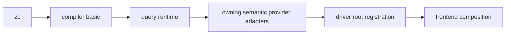

# RFC 0017: Incremental Compiler Query Architecture

## Summary

This RFC introduces one `CompilerSession`-owned typed query database for ZOM
frontend computation and makes the Binder its first complete migration target.
The database evaluates immutable key-to-value queries on demand, records the
dependencies that providers actually read, validates prior results with a
red-green algorithm, stops change propagation when recomputation produces an
equal semantic value, and exposes narrow projection queries instead of making
every consumer depend on a complete module result.

The proposal directly replaces the current sequential Binder scheduling path
and the identity and revision contracts that prevent reuse across edits. It
separates stable query identity, in-memory database revision, semantic value
equality, source provenance, and persisted artifact integrity. It retains the
independent Binder verifier as the semantic publication boundary: memoization
may reuse a verified result, but it never becomes an alternative correctness
authority.

The first implementation is an in-memory query engine. Persisted values are a
later, allowlisted phase after from-scratch consistency and projection
shielding are proven. The repository contains one production Binder path and
one current revision contract.

## Motivation

`CompilerSession::bindSources()` currently executes a stable batch pipeline. It
rejects a second binding run once session binding inputs or outputs exist,
selects ready modules by scanning the complete module and edge collections,
finds dependency results by linear search, constructs one complete binding
input per module, and calls `runBinding()` for the whole module. The design is
deterministic and strongly verified, but it has no query key, no dependency
read log, no reusable memo, no red-green validation, and no item-level demand
boundary.

The current stable metadata is not sufficient to add those facilities around
the existing batch call:

- `DefinitionPathSegment` includes a source span and sibling ordinal. Inserting
  unrelated source before a declaration can therefore change its purportedly
  stable identity.
- `ContextFingerprint` includes every source snapshot in the semantic
  context. `ExportSurfaceRevision` includes that global fingerprint, so a
  private or unrelated source change can change a public surface revision.
- Binder construction writes diagnostics through `DiagnosticEngine`. A query
  provider with such an ambient side effect can produce different externally
  visible behavior on a cache hit and a cache miss.
- `VerifiedBindingOutput` combines many fact domains, canonical provenance,
  diagnostics, scopes, closures, imports, exports, and labels. Treating it as
  one dependency makes any change to the aggregate visible to every consumer.

These properties cause two distinct risks. False invalidation preserves
correctness but destroys incremental performance. False green incorrectly
reuses a stale result and is a compiler correctness defect. A cache keyed by
the current aggregate revisions would create the first problem; an incomplete
dependency or equality model would create the second.

The architectural target is therefore not an output cache. It is a demand-
driven computation graph with an explicit correctness contract. The required
correctness property is from-scratch consistency: after every admitted input
transaction, all demanded incremental results and diagnostics must equal the
results of a clean compilation of the same explicit inputs.

## Goals

- Define one typed, demand-driven query database transitively owned by
  `CompilerSession` and physically owning all query and identity state.
- Require immutable keys and values, pure deterministic providers, and dynamic
  tracking of every semantic read.
- Define red-green validation, equality-based backdating, durability, cycle
  handling, cancellation, and single-flight concurrent execution.
- Replace source-position-based named-item identities with edit-stable keys.
- Separate database, semantic, provenance, and artifact revisions so private or
  positional changes do not invalidate unrelated semantic consumers.
- Split Binder work into module skeleton, named-item body, verifier, diagnostic,
  and projection queries.
- Make export, definition-header, signature, visibility, name-bucket, import,
  and closure projections the ordinary downstream dependency surfaces.
- Preserve independent verification before any bound fact becomes available to
  Checker, HIR, or another module.
- Prove incremental results against clean rebuilds with deterministic edit-
  sequence, mutation, concurrency, cancellation, and cache-corruption tests.
- Provide observability that distinguishes execution, green reuse,
  recomputation with equal output, changed output, and persisted-value reuse.

## Non-Goals

- This RFC does not define new ZOM syntax or language semantics.
- This RFC does not require an internally incremental lexer or parser. A whole-
  source parse query is acceptable until profiling justifies a syntax-tree
  incrementalization RFC.
- This RFC does not migrate ownership analysis, HIR, MIR, LIR, or backend work
  into queries. Those phases may consume verified projections and require
  separate implementation plans for their own migration.
- This RFC does not define a remote or shared cache service.
- This RFC does not make persisted query payloads a stable external file
  format. The compiler may invalidate all local entries on any schema or build
  change.
- This RFC does not use memoized values as proof of semantic validity and does
  not permit producer and verifier algorithms to share semantic decisions.
- This RFC does not add a generic fixed-point query facility. Semantic SCC
  algorithms must be explicit derived queries; an accidental runtime query
  cycle is rejected.
- This RFC does not create durable query roots for every AST node, local
  variable, or anonymous expression. Initial durable granularity is source,
  module, and named item.

## Prior Art

### Rust Compiler Query System

Rust models compiler work as immutable query keys and values, dynamically
records query-to-query reads, and memoizes provider results. Its incremental
engine stores prior dependency graphs and stable fingerprints, validates nodes
with the red-green algorithm, and stops propagation when a recomputed result
has the same fingerprint. Rust also documents projection queries as
invalidation firewalls between a large producer result and narrow consumers.

ZOM should copy typed query contracts, ordered actual-read dependency capture,
red-green validation, stable cross-session key encoding, selective disk
caching, and projection firewalls. ZOM should not copy rustc's generated query
DSL or compiler-specific `DefId` cache layouts.

References:

- <https://rustc-dev-guide.rust-lang.org/queries/query-evaluation-model-in-detail.html>
- <https://rustc-dev-guide.rust-lang.org/queries/incremental-compilation.html>
- <https://rustc-dev-guide.rust-lang.org/queries/incremental-compilation-in-detail.html>
- <https://rustc-dev-guide.rust-lang.org/tests/compiletest.html#incremental-tests>

### Salsa

Salsa tracks the fields and tracked functions a provider actually reads. A
memo records its value, dependencies, verification revision, change revision,
and minimum dependency durability. When recomputation returns an equal value,
Salsa backdates the memo and prevents unnecessary propagation. It also permits
value eviction while retaining dependency metadata.

ZOM should copy exact read tracking, semantic equality, backdating, durability,
and retention of dependency metadata after value eviction. ZOM should not use
Salsa through Rust FFI or treat Salsa's optional serialization support as a
complete persistent-cache protocol.

References:

- <https://salsa-rs.github.io/salsa/overview.html>
- <https://salsa-rs.github.io/salsa/reference/algorithm.html>
- <https://salsa-rs.github.io/salsa/reference/durability.html>
- <https://salsa-rs.github.io/salsa/plumbing/tracked_structs.html>
- <https://salsa-rs.github.io/salsa/cycles.html>

### Swift Request Evaluator And Dependency Analysis

Swift centralized semantic requests behind a lazy evaluator and progressively
refined dependency tracking from file-level relations to declarations,
members, and functions. The refinement reduces rebuilt work when a change does
not affect the specific declaration a consumer uses.

ZOM should copy the central request authority and named-item granularity. ZOM
should avoid file-level dependency edges as the final Binder boundary.

References:

- <https://github.com/swiftlang/swift/blob/main/docs/RequestEvaluator.md>
- <https://github.com/swiftlang/swift/blob/main/docs/DependencyAnalysis.md>
- <https://www.swift.org/blog/swift-5.4-released/>

### Bazel Skyframe

Skyframe models a build as immutable keys and values with dependencies
discovered during evaluation. It separates invalidation from value change and
prunes propagation when a rebuilt node remains equal. A node is replaced as a
whole rather than patched in place, so finer reuse requires finer nodes.

ZOM should copy immutable replacement, dynamic dependencies, and change
pruning. ZOM should not mutate a previously verified bound module to simulate
incrementality.

Reference: <https://bazel.build/reference/skyframe>

### Buck2 DICE

DICE adds versioned dynamic dependencies, shared in-flight computations,
parallel dependency evaluation, and early cutoff to a large production build
system. It records dependency structure without allowing concurrent callers to
execute the same key repeatedly.

ZOM should copy one in-flight computation per key and revision, lock-free
dependency waits, deterministic dependency groups, and early cutoff. ZOM does
not require Buck2's distributed execution model.

Reference: <https://buck2.build/docs/insights_and_knowledge/modern_dice/>

### Clang Dependency Discovery And ThinLTO Cache

Clang separates dependency discovery from compilation and uses explicit cache
keys and pruning policies for modules and ThinLTO. This prevents filesystem
discovery and cache lifetime from becoming hidden behavior inside semantic
analysis.

ZOM should keep package/module discovery as explicit input and graph queries,
and should make disk retention a separate policy. ZOM should not expose the
local query payload format as a module ABI.

References:

- <https://clang.llvm.org/docs/StandardCPlusPlusModules.html#discovering-dependencies>
- <https://clang.llvm.org/docs/Modules.html>
- <https://clang.llvm.org/docs/ThinLTO.html>

### Build Systems Theory And Self-Adjusting Computation

Build Systems a la Carte separates dependency models, rebuild decisions, and
scheduling, while self-adjusting computation formalizes demand-driven reuse and
from-scratch consistency. These distinctions explain why deterministic keys or
content hashes alone do not constitute an incremental system.

ZOM should keep query semantics, change detection, and scheduling as separate
contracts and test the resulting system against clean execution.

References:

- <https://www.microsoft.com/en-us/research/publication/build-systems-a-la-carte/>
- <https://matthewhammer.org/adapton/>

The common production failures are also consistent across these systems:

1. hidden filesystem, option, environment, or global-state reads cause false
   green results;
2. unstable keys and overly broad value equality cause invalidation storms;
3. uncontrolled cycles, cancellation, or duplicate concurrent execution cause
   deadlock or partially published memos.

This RFC addresses them with explicit input queries, edit-stable named-item
keys, domain-specific equality and projections, fail-closed cycle detection,
single-flight execution, and atomic memo publication.

## Guide-Level Explanation

### Contributor Model

A contributor expresses derived compiler work as a typed query. The query
descriptor defines its key type, value type, semantic equality, durability
policy, optional persistence policy, and provider. The provider receives only
the immutable key and a `QueryContext`. It obtains every other semantic input
by requesting another query through that context.

A provider may allocate temporary local state, but it may not read mutable
`CompilerSession` collections, `SourceManager`, the filesystem, environment
variables, wall-clock time, random state, target configuration, or
`DiagnosticEngine` through a side channel. Such state must be an explicit input
query. Deterministic semantic failures and diagnostic facts are values;
cancellation, allocation failure, and transient cache I/O failure are not
successful semantic values.

### Edit Behavior

Assume module `consumer` imports only `api::render`, while module `api` also
contains a private function `trace`.

After the body of `trace` changes:

- the source and parse query for `api` change;
- the named-item body query for `trace` executes;
- the final module aggregate and provenance diagnostics may change;
- the `ExportedBinding(api, render)` and `DefinitionSignature(api::render)`
  projections remain equal; and
- Binder and Checker queries in `consumer` remain green without execution.

After the signature of `render` changes, its signature projection changes and
only consumers that actually read that projection become candidates for
recomputation. A clean rebuild produces the same facts and diagnostics in both
cases.

### Diagnostics

Incremental execution does not emit diagnostics while providers run. Providers
return canonical diagnostic facts. A root diagnostic query merges facts by the
existing deterministic diagnostic ordering and the ordinary diagnostic layer
renders them. Moving a declaration without changing semantics may leave a
semantic projection green while changing the provenance or diagnostic query,
so displayed locations remain current.

### Cache Behavior

The in-memory engine is always authoritative for reuse decisions. A local disk
cache is optional and transparent. A missing, stale, incompatible, truncated,
or corrupted cache entry behaves as a miss and cannot change compilation
success, failure, facts, diagnostics, or ordering. Clearing the cache never
changes program meaning.

### Observability

Test and trace builds expose per-query counters and a deterministic event log.
Each demand ends in exactly one of these categories:

- executed with no previous memo;
- verified green without provider execution;
- recomputed and semantically equal;
- recomputed and semantically changed;
- loaded from a validated local cache entry; or
- failed or cancelled without publishing a memo.

These events are compiler telemetry, not a language or stable CLI contract.

## Reference-Level Design

### Architectural Ownership

`CompilerSession` transitively owns exactly one `QueryDatabase` and exposes
root request and input-transaction APIs. `QueryDatabase` physically owns the
`SemanticContextBrand`, append-only identity interners, explicit input store,
immutable snapshots, memo graph, and in-flight computations. No identity
registry is duplicated in `CompilerSession`; its identity accessors delegate to
the database. Query providers do not own sessions and cannot construct private
databases.

```mermaid
flowchart LR
    IN["Explicit inputs: source, package graph, target, options"] --> DB["CompilerSession QueryDatabase"]
    DB --> PARSE["ParseSource(SourceFileKey)"]
    PARSE --> INV["NamedDefinitionInventory(ModuleKey)"]
    INV --> ITEM["NamedItemSyntax(DefinitionKey)"]
    PARSE --> REQ["ModuleDependencyRequests(ModuleKey)"]
    REQ --> GRAPH["ModuleGraph(RootSetKey)"]
    INV --> SKEL["BindModuleSkeleton(ModuleKey)"]
    GRAPH --> SKEL
    ITEM --> BODY["BindDefinitionBody(DefinitionKey)"]
    SKEL --> BODY
    SKEL --> EXPORT["ModuleExports(ModuleKey)"]
    BODY --> VERIFY["VerifiedBoundModule(ModuleKey)"]
    EXPORT --> VERIFY
    EXPORT --> PROJ["Export and signature projections"]
    PROJ --> DOWN["Dependent Binder and Checker queries"]
```

`bindSources()` ceases to schedule modules. During cutover it may remain a root
driver operation that requests the verified bound modules required by the
package roots, but the query database is the only evaluator. The scheduling
loop, repeated edge scans, linear dependency-output search, and direct batch
`runBinding()` authority are deleted.

### Database Revisions And Input Transactions

`DatabaseRevision` is a monotonically increasing, process-local `uint64`
transaction coordinate. It is neither serialized nor compared across compiler
processes. Revision zero contains the initial explicit inputs. A write
transaction has exclusive access, admits a finite set of input updates, and
commits one new database revision atomically.

Input fields store their own `changedAt`. Committing an equal canonical input
value advances the database revision but does not advance that field's
`changedAt`. No input mutation occurs while a query snapshot is evaluating.
Readers obtain an immutable snapshot of exactly one committed revision.

A write transaction builds a private complete next input root. Commit publishes
that root and its new revision with one atomic pointer exchange, so every reader
observes either all old inputs or all new inputs. A query flight is permanently
bound to the snapshot on which it began. A commit neither mutates nor cancels
old-snapshot flights, and an old flight may publish only into that snapshot's
memo generation; its completion can never populate or mark a memo verified in
the new revision. The old snapshot and its in-flight table remain alive until
the last provider and waiter releases them. A new-revision demand starts or
joins only a new-revision flight.

The initial engine retains only the current committed snapshot and memo
history needed to validate it against its immediate predecessor. Long-lived
multi-version IDE snapshots are not approved by this RFC.

### Query Kind And Key Contract

Every query kind has one unique internal domain tag and one statically declared
key and value type. A key must be immutable, totally comparable, and either:

- a process-local input handle whose owning database and revision are checked;
  or
- a canonical semantic key with deterministic encoding.

Persistent query kinds require canonical key and value encodings. Query domain
tags are included in the local cache envelope and are not a user-visible ABI.
Any encoding change invalidates the cache and replaces every producer,
consumer, fixture, and oracle directly.

Raw pointers, registry slots, `BufferId`, `NodeId`, arena indices, traversal
ordinals, worker order, and source byte offsets are forbidden in persistent
query keys.

### Edit-Stable Semantic Identity

RFC 0011 remains authoritative for context-branded runtime handles, canonical
package identity, and canonical encoding primitives. This RFC replaces the
parts of its build-script, compilation-configuration, crate, generated-source,
module, definition, and implementation keys that conflate entity identity with
an output or source revision. RFC 0012's final package-session construction
moves to the same replacement keys.

The replacement rules are:

- generated-source identity contains stable build-script producer identity and
  canonical logical path; output-record and content digests are explicit query
  inputs, not part of the source entity key;
- module identity contains the owning crate and canonical logical module path;
  declaration spans are provenance and are not part of module identity;
- a named definition identity contains its stable module or named-item owner,
  namespace, definition kind, canonical declared name, and, only where the
  language admits same-name overloads, a canonical declaration-header digest;
- an implementation identity contains its stable owner and canonical header
  digest, excluding its body and source location;
- a body-only edit does not change the owning named-item key;
- changing an overload or implementation header may replace its key because it
  changes the declaration selected by name and signature;
- equal definition records follow source-redeclaration admission, while equal
  implementation records share one semantic authority and retain every
  revision-local source occurrence; source order never changes identity; and
- locals, labels, anonymous closures, and expression nodes use owner-scoped
  ephemeral identities inside the enclosing named-item body query. They are not
  persistent query roots and cannot enter a public projection key.

`BuildScriptProducerKey` is a 32-byte SHA-256 digest over ASCII domain
`zom.build-script-producer`, one zero byte, and the RFC 0011 canonical
encoding of `PreparatoryBuildScriptKey`. That record retains package,
`TargetName`, host target, semantic options, and sorted build dependencies. It
identifies the configured producer plan, not one execution result. A change to
that plan replaces the producer identity; changed source or generated bytes
under the same plan do not.

`CompilationConfigKey` directly replaces its
`buildScriptOutput: Maybe<BuildScriptOutputKey>` field with
`buildScriptProducer: Maybe<BuildScriptProducerKey>` in the same final field
position. Its exact encoding is compilation-domain tag, canonical target key,
semantic compiler options, optional-presence tag, and, when present, the
32 producer-key bytes. `CrateKey` encodes expanded `PackageKey`, target-kind
tag, `TargetName`, and that replacement compilation record in order. The
content-derived form has no decoder or alias.

`SourceOriginKey::GeneratedFile` directly becomes
`{ producer: BuildScriptProducerKey, logicalPath: CanonicalRelativePath }`.
`SourceFileKey` encodes expanded replacement `CrateKey` followed by the origin
tag `0x04`, the 32 producer-key bytes, and the canonical logical path. The
output key and content digest are absent.

`BuildScriptOutputRecord(BuildScriptProducerKey)` is an explicit immutable
input containing the current source digests, declared environment, generated
source digest map, and exported semantic environment. Its domain-separated
`ArtifactFingerprint` detects result changes but is not entity identity.
`GeneratedSourceCatalog(BuildScriptProducerKey)` and
`BuildScriptSemanticEnvironment(BuildScriptProducerKey)` are narrow semantic
projections, while each generated file's bytes and digest are a
`SourceSnapshot(SourceFileKey)` input. A changed generated file at the same
logical path therefore preserves unaffected crate, module, source, definition,
and implementation keys while invalidating its source snapshot and only the
queries that read the changed output projections.

The canonical preimages use the RFC 0011 encoder: unsigned integer and enum
fields are fixed-width big-endian values, text and byte strings are
length-prefixed, optional fields carry an explicit presence tag, and sequences
carry a count followed by elements. Identifier text is NFC-normalized before
encoding. The ASCII domain string and one zero byte precede every preimage.

RFC 0018 is the complete stable identity wire contract used by this query
architecture. `DefinitionKey` is the SHA-256 digest of domain
`zom.named-item-header`, one zero byte, and the complete
`DefinitionIdentityRecord`: stable module, compact stable-owner digest sequence,
kind, namespace, NFC declared name, and optional overload-header digest.
`ImplKey` is the SHA-256 digest of domain `zom.impl-header`, one zero byte,
and the complete `ImplIdentityRecord`: stable module, compact owner sequence,
generic parameters, polarity, safety, canonical trait reference, self-type
syntax, and sorted-unique obligations. The identity inventory retains each
digest with its complete record and rejects equal digest bytes with unequal
records before handle admission.

RFC 0018's generated canonical-header schema is authoritative for overload,
receiver, generic, bound-list, callable-parameter, result, raises, ABI,
structural-type, path-root, collection-normalization, and fixed-array-length
encoding. Bodies, default expression bodies, visibility, export state,
non-semantic attributes, source ranges, parser handles, traversal order,
current lookup results, and presentation text do not encode.

Byte-identical definition records form source redeclaration groups and only the
first source authority receives a `DefId`. Byte-identical implementation
records form source occurrence groups: one shared semantic `ImplId` authority
is admitted, every source occurrence receives a revision-local
`ImplOccurrenceId`, and RFC 0015 classifies every occurrence independently.
Only classified survivors collide or publish. Source order and schema preorder
never alter stable identity.

`ModuleResolutionKey` uses RFC 0018 domain `zom.module-resolution` and
contains only stable requester module, dependency kind, optional normalized
path, optional dependency alias, and the complete fixed
`ModuleResolutionPolicyKey`. It excludes import sites, source ranges, parser
nodes, schema ordinals, selected targets, current revisions, and any
whole-environment fingerprint. Multiple sites for one semantic request share
one query and retain separate revision-local provenance.

Resolution reads the exact low-durability Semantic inputs
`RequesterModuleAncestry(requester)` and
`ModuleCatalogPathBucket(crate, canonicalPath)` for each deduplicated candidate
path. It additionally reads only the exact dependency-alias, configured-prelude,
and search-root projections required by the key. Its verifier repeats candidate
formation through the same dependency frame. An unrelated catalog path change
cannot execute a resolution provider whose demanded buckets remain equal.

Named `DefinitionKey` and `ImplKey` canonical encodings exclude `SourceSpan`
and sibling ordinal. Every producer, verifier, codec, fixture, and caller uses
the same canonical encoding.

### Identity Interner Lifetime

One refcounted `SemanticContextCapabilityArena` owns one
`SemanticContextBrand` and one `IdentityInternerSet` for its complete
lifetime. The set contains typed append-only interners for compilation units,
crates, sources, modules, definitions, implementations, generic parameters,
and callable parameters. Equal canonical keys with byte-equal complete
authority records receive the same process-local handle within that arena.
Handles are never reused.

Identity activity is an immutable logical query result, not a mutable flag in
the interner. `ActiveCrates`, `ActiveSources`, `ActiveModules`,
`NamedDefinitionInventory`, `NamedImplementationInventory`, and the eight
typed active-membership descriptors derive complete current membership from
one snapshot's explicit inputs. Semantic providers construct and return stable
keys without issuing handles. Demand order therefore cannot change the logical
active set.

On `CapabilityQueryContext<Descriptor>`, `materializeActive` participates in
overload resolution only when
`ActiveMaterializerPermission<Descriptor, GlobalIdentityKey,
MembershipDescriptor>` names the exact descriptor, global key type, and
tracked membership descriptor. It requires inherited final admission, demands
the membership descriptor in the active query frame, validates complete
authority bytes, and then calls the arena interner. Absence is a deterministic
inactive result. Presence permits the interner lock to return the existing
canonical handle or append exactly one owned entry.

Two concurrent materializations of the same key coalesce at the interner and
receive the same handle. An old-snapshot flight checks old activity and may
finish after a commit, but it publishes only into the old snapshot generation.
A new-snapshot materialization independently demands new activity; an old
interned handle cannot make an inactive new key succeed. Removing an entity
therefore changes only the new membership projection and never reuses or
invalidates the handle retained by the old snapshot.

Each snapshot has an immutable active set determined by explicit inputs.
Physical interning is lazy, arena-owned, and append-only. Disk entries contain
canonical keys and validate active membership, but decode, verification, and
`Persisted` publication never materialize a handle. An explicit
`RevisionLocal` query may materialize an already-published stable value. Disk
entries never serialize a brand or process-local handle.

Every capability memo retains the snapshot and semantic-context arena required
by its value. A surviving `QueryCapabilityLease` keeps reverse lookup, brand
validation, and borrowed child capabilities valid after `CompilerSession` and
`QueryDatabase` destruction. Session teardown releases session-held leases,
then the database and lookup tables, then its arena owner; the arena itself is
released only after the final external lease.

### Revision And Fingerprint Domains

The current singular semantic-context fingerprint is replaced by distinct
types with non-interchangeable constructors:

| Domain | Lifetime | Preimage | Permitted use |
|---|---|---|---|
| `DatabaseRevision` | One process | committed input transaction order | in-memory validation coordinate |
| `QueryKeyFingerprint` | Cross-session | query kind and canonical stable key | prior memo and disk-entry lookup |
| `SemanticValueFingerprint` | Cross-session | consumer-visible canonical semantic value | disk validation and equality acceleration |
| `ProvenanceRevision` | Cross-session | source identity, content digest, spans, and diagnostic provenance | navigation, diagnostics, source reconstruction |
| `ArtifactFingerprint` | Cross-session | compiler build, schema, target, semantic options, dependencies, and payload | local cache integrity and compatibility |
| `SemanticContextBrand` | One process | unforgeable issuer state | runtime capability and handle ancestry |

No constructor accepts a value from another row without explicit canonical
re-encoding. A global all-source fingerprint cannot participate in an export,
definition-header, signature, visibility, or name-bucket semantic equality
preimage. Source spans and rendered diagnostics cannot participate in those
semantic preimages.

In memory, values use complete domain-specific equality whenever its cost is
bounded. Persistent entries additionally use SHA-256 over domain-separated
canonical bytes. Hash equality never permits omission of semantic fields, and
the independent verifier remains mandatory after deserialization.

### Provider Purity And Read Tracking

A provider has the logical contract `Value provide(QueryContext&, const Key&)`.
The concrete C++ interface may use `zc::OneOf` or another existing `zc` result
type for deterministic failure, but it must preserve these rules:

1. the provider reads derived semantic state only through
   `QueryContext::get<Query>(key)`;
2. every completed read appends an edge from the active query to the demanded
   query, including a successful value, deterministic absence, and
   deterministic semantic failure; cancellation, invariant failure, and
   unpublished execution failure append no reusable edge;
3. filesystem, environment, source, package, target, feature, prelude, and
   compiler-option state is represented by explicit input queries;
4. a provider cannot call `DiagnosticEngine`, publish to a session vector,
   mutate a registry, or observe wall-clock, random, worker, or allocation
   order;
5. returned values and deterministic semantic failures are immutable; and
6. a provider may construct candidates, but only an independent verifier may
   publish a verified value; and
7. the verifier executes inside the same active query frame, and every query it
   reads is appended to the same private dependency record before candidate,
   verifier result, dependencies, and diagnostics publish atomically.

An escape hatch equivalent to an untracked read is not part of the production
API. If an unavoidable platform probe is discovered, it must first become a
closed explicit input record. Debug and sanitizer builds fail hard when a query
provider crosses a forbidden authority boundary.

The only identity-materialization operation is exposed through
`CapabilityQueryContext<Descriptor>`; its type is unavailable to `Semantic`
and `Persisted` descriptors. A permitted `RevisionLocal` materializer receives
the context bound to its own descriptor. The context records and validates the
exact active-membership read before invoking the arena-owned typed interner.

### Query Reuse Classes

Every query descriptor declares exactly one closed reuse class:

| Class | Permitted contents | Cross-revision backdating | Disk persistence |
|---|---|---|---|
| `RevisionLocal` | AST handles, `NodeId`, `SourceSpan`, revision-local views, and provenance | No | No |
| `Semantic` | Snapshot-independent canonical semantic facts only | Yes | No |
| `Persisted` | All `Semantic` requirements plus canonical codec and independent decoder validation | Yes | Allowlisted |

A `Semantic` or `Persisted` value cannot retain a pointer, context-local AST
handle, `NodeId`, `SourceSpan`, registry slot, revision-local view, or process
brand. Its canonical value may refer to semantic entities only through stable
keys. Reuse-class violations are compile-time API errors where expressible and
sanitizer invariant failures otherwise.

The current complete binding metadata combines semantic facts with `NodeId`
and source spans. The final `VerifiedBoundModule` therefore remains
`RevisionLocal` unless those fields are split. Its semantic projections are
`Semantic` or `Persisted` and are the only ordinary cross-revision downstream
dependencies.

### Memo Contract

Each query instance has at most one committed memo for the current database
history. A memo contains:

- the immutable value or deterministic semantic failure, if retained;
- the prior semantic value equality state or fingerprint;
- the ordered dependency execution groups;
- `verifiedAt` and `changedAt` database revisions;
- the minimum dependency durability;
- the query state: vacant, running, completed, or failed-without-publication;
- retention and optional persistence metadata; and
- deterministic diagnostic side-result keys, where applicable.

The query descriptor also declares its reuse class, semantic equality,
canonical fingerprint codec when applicable, verifier, cycle policy, retention
class, and cost class. A query kind cannot opt out of equality while remaining
a semantic propagation boundary; if exact equality is not implementable, the
value must be split or conservatively classified `RevisionLocal`.

The minimum durability is computed across the complete provider-and-verifier
dependency record; a query with no input or derived dependency has minimum
`Frozen`.

A dependency group is either one sequential read or a set of explicitly
parallel reads. Sequential groups preserve provider execution order. Keys in a
parallel group are canonically sorted for storage and trace output. This model
permits parallel validation without making worker completion order observable.

Evicting a retained value does not require deleting dependency metadata, but it
does delete the complete equality witness unless an independently validated
persisted payload can reconstruct it. A fingerprint is only a lookup and
inequality accelerator; fingerprint equality alone never authorizes backdating.
A later demand may prove dependencies green and reload a validated persisted
value. If no complete old value can be reconstructed, the provider and verifier
run and the result is conservatively red even when its fingerprint matches the
evicted fingerprint.

### Red-Green Validation

Demanding a derived query at revision `R` follows this algorithm:

1. If a completed memo has `verifiedAt == R` and retains its value, return it.
2. A prior-revision `RevisionLocal` memo skips durability and dependency-green
   reuse. Execute its provider and verifier at `R`, replace its value and
   dependency record, and set `verifiedAt = changedAt = R` even when complete
   structural equality holds.
3. For `Semantic` and `Persisted` memos, the durability fast path applies only
   when no input at or above the memo's minimum durability changed since
   `verifiedAt`. It never applies when the memo value has been evicted.
4. Otherwise validate prior dependency groups in execution order. A sequential
   group validates its one member. Every member of a parallel group that was
   previously started is validated concurrently and awaited; one or more red
   members make the group red, the lowest canonical red key is used in the
   deterministic trace, and later groups are not validated. No completed member
   is cancelled merely because another member is red.
5. If every dependency remains green and the value is retained, copy the prior
   dependency record, set `verifiedAt = R`, and return without executing the
   provider.
6. If every dependency remains green but the value was evicted, a `Persisted`
   query may reconstruct the complete old value only through the cache-admission
   protocol in this RFC. On a validated load it publishes that value with the
   old `changedAt`. A non-persisted query or cache miss executes the provider
   and verifier and conservatively sets `changedAt = R`, because no complete old
   equality witness exists.
7. On a red dependency group, execute the provider and verifier. Collect every
   provider and verifier dependency in one new private execution record;
   earlier changes may alter control flow, so unused later old dependencies are
   discarded.
8. For a retained prior `Semantic` or `Persisted` value, compare the new and old
   complete canonical values with descriptor equality. A matching fingerprint
   may avoid an obviously unequal comparison but cannot establish equality.
9. Backdate only when the values are exactly equal and the new dependency
   minimum durability is not lower than the prior minimum. Preserve the old
   `changedAt`, replace dependencies and value, set `verifiedAt = R`, and
   classify the result as recomputed-equal.
10. A value change or durability decrease sets `verifiedAt = changedAt = R`.
    The durability-decrease case is classified separately in telemetry so an
    upstream memo cannot retain a High or Frozen shortcut after the dynamic
    read set begins depending on a Low or Medium input.
11. Publish value or deterministic result, dependencies, diagnostics, and state
    atomically only after provider and verifier success.

An input query is green when its own `changedAt` is not newer than the
requesting memo's previous `verifiedAt`. A derived node is red only when its
semantic value changed, not merely because its provider executed.

Deterministic values, deterministic absence, and deterministic semantic failure
all participate in complete equality and may be backdated under the same rules.
Their completed reads all create dependency edges. Cancellation, allocation
failure, invariant failure, cache I/O failure, and process interruption do not
become semantic failure memos.

### Concurrency, Single-Flight, And Cancellation

Only one provider execution may be in flight for a `(snapshot, query kind,
key)` tuple. Concurrent requesters share its future. Query runtime locks are
released before requesting or waiting for dependencies. The wait graph and
per-worker active query stacks are tracked independently of memo dependencies.

Independent dependency groups may execute through the existing compiler thread
pool. Provider output, verifier output, diagnostic ordering, memo dependency
ordering, and traces must remain byte-for-byte deterministic across worker
counts.

An active-stack or wait-graph cycle produces a deterministic query-cycle
invariant failure and publishes no memo. Module import or export cycles are not
implemented as recursive query calls: an explicit module-graph SCC query
computes and validates them according to the module-system contract. No initial
query kind may install a fallback or fixed-point cycle handler.

Cancellation propagates from a root request to newly demanded work. A cancelled
waiter stops waiting, but a shared computation remains valid while another
non-cancelled requester exists. A provider that observes cancellation unwinds
without publishing its value or dependency record. The next demand starts or
joins a fresh valid computation.

### Durability

Durability is a validation optimization and never substitutes for a dependency
edge. Initial levels are:

| Level | Inputs |
|---|---|
| Low | editable source snapshots, overlays, conditional values |
| Medium | package manifest, target selection, compiler semantic options |
| High | immutable dependency interfaces, prelude surface, standard library inputs |
| Frozen | generated schema descriptors and builtin tables proven immutable for the database lifetime |

The order is `Low < Medium < High < Frozen`. The database records a last-changed
revision for each level that is advanced by changes at that level or any more
durable level. The memo records the lowest durability among all actual provider
and verifier dependencies. Therefore a memo with minimum `High` may skip
validation only when neither High nor Frozen inputs changed; a Low change is
irrelevant only because the memo proved it had no Low or Medium dependency.
A Frozen input has no mutation API after database construction. Misclassifying
a value as more durable than its producer permits is an invariant failure. If a
re-execution changes the dynamic read set to a lower durability, the result is
not backdated even when its semantic value is equal.

### Initial Query Inventory

The initial inventory is closed. Adding a production query kind requires the
same review as adding a new compiler fact domain: key stability, value equality,
dependency authority, verifier boundary, diagnostic behavior, and retention
must be stated.

| Query | Key | Value and role |
|---|---|---|
| `SourceSnapshot` | stable source key | explicit content and provenance input |
| `CompilationOptions` | compilation-unit key | explicit semantic options and target input |
| `PackageGraphInput` | package-root-set key | explicit verified package and crate inputs |
| `BuildScriptOutputRecord` | stable build-script producer key | explicit current output, generated digest map, and semantic environment input |
| `GeneratedSourceCatalog` | stable build-script producer key | canonical logical path and generated source-key projection |
| `BuildScriptSemanticEnvironment` | stable build-script producer key | canonical exported semantic environment projection |
| `ActiveCrates` | package-root-set key | canonical active replacement crate-key set |
| `ActiveSources` | stable crate key | canonical active source-key set |
| `ActiveModules` | stable crate key | canonical active module-key set |
| `RequesterModuleAncestry` | requester module key | pinned Low-durability Semantic input containing the independently verified requester-to-crate-root chain |
| `ModuleCatalogPathBucket` | crate key and canonical module path | pinned Low-durability Semantic input containing zero or one independently verified active module at that exact path |
| `ModuleSearchRoots` | crate key | explicit module search roots and generated-source roots |
| `DependencyAliasRoot` | crate key and canonical alias | explicit dependency alias target |
| `ConfiguredPrelude` | crate key | explicit prelude selection |
| `ParseSource` | stable source key | revision-local parse tree or `ParseRejected` plus canonical syntax diagnostic facts |
| `ModuleDependencySites` | module key | revision-local import sites and provenance |
| `ModuleDependencyRequests` | module key | canonical deduplicated semantic resolution keys |
| `ResolveModuleRequest` | semantic module-resolution key | one verified resolution receipt without site provenance |
| `ModuleGraph` | package-root-set key | canonical graph and SCC facts |
| `ModuleDependencies` | module key | narrow canonical outgoing graph projection |
| `ModuleGraphScc` | package-root-set key | explicit deterministic SCC result without query recursion |
| `NamedDefinitionInventory` | module key | canonical sorted named definition records without body or provenance |
| `NamedImplementationInventory` | module key | canonical sorted implementation keys without body or provenance |
| `RevisionLocalDefinitionSites` | module key | current stable-key and local-path mapping to AST nodes, spans, and branded handles |
| `NamedItemSyntax` | stable named definition key | canonical detached header and body syntax without revision-local state |
| `NamedItemProvenance` | stable named definition key | stable local syntax paths mapped to current AST nodes and spans |
| `BindModuleSkeleton` | module key | module scopes, declarations, imports, and body roots |
| `BindDefinitionBody` | stable named definition key | verified local binding, label, control, and closure facts |
| `MaterializeModuleSkeleton` | module key | current handles and provenance for one semantic skeleton |
| `MaterializeDefinitionBody` | stable named definition key | current handles and provenance for one semantic body result |
| `VerifyBoundModule` | module key | final cross-domain verified publication aggregate |
| `SourceDiagnosticFacts` | stable source key | lexical and parse diagnostic facts before module identity exists |
| `PackageDiagnosticFacts` | package-root-set key | package discovery, manifest, and root diagnostic facts |
| `BuildScriptDiagnosticFacts` | stable build-script producer key | generated-source and build-script diagnostic facts |
| `ModuleDiagnosticFacts` | module key | module, Binder, and Checker diagnostic facts |
| `CompilationDiagnosticFacts` | compilation-unit key | semantic collection and deduplication of unresolved diagnostic facts |
| `ResolveDiagnosticProvenance` | stable diagnostic provenance key | revision-local current source range |
| `MaterializeCompilationDiagnostics` | compilation-unit key | revision-local ordered resolved diagnostic records |

`ParseSource`, dependency sites, definition sites, named-item provenance,
`MaterializeModuleSkeleton`, `MaterializeDefinitionBody`, and the complete
bound-module aggregate are mandatorily `RevisionLocal`.
`NamedDefinitionInventory`, `NamedImplementationInventory`, `NamedItemSyntax`,
`BindModuleSkeleton`, `BindDefinitionBody`, module resolution, Binder semantic
projections, diagnostic fact payloads without resolved spans, and Checker
signature projections are mandatorily `Semantic`; the allowlist may later
promote only codec-complete members of that set to `Persisted`.

`CompilationDiagnosticFacts` is mandatorily `Semantic`;
`ResolveDiagnosticProvenance` and `MaterializeCompilationDiagnostics` are
mandatorily `RevisionLocal`.

`NamedDefinitionInventory` records only stable `DefinitionKey`, declaration
kind, namespace, NFC name, stable owner, and canonical header digest, sorted by
the complete key encoding. Its equality and verifier reject `NodeId`, `DefId`,
`SourceSpan`, AST handles, and body-local records. `RevisionLocalDefinitionSites`
separately maps stable definitions and owner-local syntax paths to current
`NodeId`, `SourceSpan`, and branded handles; its verifier checks total coverage
against the current parse result and it is never backdated.

`NamedItemSyntax` is a detached schema tree with explicit node-kind tags,
normalized token payloads, structural child order, and the complete declaration
header and body. Its canonical bytes and exact equality exclude `NodeId`,
source spans, trivia, recovery objects, and arena identity. A stable
`LocalSyntaxPath` is a sequence of structural child indices rooted at that
canonical named-item tree. `NamedItemProvenance` maps those paths to current AST
nodes and source spans. `BindDefinitionBody` reads `NamedItemSyntax`, not
`ParseSource` or a revision-local identity map, so an unrelated edit in the same
source does not execute an unchanged body provider.

The parse provider may execute the whole-source parser, but it does so with a
query-local `SourceDiagnosticDraftBuffer` rather than the global
`DiagnosticEngine`. Parser alternatives take buffer checkpoints and explicitly
commit or roll back speculative drafts; a rolled-back branch publishes no
fact. The parse query combines the stable source key with the sorted drafts and
publishes canonical facts plus their revision-local provenance map. Syntax
failure is the deterministic `ParseRejected` alternative with those two
values. It remains `RevisionLocal`, is never backdated, and does not publish a
partial parser object.

### Binder Decomposition

Binder evaluation is split by semantic ownership, not by the current source
file layout:

`OwnerLocalBindingKey` is a body-value-only record containing owner
`DefinitionKey`, defining `LocalSyntaxPath`, namespace, binding-kind tag, and
NFC name. It can occur inside `BindDefinitionBody` values but is neither an
interned global identity nor a public query key. Labels and control targets use
owner plus `LocalSyntaxPath` in the same way.

The `BindModuleSkeleton` semantic value contains only stable module,
definition, implementation, import, and `StableScopeOwnerKey` records with
canonical declaration and scope ancestry order. The `BindDefinitionBody`
semantic value contains stable owner, local binding, resolved target,
source-order activation, label, control, failed-name, and closure-capture facts
expressed through `DefinitionKey`, `OwnerLocalBindingKey`, and
`LocalSyntaxPath`. Neither value contains AST handles, `NodeId`, `SourceSpan`,
`DefId`, scope-arena slots, process brands, or revision identifiers. Their
generated field inventories define complete equality and verifier mutation
coverage.

1. `NamedDefinitionInventory` establishes stable named-item identities while
   `RevisionLocalDefinitionSites` retains current provenance.
2. `BindModuleSkeleton` creates module and named-item scopes, admits imports,
   records declarations, and publishes no body-local facts.
3. Each `BindDefinitionBody` evaluates one named callable or declaration body,
   including locals, source-order activation, labels, control targets, closure
   captures, and failed-name facts owned by that body.
4. Independent domain verifiers validate the skeleton and each body result.
5. `MaterializeModuleSkeleton` and each `MaterializeDefinitionBody` demand the
   semantic fact, current provenance, and active-identity projections, then
   reconstruct current AST nodes, spans, branded handles, and immutable scope
   arena records as `RevisionLocal` values.
6. `VerifyBoundModule` validates cross-item uniqueness, complete coverage,
   ordering, export closure, scope ancestry, and aggregate lineage.

No body query mutates a shared scope arena. Shared skeleton state is immutable;
body-local scope and fact state is returned as a value. Module aggregation
constructs a new immutable publication rather than patching an older bound
module.

Because `BindDefinitionBody` reads only semantic `NamedItemSyntax`, semantic
skeleton projections, and stable lookup projections, an unrelated edit can
recompute an equal `NamedItemSyntax` without executing the body provider. Only
its `RevisionLocal` materializer reruns to refresh handles and provenance.

The existing batch `runBinding()` may exist temporarily only in tests as a
differential clean-build oracle. It cannot be called by production once the
query root lands, and it is deleted after differential migration evidence is
complete.

### Projection Queries

`VerifiedBoundModule` is a publication and audit aggregate, not the default
dependency of another module or compiler phase. The following projection kinds
form the initial change-propagation firewalls:

`StableScopeOwnerKey` is a closed sum of `ModuleScope(ModuleKey)`,
`DefinitionScope(DefinitionKey, ScopeRole)`, and
`BodyScope(DefinitionKey, LocalSyntaxPath)`. `ScopeRole` is a closed semantic
enum. No alternative contains a span, `NodeId`, arena slot, or branded handle.

`ImportBindingKey` encodes requester `ModuleKey`, semantic
`ModuleResolutionKey`, import operation tag, source namespace and NFC name, and
local namespace and NFC name. It excludes the import site, source span,
`NodeId`, alias `DefId`, surface revision, and resolution receipt revision.

| Projection | Key | Semantic value |
|---|---|---|
| `ModuleExportNames` | module key | canonical sorted exported name and namespace set |
| `ExportedBinding` | module key, namespace, canonical name | one verified exported binding or deterministic absence |
| `DefinitionBindingHeader` | definition key | kind, owner, namespace, visibility, and declaration binding facts |
| `DefinitionSignature` | definition key | stable checker signature schema without body, runtime handles, or provenance |
| `DefinitionVisibility` | definition key | effective visibility fact |
| `ScopeNameBucket` | stable scope owner, namespace, canonical name | only declarations relevant to that lookup key |
| `ImportTarget` | semantic import binding key | stable target, binding kind, visibility, and re-export facts |

`DefinitionSignature` contains, in canonical field order, owner
`DefinitionKey`, callable kind, stable generic parameter and constraint
records, optional receiver, ordered parameter labels, modes, and
`SemanticTypeKey` values, result `SemanticTypeKey`, a canonical raises set, and
semantic qualifiers. It contains no branded `DefId`, `SemanticTypeId`,
`SourceSpan`, AST handle, or revision. A cache loader proves every referenced
stable definition and type active in its snapshot but publishes only stable
keys. A current `RevisionLocal` consumer materializer subsequently re-interns
those keys to active `DefId` and `SemanticTypeId` handles. A missing or inactive
key is a deterministic query invalidation or semantic failure, never a
stale-handle fallback.

`SemanticTypeKey` is exactly RFC 0005's closed canonical structural type key,
with every nominal-definition leaf encoded by this RFC's replacement
`DefinitionKey`. The signature codec embeds its canonical bytes verbatim after
a length prefix; it never serializes the store slot or semantic context brand.

`ImportTarget` contains only stable target `ModuleKey` or `DefinitionKey`,
binding kind, effective visibility, and re-export semantic facts. It contains
no site provenance, revisions, or runtime handles and is rehydrated through the
active snapshot. `BoundOwnerBody` is the sole stable owner of closure,
free-variable, and explicit-capture facts. Materialized owner-body consumers
expand those facts directly; current closure nodes and spans remain
revision-local provenance.

Projection providers may read a large verified producer result, but consumers
read the projection. Projection equality contains only facts visible through
that projection. Deterministic absence is a value so adding an unrelated name
does not invalidate lookups for another name.

Checker and cross-module Binder code may not read a complete dependency
`VerifiedBindingOutput` when a projection in this table supplies the required
fact. Direct aggregate reads are limited to final publication, dumps,
verification, and explicit whole-module diagnostics.

### Independent Verification Boundary

The query engine is not a verifier. Every semantic provider produces an
untrusted candidate. A verifier with independent semantic control flow checks
the candidate before the memo may contain a verified value.

Producer and verifier may share generated record declarations, canonical codec
primitives, schema tags, and exhaustive field inventories. They may not share
name-resolution algorithms, traversal plans, scope construction decisions,
closure analysis, ordering decisions, or mutation outcomes. A verifier may
reconstruct expected facts from immutable input queries, but it cannot read the
producer's private memo, candidate plan, or intermediate state.

A projection from a verified aggregate still defines and tests its own total
mapping. A persisted value is decoded into an untrusted candidate and passes
the same structural and semantic verification required for an in-memory
producer result before publication.

This independence is enforced structurally. Each Binder and Checker fact
domain exposes a schema target containing record declarations, enum tags,
canonical codec primitives, and a generated exhaustive field inventory. Its
producer and verifier compile in distinct targets that may both depend on the
schema and immutable query-input interfaces but may not link to, include a
private header from, or resolve a symbol from each other. The owning query
adapter depends on both and is the only component that can submit a candidate
and verifier result to `QueryDatabase` publication.

`check-incremental-query-architecture.py` maintains explicit producer-private
and verifier-private path prefixes and forbidden target edges. It rejects a
verifier reference to producer traversal, scope construction, resolution,
closure-analysis, ordering, candidate-plan, or memo symbols; it also rejects a
producer reference to verifier decision code. Every semantic fact domain has a
mutation inventory generated from the schema field inventory: omission,
duplication, wrong tag, wrong owner, wrong order, non-canonical encoding, and at
least one domain-specific semantic inconsistency must be rejected by the
verifier. The gate self-test injects one forbidden include, one forbidden link
edge, and one shared semantic-helper call and must observe all three failures.

### Diagnostic Query Contract

Semantic diagnostic facts are immutable query values. `DiagnosticOccurrenceKey`
encodes, in order, diagnostic-root kind and stable root key, compiler phase or
query-kind tag, optional semantic owner key, closed emitter-site enum, and a
deterministic emitter occurrence. The occurrence is a `LocalSyntaxPath` when an
item owns the event, or a phase-defined canonical index derived from sorted
semantic inputs. It is never a source span, worker order, traversal counter, or
allocation identity.

`DiagnosticProvenanceKey` is the following closed canonical sum with variant
tags `0x01` through `0x04`; fields encode in the shown order and every sequence
uses the RFC 0011 count framing:

- `SourceSite { source: SourceFileKey, phase: LexOrParsePhase,
  emitter: DiagnosticEmitterSite, occurrencePath: Sequence<uint32> }` for lexer
  and parser events before module identity exists;
- `PackageSite { roots: PackageRootSetKey, package: Maybe<PackageKey>,
  fieldPath: Sequence<NfcName>, emitter: DiagnosticEmitterSite,
  occurrence: uint32 }` for source-backed manifest or package discovery sites;
- `BuildScriptSite { producer: BuildScriptProducerKey,
  logicalPath: Maybe<CanonicalRelativePath>,
  emitter: DiagnosticEmitterSite, occurrence: uint32 }` for source-backed build
  script or generated-source sites; and
- `ModuleSite { module: ModuleKey, owner: Maybe<DefinitionKey>,
  localPath: Maybe<LocalSyntaxPath>, emitter: DiagnosticEmitterSite,
  occurrence: uint32 }` for module, Binder, and Checker sites.

The key contains no byte range, source digest, `NodeId`, handle, or revision.
`ResolveDiagnosticProvenance(key)` demands the current `RevisionLocal` lexer,
parser, package, build-script, definition-site, or named-item provenance map
selected by the variant and returns exactly one current source range. Missing,
ambiguous, or mismatched resolution is a deterministic invariant failure.

`DiagnosticLocation` is the closed sum
`Source(DiagnosticProvenanceKey) | Locationless(LocationlessOrigin)`. The
locationless origin is a closed enum for invocation, package or manifest, build
script, materialization, resource limit, bootstrap, and compiler invariant
boundaries; it carries no fabricated source key or empty range.

Each `DiagnosticFact` contains the occurrence key, diagnostic code, canonical
argument record, primary `DiagnosticLocation`, and an ordered sequence of
secondary records. A secondary record contains a role tag, optional diagnostic
code, `DiagnosticLocation`, optional canonical note arguments, and optional
canonical fix-it replacement. A fix-it is legal only for a source location. The
schema-defined sequence order is semantic; when the producer receives an
unordered set it sorts by role, canonical location encoding, and argument
bytes. Source variants resolve spans only through revision-local provenance
queries at the demanded snapshot; locationless variants render without a path,
line, column, or range.

RFC 0042 lands the first executable contract as a direct source-only
replacement: concrete source occurrence and provenance keys, text arguments,
primary locations, highlights, and child notes. It declares no diagnostic-root
sum, location sum, fix-it, Package, BuildScript, Module, Binder, CoreLibrary,
toolchain, or locationless alternative. RFC 0029 `R29-13B` directly replaces
that contract with the live Source-and-Module contract. RFC 0025 `R25-09C`
later directly replaces it with the executable five-origin contract described
above. No transaction reserves a variant before its producer and verifier land.

Providers do not emit. `SourceDiagnosticFacts`, `PackageDiagnosticFacts`,
`BuildScriptDiagnosticFacts`, and `ModuleDiagnosticFacts` cover the closed set
of origins before and after module identity exists. Semantic
`CompilationDiagnosticFacts` demands those roots and removes a record only when
both occurrence key and complete unresolved payload are equal.

Revision-local `MaterializeCompilationDiagnostics` demands that semantic
collection, resolves every source location through
`ResolveDiagnosticProvenance`, retains locationless values without resolution,
and returns immutable resolved records in deterministic order. Only after that
query succeeds does the driver call the diagnostic rendering and emission
adapter outside query evaluation. The adapter cannot demand queries or mutate a
memo.

Two emitter occurrences with otherwise identical code, arguments, and location
remain two diagnostics. Located primary records sort first by stable source key,
primary range, diagnostic code, semantic owner key, emitter-site tag, and
occurrence. Locationless records follow and sort by locationless-origin tag,
diagnostic root key, phase, code, semantic owner, emitter-site tag, and
occurrence. Secondary records sort by role, location variant and resolved range
or locationless-origin tag, then canonical arguments.

Failure to resolve a present source provenance key in the same snapshot is an
invariant failure and publishes no diagnostic aggregate. A locationless value
requires no resolution. A source location is never repaired by a stale span and
no fact is silently dropped. Cache hits and misses therefore cannot change
diagnostic multiplicity, order, text arguments, or locations.

An invariant failure in the query engine is not converted into an ordinary
source diagnostic. It terminates the affected compilation request through the
existing compiler invariant failure boundary and publishes no semantic result.

### In-Memory Retention

Each query kind declares one retention class:

- pinned for cheap, frequently read input and projection values;
- bounded LRU for expensive values with repeat demand;
- metadata-only after value eviction; or
- no retention for values proven cheaper to recompute than retain.

Retention affects performance only. It cannot delete the key identity,
dependency metadata, or equality state needed for correct validation. Memory
budgets are deterministic configuration inputs; eviction order uses stable
access epochs and never enters semantic output.

### Persisted Cache

Persistence is disabled until the in-memory acceptance gates pass. It is then
enabled per query kind through an explicit allowlist. The first eligible values
are definition inventories, module-resolution receipts, export projections,
and definition signatures with complete canonical codecs. Arena-backed Binder
state, process-branded handles, rendered diagnostics, and raw parser objects are
not eligible.

Each entry envelope contains:

- compiler build identity;
- query kind and canonical key bytes;
- target, language, package, prelude, and semantic-option projections actually
  required by the query;
- ordered dependency key and semantic-value fingerprints;
- value fingerprint, canonical payload length, and payload;
- checksum and bounded decode limits; and
- retention timestamps that are excluded from semantic identity.

Writes use a temporary file, flush and close it, and atomically rename it into
the cache. Readers validate lengths before allocation, reject unknown tags and
duplicate fields, verify the checksum and artifact fingerprint, reconstruct
stable-key candidates without context-bound handles, and run the value
verifier. Any failure is a cache miss. A cache entry never grants a semantic
context brand, mutates an interner, or bypasses source/package capability
checks.

Payload admission is demand-driven, not a comparison against stale memo
metadata. The loader enters the requesting query's active dependency frame,
demands every recorded dependency in stored group order against the current
snapshot, and compares each current canonical semantic fingerprint with the
stored fingerprint. Missing or inactive keys, deterministic-result-kind
changes, fingerprint mismatches, and dependency failures make the entry a miss.
Parallel groups demand all members and store them in canonical key order. These
validation reads become ordinary dependencies of the admitted query. Only
after all current dependencies match may the loader decode the payload,
validate stable-key active membership, run the independent verifier in the same
frame, and publish an entirely handle-free value atomically. Runtime handle
creation belongs only to a later `RevisionLocal` materialization query.

Dependency metadata may be stored for more query kinds than full values. Cache
pruning uses configured size and age bounds and cannot run while holding query
evaluation locks. Remote upload, download, trust, authentication, and
multi-user data isolation are outside this RFC.

The configured cache root is opened as a directory capability. Entry names are
derived only from fixed-width hexadecimal fingerprints, path components `.` and
`..` are rejected before filesystem access, and every open, temporary-file
creation, and rename is checked to remain beneath that root without following a
symlink escape. Permission denial, quota or disk-full errors, short writes,
flush or close failures, rename failures, crash-left temporary files, and races
with prune or clear degrade to a cache miss or disabled write and cannot fail an
otherwise valid compilation. Decoder fuzzing uses hard byte, element, nesting,
and allocation limits.

### Determinism And Telemetry

Query values define canonical ordering independent of demand and worker order.
Dependency traces use query kind, canonical key dump, revision classification,
and sorted parallel groups. They contain no pointer, thread ID, wall-clock
timestamp, absolute host path, or secret package credential.

The query database exposes counters for:

- total demands;
- provider executions;
- green validations without execution;
- recomputed-equal backdates;
- changed results;
- value evictions and reloads;
- local-cache hits, misses, corruptions, and incompatibilities;
- duplicate work coalesced by single-flight;
- invalidation fanout; and
- projection shielding ratio.

The projection shielding ratio is the number of aggregate producer changes
that terminate at an equal projection divided by the number of changed
aggregate producers observed by projections. It is diagnostic telemetry, not a
correctness substitute.

### Current Core-Library Query Contract

| RFC 0017 Surface | Current Contract |
|---|---|
| Closed query inventory | `CoreDistributionInput`; semantic `CoreModuleGraph`, `CoreRoleSeed`, `CoreBootstrapModuleInterface`, `CoreExportSurface`, `CorePreludeSurface`, and `CoreRoleAuthority`; and revision-local `MaterializeCoreRoleSeed`, `MaterializeCoreBootstrapModuleInterface`, `MaterializeCoreAuthority`, and `FinalizeCoreModuleInterface` |
| Query completion and memo ownership | The canonical-or-revision-local-capability algebra defined by RFC 0025; each memo uniquely owns its move-only capability and demands return snapshot-bound `QueryCapabilityLease` values |
| Root-set query key | Exhaustive `CompilationRootSetQueryKey` for `ActiveCrates`, `ModuleGraph`, and `ModuleGraphScc`; package-only keys remain limited to package resolution |
| Compilation options key | `CompilationOptions` is keyed by complete `CrateKey`, and `ParseSource` derives it from `SourceFileKey.crate` |
| Contextual parent queries | Key `VerifyBoundModule` and `ModuleDiagnosticFacts` by `ContextualModuleKey`, and `ResolveDiagnosticProvenance` by `ContextualDiagnosticProvenanceKey`; keep only the explicitly audited non-contextual queries on plain module keys, and preserve the separate rule that only handle-free `Semantic` authority prerequisites may execute during staging |
| Explicit input ownership | `VerifiedCoreDistributionInputTransaction` commits the distribution, verified source snapshots, compilation options, search roots, and role-keyed policy template. `VerifiedModuleGraphInputTransaction` commits selected structural module records, configured consumer preludes, and narrow graph prerequisites. `ContextualIdentityAuthorityInputTransaction` commits the complete contextual authority maps and readiness. |
| Derived provider graph | Track the exact graph, role-seed, core-signature, export, prelude, and aggregate-authority provider and independent-verifier read sets defined by RFC 0025 |
| Final interface witness | `FinalizeCoreModuleInterface` projects a flat final canonical record and stable witness; bootstrap memos remain private tracked dependencies |
| Diagnostic facts | Diagnostic-root tag `0x05` `CoreLibrary`, producer-local emitter `CoreLibraryDiagnosticEmitter::FailureProjection = 0x01`, exact `CoreFailureProducer` phase tags, locationless invocation or compiler-invariant origins, canonical first-category occurrence indices, complete fact/occurrence wire oracles, and exact `ToolchainModuleRootReservationProducer` and emitter alternatives |
| Reuse, ownership, and equality | Handle-free `Semantic` values for the six projections; four core-specific materializers are retained revision-local capability memos with sole ownership, transitive dependency retention, and snapshot-bound leases |
| Retention and persistence | Retain the small mandatory projections in memory and disable persistence until this RFC's cache gate |
| Readiness and missing values | Permit only graph, semantic skeleton, and named-definition inventory reads from the authority-staging snapshot; reject every named-item, owner-body, core-bootstrap, or materialization demand before contextual authority readiness; map a post-readiness missing required value to `VerifiedStateMismatch` |
| Configured prelude | Retain the existing `ConfiguredPreludeInput` as the only consumer selection input; commit the complete consumer set in the all-projection graph-prerequisite transaction before acquiring `finalCoreSnapshot`, with no later input commit |
| Fingerprint boundary | Use `CoreSemanticContextFingerprint` and core-specific projection revisions for stable core equality; keep the complete session fingerprint only on revision-local capabilities |
| Projection shielding | Add RFC 0025's normative distribution, graph, signature, export, prelude, role, equal-projection, and cross-session invalidation matrix |

### Current Module-Graph Query Contract

RFC 0026 defines the complete normative contract for these module-topology query
surfaces:

| RFC 0017 Surface | Current Contract |
|---|---|
| Structural inputs | `VerifiedModuleGraphInputTransaction` atomically owns selected-module catalogs, detached dependency sites, catalog buckets, requester ancestries, search roots, dependency aliases, configured preludes, and its exact replacement ledger |
| Derived query inventory | `SelectedModuleSource`, `ActiveModules`, `ModuleDependencySites`, `ModuleDependencyRequests`, `ModuleDependencies`, `ModuleGraph`, and `ModuleGraphScc` are derived; no derived topology fact is an input |
| Reuse boundary | Detached dependency sites and requests are handle-free `Semantic` values; source locations and Binder handles are reconstructed only by revision-local capability materialization after the final barrier |
| Graph keys and values | `ModuleGraph` and `ModuleGraphScc` use `CompilationRootSetQueryKey` and the exact stable records, domains, failure records, ordering, bounds, and keyed verifiers defined by RFC 0026 |
| Provider algorithms | `ModuleGraph` derives complete membership and edges from active crates, active modules, and module dependencies; `ModuleGraphScc` uses Tarjan while its verifier uses Kosaraju |
| Partial keys | A closed partial key may publish an ordinary graph and SCC value; only a root key independently reconstructed from the complete verified package request and committed core projections may authorize complete publication or Binder materialization |
| Runtime failures | Query-runtime absence, rejection, cancellation, and verifier disagreement follow RFC 0026's readiness-sensitive mapping and publication precedence; source-backed missing or ambiguous requests remain independently verified semantic failures |
| Session barriers | The structural transaction precedes `authorityStagingSnapshot`; contextual authority installation precedes `finalCoreSnapshot`; no revision-local materializer runs before the final graph, SCC, authority, and readiness re-demands succeed |
| Binder bridge | The final-snapshot bridge independently reconstructs complete roots, active membership, full `ContextFingerprint`, syntax provenance, request edges, stable graph projection, and `ModuleGraphRevision`; it is not a query input or stable value |

### Binder Query And Identity Materialization Contract

The RFC 0027 acceptance transaction
`rfc0027-accept-20260727-e2f4ba5e` binds this contract to proposal SHA-256
`e2f4ba5eb777d3d70b8eb3ad75b18f5169afc61a83d989ccc61fc9d5d022f435`.

The semantic-context arena is the sole owner of the eight typed identity
interners. `CapabilityQueryContext<Descriptor>` admits a handle only through
an exact three-parameter `ActiveMaterializerPermission` row after the final
input seal and a tracked typed active-membership result. Definition,
implementation, generic-parameter, and callable-parameter membership retain
complete authority records; compilation-unit, crate, source, and module
membership retain complete stable keys. Equal-key unequal-record admission
fails with `CanonicalCollision`.

Revision-local capability memos retain all dependency memos, the snapshot, and
the semantic-context arena. Capability leases may outlive
`CompilerSession` and `QueryDatabase`; reverse lookup and child capabilities
remain valid until the final lease releases. Materializer results, brands, and
process-local handles are never serialized, backdated, or used as active
membership.

### Query Runtime Identity, Result, And Final-Seal Contract

Acceptance transaction `rfc0029-accept-20260727-8d393a0c` binds this current
contract to exact RFC 0029 proposal SHA-256
`8d393a0c6c00a7fad9ef086d3d25f5ed44300041afa9e1e1a4af5d68830fd3e7`.

| RFC 0017 Surface | Current Contract |
|---|---|
| Database identity | Every fresh `QueryDatabase::Impl` creates one opaque retained `QueryDatabaseIdentityToken`. Equality is token-object identity. Database state, snapshots, transactions, demand frames, final-seal admission, `FinalSnapshotSeal`, and every revision-local capability memo retain the same token. The token has no public field, factory, codec, stable hash, ordinal, printable value, ordering, address conversion, allocator, counter, or exhaustion path. Database moves preserve the token. |
| Descriptor metadata | `InputDescriptorMetadata`, `SemanticDescriptorMetadata`, and `CapabilityDescriptorMetadata` are distinct literal types. Every descriptor declares one immutable non-empty printable-ASCII name and domain through `zc::LiteralStringConst` and `_zcc`; the metadata type selects the descriptor kind. |
| Closed inventory | The generated target inventory assigns each descriptor an explicit contiguous `uint32` ordinal. `QueryKindId` equals that ordinal. A test inventory preserves the complete production prefix and appends only its contiguous test tail. |
| Registration | `registerDescriptor<Descriptor>()` is the sole registration entry point. It validates the generated row, inventory identity, literal metadata, and assigned slot under the descriptor lock and returns `DescriptorRegistrationResult`. |
| Input transactions | `InputTransactionFailure`, `InputTransactionOpenResult`, `InputMutationResult`, `InputCommitResult`, and `FinalSealResult` provide closed results with deterministic precedence and failure atomicity. The final seal is irreversible, and every later input mutation returns `InputMutationAfterFinalSeal`. |
| Runtime failures | `QueryRuntimeFailure` is the complete runtime-only failure algebra. Descriptor registration and input transaction failures remain separate setup and control results. |
| Request result | `QueryRequestResult` is the move-only closed sum `Semantic(QueryValue)`, `CapabilityPublished(Arc<RevisionLocalCapabilityMemoBase>)`, `CapabilityRejected(CapabilityFailureEnvelope)`, or `RuntimeRejected(QueryRuntimeFailure)`. Semantic descriptors alone use `Semantic`; revision-local capability descriptors alone use the two capability alternatives. A capability rejection never enters `QueryValue` and publishes no memo. |
| Capability publication | Only the evaluator constructs `CapabilityPublished`, after independent candidate verification, complete witness validation, dependency retention, and canonical memo publication. A cache hit returns another arc to the same memo without rerunning the provider. |
| Result decoder | `CapabilityResultDecoder<Descriptor>` consumes the request result. Before the private evaluator-owned cast, it requires the memo key kind to equal the generated descriptor ordinal and requires exact database-token and revision equality. The database-bound inventory is immutable, registration proves the ordinal binding before evaluation, and no alternate memo factory, RTTI path, public downcast, or type-name dispatch exists. Kind, database, or revision disagreement is `InvariantViolation`. |
| Capability failures | Each capability descriptor declares its exact failure alternatives. The evaluator alone constructs a verified `CapabilityFailureEnvelope` from the demanded descriptor's literal domain, listed failure tag, and descriptor-verified canonical payload. Complete decode, exact consumption, and byte-identical re-encoding are required. |
| Final admission | `SealedQuerySnapshot<ContextRoots, FinalWitness>` validates and retains the immutable database, revision, complete-context root, and witness admission. Root and nested demands propagate that admission unchanged and validate it before provider code, memo lookup, membership, or interner access. |
| Typed capability context | Every revision-local provider and verifier receives `CapabilityQueryContext<Descriptor>`. Active materialization is available only through the compile-time three-parameter permission matrix and the exact tracked membership descriptor. |
| Retained lifetime | Successful capability memos retain their exact child memos, database token, snapshot state, final admission, and semantic-context arena. Surviving leases keep that complete chain alive. |

`IdentitySyntaxSiteInventoryQuery` is the revision-local source-provenance
authority for stable-identity processing. It is independently published before
stable-identity validation, retains the exact parse lease, represents a legal
site-free module with an empty canonical sequence, and reconstructs every
decoded `SourceSpan` only through the retained `ImmutableSourceSnapshot`.
`StableIdentityAdmissionQuery` then reads selected source, parse,
identity-site inventory, the candidate producer, and the independent verifier
in that order. It is the sole owner of stable-identity source diagnostics.

The five Binder provenance capabilities have descriptor-specific source, key,
and runtime failure contracts. Their exact read sequences and legal
`BinderKeyFailureKind` subsets are defined by RFC 0019 and RFC 0020 under this
transaction. They expose only `Published`, a listed source rejection, a listed
key rejection, or `RuntimeRejected`; none exposes absence or opaque semantic
failure bytes.

Implementation dependency authority is exact. RFC 0027 `S1`, `S2`, and `S3`
landed together in the atomic stable-binding foundation. RFC 0042 next
replaces the current source diagnostic contract without reserving Module or
Binder alternatives. RFC 0028 runtime work resumes after that source cutover,
and RFC 0027 `S6` lands in RFC 0029 `R29-13B` with its first live Module and
Binder producers. RFC 0017 remains `IMPLEMENTING`; this accepted design does
not establish runtime implementation.

## Repository Impact

| Area | Paths | Owner |
|---|---|---|
| RFC governance | `docs/rfc/0004-binder-architecture.md`, `docs/rfc/0005-type-system-architecture.md`, `docs/rfc/0008-compiler-session-cross-module.md`, `docs/rfc/0011-semantic-identity-foundation.md`, `docs/rfc/0012-package-manifest-and-resolver.md`, `docs/rfc/0015-canonical-checker-codec-closure.md`, `docs/rfc/0017-incremental-compiler-query-architecture.md`, `docs/rfc/tracking/0017-review-and-implementation.md`, `docs/rfc/README.md` | `rfc` |
| Query subsystem routing | `.codex/subagents/manifest.yaml`, `.codex/subagents/README.md`, `.codex/subagents/task-router.md`, `.codex/subagents/module-system.md`, `.codex/subagents/verification.md`, `AGENTS.md` | `task-router` |
| Query database, session, identity, source, and module graph | `zomlang/compiler/query/**`, `zomlang/compiler/driver/**`, `zomlang/compiler/identity/**`, `zomlang/compiler/source/**` | `module-system` |
| Binder and Checker providers, values, verifiers, and projections | `zomlang/compiler/binder/**`, `zomlang/compiler/checker/**`, `zomlang/compiler/type/**` | `binder-checker` |
| Diagnostic facts, collection, and rendering adapters | `zomlang/compiler/diagnostics/**` | `error-system` |
| Compiler target and CMake wiring | `zomlang/compiler/CMakeLists.txt`, `zomlang/compiler/query/CMakeLists.txt` | `ir-backend` |
| Current architecture documentation | `docs/design/**` | `spec-audit` |
| Unit, lit, differential, fuzz, performance, CI, generation, and architecture gates | `zomlang/tests/**`, `.github/workflows/**`, `scripts/generate-query-descriptor-schema.py`, `scripts/check-query-descriptor-architecture.py`, `scripts/check-incremental-query-architecture.py` | `verification` |

Routing assigns `zomlang/compiler/query/**` and query or incremental
architecture changes to `module-system`. It assigns the incremental-query gate,
self-test, test corpus, and performance baseline to `verification`. The
manifest, routing matrix, both owner specifications, repository summary, and
gate script must agree; the gate self-test includes a deliberately misrouted
query file and gate file.

The CMake and link dependency direction is exact:

`query` contains only the generic database, snapshots, input transactions,
memo graph, dependency recorder, deterministic trace, cancellation, wait graph,
and single-flight support. It depends at most on `zc` and `compiler/basic` and
may not include or link identity, source, parser, diagnostics, driver, Binder,
Checker, HIR, MIR, or backend targets. Driver constructs one session-owned
`basic::ThreadPool` before the database and injects it by reference. The query
runtime owns shared completion state but no worker threads, and uses the
injected scheduler's `enqueue` operation only for explicitly parallel work.

Identity, source, parser, Binder, Checker, and diagnostic query descriptors and
provider adapters remain in their owning semantic targets, which may depend on
`query`. Driver alone constructs the database, registers the closed root set,
and requests compilation roots. The top compiler CMake file adds the `query`
subdirectory before owning providers, includes its object or library target in
the frontend composition, and exports its public include directory. The
architecture gate rejects a reverse dependency into `query`, a provider
registration outside its owning adapter or driver root registry, and every
cycle in this target graph. It also rejects any `Semantic` or `Persisted`
provider, decoder, or verifier target that includes or links the
`RevisionLocal` active-handle materialization capability.

## Security And Safety Impact

Persisted query payloads are untrusted local inputs. Decoders must use bounded
lengths, total tag handling, checked arithmetic, canonical-order validation,
and independent verification before constructing a verified value. Cache paths
must remain inside the configured cache root, and writes must not follow an
untrusted symlink outside that root. Cache data cannot create a
`SemanticContextBrand`, select a target, authorize package access, or load a
source outside verified package inputs.

Provider purity closes ambient filesystem and environment reads that could
otherwise make cached compilation depend on unrecorded host state. Explicit
input records must redact credentials from canonical dumps and telemetry. Query
traces cannot contain source contents, absolute host paths, environment values,
opaque credentials, or process addresses.

Concurrent evaluation must not retain locks across dependency waits. Shared
in-flight state uses RAII, publishes immutable values atomically, and removes
failed or cancelled computations without exposing partial candidates. Cycle
detection covers active stacks and cross-worker wait edges.

The independent verifier remains the safety boundary for Binder and Checker
facts. A fingerprint match, green dependency node, or cache checksum is not
semantic authorization.

## Drawbacks And Risks

- The query runtime adds memory, hashing, equality, dependency-recording, and
  synchronization overhead to clean compilation. Granularity that is too fine
  can cost more than recomputation.
- Stable item identity is a breaking replacement of landed RFC 0011 codecs and
  fixtures. Every identity consumer must move atomically.
- Provider purity requires refactoring diagnostics and ambient session access,
  which touches Binder, Checker, driver, and tests together.
- Incorrect key equality, output equality, or missing reads can cause false
  green reuse. These contracts become compiler correctness boundaries.
- Equality that includes provenance or aggregate state causes false
  invalidation even when results remain correct.
- Dynamic dependencies make debugging less direct without deterministic traces
  and execution counters.
- Persisted cache decoding increases the attack and corruption surface and is
  intentionally deferred.
- A permanent batch and query Binder would drift. The rollout therefore has a
  limited test-only oracle and a mandatory deletion gate.

The blast radius is limited by first proving the generic engine with synthetic
queries, migrating module discovery and the existing Binder aggregate before
splitting item bodies, and enabling persistence only after clean-build
differential tests and hot-edit gates pass.

## Alternatives Considered

### Cache Complete `VerifiedBindingOutput` Values

This would avoid some repeated work when a module is entirely unchanged, but
all consumers would still depend on one aggregate. Private body, provenance, or
diagnostic changes would invalidate downstream modules. It also provides no
actual-read tracking or branch-sensitive dependency replacement.

### Use Revision Digests Without A Dependency Graph

Content-addressing can detect identical inputs or outputs, but it cannot state
which result depends on which projection or decide what must be recomputed. It
is useful inside the approved query architecture, not a replacement for it.

### Build A Binder-Local Query Engine

A Binder-private database would duplicate ownership already assigned to
`CompilerSession`, hide package and target inputs, and force Checker or HIR to
invent another query authority. The selected design places one engine at the
session boundary and makes Binder the first migration target.

### Embed Salsa Through Rust FFI

Salsa supplies the right algorithmic precedent, but an FFI integration would
introduce a second language toolchain, ownership model, macro-generated query
registry, serialization contract, and cross-language cancellation boundary.
The chosen C++ runtime copies the proven semantics while using ZOM's existing
`zc` ownership and build conventions.

### Use Static Declared Dependency Lists

Static dependencies are simple but over-approximate branch-sensitive lookups
and make fine-grained name resolution depend on whole scopes or modules. The
selected runtime records actual reads and tests branch changes explicitly.

### Persist The Complete Query Database First

This would combine correctness, schema, corruption, lifecycle, and performance
problems before the in-memory algorithm is proven. The selected sequence first
proves from-scratch consistency, then allowlists values with independent
canonical codecs.

### Patch Prior Bound Modules In Place

In-place mutation would make verifier capability, dependency edges, concurrent
readers, and rollback state difficult to reason about. Immutable replacement
matches Skyframe, Salsa, current ZOM verified-publication practice, and the
project's ownership model.

## Compatibility And Rollout

Implementation proceeds in this order:

1. land edit-stable named-item identities and separate revision domains;
2. land the in-memory query engine and synthetic correctness suite;
3. move package, source, target, module-resolution, and module-graph inputs into
   the database;
4. make the existing whole-module Binder a query provider and delete the
   session scheduling loop;
5. add verified export, name-bucket, binding-header, visibility, signature, and
   diagnostic projections;
6. split the Binder into immutable skeleton and named-item body queries;
7. move downstream Binder and Checker reads to projections;
8. establish the query Binder as the sole production path;
9. pass full differential, sanitizer, determinism, and performance gates; and
10. enable allowlisted local persistence in a separate final slice.

Generated canonical fixtures, identity dumps, module-interface revisions,
Binder facts, and test snapshots change as one coordinated transaction.
Persisted cache entries are disposable.

## Documentation And Teaching Plan

- Update `docs/design/architecture.md` with the query database, root demands,
  provider purity, and publication boundaries.
- Update `docs/design/compiler-contracts.md` with query key, input transaction,
  red-green, diagnostic, verifier, and projection contracts.
- Update RFC 0004 implementation notes to identify Binder skeleton, body,
  projection, and aggregate queries.
- Update RFC 0005 implementation notes so stable `SemanticTypeKey` values enter
  signature projections and rehydrate runtime type handles only in the current
  active snapshot.
- Update RFC 0008 implementation notes so `CompilerSession` owns demand and
  inputs rather than a sequential Binder scheduler.
- Update RFC 0011 implementation notes and identity documentation with the
  direct build-script, compilation, crate, generated-source, module,
  definition, and implementation key replacement.
- Update RFC 0012 implementation notes so stable build-script producer identity
  replaces content-derived final crate identity, current output records become
  explicit query inputs and projections, and package, build-script, and
  discovery diagnostics enter the closed diagnostic roots.
- Update RFC 0015 implementation notes so any persisted signature codec uses
  stable `DefinitionKey` and `SemanticTypeKey` records and rehydrates active
  runtime handles only after current dependency validation.
- Document deterministic query tracing and performance counters for compiler
  contributors.
- Add examples to the incremental test corpus that teach private-body versus
  public-signature invalidation.

No normative language-spec chapter changes are required because source
semantics and diagnostics remain unchanged.

## Operational Readiness

The in-memory engine must expose bounded per-kind retention, total memo counts,
retained bytes, provider execution counts, green reuse, recomputed-equal,
changed results, single-flight coalescing, invalidation fanout, and projection
shielding. The build and test infrastructure records these metrics for the
incremental corpus without making wall-clock timing a correctness assertion.

Before persistence is enabled, the compiler must support a configurable cache
root, total size bound, age pruning, atomic writes, schema/build invalidation,
corruption-as-miss behavior, and a complete cache-clear operation. Cache
maintenance cannot hold query evaluation locks and cannot make compilation
fail unless the ordinary compilation itself fails.

The verification owner maintains a clean-build equivalence corpus and a
performance baseline. The module-system owner maintains query database and
identity architecture. Binder-checker owns semantic providers and independent
verifiers. Error-system owns diagnostic-value and rendering separation.

The reproducible performance contract uses
`zomlang/tests/performance/incremental-query-corpus.json` as the closed
corpus manifest, `scripts/run-incremental-query-benchmarks.py` as the only
runner, and
`zomlang/tests/performance/incremental-query-baseline.json` as the
reviewed pre-query baseline catalog. Each catalog entry records repository
revision, release preset and flags, compiler build identity, OS and
architecture, CPU model and logical-core count, physical memory, worker count,
corpus file digests, and per-case results. The runner derives one canonical
SHA-256 entry identity from the build, compiler, corpus, machine, and worker
comparison metadata, selects only the entry with that exact identity, and
rejects a missing or malformed entry. A
comparison on a mismatched machine or corpus is invalid rather than silently
normalized, while independently reviewed macOS and Linux entries coexist in
the same catalog.

The runner performs five unrecorded warm-ups followed by twenty-one measured
cold compilations per case in an otherwise idle local run, records monotonic
elapsed time and operating-system peak RSS, and compares medians. It also
records median absolute deviation; a case with elapsed-time MAD above three
percent of its median is noisy and must be rerun, not waived. Aggregate cold
elapsed time must remain within five percent and peak resident memory within
fifteen percent of the reviewed pre-query medians unless owner review accepts a
new baseline with a written cause. Hot private-body edits must avoid provider
execution in unrelated dependent modules; this execution-set gate is mandatory
and does not depend on wall-clock noise.

## Acceptance Criteria

- RFC governance, Binder/Checker, module-system, diagnostics, build, design,
  and verification owners approve one exact proposal snapshot.
- `CompilerSession` transitively owns one query database; that database is the
  sole physical owner of the semantic brand, identity interners, inputs, memo
  graph, and flights, and no production Binder scheduler or alternate binding
  publication path remains.
- Named module, definition, and implementation query keys exclude source
  spans, content digests, raw handles, and sibling or traversal ordinals; fixed
  canonical vectors prove every RFC 0018 field, order, domain tag, digest
  authority, and occurrence-group rule.
- Semantic module resolution depends on exact requester ancestry and catalog
  path buckets plus only the alias, prelude, and search-root projections its key
  requires; unrelated catalog paths remain projection-shielded.
- Every implementation source occurrence remains revision-local under one
  shared stable authority. Only RFC 0015 unique ordinary or marker survivors
  enter semantic Binder, signature, module-interface, or coherence projections.
- Stable build-script producer identity replaces output-derived crate and
  generated-source identity; changing generated bytes at an existing logical
  path preserves unaffected entity keys and invalidates explicit inputs and
  projections.
- Database, query-key, semantic-value, provenance, artifact, and runtime-brand
  revisions are distinct types with negative interchangeability tests.
- Every production provider reads semantic state only through typed query
  inputs or dependencies and cannot emit diagnostics or mutate session output.
- Dynamic read tracking, ordered validation, red-green reuse, semantic
  backdating, durability, single-flight, cycles, and cancellation have direct
  unit tests covering values, absence, deterministic failures, durability
  decrease, value eviction, parallel groups, and revision-bound flights.
- Binder module skeleton and named-item body queries publish only independently
  verified `Semantic` values, unchanged body queries read detached
  `NamedItemSyntax`, and separate `RevisionLocal` materializers reconstruct all
  current handles and provenance.
- Export, exported-binding, definition-header, signature, visibility,
  scope-name-bucket, import-target, closure-environment, and diagnostic
  projections exist and have equality mutation tests.
- Source-backed and locationless diagnostic facts retain distinct occurrences,
  deterministic ordering, and identical rendered output across cache and worker
  permutations.
- A private body edit leaves unrelated export/signature projections green and
  executes no Binder or Checker provider in dependent modules.
- A public signature or export edit invalidates exactly the consumers that read
  the changed projection.
- Incremental and clean builds produce identical verified facts, public
  interfaces, diagnostics, ordering, and dumps across the complete edit corpus.
- Lazy identity materialization is arena-owned, depends on immutable active
  membership, coalesces concurrent equal keys, and never lets an old handle
  authorize an inactive key in a new snapshot.
- Randomized edit sequences and worker-count permutations produce the same
  results and deterministic query traces.
- Failed, cancelled, cyclic, or invariant-rejected queries publish no value or
  dependency record and do not poison the next demand.
- Local persistence remains disabled until all in-memory criteria pass; when
  enabled, domain mismatch, truncation, corruption, hostile lengths, unknown
  tags, current-dependency mismatch, verifier rejection, path or symlink escape,
  partial I/O, concurrent maintenance, and bounded-decoder fuzz cases all
  behave as cache misses or disabled writes without changing compilation.
- The query Binder is the sole production publication path and all identities
  use the canonical contracts in this RFC.
- Sanitizer build, complete tests, formatting, RFC gate, Binder architecture
  gate, identity architecture gate, diagnostic gates, and incremental query
  architecture gate pass.
- Accepted cold-build and peak-memory budgets pass, and the hot-edit semantic
  execution gates show the required projection shielding using the reviewed
  corpus, runner, machine-matched baseline, sample count, and noise rule.

## Implementation Plan

1. Obtain every required owner's approval for one exact RFC snapshot, record
   the decision, and move the accepted snapshot to `IMPLEMENTING` before any
   production query implementation lands.
2. Update routing ownership for `zomlang/compiler/query/**` and add the
   incremental-query architecture gate specification.
3. Complete the accepted RFC 0018 stable identity closure before revision-domain
   separation: replace definition and implementation digest records, occurrence
   materialization, semantic module-resolution keys, requester ancestry, and
   catalog path buckets; regenerate codecs, fixed vectors, identity dumps, and
   all consumers.
4. Replace the global semantic revision role with distinct database, query-key,
   semantic-value, provenance, artifact, and runtime-brand types.
5. Implement the C++ query database, typed registry, explicit input
   transactions, immutable snapshots, memo storage, and deterministic trace.
6. Implement dynamic dependency capture, red-green validation, semantic
   equality backdating, durability, value eviction, single-flight, cycle
   detection, and cancellation.
7. Convert source, package, target, and module-graph state to explicit inputs and
   derived queries; module resolution must read the RFC 0018 narrow ancestry,
   path-bucket, alias, prelude, and search-root dependencies.
8. Wrap whole-module Binder production and independent verification in one
   query root, replace `bindSources()` scheduling with root demands, and delete
   repeated graph and output scans.
9. Introduce and verify module export, exported binding, definition header,
   visibility, signature, name-bucket, import-target, closure, and diagnostic
   projections; migrate all downstream reads.
10. Split Binder production and verification into immutable module skeleton and
    named-item body query domains; prohibit shared mutable scope arenas.
11. Run clean-versus-incremental differential tests against the independent
    semantic verifier and canonical expected results.
12. Establish retention and performance baselines and pass sanitizer,
    determinism, architecture, identity, diagnostic, format, and full test
    gates.
13. Implement the bounded local cache envelope, decoder, atomic store, pruning,
    corruption suite, and allowlist only after the in-memory gates pass.
14. Update design documentation, record implementation evidence, and move the
    RFC from `IMPLEMENTING` to `LANDED` only after every acceptance gate passes.

## Test Plan

- Build:
  - `cmake --preset sanitizer`
  - `cmake --build --preset sanitizer`
- Unit tests:
  - add `zomlang/tests/unittests/compiler/query/**` for input
    transactions, key separation, memo states, actual reads, ordered
    validation, backdating, durability, eviction, cycles, cancellation,
    single-flight, and deterministic parallel groups;
  - require value-to-failure, failure-to-value, absence-to-present, and
    present-to-absence transitions to update recorded dependencies correctly;
  - require High-to-Low and dynamic-read-set durability changes with equal
    values, followed by a Low input edit, to invalidate rather than false-green;
  - block a provider across an atomic multi-input commit and prove old readers
    see all-old inputs, new readers see all-new inputs, old-flight publication
    cannot enter the new revision, cancellation is snapshot-local, and old
    state retires only after its final provider and waiter exit;
  - extend identity tests for body-only stability, unrelated insertion,
    overload reordering, header replacement, generated-source content change,
    duplicate identity rejection, and forbidden source-position preimages;
  - prove changed generated bytes at one unchanged logical path preserve the
    build-script producer, crate, source, module, and unaffected definition keys
    while changing the source input and appropriate output projections;
  - vary current source digests, declared environment, generated-source
    digests, and exported semantic environment independently and prove the
    producer, crate, and existing source keys remain stable;
  - vary preparatory package, target name, host target, semantic options, and
    build-dependency set independently and prove each producer key changes;
  - add, remove, and re-add generated logical paths and prove existing-path keys
    remain stable, `ActiveSources` changes exactly, and an inactive key cannot
    materialize;
  - interleave old- and new-snapshot lazy handle materialization and prove one
    handle per canonical key, snapshot-specific active membership, no
    provider-owned registry mutation, and no demand-order dependence;
  - extend Binder, driver, Checker, and diagnostic tests for pure providers,
    independent verification, projection equality, semantic skeleton and body
    reuse, revision-local materialization, current provenance, and locationless
    diagnostic rendering and ordering.
  - cover a build-script failure before any output exists, output changes under
    the same producer, mixed source and locationless ordering, distinct equal
    occurrences, locationless rendering without path or range, locationless
    fix-it rejection, and cache and worker-count permutations;
  - prove cache corruption, inactive stable keys, and verifier rejection do not
    change any interner size, and reject handle materialization links from every
    `Semantic` or `Persisted` target.
- Differential edit corpus:
  - comment and whitespace only;
  - private body change;
  - public body change with unchanged signature;
  - public signature and visibility change;
  - add, remove, and reorder unrelated private items;
  - add and remove an exported name;
  - import alias and re-export change;
  - same-name lookup bucket change;
  - local shadowing and source-order activation change;
  - label, control target, and closure capture change;
  - target, feature, manifest, prelude, and dependency-interface change;
  - branch-dependent query read switches from one dependency to another.
- Lit and conformance:
  - add multi-file fixtures under
    `zomlang/tests/conformance/corpus/language/modules/` that compare
    clean and incremental facts and diagnostic codes;
  - require deterministic output across one, two, and maximum configured
    worker counts.
- Mutation and adversarial tests:
  - omit or add a dependency read;
  - merge distinct keys through faulty equality;
  - omit each semantic value field from equality in turn;
  - inject provenance into semantic equality;
  - cancel before provider execution, during dependency wait, during verifier,
    and before atomic publication;
  - create direct, indirect, and cross-worker wait cycles;
  - corrupt cache header, schema, length, payload, dependency fingerprint,
    checksum, and canonical ordering;
  - force a semantic fingerprint collision before and after value eviction and
    prove that no equality backdate occurs without a complete old value;
  - exercise path traversal, symlink escape, permission denial, disk full,
    short write, flush, close and rename failure, crash-left temporary files,
    and concurrent prune or clear without changing compilation success;
  - fuzz the bounded cache decoder across byte, element, nesting, allocation,
    duplicate-field, and unknown-tag limits;
  - load a valid payload into the wrong compiler, target, query kind, key,
    semantic context, or package graph.
- Randomized testing:
  - generate reproducible edit sequences with recorded seeds;
  - compare every demanded result against a clean session after each edit;
  - permute demand and worker order without changing facts, diagnostics, or
    canonical traces.
- Performance:
  - run `scripts/run-incremental-query-benchmarks.py` over the reviewed corpus
    and machine-matched baseline with five warm-ups and twenty-one samples;
  - reject noisy elapsed-time samples whose median absolute deviation exceeds
    three percent and record cold median time and peak memory before and after
    cutover;
  - assert provider execution sets for hot private-body, public-signature,
    export, and package-input edits;
  - record green reuse, recomputed-equal, invalidation fanout, single-flight
    coalescing, and projection shielding.
- Repository gates:
  - `ctest --preset default`
  - `python3 scripts/check-rfc.py`
  - `python3 scripts/check-format.py`
  - `python3 scripts/check-binder-architecture.py --check`
  - `python3 scripts/check-binder-architecture.py --self-test`
  - `python3 scripts/check-identity-architecture.py --check`
  - `python3 scripts/check-identity-architecture.py --self-test`
  - `python3 scripts/check-diagnostic-coverage.py --check`
  - `python3 scripts/check-diagnostic-coverage.py --self-test`
  - `python3 scripts/check-incremental-query-architecture.py --check`
  - `python3 scripts/check-incremental-query-architecture.py --self-test`
  - require the incremental architecture gate to reject producer/verifier
    include, link, and semantic-helper sharing and to prove every generated
    mutation-inventory entry has a verifier-negative test.

## Open Questions

None

## Status History

| Date | Status | Notes |
|---|---|---|
| 2026-07-18 | DRAFT | Initial proposal written after the incremental query prior-art and live Binder architecture audit. |
| 2026-07-18 | REVIEW | Reference-level query, identity, red-green, projection, verification, rollout, and persistence contracts are ready for owner review. |
| 2026-07-18 | RETURNED | First exact-snapshot owner review found blocking identity, reuse, diagnostic, cache, concurrency, verification, routing, and performance contract gaps. |
| 2026-07-18 | DRAFT | The returned snapshot was reopened for normative contract repair. |
| 2026-07-18 | REVIEW | The repaired exact contracts are resubmitted to every required owner. |
| 2026-07-18 | RETURNED | Second exact-snapshot review found build-output identity amplification, identity-admission authority, Binder reuse-class, and locationless-diagnostic gaps. |
| 2026-07-18 | DRAFT | The second returned snapshot was reopened for cross-RFC identity and materialization repair. |
| 2026-07-18 | REVIEW | The second repair is resubmitted with stable build-script producer identity and explicit semantic/materialization boundaries. |
| 2026-07-18 | RETURNED | Third exact-snapshot review found one stale build-output query key and an incomplete cross-RFC repository-impact inventory. |
| 2026-07-18 | DRAFT | The third returned snapshot was reopened for mechanical inventory repair. |
| 2026-07-18 | REVIEW | The corrected closed query and repository-impact inventories are resubmitted. |
| 2026-07-18 | ACCEPTED | All required owners approved exact proposal snapshot `4b134fcb4e61313690b95541beffdfec496a375478afa2fd9a62cbab3bc891e1`. |
| 2026-07-18 | IMPLEMENTING | Implementation begins with routing ownership and the incremental-query architecture gate. |
| 2026-07-18 | IMPLEMENTING | Synchronized the accepted RFC 0018 later overlay and ordered its stable digest identities, occurrence bridge, semantic module-resolution key, and narrow ancestry/path-bucket inputs before revision-domain separation. No implementation completion is inferred. |
| 2026-07-25 | IMPLEMENTING | Synchronized the accepted RFC 0025 core-distribution, capability-lease, contextual-key, provider-graph, readiness, diagnostic, prelude, and projection-shielding replacements from exact proposal SHA-256 `4f4085c176a9f391115e12170da93af899e350fa92440d5a51577692faf8bad0`; implementation completion is tracked only by the RFC 0025 R25 tasks. |
| 2026-07-26 | IMPLEMENTING | Synchronized the accepted RFC 0026 structural-input transaction, derived topology query family, stable graph and SCC records, failure closure, session barriers, and final Binder bridge from exact proposal SHA-256 `39df5d3f11dbdcb2e95056b1cd14fd5220a19688f31a3e3180230ad465a3f84d`; implementation completion remains tracked by RFC 0026 and RFC 0025. |
| 2026-07-27 | IMPLEMENTING | Synchronized the RFC 0027 arena-owned eight-domain interner, typed membership permission, final-seal admission, capability-retention, collision, and surviving-lease contracts through transaction `rfc0027-accept-20260727-e2f4ba5e` at proposal SHA-256 `e2f4ba5eb777d3d70b8eb3ad75b18f5169afc61a83d989ccc61fc9d5d022f435`; implementation status is unchanged. |
| 2026-07-27 | IMPLEMENTING | Synchronized the RFC 0028 query-database identity, literal descriptor inventory, closed transaction and runtime failures, canonical capability-failure bridge, sealed-root admission, typed capability context, and direct owner-body closure contracts through transaction `rfc0028-accept-20260727-944b68ff` at proposal SHA-256 `944b68ffc0aff5576d079a243ff092d7d19fba5ffed65551dda8e68adf230db4`; implementation status is unchanged. |
| 2026-07-27 | IMPLEMENTING | Acceptance transaction `rfc0029-accept-20260727-8d393a0c` synchronized opaque retained database identity, the closed request-result and decoder coordinates, independent identity-site provenance, stable-identity admission, exact Binder capability failures, and the corrected schema-before-runtime dependency order to proposal SHA-256 `8d393a0c6c00a7fad9ef086d3d25f5ed44300041afa9e1e1a4af5d68830fd3e7`; implementation status is unchanged. |
