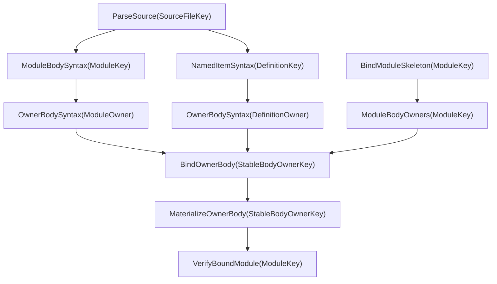

# RFC 0019: Stable Body Owner And Query Closure

## Summary

Introduce `StableBodyOwnerKey`, the closed sum
`ModuleOwner(ModuleKey) | DefinitionOwner(DefinitionKey)`, and make it the sole
semantic owner of body-local Binder identity and body-query work. Replace the
definition-only body query family with owner-body syntax, binding,
materialization, scope, closure, and diagnostic contracts that also represent
module initializer bodies. This closes stable identity for locals, patterns,
labels, and anonymous callables that occur in executable module-level
statements without manufacturing a named definition. Parameters declared by
an anonymous callable use the same owner-local identity domain and never enter
the stable callable-parameter or generic-parameter registries.

## Motivation

ZOM module syntax accepts executable statements directly in `moduleItem`, and
the Binder already resolves module-owned loop patterns, match patterns, nested
block locals, labels, and closures. Those nodes have a stable module but no
enclosing stable named definition.

RFC 0017 keys body binding as `BindDefinitionBody(DefinitionKey)`. RFC 0018
defines `OwnerLocalBindingKey` and `AnonymousOwnerLocalKey` with an owning
`DefinitionKey` and restricts them to the nearest stable named-item query. The
combination has no canonical representation for a local whose nearest stable
semantic boundary is the module initializer. It also has no subordinate owner
for parameters declared by a closure or function expression:
`CallableParameterIdentityRecord` requires an owning `DefinitionKey`, while
`GenericParameterIdentityRecord` requires a stable definition or
implementation owner. Current inventory construction therefore either omits
such a local, promotes it into named-definition identity, skips the anonymous
callable parameter, or requires an unreviewed special case. Each result
violates one of the accepted identity, query, or grammar contracts.

The gap blocks the Binder fact cutover and the clean-versus-incremental oracle:
module-owned executable syntax cannot publish the same independently verified
semantic facts as a named body. It must be closed before body-query providers,
canonical codecs, verifier mutation inventories, or persisted-cache envelopes
freeze around the narrower key.

## Goals

- Define one closed, canonically encoded owner type for every semantic body.
- Represent module-owned locals and anonymous callables without assigning a
  `DefinitionKey` to them.
- Represent callable and generic parameters declared by anonymous callables as
  owner-local bindings under the same stable body owner.
- Replace definition-only body queries and projections with one owner-body
  family that preserves RFC 0017 red-green and materialization boundaries.
- Define deterministic syntax roots for module and definition owners under the
  existing one-selected-source-per-module admission contract.
- Close the corresponding scope, closure, diagnostic, verifier, schema-version,
  and rollout contracts without a compatibility path.

## Non-Goals

- Change ZOM source syntax or the execution order of module-level statements.
- Make locals, patterns, labels, closures, or function expressions public query
  keys or globally interned definitions.
- Change stable subordinate identity for parameters owned directly by a named
  definition or implementation.
- Split one module initializer into independently demanded source-fragment or
  statement queries in this RFC.
- Change stable `DefinitionKey`, `ImplKey`, module resolution, query-runtime,
  red-green, durability, or persistence algorithms.
- Define Checker or IR semantics for module initialization beyond supplying the
  stable Binder owner and query boundary they consume.

## Prior Art

### rustc HIR owner-local identity

The [rustc HIR guide](https://rustc-dev-guide.rust-lang.org/hir.html#identifiers-in-the-hir)
defines `HirId` as an owner plus an owner-local id and explains that the split
improves incremental stability. The same guide keeps item contents behind
separate lookups so a consumer records the body dependency it actually reads.
ZOM should copy the explicit stable-owner/local-identity split and the
dependency boundary. ZOM uses a structural `LocalSyntaxPath` rather than a
process-assigned local integer because semantic values must have deterministic
canonical bytes.

The [rustc AST-to-HIR lowering guide](https://rustc-dev-guide.rust-lang.org/hir/lowering.html)
organizes lowering in an explicit owner scope and validates that every local id
is created under the correct owner. ZOM should copy the owner-scoped admission
invariant and independent validation. It should not create synthetic named
definitions merely to obtain an owner; the module is already the stable
semantic boundary of module initializer code.

The [rustc THIR guide](https://rustc-dev-guide.rust-lang.org/thir.html)
models executable code as bodies associated with body owners and constructs
body IR only for those owners. ZOM should copy the distinction between
declaration inventory and executable-body work. ZOM's closed owner sum includes
the module because ZOM accepts executable module items directly.

### rust-analyzer item and body boundaries

The [rust-analyzer architecture](https://rust-analyzer.github.io/book/contributing/architecture.html#crateshir-expand-crateshir-def-crateshir_ty)
separates an item summary, module scope map, and expression bodies, with the
explicit incremental invariant that editing one function body does not
invalidate unrelated global facts. Its
[source-map guide](https://rust-analyzer.github.io/book/contributing/guide.html#source-map-pattern)
also separates position-independent lowered values from syntax mappings.
ZOM should copy both separation points: `BindModuleSkeleton` remains distinct
from `BindOwnerBody`, and current AST nodes and ranges remain in
`OwnerBodyProvenance` and `MaterializeOwnerBody` rather than semantic facts.

### Swift top-level code context

Swift represents executable top-level statements with a dedicated
[`TopLevelCodeDecl`](https://github.com/swiftlang/swift/blob/main/include/swift/AST/Decl.h)
that is a child of a source file and supplies a declaration context; SILGen
then visits that top-level code through its
[`SILGenTopLevel`](https://github.com/swiftlang/swift/blob/main/lib/SILGen/SILGenTopLevel.cpp)
path. ZOM should copy the explicit representation of top-level executable code
as a real semantic context. ZOM uses the already selected `ModuleKey`, not a
synthetic declaration or physical `SourceFileKey`, because RFC 0008 admits one
selected source for each active module and the module is the semantic context.

### Recurrent pitfalls

Three recurrent failure modes shape the selected design:

1. Promoting body-local nodes into the global definition namespace makes
   identity sensitive to traversal and creates false export or lookup
   authority. ZOM keeps every such node inside its owner-body value.
2. Skipping an anonymous or local boundary to claim a distant definition
   owner corrupts scope and capture facts. ZOM selects the nearest stable body
   owner once, then represents every nested local and anonymous node by a path
   inside that owner. Parameters of the anonymous callable use owner-local
   paths too; they do not enter a global subordinate registry.
3. Embedding source ranges, AST handles, or file traversal order in semantic
   identity defeats red-green reuse. ZOM uses detached canonical trees and
   keeps current source mapping in a revision-local query.

## Guide-Level Explanation

Contributors work with one body-owner vocabulary:

```text
StableBodyOwnerKey =
    ModuleOwner(ModuleKey)
  | DefinitionOwner(DefinitionKey)
```

A local in a named function uses `DefinitionOwner(theFunction)`. A pattern or
local inside a top-level `for`, `match`, block, or closure uses
`ModuleOwner(theModule)`. Nested closures do not become stable owners; their
`AnonymousOwnerLocalKey` is the stable body owner plus the structural path to
the closure. Their own parameters use owner-local paths beneath that closure
and never enter a global subordinate registry.

```zom
module jobs;

for (let job in pendingJobs) {
    let retries = 0;
    run((attempt: i32) => attempt + retries);
}

fun execute() {
    let attempts = 0;
    run((attempt: i32) => attempt + attempts);
}
```

The first `job`, `retries`, closure, and closure parameter `attempt` belong to
`ModuleOwner(jobs)`. The second `attempts`, closure, and closure parameter
belong to `DefinitionOwner(execute)`. Each closure has its own
`AnonymousOwnerLocalKey`; each `attempt` has an `OwnerLocalBindingKey` whose
path descends through that closure. Neither group receives synthetic named or
stable subordinate identity.

An edit inside `execute` demands only its definition owner-body query. An edit
inside executable module syntax demands the module owner-body query. In both
cases the module skeleton and unrelated definition bodies remain independently
memoized when their semantic inputs compare equal.



## Reference-Level Design

### Normative replacement boundary

On acceptance, this RFC is the sole normative contract for
`StableBodyOwnerKey`, module-body syntax roots, `OwnerLocalBindingKey`,
`AnonymousOwnerLocalKey`, and owner-body query keys. It replaces the following
RFC 0017 contracts wherever they are definition-only:

- `BindDefinitionBody` and `MaterializeDefinitionBody`;
- the definition-only body-root and `BodyScope` descriptions;
- the definition-keyed `ClosureEnvironmentMap`;
- named-item-only body provenance and diagnostic ownership; and
- aggregate verification steps that enumerate only named definition bodies.

It also replaces RFC 0018 text that requires owner-local and anonymous records
to carry `DefinitionKey` or to live only in a nearest stable named-item query.
For subordinate parameters, it replaces RFC 0018 only when the immediate
callable owner is anonymous or owner-local; parameter keys owned directly by a
stable definition or implementation remain exactly RFC 0018.
RFC 0018 remains authoritative for admission of stable named definitions,
implementations, subordinate parameter keys, semantic import keys, and every
other stable wire record.

No producer, verifier, query, or test may select between a definition-only body
owner and `StableBodyOwnerKey`. Implementation deletes the definition-only
constructors, query kinds, codecs, schema fields, and materializers in the same
cutover.

### Stable body owner

`StableBodyOwnerKey` is the closed canonical sum:

```text
ModuleOwner(ModuleKey)         = 0x01
DefinitionOwner(DefinitionKey) = 0x02
```

Its canonical bytes are exactly the one-byte alternative tag followed by the
referenced key's canonical bytes. `ModuleOwner` embeds the complete RFC 0011
`ModuleKey` encoding. `DefinitionOwner` embeds the raw 32-byte RFC 0018
`DefinitionKey` digest. Neither alternative adds a payload length, source
range, `NodeId`, `DefId`, body digest, revision, or process brand.

Admission validates the referenced key against the active immutable snapshot.
A `ModuleOwner` is admitted only for that same active module. A
`DefinitionOwner` is admitted only when the retained definition record belongs
to the same active module and `NamedItemSyntax` identifies one of the closed
executable-body roots below. Unknown keys, inactive keys, cross-module owner
use, unknown tags, trailing bytes, and a definition without an executable body
are deterministic query-key or canonical-codec failures.

`StableBodyOwnerKey` is a public semantic query key but is not a new named
language entity and receives no `DefId`. Equality is complete canonical-record
equality under the retained module and definition collision authorities, not
pointer or digest-only authority.

### Body owner selection

Every executable syntax node has exactly one stable body owner:

1. If its nearest containing stable named definition has an executable body,
   the owner is `DefinitionOwner(thatDefinition)`.
2. Otherwise, if it is executable syntax in an active module, the owner is
   `ModuleOwner(thatModule)`.

The selection never skips through an owner-local or anonymous entity to create
a stable named owner. Such nested syntax remains in the already selected body
owner and is distinguished by `LocalSyntaxPath`.

The independent verifier reconstructs this selection from detached syntax,
the stable definition inventory, and explicit boundary nodes. Producer scope
ancestry or owner-selection helpers are not shared with the verifier.

### Executable body roots and stable boundaries

The closed definition-owner root set is:

- the present block body of `FunctionDecl` or `MethodDecl`;
- the required block body of `ConstructorDecl` or `DestructorDecl`; and
- the present initializer expression of `FieldDecl` or `ClassConstDecl`.

An absent callable body, extern declaration, type or module alias, type
declaration, associated type, enum variant, generic parameter, ordinary
parameter, or declaration without an initializer is not a definition body.
Module-item `let`, `const`, and `static` declarators remain in the module owner:
their pattern may introduce more than one stable named definition, so no one
definition key may claim the shared initializer.

An owner-body tree never descends into a strict descendant stable definition
or implementation. Such a node becomes a closed `StableItemBoundary` leaf:

```text
StableItemBoundary =
    DefinitionBoundary(DefinitionKey)
  | ImplementationBoundary(ImplSourceOccurrenceKey)
```

The owning definition root itself is not a boundary. Every strict descendant
boundary must match the active named-definition or implementation-occurrence
inventory at that exact structural position. The independent verifier derives
the boundary census from the detached complete item syntax and active stable
inventories without calling the producer's pruning helper. Missing, extra,
wrong-key, wrong-kind, or traversed-through boundaries are invalid. This rule
prevents an outer owner and a nested stable owner from publishing facts for the
same syntax.

### Module body syntax and provenance

`ModuleBodySyntax(ModuleKey)` is a `Semantic` query value containing a detached
canonical tree for syntax whose selected owner is the module. It contains the
selected source module's module items in source order. Strict descendant
stable definitions and implementations appear only as `StableItemBoundary`
leaves; their contents are not embedded or traversed by the module body
provider. The query rejects a missing selected source, a source that does not
belong to the module's crate, or more than one selected source for the same
active module under RFC 0008.

The detached node schema has explicit kind tags, normalized token payloads,
and structural child order. It excludes source content digests, spans, trivia,
recovery objects, `NodeId`, arena identity, and runtime handles. An equal
module-body tree therefore backdates even when current source positions change.

`LocalSyntaxPath` remains a non-empty RFC 0011 count-framed sequence of
big-endian `uint32` structural child indices. Its root is selected by owner:

- `ModuleOwner` paths are rooted at `ModuleBodySyntax`. Component zero selects
  the module item and remaining components descend through detached syntax.
- `DefinitionOwner` paths are rooted at the complete `NamedItemSyntax` tree of
  the owning `DefinitionKey` after strict descendant stable items have been
  replaced by `StableItemBoundary` leaves.

A path may not enter a `StableItemBoundary`. Empty paths, out-of-range
components, paths whose target has another body owner, and two semantic records
claiming the same owner and path are invalid.

`ModuleBodyProvenance(ModuleKey)` is `RevisionLocal` and maps every admitted
module-owner path to exactly one AST node and source range in the module's one
selected current source. `OwnerBodyProvenance(StableBodyOwnerKey)` is a closed
projection:

- for `ModuleOwner`, it reads `ModuleBodyProvenance`;
- for `DefinitionOwner`, it reads RFC 0017 `NamedItemProvenance`.

Provenance coverage is total for every path referenced by semantic owner-body
facts. Missing, duplicate, foreign-owner, non-selected-source, and
kind-mismatched mappings are invariant failures and cannot publish a
materialized body.

### Owner-local canonical records

`OwnerLocalBindingKey` becomes the following body-value-only record:

```text
OwnerLocalBindingKey {
  owner: StableBodyOwnerKey,
  definingPath: LocalSyntaxPath,
  namespace: OwnerLocalBindingNamespace,
  kind: OwnerLocalBindingKind,
  name: DeclaredDefinitionName,
}
```

Its canonical bytes are exactly:

```text
ASCII("zom.owner-local-binding.v1")
|| 0x00
|| Encode(owner)
|| Encode(definingPath)
|| namespace-tag
|| kind-tag
|| Encode(name)
```

`AnonymousOwnerLocalKey` becomes:

```text
AnonymousOwnerLocalKey {
  owner: StableBodyOwnerKey,
  syntaxPath: LocalSyntaxPath,
  role: AnonymousOwnerLocalRole,
}
```

Its canonical bytes are exactly:

```text
ASCII("zom.anonymous-owner-local.v1")
|| 0x00
|| Encode(owner)
|| Encode(syntaxPath)
|| role-tag
```

`OwnerLocalBindingKind` is the closed set:

```text
CallableParameter = 0x0f
GenericParameter  = 0x10
Local             = 0x13
PatternBinding    = 0x14
```

The callable and generic parameter tags intentionally match their existing
`DefinitionKind` discriminants, but those definition variants do not grant
stable definition identity. The existing closed namespace and anonymous-role
tags remain unchanged. `CallableParameter` requires the `Value` namespace;
`GenericParameter` requires the `Type` namespace; `Local` and
`PatternBinding` require the namespaces admitted by their Binder syntax.

Both records remain non-interned semantic body values and are
forbidden as public query keys. Labels and control targets use the same
`StableBodyOwnerKey + LocalSyntaxPath` owner rule. A local or anonymous key
whose path resolves outside its owner, to a different syntax kind, or through
a stable item boundary is invalid.

The ASCII domains and `v1` schema are mandatory. A decoder for these record
types accepts no domain or version other than the bytes above. There is no
definition-only decoder branch.

### Anonymous callable subordinate identity

Parameter identity is selected by the immediate callable owner, not by the
nearest distant named declaration:

- A generic parameter owned directly by a stable definition or implementation
  uses RFC 0018 `GenericParameterKey`.
- A receiver or ordinary callable parameter owned directly by a stable named
  callable uses RFC 0018 `CallableParameterKey`.
- A generic parameter declared by a function expression uses
  `OwnerLocalBindingKey { owner: the selected StableBodyOwnerKey,
  definingPath: the parameter syntax path, namespace: Type,
  kind: GenericParameter, name }`.
- An ordinary parameter declared by a closure or function expression uses
  `OwnerLocalBindingKey { owner: the selected StableBodyOwnerKey,
  definingPath: the parameter syntax path, namespace: Value,
  kind: CallableParameter, name }`.

Anonymous callables cannot declare a receiver. A receiver token or receiver
position beneath `AnonymousOwnerLocalKey` is rejected before identity
publication.

The stable owner of an anonymous parameter is not the enclosing
`AnonymousOwnerLocalKey`. The parameter's `LocalSyntaxPath` already descends
through that anonymous callable and identifies the exact declaration. The
verifier resolves the path, finds its nearest anonymous callable ancestor, and
requires that ancestor's `AnonymousOwnerLocalKey` use the same
`StableBodyOwnerKey` and the corresponding path prefix. A missing ancestor,
different stable owner, parameter outside the callable's parameter or generic
list, duplicate parameter path, or receiver form is invalid.

Anonymous subordinate parameters are published by `BindOwnerBody` as semantic
owner-local binding facts keyed by `OwnerLocalBindingKey`; semantic resolved
targets carry that key. `MaterializeOwnerBody` issues `OwnerLocalBindingId`
from the module-local allocator and constructs the revision-local
`OwnerLocalBindingFact` and `OwnerLocalBindingTarget`. No semantic query value
contains either handle. These parameters do not enter
`FrozenCallableParameterEntry`, `FrozenGenericParameterEntry`,
`CallableParameterFact`, `GenericParameterFact`, `CallableParameterRegistry`,
or `GenericParameterRegistry`. Those stable inventories reject a parameter
whose immediate callable owner is anonymous.

Anonymous generic parameters have `DefinitionActivation::GenericList`.
Anonymous ordinary parameters have
`DefinitionActivation::ParameterList`. The explicit capture list, every
ordinary parameter type, the result type, and the raises type resolve before
any ordinary parameter activates. Default expressions then resolve in source
order: a default may see already activated preceding parameters but cannot see
its own parameter or any later parameter; the current parameter activates only
after its default resolves. The callable body resolves after all ordinary
parameters activate. A parameter is not a free variable of its own callable. A
nested closure may capture it through its `OwnerLocalBindingTarget`, and
free-variable and explicit-capture facts retain that exact target. These rules
apply identically when the surrounding stable body owner is a module or a
definition.

The independent verifier derives immediate callable ownership, parameter-list
membership, ordinal order, sequential default visibility, activation, capture
visibility, and target kind
from detached syntax and published facts. It does not call the inventory
producer's ancestor, activation, or capture helpers. The materializer requires
one current provenance entry and one dense owner-local handle for every
anonymous subordinate parameter and rejects any global subordinate handle for
the same syntax node.

### Owner-body query catalog

RFC 0017's closed input inventory gains one explicit authority:

```text
SelectedModuleSource(ModuleKey) -> SourceFileKey | deterministic absence
```

`SelectedModuleSource` has query domain
`zom.query.selected-module-source.v1`, key schema `1`, value schema `1`,
`Semantic` reuse, `Low` input durability, retained/pinned equality state, no
provider, no cycle policy, and constant cost. Equality is complete canonical
`SourceFileKey` equality or the exact absence alternative. The verified module
graph staging transaction publishes it atomically with `ActiveModules`,
`ActiveSources`, and `ModuleDependencies`; replacement erases prior active
module keys before installing the complete new mapping. Its independent input
verifier requires an active module, exactly one active selected source in the
same crate, and equality with the RFC 0008 selected module-source record. It
rejects missing, duplicate, inactive, foreign-crate, or graph-disagreeing
mappings before the revision commits.

The owner-body descriptors are the following closed inventory. `Computed`
under input durability means the memo records the minimum durability of its
actual provider and verifier reads; it is not a declared durability level.
`Reject` means a same-thread or cross-thread query cycle is a runtime failure
with no memo publication.

| Query | Domain; key/value schema | Reuse; input durability | Equality | Complete tracked dependencies | Verifier | Retention; cycle; cost |
|---|---|---|---|---|---|---|
| `ModuleBodySyntax(ModuleKey)` | `zom.query.module-body-syntax.v1`; `1/1` | `Semantic`; Computed | complete detached tree and boundary records | `SelectedModuleSource(m)`; on value `s`, exactly `ParseSource(s)`, `NamedDefinitionInventory(m)`, `NamedImplementationInventory(m)`, and their current site projections | independently rebuilds selected-source cardinality, pruned syntax, boundary census, and canonical child order | evictable bounded LRU; Reject; linear in selected source syntax |
| `ModuleBodyProvenance(ModuleKey)` | `zom.query.module-body-provenance.v1`; `1/1` | `RevisionLocal`; Computed | exact current path-to-source/node/range map; never backdated | `SelectedModuleSource(m)`, `ParseSource(s)`, `ModuleBodySyntax(m)`, and current definition/implementation site projections | independently reconstructs total current path coverage and rejects stale, extra, duplicate, or boundary-crossing maps | evictable; Reject; linear in module-owner syntax |
| `OwnerBodySyntax(StableBodyOwnerKey)` | `zom.query.owner-body-syntax.v1`; `1/1` | `Semantic`; Computed | complete owner, owning module, pruned detached tree, and boundary records | module alternative: only `ModuleBodySyntax(m)`; definition alternative: only `NamedItemSyntax(d)` after its RFC 0019 boundary-schema replacement | independently validates owner admission, closed executable root, owning module, pruning, paths, and boundary census | evictable bounded LRU; Reject; linear in owner syntax |
| `OwnerBodyProvenance(StableBodyOwnerKey)` | `zom.query.owner-body-provenance.v1`; `1/1` | `RevisionLocal`; Computed | exact current legal-path map; never backdated | module alternative: `OwnerBodySyntax(owner)` and `ModuleBodyProvenance(m)`; definition alternative: `OwnerBodySyntax(owner)` and `NamedItemProvenance(d)` | filters against the pruned owner tree and rejects missing or extra paths, foreign nodes, and every mapping at or below `StableItemBoundary` | evictable; Reject; linear in owner syntax |
| `ModuleBodyOwners(ModuleKey)` | `zom.query.module-body-owners.v1`; `1/1` | `Semantic`; Computed | complete canonical owner sequence | `NamedDefinitionInventory(m)` followed by one canonical parallel dependency group of `NamedItemSyntax(d)` for every active definition in that inventory | independently derives the executable-root subset and canonical owner order | retained/pinned; Reject; linear in named inventory |
| `BindOwnerBody(StableBodyOwnerKey)` | `zom.query.bind-owner-body.v1`; `1/1` | `Semantic`; Computed | generated complete fact equality | `OwnerBodySyntax(owner)`, `BindModuleSkeleton(owningModule)`, and only the exact stable scope/name/import projections demanded through `QueryContext` | independent scope, activation, resolution, control, closure, capture, ordering, and aggregate fact reconstruction | evictable bounded LRU; Reject; expensive linear body analysis |
| `MaterializeOwnerBody(StableBodyOwnerKey)` | `zom.query.materialize-owner-body.v1`; `1/1` | `RevisionLocal`; Computed | exact current handles and provenance; never backdated | exactly `BindOwnerBody(owner)`, `OwnerBodyProvenance(owner)`, and active-handle materializers for stable keys present in that body result | checks total one-to-one handle/provenance materialization and forbids semantic handles in memoized semantic facts | evictable; Reject; linear in published body facts |
| `ClosureEnvironmentMap(StableBodyOwnerKey)` | `zom.query.closure-environment-map.v1`; `1/1` | `Semantic`; Computed | complete canonical closure-key/capture sequence | only `BindOwnerBody(owner)` | independent total projection and canonical ordering check | retained/pinned; Reject; linear in closure facts |

The RFC 0019 replacement schema for `NamedItemSyntax(d)` preserves the owning
declaration root but replaces every strict descendant stable definition or
implementation with `StableItemBoundary`. Its provider and independent
verifier read the exact named-definition, named-implementation, and current
site projections needed to derive that census; neither reads an ambient
registry or `CompilerSession` collection.

`ModuleBodySyntax(m)` first reads `SelectedModuleSource(m)`. Absence becomes
the deterministic semantic failure `MissingSelectedModuleSource`. On value
`s`, it then reads only `ParseSource(s)` and the exact boundary projections in
the descriptor. When a transaction changes the selected source from `s1` to
`s2`, recomputation replaces the dynamic `ParseSource(s1)` dependency with
`ParseSource(s2)`; a later edit to `s1` cannot invalidate the current memo.
Changing another module's selected source or editing any unselected source
does not execute this provider. Reading `ActiveSources`, the whole module graph,
or mutable session state from the provider or verifier is an invariant failure.

`OwnerBodySyntax(ModuleOwner(m))` reads only `ModuleBodySyntax(m)`.
`OwnerBodySyntax(DefinitionOwner(d))` reads only the boundary-complete
`NamedItemSyntax(d)`. Neither alternative may read `ParseSource`, a current AST
handle, or a global diagnostic engine.

`ModuleBodyOwners(m)` contains exactly one `ModuleOwner(m)` and one
`DefinitionOwner(d)` for every active definition in `m` whose retained syntax
matches the closed executable-body root set. It contains no other module,
definition without a body, duplicate, local, anonymous, implementation, or
parameter key. Owners are sorted by complete canonical bytes, which places the
module owner before definition owners by tag.

`BindModuleSkeleton(m)` publishes or verifies the same owner set as its body
roots but does not evaluate a body. `VerifyBoundModule(m)` demands
`ModuleBodyOwners(m)`, `BindModuleSkeleton(m)`, and one `BindOwnerBody(owner)`
for each owner, then checks complete coverage and uniqueness before immutable
publication. Providers may evaluate independent owners as one deterministic
parallel dependency group. Result aggregation remains in canonical owner
order regardless of worker completion order.

`BindOwnerBody` returns the same fact domains for both owner alternatives,
including anonymous callable subordinate parameters as owner-local facts. It
may read only the immutable skeleton and exact stable lookup projections
recorded by its descriptor, and it does not mutate a shared scope arena. The
`ModuleOwner` alternative processes
no syntax below `StableItemBoundary`; the `DefinitionOwner` alternative
processes no syntax outside its owning item root or below a strict descendant
`StableItemBoundary`.

All query failures use the closed semantic algebra
`MissingSelectedModuleSource | InactiveOwner | ForeignOwner |
DefinitionWithoutBody | UpstreamSourceRejected | BoundaryMismatch |
MalformedDetachedSyntax | MissingProvenance | DuplicateProvenance |
NonSelectedSource | CrossBoundaryPath`. `UpstreamSourceRejected` forwards the
exact canonical syntax-diagnostic fact keys from `ParseSource`; every other
alternative is an invariant or deterministic query-key failure and emits no
ordinary source diagnostic. Cancellation, cycle, allocation, and transient
runtime failures publish neither a value nor semantic diagnostics.

### Scope, closure, and projection closure

RFC 0017 `StableScopeOwnerKey::BodyScope` becomes:

```text
BodyScope(StableBodyOwnerKey, LocalSyntaxPath)
```

`ModuleScope(ModuleKey)` remains the module declaration and lookup scope.
`BodyScope(ModuleOwner(m), path)` identifies a lexical scope created by
module-owned executable syntax; it is not an alias for `ModuleScope(m)`.
`DefinitionScope` remains unchanged.

`ClosureEnvironmentMap` is keyed by `StableBodyOwnerKey` and sorted by each
closure's `AnonymousOwnerLocalKey` canonical bytes. Its capture targets remain
stable `BindingTarget` values and owner-local keys admitted within the same or
an enclosing lexical environment. Module-owner closure facts are subject to
the same independent free-variable and explicit-capture verification as
definition-owner closure facts. The closure's own generic and callable
parameters are owner-local targets, are excluded from its free-variable set,
and may become captured targets only for a nested anonymous callable.

Downstream Binder, Checker, HIR, and diagnostic queries depend on an exact
owner-body result or a narrower schema-generated projection from that result.
They may not recover a definition-only key from the owner sum, depend on the
whole `VerifiedBoundModule` for one body, or special-case module-owned facts
through revision-local handles.

### Diagnostic ownership

RFC 0017 `DiagnosticOccurrenceKey` uses `StableBodyOwnerKey` whenever an
owner-body provider owns the event. A `LocalSyntaxPath` occurrence is validated
against that owner.

`DiagnosticProvenanceKey::ModuleSite.owner` becomes
`Maybe<StableBodyOwnerKey>`. `none` remains reserved for module-skeleton events
without a body owner. A module-body event uses `ModuleOwner(theModule)` and a
non-empty module-rooted path; a definition-body event uses
`DefinitionOwner(theDefinition)` and a non-empty named-item-rooted path. The
outer `ModuleSite.module` must equal the module carried or retained by the body
owner.

`ResolveDiagnosticProvenance` reads `OwnerBodyProvenance` for an owner-bearing
module site. It never derives a range from semantic syntax or accepts a path
that belongs to a non-selected source or crosses a stable item boundary.

### Producer and verifier separation

Owner-body record types, generated field inventories, canonical tag
declarations, and mutation inventories may be shared. Semantic decisions may
not be shared:

- the producer discovers syntax ownership during body construction;
- the verifier independently reconstructs owner selection and path coverage;
- the producer constructs scopes and resolutions;
- the verifier reconstructs ancestry, activation, lookup admissibility,
  closure capture, ordering, and aggregate coverage from facts and detached
  syntax; and
- the canonical-codec oracle encodes every record independently of both
  producer and verifier traversal.

Schema generation must emit the record declarations, canonical codec field
inventory, structural mutation inventory, and required domain-specific
mutations. It must not generate or share the producer's owner selection,
binding, lookup, scope construction, or closure algorithm.

Required domain-specific rejection mutations include wrong owner alternative,
foreign module, definition without a body, definition from another module,
module path rooted in named-item syntax, definition path rooted in module
syntax, multiple selected sources, stale selected source, path through a stable
item boundary, missing module owner, duplicate owner, and
worker-order-dependent aggregation.
The query-dependency inventory additionally mutates `ModuleBodySyntax` to omit
the `SelectedModuleSource` read, read the whole module graph or `ActiveSources`,
retain the old `ParseSource` edge after a source switch, or execute after an
unrelated module's selected-source change; each mutation must fail its exact
dependency-trace or execution-set oracle.
The inventory also includes anonymous parameter admitted to a global
subordinate registry, wrong owner-local parameter kind or namespace, missing
anonymous ancestor, path outside the parameter list, fabricated receiver,
activation before capture resolution, current- or later-parameter visibility in
a default, missing preceding-parameter visibility in a later default,
own-parameter free capture, and missing nested-closure capture.

## Repository Impact

| Area | Paths | Owner |
|---|---|---|
| RFC governance | `docs/rfc/0019-*.md`, `docs/rfc/tracking/0019-*.md`, `docs/rfc/README.md` | `rfc` |
| Binder body identity and verified facts | `products/zomlang/compiler/binder/**`, `products/zomlang/compiler/checker/**` | `binder-checker` |
| Stable owner, query catalog, session materialization | `products/zomlang/compiler/identity/**`, `products/zomlang/compiler/query/**`, `products/zomlang/compiler/driver/**` | `module-system` |
| Diagnostic occurrence and provenance contracts | `products/zomlang/compiler/diagnostics/**` | `error-system` |
| Current compiler architecture documentation | `docs/design/**` | `spec-audit` |
| Native regressions and architecture gates | `products/zomlang/tests/**`, `scripts/check-identity-architecture.py`, `scripts/check-incremental-query-architecture.py` | `verification` |

## Security And Safety Impact

The proposal does not change unsafe language semantics, runtime memory access,
capabilities, sandboxing, or external data exposure.

It strengthens compiler integrity. A body fact cannot claim a foreign module
or definition, a revision-local node cannot authorize a semantic owner, and a
path cannot cross into a separately owned stable body. Bounded canonical
decoding rejects unknown tags, domains, versions, impossible counts, trailing
bytes, and inactive keys before allocation or publication. Failed validation
publishes no memo value, handle, diagnostic fact, or dependency record.

## Drawbacks And Risks

- The cutover touches Binder, Checker, driver materialization, diagnostic
  provenance, tests, and schema gates at once. A partial change cannot build by
  design, so the implementation series must be coordinated and verified as one
  direct replacement.
- A module initializer remains one semantic body. Editing one top-level
  statement can rerun binding for other module-owned statements even when
  named definition bodies stay green. Finer module-body partitioning requires
  a separate measured RFC.
- Module-body construction must preserve RFC 0008's one-selected-source
  authority across parse, syntax, provenance, and materialization queries. A
  provider that accidentally merges two sources or accepts a stale source can
  produce foreign provenance, so the independent source-cardinality and
  selected-source mutations are mandatory.
- Adding an owner tag and record domain changes every owner-local canonical
  byte sequence and dependent semantic fingerprint. Generated fixtures and
  mutation expectations must be regenerated together.
- Anonymous callable parameters no longer share the stable subordinate fact
  and handle variants used by named callables. Every downstream target visitor
  must handle their already existing owner-local target variant exhaustively.

## Alternatives Considered

### Create a synthetic module-initializer definition

A synthetic `DefinitionKey` would let the definition-only query signature
compile, but it would introduce a named identity with no source declaration,
declared name, namespace, overload header, or RFC 0018 admission record. It
would also conflate stable named-item inventory with executable module context.
The explicit module owner represents the existing semantic boundary directly.

### Promote every module-owned local to `DefinitionKey`

This would make loop and match patterns, labels, block locals, and anonymous
callables globally interned entities. Their identity would gain authority they
do not have in lookup, export, metadata, or downstream query APIs. Owner-local
paths retain the intended body-value boundary.

### Ban executable module items

Removing module-level statements would close the compiler gap by changing the
language. It would invalidate accepted grammar and existing Binder behavior and
does not improve the identity architecture for a language that intentionally
supports module initialization. This RFC preserves source semantics and closes
the compiler representation.

### Key module bodies by source file

RFC 0008 already admits exactly one selected source for an active module.
Keying the semantic body by `SourceFileKey` would expose a physical discovery
identity where consumers require the semantic module context, duplicate the
module-to-source authority, and complicate replacement when discovery changes.
`ModuleKey` is the complete current boundary; any future proposal for multiple
selected sources must first replace RFC 0008's discovery, conflict, provenance,
and module-initializer ordering contracts.

### Add a module alternative only to owner-local records

Changing the local record while retaining `BindDefinitionBody`, definition-only
scope owners, closure projections, diagnostics, and materializers would create
two sources of body ownership. The selected design closes the complete query
and publication path with one owner type.

### Extend stable subordinate owner sums with anonymous callables

Making `GenericParameterKey` or `CallableParameterKey` own an
`AnonymousOwnerLocalKey` would promote an anonymous body-local entity into a
global registry dependency and make key admission recursive through body
syntax. It would also create stable handles whose provider dispatch still has
to return to the containing body query. A structural owner-local parameter key
keeps identity, dispatch, verification, and materialization in one body value.

## Compatibility And Rollout

This is a compiler-internal, pre-1.0 direct replacement. ZOM source syntax and
module execution semantics do not change.

Implementation replaces the body-owner record, query-kind, fact-schema,
provenance-schema, and materialization contracts together. It deletes
`BindDefinitionBody`, `MaterializeDefinitionBody`, definition-key-only local
constructors, and every recovery branch that fabricates or infers a named owner
for module syntax or an anonymous callable parameter. Anonymous subordinate
parameters move directly from skipped or global-subordinate inventory to the
owner-local inventory; no syntax node is published in both. No alias, overload,
feature flag, environment variable, schema fallback, or dual query
registration remains.

The canonical record domains move to the exact `v1` encodings in this RFC. The
query registry and all semantic values containing body owners receive new
schema revisions. Entries from any preceding in-memory catalog are not
reused. RFC 0017 has not enabled these values for persistent storage; if a
development cache contains an experimental entry, catalog or schema mismatch
makes it an ordinary cache miss and the entry is eligible for pruning. There
is no data migration and no decoder for the replaced bytes.

Generated canonical fixtures, Binder fact snapshots, diagnostic provenance
fixtures, query traces, and architecture-gate inventories change in one
coordinated regeneration. Rollback before `LANDED` reverts the entire direct
replacement; reverting only the owner type or only the query catalog is not a
valid repository state.

## Documentation And Teaching Plan

- Update `docs/design/architecture.md` to show module and definition body
  owners entering one Binder body query family.
- Update `docs/design/compiler-contracts.md` with the owner sum, syntax-root,
  provenance, scope, diagnostic, and verifier-separation contracts.
- Update RFC 0017 and RFC 0018 implementation trackers to point to this
  accepted amendment after approval; their accepted normative text remains an
  immutable decision record.
- Document the owner selection rule and query catalog in public C++ interface
  Doxygen comments.
- Add a contributor example containing both a module-owned loop local and a
  named-function local so the distinct owners are visible in canonical dumps.

No language tutorial or user migration guide is required because source
behavior is unchanged.

## Operational Readiness

Query tracing, memo counters, and incremental benchmark classification must
display the complete `StableBodyOwnerKey` alternative without source ranges or
opaque process addresses. Traces must distinguish a module body from every
definition body while redacting no user source because the key contains only
canonical semantic identity.

The incremental corpus must record execution and green-reuse counts for:

- a module-level private edit;
- a definition-body private edit in the same module;
- an unrelated named-item edit in the module's selected source; and
- source-range movement that changes provenance but preserves semantic body
  syntax.

The implementation creates the native ztest runner
`products/zomlang/tests/unittests/compiler/query/owner-body-query-differential-test.cc`
and the reviewed corpus manifest
`products/zomlang/tests/incremental/corpus/binder-owner-body/cases.json`.
Each case directory contains the initial source set and an ordered sequence of
complete replacement edits. The manifest records, for every transaction, the
canonical query-instance sets expected to execute, backdate equal, change, or
remain unread; query-instance names contain the descriptor domain and complete
canonical key bytes.

The runner performs this protocol for every edit:

1. Commit the complete current explicit-input set atomically to one reused
   `QueryDatabase`, demand `VerifyBoundModule` and diagnostic roots, and capture
   the deterministic dependency and execution trace.
2. Assert the exact manifest execution, backdating, changed-value, and unread
   sets. A subset assertion is insufficient.
3. Construct a fresh database and compiler session, commit the same complete
   post-edit inputs, and demand the same roots as the clean oracle.
4. Byte-compare canonical verified Binder facts, diagnostic occurrence keys,
   resolved diagnostic records, public module interface, and deterministic
   dumps between the reused and clean sessions.

The required cases include definition-body, module-body, provenance-only,
selected-source replacement, old-source edit after replacement, and unrelated
module selected-source replacement. The selected-source case must show the new
`ParseSource` edge and absence of the old edge; the following old-source edit
must execute none of `ModuleBodySyntax`, `OwnerBodySyntax`, `BindOwnerBody`, or
`MaterializeOwnerBody` for that module. The unrelated-module case must execute
none of those providers for the observed module. The test is registered under
the `incremental` and `unittest` CTest labels and is the authoritative
clean-versus-incremental Binder oracle; no external script or ambient trace is
accepted as evidence.

No runtime service, release toggle, database migration, or recurring manual
maintenance is introduced.

## Acceptance Criteria

- Every executable syntax node is assigned exactly one independently verified
  `StableBodyOwnerKey` by the normative selection rule.
- Fixed canonical vectors cover both owner alternatives and both `v1`
  owner-local record domains; an independent codec reproduces the bytes.
- Module-owned loop patterns, match patterns, nested block locals, labels, and
  anonymous callables publish owner-local facts without a synthetic
  `DefinitionKey`.
- Generic and ordinary parameters of definition-owned and module-owned
  anonymous callables publish owner-local facts, dense owner-local handles,
  correct activation, and capture behavior without global subordinate keys or
  handles.
- Definition-owned locals retain stable semantic equality under source-range,
  trivia, and unrelated module edits.
- A module body admits exactly the RFC 0008 selected source, and every semantic
  path has total revision-local provenance in that source.
- `BindOwnerBody`, `MaterializeOwnerBody`, `ModuleBodyOwners`, owner-keyed
  closure projections, and aggregate verification are the only production
  body-query path.
- `BindDefinitionBody`, `MaterializeDefinitionBody`, and definition-only local
  constructors, fields, codecs, and query registrations have zero repository
  references.
- Scope, control, closure, diagnostic, and materialization verifiers reject
  wrong-owner, cross-boundary, cross-module, non-selected-source, duplicate,
  missing, and non-canonical mutations independently of producer algorithms.
- Stable subordinate inventories contain only parameters whose immediate owner
  is a stable definition or implementation; anonymous parameter syntax has
  total and exclusive coverage in the owner-local inventory.
- A private definition-body edit executes neither the module body provider nor
  unrelated definition body providers; a module-body edit leaves unrelated
  definition bodies green when their projections are equal.
- Clean and incremental compilation produce identical verified Binder facts,
  diagnostics, public interfaces, and deterministic dumps for the complete
  module-body edit corpus.
- Sanitizer build, complete unit and lit tests, format, RFC, identity, and
  incremental-query architecture gates pass.
- `binder-checker`, `module-system`, `error-system`, `spec-audit`,
  `verification`, and `rfc` owners approve one exact REVIEW snapshot before
  acceptance.

## Implementation Plan

1. Generate `StableBodyOwnerKey`, the expanded closed
   `OwnerLocalBindingKind`, and the two `v1` owner-local codecs; replace
   definition-only local APIs and all consumers in one compiling slice.
2. Add `ModuleBodySyntax`, the RFC 0008 selected-source admission check, stable
   item boundaries, and independent revision-local provenance construction.
3. Replace the body query catalog with `OwnerBodySyntax`,
   `ModuleBodyOwners`, `BindOwnerBody`, `OwnerBodyProvenance`, and
   `MaterializeOwnerBody`; remove definition-only registrations.
4. Migrate Binder facts, anonymous callable parameters, stable scope owners,
   labels, control targets, closure environments, Checker reads, and diagnostic
   owner/provenance records; remove anonymous parameters from global
   subordinate collection.
5. Make `VerifyBoundModule` demand and independently verify the complete
   canonical owner set and deterministic parallel result order.
6. Generate structural and domain-specific mutation inventories and add the
   selected-source, module-statement, closure, diagnostic, and red-green native
   regressions.
7. Delete every superseded body-owner path and pass scoped architecture gates
   that prove no definition-only constructor or query kind remains.
8. Run the full sanitizer build, unit, lit, format, identity, incremental-query,
   RFC, differential, determinism, and benchmark gates.
9. Update current architecture documentation and implementation trackers, then
   move this RFC through `ACCEPTED`, `IMPLEMENTING`, and `LANDED` only with the
   evidence required by each status.

## Test Plan

- Build:
  - `cmake --preset sanitizer`
  - `cmake --build --preset sanitizer`
- Unit tests:
  - extend Binder local-identity tests with fixed bytes for
    `ModuleOwner(ModuleKey)` and `DefinitionOwner(DefinitionKey)`;
  - cover module-owned loop and match patterns, nested blocks, labels,
    closures, anonymous generic and callable parameters, explicit captures,
    default-value activation, nested captures, failed lookups, and top-level
    type queries;
  - cover named body equality and inequality under body, header, trivia,
    source-order, and unrelated module edits;
  - cover selected-source cardinality, stale or foreign source rejection,
    module-item path roots, and current provenance;
  - mutate owner tag, owner module, owner definition, path root, selected
    source, stable boundary, record domain, schema version, ordering,
    duplicate coverage, and trailing bytes;
  - mutate anonymous parameter owner kind, namespace, nearest callable,
    parameter-list membership, receiver form, activation, target variant,
    global-registry duplication, own-closure capture, and nested-closure
    capture;
  - prove deterministic parallel owner demand and original-key/result
    association for worker counts `1`, `2`, and `8`;
  - run `ctest --preset default -L unittest --output-on-failure`.
- Lit tests:
  - add or update AST/Binder dumps for executable module items beside named
    function bodies;
  - prove clean and incremental diagnostics retain the same ranges after source
    movement;
  - run `ctest --preset default -L lit --output-on-failure`.
- Conformance:
  - run `ctest --preset default --output-on-failure`;
  - run `ctest --preset default -R owner-body-query-differential-test
    --output-on-failure` against
    `products/zomlang/tests/incremental/corpus/binder-owner-body/cases.json`;
  - require exact per-edit execution/backdating/change/unread sets and clean
    byte equality for module-body, definition-body, provenance-only, selected
    source replacement, old-source, and unrelated-module edits.
- Generated files:
  - regenerate canonical body-owner schema, codec, and mutation inventories
    through the repository generator selected by the implementation;
  - run `python3 scripts/check-identity-architecture.py --check`;
  - run `python3 scripts/check-identity-architecture.py --self-test`;
  - run `python3 scripts/check-incremental-query-architecture.py --check`;
  - run `python3 scripts/check-incremental-query-architecture.py --self-test`;
  - run `python3 scripts/check-rfc.py`.
- Format:
  - `python3 scripts/check-format.py`

## Open Questions

None

## Status History

| Date | Status | Notes |
|---|---|---|
| 2026-07-19 | DRAFT | Initial amendment drafted from the module-owned body identity gap. |
| 2026-07-19 | REVIEW | Structural intake complete; exact-snapshot owner review required before acceptance. |
| 2026-07-19 | RETURNED | Exact snapshot `3966d129...70321f3` failed technical and governance review; no approval carries forward. |
| 2026-07-19 | DRAFT | Exact snapshot `3966d129...70321f3` returned for the RFC 0008 source-cardinality conflict, anonymous default-activation ordering, nested stable-item boundary closure, and missing diagnostic owner review. |
| 2026-07-19 | REVIEW | Repaired query authority, descriptor, owner, activation, boundary, and differential contracts passed six-owner pre-review; a new exact-snapshot formal review is required. |
| 2026-07-19 | ACCEPTED | All six required owners approved exact REVIEW snapshot `ba4d5fdf...c8e899b0`; implementation is authorized under the tracked direct-replacement plan. |
| 2026-07-19 | IMPLEMENTING | Direct replacement started with stable body-owner identity, anonymous-parameter materialization, and selected-source query authority. |
