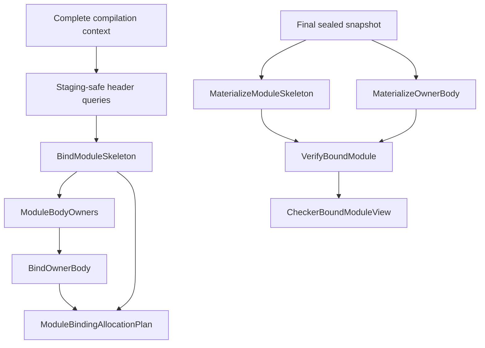

# RFC 0019: Stable Body Owner And Query Closure

## Summary

This RFC defines the stable and contextual Binder contract for module and
definition bodies. Stable semantic facts use routed module ownership and
`StableBodyOwnerKey`; context-sensitive demands use the complete
`CompilationRootSetQueryKey`. The query family publishes staging-safe headers,
stable module and owner-body facts, a deterministic module allocation plan,
revision-local materialized capabilities, RFC 0017 diagnostic facts, and a
lease-owning Checker handoff.

The current contract is internal and unversioned. Every producer, verifier,
consumer, codec, oracle, and gate changes in one implementation series.

## Motivation

ZOM permits executable module items and definition bodies. Both require stable
owner-local identity, deterministic syntax paths, scope ownership, lookup
facts, closure capture, control targets, and diagnostics. Cross-module and
active-authority decisions additionally require the complete compilation root
set so a cached result cannot borrow ambient session state.

The Binder boundary must therefore separate:

- handle-free stable semantic facts;
- complete-context active membership;
- deterministic invalid-key rejection;
- ordinary source diagnostics;
- query-runtime failures; and
- revision-local handle and provenance materialization.

The same separation is required by Checker and downstream IR consumers because
their views may outlive the session objects that initiated the demand.

## Goals

- Define stable module, definition, implementation, parameter, import, and body
  routing keys.
- Define complete stable scope, declaration, resolution, capture, control, and
  failed-lookup facts.
- Define exact Binder result and diagnostic contracts.
- Define deterministic module-local handle allocation.
- Define contextual materializers and a verified bound-module capability.
- Give Checker an immutable, lease-owning view with complete identity and
  binding indexes.
- Keep staging work handle-free and final-snapshot materialization
  revision-local.

## Non-Goals

- Change ZOM syntax or user-visible name-resolution rules.
- Assign global semantic identity to owner-local bindings, anonymous entities,
  scopes, or labels.
- Permit cyclic source-module binding.
- Persist revision-local materialized capabilities.
- Define ownership analysis, target lowering, or native emission.

## Prior Art

Rust compiler queries separate stable query values from session-local interned
identities and retain actual dependency edges. ZOM adopts that stable-value
boundary and explicit dependency model.

rustc HIR uses an owner plus owner-local identity. ZOM applies the same
ownership split to module and definition bodies while using structural syntax
paths in canonical semantic values.

Swift request evaluation separates declaration and body requests. ZOM applies
that staging boundary to definition and implementation headers, module
skeletons, and owner bodies.

## Guide-Level Explanation



Stable queries publish canonical keys and facts. They contain no process
handle, node, source span, brand, revision, arena reference, session reference,
or diagnostic engine reference. Materializers run only against the final
sealed snapshot carried by `SealedQuerySnapshot`. The inherited admission is
validated before provider execution. Materializers then demand exact active
membership, compare complete authority, enter the semantic-context interner
only after that dependency succeeds, reconstruct current provenance, and
publish retained immutable capabilities.

## Reference-Level Design

### Stable And Contextual Routing Keys

```text
StableDefinitionQueryKey {
  module: ModuleKey,
  definition: DefinitionKey,
}

StableImplementationQueryKey {
  module: ModuleKey,
  implementation: ImplKey,
}

StableImplementationOccurrenceQueryKey {
  module: ModuleKey,
  occurrence: ImplSourceOccurrenceKey,
}

StableGenericParameterQueryKey {
  module: ModuleKey,
  parameter: GenericParameterKey,
}

StableCallableParameterQueryKey {
  module: ModuleKey,
  parameter: CallableParameterKey,
}

StableSemanticImportQueryKey {
  requester: ModuleKey,
  binding: ImportBindingKey,
}

StableOwnerBodyQueryKey {
  module: ModuleKey,
  owner: StableBodyOwnerKey,
}

ContextualBodyOwnerKey {
  contextRoots: CompilationRootSetQueryKey,
  body: StableOwnerBodyQueryKey,
}

ContextualModuleKey {
  contextRoots: CompilationRootSetQueryKey,
  module: ModuleKey,
}

ContextualDefinitionKey {
  contextRoots: CompilationRootSetQueryKey,
  definition: StableDefinitionQueryKey,
}
```

`StableBodyOwnerKey` is the closed
`ModuleOwner(ModuleKey) | DefinitionOwner(DefinitionKey)` sum. Every routed
definition, implementation, parameter, occurrence, import, or owner belongs to
the explicit module in its key. Every contextual child carries byte-equal
`contextRoots`. No provider searches active modules or reads an ambient root to
recover ownership.

Each key begins with its declared ASCII domain, one zero byte, and its fields in
declaration order. Nested records are framed complete encodings. Decoders apply
the repository-wide bounds, validate routed ownership, and require exact
consumption.

### Header And Body Roots

```text
DefinitionBodyDisposition =
    NoBody
  | ExecutableBody { bodyRoot: LocalSyntaxPath }

StableDefinitionHeader {
  queryKey: StableDefinitionQueryKey,
  record: DefinitionIdentityRecord,
  headerSite: StableHeaderSite,
  scopes: CanonicalSequence<StableHeaderScope>,
  genericParameters: CanonicalSequence<StableHeaderGenericParameter>,
  callableParameters: CanonicalSequence<StableHeaderCallableParameter>,
  body: DefinitionBodyDisposition,
}

StableImplementationOccurrenceHeader {
  occurrence: StableImplementationOccurrenceQueryKey,
  authority: StableImplementationQueryKey,
  record: ImplIdentityRecord,
  headerSite: StableHeaderSite,
  scopes: CanonicalSequence<StableHeaderScope>,
  genericParameters: CanonicalSequence<StableHeaderGenericParameter>,
}
```

Header providers read the exact selected source, parse capability, named
inventory, and current definition or implementation site. Independent
verifiers repeat occurrence selection, scope-role census, parameter coverage,
body disposition, detachment, and canonical encoding without producer
traversal helpers.

`ModuleBodySyntax(ModuleKey)` and `ModuleBodyProvenance(ModuleKey)` use the
derived selected-source projection. Named-item syntax and provenance are keyed
by `ContextualDefinitionKey`. Owner-body syntax and provenance are keyed by
`ContextualBodyOwnerKey`.

`StableItemBoundary` closes every nested named definition and implementation
occurrence. An owner-body path never crosses such a boundary. A module owner
selects the pruned module body. A definition owner selects the executable body
root declared by its exact header.

### Stable Scope And Target Keys

```text
StableScopeOwnerKey =
    ModuleScope(ModuleKey)
  | DefinitionScope(StableDefinitionQueryKey, ScopeRole)
  | ImplementationOccurrenceScope(
        StableImplementationOccurrenceQueryKey,
        ScopeRole)
  | BodyScope(StableOwnerBodyQueryKey, LocalSyntaxPath)

StableBindingTargetKey =
    Definition(StableDefinitionQueryKey)
  | Implementation(StableImplementationQueryKey)
  | Module(ModuleKey)
  | SemanticImport(StableSemanticImportQueryKey)
  | OwnerLocal(StableOwnerBodyQueryKey, OwnerLocalBindingKey)
  | AnonymousOwner(StableOwnerBodyQueryKey, AnonymousOwnerLocalKey)
  | GenericParameter(StableGenericParameterQueryKey)
  | CallableParameter(StableCallableParameterQueryKey)
```

Every target is routable to an explicit module. Body-local alternatives are
valid only inside a byte-equal contextual owner demand. `ScopeNameBucket`
rejects `BodyScope` because its stable descriptor has no context roots.

### Stable Module And Owner-Body Facts

`BoundModuleSkeleton` contains canonical sequences of:

- `StableScopeFact`;
- `StableNodeScopeFact`, whose `StableNodeSyntaxRoot` is exactly
  `ModuleBody`, `DefinitionHeader`, or `ImplementationHeader`;
- `StableDeclarationFact`;
- `StableImplementationOccurrenceFact`;
- generic and callable parameter declaration facts;
- module aliases, imports, local exports, and reexport steps;
- stable body owners; and
- `StableFailedLookupFact`.

The root of every `StableNodeScopeFact` identifies the only detached syntax tree
in which its `LocalSyntaxPath` is interpreted. The referenced root and scope
owner must exist exactly once in the same module.

`BoundOwnerBody` contains canonical sequences of:

- `StableBodyScopeFact` and `StableBodyNodeScopeFact`;
- `StableOwnerLocalBindingFact`;
- `StableResolutionFact`;
- `StableDeferredMemberFact`;
- `StableSelfTypeFact` and `StableThisBindingFact`;
- shadow, label, and control-transfer facts;
- closure, free-variable, and explicit-capture facts; and
- `StableFailedLookupFact`.

Every non-boundary node has exactly one scope fact. Every closure has exactly
one free-variable fact, including an empty variable sequence. Explicit capture
lists remain separately represented, including an empty explicit list.
Provider and verifier use independent traversal, activation, lookup, capture,
and control-flow implementations.

### Lookup Projections

The stable projection catalog is:

| Query | Key | Value |
|---|---|---|
| `ModuleExportNames` | `ModuleKey` | canonical binding-name sequence |
| `ExportedBinding` | `StableExportedBindingQueryKey` | optional stable exported binding |
| `DefinitionBindingHeader` | `StableDefinitionQueryKey` | optional stable declaration |
| `ImplementationBindingHeader` | `StableImplementationQueryKey` | optional canonical occurrence sequence |
| `ScopeNameBucket` | `StableScopeNameBucketQueryKey` | canonical stable target sequence |
| `ImportTarget` | `StableSemanticImportQueryKey` | optional stable import |
| `BindingVisibility` | global `StableBindingTargetKey` | `Optional<MemberVisibility>` |

Each descriptor has one literal domain, one exact key encoding, and one exact
value domain. No descriptor wraps an already canonical key. Provider and
verifier independently derive every dependency key.

### Result And Diagnostic Contract

```text
BinderQueryResult<T> =
    Value {
      value: T,
      diagnostics: CanonicalSequence<DiagnosticFact>,
    }
  | SourceRejected {
      diagnostics: NonEmptyCanonicalSequence<DiagnosticFact>,
    }
  | KeyRejected {
      failure: BinderKeyFailure,
    }

BinderKeyFailureKind =
    MissingSelectedModuleSource
  | InactiveOwner
  | ForeignOwner
  | DefinitionWithoutBody
  | BoundaryMismatch
  | NonSelectedSource
  | CrossBoundaryPath

BinderKeyFailure {
  kind: BinderKeyFailureKind,
  owner: BinderQueryOwner,
  path: Optional<LocalSyntaxPath>,
}
```

`SourceRejected` forwards the exact RFC 0017 source diagnostic facts.
`KeyRejected` represents deterministic invalidity of the requested key and has
no diagnostic. Missing provenance, malformed detached syntax, codec
disagreement, foreign brands, cancellation, allocation failure, collision, or
verifier disagreement is `QueryRuntimeFailure` and publishes no semantic
result.

RFC 0017 is the sole diagnostic wire. Binder extends its producer and emitter
enums with:

```text
BinderDiagnosticProducer =
    BindModuleSkeleton
  | BindOwnerBody

BinderDiagnosticEmitter =
    Declaration
  | Lookup
  | ControlTransfer
  | ContextualSelf
```

Failed lookup facts are unique by `(owner, usePath)`. Module-skeleton lookup
facts use the module diagnostic root and no semantic owner. Owner-body lookup
facts project `StableBodyOwnerKey` into the RFC 0017 semantic owner; context
roots remain only in the outer contextual provenance demand.

| Outcome | Diagnostic |
|---|---|
| `Missing` | `ZOM3001 UndefinedIdentifier`; identifier arguments; empty secondary sequence; no fix-it |
| `NamespaceMismatch` | `ZOM3002 SymbolNamespaceMismatch`; identifier and expected namespace arguments; empty secondary sequence; no fix-it |
| `Ambiguous` | `ZOM3028 AmbiguousIdentifier`; identifier arguments; empty secondary sequence; no fix-it |

The failed lookup and its diagnostic are bijective across code, arguments,
root, producer, owner, emitter, occurrence, primary location, secondary
sequence, fix-it absence, path, namespace, name, and complete outcome payload.

### Deterministic Allocation

```text
ModuleBindingAllocationPlan {
  key: ContextualModuleKey,
  skeletonScopeCount: uint32,
  implementationOccurrenceCount: uint32,
  owners: CanonicalSequence<OwnerAllocationRange>,
}

OwnerAllocationRange {
  owner: StableOwnerBodyQueryKey,
  scopeBegin: uint32,
  scopeCount: uint32,
  ownerLocalBegin: uint32,
  ownerLocalCount: uint32,
  anonymousBegin: uint32,
  anonymousCount: uint32,
  labelBegin: uint32,
  labelCount: uint32,
}
```

The plan reads the exact skeleton and every contextual owner body in canonical
owner order. Checked prefix sums produce dense, disjoint, gap-free ranges.
Provider and verifier compute counts, order, and prefix sums independently.

### Query Catalog And Read Sets

| Query | Key | Result |
|---|---|---|
| `DefinitionHeaderSyntax` | `StableDefinitionQueryKey` | `BinderQueryResult<StableDefinitionHeader>` |
| `ImplementationOccurrenceHeaderSyntax` | `StableImplementationOccurrenceQueryKey` | `BinderQueryResult<StableImplementationOccurrenceHeader>` |
| `BindModuleSkeleton` | `ModuleKey` | `BinderQueryResult<BoundModuleSkeleton>` |
| `ModuleBodyOwners` | `ContextualModuleKey` | canonical stable owner sequence |
| `BindOwnerBody` | `ContextualBodyOwnerKey` | `BinderQueryResult<BoundOwnerBody>` |
| `ModuleBindingAllocationPlan` | `ContextualModuleKey` | `BinderQueryResult<ModuleBindingAllocationPlan>` |
| `ModuleDiagnosticFacts` | `ContextualModuleKey` | canonical RFC 0017 fact sequence |

Header queries read one exact owning inventory, selected source, parse
capability, and current declaration site. `BindModuleSkeleton` reads module
body syntax, both named inventories, every exact header, dependency requests,
resolutions, and only reached projections. `ModuleBodyOwners` reads the
contextual skeleton and active-definition membership for executable
definitions. `BindOwnerBody` reads contextual owner syntax, the owning
skeleton, and only reached scope, import, header, export, and visibility
projections. The allocation plan reads the contextual owner sequence and every
owner body. `ModuleDiagnosticFacts` reads the module-resolution diagnostics,
skeleton result, and every canonical owner-body result; it reads no
materialized capability.

`BoundOwnerBody` is the sole stable owner of closure, free-variable, and
explicit-capture facts. `MaterializeOwnerBody` reads the exact
`BindOwnerBody` result and expands those facts directly. No second projection,
descriptor, codec, memo, provider, verifier, consumer, schema row, or
architecture allowance exists for the same authority.

Each descriptor declares complete tracked reads, provider, independent
verifier, cycle rejection, equality, retention, cost, semantic-failure
mapping, and runtime-failure mapping. Architecture gates reject shared
producer/verifier traversal, ambient roots, database-key enumeration, session
mirrors, and undeclared dynamic reads.

### Materialized Capabilities

Final Binder capabilities use descriptor-specific failure alternatives.
`CapabilityDemandResult<Descriptor>` exposes only the source- or key-rejection
alternatives listed by that descriptor, plus `Published` and
`RuntimeRejected`. The typed provider result, canonical failure envelope,
independent rejection verifier, and public decoder are the RFC 0029 contract.
An unavailable alternative creates no type, storage, constructor, codec,
verifier, or observer, and no rejection publishes a semantic or capability
memo.

Acceptance transaction `rfc0029-accept-20260727-8d393a0c` binds the exact
capability result and failure contracts below to RFC 0029 proposal SHA-256
`8d393a0c6c00a7fad9ef086d3d25f5ed44300041afa9e1e1a4af5d68830fd3e7`.
`CapabilityPublished` carries the evaluator-published revision-local memo.
The result decoder consumes the move-only request result and checks descriptor
ordinal, database token, and revision before its private cast. Capability
rejections never enter `QueryValue`.

The exact descriptor read sets are:

| Descriptor | Ordered reads |
|---|---|
| `RevisionLocalDefinitionSitesQuery` | `SelectedModuleSource`; `ParseSourceQuery`; `StableIdentityAdmissionQuery`; `NamedDefinitionInventoryQuery`; independent site reconstruction |
| `RevisionLocalImplementationSitesQuery` | `SelectedModuleSource`; `ParseSourceQuery`; `StableIdentityAdmissionQuery`; `NamedImplementationInventoryQuery`; independent site reconstruction |
| `ModuleBodyProvenanceQuery` | `SelectedModuleSource`; `ParseSourceQuery`; `StableIdentityAdmissionQuery`; `RevisionLocalDefinitionSitesQuery`; `RevisionLocalImplementationSitesQuery`; `ModuleBodySyntaxQuery` |
| `NamedItemProvenanceQuery` | `ActiveDefinitionAuthorityInput`; `ActiveDefinitionAuthorityReadyInput` only for absent or contradictory authority; `SelectedModuleSource`; `ParseSourceQuery`; `StableIdentityAdmissionQuery`; `NamedDefinitionInventoryQuery`; `RevisionLocalDefinitionSitesQuery`; `RevisionLocalImplementationSitesQuery`; `NamedItemSyntaxQuery` |
| `OwnerBodyProvenanceQuery` | exactly one typed branch, `ModuleBodyProvenanceQuery` or `NamedItemProvenanceQuery`; then the matching `ModuleBodySyntaxQuery` or complete-key `NamedItemSyntaxQuery` |

The first eligible typed rejection in read order is returned, and an earlier
runtime failure stops classification. The two site descriptors construct only
`MissingSelectedModuleSource(Module(key.module), none)` and forward the
stable-admission source rejection unchanged. A semantic inventory failure
after stable admission is `InvariantViolation`.

`ModuleBodyProvenanceQuery` constructs or forwards only
`MissingSelectedModuleSource(Module(key.module), none)`. It forwards source
rejections from parse, stable admission, definition sites, and implementation
sites in read order. `ModuleBodySyntaxQuery` is semantic; its semantic failure
after typed provenance succeeds is `InvariantViolation`, not a capability
source rejection.

`NamedItemProvenanceQuery` constructs or forwards only
`InactiveOwner(DefinitionHeader(key.definition), none)` and
`MissingSelectedModuleSource(Module(key.definition.module), none)`. Absent
authority requires complete readiness before `InactiveOwner`; missing
readiness is `ProviderRejected`, and contradictory authority is
`InvariantViolation`. Child source and key rejections are forwarded unchanged.

`OwnerBodyProvenanceQuery` never reads `OwnerBodySyntaxQuery`. A definition
owner applies an independently verified executable-root admission algorithm
directly to successful named-item syntax. `NoBody` constructs
`DefinitionWithoutBody(Body(key), none)`; `Malformed` is
`InvariantViolation`. `InactiveOwner` and `MissingSelectedModuleSource` are
forwarded unchanged from the selected typed child.

Every source and key rejection verifier independently repeats the exact
conditional read order, proves the first eligible branch, validates the
descriptor's legal `BinderKeyFailureKind` subset, and compares the complete
canonical payload. Candidate, rejection, or codec disagreement publishes no
memo.

`MaterializeModuleSkeleton(ContextualModuleKey)` expands the stable skeleton
through the exact allocation plan, selected-source provenance,
`MaterializedModuleGraph`, and reached active memberships.

`MaterializeOwnerBody(ContextualBodyOwnerKey)` expands successful resolutions
as:

```text
MaterializedBoundResolution {
  node: NodeId,
  scope: ScopeId,
  namespace: Namespace,
  target: BindingTarget,
  canonicalTarget: BindingTarget,
  origin: BindingOrigin,
}
```

Failed lookups remain separate `MaterializedFailedLookupFact` values and carry
no diagnostic reference. Materializers reconstruct current nodes and spans
from exact provenance and never backdate them.

`VerifyBoundModule(ContextualModuleKey)` independently proves exact owner
coverage, one materialized body per owner, allocation coverage, graph lineage,
stable-to-handle expansion, provenance coverage, import and export surfaces,
and aggregate fact equality. A child source rejection or error diagnostic
prevents publication and returns the canonical union of existing RFC 0017
facts. A successful capability contains no diagnostics.

The capability owns `ImmutableDefinitionInventory` and
`ImmutableBindingMetadata`. The definition inventory provides complete
handle-to-key-and-record, node-to-entity, occurrence-to-implementation, and
owner-local lookup without becoming identity authority.

### Checker Handoff

`CheckerBoundModuleView` owns one retained `VerifiedBoundModuleLease`. It
exposes lifetime-bound references to the semantic context, compilation unit,
crate, module, semantic fingerprint, parsed tree, immutable definition
inventory, dependency surfaces, prelude surface, resolved imports, module
aliases, binding metadata, and export surface.

The view is the only Binder-to-Checker production handoff. Module interface,
checked module, HIR, Built MIR, and ownership overlay consumers each retain
their own lease to the same immutable memo. No consumer stores a non-owning
bound-module root.

## Repository Impact

| Area | Paths | Owner |
|---|---|---|
| RFC governance | `docs/rfc/0019-stable-body-owner-and-query-closure.md`; `docs/rfc/tracking/0019-review-and-implementation.md` | `rfc` |
| Stable Binder values, providers, verifiers, materializers, and Checker handoff | `zomlang/compiler/binder/**` excluding `binder/module-*`; `zomlang/compiler/checker/**` excluding the diagnostic definition file; `zomlang/compiler/type/**` | `binder-checker` |
| Contextual membership, query runtime, graph capability, session, and module interface | `zomlang/compiler/query/**`; `zomlang/compiler/identity/**`; `zomlang/compiler/driver/**`; `zomlang/compiler/binder/module-*` | `module-system` |
| Diagnostic schemas | `zomlang/compiler/diagnostics/**`; `zomlang/compiler/checker/checker-source-diagnostics.def` | `error-system` |
| Current-state architecture audit | `docs/design/compiler-contracts.md`; affected language specification surfaces | `spec-audit` |
| Tests, gates, coverage, and CI | paths assigned to `verification` in `.codex/subagents/manifest.yaml` | `verification` |

## Security And Safety Impact

Explicit routed ownership prevents cross-module digest admission. Contextual
keys prevent ambient-root reuse. Stable facts contain no process-local
identity. Materializers validate active complete-record membership before
interning and validate the semantic-context brand before reverse lookup.
Retained leases keep the snapshot and semantic-context arenas alive until the
last consumer releases them.

## Drawbacks And Risks

- The implementation spans Binder, query runtime, identity admission,
  diagnostics, Checker, driver publication, and downstream lease ownership.
- Independent providers and verifiers duplicate traversal logic intentionally.
- The stable schema requires fixed wire oracles and structural mutation tests.

## Alternatives Considered

A synthetic named definition for module initialization would assign public
identity to an internal execution boundary. Body queries therefore use the
module alternative of `StableBodyOwnerKey`.

Global identity for locals and anonymous callables would make source-local
edits affect unrelated identity domains. They remain owner-local and use the
deterministic module allocation plan.

Ambient context lookup would make stable cache behavior depend on session
state. Every contextual demand carries complete roots in its key.

## Compatibility And Rollout

The repository is unreleased. The contract is replaced directly across every
producer, verifier, caller, codec, oracle, gate, and build target. No alternate
decoder, overload, alias, flag, fallback authority, or dual production root is
permitted.

Implementation follows the synchronized dependency graph. RFC 0027 `S1`,
`S2`, and `S3` remain bounded review partitions and land only as the single
build-visible RFC 0029 `R29-12AB` transaction. `S6` then lands separately
through `R29-12D`. RFC 0029 `R29-13A`, `R29-13B`, and `R29-13C` prepare the
query types, exact provenance and failure contracts, and native gates only
after both foundation transactions pass; `R29-14` then assembles the atomic
runtime source transaction. Contextual membership precedes materialization,
and downstream leases migrate within that atomic transaction.

## Documentation And Teaching Plan

Current-state compiler documentation is updated only after the production
builder, independent verifier, session publisher, consumers, native tests, and
architecture gates exist. Planned contracts remain in RFCs.

## Operational Readiness

Architecture gates reject:

- an ambient compilation root;
- any stable semantic value containing a handle, node, span, brand, revision,
  arena, or session reference;
- provider/verifier traversal reuse;
- materialization before the final input seal;
- a materializer without exact active-membership permission;
- a failed lookup embedded in a successful binding value;
- a diagnostic outside the RFC 0017 wire;
- a non-owning downstream bound-module reference; and
- a production batch Binder root or session mirror.

## Acceptance Criteria

The design acceptance criteria are:

- complete stable and contextual routing keys;
- complete stable fact, header, result, diagnostic, allocation, materialized,
  and Checker contracts;
- exact query descriptors and dynamic read sets;
- independent providers and verifiers;
- deterministic active-membership and materialization failure behavior; and
- one unversioned production cutover.

Implementation completion additionally requires the native sanitizer, unit,
lit, diagnostic, architecture, coverage, English-only, internal-versioning,
format, diff, and Release benchmark gates recorded by RFC 0027.

Design synchronization does not claim implementation completion. RFC 0019
remains `IMPLEMENTING`.

## Implementation Plan

The active implementation plan is the RFC 0027 tracker. Its stable-schema,
header, Binder-query, allocation, materializer, Checker, session, deletion,
verification, documentation, and status-transition tasks are the only
authority for this contract.

The RFC 0019 tracker retains truthful completion state for work already
verified and maps remaining phases to the RFC 0027 tasks.

## Test Plan

Native tests cover:

- strict key and value codecs with exact consumption;
- module and definition owner alternatives;
- definition and implementation header scope and parameter coverage;
- source switch and contextual invalidation;
- exact query read sets and reversed demand order;
- failed-lookup and RFC 0017 diagnostic bijection;
- allocation overflow and dense-range invariants;
- active-membership rejection and stable-to-handle expansion;
- materialized provenance and failed-lookup separation;
- surviving leases and teardown order; and
- clean versus incremental equality.

## Open Questions

None

## Status History

| Date | Status | Notes |
|---|---|---|
| 2026-07-19 | DRAFT | Initial amendment drafted from the module-owned body identity gap. |
| 2026-07-19 | REVIEW | Structural intake complete; exact-snapshot owner review required before acceptance. |
| 2026-07-19 | RETURNED | Exact snapshot `3966d129...70321f3` failed technical and governance review; no approval carries forward. |
| 2026-07-19 | DRAFT | Exact snapshot `3966d129...70321f3` returned for source-cardinality, activation ordering, stable-boundary, and diagnostic-owner findings. |
| 2026-07-19 | REVIEW | Repaired query authority, descriptor, owner, activation, boundary, and differential contracts entered formal review. |
| 2026-07-19 | ACCEPTED | All six required owners approved exact REVIEW snapshot `ba4d5fdf...c8e899b0`; implementation was authorized under the tracked direct-replacement plan. |
| 2026-07-19 | IMPLEMENTING | Stable body-owner identity, anonymous-parameter materialization, and selected-source query work began. |
| 2026-07-25 | IMPLEMENTING | Contextual query shapes were synchronized with the accepted core-library architecture contract. |
| 2026-07-26 | IMPLEMENTING | Selected-source authority and consumer read sets were synchronized with the accepted module-graph query contract. |
| 2026-07-27 | IMPLEMENTING | Acceptance transaction `rfc0027-accept-20260727-e2f4ba5e` synchronized the current owner, scope, fact, header, result, allocation, complete-read, diagnostic, materialized-provenance, and Checker contracts to RFC 0027 proposal SHA-256 `e2f4ba5eb777d3d70b8eb3ad75b18f5169afc61a83d989ccc61fc9d5d022f435`; implementation status remains unchanged. |
| 2026-07-27 | IMPLEMENTING | Acceptance transaction `rfc0028-accept-20260727-944b68ff` synchronized sealed admission, descriptor-specific capability failures, exact membership-before-interner ordering, direct owner-body closure facts, and the RFC 0028 implementation dependency graph to proposal SHA-256 `944b68ffc0aff5576d079a243ff092d7d19fba5ffed65551dda8e68adf230db4`; implementation status remains unchanged. |
| 2026-07-27 | IMPLEMENTING | Acceptance transaction `rfc0029-accept-20260727-8d393a0c` synchronized the closed capability request result, stable-identity admission prerequisite, exact five-descriptor read and failure contracts, semantic-syntax invariant mapping, direct owner-body reconstruction, and corrected schema-before-runtime dependency graph to proposal SHA-256 `8d393a0c6c00a7fad9ef086d3d25f5ed44300041afa9e1e1a4af5d68830fd3e7`; implementation status remains unchanged. |
| 2026-07-28 | IMPLEMENTING | Acceptance transaction `rfc0031-accept-20260728-c25fcb18` synchronized the hand-authored stable-schema metamodel, direct `Optional<MemberVisibility>` result, descriptor-owned capability payload and failure aliases, exact Q3/T1 ownership, and atomic `R29-12AB` then `R29-12D` rollout to RFC 0031 proposal SHA-256 `c25fcb18e503ac214a8e92c925fa88108a915c2b15c94409dfecb88b3d9a63d5` and tracker SHA-256 `d64e7791ed2e2a488c5f57bc07ac341ccfc37d37c220c85131e2c9e846fb8d0d`; implementation status remains unchanged. |
