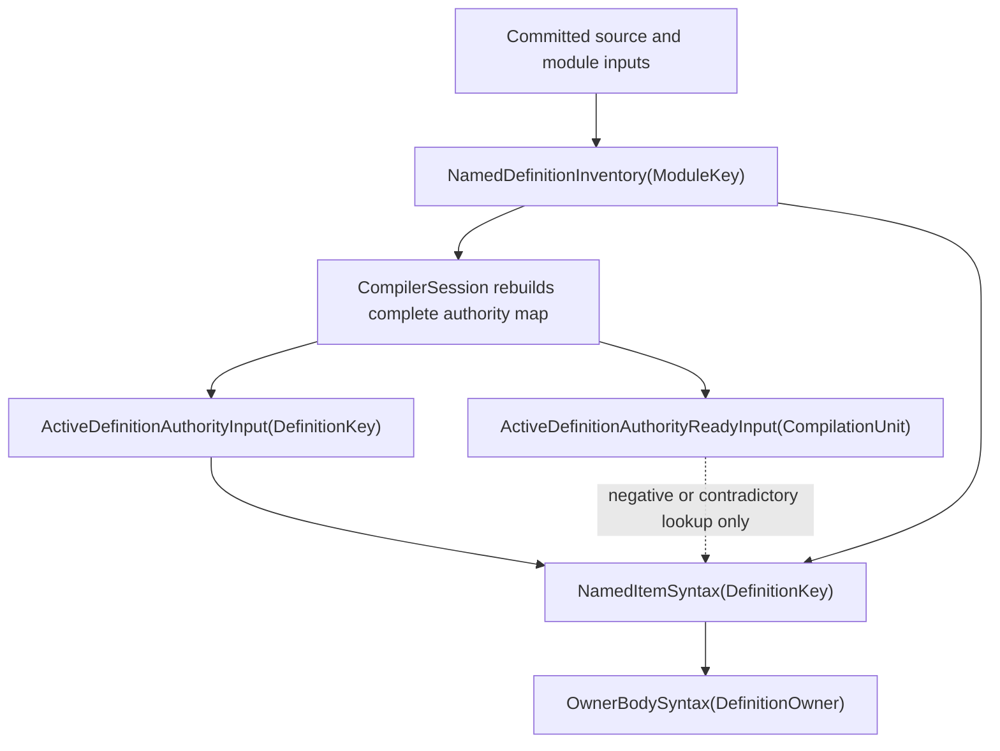
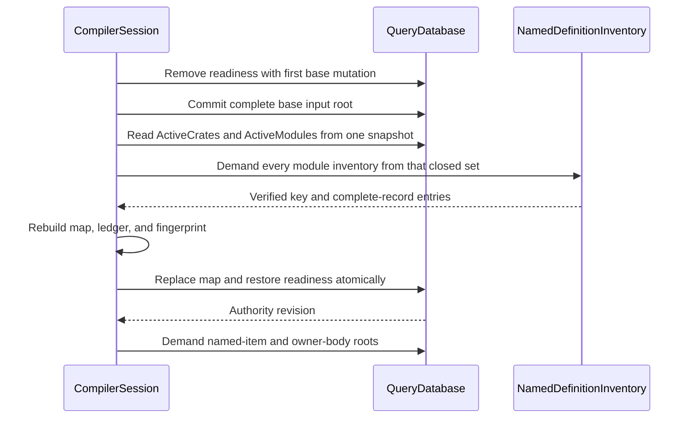

# RFC 0020: Active Definition Authority Projection

## Summary

Add the session-maintained tracked inputs
`ActiveDefinitionAuthorityInput(DefinitionKey) -> DefinitionIdentityRecord`
and one compilation-unit readiness fingerprint.
The input supplies the complete active identity preimage required to recover a
definition's owning module without scanning modules or reading ambient session
state. `CompilerSession` removes readiness before base-input mutation,
rebuilds the complete input set from verified
`NamedDefinitionInventory(ModuleKey)` results, and atomically replaces the map
and restores readiness before any named-item or owner-body root is demanded.
Consumers
must still verify exact `(DefinitionKey, DefinitionIdentityRecord)` membership
in the owning module inventory, so the projection is navigation authority and
not an independent source of semantic membership.

## Motivation

RFC 0019 specifies `NamedItemSyntax(DefinitionKey)` and
`OwnerBodySyntax(DefinitionOwner(DefinitionKey))`. A `DefinitionKey` is a
one-way 32-byte SHA-256 digest. Its complete `DefinitionIdentityRecord`, which
contains the owning `ModuleKey`, is retained by
`NamedDefinitionInventory(ModuleKey)`. The query provider therefore receives
the digest needed to select an item but not the module key needed to demand the
inventory that proves the item is active.

The missing inverse edge cannot be implemented within RFC 0017's provider
purity contract by any current authority:

- scanning every active module would create a whole-program dependency and
  make one module edit invalidate unrelated named-item queries;
- reading `CompilerSession`, a semantic identity registry, or another ambient
  collection would bypass `QueryContext` and create untracked reads;
- changing the query key to carry a module would replace the accepted RFC 0019
  public query identity; and
- trusting a digest-to-module table without the complete identity record would
  discard RFC 0018 collision authority.

Implementation must stop at this boundary rather than add a fallback path.
This RFC supplies the smallest tracked authority that preserves the accepted
query key, narrow dependencies, exact collision checks, and one production
Binder path.

## Goals

- Provide a tracked, deterministic `DefinitionKey` to owning-module
  projection for active named definitions.
- Retain the complete RFC 0018 identity record and verify its digest before it
  becomes query input.
- Define an atomic replacement protocol that removes stale definitions.
- Prevent incomplete refresh roots from authorizing missing or contradictory
  definition lookups without invalidating unchanged per-definition inputs.
- Keep `NamedDefinitionInventory` as the sole membership authority.
- Preserve RFC 0019's `OwnerBodySyntax(DefinitionOwner)` dependency on only
  `NamedItemSyntax`.
- Add native tests and architecture mutations for every new authority edge.
- Add a tracked input-only probe that represents present and absent input
  observations without converting absence into provider failure.

## Non-Goals

- Change `DefinitionKey`, `DefinitionIdentityRecord`, or stable body-owner wire
  formats.
- Add a global module scan to any query provider or verifier.
- Expose semantic identity registries through `QueryContext`.
- Add an implementation-key inverse projection; RFC 0019 owner bodies are not
  keyed by `ImplKey`.
- Persist the new input outside the current `QueryDatabase` input root.
- Add optional probing for derived queries or make ordinary required input
  reads tolerate missing values.
- Change source syntax, language semantics, diagnostics, or module selection.
- Add a compatibility query, fallback registry lookup, or dual Binder path.

## Prior Art

### rustc query inputs and dependency edges

The [rustc query guide](https://rustc-dev-guide.rust-lang.org/query.html)
models compiler work as keyed computations whose dependencies are recorded by
query reads. Its [incremental compilation guide](https://rustc-dev-guide.rust-lang.org/queries/incremental-compilation-in-detail.html)
explains red-green reuse through dependency validation rather than ambient
state inspection. ZOM should copy the explicit tracked edge and narrow
invalidation boundary. ZOM should not copy implementation-specific arena or
interning details because its stable identities require canonical bytes across
process-local handle layouts.

### Salsa tracked inputs and accumulated dependencies

The [Salsa overview](https://salsa-rs.github.io/salsa/overview.html) treats
inputs as explicit facts and derived functions as tracked reads over those
facts. Its [algorithm description](https://salsa-rs.github.io/salsa/reference/algorithm.html)
uses changed-at information and dependency validation to avoid recomputing
unchanged values. ZOM should copy the explicit input boundary and equality
backdating. The projection remains session-owned because its key cannot be
derived without first enumerating the already selected active module set.

### Bazel Skyframe graph dependencies

The [Bazel Skyframe reference](https://bazel.build/reference/skyframe) requires
evaluation functions to obtain dependencies through the graph environment and
restarts evaluation when a dependency is not yet available. ZOM should copy
the rule that graph-visible inputs and dependencies, rather than process-global
indexes, determine recomputation. ZOM does not adopt restart-based graph
discovery for this inverse key: the complete active module set is already an
explicit input, so a bounded session projection gives each named-item query a
constant-time tracked edge without introducing a whole-graph search.

### RFC 0018 complete identity authority

RFC 0018 requires inventories to retain both the digest and complete canonical
record. Equal digests with unequal records are a compiler invariant failure;
digest equality alone never proves identity equality. This RFC applies that
same rule to the inverse projection rather than weakening it to a
`DefinitionKey -> ModuleKey` map.

## Guide-Level Explanation

The query graph gains a per-definition input and a refresh-readiness barrier
between module inventory discovery and named-item demand:



For a key `d`, `NamedItemSyntax(d)` first reads the active authority input. The
record supplies module `m`. The provider then reads
`NamedDefinitionInventory(m)` and accepts the navigation result only when the
inventory contains exactly the same key and canonical record. It continues
with the selected-source, parse, and current-site reads already required by the
accepted named-item syntax contract.

Removing or replacing a definition causes the next session staging cycle to
erase the old input key before owner-body queries are demanded. No consumer
searches other modules, reads a registry, or accepts an authority record that
is not present in the current owning-module inventory.

## Reference-Level Design

### Normative amendment boundary

This RFC is the normative amendment to RFC 0017 for optional input
observation, input-presence dependency metadata, and validation of
`Present <-> Absent` transitions. RFC 0017 remains authoritative for required
reads, query values, revisions, red-green evaluation, durability, retention,
cycles, concurrency, and all other query-runtime behavior. Where RFC 0017 does
not define a non-failing tracked read of a missing input, the `probeInput`
contract below is more specific. It does not change ordinary `get`, derived
query absence, or the closed runtime-failure algebra.

### Tracked input probe

`QueryContext` gains the tracked typed operation below. `QuerySnapshot` gains
the same typed present-or-absent inspection for root tests and orchestration;
the snapshot form does not create a dependency because it has no caller query.

```text
probeInput<Spec>(key) -> Value | Absence | RuntimeFailure
```

`Spec` must be a registered input kind. Probing a derived kind, an unregistered
kind, an invalid key, a fingerprint collision, or a cancelled evaluation is a
runtime failure. A present input returns its decoded value. A missing input
returns completed deterministic `Absence`; it does not set the provider
context failure and the provider may continue with later tracked reads.
Ordinary `get<Spec>` remains unchanged and still returns
`QueryRuntimeFailure::MissingInput` for a missing required input.

Every probe appends one sequential dependency record with an explicit observed
presence alternative:

```text
InputProbeObservation = Present | Absent
```

For `Present`, the dependency retains the input's exact `changedAt` and
durability. For `Absent`, it retains the input key, `Absent`, and the input
kind's durability; no fabricated value or tombstone is added to the input root.
Memo validation repeats an input probe. A `Present <-> Absent` transition is
always red. `Present -> Present` uses ordinary `changedAt` validation.
`Absent -> Absent` is green. This proves missing-to-present and
present-to-missing invalidation without retaining every definition key ever
observed during a long-lived session.

The initial API is sequential only. `getParallel` remains unchanged and no
parallel optional-input probe is introduced by this RFC. Probe dependencies
participate in minimum-durability computation, dependency inspection, cloning,
eviction metadata, and architecture tests exactly like required dependencies.

### Query descriptor

The closed production input inventory gains this descriptor:

| Field | Contract |
|---|---|
| Query | `ActiveDefinitionAuthorityInput(DefinitionKey)` |
| Domain | `zom.query.active-definition-authority` |
| Value | Complete `DefinitionIdentityRecord` |
| Reuse class | `Semantic` |
| Input durability | `Low` |
| Equality | Exact canonical record bytes |
| Retention | Retained as part of the current complete input root |
| Provider | None |
| Cycle policy | Not applicable to an input |
| Cost | Constant lookup after session staging |

The companion readiness input has this descriptor:

| Field | Contract |
|---|---|
| Query | `ActiveDefinitionAuthorityReadyInput(CompilationUnitQueryKey::fixed())` |
| Domain | `zom.query.active-definition-authority-ready` |
| Value | `ActiveDefinitionAuthoritySetFingerprint` |
| Reuse class | `Semantic` |
| Input durability | `Low` |
| Equality | Exact 32-byte set fingerprint |
| Retention | Retained only when the current authority map is complete |
| Provider; cycle; cost | None; not applicable; constant lookup |

The fingerprint is exactly:

```text
SHA-256(
  ASCII("zom.active-definition-authority-set")
  || 0x00
  || EncodeSequence(sorted (DefinitionKey, DefinitionIdentityRecord) pairs)
)
```

Pairs are sorted by raw `DefinitionKey` bytes and encode the raw digest followed
by one bounded canonical record. The readiness value is not membership
authority and does not replace an exact inventory check. It distinguishes a
complete installed map from an in-progress or failed refresh only for negative
or contradictory lookups.

The key codec admits exactly one raw RFC 0018 `DefinitionKey` digest. The value
codec admits exactly one complete canonical `DefinitionIdentityRecord` and no
trailing bytes. Decoding is bounded by the existing four-mebibyte per-record
inventory limit and rejects invalid module encoding, invalid owner tags,
invalid owner digests, invalid definition kind or namespace, namespace-kind
mismatch, noncanonical declared names, invalid overload presence, truncation,
oversized sequences, and trailing bytes.

The value codec is structural. The session staging verifier and every consumer
that uses the value as navigation authority additionally require:

```text
DefinitionKey::compute(record) == input key
```

An equal digest with unequal complete record bytes is
`QueryRuntimeFailure::InvariantViolation`. It is never a semantic source
diagnostic and publishes no derived memo value.

### Complete authority-map construction

`CompilerSession` owns the only production staging path. Authority publication
uses a readiness barrier, base staging, reconstruction, and one atomic map
replacement:

1. The first transaction that mutates any base input in a binding cycle must
   also erase `ActiveDefinitionAuthorityReadyInput` when a ready marker exists.
   If that transaction fails, the prior complete root remains unchanged and the
   cycle stops. Once it commits, prior per-definition entries may remain
   physically retained, but the root is explicitly not a complete authority
   publication.
2. Commit the remaining external and graph-derived inputs through the existing
   staging transactions, including the package-root key, active crates,
   modules, sources, source snapshots, module dependencies, and selected module
   sources. No named-item or owner-body production root may be demanded during
   this phase.
3. Take one base snapshot after all base staging succeeds. Read
   `ActiveCratesInput(p)` from the exact staged package-root key `p`, then read
   `ActiveModulesInput(c)` for every returned crate in canonical crate order.
   Reject absence, semantic failure, runtime failure, an empty active crate
   projection, a module outside its keyed crate, a duplicate module, or a
   mismatch with `ModuleBindingOrderQuery(p)`. Flatten and sort the resulting
   closed module set by complete canonical module bytes. Session-local module
   vectors and registries are not coverage authority.
4. From the same base snapshot, demand `NamedDefinitionInventory(m)` for every
   module in that canonical closed set. Any absence, semantic failure, runtime
   failure, count mismatch, duplicate demand, or incomplete module coverage
   aborts owner-body work.
5. Independently decode every inventory entry's complete record, require its
   embedded module to equal `m`, recompute its `DefinitionKey`, and insert the
   pair into a temporary map ordered by raw digest bytes.
6. Coalesce duplicate digests only when complete canonical records are equal.
   Equal digests with unequal records abort the cycle as an invariant failure.
7. Before opening the installation transaction, construct the complete encoded
   input map, its complete next-key ledger, and its set fingerprint. Allocation
   or validation failure leaves readiness absent and stops the cycle.
8. Begin one installation transaction. Erase every key in the prior key ledger,
   then set every pair from the complete temporary map. An erase followed by an
   equal set of the same key in this one transaction must preserve the input's
   prior `changedAt`; removed keys remain erased and added keys are new. Set
   `ActiveDefinitionAuthorityReadyInput` to the prebuilt fingerprint in this
   same transaction and commit once.
9. Commit failure publishes none of the staged erases, values, or readiness and
   leaves the prior key ledger accurate for retry. After a successful commit,
   publish the prebuilt next-key ledger through a non-failing move or swap. No
   allocation or validation may occur after the database commit and before this
   ledger handoff.
10. Take a new ready snapshot and only then demand `NamedItemSyntax`,
    `NamedItemProvenance`, `ModuleBodyOwners`, `OwnerBodySyntax`, or later
    owner-body roots.

The session is the exclusive binding-cycle owner, so no production root demand
may interleave between steps 1 and 10. A failed cycle leaves either the prior
complete root when readiness removal never committed or a fail-closed
not-ready root. A not-ready root can reuse a prior entry only when the current
owning inventory proves the exact same key and complete record; a missing or
contradictory lookup observes no ready marker and publishes no semantic memo.
Existing snapshots remain immutable and continue to observe the complete root
from their own revision.



### Named-item dependency amendment

The two named-item queries use these complete descriptors. `Computed` input
durability is the minimum durability of actual provider and verifier reads.
`Reject` means any cycle is a runtime failure with no memo publication.

| Query | Domain | Reuse; input durability | Equality | Complete tracked dependencies | Verifier | Retention; cycle; cost |
|---|---|---|---|---|---|---|
| `NamedItemSyntax(DefinitionKey)` | `zom.query.named-item-syntax` | `Semantic`; Computed | complete detached named-item tree with the RFC 0019 stable-boundary census and no revision-local state | probe `ActiveDefinitionAuthorityInput(d)`; on record with module `m`, `NamedDefinitionInventory(m)`, `SelectedModuleSource(m)`; on selected source `s`, `ParseSource(s)`, `NamedImplementationInventory(m)`, `RevisionLocalDefinitionSites(m)`, and `RevisionLocalImplementationSites(m)`; only on absent or contradictory authority, probe `ActiveDefinitionAuthorityReadyInput(fixed)` | independently repeats authority mapping and exact inventory membership, selects the RFC 0018 authority occurrence, and rebuilds the detached tree and stable-boundary census without calling the producer | evictable bounded LRU; Reject; linear in the selected named-item syntax |
| `NamedItemProvenance(DefinitionKey)` | `zom.query.named-item-provenance` | `RevisionLocal`; Computed | exact current source, legal-path, AST-node, and range map; never backdated | probe `ActiveDefinitionAuthorityInput(d)`; on record with module `m`, `NamedDefinitionInventory(m)`, `SelectedModuleSource(m)`; on selected source `s`, `ParseSource(s)`, `NamedItemSyntax(d)`, `RevisionLocalDefinitionSites(m)`, and `RevisionLocalImplementationSites(m)`; only on absent or contradictory authority, probe `ActiveDefinitionAuthorityReadyInput(fixed)` | independently repeats authority mapping and exact membership, selects the RFC 0018 authority occurrence, then reconstructs total current legal-path coverage against the retained semantic tree | evictable; Reject; linear in the selected named-item syntax |

Both providers begin with this required module-recovery prefix:

1. Probe `ActiveDefinitionAuthorityInput(d)`.
2. On a value, derive module `m` only from the returned complete record, read
   `NamedDefinitionInventory(m)`, and require exact membership of
   `(d, Encode(record))` in that inventory.
3. If the authority probe is `Absence`, or if a present authority cannot be
   proved by its current owning inventory, probe
   `ActiveDefinitionAuthorityReadyInput(fixed)`.
4. When the readiness probe is `Absence`, return
   `QueryRuntimeFailure::ProviderRejected` without a semantic memo because
   refresh is incomplete. When readiness is present and the authority probe is
   `Absence`, publish canonical semantic `InactiveOwner`. When readiness is
   present and a supplied authority or inventory is contradictory, return
   `QueryRuntimeFailure::InvariantViolation`.

The positive exact-membership path does not read the readiness input. This
conditional dependency is mandatory: an equal per-definition input preserves
its prior `changedAt` and an unchanged named item does not recompute merely
because another definition changed or a refresh barrier toggled. The
independent verifier reconstructs the same branches and exact dependency set.
Cancellation, cycle, allocation, invalid codec, probe misuse, and every other
runtime failure propagate without a memo.

After exact membership succeeds, both producer and verifier filter every
`RevisionLocalDefinitionSite` whose key equals `d` and select one authority
occurrence by the complete RFC 0018 canonical source-order tuple: encoded
`SourceFileKey`, `byteStart`, `byteEnd`, and encoded `moduleSyntaxPath`. They
must compute that ordering independently and must not select the first entry of
the current site container, whose storage order is not the RFC 0018 authority
order. The earliest occurrence is the sole named-item syntax root; later equal
identity occurrences remain revision-local redeclaration evidence and never
become alternate query roots.

After the module-recovery prefix succeeds, each provider performs exactly the
remaining reads in its descriptor. `ParseSource` semantic failure becomes
`UpstreamSourceRejected`; missing selected-source authority becomes
`MissingSelectedModuleSource`; boundary or path reconstruction failures use
the applicable RFC 0019 `BoundaryMismatch`, `MalformedDetachedSyntax`,
`MissingProvenance`, `DuplicateProvenance`, `NonSelectedSource`, or
`CrossBoundaryPath` alternative. No other semantic failure is admitted.

`OwnerBodySyntax(DefinitionOwner(d))` continues to read only
`NamedItemSyntax(d)`. The new authority and inventory reads are transitive
dependencies of that named-item query and do not leak into the owner-body
provider.

### Invalidation and backdating

- A body-only or range-only edit that preserves the definition identity record
  stages an equal authority value. Its input `changedAt` is preserved.
- Adding a definition installs one new input key and does not change unrelated
  authority keys.
- Removing or renaming a definition erases its prior key. The direct authority
  probe observes `Absence`; after the atomically installed readiness
  marker proves the replacement map complete, `NamedItemSyntax` and
  `NamedItemProvenance` normalize that condition to `InactiveOwner` and cannot
  reuse the stale value memo.
- Moving a definition between modules changes the complete record and therefore
  changes its digest under RFC 0018; the old key is erased and the new key is
  installed.
- A change in another module does not invalidate `NamedItemSyntax(d)` unless
  it changes the exact authority record or owning inventory read by `d`.

### Forbidden paths

Production code and architecture gates must reject:

- iteration over all active modules inside a named-item provider or verifier;
- reads of `CompilerSession`, semantic identity registries, frozen registries,
  or retained session collections from a provider or verifier;
- ordinary required input reads followed by attempted recovery from
  `MissingInput`; optional presence must use `probeInput`;
- optional probing of derived queries or parallel optional-probe groups;
- a `DefinitionKey -> ModuleKey` value that omits the complete record;
- authority staging before complete named-definition inventories are demanded;
- active-module coverage derived from a session vector, registry, or graph
  collection instead of `ActiveCratesInput`, `ActiveModulesInput`, and
  `ModuleBindingOrderQuery` reads from one base snapshot;
- additive staging that does not erase prior active keys;
- any base-input update that occurs while the prior readiness marker remains;
- unconditional readiness reads on the positive exact-membership path;
- readiness publication outside the same transaction that installs the
  complete replacement map;
- allocation or fallible ledger construction after authority installation
  commits;
- owner-body demand before the authority replacement and readiness transaction
  commits;
- accepting digest equality without exact complete-record membership; and
- fallback to the existing batch Binder path when authority lookup fails.

## Repository Impact

| Area | Paths | Owner |
|---|---|---|
| RFC governance | `docs/rfc/**` | `rfc` |
| Stable record decoding | `products/zomlang/compiler/identity/**` | `module-system` |
| Query input and session staging | `products/zomlang/compiler/query/**`, `products/zomlang/compiler/driver/**` | `module-system` |
| Inventory membership and named-item integration | `products/zomlang/compiler/binder/**` | `binder-checker` |
| Current architecture documentation | `docs/design/architecture.md`, `docs/design/compiler-contracts.md` | `spec-audit` |
| Native tests, performance corpus, runners, and architecture gates | `products/zomlang/tests/**`, `scripts/check-incremental-query-architecture.py`, `scripts/check-binder-architecture.py`, `scripts/check-identity-architecture.py`, `scripts/check-compiler-session-architecture.py`, `scripts/run-incremental-query-benchmarks.py` | `verification` |

## Security And Safety Impact

The projection stores no new source text or external data. Bounded structural
decoding prevents oversized identity records and owner sequences from causing
unbounded allocation. Atomic replacement prevents stale definition authority
from surviving package or module changes. Complete-record comparison preserves
the compiler's fail-closed hash-collision behavior. Providers retain only
immutable query values and do not gain pointers to session-owned registries.

## Drawbacks And Risks

- Authority installation creates one additional in-memory database revision
  per binding cycle; readiness removal is folded into the first base-input
  transaction.
- The authority map duplicates complete records already retained by module
  inventories.
- Correctness depends on the session rebuilding the complete map before named
  queries; architecture gates must make this ordering non-optional.
- A future independently callable query API would need an explicit authority
  staging contract rather than assuming `CompilerSession` has prepared it.

The map is bounded by the active named-definition inventory, values are
retained only for the current input root, and no new persistence surface is
introduced.

## Alternatives Considered

### Key `NamedItemSyntax` by module and definition

`NamedItemSyntax(ModuleKey, DefinitionKey)` would make module recovery trivial
but would replace an accepted public query key and allow contradictory
module/key pairs at every call site. The complete record already defines the
module and should remain the equality authority.

### Scan all active module inventories

The provider could read `ActiveModules` and every inventory until it finds the
digest. That approach is tracked but creates whole-program dependencies and
linear work for an item-local query. It defeats the primary incremental
boundary RFC 0017 and RFC 0019 require.

### Read the semantic identity registry

The registry already maps process-local handles and retained authority, but it
is not a query input and is unavailable through `QueryContext`. Reading it
would make dependency capture incomplete and snapshots nondeterministic.

### Store only the module key

A `DefinitionKey -> ModuleKey` input is smaller but cannot prove the complete
RFC 0018 preimage or distinguish an equal-digest unequal-record collision.
Every consumer would still need an untracked authority to validate the pair.

### Add a mutable reverse index inside `QueryDatabase`

A hidden database index would introduce a second dependency mechanism outside
typed query reads and complicate snapshot isolation. The ordinary input
contract already supplies equality, changed-at tracking, retention, and stale
key erasure.

## Compatibility And Rollout

This is the compiler's sole active-definition authority projection.

Rollout order is:

1. accept this RFC;
2. create the performance runner and corpus and record the reviewed
   pre-implementation baseline;
3. add `probeInput`, `InputProbeObservation`, presence-aware dependency
   cloning and validation, root inspection, and their query-runtime tests;
4. add the bounded complete-record decoder and both authority input codecs;
5. register both inputs and implement the readiness barrier, complete
   reconstruction, and atomic replacement;
6. implement the named-item module-recovery prefix and independent verifier;
7. continue RFC 0019 Phase 3 owner-body queries on that sole path; and
8. delete any temporary implementation that scans modules or reads registries.

Rollback removes both authority input kinds, readiness and key-ledger staging,
named-item dependencies, probe-specific tests, and performance cases together
before any persisted schema exists. If no other accepted caller uses
`probeInput`, rollback also removes `probeInput`, `InputProbeObservation`, and
presence-aware dependency metadata and validation; no unused query-runtime
surface remains. If another accepted RFC has adopted the API, rollback must
retain that governed caller and cannot silently strand or delete its contract.
No generated source or user data migration is required.

## Documentation And Teaching Plan

- Add this RFC and its review and implementation tracker to the RFC index.
- Record the RFC 0019 Phase 3 blocker and its resolution evidence in the RFC
  0019 tracker.
- Update current architecture documentation only when the implementation
  lands. `docs/design/architecture.md` must describe the authority projection
  as the sole module-recovery path. `docs/design/compiler-contracts.md` must
  define the input-only `probeInput` scope, `Present` and `Absent` dependency
  observations, both transition-validation directions, sequential-only
  restriction, and unchanged required-`get` behavior. Neither document may
  preserve a comparison with prior designs.

## Operational Readiness

The input is in-memory and session-local. This RFC must create the currently
missing RFC 0017 performance runner, corpus manifest, and reviewed baseline at
`scripts/run-incremental-query-benchmarks.py`,
`products/zomlang/tests/performance/incremental-query-corpus.json`, and
`products/zomlang/tests/performance/incremental-query-baseline.json`. The
corpus includes definition-heavy clean compilation, equal body-only edits,
definition add/remove/rename, and unrelated-module edits. The runner rejects a
machine, build, worker-count, or corpus mismatch and enforces RFC 0017's warmup,
sample, noise, elapsed-time, RSS, and exact hot-edit execution-set contract.
The runner and corpus land before product implementation. The verification
owner records a baseline from a detached clean worktree at the exact
pre-implementation revision, with release flags, repository and compiler build
identity, OS, architecture, CPU, logical cores, physical memory, worker count,
and corpus digests embedded in the baseline. Baseline review occurs before any
authority product source is changed; comparison occurs after the final product
snapshot on the same machine, corpus, flags, and worker count.
No cache migration, runtime service, telemetry pipeline, or release operator
action is required.

## Acceptance Criteria

- Every required owner approves one exact REVIEW snapshot.
- `QueryContext::probeInput` records present or absent observations only for
  input kinds, and `QuerySnapshot::probeInput` exposes the same root-inspection
  result without a caller dependency; native tests prove absent-to-present,
  present-to-absent, absent-to-absent, and present-value change validation
  without context poisoning or tombstone retention.
- `DefinitionIdentityRecord` has a strict bounded standalone decoder with
  positive, malformed, oversized, truncation, and trailing-byte tests.
- `ActiveDefinitionAuthorityInput` and
  `ActiveDefinitionAuthorityReadyInput` are registered with the exact
  descriptors in this RFC and reject malformed keys and values.
- `CompilerSession` rebuilds and atomically replaces the complete active map
  after demanding every active named-definition inventory.
- Stale keys are erased and equal values preserve `changedAt`.
- Named-item providers and independent verifiers recover the module only from
  the tracked input, prove exact owning-inventory membership, and independently
  select the RFC 0018 authority occurrence.
- RFC 0019 owner-body roots are never demanded before authority staging.
- `active-definition-authority-query-test` covers add, remove, delete-and-add,
  rename, cross-module, body-only, range-only, missing input, malformed record,
  duplicate-equal, digest collision, active-module-set shrink, inventory
  absence/failure, aborted installation, stale-ledger retry, and old-snapshot
  concurrent demand cases.
- The focused differential test asserts exact executed, backdated-equal,
  changed, and unread query-instance sets and byte-compares reused-database
  named-item values with a fresh database after every edit. It repeats every
  case with worker counts `1`, `2`, and `8` and requires byte-identical values,
  dependency groups, and exact execution sets. The broader RFC 0019 owner-body
  differential corpus remains Phase 6 work and is not claimed as existing
  evidence by this RFC.
- The incremental-query architecture gate and adversarial self-test reject
  every forbidden path listed above.
- Sanitizer build, relevant unit tests, complete CTest, RFC checks, format, and
  diff checks pass.
- RFC 0019 tracking records the unblocked Phase 3 evidence before this RFC
  moves to `LANDED`.

## Implementation Plan

1. Create the RFC 0017 performance runner and corpus, capture the reviewed
   pre-implementation baseline from a detached clean worktree, and freeze its
   metadata before product changes.
2. Add the tracked sequential input-probe API, presence-aware dependency
   validation, and native query-runtime tests.
3. Add bounded canonical decoding for complete definition records and owner
   elements.
4. Define and register both active-definition authority inputs.
5. Add session-owned readiness, complete-map reconstruction, stale-key
   replacement, and non-failing ledger publication.
6. Add named-item syntax and provenance module-recovery and authority-occurrence
   dependencies.
7. Add native codec, transaction, provider, focused differential, and
   production-session tests.
8. Extend incremental-query, Binder, identity, and CompilerSession mutation
   gates.
9. Continue RFC 0019 owner-body query implementation on the new authority.
10. Compare the final implementation with the reviewed baseline and record
   full-gate and landing evidence.

## Test Plan

- Build: `cmake --preset sanitizer` and `cmake --build --preset sanitizer`.
- Unit tests: `definition-key-test`,
  `incremental-binding-query-adapter-test`,
  `active-definition-authority-query-test`, `query-database-test`, and
  `module-discovery-test` through `ctest --preset default -L unittest
  --output-on-failure`.
- Query-runtime probe tests: required `get` still fails on missing input;
  `probeInput` returns tracked absence without poisoning later reads; validation
  covers `Absent -> Present`, `Present -> Absent`, `Absent -> Absent`, and
  changed and equal `Present -> Present`; dependency inspection exposes the
  observed presence alternative; probing a derived kind and parallel probing
  are rejected.
- Lit tests: `ctest --preset default -L lit`; no new syntax expectation is
  required because source behavior is unchanged.
- Conformance: the focused native authority test performs exact-trace and
  fresh-database equivalence for named-item values. RFC 0019's
  `owner-body-query-differential-test` remains required before RFC 0019 Phase 6
  completes but is not a prerequisite for landing this authority projection.
  Run the focused test with worker counts `1`, `2`, and `8`; each permutation
  must produce identical canonical values, dependency groups, and exact
  executed, backdated-equal, changed, and unread sets.
- Architecture: run all eight commands:
  `python3 scripts/check-incremental-query-architecture.py --check`,
  `python3 scripts/check-incremental-query-architecture.py --self-test`,
  `python3 scripts/check-binder-architecture.py --check`,
  `python3 scripts/check-binder-architecture.py --self-test`,
  `python3 scripts/check-identity-architecture.py --check`,
  `python3 scripts/check-identity-architecture.py --self-test`,
  `python3 scripts/check-compiler-session-architecture.py --check`, and
  `python3 scripts/check-compiler-session-architecture.py --self-test`.
- Verification infrastructure:
  `python3 scripts/check-diagnostic-coverage.py --check`,
  `python3 scripts/check-diagnostic-coverage.py --self-test`,
  `python3 scripts/check-lit-exec-root.py --check`, and
  `python3 scripts/check-lit-exec-root.py --self-test`.
- Performance baseline, before product implementation: create a detached clean
  worktree at the exact pre-implementation revision, run `cmake --preset
  release` and `cmake --build --preset release` there, then run
  `python3 scripts/run-incremental-query-benchmarks.py --repository
  /tmp/zom-rfc0020-baseline --build-dir
  /tmp/zom-rfc0020-baseline/build-release --corpus
  products/zomlang/tests/performance/incremental-query-corpus.json --baseline
  products/zomlang/tests/performance/incremental-query-baseline.json
  --worker-count 8 --record-baseline`. The verification owner reviews and
  freezes the recorded revision, machine, flags, worker, compiler identity, and
  corpus digest metadata before product files change.
- Performance comparison, after implementation: `cmake --preset release`,
  `cmake --build --preset release`, then
  `python3 scripts/run-incremental-query-benchmarks.py --repository .
  --build-dir build-release
  --corpus products/zomlang/tests/performance/incremental-query-corpus.json
  --baseline products/zomlang/tests/performance/incremental-query-baseline.json
  --worker-count 8 --compare`. The runner rejects a machine, compiler flags,
  worker count, or corpus mismatch.
- RFC: `python3 scripts/check-rfc.py`.
- Generated files: none.
- Format: `python3 scripts/check-format.py` and `git diff --check`.
- Full regression: `ctest --preset default --output-on-failure`.

## Open Questions

None

## Status History

| Date | Status | Notes |
|---|---|---|
| 2026-07-20 | DRAFT | Initial proposal after the RFC 0019 inverse-key implementation blocker was verified. |
| 2026-07-20 | REVIEW | Entered exact-snapshot owner review after all required owners approved DRAFT readiness. |
| 2026-07-20 | ACCEPTED | All required owners approved REVIEW snapshot `4b06c2b2...4b84bfe`. |
| 2026-07-20 | IMPLEMENTING | Implementation started after accepted exact-snapshot review. |
